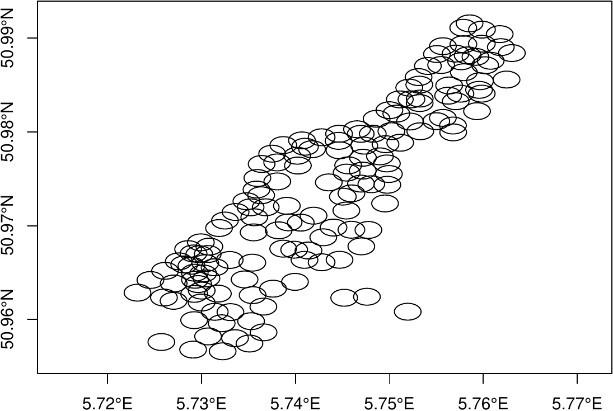

::: article
# Introduction

R has become an important tool for manipulating, analyzing, and
displaying spatial (vector and raster) datasets. R has a growing set of
contributed packages (see the CRAN
[*Spatial*](https://CRAN.R-project.org/view=Spatial) task view). R can
already import and export stand-alone vector (e.g, ESRI shapefiles) with
relative ease using
[***rgdal***](https://CRAN.R-project.org/package=rgdal) [@rgdal] or
[***maptools***](https://CRAN.R-project.org/package=maptools)
[@maptools], and raster datasets using
[***raster***](https://CRAN.R-project.org/package=raster) [@raster].
With the proliferation and availability of geographic data from deployed
sensors, open-GIS web data sources, and remotely-sensed environmental
datasets (to name just a few), users are increasingly taking advantage
of Database Management Systems (DBMS) with spatial database extenders,
which store spatial data as an object in a database table column. DBMS
are especially useful to researchers and scientists managing project
datasets, due to the ability to store large amounts of data efficiently,
specify data relationships among tables, maintain data integrity using
constraints, ensure long-term storage, manage multiple users, and add,
update, and retrieve data efficiently.

**PostgreSQL** [@PostgreSQL] is an advanced relational DBMS, and it is
also free and open-source, making it popular and accessible to a large
base of users. The PostgreSQL extension **PostGIS** [@postgis] allows
PostgreSQL to handle spatial data by introducing spatial data types
(Geometry, Geography, Raster, and Topology), along with a library of
functions which operate on objects of these types. For R users, the
package
[***RPostgreSQL***](https://CRAN.R-project.org/package=RPostgreSQL)
[@RPostgreSQL], a backend for the generic R database interface package
[***DBI***](https://CRAN.R-project.org/package=DBI) [@DBI], provides the
driver and methods to connect and interface with a PostgreSQL database,
to do a variety of data import and export tasks, and to query the
database. However, not all data types supported by PostgreSQL can be
imported into equivalent R data types using ***RPostgreSQL***; among
these are the PostGIS spatial data types. In addition, some data types
in R possess attributes (e.g., POSIX\* time zones), which are not
handled by ***RPostgreSQL*** reading and writing. Finally, while
***RPostgreSQL*** is an essential tool for users of PostgreSQL databases
and R, it is not designed to facilitate new database users, who may not
be familiar with database techniques, terminology, or Structured Query
Language (SQL), the language used to interact with a DBMS.

Noting these gaps, we designed
[***rpostgis***](https://CRAN.R-project.org/package=rpostgis) as a
general-purpose extension package for ***RPostgreSQL***. The primary
goal of ***rpostgis*** is to provide spatial data handling between R and
PostGIS, and as such, it includes methods for bi-directional transfer of
both vector and raster spatial datasets between R and PostGIS, spatial
projection handling, and other PostGIS-related tools. In addition, the
package also features methods for users who wish to work primarily (or
exclusively) in R, including saving of R `"data.frame"`s (including data
types and attributes) to PostgreSQL, and "SQL wrapper" functions which
execute common database procedures. The latter provide not only
convenient, script-able access to these procedures through R, but also
can function as learning tools for new users of DBMS and SQL. In this
paper, we explain and demonstrate the purpose and usage of
***rpostgis*** functions within a general workflow, following the three
focal areas described above (PostGIS-specific, `"data.frame"` handling,
and SQL wrappers).

# Background

## PostgreSQL and rpostgis basics

While it is far beyond the scope of this paper to provide a complete
introduction to PostgreSQL, it is important to introduce several basic
features of the DBMS, and the common terms we use to refer to them,
especially concerning their usage in ***rpostgis***.

A PostgreSQL install creates a PostgreSQL server, which is the host of
one or more databases. Databases within a server are self contained
(data cannot be shared across databases). Users interact with the
database server using Structured Query Language (SQL) to write queries.
Within a database, there are one or more named schemas, which are
collections of database objects. In PostgreSQL, on new database
creation, a default schema is created in the database with the name
**public**.

Schemas can be used to organize objects in a database. Schemas can
contain many different objects, including functions, data types, and
sequences; the objects which users of ***rpostgis*** should be most
aware of are tables and views. Tables store data, while standard views
only store an SQL query, that when executed, creates a virtual table (in
memory), using data from other tables or views. There is no functional
difference between how tables and views (which both fall under the
umbrella term relation) are referred to within a query, with the
convention being `schema_name.relation_name`. Relations typically
contain one or more columns, and each column has a defined data type
(e.g., integer, character, timestamp with time zone), and optionally a
defined sub-type, that specifies what type of data the column can
contain. A column can also store records representing a spatial type,
which is described in the next section. Relations have 0 or more
records, or rows, which contain the data.

In ***rpostgis***, most functions perform an action on a relation.
Following ***RPostgreSQL*** convention, the relation name is supplied to
the argument `name`, which can be given either a length-one or
length-two character vector. One-length character elements are
interpreted as a relation name, and looked for in the default user
schema(s) (by default, `public`). Length-two character vectors are
interpreted as schema and relation name, e.g.,
`name = c("schema_name","table_name")`. It is generally recommended to
provide both schema and relation name, since identical relation names
can be re-used across schemas. For ease of reading, from this point on
we refer to relations (tables and views) generally as "tables"
throughout this paper.

This brief summary should provide the new user with enough terminology
to understand this paper, and begin working with databases using
***rpostgis***. New users are encouraged to learn more about PostgreSQL
from its excellent online documentation
(<https://www.postgresql.org/docs/manuals/>).

## Spatial objects in PostGIS and R

Vector spatial data in PostGIS tables are stored as **GEOMETRY**
(planar) or **GEOGRAPHY** (spherical) types in a column, and usually
have a specified sub-type, such as **POINT**, **LINESTRING**, or
**POLYGON**. Each record of a GEOMETRY/GEOGRAPHY column represents one
spatial feature, which represents one or more geometric objects. Records
containing multiple geometric objects in one feature are specified as a
**MULTI** sub-type (e.g., **MULTIPOLYGON**). Geometry and geography
columns can also store a spatial reference identifier (**SRID**)
attribute, which is an integer value referring to the spatial reference
system (the "projection") of the spatial data. Since spherical data are
represented using geographic longitude/latitude coordinates on the
sphere (specifically, the spheroid defined by WGS 84), the Geography
data type is restricted to `SRID = 4326`.

Raster spatial data are stored in PostGIS using the **RASTER** data
type. Raster columns also can store an SRID attribute defining the
projection of the raster. One raster record can store one or more
**bands** (rasters with identical spatial coverage but different data).
In PostGIS, it is common to store one raster dataset in one PostGIS
table, but split the raster into multiple **tiles**. A raster tile is
one rectangular spatial subset, or block, of a raster dataset. One tile
of a PostGIS raster type corresponds with one record in the
corresponding table. Storing rasters in this way allows for more
efficient spatial queries on the raster, by working on subsets of the
raster.

Geometry, geography, and raster data types can all be exported from
PostGIS using a variety of supplied export functions. In addition, the
PostGIS library contains a large set of GIS functions to manage,
construct, and edit Geometry objects, as well as measure spatial
relationships between geometries, making it a full-featured GIS system.
However, PostgreSQL/PostGIS is not packaged with a native software to
visualize spatial data, so most users employ 3rd-party software to
access the database whenever visualization is needed. For spatial data,
desktop GIS systems like **ArcGIS** [@arcgis] and **QGIS** [@QGIS] can
load spatial data directly as layers in the mapping environment, where
users can take advantage of tools available in those software.

Because of its advanced statistical, processing, and visualization
capabilities, many users employ R as a front-end for their database
systems. In R, the long-time standard for handling vector spatial
objects are `"Spatial*"` classes (e.g., `"SpatialPoints"`,
`"SpatialMultiPoints"`, `"SpatialLines"`, and `"SpatialPolygons"` and
their `"Spatial*DataFrame"` variants) provided by the package
[***sp***](https://CRAN.R-project.org/package=sp) [@sp]. Likewise the
***raster*** package provides standard methods for handling raster
datasets in R, in `"Raster*"` classes (e.g., `"RasterLayer"` for
single-band, `"RasterBrick"` or `"RasterStack"` for multi-band rasters).
There are several notable packages and utilities that assist in transfer
of spatial data between PostGIS and ***sp*** `"Spatial*"`-objects or
`"Raster*"`-objects in R:

1.  ***rgdal*** : The R package providing bindings to GDAL (Geospatial
    Data Abstraction Library) provides the functions `readOGR` and
    `writeOGR` to read, and write, respectively, PostGIS tables with
    `GEOMETRY` columns and R `"Spatial*"` objects. A limitation of
    `readOGR` is that it cannot query the database table to obtain only
    a subset of the table; similarly `writeOGR` can only write new
    tables (or overwrite existing ones); it does not allow writing to
    existing database tables. The ***rgdal*** package also provides
    methods for reading rasters from PostGIS tables with `readGDAL`,
    though GDAL writing of rasters to PostGIS tables is (as of writing)
    not available, but potentially still under development
    (<https://trac.osgeo.org/gdal/wiki/frmts_wtkraster.html>). One major
    drawback of this solution is that the PostGIS driver for ***rgdal***
    is not included by default on Windows operating systems, meaning
    most Windows users cannot use these methods without manually
    installing ***rgdal*** from source.

2.  [***rgeos***](https://CRAN.R-project.org/package=rgeos) [@rgeos]:
    The functions `readWKT` and `writeWKT` provide conversion between
    the WKT format and `"Spatial*"`-objects. WKT format "well-known
    text" is a standardized, text-based version of a vector geometry,
    which can be written and read using PostGIS functions.

3.  [***wkb***](https://CRAN.R-project.org/package=wkb) [@wkb]: The R
    package offers the functions `readWKB` and `writeWKB` functions,
    which convert vector geometries to and from the WKB format
    ("well-Known binary").

4.  Alternatively, it is possible to use system calls to command-line
    utilities such as ogr2ogr, shp2pgsql or raster2pgsql, which brings
    the full power of these utilities at the expense of additional
    complexity, especially for scripting: This solution mixes two
    syntaxes (R syntax and the one of the command-line utility) and
    requires the passing of passwords at every call.

Read and write functions from both ***rgeos*** and ***wkb*** are
utilized in ***rpostgis*** import/export functions to provide the
translations of geometries from and to R's `"Spatial*"` objects. The
***rpostgis*** functions wrap additional functionality around these
low-level functions in the vector data export (`pgInsert`) and import
(`pgGetGeom`) functions, to ease data transferability and managed data
stored alongside vector geometries in R `"data.frame"`s or PostGIS
tables.

Also of importance is the recently developed package
[***sf***](https://CRAN.R-project.org/package=sf) [@sf], which provides
Simple Features access in R, for vector spatial data. Simple Features is
an Open Geospatial Consortium (OGC) and International Organization for
Standardization (ISO) standard for storing and accessing geometry
objects, and is used by many RDBMS, including PostGIS. Like ***sp***,
***sf*** provides standardized, comprehensive spatial data handling in
R, notably using a `"data.frame"` with a geometry-list column to store
Simple Feature objects, instead of the various `"Spatial*"` classes
utilized in ***sp***. The ***sf*** package also provides its own
functions for reading and writing geometries from PostGIS databases,
both through GDAL (using `st_read`/`st_write`) and directly (using
`st_read_db`/`st_write_db`). At the time of writing, ***rpostgis***
reads from and writes to ***sp***-class `"Spatial*"` objects, though we
anticipate a migration to ***sf***-class objects as they become the new
standard for vector spatial data in R.

## A note on permissions and privileges

A proper administration of a database, especially in a multi-user
context, requires a consideration of the permissions given to users to
access, write, or modify the database and its various objects. While it
is beyond the scope of this paper to provide an exhaustive presentation
of the issue, it is worth introducing the basic concepts from a
PostgreSQL perspective: permissions on a database object are called
"privileges," and there are several different ones, allowing to access
(`SELECT`) or modify them (`INSERT`, `UPDATE`), or even to create or
delete them (`CREATE` and `DELETE`, respectively), among others. By
default, the owner of an object (the user who created the object) and
superusers (generally the DBMS administrator(s)) can do anything with
it: they are granted all privileges on this object. PostgreSQL uses the
functions `GRANT` and `REVOKE` to assign or revoke privileges of a
certain user on a database object. We refer the interested reader (and
the database administrator) to the official PostgreSQL documentation for
more details about privileges.

Database privileges for a given user are not different by accessing the
database through a connection from R, although it adds a layer of
complexity as there will be R users and PostgreSQL users mixed in a
session (as well as system users, which are distinct from database
users, and we do not consider here purposely). In other words, an R user
could have different privileges on the database and its objects
depending on the PostgreSQL user they use to connect to the database. In
this paper, we will use the default PostgreSQL superuser `postgres`,
which thus comes with all privileges granted on all database objects.
This approach is fine for many use cases, especially single-user
databases, but will be limited on multi-user databases, where privileges
are set up at a finer grain. In general, all ***rpostgis*** functions
that create, modify, or drop an object (e.g., `dbIndex`, `dbAsDate`,
`dbDrop`) require ownership of the object being modified (so they
require the appropriate `CREATE` privileges). In addition, we
specifically indicate special privileges that are necessary for the
different functions of ***rpostgis*** when relevant.

# PostGIS-specific functions

In the following two sections, we explain the main functionality and
usage of the ***rpostgis*** package. Note that functions within
***rpostgis*** have one of two prefixes: "`pg*`" (for PostGIS-oriented
functions, described in this section) and "`db*`" (for general
PostgreSQL database functions, described in the next section), emulating
the pattern established by ***DBI***. The general presentation of the
functions consist of (1) a code block presenting the generic version of
the function(s) with all arguments and defaults listed, as well as
specific privileges required, (2) descriptive text about the
function(s), and in most cases (3) example calls of the function(s).

In this section, we use the term "PostGIS" generically to refer to the
PostgreSQL/PostGIS DBMS; that is, PostgreSQL with the PostGIS extension
installed. All usage of PostGIS within R begins with a connection to a
database server and a particular database: here, using
`RPostgreSQL::dbConnect`, we connect to the database `rpostgis` which
exists on the local computer/server (`localhost`):

``` r
> library(rpostgis)
> conn <- dbConnect(drv = "PostgreSQL", host = "localhost", dbname = "rpostgis", 
+     user = "postgres", password = "postgres_password")
```

It is not the purpose of this article to detail connection details, so
we refer to documentation from ***DBI*** and ***RPostgreSQL*** for this
aspect.

## PostGIS management

### Check and create PostGIS extension: `pgPostGIS` {#check-and-create-postgis-extension}

``` r
> pgPostGIS(conn, topology = FALSE, tiger = FALSE, sfcgal = FALSE, 
+     display = TRUE, exec = TRUE)
```

> *Special privileges:* `pgPostGIS` requires ownership of the database
> (or superuser role) to install the extension (`CREATE EXTENSION`) the
> first time.

The "starter" function for new users of ***rpostgis*** is `pgPostGIS`.
This function installs and/or checks the version of PostGIS currently
available on the database. This is the first example of a function in
***rpostgis*** which implements the `display` and `exec` arguments.
These respectively control printing (to the R console) of the
constructed SQL query, and execution of the query on the database. When
PostGIS is installed and ready to use, `pgPostGIS` returns `TRUE`. A
standard in ***rpostgis***: is when a function does not return an
object, the function returns `TRUE` if the action was successfully
executed in the database. Note that you can also enable the Topology,
Tiger Geocoder, and SFCGAL extensions, with `topology`, `tiger`, and
`sfcgal` arguments set to `TRUE`.

### List geometries/rasters: `pgListGeom` and `pgListRast` {#list-geometriesrasters-and}

``` r
> pgListGeom(conn, geog = TRUE)
> pgListRast(conn)
```

These `pgList*` functions return information on GEOMETRY/GEOGRAPHY and
RASTER columns stored in any database table. In a PostGIS database,
these information are stored in three views (`geometry_columns`,
`geography_columns`, and `raster_columns`, respectively), all of which
are created during the installation of PostGIS in the `public` schema of
the database.

### Find (or create) PostGIS SRID based on CRS object: `pgSRID` {#find-or-create-postgis-srid-based-on-crs-object}

``` r
> pgSRID(conn, crs, create.srid = FALSE, new.srid = NULL)
```

> *Special privileges:* `pgSRID` requires `INSERT` privilege on the
> `spatial_ref_sys` table with `create.srid = TRUE`.

On installation of PostGIS, a new table `spatial_ref_sys` is created in
the `public` schema, which stores a large set of spatial reference
systems, each of which has a unique (integer) spatial reference
identifier (SRID), along with specifications of the projection in
*PROJ.4* and *WKT*. The function `pgSRID` allows users to check if a
projection they are using in R (stored as a `"sp::CRS"` object, which
contains the *PROJ.4* representation of the projection) has matching
SRID(s) in PostGIS. If there is no match and `create.srid = TRUE`, then
`pgSRID` adds it to the `spatial_ref_sys` table. In these cases, the
user can also specify a desired SRID with `new.srid`; otherwise,
***rpostgis*** uses the next available value between 880001 and 889999.
In the following example, we demonstrate how to find the SRID for the
common WGS 1984 latitude/longitude projection:

``` r
> crs <- sp::CRS("+proj=longlat +datum=WGS84 +no_defs +ellps=WGS84 +towgs84=0,0,0")
> pgSRID(conn, crs)
```

``` r
[1] 4326
```

In some cases, `pgSRID` may return multiple SRIDs, since there are
equivalent projections stored in multiple SRIDs in the `spatial_ref_sys`
table. Note that `pgSRID` is used in spatial data writing functions in
***rpostgis***, with `create.srid = TRUE`.

## Spatial data transfer

The following section describes the functions in ***rpostgis*** that
transfer spatial data between R and PostGIS databases (Table
[1](#tab:rpostgis-functions) contains a summary of all data transfer
functions, including for non-spatial data). Outside of `conn` and `name`
(discussed previously), there are several other arguments re-used across
functions, which have consistent default values:

-   `geom`: this is the column name in the PostGIS table containing a
    Geometry or Geography data type. Defaults to `"geom"`.

-   `rast`: this is the column name in the PostGIS table containing a
    Raster data type. Defaults to `"rast"`.

-   `overwrite`: in writing to database functions, this defaults to
    `FALSE`; `overwrite = TRUE` allows the user to delete (`DROP`) the
    existing table and create a new one.

::: {#tab:rpostgis-functions}
  -----------------------------------------------------------------------------------------------------------------------------------------------------------------------------------------------------------------------------------------------------------------------------------------------
  Function             Reads from:                                                                                                                                   Writes to:
  -------------------- --------------------------------------------------------------------------------------------------------------------------------------------- ----------------------------------------------------------------------------------------------------------------------------
  `pgInsert`           `"Spatial*"`, `"Spatial*DataFrame"`, `"data.frame"`                                                                                           new or existing database table (with GEOMETRY or GEOGRAPHY column for spatial objects)

  `pgWriteRast`        `"RasterLayer"`, `"RasterBrick"`, `"RasterStack"`, `"SpatialPixels"`, `"SpatialPixelsDataFrame"`, `"SpatialGrid"`, `"SpatialGridDataFrame"`   new database table

  `dbWriteDataFrame`   `"data.frame"`                                                                                                                                new database table

  `pgGetGeom`          database table/view with GEOMETRY or GEOGRAPHY column                                                                                         `"Spatial*"`, `"Spatial*DataFrame"`

  `pgGetRast`          database table/view with RASTER column                                                                                                        `"RasterLayer"`, `"RasterBrick"`, `"SpatialPixels"`, `"SpatialPixelsDataFrame"`, `"SpatialGrid"`, `"SpatialGridDataFrame"`

  `pgGetBoundary`      database table/view with GEOMETRY, GEOGRAPHY, or RASTER column                                                                                `"SpatialPolygons"`

  `dbReadDataFrame`    database table/view                                                                                                                           `"data.frame"`
  -----------------------------------------------------------------------------------------------------------------------------------------------------------------------------------------------------------------------------------------------------------------------------------------------

  : Table 1: Functions for data transfer between R and
  PostgreSQL/PostGIS in ***rpostgis***.
:::

In this section we begin to use example datasets. We first load the
well-known `meuse` dataset containing information on environmental
observations from sample points along the Meuse river in the
Netherlands. After loading the data, we create a
`"SpatialPointsDataFrame"` object, setting its associated projection
(oblique stereographic for the Netherlands, i.e. EPSG 28992) as the
`proj4string` attribute, which is a standardized character
representation of the projection of class `"CRS"`:

``` r
> library(sp)
> data("meuse")
> meuse <- SpatialPointsDataFrame(meuse[, 1:2], data = meuse[, 
+     3:length(meuse)], proj4string = sp::CRS("+init=epsg:28992"))
> class(meuse)
```

``` r
[1] "SpatialPointsDataFrame"
attr(,"package")
[1] "sp"
```

``` r
> head(meuse@data)
```

``` r
  cadmium copper lead zinc  elev       dist   om ffreq soil lime landuse
1    11.7     85  299 1022 7.909 0.00135803 13.6     1    1    1      Ah
2     8.6     81  277 1141 6.983 0.01222430 14.0     1    1    1      Ah
3     6.5     68  199  640 7.800 0.10302900 13.0     1    1    1      Ah
4     2.6     81  116  257 7.655 0.19009400  8.0     1    2    0      Ga
5     2.8     48  117  269 7.480 0.27709000  8.7     1    2    0      Ah
6     3.0     61  137  281 7.791 0.36406700  7.8     1    2    0      Ga
  dist.m
1     50
2     30
3    150
4    270
5    380
6    470
```

### Vector spatial data: `pgInsert` and `pgGetGeom` {#vector-spatial-data-and}

``` r
> pgInsert(conn, name, data.obj, geom = "geom", df.mode = FALSE, 
+     partial.match = FALSE, overwrite = FALSE, new.id = NULL, 
+     row.names = FALSE, upsert.using = NULL, alter.names = FALSE, 
+     encoding = NULL, return.pgi = FALSE, df.geom = NULL, geog = FALSE)
```

> *Special privileges:* `pgInsert` requires `CREATE` privilege in schema
> for new tables, `INSERT` privilege on existing tables, and `UPDATE`
> privilege when using `upsert.using` argument.

As evidenced by the large number of possible arguments, `pgInsert` is a
flexible function that aims to provide a variety of methods for PostGIS
`INSERT`s, from data originating in R as an object of class
`"Spatial*"`, `"Spatial*DataFrame"`, or `"data.frame"`. The most basic
usage requires just a PostgreSQL connection, a database table name to
insert into, and a data object of one of the three types. In our
example, we also utilize the `new.id` argument, providing a new column
name for a sequential ID (`"gid"`):

``` r
> pgInsert(conn, "meuse", meuse, new.id = "gid")
```

``` r
Creating new table...
```

``` r
Using writeWKB from wkb package...
```

``` r
Data inserted into table "public"."meuse"
```

``` r
[1] TRUE
```

The data was inserted into the new database table `meuse_sp` in the
`public` schema, printing out several informative messages, including an
indication that `wkb::writeWKB` was used to convert spatial objects to
well-known binary in order to write to the database (if the optional
package ***wkb*** is not installed, `rgeos::writeWKT` is used instead).
So that is clear to users how and where data is written to the database,
`pgInsert` is a fairly verbose function---however, these messages can be
hidden by wrapping the function call within `suppressMessages(...)`.

Since `pgInsert` can also insert into existing tables, a `partial.match`
argument allows specifying if all columns in the R object must be
present in the database in order to do the insert. The default is
`partial.match = FALSE`, meaning if any column is found in the R object
but not in the database table, an error is printed and no data is
written in the database. Note that the check is
uni-directional---database table columns not found in the R data object
do not affect the insert, except if the database column definition
requires that it have assigned values (e.g., `NOT NULL` with no assigned
`DEFAULT` value).

``` r
> pgGetGeom(conn, name, geom = "geom", gid = NULL, other.cols = TRUE, 
+     clauses = NULL, boundary = NULL, query = NULL)
```

> *Special privileges:* `pgGetGeom` requires `SELECT` on the table, and
> `CREATE` in the schema to create a new view when both `query` and
> `name` are not null

`pgGetGeom` returns vector spatial data from a PostGIS table storing a
Geometry or Geography---the column name of either type can be supplied
to the `geom` column. We can retrieve the full `meuse` table which we
just wrote to the database, demonstrating the most basic use of the
function:

``` r
> meuse.db <- pgGetGeom(conn, "meuse")
```

``` r
Returning Point types in SpatialPoints*-class.
```

A message prints the type of `"Spatial*"` class that is created in R.
The `other.cols` argument can be a vector of character names of database
table columns, indicating which (if any) columns to return with the
spatial data. The default is the full table (all columns), but
`other.cols = FALSE` returns the spatial data only (i.e., a `"Spatial*"`
object). The `clauses` argument can take additional SQL to modify the
data to take from the table. For instance, using a `WHERE` clause allows
filtering results based on specific filter, as long as it is valid SQL
(in this case, indexing the filtering column will significantly speed up
the query; see the section "Create an index: `dbIndex`" below).
Conversely, a full SQL query can be provided using the `query` argument;
in this case the `names` argument can be `NULL`, or set to the name of a
(new) view to create in the database using the specified `query`. This
is the method to use when it is necessary to combine multiple database
tables and return a geometry, or use PostGIS functions within a query,
which highlights the potential of ***rpostgis*** for complex GIS
operations in the database.

For example, we can use the PostGIS function `ST_Buffer` to create 100-m
buffers around points in our `meuse` table, and then transform the layer
to another projection using `ST_Transform`, with `SRID = 4326` (WGS
1984, lat-lon). Note that we specified the output geometry in the SQL
query `AS geom`, which is the default name for GEOMETRY columns for
`pgGetGeom`. This query returns only the original points ID (`gid`) and
a GEOMETRY column that can be directly loaded into a `"SpatialPolygons"`
object using `pgGetGeom`. Since we specify `gid` as the unique ID for
`meuse.buff` (using `gid = "gid"`), and there are no other columns of
data to import, there is no data frame associated with this object. We
can then plot the result to highlight the "flat" shape of the buffers
after reprojection (Figure [1](#fig:pggetgeom-demo-query)):

``` r
> query <- "SELECT gid, ST_Transform(ST_Buffer(geom, 100), 4326) AS geom FROM meuse;"
> meuse.buff <- pgGetGeom(conn, name = "meuse_buff", query = query, 
+     gid = "gid")
```

``` r
Returning Polygon types in SpatialPolygons*-class.
```

``` r
Created view "public"."meuse_buff".
```

``` r
> par(mar = c(2, 2, 2, 2))
> plot(meuse.buff, axes = TRUE, asp = 1)
```

<figure id="fig:pggetgeom-demo-query">

<figcaption>Figure 1: Buffered points (as polygons) from meuse dataset,
created and loaded from a PostGIS query.</figcaption>
</figure>

### Raster spatial data: `pgWriteRast` and `pgGetRast` {#raster-spatial-data-and}

``` r
> pgWriteRast(conn, name, raster, bit.depth = NULL, blocks = NULL, 
+     constraints = TRUE, overwrite = FALSE)
```

> *Special privileges:* `pgWriteRast` requires `CREATE` privilege in
> schema.

The `pgWriteRast` function sends R rasters to a new database table. We
can demonstrate this loading the `meuse.grid` data set into a
`"SpatialPixelsDataFrame"` object:

``` r
> data("meuse.grid")
> meuse.grid <- SpatialPointsDataFrame(meuse.grid[, 1:2], data = meuse.grid[, 
+     3:length(meuse.grid)], proj4string = sp::CRS("+init=epsg:28992"))
> gridded(meuse.grid) <- TRUE
> class(meuse.grid)
```

``` r
[1] "SpatialPixelsDataFrame"
attr(,"package")
[1] "sp"
```

The ***rpostgis*** package works with `"Raster*"`-class or gridded
`"Spatial*"` objects (i.e. `"SpatialPixels"`, `"SpatialGrid"`, and their
`"*DataFrame"` counterparts). We can create directly send `meuse.grid`,
a `"SpatialPixelsDataFrame"` object, to a new raster table in the
database using `pgWriteRast`. Its five variables are converted into
raster "bands" in the PostGIS data structure:

``` r
> pgWriteRast(conn, "meuse_rast", meuse.grid)
```

``` r
Splitting 5 band(s) into 1 x 1 blocks...
```

``` r
[1] TRUE
```

Since `pgWriteRast` is only for new database tables (or overwrites), the
column storing the raster in the database is fixed to `"rast"`. The
function automatically splits the raster into tiles (called "blocks" in
the ***raster*** package), with one tile for each record in the table,
and adds automatic raster constraints (when `constraints = TRUE`, the
default). Setting raster constraints in PostGIS allows the raster
overview data to be registered correctly in the `raster_columns` view,
and include attributes of the raster such as scale, extent, SRID, and
checks on alignment between blocks in the raster table.

In this example case, we see that the raster only includes one block
($1 \times 1$), since `meuse.grid` is relatively small (\~8,000 cells);
the default target block size in `pgWriteRast` is 10,000 cells (e.g., a
$100 \times 100$ cell raster). Optionally, the user can specify the
exact number of blocks to split the raster into using the `blocks`
argument set to either a length-one or two integer vector (e.g.,
`blocks = 5` splits the raster into $5 \times 5$ blocks, and
`blocks = c(2, 4)` splits the raster into $2 \times 4$ blocks). Note
that specifying a smaller number of blocks will reduce write time using
`pgWriteRast`. Block size should largely be determined by usage within
PostGIS. For example, with larger blocks, PostGIS queries that only
summarize across blocks will be less precise (since more total raster
cells will fall within these blocks), and these queries could also be
slower as a result.

The function `pgWriteRast` uses only the R ***raster*** package and SQL
queries to create and populate rasters, meaning it is not dependent on
external software or command-line utilities. While this makes it
particularly useful as a cross-platform solution, and for new users who
are not familiar with existing command-line tools for loading rasters
into PostGIS (e.g., `raster2pgsql`), it may be less memory-efficient and
take more time to process rasters than these command-line options. Users
who frequently work with very large rasters should keep this
consideration in mind.

``` r
> pgGetRast(conn, name, rast = "rast", bands = 1, boundary = NULL)
```

> *Special privileges:* `pgGetRast` requires `SELECT` privilege on the
> table.

Loading rasters from the database can be done with `pgGetRast`, where
the column to retrieve from defaults to `"rast"`. Since we did not
specify any `bands`, the default is to return the first band:

``` r
> lc.db <- pgGetRast(conn, "meuse_rast")
> summary(lc.db)
```

``` r
Object of class SpatialPixelsDataFrame
Coordinates:
     min    max
x 178440 181560
y 329600 333760
Is projected: TRUE 
proj4string :
[+init=epsg:28992 +proj=sterea +lat_0=52.15616055555555
+lon_0=5.38763888888889 +k=0.9999079 +x_0=155000 +y_0=463000
+ellps=bessel
+towgs84=565.4171,50.3319,465.5524,-0.398957,0.343988,-1.87740,4.0725
+units=m +no_defs]
Number of points: 3103
Grid attributes:
   cellcentre.offset cellsize cells.dim
s1            178460       40        78
s2            329620       40       104
Data attributes:
     part.a      
 Min.   :0.0000  
 1st Qu.:0.0000  
 Median :0.0000  
 Mean   :0.3986  
 3rd Qu.:1.0000  
 Max.   :1.0000  
```

Multi-band writing and reading of is also possible with `pgWriteRast`
and `pgGetRast`, as illustrated in this example using the RGB
`RasterBrick` of the R logo (available in the `raster` package as a
raster of $77 \times 101$ pixels, with three layers for red, green, and
blue values). We also demonstrate the `boundary` argument method of
`pgGetRast` by providing an extent as four numbers in the raster's
projection \[top, bottom, right, left\]. We finally plot the output in
Figure [2](#fig:rlogo-fig):

``` r
> rlogo <- raster::brick(system.file("external/rlogo.grd", package = "raster"))
> pgWriteRast(conn, "rlogo", rlogo)
```

``` r
Splitting 3 band(s) into 1 x 1 blocks...
```

``` r
[1] TRUE
```

``` r
> just.r <- pgGetRast(conn, "rlogo", bands = TRUE, boundary = c(60, 0, 95, 35))
> just.r
```

``` r
class       : RasterBrick 
dimensions  : 60, 60, 3600, 3  (nrow, ncol, ncell, nlayers)
resolution  : 1, 1  (x, y)
extent      : 35, 95, 0, 60  (xmin, xmax, ymin, ymax)
coord. ref. : +proj=merc +datum=WGS84 +ellps=WGS84 +towgs84=0,0,0 
data source : in memory
names       : red, green, blue 
min values  :   0,     0,    1 
max values  : 255,   255,  255 
```

``` r
> raster::plotRGB(just.r)
```

<figure id="fig:rlogo-fig">

<figcaption>Figure 2: (clipped) Logo of R.</figcaption>
</figure>

The R data class, `proj4string` attribute, and band/column names of R
raster objects are also saved in the raster table, and are imported when
`pgGetRast` re-creates the raster in R. The `boundary` argument can also
be specified as a `"Spatial*"` object, where the raster is clipped to
the bounding box of the object. This can greatly increase the speed of
the import, and is recommended when working with large rasters.

Users should note that `"Raster*"`-class data types are handled natively
within the ***rpostgis*** raster functions. `"Spatial*"` objects are
converted to/from `"Raster*"`s within the function execution; as such,
there may be a performance benefit to working with `"Raster*"` objects.

## Other spatial functions

### Bounding box retrieval: `pgGetBoundary` {#bounding-box-retrieval}

``` r
> pgGetBoundary(conn, name, geom = "geom", clauses = NULL)
```

> *Special privileges:* `pgGetBoundary` requires `SELECT` privilege on
> the table.

The function `pgGetBoundary` can return the outer bounding box of all
spatial data (or a subset using `clauses`) in a PostGIS table, and the
`geom` argument can actually take the column name of a Geometry,
Geography, or Raster column. A single feature in a `"SpatialPolygons"`
object is returned in the original projection of the spatial data, as in
this example using the `meuse_dist` raster table previously created:

``` r
> (m.bound <- pgGetBoundary(conn, "meuse_rast", "rast"))
```

``` r
class       : SpatialPolygons 
features    : 1 
extent      : 178440, 181560, 329600, 333760  (xmin, xmax, ymin, ymax)
coord. ref. : +proj=sterea +lat_0=52.15616055555555 +lon_0=5.38763888888889
 +k=0.9999079 +x_0=155000 +y_0=463000 +ellps=bessel
 +towgs84=565.2369,50.0087,465.658,-0.406857,0.350733,-1.87035,4.0812
 +units=m +no_defs 
```

### Add a POINT or LINESTRING geometry field: `pgMakePts` and `pgMakeStp` {#add-a-point-or-linestring-geometry-field-and}

``` r
> pgMakePts(conn, name, colname = "geom", x = "x", y = "y", srid, 
+     index = TRUE, display = TRUE, exec = TRUE)
> 
> pgMakeStp(conn, name, colname = "geom", x = "x", y = "y", dx = "dx", 
+     dy = "dy", srid, index = TRUE, display = TRUE, exec = TRUE)
```

These are specialized functions that can be used to apply a new Geometry
column to an existing database table, and are of particular use for
managing sequential location data tables (i.e., trajectories). While
`pgMakePts` requires only columns storing `x` and `y` coordinates to
create a `POINT GEOMETRY` column, `pgMakeStp` also needs increments
along the x/y dimensions to the next point, and builds the line segments
connecting those points into a `LINESTRING GEOMETRY` column.

# PostgreSQL functions and wrappers

## Storing R `"data.frame"`s in PostgreSQL: `dbWriteDataFrame` and `dbReadDataFrame` {#storing-r-s-in-postgresql-and}

``` r
> dbWriteDataFrame(conn, name, df, overwrite = FALSE, only.defs = FALSE)
> dbReadDataFrame(conn, name, df = NULL)
```

> *Special privileges:* `dbWriteDataFrame` requires `CREATE` privilege
> in schema.

Data frame columns have attributes which store important information
about the class of data in the column, as well information specific to
that class. However, when writing a `"data.frame"` object to databases
(e.g, using `RPostgreSQL::dbWriteTable`), these attributes are not
carried over. For users who want to work in R, store data in a database,
and then wish to retrieve it in the same state that it was prior to
storing, ***rpostgis*** introduces a "data frame mode" for its data
writing and reading functions.

The first time it is used in a schema, data frame mode creates a new
database table named `.R_df_defs` to store column types and attributes.
Within the data table itself, data frame mode adds a column to store the
`"data.frame"` row names (in `.R_rownames`), and another to act as the
database table's primary key (in `.df_pkid`), and provide sorting for
the `"data.frame"`. Note that since `.R_df_defs` and `.df_pkid` are only
intended for internal ***rpostgis*** usage, we begin them with the
non-standard "." to function as a flag to users of the database. It is
not recommended to name tables commonly referred to by users in this
way, since non-standard naming of tables and column identifiers will
require that they be double-quoted whenever they are used in a query.

When the table is imported into R using ***rpostgis*** reading functions
(`dbReadDataFrame` or `pgGetGeom`), these metadata are applied to the
resulting data frame. Currently (***rpostgis*** version 1.4.0), the only
data type attributes which are stored and re-created using data frame
mode are time zones of `"POSIXct"` objects, and levels of factors
(including ordered factors). However, handling of specific attributes
for other data types can be added in a modular way to the main data
frame mode functions (`dbWriteDataFrame` and `dbReadDataFrame`).

We can demonstrate the utility of data frame mode with a simple example
on the dataset `meuse`, this time as a data frame. To further
demonstrate the utility of data frame mode, we first add a date-time
(`"POSIXct"`) column to `meuse`:

``` r
> data("meuse")
> meuse$example_time <- seq(as.POSIXct("2010-01-01 12:00", tz = "Europe/Amsterdam"), 
+     by = "1 day", length.out = nrow(meuse))
> head(meuse$example_time)
```

``` r
[1] "2010-01-01 12:00:00 CET" "2010-01-02 12:00:00 CET"
[3] "2010-01-03 12:00:00 CET" "2010-01-04 12:00:00 CET"
[5] "2010-01-05 12:00:00 CET" "2010-01-06 12:00:00 CET"
```

First, we can demonstrate the base writing and reading of this table
using ***RPostgreSQL***, in particular the functions `dbWriteTable` and
`dbReadTable`:

``` r
> RPostgreSQL::dbWriteTable(conn, "meuse_base", meuse)
```

``` r
[1] TRUE
```

``` r
> meuse.base <- RPostgreSQL::dbReadTable(conn, "meuse_base")
> all.equal(meuse, meuse.base)
```

``` r
[1] "Component \"ffreq\": 'current' is not a factor"                
[2] "Component \"soil\": 'current' is not a factor"                 
[3] "Component \"lime\": 'current' is not a factor"                 
[4] "Component \"landuse\": 'current' is not a factor"              
[5] "Component \"example_time\": Mean absolute difference: 21274.84"
```

The comparison with `all.equal` indicates that four of the columns that
were factors in `meuse` are no longer factors, and there is a time
difference between the `example_time` columns in the two data frames. In
this case, times in `meuse` were set to the time zone
"Europe/Amsterdam", while our database (and R base) time zone is
"America/New_York". The functions `dbWriteTable` and `dbReadTable`
ignore time zone specifications in a `"data.frame"`, assuming all
timestamps are in the local computer's time zone. In case of mismatch
between the data and the user time zone, this results in incorrect
timestamps in both the database table (`meuse_base`), and the recreated
R data frame (`meuse.base`), as is the case here.

Using data frame mode methods, `meuse` can be sent to the database, and
re-created in R, with no alterations:

``` r
> dbWriteDataFrame(conn, "meuse_df", meuse)
```

``` r
New R data frame definitions table created ("public".".R_df_defs").
```

``` r
[1] TRUE
```

``` r
> meuse.df <- dbReadDataFrame(conn, "meuse_df")
> all.equal(meuse, meuse.df)
```

``` r
[1] TRUE
```

Since data frame mode writes column attributes (e.g., factor levels)
based on the data exactly as it appears in an R `"data.frame"`,
`dbWriteDataFrame` can only be used for new database tables (or
overwrite of existing ones). Data frame mode is also available for
`"Spatial"` data using `pgInsert`, with `df.mode = TRUE` (the default is
set to FALSE). `pgGetGeom` will automatically use `"data.frame"`
definitions (when they exist) for importing `"Spatial*"` datasets. For
example, we can again remake `meuse` as a `"SpatialPointsDataFrame"`,
and send it to the database, overwriting the previous `meuse_df` table:

``` r
> meuse <- SpatialPointsDataFrame(meuse[, 1:2], data = meuse[, 
+     3:length(meuse)], proj4string = sp::CRS("+init=epsg:28992"))
> pgInsert(conn, "meuse_df", meuse, df.mode = TRUE, overwrite = TRUE)
```

``` r
Using writeWKB from wkb package...
```

``` r
Query executed:
```

``` r
DROP TABLE IF EXISTS "public"."meuse_df";
```

``` r
Data inserted into table "public"."meuse_df"
```

``` r
[1] TRUE
```

``` r
> meuse_df <- pgGetGeom(conn, "meuse_df")
```

``` r
Returning Point types in SpatialPoints*-class.
```

``` r
> all.equal(meuse, meuse_df)
```

``` r
[1] TRUE
```

Using "data frame mode" with a `"Spatial*"` class object with `pgInsert`
also saves the projection (as a `proj4string` attribute) of the spatial
object in the database. This allows for equivalent re-creation of the
`meuse` dataset in this example, since `pgGetGeom` re-applies this
`proj4string` when importing the table `meuse_df`.

## SQL wrappers for database management

A collection of "`db`"-prefixed functions are available to add, remove,
alter, and manage objects in the database, and SQL users will be
familiar with the keywords in the function and attribute names. These
functions share several common features:

-   The previously discussed `conn`, `name`, `display`, and `exec`
    arguments;

-   Each returns `TRUE` when the statement was successfully executed on
    the database.

In the following section, we present a short discussion of each
function's purpose and a usage example.

### Check and create schema: `dbSchema` {#check-and-create-schema}

``` r
> dbSchema(conn, name, display = TRUE, exec = TRUE)
```

> *Special privileges:* `dbSchema` requires `CREATE` privileges in the
> database.

As previously mentioned, schemas are named storage partitions of a
database, containing collections of other database objects. The function
`dbSchema` creates a new schema `name`, or checks if it exists in the
database:

``` r
> dbSchema(conn, "rpostgis_demo")
```

``` r
Query executed:
```

``` r
CREATE SCHEMA "rpostgis_demo";
```

``` r
[1] TRUE
```

Note that all schema, table, and column names are applied in the
database exactly as they are given in the ***rpostgis*** functions,
including capitalization, special characters, digits, etc. In
PostgreSQL, however, object identifiers need to start with a lowercase
letter (a-z) or an underscore (\_), and contain letters, underscores,
and digits (0-9). Any object that does not follow these rules must be
quoted (using double quotation marks) when used in SQL queries. For that
reason, all object names used in ***rpostgis*** (as well as
***RPostgreSQL***) are quoted by default in the SQL queries that it
builds. Despite this, it is good practice to use object names that do
not require quoting, including column names in any data frames sent to
the database; using this approach facilitates SQL query writing.

To demonstrate the use of schemas, we insert `meuse` into the
`rpsostgis_demo` schema, only with a slight modification of the time
variable: `example_time` is converted to character as to avoid incorrect
specification of the time zone, and is stored as text type in the
database.

To work in the `rpostgis_demo` schema, we need to specify the schema
name as the first argument in `name`. We can also utilize the `new.id`
argument to add a sequential number column `meuse_id` to the new table,
and `alter.names` to make sure all column names do not require quoting:

``` r
> meuse$example_time <- as.character(meuse$example_time)
> pgInsert(conn, c("rpostgis_demo", "meuse"), meuse, new.id = "meuse_id", 
+     alter.names = TRUE)
```

``` r
Creating new table...
```

``` r
Making column names DB-compliant (lowercase and replacing special characters with '_').
```

``` r
Using writeWKB from wkb package...
```

``` r
Data inserted into table "rpostgis_demo"."meuse"
```

``` r
[1] TRUE
```

### Comment on table/view/schema: `dbComment` {#comment-on-tableviewschema}

``` r
> dbComment(conn, name, comment, type = c("table", "view", "schema"), 
+     display = TRUE, exec = TRUE)
```

Commenting is essential to maintaining a well-documented database, and
comments can be applied to any database object. Here we apply comments
to both the new schema and table we just created:

``` r
> dbComment(conn, "rpostgis_demo",
+     comment = "Schema storing example data for the 'rpostgis' paper.", 
+     type = "schema")
```

``` r
Query executed:
```

``` r
COMMENT ON SCHEMA "rpostgis_demo" IS 'Schema storing example data for the ''rpostgis'' paper.';
```

``` r
[1] TRUE
```

``` r
> dbComment(conn, c("rpostgis_demo", "meuse"),
+     comment = "Meuse river example dataset from R 'sp' package.", 
+     type = "table")
```

``` r
Query executed:
```

``` r
COMMENT ON TABLE "rpostgis_demo"."meuse" IS 'Meuse river example dataset from R ''sp'' package.';
```

``` r
[1] TRUE
```

### Add or remove a column: `dbColumn` {#add-or-remove-a-column}

``` r
> dbColumn(conn, name, colname, action = c("add", "drop"), coltype = "integer", 
+     cascade = FALSE, display = TRUE, exec = TRUE)
```

Adding or dropping a table column can be achieved with the `dbColumn`
function: to demonstrate, we drop the `dist` column, so as not to
confuse it with `dist_m`:

``` r
> dbColumn(conn, c("rpostgis_demo", "meuse"), "dist", action = "drop")
```

``` r
Query executed:
```

``` r
ALTER TABLE "rpostgis_demo"."meuse" DROP COLUMN "dist" ;
```

``` r
[1] TRUE
```

### Add a primary or foreign key: `dbAddKey` {#add-a-primary-or-foreign-key}

``` r
> dbAddKey(conn, name, colname, type = c("primary", "foreign"), 
+     reference, colref, display = TRUE, exec = TRUE)
```

Keys are an important element of a database, and are part of a broader
group of elements used to maintain integrity of table data called
constraints. Using `dbAddKey`, we can add a primary key (specifying a
non-null column acting as the unique identifier of a single table) or a
foreign key (specifying a column referencing a column in another
"foreign" table, where all values must have a match). Note that
`dbAddKey` can build keys on multiple columns (or refer to foreign keys
on multiple columns) using the form `colname = c("id1", "id2", "id3")`.
Since we applied a new sequential ID column when we inserted `meuse`, we
can now designate it as a primary key:

``` r
> dbAddKey(conn, c("rpostgis_demo", "meuse"), "meuse_id", type = "primary")
```

``` r
Query executed:
```

``` r
ALTER TABLE "rpostgis_demo"."meuse" ADD PRIMARY KEY ("meuse_id");
```

``` r
[1] TRUE
```

### Create an index: `dbIndex` {#create-an-index}

``` r
> dbIndex(conn, name, colname, idxname, unique = FALSE, method = c("btree", 
+     "hash", "rtree", "gist"), display = TRUE, exec = TRUE)
```

Indexes are another important database element, as they can store
information which helps queries run efficiently on data which are
commonly referenced (e.g., using a foreign key), sorted (e.g.,
timestamps), or compared to other columns (e.g., geometries). As one
would expect, they are especially important for large tables, and
geometry types (e.g., polygons representing complex boundaries or
lines), and are essential for to efficiently retrieve data with
`pgGetGeom` and a `WHERE` clause. Note that, similarly to keys,
`dbIndex` can build indexes on multiple columns. We can add an index on
our point geometry using the preferred indexing method for `GEOMETRY` in
PostGIS: GIST (generic index structure):

``` r
> dbIndex(conn, c("rpostgis_demo", "meuse"), "geom", method = "gist")
```

``` r
Query executed:
```

``` r
CREATE INDEX "meuse_geom_idx" ON "rpostgis_demo"."meuse" USING GIST ("geom");
```

``` r
--
```

``` r
[1] TRUE
```

### Convert to timestamp: `dbAsDate` {#convert-to-timestamp}

``` r
> dbAsDate(conn, name, date = "date", tz = NULL, display = TRUE, 
+     exec = TRUE)
```

The function `dbAsDate` allows us to convert a time stored as `TEXT`
column into a `TIMESTAMP WITH TIME ZONE` type. We can demonstrate this
with the `example_time` column, which we know was added in R to
represent times in the "Europe/Amsterdam" time zone:

``` r
> dbAsDate(conn, c("rpostgis_demo", "meuse"), "example_time", tz = "Europe/Amsterdam")
```

``` r
Query executed:
```

``` r
ALTER TABLE "rpostgis_demo"."meuse"
    ALTER COLUMN "example_time" TYPE timestamptz
    USING
        "example_time"::timestamp AT TIME ZONE 'Europe/Amsterdam';
```

``` r
[1] TRUE
```

### Garbage-collect and analyze a database (VACUUM): `dbVacuum` {#garbage-collect-and-analyze-a-database-vacuum}

``` r
> dbVacuum(conn, name, full = FALSE, verbose = FALSE, analyze = TRUE, 
+     display = TRUE, exec = TRUE)
```

Vacuuming a table is a maintenance operation that cleans out unused
space in the database structure, generally due to recent changes to a
table (adding or deleting rows, updating data, etc.). Another operation
(analyze) is often performed along with a vacuum, and is used to update
statistics about the table, which PostgreSQL uses to optimize queries.
Both vacuum and analyze are optional operations, but recommended for
tables that are frequently modified, as they can greatly improve query
speeds. Note that PostgreSQL automatically vacuums (and analyze)
databases with the autovacuum daemon. It is generally preferable to tune
the daemon for automatic use, but `dbVacuum` provides a way to run the
operation manually. The default behavior for `dbVacuum` is to both
vacuum and analyze a table:

``` r
> dbVacuum(conn, c("rpostgis_demo", "meuse"))
```

``` r
Query executed:
```

``` r
VACUUM ANALYZE "rpostgis_demo"."meuse";
```

``` r
[1] TRUE
```

### Drop table/view/schema: `dbDrop` {#drop-tableviewschema}

``` r
> dbDrop(conn, name, type = c("table", "schema", "view", "materialized view"), 
+     ifexists = FALSE, cascade = FALSE, display = TRUE, exec = TRUE)
```

The `dbDrop` function can be used to remove tables or schemas---just
remember that this process is irreversible! Here we drop a table from
the `public` schema, which we created in previous examples:

``` r
> dbDrop(conn, "meuse_base")
```

``` r
Query executed:
```

``` r
DROP TABLE "public"."meuse_base";
```

``` r
[1] TRUE
```

### Get information about table columns: `(`dbTableInfo)

``` r
> dbTableInfo(conn, name, allinfo = FALSE)
```

Finally, another "`db*`" function, `dbTableInfo`, returns a set of
descriptive information about an existing database table, notably column
names and types. This may be useful for reference prior to importing a
table into R:

``` r
> dbTableInfo(conn, c("rpostgis_demo", "meuse"))
```

``` r
    column_name                data_type is_nullable
1      meuse_id                  integer          NO
2       cadmium         double precision         YES
3        copper         double precision         YES
4          lead         double precision         YES
5          zinc         double precision         YES
6          elev         double precision         YES
7            om         double precision         YES
8         ffreq                     text         YES
9          soil                     text         YES
10         lime                     text         YES
11      landuse                     text         YES
12       dist_m         double precision         YES
13 example_time timestamp with time zone         YES
14         geom             USER-DEFINED         YES
   character_maximum_length
1                        NA
2                        NA
3                        NA
4                        NA
5                        NA
6                        NA
7                        NA
8                        NA
9                        NA
10                       NA
11                       NA
12                       NA
13                       NA
14                       NA
```

# Summary

Linking R with data storage services such as relational databases has
become essential for sound data and project management. However, some
users may be hesitant to adopt them for their projects, as databases
(and SQL) can present a significant learning curve, translating data
between R and databases is not always straightforward, or users may
simply be unaware of free and open-source software such as PostgreSQL.
In this paper, we presented ***rpostgis***, an extension of the package
***RPostgreSQL***, which we hope will provide a gateway to databases for
current users of R, especially those working with spatial datasets. To
summarize, ***rpostgis*** provides methods for transferring spatial data
(vector and raster) between R and PostgreSQL/PostGIS, introduces a "data
frame mode" for storing attributes of `"data.frame"` columns, and
provides "SQL wrapper" functions for database management and
maintenance, which can be also useful as learning tools for users
unfamiliar with SQL and databases.

While we consider the base functionalities of ***rpostgis*** to be
complete, we do foresee further development and evolution in several
areas, and welcome collaboration to develop these. Providing a
user-friendly R interface to the large library of PostGIS functions
would be one area of great usefulness for spatial analysis. The "data
frame mode" implementation is another area where progress could be made:
for example, handling of R type attributes beyond `"factor"` and
`"POSIX*"` types could be implemented in a modular fashion in
`dbWriteDataFrame` and `dbReadDataFrame`, and requests and contributions
are welcome. Likewise, more specific translations between R data types
and PostgreSQL data types would be helpful improvement on current
methods (e.g., translating R `"integer"` or `"numeric"` types to any of
10 PostgreSQL numeric data types); note that this work may be better
suited for a generic package such as ***RPostgreSQL***.

We also encourage users working with customized data classes for
potentially large data sets in R to consider writing translations to a
corresponding database model. For example, a related "extension" package
of ***rpostgis*** is
[***rpostgisLT***](https://CRAN.R-project.org/package=rpostgisLT)
[@rpostgisLT]. This package specifically translates animal trajectory
data objects stored as `"ltraj"` from the package
[***adehabitatLT***](https://CRAN.R-project.org/package=adehabitatLT)
[@adehabitatLT] into a customized data model (`"pgtraj"`) built and
managed by ***rpostgisLT***. This not only provides a useful storage
option for potentially large animal tracking datasets; it also opens up
the world of PostgreSQL/PostGIS to scientists working with trajectory
datasets, who may previously have only used R and/or desktop GIS.

These solutions also allow R users to better share data with other users
or applications, since databases provide a common data location and
format for interoperabilty with other software. While it is beyond the
scope of this paper, there are many other attractive aspects of
databases (functions/triggers, automated backup and restore, multi-user
control, user-friendly data sharing and visualizations through front-end
server applications) which not only can make R users more efficient, but
help broaden the reach of their projects. Finally, for scientists
interested in reproducible science and research, databases provide a
framework to script and automate a variety of data cleaning, summary,
and analysis processes, as well as a stable, long-term storage solution.

To conclude this paper, we can let our example database speak, to show
all GEOMETRY and RASTER columns created in the examples, and finally
close the database connection by using `RPostgreSQL::dbDisconnect`, as
it is good practice to discard all pending work and free up database
resources for other users:

``` r
> pgListGeom(conn)
```

``` r
    schema_name table_name geom_column geometry_type     type
1        public      meuse        geom         POINT GEOMETRY
2        public meuse_buff        geom      GEOMETRY GEOMETRY
3        public   meuse_df        geom         POINT GEOMETRY
4 rpostgis_demo      meuse        geom         POINT GEOMETRY
```

``` r
> pgListRast(conn)
```

``` r
  schema_name table_name raster_column
1      public meuse_rast          rast
2      public      rlogo          rast
```

``` r
> RPostgreSQL::dbDisconnect(conn)
```

``` r
[1] TRUE
```
:::
