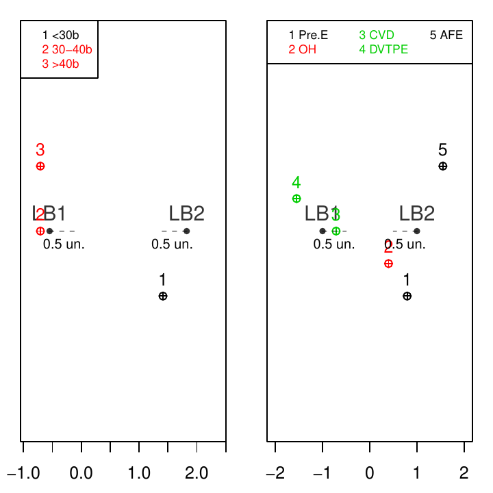
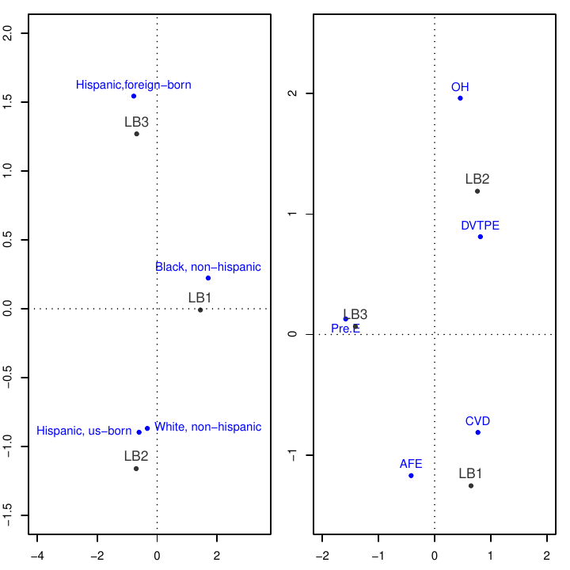
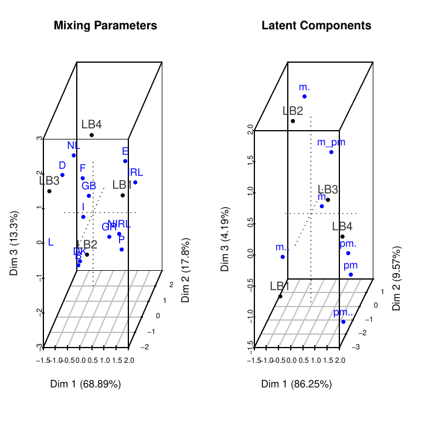
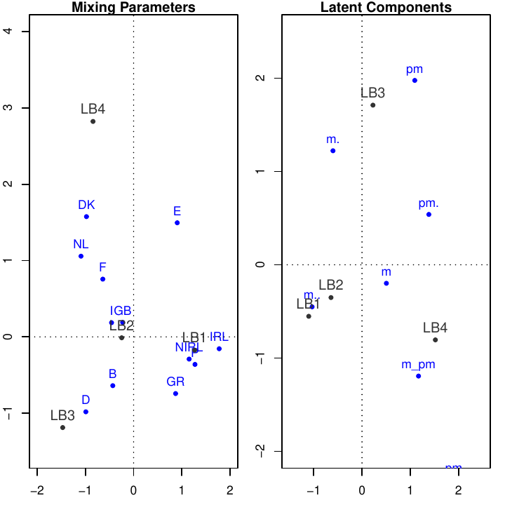
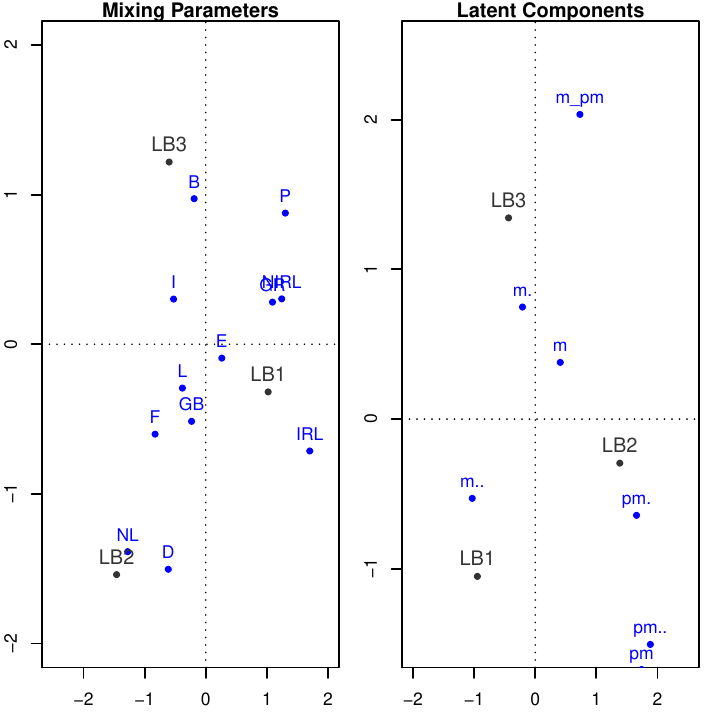
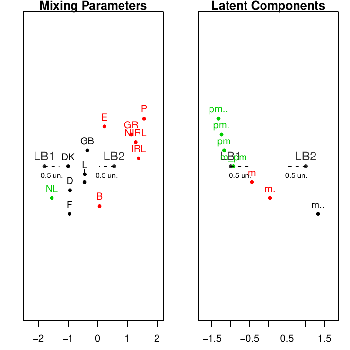

::: article
# Introduction

The idea of latent budget was first proposed by [@Goodman1974] in which
he wanted to show a method to analyse the relationship between a set of
qualitative variables, when some of them are manifested variables and
other are non observable or latent variables. These ideas were later
elaborated by [@Clogg1981] by interpreting a simple latent class model
in an asymmetric way. Independently, [@LeeuwJ1988] introduced the model
and named it latent budget analysis because they used it to analyse
time-budget data. The model was also introduced independently in geology
by [@Renner1988], where it is known as the endmember model.

LBA is an analysis method for compositional data which is basically an
$I \times J$ matrix where the row variable with $I$ categories is called
the explanatory variable and the column variable with $J$ categories is
called the response variable. In compositional data each row is
considered a $J$ dimensional vector of conditional probabilities so
that, for every row, they add up to one. LBA is used to understand the
relationship between those two variables.

LBA allows us to find out which categories of the response variables are
related to different groups of the explanatory categories. If the table
has a product multinomial distribution we can understand the latent
budget model (LBM) as explaining the relationship between the
explanatory and the response variables. It is done by assuming that
conditioned on the latent variable they are independent. In that sense,
the latent budgets, which are categories of a latent variable, are
hidden values which explain the relationship between the explanatory and
response variables. LBA reduces the dimensionality of the original
problem, thus making it easier to understand its hidden relations.

Examples of latent budget models in sociological research, political
sciences and other areas where categorical variables are used can be
found in [@Ark1999]. Generalizations of the LBA method may be found in
[@Siciliano1994], [@Siciliano2001] and [@Aria2008]. However, we found
few articles in our literature search that used LBA in their data
analyses. [@Larrosa2005] shows how to use LBA in applications to
economics. [@Tambrea1999] proposed an LBA approach for three-way tables
in a business field. We can also cite [@Aquila2015] in geology,
[@Ros-Freixedes2014] in biology, and [@Aria2003] in food engineering.

In our point of view, the reason why the use of LBA is not more
widespread is due to the lack of available software. The software "A
freeware computer program to perform latent budget analysis" written by
L. Andries van der Ark [@LBAsoft] in Borland Pascal 7.0 only runs under
MS-DOS. Unfortunately, it is no longer available at
<http://come.to/lba/software>. The only software we could find that
performs LBA analysis is CoDaPack [http://ima.udg.edu
/codapack/](http://ima.udg.edu
/codapack/){.uri}, which until recently only ran in the Windows
operational system. Therefore, because of the importance LBA has in
categorical data analysis, the authors decided to write the
[***lba***](https://CRAN.R-project.org/package=lba) package.

This is the first package for this type of analysis in R. The package is
available from both the Comprehensive R Archive Network at
<http://cran.r-project.org/web/packages/lba/index.html> and the
***lba*** project web site at <https://github.com/ivanalaman/lba>.

# Latent budget model

LBM is a mixture model for compositional data. A row of compositional
data is called a *composition* or a *budget* and its elements are the
*components*. We will follow the notation of [@Ark1999]. He says: "by
performing LBA we approximate $I$ observed budgets, which may represent
persons, groups or objects by a small number of latent budgets,
consisting of typical characteristics of the sample." See also
[@Leeuw1990] and [@Heijden1992].

## Terminology and model definition

The original contingency table is $N(I,J)$. Let us also define:

-   row total: $n_{i+} = \sum_{j} n_{ij}$.

-   column total: $n_{+j} = \sum_{i} n_{ij}$.

-   total: $n = \sum_{j}\sum_{i}n_{ij}$.

The compositional data matrix $\mathbf{P}$ is formed by dividing the raw
data by their corresponding row total. Let us call the observed
components $p_{i|j} 
( i = 1, \ldots, I; j = 1, \ldots, J)$ then,
$p_{i|j} = \frac{n_{ij}}{n_{i+}}$, $p_{i+} = \frac{n_{i+}}{n}$ and
$p_{+j} = \frac{n_{+j}}{n}$. Each row vector $\mathbf{p}_{i}$ of
$\mathbf{P}$ is called an observed budget and is approximated by the
expected budget $\boldsymbol{\pi}_{i}$ which is a mixture of
$K,(K\leq min(I,J))$ latent budgets.

The row vectors $\pi_{i},(i = 1, \ldots, I)$ form the expected matrix
$\pi$ which has a lower rank and, in LBM, approximates $\mathbf{P}$.

The latent budgets are represented by
$\boldsymbol{\beta}_{k}, (k = 1,\ldots,K)$ and the model is written as
$$\begin{aligned}
 \boldsymbol{\pi}_{i} = \alpha_{1|i}\boldsymbol{\beta}_{1} + \ldots + 
\alpha_{k|i}\boldsymbol{\beta}_{k} + \ldots + \alpha_{K|i}\boldsymbol{\beta}_{K},
\end{aligned}$$
where $\alpha_{k|i}$ are the mixing parameters.

The elements of $\boldsymbol{\pi}$ are $\pi_{j|i}$ and are called
*expected components*. The elements of $\boldsymbol{\beta}_{k}$,
$\beta_{j|k}$ are called *latent components*. In scalar notation,
$\pi_{j|i} = \sum_{k=1}^{K} \alpha_{k|i}\beta_{j|k}$, and in matrix
notation $\Pi = \mathbf{AB}^\top$ where $\Pi$ is an $I \times J$ matrix
whose rows are the expected budgets. $\mathbf{A}$ is an $I \times K$
matrix of mixing parameters and $\mathbf{B}$ is a $J \times K$ matrix
whose columns are the latent budgets. LBM($K$) is then the latent budget
model with $K$ latent budgets. Similar to the observed components, the
parameters of LBM are subject to the sum constraints
$\sum_{j=1}^{J} \pi_{j|i} = \sum_{k=1}^{K} \alpha_{k|i} = 
\sum_{j=1}^{J} \beta_{j|k} = 1$ and the non-negativity constraints
$0 \leq \pi_{j|i}, \alpha_{k|i}, \beta_{j|k} \leq 1$. In this way, all
parameters are proportions that further facilitate the interpretation of
the model.

Quoting [@Ark1999]

> The latent budgets can be characterized by being compared to the
> latent budgets of LBM(1). LBM(1) is the independence model with
> $\alpha_{1|i} = 1$ and $\beta_{j|1} = p_{+j}$, in this case
> $\boldsymbol{\pi}_{i}
> =\boldsymbol{\beta}_{1}$. Hence, if latent component
> $\beta_{j|k} \ge p_{+j}$, then $\boldsymbol{\beta}_{k}$ is
> characterized by the $j$-th category. On the other hand, if
> $\beta_{j|k} \leq p_{+j}$, then the $j$-th category is of lesser
> importance. The relative importance of each latent budget, in terms of
> how much of the expected data they account for, is expressed by the
> budget proportions $\pi_{k} = \sum_{i}p_{i+}\alpha_{k|i}$.
>
> The $\pi_{k}$ parameter also denotes the probability of latent budget
> $k$ when there is no information about the level of the row variable.
> To understand how the expected budgets are constructed to form the
> latent budgets, we must compare the mixing parameters to $\pi_{k}$. If
> $\alpha_{k|i} \ge \pi_{k}$ then the expected budget $\boldsymbol{\pi}$
> is characterized more than average by latent budget
> $\boldsymbol{\beta}_{k}$, otherwise, if $\alpha_{k|i} \leq \pi_{k}$
> then the expected budget $\boldsymbol{\pi}$ is characterized less than
> average by latent budget $\boldsymbol{\beta}_{k}$. In practice, the
> mixture model interpretation is easier to carry out when we first
> characterize the latent budgets and then interpret the expected
> budgets in terms of them.

Compositional data that follows the product multinomial sampling scheme
may be estimated by the maximum likelihood estimation method (MLE) which
is estimated by using the EM algorithm [@Dempster1977]. On the other
hand, if the data cannot be assumed to follow that distribution, using
MLE is not recommended. Following [@Ark1999] we opted to estimate by
using weighted least squares (WLS) estimators since it is a distribution
free method, that is, one which does not assume any probability
configuration on the data, see [@MooijaartA1999].

## Unconstrained parameter estimation: maximum likelihood estimator (MLE)

In [@Leeuw1990] they describe the MLE for compositional data under a
product-multinomial distribution. The log likelihood is:
$$\begin{aligned}
\ln L(\pi_{j|i};p_{j|i},n_{ij}) =  \sum_{i=1}^{I}n_{i+}\sum_{j=1}^{J}p_{j|i}
\ln(\pi_{j|i}) + C.
\end{aligned}$$

In this case, $\pi_{j|i}$ is dependent on a latent variable with K
categories, where the observations on that latent variable are missing.
Therefore the complete data loglikelihood function is:
$$\begin{aligned}
\ln L(\pi_{ijk};n_{++}) =  \sum_{i=1}^{I}\sum_{j=1}^{J}\sum_{k=1}^{K}n_{ijk}
\ln \left(\frac{\pi_{ijk}}{\pi_{i+}} \right) + C.
\end{aligned}$$

The $\pi_{ijk}$ parameters are the unknown joint probabilities of the
two manifest variables and the latent variable where
$\sum_{i=1}^{I}\sum_{j=1}^{J}\sum_{k=1}^{K}\pi_{ijk} = 1$ and
$\frac{\pi_{ijk}}{\pi_{i+}} = \pi_{jk|i} =  \alpha_{K|i}\beta_{j|k}$.
$n_{ijk}$ are the unknown joint frequencies of the three variables where
$n_{ijk} = \pi_{ijk}n_{++}$. In that paper, [@Leeuw1990] use an
EM-algorithm to maximize the complete data loglikelihood.

The EM algorithm proceeds iteratively. Beginning with arbitrary initial
values of $\alpha_{k|i}$ and $\beta_{j|k}$, which may be set either by
the user or randomly generated by the package function, and labelling
them $\hat{\alpha}_{k|i}^{0}$ and $\hat{\beta}_{j|k}^{0} \forall i,j,k$
to meet the sum and the no-negativity constraints. In the expectation
(E) step, calculate $\hat{\pi}_{ijk}^{0}$ from the initial estimates and
find the estimator for $n_{ijk}$ which is:
$$\begin{aligned}
\hat{n}_{ijk}^{0} = n_{ij}\frac{\hat{\pi}_{ijk}^{0}}{\sum_{k}\hat{\pi}_{ijk}^{0}}.
\end{aligned}$$

In the maximization (M) step, given $\hat{\pi}_{ijk}^{new}$ and
$\hat{n}_{ijk}^{new}$ , the complete data loglikelihood is maximized. In
[@Leeuw1990] they show that this yields the following estimates for the
next iteration:
$$\begin{aligned}
 \label{eq:e1} 
\hat{\alpha}_{k|i}^{new} = \frac{\sum_{j}\hat{n}_{ijk}^{0}}
{\sum_{j,k}\hat{n}_{ijk}^{0}} = \frac{\hat{n}_{i+k}^{0}}{\hat{n}_{i++}^{0}}
\end{aligned}   (\#eq:e1)$$
and
$$\begin{aligned}
 \label{eq:e2}
\hat{\beta}_{j|k}^{new} = \frac{\sum_{i}\hat{n}_{ijk}^{0}}
{\sum_{i,j}\hat{n}_{ijk}^{0}} = \frac{\hat{n}_{+jk}^{0}}{\hat{n}_{++k}^{0}}.
\end{aligned}   (\#eq:e2)$$

## Unconstrained parameter estimation: weighted least squares (WLS)

The WLS function to be minimized is:
$$\begin{aligned}
L_{\alpha_{k|i},\beta_{j|k}} = \sum_{i,j}(v_{i}w_{j})(p_{j|i} - 
\sum_{k}\alpha_{k|i}\beta_{j|k})^2.
\end{aligned}$$

The weights $v_{i}w_{j}$ may be chosen freely. If they are chosen to
equal one, the WLS becomes the ordinary least squares (OLS).

The ***lba*** package follows the algorithm completely described in
[@Ark1999] and [@MooijaartA1999] called the active constraints method
(ACM). The method is a minimization with constraints. The equality
constraints are the row sums of matrix $\mathbf{A}$ and column sums of
matrix $\mathbf{B}$, and the inequality constraints are the values of
all elements of $\mathbf{A}$ and which must be greater than zero.

## Identifiability: $K = 2$

In general, the LBM is not identifiable, meaning that there could be
various sets of parameters yielding the same goodness of fit
[@ArkLA1999]. In fact, as [@Leeuw1990] show,
$\boldsymbol{\Pi} = \mathbf{AB}^{\top}= \mathbf{AT}^{-1}\mathbf{TB}^{\top}
 = \mathbf{A^{*}B}^{*\top}$ where $\mathbf{A}^{*} = \mathbf{AT}^{-1}$
and $\mathbf{B}^{*\top} = \mathbf{TB}^{\top}$.

$\mathbf{T}$ is a matrix of order $K \times K$ with elements
$\tau_{cd}$. To ensure that the rows of $\mathbf{A}^{*}$ and the columns
of $\mathbf{B}^{*}$ add up to one, [@Leeuw1990] proved that $\mathbf{T}$
is subject to the constraints that all elements of $\mathbf{T}$ must be
nonnegative and
$$\begin{aligned}
\sum_{d}\tau_{cd}, \quad c = 1,\ldots,K.
\end{aligned}$$

We follow [@ArkLA1999] in which he shows that $\mathbf{T}$ can be chosen
such that the latent budget solution is optimal in a specific sense.

The ***lba*** package follows the solutions proposed by [@Leeuw1990] for
LBM(2), as described in [@Ark1999] Chapter 2, when discussing the
geometry of LBM(2).

> In LBM(2), the unidentified latent budgets $\beta_{1}$ and $\beta_{2}$
> can be viewed as two vectors in a J-dimensional space. The heads of
> any two vectors can be connected by a line segment, denoted by V,
> which is a subset of a line S. The expected budgets
> $\pi_{1},\ldots,\pi_{I}$ are J-dimensional vectors and convex
> combinations of $\beta_{1}$ and $\beta_{2}$. Therefore, the heads of
> $\pi_{1},\ldots,\pi_{I}$ lie on V, and the relative distance from
> $\pi_{1},\ldots,\pi_{I}$ to $\beta_{1}$ and $\beta_{2}$ is expressed
> by the mixing parameters. The unidentified latent budgets $\beta_{1}$
> and $\beta_{2}$, collected in $\mathbf{B}$, can be transformed into
> $\mathbf{B}^{*}$ .

The region of budgets is denoted by $\mathbf{U}$. The vectors that bound
$\mathbf{U}$ are called outer extreme budgets, and have one component
equal to zero. LBM(2) always has two outer extreme budgets. Not every
$b \in \mathbf{U}$ is a feasible latent budget. A latent budget cannot
lie between two expected budgets, because this would result in negative
mixing parameters. Hence a latent budget cannot lie within the space
spanned by the expected budgets that take the most extreme position on
$\mathbf{S}$. This space is denoted by $\mathbf{W}$. The most extreme
expected budgets are called inner extreme budgets.

The matrices $\mathbf{T}$ to get the transformations into
$\mathbf{B}^{*}$ are found in both the outer extreme solution and the
inner extreme solution. They are used to get the respective
$\mathbf{A}^{*}$ matrices.

In the outer extreme solution the latent budgets are as different as
possible, simplifying their interpretation in most cases. In the inner
extreme solution, the latent budgets are as similar as possible. At the
same time, the mixing parameters will be as different as possible.

## Identifiability: $K \ge 3$

[@Ark1999] uses the following criteria to identify the solutions:
minimize $\sum_{q=1}^{Q}\delta_{\chi^{2}_{q}}$ for an identified inner
extreme solution and maximize $1/\sum_{q=1}^{Q}\delta_{\chi^{2}_{q}}$
for an identified outer extreme solution.

Where $Q = \binom{n}{k}$, i.e., the number of distances among the K
latent budgets, and
$$\begin{aligned}
\delta_{\chi^{2}} = \sqrt{\sum_{j=1}^{J}\frac{(p_{j|i}-p_{j|i'})}{p_{j+}}}.
\end{aligned}$$

In order to find those minimal solutions, the ***lba*** package uses the
`constrOptim.nl` function from the
[***alabama***](https://CRAN.R-project.org/package=alabama) package
[@Varadhan2015]. In this case the "BFGS" algorithm is used .

## Constrained parameter estimation

Parameters in LBM may be subject to optional constraints, which can be
imposed by a researcher, either to test specific hypotheses about the
model to facilitate its interpretation, or to build complex models.

There are three different types of optional constraints, namely fixed
value constraints, equality constraints, and multinomial logit
constraints.

Fixed value constraints have the form $\alpha_{k|i} = c$ or
$\beta_{j|k} = c'$, where $0 \leq c \leq 1$ and $0 \leq c' \leq 1$ are
constants.

Equality constraints have the form
$\alpha_{k_{1}|i_{1}} = \alpha_{k_{2}|i_{2}} = \ldots = \alpha_{k_{L}|i_{L}}$
when equalities are placed on the mixing parameters and
$\beta_{j_{1}|k_{1}} = \beta_{j_{2}|k_{2}} = \ldots = \beta_{j_{M}|k_{M}}$
when equalities are placed on the latent components.

The multinomial logit constraints were introduced in LBA by
[@Heijden1992], and have the following form:
$$\begin{aligned}
\alpha_{k|i} = \frac{\exp(\sum_{s=1}^{S}x_{is}\gamma_{sk})}
{\sum_{n=1}^{K}\exp(\sum_{s=1}^{S}x_{is}\gamma_{sn})},
\end{aligned}$$
for the mixing parameters, where $\gamma_{sk}$ are the multinomial logit
parameters; and
$$\begin{aligned}
\beta_{j|k} = \frac{\exp(\sum_{t=1}^{T}y_{jt}\psi_{tk})}
{\sum_{n=1}^{J}\exp(\sum_{t=1}^{T}y_{nt}\psi_{tk})},
\end{aligned}$$
for the latent components, where $\psi_{tk}$ are the multinomial logit
parameters. For a detailed discussion see [@Ark1999] Chapter 3.

The $S$ variables that contain the additional information about the
mixing parameters, are called row covariates and the $I \times S$ matrix
$\mathbf{X}$ is called the row design matrix. Similarly, the $T$
variables that contain the additional information about the latent
components, are called column covariates and the $J \times T$ matrix
$\mathbf{Y}$ is called the column design matrix. Both the sum
constraints and the non-negativity constraints are satisfied by the
multinomial logit constraints.

The degrees of freedom, according to [@Leeuw1990], is the number of
independent cells minus the number of independent parameters, For
compositional data the number of independent cells is always $I(J-1)$
due to the sum constraints on the observed budgets. For the
unconstrained LBM(K), we have $I(K- 1)$ free mixing parameters, and
$K(J - 1)$ free latent components. However, the model is not
identifiable and $K(K - 1)$ parameters should be fixed. Hence the number
of degrees of freedom is
$I(J - 1) - I(K - 1) - K(J - 1) + K(K - 1) = (I - K)(J - K)$.

The ***lba*** package only runs the identifiability function when there
are no optional constraints in the model. This is due to the fact that
it is not possible to maintain the constraints while running that
function. Therefore users who use optional constraints should use
$K(K-1)$ fixed parameters or an adequate number of other constraints in
order to attain identifiability.

The maximum likelihood estimation is adjusted for fixed value constraint
according to [@Heijden1992].

Let $\alpha_{l|r} = c$, then the new adjusted value of Equation
\@ref(eq:e1) for the free mixing parameters is:
$$\begin{aligned}
\hat{\alpha}_{k|i}^{new} = \frac{\sum_{j}\hat{n}_{ijk}^{0}}
{\sum_{j,k\ne l}\hat{n}_{ijk}^{0}} = \frac{\hat{n}_{i+k}^{0}}{(\hat{n}_{i++}^{0}
 - \hat{n}_{i+l}^{0})}
\end{aligned}$$
and, if $\beta_{s|r} = c'$, then the new adjusted value of Equation
\@ref(eq:e2) for the free latent components is:
$$\begin{aligned}
\hat{\beta}_{j|k}^{new} = \frac{\sum_{i}\hat{n}_{ijk}^{0}}
{\sum_{i,j\ne s}\hat{n}_{ijk}^{0}} = \frac{\hat{n}_{+jk}^{0}}{(\hat{n}_{++k}^{0}
- \hat{n}_{+sk}^{0})}.
\end{aligned}$$

Optional equality constraints for parameter estimates obtained with the
EM algorithm are described in [@MooijaartA1992]; see also
[@Heijden1992]. For the mixing parameters, if
$\alpha_{k|i} = \alpha_{k'|i'}$ the new adjusted values of Equation
\@ref(eq:e1) are:
$$\begin{aligned}
\hat{\alpha}_{k|i}^{new} = \hat{\alpha}_{k'|i'}^{new} = 
\frac{(\hat{n}_{i+k}^{0} + \hat{n}_{i'+k'}^{0})}
{(\hat{n}_{i++}^{0} + \hat{n}_{i'++}^{0})}
\end{aligned}$$
and, for $\beta_{j|k} = \beta_{j'|k'}$, the new adjusted values of
Equation \@ref(eq:e2) are:
$$\begin{aligned}
\hat{\beta}_{j|k}^{new} = \hat{\beta}_{j'|k'}^{new} = 
\frac{(\hat{n}_{+jk}^{0} + \hat{n}_{+j'k'}^{0})}
{(\hat{n}_{+j+}^{0} + \hat{n}_{+j'+}^{0})}.
\end{aligned}$$

The remaining parameters should be updated by using quations
\@ref(eq:e1) and \@ref(eq:e2).

In [@Heijden1992] they warn that the estimation of optional equality
constraints (in combination with fixed value constraints) by the
EM-algorithm is not always correct. The ***lba*** package takes it into
account automatically and uses the ***alabama*** package to estimate the
parameters when necessary.

The estimation of the parameters under multinomial logit constraints is
described in [@Heijden1992]. The complete data log likelihood function
can be split into two parts where one depends only on row covariates and
the other only on the column covariates; therefore, the E-step of the EM
algorithm is the same as in the unconstrained LBM. The M-step is
implemented by making use of the `optim` function and the ***alabama***
package.

Depending on the values of the matrices $\mathbf{X}$ and $\mathbf{Y}$,
the exponential values of the row and column covariates might become
infinity. They are replaced by `1e6`. Also, whenever the values of the
row or column covariates are not supplied, ***lba*** creates random
values from the standard normal distribution.

**Note:**

-   Depending on the starting parameters, all algorithms cited above may
    only locate a local, rather than global, maximum or minimum. This
    becomes more and more of a problem as $K$, the number of latent
    budgets, increases. It is therefore highly advisable to run
    ***lba*** a few times until you are relatively certain that you have
    located the global maximum log-likelihood, the global minimum least
    squares, or the identification minimization.

-   Some times it a label switching may occur. Usually the
    interpretation remains the same but the label of the budgets might
    not be the same. The ***lba*** package does try to minimize those
    occurrences, nevertheless they still may occur.

## Model selection and goodness of fit criteria

Latent budget analysis has a great variety of tools available for
assessing model fit and determining an appropriate number of latent
budgets $K$ for a given data set. In some applications, the number of
latent budgets will be selected for primarily theoretical reasons. In
other cases, however, the analysis may be of a more exploratory nature,
with the objective being to locate the best fitting or most parsimonious
model. The researcher may then begin by fitting an independence LBM(1),
and then iteratively increasing the number of latent budgets one by one
until a suitable fit has been achieved.

Adding an additional budget to a latent budget model will increase the
fit of the model, but at the risk of fitting too much noise, and at the
expense of estimating further $I + J$ model parameters. Parsimony
criteria seeks to strike a balance between over and under-fitting the
model to the data by penalizing the log-likelihood for a function of the
number of parameters being estimated. Usually, the researcher must take
into account that parsimony is the best help in order to achieve a good
interpretation of the model, that means a close resemblance between the
observed and expected data, with as few parameters as possible. See
[@LeeuwJ1988], [@Leeuw1990], and [@Ark1999].

The most used criteria can be found in the Table [1](#tab:good).

::: {#tab:good}
  ------------------------------------------------------------------------------------------------------------------------
  Statistics                         Formula
  ---------------------------------- -------------------------------------------------------------------------------------
  Likelihood ratio statistic         $G^{2} = 2\sum_{i,j}n_{ij}\log\left(\frac{n_{ij}}{\pi_{j|i}n_{i+}}\right)$

  Pearson chi-squared statistic      $X^2 = \sum_{i,j}\left(\frac{(n_{ij} - \pi_{j|i}n_{i+})^2}{\pi_{j|i}n_{i+}}\right)$

  Residual sum of squares            $RSS = \sum_{i,j}(\pi_{j|i} - p_{j|i})^2$

  Weighted residual sum of squares   $wRSS = \sum_{i,j}v_{i}^{2}w_{j}^{2}(\pi_{j|i} - p_{j|i})^2$

  Akaike information criterion       $AIC = G^2 - 2df$

  Corrected $AIC$                    $CAIC = G^2 - df \times [\log(N) + 1]$

  Bayesian information criterion     $BIC = G^2 - df \times \log(N)$
  ------------------------------------------------------------------------------------------------------------------------

  : Table 1: Goodness of fit calculated by the ***lba*** package.
:::

$RSS$ and $wRSS$ must be compared to the $RSS$'s of other models in
order to be meaningful.

The ***lba*** package calculates a great variety of goodness of fit
statistics (GFS). Some can only be used with the data following the
product multinomial distribution; others, on the other hand, may be used
with distribution free data. A few have an asymptotic chi-square
distribution, called exact GFS, but most have an unknown distribution.

# Computation time as a function of the data matrix dimension and the number of latent budgets

Every numerical method performing an estimation of many parameters which
depends on a optimization algorithm is going to be computationally time
consuming. The ***lba*** package in particular uses a maximization with
constraints in order to identify the parameters being estimated. The
***alabama*** package is used in this case and furthermore the
restrictions, which are row sums of matrix A and column sums of matrix B
must be one, is programmed in ***alabama*** in a very complex way. All
those conditions tend to make ***alabama*** somewhat computationally
time consuming, nevertheless, in our experience, those times are not too
long. Figure [1](#fig:time) shows that the most important time consuming
parameter is the number of latent budgets, $K$, the size of the data
matrix is not very significant in increasing computation time while
keeping $K$ constant.

{#fig:time
width="100%" alt="graphic without alt text"}

# The lba package

The main function of package ***lba*** is `lba`. This function input may
be an object of class `"formula"`, `"matrix"` or `"table"`. The `lba`
function can be called by:

``` r
lba(obj, ...) 
```

If the object is from class `"formula"`, the method `lba.formula` will
be called:

``` r
lba(formula, data, A = NULL, B = NULL, K = 1L, cA = NULL, 
    cB = NULL, logitA = NULL, logitB = NULL, omsk = NULL, psitk = NULL, 
    S = NULL, T = NULL, row.weights = NULL, col.weights = NULL, 
    tolG = 1e-10, tolA = 1e-05, tolB = 1e-05, itmax.unide = 1000, 
    itmax.ide = 1000, trace.lba = TRUE, toltype = "all", method = c("ls", 
        "mle"), what = c("inner", "outer"), ...) 
```

Objects of class `"formula"` follow the same logic of linear models,
that is, dependent variables as a function of independent variables. The
argument `data` must have objects of class `"data.frame"` as input.
Objects of class `matrix` are executed by method `lba.matrix`:

``` r
 lba.matrix(obj, A = NULL, B = NULL, K = 1L, cA = NULL, cB = NULL, 
    logitA = NULL, logitB = NULL, omsk = NULL, psitk = NULL, 
    S = NULL, T = NULL, row.weights = NULL, col.weights = NULL, 
    tolG = 1e-10, tolA = 1e-05, tolB = 1e-05, itmax.unide = 1000, 
    itmax.ide = 1000, trace.lba = TRUE, toltype = "all", method = c("ls", 
        "mle"), what = c("inner", "outer"), ...) 
```

Objects of class `"table"` are executed by the method `lba.table`:

``` r
 lba.table(obj, A = NULL, B = NULL, K = 1L, cA = NULL, cB = NULL, 
    logitA = NULL, logitB = NULL, omsk = NULL, psitk = NULL, 
    S = NULL, T = NULL, row.weights = NULL, col.weights = NULL, 
    tolG = 1e-10, tolA = 1e-05, tolB = 1e-05, itmax.unide = 1000, 
    itmax.ide = 1000, trace.lba = TRUE, toltype = "all", method = c("ls", 
        "mle"), what = c("inner", "outer"), ...) 
```

The default method of estimation is *weighted least squares* with the
row weights ($\sqrt{n_{i+}/n_{++}}$) and column weights
($1/\sqrt{n_{j+}/n_{++}}$). The user who wants to use *weighted least
squares* differently from the default should give values to either one
or both parameters `row.weights` and `col.weights`. If all those values
equal one, then we get the *ordinary least squares*. The other available
method is the *maximum likelihood estimator*.

The arguments `A` and `B` are used whenever the user wants to set the
initial values of the *mixing parameters* or *latent components*
respectively. If the user has no initial values to set, those matrices
are randomly set by using a *Dirichlet* distribution. For matrix `A` the
distribution parameters are *I* and *alphavec* where *I* is the row
number of the compositional data matrix and *alphavec* is randomly
generated from a uniform distribution with parameter *K (number of
latent budgets)* as for `B` the parameters are *K* and *alphavec* which
is randomly generated from a uniform distribution with parameter *J*
where *J* is the column number of the compositional data matrix.

The arguments `cA, cB` must be used whenever the estimation process is
done with constraints on the parameters $\alpha$ or $\beta$
respectively. For fixed value constraints, they must give values between
zero and one. For equality constraints, they must be integers greater or
equal to two where the parameters with the same value will be considered
equal.

Use `help(lba)` for the remaining parameters.

The ***lba*** package can produce plots of the mixing parameters and
latent components matrices. For $K = 3$, ***lba*** performs two
different kinds of plots. One is the triangular (or ternary) coordinate
system, suggested by [@Ark1999] and [@Leeuw1990], the other is the
correspondence analysis (CA) plot suggested by [@Jelihovschi2011], which
can also be made for any $K \ge 3$. It is important to note that the CA
plots are applied to the indentified mixing parameters and identified
latent components matrices; in ***lba*** they are respectively the
matrices `Aoi` and `Boi`. For $K = 2$, ***lba*** does, as suggested by
[@Ark1999] page 41, also use the correspondence analysis result. The
function which creates the correspondence analysis plot is called
`plotcorr`, the other one is called `plotlba`.

It should be noted that when plotting the latent components using the
triangular coordinate system, ***lba*** uses the rescaled latent
components matrix whose values are:
$\beta_{k|j} = \frac{\beta_{j|k}\pi_{k}}{p_{+j}}$. Note that in this
case the row sums equal one, not column sums as in the latent components
matrix.

The functions `plotlba` and `plotcorr` use the generic functions `plot`,
`axis`, `text`, `points`, `segments` and `legend` for `K = 2`. For
`K = 3`, the function `plotlba` uses the functions `triax.plot`,
`triax.points` and `thigmophobe.labels` from package
[***plotrix***](https://CRAN.R-project.org/package=plotrix) and also
`segments` and `legend`. The function `plotcorr` uses the generic
functions for `K = 2`. Whenever `K `$\ge$` 4`, only the function
`plotcorr` is used. In this case the function `scatterplot3d` from
package
[***scatterplot3d***](https://CRAN.R-project.org/package=scatterplot3d)
is internally called. Finally, if the argument `rgl = TRUE` is used,
then the function `plot3d` from package
[***rgl***](https://CRAN.R-project.org/package=rgl) will be called.

The goodness of fit results can be obtained by making use of the
function `goodnessfit(obj,...)` where `obj` is an object of class
`"lba"`.

# Examples

@Main2015 studied pregnancy related maternal deaths in California. They
examined five distinct clinical conditions that account for nearly 70 of
all pregnancy related deaths,

-   cardiovascular diseases, CVD

-   preeclampsia/eclampsia, Pre.E

-   obstetric hemorrhage, OH

-   deep vein thrombosis - pulmonary embolism, DVTPE

-   amniotic fluid embolism, AFE

together, they also collected data about

-   maternal age,

-   parity,

-   gestational age at delivery,

-   maternal race and country of birth,

-   body mass index - BMI.

which will be the rows or budgets of the data matrices.

## Example 1; BMI

Table [2](#tab:BMI1) shows the number of deaths related to the five
conditions for women with BMI less than 30, between 30 and 40 and above
40.

::: {#tab:BMI1}
  ----------------------------------------------------------
                              Pre.E   OH   CVD   DVTPE   AFE
  ------------------------- ------- ---- ----- ------- -----
    $<$`<!-- -->`{=html}30b      29   14    28       8    18

                     30-40b       4    2    15       6     0

    $>$`<!-- -->`{=html}40b       1    2     6       5     0
  ----------------------------------------------------------

  : Table 2: Number of deaths related to the five conditions for women
  with BMI less than 30, between 30 and 40 and above 40
:::

The lba function was performed on data matrix `bmi`, as shown below.

``` r
> library(lba)
> data(pregnancy)
> bmi <- pregnancy[5:7,]                 
> set.seed(1)
> bmilba <- lba(bmi, K = 2, method = "mle", what = 'outer', 
+                trace.lba = FALSE)
```

Since all rows of the BMI matrix are independent, the product
multinomial model can be used and the maximum likelihood estimation
(MLE) method applies. We will also use $K=2$ because the number of rows
is 3 (and so, $K = 3$ is the saturated model). We used the function
`set.seed` so that the user who wishes to replicate the analysis may get
the same results as the ones shown below.

``` r
> goodnessfit(bmilba)
Likelihood ratio statistic:
         K budget Baseline
G2 value    1.809 2.95e+01
P-value     0.613 2.63e-04
```

The goodness of fit result shows that the likelihood ratio statistic
(G2) used to test the model gave a p-value of $0.613$ and thus accepting
the model with $K = 2$. The `summary` of both `lba` and `goodnessfit`
functions gives complete results. The only other possible model is the
independence model, or baseline model, which has a p-value of $0.000263$
and so, it is rejected. The interpretation of the model is easily done
by using the correspondence analysis plot, which is created using the
function `plotcorr`.

<figure id="fig:BMI4">

<figcaption>Figure 2: Example 1: Mixing parameters (left); latent
components (right).</figcaption>
</figure>

The plot has just one dimension, so that the points are spread only
along the horizontal axis; see documentation of function `plotcorr`. The
first latent budget (LB1) is composed of CVD and DVTPE, which could be
considered as pregnancy-related conditions; the second latent budget
(LB2) is composed of AFE and Pre.E, which are more general conditions.
The OH condition can be considered neutral. The mixing parameter BMI
less than 30 is related to LB2 and the more obese women to LB1 as is
expected since obese people are more affected by the general conditions.

## Example 2; parity, maternal age, gestational age at delivery in weeks

In this example, we consider three other explanatory variables connected
to pregnancy-related death: parity, maternal age and gestational age at
delivery/fetal demise. The resulting data matrix is:

::: {#tab:MCD1}
  ----------------------------------------------------------
                              Pre.E   OH   CVD   DVTPE   AFE
  ------------------------- ------- ---- ----- ------- -----
                          1      16    3    13       3     3

                        2-4      16   13    31      14    10

                         5+       4    4     5       3     5

    $<$`<!-- -->`{=html}30a      12    5    25      11     4

                     30-40a      18   13    22       8    13

    $>$`<!-- -->`{=html}40a       6    2     2       1     1

    $<$`<!-- -->`{=html}32w       6    5     8       0     0

                     32-36w      16    5     8       8     1

    $>$`<!-- -->`{=html}37w      14   10    33      12    17
  ----------------------------------------------------------

  : Table 3: Relation between, parity, maternal age, gestational age at
  delivery with five cause of pregnancy related death
:::

Unlike the Example 1, the matrix rows are not independent since the same
women are counted in each one of the row variables. Therefore the MLE
method does not apply here and we use the least squares method in order
to estimate the model parameters. The functions to call are:

``` r
> mcd <- pregnancy[8:16,]
> set.seed(1)
> mcdlba  <- lba(mcd, K = 2, method = 'ls', what = 'outer', trace.lba = FALSE)
> set.seed(1)
> mcdlba1 <- lba(mcd, K = 3, method = 'ls', what = 'outer', trace.lba = FALSE)
> set.seed(1)
> mcdlba2 <- lba(mcd, K = 4, method = 'ls', what = 'outer', trace.lba = FALSE)
```

In order to get the values of Table [4](#tab:mcd), the function
`goodnessfit` is used as follows.

``` r
> summary(goodnessfit(mcdlba))
> summary(goodnessfit(mcdlba1))
> summary(goodnessfit(mcdlba2))
```

::: {#tab:mcd}
  ---------------- ---- -------- ----------------- ------------------- ---------------
  Number of                                                            

  Latent budgets    df   *wRSS*   Actual decrease   Required decrease   Fit improved?

  1                 32    0.31          NA                 NA                NA

  2                 21    0.14         0.17               0.11               yes

  3                 12    0.06         0.11               0.09               yes

  4                 05    0.02         0.04               0.07               no
  ---------------- ---- -------- ----------------- ------------------- ---------------

  : Table 4: Goodness of fit of LBM using least squares and
  $K = 1, 2, 3,$ and $4$.
:::

The weighted residual sum of squares between the observed components and
the expected components (wRSS) were used as a goodness of fit statistic,
and the independence model, LBM(1) as a baseline model.

We followed [@Ark1999] for the following guidelines in order to make a
decision on the number of latent budgets to be used:

-   The proportion of lack of fit with respect to the baseline model
    should be the largest one.

-   the improvement of adding an extra latent budget should be large
    enough to justify the increased effort of interpreting the extra set
    of parameter estimates. In order to achieve this we use the
    criterion that the average improvement of fit per degree of freedom
    as shown in the `summary(goodnessfit)` times the number of the
    difference of degrees of freedom between two values of $K$ being
    calculated.

-   The results should be interpretable.

Both the models with $K = 2$ and $K = 3$ improve the previous model. We
decide for $K = 3$ and try to interpret it.

{#fig:MCD2 width="100%" alt="graphic without alt text"}

The interpretation of the latent budgets goes as follows: LB2 is
explained by pre-eclampsia/eclampsia, which is a condition that occurs
only in pregnant women, which is characterized by high blood pressure.
LB1 has two conditions: AFE, which is a pregnancy condition; and DVTPE,
which is a more general condition, and LB3 is explained by CVD. Unlike
the first example, it does not put together CVD and DVTPE (Figure
[3](#fig:MCD2)).

The mixing parameters connected to LB2 are gestational age at delivery
of 32 to 36 weeks and maternal age older than 40 years. Pre.E may occur
any time after the twentieth week. The LB1 is connected to women with
more than 5 children, and age from 30 to 40 years. LB3 is connected to
younger women with 2 to 4 children and early delivery (Figure
[3](#fig:MCD2)).

## Example 3; maternal race and country of birth 

In this example we consider as explanatory variables, maternal age and
country of birth in connection to pregnancy related death. The resulting
data matrix is in Table [5](#tab:MRD1).

::: {#tab:MRD1}
  --------------------------------------------------------
                            Pre.E   OH   CVD   DVTPE   AFE
  ----------------------- ------- ---- ----- ------- -----
    Hispanic,foreign-born      18    5     8       4     5

        Hispanic, us-born       6    4     9       5     1

      White, non-hispanic       6    7    11       6     4

      Black, non-hispanic       5    2    19       5     5
  --------------------------------------------------------

  : Table 5: Relation between maternal race and country of birth with
  five causes of pregnancy related death
:::

This matrix has independent rows so that the product multinomial model
and the MLE method are used to estimate the mixing parameters and latent
components.

::: {#tab:mrd}
  ---------------- ---- ------- -----------
  Number of                     

  latent budgets    df   $G^2$  *p*-value

  1                 12   20.5   0.06

  2                 6     6.8   0.34

  3                 2    1.61   0.45
  ---------------- ---- ------- -----------

  : Table 6: Goodness of fit of LBM using MLE and $K$= 1, 2 and 3.
:::

Table [6](#tab:mrd) shows the results of goodness of fit. Both $K = 2$
and $K = 3$ are accepted. We interpret both. Figure [4](#fig:MRD2) is
the default plot of ***lba*** for $K = 2$.

``` r
> set.seed(1)  
> mrd2 <- pregnancy[1:4,]
> rownames(mrd2) <- c("Hispanic,foreign-born", "Hispanic, us-born",    
            "White, non-hispanic", "Black, non-hispanic") 
 
> mrd2lbaa <- lba(mrd2, K = 2, method = "mle", what = 'outer', trace.lba = FALSE)
```

``` r
> par(mfrow = c(1,2))
> plotcorr(mrd2lbaa, pch.points = 20, xlim = c(-3,2.5),
+           labels.points = rownames(mrd2lbaa$Aoi), col.budget = 'gray20',
+           args.legend = list(plot = FALSE))
> plotcorr(mrd2lbaa, with.ml = 'lat', pch.points = 20,
+           labels.points = rownames(mrd2lbaa$Boi), col.budget = 'gray20',
+           args.legend = list(plot = FALSE))        
```

{#fig:MRD2 width="100%" alt="graphic without alt text"}

The Figure [4](#fig:MRD2) graphs are both one dimensional. What is
important is the position at the horizontal axis. The default of the
`plotcorr` function lays the numbered points out of the line so that
they do not overlap, which often happens when the number of parameters
increases. The latent components show that the LB2 is composed of CVD
and DVTPE which are the more general conditions, and LB1 is composed of
Pre.E and OH, which are conditions more specific to pregnancy. AFE is
around the origin and does not affect either one of the budgets. It
should be noted that CVD and Pre.E are the ones with the strongest
influence on their respective budgets because they are farther away from
the origin. Looking at the mixing parameters we can see that Black women
belong to LB2,that is Black women have a strong connection to more
general conditions, and Hispanic foreign-born women are mostly affected
by specific pregnancy conditions.

``` r
> set.seed(1)
> mrd2lba <- lba(mrd2, K = 3, method = "mle", what = 'outer', trace.lba = FALSE)
```

``` r
> par(mfrow = c(1,2))
> plotcorr(mrd2lba, with.ml = 'mix', xlim = c(-4, 3.5), ylim = c(-1.5, 2),
+           pch.points = 20, col.points = 4, pos.points = c(3, 2, 4, 3), 
+           labels.points = rownames(mrd2lba$Aoi),
+           col.budget = 'gray20',
+           args.legend = list(plot = FALSE))
> plotcorr(mrd2lba, with.ml = 'lat', xlim = c(-2,2), ylim = c(-1.5,2.5),
+           pch.points = 20, col.points = 4, pos.points = c(1, 3, 3, 3, 3),
+           labels.points = rownames(mrd2lba$Boi),
+           col.budget = 'gray20',
+           args.legend = list(plot = FALSE))          
```

<figure id="fig:MRD3">

<figcaption>Figure 5: Example 4: Mixing parameters (left); latent
components (right). </figcaption>
</figure>

The three budgets model is shown in Figure [5](#fig:MRD3). CVD and Pre.E
each form a budget, LB1 and LB3 respectively; LB2 is composed of DVTPE
and OH. Most important is to see that Hispanic foreign born women are
strongly connected to Pre.E and Black women to CVD. This gives more
emphasis to the $K = 2$ model results.

## Example 4; post-materialism data

One theory of post-materialism states that political values change with
the industrial and economic growth of a society. It says that people can
be classified into two major groups with respect to their political
values, namely *materialistic*, who seek security and materialistic
supply, and *post-materialistic*, who try to bring about idealistic
goals. Those two views, according to the theory, could be regarded as
the extremes of a continuum. The dataset consists of seven categories
ranking from materialism (m..) to post-materialism (pm..) from a survey
across Europe coded in a contingency table with 13 countries (rows) and
the 7 levels of the *in depth post-materialism index*.

The countries included in the survey are:

-   B=Belgium, D=Germany, DK=Denmark, E=Spain, F=France, GB=Great
    Britain,

-   GR=Greece,I=Italy, IRL=Ireland, L=Luxembourg, NIRL=Northern Ireland,
    NL=Netherlands, P=Portugal.

The complete table is part of the `postmater` dataset contained in
package ***lba***. In order to find out how many typical societies are
needed to explain the data, four models for $K = 1, 2, 3,$ and $4$ were
estimated using the MLE method and the outer extreme solution so that
the latent budgets representing the materialistic and post-materialistic
concepts become as clear as possible. The goodness of fit results by
using the `goodnessfit` using the $G^2$ function are displayed in
Table [7](#tab:post).

::: {#tab:post}
  ---------------- ---- ------- -----------
  Number of                     

  latent budgets    df   $G^2$  *p*-value

  1                 72   855.6  0.00

  2                 55   93.7   0.00

  3                 40   66.3   0.01

  4                 27   36.9   0.03
  ---------------- ---- ------- -----------

  : Table 7: Goodness of fit of LBM using MLE and $K= 1, 2, 3,$ and $4$.
:::

We will now discuss the graphical results from the function `plotcorr`.

``` r
> data(postmater)
> new_post <- as.matrix(postmater[,-1])
> row.names(new_post) <- postmater[,1]
> 
> set.seed(1)
> ex4 <- lba(new_post, method = "mle", what = 'outer', K = 4, tolG = 1e-5, 
+             itmax.unide = 1e4, trace.lba = FALSE)
```

``` r
> par(mfrow = c(1,2))                           
> plotcorr(ex4, main = "Mixing Parameters", ylim = c(-1.5,2.5), zlim = c(-3,3), 
+          pch.points = 20, col.points = 4, labels.points = rownames(ex4$Aoi),
+          col.budget = 'gray20', args.legend = list(plot = FALSE))        
> plotcorr(ex4, with.ml = "lat", main = "Latent Components", pch.points = 20,
+           col.points = 4, labels.points = rownames(ex4$Boi), col.budget = 'gray20',
+           args.legend = list(plot = FALSE))       
```

<figure id="fig:post2">

<figcaption>Figure 6: Example 5: Mixing parameters (left); latent
components (right).</figcaption>
</figure>

In the first graph shown in Figure [6](#fig:post2), $K = 4$ and the plot
has 3 dimensions. In both plots, mixing parameters and latent components
(the third dimension principal component) explain a negligible
percentage of the inertia. This means that a two dimensional plot
explains as much of the total information as the three dimensional one.

Should the user wish to use a dynamic visualization of 3D graphics, the
function `plotcorr` has the argument `rgl = TRUE`.

``` r
> tex4 <- ex4
> class(tex4) <- c("lba.2d", "lba.mle", "lba.matrix", "lba")
> par(mfrow=c(1,2))                           
> plotcorr(tex4, main = "Mixing Parameters", xlim = c(-2,2), ylim = c(-1.5,4),
+           pch.points = 20, col.points = 4, labels.points = rownames(tex4$Aoi),
+           col.budget = 'gray20', args.legend = list(plot = FALSE))         
> plotcorr(tex4, with.ml = "lat", main = "Latent Components", xlim = c(-1.5,2.5),
+           ylim = c(-2,2.5), pch.points = 20, col.points = 4,
+           labels.points = rownames(tex4$Boi), col.budget = 'gray20',
+           args.legend = list(plot = FALSE))
```

<figure id="fig:post3">

<figcaption>Figure 7: Example 6: Mixing parameters (left); latent
components (right).</figcaption>
</figure>

The graph shown in Figure [7](#fig:post3) shows, for $K = 4$, a plot
with 2 dimensions where the two principal components explain almost all
the information contained in the mixing parameters and latent components
matrices. By inspecting the latent components matrix we can readily see
that LB1 and LB2 represent exactly the same budget, therefore there is
no need for four budgets, which makes sense since the rule of parsimony
of LBM is required to better explain the model. Considering that, we
continue by interpreting the model with three latent budgets. As we did
above we look at the correspondence analysis plot of the results.

``` r
> set.seed(1)
> ex3 <- lba(new_post, method = "mle", what = 'outer', K = 3, tolG = 1e-5,
+             itmax.unide = 1e4, trace.lba = FALSE)
```

``` r
> par(mfrow = c(1,2))
> plotcorr(ex3, xlim = c(-2.5,2), ylim = c(-2,2), main = "Mixing Parameters",
+           pch.points = 20, col.points = 4, labels.points = rownames(ex3$Aoi),
+           col.budget = 'gray20', args.legend = list(plot = FALSE))
> plotcorr(ex3, with.ml = "lat", main = "Latent Components", xlim = c(-2,2.5),
+           ylim = c(-1.5,2.5), pch.points = 20, col.points = 4,
+           labels.points = rownames(ex3$Boi), col.budget = 'gray20',
+           args.legend = list(plot = FALSE))       
```

<figure id="fig:post4">

<figcaption>Figure 8: Example 7: Mixing parameters (left); latent
components (right). </figcaption>
</figure>

In figure [8](#fig:post4) we have two graphs. Looking at the latent
component part we clearly see three latent budgets. These are:

-   LB1 consisting of m.. that means the clearly materialistic
    countries.

-   LB2 consisting of pm, pm. and pm.. which means the most
    post-materialistic countries.

-   LB3 consisting of m., m and $\textrm{m}_{pm}$ which means
    materialistic countries leaning to post-materialism.

The mixing parameters show that:

-   The materialistic countries, belonging to LB1, are: Greece, Northern
    Ireland and Ireland.

-   Those in midway, belonging to LB3, are: Belgium and Italy.

-   The post-materialistic countries, belonging to LB2, are: France,
    Germany and Netherlands.

-   We could say that Great Britain and Luxembourg are in a group and
    Spain is also in a group apart. Portugal is midway between LB1 and
    LB3.

Finally, it becomes very interesting when we look at Figure
[9](#fig:post5), only the mixing parameters for $K=2$.

In this case there are two budgets; LB1 representing the
post-materialism and LB2 representing the materialism. The graph shows a
clear continuum from materialistic to post-materialistic countries where
some groups, as we go from one end to another, become clear. They are:

-   Greece, Ireland, Northern Ireland, and Portugal the most
    materialistic,

-   Belgium and Spain,

-   Great Britain, Italy, and Luxembourg

-   Denmark, France, and Germany,

-   Netherlands the most post-materialistic.

``` r
> set.seed(1)
> ex2 <- lba(new_post, method = "mle", what = 'outer', tolG = 1e-5, 
+             itmax.unide = 1e4, K = 2, trace.lba = FALSE)
```

``` r
> plotcorr(ex2, pch.points = 20, labels.points = rownames(ex2$Aoi),
+           col.budget = 'gray20', args.legend = list(plot = FALSE))          
```

<figure id="fig:post5">

<figcaption>Figure 9: Example 8: Mixing parameters (left); latent
components (right).</figcaption>
</figure>

For more details see [@Ark1999] page 172.

The ***lba*** package permits different approaches in latent budget
analysis, much more than we could possibly bring to this article, and we
strongly suggest the reading of [@Ark1999] to get a full idea of them.

# Conclusion

We have presented the ***lba*** package for latent budget analysis,
which is derived from "A freeware computer program to perform latent
budget analysis" [@LBAsoft]. All unconstraint and constraint methods
found in [@Ark1999] were implemented.

We added some new features, such as the possibility to assign any value
between zero and one as a fixed value constraint for both mixing
parameters and latent components, and the implementation of two types of
plots, which greatly facilitates the interpretation of the model.

The lba package does not have the capability to analyze longitudinal
data and neural networks yet. It is part of our plan to add those
features to the package's capabilities.

Our next goal is to implement a new algorithm to perform identification
to to replace the ***alabama*** package. This might be less
computationally time consuming.

All the programming in R was done through the Tinn-R interface
[@FARIA2008].

The package depends on the packages;
[***MASS***](https://CRAN.R-project.org/package=MASS) [@R:MASS2002],
***alabama*** [@Varadhan2015], ***plotrix*** [@R:plotrix2006],
***scatterplot3d*** [@R:scatterplot3d], and ***rgl*** [@R:rgl].
:::
