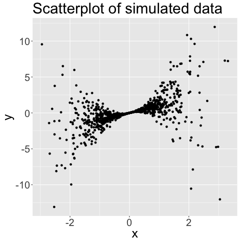

::: article
# Introduction {#sec:intro}

[@rathouz2009generalized] introduced the generalized linear density
ratio model (gldrm), which is a novel semiparametric formulation of the
classical glm. Although Rathouz and Gao did not use the term gldrm, we
refer to it as such because it is a natural extension of the density
ratio model (see e.g. [@Lovric2011]). Like a standard glm, the gldrm
relates the conditional mean of the response to a linear function of the
predictors through a known link function $g$. To be specific, let the
random variable $Y$ be a scalar response, and let $X$ be a $p \times 1$
covariate vector for a particular observation. The model for the mean is
$$\label{eqn:meanmodel}
\text{E}(Y|X=x) = g^{-1}(x^T \beta)\ .   (\#eq:eqnmeanmodel)$$
Because Equation \@ref(eq:eqnmeanmodel) holds for both gldrm and glm,
the regression coefficients have the same interpretation for both
models. The gldrm relaxes the standard glm assumption that the
distribution of $Y|X$ comes from a particular exponential family model.
Instead, assume that $Y|X$ comes from an exponential tilt model of the
form
$$f(y|X=x) = f_0(y) \exp\{\theta y - b(\theta)\}\ ,$$
where
$$b(\theta) = \log \int f_0(y) \exp(\theta y)\ d\lambda(y)\ ,$$
and $\theta$ is defined implicitly as the solution to
$$\label{eqn:thetadef}
g^{-1}(x^T \beta) = \int y \exp\{\theta y - b(\theta)\}\ d\lambda(y)\ .   (\#eq:eqnthetadef)$$
Here $f_0$ is an unspecified probability density with respect to a
measure $\lambda$. We call $f_0$ the *reference distribution*. Measure
$\lambda$ is Lebesgue if $Y|X$ is continuous, a counting measure if
$Y|X$ is discrete, or a mixture of the two if $Y|X$ has a mixture
distribution. Note that $\text{E}(Y|X) = b'(\theta)$ and
$\text{Var}(Y|X) = b''(\theta)$, which are standard glm properties.

The regression coefficients $\beta$ and reference distribution $f_0$ are
estimated by maximizing a semiparametric likelihood function, which
contains a nonparametric representation of $f_0$ that has point mass
only at values of $Y$ observed in the data. The quantity $\theta$ is not
a parameter in this model, but rather a function of the free parameters
$\beta$ and $f_0$, as well as of $X$. This work was fully developed by
[@huang2012proportional], who first focused on the case where the
covariate vector takes one of finitely many values, drawing on
theoretical arguments advanced in the empirical likelihood literature
(e.g. [@owen2001empirical]). Drawing on semiparametric profile
likelihood methods, [@huang2014joint] went on to fully generalize the
asymptotic arguments, proving consistency and asymptotic normality of
the regression coefficient estimators, and deriving the asymptotic
variance matrix using the profile likelihood. Huang also proved
pointwise asymptotic normality of the reference cumulative distribution
function estimator.

Despite these important theoretical advances, computation for this model
has remained a practical challenge. The original algorithm in
[@rathouz2009generalized] is somewhat rudimentary and applies mostly to
cases with finite support. It does not scale well, and stability and
speed are challenges. This paper proposes a new algorithm to address
these challenges and render the model more widely applicable.

In particular, the issue of optimizing the semiparametric likelihood
over the $f_0$ point masses is improved with application of the
Broyden-Fletcher-Goldfarb-Shanno (BFGS) technique
[@broyden1970; @fletcher1970; @goldfarb1970; @shanno1970]. Because the
number of parameters in the semiparametric likelihood associated with
$f_0$ is equal to the number of unique points in the response vector,
the rank of the Hessian matrix can become unwieldy, especially for
continuous response data. The BFGS method uses an easily-computed
rank-two approximate Hessian matrix that has an inverse which is much
less computationally intensive to calculate.

The optimization techniques in this paper have been incorporated into
the R package [*gldrm*](https://CRAN.R-project.org/package=gldrm)
[@wurmgldrm], the first CRAN package for gldrm. This package estimates
the gldrm model and provides coefficient standard errors. In addition,
since the publication of [@rathouz2009generalized], [@huang2014joint]
developed likelihood ratio tests and likelihood ratio-based confidence
intervals for regression coefficients and demonstrated their strong
properties. The *gldrm* package provides utilities for likelihood ratio
tests of nested models, as well as confidence intervals.

We present our optimization algorithm in Section 2. In Section 3, we
present simulation experiments to check the finite sample performance of
the gldrm estimators and the accuracy of estimated standard errors using
this algorithm. In Section 4, we discuss methods for inference. Section
5, we present a simulation that benchmarks the computational time and
how it scales with the number of observations and number of covariates.
In Section 6, we present a summary of the functions in the *gldrm*
package. In Section 7, we demonstrate the functionality of the *gldrm*
package with an example in R. In Section 8, we make concluding remarks.

# Optimization algorithm {#sec:algorithm}

Suppose we have an observed sample $(x_1, y_1), \ldots, (x_n, y_n)$
generated by the model specified in Equations
\@ref(eq:eqnmeanmodel)-\@ref(eq:eqnthetadef). The $x_i$ can be fixed or
random, and the $y_i$ are conditionally independent given the
covariates. Let $\mathcal{S} = (s_1, \ldots, s_K)$ be the observed
support, i.e. a vector containing the unique values in the set
$\{y_1, \ldots, y_n\}$. If the response follows a continuous
distribution, then $K$ will equal $n$. Otherwise $K$ may be less than
$n$ due to ties. Let the vector $\tilde{f}_0 = (f_1, \ldots, f_K)$
represent probability mass at the points $(s_1, \ldots, s_K)$. This is a
nonparametric representation of $f_0$ because the true reference density
may be continuous or have probability mass at values not contained in
$\mathcal{S}$.

The semiparametric log-likelihood is
$$\label{eqn:sp-loglik}
\ell(\beta, \tilde{f}_0) = \sum_{i=1}^n \left\{ \theta_i y_i - \log \sum\limits_{k=1}^K f_k \exp(\theta_i s_k) + \sum\limits_{k=1}^K I(y_i = s_k) \log f_k \right\} \ ,   (\#eq:eqnsp-loglik)$$
where each $\theta_i$ is defined implicitly as the solution to
$$\label{eqn:thetadef-sp}
g^{-1}(x_i^T \beta) = \frac{\sum\limits_{k=1}^K s_k f_k \exp\{\theta_i s_k\}}{\sum\limits_{k=1}^K f_k \exp\{\theta_i s_k\}} \ .   (\#eq:eqnthetadef-sp)$$
There exists a $\theta_i$ that satisfies Equation
\@ref(eq:eqnthetadef-sp) as long as $g^{-1}(x_i^T \beta) \in (m, M)$ for
all $i$, where $m \equiv \min(\mathcal{S})$ and
$M \equiv \max(\mathcal{S})$.

We obtain parameter estimates from this likelihood as
$\underset{(\beta, \tilde{f}_0)}{\arg \max}\ \ell(\beta, \tilde{f}_0)$,
subject to the following constraints:

C1.  $g^{-1}(x_i^T \beta) \in (m, M)$ for all $i$

C2.  $f_k > 0$ for all $k = 1, \ldots, K$

C3.  $\sum\limits_{k=1}^K f_k = 1$

C4.  $\sum\limits_{k=1}^K s_k f_k = \mu_0$ for some chosen
    $\mu_0 \in (m, M)$

Constraint (C4) is necessary for identifiability because for any
nonparametric density $\tilde{f}_0 = (f_1, \ldots, f_k)^T$, the
"exponentially tilted" density
$\tilde{f}_0^{(\alpha)} = (f_1 e^{\alpha s_1}, \ldots, f_K e^{\alpha s_K})^T / \sum\limits_{k=1}^K f_k e^{\alpha s_k}$
has the same semiparametric log-likelihood for any
$\alpha \in \mathbb{R}$, i.e.
$\ell(\beta, \tilde{f}_0) = \ell(\beta, \tilde{f}_0^{(\alpha)})$ for all
$\beta$. We can set $\mu_0$ to be any value within the range of observed
response values, but choosing a value too extreme can lead to numerical
instability in estimating $\tilde{f}_0$. It usually works well to choose
$\mu_0 = \frac{1}{n} \sum\limits_{i=1}^n y_i$.

To perform the optimization, we take an iterative approach, alternating
between optimizing over $\tilde{f}_0$ and over $\beta$
[@rathouz2009generalized]. Each optimization step marginally optimizes
the log-likelihood over one set of parameters, holding the other fixed.
Neither optimization step has a closed form solution, so iterative
procedures must be used. To update $\tilde{f}_0$, we propose using the
BFGS technique. To update $\beta$, we use Fisher scoring, which is
equivalent to iteratively re-weighted least squares (IRLS). We propose
iterating BFGS until convergence for each $\tilde{f}_0$ update, while
only using a single IRLS iteration to update $\beta$ in between
$\tilde{f}_0$ updates; this is tantamount to a profile likelihood
approach to estimation of $\beta.$

Although the log-likelihood in Equation \@ref(eq:eqnsp-loglik) is a
function of $(\beta, \tilde{f}_0)$, we have expressed it in terms of
$(\theta_1, \ldots, \theta_n);$ each $\theta_i$ is implicitly a function
of $(\beta, \tilde{f}_0)$. The score function is also best expressed in
terms of the $\theta_i$'s (see Equations \@ref(eq:eqnf0score) and
\@ref(eq:eqnbetascore)). Consequently, our optimization algorithm
requires the $\theta_i$'s to be computed each time $\beta$ or
$\tilde{f}_0$ is updated. To do this, we use an iterative Newton-Raphson
procedure after each iteration of the $\beta$ update or the
$\tilde{f}_0$ update procedures.

In what follows, we detail updates of the $\theta_i$'s, of
$\tilde{f}_0$, and of $\beta$. We use the notation $b(\theta)$ to denote
the function defined in Equation \@ref(eq:eqnthetadef) with respect to
the discrete probability distribution specified by $\tilde{f}_0$, i.e.
$b(\theta) = \log \sum\limits_{k=1}^K f_k \exp(\theta s_k)$. We also
define $\mu_i \equiv g^{-1}(x_i^T \beta)$.

## $\theta$ update procedure

$\theta_i$ is defined implicitly as the solution to Equation
\@ref(eq:eqnthetadef-sp), which can be written as
$$\label{eqn:theta-eqn}
\mu_i = b'(\theta_i) \ .   (\#eq:eqntheta-eqn)$$
To calculate $\theta_i$, we use the Newton-Raphson procedure provided in
Appendix C of [@rathouz2009generalized]. To satisfy equation
\@ref(eq:eqntheta-eqn), we need to find $\theta$ such that
$\mu_i = b'(\theta)$, or equivalently $g_l(\mu_i) = g_l\{b'(\theta)\}$,
where
$g_l(s) = \text{logit} \left( \frac{s - m}{M - m} \right) = \log \left( \frac{s - m}{M - s} \right)$.
(The transformation, $g_l$, stabilizes the solution.)

We use Newton-Raphson to find the root of
$t(\theta) = g_l\{b'(\theta)\} - g_l(\mu_i)$. Let $\theta^{(r)}$ denote
the approximate solution at the $r^{\text{th}}$ Newton-Raphson
iteration. The Newton-Raphson update is given by
$$\theta^{(r+1)} = \theta^{(r)} - \left\{ t'(\theta^{(r)}) \right\}^{-1} t(\theta^{(r)})\ ,$$
where
$$t'(\theta) = \frac{M - m}{\{b'(\theta) - m\} \{M - b'(\theta)\}} b''(\theta)\ ,$$
and
$$b''(\theta) = \sum\limits_{k=1}^K \left\{s_k - b'(\theta) \right\}^2 f_k \exp\left\{ \theta s_k - b(\theta) \right\}\ .$$

We typically initialize $\theta^{(0)}$ to be the value obtained from the
previous $\theta$ update procedure. The first time $\theta$ is updated,
we initialize $\theta^{(0)}$ to zero for every observation. We define
convergence when $|t(\theta^{(r)})| < \epsilon$, where $\epsilon$ is a
small threshold such as $10^{-10}$.

As $\mu_i \rightarrow M$ from the left, $\theta_i \rightarrow +\infty$.
Likewise, as $\mu_i \rightarrow m$ from the right,
$\theta_i \rightarrow -\infty$. To prevent numerical instability when
$\mu_i$ is at or near these boundaries, we cap $|\theta_i|$ at a maximum
value (500 by default). The appropriateness of this threshold would
depend on the scale of response variable. Rather than adjust the
threshold, we center and scale the response variable to the interval
\[-1, 1\] (see the subsequent section on "response variable
transformation").

## $\tilde{f}_0$ optimization procedure

Holding $\beta$ fixed at its current estimate, we need to marginally
optimize the log-likelihood $\ell(\beta, \tilde{f}_0)$ over
$\tilde{f}_0$, subject to constraints (C2)-(C4). The linear constraints
(C3) and (C4) could be enforced using constrained optimization
techniques such as Lagrange multipliers or reducing the dimension of the
parameter space by two. @huang2012proportional used the former
technique, while @rathouz2009generalized used the latter. We propose a
different method, based on the BFGS technique, that is more
computationally efficient. At each iteration, we apply a BFGS update to
$\tilde{f}_0$ to improve the unconstrained log-likelihood and then
transform $\tilde{f}_0$ to satisfy constraints (C3) and (C4).
Application of the constraints does not affect the log-likelihood of the
estimate, as the constraints are only required for identifiability (i.e.
uniqueness of the optimal $\tilde{f}_0$). For any set of positive
$\tilde{f}_0$ values, there exists a unique set of values with equal
log-likelihood that satisfies both constraints (C3) and (C4).

We define the transformation
$\tilde{g}_0 = (g_1, \ldots, g_k) = (\log f_1, \ldots, \log f_K)$ and
consider the log-likelihood as a function of $\tilde{g}_0$ only, with
$\beta$ held fixed. Working on the log scale enforces constraint (C2)
and also improves numerical stability. Specifically, numerical stability
is improved by working with the score and Hessian as a function of
$\tilde{g}_0$ rather than $\tilde{f}_0$.

BFGS is a quasi-Newton procedure, which makes iterative updates using an
approximate Hessian matrix along with the exact score function. Let
$\tilde{g}_0^{(t)}$ be the estimate at the $t^\text{th}$ iteration. The
updates take the form
$$\label{eqn:bfgs-update}
\tilde{g}_0^{(t+1)} \leftarrow \tilde{g}_0^{(t)} - H_t^{-1} S(\tilde{g}_0^{(t)}; \beta) \ .   (\#eq:eqnbfgs-update)$$
Here, $S(\tilde{g}_0; \beta)$ is the score as a function of
$\tilde{g}_0$ only, holding $\beta$ fixed. It has $k^\text{th}$ element
$$\label{eqn:f0score}
\{ S(\tilde{g}_0; \beta) \}_k  = \sum\limits_{i=1}^n \left\{ I(y_i = s_k) - \frac{\exp(g_k + \theta_i s_k)}{\exp\{b(\theta_i)\}} - \frac{\exp(g_k + \theta_i s_k)}{\exp\{b(\theta_i)\}} \frac{s_k - \mu_i}{b''(\theta_i)} (y_i - \mu_i) \right\}   (\#eq:eqnf0score)$$
for $k = 1, \ldots, K$ (derivation in Appendix A). Note that this score
function ignores constraints (C3) and (C4). The matrix $H_t$ is an
approximation to the Hessian of the log-likelihood as a function of
$\tilde{g}_0$ only, holding $\beta$ fixed. This estimate is updated with
each iteration. Letting $u_t = \tilde{g}_0^{(t)} - \tilde{g}_0^{(t-1)}$
and $v_t = S(\tilde{g}_0^{(t)}; \beta) - S(\tilde{g}_0^{(t-1)}; \beta)$,
we can write the BFGS estimate of the Hessian recursively as
$$H_t = H_{t-1} + \frac{v_t v_t^T}{u_t^T v_t} - \frac{H_{t-1} u_t u_t^T H_{t-1}}{u_t^T H_{t-1} u_t} \ .$$
$H_t$ is a rank-2 update to $H_{t-1}$ that satisfies the secant
condition: $H_t u_t = v_t$. Furthermore, $H_t$ is guaranteed to be
symmetric and positive definite, even though the true Hessian is not
full rank. (The true Hessian is not full rank because without imposing
constraints (C3) and (C4), the log-likelihood does not have a unique
optimum.) The BFGS update in Equation \@ref(eq:eqnbfgs-update) requires
the inverse of $H_t$, which can be calculated efficiently and directly,
without calculating $H_t$. By the Sherman-Morrison-Woodbury formula,
$$H_t^{-1} = H_{t-1}^{-1} + \frac{(u_t^T v_t + v_t^T H_{t-1}^{-1} v_t)(u_t u_t^T)}{(u_t^T v_t)^2} - \frac{H_{t-1}^{-1} v_t u_t^T + u_t v_t^T H_{t-1}^{-1}}{u_t^T v_t} \ .$$
For an initial estimate, we propose $H_0^{-1} = \alpha I_K$, where $I_K$
is the $K \times K$ identity matrix. We perform a line search along the
gradient to choose an appropriate value for $\alpha$ such that
$\ell(\beta, \tilde{f}_0^{(1)}) > \ell(\beta, \tilde{f}_0^{(0)})$.

As previously mentioned, constraints (C3) and (C4) are only required for
identifiability. After each BFGS iteration, we impose these constraints
on the $\tilde{f}_0$ estimate, which does not affect the log-likelihood
of the estimate. Specifically, we apply (C3) by scaling our estimate of
$\tilde{f}_0$ to sum to one. We then "exponentially tilt" the estimate
to enforce constraint (C4). In other words, we compute $\theta$ such
that
$\sum\limits_{j=1}^K s_j f_j e^{\theta s_j} / \sum\limits_{j=1}^K f_j e^{\theta s_j} = \mu_0$,
and set our final estimate for the iteration to be
$f_k \leftarrow f_k e^{\theta s_k} / \sum\limits_{j=1}^K f_j e^{\theta s_j}$
for all $k$.

We initialize $\tilde{g}_0^{(0)}$ to the log of the $\tilde{f}_0$
estimate obtained from the previous $\tilde{f}_0$ update procedure. We
suggest using the empirical response distribution as an initial estimate
of $\tilde{f}_0$. We define convergence using the relative change in the
log-likelihood. Our default convergence threshold is $10^{-10}$. If the
log-likelihood decreases after any iteration, we backtrack by half
steps, setting
$\tilde{g}_0^{(t+1)} \leftarrow \frac{1}{2} \left( \tilde{g}_0^{(t+1)} + \tilde{g}_0^{(t)} \right)$
until the log-likelihood improves. In our experience, we have found that
the log-likelihood improves after most iterations without taking half
steps, but log-likelihood decreases can occur sporadically (both at
early and late iterations).

## $\beta$ optimization procedure

Holding $\tilde{f}_0$ fixed at its current estimate, we could marginally
optimize the log-likelihood over $\beta$ using iteratively re-weighted
least squares (IRLS). Rather than iterating until convergence, however,
we propose using a single IRLS iteration to update $\beta$ in between
$\tilde{f}_0$ updates. The IRLS algorithm is simply the Newton-Raphson
algorithm, but using the Fisher information in place of the negative
Hessian matrix. This technique is commonly referred to as Fisher
Scoring. As we now show, the Fisher Scoring update minimizes a weighted
least squares expression, which is why we can refer to the algorithm as
IRLS. The score function is given by
$$\label{eqn:betascore}
S(\beta; \tilde{f}_0) 
= \sum\limits_{i=1}^n x_i \left( \frac{1}{g'(\mu_i)} \right) \left( \frac{1}{b''(\theta_i)} \right) (y_i - \mu_i) 
= \mathbf{X}^T \mathbf{W} \mathbf{r} \ ,   (\#eq:eqnbetascore)$$
(derivation in Appendix C) and the Fisher information is
$$\label{eqn:betainfo}
\begin{split}
\mathcal{I}(\beta; \tilde{f}_0) &= \text{E} \left( S(\beta; \tilde{f}_0) S(\beta; \tilde{f}_0)^T \bigg| X_1=x_1, \ldots, X_n=x_n \right) \\
&= \sum\limits_{i=1}^n x_i \left( \frac{1}{g'(\mu_i)} \right)^2 \left( \frac{1}{b''(\theta_i)} \right) x_i^T \\
&= \mathbf{X}^T \mathbf{W} \mathbf{X}\ ,
\end{split}   (\#eq:eqnbetainfo)$$
where $\mathbf{X}$ is an $n \times p$ matrix with rows $x_i^T$,
$\mathbf{W}$ is an $n \times n$ diagonal matrix with entries
$\left( \frac{1}{g'(\mu_i)} \right)^2 \frac{1}{b''(\theta_i)}$, and
$\mathbf{r}$ is an $n \times 1$ vector with entries
$g'(\mu_i) (Y_i - \mu_i)$.

Let $\beta^{(0)}$ be the estimate obtained from the previous $\beta$
update procedure. The IRLS step between $\beta^{(0)}$ and the updated
estimate, $\beta^{(1)}$, is
$$\label{eqn:beta-update}
\begin{split}
\beta^{(1)} - \beta^{(0)} &= \left\{ \mathcal{I}(\beta^{(0)}; \tilde{f}_0) \right\}^{-1} S(\beta^{(0)}; \tilde{f}_0) \\
&= \left( \mathbf{X}^T \mathbf{W} \mathbf{X} \right)^{-1} \mathbf{X}^T \mathbf{W} \mathbf{r}\ .
\end{split}   (\#eq:eqnbeta-update)$$
This is the solution to a weighted least squares expression, which can
be computed efficiently using QR decomposition.

## Response variable transformation

Numerical stability issues can occur if the $\exp\{\theta_i s_k\}$ terms
become too large or small during optimization. To prevent these terms
from exceeding R's default floating-point number range, we transform the
response vector to the interval \[-1, 1\]. Specifically, the response
values are transformed to
$y_i^* = (y_i - \frac{m+M}{2}) \cdot \frac{2}{M-m}$. It turns out the
semiparametric log-likelihood function with the transformed response and
modified link function $g_*(\mu) = g(\frac{m+M}{2} + \frac{M-m}{2} \mu)$
is equivalent to the original log-likelihood. The parameters $\beta$ and
$\tilde{f}_0$ that optimize the modified log-likelihood also optimize
the original log-likelihood (proof in Appendix D).

As mentioned in the "$\theta$ update procedure" section, we choose to
cap $|\theta|$ for each observation at 500 by default, thereby
restricting the rescaled $\theta_i s_k$ terms to the interval \[-500,
500\]. Note that the optimization function in the *gldrm* R package
returns the estimated $\theta_i$ values for each observation, and these
values are on the original scale of the response variable.

# Inference {#sec:inference}

The *gldrm* R package [@wurmgldrm] can perform inference on the
regression coefficients using likelihood ratio tests for nested models.
It can also calculate likelihood ratio, Wald, or score confidence
intervals. All three confidence intervals should yield similar results
for large samples, but the Wald form may be preferred for its
computational simplicity. Likelihood ratio and score confidence
intervals are more computationally expensive to calculate.
@huang2014joint recommends likelihood ratio tests for small samples.

The Wald asymptotic variance estimate for the $\beta$ estimator can be
obtained from the inverse of the information matrix given in Equation
\@ref(eq:eqnbetainfo). Recall this information matrix is calculated with
the $\tilde{f}_0$ parameters held fixed. Its inverse is a valid
asymptotic variance matrix because the full information matrix is block
diagonal; i.e., the $\beta$ and $\tilde{f}_0$ estimators are
asymptotically independent. The *gldrm* optimization function returns
standard error estimates for each coefficient, which are displayed by
the print method along with p-values. Wald confidence intervals are
straightforward to calculate from the standard errors and can be
obtained from the `gldrmCI` function. For these single-coefficient
hypothesis tests and confidence intervals, we approximate the null
distribution by a $t$-distribution with $n-p$ degrees of freedom, where
$n$ is the number of observations and $p$ is the rank of the covariate
matrix.

Likelihood ratio tests for nested models are based on the usual test
statistic: 2 times the log-likelihood difference between the full and
reduced model. Following @huang2014joint, we approximate the null
distribution by an $F$-distribution with $q$ and $n-p$ degrees of
freedom, where $q$ is the difference in the number of parameters between
the full and reduced models. This test can be performed by the
`gldrmLRT` function.

Likelihood ratio and score confidence intervals for a single coefficient
can be obtained from the `gldrmCI` function. These confidence intervals
are more computationally expensive than Wald confidence intervals
because an iterative method is required to search for the interval
boundaries. We use the following bisection method.

Suppose we want to obtain the lower boundary of a confidence level
$1-\alpha$ interval for a single coefficient $\beta^*$, and that the
gldrm estimate of this coefficient is $\hat{\beta}^*$. For the lower
boundary, we need to find $\beta_\text{lo}^*$ such that
$\beta_\text{lo}^* < \hat{\beta}^*$ and the one-sided likelihood ratio
test has a p-value equal to $\alpha / 2$ under the null hypothesis
$H_0: \beta^* = \beta_\text{lo}^*$. As explained in the next paragraph,
we can compute the p-value for any guess of $\beta_\text{lo}^*$. We
begin by finding a guess that is too low (p-value less than
$\alpha / 2$) and a guess that is too high (p-value greater than
$\alpha / 2$). We then obtain the p-value of the midpoint. If the
p-value is less than $\alpha / 2$ then the midpoint becomes the new low
guess, and if it is greater than $\alpha / 2$ then the midpoint becomes
the new high guess. We iterate this process, each time halving the
distance between the low guess and high guess, until we have a guess of
$\beta_\text{lo}^*$ that has a p-value arbitrarily close to
$\alpha / 2$. The same procedure can be used to solve for
$\beta_\text{hi}^*$.

Let $\beta_0$ be any constant. To calculate the likelihood ratio or
score test p-value of $H_0: \beta^* = \beta_0$, we need to optimize the
log-likelihood over $\tilde{f}_0$ and all other $\beta$ values, holding
$\beta^*$ fixed at $\beta_0$. This can be done by multiplying $\beta_0$
with the column of the $\mathbf{X}$ matrix corresponding to $\beta^*$
and treating this vector as an offset to the linear predictor. In other
words, this vector contains a fixed component of the linear predictor
for each observation. The $\beta^*$ column is dropped from $\mathbf{X}$,
and the model is optimized with the offset term.

# Goodness of fit {#sec:goodness-of-fit}

To check the model fit, we calculate the randomized probability inverse
transform [@smith1985]. This is done by evaluating the fitted
conditional cdf (i.e., the cumulative distribution function, conditional
on the covariates) of each observed response value. If the model fit is
good, the probability inverse transform values should roughly follow a
uniform distribution on the interval (0, 1). Because the gldrm fitted
cdf is discrete, we use randomization to make the distribution
continuous as follows.

Let $\hat{F}(y|X=x)$ denote the fitted cdf conditional on a covariate
vector $x$ evaluated at $y$, and let
$y_i^- = \text{max} \left( \{y_j: y_j < y_i\} \bigcup \{-\infty\} \right)$.
For each observation, we draw a random value from a uniform distribution
on the interval
$\left( \hat{F}(y_i | X = x_i),\ \hat{F}(y_i^- | X = x_i) \right)$.

To illustrate a good gldrm fit, we generate 1,000 independent pairs
$(x, y)$ where $x \sim$ Normal(mean = 0, sd = 1) and $y|x \sim$
Normal(mean = x, sd = 1). The mean of $y|x$ is linear in $x$, and the
data generating mechanism is an exponential tilt family, so we expect
the gldrm fit to be good. We fit the model and then do a visual check by
plotting the histogram and uniform QQ plot of the randomized probability
inverse transform values (Figure [1](#fig:pit1)).

<figure id="fig:pit1">
<p></p>
<figcaption>Figure 1: Scatterplot and probability inverse transform
histogram and QQ plot for a good gldrm model fit.</figcaption>
</figure>

To illustrate a poor gldrm fit, we generate 1,000 independent pairs
$(x, y)$ where $x \sim$ Normal(mean = 0, sd = 1) and $y|x \sim$
Normal(mean = $x$, sd = $x^2$). The mean of $y|x$ is again linear in
$x$, but this data generating mechanism is not an exponential tilt
family. The diagnostic plots (Figure [2](#fig:pit2)) confirm that the
gldrm fit is not ideal. The probability inverse transform values are
concentrated near the center of the interval (0, 1) rather than being
uniformly distributed. The gldrm still provides a good estimate of the
regression coefficients and the mean of $y|x$, but it is not the correct
model for the cdf of $y|x$. .

<figure id="fig:pit2">
<p></p>
<figcaption>Figure 2: Scatterplot and probability inverse transform
histogram and QQ plot for a poor gldrm model fit.</figcaption>
</figure>

# Simulation experiments {#sec:sim-inference}

Under four different simulation scenarios, we check the finite sample
performance of the regression coefficient estimators, $\hat{\beta}$, as
well as the reference distribution cdf estimator $\hat{F}_0()$. For
$\hat{\beta}$, we also check the accuracy of the estimated standard
errors.

For each simulation, the data generating mechanism is a gamma glm. The
covariates are the same under each simulation setting, and their values
are fixed, not random. The covariate vector is
$x = (x_0, x_1, x_2, x_3)$. Variable $x_0$ is an intercept column of
ones. Variable $x_1$ is an indicator with exactly 20% ones in each
sample (observations 5, 10, 15, 20, $\ldots$ have $x_1=1$, and the rest
have $x_1=0$). Variable $x_2$ is a continuous variable that follows a
uniform sequence between zero and one in each sample (the first
observation has $x_2=0$, and the last observation has $x_2=1$). Lastly,
$x_3 = x_1 \cdot x_2$.

The coefficient values were $(\beta_1, \beta_2, \beta_3) = (1, 1, -2)$
for all simulation scenarios. The intercepts were $\beta_0 = 0$ for
simulations 1 & 2, and $\beta_0 = 1$ for simulations 3 & 4. These values
were selected so the mean response values were centered close to one
and, for the identity link scenarios, guaranteed to be positive.

The log link was used for simulations 1 & 2, and the identity link was
used for simulations 3 & 4. For all four simulations, the response was
drawn from a gamma distribution with
$\text{Var}(y|x) = \phi \text{E}(y|x)^2$, where $\phi$ varies by
simulation to achieve different $R^2$ values. $R^2$ is defined as the
squared correlation between the response and linear combination of
predictors.

1.  Simulation 1: log link and high $R^2$ ($\phi = 0.5$,
    $R^2 \approx 0.13$)

2.  Simulation 2: log link and low $R^2$ ($\phi = 4$,
    $R^2 \approx 0.019$)

3.  Simulation 3: identity link and high $R^2$ ($\phi = 0.25$,
    $R^2 \approx 0.13$)

4.  Simulation 4: identity link and low $R^2$ ($\phi = 2$,
    $R^2 \approx 0.018$)

A gldrm was fit to each data set with correct link function and with
$\tilde{f}_0$ constrained to have mean $\mu_0 = 1$. If we had followed
our usual practice of choosing $\mu_0$ to be the sample mean of the
observed response values, then the reference distribution would have a
different mean for each simulation replicate. By choosing $\mu_0 = 1$
for all replicates, the true $f_0$ always follows a gamma distribution
with mean one and variance $\phi$, where $\phi$ varies by simulation
scenario. The value $\mu_0 = 1$ was chosen because, by design, it fell
within the range of observed response values for all 2,000 replicates of
each simulation scenario. The cumulative reference distribution
estimate, denoted as $\hat{F}_0(\cdot)$, was computed at percentiles
0.1, 0.25, 0.5, 0.75, 0.9.

For each simulation scenario, we display four tables. The first table
(Tables [1](#tab:sim1-betamean), [5](#tab:sim2-betamean),
[9](#tab:sim3-betamean), and [13](#tab:sim4-betamean)) contains the
sample mean of each $\beta$ estimator. For comparison, we also
calculated the gamma glm coefficient estimates for each simulated data
set and display the sample mean alongside in parentheses.

The second table (Tables [2](#tab:sim1-betamse), [6](#tab:sim2-betamse),
[10](#tab:sim3-betamse), and [14](#tab:sim4-betamse)) contains the root
mean squared error (rmse) of each $\beta$ estimator. The rmse is
calculated as
$\sqrt{\frac{1}{2000} \sum_{i=1}^{2000} (\hat{\beta}_i - \beta)^2}$,
where $\hat{\beta}_i$ is the estimator of the $i^\text{th}$ simulation
replicate, and $\beta$ is the true parameter value. For comparison, we
also show the relative efficiency compared to the gamma glm estimator.
Relative efficiency is calculated as
$\text{mse}_{\text{glm}} / \text{mse}_{\text{gldrm}}$, where mse is the
mean squared error (not rmse).

The third table (Tables [3](#tab:sim1-betacov), [7](#tab:sim2-betacov),
[11](#tab:sim3-betacov), and [15](#tab:sim4-betacov)) contains Wald
confidence interval coverage rates for each $\beta$ estimator.
Confidence intervals were calculated based on a $t$-distribution with
$n - 4$ degrees of freedom.

The fourth table (Tables [4](#tab:sim1-f0), [8](#tab:sim2-f0),
[12](#tab:sim3-f0), and [16](#tab:sim4-f0)) contains the mean of
$\hat{F}_0()$, calculated at the true $10^\text{th}$, $25^\text{th}$,
$50^\text{th}$, $75^\text{th}$, and, $90^\text{th}$ percentiles.

To summarize the results, the gldrm estimators perform as expected. In
all four simulation scenarios, the bias of $\hat{\beta}$ and
$\hat{F}_0()$ goes to zero as the sample size increases. For the high
$R^2$ scenarios, there is very little bias even at $n = 25$. Also, the
relative efficiency of the $\beta$ estimators compared to the gamma glm
estimators goes to one as the sample size increases. This is expected
because, as @rathouz2009generalized demonstrated, the $\beta$ and $f_0$
estimators are asymptotically orthogonal, so gldrm and glm have equal
asymptotic efficiency when the glm model is correctly specified. For the
high $R^2$ scenarios, the relative efficiency is close to one even at
$n = 25$. For the low $R^2$ scenarios, the gldrm estimator is actually
more efficient than the glm estimator for small sample sizes.

The standard error estimates for gldrm $\beta$ estimators are
consistently low for small sample sizes, as demonstrated by low Wald
confidence interval coverage rates. The coverage rates improve with
increasing sample size, demonstrating good asymptotic properties of the
standard error estimators. Likelihood ratio confidence intervals can be
calculated with the *gldrm* R package and may have better small sample
performance, as demonstrated by @huang2014joint.

## Simulation 1

Simulation 1 uses log link with $\beta = (0, 1, 1, -2)$ and
$\phi = 0.5$. This results in an $R^2$ of approximately 0.13. The
simulation was replicated 2,000 times.

::: {#tab:sim1-betamean}
  ---------------- ------------------------------------- --------------- ---------------
                     $\hat{\beta}$ mean (gamma glm mean)                 

                                                  n = 25         n = 100         n = 400

     $\beta_0 = 0$                         -0.02 (-0.02)     0.00 (0.00)     0.00 (0.00)

     $\beta_1 = 1$                           0.93 (0.92)     0.98 (0.99)     0.99 (0.99)

     $\beta_2 = 1$                           0.99 (1.00)     0.99 (1.00)     1.00 (1.00)

    $\beta_3 = -2$                         -2.00 (-2.00)   -2.00 (-2.01)   -1.99 (-1.99)
  ---------------- ------------------------------------- --------------- ---------------

  : Table 1: Sample mean of $\hat{\beta}$. For comparison, the gamma glm
  sample mean is shown in parentheses.
:::

::: {#tab:sim1-betamse}
  ----------- ------------------------------------------ ------------- -------------
                $\hat{\beta}$ rmse (relative efficiency)               

                                                  n = 25       n = 100       n = 400

    $\beta_0$                                0.31 (0.99)   0.16 (1.00)   0.08 (1.00)

    $\beta_1$                                0.81 (0.96)   0.38 (1.01)   0.18 (1.00)

    $\beta_2$                                0.54 (1.00)   0.27 (1.00)   0.14 (0.99)

    $\beta_3$                                1.27 (0.96)   0.63 (1.00)   0.30 (1.00)
  ----------- ------------------------------------------ ------------- -------------

  : Table 2: Root mean squared error (rmse) of $\hat{\beta}$. In
  parentheses is the relative efficiency compared to the gamma glm
  estimator.
:::

::: {#tab:sim1-betacov}
  ----------- ---------- --------- --------- ---------- --------- --------- ---------- --------- ---------
                80% C.I.                       90% C.I.                       95% C.I.           

                  n = 25   n = 100   n = 400     n = 25   n = 100   n = 400     n = 25   n = 100   n = 400

    $\beta_0$      0.755     0.799     0.805      0.870     0.896     0.899      0.920     0.945     0.944

    $\beta_1$      0.677     0.764     0.800      0.782     0.860     0.900      0.837     0.919     0.949

    $\beta_2$      0.742     0.784     0.810      0.853     0.883     0.896      0.910     0.940     0.950

    $\beta_3$      0.681     0.767     0.806      0.800     0.869     0.907      0.867     0.920     0.948
  ----------- ---------- --------- --------- ---------- --------- --------- ---------- --------- ---------

  : Table 3: Wald confidence interval coverage rate for $\beta$.
:::

::: {#tab:sim1-f0}
  ---------- ------ --------------------- --------- ---------
                      $\hat{F}_0(y)$ mean           

    $F_0(y)$    $y$                n = 25   n = 100   n = 400

        0.10   0.27                 0.082     0.097     0.099

        0.25   0.48                 0.222     0.244     0.249

        0.50   0.84                 0.487     0.498     0.499

        0.75   1.35                 0.759     0.751     0.750

        0.90   1.94                 0.911     0.902     0.900
  ---------- ------ --------------------- --------- ---------

  : Table 4: Sample mean of $\hat{F}_0$ at selected true percentiles.
:::

## Simulation 2

Simulation 2 uses log link with $\beta = (0, 1, 1, -2)$ and $\phi = 4$.
This results in an $R^2$ of approximately 0.019. The simulation was
replicated 2,000 times.

::: {#tab:sim2-betamean}
  ---------------- ------------------------------------- --------------- ---------------
                     $\hat{\beta}$ mean (gamma glm mean)                 

                                                  n = 25         n = 100         n = 400

     $\beta_0 = 0$                         -0.16 (-0.19)   -0.05 (-0.06)   -0.02 (-0.02)

     $\beta_1 = 1$                           0.21 (0.29)     0.80 (0.84)     0.96 (0.97)

     $\beta_2 = 1$                           0.90 (0.96)     0.99 (1.01)     1.00 (1.00)

    $\beta_3 = -2$                         -1.74 (-1.98)   -1.93 (-2.01)   -1.99 (-2.00)
  ---------------- ------------------------------------- --------------- ---------------

  : Table 5: Sample mean of $\hat{\beta}$. For comparison, the gamma glm
  sample mean is shown in parentheses.
:::

::: {#tab:sim2-betamse}
  ----------- ------------------------------------------ ------------- -------------
                $\hat{\beta}$ rmse (relative efficiency)               

                                                  n = 25       n = 100       n = 400

    $\beta_0$                                0.94 (1.14)   0.45 (1.04)   0.23 (1.00)

    $\beta_1$                                2.83 (1.43)   1.12 (1.09)   0.51 (1.02)

    $\beta_2$                                1.62 (1.19)   0.78 (1.05)   0.39 (1.01)

    $\beta_3$                                4.18 (1.59)   1.88 (1.14)   0.89 (1.02)
  ----------- ------------------------------------------ ------------- -------------

  : Table 6: Root mean squared error (rmse) of $\hat{\beta}$. In
  parentheses is the relative efficiency compared to the gamma glm
  estimator.
:::

::: {#tab:sim2-betacov}
  ----------- ---------- --------- --------- ---------- --------- --------- ---------- --------- ---------
                80% C.I.                       90% C.I.                       95% C.I.           

                  n = 25   n = 100   n = 400     n = 25   n = 100   n = 400     n = 25   n = 100   n = 400

    $\beta_0$      0.704     0.770     0.782      0.806     0.877     0.888      0.869     0.933     0.945

    $\beta_1$      0.626     0.724     0.781      0.732     0.832     0.883      0.794     0.897     0.935

    $\beta_2$      0.680     0.755     0.774      0.795     0.862     0.881      0.869     0.925     0.939

    $\beta_3$      0.633     0.722     0.762      0.750     0.829     0.879      0.819     0.895     0.935
  ----------- ---------- --------- --------- ---------- --------- --------- ---------- --------- ---------

  : Table 7: Wald confidence interval coverage rate for $\beta$.
:::

::: {#tab:sim2-f0}
  ---------- ------ --------------------- --------- ---------
                      $\hat{F}_0(y)$ mean           

    $F_0(y)$    $y$                n = 25   n = 100   n = 400

        0.10   0.00                 0.093     0.100     0.101

        0.25   0.01                 0.230     0.247     0.250

        0.50   0.17                 0.465     0.496     0.499

        0.75   1.04                 0.727     0.747     0.749

        0.90   3.00                 0.903     0.899     0.900
  ---------- ------ --------------------- --------- ---------

  : Table 8: Sample mean of $\hat{F}_0$ at selected true percentiles.
:::

## Simulation 3

Simulation 3 uses identity link with $\beta = (1, 1, 1, -2)$ and
$\phi = 0.25$. This results in an $R^2$ of approximately 0.13. The
simulation was replicated 2,000 times.

::: {#tab:sim3-betamean}
  ---------------- ------------------------------------- --------------- ---------------
                     $\hat{\beta}$ mean (gamma glm mean)                 

                                                  n = 25         n = 100         n = 400

     $\beta_0 = 1$                           1.00 (1.00)     0.99 (0.99)     1.00 (1.00)

     $\beta_1 = 1$                           1.01 (1.01)     1.00 (1.00)     0.99 (0.99)

     $\beta_2 = 1$                           1.01 (1.01)     1.01 (1.01)     1.00 (1.00)

    $\beta_3 = -2$                         -2.02 (-2.01)   -2.01 (-2.01)   -1.99 (-1.99)
  ---------------- ------------------------------------- --------------- ---------------

  : Table 9: Sample mean of $\hat{\beta}$. For comparison, the gamma glm
  sample mean is shown in parentheses.
:::

::: {#tab:sim3-betamse}
  ----------- ------------------------------------------ ------------- -------------
                $\hat{\beta}$ rmse (relative efficiency)               

                                                  n = 25       n = 100       n = 400

    $\beta_0$                                0.25 (0.99)   0.13 (0.99)   0.07 (1.00)

    $\beta_1$                                0.88 (0.96)   0.40 (0.99)   0.20 (1.00)

    $\beta_2$                                0.55 (0.98)   0.28 (0.99)   0.14 (1.00)

    $\beta_3$                                1.26 (0.98)   0.63 (0.98)   0.32 (1.00)
  ----------- ------------------------------------------ ------------- -------------

  : Table 10: Root mean squared error (rmse) of $\hat{\beta}$. In
  parentheses is the relative efficiency compared to the gamma glm
  estimator.
:::

::: {#tab:sim3-betacov}
  ----------- ---------- --------- --------- ---------- --------- --------- ---------- --------- ---------
                80% C.I.                       90% C.I.                       95% C.I.           

                  n = 25   n = 100   n = 400     n = 25   n = 100   n = 400     n = 25   n = 100   n = 400

    $\beta_0$      0.735     0.793     0.802      0.830     0.888     0.892      0.888     0.939     0.947

    $\beta_1$      0.670     0.789     0.799      0.785     0.875     0.892      0.847     0.931     0.949

    $\beta_2$      0.737     0.782     0.796      0.849     0.885     0.893      0.916     0.941     0.943

    $\beta_3$      0.667     0.773     0.792      0.800     0.876     0.896      0.872     0.937     0.942
  ----------- ---------- --------- --------- ---------- --------- --------- ---------- --------- ---------

  : Table 11: Wald confidence interval coverage rate for $\beta$.
:::

::: {#tab:sim3-f0}
  ---------- ------ --------------------- --------- ---------
                      $\hat{F}_0(y)$ mean           

    $F_0(y)$    $y$                n = 25   n = 100   n = 400

        0.10   0.44                 0.077     0.095     0.098

        0.25   0.63                 0.219     0.244     0.249

        0.50   0.92                 0.492     0.498     0.499

        0.75   1.28                 0.769     0.753     0.751

        0.90   1.67                 0.913     0.903     0.901
  ---------- ------ --------------------- --------- ---------

  : Table 12: Sample mean of $\hat{F}_0$ at selected true percentiles.
:::

## Simulation 4

Simulation 4 uses identity link with $\beta = (1, 1, 1, -2)$ and
$\phi = 2$. This results in an $R^2$ of approximately 0.018. The
simulation was replicated 2,000 times.

::: {#tab:sim4-betamean}
  ---------------- ------------------------------------- --------------- ---------------
                     $\hat{\beta}$ mean (gamma glm mean)                 

                                                  n = 25         n = 100         n = 400

     $\beta_0 = 1$                           1.02 (1.02)     1.01 (1.01)     1.00 (1.00)

     $\beta_1 = 1$                           0.91 (0.89)     0.97 (1.00)     0.99 (0.99)

     $\beta_2 = 1$                           0.99 (1.02)     0.97 (0.98)     0.99 (1.00)

    $\beta_3 = -2$                         -1.86 (-1.85)   -1.92 (-1.95)   -1.98 (-1.99)
  ---------------- ------------------------------------- --------------- ---------------

  : Table 13: Sample mean of $\hat{\beta}$. For comparison, the gamma
  glm sample mean is shown in parentheses.
:::

::: {#tab:sim4-betamse}
  ----------- ------------------------------------------ ------------- -------------
                $\hat{\beta}$ rmse (relative efficiency)               

                                                  n = 25       n = 100       n = 400

    $\beta_0$                                0.73 (1.17)   0.39 (1.02)   0.19 (1.00)

    $\beta_1$                                2.35 (1.05)   1.16 (1.09)   0.58 (1.02)

    $\beta_2$                                1.58 (1.18)   0.81 (1.03)   0.40 (1.00)

    $\beta_3$                                3.27 (1.18)   1.83 (1.11)   0.92 (1.02)
  ----------- ------------------------------------------ ------------- -------------

  : Table 14: Root mean squared error (rmse) of $\hat{\beta}$. In
  parentheses is the relative efficiency compared to the gamma glm
  estimator.
:::

::: {#tab:sim4-betacov}
  ----------- ---------- --------- --------- ---------- --------- --------- ---------- --------- ---------
                80% C.I.                       90% C.I.                       95% C.I.           

                  n = 25   n = 100   n = 400     n = 25   n = 100   n = 400     n = 25   n = 100   n = 400

    $\beta_0$      0.661     0.761     0.794      0.754     0.845     0.893      0.802     0.893     0.938

    $\beta_1$      0.595     0.718     0.767      0.692     0.822     0.868      0.741     0.870     0.921

    $\beta_2$      0.665     0.769     0.779      0.777     0.864     0.895      0.847     0.910     0.943

    $\beta_3$      0.666     0.711     0.777      0.789     0.824     0.877      0.871     0.892     0.932
  ----------- ---------- --------- --------- ---------- --------- --------- ---------- --------- ---------

  : Table 15: Wald confidence interval coverage rate for $\beta$.
:::

::: {#tab:sim4-f0}
  ---------- ------ --------------------- --------- ---------
                      $\hat{F}_0(y)$ mean           

    $F_0(y)$    $y$                n = 25   n = 100   n = 400

        0.10   0.02                 0.085     0.097     0.100

        0.25   0.10                 0.223     0.246     0.249

        0.50   0.45                 0.474     0.493     0.499

        0.75   1.32                 0.741     0.749     0.750

        0.90   2.71                 0.907     0.902     0.900
  ---------- ------ --------------------- --------- ---------

  : Table 16: Sample mean of $\hat{F}_0$ at selected true percentiles.
:::

## Likelihood ratio and score confidence intervals

To support our claim that likelihood ratio confidence intervals may have
better small sample performance, we compared the Wald, likelihood ratio,
and score 95% confidence interval coverage rates under the settings of
Simulation 1 with $n = 25$. The coverage rates are shown in Table
[17](#tab:cov95-score-lrt). The Wald coverage rates are similar to those
in Table [3](#tab:sim1-betacov), but not identical because this
experiment used a new set of 2,000 replicates.

While the Wald confidence intervals tend to be too narrow, the score
confidence intervals tend to be a bit too wide. The likelihood ratio
intervals have coverage rates much closer to 0.95 than the corresponding
Wald or score intervals. This is consistent with the findings of
[@huang2014joint].

::: {#tab:cov95-score-lrt}
  ------------------------------------------------------------------
                       $\beta_0$   $\beta_1$   $\beta_2$   $\beta_3$
  ------------------ ----------- ----------- ----------- -----------
                Wald       0.918       0.823       0.909       0.859

    Likelihood ratio       0.969       0.939       0.958       0.944

               Score       0.976       0.966       0.967       0.967
  ------------------------------------------------------------------

  : Table 17: Coverage rates for 95% confidence intervals under the
  settings of Simulation 1.
:::

# Computational time and scaling {#sec:sim-benchmark}

The following simulation explores the computation time of *gldrm* and
how it scales with the number of observations $n$ and number of
covariates $p$. For each value of $n$ and $p$, we fit *gldrm* to 100
randomly generated data sets. A gldrm was fit once to each data set.

Covariates were drawn independently from a standard normal distribution,
and coefficients were drawn independently from a uniform distribution on
the interval (-1, 1). Simulation 1 used an identity link function with
response drawn from a normal distribution with variance function
$V(\mu) = 1$. Simulation 2 used a log link function with response drawn
from an exponential distribution, i.e. a gamma distribution with
variance function $V(\mu) = \mu^2$.

Iteration limits were set at 100 per $\theta$ update, 1,000 per $f_0$
update, and 100 for the outer loop (for which each iteration consists of
a single-iteration $\beta$ update, followed by an $f_0$ update).
Convergence thresholds were set at $10^{-10}$ for the $\theta$ update,
$f_0$ update, and outer loop update. This experiment was run using a 2.2
GHz AMD Opteron 6174 processor. Figures [3](#fig:bench1) and
[4](#fig:bench2) show the average CPU seconds for Simulations 1 and 2,
respectively.

We also repeated this experiment with the number of support points fixed
at 25. To do this, we generated $n$ response values from the model. The
first 25 values were designated as the support, and the remaining
response values were matched to the nearest support value and set to
that value. This discrete data generating model is not actually a gldrm
model, but we are only using it to evaluate computation time. Figures
[5](#fig:bench-fixed25-1) and [6](#fig:bench-fixed25-2) show the average
CPU seconds for Simulations 1 and 2, respectively, with support size
fixed at 25.

In summary, the computation time scales roughly linearly with $n$ when
the support is fixed at 25. When the support grows with $n$, the
computation time grows faster than linearly. Computation time increases
with $p$, but there is not a consistent pattern, especially with fixed
support.

{#fig:bench1
width="100%" alt="graphic without alt text"}

{#fig:bench2
width="textwidth"}

{#fig:bench-fixed25-1
width="100%" alt="graphic without alt text"}

{#fig:bench-fixed25-2
width="100%" alt="graphic without alt text"}

# R package: gldrm {#sec:gldrm-package}

The *gldrm* package [@wurmgldrm] was written entirely in the R
programming language. Its primary functions are the following.

-   `gldrm` is the main function for fitting gldrm models.
-   `gldrmLRT` performs a likelihood ratio test between nested gldrm
    models. The test statistic is calculated as
    $2 \times (llik - llik_0) / r$, where $r$ is the difference is the
    number of parameters between the full and null models. Under the
    null hypothesis, the test statistic follows an asymptotic F
    distribution with degrees of freedom $r$ and $n-p$, where $n$ is the
    number of observations and $p$ is the number of parameters in the
    full model.
-   `gldrmCI` calculates Wald or likelihood ratio confidence intervals
    for a single coefficient.
-   `predict.gldrmFit` is a predict method, which is modeled after the
    `print.glm` method in the *stats* package. Predictions can be
    obtained on the scale of the response or linear predictor, or the
    tilted nonparametric density for each observation can be returned.
-   `gldrmPIT` Returns a set of randomized probability inverse transform
    values and plots the histogram and uniform QQ plot.

# R example: iris data {#sec:iris}

We demonstrate the *gldrm* package using the Iris data set from the
*datasets* package. This is a data set of $n = 150$ observations. We
choose sepal length to be the response variable. This variable has 35
unique values, so the support is $K = 35$. We first demonstrate how to
fit a gldrm model with the optimization function, which is simply called
`gldrm`. We demonstrate how to perform inference on the regression
coefficients. We check the goodness of fit using the randomized
probability inverse transform. Finally we show how to obtain predictions
for a set of observations, including the predicted mean and
nonparametric estimate of the distribution function.

## Fit gldrm model

The `gldrm` optimization function takes a formula and data argument,
similar to R's `glm` function. Instead of passing both an error
distribution and link function through a family argument, the `gldrm`
only requires a link function. The `link` argument will accept the name
of a link function (any function supported by `make.link` in the `stats`
package is accepted). Alternatively, a custom link function can be
passed as a list containing three items:

1.  `linkfun` A vectorized link function.

2.  `linkinv` The corresponding inverse link function, also vectorized.

3.  `mu.eta` The derivative of the inverse link function, also
    vectorized.

This list structure is the same as that of `link-glm` class objects,
which are constructed by the `make.link` function. The custom link
option allows great flexibility, but it is imperative that the user
correctly specifies the inverse link and its derivative.

``` r
R> ### Load gldrm package and Iris data from datasets package
R> library(gldrm)
R> data(iris, package = "datasets")

R> ### Fit gldrm with all variables
R> fit <- gldrm(Sepal.Length ~ Sepal.Width + Petal.Length + Petal.Width + Species,
R+              data = iris, link = "log")
R> fit

Summary of gldrm fit

Coefficients:
Estimate Std. Error t value Pr(>|t|)    
(Intercept)         1.1832     0.0369   32.10  < 2e-16 ***
Sepal.Width         0.0788     0.0128    6.17  6.4e-09 ***
Petal.Length        0.1128     0.0102   11.04  < 2e-16 ***
Petal.Width        -0.0350     0.0248   -1.41    0.162    
Speciesversicolor  -0.0561     0.0395   -1.42    0.157    
Speciesvirginica   -0.0994     0.0557   -1.79    0.076 .  
---
Signif. codes:  0 ‘***’ 0.001 ‘**’ 0.01 ‘*’ 0.05 ‘.’ 0.1 ‘ ’ 1

Likelihood ratio test against null model:
F-statistic:  57.4 
Numerator degrees of freedom:  5 
Denominator degrees of freedom:  144 
P-value:  < 2e-16 
```

## Inference {#inference}

The `gldrmLRT` function performs a semiparametric likelihood ratio test
between two nested models. We demonstrate this on the Iris data by
fitting a sub-model that excludes \"Species\", which is a categorical
variable with three levels and two degrees of freedom. We also obtain
Wald and likelihood ratio confidence intervals for the petal width
coefficient.

``` r
R> ### Fit gldrm without the categorical variable "Species"
R> fit0 <- gldrm(Sepal.Length ~ Sepal.Width + Petal.Length + Petal.Width,
R+               data = iris, link = "log")

R> ### Likelihood ratio test for the nested models
R> gldrmLRT(fit, fit0)

Likelihood ratio test:

F-statistic:  2.03 
Numerator degrees of freedom:  2 
Denomicator degrees of freedom:  144 
P-value:  0.135 

R> ### Wald 95% confidence interval for Petal.Width
R> gldrmCI(fit, term = "Petal.Width", test = "Wald", type = "2-sided", level = .95)

95% Wald confidence interval for Petal.Width:
(-0.084, 0.014)

R> ### Likelihood ratio 95% confidence interval for Petal.Width
R> gldrmCI(fit, term = "Petal.Width", test = "LRT", type = "2-sided", level = .95)

95% likelihood ratio confidence interval for Petal.Width:
(-0.094, 0.025)
```

## Goodness of fit {#goodness-of-fit}

The `gldrmPIT` function produces goodness of fit plots using the
probability inverse transform. In addition to plotting, this function
also returns the inverse transform values as a vector.

``` r
R> pit <- gldrmPIT(fit)
```

{width="100%"
alt="graphic without alt text"}


## Prediction

We obtain predictions for three selected observations in the data set:
one from each Species. These observations were contained in training
data, but we could obtain predictions for out-of-sample observations in
the same way. Using the `predict` method, we obtain the fitted mean
response value for each observation, which is the estimate of
$\text{E}(Y | X = x)$.

We also use the `predict` method to obtain the nonparametric estimate of
the conditional density $f(y | X=x)$. This is obtained by setting the
argument `type = "fTilt"`, which returns an $n \times K$ matrix with
$(i, k)^\text{th}$ entry
$\tilde{f}_k \exp\{\theta_i s_k - b(\theta_i)\}$. Each row contains the
nonparametric conditional density estimate for a given observation and
sums to one. We use this matrix to calculate the conditional
probabilities for the form $\text{P}(y_1 < Y \le y_2 | X=x)$ for each
observation. Note that all observed support values (sepal length values)
fall between four and eight, so all probability mass falls within this
interval.

``` r
R> ### Select three observations; one from each Species
R> newdata <- iris[c(1, 51, 101), ]

R> ### Fitted mean Sepal.Length
R> fitted_mean <- predict(fit, newdata = newdata, type = "response")
R> fitted_mean <- round(fitted_mean, 2)

R> ### Estimated Sepal.Length distribution of each observation
R> ### Note: all Sepal.Length values are between 4 and 8
R> fTilt <- predict(fit, newdata = newdata, type = "fTilt")
R> spt <- fit$spt
R> F4 <- rowSums(fTilt[ , spt <= 4])
R> F5 <- rowSums(fTilt[ , spt <= 5])
R> F6 <- rowSums(fTilt[ , spt <= 6])
R> F7 <- rowSums(fTilt[ , spt <= 7])
R> F8 <- rowSums(fTilt[ , spt <= 8])
R> Ftilt <- cbind(F5-F4, F6-F5, F7-F6, F8-F7)
R> Ftilt <- round(Ftilt, 3)
R> colnames(Ftilt) <- c("P(4=Y<=5)", "P(5<Y<=6)", "P(6<Y<=7)", "P(7<Y<=8)")
R> cbind(newdata, fitted_mean, Ftilt)
```

``` r
    Sepal.Length Sepal.Width Petal.Length Petal.Width    Species fitted_mean
1            5.1         3.5          1.4         0.2     setosa        5.00
51           7.0         3.2          4.7         1.4 versicolor        6.43
101          6.3         3.3          6.0         2.5  virginica        6.91
    P(4<Y<=5) P(5<Y<=6) P(6<Y<=7) P(7<Y<=8)
1       0.625     0.375     0.000     0.000
51      0.000     0.136     0.832     0.032
101     0.000     0.006     0.649     0.344
```

# Discussion {#sec:Discussion}

We introduced a new optimization algorithm for gldrm, which
computationally scales better with the number of unique observed
response values. This is especially useful for estimation of continuous
response data where the number of parameters in the $\tilde{f}_0$
parameter equals the sample size. In particular, the BFGS technique
dramatically speeds up the $\tilde{f}_0$ optimization step, and makes
gldrm much more computationally feasible for either discrete or
continuous response data. The new algorithm is implemented in the
*gldrm* package. Simulation results show that the algorithm and software
obtain accurate estimates and standard errors. Computational time was
shown to be feasible for support sizes well over one thousand.

Future research directions could include the incorporation of random
effects into the gldrm framework. Optimization techniques for
generalized linear mixed models, such as adaptive Gaussian quadrature,
may be useful for model estimation
[@Pinheiro2006; @pinheiro1995approximations].

# Acknowledgments {#sec:acknowledgments}

Research reported in this publication was supported by the National
Heart, Lung, and Blood Institute of the National Institutes of Health
under award number T32 HL083806 (for MJW) and R01 HL094786-05A1 (for
PJR). The content is solely the responsibility of the authors and does
not necessarily represent the official views of the National Institutes
of Health.

We thank Dr. Alan Huang, University of Queensland, for suggesting the
use of probability inverse transform diagnostic plots, as well as
providing the corresponding code, which we have incorporated into the
*gldrm* package.

# Notation {#app:notation}

In this appendix, we use $\partial$ to denote the partial derivative and
$d$ to denote the total derivative. We require this notation for chain
rule derivatives, specifically to derive the score function with respect
to $\beta$ and $\tilde{f}_0$. Each $\theta_i$ is implicitly a function
of $(\beta, \tilde{f}_0)$ and hence should not be held fixed when
differentiating the log-likelihood with respect to either $\beta$ or
$\tilde{f}_0$. We also let
$$\label{eqn:elli-def}
\ell_i = \theta_i y_i - \log \sum\limits_{k=1}^K f_k \exp(\theta_i s_k) + \sum\limits_{k=1}^K I(y_i = s_k) \log f_k   (\#eq:eqnelli-def)$$
denote the contribution of the $i^\text{th}$ observation to the
log-likelihood.

# A.  Score function for $\tilde{f}_0$ {#app:f0-score}

We derive Equation \@ref(eq:eqnf0score), which gives the score function
with respect to $\tilde{f}_0$, holding $\beta$ fixed. Using the
definition of $\ell_i$ in Equation \@ref(eq:eqnelli-def) and applying
the chain rule, the $k^\text{th}$ element of the score function is
$$\label{eqn:f0score-chain}
\{ S(\tilde{f}_0; \beta) \}_k = \frac{d \ell(\beta, \tilde{f}_0)}{d f_k} 
= \sum\limits_{i=1}^n \frac{d \ell_i}{d f_k}
= \sum\limits_{i=1}^n \left( \frac{\partial \ell_i}{\partial f_k} + \frac{d \theta_i}{d f_k} \frac{\partial \ell_i}{\partial \theta_i} \right) \ .   (\#eq:eqnf0score-chain)$$
The first term on the RHS of Equation \@ref(eq:eqnf0score-chain) is
$$\label{eqn:f0score-term1}
\frac{\partial \ell_i}{\partial f_k} = \frac{I(y_i = s_k)}{f_k} - \frac{\exp\{\theta_i s_k\}}{\sum\limits_{m=1}^K f_m \exp\{\theta_i s_m\}} \ .   (\#eq:eqnf0score-term1)$$
The second term on the RHS of Equation \@ref(eq:eqnf0score-chain) is
$$\label{eqn:f0score-term2}
\frac{\partial \ell_i}{\partial \theta_i}
= y_i - \frac{\sum\limits_{k=1}^K s_k f_k \exp\{\theta s_k\}}{\sum\limits_{k=1}^K f_k \exp\{\theta s_k\}}
= y_i - \mu_i \ .   (\#eq:eqnf0score-term2)$$
Recall that $\mu_i = g^{-1}(x_i^T \beta)$, which does not vary with
$\tilde{f}_0$. Therefore,
$$0 = \frac{d}{d f_k} \mu_i 
= \frac{\partial \mu_i}{\partial f_k} + \frac{d \theta_i}{d f_k} \frac{\partial \mu_i}{\partial \theta_i} \ ,$$
and the third term on the RHS of Equation \@ref(eq:eqnf0score-chain) is
$$\label{eqn:f0score-term3}
\frac{d \theta_i}{d f_k} 
= -\frac{\partial \mu_i}{\partial f_k} \bigg/ \frac{\partial \mu_i}{\partial \theta_i}
= -\frac{\exp\{\theta_i s_k\} (s_k - \mu_i)}{\exp\{b(\theta_i)\}} \bigg/ b''(\theta_i) \ .   (\#eq:eqnf0score-term3)$$
Plugging the results of Equations \@ref(eq:eqnf0score-term1),
\@ref(eq:eqnf0score-term2), and \@ref(eq:eqnf0score-term3) into Equation
\@ref(eq:eqnf0score-chain), we obtain
$$\{ S(\tilde{f}_0; \beta) \}_k  = \sum\limits_{i=1}^n \left\{ \frac{I(y_i = s_k)}{f_k} - \frac{\exp(\theta_i s_k)}{\exp\{b(\theta_i)\}} - \frac{\exp(\theta_i s_k)}{\exp\{b(\theta_i)\}} \frac{s_k - \mu_i}{b''(\theta_i)} (y_i - \mu_i) \right\} \ .$$
We obtain the result of Equation \@ref(eq:eqnf0score) by applying the
Jacobian transformation
$\{S(\tilde{g}_0; \beta)\}_k = f_k \{S(\tilde{f}_0; \beta)\}_k$.

# B.  Information matrix for $\tilde{f}_0$ {#app:f0-info}

The $\tilde{f}_0$ information matrix is not used during the BFGS
optimization routine. However, we derive it here to correct a missing
term in the @rathouz2009generalized derivation. Each matrix element is

$$\label{eqn:f0info1}
\begin{split}
\left\{ \mathcal{I}(\tilde{f}_0; \beta) \right\}_{(k, m)} 
&= \text{E} \left( \left\{ S(\tilde{f}_0; \beta) \right\}_k \left\{S(\tilde{f}_0; \beta) \right\}_m \bigg| X_k=x_k, X_m=x_m \right) \\
&= \sum\limits_{i=1}^n \text{E}\left\{ A_k A_m - 2 A_k B_m + B_k B_m \right | X_k=x_k, X_m=x_m\} \ ,
\end{split}   (\#eq:eqnf0info1)$$
where
$$A_k = \frac{I(y_i = s_k)}{f_k} - \frac{\exp(\theta_i s_k)}{\exp\{b(\theta_i\}}$$
and
$$B_k = \frac{\exp(\theta_i s_k)}{\exp\{b(\theta_i)\}} - \frac{\exp(\theta_i s_k)}{\exp\{b(\theta_i)\}} \frac{s_k - \mu_i}{b''(\theta_i)} (y_i - \mu_i) \ .$$
From here on, all expectations are conditional on $X_k=x_k, X_m=x_m$,
but we suppress the conditional expression. The first term on the RHS of
Equation \@ref(eq:eqnf0info1) is
$$\label{eqn:f0info2}
\text{E}(A_k A_m) = \frac{\exp(\theta_i s_k) I(k=m)}{f_k \exp\{b(\theta_i)\}} - \frac{\exp(\theta_i s_k + \theta_i s_m)}{\exp\{2 b(\theta_i)\}} \ .   (\#eq:eqnf0info2)$$
The second term on the RHS of Equation \@ref(eq:eqnf0info1) is
$$\label{eqn:f0info3}
E(B_k B_m) = \frac{\exp(\theta_i s_k + \theta_i s_m)}{\exp\{2 b(\theta_i)\}} \frac{(s_k - \mu_i)(s_m - \mu_i)}{b''(\theta_i)} \ ,   (\#eq:eqnf0info3)$$
where we use the fact that
$\text{E}\{(y_i - \mu_i)^2 \} = \text{Var}(y_i) = b''(\theta_i)$. The
third term on the RHS of Equation \@ref(eq:eqnf0info1) is
$$\label{eqn:f0info4}
\text{E}(A_k B_m) = \frac{\exp(\theta_i s_k + \theta_i s_m)}{\exp\{2 b(\theta_i)\}} \frac{(s_k - \mu_i)(s_m - \mu_i)}{b''(\theta_i)} \ ,   (\#eq:eqnf0info4)$$
where we use the fact that
$\text{E}\{I(y_i = s_k)(y_i - \mu_i)\} = (y_k - \mu_i) f_k \exp(\theta_i s_k) / \exp\{b(\theta_i)\}$.
Plugging the results of Equations
\@ref(eq:eqnf0info2)-\@ref(eq:eqnf0info4) into Equation
\@ref(eq:eqnf0info1), we obtain
$$\left\{ \mathcal{I}(\tilde{f}_0; \beta) \right\}_{(k, m)} = \sum_{i=1}^n \left\{ \frac{\exp(\theta_i s_k) I(k=m)}{f_k \exp\{b(\theta_i)\}} - \frac{\exp(\theta_i s_k + \theta_i s_m)}{\exp\{2 b(\theta_i)\}} - \frac{\exp(\theta_i s_k + \theta_i s_m)}{\exp\{2 b(\theta_i)\}} \frac{(s_k - \mu_i)(s_m - \mu_i)}{b''(\theta_i)} \right\} \ .$$

# C.  Score function for $\beta$ {#app:beta-score}

We derive Equation \@ref(eq:eqnbetascore), which gives the score
function with respect to $\beta$, holding $\tilde{f}_0$ fixed. By the
chain rule, each element is
$$\label{eqn:betascore1}
S(\beta; \tilde{f}_0)
= \frac{d \ell(\beta, \tilde{f}_0)}{d \beta}
= \sum\limits_{i=1}^n \frac{d \ell_i}{d \beta}
= \sum\limits_{i=1}^n \frac{d \mu_i}{d \beta} \frac{d \theta_i}{d \mu_i} \frac{\partial \ell_i}{\partial \theta_i}   (\#eq:eqnbetascore1)$$
We already derived the first term on the RHS of Equation
\@ref(eq:eqnbetascore1) in Equation \@ref(eq:eqnf0score-term2). Because
$\mu_i = b'(\theta_i)$,
$$\label{eqn:betascore2}
\frac{d \theta_i}{d \mu_i} = 1 / \left(\frac{d \mu_i}{d \theta_i}\right) = \frac{1}{b''(\theta_i)} \ .   (\#eq:eqnbetascore2)$$
Because $g(\mu_i) = x_i^T \beta$,
$$\label{eqn:betascore3}
\frac{d \mu_i}{d \beta} = x_i \left( \frac{1}{g'(\mu_i)} \right) \ .   (\#eq:eqnbetascore3)$$
Plugging the results of Equations \@ref(eq:eqnf0score-term2),
\@ref(eq:eqnbetascore2), and \@ref(eq:eqnbetascore3) into Equation
\@ref(eq:eqnbetascore1), we obtain the result of Equation
\@ref(eq:eqnbetascore).

# D.  Proof that transformed response with modified link function has equivalent log-likelihood {#app:response-transformation}

Let $\nu \equiv \frac{m+M}{2}$ and $\rho \equiv \frac{M-m}{2}$. Let
$y_i^* = (y_i - \nu) / \rho$ and $s_k^* = (s_k - \nu) / \rho$. Equation
\@ref(eq:eqnelli-def) can be rewritten
$$\begin{split}
\ell_i 
&= \theta_i (\nu + \rho y_i^*) - \log \sum\limits_{k=1}^K f_k \exp \left\{ \theta_i (\nu + \rho s_k^*) \right\} + \sum\limits_{k=1}^K I(y_i^* = s_k^*) \log f_k \\
&= \theta_i^* y_i^* - \log \sum\limits_{k=1}^K f_k \exp \{ \theta_i^* s_k^* \} + \sum\limits_{k=1}^K I(y_i^* = s_k^*) \log f_k \ ,
\end{split}$$
where $\theta_i^* = \theta_i \rho$. Equation \@ref(eq:eqnthetadef-sp)
can be rewritten as
$$\begin{split}
g^{-1}(x_i^T \beta) 
&= \frac{\sum\limits_{k=1}^K (\nu + \rho s_k^*) f_k \exp\left\{ \theta_i (\nu + \rho s_k^*) \right\}}{\sum\limits_{k=1}^K f_k \exp\{\theta_i (\nu + \rho s_k^*) \}} \\
&= \nu + \rho \left( \frac{\sum\limits_{k=1}^K s_k^* f_k \exp\left\{ \theta_i^* s_k^* \right\}}{\sum\limits_{k=1}^K f_k \exp\{\theta_i^* s_k^* \}} \right) \ .
\end{split}$$
Hence, if we define a modified link function
$g_*(\mu) = g(\nu + \rho \mu)$ with inverse
$g_*^{-1}(\eta) = (g^{-1}(\eta) - \nu) / \rho$, we can write
$$g_*^{-1}(x_i^T \beta) = \left( \frac{\sum\limits_{k=1}^K s_k^* f_k \exp\{\theta_i^* s_k^* \}}{\sum\limits_{k=1}^K f_k \exp\{\theta_i^* s_k^* \}} \right) \ .$$
In other words $\theta_i^*$ has the same implicit definition as
$\theta_i$ when the modified link function and transformed response
variable are used in place of the oginal. This shows that, as a function
of $(\beta, \tilde{f}_0)$, the log-likelihood with the transformed
response and modified link function is equivalent to the original
log-likelihood. Note that $\theta_i^*$ must be multiplied by $1 / \rho$
if one would like calculate $\theta_i$ on the original scale.
:::
