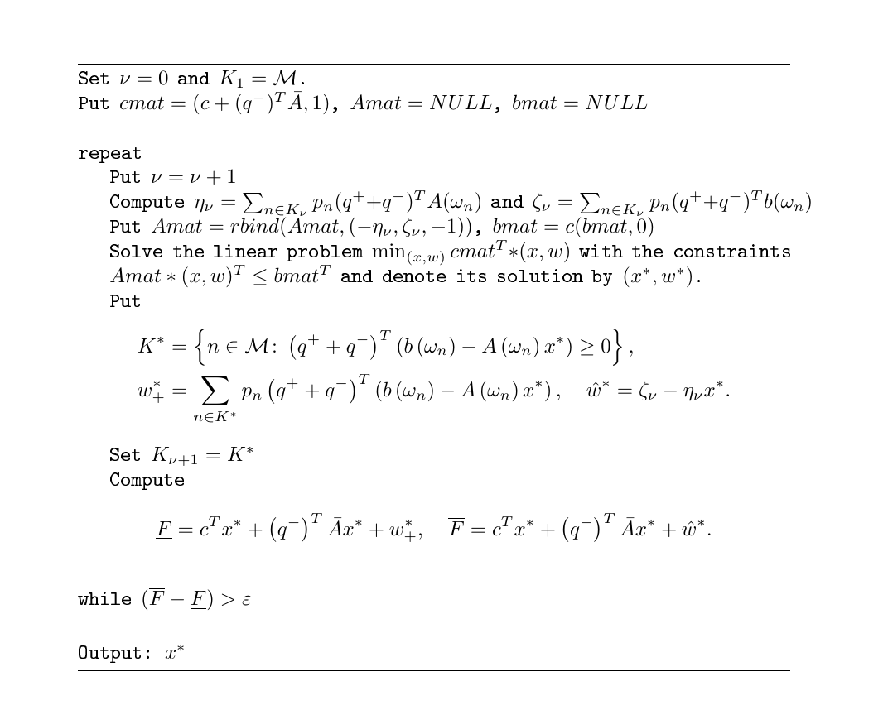
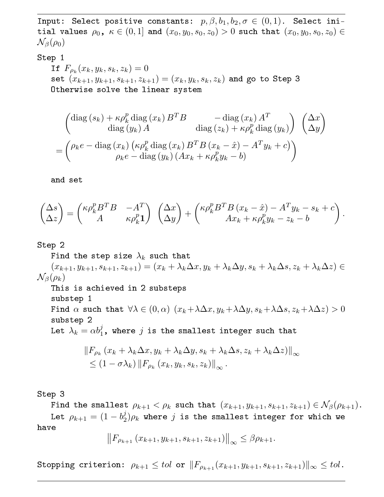

::: article
# Introduction

The construction of an optimal portfolio of financial instruments is one
of primal goals in asset management. Recent advances in risk measurement
advocate using risk measures that take into account the tail behavior of
asset return distributions, such as conditional value-at-risk or lower
semi-absolute deviation. For these risk measures, finding optimal
portfolios in risk-return setting leads to convex programming problems.
For a finite discrete distribution of returns and many practically used
risk measures the optimization problem can be solved by LP methods. The
portfolio optimization by LP methods leads to two problems: for
distributions with a large number of values (for example, a large sample
from a continuous distribution) one obtains a unique solution but the LP
problem is resource demanding; for distributions with a small number of
values one often obtains a non-unique solution, which is of limited use
for asset management. In the latter case, a unique optimal portfolio is
obtained by projecting a benchmark portfolio on the whole set of
solutions. In the paper we present an algorithm that solves efficiently
the problem with large distributions and an algorithm that finds an
orthogonal projection of the benchmark portfolio on the space of
solutions.

The R language and environment for statistical computing offer a large
variety of tools for portfolio optimization. General purpose
optimization tools are reviewed by [@Theussl] (R packages for solving
optimization problems) and [@konmiz] (R packages for convex
optimization). The book by [@pfaff] provides an overview of specific
functions for portfolio optimization which are embedded in financial
packages. Here we mention a selection of R-packages dedicated primarily
to portfolio optimization. The package
[***fPortfolio***](https://CRAN.R-project.org/package=fPortfolio) by
[@wurtz] offers a large set of functions for financial data analysis and
enables portfolio optimization in mean-variance, mean-MAD and mean-CVaR
settings. For these portfolio problems the package employs existing
optimization tools: LP, QP and NLP solvers. The package
[***PortfolioAnalytics***](https://CRAN.R-project.org/package=PortfolioAnalytics)
by [@Peterson_2015] uses standard linear and quadratic optimization
tools ([***Rglpk***](https://CRAN.R-project.org/package=Rglpk) and
[***quadprog***](https://CRAN.R-project.org/package=quadprog)) and a
number of new packages: stochastic optimization
([***DEoptim***](https://CRAN.R-project.org/package=DEoptim),
[***GenSA***](https://CRAN.R-project.org/package=GenSA)) and particle
swarm optimization
([***psoptim***](https://CRAN.R-project.org/package=psoptim)). The
package [***parma***](https://CRAN.R-project.org/package=parma) by
[@Ghalanos_2014] offers scenario and moment based optimization of
portfolios for a large class of risk and deviation measures using
***Rglpk***, ***quadprog*** and, for non-linear optimization
[***nloptr***](https://CRAN.R-project.org/package=nloptr). The above
mentioned packages are very effective in solving medium-size portfolio
problems, however, due to their use of standard optimization tools they
cannot deal with large problems either in the number of assets or the
size of the distribution. Moreover, none of these packages is able to
select an optimal portfolio which is closest to a given benchmark
portfolio.

The new package
[***PortfolioOptim***](https://CRAN.R-project.org/package=PortfolioOptim)
overcomes the aforementioned limitations solving portfolio problems in
mean-risk setting with linear portfolio constraints and risk measures
that make the problem reducible to a linear program. Attempts to apply
LP solvers to more general portfolio problems (cf. [@MOS] and references
therein) are not included in the package. Our first contribution is an
efficient search algorithm for optimal portfolios in stochastic programs
with a very large number of scenarios. A large number of scenarios in
portfolio optimization appears often when a continuous distribution of
returns is approximated by a discrete one. The goal is to obtain an
optimal portfolio which approximates the optimal portfolio for the
continuous distribution. This can be achieved by performing optimization
on a large discrete sample generated from the continuous distribution
under consideration. A large sample leads to a high dimensional LP
problem which can be difficult to solve by general-purpose LP solvers.
This problem has been addressed by @KM who solved the portfolio
optimization problem in mean-CVaR setting using Benders decomposition.
They have computed accurately CVaR of the optimal portfolio using
samples of order $10^4$. Our extension of this result is twofold. First,
we design an algorithm that implements Benders decomposition for a
general class of simple recourse problems. Portfolio optimization
problems for the risk measures mentioned above are special cases of
these simple recourse problems. Second, using an internal point LP
solver from GLPK library and appropriately modifying the stopping
criterion we substantially increase the size of discrete samples which
can be used in computations. Our algorithm can perform computations for
samples of order $10^6$ on a standard computer in a few seconds.

Our second contribution relates to portfolio optimization problems when
only a small number of random scenarios is available. Small discrete
samples in portfolio optimization appear when the distribution of
returns is an empirical distribution of historical returns. Usually one
takes 5 or 10 years of weekly or monthly returns giving between 120 and
500 samples. Solutions to linear programs of such dimensions are in many
cases non-unique and can occupy a whole face of a multidimensional
simplex. In such cases, a standard software finds only one solution,
usually an vertex of the solution simplex. This is often not the optimal
portfolio which asset managers consider as the most appropriate. Asset
managers have usually certain beliefs about the composition of optimal
portfolios and those can be expressed as similarity or vicinity of the
desired optimal portfolio to some benchmark portfolio. Therefore, one
wants to find an optimal portfolio which has the smallest distance to a
given benchmark, or, equivalently, the orthogonal projection of the
benchmark on the space of optimal portfolios.

In the LP literature a special case of the above projection problem has
been discussed for a long time. This is the problem of the least norm LP
solution, also called normal solution (cf. @zhaoli and references cited
therein). Unfortunately, the algorithms which find normal solutions
cannot be easily adapted to our problem. The reason is that portfolio
weights make up only a fraction of all coordinates of the LP solution
(see the examples in Sections [LP computable portfolio
problems](#sec:intro) and [Benders decomposition](#sec:ben)). Contrary
to the normal solution which is the projection of the origin onto the
simplex of optimal solutions, we are looking for a projection onto a
subspace of portfolio weights. In addition, we are not looking for a
solution with the least norm but for a solution with the smallest
distance to an arbitrary vector (benchmark portfolio). It appears
however, that the regularized central path algorithm due to @zhaoli
which solves simultaneously primal and dual LP problems finding the
least norm solutions to both problems, can be modified to our purposes.
Our contribution is the extension of this algorithm to the following
problem. Given the set $S^*$ of optimal solutions to an LP problem, find
$x^*\in S^*$ such that $\|B(x^* - \hat x)\| \le \|B(x - \hat x)\|$ for
all $x\in S^*$, where $\hat x$ is a given vector and $B$ is the operator
of projection on a subspace. This general algorithm is then adapted to
obtain an optimal portfolio with the smallest distance to a benchmark
(see Section [Projection algorithm for portfolio
optimization](#sec:projection) for details).

The rest of the paper is organized as follows. In Section [LP computable
portfolio problems](#sec:intro), we describe the portfolio optimization
problems that can be reduced to LP problems and are considered as
working examples in the rest of the paper. These portfolio optimization
problems are also implemented in the package ***PortfolioOptim***.
Section [Benders decomposition](#sec:ben) analyzes Benders decomposition
algorithm applied to simple recourse problems. As an illustration, we
present applications to the portfolio optimization in mean-CVaR and
mean-LSAD settings. Section [Projection algorithm for portfolio
optimization](#sec:projection) describes the adaptation of the
path-following algorithm of @zhaoli to the construction of an optimal
portfolio with the smallest distance to a benchmark portfolio. We
present also the proof of convergence for the modified algorithm.
Computational examples and the analysis of performance of both
algorithms are presented in Section [Numerical examples](#sec:num). The
paper ends with short [Summary](#sec:conc).

# LP computable portfolio problems {#sec:intro}

We consider the portfolio optimization problem in mean-risk setting. The
risk is measured by a risk (or deviation) measure $\mathcal{R}$ (for the
definitions of risk and deviation measures the reader is advised to
consult the paper by @rockafellar2006b). Let $R$ be a distribution of
returns of $J$ risky assets. We denote by $\hat R$ centered returns,
i.e. $\hat R = R-\mathbb{E}[R]$. Consider the problem of finding an
optimal portfolio $u$ which fulfills the conditions
$$\label{eqn:risk_optim}
\begin{cases}
\mathcal{R}\left(u^T R\right) \to \min,&\\
u^T \mathbb{E}\left[R\right] \ge r_0,&\\
u \in \mathbb{X},&
\end{cases}   (\#eq:eqnrisk-optim)$$
where $\mathbb{X}$ is a polyhedral set (i.e. given by linear
constraints) and $r_0$ is the required return of the portfolio. The set
$\mathbb{X}$ is usually the whole space (when no limitations on trading
positions are imposed) or the positive orthant (when short-selling of
assets is prohibited).

We will assume that at optimum the constraint
$u^T \mathbb{E}[R] \ge r_0$ is binding. This is the case when $r_0$ is
not smaller than the return for the minimal risk portfolio, i.e. the
portfolio which solves the problem
$\min_{u \in \mathbb{X}} \mathcal{R}(u^T R)$.

It appears that for a number of risk measures the optimization problem
\@ref(eq:eqnrisk-optim) formulated for a discrete distribution $R$ can
be reduced to a linear program. Let the asset returns $R$ be given by a
discrete distribution placing weights $p_n$ at points $r_n$,
$n = 1, \ldots, N$. When the distribution is centered points of $\hat R$
will be denoted by $\hat r_n$.

Consider the risk measured by conditional value at risk (CVaR). For a
random outcome $X$ we define $\textrm{VaR}_\alpha(X)$ as
$$\textrm{VaR}_\alpha\left(X\right) = - \inf \left\{ z :\ \mathbb{P}\left(X \le z\right) > \alpha \right\}.$$
Then the conditional value at risk is defined as
$$\textrm{CVaR}_\alpha\left(X\right) =  \frac{1}{\alpha} \int_0^\alpha \textrm{VaR}_p \left(X\right) dp.$$
@rockafellar2000 observed that for $X = u^T R$ the minimization of
$\textrm{CVaR}$ can be formulated as the following nonlinear problem
$$\label{eqn:cvar_RU}
\min_{u,\xi} \xi + \frac{1}{1-\alpha} \mathbb{E}\left[\left(-u^T  R -\xi\right)^+\right],   (\#eq:eqncvar-RU)$$
where the latent variable $\xi$ corresponds to
$\textrm{VaR}_\alpha(u^T   R)$. For discrete distributions and the risk
measured by CVaR, the portfolio optimization problem can therefore be
reformulated as the linear program
$$\label{eqn:discrete_CVar_lin}
\begin{cases}
\xi + \frac{1}{1-\alpha} \sum_{n=1}^N p_n y_n \to \min, &\\
y_n \ge 0, \quad n = 1, \dots, N, &\\
y_n + \xi +   r_n^T u \ge 0, \quad n = 1, \dots, N, &\\
\mu^T u \ge r_0,&\\
u \in \mathbb{X}.&
\end{cases}   (\#eq:eqndiscrete-CVar-lin)$$
Here $\mu = \mathbb{E}[R]$, while $y_n$ plays a role of the shortfall of
return $u^Tr_n$ below $\xi$:
$y_n = (-\xi - u^T   r_n)^+ = (\xi + u^T   r_n)^-$. For deviation CVaR
we replace $r_n$ by $\hat r_n$ in \@ref(eq:eqndiscrete-CVar-lin).

Consider now mean-MAD and mean-LSAD optimization problems. MAD (mean
absolute deviation) is defined as (cf. @KY)
$$MAD\left(u^T R\right) = \mathbb{E}\left[\left|u^T R -\mathbb{E}[u^T R]\right|\right] = \mathbb{E}\left[|u^T \hat R|\right].$$
For discrete distributions mean-MAD optimization problem reads
$$\label{eqn:MAD_optim}
\begin{cases}
\sum_{n=1}^N  p_n \left| \hat r_n^T u \right| \to \min, &\\
\mu^T u \ge r_0,&\\
u\in \mathbb{X}.&
\end{cases}   (\#eq:eqnMAD-optim)$$
This problem can be formulated as the linear program
$$\label{eqn:MAD_discrete}
\begin{cases}
\sum_{n=1}^N p_n y_n \to \min, &\\
y_n \ge 0, \quad n = 1, \dots, N &\\
y_n  + \hat r_n^T u \ge 0, \quad n = 1, \dots, N, &\\
y_n  - \hat r_n^T u \ge 0, \quad n = 1, \dots, N, &\\
\mu^T u \ge r_0,&\\
u\in \mathbb{X}.&
\end{cases}   (\#eq:eqnMAD-discrete)$$

For LSAD (lower semi absolute deviation) as defined by @konno or @KWY
$$LSAD\left(u^T R\right) = \mathbb{E}\left[\left|u^T R -\mathbb{E}[u^T R]\right|_{-}\right] = \mathbb{E}\left[|u^T \hat R|_{-}\right],$$
mean-LSAD optimization has the form
$$\label{eqn:LSAD_optim}
\begin{cases}
\sum_{n=1}^N  p_n \left| \hat r_n^T u \right|_{-} \to \min, &\\
\mu^T u \ge r_0,&\\
u\in \mathbb{X}.&
\end{cases}   (\#eq:eqnLSAD-optim)$$
This leads to the following linear program
$$\label{eqn:LSAD_discrete}
\begin{cases}
\sum_{n=1}^N p_n y_n \to \min, &\\
y_n \ge 0, \quad n = 1, \dots, N, &\\
y_n  + \hat r_n^T u \ge 0, \quad n = 1, \dots, N, &\\
\mu^T u \ge r_0,&\\
u\in \mathbb{X}.&
\end{cases}   (\#eq:eqnLSAD-discrete)$$
Since $LSAD(u^TR) = \frac12 MAD(u^TR)$, in what follows we shall
consider only one of the above optimization problems.

# Benders decomposition {#sec:ben}

## Algorithm {#sec:ben_gen}

In this section, we present a solution to a simple linear recourse
problem with random technology matrix when the distribution of
stochastic variable is represented by a large number of scenarios. The
simple recourse problem is a special case of two-stage recourse problem
$$\label{eqn:sr1}
\begin{cases}
c^Tx + Q\left(x\right) \to \min,&\\
x \in \mathbb{X},&
\end{cases}   (\#eq:eqnsr1)$$
with the following form of the recourse subproblem
$$\label{eqn:sr2}
\begin{cases}
Q\left(x\right) = \mathbb{E}\left[v\left(x\right)\right],&\\
v\left(x\right) = \displaystyle{\min_y} \left\{\left(q^+\right)^Ty^+ + \left(q^-\right)^Ty^-\colon y^+ -y^- =b -Ax,\ y^+, y^- \in \mathbb{R}^{m}_+\right\}.&
\end{cases}   (\#eq:eqnsr2)$$
In this framework, $q^+$ and $q^-$ are known penalty costs, matrix
$A = A(\omega)$ and vector $b = b(\omega)$ are random and $\mathbb{X}$
is a bounded, convex subset in $\mathbb{R}^l$.

We see that each pair of recourse variables $( y_i^+, y_i^-)$,
$i = 1, \dots, m$ , depends only on the $i$-th row in the condition
$b-Ax$, so that their optimal values can be determined independently.
Thus, the second-stage value function $v(x)$ is separated into the sum
of $m$ functions
$$v\left(x\right) = \sum_{i=1}^{m} \displaystyle{\min_{y_i}} \left\{q_i^+y_i^+ + q_i^-y_i^-\colon y_i^+ -y_i^- = b_i -A_ix,\, y_i^+, y_i^- \ge 0\right\},$$
where $A_i$ is the $i$th row of matrix $A$ and $b_i$ is the $i$th
element of vector $b$.

For each optimization problem
$$\label{eqn:sri}
  \displaystyle{\min_{y_i}} \left\{q_i^+y_i^+ + q_i^-y_i^-\colon y_i^+ -y_i^- =b_i -A_ix,\, y_i^+, y_i^- \ge 0\right\},   (\#eq:eqnsri)$$
the dual problem has the form
$$\displaystyle{\sup_{\lambda_i}}\left\{\lambda_i\left(b_i-A_ix\right)\colon   \lambda_i \le q_i^+, -\lambda_i \le q_i^- \right\}.$$
The dual problem is feasible only if $q_i^+ +q_i^- \ge 0$. When this
condition holds, the solution to the dual problem is given by
$$\lambda_i =
 \begin{cases}
  q_i^+, & \text{if $b_i-A_ix >0$},\\
  -q_i^-, & \text{if $b_i-A_ix \le 0$},
 \end{cases}$$
and the optimal solution to problem \@ref(eq:eqnsri) has the form
$$\begin{aligned}
&y_i^+ = \max\left(0, \left(b_i -A_ix\right)\right),\\
&y_i^- = \max\left(0, -\left(b_i -A_ix\right)\right).
\end{aligned}$$
Then the value function $Q(x)$ can be written as
$$\label{eqn:sr_sub}
\begin{split}
Q\left(x\right) &= \sum_{i=1}^{m} \left(q_i^+\mathbb{E}\left[\left(b_i - A_ix\right)^+\right] + q_i^- \mathbb{E}\left[\left(b_i-A_ix\right)^-\right]\right)\\
&= \sum_{i=1}^{m} \left(q_i^+\mathbb{E}\left[\left( A_ix - b_i\right)^-\right] + q_i^- \mathbb{E}\left[\left(A_ix - b_i\right)^+\right]\right).
\end{split}   (\#eq:eqnsr-sub)$$
Since $s^+ - s^- = s$, we have
$$\label{eqn:sr_sub1}
\begin{split}
Q\left(x\right)  &= \sum_{i=1}^{m} \left(q_i^-\left({\bar A}_i x - \bar b_i\right) + \left(q_i^+ + q_i^-\right)\mathbb{E}\left[\left(A_ix -b_i\right)^-\right]\right)\\
&= \left(q^-\right)^T\bar A x - \left(q^-\right)^T \bar b + \mathbb{E}\left[\left(q^+ + q^-\right)^T\left(b - Ax\right)^+\right],
\end{split}   (\#eq:eqnsr-sub1)$$
where $\bar A_i = \mathbb{E}[A_i]$ and $\bar b_i = \mathbb{E}[b_i]$.

For a discrete probability space with
$\mathbb{P}(\omega= \omega_n) = p_n$, $n=1,\dots,N$, the simple recourse
problem can be reformulated in the following way
$$\label{eqn:lp_discrete}
\begin{cases}
c^Tx + \left(q^-\right)^T\left({\bar A} x - \bar b\right) + \sum_{n=1}^N p_nh_n \to \min,&\\
h_n \ge  \left(q^+ + q^-\right)^T\left(b\left(\omega_n\right) - A\left(\omega_n\right)x\right),&\\
h_n \ge 0,&\\
x \in \mathbb{X}.&
\end{cases}   (\#eq:eqnlp-discrete)$$
This linear program with a large size $N$ of the probability space is
difficult to solve due to the number of constraints. @KHV solved it
using a special version of the L-shaped method. Their approach was
further extended by @KM who applied directly Benders decomposition (cf.,
@ben). In terms of Benders cuts \@ref(eq:eqnlp-discrete) is equivalent
to (we skip $(q^-)^T \bar b$ which is constant)
$$\label{eqn:lp_ben}
\begin{cases}
\min_{x, w} c^Tx +  \left(q^-\right)^T{\bar A} x + w, &\\
 w \ge \sum_{n\in K} p_n\left(q^+ + q^-\right)^T\left(b\left(\omega_n\right) - A\left(\omega_n\right)x\right), \quad \text{for all}\ K\subset \mathcal{M}, &\\
 w \ge 0,&\\
x \in \mathbb{X},&
\end{cases}   (\#eq:eqnlp-ben)$$
where $\mathcal{M} = \{1,\dots, N\}$.

This problem is even harder than the original linear program
\@ref(eq:eqnlp-discrete) as there are $2^N$ constraints, but [@ben]
showed that the above problem can be solved through a sequence of
expanding relaxed problems
$$\label{eqn:lp_ben_rel}
\begin{cases}
\min_{x, w}  c^Tx +  \left(q^-\right)^T{\bar A} x + w, &\\
w \ge  \sum_{n\in K_k} p_n\left(q^+ + q^-\right)^T\left(b\left(\omega_n\right) - A\left(\omega_n\right)x\right), \quad k = 1, \dots, \nu, &\\
 w \ge 0,&\\
x \in \mathbb{X},&
\end{cases}   (\#eq:eqnlp-ben-rel)$$
$\nu$ is the number of steps, $K_k \subset \mathcal{M}$ are constraints
added in step $k$ with $K_k \neq K_l$ when $k\neq l$. Hence, each
successive relaxed problem adds more constraints to those already
present in the previous steps.

Let
$$\eta_k = \sum_{n\in K_k} p_n \left(q^+ + q^-\right)^T A\left(\omega_n\right), \quad \zeta_k = \sum_{n\in K_k} p_n \left(q^+ + q^-\right)^Tb\left(\omega_n\right).$$
Then \@ref(eq:eqnlp-ben-rel) is written as the linear program
$$\label{eqn:lp_ben_final}
\begin{cases}
\min_{x, w}  c^Tx +  \left(q^-\right)^T{\bar A} x + w, &\\
w \ge  \zeta_k - \eta_k x, \quad k = 1, \dots, \nu, &\\
 w \ge 0,&\\
x \in \mathbb{X}.&
\end{cases}   (\#eq:eqnlp-ben-final)$$

The complete algorithm is as follows:

1.  Initialization: set $K_1 = \mathcal{M}$,
    $\eta_1 = \sum_{n=1}^N   p_n (q^+ + q^-)^T A(\omega_n)$,
    $\zeta_1 = \sum_{n=1}^N p_n (q^+ + q^-)^Tb(\omega_n)$ and $\nu =1$.
    Choose computation accuracy $\varepsilon$.

2.  Solve problem \@ref(eq:eqnlp-ben-final) and denote the solution by
    $(x^*, w^*)$. Put
    $$\begin{aligned}
     &K^* = \left\{n\in \mathcal{M}\colon \left(q^+ + q^-\right)^T\left(b\left(\omega_n\right) - A\left(\omega_n\right)x^*\right) \ge 0\right\},\\
     &w_+^* = \sum_{n\in K^*} p_n \left(q^+ + q^-\right)^T\left(b\left(\omega_n\right) - A\left(\omega_n\right)x^*\right), \quad \hat w^* =    \zeta_\nu -\eta_\nu x^*.
     
    \end{aligned}$$
    Compute
    $$\underline{F} = c^Tx^*+ \left(q^-\right)^T{\bar A} x^* +  w_+^*, \quad \overline{F} = c^Tx^* + \left(q^-\right)^T{\bar A} x^* +  \hat w^*.$$

3.  If $(\overline{F} - \underline{F}) \le \varepsilon$ then **stop**.
    $x^*$ is an optimal solution.

4.  Set $\nu = \nu+1$, $K_\nu = K^*$. Compute
    $\eta_\nu = \sum_{n\in K_\nu}     p_n (q^+ + q^-)^T A(\omega_n)$ $$
    and $\zeta_\nu = \sum_{n\in K_\nu} p_n (q^+ + q^-)^Tb(\omega_n)$.
    Add this new constraint to the set of constraints and go to Step 2.

The algorithm written as an R script can be seen on Fig. [1](#alg:ben).

<figure id="alg:ben">

<figcaption>Figure 1: Benders decomposition algorithm for a simple
recourse problem</figcaption>
</figure>

## Examples

### Conditional value at risk (CVaR)

We begin with an example of mean-CVaR optimization for a discrete
distribution of returns. Our goal is to find portfolio $u$ which solves
$$\label{eqn:discrete_CVaR_optim}
\begin{cases}
\textrm{CVaR}_\alpha \left(u^T  R\right) \to \min,&\\
u^T\mathbb{E}\left[R\right] \ge r_0,&\\
u \in \mathbb{X}.&
\end{cases}   (\#eq:eqndiscrete-CVaR-optim)$$
As is shown in Section [LP computable portfolio problems](#sec:intro),
this problem is reduced to the linear program
$$\begin{cases}
\xi + \frac{1}{1-\alpha} \sum_{n=1}^N p_n y_n \to \min, &\\
y_n \ge 0, \quad n = 1, \dots, N, &\\
y_n + \xi + r_n^T u \ge 0, \quad n = 1, \dots, N, &\\
u^T \mu \ge r_0, &\\
u \in \mathbb{X},&
\end{cases}$$
where $\mu = \mathbb{E}[R]$. Benders decomposition for the above problem
leads to the sequence of expanding relaxed problems
$$\label{eqn:cvar_ben_rel}
\begin{cases}
\min_{u,\xi, w} \xi + \frac{1}{1-\alpha}w, &\\
 \sum_{n\in K_k} p_n\left(\xi +   r_n^T u\right) + w \ge 0, \quad k = 1, \dots, \nu, &\\
 u^T \mu \ge r_0, &\\
u \in \mathbb{X}.&
\end{cases}   (\#eq:eqncvar-ben-rel)$$
Using notation from Section [Benders decomposition](#sec:ben) we
identify $x = (u,\xi)$, $q^- =0$, $(q^+)^TA(\omega_n) =  (r_n, 1)$,
$b(\omega_n) =0$ and $c = (0_J,1)$, where $0_J$ is the zero vector of
length $J$. The algorithm can be readily applied.

### Mean absolute deviation(MAD) and lower semi-absolute deviation (LSAD)

Due to the relation $LSAD(u^TR) = \frac12 MAD(u^TR)$ it is sufficient to
consider only the mean-LSAD portfolio optimization:
$$\label{eqn:portfolio_LSAD_optim}
\begin{cases}
\textrm{LSAD}\left(u^T   R\right) \to \min,&\\
u^T \mu \ge r_0,&\\
u\in \mathbb{X}.&
\end{cases}   (\#eq:eqnportfolio-LSAD-optim)$$
As before, for a discrete set of returns that problem can be formulated
as a linear program (see equation \@ref(eq:eqnLSAD-discrete)) and
Benders decomposition can be applied leading to a sequence of expanding
relaxed problems. Introducing the new variable
$$\eta_k = \sum_{n\in K_k} p_n \hat r_n,$$
we reduce the problem to the linear program
$$\label{eqn:LSAD_ben_portfolio}
\begin{cases}
 \min_{u,  w}  w, &\\
 \eta_k^T u +  w \ge 0, \quad k = 1, \dots, \nu, &\\
 \mu^T u \ge r_0,&\\
 u\in \mathbb{X}.&
\end{cases}   (\#eq:eqnLSAD-ben-portfolio)$$
Similarly as for CVaR, we recognize in that formulation the Benders
problem from Section [Benders decomposition](#sec:ben).

# Projection algorithm for portfolio optimization {#sec:projection}

## Algorithm {#algorithm}

As we have discussed earlier, some mean-risk optimization problems can
be transformed into linear programs. Those linear programs can be
written down in the standard form
$$\label{eqn:lin_gen}
\begin{split}
&c^T x \to \min,\\
&Ax \ge b,\\
& x \ge 0, \\
& x \in \mathbb{R}^n.
\end{split}   (\#eq:eqnlin-gen)$$

In practical computations, it appears that solutions to the above linear
program are sometimes non-unique and form a (multidimensional) simplex.
A typical linear solver find only one of the solutions -- usually one of
the vertices of the solution simplex. In this section our aim is to find
a solution to the above linear program which is closest to a given
vector. It often lies in the interior of a face of the solution simplex.

Let $S^*$ denote the set of optimal solutions to \@ref(eq:eqnlin-gen),
$B$ be a given invertible matrix in $\mathbb{R}^n$ and $\hat x$ a vector
from $\mathbb{R}^n$. We want to find $x^*\in S^*$ such that
$$\label{eqn:min_norm}
 \left\|B\left(x^*-\hat x\right)\right\| \le \left\|B\left(x-\hat x\right)\right\|\  \text{for all}\ x\in S^*.   (\#eq:eqnmin-norm)$$

The least norm solution to linear program mentioned in the Introduction
is a special case of problem
(\@ref(eq:eqnlin-gen)--\@ref(eq:eqnmin-norm)). It corresponds to
$\hat x = 0$ and $B$ being an identity matrix. Finding an optimal
portfolio closest to a given benchmark in the framework of LP problems
can also be reduced, after some modification, to the solution of problem
(\@ref(eq:eqnlin-gen)--\@ref(eq:eqnmin-norm)). To describe this
modification observe that for LP computable portfolio problems the
independent variable $x$ in \@ref(eq:eqnlin-gen) contains more
coordinates that only portfolio weights. Let $x =(x',u)$ where $u$
corresponds to portfolio weights and $x'$ contains all other coordinates
(for CVaR optimization \@ref(eq:eqndiscrete-CVar-lin) $x= (\xi, y,u)$,
hence $x'=(\xi,y)$, for MAD optimization \@ref(eq:eqnMAD-discrete) and
LSAD optimization \@ref(eq:eqnLSAD-discrete) $x = (y,u)$). Given the
benchmark portfolio $\hat u$, the objective is to find an optimal
portfolio which minimizes the distance $\|u -\hat u\|$. To achieve that
goal by solving problem (\@ref(eq:eqnlin-gen)--\@ref(eq:eqnmin-norm)) we
have to extend $\hat u$ to a vector $\hat x = (\hat x', \hat u)$ on the
whole space $\mathbb{R}^n$ taking arbitrary $\hat x'$ and projecting the
difference $(x-\hat x)$ on the subspace spanned by the portfolio
coordinates. Let $B^*$ be this projection operator, then the aim is to
minimize $\|B^*(x-\hat x)\|$. Matrix $B^*$ is diagonal with entries $1$
on the diagonal positions corresponding to portfolio weights and $0$
otherwise. Since $B^*$ is not invertible the considered portfolio
problem cannot be reduced to the solution of problem
(\@ref(eq:eqnlin-gen)--\@ref(eq:eqnmin-norm)). Hence we introduce a
matrix $B$ replacing in $B^*$ zero diagonal entries with some small
positive number $\varepsilon$. Then $B$ is invertible and an optimal
portfolio close to a benchmark can be found by solving problem
(\@ref(eq:eqnlin-gen)--\@ref(eq:eqnmin-norm)). One can further improve
the accuracy of the computation by redoing the optimization with
$\hat x = ({x'}^*, \hat u)$, where ${x'}^*$ is the solution obtained in
the first optimization.

To solve problem (\@ref(eq:eqnlin-gen)--\@ref(eq:eqnmin-norm)) we follow
the approach by @zhaoli based on the path-following algorithm. We begin
with the reformulation of \@ref(eq:eqnlin-gen) as the logarithmic
barrier problem
$$\label{eqn:lin_barrier}
\begin{split}
&c^T x -\rho\left(\sum_{i=1}^n \log x_i + \sum_{i=1}^m \log z_i\right) \to \min,\\
&Ax -z = b,\\
& x, z > 0,\\
& x \in \mathbb{R}^n, z \in \mathbb{R}^m, 
\end{split}   (\#eq:eqnlin-barrier)$$
where $z$ is introduced to replace the inequality $Ax \ge
b$ by equality and $\rho > 0$ is a regularizing parameter.

The Lagrangian for this problem reads
$$L\left(x,y,z\right) = c^T x + y^T\left(z -Ax +b\right) - \rho\left(\sum_{i=1}^n \log x_i + \sum_{i=1}^m \log z_i\right)$$
and the Kuhn-Tucker solvability conditions are
$$\label{eqn:KT_simple}
\begin{split}
&\mathop{\rm diag}\left(x\right) s = \rho e,\\
& \mathop{\rm diag}\left(z\right) y = \rho e,\\
&s + A^T y - c =0,\\
&z -Ax +b =0,
\end{split}   (\#eq:eqnKT-simple)$$
where $\mathop{\rm diag}(\!u\!)$ denotes the diagonal matrix with vector
$u$ on diagonal; the new variable
$s\! =\! \rho \mathop{\rm diag}(x)^{-1} e$ is introduced to obtain the
canonical representation of the central path approach; and
$e = (1, \dots, 1)$ (of an appropriate dimension).

To find the solution to \@ref(eq:eqnlin-barrier) which fulfills the
condition $\|B(x-\hat x)\|^2 \to \min$ for a given vector $\hat x$ and
matrix $B$, we modify the Lagrangian
$$L_P\left(x,y,z\right) = c^T x + y^T\left(z -Ax +b\right) - \rho\left(\sum_{i=1}^n \log x_i + \sum_{i=1}^m \log z_i\right) +\frac12 \theta \left(\left\|B\left(x-\hat x\right)\right\|^2 - \left\|y\right\|^2\right).$$
The stationary point of this Lagrangian gives the primal solution for
which $\|B(x-\hat x)\|^2$ achieves minimal value and the dual solution
which has minimal norm. The Kuhn-Tucker conditions give
$$\label{eqn:KT_project}
\begin{split}
&\mathop{\rm diag}\left(x\right) s = \rho e,\\
& \mathop{\rm diag}\left(z\right) y = \rho e,\\
&s + A^T y - c =\theta B^T B\left(x-\hat x\right) ,\\
&z -Ax +b =\theta y.
\end{split}   (\#eq:eqnKT-project)$$

To simplify the problem we assume that $\theta = \kappa\rho^p$ for given
constants $\kappa \in (0,1]$ and $p \in (0,1)$. We define the nonlinear
mapping
$$\label{eqn:map_F}
F_\rho\left(x,y,s,z\right) =  
\begin{pmatrix} 
\mathop{\rm diag}\left(x\right) s - \rho e\\
 \mathop{\rm diag}\left(z\right) y - \rho e\\
s + A^T y - c - \kappa\rho^p B^T B\left(x-\hat x\right)\\
z -Ax +b -\kappa\rho^p y
\end{pmatrix}.   (\#eq:eqnmap-F)$$
The problem is now to find $(x^*, y^*, s^*, z^*) \ge 0$ which solve the
equation
$$\label{eqn:main_F}
 F_0\left(x^*, y^*, s^*, z^*\right) = 0.   (\#eq:eqnmain-F)$$
The solution to this equation is searched by the Newton iterative method
$$F_{\rho_k}\left(x_k,y_k,s_k,z_k\right) + \nabla F_{\rho_k}\left(x_k,y_k,s_k,z_k\right) \left(\Delta x,  \Delta y, \Delta s, \Delta z\right)=0,$$
where $\nabla F_{\rho}(x,y,s,z)$ denotes the gradient of function
$F_{\rho}$ given by the expression
$$\nabla F_{\rho}\left(x,y,s,z\right) =  
\begin{pmatrix} 
\mathop{\rm diag}\left(s\right) & 0 & \mathop{\rm diag}\left(x\right) & 0\\
0 & \mathop{\rm diag}\left(z\right) & 0 & \mathop{\rm diag}\left(y\right)\\
- \kappa\rho^p B^T B & A^T & \mathbf{1}& 0\\
-A & - \kappa\rho^p \mathbf{1}& 0 & \mathbf{1}
\end{pmatrix}.$$
These iterative solutions form the path-following algorithm in a
neighborhood of the regularized central path
$$\mathcal{N}_\beta\left(\rho\right) = \left\{\left(x,y,s,z\right)\colon \left\|F_{\rho}\left(x,y,s,z\right)\right\|_\infty \le \beta\rho\right\},$$
with $\beta \in (0,1)$.

The complete algorithm is as follows:

#### Central path projection algorithm

1.  Initialization. Set $\beta \in (0, 1)$ and assign scalars $b_1$,
    $b_2$ and $\sigma$ in $(0,1)$. Select $(x_0, y_0, s_0, z_0 ) > 0$,
    $\kappa \in (0,1)$, $p\in (0,1)$ and $\rho_0 \in (1, \infty)$ such
    that $(x_0, y_0, s_0, z_0 ) \in \mathcal{N}_\beta(\rho_0)$.

2.  Newton's iterates. If $F_{\rho_k}(x_k,y_k,s_k,z_k) =0$ put
    $$\left(x_{k+1},y_{k+1},s_{k+1},z_{k+1}\right) = \left(x_k,y_k,s_k,z_k\right)$$
    and go to Step 3.\
    Otherwise, find $(\Delta x,  \Delta y)$ which solve the following
    linear system
    $$\label{eqn:solxy}
    \begin{split}
    & \begin{pmatrix}  
     \mathop{\rm diag}\left(s_k\right) + \kappa\left(\rho_k\right)^pB^TB \mathop{\rm diag}\left(x_k\right) & - \mathop{\rm diag}\left(x_k\right) A^T\\
     \mathop{\rm diag}\left(y_k\right) A & \mathop{\rm diag}\left(z_k\right) +\kappa\left(\rho_k\right)^p \mathop{\rm diag}\left(y_k\right)
    \end{pmatrix}
    \  
    \begin{pmatrix} 
     \Delta x\\
     \Delta y
    \end{pmatrix}\\[5pt]
    &= 
    \begin{pmatrix} 
     \rho_k e - \mathop{\rm diag}\left(x_k\right) s_k \\
      \rho_k e - \mathop{\rm diag}\left(z_k\right) y_k
    \end{pmatrix}
      -
    \begin{pmatrix}{c}
    \mathop{\rm diag}\left(x_k\right)\left(\kappa \left(\rho_k\right)^pB^TB\left(x_k - \hat x\right) - A^T y_k - s_k +c\right)\\
    \mathop{\rm diag}\left(y_k\right)\left(Ax_k +\kappa\left(\rho_k\right)^py_k - z_k -b\right)
    \end{pmatrix}.
    \end{split}   (\#eq:eqnsolxy)$$

    Then set
    $$\label{eqn:solsz}
    \begin{split}
    & \begin{pmatrix} 
     \Delta s\\
     \Delta z
    \end{pmatrix}
    =
    \begin{pmatrix}  
      \kappa\left(\rho_k\right)^p B^TB & -   A^T\\
       A &  \kappa\left(\rho_k\right)^p \mathbf{1}
    \end{pmatrix}
     \ 
    \begin{pmatrix} 
     \Delta x\\
     \Delta y
    \end{pmatrix} \\
    &+
    \begin{pmatrix} 
     \kappa \left(\rho_k\right)^pB^TB\left(x_k - \hat x\right) - A^T y_k - s_k +c \\
     Ax_k +\kappa\left(\rho_k\right)^py_k - z_k -b 
    \end{pmatrix}.
    \end{split}   (\#eq:eqnsolsz)$$
    Find $\alpha$ such that
    $(x_k +\lambda \Delta x,  y_k +\lambda \Delta y, s_k +\lambda \Delta s, z_k +\lambda \Delta z) >0$
    for all $\lambda \in (0, \alpha)$. Then find the maximal improvement
    step for $\lambda$ by the Armijo rule: find the smallest $j$ such
    that $\lambda_j = \alpha b_1^j$ and
    $$\label{eqn:a_rule_lambda}
    \begin{split}
    & \left\| F_{\rho_k}\left(x_k+\lambda_j\Delta x, y_k+\lambda_j\Delta y,s_k+\lambda_j\Delta s,z_k+\lambda_j\Delta z\right)\right\|_\infty \\
    &\le \left(1 -\sigma\lambda_j\right) \| F_{\rho_k}\left(x_k,y_k,s_k,z_k\right)\|_\infty
    \end{split}   (\#eq:eqna-rule-lambda)$$
    Set
    $$\left(x_{k+1},y_{k+1},s_{k+1},z_{k+1}\right) = \left(x_k,y_k,s_k,z_k\right) + \lambda_j \left(\Delta x, \Delta y, \Delta s, \Delta z\right)$$
    and go to Step 3.

3.  Reduction of $\rho$. Find the maximal improvement step for $\rho_k$
    by the Armijo rule: find the smallest $j$ such that
    $\gamma_j = b_2^j$ and
    $$\left\| F_{\left(1-\gamma_j\right)\rho_k}\left(x_{k+1},y_{k+1},s_{k+1},z_{k+1}\right)\right\|_\infty \le \beta\left(1-\gamma_j\right)\rho_k.$$
    Set $\rho_{k+1} = (1-\gamma_j)\rho_k$ and go to Step 2.

We prove now that starting from the initial iterate defined in Step 1,
we obtain a convergent sequence of iterates. The estimate of the norm
$F$ creates a difficulty because of the term $\rho_k^p$ which for
$\rho_k<1$ cannot be estimated by the first power of $\rho_k$. That
requires such a choice of the starting point which cancels the terms
with $\rho^p$. This goal is achieved by a proper choice of constant
$\kappa$. The following lemma is an adaptation of Lemma 4.1 from
@zhaoli.

::: lemma
**Lemma 1**. *The central path projection algorithm is well-defined. The
sequence $\rho_k$ is monotonically decreasing and
$(x_k,y_k,s_k,z_k) \in  \mathcal{N}_\beta(\rho_k)$ for all $k\ge 0$.*
:::

::: proof
*Proof.* The proof goes along the lines of the original proof of
[@zhaoli]. We have only to remark that the nonsingularity of matrix
$\nabla F_\rho$ follows from the fact that the matrix
$$\begin{pmatrix} 
 \kappa \rho^p B^TB & -A^T\\
 A & \kappa\rho^p \mathbf{1}
 \end{pmatrix}$$
is positive semidefinite for $\rho >0$.

For the correctness of Step 3 of the algorithm, we have to show that
point $(x_{k+1},y_{k+1},s_{k+1},z_{k+1})$ belongs to
$\mathcal{N}_\beta(\rho_{k+1})$. To this end, we have to prove the
estimate
$$\left\| F_{\rho_k}\left(x,y,s,z\right) - F_{\rho_l}\left(x,y,s,z\right) \right\|_\infty \le \left(\rho_l - \rho_k\right) + \left(\left(\rho_l\right)^p - \left(\rho_k\right)^p\right)\left\|\left(x-\hat x,y\right)\right\|_\infty,$$
for $\rho_l \ge \rho_k$ and $(x,y,s,z) >0$. Taking into account that
$\kappa \le 1$ that estimate follows from the definition of $F$
$$\begin{aligned}
 &{\left\| F_{\rho_k}\left(x,y,s,z\right) - F_{\rho_l}\left(x,y,s,z\right) \right\|}_\infty \\
 &\phantom{\|}\le  \left(\rho_l - \rho_k\right) + \kappa\left(\left(\rho_l\right)^p - \left(\rho_k\right)^p\right)\left\|y\right\|_\infty +  \kappa\left(\left(\rho_l\right)^p - \left(\rho_k\right)^p\right)\left\|B^TB\left(x-\hat x\right)\right\|_\infty \\
 &\phantom{\|}\le  \left(\rho_l - \rho_k\right) +  \left(\left(\rho_l\right)^p - \left(\rho_k\right)^p\right)\left\|\left(x-\hat x,y\right)\right\|_\infty.
\end{aligned}$$
The rest of the proof is similar as in @zhaoli. The boundedness of
$(x_k,y_k)$ follows from Lemma [2](#lem2) below. ◻
:::

The proof of the convergence of the iterative sequence requires some
modification of the proof by @zhaoli. The modification is formulated in
the following lemma.

::: {#lem2 .lemma}
**Lemma 2**. *When the solution set to equation \@ref(eq:eqnmain-F) is
nonempty, then the sequence $(x_k,y_k,s_k,z_k)$ obtained by the central
path projection algorithm is bounded.*
:::

::: proof
*Proof.* We follow the line of the proof of Theorem 4.1 in [@zhaoli].
Let $(u_k, v_k, w_k, q_k)$ be defined as
$$\left(u_k, v_k, w_k, q_k\right) = \frac{1}{\rho_k}F_{\rho_k}\left(x_k,y_k,s_k,z_k\right).$$
Then $\|(u_k, v_k, w_k, q_k)\|_\infty \le \beta$ by the definition of
$\mathcal{N}_\beta(\rho_{k})$ and the following system of equations
holds
$$\label{eqn:system_F}
 \begin{split}
 &\mathop{\rm diag}\left(x_k\right) s_k = \rho_k\left(e+ u_k\right),\\
 &\mathop{\rm diag}\left(y_k\right) z_k = \rho_k\left(e+v_k\right),\\
 & s_k = -A^T y_k +c +\kappa\left(\rho_k\right)^p B^TB\left(x_k -\hat x\right) + \rho_k w_k,\\
 &z_k = Ax_k -b + \kappa\left(\rho_k\right)^p y_k + \rho_k q_k.
 \end{split}   (\#eq:eqnsystem-F)$$

Let $(x^*, y^*,s^*,z^*)$ be an optimal solution, i.e. a solution to
equation \@ref(eq:eqnmain-F). Then $(x^*, y^*,s^*,z^*) \ge 0$ and
$(s^*, z^*)$ is given by the expression
$$\begin{pmatrix} 
 s^*\\
 z^*
\end{pmatrix}
 = 
\begin{pmatrix} 
 0 & -A^T\\
 A & 0
\end{pmatrix}
\ 
\begin{pmatrix} 
x^*\\
y^*
\end{pmatrix}
+
\begin{pmatrix} 
 c\\
 -b
\end{pmatrix}.$$
Due to \@ref(eq:eqnKT-project) $(x^*)^Ts^* =0$ and $(y^*)^Tz^* =0$.

In what follows, we use the positive semidefiniteness
$${\begin{pmatrix} 
  x\\
  y
 \end{pmatrix}
}^T\ 
 \begin{pmatrix} 
 \kappa \rho^p B^TB & -A^T\\
 A & \kappa\rho^p \mathbf{1}
 \end{pmatrix}
 \ 
 \begin{pmatrix} 
  x\\
  y
 \end{pmatrix}
= \kappa\rho^p   \left\|Bx\right\|_2^2 + \kappa\rho^p \left\|y\right\|_2^2.$$
Then we have
$$\begin{split}
0\le&   
 {\begin{pmatrix} 
  x^*\\
  y^*
 \end{pmatrix}
}^T\ 
 \begin{pmatrix} 
  s_k\\
  z_k
 \end{pmatrix}
+ 
 {\begin{pmatrix} 
  s^*\\
  z^*
 \end{pmatrix}
}^T\ 
 \begin{pmatrix} 
  x_k\\
  y_k
 \end{pmatrix} \\
= &  
 {\begin{pmatrix} 
  x^* -x_k\\
  y^* -y_k
 \end{pmatrix}
}^T\ 
 \left( 
 \begin{pmatrix} 
 \kappa \left(\rho_k\right)^p B^TB & -A^T\\
 A & \kappa\left(\rho_k\right)^p \mathbf{1}
 \end{pmatrix}
 \ 
 \begin{pmatrix} 
  x_k\\
  y_k
 \end{pmatrix}
+
 \begin{pmatrix} 
  c\\
  -b
 \end{pmatrix}\right.\\
&+
\left. \rho_k
 \begin{pmatrix} 
  w_k\\
  q_k
 \end{pmatrix}
 -  
 \begin{pmatrix} 
  \kappa \left(\rho_k\right)^p B^TB \hat x\\
  0
 \end{pmatrix}
\right)  
 +
  {\begin{pmatrix} 
  s^*\\
  z^*
 \end{pmatrix}
}^T
\  
 \begin{pmatrix} 
  x_k\\
  y_k
 \end{pmatrix}
+ 
{\begin{pmatrix} 
  x_k\\
  y_k
 \end{pmatrix}
}^T
\ 
 \begin{pmatrix} 
  s_k\\
  z_k
 \end{pmatrix}\\
= & -  
 {\begin{pmatrix} 
  x_k - x^* \\
 y_k -  y^*
 \end{pmatrix}
}^T
\ 
 \begin{pmatrix} 
 \kappa \left(\rho_k\right)^p B^TB & -A^T\\
 A & \kappa\left(\rho_k\right)^p \mathbf{1}
 \end{pmatrix}
 \ 
 \begin{pmatrix} 
  x_k - x^* \\
 y_k -  y^*
 \end{pmatrix} \\
&-  
 {\begin{pmatrix} 
  x_k - x^* \\
 y_k -  y^*
 \end{pmatrix}
}^T
 \left( 
 \begin{pmatrix} 
 \kappa \left(\rho_k\right)^p B^TB & -A^T\\
 A & \kappa\left(\rho_k\right)^p \mathbf{1}
 \end{pmatrix}
 \ 
 \begin{pmatrix} 
  x^*\\
  y^*
 \end{pmatrix}
+
 \begin{pmatrix} 
  c\\
  -b
 \end{pmatrix} \right. \\
&+
\left. \rho_k
 \begin{pmatrix} 
  w_k\\
  q_k
 \end{pmatrix}
-  
 \begin{pmatrix} 
  \kappa \left(\rho_k\right)^p B^TB \hat x\\
  0
 \end{pmatrix}
\right) 
+  
 {\begin{pmatrix} 
  x_k\\
  y_k
 \end{pmatrix}
}^T
 \begin{pmatrix} 
  s^*\\
  z^*
 \end{pmatrix}
+ 
 {\begin{pmatrix} 
  x_k\\
  y_k
 \end{pmatrix}
}^T
\ 
 \begin{pmatrix} 
  s_k\\
  z_k
 \end{pmatrix}\\
= & -\kappa\left(\rho_k\right)^p  
{
\begin{Vmatrix} % Vmatrix
  B\left(x_k - x^*\right) \\
 y_k -  y^*
 \end{Vmatrix}
}_2^2
 -\kappa\left(\rho_k\right)^p  
{\begin{pmatrix} 
  x_k - x^* \\
 y_k -  y^*
 \end{pmatrix}
 }^T
\    
\begin{pmatrix} 
  B^TBx^* +\left(\rho_k\right)^{1-p}\kappa^{-1}w_k -B^TB \hat x \\
 y^* +\left(\rho_k\right)^{1-p}\kappa^{-1}q_k 
 \end{pmatrix} \\
 &+  
 {\begin{pmatrix} 
  x_k\\
  y_k
 \end{pmatrix}
}^T
\ 
 \begin{pmatrix} 
  s_k\\
  z_k
 \end{pmatrix}.
 \end{split}$$
From equation \@ref(eq:eqnsystem-F) we obtain
$$\left(x_k\right)^T s_k = \rho_ke^T\left(e+u_k\right), \quad \left(y_k\right)^T z_k = \rho_ke^T\left(e+ v_k\right)$$
and the estimate
$$\left|  
 {\begin{pmatrix} 
  x_k\\
  y_k
 \end{pmatrix}
}^T
\ 
 \begin{pmatrix} 
  s_k\\
  z_k
 \end{pmatrix}
 \right|
\le \rho_k c$$
for some positive constant $c$.

Finally we obtain
$${ \begin{Vmatrix} 
  B\left(x_k - x^*\right) \\
 y_k -  y^*
 \end{Vmatrix}
 }_2^2
 \le
{
\begin{Vmatrix} 
  x_k - x^* \\
 y_k -  y^*
 \end{Vmatrix}
}_2
{    
\begin{Vmatrix} 
  B^TB\left(x^*-\hat x\right) +\left(\rho_k\right)^{1-p}\kappa^{-1}w_k \\
 y^* +\left(\rho_k\right)^{1-p}\kappa^{-1}q_k 
 \end{Vmatrix}
}_2 + \left(\rho_k\right)^{1-p}\kappa^{-1}c.$$
Since matrix $B$ is invertible, we have
$$\left\|x\right\|_2 \le\left\|B^{-1}\right\| \left\|Bx\right\|_2.$$
Taking into account the above estimates and the estimate
$\rho_k \le \rho_0$, we obtain
$${
\begin{Vmatrix} 
  x_k - x^* \\
 y_k -  y^*
 \end{Vmatrix}
 }_2
 \le  c.$$

The boundedness of $(s_k, z_k)$ follows from the above estimate and
equation \@ref(eq:eqnsystem-F). ◻
:::

<figure id="alg:withY">

<figcaption>Figure 2: Regularized central path algorithm with
projection</figcaption>
</figure>

The complete algorithm is presented on Fig. [2](#alg:withY). This
algorithm requires an appropriate initial step: $\rho_0$ and a starting
point $(x_0, y_0,s_0, z_0)\in \mathcal{N}_\beta(\rho_0)$. Hence we
choose $(x_0, y_0,s_0, z_0) >0$ such that
$\|F_{\rho_0}(x_0, y_0,s_0, z_0)\|_\infty \le \beta \rho_0$, which
guarantees that $(x_0, y_0,s_0, z_0)\in \mathcal{N}_\beta(\rho_0)$.

The choice of $(x_0, y_0,s_0, z_0)$ starts with $y_0 = e$ and
$z_0 = \kappa\rho_0^p e$. We choose $x_0$ and $s_0$ so that the term
$\kappa\rho_0^p B^TB(x_0 - \hat x)$ is canceled. Taking $x_0 =
\max(e, e+ \hat x)$ makes $x_0 >0$. On the other hand,
$\kappa\rho_0^p B^TB(x_0 - \hat x)$ is a vector with nonzero components
bounded from above by $\kappa \rho_0^p (1 +\|{\hat
x}^-\|)$. Hence we define $s_{0, init} = B^TB(x_0 - \hat x)$ and compute
$\kappa = 1/\|\mathop{\rm diag}(x_0)s_{0, init}\|_\infty$. Then we take
$s_0 = \kappa \rho_0^p s_{0,init}$. That procedure eliminates from
$\|F_{\rho_0}\|_\infty$ the terms with $\rho_0^p$ and replaces them by
constants. We can now describe the construction of the initial point
step-by-step:

1.  Set $y_0 = e$.

2.  Set $x_0 = \max(e, e+ \hat x)$.

3.  Take $\rho_0 = \max \left(1,  
    	{\begin{Vmatrix}{c}
    	 A^T y_0  -c\\
    	 - A x_0 +b
    	\end{Vmatrix}}_\infty \right) + \delta$

4.  Set $s_{0, init} =  B^TB(x_0 - \hat x)$.

5.  Compute $\kappa = 1/\|\mathop{\rm diag}(x_0)s_{0, init}\|_\infty$.

6.  Set $z_0 = \kappa\rho_0^p e$.

7.  Set $s_0 =   \kappa \rho_0^p s_{0,init}$.

8.  Compute
    $$\xi = \frac{\left\|F_{\rho_0}\left(x_0, y_0,s_0, z_0\right)\right\|_\infty}{\rho_0}.$$

9.  Set $\beta \in (\xi, 1)$.

::: remark
*Remark 3*. Due to the above choice of the initial point we have the
estimates
$$\begin{aligned}
&\left\|\mathop{\rm diag}\left(x_0\right) s_0 - \rho_0 e\right\|_\infty \le \left|\rho_0 - \rho_0^p\right| \le \rho_0, \\
&\left\|\mathop{\rm diag}\left(z_0\right) y_0 - \rho_0 e\right\|_\infty \le \kappa\left|\rho_0 - \rho_0^p\right| + \left(1-\kappa\right)\rho_0 \le \rho_0, \\
&\left\|s_0 + A^T y_0 - c - \kappa\rho_0^p B^T B\left(x_0-\hat x\right)\right\|_\infty \le \left\| A^T y_0 - c\right\|_\infty,  \\
&\left\|z_0 -Ax_0 +b -\kappa\rho_0^p y_0 \right\|_\infty \le \left\|-Ax_0 +b\right\|_\infty. 
\end{aligned}$$
Hence
$$\left\|F_{\rho_0}\left(x_0, y_0,s_0, z_0\right)\right\|_\infty \le \rho_0$$
and for a properly chosen $\delta > 0$ the above inequality is sharp and
$\xi <1$. Then taking $\beta \in (\xi, 1)$ we obtain the desired
estimate $\|F_{\rho_0}(x_0, y_0,s_0, z_0)\|_\infty \le \beta \rho_0$.
:::

The computational complexity of our algorithm arises from the solution
of the $(n+m)$-dimensional system \@ref(eq:eqnsolxy). We can reduce the
dimension of this system observing that it can be written as
$$\begin{split}
 &\left(\mathop{\rm diag}\left(s_k\right) + \kappa \left(\rho_k\right)^p B^TB\mathop{\rm diag}\left(x_k\right)\right) \Delta x - \mathop{\rm diag}\left(x_k\right)A^T \Delta y \\
 &\phantom{\bigl(\mathop{\rm diag}\left(s_k\right) +}  = \rho_k e - \mathop{\rm diag}\left(x_k\right)\left(\kappa \left(\rho_k\right)^p B^TB\left(x_k - \hat x\right) - A^T y_k +c\right),\\[5pt]
 &\mathop{\rm diag}\left(y_k\right) A \Delta x + \left(\mathop{\rm diag}\left(z_k\right) + \kappa \left(\rho_k\right)^p \mathop{\rm diag}\left(y_k\right)\right) \Delta y \\
 &\phantom{\bigl(\mathop{\rm diag}\left(s_k\right) +} = \rho_k e -\mathop{\rm diag}\left(y_k\right)\left( Ax_k +\kappa\left(\rho_k\right)^p y_k - b\right). 
 \end{split}$$
When $n\ge m$ eliminating $\Delta x$ gives the equation
$$\begin{split}
H_k \Delta y = &\rho_k e - \mathop{\rm diag}\left(y_k\right)\left(Ax_k + \kappa\left(\rho_k\right)^p y_k -b\right) - \mathop{\rm diag}\left(y_k\right) A \\
&\times\left(\mathop{\rm diag}\left(s_k\right) + \kappa\left(\rho_k\right)^p \mathop{\rm diag}\left(x_k\right)B^TB\right)^{-1} \\
&\times\left(\rho_k e - \mathop{\rm diag}\left(x_k\right)\left(\kappa\left(\rho_k\right)^pB^TB\left(x_k-\hat x\right) -A^T y_k +c\right) \right), 
\end{split}$$
where
$$\begin{split}
 H_k = &\mathop{\rm diag}\left(z_k\right) + \kappa \left(\rho_k\right)^p \mathop{\rm diag}\left(y_k\right)  \\
 &+ \mathop{\rm diag}\left(y_k\right) A\left(\mathop{\rm diag}\left(s_k\right) + \kappa\left(\rho_k\right)^p \mathop{\rm diag}\left(x_k\right)B^TB\right)^{-1}\mathop{\rm diag}\left(x_k\right) A^T.
\end{split}$$
For $\Delta x$ we obtain then
$$\begin{split}
 \Delta x =& \left(\mathop{\rm diag}\left(s_k\right) + \kappa\left(\rho_k\right)^p \mathop{\rm diag}\left(x_k\right)B^TB\right)^{-1}\\
&\times \left(\mathop{\rm diag}\left(x_k\right) A^T\Delta y + \rho_k e - \mathop{\rm diag}\left(x_k\right)\left(\kappa\left(\rho_k\right)^pB^TB\left(x_k-\hat x\right) -A^T y_k +c\right)\right).
 \end{split}$$

For $m > n$ we can eliminate $\Delta y$ to obtain
$$\begin{split}
M_k \Delta x = &\rho_k e - \mathop{\rm diag}\left(x_k\right)\left(\kappa\left(\rho_k\right)^p B^TB\left(x_k-\hat x\right) -A^T y_k +c\right) + \mathop{\rm diag}\left(x_k\right) A^T \\
&\times\left(\mathop{\rm diag}\left(z_k\right) + \kappa\left(\rho_k\right)^p \mathop{\rm diag}\left(y_k\right)\right)^{-1} 
\left(\rho_k e - \mathop{\rm diag}\left(y_k\right)\left(Ax_k + \kappa\left(\rho_k\right)^p y_k -b\right)\right), 
\end{split}$$
where
$$\begin{split}
 M_k = &\mathop{\rm diag}\left(s_k\right) + \kappa \left(\rho_k\right)^p   B^TB \mathop{\rm diag}\left(x_k\right) \\
 &+ \mathop{\rm diag}\left(x_k\right) A^T\left(\mathop{\rm diag}\left(z_k\right) + \kappa\left(\rho_k\right)^p \mathop{\rm diag}\left(y_k\right)\right)^{-1}\mathop{\rm diag}\left(y_k\right) A.
\end{split}$$
For $\Delta y$ we obtain then
$$\begin{split}
 \Delta y =& \left(\mathop{\rm diag}\left(z_k\right) + \kappa\left(\rho_k\right)^p \mathop{\rm diag}\left(y_k\right)\right)^{-1}\\
&\times \left(- \mathop{\rm diag}\left(y_k\right) A\Delta x + \rho_k e -  \mathop{\rm diag}\left(y_k\right)\left(Ax_k + \kappa\left(\rho_k\right)^p y_k -b\right)\right).
 \end{split}$$

## Examples

We show now how the general projection algorithm described above can be
used to find an optimal portfolio with the smallest distance to a given
benchmark portfolio. We begin with the mean-CVaR optimization of Section
[LP computable portfolio problems](#sec:intro). For simplicity, we take
$\mathbb{X}= \{u\colon u
\ge 0\}$. Then the linear program corresponding to this problem reads
$$\label{eqn:cvar_proj} 
\begin{cases}
\xi + \frac{1}{1-\alpha} \sum_{n=1}^N p_n y_n \to \min, &\\
y_n \ge 0, \quad n = 1, \dots, N, &\\
y_n + \xi + r_n^T u \ge 0, \quad n = 1, \dots, N, &\\
u^T \mu \ge r_0, &\\
u \ge 0.&
\end{cases}   (\#eq:eqncvar-proj)$$
Given the benchmark portfolio $w_b$, we are looking for a solution of
the above linear program with the additional constraint
$$\label{eqn:cvar_proj_constr} 
\left\|u - w_b\right\|_2 \to \min.   (\#eq:eqncvar-proj-constr)$$

A solution to this problem can be obtained by the central path
projection algorithm. To this end, we define $x = (u, \xi, y)$,
$c = (0_J, 1, p)$, where $0_J$ is the zero vector of length $J$ and $p$
is the $N$ dimensional vector with entries $p_n$. Matrix $A$ and vector
$b$ are given by the expressions
$$A =  
 \begin{pmatrix} 
 r & 0^T_N & \mathop{\rm diag}\left(e_N\right)\\
\mu & 0 & 0_N
 \end{pmatrix},\quad
 b =   
 \begin{pmatrix}{c}
  0^T_N  \\
r_0
 \end{pmatrix},$$
where $r$ is the $N\times J$ matrix of discrete returns, $0_N$ denotes
the row vector of length $N$ with zero entries and $e_N$ -- the row
vector of length $N$ with all entries equal 1. We take
$\hat x = (w_b, 0, 0_N)$ and
$$B =   
 \begin{pmatrix} 
  \mathop{\rm diag}\left(e_J\right) & 0\\
  0 & \mathop{\rm diag}\left(\varepsilon_{N+1}\right)
 \end{pmatrix},$$
where $\varepsilon_k$ is the row vector of length $k$ with all entries
equal $\varepsilon$.

With the above definitions, the solution obtained by the central path
projection algorithm is an optimal solution to problem
\@ref(eq:eqncvar-proj) with constraint \@ref(eq:eqncvar-proj-constr).

For the mean-LSAD problem with $\mathbb{X}= \{u\colon u \ge 0\}$, the
linear program is
$$\label{eqn:lsad_proj} 
\begin{cases}
 \sum_{n=1}^N p_n y_n \to \min, &\\
y_n \ge 0, \quad n = 1, \dots, N, &\\
y_n + \hat r_n^T u \ge 0, \quad n = 1, \dots, N, &\\
u^T \mu \ge r_0, &\\
u \ge 0.&
\end{cases}   (\#eq:eqnlsad-proj)$$
To reduce this problem to the standard form appropriate for the central
path projection algorithm, we define $x = (u,  y)$, $c = (0_J, p)$,
$\hat x = (w_b, 0_N)$ and matrices
$$A =  
 \begin{pmatrix} 
 \hat r &  \mathop{\rm diag}\left(e_N\right)\\
\mu &  0_N
 \end{pmatrix},\quad
 b =  
 \begin{pmatrix} 
  0^T_N  \\
r_0
 \end{pmatrix}, \quad
 B =   
 \begin{pmatrix} 
  \mathop{\rm diag}\left(e_J\right) & 0\\
  0 & \mathop{\rm diag}\left(\varepsilon_{N}\right)
 \end{pmatrix},$$
where $\hat r$ is the $N\times J$ matrix of discrete centered returns.
Running the central path projection algorithm with the above defined
vectors and matrices, we obtain an optimal solution to problem
\@ref(eq:eqnlsad-proj) with constraint \@ref(eq:eqncvar-proj-constr).

# Numerical examples {#sec:num}

The algorithms described in Sections [Benders decomposition](#sec:ben)
and [Projection algorithm for portfolio optimization](#sec:projection)
are implemented in R in the package ***PortfolioOptim***. The package
offers two public functions:

-   `BDportfolio_optim` -- which performs portfolio optimization using
    Benders decomposition;

-   `PortfolioOptimProjection` -- which implements the projection
    algorithm described in Section [Projection algorithm for portfolio
    optimization](#sec:projection).

For solving LP subproblems in `BDportfolio_optim`, we use function
`Rglpk_solve_LP` from the R-package ***Rglpk***. All computations are
carried out on a computer with Intel Core i5-5200U processor with 8 GB
RAM running Linux operating system.

## Benders decomposition algorithm

It has been already observed by @KM that a good discrete approximation
of a continuous distribution of returns requires large samples. The size
of the sample depends on the goal of optimization procedure. It has been
shown in @KM that the value of the objective function is accurately
estimated with samples of size $10\,000$--$20\,000$. Our experience
shows that estimation of the optimal portfolio weights requires much
larger samples.

Consider first the model used in @KM: they provide the vector of mean
$\mu$ and the covariance matrix $\Sigma$ for monthly returns of 5 assets
(MSCI.CH, MSCI.E, MSCI.W, Pictet.Bond and JPM.Global), and assume that
the asset returns have joint normal distribution. We represent this
distribution by a random sample of size $N$ and solve the optimization
problem \@ref(eq:eqncvar-ben-rel) in which we impose additional
constrains taking
$\mathbb{X}= \{u\colon \sum_{k=1}^K u_k = 1, u\ge 0\}$. In all
computations we take the target portfolio return $r_0 = 0.005$ and the
$\textrm{CVaR}$ confidence level $\alpha = 0.95$.

First we initialize computations with @KM data.

``` r
library(mvtnorm)
library(PortfolioOptim)

generate\_data\_normal <- function (means, covmat, num)
\{
    k <- ncol(covmat)
    sim\_data <- rmvnorm  (n=num, mean = means, sigma=covmat)
    sim\_data <- matrix(num, k, data = sim\_data) 
    colnames(sim_data) <- colnames(covmat)
    prob <- matrix(1/num,num,1)
    mod\_returns <- cbind(sim\_data, prob)	 
    return (mod\_returns)
\}

prepare\_data\_KM <- function ()
\{
	sample\_cov <- matrix(5,5, data = c( 0.003059 ,  0.002556 , 0.002327 , 0.000095 , 0.000533,
 0.002556 ,  0.003384 , 0.002929 ,  0.000032 ,  0.000762,
 0.002327 ,  0.002929 , 0.003509 ,  0.000036 ,  0.000908,
 0.000095 ,  0.000032 , 0.000036 ,  0.000069  , 0.000048 ,
 0.000533 ,  0.000762 , 0.000908  , 0.000048  , 0.000564))
	sample\_mean <- c( 0.007417,  0.005822,   0.004236,  0.004231,   0.005534)
	colnames(sample\_cov) <- c("MSCI.CH", "MSCI.E", "MSCI.W", "Pictet.Bond", "JPM.Global")
	return(list( sample\_mean = sample\_mean, sample\_cov = sample\_cov))
\}
```

We perform two tests (both tests are run simultaneously). In the first
test, we compare computational time for different sample sizes. In the
second test, we compare the accuracy of the obtained optimal portfolios.
We perform computations for different sample sizes; for each sample size
we generate 10 independent samples and assess the mean and the variance
of the running time and portfolio weights. The R code for these tests is
as follows.

``` r
data\_nA <- prepare\_data\_KM()
sample\_cov <- data\_nA\$sample\_cov 
sample\_mean <- data\_nA\$sample\_mean 
k <- ncol(sample\_cov)
a0 <- rep(1,k)
Aconstr <- rbind(a0,-a0)
bconstr <- c(1+1e-8, -1+1e-8)
lbound <- rep(0,k)
ubound <- rep(1,k)
R0 = 0.005

ET <- NULL
weights <- NULL	
repetition = 10
sample\_size = 10 000  \# also run for 100 000 and 1 000 0000

ptm <- proc.time()[3] 
  for (i in 1:repetition )\{
    mod\_returns <- generate\_data\_normal (sample\_mean, sample\_cov, sample\_size)
    res  <-  BDportfolio\_optim (mod\_returns, R0, risk = "CVAR",  alpha = 0.95, 
            Aconstr, bconstr,lbound, ubound, maxiter = 200, tol = 1e-10 )
    ET <- c(ET, proc.time()[3] - ptm)
    ptm <- proc.time()[3]        
    weights <- rbind(weights, t(res\$theta))
  \}
  
cat(''running time and its standard deviation \(\backslash\)n'')
print(mean(ET))
print(sqrt(var(ET)))	

cat(''optimal portfolio and confidence intervals of its weights \(\backslash\)n'')
print((colMeans(weights))*100)
print(sqrt(apply(weights, 2, var))*100*4/sqrt(repetition))
```

Since standard LP solvers (used for comparison by @KM) are too memory
demanding to run on our hardware, we report computational time only for
our BDportfolio_optim function. Table [1](#tab:3) contains the average
running times for 10 different realizations together with the standard
deviations.

::: {#tab:3}
  -------------- -------- ----------
  sample size      mean    st. dev.
                         
  10 000          0.0663    0.0085

  100 000         0.4953    0.0363

  1 000 000       4.518     0.1086
  -------------- -------- ----------

  : Table 1: Averaged running time (in sec.) and its standard deviation
  for computations with different sample sizes.
:::

The average running time for samples of size $10\,000$ is slightly
smaller than the value reported by @KM (they give the value $0.088$
sec.) but it can be attributed to a slightly faster CPU. It is also
visible from Table [1](#tab:3) that even for samples of size
$1\,000\,000$ the computational time is small enough for such sample
sizes to be used in practical computations.

The estimates of optimal portfolio weights for different sample sizes
are collected in Table [2](#tab:4). The 95% confidence intervals of
portfolio weights are reported in brackets. If the difference between
portfolio weights is larger that two standard deviations we conclude
that the difference is statistically significant (this corresponds to
95% two-sided Student-t test whose critical value for the sample of size
10 is 2.228). The results of Table [2](#tab:4) show that samples of size
$10\,000$ are much to small to produce reliable portfolio weights. The
values for that sample size are statistically significantly different
from the values for $1\,000\,000$ samples. From the values of confidence
intervals of portfolio weights we can conclude that the computation of
optimal portfolio weights from samples of size $10\,000$ can give values
with an error up to 50% (for all non-zero weights and the sample of size
$10\,000$ the confidence intervals are of order of one half of the
corresponding weights). This is a clear indication that to obtain
reliable values of portfolio weights we have to use samples of size
$1\,000\,000$ or take the average of a large number of repetitions,
which is computationally equivalent.

::: {#tab:4}
  ------------- ------------- ------------ ---------------
                 sample size               

  assets          $10\,000$    $100\,000$   $1\,000\,000$

                                           

  MSCI.CH            9.6          11.2          10.9

                   (4.33)        (1.45)        (0.39)

  MSCI.E             0.0          0.0            0.0

                   (0.00)        (0.00)        (0.00)

  MSCI.W             0.0          0.0            0.0

                   (0.00)        (0.00)        (0.00)

  Pictet.Bond       53.6          56.2          56.8

                   (13.24)       (2.33)        (0.83)

  JPM.Global        36.8          32.6          32.3

                   (11.41)       (2.37)        (0.74)
  ------------- ------------- ------------ ---------------

  : Table 2: Optimal portfolios for different sample sizes. 95%
  confidence intervals of portfolio weights given in parentheses (all
  values are in percentage points).
:::

We analyze now the effect of the number of assets in portfolio on the
accuracy of computations. To this end, we use the data-set `etfdata`
from the R-package ***parma***. For comparison we take two subsets:
`etfdata[1:500,1:5]`(with 5 assets) and `etfdata[1:500,1:10]` (with 10
assets). We add to our code a new function computing the vector of means
and covariance matrix for a data set with $k$ assets and perform
computations with $k=5$ and $k=10$.

``` r
library(parma) 
library(xts)
library(quantmod)

data(etfdata)
prepare\_data <- function (k)
\{
    quotData <- as.xts(etfdata[1:500, 1:k])
    retData = NULL
    for (i in 1:k){ 
      retData <- cbind(retData,weeklyReturn(quotData[,i], type='arithmetic'))
    } 
    colnames(retData) <- colnames(quotData)
    sample_cov <- cov(retData)  
    sample_mean <- colMeans(retData)
    return(list(sample\_mean = sample\_mean, sample\_cov = sample\_cov))	
\}	

  data\_nA <- prepare\_data(5)  \# also run with prepare\_data(10)
  sample\_cov <- data\_nA\$sample\_cov 
  sample\_mean <- data\_nA\$sample\_mean 
  k <- ncol(sample\_cov)
  a0 <- rep(1,k)
  Aconstr <- rbind(a0,-a0)
  bconstr <- c(1+1e-8, -1+1e-8)
  lbound <- rep(0,k)
  ubound <- rep(1,k)
  
  R0 = 0.004
  sample\_size = 10 000  \# also run for 100 000 and 1 000 0000
  repetition = 100
  weights <- NULL	
  for (i in 1:repetition )\{
      returns <- generate\_data\_normal(sample\_mean, sample\_cov, sample\_size)  
      res  <-  BDportfolio_optim (returns, R0, risk = "CVAR",  alpha = 0.95, 
              Aconstr, bconstr, lbound, ubound, maxiter = 200, tol = 1e-10 )
      weights <- rbind(weights, t(res\$theta))
  \}
  print(sum(sqrt(apply(weights, 2, var))*100*4/sqrt(repetition))/k)
```

For each data set we generate samples of size $10\,000$, $100\,000$ and
$1\,000\,000$. For each sample size and data set we compute optimal
portfolios. These computations are repeated 100 times and the empirical
variances of portfolio weights are calculated. Using these results we
compute widths of 95% confidence intervals of portfolio weights. To
facilitate comparison of results between 5 and 10 assets we report in
Table [3](#tab:5) the average width of 95% confidence interval per
asset, i.e. the sum of widths for each asset divided by the number of
assets. Notice that there is no significant difference in accuracy
between portfolios of 5 and 10 assets. It can be interpreted as a kind
of robustness of Benders decomposition algorithm. The results fit almost
perfectly to the theoretical picture of the square root dependence of
confidence intervals on sample size. The values in Table [3](#tab:5) for
$1\,000\,000$ samples confirm that with that sample size we can get
almost perfect estimate of portfolio weights with the average confidence
interval of 0.1--0.2% which is more than sufficient for practitioners.

::: {#tab:5}
  --------------- ------------- ------------ ---------------
                   sample size               

    assets number   $10\,000$    $100\,000$   $1\,000\,000$

                                             

                5     0.97          0.29          0.09

               10     1.18          0.42          0.15
  --------------- ------------- ------------ ---------------

  : Table 3: The average width of 95% confidence interval of portfolio
  weights (values are in percentage points).
:::

 

## Projection algorithm

In testing the projection algorithm described in Section [Projection
algorithm for portfolio optimization](#sec:projection) the following
values of parameters are used $\delta = 0.5$, $p = 0.8$,
$\sigma = 10^{-3}$, $b1 = 0.9$ and $b2 =
0.9$. The starting point in all computations is calculated by the
procedure described in that Section. The algorithm is tested on
simulated data generated from a normal distribution using the vectors of
means and covariance matrices estimated from the previously used data
sets `etfdata[1:500,1:5]` and `etfdata[1:500,1:10]` from the package
***parma***. Samples of 125, 250 and 500 returns are generated assuming
they are weekly returns (the vector of means and covariance matrix
appropriately scaled) which corresponds to 2.5, 5 and 10 years of weekly
data. For each sample we compute the vector of portfolio weights using
the function PortfolioOptimProjection with tol = 1e-6 and taking as the
benchmark the portfolio $1/J$, i.e. the portfolio with all weights equal
to $1/J$, where $J$ is the number of assets in the portfolio. The
computation for each sample size and asset set is repeated 10 times.

The code is as follows

``` r
data\_nA <- prepare\_data(5) \# also run with prepare\_data(10)
sample\_cov <- data\_nA\$sample\_cov 
sample\_mean <- data\_nA\$sample\_mean
k <- ncol(sample\_cov)
a0 <- rep(1,k)
Aconstr <- rbind(a0,-a0)
bconstr <- c(1+1e-8, -1+1e-8)
lbound <- rep(0,k)
ubound <- rep(1,k)

w\_m = rep(1/k,k)
R0 = 0.005
returns_size =125 \# also run for 250 and 500
ET <- NULL
ptm <- proc.time()[3] 
for (i in 1:10 )\{
	mod\_returns <- generate\_data\_normal(sample\_mean, sample\_cov, returns_size )
	res  <-  PortfolioOptimProjection (mod\_returns, R0 , risk = "CVAR",  alpha = 0.95, 
	        w\_m, Aconstr, bconstr,lbound, ubound, 800, tol = 1e-6 )
	ET <- c(ET, proc.time()[3] - ptm)
	ptm <- proc.time()[3]
\}
cat(''Mean running time and its standard deviation \(\backslash\)n'')
print(c( mean(ET), sqrt(var(ET))))
```

The average running time per one computation and its standard deviation
is reported in Table [4](#tab:6).

::: {#tab:6}
  ------------------ ------------- ---------- ---------------
   number of assets   sample size     mean     sd. deviation

                                              

          5               125        6.8618       5.7377

                          250       35.1910       30.2499

                          500       134.9312      95.2407

                                              

          10              125        3.1451       1.6976

                          250       30.0261       22.5226

                          500       125.1935     104.7991
  ------------------ ------------- ---------- ---------------

  : Table 4: Average running time and its standard deviation for the
  computation of optimal portfolios by the central path projection
  algorithm for different number of assets and different sample sizes
  (all values in sec. of CPU time).
:::

Taking into account that the sample of size $n$ corresponds to the
matrix $A$ of approximate dimension $n\times n$ the results of Table
[4](#tab:6) are compatible with the results reported in Table 6.1 of
@zhaoli. The observation which is missed in @zhaoli is the standard
deviation of the running time. This standard deviation is of the same
order of magnitude as the average running time. We can conclude that the
computational time depends not only on the size of matrix $A$ but also
on the entries, which is particularly surprising since samples are drawn
from the same distribution. Of course, the sample of size 125 can be
considered as small even for returns of 5 assets. But the sample of size
500 is already quite large. In addition, the averaged running time is
increasing with the sample size, however that increase is very
irregular. At the same time, the standard deviation behaves also
irregularly (similarly as for the averaged running time). All these
observations show that the computation time is very sensitive not only
to the dimensionality of the problem but also to a particular
realization of the data. However we can still conclude that on average
the algorithm is efficient for moderate-size portfolio optimization
problems. Indeed, @zhaoli already observed that the convergence rate of
their algorithm was slow. The same is valid for our extension of their
algorithm, which makes the algorithm not practically applicable for
portfolio optimization problems when the size of the discrete
distribution of returns is larger than $10^3$. There is no clear
indication which part of the algorithm has the main effect on slowing
down the convergence.

# Summary {#sec:conc}

We presented two optimization algorithms for financial portfolios. These
algorithms find optimal portfolios in problems when the nonlinear
optimization in mean-risk setting can be reformulated as a linear
programming problem. The algorithm implementing Benders cuts allows for
large samples. Our experience with very large data samples obtained by
simulation from a given distribution shows that the algorithm is robust
and estimated optimal portfolios are very stable (the standard deviation
of portfolio weights is below 0.5 %). The second algorithm based on the
central path projection can be useful for small data samples where
solutions are not unique and form a multidimensional simplex. Extracting
from this simplex a point with the smallest distance to a given
benchmark portfolio can be used to improve the decision process in asset
management. However, the second algorithm which implements the central
path projection requires further analysis. In particular, we would like
to make the algorithm's performance and running time less dependent on
the realization of the data.

# Acknowledgments {#acknowledgments .unnumbered}

The author gratefully acknowledges financial support from National
Science Centre, Poland, project 2014/13/B/HS4/00176.
:::
