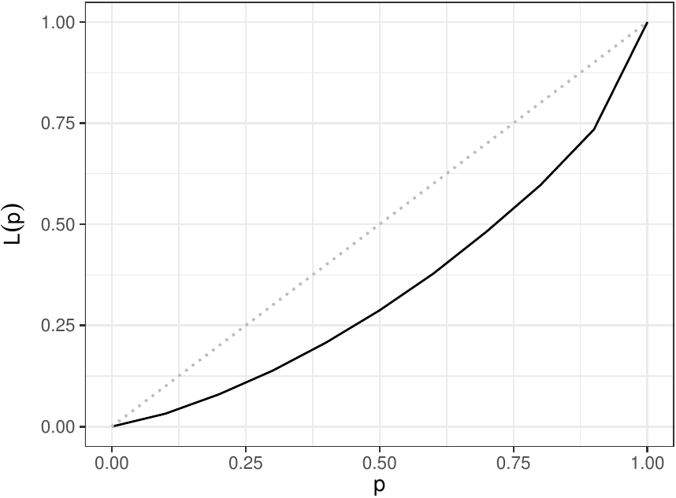
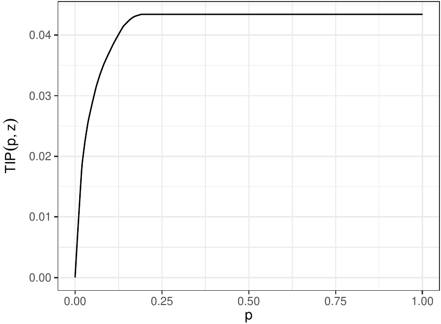
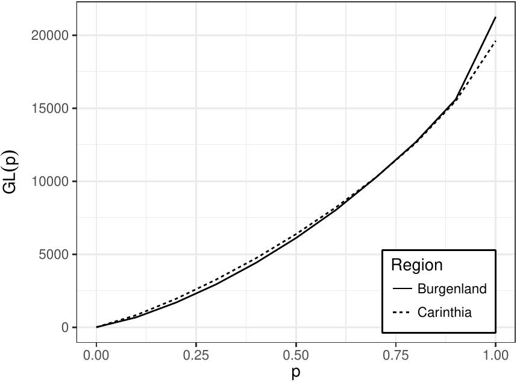
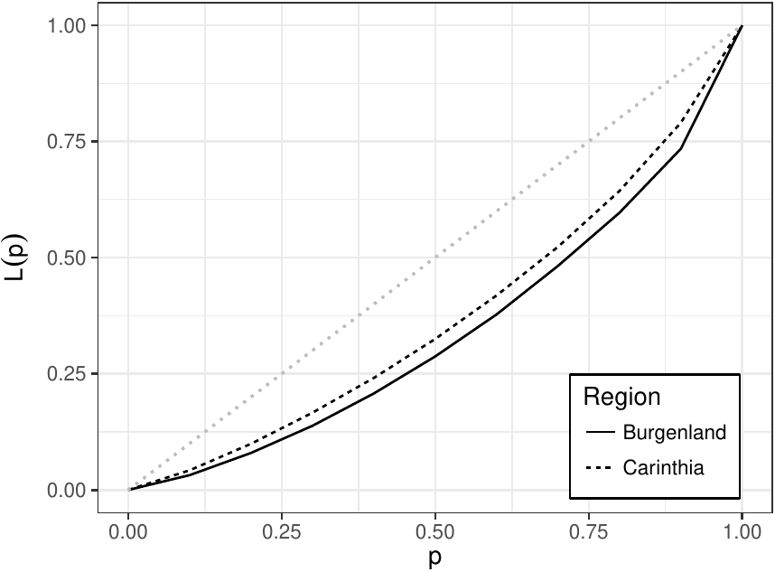
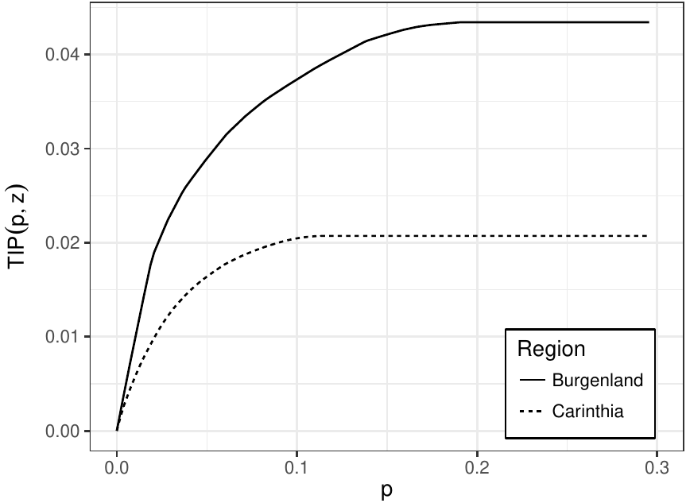

::: article
# Introduction

Surveys of income provide policy makers, researchers, social
organizations and general public with a rich source of data to address
and understand the topics of welfare, income inequality and poverty. In
one approach, income differences among states, populations or groups are
summarised by univariate indices. The most popular aggregate inequality
and poverty indices (such as the Gini index and the at-risk-of-poverty
rate) summarize inequality or poverty by a univariate index. Such an
index is easy to compare over time, across regions or countries but may
be insufficient for more detailed research and refined decision making.
Increasing availability of data sets from a variety of statistical
sources (including national and international statistical offices)
allows scientists and policy-makers to carry out detailed comparisons by
developing and applying more sophisticated tools and graphical
representations from real data sets.

This paper presents an R package, called
[***rtip***](https://CRAN.R-project.org/package=rtip), that implements
methods and techniques based on stochastic dominance to make unambiguous
comparisons, in terms of welfare, poverty and inequality, of income
distributions. Stochastic dominance requires unanimity in rankings for
large classes of indices (rather than simpler rankings based on a single
index). We regard one income distribution as dominating another only if
the same ranking is obtained for them with an entire family of indices.
Stochastic dominance rules for income distributions can be easily
implemented by seeking a dominance relation between three graphical
representations: the Lorenz curve, the generalized Lorenz curve and the
TIP (Three I's of Poverty) curve (also called the cumulative poverty gap
(CPG) curve or the poverty profile curve, see @barrett2016consistent for
other names). Two income distributions can be unambiguously ranked in
terms of inequality if their Lorenz curves do not intersect [see
@Atkinson1970]. Similarly, two income distributions can be unambiguously
ranked with respect to a wide class of reasonable social welfare
functions [see @Shorrocks1983 for details] if their respective
generalized Lorenz curves do not intersect. The literature also contains
results [see @Jenkins1998a; @Jenkins1998b; @SordoRamos2011] connecting
unambiguous poverty rankings by general classes of poverty measures with
non-intersections of TIP curves. The package ***rtip*** estimates these
curves directly from data sets and implements some tests to assess any
statistical significance.

We can find some functions, in different software languages, addressing
the analysis of income distributions via generalized Lorenz curves and
their associated indices of inequality. For example, the Stata
commands[^1] ***glcurve*** [@Jenkins2004; @Kerm2001], ***svylorenz***
[@Jenkins2006], ***clorenz*** [@Araar2005], ***alorenz*** [@Azevedo2006]
and ***lorenz*** [@Jann2016], estimate, draw and provide variance
estimates for generalized Lorenz curves. The command ***povdeco***
[@Jenkins1999] estimates the poverty indices from the @FGT1984 family.
With ***rtip***, we want to make these methods available to R users
[^2]. We can find some packages in the R environment to analyse
inequality and poverty of income distributions. For example, various
indices of poverty and inequality are included in the packages
[***IC2***](https://CRAN.R-project.org/package=IC2) [@ic2] and
[***ineq***](https://CRAN.R-project.org/package=ineq) [@ineq], which
also provide some graphical tools, including the Lorenz curve. A
comprehensive collection of indicator methodology is included in the
package [***laeken***](https://CRAN.R-project.org/package=laeken)
[@Alfons2013], which implements functions and generalized Lorenz curves
to estimate a wide set of social inclusion and poverty indicators in
complex surveys. An interesting book combining EU-SILC surveys (the
survey on income and living conditions conducted by Eurostat, the
statistical office of the EU) and R is @Longford2015.

Some strengths of using the package ***rtip*** presented in this paper
compared with others are the following:

1.  ***rtip*** provides functions to load microdata having EU-SILC
    format (see Datasets section).

2.  ***rtip*** evaluates income distributions on several equivalence
    scales and with adjustment for differences in household composition.
    The choice of the equivalence scale is important and can
    considerably affect the results (see, for example,
    [@Buhmann1988; @Jenkins1994; @DeVos1997], who showed that the choice
    of the equivalence scale is not innocuous). Although the package
    ***rtip*** employs by default the OECD-modified scale used by
    Eurostat, it also allows to use the parametric scale in
    @Buhmann1988, which covers almost all equivalence scales used in
    practice.

3.  Besides providing point estimates and confidence intervals for the
    most commonly used indicators for inequality, welfare and poverty,
    the package ***rtip*** implements estimation of the usual Lorenz
    curve, the generalized Lorenz curve and the TIP curve and provides a
    way, based on the distribution-free test for generalized Lorenz and
    deprivation dominance suggested by @Xu1997 and @XuOsberg1998,
    respectively, to test statistically whether a curve is dominated by
    another.

The remainder of this paper is organized as follows. First, we explain
the processes of loading data and setting up the surveys. Then, we
briefly describe the indices and curves included in the package,
explaining how to estimate them with ***rtip***. Description of the
statistical procedures implemented to test dominance of these curves is
also presented and illustrated with examples. Finally we provide
conclusions as well as a section to explain to users how to load their
own datasets.

# Datasets

The ***rtip*** package offers the possibility to load data extracted
from EU-SILC using the `loadEUSILC` function. Users can modify
`loadEUSILC` in order to load their own datasets. For instance,
`loadLCS` function is a modification of `loadEUSILC` to load data from
the Spanish Living Conditions Survey (see the Appendix). Note that
***rtip*** is not restricted to datasets with EU-SILC format and users
can load their own datasets.

The ***rtip*** package contains two datasets: `eusilc2` and `LCS2014`.

``` r
library(rtip)
data(eusilc2)
data(LCS2014)
```

The `eusilc2` dataset is a modification of the synthetic `eusilc`
dataset in the package ***laeken*** [see @Alfons2013]. The aim of this
modification[^3] is to set up the variables according to expectations of
the ***rtip*** package (see Table [1](#tab:variables_needed)). The
`eusilc` dataset is related to Austrian EU-SILC data from 2006, and was
generated to comply with EU-SILC confidentiality rules. The `LCS2014`
dataset[^4] is a data frame containing a selection of variables from the
living conditions survey released in 2014 by the Spanish National
Statistics Institute (INE in Spanish).

Both datasets, `eusilc2` and `LCS2014`, have seven variables which are
briefly described in Table [1](#tab:variables_needed) [for further
information see @Eurostat2007]. The records in these datasets are
households, not individuals. Thus the 14,827 individual-level records in
the `eusilc` dataset are condensed to 6,000 household-level records in
the `eusilc2` dataset.

::: {#tab:variables_needed}
  ---------------------------------------------------------
   Name of the variable  Meaning
  ---------------------- ----------------------------------
          DB010          Year of the survey

          DB020          Country

          DB040          Region

          DB090          Household cross-sectional weight

          HX040          Household size

          HX050          Equivalised household size

          HX090          Equivalised disposable income
  ---------------------------------------------------------

  : Table 1: Variables needed before setting up the dataset. Variables
  HX050 and HX090, provided by Eurostat, are calculated using the
  OECD-modified scale.
:::

# Setting up the surveys

The income variable most commonly studied for the inequality and poverty
assessment is the disposable household income. Most official statistics
(and ***rtip***) use the equivalised disposable household income, which
is the total disposable income of the household adjusted by taking into
account its composition (number of adults and children). The adjustment
is made by dividing the disposable household income by the equivalised
household size, which is defined as the number of household members
converted into equivalent adults by using a specific equivalence scale.
The equivalisation factor employed by Eurostat is the OECD-modified
scale, which gives a weight of 1.0 to the first person aged 14 or more,
a weight of 0.5 to other persons aged 14 or more and a weight of 0.3 to
persons aged 0-13. ***rtip*** uses this equivalisation factor by
default, but can also use the parametric scale of @Buhmann1988. In this
case, the equivalised household size is given by $n^s$, where $n$ is the
number of members of the household and $s$ is a parameter known as
elasticity of equivalence, with $0 \leq s \leq 1$. The value $s=0.5$ is
frequently used to make comparisons between countries (when $s=0$ the
composition is irrelevant).

The information is held in two files: basic household register (H-file)
and household data (D-file). These files are loaded by functions
`loadEUSILC` or `loadLCS` from EU-SILC or INE surveys, respectively.
Next, the data is set up by using the function `setupDataset` which has
one mandatory argument (`dataset`) and five optional arguments: the
country to be analysed (`country`), the region of the country
(`region`), the equivalence scale (`s`), a deflator (`deflator`) and the
purchasing power parity rate (`pppr`). All optional arguments have
`NULL` default value, except for `country = ’ES’`.

The `country` and the `region` are expressed using the nomenclature of
territorial units for statistics[^5]. All regions of the country will be
selected by default (`region = NULL`) but it is possible to select one
or more regions using a character string. Income is expressed in current
monetary units. If `deflator` is not `NULL` the value assigned will be
used as a deflator. Finally, by setting up the ratio of the purchasing
power parity conversion factor to market exchange rate (`pppr`) we can
compare the income across countries.

``` r
dataset <- setupDataset(eusilc2, country = "AT", region = NULL,
	s = NULL, deflator = NULL, pppr = NULL)	
```

Next, we form a data frame with a new variable `ipuc`. The `ipuc`
variable is the income per unit of consumption[^6] (or equivalised
disposable income) which also takes into account the deflator and the
purchasing power parity rate. If `deflator = NULL`, `pppr = NULL` and
`s = NULL`, `ipuc` is set to `HX090` (see Table
[1](#tab:variables_needed)).

# Indicators and curves {#curves_indicators}

In this section we briefly describe some indicators and curves that are
widely used in the study of poverty, inequality and welfare. The
`eusilc2` dataset contains all the data necessary for estimating them.

Let $X$ be a random variable[^7] with cumulative distribution function
$F$, and let $\zeta_p= F^{-1}(p)$ be the quantile function with
$0 \le p \le 1$. Let $n$ be the number of observations in the sample,
let ${x}:=\left\{x_i \right\}_{i=1}^n$ be individual incomes sorted into
ascending order so that $x_{1} \le x_{2} \le \cdots \le x_{n}$, and let
$\omega:=\left\{ \omega_i \right\}_{i=1}^n$ denote the corresponding
sample weights[^8]. Weighted quantiles for the estimation of the
population values are given by $\hat{\zeta}_{p}(x, \omega)=x_{(r)},$
where $x_{(r)}$ is the $r$-th order statistic such that
$r=[p \sum_{i=1}^n \omega_i]$ is the closest integer not greater than
$p \sum_{i=1}^n \omega_i$. $\hat{\zeta}_{p}(x, \omega)$ is the sample
quantile level such that $100p$ percent of the weighted sample of
observations is less than or equal to $\hat{\zeta}_{p}(x, \omega)$ and
$100(1-p)$ percent of the weighted observations is greater [@Beach1986].

## Indicators of poverty, inequality and welfare {#indicators-for-inequality-welfare-and-poverty}

Poverty curves and indicators are based on the poverty threshold that
distinguishes between poor and non-poor households. The median income,
$\zeta_{0.5}$, is frequently used for this purpose. On the
recommendation of Eurostat this threshold, called the
*at-risk-of-poverty threshold*, is set at $60\%$ of the national median
equivalised disposable income ($arpt = 0.6 \cdot \zeta_{0.5}$) and is
estimated by

$$\label{arpt}
\widehat{arpt}=0.6 \cdot \hat\zeta_{0.5} (x, \omega),   (\#eq:arpt)$$

using the function `arpt()`. The default setting of $60\%$ can be easily
changed via the argument `pz`. Optional variable names can be set up for
the income per unit of consumption (`ipuc`), the household
cross-sectional weight (`hhcsw`) and the household size (`hhsize`).
Default values correspond to EU-SILC names. For the sake of clarity we
use the default variable names in the following examples. A sample call
to `arpt` would look like:

``` r
arpt(dataset, ipuc = "ipuc", hhcsw = "DB090", hhsize = "HX040", pz = 0.6)
```

The indicator called *at-risk-of-poverty rate*, defined as the
proportion of persons with an equivalised disposable income below the
*at-risk-of-poverty threshold*, is estimated using the function `arpr()`
(see Table [2](#table:indicators)). A sample call to `arpr` would look
like:

``` r
arpr(dataset, arpt.value = arpt(dataset, pz = 0.6))
```

Using the function `arpr()` and changing the argument `pz` to 40%, 50%
and 70% in `arpt()`, we obtain the *dispersion around the
at-risk-of-poverty threshold* (percentage of persons with an equivalised
disposable income below $40\%$, $50\%$ and $70\%$ of the national median
equivalised disposable income, respectively). For example:

``` r
arpr(dataset, arpt.value = arpt(dataset, pz = 0.4))
```

Table [2](#table:indicators) contains a brief description of some other
well-known poverty indicators such as the Foster, Greer and Thorbecke
(FGT$_1$) poverty index [@FGT1984]. This index is calculated by the
function `s1()`. Its normalized version, also called the poverty gap
ratio, is obtained by setting `norm = TRUE`. In this case, the index
provides the average of the ratio of the poverty gaps[^9] to the
at-risk-of-poverty threshold.

``` r
s1(dataset, arpt.value = arpt(dataset), norm = TRUE)
```

The ***rtip*** package also provides the function `s2()` to calculate
the Sen-Shorrocks-Thon (SST) poverty index [@Shorrocks1995; @Zheng1997].
It is estimated as twice the area below the TIP curve (see TIP curve in
next section).

For income inequality, we calculate the most commonly used indices of
inequality, the *Gini index*, and the *quintile share ratio* (see
Table [2](#table:indicators)). The *mean income per person*, *per
household* and *per unit of consumption* are estimated by the respective
functions `mip()`, `mih()` and `miuc()`.

::: {#table:indicators}
+----------------------+----------------------+----------------------+
|                      | ::: center           | ::: center           |
|                      | Description          | Formula              |
|                      | :::                  | :::                  |
+:=====================+:=====================+:=====================+
| *At-risk-of-poverty  |                      |                      |
| rate*,               |                      |                      |
+----------------------+----------------------+----------------------+
| `arpr()`             | Proportion of        | [](){#eq:arpr}       |
|                      | persons with an      | $$\label{arpr}       |
|                      | equivalised          | \displaystyle\frac   |
|                      | disposable income    | {\displaystyle       |
|                      | below the            |\sum_{i=1}^{n}\omega_i|
|                      | *at-risk-of-poverty  | {\bf I}\left         |
|                      | threshold*           |(x_i\le \widehat{arpt}|
|                      |                      |\right)} {            |
|                      |                      | \sum_{i=1}^n         |
|                      |                      | \omega_i} \cdot100   |
|                      |                      | (\#eq:arpr)$$        |
+----------------------+----------------------+----------------------+
| *Relative median     |                      |                      |
| at-risk*             |                      |                      |
+----------------------+----------------------+----------------------+
| *of-poverty gap*,    | Difference between   | [](){#eq:rmpg}       |
| `rmpg()`             | the                  | $$\label{rmpg}       |
|                      | *at-risk-of-poverty  | \frac                |
|                      | threshold* and the   | {\widehat{arpt} -    |
|                      | median equivalised   | \hat{\zeta}^p_{0.5}  |
|                      | disposable income of | (x,\omega) } {       |
|                      | people below the     |\widehat{arpt}} \cdot |
|                      | *at-risk-of-poverty  |  100 (\#eq:rmpg)   $$|
|                      | threshold*,          |                      |
|                      | expressed as a       |                      |
|                      | percentage of the    |                      |
|                      | threshold            |                      |
+----------------------+----------------------+----------------------+
| Foster, Greer and    |                      |                      |
+----------------------+----------------------+----------------------+
| Thorbecke, `s1()`    | Average of the       | [](){#eq:FGT}        |
|                      | absolute poverty     | $$\label{FGT}        |
|                      | gaps (difference     | \frac                |
|                      | between the          | {\displaystyle\sum   |
|                      | *at-risk-of-poverty* | _{i=1}^{n} \omega_i  |
|                      | threshold and the    | (\widehat{arpt}-x    |
|                      | equivalised          | _i)^+}{\displaystyle |
|                      | disposable income,   | \sum_{i=1}^{n}       |
|                      | with the non-poor    | \omega_i }(\#eq:FGT) |
|                      | being given a        | $$                   |
|                      | difference of zero)  |                      |
+----------------------+----------------------+----------------------+
| Gini, `gini()`       | Relationship of      |                      |
|                      | cumulative           | $$\left[             |
|                      | proportions of the   |       \frac{2        |
|                      | population arranged  | \sum_{i=1}^n         |
|                      | according to the     | \left(\omega_ix_i    |
|                      | level of equivalised | \sum_{j=1            |
|                      | disposable income,   | }^i\omega_j\right)-  |
|                      | to the cumulative    | \sum_{i=1}^n         |
|                      | proportions of the   | \omega^2_ix_i}       |
|                      | equivalised total    | {                    |
|                      | disposable income    | \sum_{i=1}^n         |
|                      | they receive         | \omega_i             |
|                      |                      | \sum_{i=             |
|                      |                      | 1}^n \omega_ix_i}- 1 |
|                      |                      |  \right] \cdot 100$$ |
+----------------------+----------------------+----------------------+
| Quintile share       |                      |                      |
| ratio,               |                      |                      |
+----------------------+----------------------+----------------------+
| `qsr()`              | The ratio of total   | [](){#eq:qsr}        |
|                      | income received by   | $$                   |
|                      | the 20 percent of    |   \label{qsr}        |
|                      | the population with  |       \frac{         |
|                      | the highest income   |      \sum_{i=1}^{n}  |
|                      | to that received by  | \omega_i             |
|                      | the 20 percent of    |  x_i {\bf I}\left(x_ |
|                      | the population with  | i > \hat{\zeta}_{0.8 |
|                      | the lowest income    | }(x, \omega)\right)} |
|                      |                      | {                    |
|                      |                      |            \sum_{i=1 |
|                      |                      | }^{n} \omega_i x_i { |
|                      |                      | \bf I}\left(x_i \le  |
|                      |                      | \                    |
|                      |                      | hat{\zeta}_{0.2}(x,  |
|                      |                      | \omega)\right)}      |
|                      |                      | \cdot 100(\#eq:qsr)$$|
+----------------------+----------------------+----------------------+

: Table 2: Common indicators of poverty and inequality coded in
***rtip*** package. In formula \@ref(eq:FGT) we define $(x)^+ = x$ if
$x \ge 0$ and $(x)^+ = 0$ if $x < 0$. In formulae \@ref(eq:arpr) and
\@ref(eq:qsr), ${\bf I}(\cdot)$ is the usual indicator function that
equals 1 if the bracketed expression is true, and 0 otherwise. In
formula \@ref(eq:rmpg), $\hat{\zeta}^p_{0.5}(x,\omega)$ is the median
income of poor persons.
:::

Confidence intervals can be obtained for all the indicators in
***rtip*** package by a bootstrap method. We use the
[***boot***](https://CRAN.R-project.org/package=boot) package
[@boot2016] to generate bootstrap replicates. The user can change the
number of replicates with the parameter `rep` which, by default, is set
to 500. If `verbose = TRUE` we obtain a plot showing the histogram of
the indicator estimations (replicates) and the Standard Normal
quantile-quantile plot of bootstrap estimates. For instance, in case of
the `arpt` function and 98% confidence interval, a typical call would
look like:

``` r
arpt(dataset, pz = 0.6, ci = 0.98, rep = 500, verbose = TRUE)
```

## Curves for inequality, welfare and poverty

### Lorenz and generalized Lorenz curve

The Lorenz curve [@Gastwirth1971] is defined as

$$L(p)=\frac{1}{\mu} \int_{0}^{p}  \zeta_q dq,$$

and the generalized Lorenz (GL) curve is given by $GL(p)=\mu L(p)$
[@Shorrocks1983] where $\mu$ denotes the mean income. The values of the
GL curve are estimated on a regular grid of $K$ points selected such
that $p_i=i/K$, and their population quantiles denoted by
$\zeta_{p_i}=F^{-1}(p_i)$ with $i=1, 2, ..., K$. The conditional mean of
income less than or equal to $\zeta_{p_i}$ is denoted as
$\gamma_i=\mathbb{{E}}\left[X|X \le \zeta_{p_i} \right]$, for $i=1, 2, ..., K$
($\,\gamma_K=\mu \,$). The $K \times 1$ vector of GL ordinates at
$p_1, p_2, \dots , p_K$ is given by
$\theta=[p_1\gamma_1, p_2\gamma_2,\dots, p_K\gamma_K]'$ and can be
estimated consistently by

$$\label{GL_ordinates}\hat\theta=[p_1\hat\gamma_1, p_2
\hat\gamma_2,\dots, p_K\hat\gamma_K]',   (\#eq:GL-ordinates)$$

where the sample counterpart of $\gamma_i$ is

$$\hat{\gamma_i}=\frac{\displaystyle\sum_{j=1}^{r_i}
\omega_j x_{j}}{\displaystyle\sum_{j=1}^{r_i} \omega_j},$$

and $r_i=[p_i \sum_{j=1}^n \omega_j]$ (the closest integer not greater
than $p_i \sum_{j=1}^n \omega_j$) is an integer such that
$\hat{\zeta}_{p_i}(x, \omega)=x_{(r_i)}$ is the $r_i$-th sample quantile
level such that $100p_i$ percent of the weighted sample of observations
is less than or equal to $\hat{\zeta}_{p_i}(x, \omega)$,
$i=1, 2, ..., K$ [@Beach1983; @Beach1986]. In the package ***rtip***,
the function `lc()` is implemented to estimate both Lorenz and GL curve
ordinates. This function calculates the Lorenz curve for the number of
abscissae $p_i$ given by the argument `samplesize`. Following the
examples in @Beach1983, @Beach1986 and @Xu1997, we set `samplesize = 10`
by default. If `samplesize = complete`, ordinates are computed in each
value along the whole distribution. By setting `generalized = TRUE`, the
GL curve is calculated. The left-hand panel of Figure
[1](#fig:singleTIP) shows the Lorenz curve for income distribution of
the Burgenland region. It is produced with:

``` r
Burgenland <- setupDataset(eusilc2, country = "AT", region = "Burgenland")
lorenz_curve <- lc(Burgenland, samplesize = 10, generalized = FALSE, plot = FALSE)

p1 <- ggplot(lorenz_curve, aes(x.lg, y.lg)) + geom_line() + 
	geom_segment(aes(x = 0, y = 0, xend = 1, yend = 1),
             linetype = "dotted", color = "grey") + 
	scale_x_continuous(expression(p)) +
	scale_y_continuous(expression(L(p))) + theme_bw()
print(p1)
```

The variable `lorenz_curve` contains the abscissae $p_i$ and Lorenz
curve ordinates. A less elaborate plot is obtained by setting
`plot=TRUE` in `lc` function.

### TIP curve {#TIP}

For an individual (or household-level) measure of deprivation $Y$, with
distribution function $F_Y$, the deprivation profile for $F_Y$ is
[@Shorrocks1995; @Shorrocks1998]
$$D(F_Y,p)=\int_{F_Y^{-1}(1-p)}^{\infty} ydF_Y(y)=\int_{1-p}^1 F_Y^{-1}(q)
dq,\,\, p\in [0,1].$$

Let $z>0$ be a poverty threshold and let $X$ be an income random
variable. If we consider the poverty gap $Y=(z-X)^+$ as the measure of
deprivation, where $x^+=max\{x,0\}$, the TIP (Three I's of Poverty)
curve is obtained and denoted $TIP(p,z)$. Alternatively, we can write
[@Jenkins1998a; @Jenkins1998b]
$$TIP(p,z)=\int_{0}^{r_{z}^{X}}\left(  z-F^{-1}(t)\right)  dt, \;\; p \in [0,1],$$
where $r_{z}^{X}=\sup\left\{  F(x):x<z\right\}$ is the proportion of
people with income below $z$. Scaling by $z$ the poverty gap, that is,
using $Y=(z-X)^+/z$ as the measure of deprivation, we obtain the
normalized TIP curve, which is simply $TIP(p,z)/z$.

For its estimation, let the observations of poverty gaps
${y}:=\left\{y_i \right\}_{i=1}^n$ be ordered in increasing order so
that $y_{1} \le y_{2} \le \cdots \le y_{n}$ with
$\hat{z} =\widehat{arpt}$ given by equation (\@ref(eq:arpt)) and let
$\omega:=\left\{ \omega_i \right\}_{i=1}^n$ denote the corresponding
sampling weights. Using the relation between deprivation profile and the
GL curve, $D(F_Y,p) = \mu(F_Y) - GL(F_Y, 1-p) \,$ for $p \in [0,1]$, the
$K \times 1$ vector of TIP curve ordinates corresponding to
$[p_{1}, p_{2},\dots, p_K]'$ is estimated consistently by

$$\label{tip_ordinates}
  \hat\phi=[(\hat\gamma_K-p_{K-1}
\hat\gamma_{K-1}), (\hat\gamma_K-p_{K-2}\hat\gamma_{K-2}),\dots, 
(\hat\gamma_K-p_1\hat\gamma_1), \hat\gamma_K]',   (\#eq:tip-ordinates)$$

where the sample counterpart of $\gamma_i$ is

$$\hat{\gamma_i}=\frac{\sum_{j=1}^{r_i}
\omega_j y_{j}}{\sum_{j=1}^{r_i} \omega_j},$$

and $r_i=[p_i \sum_{j=1}^n \omega_j]$ (the closest integer not greater
than $p_i \sum_{j=1}^n \omega_j$) is an integer for which
${\hat{\zeta}_{p_i}}(y, \omega)=y_{(r_i)}$ is the $r_i$-th sample
quantile level such that $100p_i$ percent of the weighted sample of
poverty gaps is less than or equal to $\hat{\zeta}_{p_i}(y, \omega)$,
$i=1, 2, ..., K$ [@Beach1986; @XuOsberg1998]. The function `tip()`
estimates both the unnormalized and normalized TIP curve ordinates.
Normalization is established by setting `norm = TRUE` and the estimated
poverty threshold, $\hat{z}$, is computed by the function `arpt`. The
number of ordinates computed is given by the the argument `samplesize`,
and following the example in @XuOsberg1998, we set `samplesize = 50` by
default. If `samplesize = complete`, tip ordinates are computed in each
value along the whole distribution. The right-hand panel of Figure
[1](#fig:singleTIP) shows the normalized TIP curve for income
distribution of Burgenland region. It is produced with:

``` r
tip_curve <- tip(Burgenland, arpt(Burgenland), samplesize = 50, norm = TRUE)
p2 <- ggplot(tip_curve, aes(x.tip, y.tip)) + geom_line() + 
	scale_x_continuous(expression(p)) + 
	scale_y_continuous(expression(TIP(p, z))) + 
	theme_bw()
print(p2)
```

<figure id="fig:singleTIP">
<p><span> </span></p>
<figcaption>Figure 1: Lorenz curve for Burgenland region (left). Dotted
diagonal represents the benchmark for a perfectly equal income
distribution. Normalized TIP curve for Burgenland region
(right).</figcaption>
</figure>

As in the previous example, a less elaborate plot is obtained by setting
`plot=TRUE` in the call to the `tip` function.

# Dominance tests {#sec:dominance}

Given two income distributions $X_1$ and $X_2$, $X_1$ is said to Lorenz
dominate $X_2$ if the Lorenz curve of $X_1$ lies everywhere above that
of $X_2$, which is interpreted as less inequality in $X_1$ than in
$X_2$. The normative aspects of Lorenz dominance have been studied by
@Atkinson1970 and its relationship to other dominance criteria may be
found in @Arnold1987. Similarly, $X_1$ is said to dominate $X_2$ in the
generalized Lorenz sense if the generalized Lorenz curve of $X_1$ lies
everywhere above that of $X_2$, which is interpreted in terms of welfare
[see @Shorrocks1983]. For the relationship of generalized Lorenz
dominance to other dominance criteria, see @ramos2000sufficient. Given a
poverty threshold $z>0$, $X_1$ is said to TIP dominate $X_2$ if
$TIP_{X_{1}}(p,z)\ge TIP_{X_{2}}(p,z)$ for all $p \in (0,1)$, which
means that there is less poverty in $X_2$ than in $X_1$ according to
various wide classes of poverty indices, see @Jenkins1998a
[@Jenkins1998b] and @sordo2007poverty. If we use different poverty
thresholds for different income distributions, that is, $z_{1}$ in $X_1$
and $z_{2}$ in $X_2$, non-intersection of normalized TIP curves is
equivalent to unanimous poverty orderings by different classes of
poverty indices based on normalized poverty gaps.

Since the initial papers by [@Beach1983] and [@Bishop1989] focussing on
statistical tests for Lorenz dominance and generalized Lorenz dominance,
respectively, many studies have been conducted to implement these
ranking criteria empirically (see Chapter 17 in [@duclos2006poverty] for
a review). Some tests in the literature are based on a two-stage testing
strategy including multiple pairwise sub-tests. @Xu1997 offers an
alternative to this approach by providing a joint and simpler procedure
to test for generalized Lorenz dominance directly, which is adapted to
testing for deprivation dominance in @XuOsberg1998. We have implemented
@Xu1997 and @XuOsberg1998 procedures in ***rtip***.

## Generalized Lorenz dominance

To make statistical inference about GL dominance from sample GL curve
estimates we have implemented the asymptotically distribution-free
statistical inference procedure in @Xu1997. This article provides one
test based on Theorem 1 in @Beach1983 which derives the asymptotic joint
variance-covariance matrix of GL curve ordinates. EU-SILC surveys
involve sampling weights. We implemented an extension of the methodology
in @Beach1983 to samples which involve weighted observations [see
@Beach1986].

Given two income distributions, $X_1$ and $X_2$, let $\theta_1$ and
$\theta_2$ be the $K \times 1$ vectors of GL curve ordinates for $X_1$
and $X_2$, respectively. The dominance relation tested by the null
hypothesis is $H_0: \theta_1-\theta_2 \ge 0$ against the alternative
hypothesis $H_1: \theta_1-\theta_2 \not\ge 0$. The test statistic, $T$,
for the GL dominance is [see @Xu1997]

$$\label{GLstatistic}
T=\tilde\Delta' \left[\frac{\hat\Sigma_1}{n_1}+\frac{\hat\Sigma_2}{n_2} \right]^{-1}
\tilde\Delta,   (\#eq:GLstatistic)$$

where
$\tilde\Delta = [(\hat\theta_1-\hat\theta_2)-(\tilde\theta_1-\tilde\theta_2)]$;
$n_i$ is the size of a random sample from $X_i$; $\hat\Sigma_i$ is the
estimated $K \times K$ covariance matrix for the unrestricted vector of
GL ordinates $\hat\theta_i$ given by (\@ref(eq:GL-ordinates)) while
$\tilde\theta_i$ is the restricted estimate minimizing ($i=1,2$)

$$\label{QP}
\Delta'\left[\frac{\hat\Sigma_1}{n_1}+\frac{\hat\Sigma_2}{n_2} \right]^{-1} \Delta   (\#eq:QP)$$

$$\mathrm{s.t.} \, (\theta_1-\theta_2) \ge 0$$

with $\Delta=[(\hat\theta_1-\hat\theta_2)-(\theta_1-\theta_2)]$. The
auxiliary function `OmegaGL()` computes the empirical unrestricted
vector of GL curve ordinates, $\hat\theta_i$, and its corresponding
covariance matrix, $\hat\Sigma_i$, $i=1,2$. The function for testing
generalized Lorenz dominance between two income distributions is
`testGL()`. For both functions the number of ordinates, $K$, estimated
by ***rtip*** and employed for testing dominance is controlled by the
argument `samplesize`. Following the example in @Xu1997 the default
value is `samplesize=10`. The upper-and lower-bounds of critical values
(at the $\alpha$ significance level) for testing inequality restrictions
are provided by @Kodde_Palm1986. If the value of the $T$ statistic
(called `Tvalue`) falls into an inconclusive region (between the lower-
and upper-bounds) the simulated p-value is estimated following
@Wolak1989, otherwise the $p$-value is set to `NA`. For instance, to
test the null hypothesis that the income distribution of Burgenland
dominates the income distribution of Carinthia in the generalized Lorenz
sense we use the following procedure:

``` r
Burgenland <- setupDataset(eusilc2, country = "AT", region = "Burgenland")
Carinthia <- setupDataset(eusilc2, country = "AT", region = "Carinthia")
testGL(Burgenland, Carinthia, generalized = TRUE, samplesize = 10, alpha = 0.05)
```

The output produced is:

``` r
$Tvalue
         [,1]
[1,] 7723.701

$p.value
[1] NA

$decision
[1] "Reject null hypothesis"
```

In this example, the null hypothesis of dominance is rejected with a
significance level of 5$\%$. The left-hand panel of Figure 2 displays
the two estimated GL curves.

To test the null hypothesis that the income distribution of Carinthia
dominates the income distribution of Burgenland in the Lorenz sense we
use the function `testGL()` as follows:

``` r
testGL(Carinthia, Burgenland, generalized = FALSE) 
```

This results in:

``` r
$Tvalue
             [,1]
[1,]  4.049037e-12

$p.value
[1] NA

$decision
[1] "Do not reject null hypothesis"
```

In this case we do not have evidence to reject the null hypothesis with
a significance level of 5$\%$. The right-hand panel of Figure 2, which
displays the two estimated Lorenz curves, suggests (without statistical
significance) that Carinthia may dominate Burgenland in the Lorenz
sense.

<figure id="fig:glc_2curves">
<p></p>
<figcaption>Figure 2: Generalized Lorenz curves for Burgenland and
Carinthia (left). Lorenz curves for Burgenland and Carinthia Dotted
diagonal represents the benchmark for a perfect equality (right).
</figcaption>
</figure>

## TIP dominance

To make statistical inference about TIP dominance we have implemented
the asymptotically distribution-free statistical procedure in
@XuOsberg1998. As in the case of GL dominance, we have followed the
methodology suggested by @Beach1983 and @Beach1986.

Let's consider two poverty thresholds $z_1, z_2>0$; two income
distributions, $X_1$ and $X_2$, and the corresponding poverty gaps
$Y_i=(z_i-X_i)^+$, $i=1,2$. Let $\phi_1$ and $\phi_2$ be the
$K \times 1$ vectors of TIP curve ordinates for $X_1$ and $X_2$,
respectively. The dominance relation tested on the null hypothesis is
$H_0: \phi_1-\phi_2 \ge 0$ against the alternative hypothesis
$H_1: \phi_1-\phi_2 \not \geq 0$. Following the methodology in
@XuOsberg1998 to test for TIP dominance between two TIP curves, the
test-statistic implemented is such that

$$\label{TIPstatistic}
T=\tilde\Delta' \left[\frac{\hat\Omega_1}{n_1}+\frac{\hat\Omega_2}{n_2}\right]^{-1}
\tilde\Delta,   (\#eq:TIPstatistic)$$

where
$\tilde\Delta=[(\hat\phi_1-\hat\phi_2)-(\tilde\phi_1-\tilde\phi_2)]$;
$n_i$ is, for i=1 ,2, the size of a random sample from $X_i$;
$\hat\Omega_i=R\hat\Sigma_iR'$, $\hat\Sigma_i$ is the estimated
$K \times K$ covariance matrix for the unrestricted vector of GL
ordinates and $R$ is the $K \times K$ differencing matrix[^10] according
to

$$\left[\begin{array}{ccccc}
0 & \cdots & 0 & -1 & 1 \\
0 & \cdots & -1 & 0 & 1 \\
0 & \cdots & 0 & 0 & 1 \\
\vdots & \ddots & \vdots & \vdots & \vdots \\
-1 & \cdots & 0 & 0 & 1 \\
0 & \cdots & 0 & 0 & 1 \\
\end{array} \right]$$

The matrix $\hat\Omega_i$ is, for $i=1,2$, the estimated $K \times K$
covariance matrix for the unrestricted vector of TIP ordinates
$\hat\phi_i$ given by (\@ref(eq:tip-ordinates)) while $\tilde\phi_i$ is
the restricted estimate minimizing

$$\label{QP2}
\Delta' \left[\frac{\hat\Omega_1}{n_1}
+\frac{\hat\Omega_2}{n_2}\right]^{-1} \Delta   (\#eq:QP2)$$

$$\mathrm{s.t.} \, (\phi_1-\phi_2) \ge 0$$

with $\Delta=[(\hat\phi_1-\hat\phi_2)-(\phi_1-\phi_2)]$. Since the TIP
curve becomes horizontal at $p$ equals to the at-risk-of-poverty rate
(*arpr*), the test has only been implemented over the interval
$[0, max\{arpr_1,arpr_2\}]$ where $arpr_i$ is the at-risk-of-poverty
rate for $X_i$, $i=1,2$. Therefore, $\hat\phi_i$ are truncated with the
same dimension $k=max\{arpr_1,arpr_2\} < K$ and the dimension of
$\hat\Omega_i$ is $k \times k$, for $i=1,2$. The auxiliary function
`OmegaTIP()` computes the empirical unrestricted vector of TIP curve
ordinates, $\hat\phi_i$, and its corresponding covariance matrix,
$\hat\Omega_i$, $i=1,2$. The function for testing TIP dominance between
two income distributions is `testTIP()`. Following the practical example
in @XuOsberg1998 the default value is `samplesize=50`. The rules of
rejection and non-rejection based on the value of the statistic $T$
(called `Tvalue`) are in @XuOsberg1998. By setting the argument `norm`
equal to `TRUE`, the function `testTIP()` uses normalized TIP curves.
For example, to test the null hypothesis that the normalized TIP curve
of Carinthia dominates the normalized TIP curve of Burgenland we use the
following procedure:

``` r
testTIP(Carinthia, Burgenland, norm = TRUE, samplesize = 50, alpha = 0.05)
```

This yields:

``` r
$Tvalue
         [,1]
[1,] 11939.99

$p.value
[1] NA

$decision
[1] "Reject null hypothesis"
```

<figure id="fig:TIP2">

<figcaption>Figure 3: Normalized TIP curves for Burgenland and Carinthia
regions (the normalization factors are the respective poverty
thresholds). </figcaption>
</figure>

The null hypothesis of dominance is rejected with a significance level
of 5$\%$. Figure [3](#fig:TIP2) displays the two estimated normalized
TIP curves.

# Conclusions

The package ***rtip*** presented in this paper compares income
distributions in terms of welfare, poverty and inequality. Besides
providing point estimates and confidence intervals for some commonly
used indicators, ***rtip*** implements the methodology and techniques
based on the stochastic dominance to compare income distributions. In
particular, we can estimate with ***rtip*** the usual Lorenz curve, the
generalized Lorenz curve, the TIP curve of income distributions and test
statistically whether one curve is dominated by another. Although
potential users of ***rtip*** may have their own data, the package
allows to load microdata from EU-SILC survey and Spanish Living
Conditions survey and offers different equivalence scales to adjust
measures of income for differences in household composition. A
development version of the ***rtip*** package can be found at
GitHub[^11].

# Acknowledgements {#sec:acknowledgements}

The authors thank two anonymous referees and the Editor of the journal
for their detailed comments which have led to significant improvements
in both the content and presentation of the paper. Miguel A. Sordo and
Carmen D. Ramos acknowledge the support received from Ministerio de
Economía y Competitividad (Spain) under grant MTM2014-57559-P.

# Appendix {#LoadFunctionTemplate}

Users can create their own load function using the `loadLCS` function as
a template (see the example below). The load function must produce a
data frame with the following variable names: DB010, DB020, DB040,
DB090, HX040, HX050, HX090 (see Table [1](#tab:variables_needed) to set
properly the variables). In the case of the Spanish Living Conditions
Survey, for instance, the Spanish Statistical Office delivers four files
with many variables. We only require some of them to work with
***rtip***:

-   `lcs_d_file.csv`:

    -   DB010: a numeric vector containing the year of the survey.

    -   DB020: a factor with one level which is the country considered.

    -   DB030: a numeric vector containing the household ID.

    -   DB040: a factor with as many levels as there are regions in the
        country.

    -   DB090: a numeric vector containing information about household
        cross-sectional weight.

-   `lcs_hfile.csv`:

    -   HB010: a numeric vector containing the year of the survey.

    -   HB030: a numeric vector containing the household ID.

    -   HX040: an integer vector containing information about the
        household size.

    -   HX240: a numeric vector containing information about the
        equivalised household size. The scale employed is the modified
        OECD scale.

    -   vhRentaa: a numeric vector containing the total disposable
        household income.

A function to load these files and variables is the following:

``` r
loadLCS <- function(lcs_d_file, lcs_h_file){

  dataset1 <- read.table(lcs_d_file, header=TRUE, sep= ',')
  dataset2 <- read.table(lcs_h_file, header=TRUE, sep= ',')
  
  check1 <- identical(dataset1$DB010, dataset2$HB010)
  check2 <- identical(dataset1$DB030, dataset2$HB030)
  
  if (!check1) {
    stop('Different years!')
  } else if (!check2) {
    stop('You do not have the same identification for homes')
  } else {
    subdataset1 <- subset(dataset1, select = c("DB010", "DB020","DB030",
                                                "DB040", "DB090"))
    subdataset2 <- subset(dataset2, select = c("HB010", "HB030", "HX040",
                                                "HX240", "vhRentaa"))
  
    subdataset2$HX050 <- subdataset2$HX240
    subdataset2$HX090 <- subdataset2$vhRentaa/subdataset2$HX240
  
    dataset <- cbind(subdataset1, subdataset2)
    dataset <- subset(dataset, select = c("DB010", "DB020","DB040",
                                          "DB090", "HX040", "HX050",
                                          "HX090"))
    return(dataset)
  }
}
```

The code required to reproduce the examples in this paper can be
downloaded from:
<https://gist.github.com/AngelBerihuete/7e88d55845044ce04a9e61edcd5954f2>.
:::

[^1]: user-written functions in Stata are called commands.

[^2]: This code was developed in the context of a project undertaken by
    the authors [@SordoRamos2014] to compare, by using stochastic
    dominance techniques, inequality and poverty in Andalusia with other
    European regions. ***rtip*** has been also applied to the study of
    inequality by using tax return data [@sordo2017].

[^3]: The code used to modify the `eusilc` dataset can be found at
    <https://github.com/AngelBerihuete/rtip/blob/master/data-raw/eusilc_eusilc2.R>.

[^4]: The dataset can be obtained at
    <http://www.ine.es/dyngs/INEbase/en/operacion.htm?c=Estadistica_C&cid=1254736176807&menu=ultiDatos&idp=1254735976608>.

[^5]: Nomenclature of territorial units can be found at
    <http://ec.europa.eu/eurostat/web/nuts/overview>.

[^6]: The number of units of consumption is the number of household
    members converted into equivalent adults by using a specific
    equivalence scale.

[^7]: Unless otherwise stated it refers to equivalised disposable
    household income.

[^8]: Following indications in @Alfons2013, we take into account sample
    weights in the estimation of indices and curves.

[^9]: A poverty gap is the difference between the *at-risk-of-poverty*
    threshold and the equivalised disposable income, with the non-poor
    being given a difference of zero.

[^10]: Recall that the deprivation profile $D(F_Y,\cdot)$ for $F_Y$ is
    related to the GL curve $GL(F_Y,\cdot)$ of the deprivation measure
    for $F_Y$ as follows: $D(F_Y,p) = \mu(F_Y) - GL(F_Y, 1-p), \,$ for
    $p \in [0,1]$.

[^11]: <https://github.com/AngelBerihuete/rtip>.
