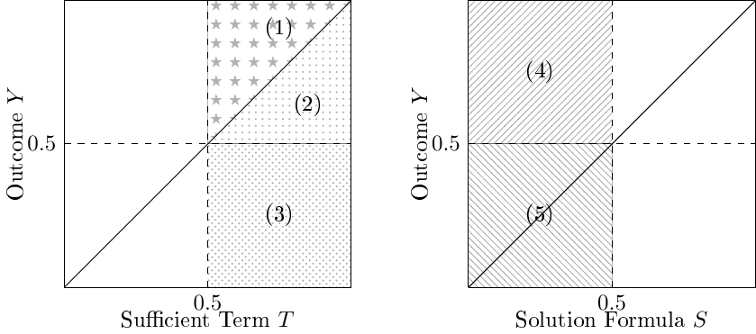
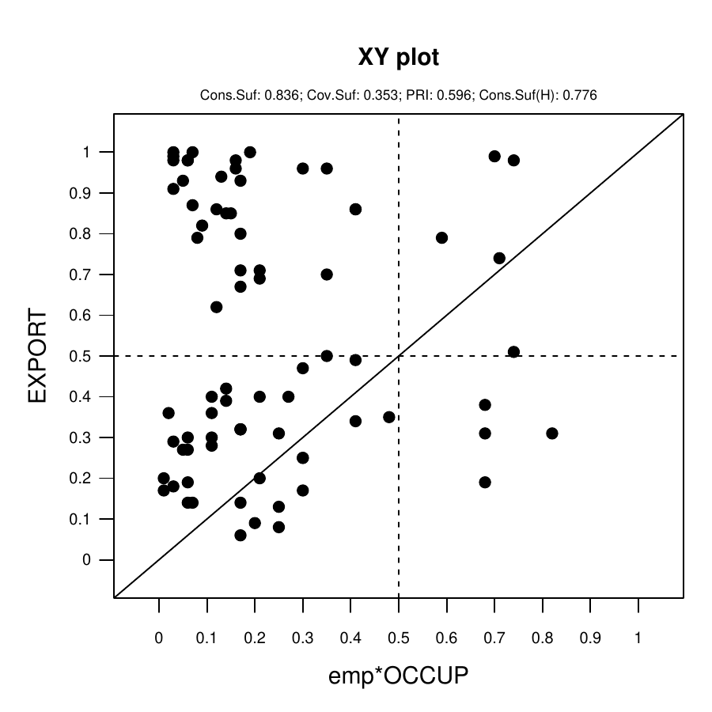
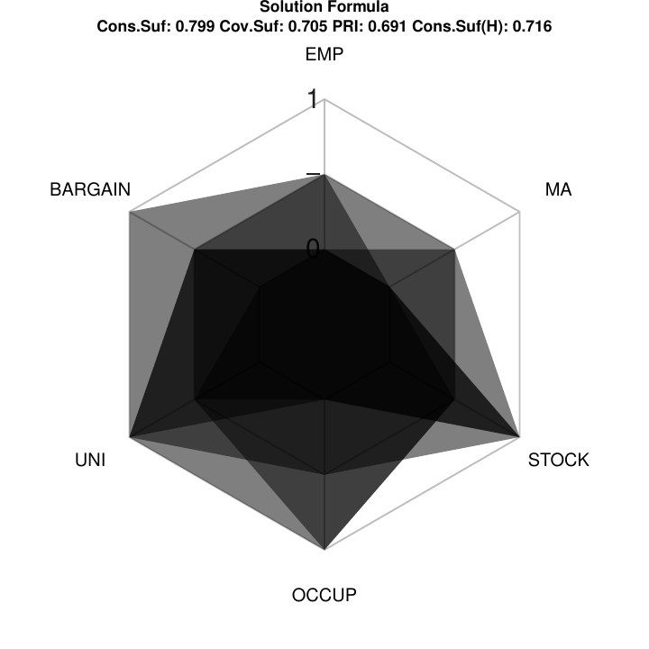
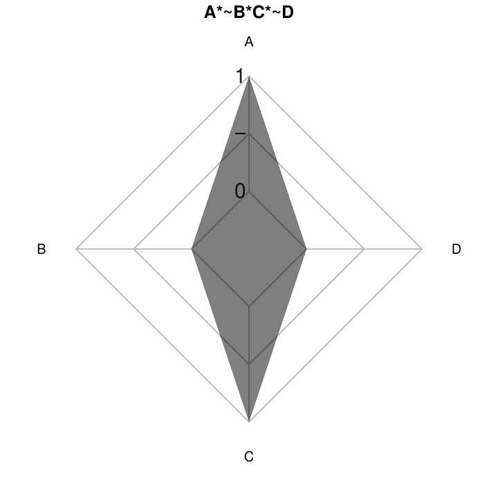

# Introduction {#sec:intro}

Set-theoretic methods, in general [@Goertz2011], and Qualitative
Comparative Analysis, in particular, are becoming increasingly popular
within different disciplines in the social sciences and neighboring
fields [@Rihoux2013c]. Parallel to conceptual developments and
increasing numbers of applied studies, accelerating progress in terms of
software development can be witnessed. While less than a decade ago only
two functioning software packages were available to users (*fsQCA*
[@Ragin2006m] and *Tosmana* [@Cronqvist2011]), there are now over a
dozen different software solutions offered (see
<http://compasss.org/software.htm>). Many of them are developed within
the [R]{.sans-serif} software environment, with [R]{.sans-serif} package
[***QCA***](https://CRAN.R-project.org/package=QCA) [@Dusa2007] being
not only the one with the longest history, but also the most complete
and complex.

In this paper, we discuss the different functionalities of the
[R]{.sans-serif} package
[***SetMethods***](https://CRAN.R-project.org/package=SetMethods)
[@Medzihorsky2016]. It is best perceived of as an add-on tool to package
***QCA*** and allows applied researchers to perform advanced
set-theoretic analyses. More precisely, ***SetMethods*** enables
researchers to perform Set-Theoretic Multi-Method Research, the Enhanced
Standard Analysis (ESA), Set-Analytic Theory Evaluation, to run
diagnostics in the presence of clustered data structures, and to display
their results in various ways.

We proceed as follows. Each of the different functionalities within
***SetMethods*** is presented in a separate section. Within each
section, we first briefly summarize the conceptual idea behind the
analysis in question, then describe the computational logic of the
function for performing the analysis, after which we demonstrate the use
of the function by displaying the [R]{.sans-serif} syntax and selected
output by using an example from published research.

Even though the main purpose is to present the functionality of
[R]{.sans-serif} package ***SetMethods***, this article is also useful
for researchers who perform their QCA in software environments other
than [R]{.sans-serif} because we present the logic of several of the
main advanced set-analytic procedures in a concise and transparent
manner.

# The empirical example {#sec:example}

In order to illustrate the use of the different functions in
***SetMethods***, we use the empirical example by [@SchneiderM2010]
which uses fuzzy-sets for explaining capitalist variety and export
performance in high-tech industries. More precisely, the research
question focuses on the institutional determinants of export performance
in high-tech industries. The outcome consists of the export performance
in high-tech industries (EXPORT). The conditions used are: employment
protection (EMP), collective bargaining (BARGAIN), university training
(UNI), occupational training (OCCUP), stock market size (STOCK), and
mergers and aquisitions (MA). The authors analyze 76 cases, representing
19 countries at four time points.

For the sake of simplicity, we use the same data for illustrating all
the functions. Our goal is not, of course, to contribute to the
substantive discussion on varieties of capitalism or institutional
context. This is why we will take the liberty to alter the analytic
setup if needed for demonstration purposes, by, for instance, dropping
cases or conditions or by changing the outcome to be explained.

``` r

# We load the SetMethods package:

library(SetMethods)

# First rows of the Schneider et al.(2010) data called SCHF from package
# SetMethods:

data(SCHF)
head(SCHF)

##               EMP BARGAIN  UNI OCCUP STOCK   MA EXPORT
## Australia_90 0.07    0.90 1.00  0.68  0.45 0.33   0.19
## Austria_90   0.70    0.98 0.01  0.91  0.01 0.05   0.25
## Belgium_90   0.94    0.95 0.14  0.37  0.26 0.14   0.14
## Canada_90    0.04    0.21 0.99  0.11  0.62 0.31   0.28
## Denmark_90   0.59    0.78 0.10  0.55  0.53 0.10   0.34
## Finland_90   0.70    0.97 0.20  0.95  0.02 0.13   0.17
```

# Set-theoretic multi-method research (MMR) {#sec:mmr}

The term Set-Theoretic Multi-Method Research (MMR) captures all those
empirical approaches for combining cross-case analyses with within-case
studies in which both levels of analysis follow the goal of
investigating sets and their relations. At the cross-case level the most
common methodological tool is Qualitative Comparative Analysis (QCA) and
at the within-case level, process tracing. Both tools can be rooted in
(fuzzy) set theory (see, e.g. [@Ragin2008c] for QCA and
[@Mikkelsen2015a] for process tracing). In principle and practice any
sequence of analyses can and is performed in the applied literature. In
the following, we focus on the sequence 'cross-case QCA first, followed
by within-case analyses'. This sequence may or may not be continued by
another QCA. As any decent QCA, it is certainly preceded by a thorough
accumulation of case knowledge in order to select and calibrate
conditions. These crucial research steps, however, fall outside of the
definitional scope of set-theoretic MMR.[^1]

In the following, we limit our discussion to set-theoretic MMR after a
cross-case analysis of sufficiency, as discussed in
[@Schneider2011; @Schneider2014a], Schneider and Rohlfing (manuscript),
and [@Rohlfing2016].[^2] We first briefly summarize the different types
of cases and the purpose of their within-case analysis (Section
[3.1](#sec:casetypes)). After this, we discuss the four different
feasible comparative within-case analyses in Figure [1](#fig:mmrtypes)
and their analytic purposes (Section [3.2](#sec:comparisons)). For each
form of within-case analysis, we explain the use of the `mmr` function
and the formula used for finding cases (Schneider and Rohlfing,
manuscript) [^3]. The general structure of function `mmr` is illustrated
in Figure [1](#fig:mmrtypes). Users need to specify whether they want to
perform single or comparative within-case analysis and then on which
cases the analysis is performed.

{#fig:mmrtypes width="100%" alt="graphic without alt text"}

## Identifying types of cases {#sec:casetypes}

Key for combining QCA with process tracing is the sorting of cases to
different case types based on the QCA solution formula. The literature
identifies five different types [@Schneider2011]. Membership in a type
is defined by the membership scores of a case in the outcome $Y$, on the
one hand, and the sufficient term $T$ or the solution formula $S$, on
the other hand. Table [1](#tab:types) summarizes the definition of each
case type and the analytic purpose of the within-case analysis in single
cases. Figure [2](#fig:types) visualizes the location of each case type
in an XY plot.

Typical cases and deviant cases consistency are defined based on their
membership in a sufficient term $T$, whereas deviant cases coverage and
IIR cases are defined based on their membership solution formula $S$.
Deviant cases consistency are subdivided into deviant in degree and
deviant in kind. The latter are always preferable for within-case
analysis. IIR cases are not useful for single-case studies, but they
play an important role for comparative within-case analyses (see Section
[3.2](#sec:comparisons)).

::: {#tab:types}
  ------------------------------------ --------------- ------- ------------ ------------------------------
                                        Membership in                       Goal of

  Type of case                               $T$         $Y$                within-case analysis

  \(1\) Typical                             $>$.5       $>$.5  $T \leq Y$   identify mechanism $M$

  \(2\) Deviant consistency (degree)        $>$.5       $>$.5  $T \geq Y$   not recommended

  \(3\) Deviant consistency (kind)          $>$.5       $<$.5               identify missing INUS

                                             $S$                            

  \(4\) Deviant coverage                    $<$.5       $>$.5               identify missing conjunction

  \(5\) IIR                                 $<$.5       $<$.5               not useful

                                                                            
  ------------------------------------ --------------- ------- ------------ ------------------------------

  : Table 1: Types of cases in fsQCA of sufficiency
:::

[]{#tab:types label="tab:types"}

Table [1](#tab:types) is adapted from Schneider and Rohlfing
(manuscript).

{#fig:types
width="100%" alt="graphic without alt text"}

### Typical cases {#sec:typ}

Process tracing in typical cases aims at empirically probing the causal
mechanism(s) linking the sufficient term $S$ to outcome $Y$. For
conjunction $S$ to be causal, each conjunct $C$ of $S$ must be causal,
i.e. they must make a difference to outcome $Y$ by making a difference
to mechanism $M$. This requires as many within-case analyses of typical
cases as there are conjuncts in the sufficient conjunction. For each
analysis, one is the focal conjunct $FC$ and the others are the
complementary conjuncts $CC$. The focal conjunct $FC$ is the conjunct
for which we want to find out whether it makes a difference for the
mechanism $M$, while the complementary conjuncts $CC$ represent the
other conjuncts of the sufficient term $S$ (Schneider and Rohlfing,
manuscript). For causal inference on the configuration we proceed by
taking each conjunct at a time as the focal conjunct $FC$. Additionally,
we also apply the *test severity principle*. With fuzzy-sets the
membership in mechanism $M$ can only vary within the corridor
established by the membership in $FC$ (the lowest value $M$ can take)
and $Y$ (the highest value $M$ can take) for preserving the causal chain
$FC \rightarrow M \rightarrow Y$ (Schneider and Rohlfing, manuscript).
The smaller the corridor, the smaller the range of membership values $M$
can take. Therefore, the most *severe test* for $M$ is the one in which
$FC$ = $S$ = $Y$ because the only consistent membership score in $M$
equals $FC$ = $S$ = $Y$.

The *best-available* typical case fulfills the following criteria: a)
the focal conjunct is the one that defines the membership of the typical
case in the term ($FC \leq CC$); b) the corridor for mechanism $M$ as
defined by the sufficient term $S$ (from a) we also have $S = FC$) and
$Y$ is small; c) membership in the sufficient term $S$ is high; d) the
case is uniquely covered by the sufficient term $S$.

Figure [3](#fig:severity) visualizes the test severity principle in two
different ways. The XY plot in the upper panel shows that for cases
closer to the diagonal, test severity increases. The length of the
vertical and horizontal arrows, respectively, visualizes the range of
fuzzy set membership scores for $M$ that would still be consistent. The
larger this range, the less severe the test. The Euler diagram in the
lower panel visualizes the same by contrasting $S_1$ almost as big as
$Y$ with $S_2$ being much smaller than $Y$. The former leaves little and
the latter a lot of room for $M$.

{#fig:severity width="100%" alt="graphic without alt text"}

The ideal typical case is located in the upper-right corner of the XY
plot in Figure [3](#fig:severity) with $FC = S = Y = 1$. In applied QCA,
such cases usually do not exist in the data at hand. Function `mmr()`
identifies the best available typical case in a given data set.

Function `mmr()` first sorts each typical case based on whether
$FC \leq CC$ (rank 1) or $FC > FC$ (rank 2). Cases in each rank are then
further sorted according to Formula \@ref(eq:typ). Smaller values
indicate better suitable cases.[^4]

$$\label{eq:typ}
	\begin{aligned}
	TYP ={}  & \left(Y-S\right) & \text{small corridor for mechanism}  \\
		     & + \left(1-S\right) & \text{large membership in the sufficient term}
	\end{aligned}   (\#eq:typ)$$

where $Y$ = outcome, $S$ = sufficient term

Applied to our example, function `mmr()` works as follows. After
minimizing the truth table $TT\_y$ and producing the parsimonious and
intermediate solutions $sol\_yp$ and $sol\_yi$ using package ***QCA***,
we input these solutions [^5] into the `mmr()` function while setting
arguments `match` to `FALSE` and `cases` to `2`. As argument `term` is
set to `1` the output shows the typical cases for each focal condition
in the first sufficient term, together with some additional information.
The information included in the output comprises of membership values of
the typical cases in the focal conjuct, complementary conjuncts, the
whole sufficient term, and the outcome (in this case $EXPORT$), formula
values $St$, whether the case is the most typical according to the
formula, which rank does the case sit in, and whether the case is
uniquely covered by the sufficient term. The order of the information
that users should look for in this output is whether the case is
uniquely covered, what rank is the case in (the smaller, the better),
and what formula value $St$ does the case have (the smaller, the
better). For example, for focal conjunct $emp$ in sufficient term
$emp*bargain*OCCUP$, `Switzerland_03` appears to be the *best available*
typical case, being uniquely covered, being in Rank 1, and having the
smallest formula value (St=0.59).

``` r

# We create the truth table:

TT_y <- truthTable(SCHF, outcome = "EXPORT",
                   conditions = c("EMP","BARGAIN","UNI",
                                  "OCCUP","STOCK", "MA"),
                   incl.cut = .9,
                   complete = TRUE,
                   PRI = TRUE,
                   sort.by = c("out", "incl", "n"))

# Get the parsimonious solution:

sol_yp <- minimize(TT_y, include = "?", details = TRUE, 
                   show.cases = TRUE)

# Get the intermediate solution:

sol_yi <- minimize(TT_y, include = "?", details = TRUE, 
                   show.cases = TRUE, dir.exp = c(0,0,0,0,0,0))

# Get typical cases for the first term of the second intermediate solution:

mmr (results = sol_yi, outcome = "EXPORT", neg.out = FALSE, 
     sol = "c1p1i2", match = FALSE, cases = 2, term = 1)


## Typical Cases - Focal Conjunct emp :
## ----------
##                Focal Conjunct Comp. Conjunct Term Membership EXPORT   St
## Switzerland_03           0.70           0.71            0.70   0.99 0.59
## Switzerland_99           0.75           0.54            0.54   0.98 0.69
##                most_typical Rank uniquely_cov
## Switzerland_03         TRUE    1         TRUE
## Switzerland_99        FALSE    2         TRUE
## 
## Typical Cases - Focal Conjunct bargain :
## ----------
##                Focal Conjunct Comp. Conjunct Term Membership EXPORT   St
## Switzerland_99           0.54           0.74            0.54   0.98 0.90
## Switzerland_03           0.76           0.70            0.70   0.99 0.53
##                most_typical Rank uniquely_cov
## Switzerland_99        FALSE    1         TRUE
## Switzerland_03         TRUE    2         TRUE
## 
## Typical Cases - Focal Conjunct OCCUP :
## ----------
##                Focal Conjunct Comp. Conjunct Term Membership EXPORT   St
## Switzerland_03           0.71           0.70            0.70   0.99 0.58
## Switzerland_99           0.74           0.54            0.54   0.98 0.70
##                most_typical Rank uniquely_cov
## Switzerland_03         TRUE    2         TRUE
## Switzerland_99        FALSE    2         TRUE
```

### Deviant cases consistency {#sec:devcons}

Deviant cases consistency are puzzling because their membership in the
sufficient term $S$ exceeds that in the outcome $Y$, i.e. $S >  Y$. This
becomes even more puzzling if $S > 0.5 \& Y < 0.5$, that is, if we have
deviant cases consistency in kind rather than just in degree (see
Table [1](#tab:types)). The more $S$ exceeds $Y$, the bigger the
empirical puzzle, especially if membership in $S$ is high. Within-case
analysis of a deviant case consistency aims at identifying the reasons
why mechanism $M$ either absent or prevented from producing $Y$. The
reason must be an INUS condition omitted from $S$. Formula \@ref(eq:dcn)
identifies the best available deviant case consistency in a data set.

$$\label{eq:dcn}
	\begin{aligned}
	DCN ={} & \left[1-\left(S-Y\right)\right] & \text{far from to the diagonal}  \\
		     & + \left(1-S\right) & \text{large membership in the sufficient term}
	\end{aligned}   (\#eq:dcn)$$

where $Y$ = outcome, $S$ = sufficient term

Using the same data from [@SchneiderM2010] and focusing on the
parsimonious solution, function `mmr()` identifies the deviant
consistency cases for each sufficient term. For obtaining this we need
to keep argument `match` set to `FALSE`, as we are doing single case
identification, but set argument `cases` to `3`, the identifier for
deviant cases consistency (see Figure [1](#fig:mmrtypes)). The output
shows the deviant consistency cases (first column) grouped by sufficient
term (second column) together with term membership, outcome membership,
formula value $Sd$, and whether the case is the most deviant for a
particular term. In the output we see that, for example, for term
$emp*OCCUP$ the most deviant case consistency is `Switzerland_90` with
the smallest formula value (Sd=0.67). Figure [4](#fig:dcnfig) shows all
the deviant cases consistency (cases in the lower right corner) for the
first sufficient path $emp*OCCUP$ of the parsimonious solution.

``` r

# Get deviant cases consistency for the parsimonious solution:

mmr (results = sol_yp, outcome = "EXPORT", neg.out = FALSE, 
     sol = 1, match = FALSE, cases = 3)
     
## Deviant Consistency Cases :
## ----------
##             cases              term term_membership EXPORT   Sd
## 2  Switzerland_90         emp*OCCUP            0.82   0.31 0.67
## 1    Australia_90         emp*OCCUP            0.68   0.19 0.83
## 3    Australia_95         emp*OCCUP            0.68   0.31 0.95
## 4    Australia_99         emp*OCCUP            0.68   0.38 1.02
## 14   Australia_95 BARGAIN*UNI*STOCK            0.90   0.31 0.51
## 7    Australia_03 BARGAIN*UNI*STOCK            0.90   0.35 0.55
## 6        Spain_99 BARGAIN*UNI*STOCK            0.79   0.27 0.69
## 8       Norway_03 BARGAIN*UNI*STOCK            0.79   0.32 0.74
## 41   Australia_99 BARGAIN*UNI*STOCK            0.79   0.38 0.80
## 21     Denmark_95 BARGAIN*UNI*STOCK            0.76   0.40 0.88
## 5      Belgium_99 BARGAIN*UNI*STOCK            0.72   0.40 0.96
## 31     Finland_95 BARGAIN*UNI*STOCK            0.73   0.49 1.03
## 42       Spain_03    occup*STOCK*ma            0.74   0.30 0.82
## 32     Denmark_95    occup*STOCK*ma            0.73   0.40 0.94
## 15      Canada_90    occup*STOCK*ma            0.62   0.28 1.04
## 22      Canada_95    occup*STOCK*ma            0.60   0.30 1.10
##    most_deviant
## 2          TRUE
## 1         FALSE
## 3         FALSE
## 4         FALSE
## 14         TRUE
## 7         FALSE
## 6         FALSE
## 8         FALSE
## 41        FALSE
## 21        FALSE
## 5         FALSE
## 31        FALSE
## 42         TRUE
## 32        FALSE
## 15        FALSE
## 22        FALSE
```

``` r

# Plot each sufficient path of the parsimonious solution:

pimplot(data = SCHF, results = sol_yp, outcome = "EXPORT", case_labels = FALSE)
```

<figure id="fig:dcnfig">

<figcaption>Figure 4: Deviant Cases Consistency</figcaption>
</figure>

### Deviant cases coverage {#sec:devcov}

Deviant cases coverage are puzzling because they are members of the
outcome without, however, being members of any known sufficient term.
Within-case analysis aims at identifying sufficient term $S_+$ omitted
from the solution formula, which triggers mechanism a $M$ and outcome
$Y$.

Since deviant cases coverage are defined by what they are *not* -
members of the solution formula (see Table [1](#tab:types)) - this
solution formula is not a good place to start selecting the best
available deviant cases coverage. Instead, this type of case is selected
based on their membership in their truth table row $TT$. For each $TT$
with at least one deviant case coverage, a within-case analysis can be
performed. If more than one deviant case coverage populates the same
$TT$, Formula \@ref(eq:dcv) identifies the best available case for
within-case analysis.

$$\label{eq:dcv}
	\begin{aligned}
	DCV ={} & \left|Y-TT\right| & \text{small corridor for mechanism}  \\
		     & + \left(1-TT\right) & \text{large membership in the truth table row}
	\end{aligned}   (\#eq:dcv)$$

where $Y$ = outcome, $TT$ = membership in the Truth Table row

Similar to the Formula \@ref(eq:typ) for identifying the best available
typical case, the goal is to minimize the difference between the
membership scores in $Y$ and $TT$ and to prefer higher membership in
$TT$. This is achieved by formula \@ref(eq:dcv). Since the primary goal
in this within-case analysis is not to draw causal inference but to
identify a missing conjunction, there is no need to decompose $TT$ into
its constituent sets.

Applied to our example, the following code displays the list of deviant
cases coverage (notice argument `cases` is set to `4`), the membership
they have in the entire solution formula, their values on the
Formula \@ref(eq:dcv), the truth table row they belong to (columns
starting with $TT$ indicating the specific combination of conditions the
case presents), the membership they have in that specific truth table
row, and membership in the outcome. The cases are sorted by truth table
row and ranked according to their appropriateness using formula values
$Sd$. For example, we can notice that truth table row
$emp*bargain*UNI*occup*STOCK*MA$ (rows 9, 10, 4, and 5 of the output) is
populated by 4 deviant coverage cases, out of which `UK_90` is the best
available for within case analysis, having the smallest formula value
(Sd=0.51).

``` r

# Get deviant cases coverage for the parsimonious solution:

mmr (results = sol_yp, outcome = "EXPORT", neg.out = FALSE, 
     sol = 1, match = FALSE, cases = 4)

## Deviant Coverage Cases :
## ----------
##              case solution_membership   Sd TT_EMP TT_BARGAIN TT_UNI
## 8           UK_03                0.12 0.22      0          0      1
## 3      Germany_99                0.17 0.33      1          1      0
## 11          UK_99                0.18 0.34      0          0      1
## 12         USA_99                0.20 0.39      0          0      1
## 7       Sweden_95                0.36 0.47      1          1      0
## 1       France_95                0.41 0.50      1          1      0
## 9           UK_90                0.36 0.51      0          0      1
## 10          UK_95                0.36 0.59      0          0      1
## 4      Ireland_03                0.32 0.64      0          0      1
## 5      Ireland_99                0.32 0.64      0          0      1
## 2      Germany_03                0.40 0.67      1          1      0
## 6  Netherlands_95                0.45 0.68      1          1      0
##    TT_OCCUP TT_STOCK TT_MA TT_row_membership EXPORT
## 8         0        1     1              0.88   0.98
## 3         1        1     1              0.71   0.67
## 11        0        1     1              0.82   0.98
## 12        0        1     1              0.80   0.99
## 7         1        1     1              0.62   0.71
## 1         1        0     0              0.56   0.62
## 9         0        1     1              0.64   0.79
## 10        0        1     1              0.64   0.87
## 4         0        1     1              0.68   1.00
## 5         0        1     1              0.68   1.00
## 2         1        0     0              0.51   0.69
## 6         1        1     1              0.51   0.70
```

### Individually irrelevant cases {#sec:iir}

Individually irrelevant (IIR) cases owe their name to the fact that
single within-case analyses in this type of cases is not useful. IIR
cases do play a crucial role in two forms of comparative within-case
analysis (see Section [3.2](#sec:comparisons)). Even if not useful for
single case studies, identifying IIR cases is informative as their
list - together with the deviant cases coverage - indicate the diversity
among cases without the outcome. The more different truth table rows are
populated by IIR cases (and deviant cases coverage), the more
heterogeneous this group of cases is.

Function `mmr()` lists all individually irrelevant cases with respect to
the entire solution formula (also called globally uncovered IIR cases)
and sorts each of them into the truth table to which they belong best.
Since these cases are not informative for single case studies and are
being used just to indicate diversity among the cases without the
outcome, the function does not involve a formula ranking of IIR cases.

``` r

# Get individually irrelevant cases for the parsimonious solution:

mmr (results = sol_yp, outcome = "EXPORT", neg.out = FALSE, 
     sol = 1, match = FALSE, cases = 5)

## Individually Irrelevant Cases :
## ----------
##              case solution_membership TT_EMP TT_BARGAIN TT_UNI TT_OCCUP
## 19 New Zealand_90                0.17      0          0      0        0
## 18 New Zealand_03                0.25      0          0      1        0
## 21 New Zealand_99                0.25      0          0      1        0
## 6       Canada_03                0.38      0          0      1        0
## 7       Canada_99                0.20      0          0      1        0
## 20 New Zealand_95                0.20      0          0      1        0
## 4      Belgium_90                0.26      1          1      0        0
## 10      France_90                0.23      1          1      0        0
## 14       Italy_90                0.01      1          1      0        0
## 25       Spain_90                0.03      1          1      0        0
## 1      Austria_90                0.30      1          1      0        1
## 2      Austria_95                0.30      1          1      0        1
## 3      Austria_99                0.30      1          1      0        1
## 9      Finland_90                0.30      1          1      0        1
## 11     Germany_90                0.05      1          1      0        1
## 12     Germany_95                0.17      1          1      0        1
## 13       Italy_03                0.25      1          1      0        1
## 15       Italy_95                0.03      1          1      0        1
## 17 Netherlands_90                0.14      1          1      0        1
## 8      Denmark_90                0.45      1          1      0        1
## 16       Italy_99                0.38      1          1      0        1
## 5      Belgium_95                0.21      1          1      0        1
## 27      Sweden_90                0.07      1          1      0        1
## 26       Spain_95                0.06      1          1      1        0
## 22      Norway_90                0.12      1          1      1        1
## 23      Norway_95                0.49      1          1      1        1
## 24      Norway_99                0.45      1          1      1        1
##    TT_STOCK TT_MA TT_row_membership EXPORT
## 19        0     1              0.58   0.06
## 18        0     1              0.75   0.13
## 21        0     1              0.75   0.08
## 6         1     1              0.62   0.36
## 7         1     1              0.80   0.40
## 20        1     1              0.76   0.09
## 4         0     0              0.63   0.14
## 10        0     0              0.54   0.42
## 14        0     0              0.70   0.20
## 25        0     0              0.69   0.17
## 1         0     0              0.70   0.25
## 2         0     0              0.70   0.25
## 3         0     0              0.70   0.47
## 9         0     0              0.70   0.17
## 11        0     0              0.92   0.27
## 12        0     0              0.74   0.32
## 13        0     0              0.67   0.31
## 15        0     0              0.71   0.18
## 17        0     0              0.57   0.39
## 8         1     0              0.53   0.34
## 16        1     0              0.62   0.29
## 5         1     1              0.53   0.20
## 27        1     1              0.74   0.36
## 26        0     0              0.84   0.19
## 22        0     0              0.65   0.14
## 23        0     0              0.51   0.14
## 24        0     1              0.55   0.32
```

## Identifying best-matching pairs of cases for comparative process tracing {#sec:comparisons}

The literature identifies four feasible within-case comparisons after a
QCA between two types of cases each (Schneider and Rohlfing,
manuscript). With each comparison a different analytic goal is pursued.
Figure [5](#fig:comparisons) summarizes these goals. The two comparisons
'along the main diagonal' pursue a causal inference goal, whereas the
two 'vertical' comparisons aim at improving the QCA model specification
by identifying either an INUS condition missing from a known sufficient
term or an entire new sufficient term missing from the solution formula.

{#fig:comparisons width="100%" alt="graphic without alt text"}

### Matching typical and individually irrelevant (IIR) cases {#sec:typ-iir}

The purpose of the within-case comparison between a typical case and and
IIR case is to empirically investigate whether a sufficient term is a
difference-maker, i.e. causal, not only for the outcome ($Y$) at the
cross-case level, but also for the mechanism $M$ at the within-case
level. Similarly, the within-case comparison of two typical cases
empirically probes whether the same mechanism $M$ links the sufficient
term $S$ to outcome $Y$ in typical cases that are as different from each
other as possible. For both forms of comparison, it holds that if $S$ is
a conjunction, each of its conjuncts $C$ must be a difference-maker.
Hence, the comparisons between a typical case and an IIR case (or
another typical case) must be performed for each single conjunct $C$ at
a time. The following sections provide more details for each form of
comparison and spells out the sorting mechanisms and mathematical
formulas that underly the respective functions in ***SetMethods***.

::: {#tab:conjuncts}
  ------ -------------- -------------------- ------------ -------- ------------- -------------
                                             Difference   Deter-   Attribution   Attribution

  Rank   Typical        IIR                  $FC$         minate   typical       IIR

  1      $FC \leq CC$   $FC < 0.5 < CC$      Yes          Yes      Yes           Yes

  2      $FC > CC$      $FC < 0.5 < CC$      Yes          Yes      No            Yes

  3      $FC \leq CC$   $FC \leq CC < 0.5$   Yes          No       Yes           Yes

  4      $FC \leq CC$   $CC < FC < 0.5$      Yes          No       Yes           No

  4      $FC > CC$      $FC \leq CC < 0.5$   Yes          No       No            Yes

  6      $FC > CC$      $CC < FC < 0.5$      Yes          No       No            No

  7      $FC \leq CC$   $CC < 0.5 < FC$      No           No       Yes           No

  8      $FC > CC$      $CC < 0.5 < FC$      No           No       No            No

                                                                                 
  ------ -------------- -------------------- ------------ -------- ------------- -------------

  : Table 2: Possible membership constellations between focal ($FC$) and
  complementary conjuncts ($CC$) in comparison of typical and IIR case
:::

::: tablenotes
taken from Schneider and Rohlfing (manuscript)
:::

Function `mmr()` first sorts each pair of typical and IIR cases into
ranks 1-8 as defined in Table [2](#tab:conjuncts). Cases in smaller rank
numbers are more adequate for the analytic goal of the comparative
within-case analysis of these two case types. For case pairs in rank 1,
for example, it holds that the difference-making quality can be
attributed to the focal conjunct $FC$ both on the typical and the IIR
case, and that it is determinate.

Within each rank, Formula \@ref(eq:typ-iir) maximizes the following
criteria: between both cases, the difference in $FC$ and in $Y$,
respectively, should be small; both should have high membership in $CC$;
and both should be close to the diagonal. Within each rank, case pairs
with smaller formula values are more appropriate. Additionally, typical
cases should be uniquely covered by the sufficient term under
inverstigation, while IIR cases should be globally uncovered (not
covered by any of the sufficient terms).

$$\label{eq:typ_iir}
\small
	\begin{aligned}
	TYP-IIR ={} & \left[1-\left(FC_{TYP}-FC_{IIR}\right)\right] & \text{large difference in focal condition}  \\
				& + \left[1-\left(Y_{TYP}-Y_{IIR}\right)\right] & \text{large difference in outcome}  \\
				& + \left|min(CC_{TYP})-min(CC_{IIR})\right| & \text{small difference in complementary conditions}  \\
				& + 2*\left|\left(Y_{TYP}-min\left(FC_{TYP},CC_{TYP}\right)\right)\right| & \text{typical case close to diagonal} \\
				& + 2*\left|\left(Y_{IIR}-min\left(FC_{IIR},CC_{IIR}\right)\right)\right| & \text{IIR case close to diagonal}
	\end{aligned}   (\#eq:typ-iir)$$

where $Y$ = outcome, $FC$ = focal condition, and $CC$ = complementary
condition

For switching to comparative MMR and identifying pairs of cases,
argument `match` must be set to `TRUE`. Additionally, for getting the
best available pairs of typical and IIR cases we set `cases` to `2`. In
the output for the first sufficient term (notice argument `term` set to
`1`) we will get the best available pairs for each focal conjunct in
turn as separate tables. The output lists the names of the typical and
IIR case, their value on the above formula ($Distance$), which rank does
the pair come from, whether the typical case is uniquely covered, and
whether the IIR case is globally uncovered. Researchers should strive to
pick cases that are uniquely covered and globally uncovered, have the
smallest rank possible, and have the smallest $Distance$ value. For
example, for focal conjunct $OCCUP$, typical case `Denmark_99` and IIR
case `New Zealand_90` are the best pair available as they are in Rank 1,
they have the smallest formula value (Distance=1.24), and the typical
case is uniquely covered by the term, while the IIR case is globally
uncovered by the solution.

``` r

# Get matching pairs of typical and IIR cases for the first term 
# of the parsimonious solution:

mmr (results = sol_yp, outcome = "EXPORT", neg.out = FALSE, 
     sol = 1, match = TRUE, cases = 2, term = 1)
     
## Focal Conjunct emp :
## ----------
##           Typical        IIR Distance PairRank UniqCovTyp GlobUncovIIR
## 44 Switzerland_03  Norway_90     1.30        1       TRUE         TRUE
## 43     Denmark_03  Norway_90     1.38        1       TRUE         TRUE
## 88 Switzerland_03  Norway_95     1.38        1       TRUE         TRUE
## 80 Switzerland_03   Italy_95     1.40        1       TRUE         TRUE
## 60 Switzerland_03 Belgium_95     1.55        1       TRUE         TRUE
## 
## Focal Conjunct OCCUP :
## ----------
##            Typical            IIR Distance PairRank UniqCovTyp
## 37      Denmark_99 New Zealand_90     1.24        1       TRUE
## 81      Denmark_99 New Zealand_95     1.30        1       TRUE
## 133     Denmark_99 New Zealand_03     1.31        1       TRUE
## 38  Switzerland_99 New Zealand_90     1.39        1       TRUE
## 82  Switzerland_99 New Zealand_95     1.45        1       TRUE
##     GlobUncovIIR
## 37          TRUE
## 81          TRUE
## 133         TRUE
## 38          TRUE
## 82          TRUE
```

### Matching two typical cases {#sec:typ-typ}

The matching of two typical cases follows a logic similar to the one
between a typical and an IIR case. The goal is to probe the
difference-making properties of each conjunct ($FC$) in sufficient term
$S$ to mechanism $M$. Table [3](#tab:twotypical) defines the four ranks
that can occur based on two typical cases' membership in $FC$ and the
complementary conditions $CC$. After sorting each possible pair of
typical cases into one of these ranks, Formula \@ref(eq:typ-typ) further
ranks those pairs such that their difference in $FC$ and the outcome,
respectively, is minimized; that their membership in $CC$ is maximized;
and that both are close to the diagonal (test severity principle).
Additionally, the two typical cases should be uniquely covered by the
sufficient term.

::: {#tab:twotypical}
  ------ -------------- -------------- ----------------------- -----------------------
  Rank   Typical 1      Typical 2       Attribution typical 1   Attribution typical 2

  1      $FC \leq CC$   $FC \leq CC$             Yes                     Yes

  2      $FC \leq CC$   $FC > CC$                Yes                     No

  2      $FC > CC$      $FC \leq CC$             No                      Yes

  4      $FC > CC$      $CC > FC$                No                      No

                                                               
  ------ -------------- -------------- ----------------------- -----------------------

  : Table 3: Possible membership constellations between focal ($FC$) and
  complementary conjuncts ($CC$) in comparison of two typical cases
:::

[]{#tab:twotypical label="tab:twotypical"}

taken from Schneider and Rohlfing (manuscript)

$$\label{eq:typ_typ}
\small
	\begin{aligned}
	TYP_{1}-TYP_{2} ={} & \left[0.5-\left(FC_{TYP_{1}}-FC_{TYP_{2}}\right)\right] & \text{large difference in focal condition}  \\
						& + \left[0.5-\left(Y_{TYP_{1}}-Y_{TYP_{2}}\right)\right] & \text{large difference in outcome}  \\
						& + \left|min(CC_{TYP_{1}})-min(CC_{TYP_{2}})\right| & \text{small difference in complementary conditions}     \\
						& + 2*\left|\left(Y_{TYP_{1}}-min\left(FC_{TYP_{1}},CC_{TYP_{1}}\right)\right)\right| & \text{typical case close to diagonal} \\
						& + 2*\left|\left(Y_{TYP_{2}}-min\left(FC_{TYP_{2}},CC_{TYP_{2}}\right)\right)\right| & \text{typical case close to diagonal}
\end{aligned}   (\#eq:typ-typ)$$

For getting the best available pairs of two typical cases argument
`cases` in function `mmr()` must be set to `1`. The output is similar to
the one for typical-IIR pairs of cases, the best available pair of
typical cases for each focal conjunct being situated in as low a rank as
possible, having the smaller formula value (Distance), and being both
uniquely covered. Looking at the first term of the parsimonious
solution, we can see that pair `Switzerland_03-Denmark_03` is the best
available for focal conjunct $emp$, while pair
`Switzerland_99-Denmark_99` is the best available for focal conjunct
$OCCUP$, both pairs containing uniquely covered typical cases, being in
Rank 1, and having the smallest $Distance$ value for their respective
focal conjunct.

``` r

# Get matching pairs of typical and typical cases for the first term 
# of the parsimonious solution:

mmr (results = sol_yp, outcome = "EXPORT", neg.out = FALSE, 
     sol = 1, match = TRUE, cases = 1, term = 1)

## Focal Conjunct emp :
## ----------
##          Typical1       Typical2 Distance PairRank UniqCov1 UniqCov2
## 12 Switzerland_03     Denmark_03     1.72        1     TRUE     TRUE
## 4  Switzerland_03     Denmark_99     1.44        2     TRUE     TRUE
## 3      Denmark_03     Denmark_99     1.62        2     TRUE     TRUE
## 8  Switzerland_03 Switzerland_99     2.13        2     TRUE     TRUE
## 7      Denmark_03 Switzerland_99     2.31        2     TRUE     TRUE
## 
## Focal Conjunct OCCUP :
## ----------
##         Typical1       Typical2 Distance PairRank UniqCov1 UniqCov2
## 2 Switzerland_99     Denmark_99     1.27        1     TRUE     TRUE
## 4 Switzerland_03     Denmark_99     1.44        3     TRUE     TRUE
## 3     Denmark_03     Denmark_99     1.62        3     TRUE     TRUE
## 8 Switzerland_03 Switzerland_99     2.13        3     TRUE     TRUE
## 7     Denmark_03 Switzerland_99     2.31        3     TRUE     TRUE
```

### Matching typical and deviant cases consistency {#sec:typ-devcons}

The comparative within-case analysis of a typical and a deviant case
consistency aims at identifying the INUS condition missing from the
sufficient term $S$ in question. The best available pair of cases
maximizes the following criteria: their membership in $S$ should be as
high and similar as possible and their membership in $Y$ is different as
possible. Formula \@ref(eq:typ-dcons) translates these matching criteria
into practice.

$$\label{eq:typ_dcons}
\small
	\begin{aligned}
	TYP-DCON ={}	& \left[\left(1-S_{TYP}\right)+\left(1-S_{DCON}\right)\right]  & \text{large membership in term} \\
				& + \left[1-\left(Y_{TYP}-Y_{DCON}\right)\right] & \text{large difference in outcome} \\
				& + \left|S_{TYP} - S_{DCON}\right|  & \text{similar membership in term}
	\end{aligned}   (\#eq:typ-dcons)$$

Setting `cases` to `3` we get best available pair of typical and deviant
consistency cases for each sufficient term in the parsimonious solution
`sol_yp`. For identifying a missing INUS in sufficient term $emp*OCCUP$,
the best available pair of cases that we could choose for
process-tracing would be the one between typical case `Switzerland_03`
and deviant consistency case `Australia_90`, as they have the smallest
formula value (Distance=0.84).

``` r

# Get matching pairs of typical and deviant consistency cases for the 
# parsimonious solution:

mmr (results = sol_yp, outcome = "EXPORT", neg.out = FALSE, 
     sol = 1, match = TRUE, cases = 3)


## Term emp*OCCUP :
## ----------
##          typical deviant_consistency distance      term best_matching_pair
## 1 Switzerland_03        Australia_90     0.84 emp*OCCUP               TRUE
## 2 Switzerland_99        Australia_90     0.85 emp*OCCUP              FALSE
## 3 Switzerland_99      Switzerland_90     0.85 emp*OCCUP              FALSE
## 4 Switzerland_03      Switzerland_90     0.92 emp*OCCUP              FALSE
## 5 Switzerland_03        Australia_95     0.96 emp*OCCUP              FALSE
## 
## Term BARGAIN*UNI*STOCK :
## ----------
##          typical deviant_consistency distance              term
## 1 Netherlands_03        Australia_95     0.55 BARGAIN*UNI*STOCK
## 2 Netherlands_03        Australia_03     0.59 BARGAIN*UNI*STOCK
## 3 Netherlands_99        Australia_95     0.65 BARGAIN*UNI*STOCK
## 4 Netherlands_99        Australia_03     0.69 BARGAIN*UNI*STOCK
## 5 Netherlands_99            Spain_99     0.73 BARGAIN*UNI*STOCK
##   best_matching_pair
## 1               TRUE
## 2              FALSE
## 3              FALSE
## 4              FALSE
## 5              FALSE
## 
## Term occup*STOCK*ma :
## ----------
##    typical deviant_consistency distance           term best_matching_pair
## 1   USA_03            Spain_03     0.84 occup*STOCK*ma               TRUE
## 2 Japan_99            Spain_03     0.86 occup*STOCK*ma              FALSE
## 3 Japan_03            Spain_03     0.88 occup*STOCK*ma              FALSE
## 4   USA_90            Spain_03     0.89 occup*STOCK*ma              FALSE
## 5   USA_95            Spain_03     0.91 occup*STOCK*ma              FALSE
```

### Matching deviant cases coverage and IIR cases {#sec:devcov-iir}

The comparative within-case analysis of a deviant case coverage and an
IIR case aims at identifying the sufficient conjunction $S_+$ missing
from the sufficient solution formula generated with QCA. The point of
reference for matching cases is their membership in the truth table row
$TT$ to which they belong. Analogous to the within-case comparison of a
typical and a deviant case consistency case, the goal is to maximize
both cases' membership and their similarity in $TT$ and their difference
in $Y$. Formula \@ref(eq:-dcov-iir) achieves this.

$$\label{eq: dcov_iir}
\small
	\begin{aligned}
	DCOV-IIR ={} 	& \left[\left(1-TT_{DCOV}\right)+ \left(1-TT_{IIR}\right)\right] & \text{large membership in TT row}  \\
					& + \left[1-\left(Y_{DCOV}-Y_{IIR}\right)\right] & \text{large difference in outcome}\\
					& + \left|TT_{DCOV} - TT_{IIR}\right| & \text{similar membership in TT row}
	\end{aligned}   (\#eq:-dcov-iir)$$

Cases for this forth type of comparison can be identified by setting
`cases` to `4`. Since for deviant coverage and IIR cases we are
interested in identifying an entire missing sufficient term, the output
for these pairs is focused on matching pairs in truth table rows, rather
than in sufficient terms. Therefore, the output is sorted by truth table
rows (the columns starting with $TT$ showing the combination of
conditions) and for each truth table row we can identify a best matching
pair of cases according to formula values in column $distance$. For
example, if we focus on truth table row $EMP*BARGAIN*uni*OCCUP*stock*ma$
(rows 6, 7, 8, 9, 10 in the output), the deviant case coverage
`France_95` and the IIR case `Finland_90` constitute the best matching
pair, having the smallest formula value for this specific truth table
row (distance=1.43).

``` r

# Get matching pairs of deviant coverage and IIR cases for the 
# parsimonious solution:

mmr (results = sol_yp, outcome = "EXPORT", neg.out = FALSE, 
     sol = 1, match = TRUE, cases = 4)

## Matching Deviant Coverage-IIR Cases :
## ----------
##    deviant_coverage individually_irrelevant distance best_matching_pair
## 1            USA_99          New Zealand_95     0.58               TRUE
## 2             UK_03          New Zealand_95     0.59              FALSE
## 3             UK_99          New Zealand_95     0.59              FALSE
## 4        Ireland_03          New Zealand_95     0.73              FALSE
## 5        Ireland_99          New Zealand_95     0.73              FALSE
## 6         France_95              Finland_90     1.43               TRUE
## 7         France_95                Italy_95     1.44              FALSE
## 8        Germany_03              Finland_90     1.46              FALSE
## 9        Germany_03                Italy_95     1.47              FALSE
## 10        France_95              Austria_90     1.51              FALSE
## 11        Sweden_95               Sweden_90     1.41               TRUE
## 12        Sweden_95              Belgium_95     1.43              FALSE
## 13   Netherlands_95              Belgium_95     1.48              FALSE
## 14   Netherlands_95               Sweden_90     1.64              FALSE
##    TT_EMP TT_BARGAIN TT_UNI TT_OCCUP TT_STOCK TT_MA
## 1       0          0      1        0        1     1
## 2       0          0      1        0        1     1
## 3       0          0      1        0        1     1
## 4       0          0      1        0        1     1
## 5       0          0      1        0        1     1
## 6       1          1      0        1        0     0
## 7       1          1      0        1        0     0
## 8       1          1      0        1        0     0
## 9       1          1      0        1        0     0
## 10      1          1      0        1        0     0
## 11      1          1      0        1        1     1
## 12      1          1      0        1        1     1
## 13      1          1      0        1        1     1
## 14      1          1      0        1        1     1
```

# Enhanced standard analysis (ESA) {#sec:esa}

Limited empirical diversity is an omnipresent feature in social science
data. The treatment of logical remainders rows has been a major theme
since the Ragin's path-breaking book [@Ragin1987 esp. chapter 7]. In
@Ragin2008c [chapters 8 and 9], three approaches towards remainders are
proposed under the label of the Standard Analysis (SA). Researchers can
decide not to include them into the logical minimization (yielding the
conservative or complex solution $CS$), to include all remainders that
are simplifying (yielding the most parsimonious solution $PS$), or to
include only those simplifying assumption that are easy based on
so-called directional expectations (yielding the intermediate solution
($IS$)).

@Schneider2012 [chapter 8] propose the Enhanced Standard Analysis (ESA),
which argues that simplifying assumptions on specific remainders can be
untenable. There are three sources of untenability. *Incoherent
counterfactuals*, which are either logical remainders contradicting
claims of necessity[^6] or assumptions made for the negated outcome[^7],
and *implausible counterfactuals*, which consist of claims about
impossible remainders[^8]. ESA simply stipulates that no QCA solution
formula can be based on untenable assumptions.

Figure [6](#fig:esa) provides a graphical representation of the
different types of assumptions as defined by SA and ESA. Both approaches
only allow for simplifying assumptions[^9] (i.e. those in the inner
circle) and both distinguish between difficult and easy counterfactuals
(i.e. the vertical line inside the circle)[^10]. ESA but not SA does
block any untenable assumption (i.e. the gray area on the lower part). A
risk of making untenable assumption is given whenever a researcher is
claiming the presence of a necessary condition, when statements of
sufficiency for both the outcome and its negation are made, and/or when
two or more conditions with mutually exclusive categories are used in a
truth table. ESA requires that researchers identify those logical
remainder rows whose inclusion into the logical minimization would
amount to an untenable claim. As a result, one obtains the enhanced PS
and the enhanced IS.[^11]

Function `esa()` provides a straightforward tool for avoiding untenable
assumptions and thus putting ESA into practice. First, function `esa()`
can exclude remainders that contradict single necessary conditions,
unions of necessary conditions, or more complicated expressions of
necessity. For example, assuming that the disjunction $STOCK+MA$ is
necessary for the outcome EXPORT, we ban all remainder rows implied by
this necessity claim in the `nec_cond` argument. All the logical
remainder rows that are subsets of $\neg STOCK\neg MA$ are
subsequently set ot OUT = 0 in the truth table object `ttnew` and thus
excluded from further logical minimization.

``` r

# Ban logical reminders contradicting necessity:
# Let's assume that "STOCK + MA" is necessary for "EXPORT":

newtt <- esa(oldtt = TT_y, nec_cond = "STOCK + MA")

##    EMP BARGAIN UNI OCCUP STOCK MA OUT n incl PRI cases
## 1    0       0   0     0     0  0   0 0    -   -      
## 3    0       0   0     0     1  0   ? 0    -   -      
## 4    0       0   0     0     1  1   ? 0    -   -      
## 5    0       0   0     1     0  0   0 0    -   -      
## 6    0       0   0     1     0  1   ? 0    -   -      
## 7    0       0   0     1     1  0   ? 0    -   -      
## 9    0       0   1     0     0  0   0 0    -   -      
## 13   0       0   1     1     0  0   0 0    -   -      
## 14   0       0   1     1     0  1   ? 0    -   -      
## 15   0       0   1     1     1  0   ? 0    -   -      
## 17   0       1   0     0     0  0   0 0    -   -      
## 18   0       1   0     0     0  1   ? 0    -   -      
## 20   0       1   0     0     1  1   ? 0    -   -      
## 21   0       1   0     1     0  0   0 0    -   -      
## 22   0       1   0     1     0  1   ? 0    -   -      
## 23   0       1   0     1     1  0   ? 0    -   -      
## 24   0       1   0     1     1  1   ? 0    -   -      
## 25   0       1   1     0     0  0   0 0    -   -      
## 26   0       1   1     0     0  1   ? 0    -   -      
## 30   0       1   1     1     0  1   ? 0    -   -      
## 31   0       1   1     1     1  0   ? 0    -   -      
## 33   1       0   0     0     0  0   0 0    -   -      
## 34   1       0   0     0     0  1   ? 0    -   -      
## 35   1       0   0     0     1  0   ? 0    -   -      
## 36   1       0   0     0     1  1   ? 0    -   -      
## 37   1       0   0     1     0  0   0 0    -   -      
## 38   1       0   0     1     0  1   ? 0    -   -      
## 39   1       0   0     1     1  0   ? 0    -   -      
## 40   1       0   0     1     1  1   ? 0    -   -      
## 41   1       0   1     0     0  0   0 0    -   -      
## 42   1       0   1     0     0  1   ? 0    -   -      
## 44   1       0   1     0     1  1   ? 0    -   -      
## 45   1       0   1     1     0  0   0 0    -   -      
## 46   1       0   1     1     0  1   ? 0    -   -      
## 47   1       0   1     1     1  0   ? 0    -   -      
## 48   1       0   1     1     1  1   ? 0    -   -      
## 50   1       1   0     0     0  1   ? 0    -   -      
## 51   1       1   0     0     1  0   ? 0    -   -      
## 52   1       1   0     0     1  1   ? 0    -   -      
## 54   1       1   0     1     0  1   ? 0    -   -      
## 58   1       1   1     0     0  1   ? 0    -   -      
## 59   1       1   1     0     1  0   ? 0    -   -
```

Secondly, the `esa()` function can also ban implausible counterfactuals
to produce truth tables in which specific logical remainders identifyied
through conjunctions are excluded. For example, we can ban all remainder
rows that have $BARGAIN +\sim OCCUP$ by using the Boolean expression in
argument `untenable_LR`. Finally, the function can exclude contradictory
simplifying assumptions (which are another form of untenable
assumptions) and empirically observed rows that are part of simultaneous
subset relations[^12] by just using the unique truth table row
identifier in the argument `contrad_rows`. While argument `untenable_LR`
accepts Boolean expression for excluding only logical remainders,
argument `contrad_rows` can exclude both empirically observed rows and
remainder rows through their unique identifier (row number).[^13]

``` r

# Ban impossible logical remainders:
newtt <- esa(oldtt = TT_y, untenable_LR = "BARGAIN*~OCCUP")

# Ban contradictory rows:
newtt <- esa(oldtt = TT_y, contrad_rows = c("19", "14", "46", "51"))
```

{#fig:esa width="100%" alt="graphic without alt text"}

# Set-analytic theory evaluation {#sec:theory-eval}

@Ragin1987 [chapter 7] spells out the notion of theory evaluation. In
essence, it consists of identifying the overlap between a researcher's
theory ($T$) as formulated prior to the empirical analysis and the
empirical results ($S$) obtained via QCA. With both $T$ and $S$ being
represented in the form of Boolean expressions, all four logically
possible combinations between $T$ and $S$ can be expressed in Boolean
terms as well and each case's membership in each of these four
expressions be calculated. Theory evaluation reveals which aspects of
$T$ are empirically corroborated by $S$ and which ones are not. It also
reveals how strong this emirical support is. Last but not least, theory
evaluation can serve as a case selection device by identifying cases
that display membership scores in the empirical solution and the outcome
that are expected or utterly unexpected based on $T$.

@Schneider2012 [chapter 11] refine Theory Evaluation by taking into
account each case's membership score not only in $T$ and $S$, but also
outcome $Y$. This is necessary due to the development of parameters of
fit based on which by now it has become widespread practice to allow for
solution formulas with less than perfect consistency and coverage
scores. This means that in applied QCA, there are cases of $S \& \neg Y$
and of $\neg S \& Y$. This gives rise to eight different areas. Each
area can be defined as a Boolean expression, provides different analytic
information, and defines different types of cases. Each case has partial
membership in all areas but only in one of higher than 0.5.
Figure [7](#fig:theory-eval) provides a visualization of the areas and
the kinds of cases in each area.[^14]

{#fig:theory-eval width="100%" alt="graphic without alt text"}

Function `theory.evaluation()` performs the theory evaluation procedure
between a theory specified in Boolean terms and results obtained using
the ***QCA*** package. Assuming that the theory can be summarized as
`EMP*`$\sim$`MA + STOCK`, the example below shows how theory evaluation
works using the second intermediate solution for outcome $EXPORT$. The
first part of the output shows the names and proportion of cases in each
of the intersections between theory and the empirical solution. The
second part of the output shows parameters of fit for the solution, the
theory, and their intersections, which indicate how much each of these
areas are in line with a statement of sufficiency for $EXPORT$.
Additionally, the function also stores the membership of each case in
each intersection between theory and empirics, which can be accessed by
setting argument `print.data` to `TRUE`.

``` r

# Assuming the theory can be summarized as "EMP*~MA + STOCK", 
# perform theory evaluation using the second intermediate solution:

theory.evaluation(theory = "EMP*~MA + STOCK", empirics = sol_yi, 
                  outcome = "EXPORT", sol = 2, print.data=FALSE)

## 
## Cases:
## ----------
## 
## Covered Most Likely (T*E and Y > 0.5) :
## *******************
## 
## Cases in the intersection/Total number of cases: 23 / 76 = 30.26 % 
## 
## Case Names:
##  [1] "Ireland_90"     "Japan_90"       "USA_90"         "Ireland_95"    
##  [5] "Japan_95"       "Switzerland_95" "USA_95"         "Denmark_99"    
##  [9] "Finland_99"     "France_99"      "Japan_99"       "Netherlands_99"
## [13] "Sweden_99"      "Switzerland_99" "Belgium_03"     "Denmark_03"    
## [17] "Finland_03"     "France_03"      "Japan_03"       "Netherlands_03"
## [21] "Sweden_03"      "Switzerland_03" "USA_03"        
## 
## Covered Least Likely (t*E and Y > 0.5) :
## *******************
## 
## Cases in the intersection/Total number of cases: 0 / 76 = 0 % 
## 
## Case Names:
## [1] "No cases in this intersection"
## 
## Uncovered Most Likely (T*e and Y > 0.5) :
## *******************
## 
## Cases in the intersection/Total number of cases:  12 / 76 = 15.79 % 
## 
## Case Names:
##  [1] "UK_90"          "France_95"      "Netherlands_95" "Sweden_95"     
##  [5] "UK_95"          "Germany_99"     "Ireland_99"     "UK_99"         
##  [9] "USA_99"         "Germany_03"     "Ireland_03"     "UK_03"         
## 
## Uncovered Least Likely (t*e and Y > 0.5) :
## *******************
## 
## Cases in the intersection/Total number of cases:  0 / 76 = 0 % 
## 
## Case Names:
## [1] "No cases in this intersection"
## 
## Inconsistent Most Likely (T*E and Y < 0.5) :
## *******************
## 
## Cases in the intersection/Total number of cases:  12 / 76 = 15.79 % 
## 
## Case Names:
##  [1] "Canada_90"      "Switzerland_90" "Australia_95"   "Canada_95"     
##  [5] "Denmark_95"     "Finland_95"     "Australia_99"   "Belgium_99"    
##  [9] "Spain_99"       "Australia_03"   "Norway_03"      "Spain_03"      
## 
## Inconsistent Least Likely (t*E and Y < 0.5) :
## *******************
## 
## Cases in the intersection/Total number of cases:  1 / 76 = 1.32 % 
## 
## Case Names:
## [1] "Australia_90"
## 
## Consistent Most Likely (T*e and Y < 0.5) :
## *******************
## 
## Cases in the intersection/Total number of cases:  23 / 76 = 30.26 % 
## 
## Case Names:
##  [1] "Austria_90"     "Belgium_90"     "Denmark_90"     "Finland_90"    
##  [5] "France_90"      "Germany_90"     "Italy_90"       "Netherlands_90"
##  [9] "Norway_90"      "Spain_90"       "Sweden_90"      "Austria_95"    
## [13] "Belgium_95"     "Germany_95"     "Italy_95"       "New Zealand_95"
## [17] "Norway_95"      "Spain_95"       "Austria_99"     "Canada_99"     
## [21] "Italy_99"       "Canada_03"      "Italy_03"      
## 
## Consistent Least Likely (t*e and Y < 0.5) :
## *******************
## 
## Cases in the intersection/Total number of cases:  4 / 76 = 5.26 % 
## 
## Case Names:
## [1] "New Zealand_90" "New Zealand_99" "Norway_99"      "New Zealand_03"
## 
## 
## Fit:
## ----------
## 
##                    Cons.Suf Cov.Suf   PRI Cons.Suf(H)
## emp*bargain*OCCUP     0.909   0.194 0.721       0.865
## BARGAIN*UNI*STOCK     0.796   0.497 0.665       0.704
## emp*UNI*OCCUP*ma      0.919   0.171 0.611       0.894
## emp*occup*STOCK*ma    0.904   0.298 0.802       0.859
## UNI*occup*STOCK*ma    0.894   0.341 0.795       0.853
## Sol.Formula           0.799   0.705 0.691       0.716
## Theory                0.639   0.973 0.515       0.550
## T*E                   0.811   0.705 0.707       0.726
## t*E                   0.825   0.165 0.423       0.764
## T*e                   0.651   0.547 0.419       0.592
## t*e                   0.697   0.203 0.232       0.640
```

# Diagnostic tools for clustered data structures {#sec:cluster}

Most of the data analyzed in the social sciences and neighboring
disciplines contains structures, or layers, that might be analytically
relevant but are not captured by the models used to analyze that data.
[@Garcia-Castro2016] discuss clustering along a *temporal* dimension.
This can be days, years, decades, or substantively important periods
(before - after a crisis). Clusters can also be of different origin. For
instance, cases can be clustered along *geographic* units, such as world
regions or subnational units. There can also be clusterings along
*substantive* lines, such as e.g. economic sectors, parties, political
regime types.

Whenever a researcher is not capturing these differences via a condition
in her QCA model, she de facto assumes that the analytic difference does
not matter. There are often good reasons to not include additional
conditions into an analysis, with keeping limited diversity at bay being
one of them. It should, however, been put to an empirical test whether
it is ok to pool cases across different time periods, geographic units,
and/or substantive areas.

Function `cluster()` provides the tools for performing such a test. It
analyzes whether the QCA solution formula obtained from the pooled data
also can be found in each of the sub-populations in the data. If it can,
then pooling the data is fine. If it cannot, then pooling the data is
not fine because it produces a solution that does not hold for all
sub-populations. Rather, it is an artifact of having pooled cases that
follow different causal logics. In this case, researchers might decide
to drop from their analysis those sub-populations that do not follow the
general pattern or to include a condition into their model that captures
the difference.

For using the `cluster()` function, researchers need data in the long
format, with a column identifying the unit of analysis and a column
identifying the clustering element. In our example, using the
[@SchneiderM2010] data, the column identifyign the units is the
`COUNTRY` column, while the cluster element is stored in the `YEAR`
column. After having the data in the long format, we can get the
diagnostic of how our solution holds throughout the different units and
clusters by just imputing the solution (in this case `sol_yi`) in the
`cluster()` function, while also specifying the data, the outcome, the
unit identifier, and the cluster identifier. The first part of the
output shows the consistency sufficiency for the overall, pooled sample
for each sufficient term and the entire solution to be diagnosed. This
first row of the output should be equivalent to the consistency measures
obtained when producing the solution. The rows below show consistency
values of the same terms and solution, but for each cluster and each
unit in part. These are the values we would obtain if the analysis where
to be run for each cluster subsample and each unit subsample separately.
For example, the pooled consistency of sufficient term
$emp*UNI*OCCUP*ma$ is 0.919 but only 0.733 for the year 1990. This might
be an indication for the researcher that her sufficiency statement is
not as consistent and might not work in the same way for the cluster of
cases from 1990. In general, if consistency values between clusters
differ greatly from pooled consistency for a term, we might want to
rexamine the setup of the analysis to account for this. The `Distances:`
section of the output reports on how much the parameters of fit differ
from the clusters to the pooled data. Finally, the last part of the
output displays a similar table for coverage, with pooled, between
clusters, and within units measures.

``` r

# Perfom cluster diagnostic:
# First we need to load the Schneider et. al. (2010) data in the long format:

data(SCHLF)

# This data has a column identifying the unit (country) 
# and the clustering element (year):

head(SCHLF)

##               EMP BARGAIN  UNI OCCUP STOCK   MA EXPORT   COUNTRY YEAR
## Australia_90 0.07    0.90 1.00  0.68  0.45 0.33   0.19 Australia 1990
## Austria_90   0.70    0.98 0.01  0.91  0.01 0.05   0.25   Austria 1990
## Belgium_90   0.94    0.95 0.14  0.37  0.26 0.14   0.14   Belgium 1990
## Canada_90    0.04    0.21 0.99  0.11  0.62 0.31   0.28    Canada 1990
## Denmark_90   0.59    0.78 0.10  0.55  0.53 0.10   0.34   Denmark 1990
## Finland_90   0.70    0.97 0.20  0.95  0.02 0.13   0.17   Finland 1990

# Get the intermediate solution:

sol_yi <- minimize(SCHLF, outcome = "EXPORT",
                   conditions = c("EMP","BARGAIN","UNI",
                                  "OCCUP","STOCK", "MA"),
                   incl.cut1 = .9, 
                   include = "?", 					   
                   details = TRUE, show.cases = TRUE, 
                   dir.exp = c(0,0,0,0,0,0))

# Get pooled, within, and between consistencies for the intermediate solution:

cluster(data = SCHLF, results = sol_yi, outcome = "EXPORT", unit_id = "COUNTRY",
        cluster_id = "YEAR")

## Consistencies:
## ---------------
##                    emp*bargain*OCCUP BARGAIN*UNI*STOCK emp*UNI*OCCUP*ma
## Pooled                         0.909             0.796            0.919
## Between 1990                   0.839             0.873            0.733
## Between 1995                   0.903             0.727            0.953
## Between 1999                   0.928             0.802            1.000
## Between 2003                   0.951             0.818            1.000
## Within Australia               1.000             0.405            0.634
## Within Austria                 1.000             1.000            1.000
## Within Belgium                 1.000             0.803            1.000
## Within Canada                  1.000             1.000            1.000
## Within Denmark                 1.000             0.757            1.000
## Within Finland                 1.000             0.835            0.957
## Within France                  1.000             0.916            1.000
## Within Germany                 1.000             1.000            1.000
## Within Ireland                 1.000             1.000            1.000
## Within Italy                   1.000             0.800            1.000
## Within Japan                   1.000             1.000            1.000
## Within Netherlands             1.000             1.000            1.000
## Within NewZealand              0.414             0.875            0.727
## Within Norway                  0.965             0.486            0.930
## Within Spain                   1.000             0.524            1.000
## Within Sweden                  1.000             0.926            1.000
## Within Switzerland             0.880             1.000            1.000
## Within UK                      1.000             1.000            1.000
## Within USA                     1.000             1.000            1.000
##                    emp*occup*STOCK*ma bargain*occup*STOCK*ma
## Pooled                          0.904                  0.913
## Between 1990                    0.858                  0.903
## Between 1995                    0.847                  0.884
## Between 1999                    1.000                  1.000
## Between 2003                    0.995                  0.916
## Within Australia                0.865                  1.000
## Within Austria                  1.000                  1.000
## Within Belgium                  1.000                  1.000
## Within Canada                   0.587                  0.587
## Within Denmark                  0.732                  1.000
## Within Finland                  1.000                  1.000
## Within France                   1.000                  1.000
## Within Germany                  1.000                  1.000
## Within Ireland                  1.000                  1.000
## Within Italy                    1.000                  1.000
## Within Japan                    1.000                  0.997
## Within Netherlands              1.000                  1.000
## Within NewZealand               0.710                  0.710
## Within Norway                   0.930                  0.961
## Within Spain                    1.000                  0.628
## Within Sweden                   1.000                  1.000
## Within Switzerland              1.000                  1.000
## Within UK                       1.000                  1.000
## Within USA                      1.000                  1.000
## 
## 
## Distances:
## ----------
##                        emp*bargain*OCCUP BARGAIN*UNI*STOCK
## From Between to Pooled             0.023             0.032
## From Within to Pooled              0.031             0.050
##                        emp*UNI*OCCUP*ma emp*occup*STOCK*ma
## From Between to Pooled            0.060              0.039
## From Within to Pooled             0.024              0.030
##                        bargain*occup*STOCK*ma
## From Between to Pooled                  0.024
## From Within to Pooled                   0.032
## 
## 
## Coverages:
## ----------
##                    emp*bargain*OCCUP BARGAIN*UNI*STOCK emp*UNI*OCCUP*ma
## Pooled                         0.194             0.497            0.171
## Between 1990                   0.231             0.246            0.193
## Between 1995                   0.206             0.466            0.271
## Between 1999                   0.174             0.589            0.042
## Between 2003                   0.184             0.570            0.214
## Within Australia               0.415             1.000            0.675
## Within Austria                 0.075             0.041            0.279
## Within Belgium                 0.138             0.959            0.283
## Within Canada                  0.328             0.545            0.246
## Within Denmark                 0.273             0.894            0.317
## Within Finland                 0.059             0.937            0.282
## Within France                  0.070             0.805            0.118
## Within Germany                 0.236             0.374            0.205
## Within Ireland                 0.113             0.352            0.098
## Within Italy                   0.173             0.367            0.112
## Within Japan                   0.161             0.064            0.161
## Within Netherlands             0.150             0.748            0.183
## Within NewZealand              1.000             0.778            0.667
## Within Norway                  0.598             0.978            0.435
## Within Spain                   0.204             0.710            0.204
## Within Sweden                  0.061             0.761            0.054
## Within Switzerland             0.738             0.244            0.032
## Within UK                      0.075             0.282            0.052
## Within USA                     0.037             0.045            0.037
##                    emp*occup*STOCK*ma bargain*occup*STOCK*ma
## Pooled                          0.298                  0.278
## Between 1990                    0.452                  0.450
## Between 1995                    0.459                  0.345
## Between 1999                    0.069                  0.117
## Between 2003                    0.321                  0.290
## Within Australia                0.675                  0.317
## Within Austria                  0.041                  0.034
## Within Belgium                  0.228                  0.103
## Within Canada                   0.701                  0.701
## Within Denmark                  0.480                  0.238
## Within Finland                  0.218                  0.042
## Within France                   0.132                  0.048
## Within Germany                  0.205                  0.169
## Within Ireland                  0.291                  0.118
## Within Italy                    0.265                  0.184
## Within Japan                    0.456                  0.947
## Within Netherlands              0.196                  0.070
## Within NewZealand               0.611                  0.611
## Within Norway                   0.435                  0.533
## Within Spain                    0.204                  0.581
## Within Sweden                   0.054                  0.057
## Within Switzerland              0.093                  0.093
## Within UK                       0.072                  0.072
## Within USA                      0.717                  0.717
```

Function `cluster()` can be applyied in a similar fashion for necessary
relationships by just setting argument `necessity` to `TRUE` and
inputting the necessary condition to be diagnosed in the field
`results`. Additionally, we can also diagnose Boolean expressions by
just entering this into the `results` argument.

``` r

# Get pooled, within, and between consistencies for ~EMP 
# as necessary for EXPORT:

cluster(data = SCHLF, results = "~EMP", outcome = "EXPORT", 
        unit_id = "COUNTRY", cluster_id = "YEAR", necessity=TRUE)

# Get pooled, within, and between consistencies for EMP*~MA*STOCK 
# as sufficient for EXPORT:

cluster(data = SCHLF, results = "EMP*~MA*STOCK", outcome = "EXPORT", 
        unit_id = "COUNTRY", cluster_id = "YEAR") 
```

# Additional functions {#sec:otherf}

## Plotting sufficient terms and solutions, truth table rows, and necessity relations {#sec:pimplots}

Package ***SetMethods*** also includes a function `pimplot()` for
plotting each sufficient term and the solution formula (obtained by
using the `minimize()` function in package ***QCA***). The function can
also plot truth table rows against the outcome by using arguments
`incl.tt` or `ttrows` as in the examples below. Additionally, the
function can plot results obtained from necessity analyses using an
object of class `"sS"` (obtained by using the `superSubset()` function
in package ***QCA***) by setting argument `necessity` to `TRUE`.[^15]

``` r

# Plot the prime implicants of the parsimonious solution:

pimplot(data = SCHF, results = sol_yp, outcome = "EXPORT")

# Plot all truth table rows with a consistency higher than 0.9:

pimplot(data=SCHF, results = sol_yi, incl.tt=0.9, outcome = "EXPORT", sol = 1)

# Plot truth table rows "60" and "61":

pimplot(data=SCHF, results = sol_yi, ttrows =c("60","61"), 
        outcome = "EXPORT", sol = 1)

# For plotting results of necessity analyses using superSubset,
# the first stept is to obtain an "sS" object:

SUPSUB <- superSubset(SCHF, outcome="EXPORT", 
                      conditions = c("EMP","BARGAIN","UNI","OCCUP","STOCK", "MA"), 
                      relation = "necessity", incl.cut = 0.8)
SUPSUB

# This can be imputed as result and necessity should be set to TRUE:

pimplot(data = SCHF, results = SUPSUB, outcome = "EXPORT", 
        necessity = TRUE)
```

## QCAradar {#sec:radarc}

Another function included in the package is the `QCAradar()` function
which allows visualization of QCA results or simple Boolean expressions
in the form of a radar chart[^16]. The function accepts in the argument
`results` sufficient solutions obtained through the function
`minimize()` in package ***QCA***, or Boolean expressions involving more
than three conditions, as in the second example below.

``` r

# Display radar chart for the second intermediate solution:

QCAradar(results = sol_yi, outcome = "EXPORT", fit=TRUE, sol = 2)
```

Figure [8](#fig:rdr)a shows a radar chart for the second intermediate
solution formula. The different sufficient terms are overlapping on the
radar in different shades. For example, we can see the first term
`emp*bargain*OCCUP`, as condition $EMP$ is missing it is set to 0 for
that respective corner, condition $BARGAIN$ is missing and set to 0, and
condition $OCCUP$ is present and set to 1. Since the rest of the
conditions are not specified in this term, they are all left at -.

``` r

# Show a radar chart for the following boolean expression "A*~B*C*~D"

QCAradar(results = "A*~B*C*~D")
```

Figure [8](#fig:rdr)b shows a radar chart for the Boolean expression
$"A*\sim B*C*\sim D"$. Conditions A and C that are present are set to 1
for their respective corners, while conditions B and D that are missing
and set to 0. There are not conditions left at - in this figure, as all
conditions are specified.

<figure id="fig:rdr">
<table>
<caption> </caption>
<tbody>
<tr class="odd">
<td style="text-align: center;"></td>
<td style="text-align: center;"></td>
</tr>
<tr class="even">
<td style="text-align: center;">(a) <span>Radar Chart Intermediate
Solution Formula 2</span></td>
<td style="text-align: center;">(b) <span>Expression
A* B*C* D</span></td>
</tr>
</tbody>
</table>
<figcaption>Figure 8: Radar Charts</figcaption>
</figure>

## Indirect calibration {#sec:indcalib}

***SetMethods*** also includes a function for performing the indirect
calibration procedure described by Ragin (2008)[^17]. This procedure
assumes that the cases included in the analysis have interval-scale raw
scores which can be initially sorted broadly into different levels of
fuzzy set membership. Subsequently, the raw scores are transformed into
calibrated scores using a binomial or a beta regression. Assuming that
vector `x` contains the initial raw scores, while vector `x_cal`
contains the rough grouping of those values into set membership scores,
function `indirectCalibration()` can produce a vector of fuzzy-set
scores `a` by fitting the `x` to `x_cal` using a binomial regression if
`binom` is set to `TRUE`.

``` r

# Generate fake data

set.seed(4)
x <- runif(20, 0, 1)

# Find quantiles

quant <- quantile(x, c(.2, .4, .5, .6, .8))

# Theoretical calibration

x_cal <- NA  
x_cal[x <= quant[1]] <- 0
x_cal[x > quant[1] & x <= quant[2]] <- .2
x_cal[x > quant[2] & x <= quant[3]] <- .4
x_cal[x > quant[3] & x <= quant[4]] <- .6
x_cal[x > quant[4] & x <= quant[5]] <- .8
x_cal[x > quant[5]] <- 1
x_cal

# Indirect calibration (binomial)

a <- indirectCalibration(x, x_cal, binom = TRUE)
a
```

# Conclusions

In this article, we have presented the main functionalities of the `R`
package ***Setmethods***. It is true that starting to perform QCA in `R`
is more onerous than starting with a point-and-click software. Yet, the
flexibility offered by `R` is also its strength, especially for a young
method like QCA. As set methods continue to develop, software
implementations need to be updated and improved at a fast rate. Package
***SetMethods*** is designed to do precisely this: providing a tool for
implementing new ideas that enhance set-theoretic analyses for applied
researchers.

# Acknowledgements

We thank Juraj Medzihorsky and Mario Quaranta for their intput into
previous versions of the ***SetMethods*** package. We also thank the
participants of various ECPR Summer and Winter Schools in Methods and
Techniques whose questions and testing are continuously improving the
package.


[^1]: For a systematic discussion of the pre-QCA case studies, see
    [@Rihoux2009a].

[^2]: For MMR after an analysis of necessity, see [@Rohlfing2012].

[^3]: For a systematic test of the mathematical formulas used for
    selecting single cases or pairs of cases for set-theoretic MMR see
    the Appendix of this paper.

[^4]: This holds for all `mmr()` formulas: the smaller the value, the
    more suitable the case (pair) is.

[^5]: For inputing solutions that have model ambiguity, argument `sol`
    can be used to specify which solution the user wants to work with.
    If a single number is used, this number indicates which model of the
    conservative or parsimonious solution according to the order in the
    \"qca\" object the user wants to work with. However, since QCA
    solutions (conservative, parsimonious, intermediate) are in a subset
    relationship with each other, they tend to have more complicated
    structures in which model ambiguity is tied from one solution to the
    other. For this cases the argument `sol` allows users to specify the
    models they want to choose by using a character string of the form
    \"c1p3i2\" where c = conservative solution, p = parsimonious
    solution and i = intermediate solution.

[^6]: X $\gets$ Y (implies $\neg$X $\to$ $\neg$Y) & $\neg$X $\to$ Y

[^7]: X $\to$ Y & X $\to$ $\neg$Y

[^8]: For instance, X = 'rich-poor country' etc & X $\to$ Y

[^9]: [@Schneider2012] propose Theory-Guided ESA (TESA) as an approach
    in which parsimony is not the primary decision rule for choosing
    remainders.

[^10]: It can be noted that all assumptions that contribute to parsimony
    are either easy or difficult, they cannot be neither. This is
    because all assumptions not constrainted by directional expectations
    (if there are any or just some) are by default easy.

[^11]: For an application of ESA, see, for instance @Thomann2015.

[^12]: Simultaneous subset relations happen when an empirically observed
    truth table row is a consistent enough subset of both the outcome
    and its negation.

[^13]: Due to space restrictions, output for these functions is not
    shown here.

[^14]: For applied examples of theory evaluation, see, for instance,
    @Sager2017 [@Schneider2017autocracy].

[^15]: The plots resulting from these functions are not included in the
    paper due to length reasons.

[^16]: See @Maerz2017 for an applied example of radar charts.

[^17]: The ***QCA*** package can also perform indirect calibration
    through its `calibrate` function
