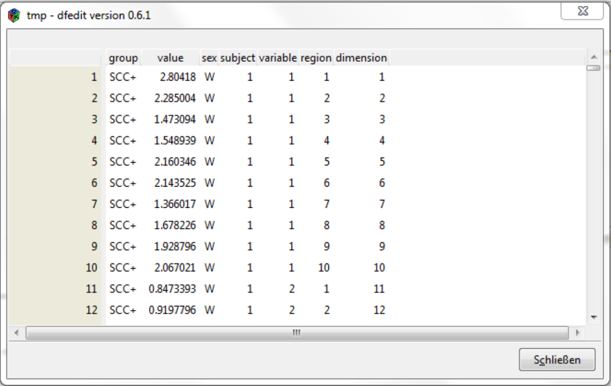
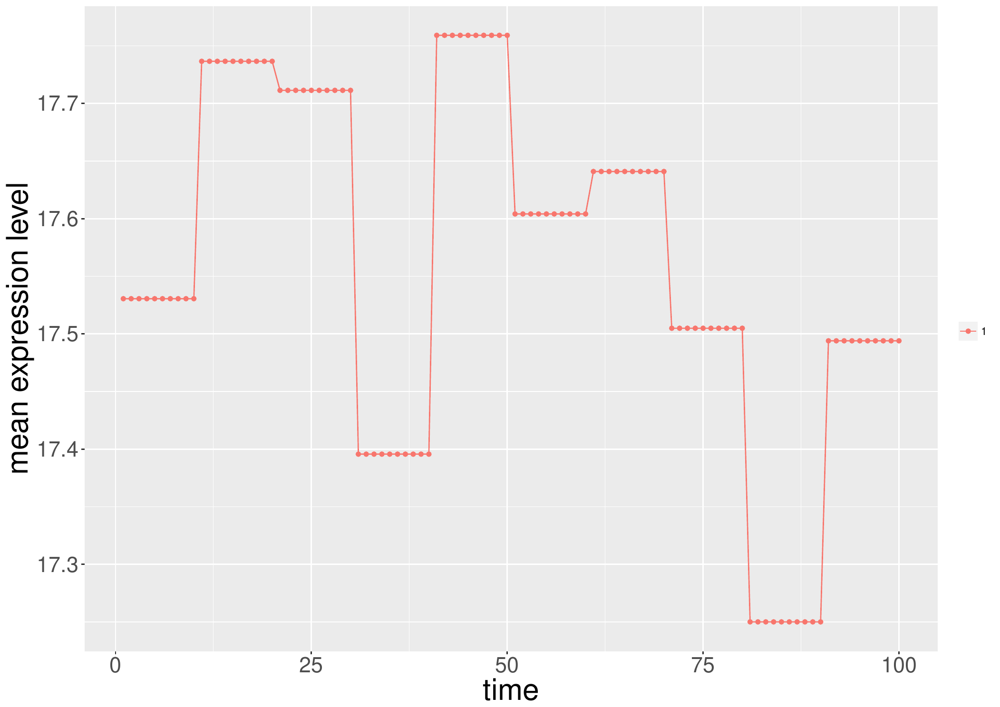

::: article
# Introduction

Repeated measures designs appear in many different situations. In
clinical studies, physicians might be interested in the effect of
different treatments over time. Typically, a univariate or multivariate
measurement is observed over a period of time for each subject. The
subjects can be separated into different disjoint groups and can often
be assumed not to influence one another. That is, observations on
different subjects are considered independent. We refer to factors whose
levels contain different sets of subjects as whole-plot or
between-subjects factors. On the other hand, the time factor is a
typical sub-plot or within-subjects factor because it structures the
observations within individual subjects. Observations on the same
subject may be dependent, and for different level combinations of the
whole-plot factors, different types of dependence may be assumed.
However, within a group defined by a factor level combination or *cell*,
the observation vectors are modeled as coming from the same multivariate
distribution. In particular, the dependence structure is the same for
all subjects within such a cell.

Let us first consider a simple, additive model for univariate repeated
measures data with different groups. This model already allows for
different variances in different cells, as described above, but it is
not sufficiently general regarding the dependence structures that are
encompassed, and therefore a more general model will be considered
later. An additive model for repeated measures could be written as
$${Y}_{ijk} = {\mu}_{ij} + A_{ik} + {\epsilon}_{ijk},$$
where $Y_{ijk}$ is the observation on subject ($k$) in group ($i$) at
time point $(j)$. It is decomposed additively into the population mean
$\mu_{ik}$ in group $(i)$ for time point $(k)$, and two random
components. Namely, $A_{ik} \sim N(0, \tau^2_{i})$ is the specific
effect for subject $(k)$ in group $(i)$ and
$\epsilon_{ijk} \sim N(0, \sigma^2_{i})$ is an additive random error
term whose variance may depend on the group. All random variables
$\epsilon_{ijk}$ and $A_{ik}$ shall be assumed independent. Such a model
formulation results in a covariance structure where observations on
different subjects, that is, with different index pair $(i,k)$, are
independent, and observations ${Y}_{ij_1 k}$ and ${Y}_{ij_2 k}$ on the
same subject ($k$) in group ($i$) all have the same variance
$\sigma^2_{i}+\tau^2_{i}$, as well as the same covariance $\tau^2_{i}$,
no matter the value of their indices $j_1$ and $j_2$. In other words,
the correlation
$\rho_{ij_1 k,ij_2 k}=\tau^2_{i}/(\sigma^2_{i}+\tau^2_{i})$ between two
observations does not depend on their time distance $|j_1-j_2|$.

For other dependence structures the correlation may decrease if two
observations are further apart. Such dependence models are certainly
possible and sometimes justified. By inspecting the compound symmetry
structure above more closely, we also observe that also differences of
two observations have the same variance independent of the choice of
time points. Indeed, this property is generally referred to as
sphericity. Therefore, the compound symmetry covariance structure is a
special case of sphericity (see e.g., [@bathke2009]).

[@box1954b; @box1954a] (or in more detail [@huynh1970]) showed that the
simple $F$-test is no longer valid when sphericity of the covariance
structure cannot be assumed. In lower-dimensional situations, classical
corrections such as the Greenhouse-Geisser
[@geisser1958; @greenhouse1959] or Huynh-Feldt
[@huynh1976; @lecoutre1991] methods for the repeated measures ANOVA can
be used when the covariance matrix sphericity assumption is violated.
However, the performance of tests using the Greenhouse-Geisser or
Huynh-Feldt corrections heavily depends on the actual underlying
covariance structures as both have been derived under the assumption of
homoscedasticity across the levels of the between-subjects factor, which
is very often not justifiable in practice. In other words, they assume
that the variance-covariance structure between the repeated observations
is the same for each cell. This assumption is rather restrictive, in
particular in the presence of high dimensionality of the data vectors,
and therefore a more general model is needed. In a classical
MANOVA-design or repeated measures design, this problem was already
tackled by
[@harrar2009; @chen2010; @konietschke2015; @pauly2015; @harrar2016]; and
[@bathke2018], among others.

Here, and in the following, high-dimensionality of repeated measures
means that the number of repeated measurements $(d)$ per subject is
larger than the sample sizes $(n_i)$ in group $(i)$ ($d > n_i$). Methods
that rely on the inverse of an empirical variance-covariance matrix
cannot be calculated in this situation. A well-known example is
Hotelling's $T^2$ test for multivariate data which can be used to test
for simple treatment effects, that is, for the hypothesis that
expectation vectors are the same for all groups. In a high-dimensional
setting, the empirical variance-covariance matrix is singular, rendering
Hotelling's $T^2$ unusable. Alternative test statistics that can in
principle still be calculated for high-dimensional data include the
ANOVA type statistic [@brunner1997; @brunner2001]. Also, the
Greenhouse-Geisser and the Huynh-Feldt correction for the repeated
measures ANOVA can technically be computed, but they do suffer from the
limitations mentioned before, and the performance of all three
approaches deteriorates with increasing dimensionality (see, e.g., the
simulation results in [@happ2016]). Another possible approach for
high-dimensional data is presented by the procedure proposed by
[@secchi2013], however this requires strong assumptions on the
covariance matrices. Specifically, when we denote with
$\boldsymbol{\Sigma}_i$ the $d\times d$ dimensional variance-covariance
matrix for the $i$-th group, then the assumption from [@secchi2013] can
be formulated as
$$\begin{aligned}
0 < \lim\limits_{d\rightarrow \infty} \frac{\textrm{tr}\left(\boldsymbol{\Sigma}_i^k \right) }{d} < \infty
\end{aligned}$$
for $k = 1, 2$, and $4$ and for all groups $i = 1,\dots, a$. Similar
assumptions have also been used by
[@srivastava2007; @srivastava2010; @chen2010] or [@harrar2016] and these
assumptions were discussed in [@pauly2015]. For practical applications,
it may be difficult to verify this assumption.

The method implemented in the package
[***HRM***](https://CRAN.R-project.org/package=HRM) does not assume any
particular covariance structures [@happ2016; @happ2017], neither
homoscedasticity across the between-subjects factor levels, nor
sphericity regarding the levels of the within-subjects factor. In
particular, no compound symmetry is assumed. Also, it does not require a
stringent covariance assumption as in [@secchi2013] or
[@srivastava2010]. It is therefore rather general. A limitation exists,
however, for this method. The theory has been derived under the
asumption of normal errors. While it performs well empirically for a
wide range of simulated data distributions, including discrete data, we
recommend caution when the data is very skewed or heavy-tailed. For
details, see Section [6](#Limitations).

In the following subsection, we will describe the model that is
underlying the ***HRM*** package. Here, it will become clear that this
model allows for rather general covariance structures, rendering the
associated R package applicable for a wide range of high-dimensional
data sets.

# Statistical model {#sec_StatisticalModel}

Consider a setting with two whole- and two sub-plot factors. Models for
other designs can be formulated analogously. We refer to the whole-plot
factors as $A$ and $S$ (e.g., group and subgroup) and to the sub-plot
factors as $C$ and $D$, respectively. For example, in the EEG data in
Section [5](#sec:Examples), the sub-plot factors are *variable* and
*region*. The observations are represented by independent random vectors
$$\mathbf{X}_{ijk} = \left(\mathbf{X}_{ijk11}', \dots, \mathbf{X}_{ijkbc}'\right)' \sim 
N\left(\boldsymbol{\mu}_{ij},\boldsymbol{\Sigma}_{ij}\right).$$
Here, $\mathbf{X}_{ijk}$ is the $d = b\times c$ dimensional data vector
of the $k$-th subject in the $i$-th group and $j$-th subgroup for
$i = 1, \dots, a$ and $j = 1, \dots, s$. Note that we do not impose any
special dependence structure on the covariance-matrices
$\boldsymbol \Sigma_{ij}$.

Accordingly, the factors $A$, $S$, $B$, and $C$ have $a, s, b$, and $c$
factor levels, respectively. The sample size in the $i$-th group and
$j$-th subgroup is denoted by $n_{ij}$. Overall, there are
$N = \sum\limits_{i,j} n_{ij}$ experimental units. Our hypotheses of
interest concern interaction effects between two or more factors, and
main effects of a single factor. They can all be formulated as quadratic
forms using appropriate projection matrices $\boldsymbol{K}_\phi$ which
depend on the respective hypothesis of interest $\phi$, namely
$$H_0(\phi): \boldsymbol{\mu}' \boldsymbol{K}_\phi \boldsymbol{\mu} = 0.$$
In a setting with only one whole- and one sub-plot factor with $a$ and
$d$ factor levels (*group* and *time*), this projection matrix is simply
given by a Kronecker product of two matrices, that is
$\boldsymbol{K}_\phi = \boldsymbol W_\phi \otimes \boldsymbol S_\phi$.
If we want to test for the main group effect, we choose
$\boldsymbol W_\phi = \boldsymbol P_a$ and
$\boldsymbol S_\phi = 1/d ~ \boldsymbol J_d$ where $\boldsymbol P_a$ is
the $a\times a$ dimensional centering matrix and $\boldsymbol J_d$ is
the $d \times d$ dimensional matrix whose entries are all equal to 1.
With the latter matrix, we average over the sub-plot factor, and the
former matrix centers a vector by subtracting its mean from all
components of the vector. If we want to test for an interaction effect,
we use for both $\boldsymbol W_\phi$ and $\boldsymbol S_\phi$ a
centering matrix and if we want to test only for the main time effect we
simply use $\boldsymbol W_\phi = 1/a~\boldsymbol J_a$ and
$\boldsymbol S_\phi = \boldsymbol P_d$. The corresponding test statistic
is then constructed as
$$T\left(\phi\right) := \frac{\boldsymbol{\bar{X}}' \boldsymbol{K}_\phi \boldsymbol{\bar{X}}}
{\textrm{tr}\left(\boldsymbol{\widehat{\Sigma}}_\phi\right)},$$
where
$$\boldsymbol{\widehat{\Sigma}}_\phi = \boldsymbol{K}_\phi 
\left( \bigoplus_{i = 1}^{a} \bigoplus_{j = 1}^{s} \tfrac{1}{n_{ij}} \widehat{\boldsymbol{\Sigma}}_\phi \right),$$
$\boldsymbol{\bar{X}}$ is the $as\times d$-dimensional vector containing
the means of all groups at each time point, and
$\widehat{\boldsymbol{\Sigma}}_\phi$ is the empirical
variance-covariance matrix for the $i$-th group. In general, we do not
know the exact distribution of $T(\phi)$, but we can approximate the
sampling distribution of $T(\phi)$ under null hypothesis by an
$F$-distribution with estimated degrees of freedom $\hat f$ and
$\hat f_0$. We refer to [@brunner2012; @happ2016; @happ2017] for details
regarding this so-called Box approximation and in particular the
estimation of the degrees of freedom.

Note that this method only provides an approximation to the sampling
distribution. Although it generally performs well, it is not
asymptotically exact. There are asymptotic tests such as those proposed
by [@pauly2015] or [@sattler2017], converging under some assumptions
such as $\min\{n_i, i = 1, \dots, a\} \rightarrow \infty$ and they also
provide a small sample size approximation. Similar to the aforementioned
papers, an advantage of the approximative method in ***HRM*** is that it
is working very well even for rather small sample sizes.

# The R package HRM

In the R package ***HRM***, the test statistic is implemented for
designs described in Section [2](#sec_StatisticalModel). It is possible
to use tests with up to four factors (at most two whole-plot or three
sub-plot factors). Two S3 methods are provided to facilitate different
data input formats. Both S3 methods can be called by the generic
function `hrm_test`. The data can either be provided in the wide table
format where each row represents the observations from one subject. This
means that for each group, all observations have to be stored in a
matrix. Then the matrices from all groups need to be elements of a
`list`. This method only supports one whole- or one sub-plot factor,
that is, a maximum of two factors can be used.

The other way is to provide the data in the long table format as a data
frame. Here, all observations are in stored in one column. The other
columns of the data frame specify the factor levels to which an
observation belongs. For this type of data, at least one whole- and one
sub-plot factor have to be used and they support in general up to two
whole- and two sub-plot factors. There is also the special case of one
whole- and three sub-plot factors implemented.

Depending on the type of data that is given as an argument to
`hrm_test`, either the S3 method `hrm_test.list` or
`hrm_test.data.frame` is internally called. We will give now a short
description of these two S3 methods.

## Methods

The S3 method `hrm_test.list` has two parameters, `data` and `alpha`.
The second parameter has its default value set to $0.05$ and specifies
the type-I error level of the procedure which is used for calculating
the critical value for the test procedure. The first parameter is a list
containing the data in the wide table format for all groups. That is,
the list has the structure

``` r
		data <- list(group_1, group_2, ..., group_a),
```

where `group_i` is the data for the $i$-th group in the wide table
format (the repeated measurements are the columns). Clearly, this method
only works with one whole- and one sub-plot factor.

The method `hrm_test.data.frame` can be used for designs with up to two
whole- and three sub-plot factors, but it is limited to a maximum number
of four factors. The parameter `data` needs to be a data frame
containing the data with the aforementioned columns. Similar to the
method `hrm_test.list` we can also specify the nominal type-I error rate
by using the parameter `alpha`. The method `hrm_test.data.frame` needs a
formula object. These are special R objects that allow to write a
statistical model in a compact way and is used by many R packages. Let
us assume the model
$${Y}_{ijk} = {\mu}_{ij} + {\epsilon}_{ijk} = {\alpha}_i + {\beta}_j + {\gamma}_{ij} + {\epsilon}_{ijk},$$
where ${Y}_{ijk}$ is the observation at time $j$ for subject $k$ in the
$i$-th group and $\epsilon_{ijk}$ is the measurement error. The
influence of the whole-plot factor is described by $\alpha$ and of the
sub-plot factor by $\beta$. We denote by $\gamma$ the interaction
between these two factors. To write this model in a compact way in R we
can use the formula

``` r
		response ~ whole-plot factor * sub-plot factor.
```

Here the expression on the left-hand side of $\sim$ is the response
variable. It is explained by the variables on the right-hand side. The
symbol `*` means that the interaction term $\gamma_{ij}$ is also
included in the model, that is
${\mu}_{ij} = {\alpha}_i + {\beta}_j + {\gamma}_{ij}$. Therefore main
effects and the interaction effect are included in the model. This
formula is equivalent to

``` r
		response ~ whole-plot factor + sub-plot factor 
		+ whole-plot factor : sub-plot factor,
```

where `:` specifically denotes for the interaction effect. Hence the $*$
notation is an abbreviation for adding main and interaction effects. If
we are only interested in the main effects then we could use the formula

``` r
		response ~ whole-plot factor + sub-plot factor,
```

or alternatively if we are only interested in the interaction effect,
our formula has the form

``` r
		response ~ whole-plot factor : sub-plot factor.
```

For the method `hrm_test.data.fram` we also need to specify the column
name for the subjects. This column name needs to be a `character`.
Otherwise an error message is returned by the method.

All these methods previously described return an HRM object which
contains a list consisting of the results in a `data.frame`, the
formula, the type-I error, the subject column name and the column names
of the whole- and sub-plot factors which are used, and the data used for
testing.

In the special case when only one whole- and one sub-plot factor is
used, it is possible to plot the so-called profile curves. In each group
$i = 1, \dots, a$, the mean $\bar{x}_{it}$ is calculated at each time
point $t = 1, \dots, d$. Then, the points
$(1, \bar{x}_{i1}), \dots, (d, \bar{x}_{id})$ are plotted for all groups
$i = 1, \dots, a$. An example can be seen in Figure [3](#fig:guiplot).
For plotting these curves, the S3 method `plot.HRM` is available. It
needs an object of class `"HRM"` which is returned by the function
`hrm_test`. Additionally we can change the labels for the $x$-axis and
the $y$-axis with the parameters `xlab` and `ylab` respectively.
Furthermore, it is possible to disable the legend by setting the
argument `legend = FALSE`, the title for the legend can be changed with
the argument `legend.title`. By setting `legend.title = NULL`, no legend
title is displayed. Internally, this method is only a
[***ggplot2***](https://CRAN.R-project.org/package=ggplot2) wrapper
[@ggplot2]. If there is only one sub-plot but no whole-plot factor used,
it is still possible to plot profile curves (see for example Figure
[5](#fig:tcell)).

For objects of class `"HRM"`, there are also the methods `print.HRM` and
`summary.HRM` available. The first method just reproduces the standard
output from `hrm_test` whereas `summary.HRM` lists additionally the
whole- and sub-plot factors which were used in the model.

To improve the performance in case of a large dimension, this package
uses mainly the dual empirical variance-covariance matrices
[@brunner2012; @happ2017]. Because the trace function is invariant under
cyclic permutations, the empirical $d\times d$ variance-covariance
matrix can be reduced to an $n_i \times n_i$ matrix. This is especially
useful if $d >> n_i$, where $n_i$ is the sample size in the $i$-th
group. Another improvement is to use
$$\rm tr\left(\boldsymbol{\widehat{\Sigma}}_i \boldsymbol{\widehat{\Sigma}}_j \right) = \boldsymbol{1}_d' \left( \boldsymbol{\widehat{\Sigma}}_i * \boldsymbol{\widehat{\Sigma}}_j' \right) \boldsymbol{1}_d$$
for calculating the trace of a matrix product, where $*$ is the
Hadamard-Schur product. The effects of these two improvements are only
noticeable for calculating a single test statistic if $d$ is very large
($d > 1000$).

An additional enhancement for high-dimensional data is achieved by using
the method `hrm_test.list` instead of `hrm_test.data.frame`. Although it
can sometimes be convenient to use the long table format in a data
frame, for computing the degrees of freedom and the test statistic, the
data has to be separated internally by the whole-plot factors. This
procedure can be quite time consuming for very large datasets (dimension
$d > 10^5$ and number of subjects $> 100$) if the data structure
`"data.frame"` is used. The problem in this case is that the data
structure `"data.frame"` is not suitable for large data sets. But most
functions that import data into R return a `"data.frame"` object. In
such a case, it is beneficial to provide the data already separated by
the whole-plot factors in a list. This can be done with the method
`hrm_test.list`. One disadvantage by using this method is, that it is
currently not possible to specify more than one whole- or sub-plot
factor. Another way to solve this problem is to convert the
`"data.frame"` object into a `"data.table"` object (from package
[***data.table***](https://CRAN.R-project.org/package=data.table)
[@datatable]) which is specifically developed for large data sets. But
the syntax for a data.table is completely different from a data.frame
and their syntax is also not compatible with each other. In order to
demonstrate the effect, we ran a small simulation with $d = 10^5$ and
$n = 100$. Here, it takes about 4 minutes to convert a `data.frame` from
the wide to the long table format and when we used a `data.table` it
takes under 1 second to do the same (see Table [1](#tab:run_times)). By
increasing the dimension, the time it takes for the conversion increases
exponentially if you use a `data.frame`. For this simulation we used the
the function `Sys.time` to measure the calculation time and repeated
each calculation five times. Note that the time needed for rearranging
the data heavily depends on the computer on which the R script runs. In
our case, we employed a computer with an AMD Ryzen 5 1600 CPU (6$\times$
3.2 GHz) and 16GB DDR-4 RAM (2800 MHz). Therefore the results from this
simulation cannot be generalized but it can be an indication that a data
frame should not be rearranged if the dimension is large. Therefore,
using the method `hrm_test.list` may help to avoid this additional step
of converting your data frame into a `"data.table"` object.

::: {#tab:run_times}
  ----------------------------------------------
   dimension $d$    `data.frame`   `data.table`
  ---------------- -------------- --------------
       $10^5$          224.17          0.64

   $2\times 10^5$     1411.93          1.07
  ----------------------------------------------

  : Table 1: Running times in seconds for converting a wide table into a
  long table for 100 subjects.
:::

# Graphical user interface {#sec_GUI}

For more convenient access to the package's capabilities, a graphical
user interface (GUI) can be used by typing the command `hrm_GUI()` into
the R console. A window opens where the data file (long table format)
can be loaded and viewed. This window is shown in Figure [1](#fig:gui).
After typing the formula as described before and selecting the column
identifying the subjects, the results can be displayed in a separate
window. Optionally, the results can be saved as a LaTeX-table or just as
plain text. For each hypothesis test, the degrees of freedom of the $F$
approximation, the value of the test statistic, the critical value for
the test, and the $p$-value are displayed. An example of the results
window for the EEG data is shown in Figure [2](#fig:guiresults). This
data set contains of $160$ subjects who have been divided into one of
four diagnostic groups (whole-plot factor). For each subject 40
measurements from an EEG are available (sub-plot factor). This example
is explained in more detail in Section [5.1](#sec:eeg_example). In the
results window are the test statistics along with the degrees of freedom
and $p$-values for main and interaction effects displayed.

If only one whole- and one sub-plot factor is being used, the profile
curves of the groups are displayed as a graphic in a separate window.
The plot can be saved in the pdf format.

{#fig:gui width="100%" alt="graphic without alt text"}

{#fig:guiresults width="100%" alt="graphic without alt text"}

{#fig:guiplot width="70.0%" alt="graphic without alt text"}

The GUI relies on the function `hrm_test` for doing the analysis and
`plot.HRM` for creating the plot as shown in Figure [3](#fig:guiplot).
That is, there is no difference between using the GUI or using both
generic functions directly. For creating the GUI, the
[***RGtk2***](https://CRAN.R-project.org/package=RGtk2) package is used
[@RGtk2]. This package allows us to utilise the cross-platform
widget-toolkit GTK+ with R. The current version 2.20.34 of this package
cannot be installed on macOS, therefore the GUI for the package
***HRM*** does not work on macOS.

For opening data files, we rely on the functions provided in the package
***tcltk*** to ensure that this procedure works on multiple computer
environments. For viewing the data we utilise the package
[***RGtk2Extras***](https://CRAN.R-project.org/package=RGtk2Extras)
[@RGtk2Extras] which provides a very easy way do display and manipulate
data in a GUI. The packages
[***cairoDevice***](https://CRAN.R-project.org/package=cairoDevice) and
***ggplot2*** are used for plotting [@cairoDevice; @ggplot2] profile
curves. Similar as before, we have to avoid functions that only work for
a specific computer environment. Therefore we work with the package
***cairoDevice*** which is capable of displaying a graphic in a window
and does not depend on a specific computer environment. For saving the
results of the function `hrm_test` as a LaTeX-table, we are using the
package [***xtable***](https://CRAN.R-project.org/package=xtable)
[@xtable] which converts a `data.frame` into the corresponding
LaTeX code for a table.

Because of the limitation of ***RGtk2***, the GUI does not work on macOS
(OS X 10.11.6). But the package ***HRM*** itself can be installed on
macOS and the function `hrm_test` can be run regardless. Apart from
that, the GUI works on all other newer operating systems (for example
Debian 7.3.0-12 or Microsoft Windows 7, 8, 10).

# Examples {#sec:Examples}

## EEG Data Example {#sec:eeg_example}

In order to demonstrate how to work with the package, we use the EEG
data from [@staffen2014] which is included in the ***HRM*** package.
There are 160 subjects who have been diagnosed with Alzheimer's disease
(AD), mild cognitive impairments (MCI), or subjective cognitive
complaints (SCC+ or SCC--). For each subject, four variables (activity,
complexity, mobility and brain rate) are measured at 10 different brain
regions (frontal left/right, parietal left/right, central left/right,
temporal left/right, and occipital left/right). We are using the
diagnostic groups and sex as whole-plot factors, and the region and
variable as sub-plot factors. Sample sizes are given in Table
[2](#table_subjects). In all combinations of diagnostic group and sex
the dimension is larger than the sample size, therefore this is
considered a high-dimensional setting.

::: {#table_subjects}
  ---------------------------------
    Sex     AD   MCI   SCC+   SCC-
  -------- ---- ----- ------ ------
    male    12   27     14     6

   female   24   30     31     16

    sum     36   57     45     22
  ---------------------------------

  : Table 2: Sample sizes for the EEG data.
:::

To perform the analysis we are using the graphical user interface and
the R console. The commands

``` r
# Save EEG data from package HRM
write.table(EEG, 
	file = "EEG.csv", 
	sep = ",", 
	dec = ".", 
	col.names = TRUE)
# Open the GUI	
hrm_GUI()
```

will load the package and save the EEG data in a `.csv` file in the
current working directory. The last line launches the GUI (see Figure
[1](#fig:gui)). By clicking on the 'Open File' button we can select the
`EEG.csv` file we previously saved. Depending on the data, we may have
to change the separator mark, decimal mark, or deselect that the file
contains header. This can be done in the fields below the textfield for
the file path. We can look at the data by clicking on the button 'View
Data' in the toolbar. A new window is created displaying the data we
have just loaded (seen in Figure [4](#fig:data)). The data consists of
columns specifying the whole-plot (`group`, `sex`) and sub-plot factors
(`variable`, `region`). Additionally, one column contains the response
variable from each person (`value`) and the subject column identifies
the subjects. A unique identification of the subjects is necessary to
determine automatically within the function `hrm_test` which factors are
whole- and which are sub-plot factors. By combining the factors region
and variable into just one factor, we obtain a new factor which we will
simply call dimension. It is provided in the column with the same name.

Another way to look at the data is by using the command

{#fig:data
width="100%" alt="graphic without alt text"}

``` r
View(EEG)
```

which will also display the complete data set. After we have loaded and
looked at the data we need to specify the formula in the GUI. In this
example, the formula is given by

``` r
value ~ group * sex * region * variable
```

which means that for the four factors tests for main and interaction
effects will be performed. If we were only interested in testing the
main effects we could use the formula

``` r
value ~ group + sex + region + variable
```

where we are using `+` instead of `*`. If we simply want to test
interaction effects we could use `:` instead. In addition to specifying
the formula, we need to select which column identifies the subjects.
This is done by selecting the 'subject' column in the dropdown list. To
perform the tests, we simply click on the 'Ok' button on the bottom of
the window or the 'Get Results' button in the toolbar. A new window (see
Figure [2](#fig:guiresults)) will open which contains the results of the
performed tests. For each tested hypothesis, the degrees of freedom, the
value of the test statistic, and the $p$-value are displayed. Above the
results, a summary about the factors used in the analysis is provided.
To perform these tests manually, we may use the commands

``` r
r <- hrm_test(formula = value ~ group*sex*region*variable,
		data = EEG, 
		subject = "subject")
library(xtable)
print(xtable(r$result), include.rownames = FALSE)		
```

``` r
% latex table generated in R 3.4.1 by xtable 1.8-2 package
\begin{table}[ht]
	\centering
	\begin{tabular}{lrrrrrl}
		\hline
		hypothesis & df1 & df2 & crit & test & p.value & sign.code \\ 
		\hline
		group & 3.04 & 116.29 & 2.67 & 1.66 & 0.18 &  \\ 
		sex & 1.00 & 116.29 & 3.92 & 6.05 & 0.02 & * \\ 
		region & 5.59 & 246.82 & 2.18 & 196.60 & 0.00 & *** \\ 
		variable & 1.51 & 178.72 & 3.36 & 4930.69 & 0.00 & *** \\ 
		group:sex & 3.04 & 116.29 & 2.67 & 0.18 & 0.91 &  \\ 
		group:region & 14.09 & 246.82 & 1.73 & 0.80 & 0.67 &  \\ 
		group:variable & 4.52 & 178.72 & 2.33 & 3.34 & 0.01 & ** \\ 
		sex:region & 5.59 & 246.82 & 2.18 & 0.99 & 0.43 &  \\ 
		sex:variable & 1.51 & 178.72 & 3.36 & 4.89 & 0.02 & * \\ 
		region:variable & 7.76 & 299.89 & 1.99 & 143.58 & 0.00 & *** \\ 
		group:sex:region & 14.09 & 246.82 & 1.73 & 0.58 & 0.88 &  \\ 
		group:sex:variable & 4.52 & 178.72 & 2.33 & 0.26 & 0.92 &  \\ 
		group:region:variable & 18.75 & 299.89 & 1.63 & 1.04 & 0.41 &  \\ 
		sex:region:variable & 7.76 & 299.89 & 1.99 & 1.26 & 0.27 &  \\ 
		group:sex:region:variable & 18.75 & 299.89 & 1.63 & 0.74 & 0.77 & \\ 
		\hline
	\end{tabular}
\end{table}
```

to obtain the results stated here. The command `xtable` is used to
convert a `"data.frame"` object into a LaTeX table. This is also
possible with the GUI. In the toolbar of the results window there is a
button labeled with 'Save as LaTeX  table'. By clicking on it we can
select a path to save a `.tex` file containing the results.

As an alternative formula, we may use the following.

``` r
value ~ group  * dimension
```

Here, only one whole- and one sub-plot factor are specified. After
clicking on the 'Ok' button, two windows will open. In the first window,
the results of the test statistics are displayed. The other window shows
a plot of the profiles (see Figure [3](#fig:guiplot)). We can also
create these plots by using the function

``` r
plot(hrm_test(value ~ group*dimension, data = EEG, subject = "subject")) 
```

Here the function `hrm_test` returns an object of class `"HRM"` and the
function `plot` is applied to an object of such a class. If we calculate
the test statistics in this two-factor example and save the results
again as a table, we obtain the following:

``` r
hrm_test(formula = value ~ group*dimension,
		data = EEG, 
		subject = "subject")	
```

``` r
Call: 
value ~ group * dimension
		
hypothesis              df1       df2     crit        test    p.value  sign.code
group  (weighted)   2.993584 130.10764 2.676095    1.881486 0.13600798          
group               2.779981  95.00304 2.768161    1.657329 0.18482432          
dimension           2.504068 268.94339 2.803050 3056.569162 0.00000000  ***
group : dimension   7.155131 268.94339 2.031723    2.376905 0.02164946   *
		
Signif. codes:  0 '***' 0.001 '**' 0.01 '*' 0.05 '.' 0.1 ' ' 1
```

## T-cell Activation Example {#sec:tcell}

It is also possible to use the function `hrm_test` with only one
sub-plot factor and no whole-plot factor. A data example with such a
design is included in the package
[***longitudinal***](https://CRAN.R-project.org/package=longitudinal)
[@longitudinal] and is originally taken from [@rangel2004]. The data are
from a microarray time series for T-lymphocytes activation. Here, the
expression levels of $n = 58$ genes are measured at $d = 100$ time
points ($d > n$), thus presenting a high-dimensional situation. In order
to analyse the data, we need to load the necessary packages first and
then convert the data into the long table format. At the end, we can use
the function `hrm_test` which detects a significant time effect.
Alternatively, we could have used the GUI. But for this approach we
would have needed to save the data as a `.csv` file first because the
GUI only supports loading data sets from external files.

This data example is just used as a demonstration for the package. From
a statistical point of view, the gene expressions do not necessarily
have to be independent, as different genes may have an influence on each
other. For example in eukaryotes, gene expression is highly regulated.
Some genes encode for transcription factors (for example zinc-fingers)
which can up- or down-regulate the expression of other genes. With
regard to this data example the gene FYB seems to influence the
expression of several interleukin receptor genes and GATA-3 (a
zinc-finger transcription factor) [@rangel2004]. Therefore, it is very
plausible that the assumption of independent genes is violated for this
data example. However, for the illustration of the method we are making
the simplifying assumption that observations on different 'subjects'
(genes, in this case) are independent from each other.

``` r
library(longitudinal)
library(tidyr)
library(HRM)

# transforming the data into the long table format
data(tcell)
data <- t(print(tcell.10))
data <- as.data.frame(data)
data$subject = 1:58
data_long <- gather(data, time, measurement, 1:100, factor_key = TRUE)
		
hrm_test(data_long, measurement ~ time, subject = "subject")	
```

``` r
Call: 
measurement ~ time

hypothesis      df1      df2     crit     test      p.value    sign.code
time         5.514332 314.3169 2.179376 6.268063 6.538363e-06     ***
	
Signif. codes:  0 '***' 0.001 '**' 0.01 '*' 0.05 '.' 0.1 ' ' 1
```

To plot the profile curve for this data set, we simply apply the `plot`
function to an `"HRM"` object returned by the function `hrm_test`. By
setting the optional argument `legend` to `FALSE`, no legend is added to
the plot (see Figure [5](#fig:tcell)).

``` r
object_hrm <- hrm_test(measurement ~ time, data = data_long, subject = "subject")
plot(object_hrm, legend = FALSE, xlab = "time", ylab = "mean expression level")
```

{#fig:tcell width="100%" alt="graphic without alt text"}

For the `plot.HRM` method it is also possible to use additional
arguments which will be added to the `"ggplot2"` object. As an example
we want to use the `theme_bw` style with no legend. Here we need to take
into consideration that `theme_bw` overwrites everything related to the
legend already specified in `plot.HRM`. Therefore, we need to specify
separately that a legend should not be displayed. The code

``` r
plot(object_hrm, ... = theme_bw() + 
	theme(legend.title = element_blank(), legend.position = "none") + 
	theme(axis.text = element_text(size=18), axis.title = element_text(size = 25)) )
```

produces Figure [6](#fig:tcell2) with a white background and no legend.
Because `plot.HRM` simply returns an `"ggplot2"` object, we also could
have used the following code.

``` r
plot(object_hrm) + theme_bw() + 
	theme(legend.title = element_blank(), legend.position = "none") +
	theme(axis.text = element_text(size = 18), axis.title = element_text(size = 25))
```

That is we can pass additional arguments through `...` in the method
`hrm.plot` or, even easier, just add the additional arguments directly
to the object to manipulate the graphic.

{#fig:tcell2 width="100%" alt="graphic without alt text"}

# Limitations {#Limitations}

In Section [2](#sec_StatisticalModel), we have already stated the
mathematical assumptions for the methods implemented in the ***HRM***
package. We are assuming normally distributed observations from
independent subjects. As long as the data distribution is not 'too far'
from a normal distribution, the test works fine. However, for very
skewed or heavy-tailed distributions, the test may in general not
maintain the type-I error rate. This could especially be a problem in
combination with heteroscedastic data and unbalanced groups. Note that
this limitation still holds for large sample sizes because the described
method is only an approximation and not an asymptotically exact test.
This limitation also applies in particular to the case of multivariate
normally distributed observations. Therefore it is important to check
the assumptions or do some simulations to see whether the test is robust
against some violations of the assumptions. As we see in the following
simulations, the test statistic is mainly affected by skewed or
heavy-tailed distributions but works well for data generated by a
binomial distribution. For our two examples used in Section
[5](#sec:Examples) they do not satisfy the assumptions. For the genetic
data, the gene expressions (subjects) are in general correlated. The EEG
data seems to violate the normality assumption as some QQ-plots from
marginal distributions show larger deviations from a straight line. But
it is very difficult to check these distributional assumptions in
general for high-dimensional data sets. In our case we only use those
data sets for demonstration purposes but for real analyses one should be
careful about the assumptions, as the type-I error can be quite inflated
which we can see in the subsequent simulations.

In order to illustrate the behaviour of the proposed method when its
formal assumptions are violated, we have performed several simulations
for testing for the main group effect. For all simulations we used the
dimension $d = 20$ and performed $10^4$ simulation runs. We have already
observed that the test statistic does not perform well for skewed data.
Therefore we concentrated in this simulation study on the exponential
and log-normal distribution. But we have also considered a discrete
distribution, as in such a case the test seems to perform very well.

For the first simulation, we defined the random variables
$X_{1jk} = \epsilon_{1j} + \delta_1$ for $j = 1, \dots, 20$ and
$k = 1, \dots, n_1 = 20$. In the second group we chose
$X_{2jk} = \epsilon_{2j} + \delta_2$ for $j = 1, \dots, 20$ and
$k = 1, \dots, n_1 = 30$. Here, $\delta_1 \sim \mathcal{E}(1)$,
$\delta_2 \sim \mathcal{E}(2)$, $\epsilon_{1j} \sim \mathcal{E}(1)$ and
$\epsilon_{2j} \sim \mathcal{E}(2)$, where $\mathcal{E}$ refers to the
exponential distribution. Then we shifted the second group equally for
all 20 time points such that both groups have the same mean which means
that the null hypothesis of no main group effect holds. For this
setting, the simulated type-I error rate was $0.0688$. In the second
simulation we used for the second group $\mathcal{E}(4)$ distributions.
In this case, the simulated type-I error rate was $0.0748$.
Additionally, we used different sample sizes to see the impact of
negative or positive pairing. The results are displayed in Table
[3](#tab:exponential). For all these settings, the simulated type-I
error was slightly inflated. We performed similar simulations using
log-normal distributions. Here, we considered $\delta_1 \sim LN(0,1)$,
$\delta_2 \sim LN(0,\theta)$, $\epsilon_{1j} \sim LN(0,1)$ and
$\epsilon_{2j} \sim LN(0,\theta)$ with $\theta = \tfrac{1}{2}, 2$. Both
groups have been shifted such that they have the same mean. The results
in Table [4](#tab:lognormal) show heavily inflated type-I error rates
(up to over $30\%$).

In a third simulation, we considered binomial distributions as an
example for discrete data. Here, we defined
$\delta_1, \epsilon_{2j} \sim Bin(m, 0.5)$ and
$\delta_1, \epsilon_{2j} \sim Bin(m, 0.9)$ for $m = 5, 10, 15$ and for
sample sizes $n_1 = 20, 15$ and $n_2 = 15, 20$. The other simulation
parameters were the same as for the other two simulations. That is, the
dimension was $20$ and all random variables have been shifted to mean
zero such hat the null hypothesis holds. The results are shown in Table
[5](#tab:binomial). For binomial data, the method seemed to work very
well even for heteroscedastic and unbalanced groups. Furthermore, the
value of $m$ did not seem to influence the result very much and even in
the case of Bernoulli distributions ($m = 1$) the simulated type-I error
rate was close to the nominal level of $5\%$.

Therefore the package HRM should not be used with distributions similar
to log-normal or exponential distributions, that is very skewed or
heavy-tailed distributions. Instead, in those cases, we recommend using
a nonparametric test such as the rank-based ANOVA type statistic or a
similar method.

::: {#tab:exponential}
  ---------------------------------------------
   $\theta$   Sample sizes   Type-I error rate
  ---------- -------------- -------------------
      2          20, 30           0.0688

      4          20, 30           0.0748

      2          30, 20           0.0543

      4          30, 20           0.0685

      2          25, 25           0.0616

      4          25, 25           0.0702
  ---------------------------------------------

  : Table 3: Type-I error rate simulation with different settings for
  testing for the main group effect. We used centred exponential
  distributions with parameter $\theta = 1$ in the first group and
  $\theta = 2,4$ for the second group, and the dimension was $d = 20$.
:::

::: {#tab:lognormal}
  ---------------------------------------------
   $\theta$   Sample sizes   Type-I error rate
  ---------- -------------- -------------------
     0.5         20, 30           0.1157

      2          20, 30           0.2927

     0.5         30, 20           0.0917

      2          30, 20           0.3126

     0.5         25, 25           0.1032

      2          25, 25           0.2974
  ---------------------------------------------

  : Table 4: Type-I error rate simulation using log-normal distributions
  for testing for the main group effect. For the first group we used
  centred $LN(0,1)$ and for the second group centred $LN(0,\theta)$
  distributions, and the dimension was $d = 20$.
:::

::: {#tab:binomial}
  ----------------------------------------
   $m$   Sample sizes   Type-I error rate
  ----- -------------- -------------------
    1       20, 15           0.0488

    5       20, 15           0.0476

   10       20, 15           0.0503

   15       20, 15           0.0467

    1       15, 20           0.0515

    5       15, 20           0.0485

   10       15, 20           0.0479

   15       15, 20           0.0489
  ----------------------------------------

  : Table 5: Type-I error rate simulation using binomial distributions
  for testing for the main group effect. For the first group we used
  centred $Bin(m, 0.5)$ and for the second group we used centred
  $Bin(m, 0.9)$ random variables, and the dimension was $d = 20$.
:::

Another drawback of our method is that it is not invariant under scale
transformations of individual variables. This means that changing the
scale in one dimension (using $m/s$ instead of $km/h$) may lead to a
different result because the observations are not standardized to avoid
the problem of singular empirical covariance matrices. Therefore the
same scale should be used for all dimensions.

The package
[***MANOVA.RM***](https://CRAN.R-project.org/package=MANOVA.RM) by
[@MANOVA.RM] provides several asymptotically exact tests that do not
have these limitations (see for example [@friedrich2018]). However, not
all have been extended to high-dimensional settings [@friedrich2017] and
some may also require a resampling step which may take a while to
compute for large data sets. But this might only become a real problem
if you want to simulate the power of the test for multiple situations.
The ANOVA type statistic mentioned before has the problem that it gets
quite conservative when the dimension is large
[@brunner2002; @bathke2009; @friedrich2017], and additionally, the test
is also not invariant under scale transformations. [@friedrich2017]
proposed a potential solution for this problem in the low-dimensional
case.

# Conclusions

The aim of the ***HRM*** package is to provide an easy to use way to do
inference on high-dimensional repeated measures. To that end, a
graphical user interface has also been implemented in this package. With
the GUI, it is possible to load and view the data, plot the profile
curves and save the results of hypothesis tests as a table which can be
inserted very easily into a LaTeX  document. The GUI is optional, that
is, all of its functions can be used directly. There are different
functions to allow for data in the long or wide table format. Although
both formats can be transformed easily into each other, not having to do
it is more convenient for users. This applies especially to statistics
practitioners who are not expert R users.

The package currently supports up to four factors. If data in the wide
table format are used, the maximum number of factors that can be used is
two. For the long table format, it is possible to use up to two
whole-plot factors and up to three sub-plot factors, but the maximum
number of factors is four. Table [6](#tab:factors) summarizes the
minimum and maximum number of factors that can be used.

::: {#tab:factors}
  ----------------------------------------------
   Table Format   Whole-plot   Sub-plot   Total
  -------------- ------------ ---------- -------
    long table       0--2        0--3     1--4

    wide table        1           1         2
  ----------------------------------------------

  : Table 6: Minimum and maximum number of factors which can be used
  with the package ***HRM***.
:::

There are still a few limitations to the method implemented in the
package. Improvements to the test statistic to get rid of these
limitations are part of future work and will also be implemented in the
package. For example, a nonparametric version of the test statistic will
be provided in the future by setting an additional argument
`nonparametric = TRUE` for the function `hrm_test`. This new test will
use (pseudo)-ranks and can be applied to metric or non-metric data.
Additionally, the package will be further improved to increase the
performance for large data.

# Funding

The research was supported by Austrian Science Fund (FWF) I 2697-N31.
:::
