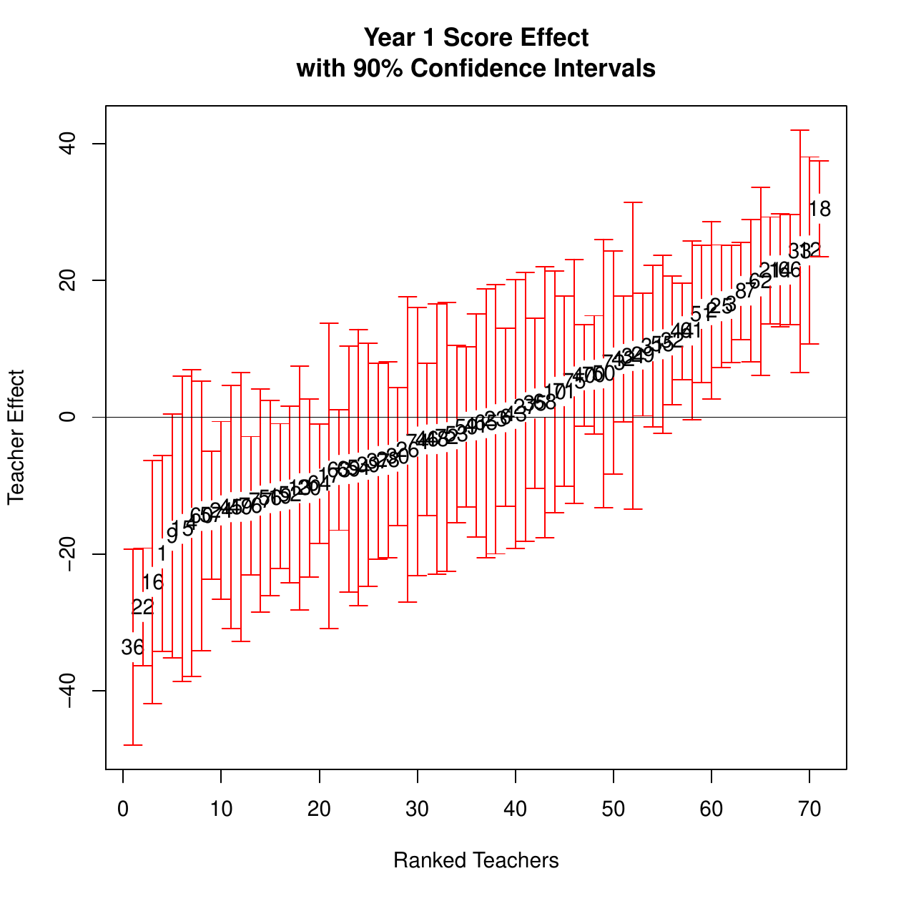
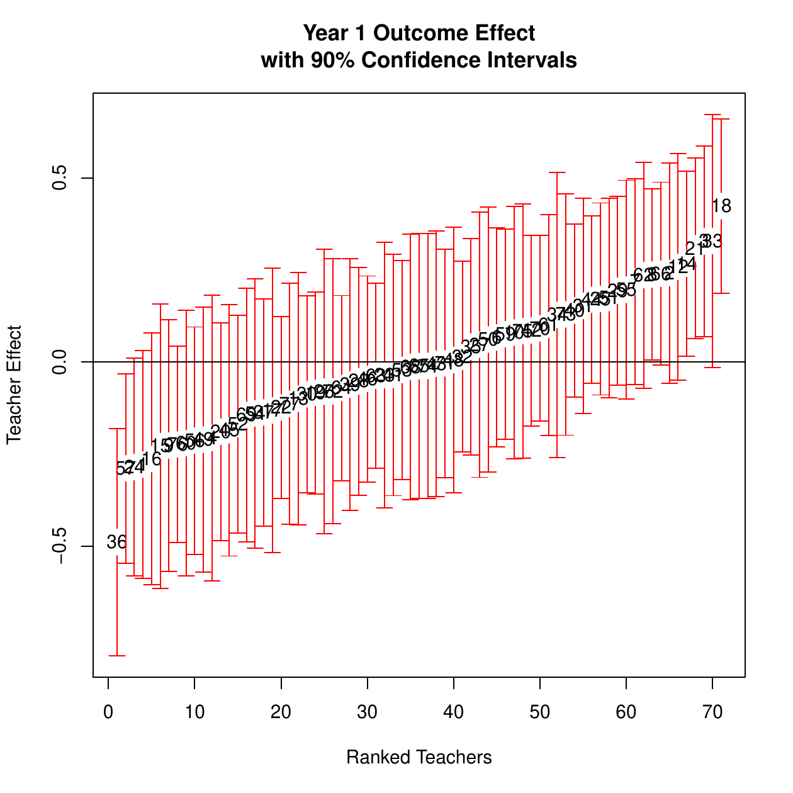

# Introduction

Originally developed in @Broatchmvaa, the RealVAMS model is a
multivariate generalized linear mixed model (GLMM) that extends previous
theory by allowing the simultaneous joint modeling of continuous and
binary outcomes within a value-added framework. Although the model may
be used in a variety of contexts (e.g., sports, medicine, etc.), it is
particularly useful in education for studying relationships between
teachers and students. For example, the RealVAMS model can estimate
potential teacher contributions toward a variety of student outcomes,
including quantitative scores from different subjects and different
assessments, as well as categorical success outcomes such as graduation
status. In addition, the RealVAMS model estimates the relationships
between the predicted teacher effects for these various measures of
student success.

The ***RealVAMS*** package employs the RealVAMS model to analyze
multimembership data. Multimembership data [@browne01] poses unique
modeling and estimation issues. @bates describes the random effects that
result from this type of data structure as "partially crossed" and
"partially nested" because subjects are not perfectly nested under one
higher level effect and may be nested under multiple, different higher
level effects. The newly released
[***lme4***](https://CRAN.R-project.org/package=lme4) [@bates]
adequately analyzes this type of effect, but cannot model a continuous
outcome and a binary outcome at the same time. Specifically, `glmer`
cannot utilize both a normal and binary link in a single function call.

Modeling both types of responses is essential for capturing a broader
picture of the latent effects. If a relationship between the latent
effects on the outcome variables exists, this simultaneous estimation
improves prediction of outcomes. In an application of the RealVAMS model
to the context of sports, [@Italian] found that the joint model benefits
from significantly improved median log-loss and absolute residuals of
cross-validation predictions if the estimated "team-level" random
effects are correlated. However if the team-level random effects are not
correlated, the joint model does not show improved predictive power.
These "team effects" are analogous to the "teacher effects" in an
education setting such that if different educational outcomes are
somewhat correlated, the joint model will likely lead to improved
predictions of academic achievement and more accurate estimates of
teacher effectiveness. However, if the effects are not correlated, the
joint model will likely not be an improvement over separate models that
can be run in ***lme4***.

Similar to other value-added models (VAMs) used within an educational
context, the RealVAMS model aims to estimate the effects of educational
factors such as teachers, schools, and districts on student learning
while controlling for prior student achievement and other covariates, if
available. These statistical models typically measure the correlation
between different educational factors and student achievement, and do
not directly measure causation [@ASA]. Consequently, "teacher effect"
estimates represent unexplained classroom-level heterogeneity
[@Lockwood2007] and should be "viewed within the context of quality
improvement" [@ASA p. 2] rather than used for high-stakes evaluation
purposes. Although most VAMs are based on standardized test scores alone
[@ASA], the RealVAMS model enables users to explore the potential
contributions of educational factors and programs to other types of
student outcomes, providing a more nuanced characterization of student
success to help enhance the quality and fidelity of educational programs
and instruction.

The combination of different types of responses allows measurement of
educational effectiveness using additional indicators of student
success, not just standard test scores. ***RealVAMS*** also estimates
the relationships among the multidimensional random effects on all
continuous and binary outcomes. Therefore, in addition to obtaining
multidimensional real-world estimates of value added by teachers or
programs, education researchers can simultaneously explore the
relationships among the effects on typical continuous measures of
student achievement and real-world outcomes, which are frequently
binary. In this paper, we present the RealVAMS model and discuss the
technical challenges overcome by ***RealVAMS*** when using
multimembership data. We also demonstrate the use of ***RealVAMS***
[@rRealVAMS] with an educational data set.

# ***RealVAMS*** model {#sec:VAM}

This section discusses the unique features of the multidimensional
RealVAMS model and how the model extends current theory.

## Normal multimembership model

For simplicity, we begin by introducing the RealVAMS model for the case
where all responses for subject $i$ are continuous, then extend this
model to include a binary outcome. To begin, the RealVAMS model
presented in a traditional mixed model framework is
$$\label{Model:MMStudent}
{\mathbf y}_i  =  {\mathbf X}_i{\boldsymbol \beta}+ {\mathbf S}_i{\boldsymbol \gamma}+ \boldsymbol \varepsilon_i.   (\#eq:ModelMMStudent)$$
The vector of responses for subject $i$ consists of $t$ potentially
different continuous responses that do not require time ordering or
scaling. The $[t \times (p+1)]$ matrix ${\mathbf X}_i$ gives the $p$
covariates for subject $i$. In an educational context, these covariates
may include time-invariant covariates such as gender and ethnicity, as
well as time-varying covariates such as participation in free lunch
programs. The latent effect $j=1, \ldots, m$ for responses
$k=1, \ldots, t$ is represented by the vector ${\boldsymbol \gamma}$.
For latent effect $j$,
${\boldsymbol \gamma}_j = (\gamma_{j1},\ldots,\gamma_{jt})'$ is the
$t$-vector of effects, where $\gamma_{jk}$ represents the latent effect
of $j$ on response $k$. Thus, the vector
${\boldsymbol \gamma}=[{\boldsymbol \gamma}_{1}^{'}, \ldots, {\boldsymbol \gamma}_{m}^{'}]^{'}$
is the concatenation of the individual $m$ vectors. The $(t \times tm)$
matrix ${\mathbf S}_i$ is the multimembership design matrix. In an
educational context, this matrix indicates which teacher instructs
student $i$ for each of the $t$ responses since the continuous response
is often measured in multiple years. In the model, ${\mathbf S}$ can be
expanded to allow for fractional membership. The error term
${\boldsymbol \varepsilon}_i$ is assumed to follow a normal distribution
with mean $0$ and variance ${\mathbf R}_i$, where ${\mathbf R}_i$ is
unrestricted and allows the subject responses to be correlated over the
$t$ responses. Additionally, all ${\boldsymbol \gamma}_j$ and
${\boldsymbol \varepsilon}_i$ are assumed to be uncorrelated. The model
also assumes that ${\boldsymbol \gamma}$ is normally distributed with
mean $0$ and variance
${\mathbf G}= \textrm{blockdiag}({\mathbf G}_1, \ldots, {\mathbf G}_m)$
where
$${\mathbf G}_j = \begin{pmatrix} g_{11} & g_{12} & \ldots &  g_{1t} \\
\vdots & & & \vdots \\
 g_{1t} & g_{2t} & \ldots &  g_{tt}
\end{pmatrix}$$
and all ${\mathbf G}_j$ are initially assumed to be equal.

The multimembership structure precludes a factorization of the design
and covariance matrices across subjects, which makes the non-sparse
estimation routines inefficient and non-scalable for both linear and
nonlinear mixed models. Thus, ***RealVAMS*** uses sparse matrix routines
provided by ***Matrix*** [@Matrix]. @Broatchmvaa use the
pseudo-likelihood approach to obtain approximations to the maximum
likelihood estimators; they then adopt the penalized quasi-likelihood
approach in SAS `PROC GLIMMIX` [@SAS] to approximate maximum likelihood
estimates [@Breslow; @Wolfinger]. However, the SAS estimation in
presented in @Broatchmvaa is limited to less than 30 random effects,
which is not feasible or efficient for a large scale model.

## Normal-binary multimembership model

The model executed by ***RealVAMS*** simultaneously analyzes
normal-binary responses with correlated random effects. To illustrate,
model (\@ref(eq:ModelMMStudent)) can be extended to a GLMM that also
includes a binary response. In this case, the continuous response
model (\@ref(eq:ModelMMStudent)) is adapted by defining the binary
response as an unobservable latent trait $\tilde{{\mathbf y}}$. The
binary response is defined as $r_{ij} = 1$ if the latent variable
$\tilde{y}_{ij} > 0$. For example, if college entry was the binary
response of interest, then the response would equal 1 if the student
entered college and 0 otherwise. A response $r_{ij} = 1$ is therefore
equivalent to the subject's underlying latent trait exceeding some
threshold, $\tilde{y}_{ij} > 0$. Thus,
$$\label{model:latent}
\tilde{{\mathbf y}_i}  =  {\mathbf X}_i{\boldsymbol \beta}+ {\mathbf S}_i{\boldsymbol \gamma}+ \tilde{{\boldsymbol \varepsilon}_i}.   (\#eq:modellatent)$$
where ${\boldsymbol \gamma}\sim N(0,{\mathbf G})$ and
$\tilde{{\boldsymbol \varepsilon}} \sim N(0,{\mathbf R})$. To maintain
the identifiability in the parameter space, we take ${\mathbf R}_i$ to
be a correlation matrix fixed at 1. This requirement is only necessary
for the variance of the latent process for the binary response; the
variance components for the continuous responses are unrestricted. The
other terms in the model are defined as in
model (\@ref(eq:ModelMMStudent)). The GLMM contains the linear mixed
model inside the inverse link function:
$$\label{eq:glmm}
E[{\mathbf y}_i \mid {\boldsymbol \gamma}] = g^{-1}({\mathbf X}_i {\boldsymbol \beta}+ {\mathbf S}_i {\boldsymbol \gamma})   (\#eq:glmm)$$
where $g(\cdot)$ is a multivariate probit link function for a binary
response, following the recommendation of @McCulloch94 and @Rabe.

The computational difficulty in estimating the random effects and
correlations between those effects increases with the inclusion of
different distributional outcomes. Simultaneously modeling a binary
response requires the inclusion of a nonlinear link function in the
integrand of the expression for the log-likelihood. No closed-form
solutions are available for these integrals. Due to the multimembership
structure, the dimension of the intractable integral is equal to the
number of random effects, with at least one random effect for each
effect/response combination. Thus, ***RealVAMS*** uses the
pseudo-likelihood (PL) method of @Wolfinger to linearize the likelihood
function. We use an EM algorithm to maximize the likelihood function,
iteratively calculate the pseudo-response, and then re-run EM to
maximize. PL is the estimation routine used to handle the probit link,
and EM is used within each iteration for maximization instead of
Newton-Raphson. This approach differs from the Bayesian estimation
techniques used in @Zhang. Specifically, we use a doubly-iterative
pseudolikelihood routine: the outer pseudolikelihood procedure is given
in @Wolfinger and the inner loop follows @Karl. For convenience, the
comments within the ***RealVAMS*** source code identify specific
equation numbers in @Karl and @Wolfinger .

The random effects in the RealVAMS model are correlated such that the
off-diagonal elements of $G_j$ are not assumed to be 0, and there is a
potential for high correlation among the random effects. The covariance
matrix of the random teacher effects, ${\mathbf G}$, may be near (or on)
the boundary of the parameter space. The Newton-Raphson (NR) methods are
known to fail to converge in these situations [@Demidenko]. The Cholesky
factorization is not an option for the RealVAMS model due to the
structure imposed on ${\mathbf G}$. ***RealVAMS*** presents an efficient
alternative: an EM algorithm to maximize the pseudo-likelihood function.
@Karl document how the EM algorithm leads to a more stable maxima in the
presence of near-singular covariance matrices. These highly efficient
estimation routines have already been demonstrated to be effective on
this type of multimembership model. Consequently, the resulting RealVAMS
package is capable of handling models with tens of thousands of random
effects.

# Application of the ***RealVAMS*** package {#sec:package}

Although the RealVAMS model may be used in a variety of contexts in
which multimembership data occur [@football], we choose to present it
within an educational context. In this context, the model is generally
referred to as a multidimensional value-added model (VAM). VAMs are
popular accountability methods for estimating the potential effects of
educational factors such as teachers and schools on student achievement.
VAMs typically estimate the potential contributions of these various
factors on test scores. Through unexplained classroom-level
heterogeneity, existing VAMs measure potential teacher contributions
toward the concepts, skills, and abilities directly measured by student
exams [@Koretz; @Rand] and provide a limited view of how classrooms may
more broadly contribute to student success. The addition of a binary
response in the RealVAMS model helps to address this issue.

The remainder of this section discusses the three main aspects to
utilizing the ***RealVAMS*** package: data requirements, model
specification, and output. To illustrate its features, we present an
analysis of an educational data set.

## Data requirements

The RealVAMS model extends previous theory to estimate the relationships
between potential teacher contributions toward different student
outcomes, often exams, and to allow the consideration of a real-world
binary outcome such as graduation. Therefore, ***RealVAMS*** requires
that data include at least one year of a continuous response (e.g.,
standardized test scores) and one binary outcome coded as 0 or 1 (e.g.,
college entry) to create the response vector. These required responses
must be specified as separate data frames. At minimum, the continuous
response data frame `score.data` must contain four different columns:
"y" containing numeric student scores, "student" containing unique
student identification numbers, "teacher" containing unique teacher
identification numbers linking students to their respective teachers,
and "year" containing the numeric year or numeric time period indicator.
Optionally, additional covariates may exist for modeling purposes and
can be included in the `score.data`. Similarly, the binary response data
frame `outcome.data` must contain: "r" containing the binary response
coded as a 0 or 1, "student," "teacher," and "year" containing the
numeric year or numeric time period indicator.

To demonstrate the use of the RealVAMS package, we apply the model to
examine the effect of teacher effectiveness on college entry and
standardized test scores. Student and classroom data were obtained for a
single cohort of 11th grade students in a large public school district.
Available outcome data included standardized test scores and whether or
not each student entered college after graduation. For simplicity,
students missing either test scores or college enrollment status were
excluded from the analysis. The final data set included 803 students
whose records were linked to 71 different teachers. Just as in
traditional models, student background and baseline performance scores
were included in the model specification. Student information regarding
their gender (SEX), ethnicity (ETH), gifted classification (GIF),
special needs classification (SPE), and/or English-Language learner
classification (ESL) were included. The data set also contained
students' math (PLM) and reading (PLR) sub-scale scores from the PLAN
assessment, a national assessment administered to 10th grade students.
The PLM and PLR scores were included as a baseline measure of student
achievement.

The 11th grade state test scores (`y`) and college entry status (`r`)
served as the continuous and binary outcome responses, respectively. The
original data were separated into two different data frames for input to
the `RealVAMS` function: "score" data for the state test scores and
"outcome" data for college entry status. The two data frames are linked
by teacher ID and student ID.

::: {#texortab:1}
  --------------------------------------------------------------------------------------
    student   year SEX     ETH   SPE   ESL   GIF   PLM   PLR resp.type     teacher     y
  --------- ------ ----- ----- ----- ----- ----- ----- ----- ----------- --------- -----
     148438      1 F         5     0     0     0    15    15 score               6    76

     162376      1 F         1     0     0     0    15    17 score              15    36

     162952      1 F         1     0     0     0    14    18 score              57    84

     163593      1 F         3     0     0     0    16    19 score              69    96

     164282      1 M         1     1     0     0    15    12 score              63    99

     164460      1 M         1     0     0     0    27    24 score              64   115
  --------------------------------------------------------------------------------------

  : Table 1: First six observations of score data. Note the required
  columns student, year, resp.type, and y.
:::

[]{#texortab:1 label="texortab:1"}

::: {#texortab:2}
  ------------------------------------------------------------------------------------
    student   year SEX     ETH   SPE   ESL   GIF   PLM   PLR resp.type     teacher   r
  --------- ------ ----- ----- ----- ----- ----- ----- ----- ----------- --------- ---
     148438      1 F         5     0     0     0    15    15 outcome             6   0

     162376      1 F         1     0     0     0    15    17 outcome            15   0

     162952      1 F         1     0     0     0    14    18 outcome            57   1

     163593      1 F         3     0     0     0    16    19 outcome            69   0

     164282      1 M         1     1     0     0    15    12 outcome            63   1

     164460      1 M         1     0     0     0    27    24 outcome            64   1
  ------------------------------------------------------------------------------------

  : Table 2: First six observations of binary outcome data. Note the
  required columns student, year, resp.type, and r.
:::

[]{#texortab:2 label="texortab:2"}

To further illustrate the package requirements for multi-year data, the
***RealVAMS*** help file includes a simple simulated example. The
example score data frame `example.score.data` includes 1875 observations
on 625 students over 3 years, with 25 different teachers in each year.
The example score data frame includes the four required variables:

-   **student** represents the unique students,

-   **teacher** represents the unique teacher identification,

-   **year** is a numeric vector containing the years 1, 2 and 3, and

-   **y** represents the student score.

The data frame also contains an optional continuous covariate
**cont_var**. Correspondingly, the example binary outcome data frame
`example.outcome.data` includes 625 observations and the required two
variables: `r` is composed of 0s and 1s representing a simulated binary
outcome measured on students, and `student` represents the unique
student identification that corresponds to the student identification
used in `outcome.data`.

## Model specification {#sec:specification}

The `RealVAMS` function accommodates different value-added modeling
specifications for analyzing multimembership data, including the
RealVAMS models (\@ref(eq:ModelMMStudent)) and (\@ref(eq:modellatent)).
The following syntax illustrates how to analyze the joint continuous and
binary outcomes using the `RealVAMS` function.

``` r
> res=RealVAMS(score.data,outcome.data,  persistence = "CP"
      score.fixed.effects = formula(~as.factor(SEX)+as.factor(ETH)+as.factor(SPE)
                                      +as.factor(ESL)+as.factor(GIF)+PLM+PLR),
      outcome.fixed.effects =formula(~as.factor(SEX)+as.factor(ETH)+as.factor(SPE)
                                      +as.factor(ESL)+as.factor(GIF)+PLM+PLR),
      school.effects = FALSE, REML = TRUE,
      max.iter.EM = 10,
      outcome.family = binomial(link = "probit"),
      tol1 = 1e-07, max.PQL.it = 30,
      pconv = .Machine$double.eps*1e9,
      var.parm.hessian = TRUE,
      verbose = TRUE)
```

Within the `RealVAMS` function, the `persistence` option designates the
type of persistence coefficients that are modeled for teacher score
effects. Users may choose between complete persistence "CP," as
illustrated here, or variable persistence "VP" of teacher score effects.
The CP model assumes that teacher effects persist undiminished into the
future, whereas the VP model assumes that teacher effects in future
years are multiples of the effect in the current year [@Lockwood2007].
The multipliers $\alpha$ in the VP model are called persistence
parameters and are estimated in the model. In contrast, the CP model
fixes the persistence parameters at 1 [@Lockwood2007]. The teacher
binary outcome effects are modeled with complete persistence, regardless
of the selection for the continuous score effects.

The `RealVAMS` function allows users to account for school effects using
the `school.effects` option (not used in the example above). If
`school.effects=TRUE`, correlated random school-level effects are fit in
the continuous and binary response models with zero-persistence (e.g., a
student's score in each year is associated with the current school
attended, and their binary outcome is associated with the last school
the student attended). To use the school effects option, the school ID
should be included as a column labeled "schoolID" in both the
`score.data` and the `outcome.data` data frames.

By default, the `RealVAMS` function fits the pseudo-response using
restricted maximum likelihood (REML) estimation. If `REML=FALSE`,
maximum likelihood estimation is used instead. In addition, users may
specify the link function used for the binary outcome response by using
the `outcome.family` option.

Fixed effects are included in the score.data and outcome.data data
frames and specified in the model using `score.fixed.effects` and
`outcome.fixed.effects`. Each of these options utilize the functionality
of R's formula class such that categorical variables should be wrapped
in an `as.factor` statement. For example, the `RealVAMS` syntax includes
fixed effects for the factors (SEX, ETH, SPE, ESL, and GIF), continuous
covariates (PLM, PLR), and separate intercepts for the continuous score
outcome and the binary outcome. To fit a no-intercept model, `+0` may be
be specified in the formula. To fit an intercept-only model,
`formula(`$\sim$` 1)` may be used. In addition, an interaction between
any two covariates may be specified using the `*` operator:
`  as.factor(SEX) * PLM`, or equivalently,
`  as.factor(SEX) + PLM + as.factor(SEX):PLM`.

Other options allow users to specify the efficiency of the estimation
process. The model is linearized using a pseudo-likelihood approach
[@Wolfinger], and the resulting multiple membership linear mixed model
is estimated via an EM algorithm [@Karl]. The argument `max.iter.EM`
controls the maximum number of EM iterations during each
pseudo-likelihood iteration, with `tol1` representing the convergence
tolerance for the EM algorithm during each interior pseudo-likelihood
iteration. By default, convergence is declared for each interior
iteration when $\left(l_k - l_{k-1}\right)/l_k <$ `tol1`, where $l_k$ is
the log-likelihood at iteration $k$, `max.PQL.it` specifies the maximum
number of outer pseudo-likelihood iterations, and `pconv` represents the
convergence criterion for these outer iterations, similar to the `PCOV`
option in SAS `PROC GLIMMIX`. By default, the Hessian is used to
generate covariance matrices, providing standard errors for the
estimated parameters. However, setting the `var.parm.hessian` to FALSE
reduces the run time. When `verbose` is TRUE, model information is
printed at each iteration.

## Output

There are many output options available in ***RealVAMS***. All
parameters of the RealVAMS models (\@ref(eq:ModelMMStudent))
and (\@ref(eq:modellatent)) are available for output, including
covariance and persistence estimates where appropriate.

### Fixed effects

As with a standard mixed model, the function `RealVAMS` returns the
fixed effect estimates $\hat{{\boldsymbol \beta}}$ for the given
formulae. The fixed effect estimates and standard errors can be obtained
by using `summary` or `parameters`. To return all parameter estimates
including the fixed effects, use

``` r
> summary(res)
```

::: {#tab:addlabel}
  ----------------------------------------------------------------------------------------
  Covariate                State Test       SE   P-Value   College Entry      SE   P-Value
  ---------------------- ------------ -------- --------- --------------- ------- ---------
  Intercept                    -0.702    6.123     0.912          -0.791     0.3     0.008

  Male                          0.872    1.842     0.638          -0.134   0.102     0.187

  Native American             -17.307   13.625     0.204          -1.161   0.728      0.11

  African American             -3.496    3.859     0.363          -0.046     0.2     0.818

  Asian American                11.05    4.602     0.016           0.566   0.304     0.063

  Hispanic American            -9.849    3.789     0.009          -0.433   0.192     0.024

  Two or More                  -1.629    4.619     0.726           0.021   0.248     0.928

  White (Reference)               ---      ---                       ---     --- 

  Special Needs Status            -15    4.103   \<.0001          -0.303   0.204     0.139

  ELL-YES                     -19.513   13.084     0.136          -0.026   0.664     0.968

  Gifted-YES                     6.78    2.473     0.006          -0.188   0.139     0.177

  PLAN-Math                     4.972    0.279   \<.0001           0.045   0.015     0.003

  PLAN- Reading                 0.777     0.26     0.003            0.03   0.014     0.035
  ----------------------------------------------------------------------------------------

  : Table 3: Fixed effects estimates from a RealVAMS model for state
  test scores (continuous outcome) and probability of college entry
  (binary outcome). Note: Fixed effects estimates for the probability of
  college entry are reported on the probit scale.
:::

[]{#tab:addlabel label="tab:addlabel"}

These effects are reported in a manner similar to a standard VAM or
***lme4***. The RealVAMS model estimates teacher effects on multiple
outcomes which results in a separate fixed effect for each of the two
response variables: the continuous standardized state test scores and
the binary indicator for college entry. For example, when all other
variables are held constant, Hispanic American students are estimated to
score on average $9.849$ points lower on the state standardized test
than white students (95% confidence interval $[-17.274, -2.423]$) and
are 16.7% less likely than white students to enter college (95%
confidence interval $[-29\%, -2\%]$). Note that the point estimate of
$-0.4333$ presented in the table has been transformed from the probit
scale.

These separate estimates for the fixed effects allow one to isolate the
marginal effects of a covariate on each of the responses. For some
covariates, the fixed effect estimates that are statistically
significant for one response are also statistically significant for the
other response. However, this need not be the case and may help to
illuminate useful information about how a covariate's estimated
conditional relationship with one response may differ from its estimated
conditional relationship with another response. For example, when all
other variables are held constant, students who are classified as gifted
are estimated to score on average $6.78$ points higher on the state
standardized test than those who are not (95% confidence interval
$[1.93, 11.627]$), but there is no statistically distinguishable
difference in their probability for entering college (95% confidence
interval $[-17\%, 3\%]$). In other words, holding everything else
constant, a student classified as gifted is likely to perform better on
the exam, but is not more likely to attend college than another student
who is not classified as gifted.

### Random effects 

Although other value-added methods may consider the teacher effects as
fixed effects, the goal of the RealVAMS model is to estimate the
"teacher effects" using random effects $\hat{{\boldsymbol \gamma}}$ and
the relationship between these effects $\hat{G}_j$. The presented
example assumes that each teacher teaches only one year. If there is
more than one year of data, the function appends "(year $z$)" to each
teacher identification number to keep these effects separate where $z$
is the year in which the teacher taught. Similarly, the program appends
\_outcome to indicate the random effect estimate for the binary outcome.
The estimated random "teacher" effects (EBLUP) and their standard errors
can be obtained using `teach.effects`:

``` r
> res$teach.effects[1:4,]
```

  -------------------------------------------------
                         EBLUP    std_error   year
  -------------------- --------- ----------- ------
  1(year1)              -19.909     8.697      1

  1(year1)\_outcome     -0.278      0.188      1

  10(year1)              3.710     10.760      1

  10(year1)\_outcome    0.0801      0.208      1
  -------------------------------------------------

  : 

These estimates show that teacher 1 in year 1 had an estimated random
effect on students' standardized test scores of $-19.909$ (standard
error $=8.697$), and an estimated effect of $-0.278$ on the probit scale
(standard error $=0.188$) on the probability of students' college entry.
These random effects are estimated relative to other teachers in the
sample so that the teacher effects are centered on the distributional
mean of zero. In this example, we assume complete persistence with
`persistence = "CP"`, but changing this argument to `persistence = "VP"`
will give the estimated persistence parameter $\hat{\alpha}$ in the
`res$persistence_parameters` function output.

Figure  [1](#fig:test)a and [1](#fig:test)b display the caterpillar
plots for the estimated teacher effects for the continuous and the
binary responses with 90% confidence intervals given by

``` r
> plot(res)
```

The `plot` function also displays the conditional residuals and
predicted probability of a positive response by response level (omitted
here).

<figure id="fig:test">
<table>
<caption> </caption>
<tbody>
<tr class="odd">
<td style="text-align: center;"></td>
<td style="text-align: center;"></td>
</tr>
<tr class="even">
<td style="text-align: center;">(a) Estimated Teacher Effect on Score -
Standardized Test</td>
<td style="text-align: center;">(b) Estimated Teacher Effect on Outcome-
Expected College Entry</td>
</tr>
</tbody>
</table>
<figcaption>Figure 1: Estimated effects on continuous score and binary
outcome responses with 90% confidence intervals.</figcaption>
</figure>

### Covariance matrices

A key feature of RealVAMS is that it estimates the relationship between
the teacher effects for the two types of responses by calculating the
covariance matrix for teacher $j$, $\hat{{\mathbf G}_j}$. In general,
$\hat{{\mathbf G}_j}$ is a blockdiagonal matrix with blocks estimated
for each year. The blockdiagonal components of ${\mathbf G}_j$ for the
one year of data presented in the example are estimated as:

``` r
> res$teach.cov
```

$$\text{Teachers: }\hat{{\mathbf G}}_j=
 \begin{pmatrix}
 264.75 \,\,\,  & 3.3765 \,\,\,  \\
3.3765 \,\,\, & 0.0691 \,\,\,\\
\end{pmatrix}
 .$$

In the example, the off-diagonal or $[1,2]$ component of each of the
block matrices gives the covariance between the continuous response in
$[1,1]$ and the binary response in $[2,2]$. The matrix above indicates
that higher teacher effect estimates on the standardized assessment tend
to associate with relatively higher teacher effect estimates on the
probability of college entry $(r_G=0.79)$. The off-diagonal,
$\hat{g}_{12}=3.3765$, is significantly different from zero (p = 0.007),
showing that there is a significant positive relationship between the
teacher effects for the probability of college entry and performance on
the state standardized test. The high correlation justifies the need for
the multidimensional model as opposed to two separate models.

The `RealVAMS` function can also provide an estimate of the
intra-student relationship between the continuous response and the
binary response. Let $\hat{{\mathbf R}_i}$ denote the estimated error
covariance matrix for student $i$ for the continuous and binary
responses.

``` r
> res$R_i
```

$$\text{Students: }  \hat{{\mathbf R}}_i=  \begin{pmatrix}
 602.00\,\,\, & 3.62 \,\,\, \\
3.62 \,\,\, & 1.00\,\,\,  \\
\end{pmatrix}
.$$
The estimated relationship between the multidimensional teacher effects
can also be compared to other variance component estimates, allowing
investigation of the relative contributions of each random effect. For
example, the estimated student covariance matrix, $R_i$, has larger
variance component estimates than $G_j$. Fitting separate models for the
responses assumes that they are independent and the correlation in both
${\mathbf G}$ and ${\mathbf R}$ is 0. One can compare the RealVAMS model
to standard separate models in ***lme4*** or SAS `PROC GLIMMIX` since
the `RealVAMS` function includes an `independent.responses` option.
Setting `independent.responses=TRUE` fixes the correlations in both
${\mathbf R}$ and ${\mathbf G}$ to 0 and should lead to results that are
identical to those from running separate models, allowing for comparison
of the two estimation procedures.

# Conclusion

***RealVAMS*** is an R package for fitting a multivariate value-added
model with a binary outcome and a normally distributed, continuous
outcome. This package overcomes computational difficulties that arise
when simultaneously modeling joint binary and continuous outcomes, and
may be used in a variety of contexts. In particular, ***RealVAMS*** is
useful in education to estimate the relationship between the potential
teacher contributions and to allow the mixture of binary and continuous
outcomes in the same model. By using models that provide a broader
picture of student success, these results may help enhance the quality
of educational programs.

# Acknowledgments

This material is based upon work supported by the National Science
Foundation under Grant \# DRL-1336027 and \# DRL-1336265. Any opinions,
findings, and conclusions or recommendations expressed in this material
are those of the author(s) and do not necessarily reflect the views of
the National Science Foundation. The authors would like to thank the
Associate Editor for comments that led to an improved version of this
manuscript.

