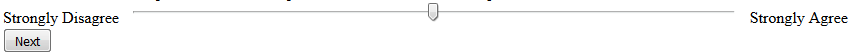
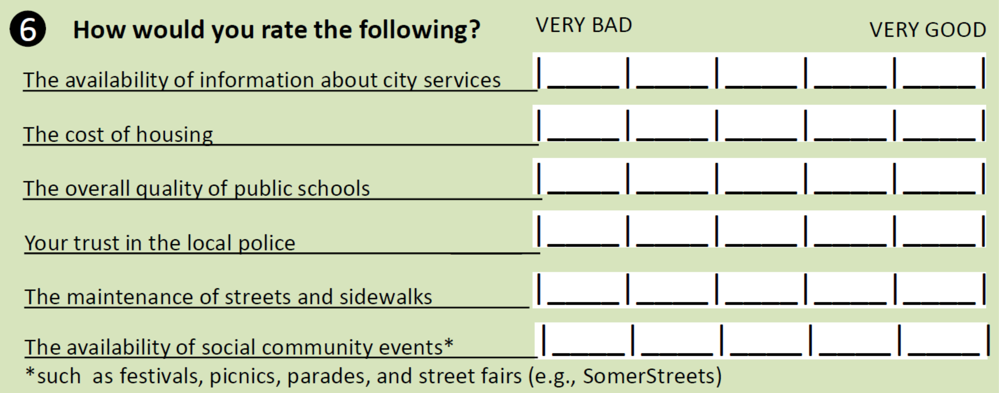
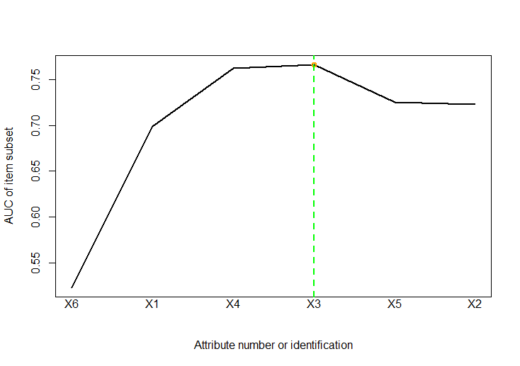

::: article
# Introduction {#intro}

Rating scales are designed to gather data and rate an entity (objects of
concepts). Rating scales are also called assessment scales. In our
study, we use "the scale" when no ambiguity takes place. Probably, the
most significant and frequently used rating scales are exams or tests
(e.g., Ontario Driver's test with 40 multiple-choice questions). Some
rating scales use values "1 to 10" but five \"stars\" are gaining
popularity for the online reviewing of goods or services. Yes/no answers
may also be used for answers in rating scales. Number of questions
(called items in the rating scale terminology) may also drastically
differ from scale to scale. Numerous rating scales have over 100 items
to rate but one item rating scale is also useful for rating the
customer's satisfaction with goods or services. An example of a popular
rating scale is the intelligence quotient (IQ). It is a total score
derived from several standardized tests designed to assess human
intelligence.

Sometimes, the scale is called a *survey* or a *questionnaire*. A
questionnaire is a tool for data gathering and may not be used for a
rating. A survey may not necessarily be conducted by questionnaires and
usually does not rate anything. Its goal is to gather data. Some surveys
may be conducted by interviews or extracted by Internet agents with or
without our consent or knowledge. The important distinction of rating
scales from questionnaires and surveys, is that the rating scales are
used for assessments. It means that rating scales are expected to have
an outcome making them classifiers (in the terminology of statistics and
machine learning). The scale term in the rating scale has the meaning as
in "the scale of disaster" hence this study assumes that:\

$$[rating scale] = [data frame] + [assessment] = [classifier]$$
The "assessment\" procedure must be in place for a questionnaire or
survey to become a rating scale. The assessment procedure may be as
complex as the imagination of their authors but most psychiatric rating
scales use a simple summation. The simple summation has been used in the
first examples. The simple summation can be replaced by, for example,
the assignment of weights. In our example 2, we computed weights by the
differential evolution (using R packagbe DEval). As expected, it has not
influenced the reduction, but it has improved the predictability rate.

"A picture is worth a thousand words" hence Fig. [1](#fig:rse) has been
used to illustrate ratings scales which are used in many examinations
and ratings of various products.

<figure id="fig:rse">

<figcaption>Figure 1: Rating scale example</figcaption>
</figure>

The recent popularity of rating scales is due to various "Customer
Reviews" on the Internet where five stars are often used instead of
ordinal numbers. Rating scales are predominantly used to express our
subjective assessments such as "on the scale 1 to 5, express your
preference" by one selection of: "strongly agree to strongly disagree"
with 3 as "neutral" preference. Using a slider implementation (as in
Fig. [1](#fig:rse)) gives us the flexibility. It is known as a graphic
or continuous rating scale.

## Terminology issue

In our study, we decided to use the data mining (DM) terminology having
in mind that regardless of the scientific discipline, the ultimate goal
is to predict the outcome of future examples to make a decision.
Statistical observations are called examples in DM terminology and items
in the rating scale terminology. Statistics uses variables. R project
uses attributes and the data frame with all attributes in columns and
examples in rows creates an attribute matrix. The additional validation
variable is called the decision vector or simply, the decision. In
psychiatry, the decision may be "is the patient sick with depression or
not." In case of Ontario Driver's test, it is: "do we give a passing
grade or not?" The list of application is endless as decision making is
of considerable importance for everyone. We also have introduced a new
term: "gray examples" for two examples having identical values on all
attributes but belonging to two different classes. Evidently, such
situation should not occur in the ideal situation but uncertainty in
data or imperfect data need to be handled in practice. The gray color is
intermediate between black and white and our two examples belong to both
classes. One example may be replicated $m$ times. Replication of
examples would deviate computations and should be detected and removed.

## Rating scale reduction {#rsrIntro}

Large rating scales discourage respondents from completing them. It is
not unusual to have most answers as random numbers at the end of a long
rating scale. It seems that the first successful rating scale reduction
took place in [@VC1979] by the psychophysical model by means of signal
detection theory (SDT). However, the last paragraph which served as the
optional Conclusions at that time:

> It may be concluded that due to the psychophysical difference between
> the SOT discrimination and the common rating situation, signal
> detection type reduction of such rating data does not allow
> interpretation of resulting values as unbiased psychological
> distances. To avoid misinterpretations, it might be worthwhile not to
> use the SDT notation for indices derived from psychological rating
> data.

may be perceived as a risky proposition. For many rating scales (e.g.,
written academic exams), arbitrary (rarely, computed) weights are
applied for some or all items (questions) to improve the overall rating.
The proposed method respects it and takes into account only the final
\"total\" (obtained by whatever method or procedure it is established).
Formally speaking, the \"total\" is a metric. The rating scale with
metric can be regarded as a classifier for classifying subjects by the
rating scale (e.g., sick or not in case of medicine). In [@K17rsr], the
stepwise algorithm is proposed for the reduction of the rating scale
items by using a metric computed from the confusion matrix by AUC of
ROC. The proposed algorithm is restricted to the dichotomous (binary)
decision making by the supervised learning approach. Our heuristic
algorithm is addressed in Section [2](#HA). In practice, it is the most
needed type of decision (e.g., go/stop, left/right, alive/dead,
passed/failed, etc.). There are many ways of transforming general data
into dichotomous data to be useful.

A dichotomous (binary) rating scale groups observations (examples) into
two categories based on the knowledge about the classified subject. The
knowledge is the external assessment since it is the case of supervised
learning. If, for example, the division into two groups is \"sick/not
sick\", it is necessary to know if the patient was indeed sick or not by
the opinion of an MD to be able to screen (classify) future patients,
unnecessarily taking time of usually busy MDs.

# Heuristic algorithm and rating scale stepwise reduction procedure {#HA}

ROC method and corresponding AUC is a well known technique to asses the
classifier performance. Both ROC and AUC concepts are well addressed by
[@ROC101]. They are implemented by many **R** packages including:
[***pROC***](https://CRAN.R-project.org/package=pROC) [@pROC] and
[***ROCR***](https://CRAN.R-project.org/package=ROCR) [@sing2005rocr].
There is also one interesting web application `easyROC`
[@goksuluk2016easyroc] giving possibility to compute the confusion
matrix and plot the curve on-line. The
[***RatingScaleReduction***](https://CRAN.R-project.org/package=RatingScaleReduction)
package expands this analysis to carry out the procedure of rating scale
reduction. The main function of the package is based on the procedure
described in [@K17rsr].

In computer science and mathematical optimization, a heuristic is a
technique (or method) designed for solving a problem by finding an
approximate solution when classic methods fail to find the exact
solution. Often, finding such a method is achieved by trading
completeness, accuracy, or optimality, for the speed. However, most
heuristics are designed to find an approximate solution of *NP-complete*
problems (NP stands for \"nondeterministic polynomial time\"). In
layman's terms, an infinite computing time is needed to find an exact
solution for an *NP-complete* problem hence a simpler (and usually
approximated) solution needs to be accepted.

Evidently, heuristic algorithms produce "good enough"solutions. They are
usually not the optimal solution but "good enough" is nearly always
better than none. For example, the traveling salesman problem (TSP),
often formulated as *find the shortest possible route to visit each city
once only and return to the origin city*. It cannot be computed even for
50 cities by verifying all possible combinations since the total number
of such permutations is estimated to $O(n^22^n)$ although a little bit
more optimistic estimations are suspected to exist. By using heuristics,
we can solve TSP for millions of cities with the accuracy of a small
fraction of 1%.

Heuristic algorithm is a frequently used misnomer. If it is
\"heuristic\", it is not an algorithm and if it is algorithm, it is not
a heuristic. However, many heuristics are expressed (written) the same
way as algorithms but such \"algorithms\" do not have well established
scientific foundations. Instead, they are based on observations,
experience, or even intuition. Some heuristic algorithms may become
algorithms. As time passes, we gather more and more evidence and such
evidence may lead to finding a theory.

In rating scale reduction problem, the number of possible combinations
for a rating scale with 100 items is a "cosmic number" hence the
complete search must be ruled out. Certainly, the results need to be
verified and used only if the item reduction is substantial. Computing
the AUC of ROC for all items is the basis for our heuristic. Common
sense dictates that the contribution of the individual items to the
overall value of AUC of ROC needs to be somehow utilized. In the
***RatingScaleReduction***, the implemented algorithm (when reduced to
its minimum) uses a loop for all attributes (with the class excluded) to
compute AUC. Subsequently, attributes are sorted in the ascending order
by AUC. The attribute with the largest AUC is added to a subset of all
attributes (evidently, it cannot be empty since it is supposed to be the
minimum subset S of all attributes with the maximum AUC). We continue
adding the next in line (according to AUC) attribute to the subset S
checking AUC. If it decreases, we stop the procedure. There is a lot of
checking (e.g., if the dataset is not empty or full of replications)
involved. In a more formal way, the `RSR` procedure implemented in
***RatingScaleReduction*** has the general steps:

1.  input: $attM[i,j]$ - attribute matrix, $i=1,...,n, j=1,...,m$,\
    where $n$ - the number of examples, $m$ - the number of columns,\
    $D[i]$ - decision vector $i=1,...,n$

2.  iterate in the loop:

    ``` r
    for (j in 1:m){
        calculate AUC[j]
        }
    ```

3.  sort the vector $AUC[1],..., AUC[m]$ in the descending order
    receiving a new vector
    $$AUCs[1],...,AUCs[m]$$

4.  create a new attribute matrix $attMs[i,j]$ with columns sorted in
    the descending order according to the vector:
    $$AUCs[1],...,AUCs[m]$$

5.  iterate in the loop:

    ``` r
    attMs[ ,1] = attM[ ,1]
    for (j in 2:m){
        D.predict[j] = sum(attMs[ ,1],...,attMs[ ,j])
        calculate AUCtotal[j] = auc(D[j], D_predict[j])
        }
    ```

6.  iterate in the loop:

    ``` r
    k = 1
    while (AUCtotal[k+1] > AUCtotal[k]){
        attMreduced = cbind(attMs[ ,1],...,attMs[ ,k])
        k = k+1
        }
    ```

7.  output: the reduced attribute matrix `attMreduced` generating the
    reduced rating scale.

First part of `RSR` procedure is implemented by R functions
**startAuc**, **totalAuc** while the second part is the main function of
the package called **rsr**.

# RatingScaleReduction: overview of the package functions

and shown by Fig.

The ***RatingScaleReduction*** package implements the above-stated
stepwise procedure using two functions of the **pROC** package: `roc`
and `roc.test`. The data can be the `matrix` or `data.frame`. Columns
represent attributes and one column is the class with two categories: 0
or 1 (or any other two different integer or real values). The rows in
`data.frame` represents examples. For our package, all attributes and
the class must be numeric (preferably 0 or 1) hence some preprocessing
may be needed.

There are two groups of functions available in the package. The first
group is for implementing the core of the `RSR` algorithm:

1.  `startAuc(attribute, D)` -- compute the AUC values of every single
    attribute in the rating scale.

2.  `totalAuc(attribute, D, plotT=FALSE)` -- sort AUC values in the
    ascending order and compute AUCs of running total of first $k$
    attributes, $k=1,...,n$, where $n$ is the number of attributes.
    Setting the argument `plotT` as `TRUE` the plot of new AUC values is
    created. The horizontal line marks the max new AUC.

3.  `rsr(attribute, D, plotRSR=FALSE)` -- the main function of the
    package reducing the rating scale. Setting the argument `plotRSR` as
    `TRUE` the plot of ROC curve of the sum of attributes in reduced
    rating scale is created.

4.  `CheckAttr4Inclusion(attribute, D)` -- subsequently, we check the
    next attribute for the possible inclusion in the reduced set of
    attribute. It is done by maximizing AUC of all already included
    attributes and the attribute we have just checked. In some cases,
    all attributes will be included in the new set of attributes. The
    reduced set of one attribute may be created if there is an
    identifying attribute. The function `CheckAttr4Inclusion` tests the
    inclusion. It carried out a statistical test for a difference in AUC
    of two correlated ROC curves: ROC1 of the sum of attributes from
    reduced rating scale and ROC2 of this sum plus the next ordered
    attribute. The function `roc.test` from the ***pROC*** is used and
    all implemented tests are available, in particular `delong` and
    `bootstrap`.

The package ***RatingScaleReduction*** also contains the second group of
functions to support the reduction procedure. Before running the
`PROC1`, the dataset should be analyzed to detect replicated examples
(gray examples). This analysis of a dataset can be done by using
functions: `diffExamples` and `grayExamples`.

1.  `diffExamples(attribute)` -- search replicated examples in the data
    and return the number of different examples and the number of
    duplicates.

2.  `grayExamples(attribute, D)` -- produce the list of pairs of
    examples having identical values on all attributes. The decision
    value and attributes are produced for every pair in the dataset, so
    the list clearly shows all gray examples.

In the examples presenting the capabilities of the
***RatingScaleReduction*** package, we have used the following two
datasets:

1.  Wine quality demonstrates how most of our package functions are
    used,

2.  Somerville Happiness Survey for the use of differential evolution
    (DE) classifier.

Subsequently, we utilized our examples to demonstrate the capabilities
of the ***RatingScaleReduction*** package. The full `R` code is
available for download from
<https://github.com/woali/RatingScaleReduction/blob/master/example_Rj.r>.

## The first demonstration example: wine quality

Wine quality dataset taken from
<http://archive.ics.uci.edu/ml/index.php> and available in the object
`wineData` from the ***RatingScaleReduction*** package is used in this
example. It has 6497 examples and 11 attributes. The reduction is
achieved by three core functions of the package. The `data.frame` we
work on contains 11 columns with attributes and one additional column as
a decision (reality).

We begin the analysis by computing AUC for all 11 individual attributes
by the use of function `totalAuc`. Setting the argument `plotT` as
`TRUE` produced a plot.

``` r
> tauc.wine <-totalAuc(attribute, D, plotT=TRUE)

> tauc.wine$summary
                     AUC one variable AUC running total
alcohol                     0.6098691         0.6098691
volatile.acidity            0.6047200         0.6397657
fixed.acidity               0.5656387         0.6415913
citric.acid                 0.5550811         0.6294707
total.sulfur.dioxide        0.5536676         0.5971653
sulphates                   0.5394024         0.5824898
density                     0.5218842         0.5109257
chlorides                   0.5215313         0.5227466
pH                          0.5134569         0.5229943
free.sulfur.dioxide         0.5052413         0.5237751
residual.sugar              0.4957781         0.5286474
```

The **R** output shows the `tauc.wine$summary` AUC of every single
attribute in the second column, sorted in the ascending order. The
running total of AUCs is in the third column. The initially selected
variable (alcohol) for the first row is the attribute with the largest
AUC. Subsequently, we add to it the variable with the largest AUC of the
remaining attributes. The process continues while the last attribute of
the scale is added.

{#figure:fig100 width="100%" alt="graphic without alt text"}

Printing the value `tauc.wine$item` we receive the attribute labels in
an ascending order.

``` r

> tauc.wine$item

 [1] "alcohol"              "volatile.acidity"     "fixed.acidity"
[4] "citric.acid"          "total.sulfur.dioxide" "sulphates"
[7] "density"              "chlorides"            "pH"
[10] "free.sulfur.dioxide"  "residual.sugar"
```

As illustrated by Fig. [2](#figure:fig100), the value of AUC of the
selected subset of attributes is increasing by adding the first three
attributes labeled alcohol, volatile.acidity and fixed.acidity. For this
reason, the reduction procedure is terminated after the first six
attributes are added. The function `rsr` reduces the scale automatically
assuming the truncation point as the attribute that first reaches the
maximum AUC. AUC is a real value between 0 and 1. It is 0.5 for random
data but hardly ever reaches 1 since , in reality, there are always
"gray examples" in sizable data.

``` r

> rsr.wine <-rsr(attribute, D, plotRSR=TRUE)
The criteria: Stop first MAX AUC
> rsr.wine$rsr.auc

[1] 0.6098691 0.6397657 0.6415913

> rsr.wine$rsr.label
[1] "alcohol"          "volatile.acidity" "fixed.acidity"

> rsr.wine$summary
AUC one variable AUC running total
alcohol                 0.6098691         0.6098691
volatile.acidity        0.6047200         0.6397657
fixed.acidity           0.5656387         0.6415913
```

Setting the `rsr` parameter `plotRSR` as `TRUE` the function generates
the plot illustrated by Fig. [3](#figure:fig200).

{#figure:fig200 width="100%" alt="graphic without alt text"}

We assume that by selecting the "best" attribute in a loop, we are able
to reduce the number of attributes for the best preventiveness. In our
case, having the largest AUC is the "best" criterion. Adding the next
"best" attribute to the selected attribute from the subset of the
remaining attributes until AUC of all selected attributes decreases is
the main idea of our heuristic. So far, each and every rating scale has
been reduced.

## The second demonstration example: DEvol classifiers

Somerville Happiness Survey (SHS) dataset has been used as the second
example to demonstrate the use of Differential Evolution (DE) as a
classifier to enhance the data be preprocessing. The use "survey" is
warranted since it gathers "other data" but it has subscale (a part of
it) for the happiness rating. This survey has been given sent out to a
random sample of Somerville residents asking them to rate their personal
happiness and their satisfaction with city services every second year
since 2011. Every year, the survey is refined. We used data of year 2015
since this survey is the most mature. SHS dataset uses what is called a
subscale. The processed survey data are available in the object
`SHSData` in the ***RatingScaleReduction***. It is a subscale marked s
block \"6\" and shown by Fig. [4](#fig:SHS6). The decision (class)
attribute is the SHS survey question \"3\":\
How satisfied are you with Somerville as a place to live?\
mapped into 0-1 (0 for values less than 8 otherwise 1).

<figure id="fig:SHS6">

<figcaption>Figure 4: Survey for collecting SHS scale</figcaption>
</figure>

For this subscale, we used Differential Evolution (DE) classifier by
using `DEoptim` from
[***DEoptim***](https://CRAN.R-project.org/package=DEoptim) R package.
`DEoptim` computes optimal weights (as a vector $w$) for a given data.
Given data are modified by the scalar vector multiplication.

It is worth noticing that all rating scales can be improved by
`DEoptim`. In the worse case scenario, the initial vector
$[1, 1, \ldots, 1]$ will remain unchanged. In our case, DEval improved
the predictability measured by AUC from 0.678 to 0.789.

``` r
> D.predict <- rowSums(attribute)
> roc(D, D.predict, plotROC = FALSE)$auc
Area under the curve: 0.6794
```

The `RSR` procedure gives the following reduction:

``` r
> rsrSum <- rsr(attribute, D, plotRSR = TRUE)
> rsrSum
$rsr.auc
[1] 0.6664868 0.6934700 0.7330005

$rsr.label
[1] "X6" "X1" "X4"

$summary
   AUC one variable AUC running total
X6        0.6664868         0.6664868
X1        0.6542094         0.6934700
X4        0.6083378         0.7330005
```

The results are illustrated by plots (see Fig. [5](#figure:fig1000) and
 [6](#figure:fig2000)).

{#figure:fig1000 width="100%" alt="graphic without alt text"}

{#figure:fig2000 width="100%" alt="graphic without alt text"}

**Differential evolution (DE) as a classifier** In `RSR` procedure, we
change the classifier from the simple to the weighted total. The optimal
weights are received using DE.\
The goal function is:

``` r
nsi<-function(x){
  D.predict <- rowSums(x*attribute)
  -1*roc(D, D.predict, plotROC = FALSE)$auc
}
```

where $x = x[j]$, $j = 1,...,6$ are weights of items.

The initial lower and upper bounds, required by DE, are set to:\

``` r
lower_nsi <- c(0.1,0.1, 0.1, 0.1, 0.1,0.1)
upper_nsi <- c(3,3,3,3,3,3)
```

DE optimization:

``` r
output <- DEoptim(nsi, lower_nsi, upper_nsi,
    DEoptim.control(itermax=10))

#ouput the optimize result of weights
> (weight.item.all <- output.all$optim$bestmem)
    par1     par2     par3     par4     par5     par6
1.405835 1.882602 1.758763 2.356450 1.123748 2.085982

#all items
> (aucResult <- -1*output$optim$bestval)
[1] 0.766055
```

In order to reduce the scale using DE, we have modified `RSR` procedure
by changing D.predict formula to:\

``` r
D.predict[j] = sum(x[1]*attMs[ ,1],...,x[1]*attMs[ ,j])
```

The sorted attribute matrix $attMs[i,j]$ we use in the loop:

``` r
results <- matrix(nrow = ncol(attMs), ncol = 2)
for (i in 2:ncol(attMs)) {
  mydata_new <- attMs[ ,1:i]

  lower_nsi <- rep(0.1,i)
  upper_nsi <- rep(3,i)

  output <- DEoptim(nsi, lower_nsi, upper_nsi, DEoptim.control(itermax=10))
  results[i, ] <- cbind(i, -1*output$optim$bestval)

}
```

We have obtained the reduction:

``` r
> results
     number of items AUCtotalDE
[1,]               1  0.5226659
[2,]               2  0.6991365
[3,]               3  0.7621425
[4,]               4  0.7664598
[5,]               5  0.7251754
[6,]               6  0.7232866

> names(attMs)
[1] "X6" "X1" "X4" "X3" "X5" "X2"
```

Plots are illustrated by Fig. [7](#figure:fig3000) and
 [8](#figure:fig4000)

{#figure:fig3000
width="100%" alt="graphic without alt text"}

{#figure:fig4000 width="100%" alt="graphic without alt text"}

# The potential application targets

Rating scales are by far more important contributors to practically all
branches of applied science and engineering than we can address by this
study. Most examinations for granting scientific degrees are rating
scales in various shapes and forms. Simplifying them (or reducing in
size) is needed if the predictability is preserved or increased.

In bioinformatics, reporting trade-off in sensitivity and specificity,
by using a Receiver Operating Characteristic (ROC) curve, is becoming a
common practice. ROC plot has the sensitivity on the $y$ axis, against
the false discovery rate (1- specificity) on the $x$ axis. ROC curve
plot provides a visual tool to determine the boundary limit (or the
separation threshold) of a subset (or a combination) of scale items for
the potentially optimal combination of sensitivity and specificity. The
area under the curve (AUC) of the ROC curve indicates the overall
accuracy and the separation performance of the rating scale. It can be
readily used to compare different item subsets. As a rule of thumb, the
fewer scale items used to maximize the AUC of the ROC curve, the better.

World Health Organization estimates are included behind selected rating
scales for mental disorder. Rating scales are of considerable importance
for psychiatry where they are predominately used for screening patients
for mental disorders such as:\

-   depression (see [@K17rsr]) which affects 60 million people worldwide
    according to [@WHOfs],

-   bipolar affective disorder (60 million people),

-   dementia and cognitive impairment (47.5 million people)

-   schizophrenia (21 million people),

-   autism and autism spectrum disorders (e.g., [@KKW2012])

-   addiction,

-   personality and personality disorders,

-   anxiety,

-   ADHD;

and many other disorders.

Usually, there are many scales for each mental disorder. The most
important for screening are global scales. Reducing these global rating
scales makes them more usable as indicated in [@K17rsr]. World Health
Organization Media Centre reports that depression and anxiety disorders
cost the global economy US \$1 trillion each year" and it is no longer a
local problem.

# Conclusions

The presented method has reduced the number of the rating scale items
(variables) to 28.57% from the original number of items (from 21 to 6).
It means that over 70% of collected data was unnecessary. It is not only
an essential budgetary saving, as the data collection is usually
expensive and may easily go into hundreds of thousands of dollars, but
excessive data collection may contribute to data collection error
increase. The more data are collected, the more errors may occur since a
lack of concentration and boredom are realistic factors.

By using the proposed AUC ROC reduction method, the predictability has
increased by approximately 0.5%. It may seem insignificant. However, for
a large population, it is of considerable importance. In fact, [@WHOfs]
states that: "Taken together, mental, neurological and substance use
disorders exact a high toll, accounting for 13% of the total global
burden."

As pointed out, rating scales are used for mental disorders. According
to [@WHOfs], mental disorders are becoming a global problem.

The proposed use of AUC for reducing the number of rating scale items,
as a criterion, is innovative and applicable to practically all rating
scales. In the worse case scenario, no reduction takes place (the number
of reduced attributes is 0). System **R** code is posted on the Internet
(RatingScaleReduction) for the general use as a **R** package.
Certainly, more validation cases would be helpful and the assistance
will be provided to anyone who wishes to try this method using his/her
data.

Future plans include using the presented method for measuring the
harmful use of the Internet and for the improvement of numerous
psychiatric scales. The reduced scales can be further enhanced by the
method described in [@KKW2012] and [@K1996].

# Acknowledgments {#acknowledgments .unnumbered}

The first author has been supported in part by the Euro Research grant
"Human Capital".

The authors would also like to express appreciation to Tiffany Armstrong
(Laurentian University, Computer Science), and Grant O. Duncan, Team
Lead, Business Intelligence, Integration and Development, Health
Sciences North, Sudbury, Ontario, Canada) for the editorial improvements
of our text and their creative comments.
:::
