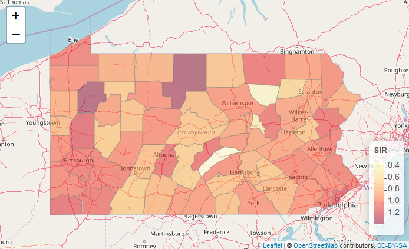
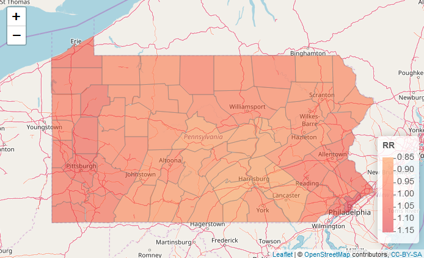

::: article
# Introduction

Disease risk mapping analyses can help to better understand the spatial
variation of the disease, and allow the identification of important
public health determinants. These analyses are essential to inform
programmes of disease prevention and control. The increased availability
of geospatial disease and population data has enabled to study a number
of health outcomes worldwide such as influenza and cancer in developed
countries [@moragaandozonoff13; @moragaandkulldorff16], and neglected
tropical diseases [@moragaetal15; @haganetal16].

Areal disease data often arise when disease outcomes observed at point
level locations are aggregated over subareas of the study region due to
several reasons such as patient confidentiality. Producing disease risk
estimates at areal level is complicated by the fact that raw rates can
be very unstable in areas with small populations and for rare diseases,
and also by the presence of spatial correlation that may exist due to
spatially correlated risk factors [@lerouxetal00]. Thus, generalized
linear mixed models are often used to obtain disease risk estimates
since they enable to improve local estimates by accommodating spatial
correlation and the effects of explanatory variables. Bayesian inference
in these models may be performed using the Integrated Nested Laplace
Approximation (INLA) approach [@rueetal09] which is a computational
alternative to MCMC that allows to do approximate Bayesian inference in
latent Gaussian models. This approach is implemented in the R package
called ***INLA*** [@rueetal17] (<http://www.r-inla.org/>).

Small area disease estimates can be visualized through maps, greatly
facilitating effective communication. R provides excellent tools for
visualization including packages for making interactive maps such as
[***leaflet***](https://CRAN.R-project.org/package=leaflet)
[@chengetal17]. The maps created with ***leaflet*** support interactive
panning and zooming which is very convenient to examine small areas in
detail.

In this paper, we illustrate the use of R for performing disease risk
mapping analysis using areal data. First, we introduce disease risk
models for areal data and give a brief overview of INLA. In Section
[4](#sec:example) we show how to estimate lung cancer risk and quantify
risk factors in Pennsylvania, United States, in year 2000. Specifically,
we discuss how to compute the observed and expected disease counts in
the Pennsylvania counties, how to obtain disease risk estimates by
fitting a spatial disease risk model using ***INLA***, and how to build
interactive maps showing the risk estimates using ***leaflet***.
Finally, the conclusions are presented.

# Disease risk models {#sec:diseaseriskmodels}

Disease risk estimates in areas can be obtained by computing the
Standardized Incidence Ratios (SIRs). For area $i$, $i=1,\ldots,n$, the
SIR is obtained as the ratio of the observed to the expected disease
counts: $SIR_i=Y_i/E_i$. The expected counts represent the total number
of disease cases that one would expect if the population of the specific
area behaved the way the standard (or regional) population behaves. The
expected counts can be calculated using indirect standardization as
$$E_i=\sum_{j=1}^m r_j^{(s)} n_j,$$
where $r_j^{(s)}$ is the disease rate in stratum $j$ of the standard
population, and $n_j$ is the population in stratum $j$ of the specific
area. The SIR corresponding to area $i$, $SIR_i$, indicates whether the
area $i$ has more ($SIR_i > 1$), equal ($SIR_i = 1$) or fewer
($SIR_i < 1$) cases observed than expected from the standard population.
When applied to mortality data, the ratio is commonly known as the
Standardized Mortality Ratio or SMR.

Although in some situations SIRs can give a sense of the disease's
spatial variability, very extreme values can occur in areas with small
populations owing to the small sample sizes involved. In contrast,
disease models are preferred to obtain disease risks estimates because
they enable to incorporate covariates and borrow information from
neighboring areas to improve local estimates, resulting in the smoothing
or shrinking of extreme values based on small sample sizes
[@gelfandetal10]. A common approach is to model the observed counts
$Y_i$, $i=1,\ldots,n$, using a Poisson distribution with mean
$E_i \times \theta_i$, where $E_i$ is the expected counts and $\theta_i$
is the relative risk in area $i$. Then, the log risks are modeled with a
sum of an intercept to model the overall disease risk level, and random
effects that account for extra-Poisson variability in the observed data
[@lawson09]. Areas with relative risks $\theta > 1$ and $\theta < 1$ are
areas with high and low risks, respectively. Areas with $\theta = 1$
have the same risk as expected from the standard population.

The general model in disease mapping is expressed as
$$Y_i \sim Po(E_i \times \theta_i),\ i=1,\ldots,n,$$

$$\log(\theta_i)= \alpha + u_i + v_i.$$
Here, $\alpha$ denotes the overall risk level, $u_i$ is a spatial
structured random effect that models the spatial dependence between the
relative risks, and $v_i$ is an unstructured exchangeable random effect
that models uncorrelated noise. Often, other covariates or random
effects are also included to quantify risk factors and deal with other
sources of variability.

A model commonly used in disease mapping is the Besag-York-Mollié (BYM)
model [@besagetal91]. In this model, the spatially structured component
$u_i$ is modelled with the conditional autoregressive (CAR) distribution
which smoothes the data according to a certain adjacency structure given
by a neighborhood matrix that specifies two areas are neighbours if they
have a common boundary. The CAR distribution is expressed as
$$u_i| \mathbf{u_{-i}} \sim N\left(\bar u_{\delta_i}, \frac{\sigma^2_u}{n_{\delta_i}}\right),$$
where $\bar u_{\delta_i}= n_{\delta_i}^{-1} \sum_{j \in \delta_i} u_j$,
and $\delta_i$ and $n_{\delta_i}$ represent, respectively, the set of
neighbours and the number of neighbours of area $i$. The unstructured
component $v_i$ is modelled using independent and identically
distributed normal variables with zero-mean and variance equal to
$\sigma_v^2$.

# INLA

Traditionally, Bayesian inference has been implemented via MCMC methods
which make inference tractable for complex models but may present
convergence and computation time problems. Integrated Nested Laplace
Approximation (INLA) is a computational less-intensive alternative to
MCMC designed to perform approximate Bayesian inference in latent
Gaussian models [@rueetal09]. These models include a very wide and
flexible class of models ranging from generalized linear mixed to
spatial and spatio-temporal models. Specifically, models are of the form
$$y_i|\mathbf{x}, \boldsymbol{\theta} \sim \pi(y_i|x_i, \boldsymbol{\theta}),$$

$$\mathbf{x}|\boldsymbol{\theta} \sim N(\mathbf{0}, \boldsymbol{Q(\theta)}^{-1}),$$

$$\boldsymbol{\theta} \sim \pi(\boldsymbol{\theta}),$$
where $\mathbf{y}$ are the observed data, $\mathbf{x}$ represents a
Gaussian field, and $\boldsymbol{\theta}$ are hyperparameters.
Observations $y_i$ are assumed to belong to an exponential family with
mean $\mu_i = g^{-1}(\eta_i)$. The linear predictor $\eta_i$ accounts
for effects of various covariates in an additive way,
$$\eta_i = \alpha + \sum_{k=1}^{n_{\beta}} \beta_k z_{ki} + \sum_{j=1}^{n_f} f^{(j)}(u_{ji}).$$
Here, $\alpha$ is the intercept, $\{ \beta_k \}$'s quantify the linear
effects of covariates $\{ z_{ki} \}$ on the response, and
$\{ f^{(j)}(\cdot) \}$'s are a set of non-linear or smooth functions
defined in terms of some covariates $\{ u_{ji}\}$. This formulation
permits to accommodate a wide range of models thanks to the very
different forms that the functions $\{f^{(j)}\}$ can take including the
disease risk models previously introduced. INLA uses a combination of
analytical approximation and numerical integration to obtain
approximated posterior distributions of the parameters that can then be
post-processed to compute quantities of interest like posterior
expectations and quantiles.

The INLA approach is implemented in the R package ***INLA***. This
package is not on CRAN because it uses some external C libraries that
make difficult to build the binaries. Therefore, when we install the
package we need to use `install.packages()` adding the URL of the
***INLA*** repository:

``` r
install.packages("INLA", repos = "https://inla.r-inla-download.org/R/stable",
                 dep = TRUE)
```

To fit a model using ***INLA*** we need to take two steps. First, we
need to write the linear predictor of the model as a formula object in
R. Then, we run the model calling the `inla()` function where we specify
the formula, the family, the data and other options. Results can be
inspected with the `summary()` function and the posterior distributions
can be post-processed using a set of specific functions provided by
***INLA***. Further details about how to use all these functions will be
given in the disease mapping example in next Section.

# Example: lung cancer risk in Pennsylvania {#sec:example}

In this Section we present an example of small area disease mapping
study where we estimate the risk of lung cancer in Pennsylvania counties
in year 2002. We use the data contained in the R package
[***SpatialEpi***](https://CRAN.R-project.org/package=SpatialEpi)
[@kimandwakefield16]. The data contain the counties population which was
obtained from the 2000 decennial census, and the lung cancer and smoking
proportions which were obtained from the Pennsylvania Department of
Health. We show how to calculate the observed and expected disease
cases, and the the SIRs in each of the counties. We also obtain disease
risk estimates and quantify risk factors by fitting a Bayesian model
using ***INLA***. Finally, we show how to make interactive maps of the
risk estimates using ***leaflet***.

## Data

We start by loading the ***SpatialEpi*** package and attaching the
`pennLC` data.

``` r
library(SpatialEpi)
data(pennLC)
```

By typing `?pennLC` we see `pennLC` is a list with the following
elements:

-   `geo`: a data frame of county ids, and longitude and latitude of the
    geographic centroid of each county,

-   `data`: a data frame of county ids, number of cases, population and
    strata information,

-   `smoking`: a data frame of county ids and proportion of smokers,

-   `spatial.polygon`: a `SpatialPolygons` object with the map of
    Pennsylvania.

`pennLC$data` contains the number of lung cancer cases and the
population at county level, stratified on race (white and non-white),
gender (female and male) and age group (under 40, 40-59, 60-69 and 70+).

We now create a data frame called `d` with columns containing the
counties ids, the observed and expected number of cases, the smoking
proportions and the SIRs. Specifically, `d` will contain the following
columns:

-   `id`: id of each county,

-   `Y`: observed number of cases in each county,

-   `E`: expected number of cases in each county,

-   `smoking`: smoking proportion in each county,

-   `SIR`: SIR of each county.

### Observed cases

`pennLC$data` contains the cases in each county stratified by race,
gender and age. We can obtain the number of cases in each county, `Y`,
by aggregating the rows of `pennLC$data` by county and adding up the
observed number of cases.

``` r
d <- aggregate(x = pennLC$data$cases, by = list(county = pennLC$data$county),
               FUN = sum)
```

`aggregate()` returns a data frame where the first row is the county and
the second column is the observed number of cases in each of the
counties. We set the column names of the returned object equal to `id`
and `Y`.

``` r
names(d) <- c("id", "Y")
```

### Expected cases

Now we calculate the indirectly standardized expected number of cases in
each county as explained in Section [2](#sec:diseaseriskmodels). That
is, we use the strata-specific rates from the the Pennsylvania
population (standard population), and apply them to the population
distribution of the county. The expected counts represent the total
number of disease cases one would expect if the population in the county
behaved the way the Pennsylvania population behaves. We can do this by
using the `expected()` function of ***SpatialEpi***. This function has
three arguments, namely,

-   `population`: a vector of population counts for each strata in each
    area,

-   `cases`: a vector with the number of cases for each strata in each
    area,

-   `n.strata`: number of strata considered.

Vectors `population` and `cases` have to be sorted by area first and
then, within each area, the counts for all strata need to be listed in
the same order. All strata need to be included in the vectors, including
strata with 0 cases. Hence, to get the expected counts we first sort the
data using the `order()` function where we specify the order as county,
race, gender and finally age.

``` r
pennLC$data <- pennLC$data[order(pennLC$data$county, pennLC$data$race,
                                 pennLC$data$gender, pennLC$data$age), ]
```

Then we call the `expected()` function to obtain the expected counts `E`
in each county. In the function we set `population` equal to
`pennLC$data$population` and `cases` equal to `pennLC$data$cases`. There
are 2 races, 2 genders and 4 age groups for each county, so number of
strata is set to 2 x 2 x 4 = 16.

``` r
population <- pennLC$data$population
cases <- pennLC$data$cases
n.strata <- 16
E <- expected(population, cases, n.strata)
```

Now we add the vector `E` to the data frame `d` which contains the
counties ids (`id`) and the observed counts (`Y`), making sure the `E`
elements correspond to the counties in `d$id` in the same order. To do
that, we use `match()` to calculate the vector of the positions that
match `d$id` in `unique(pennLC$data$county)` which are the corresponding
counties of `E`. Then we rearrange `E` using that vector.

``` r
d$E <- E[match(d$id, unique(pennLC$data$county))]
```

### Smokers proportions

We also add to `d` the variable `smoking` which represents the
proportion of smokers in each county. We add this variable using the
`merge()` function where we specify the columns for merging as `id` in
`d` and `county` in `pennLC$smoking`.

``` r
d <- merge(d, pennLC$smoking, by.x = "id", by.y = "county")
```

### SIRs

Finally, we compute the vector of SIRs as the ratio of the observed to
the expected counts, and add it to the data frame `d`.

``` r
d$SIR <- d$Y/d$E
```

### Add data to map

The map of Pennsylvania counties is given by the `SpatialPolygons`
object called `pennLC$spatial.polygon`. Using this object and the data
frame `d` we can create a `SpatialPolygonsDataFrame` called `map`, that
will allow us to make maps of the variables in `d`. In order to do that,
we first set the row names of the data frame `d` equal to `d$id`. Then
we merge `pennLC$spatial.polygon` and `d` matching the `SpatialPolygons`
member Polygons ID slot values with the data frame row names.

``` r
library(sp)
rownames(d) <- d$id
map <- SpatialPolygonsDataFrame(pennLC$spatial.polygon, d, match.ID = TRUE)
head(map@data)

##                  id    Y          E smoking       SIR
## adams         adams   55   69.62730   0.234 0.7899200
## allegheny allegheny 1275 1182.42804   0.245 1.0782897
## armstrong armstrong   49   67.61012   0.250 0.7247435
## beaver       beaver  172  172.55806   0.276 0.9967660
## bedford     bedford   37   44.19013   0.228 0.8372910
## berks         berks  308  300.70598   0.249 1.0242563
```

## Mapping variables

We can visualize the observed and expected disease counts, the SIRs, as
well as the smokers proportions in an interactive chropleth map using
the ***leaflet*** package. We create the map by first calling
`leaflet()` and adding the default OpenStreetMap map tiles to the map
with `addTiles()`. Then we add the Pennsylvania counties with
`addPolygons()` where we specify the areas boundaries color (`color`)
and the stroke width (`weight`). We fill the areas with the colours
given by the color palette function generated with `colorNumeric()`, and
set `fillOpacity` to a value less than 1 to be able to see the
background map. We use `colorNumeric()` to create a color palette
function that maps data values to colors according to a given palette.
We create the function using the parameters `palette` with the color
function that values will be mapped to, and `domain` with the possible
values that can be mapped. Finally, we add the legend by specifying the
color palette function (`pal`) and the values used to generate colors
from the palette function (`values`). We set `opacity` to the same value
as the opacity in the areas, and specify a title and a position for the
legend.

``` r
library(leaflet)
l <- leaflet(map) %>% addTiles()
pal <- colorNumeric(palette = "YlOrRd", domain = map$SIR)
l %>% addPolygons(color = "grey", weight = 1, fillColor = ~pal(SIR),
                  fillOpacity = 0.5) %>%
  addLegend(pal = pal, values = ~SIR, opacity = 0.5, title = "SIR",
            position = "bottomright")
```

We can improve the map by highlighting the counties when the mouse
hovers over them, and showing information about the observed and
expected counts, SIRs, and smoking proportions. We do this by adding the
arguments `highlightOptions`, `label` and `labelOptions` to
`addPolygons()`. We choose to highlight the areas using a bigger stroke
width (`highlightOptions(weight = 4)`). We create the labels using HTML
syntax. First, we create the text to be shown using the function
`sprintf()` which returns a character vector containing a formatted
combination of text and variable values and then applying
`htmltools::HTML()` which marks the text as HTML. In `labelOptions` we
specify the labels `style`, `textsize`, and `direction`. Possible values
for `direction` are `left`, `right` and `auto` and this specifies the
direction the label displays in relation to the marker. We choose `auto`
so the optimal direction will be chosen depending on the position of the
marker.

``` r
labels <- sprintf("<strong> %s </strong> <br/> Observed: %s <br/> Expected: %s <br/>
                   Smokers proportion: %s <br/> SIR: %s",
                  map$id, map$Y, round(map$E, 2), map$smoking, round(map$SIR, 2)) %>%
  lapply(htmltools::HTML)

l %>% addPolygons(color = "grey", weight = 1, fillColor = ~pal(SIR), fillOpacity = 0.5,
                  highlightOptions = highlightOptions(weight = 4), label = labels,
                  labelOptions = labelOptions(style = list("font-weight" = "normal",
                                                           padding = "3px 8px"),
                                              textsize = "15px",
                                              direction = "auto")) %>%
  addLegend(pal = pal, values = ~SIR, opacity = 0.5, title = "SIR",
            position = "bottomright")
```

Figure [1](#fig:leafletmapSIR) shows a snapshot of the interactive map
created using `leaflet` showing the SIRs in the Pennsylvania counties.
We can examine the map and see which counties have SIR equal to 1
indicating observed counts are the same as expected counts, and which
counties have SIR greater (or smaller) than 1, indicating observed
counts are greater (or smaller) than expected counts.

{#fig:leafletmapSIR width="100%" alt="graphic without alt text"}

This map gives a sense of the disease risk across Pennsylvania. However,
SIRs are misleading and insufficiently reliable in counties with small
populations. In contrast, model-based approaches enable to incorporate
covariates and borrow information from neighboring counties to improve
local estimates, resulting in the smoothing of extreme values based on
small sample sizes. In the next section we will show how to obtain
disease risk estimates using a Bayesian model using ***INLA***.

## Modeling {#sec:modeling}

In this Section we specify the model for the data, and detail the
required steps to fit the model and obtain the disease risk estimates
using ***INLA***.

### Model {#sec:model}

We specify a model assuming that the observed counts $Y_i$ are
conditionally independently Poisson distributed,
$$Y_i|\theta_i \sim Po(E_i \times \theta_i),\ i=1,\ldots,n,$$
where $E_i$ is the expected count and $\theta_i$ is the relative risk in
area $i$. The logarithm of $\theta_i$ is expressed as follows:
$$\log(\theta_i) = \beta_0 + \beta_1 \times smoking_i + u_i + v_i,$$
where $\beta_0$ is the intercept, $\beta_1$ is the coefficient of the
smokers proportion covariate, $u_i$ is an structured spatial effect,
$u_i|\mathbf{u_{-i}} \sim N(\bar{u}_{\delta_i}, \frac{\sigma_u^2}{n_{\delta_i}})$,
and $v_i$ is an unstructured spatial effect,
$v_i \sim N(0, \sigma_v^2)$.

### Neighbourhood matrix

We create the neighbourhood matrix needed to define the spatial random
effect using the `poly2nb()` and the `nb2INLA()` functions of the
[***spdep***](https://CRAN.R-project.org/package=spdep) package
[@bivand17]. First, we use `poly2nb()` to create a neighbours list based
on areas with contiguous boundaries. Then, we use `nb2INLA()` to convert
this list into a file with the representation of the neighbourhood
matrix as required by ***INLA*** that is saved in the working directory.
Then we read the file using the `inla.read.graph()` function of
***INLA***, and store it in the object `g` which we will later use for
specifying the spatial disease model with ***INLA***.

``` r
library(spdep)
library(INLA)
nb <- poly2nb(map)
head(nb)

## [[1]]
## [1] 21 28 67
## 
## [[2]]
## [1]  3  4 10 63 65
## 
## [[3]]
## [1]  2 10 16 32 33 65
## 
## [[4]]
## [1]  2 10 37 63
## 
## [[5]]
## [1]  7 11 29 31 56
## 
## [[6]]
## [1] 15 36 38 39 46 54

nb2INLA("map.adj", nb)
g <- inla.read.graph(filename = "map.adj")
```

### Inference using INLA

As stated in Section [4.3.1](#sec:model), the model includes two random
effects, namely, $u_i$ for modeling spatial residual variation, and
$v_i$ for modeling unstructured noise. We need to include two vectors in
the data that denote the indices of these random effects. We call `re_u`
the vector denoting $u_i$, and `re_v` the vector denoting $v_i$. We set
both `re_u` and `re_v` equal to $1,\ldots,n$, where $n$ is the number of
counties. In our example, $n=67$ and this can be obtained with the
number of rows in the data (`nrow(map@data)`).

``` r
map$re_u <- 1:nrow(map@data)
map$re_v <- 1:nrow(map@data)
```

We specify the model formula by including the response in the left-hand
side, and the fixed and random effects in the right-hand side. Random
effects are set using `f()` with parameters equal to the name of the
variable and the chosen model. For $u_i$, we use `model = "besag"` with
neighbourhood matrix given by `g`. For $v_i$ we choose `model = "iid"`.

``` r
formula <- Y ~ smoking + f(re_u, model = "besag", graph = g) + f(re_v, model = "iid")
```

We fit the model by calling the `inla()` function. We specify the
formula, family, data, and the expected counts, and set
`control.predictor` equal to `list(compute = TRUE)` to compute the
posterior means of the linear predictors.

``` r
res <- inla(formula, family = "poisson", data = map@data, E = E,
            control.predictor = list(compute = TRUE))
```

## Results

We can inspect the results object `res` using `summary()`.

``` r
summary(res)

## 
## Call:
## c("inla(formula = formula, family = \"poisson\", data = map@data, ",  "    E = E,
## control.predictor = list(compute = TRUE))")
## 
## Time used:
##  Pre-processing    Running inla Post-processing           Total 
##          0.3179          1.1198          0.2155          1.6531 
## 
## Fixed effects:
##                mean     sd 0.025quant 0.5quant 0.975quant    mode kld
## (Intercept) -0.3236 0.1503    -0.6212  -0.3234    -0.0279 -0.3231   0
## smoking      1.1567 0.6247    -0.0809   1.1582     2.3853  1.1619   0
## 
## Random effects:
## Name   Model
##  re_u   Besags ICAR model 
## re_v   IID model 
## 
## Model hyperparameters:
##                        mean       sd 0.025quant 0.5quant 0.975quant
## Precision for re_u    93.05    49.95      30.95    81.84     220.42
## Precision for re_v 17956.92 18118.49    1155.86 12549.06   65967.91
##                       mode
## Precision for re_u   63.63
## Precision for re_v 3103.11
## 
## Expected number of effective parameters(std dev): 18.61(4.366)
## Number of equivalent replicates : 3.60 
## 
## Marginal log-Likelihood:  -320.53 
## Posterior marginals for linear predictor and fitted values computed
```

We see the intercept $\hat \beta_0$= -0.3236 with a 95% credible
interval equal to (-0.6212, -0.0279), and the coefficient of smoking is
$\hat \beta_1=$ 1.1567 with a 95% credible interval equal to (-0.0810,
2.3853). This indicates that the smokers proportion has a positive
although non significant effect on disease risk. We can plot the
posterior distribution of the smoking coefficient. We do this by
calculating a spline smoothing of the marginal distribution of the
coefficient with `inla.smarginal()` and then plot it with `ggplot()` of
[***ggplot2***](https://CRAN.R-project.org/package=ggplot2) package
[@wickhamandchang16] (see Figure [2](#fig:plotsmokingcoefficient)).

``` r
library(ggplot2)
marginal <- inla.smarginal(res$marginals.fixed$smoking)
marginal <- data.frame(marginal)
ggplot(marginal, aes(x = x, y = y)) + geom_line() +
  labs(x = expression(beta[1]), y = "Density") +
  geom_vline(xintercept = 0, col = "blue") + theme_bw()
```

{#fig:plotsmokingcoefficient
width="100%" alt="graphic without alt text"}

The disease risk estimates and uncertainty for each of the counties are
given by the mean posterior and the 95% credible intervals of
$\theta_i$, $i=1,\ldots,n$ which are in the data frame
`res$summary.fitted.values`. Here, column `mean` is the mean posterior
and `0.025quant` and `0.975quant` are the 2.5 and 97.5 percentiles,
respectively. We add these data to `map` to be able to make maps of
these variables. We assign column `mean` to the estimate of the relative
risk, and columns `0.025quant` and `0.975quant` to the lower and upper
limits of 95% credible intervals of the risks.

``` r
head(res$summary.fitted.values)

##                          mean         sd 0.025quant  0.5quant 0.975quant
## fitted.Predictor.01 0.8793912 0.05856462  0.7633052 0.8797123  0.9943822
## fitted.Predictor.02 1.0597516 0.02768817  1.0067707 1.0592960  1.1153106
## fitted.Predictor.03 0.9632142 0.05186119  0.8555748 0.9649813  1.0612639
## fitted.Predictor.04 1.0270184 0.05121187  0.9270286 1.0267054  1.1289998
## fitted.Predictor.05 0.9076782 0.05497745  0.7978867 0.9081541  1.0156557
## fitted.Predictor.06 0.9951907 0.04023105  0.9184425 0.9943119  1.0770673
##                          mode
## fitted.Predictor.01 0.8808707
## fitted.Predictor.02 1.0583769
## fitted.Predictor.03 0.9685918
## fitted.Predictor.04 1.0262831
## fitted.Predictor.05 0.9096874
## fitted.Predictor.06 0.9927333

map$RR <- res$summary.fitted.values[, "mean"]
map$LL <- res$summary.fitted.values[, "0.025quant"]
map$UL <- res$summary.fitted.values[, "0.975quant"]
```

## Mapping disease risk

We show the estimated disease risk in an interactive map using
`leaflet`. In the map, we add labels that appear when mouse hovers over
the counties showing information about observed and expected counts,
SIRs, smokers proportions, RRs, and lower and upper limits of 95%
credible intervals.

``` r
pal <- colorNumeric(palette = "YlOrRd", domain = map$RR)

labels <- sprintf("<strong> %s </strong> <br/> Observed: %s <br/> Expected: %s <br/>
                  Smokers proportion: %s <br/> SIR: %s <br/> RR: %s (%s, %s)",
                  map$id, map$Y,  round(map$E, 2),  map$smoking, round(map$SIR, 2),
                  round(map$RR, 2), round(map$LL, 2), round(map$UL, 2)) %>%
  lapply(htmltools::HTML)

leaflet(map) %>% addTiles() %>%
  addPolygons(color = "grey", weight = 1, fillColor = ~pal(RR),  fillOpacity = 0.5,
              highlightOptions = highlightOptions(weight = 4), label = labels,
              labelOptions = labelOptions(style = list("font-weight" = "normal",
                                                       padding = "3px 8px"),
                                          textsize = "15px", direction = "auto")) %>%
  addLegend(pal = pal, values = ~RR, opacity = 0.5, title = "RR",
            position = "bottomright")
```

A snapshot of the interactive map created is shown in Figure
[3](#fig:leafletmapRR). We observe counties with greater disease risk
are located in the west and south east of Pennsylvania, and counties
with lower risk are located in the center. The 95% credible intervals
give a measure of the uncertainty in the risk estimates.

{#fig:leafletmapRR width="100%" alt="graphic without alt text"}

By typing `range(map@data$SIR)` and `range(map@data$RR)` we see that the
range of SIRs is much wider about 1 compared to the range of RRs: (0.32
to 1.37) versus (0.85 to 1.15). We can also see the shrinkage of the RRs
toward 1 by comparing maps of SIRs and RRs created using the same scale
on the SIR gradient legend (see Figure [4](#fig:leafletmapsSIRandRR)).
For example, in the SIRs map, in the central, less populated part of the
state, there are 3 counties with extreme high values (dark colour) and 3
counties with extreme low values (light colour). In the RRs map, these
extreme values shrink toward values closer to 1.

``` r
pal <- colorNumeric(palette = "YlOrRd", domain = map$SIR)

leaflet(map) %>% addTiles() %>%
  addPolygons(color = "grey", weight = 1, fillColor = ~pal(RR),  fillOpacity = 0.5,
              highlightOptions = highlightOptions(weight = 4), label = labels,
              labelOptions = labelOptions(style = list("font-weight" = "normal",
                                                       padding = "3px 8px"),
                                          textsize = "15px", direction = "auto")) %>%
  addLegend(pal = pal, values = ~RR, opacity = 0.5, title = "RR",
            position = "bottomright")
```

<figure id="fig:leafletmapsSIRandRR">
<p></p>
<figcaption>Figure 4: Snapshot of the interactive maps created using
<code>leaflet</code> showing the lung cancer SIRs (left) and RRs (right)
in Pennsylvania counties in 2002 using the same scale.</figcaption>
</figure>

# Summary

In this article we have shown how to obtain small area disease risk
estimates, and generate interactive maps that help the understanding and
interpretation of the results. First, we have introduced disease risk
models using areal data, and have given an overview of the ***INLA***
package for performing Bayesian inference. Then, we have given a
practical example where we have estimated lung cancer risk in
Pennsylvania in 2002. We have conducted the analyses using several R
packages such as ***spdep*** for spatial data manipulation,
***SpatialEpi*** for calculating the expected disease counts in the
Pennsylvania counties, ***INLA*** for performing Bayesian inference, and
***leaflet*** and ***ggplot2*** for visualization of the results.

One limitation of disease models based on areal data is that they are
often subject to ecological bias. This bias occurs when associations
obtained from analyses that use variables at an aggregated level lead to
conclusions different from analyses that use the same variables measured
at an individual level [@robinson50]. Therefore, whenever point data are
available, it is preferable to use disease models without aggregating
data and predict disease risk in a continuous surface
[@moragaetal17; @diggleetal13].

It is also possible to use R to build tools to better communicate the
results to stakeholders and the general public. For instance, summaries
and maps of disease risk estimates can be presented in interactive
dashboards using
[***flexdashboard***](https://CRAN.R-project.org/package=flexdashboard)
[@allaire17], and web applications using
[***shiny***](https://CRAN.R-project.org/package=shiny) [@changetal17].
One example of such web application is the
[***SpatialEpiApp***](https://CRAN.R-project.org/package=SpatialEpiApp)
package [@moraga17; @moraga17se] which is useful for disease risk
mapping and the detection of clusters. This is an easy to use
application where users simply need to upload their data and click
several buttons that execute the tasks and process the outputs, making
spatial analysis methods accessible to multiple disciplines.
***SpatialEpiApp*** creates interactive visualizations by using the
packages ***leaflet*** for rendering maps,
[***dygraphs***](https://CRAN.R-project.org/package=dygraphs)
[@vanderkametal17] for plotting time series, and
[***DT***](https://CRAN.R-project.org/package=DT) [@xie16] for
displaying data tables, and enables the generation of reports by using
[***rmarkdown***](https://CRAN.R-project.org/package=rmarkdown)
[@allaireetal17]. In conclusion, R represents an excellent tool for
disease surveillance by enabling reproducible health data analysis.
:::
