# Introduction {#section1}

Partially observed data present a challenge in statistical estimation.
Simple approaches like complete case analysis allow traditional
estimators to be used, but sacrifice precision and may introduce bias.
More sophisticated approaches that incorporate information from
partially observed cases have the potential to achieve greater power,
but can be much more difficult to implement. As a case in point, the
Pearson correlation coefficient is easily estimated by the familiar
moment-based formula,

$$\label{eqn:eq1}
r =
\frac{\Sigma_{i=1}^n(x_i-\bar{x})(y_i-\bar{y})}{[\Sigma_{i=1}^n(x_i-\bar{x})^2\;\Sigma_{i=1}^n(y_i-\bar{y})^2]^{1/2}}   (\#eq:eqneq1)$$
and under certain conditions, uncertainty in the estimate can be
assessed using Fisher's variance stabilizing transformation
[@Fisher:1915]. However, it is not obvious how this approach can be
extended to accommodate partially observed data.

Partially observed bivariate data $(x, y)$ can take several forms. If
either $x$ or $y$ is completely missing, the observation provides no
direct information about the correlation coefficient, but is informative
about the marginal distributions. If $x$ and/or $y$ is censored, but
neither is completely missing, then the observation provides information
about the correlation parameter as well as about the marginal
distributions.

Here we discuss a likelihood-based method for estimating the correlation
coefficient from partially-observed bivariate data, and present an
[R]{.sans-serif} package implementing the method,
[*clikcorr*](https://CRAN.R-project.org/package=clikcorr) ("*C*ensored
data *lik*elihood based *corr*elation estimation\") [@YLi:2016].
*clikcorr* calculates maximum likelihood estimates of the parameters in
a model, in particular the correlation coefficient, in the presence of
left, right, and interval censored data and missing values. *clikcorr*
also has functions to help visualize bivariate datasets that contain
censored and/or missing values.

The package emphasizes the role of the profile likelihood function for
the correlation parameter. It provides functions to visualize the
profile likelihood function, and uses likelihood ratio test inversion to
provide confidence intervals for the correlation coefficient. This
circumvents difficulties that arise when using Wald-type confidence
intervals for a parameter that lies in a bounded domain, and that may
have an asymmetric sampling distribution.

This project was motivated by the need to calculate correlation
coefficients with left-censored chemical assay data. Such data often
arise in the context of toxicology, chemistry, environmental science and
medical laboratory applications, where some measurements fall below a
limit of detection (LOD) [@Veerle_J:2013]. The limit of detection must
be known or approximated. Estimating the correlation coefficient from
bivariate censored data has been studied [@Liang_L:2005], but issues in
both methodology and software remain.

The paper is organized as follows. Section [1](#section1) develops
model-based frameworks for correlation estimation based on Gaussian and
Student-t models. Section [2](#section2) describes *clikcorr*, including
the data input format, the output format, and program features such as
the plotting functions. Section [3](#section3) presents simulations to
address the performance of *clikcorr* under a range of scenarios,
focusing on run time and coverage probability of the confidence
intervals. In Section [4](#section4) we use *clikcorr* to analyze dioxin
data from both @Veerle_J:2013 and the National Health and Nutrition
Examination Survey (NHANES). Some further details on using the
[R]{.sans-serif} package *clikcorr* are provided in Section
[5](#section5)

## Models for correlation parameter estimation

Working in a model-based framework of a bivariate distribution with a
correlation parameter opens up several paths for handling partially
observed data. A likelihood for the observed data can be calculated by
integrating a "complete data" likelihood over all data configurations
that are consistent with the observed data. The resulting "observed data
likelihood" is seen as preserving full information from the data, and
can be used with any standard likelihood-based inference approach,
including maximum likelihood (ML) estimation, Wald-type inference,
likelihood ratio testing, and profile likelihood analysis.

The bivariate Gaussian distribution is a natural starting point for
model-based estimation of a correlation coefficient. The distribution
has five parameters: two marginal means ($\mu_{X}, \mu_{Y}$), two
marginal standard deviations ($\sigma_{X}, \sigma_{Y}$), and the
correlation coefficient $\rho_{XY}$. The joint density function of the
bivariate Gaussian distribution for standardized data ($\mu_x = \mu_y
= 0$, $\sigma_x = \sigma_y = 1$) is

$$\label{eqn:gaussian_dens}
f_0(x,y) = \frac{1}{2\pi\sqrt{1-\rho_{XY}^2}}
\exp\left(-\frac{x^2+y^2-2\rho_{XY}xy}{2(1-\rho_{XY}^2)}\right).   (\#eq:eqngaussian-dens)$$
When the data are complete, the maximum likelihood estimates of the
parameters in the bivariate Gaussian distribution are the sample means
($\bar{x}$ and $\bar{y}$), the sample standard deviations (scaled by
$\sqrt{(n-1)/n}$), and the sample correlation coefficient, respectively.
These are all closed-form estimators, with the correlation coefficient
estimator $r$ given by (\@ref(eq:eqneq1)).

The fact that the Gaussian distribution maximum likelihood estimates
coincide with the standard method of moments estimates implies some
desirable properties. In particular, in the complete data setting, the
Gaussian ML estimates will be consistent whenever the law of large
numbers can be invoked to give consistency of the sample moments,
regardless of whether the data are actually Gaussian. This makes it an
appealing foundation for developing an approach that accommodates
partially observed cases.

However, inference based on the Gaussian distribution may be misleading
if the true distribution is far from Gaussian. In the complete data
setting, traditional maximum likelihood (ML) techniques such as
likelihood ratio testing and Wald-type inference are seldom performed,
with approaches based on Fisher's [@Fisher:1915] variance stabilizing
transformation being much more common. An approach to estimation and
inference for the correlation parameter in the setting of partially
observed data based on Fisher's transformation has been developed
[@Liang_L:2005]. All these approaches may produce misleading results if
the data are strongly non-Gaussian, or if the conditions under which
Fisher's transformation actually stabilizes the variance do not hold.

The approach we implement here is fully model-based and does not rely on
variance stabilizing transformations. Instead, we use standard
maximum-likelihood approaches for estimation and inference. The
model-based framework discussed here can be used with any model for
bivariate data that includes an explicit correlation parameter
(including any "elliptic distribution" with density of the form
$c\cdot \phi((z-\mu)^\prime \Sigma^{-1} (z - \mu))$). Most such models
will involve additional nuisance parameters describing the marginal
distributions. Likelihood ratio testing and profile likelihood analysis
are especially useful in settings where several nuisance parameters must
be estimated along with the parameter of interest.

To explore the sensitivity of the estimates and inferences to the model
specification, we also implemented our approach for the setting where
the data follow a bivariate Student-t distribution. The density for this
distribution when $x$ and $y$ have zero mean, unit variance and degree
of freedom $d$ is
$$\label{eqn:tdens}
f_0(x,y;d) = \frac{1}{2\pi\sqrt{1-\rho_{XY}^2}}
\left(1+\frac{x^2+y^2-2\rho_{XY}xy}{d(1-\rho_{XY}^2)}\right)^{(d/2+1)}.   (\#eq:eqntdens)$$
Note that the parameter $\rho_{XY}$ retains the "product moment"
interpretation of the Pearson correlation coefficient -- that is,
$\rho_{XY} = E[xy] / ({\rm SD}(x) \cdot {\rm SD}(y))$.

## Partially observed data {#sec:subsec12}

Our main goal here is to accommodate partially observed data. In the
presence of left-, right-, and/or interval-censored data, the univariate
likelihood function can be written in terms of density functions (for
exact observed values), cumulative distribution functions (CDF,
$F_\theta(x)=\mathbb{P}(X \le x)$, for left-censored values), survival
functions ($S_\theta(x)=\mathbb{P}(X>x)$, for right-censored values) and
differences between cumulative distribution functions ($F_\theta
(b)-F_\theta (a)$, for interval-censored values in an interval $(a,b]$).
Here $\theta$ represents a generic vector of parameters including the
correlation coefficient of interest along with any nuisance parameters.

We adopt a convention to treat all three censoring types and exact
observed values in a unified representation, with all being special
cases of interval censoring. Specifically, every case is known to lie in
an interval $(x^{lower}_i, x^{upper}_i]$, with $-\infty <
  x^{lower}_i =x_i =x^{upper}_i < \infty$ for exact observed cases,
$-\infty = x^{lower}_i < x^{upper}_i < \infty$ for left censored cases,
$-\infty < x^{lower}_i < x^{upper}_i < \infty$ for interval censored
cases, and $-\infty < x^{lower}_i < x^{upper}_i =\infty$ for right
censored cases. In addition, we define $-\infty =
  x^{lower}_i < x^{upper}_i = \infty$ for missing cases; in this case
the likelihood contribution is $F(\infty) - F(-\infty)=1-0=1$,
equivalent to omitting the missing values. However, this convention will
be useful to handle missing $x$ or $y$ in the bivariate case. Similar
unified representations can be also found in @SAS:2010 and @Suely:2004.
For example, for $k_1$ left-censored values with LODs
$x^{upper}_i, i=1,..., k_1$; followed by $k_2-k_1$ interval-censored
values with censoring interval bounds
$(x^{lower}_i, x^{upper}_i], i=k_1+1,..., k_2$; $k_3-k_2$ right-censored
at values $x^{lower}_i, i=k_2+1,...,
    k_3$; and $n-k_3$ exact values $x_i, i=k_3+1,..., n$, the univariate
likelihood function would be

$$\label{eqn:llike}
L(\theta) = \prod_{i=1}^{k_1} F_\theta(x^{upper}_i)\cdot
\prod_{i=k_1+1}^{k_2}[F_\theta(x^{upper}_i)-F_\theta(x^{lower}_i)]\cdot
\prod_{i=k_2+1}^{k_3}[1-F_\theta(x^{lower}_i)]\cdot
\prod_{i=k_3+1}^{n}f_\theta(x_i).   (\#eq:eqnllike)$$

For the bivariate setting of $(X, Y)$, extending the likelihood function
to accommodate censored data is complicated by the number of types of
data pairs to consider. Each of the $X$ and $Y$ variables can be one of
the following cases: completely observed, left censored, interval
censored, right censored and missing. This yields $5^2=25$ types of data
pairs. For example, when there are only left-censored and complete data,
four cases must be considered: (1) $x$ and $y$ both complete, (2) $x$
left-censored and $y$ complete, (3) $x$ complete and $y$ left-censored,
and (4) both $x$ and $y$ left-censored. Each factor in the likelihood
(\@ref(eq:eqnllike)) is one of these four cases. For case 1, the factor
is $f(x_i,y_i)$, as in the complete data situation. For case 2, the
factor is $F_{X|Y}(x_i|y_i)\cdot f(y_i)$, where $F_{X|Y}(x|y_i)$ is the
conditional distribution function of $X$, given $y_i$. For case 3, the
factor is $F_{Y|X}(y_i|x_i)\cdot
f(x_i)$, where $F_{Y|X}(y|x_i)$ is the conditional distribution function
of $Y$, given $x_i$. For case 4, the factor is $F(x_i,y_i) =
P(X \le x_i, Y \le y_i)$, i.e., the bivariate cumulative distribution
function evaluated at $(x_i,y_i)$.

In the Gaussian model, for cases 2 and 3 we can take advantage of the
fact that the conditional distributions are also Gaussian, with means
and variances that are easily calculated [@Rao:1973]. Thus we calculate
$F_{X|Y}(x_i|y_i)\cdot f(y_i)$ rather than $\mathbb{P}(X
\leq x_i, Y=y_i)$, because the former eases the calculation by reducing
the dimension of the distribution functions from bivariate to
univariate. This method can be applied to right-censored data in a
similar way. In case 4, because $F(x_i,y_i)$ does not have a closed form
expression, it must be evaluated by integration of the joint density
over a 2-dimensional region in the bivariate domain. Efficient methods
for this calculation are provided by the ` mvtnorm` [R]{.sans-serif}
package.

Besides censoring, missing data can also be present in bivariate data
[@Rod:2002]. When both members of a pair are missing, the likelihood
contribution factor is $1$, and these observations can be omitted from
the analysis. When one member of a pair is missing, the observed member
of the pair can be used to improve estimation of parameters describing
its marginal distribution.

The likelihood function $L(\theta)$ is the product of $n$ factors, one
per observation pair, with the form of each term depending on whether
members of the pair are observed, censored or missing. Table
[1](#tab:lik5) lists all the possible cases of such pairs and the
corresponding factor of the likelihood function in the bivariate normal
case. We use the conditional distribution whenever possible to make the
calculations easier.

::: {#tab:lik5}
  -------------------------------------------------------------------------------------------------------------------------------------------------------------
  Pair type                             Factor to the likelihood                      Pair type                        Factor to the likelihood
  ---------------- ------------------------------------------------------------------ ---------------- --------------------------------------------------------
  *X o., Y o.*                               $f(x_i, y_i)$                            *X o., Y lc.*                $F_{Y|X}(y^{u}_i|x_i)*f_X(x_i)$

  *X o., Y rc.*                   $[1-F_{Y|X}(y^{l}_i|x_i)]*f_X(x_i)$                 *X o., Y ic.*     $[F_{Y|X}(y^{u}_i|x_i)-F_{Y|X}(y^{l}_i|x_i)]*f_X(x_i)$

  *X o., Y m.*                                 $f_X(x_i)$                             *X lc., Y o.*                $F_{X|Y}(x^{u}_i|y_i)*f_Y(y_i)$

  *X lc., Y lc.*                         $F(x^{u}_i, y^{u}_i)$                        *X lc., Y rc.*          $\mathbb{P}(X \leq x^{u}_i, Y > y^{l}_i)$

  *X lc., Y ic.*         $\mathbb{P}(X \leq x^{u}_i, y^{l}_i < Y \leq y^{u}_i)$       *X lc., Y m.*                         $F_X(x^{u}_i)$

  *X rc., Y o.*                   $[1-F_{X|Y}(x^{l}_i|y_i)]*f_Y(y_i)$                 *X rc., Y lc.*          $\mathbb{P}(X > x^{l}_i, Y \leq y^{u}_i)$

  *X rc., Y rc.*                 $\mathbb{P}(X > x^{l}_i, Y > y^{l}_i)$               *X rc., Y ic.*      $\mathbb{P}(X > x^{l}_i, y^{l}_i <Y \leq y^{u}_i)$

  *X rc., Y m.*                             $1-F_X(x^{l}_i)$                          *X ic., Y o.*     $[F_{X|Y}(x^{u}_i|y_i)-F_{X|Y}(x^{l}_i|y_i)]*f_Y(y_i)$

  *X ic., Y lc.*         $\mathbb{P}(x^{l}_i < X \leq x^{u}_i, Y \leq y^{u}_i)$       *X ic., Y rc.*     $\mathbb{P}(x^{l}_i < X \leq x^{u}_i, Y > y^{l}_i)$

  *X ic., Y ic.*    $\mathbb{P}(x^{l}_i < X \leq x^{u}_i, y^{l}_i < Y \leq y^{u}_i)$  *X ic., Y m.*                  $F_X(x^{u}_i)-F_X(x^{l}_i)$

  *X m., Y o.*                                 $f_Y(y_i)$                             *X m., Y lc.*                         $F_Y(y^{u}_i)$

  *X m., Y rc.*                             $1-F_Y(y^{l}_i)$                          *X m., Y ic.*                  $F_Y(y^{u}_i)-F_Y(y^{l}_i)$

  *X m., Y m.*                                     1                                                   
  -------------------------------------------------------------------------------------------------------------------------------------------------------------

  : Table 1: Contributing factors to the likelihood function for each
  case of observed, censored or missing values in pairs from the
  bivariate normal distribution. "o.\" = observed; "lc.\" = left
  censored; "rc.\" =right censored; "ic.\" = interval censored; "m.\" =
  missing. $x^{l}_i$ = $x^{lower}_i$; $x^{u}_i$ = $x^{upper}_i$;
  $y^{l}_i$ = $y^{lower}_i$; $y^{u}_i$ = $y^{upper}_i$.
:::

## Alternative models {#sec:subsec13}

When data arise from an underlying heavy tailed bivariate distribution,
estimates based on the bivariate normal model may yield confidence
intervals with poor coverage probabilities. This is especially a concern
when partially observed data are present. We provide the bivariate
Student-t model as an alternative approach to estimation in this
setting.

The bivariate $t$ distribution does not have the useful property held by
the bivariate normal distribution that the conditional distributions
have the same distributional form as the marginal distributions.
Consequently, we do not have a simple expression for the conditional
distributions of the bivariate $t$ distribution. Instead, we construct
the likelihood through numerical integration over certain regions of the
bivariate domain for each likelihood factor. Specifically, the
likelihood factors are given by

$$\label{eqn:bi_T_int}
\int_{x_i^{lower}}^{x_i^{upper}} \int_{y_i^{lower}}^{y_i^{upper}} f(\mu,\nu) d\mu d\nu,   (\#eq:eqnbi-T-int)$$
where $f(x,y)$ is the bivariate $t$ density, and $(x_i^{lower},
x_i^{upper})$ are the censoring intervals as defined in Section
[1.2](#sec:subsec12). Table [2](#tab:lik5T) lists the likelihood
contribution for each case. We use the `mvtnorm` package in R to
approximate these values.

::: {#tab:lik5T}
  ----------------------------------------------------------------------------------------------------------------------------------------------------------------------------------
  Pair type                                Factor to the likelihood                         Pair type                               Factor to the likelihood
  ---------------- ------------------------------------------------------------------------ ---------------- -----------------------------------------------------------------------
  *X o., Y o.*                                  $f(x_i, y_i)$                               *X o., Y lc.*                   $\int_{-\infty}^{y^{u}_i}f(x_i, \nu)d\nu$

  *X o., Y rc.*                    $\int_{y^{l}_i}^{\infty}f(x_i, \nu)d\nu$                 *X o., Y ic.*                   $\int_{y^{l}_i}^{y^{u}_i}f(x_i, \nu)d\nu$

  *X o., Y m.*                                    $f_X(x_i)$                                *X lc., Y o.*                   $\int_{-\infty}^{x^{u}_i}f(\mu, y_i)d\mu$

  *X lc., Y lc.*    $\int_{-\infty}^{y^{u}_i}\int_{-\infty}^{x^{u}_i}f(\mu, \nu)d\mu d\nu$  *X lc., Y rc.*    $\int_{y^{l}_i}^{\infty}\int_{-\infty}^{x^{u}_i}f(\mu, \nu)d\mu d\nu$

  *X lc., Y ic.*    $\int_{y^{l}_i}^{y^{u}_i}\int_{-\infty}^{x^{u}_i}f(\mu, \nu)d\mu d\nu$  *X lc., Y m.*                                $F_X(x^{u}_i)$

  *X rc., Y o.*                    $\int_{x^{l}_i}^{\infty}f(\mu, y_i)d\mu$                 *X rc., Y lc.*    $\int_{-\infty}^{y^{u}_i}\int_{x^{l}_i}^{\infty}f(\mu, \nu)d\mu d\nu$

  *X rc., Y rc.*     $\int_{y^{l}_i}^{\infty}\int_{x^{u}_i}^{\infty}f(\mu, \nu)d\mu d\nu$   *X rc., Y ic.*    $\int_{y^{l}_i}^{y^{u}_i}\int_{x^{l}_i}^{\infty}f(\mu, \nu)d\mu d\nu$

  *X rc., Y m.*                                $1-F_X(x^{l}_i)$                             *X ic., Y o.*                   $\int_{x^{l}_i}^{x^{u}_i}f(\mu, y_i)d\mu$

  *X ic., Y lc.*    $\int_{-\infty}^{y^{u}_i}\int_{x^{l}_i}^{x^{u}_i}f(\mu, \nu)d\mu d\nu$  *X ic., Y rc.*    $\int_{y^{l}_i}^{\infty}\int_{x^{l}_i}^{x^{u}_i}f(\mu, \nu)d\mu d\nu$

  *X ic., Y ic.*    $\int_{y^{l}_i}^{y^{u}_i}\int_{x^{l}_i}^{x^{u}_i}f(\mu, \nu)d\mu d\nu$  *X ic., Y m.*                          $F_X(x^{u}_i)-F_X(x^{l}_i)$

  *X m., Y o.*                                    $f_Y(y_i)$                                *X m., Y lc.*                                $F_Y(y^{u}_i)$

  *X m., Y rc.*                                $1-F_Y(y^{l}_i)$                             *X m., Y ic.*                          $F_Y(y^{u}_i)-F_Y(y^{l}_i)$

  *X m., Y m.*                                        1                                                      
  ----------------------------------------------------------------------------------------------------------------------------------------------------------------------------------

  : Table 2: Contributing factors to the likelihood function for each
  case of observed, censored or missing values in pairs from the
  bivariate $t$-distribution. "o.\" = observed; "lc.\" = left censored;
  "rc.\" =right censored; "ic.\" = interval censored; "m.\" = missing.
  $x^{l}_i$ = $x^{lower}_i$; $x^{u}_i$ = $x^{upper}_i$; $y^{l}_i$ =
  $y^{lower}_i$; $y^{u}_i$ = $y^{upper}_i$.
:::

## Inference

For large $n$, the likelihood ratio (LR) test for the null hypothesis
$\rho_{XY} =\rho_0$ is obtained by evaluating the log profile likelihood
function at the maximum likelihood estimator (MLE) and at a given value
$\rho_0$, taking twice the (positive) difference between them, and
comparing to a chi-squared distribution with 1 degree of freedom
[@Murphy:2000]. The $p$-value for the test is the chi-squared
probability of a value as or more extreme as the one obtained. A profile
likelihood-based confidence interval for $\rho_{XY}$ is obtained by
inverting the likelihood ratio test, i.e., by finding the values
$(\rho_L, \rho_U)$ above and below the profile MLE for which the LR test
would first reject (at significance level $\alpha$) the null hypothesis
that $\rho_{XY} =\rho_L$, and similarly $\rho_U$. Specifically, the
confidence interval with coverage probability $1-\alpha$ is constructed
to be the set

$$\left\{\rho : -2[\ell(\rho)-\max_{\rho} \ell(\rho)] < q_{\chi^2_1}(1-\alpha)\right\},$$
where
$\ell(\rho)=\max_{\mu_X, \mu_Y, \sigma_X, \sigma_Y} \ell(\mu_X, \mu_Y, \sigma_X, \sigma_Y, \rho)$
is the profile log likelihood for $\rho$ and $q_{\chi^2_1}(1-\alpha)$ is
the $1-\alpha$ upper critical value of the chi-squared distribution with
1 degree of freedom [@Venzon:1988; @Stryhn:2003].

Profile likelihood based confidence intervals have some advantages over
other methods such as the commonly used Wald-type confidence intervals
obtained from the limiting distribution of the MLE. Wald-type intervals
may give poor performance when the parameter is close to the boundary of
its domain, in which case the parameter estimate assumes a skewed
distribution [@Stryhn:2003]. The profile likelihood based approach is
robust to this skewness by providing an asymmetric confidence interval
estimate. @zhou:2012 compared confidence interval estimates for a
logistic regression setting using (1) the Wald method, (2) the Bootstrap
method and (3) the profile likelihood based method. In our setting, the
profile likelihood based method is more computationally efficient than
the bootstrap method and is more robust to cases of parameter estimates
with markedly skewed distributions than the Wald method.

# An [R]{.sans-serif} package, *clikcorr* {#section2}

We implemented an [R]{.sans-serif} package *clikcorr* [@YLi:2016] to
facilitate inference on the correlation coefficient from bivariate data
in the presence of censored and/or missing values. The package is able
to handle all combinations of observed, censored (left-, right-, or
interval-censored) or missing data on each of the bivariate components.
Most of the currently available software for estimating correlation
coefficient between bivariate censored data focus on the left-truncated
and right-censored data [@Liang_L:2005; @Schemper:2013]. To the best of
our knowledge, *clikcorr* is the first available software that can
handle data with a complex mixture types of censoring and missing. The
package also has graphical functions to help visualize bivariate
censored data and the shape of the profile log likelihood function.

We note the large set of routines for left-censored data given in the
NADA (Non-detects and Data Analysis) package
[@Helsel:2012; @Helsel:2005]. NADA currently has no function for the
Pearson correlation coefficient with left-censored data, although it
does include a function for Kendall's $\tau$. The implementation
described here is not currently included in NADA.

*clikcorr* requires a special input data format. Each input variable is
represented by two columns for the interval bounds discussed in section
[1.3](#sec:subsec13), with $\pm\infty$ replaced by "NA" values. The same
input data format is also adopted in the `LIFEREG` procedure of
$\texttt{SAS}$ software [@SAS:2010] and in the "`Surv`\" class of the
[*survival*](https://CRAN.R-project.org/package=survival) package
[@survival-package] in [R]{.sans-serif} when `type=interval2`. Table
[3](#tab:data) gives an example dataset formatted for input into
*clikcorr*, with a pair of variables, Variable1 and Variable2, each
given with lower and upper interval endpoints. For the first sample ID,
both variables are exactly observed at values $10.9$ and $37.6$
respectively. For the second to the fifth samples, Variable1 is exactly
observed but Variable2 is, in order, left-censored at $7.6$, right
censored at $26.7$, interval-censored at $(11.7, 20.9)$ and missing. For
sample ID 6, both variables are left censored, and for sample ID 7, both
variables are interval censored. *clikcorr* functions `rightLeftC2DF`
and `intervalC2DF` can transform input data from "`Surv`\" class formats
into the *clikcorr* required input format. `rightLeftC2DF` transforms
the right- or left- censored data in the "`Surv`\" class and
"`intervalC2DF`\" transforms interval-censored data (either `interval`
or `interval2`) in the "`Surv`\" class.

::: {#tab:data}
  ----------- ------------------ ------------------ ------------------ ------------------
   Sample ID    Lower bound of     Upper bound of     Lower bound of     Upper bound of

               the 1st variable   the 1st variable   the 2nd variable   the 2nd variable

       1             10.9               10.9               37.6               37.6

       2             12.8               12.8                NA                7.6

       3             8.7                8.7                26.7                NA

       4             13.2               13.2               11.7               20.9

       5             9.8                9.8                 NA                 NA

       6              NA                10.0                NA                6.9

       7             11.4               16.3               10.8               18.7
  ----------- ------------------ ------------------ ------------------ ------------------

  : Table 3: An example input data frame for *clikcorr* with two input
  variables.
:::

*clikcorr* has three main functions, one estimating function and two
graphical functions. The estimating function calculates the correlation
coefficient estimate, its confidence interval and the $p$-value from the
likelihood ratio test of the null hypothesis that the underlying true
correlation coefficient is zero. The user can specify either a bivariate
normal (the default) or a bivariate $t$ distribution to use for
inference.

Below is an example of calling the estimation function and the output
assuming (by default) the bivariate normal distribution. Here `ND` is an
example dataset contained in the *clikcorr* package. See @YLi:2016 for
details about the `ND` dataset. (`"t1_OCDD"`, `"t1_HxCDF_234678"`) and
(`"t2_OCDD"`, `"t2_HxCDF_234678"`) are column names for the lower and
upper interval bounds for input variables "`OCDD`\" and
"`HxCDF_234678`\", respectively . `cp` is the user specified coverage
probability (confidence level) of the confidence interval, with the
default set to $0.95$. The `print` method of "`clikcorr`\" class outputs
the `coefficients` matrix, which contains the estimated correlation
coefficient `coefficients`, the lower and upper bounds for the
confidence interval `CI.lower` and `CI.upper`, and the $p$-value,
`p.value`, from the likelihood ratio test of the null hypothesis that
$\rho_{XY}=0$.

``` r
R> data(ND)
R> logND <- log(ND)
R> clikcorr(data = logND, lower1 = "t1_OCDD", upper1 = "t2_OCDD", 
   + lower2 = "t1_HxCDF_234678", upper2 = "t2_HxCDF_234678", cp=.95)
```

``` r
	Call:
	clikcorr.default(data = logND, lower1 = "t1_OCDD", upper1 = "t2_OCDD", 
	lower2 = "t1_HxCDF_234678", upper2 = "t2_HxCDF_234678", cp = 0.95)

	coefficients  95%CI.lower 95 %CI.upper      p.value 
	 0.472657898 -0.006538307  0.769620179  0.053083585 
```

The `summary` method further outputs the vector of estimated means
`$Mean`, the estimated variance-covariance matrix `$Cov` and the log
likelihood value at the MLE `$Loglike`.

``` r
R> obj <- clikcorr(data=logND, lower1="t1_OCDD", upper1="t2_OCDD", 
   + lower2="t1_HxCDF_234678", upper2="t2_HxCDF_234678", cp=.95)
R> summary(obj)
```

``` r
	$call
	clikcorr.default(data = logND, lower1 = "t1_OCDD", upper1 = "t2_OCDD", 
	    lower2 = "t1_HxCDF_234678", upper2 = "t2_HxCDF_234678", cp = 0.95)

	$coefficients
	coefficients  95%CI.lower  95%CI.upper      p.value 
	 0.472657898 -0.006538307  0.769620179  0.053083585 

	$mean
	[1]  5.3706036 -0.4655811

	$Cov
	          [,1]      [,2]
	[1,] 0.5938656 0.3100190
	[2,] 0.3100190 0.7244269

	$loglik
	[1] -37.97112

	attr(,"class")
	[1] "summary.clikcorr"
```

As we will illustrate in a later section, when data are generated from a
heavy tailed distribution, inference assuming the bivariate normal
distribution can result in poor performance. The option "`dist=t`\" can
be used to specify a bivariate $t$ distribution. The option "`df`\"
specifies the degrees of freedom (d.f.) of the bivariate $t$
distribution and by default is set to $4$. Smaller d.f. give $t$
distributions with heavier tails; larger d.f. (e.g., \>30) give $t$
distributions that are similar to the normal distribution. Below is an
example of calling the estimation function using dataset `ND`, and the
output assuming the bivariate $t$ distribution. The variable names are
the same as given above.

``` r
R> obj <- clikcorr(ND, lower1="t1_OCDD", upper1="t2_OCDD", lower2="t1_HxCDF_234678", 
   + upper2="t2_HxCDF_234678", dist="t", df=10)
R> summary(obj)
```

``` r
	$call
	clikcorr.default(data = logND, lower1 = "t1_OCDD", upper1 = "t2_OCDD", 
	    lower2 = "t1_HxCDF_234678", upper2 = "t2_HxCDF_234678", dist = "t", 
	    df = 10, nlm = TRUE)

	$coefficients
	coefficients  95%CI.lower  95%CI.upper      p.value 
	  0.77229746  -0.09201948   0.72893732   0.10812589 

	$mean
	[1]  5.5240929 -0.3338772

	$Cov
	          [,1]      [,2]
	[1,] 0.5996139 0.4886447
	[2,] 0.4886447 0.6676448

	$loglik
	[1] -104.0848

	attr(,"class")
	[1] "summary.clikcorr"
```

*clikcorr* also provides two graphical functions. Visualizing the data
and the analytic outputs is often useful, and is sometimes invaluable
for understanding the results. A barrier to graphing censored data is
finding a way to plot the range of possible data values. The function
`splot` provides an effective way of visualizing bivariate censored
and/or missing data. With `splot`, censored values can be identified
with different colors or plotting symbols, depending on the data types,
as described in sections [1.2](#sec:subsec12) and [1.3](#sec:subsec13).
For example, the plotting symbol could be an arrow showing the direction
of uncertainty. Since the `ND` dataset in *clikcorr* package only
contains right censored data points, to demonstrate the fact that
*clikcorr* can provide a visual representation for all types of censored
and/or missing data, in the following examples, we illustrate the
*clikcorr* plotting functions using a simulated dataset. Denote by
`SimDat` an input data matrix, generated from a tri-variate normal
distribution with pairwise correlation coefficient $0.5$ and with
missing values and all types of censoring randomly introduced. Let
`"L1"` and `"U1"` be column names for the lower and upper interval
bounds for input variable 1. Similar notations are also adopted for
variable 2 and variable 3. A single scatterplot of Variable 2 versus
Variable 1, or (`"L2"`, `"U2"`) versus (`"L1"`, `"U1"`), would be
plotted by calling `splot2(SimDat, c("L1","L2"), c("U1","U2")`. The
following syntax calls `splot` and produces a scatterplot matrix with
all combinations of three input variables, as shown in Figure
[1](#fig:ScatterPlots). Note that a censored observation has its
position indicated by the tail of an arrow and the head of the arrow is
pointed to the censoring direction.

``` r
R> splot(SimDat, c("L1", "L2", "L3"), c("U1", "U2", "U3"))
```

{#fig:ScatterPlots width="100%"
alt="graphic without alt text"}

The `S3` function `plot` of the `clikcorr` class produces a plot of the
profile log likelihood function. The following syntax calls the `plot`
function using the bivariate normal and the bivariate $t-$distributions
respectively. The output profile plots are given in Figure
[2](#fig:profilellk), and illustrate that specifying the appropriate
distribution is important for both optimum point and confidence interval
estimation.

``` r
R> modN <- clikcorr(SimDat, "L1", "U1", "L2", "U2", cp=.95)
R> plot(modN)
R> modT <- clikcorr(SimDat, "L1", "U1", "L2", "U2", dist="t", df=3)
R> plot(modT)
```

<figure id="fig:profilellk">
<p>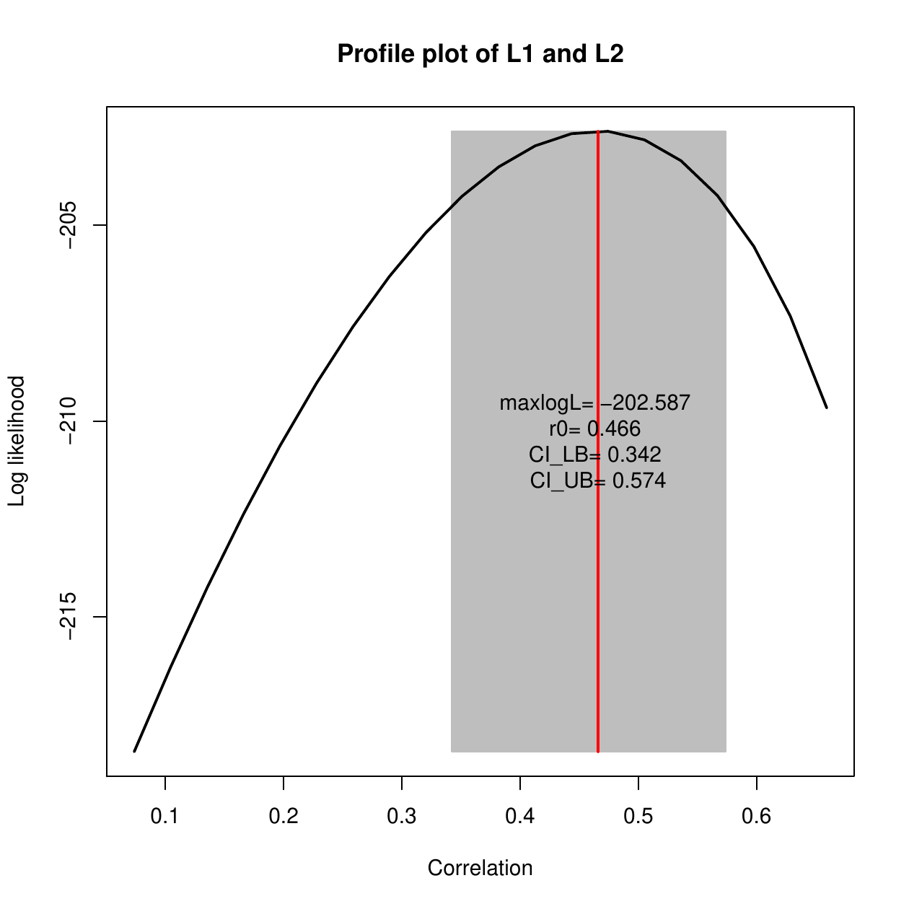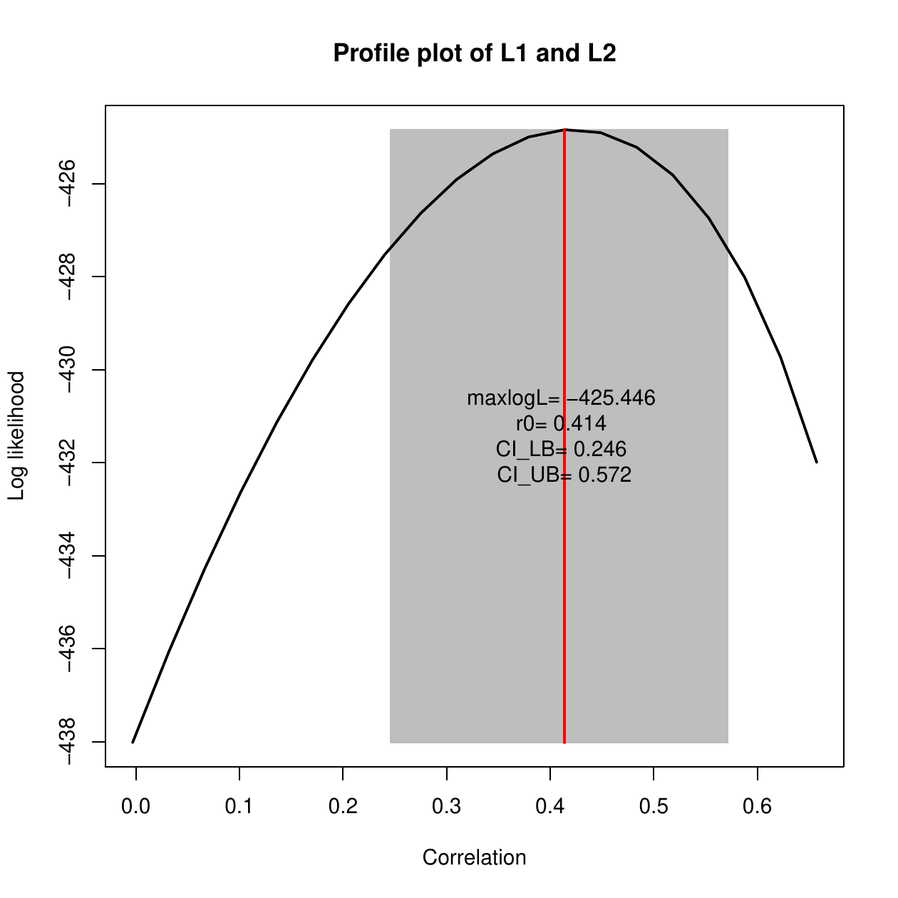</p>
<figcaption>Figure 2: Example of profile likelihood plots. Input data
are simulated from the bivariate normal distribution with true <span
class="math inline"><em>ρ</em><sub><em>X</em><em>Y</em></sub> = 0.5</span>.
The upper panel shows the profile likelihood using the bivariate normal
distribution; the lower panel shows the profile likelihood using the
bivariate <span
class="math inline"><em>t</em>−</span>distribution.</figcaption>
</figure>

The *clikcorr* main estimating function requires that the following
other [R]{.sans-serif} functions be loaded: the [R]{.sans-serif} package
[*mvtnorm*](https://CRAN.R-project.org/package=mvtnorm)
[@Genz:2009; @Genz:2012; @Hothorn:2013], as well as function "`optim`\",
and function "`integrate`\" when using the bivariate $t-$distribution.

# Simulation studies {#section3}

Extensive simulations have been done to demonstrate different aspects of
the performance of *clikcorr* under various settings of sample size,
percent censoring, and underlying distribution. We show these results in
the following subsections.

## Coverage probability of the confidence interval

First, we investigate the coverage probability of the confidence
intervals with two types of right censoring, termed "fixed point" and
"random", as described further below. Data were generated from the
bivariate normal distribution, and inference assumed the same
distribution.

In the fixed point right censoring setting, all observations were
censored at the same value. Different fixed points were calculated to
give expected censoring rates of $0\%$, $25\%$ and $75\%$. For the
random right censoring setting, values were censored at randomly
generated thresholds, which were generated from normal distributions
with means set at different values to produce data with specific
expected censoring proportions. Tables [4](#tab:CP1) and [5](#tab:CP2)
give the simulated coverage probabilities for different settings of
sample sizes and censoring rates. In the completely observed cases in
Table [4](#tab:CP1), coverage probabilities calculated using the Fisher
transformation rather than the profile likelihood approach are given in
parentheses for comparison.

It can be seen from Tables [4](#tab:CP1) and [5](#tab:CP2) that
*clikcorr* gives satisfying confidence interval coverage probabilities
in both the fixed and random censoring settings. In the completely
observed cases, coverage probabilities for both profile likelihood and
Fisher transformation based confidence intervals are very close to the
nominal level of $0.95$

## Run time, bias and mean squared error (MSE)

Table [6](#tab:CP3) shows the run time of *clikcorr* under different
settings of sample sizes and censoring proportion configurations, using
the bivariate normal distribution for both data generation and
inference. The censoring proportion configurations, for example
"$X 15\%, XY 15\%, Y 15\%$\" means that $15\%$ of the observations are
censored only for $X$, $15\%$ are censored for both $X$ and $Y$, and
$15\%$ are censored only for $Y$. It can be seen that longer run time is
needed for larger sample size, larger proportion with both $X$ and $Y$
being censored, or larger magnitude of the correlation. A typical run
time ranges from a few seconds to a few minutes.

For the bivariate $t$ distributions, the run time is generally slower
than for the bivariate normal distributions in the same setting. The
reason for this is that the bivariate $t$ setting requires numerical
integration to calculate the joint distribution over a 2-dimensional
domain as illustrated in (\@ref(eq:eqnbi-T-int)) in the case of either
$X$ or $Y$ censored, whereas the analogous calculation for the bivariate
normal setting has a closed form.

Table [7](#tab:CP4) shows the estimates of the bias and MSE for
inference on $\rho$ using the bivariate normal distribution for data
generation and inference, and with random right censoring. Essentially,
*clikcorr* provides an unbiased estimator of the correlation
coefficient.

## Gaussian versus Student t models

When the underlying marginal distributions are heavy tailed rather than
normal, basing inference on the bivariate normal can result in poor
confidence interval coverage probabilities. This is illustrated in Table
[8](#tab:CP5), where the data were generated from correlated marginal
$t$ distributions and the correlation coefficients were estimated using
the bivariate normal distribution. When the degrees of freedom of the
underlying marginal $t$ distributions are small ($\sim$ 3 to 5) or the
true underlying correlation coefficient is very high ($\sim 0.9$), the
confidence intervals have poor coverage probabilities ($\sim 60\%$ to
$80\%$).

The coverage probabilities within the parentheses in Table [8](#tab:CP5)
are for confidence intervals constructed using the bivariate $t$
distributions. Compared to inference based on the bivariate normal
distribution, using the bivariate $t$ distribution provides much better
coverage probabilities in settings with very heavy-tailed distributions
and high correlations.

The *clikcorr* package does not provide a way to test whether the data
are drawn from a heavy tailed distribution or not, nor does it estimate
the best value of d.f. to use. The users could refer to @Bryson:1978
[@Sidney:2007] or use QQ plots to guide their decision on which model to
use.

# Dioxin exposure datasets {#section4}

In this section, we used *clikcorr* to analyze two real world datasets
and compared the results to conventional approaches.

## Owl feather data

The first dataset was analyzed in [@Veerle_J:2013] which used an early
version of *clikcorr* to estimate correlations for left-censored (below
detection) data. The data contain Perfluorooctane sulfonate (PFOS)
substances in feathers and soft tissues (liver, muscle, adipose tissue
and preen glands) of barn owl road-kill victims collected in the
province of Antwerp, Belgium. Figure [3](#fig:owl) gives an example
scatter plot (upper panel) and an example plot of the profile log
likelihood of the correlation between PFOS in liver tissue and feathers
using *clikcorr*. Figure [4](#fig:ScatterMatrixOwl) shows the scatter
plot matrix across tail feather and the tissues generated by *clikcorr*.
The asymmetrical shape of the profile likelihood reflects the
asymmetrical sampling distribution, and leads to a confidence interval
that is longer to the left than to the right of the point estimate.

<figure id="fig:owl">
<p>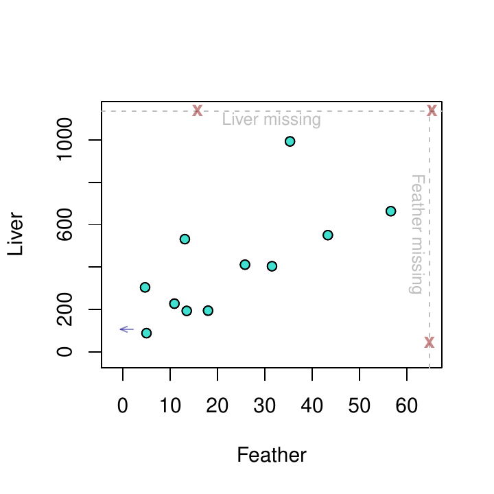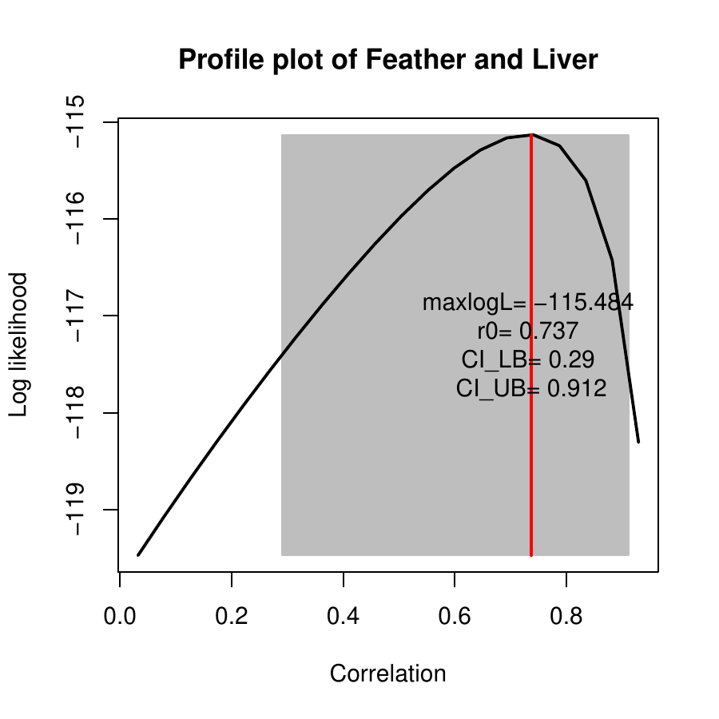</p>
<figcaption>Figure 3: Output graphics from analyzing the owl feather
data using <em>clikcorr</em>. Upper panel: scatter plot of PFOS in liver
tissue vs. feathers; Lower panel: profile log likelihood plot for the
correlation coefficient between PFOS concentration in liver and in
feathers.</figcaption>
</figure>

{#fig:ScatterMatrixOwl
width="100%" alt="graphic without alt text"}

## NHANES data

In the second analysis using *clikcorr*, we analyzed dioxin data from
the 2002-2003 National Health and Nutrition Examination Survey (NHANES).
NHANES is one of the most widely-used datasets describing the health and
nutritional status of people residing in the US. The data we analyzed
contained $22$ chemicals, including $7$ dioxins, $9$ furans and $6$
polychlorinated biphenyls (PCBs) across $1643$ individuals. Correlations
between these chemicals are common, and are of interest for several
reasons. First, dioxins with high correlations measured in the
environment may arise from the same or similar sources. In addition,
levels of two chemicals in the body that have high correlations may have
similar pathways for entering the body. For two chemicals with high
correlations, it may be sufficient to monitor one of them (to reduce
cost), as was the goal in Jaspers' barn owl example. Finally, exposure
to pairs of correlated chemicals may confound an investigation of health
effects, since distinguishing the individual effects of each chemical
would be difficult. Therefore estimating correlations between those
compounds is of scientific interest. The chemicals in our dioxin data
are all subject to detection limits, and have a wide range of percentage
of left-censored values. It is important to incorporate information from
partially observed cases in the data to provide accurate estimation and
inference results on the correlations between the compounds.

The pairwise correlation coefficients calculated from *clikcorr* are
given in upper-right triangle of Table [9](#tab:realdata_nhanes). For
each pair, the MLE of the correlation coefficient and associated LRT
$p$-value (in parentheses) are calculated assuming the bivariate normal
distribution. The highly correlated pairs (with estimated correlation
coefficient $\geq .80$) are in boldface type. Chemicals within each
group (dioxin, furan or PCB) tend to be more highly correlated than
chemicals from different groups. Abbreviated names of each chemical were
used in Table [9](#tab:realdata_nhanes). The full names and the detail
information about each chemical can be found at Agency for Toxic
Substances and Disease Registry (ATSDR)
(<http://www.atsdr.cdc.gov/substances>), which is part of the U.S.
Centers for Disease Control and Prevention. The chemical indices and
names are corresponding as following: for dioxind, d1=*TCDD*;
d2=*PeCDD*; d3=*HxCDD123478*; d4=*HxCDD123678*; d5=*HxCDD123789*;
d6=*HpCDD*; d7=*OCDD*. For furan, f1=*TCDF*; f2=*PeCDF12378*;
f3=*PeCDF23478*; f4=*HxCDF123478*; f5=*HxCDF123678*; f6=*HxCDF234678*;
f7=*HpCDF1234678*; f8=*HpCDF1234789*; f9=*OCDF*. For PCB, p1=*PCB105*;
p2=*PCB118*; p3=*PCB156*; p4=*PCB157*; p5=*PCB167*; p6=*PCB189*.
$p$-values less than $0.01$ are recoded as $0$'s in Table
[9](#tab:realdata_nhanes).

The pairs of chemicals with the highest correlation in each group are
shown in Figure [6](#fig:NHANES). Both the MLE of the correlation
coefficient calculated from *clikcorr* $\hat{\rho}_{clikcorr}$, and the
Pearson correlation coefficients calculated from only the complete cases
$\hat{\rho}_{complete}$, are given, along with the complete case sample
size, $n_{complete}$. When the proportion of pairs with censored values
is low, $\hat{\rho}_{clikcorr}$ and $\hat{\rho}_{complete}$ are very
similar; on the other hand, when the proportion of pairs with censored
values (in either or both variables) is high, the two correlation
coefficients are different since $\hat{\rho}_{clikcorr}$ can utilize the
extra information from the censored data.

Some chemicals in the dataset appear to have highly skewed marginal
distributions. It is common to apply a symmetrization transformation in
such a setting. The correlation coefficient between transformed values
estimates a different population parameter, but this parameter may be of
as much or greater inference than the correlation computed on the
original scale. To demonstrate the effect of such a transformation, we
log-transformed the data for each chemical and recalculated the
correlation coefficient using the bivariate normal model. The estimation
and inference results from the transformed data are given in the
lower-left triangle in Table [9](#tab:realdata_nhanes).

Using the bivariate normal model for transformed data is an example of
using bivariate Gaussian copulas to allow a wide range of distributions
to be analyzed using software developed for Gaussian models. A general
approach of this type would be to transform $X$ using
$F^{-1}\circ \hat{F}_x$, where $\hat{F}_x$ is the empirical CDF of $X$
and $F$ is the standard Gaussian CDF ($Y$ would be transformed
analogously). This approach is quiet flexible, and would allow
*clikcorr* to be used for correlation parameter inference in a wide
range of settings. One limitation of this approach is that the marginal
transformations are estimated from the data, but the uncertainty in this
estimation is not propagated through to the estimation of the
correlation parameter. This would mainly be a concern with small
datasets.

Figure [5](#fig:logNolog) demonstrates the difference between using data
on the original and the log-transformed scales. When the observed
marginal distributions are highly skewed, assuming a bivariate normal
true distribution could lead to false results. For example, the
correlation effect could be leveraged away by the "outlier\" points on
tail of either marginal distributions. As in Figure [5](#fig:logNolog)
(c), the original values between chemicals *OCDD*(d7) and *HxCDF234678*
(f6) were not significantly correlated due to the divergent effect of
the points on the marginal tails. While after the log transformation,
the marginal sample distributions are more normally shaped and thus make
the bivariate normal assumption more likely to be true, and the two
chemicals are significantly correlated with a moderate correlation
coefficient.

# Further details on *clikcorr* {#section5}

This section gives technical details regarding function maximization and
gives some examples of additional plotting options.

We note that *clikcorr* depends on the [R]{.sans-serif} function
`optim`, which is used to find the maximum of the log likelihood, or
profile log likelihood. For some starting values of $\mu_X$, $\mu_Y$,
$\sigma_X$, $\sigma_Y$ and $\rho_{XY}$, the procedure gives an error
message "`function cannot be evaluated at initial parameters`\". In such
cases, manually adjusting the initial parameter values is recommended.

Figure [7](#fig:statValue) illustrates two example profile log
likelihood functions for parameters of the bivariate distribution of
PFOS in Tail feather and Adipose tissue in the owl feather dataset. Each
plot shows the log likelihood for certain parameters with the other
parameters fixed. In the upper panel, the log likelihood of
$(\log(\sigma_X^2), \log(\sigma_Y^2))$ remains at $-\infty$ over the
lower left triangular region of the plot. So if the starting values of
$\sigma_X$ and $\sigma_Y$ are set such that the pair
$(\log(\sigma_X^2), \log(\sigma_Y^2))$ falls in that region, then the
value of the joint log likelihood will be trapped in the region and the
above error message will show up. In the lower panel graph, the log
likelihood of the covariance drops steeply when the covariance parameter
value is greater than $2000$. Therefore, if the starting value of
$\rho_{XY}$ is set such that the starting covariance is much larger than
$2000$, say $5000$, then the profile log likelihood might underflow the
limit of a floating number adopted in the "`optim`\" function and give
the above error message.

It is worth the effort to make the input starting parameter values as
close to the true parameters as possible, if these are known. By
default, *clikcorr* uses the sample means, the log transform of sample
variances and the sample correlation based on the complete observations
as the starting values. It also allows the user to specify the starting
values and pass them to the "`optim`\" function by using the option
`sv`. This option is especially useful when the number of exact
observations is small. For example, if a dataset contains only one
complete observation, then the starting values of
$(\log(\sigma_X^2), \log(\sigma_Y^2))$ can not be effectively estimated
(both will be estimated as $-\infty$). In such cases, it is suggested
that users make their own reasonable guesses on the starting parameter
values rather than using the default. An example is given in the
following syntax:

``` r
R> clikcorr(owlData, "feather_L", "feather_U", "AT_L", "AT_U", cp=.95, dist=t, 
   + df=5, sv=c(23, 240, 6, 1300, 12))
```

The default optimization method for searching for the MLE in *clikcorr*
is the default method used in "`optim`\", which is the Nelder-Mead
method [@optim]. *clikcorr* also allows the user to use other
optimization methods implemented in "`optim`\" or use the non-linear
minimization function "`nlm`\" [@nlm]. For example:

``` r
R> clikcorr(owlData, "feather_L", "feather_U", "AT_L", "AT_U", cp=.95, dist="t", 
   + df=3, method="BFGS")
R> clikcorr(owlData, "feather_L", "feather_U", "AT_L", "AT_U", cp=.95, dist="t", 
   + df=3, nlm=TRUE)
```

We note here that the default optimization method in "`optim`\" function
does not use derivative (or gradient) information but rather does a
greedy simplex search on the function values, which makes it work
relatively slowly. In future work, we plan to implement some independent
gradient-directed types of optimization algorithms into *clikcorr* to
hasten the convergence speed. It would be especially helpful in
searching for the confidence interval bounds of the correlation
coefficient.

*clikcorr* also allows [R]{.sans-serif} plotting options such as
"xlab\", "xlim\", "bg\" etc., in the "`splot`\" and "`plot`\" functions.
For example, in Figure [6](#fig:NHANES) the individual panels are
generated respectively by

``` r
R> splot2(NHANESD, "t1_TCDD", "t2_TCDD", "t1_PeCDD", "t2_PeCDD", xlab="d1=TCDD", 
   + ylab="d2=PeCDD", bg="#FFB90F", cex.lab=2.0)
   
R> splot2(NHANESD, "t1_HxCDF_123478", "t2_HxCDF_123478", "t1_HxCDF_123678",
   + "t2_HxCDF_123678", xlab="f4=HxCDF123478", ylab="f5=HxCDF123678", bg="#FFB90F", 
   + cex.lab=2.0)
   
R> splot2(NHANESD, "t1_PCB_156", "t2_PCB_156", "t1_PCB_157", "t2_PCB_157", 
   + xlab="p3=PCB156", ylab="p4=PCB157", bg="#FFB90F", cex.lab=2.0)
   
R> splot2(NHANESD, "t1_PCB_105", "t2_PCB_105", "t1_PCB_118", "t2_PCB_118", 
   + xlab="p1=PCB105", ylab="p2=PCB106", bg="#FFB90F", cex.lab=2.0).
```

<figure id="fig:logNolog">
<p>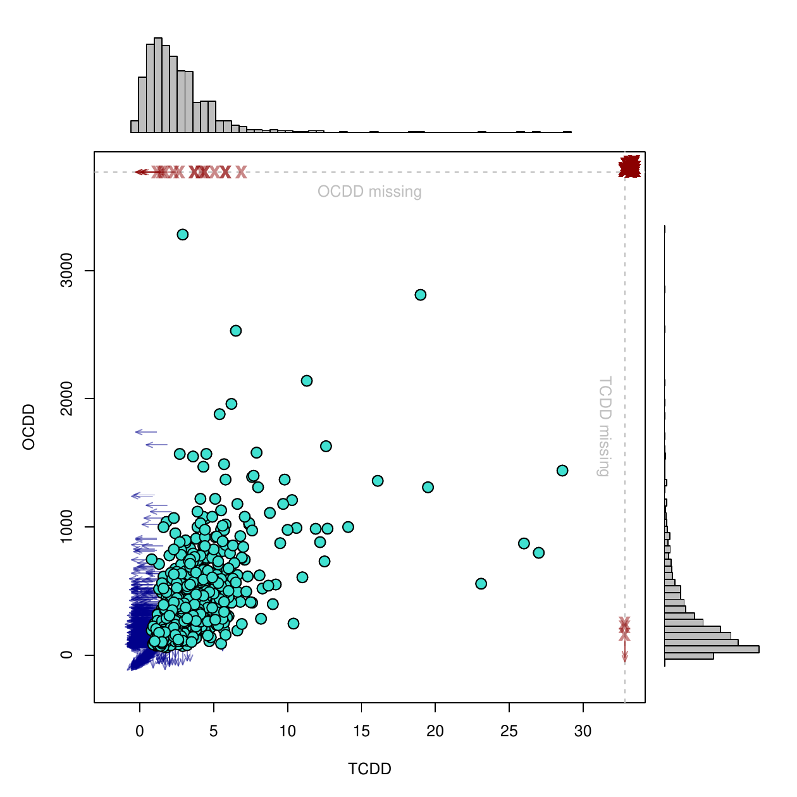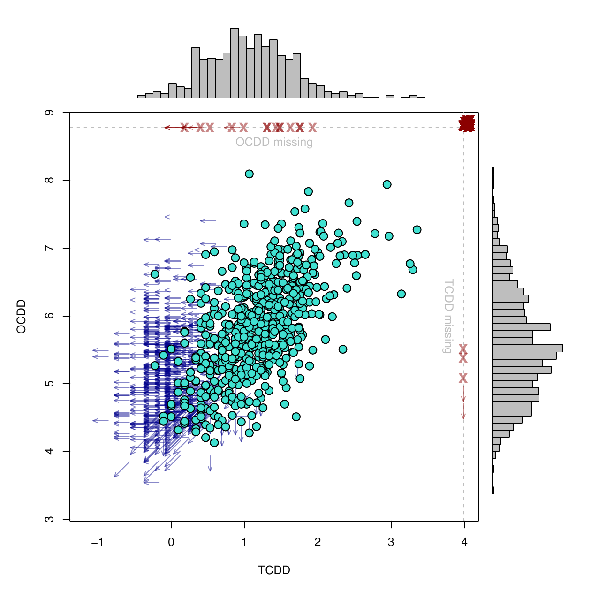<br />
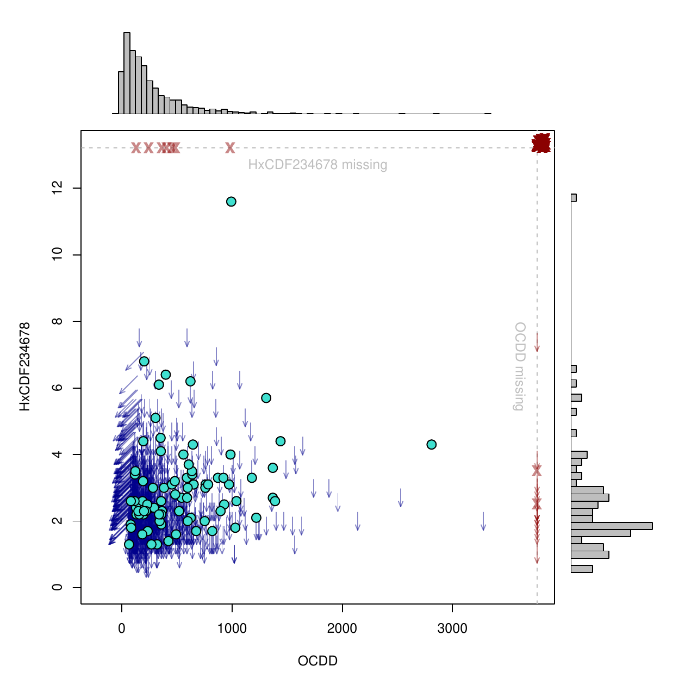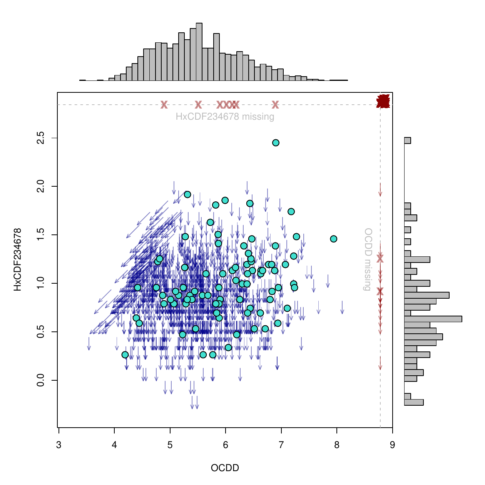<br />
</p>
<figcaption>Figure 5: Example scatter plots between compound pairs with
and without log transformation. Between <em>TCDD</em>(d1) and
<em>ODD</em>(d7): (a) d1-d7 without log transformation, <span
class="math inline"><em>ρ̂</em> = 0.22</span>, <span
class="math inline"><em>p</em> ≈ 0</span>; (b) d1-d7 with log
transformation, <span class="math inline"><em>ρ̂</em> = 0.60</span>,
<span class="math inline"><em>p</em> ≈ 0</span>. Between
<em>OCDD</em>(d7) and <em>HxCDF234678</em>(f6): (c) d7-f6 without log
transformation, <span class="math inline"><em>ρ̂</em> =  − 0.05</span>,
<span class="math inline"><em>p</em> ≈ 1</span>; (d) d7-f6 with log
transformation, <span class="math inline"><em>ρ̂</em> = 0.38</span>,
<span class="math inline"><em>p</em> ≈ 0</span>. The histograms on top
and right of each plot are marginal sample distributions from observed
data.</figcaption>
</figure>

::: {#tab:CP1}
  ---------------------------------------------------------------------------------------------------------------------------------------------------------------
  Sample size    0% Censoring rate                               25% Censoring rate                               75% Censoring rate                
  ------------- ------------------- ------------- ------------- -------------------- ------------- ------------- -------------------- ------------- -------------
                    $\rho=0.00$      $\rho=0.50$   $\rho=0.95$      $\rho=0.00$       $\rho=0.50$   $\rho=0.95$      $\rho=0.00$       $\rho=0.50$   $\rho=0.95$

  n=50                 0.938            0.962         0.946            0.938             0.946         0.968            0.958             0.954         0.956

                      (0.956)          (0.968)       (0.954)             --               --            --                --               --            --

  n=200                0.944            0.948         0.942            0.954             0.960         0.948            0.972             0.964         0.960

                      (0.948)          (0.954)       (0.950)             --               --            --                --               --            --

  n=500                0.932            0.934         0.952            0.946             0.948         0.964            0.952             0.944         0.964

                      (0.938)          (0.948)       (0.954)             --               --            --                --               --            --
  ---------------------------------------------------------------------------------------------------------------------------------------------------------------

  : Table 4: 95% confidence interval coverage probabilities for
  bivariate normal data with fixed point censoring. Coverage
  probabilities are estimated from 500 replications. The Binomial random
  error is about $\pm$`<!-- -->`{=html}0.01. Coverage probabilities in
  parentheses are calculated from Fisher transformation in the case of
  no censors. Data generated from the standard normal distribution with
  left censoring at $25\%$ and $75\%$ percentiles.
:::

::: {#tab:CP2}
  ------------- --------------------------------------- ------------- ------------- --------------------------------------- ------------- ------------- --------------------------------------- ------------- -------------
  Sample size       Censoring distribution=N(-2,1)                                       Censoring distribution=N(0,1)                                       Censoring distribution=N(2,1)                    

                 Average censoring rate $\approx 0.25$                               Average censoring rate $\approx 0.50$                               Average censoring rate $\approx 0.75$                

                              $\rho=0.00$                $\rho=0.50$   $\rho=0.95$                $\rho=0.00$                $\rho=0.50$   $\rho=0.95$                $\rho=0.00$                $\rho=0.50$   $\rho=0.95$

  n=50                           0.934                      0.936         0.942                      0.908                      0.946         0.958                       --                         --            --

  n=200                          0.958                      0.968         0.948                      0.942                      0.962         0.958                      0.942                      0.946         0.930

  n=500                          0.946                      0.948         0.956                      0.944                      0.945         0.954                      0.947                      0.938         0.962
  ------------- --------------------------------------- ------------- ------------- --------------------------------------- ------------- ------------- --------------------------------------- ------------- -------------

  : Table 5: 95% confidence interval coverage probabilities for
  bivariate normal data with random censoring. Coverage probabilities
  are estimated from 500 replications. The Binomial random error is
  about $\pm$`<!-- -->`{=html}0.01. "--\" means insufficient data for
  estimation.
:::

::: {#tab:CP3}
  ---------------------------------------------------------------------------------------------------------------------------------------------------------------------------------------
  Sample size    Censoring proportion configuration                                                                                                                         
  ------------- ------------------------------------ ------------- ------------- ------------------------ ------------- ------------- ----------------------- ------------- -------------
                        (X 0%; XY 30%; Y 0%)                                      (X 15%; XY 15%; Y 15%)                               (X 30%; XY 0%; Y 30%)                

                            $\rho=0.00$               $\rho=0.50$   $\rho=0.95$        $\rho=0.00$         $\rho=0.50$   $\rho=0.95$        $\rho=0.00$        $\rho=0.50$   $\rho=0.95$

  n=50                           36                       50            59                  22                 25            32                 1.2                1.4           1.8

  n=200                         166                       206           233                 89                 103           110                1.5                2.1           2.2

  n=500                         267                       515           728                176                 275           374                1.8                2.4           3.5
  ---------------------------------------------------------------------------------------------------------------------------------------------------------------------------------------

  : Table 6: Mean run time (sec.) for different settings of true
  correlations, sample sizes and censoring percentages. Mean time are
  estimated from 500 replications. Data are simulated from the standard
  bivariate normal distribution.
:::

::: {#tab:CP4}
  ------------- --------------------------------------- ------------- ------------- --------------------------------------- ------------- ------------- --------------------------------------- ------------- -------------
  Sample size       Censoring distribution=N(-2,1)                                       Censoring distribution=N(0,1)                                       Censoring distribution=N(2,1)                    

                 Average censoring rate $\approx 0.25$                               Average censoring rate $\approx 0.50$                               Average censoring rate $\approx 0.75$                

                              $\rho=0.00$                $\rho=0.50$   $\rho=0.95$                $\rho=0.00$                $\rho=0.50$   $\rho=0.95$                $\rho=0.00$                $\rho=0.50$   $\rho=0.95$

  n=50                           0.006                     -0.021        -0.018                      0.031                      0.007         0.008                       --                         --            --

                                (0.019)                    (0.030)       (0.053)                    (0.035)                    (0.064)       (0.076)                     (--)                       (--)          (--)

  n=200                         -0.005                     -0.005        -0.026                      0.020                      0.003        -0.037                     -0.017                      0.053         0.021

                                (0.008)                    (0.012)       (0.014)                    (0.012)                    (0.010)       (0.014)                    (0.024)                    (0.034)       (0.029)

  n=500                          0.005                     -0.008        -0.002                      0.008                     -0.001        -0.010                     -0.006                     -0.018        -0.010

                                (0.002)                    (0.003)       (0.005)                    (0.003)                    (0.006)       (0.007)                    (0.010)                    (0.009)       (0.013)
  ------------- --------------------------------------- ------------- ------------- --------------------------------------- ------------- ------------- --------------------------------------- ------------- -------------

  : Table 7: Bias (mean squared error) for bivariate normal data. Bias
  and MSE are estimated from 50 replications. "--\" means insufficient
  data for estimation.
:::

::: {#tab:CP5}
  ---------------------------------------------------------------------------------------------------------------------------------------------------------------------
  Degree of freedom    Sample size $=50$                               Sample size $=200$                               Sample size $=500$                
  ------------------- ------------------- ------------- ------------- -------------------- ------------- ------------- -------------------- ------------- -------------
                          $\rho=0.00$      $\rho=0.50$   $\rho=0.95$      $\rho=0.00$       $\rho=0.50$   $\rho=0.95$      $\rho=0.00$       $\rho=0.50$   $\rho=0.95$

  df=3                       0.95             0.81          0.69              0.96             0.76          0.55              0.96             0.70          0.54

                                             (0.93)        (0.93)                             (0.97)        (0.97)                             (0.95)        (0.96)

  df=5                       0.95             0.91          0.86              0.94             0.86          0.81              0.96             0.88          0.76

                                             (0.97)        (0.95)                             (0.96)        (0.95)                             (0.97)        (0.95)

  df=10                      0.94             0.93          0.89              0.93             0.96          0.89              0.95             0.94          0.91

                                                           (0.93)                                           (0.94)                                           (0.94)

  df=20                      0.95             0.92          0.93              0.94             0.94          0.92              0.96             0.94          0.94
  ---------------------------------------------------------------------------------------------------------------------------------------------------------------------

  : Table 8: 95% confidence interval coverage probabilities on bivariate
  t generated data. Coverage probabilities are estimated from 500
  replications. The Binomial random error is about
  $\pm$`<!-- -->`{=html}0.01. For each df setting, the coverage
  probabilities on the first line are from inference based on the
  bivariate Normal distribution and the coverage probabilities in
  parenthesis on the second line are from inference based on the
  bivariate $t-$distribution. The latter are only given when the
  coverage probability from using the bivariate normal is $\leq 0.91$.
:::

<figure id="fig:NHANES">
<table>
<caption> </caption>
<tbody>
<tr class="odd">
<td style="text-align: center;">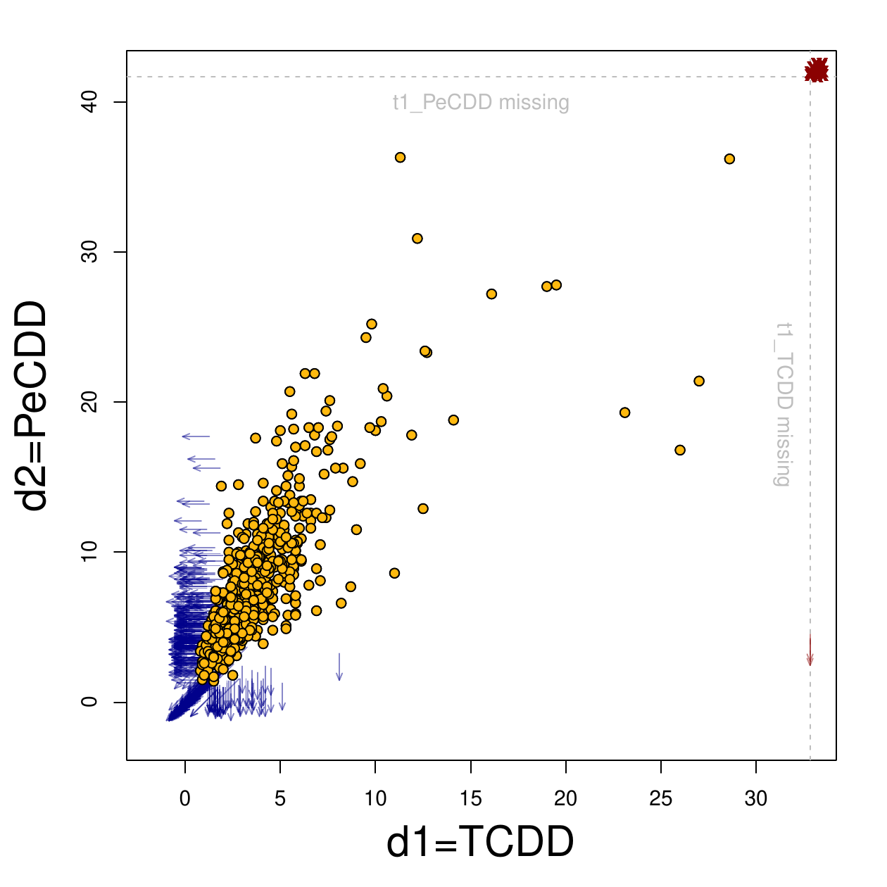</td>
<td style="text-align: center;">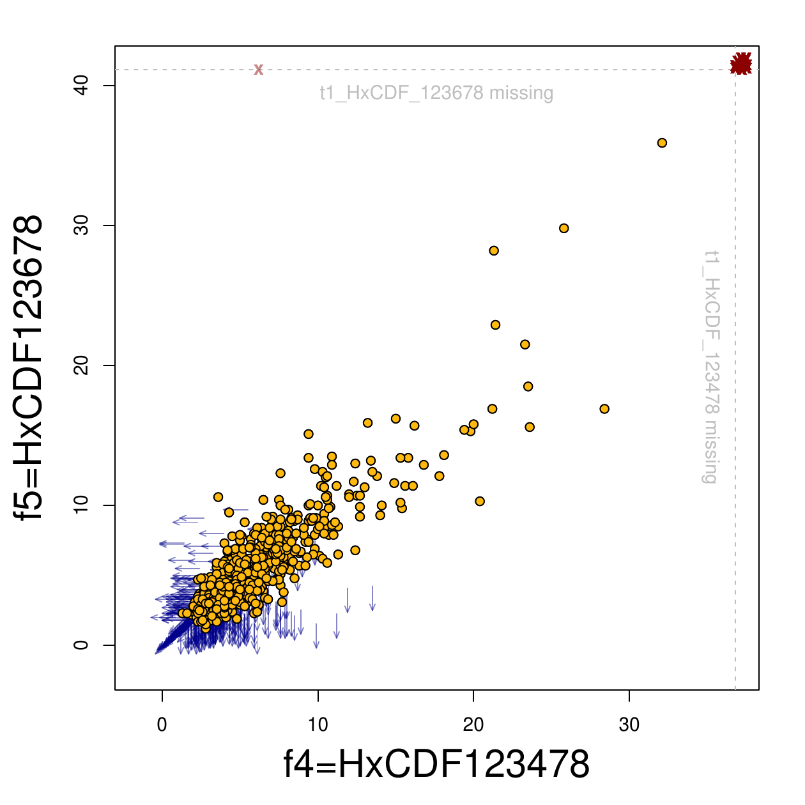</td>
</tr>
<tr class="even">
<td style="text-align: center;">(a) d1 vs. d2: <span
class="math inline"><em>ρ̂</em><sub><em>c</em><em>l</em><em>i</em><em>k</em><em>c</em><em>o</em><em>r</em><em>r</em></sub> = 0.81</span>,
<span
class="math inline"><em>ρ̂</em><sub><em>c</em><em>o</em><em>m</em><em>p</em><em>l</em><em>e</em><em>t</em><em>e</em></sub> = 0.77</span>,
<span
class="math inline"><em>n</em><sub><em>c</em><em>o</em><em>m</em><em>p</em><em>l</em><em>e</em><em>t</em><em>e</em></sub> = 585</span></td>
<td style="text-align: center;">(b) f4 vs. f5: <span
class="math inline"><em>ρ̂</em><sub><em>c</em><em>l</em><em>i</em><em>k</em><em>c</em><em>o</em><em>r</em><em>r</em></sub> = 0.85</span>,
<span
class="math inline"><em>ρ̂</em><sub><em>c</em><em>o</em><em>m</em><em>p</em><em>l</em><em>e</em><em>t</em><em>e</em></sub> = 0.89</span>,
<span
class="math inline"><em>n</em><sub><em>c</em><em>o</em><em>m</em><em>p</em><em>l</em><em>e</em><em>t</em><em>e</em></sub> = 717</span></td>
</tr>
<tr class="odd">
<td style="text-align: center;">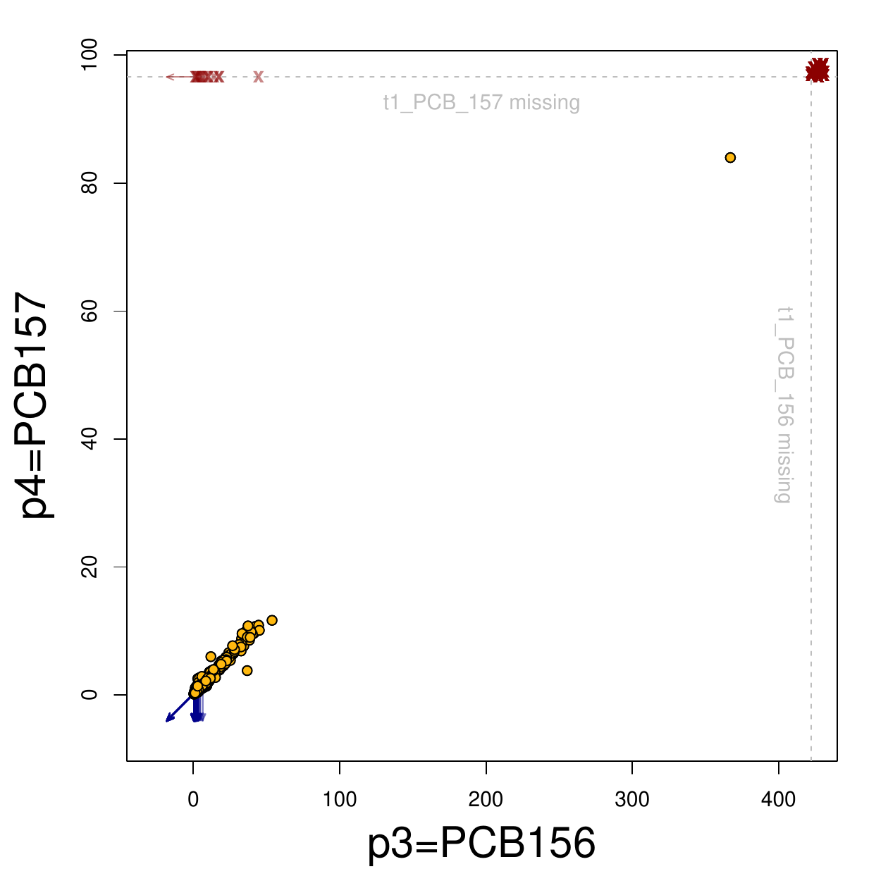</td>
<td style="text-align: center;">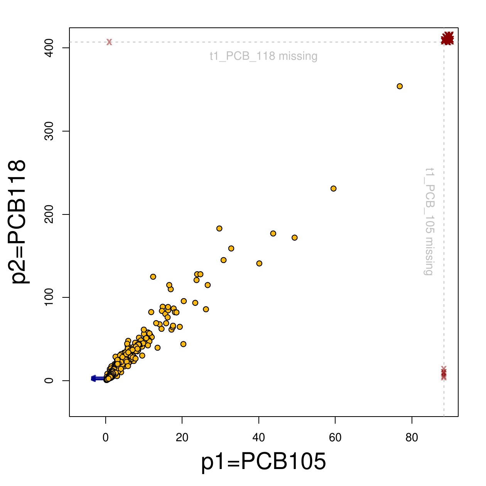</td>
</tr>
<tr class="even">
<td style="text-align: center;">(c) p3 vs. p4: <span
class="math inline"><em>ρ̂</em><sub><em>c</em><em>l</em><em>i</em><em>k</em><em>c</em><em>o</em><em>r</em><em>r</em></sub> = 0.99</span>,
<span
class="math inline"><em>ρ̂</em><sub><em>c</em><em>o</em><em>m</em><em>p</em><em>l</em><em>e</em><em>t</em><em>e</em></sub> = 0.99</span>,
<span
class="math inline"><em>n</em><sub><em>c</em><em>o</em><em>m</em><em>p</em><em>l</em><em>e</em><em>t</em><em>e</em></sub> = 1048</span></td>
<td style="text-align: center;">(d) p1 vs. p2: <span
class="math inline"><em>ρ̂</em> = 0.97</span>, <span
class="math inline"><em>ρ̂</em><sub><em>c</em><em>o</em><em>m</em><em>p</em><em>l</em><em>e</em><em>t</em><em>e</em></sub> = 0.97</span>,
<span
class="math inline"><em>n</em><sub><em>c</em><em>o</em><em>m</em><em>p</em><em>l</em><em>e</em><em>t</em><em>e</em></sub> = 1340</span></td>
</tr>
</tbody>
</table>
<figcaption>Figure 6: Scatter plots of the most highly correlated
chemical pairs in each of the dioxin, furan and PCB groups in the NHANES
data.</figcaption>
</figure>

::: {#tab:realdata_nhanes}
  -------------------------------------------------------------------------------------------------------------------------------------------------------------------------------------------------------------------------------------------------------------------------------------------------------------------------------------------------------------------------------------------------------------------------------------------------------------------------------------------------------------------------------------------------------------------------------------------------------------------------------------------------------------------------------------------
               Chemical index                                                                                                                                                                                                                                                                                                                                                                                                                                                                                                                                                                                                                                                         
  ---- ------------------------------ ------------------------------ -------------------------------- ------------------------------ ------------------------------ ------------------------------ ------------------------------ ------------------------------ ------------------------------ ------------------------------ ------------------------------ ------------------------------ ------------------------------ ------------------------------ ------------------------------ ------------------------------ -------------------------------- ---------------------------- -------------------------------- -------------------------------- ---------------------------- -------
                     d1                             d2                              d3                              d4                             d5                             d6                             d7                             f1                             f2                             f3                             f4                             f5                             f6                             f7                             f8                             f9                              p1                             p2                             p3                               p4                             p5                p6

   d1                --                          **.81**                           .68                             .67                            .61                            .50                            .22                            .22                            .30                            .66                            .65                            .62                            .36                            .08                            .05                            .01                             .44                            .47                            .30                              .39                            .57                .36

                     --                           \(0\)                           \(0\)                           \(0\)                          \(0\)                          \(0\)                          \(0\)                          \(0\)                          \(1\)                          \(0\)                          \(0\)                          \(0\)                          \(0\)                          (.01)                          (.46)                          (.82)                           \(0\)                          \(0\)                          \(0\)                            \(0\)                          \(0\)              \(0\)

   d2    [.79]{style="color: blue"}                 --                             .78                           **.80**                          .70                            .52                            .56                            .46                            .29                            .73                            .71                            .71                            .40                            .10                            .08                            .03                             .42                            .47                            .36                              .49                            .61                .38

         [(0)]{style="color: blue"}                 --                            \(0\)                           \(0\)                          \(0\)                          \(0\)                          \(0\)                          \(0\)                          (.01)                          \(0\)                          \(0\)                          \(0\)                          \(0\)                          \(0\)                          (.17)                          (.45)                           \(0\)                          \(0\)                          \(0\)                            \(0\)                          \(0\)              \(0\)

   d3    [.69]{style="color: blue"}     [.79]{style="color: blue"}                  --                             .71                            .75                            .58                            .50                            .19                            .19                            .60                            .62                            .61                            .41                            .07                            .13                            .08                             .32                            .35                            .32                              .36                            .49                .39

         [(0)]{style="color: blue"}     [(0)]{style="color: blue"}                  --                            \(0\)                          \(0\)                          \(0\)                          \(1\)                          \(0\)                          (.02)                          \(0\)                          \(0\)                          \(0\)                          \(0\)                          (.01)                          (.18)                          \(1\)                           \(0\)                          \(0\)                          \(0\)                            \(0\)                          \(0\)              \(0\)

   d4    [.65]{style="color: blue"}     [.73]{style="color: blue"}    [**.83**]{style="color: blue"}                --                            .66                            .58                            .69                            .15                            .13                            .75                            .79                            .77                            .36                            .13                            .05                            .00                             .40                            .46                            .46                              .51                            .60                .39

         [(0)]{style="color: blue"}     [(0)]{style="color: blue"}      [(0)]{style="color: blue"}                  --                           \(0\)                          \(0\)                          \(0\)                          (.01)                          \(1\)                          \(0\)                          \(0\)                          \(0\)                          \(0\)                          \(0\)                          \(1\)                          \(1\)                           \(0\)                          \(0\)                          \(0\)                            \(0\)                          \(0\)              \(0\)

   d5    [.60]{style="color: blue"}     [.66]{style="color: blue"}      [.75]{style="color: blue"}      [.74]{style="color: blue"}                 --                            .55                            .73                            .30                            .50                            .56                            .60                            .63                            .47                            .13                            .42                            .18                             .32                            .34                            .24                              .28                            .42                .27

         [(0)]{style="color: blue"}     [(0)]{style="color: blue"}      [(0)]{style="color: blue"}      [(0)]{style="color: blue"}                 --                           \(0\)                          \(0\)                          \(0\)                          \(1\)                          \(0\)                          \(0\)                          \(0\)                          \(0\)                          \(0\)                          \(1\)                          \(1\)                           \(0\)                          \(0\)                          \(0\)                            \(0\)                          \(0\)              \(0\)

   d6    [.54]{style="color: blue"}     [.49]{style="color: blue"}      [.65]{style="color: blue"}      [.56]{style="color: blue"}     [.59]{style="color: blue"}                 --                            .76                            .14                            .15                            .45                            .57                            .51                            .31                            .15                            .12                            .06                             .39                            .41                            .22                              .26                            .41                .21

         [(0)]{style="color: blue"}     [(0)]{style="color: blue"}      [(0)]{style="color: blue"}      [(0)]{style="color: blue"}     [(0)]{style="color: blue"}                 --                           \(0\)                          (.08)                          \(1\)                          \(0\)                          \(0\)                          \(0\)                          \(0\)                          \(0\)                          \(1\)                          \(1\)                           \(0\)                          \(0\)                          \(0\)                            \(0\)                          \(0\)              \(0\)

   d7    [.60]{style="color: blue"}     [.58]{style="color: blue"}      [.69]{style="color: blue"}      [.66]{style="color: blue"}     [.65]{style="color: blue"}     [.77]{style="color: blue"}                 --                            .19                            .33                            .59                            .70                            .60                            -.05                           .14                            -.53                           .03                             .38                            .41                            .28                              .36                            .56                .25

         [(0)]{style="color: blue"}     [(0)]{style="color: blue"}      [(0)]{style="color: blue"}      [(0)]{style="color: blue"}     [(0)]{style="color: blue"}     [(0)]{style="color: blue"}                 --                           (.01)                          \(1\)                          \(0\)                          \(0\)                          \(0\)                          \(1\)                          \(0\)                          \(1\)                          (.61)                           \(0\)                          \(0\)                          \(0\)                            \(0\)                          \(0\)              \(0\)

   f1    [.29]{style="color: blue"}     [.45]{style="color: blue"}      [.20]{style="color: blue"}      [.23]{style="color: blue"}     [.35]{style="color: blue"}     [.19]{style="color: blue"}     [.24]{style="color: blue"}                 --                          **.83**                          .37                            .33                            .36                            .76                            -.04                           -.27                           .24                             .15                            .15                            .09                              .10                            .19                .61

         [(0)]{style="color: blue"}     [(0)]{style="color: blue"}      [(0)]{style="color: blue"}      [(0)]{style="color: blue"}     [(0)]{style="color: blue"}     [(0)]{style="color: blue"}     [(0)]{style="color: blue"}                 --                           \(0\)                          \(0\)                          \(0\)                          \(0\)                          \(0\)                          (.39)                          \(1\)                          \(1\)                           \(0\)                          \(0\)                          (.34)                            (.05)                          \(0\)              \(1\)

   f2    [.22]{style="color: blue"}     [.20]{style="color: blue"}      [.16]{style="color: blue"}     [-.01]{style="color: blue"}     [.21]{style="color: blue"}     [.17]{style="color: blue"}     [.20]{style="color: blue"}     [.76]{style="color: blue"}                 --                            .46                            .36                            .43                          **.82**                          .06                            .46                            .21                             .09                            .08                            .05                              .07                            .11                .57

         [(0)]{style="color: blue"}     [(0)]{style="color: blue"}     [(.05)]{style="color: blue"}     [(1)]{style="color: blue"}    [(.02)]{style="color: blue"}   [(.04)]{style="color: blue"}   [(.02)]{style="color: blue"}    [(0)]{style="color: blue"}                 --                           \(0\)                          \(0\)                          \(0\)                          \(0\)                          (.50)                          (.04)                          \(1\)                           (.12)                          (.16)                          (.44)                            (.19)                          (.09)              \(1\)

   f3    [.67]{style="color: blue"}     [.69]{style="color: blue"}      [.70]{style="color: blue"}      [.74]{style="color: blue"}     [.62]{style="color: blue"}     [.47]{style="color: blue"}     [.59]{style="color: blue"}     [.52]{style="color: blue"}     [.55]{style="color: blue"}                 --                            .78                          **.81**                          .53                            .12                            .05                            .02                             .49                            .54                            .45                              .51                            .65                .38

         [(0)]{style="color: blue"}     [(0)]{style="color: blue"}      [(0)]{style="color: blue"}      [(0)]{style="color: blue"}     [(0)]{style="color: blue"}     [(0)]{style="color: blue"}     [(0)]{style="color: blue"}     [(0)]{style="color: blue"}     [(0)]{style="color: blue"}                 --                           \(0\)                          \(0\)                          \(0\)                          \(0\)                          (.48)                          \(1\)                           \(0\)                          \(0\)                          \(0\)                            \(0\)                          \(0\)              \(0\)

   f4    [.63]{style="color: blue"}     [.62]{style="color: blue"}      [.67]{style="color: blue"}      [.74]{style="color: blue"}     [.61]{style="color: blue"}     [.57]{style="color: blue"}     [.67]{style="color: blue"}     [.34]{style="color: blue"}     [.41]{style="color: blue"}     [.73]{style="color: blue"}                 --                          **.85**                          .50                            .18                            -.07                           .03                             .44                            .48                            .34                              .41                            .56                .31

         [(0)]{style="color: blue"}     [(0)]{style="color: blue"}      [(0)]{style="color: blue"}      [(0)]{style="color: blue"}     [(0)]{style="color: blue"}     [(0)]{style="color: blue"}     [(0)]{style="color: blue"}     [(0)]{style="color: blue"}     [(0)]{style="color: blue"}     [(0)]{style="color: blue"}                 --                           \(0\)                          \(0\)                          \(0\)                          (.30)                          \(1\)                           \(0\)                          \(0\)                          \(0\)                            \(0\)                          \(0\)              \(0\)

   f5    [.62]{style="color: blue"}     [.67]{style="color: blue"}      [.66]{style="color: blue"}      [.75]{style="color: blue"}     [.65]{style="color: blue"}     [.55]{style="color: blue"}     [.62]{style="color: blue"}     [.42]{style="color: blue"}     [.49]{style="color: blue"}     [.77]{style="color: blue"}     [.79]{style="color: blue"}                 --                            .58                            .18                            .001                           .14                             .38                            .42                            .34                              .40                            .51                .29

         [(0)]{style="color: blue"}     [(0)]{style="color: blue"}      [(0)]{style="color: blue"}      [(0)]{style="color: blue"}     [(0)]{style="color: blue"}     [(0)]{style="color: blue"}     [(0)]{style="color: blue"}     [(0)]{style="color: blue"}     [(0)]{style="color: blue"}     [(0)]{style="color: blue"}     [(0)]{style="color: blue"}                 --                           \(0\)                          \(0\)                          (.99)                          \(1\)                           \(0\)                          \(0\)                          \(0\)                            \(0\)                          \(0\)              \(0\)

   f6    [.39]{style="color: blue"}     [.42]{style="color: blue"}      [.43]{style="color: blue"}      [.52]{style="color: blue"}     [.53]{style="color: blue"}     [.48]{style="color: blue"}     [.38]{style="color: blue"}     [.53]{style="color: blue"}     [.78]{style="color: blue"}     [.62]{style="color: blue"}     [.59]{style="color: blue"}     [.67]{style="color: blue"}                 --                            .12                            .23                            .36                             .19                            .33                            .11                              .13                            .23                .26

         [(0)]{style="color: blue"}     [(0)]{style="color: blue"}      [(0)]{style="color: blue"}      [(0)]{style="color: blue"}     [(0)]{style="color: blue"}     [(0)]{style="color: blue"}     [(0)]{style="color: blue"}     [(0)]{style="color: blue"}     [(0)]{style="color: blue"}     [(0)]{style="color: blue"}     [(0)]{style="color: blue"}     [(0)]{style="color: blue"}                 --                           \(0\)                          (.02)                          \(1\)                           \(0\)                          \(1\)                          \(0\)                            \(0\)                          \(0\)              \(0\)

   f7    [.18]{style="color: blue"}     [.20]{style="color: blue"}      [.27]{style="color: blue"}      [.30]{style="color: blue"}     [.34]{style="color: blue"}     [.28]{style="color: blue"}     [.31]{style="color: blue"}     [.21]{style="color: blue"}     [.19]{style="color: blue"}     [.26]{style="color: blue"}     [.39]{style="color: blue"}     [.42]{style="color: blue"}     [.38]{style="color: blue"}                 --                             0                             .13                             .06                            .06                            .05                              .05                            .06                .04

         [(0)]{style="color: blue"}     [(0)]{style="color: blue"}      [(0)]{style="color: blue"}      [(0)]{style="color: blue"}     [(0)]{style="color: blue"}     [(0)]{style="color: blue"}     [(0)]{style="color: blue"}     [(0)]{style="color: blue"}    [(.01)]{style="color: blue"}    [(0)]{style="color: blue"}     [(0)]{style="color: blue"}     [(0)]{style="color: blue"}     [(0)]{style="color: blue"}                 --                           \(1\)                          (.13)                           (.03)                          (.02)                          (.06)                            (.05)                          (.05)              (.25)

   f8    [.08]{style="color: blue"}     [.12]{style="color: blue"}      [.14]{style="color: blue"}      [.02]{style="color: blue"}     [.31]{style="color: blue"}     [.06]{style="color: blue"}     [.03]{style="color: blue"}     [.31]{style="color: blue"}     [.32]{style="color: blue"}     [.08]{style="color: blue"}    [-.02]{style="color: blue"}     [.05]{style="color: blue"}     [.29]{style="color: blue"}     [.13]{style="color: blue"}                 --                            .28                             .01                            .02                            .02                              -.05                           .06               -.15

        [(.19)]{style="color: blue"}   [(.06)]{style="color: blue"}    [(.03)]{style="color: blue"}    [(.75)]{style="color: blue"}    [(0)]{style="color: blue"}    [(.27)]{style="color: blue"}   [(.54)]{style="color: blue"}    [(0)]{style="color: blue"}     [(0)]{style="color: blue"}    [(.18)]{style="color: blue"}   [(.77)]{style="color: blue"}   [(.44)]{style="color: blue"}    [(0)]{style="color: blue"}    [(.02)]{style="color: blue"}                --                           \(0\)                           (.91)                          \(1\)                          \(1\)                            (.40)                          \(1\)              (.05)

   f9    [.02]{style="color: blue"}     [.03]{style="color: blue"}      [.04]{style="color: blue"}      [.01]{style="color: blue"}     [.08]{style="color: blue"}     [.01]{style="color: blue"}     [.05]{style="color: blue"}     [.08]{style="color: blue"}     [.11]{style="color: blue"}     [.06]{style="color: blue"}     [.07]{style="color: blue"}     [.08]{style="color: blue"}     [.09]{style="color: blue"}     [.20]{style="color: blue"}     [.42]{style="color: blue"}                 --                             .05                            .01                            .06                              .09                            .05                .02

        [(.56)]{style="color: blue"}   [(.47)]{style="color: blue"}    [(.37)]{style="color: blue"}    [(.84)]{style="color: blue"}   [(.05)]{style="color: blue"}   [(.85)]{style="color: blue"}   [(.17)]{style="color: blue"}   [(.30)]{style="color: blue"}   [(.32)]{style="color: blue"}   [(.11)]{style="color: blue"}   [(.05)]{style="color: blue"}   [(.03)]{style="color: blue"}   [(.19)]{style="color: blue"}    [(0)]{style="color: blue"}     [(0)]{style="color: blue"}                 --                            \(1\)                          (.55)                          \(1\)                            \(1\)                          (.61)              \(1\)

   p1    [.58]{style="color: blue"}     [.53]{style="color: blue"}      [.53]{style="color: blue"}      [.50]{style="color: blue"}     [.48]{style="color: blue"}     [.51]{style="color: blue"}     [.54]{style="color: blue"}     [.31]{style="color: blue"}     [.36]{style="color: blue"}     [.59]{style="color: blue"}     [.54]{style="color: blue"}     [.51]{style="color: blue"}     [.34]{style="color: blue"}     [.15]{style="color: blue"}     [.02]{style="color: blue"}     [.08]{style="color: blue"}                  --                          **.97**                          .42                              .44                            .67                .27

         [(0)]{style="color: blue"}     [(0)]{style="color: blue"}      [(0)]{style="color: blue"}      [(0)]{style="color: blue"}     [(0)]{style="color: blue"}     [(0)]{style="color: blue"}     [(0)]{style="color: blue"}     [(0)]{style="color: blue"}     [(1)]{style="color: blue"}     [(0)]{style="color: blue"}     [(0)]{style="color: blue"}     [(0)]{style="color: blue"}     [(0)]{style="color: blue"}     [(0)]{style="color: blue"}    [(.68)]{style="color: blue"}   [(.03)]{style="color: blue"}                 --                           \(0\)                          \(0\)                            \(0\)                          \(0\)              \(0\)

   p2    [.64]{style="color: blue"}     [.59]{style="color: blue"}      [.58]{style="color: blue"}      [.60]{style="color: blue"}     [.52]{style="color: blue"}     [.56]{style="color: blue"}     [.62]{style="color: blue"}     [.32]{style="color: blue"}     [.17]{style="color: blue"}     [.67]{style="color: blue"}     [.61]{style="color: blue"}     [.57]{style="color: blue"}     [.35]{style="color: blue"}     [.15]{style="color: blue"}     [.01]{style="color: blue"}     [.08]{style="color: blue"}    [**.96**]{style="color: blue"}               --                            .52                              .54                            .79                .31

         [(0)]{style="color: blue"}     [(0)]{style="color: blue"}      [(0)]{style="color: blue"}      [(0)]{style="color: blue"}     [(0)]{style="color: blue"}     [(0)]{style="color: blue"}     [(0)]{style="color: blue"}     [(0)]{style="color: blue"}    [(.02)]{style="color: blue"}    [(0)]{style="color: blue"}     [(0)]{style="color: blue"}     [(0)]{style="color: blue"}     [(0)]{style="color: blue"}     [(0)]{style="color: blue"}    [(.85)]{style="color: blue"}   [(.02)]{style="color: blue"}     [(0)]{style="color: blue"}                 --                           \(0\)                            \(0\)                          \(0\)              \(0\)

   p3    [.64]{style="color: blue"}     [.68]{style="color: blue"}      [.72]{style="color: blue"}      [.69]{style="color: blue"}     [.53]{style="color: blue"}     [.39]{style="color: blue"}     [.55]{style="color: blue"}     [.32]{style="color: blue"}     [.21]{style="color: blue"}     [.73]{style="color: blue"}     [.63]{style="color: blue"}     [.64]{style="color: blue"}     [.48]{style="color: blue"}     [.13]{style="color: blue"}    [-.05]{style="color: blue"}     [.05]{style="color: blue"}      [.60]{style="color: blue"}     [.71]{style="color: blue"}                 --                            **.99**                        **.83**              .69

         [(0)]{style="color: blue"}     [(0)]{style="color: blue"}      [(0)]{style="color: blue"}      [(0)]{style="color: blue"}     [(0)]{style="color: blue"}     [(0)]{style="color: blue"}     [(0)]{style="color: blue"}     [(0)]{style="color: blue"}    [(.02)]{style="color: blue"}    [(0)]{style="color: blue"}     [(0)]{style="color: blue"}     [(0)]{style="color: blue"}     [(0)]{style="color: blue"}     [(0)]{style="color: blue"}    [(.39)]{style="color: blue"}   [(.15)]{style="color: blue"}     [(0)]{style="color: blue"}     [(0)]{style="color: blue"}                 --                             \(0\)                          \(0\)              \(0\)

   p4    [.65]{style="color: blue"}     [.67]{style="color: blue"}      [.67]{style="color: blue"}      [.68]{style="color: blue"}     [.47]{style="color: blue"}     [.38]{style="color: blue"}     [.55]{style="color: blue"}     [.30]{style="color: blue"}     [.26]{style="color: blue"}     [.71]{style="color: blue"}     [.62]{style="color: blue"}     [.60]{style="color: blue"}     [.35]{style="color: blue"}     [.12]{style="color: blue"}    [-.08]{style="color: blue"}     [.02]{style="color: blue"}      [.63]{style="color: blue"}     [.72]{style="color: blue"}   [**.96**]{style="color: blue"}                 --                          **.88**              .72

         [(0)]{style="color: blue"}     [(0)]{style="color: blue"}      [(0)]{style="color: blue"}      [(0)]{style="color: blue"}     [(0)]{style="color: blue"}     [(0)]{style="color: blue"}     [(0)]{style="color: blue"}     [(0)]{style="color: blue"}     [(0)]{style="color: blue"}     [(0)]{style="color: blue"}     [(0)]{style="color: blue"}     [(0)]{style="color: blue"}     [(0)]{style="color: blue"}     [(0)]{style="color: blue"}    [(.16)]{style="color: blue"}   [(.64)]{style="color: blue"}     [(0)]{style="color: blue"}     [(0)]{style="color: blue"}     [(0)]{style="color: blue"}                   --                           \(0\)              \(0\)

   p5    [.63]{style="color: blue"}     [.65]{style="color: blue"}      [.67]{style="color: blue"}      [.65]{style="color: blue"}     [.48]{style="color: blue"}     [.48]{style="color: blue"}     [.59]{style="color: blue"}     [.44]{style="color: blue"}     [.22]{style="color: blue"}     [.69]{style="color: blue"}     [.62]{style="color: blue"}     [.59]{style="color: blue"}     [.31]{style="color: blue"}     [.10]{style="color: blue"}    [-.06]{style="color: blue"}     [.03]{style="color: blue"}      [.75]{style="color: blue"}     [.83]{style="color: blue"}   [**.89**]{style="color: blue"}   [**.88**]{style="color: blue"}               --                .56

         [(0)]{style="color: blue"}     [(0)]{style="color: blue"}      [(0)]{style="color: blue"}      [(0)]{style="color: blue"}     [(0)]{style="color: blue"}     [(0)]{style="color: blue"}     [(0)]{style="color: blue"}     [(0)]{style="color: blue"}    [(.05)]{style="color: blue"}    [(0)]{style="color: blue"}     [(0)]{style="color: blue"}     [(0)]{style="color: blue"}     [(0)]{style="color: blue"}     [(0)]{style="color: blue"}    [(.35)]{style="color: blue"}   [(.40)]{style="color: blue"}     [(0)]{style="color: blue"}     [(0)]{style="color: blue"}     [(0)]{style="color: blue"}       [(0)]{style="color: blue"}                 --               \(0\)

   p6    [.39]{style="color: blue"}     [.39]{style="color: blue"}      [.41]{style="color: blue"}      [.43]{style="color: blue"}     [.29]{style="color: blue"}     [.23]{style="color: blue"}     [.30]{style="color: blue"}     [.23]{style="color: blue"}     [.17]{style="color: blue"}     [.44]{style="color: blue"}     [.33]{style="color: blue"}     [.33]{style="color: blue"}     [.29]{style="color: blue"}     [.11]{style="color: blue"}    [-.17]{style="color: blue"}    [-.07]{style="color: blue"}      [.35]{style="color: blue"}     [.41]{style="color: blue"}     [.62]{style="color: blue"}       [.67]{style="color: blue"}     [.59]{style="color: blue"}    --

         [(0)]{style="color: blue"}     [(0)]{style="color: blue"}      [(0)]{style="color: blue"}      [(0)]{style="color: blue"}     [(0)]{style="color: blue"}     [(0)]{style="color: blue"}     [(0)]{style="color: blue"}     [(0)]{style="color: blue"}    [(.15)]{style="color: blue"}    [(0)]{style="color: blue"}     [(0)]{style="color: blue"}     [(0)]{style="color: blue"}     [(0)]{style="color: blue"}     [(0)]{style="color: blue"}    [(.02)]{style="color: blue"}   [(.10)]{style="color: blue"}     [(0)]{style="color: blue"}     [(0)]{style="color: blue"}     [(0)]{style="color: blue"}       [(0)]{style="color: blue"}     [(0)]{style="color: blue"}    --
  -------------------------------------------------------------------------------------------------------------------------------------------------------------------------------------------------------------------------------------------------------------------------------------------------------------------------------------------------------------------------------------------------------------------------------------------------------------------------------------------------------------------------------------------------------------------------------------------------------------------------------------------------------------------------------------------

  : Table 9: Correlation matrix for the NHANES dioxin data using
  *clikcorr*, upper-right=raw data, lower-left=log-transformed data.
:::

<figure id="fig:statValue">
<p>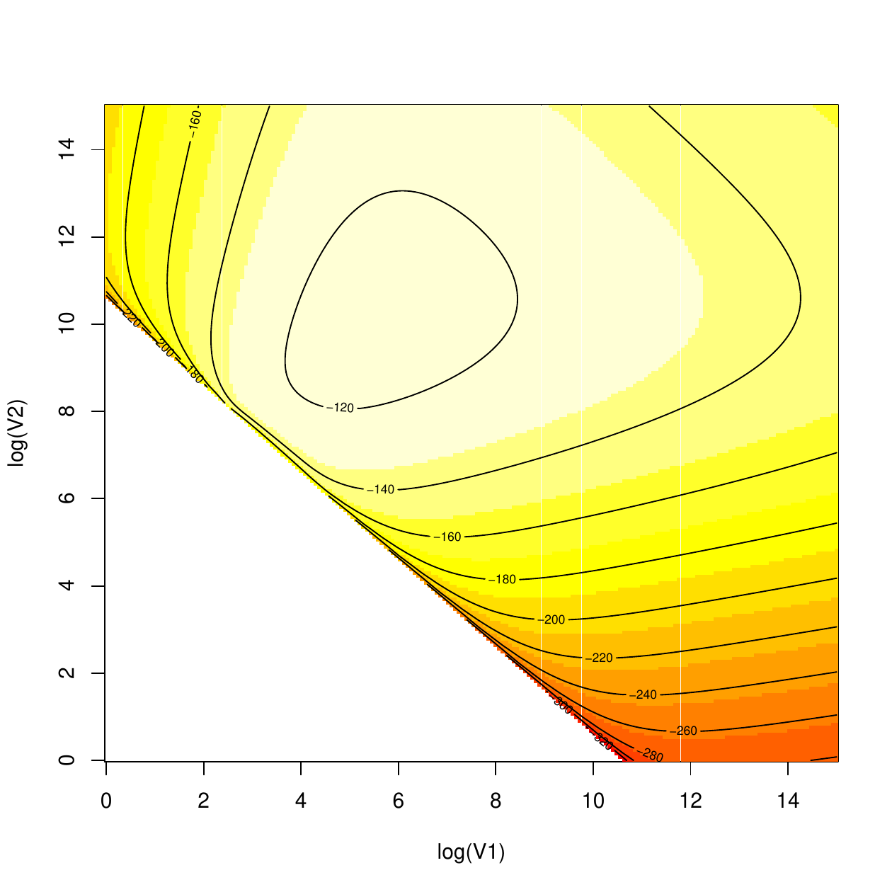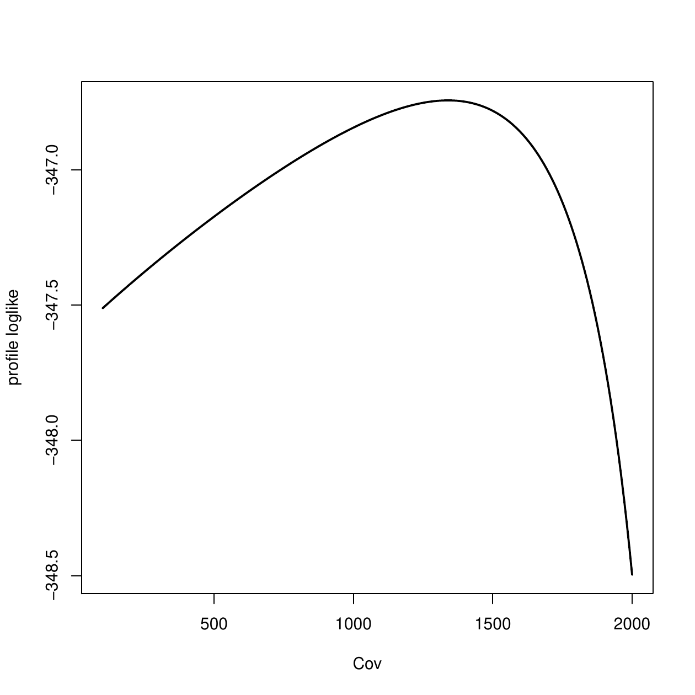</p>
<figcaption>Figure 7: Illustration of effects of starting values on
parameter estimates from profile log likelihood surfaces or curves.
Upper panel: the profile joint log likelihood of parameters <span
class="math inline">(log(<em>σ</em><sub><em>X</em></sub><sup>2</sup>),log(<em>σ</em><sub><em>Y</em></sub><sup>2</sup>))</span>
with the mean and correlation parameters set at certain starting values.
Values from highest to lowest are colored in order of white, yellow and
red; Lower panel: the profile likelihood of covariance parameter with
mean and variance parameters fixed at certain starting
values.</figcaption>
</figure>

