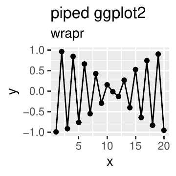

::: article
# Introduction

Using pipes to sequence operations has a number of advantages. Piping is
analogous to representing function composition as a left to right flow
of values, which is a natural direction for Western readers, and is much
more legible than composition represented as nesting.

Pipe notation is a popular topic in the R community. Related work
includes:

-   [*data.table*](https://CRAN.R-project.org/package=data.table):
    @datatable use the open and closed square bracket in *data.table*
    `][`, which is essentially as an example of *piping* or *method
    chaining*.
-   [*magrittr*](https://CRAN.R-project.org/package=magrittr): @magrittr
    popularized pipe used in
    [*dplyr*](https://CRAN.R-project.org/package=dplyr) [@dplyr].
-   [*future*](https://CRAN.R-project.org/package=future): @future
    offers a powerful distributed processing package with pipe notation.
-   [*rmonad*](https://CRAN.R-project.org/package=rmonad): @rmonad
    created a monadic operator package, capturing exceptions in addition
    to managing composition and values.
-   [*pipeR*](https://CRAN.R-project.org/package=pipeR): @pipeR contains
    a collection of sequencing methods including pipes and method
    chaining.
-   [*backpipe*](https://CRAN.R-project.org/package=backpipe): @backpipe
    introduces a right to left pipe operator.
-   [*drake*](https://CRAN.R-project.org/package=drake): @drake contains
    a work-flow/graph toolkit for reproducible code and high-performance
    computing.

This article will discuss using the operator `%.>%` from the package
[*wrapr*](https://CRAN.R-project.org/package=wrapr) [@wrapr]
(colloquially called "dot-pipe" or "dot-arrow"). Dot-pipe is compatible
with many other meta-programming paradigms, and is directly S3
extensible.

# Pipe notations

There are a number of important pipe notations in and out of R:

-   In mathematical function composition or application, one can write
    `a `$\circ$` b` to denote `a(b)`.
-   In Unix, `process1 | process2` streams results from `process1` as
    input to `process2`.
-   In APL's reduce/apply slash notations.
-   In F#'s forward pipe operator, `a |> b` means `b a`, using F#'s
    partial application feature.
-   In *magrittr* pipes, `a %>% b(...)` is most commonly used to denote
    `{. <- a; b(., ...)}` (with dot side effects hidden).
-   With the dot-pipe `%.>%` (the topic of this article), where
    `a %.>% b` is intended to approximately mean `{. <- a; b}`.

# Using `%.>%` to sequence operations

In this section, we demonstrate the use of "dot-pipe" `%.>%` from
*wrapr* and some of its merits. The intended semantics of `%.>%` are:

> `a %.>% b` is nearly equivalent to `{. <- a; b}`

where `a` and `b` are taken to be R expressions, presumably with the dot
occurring as a unbound (or free) symbol in `b`. For example:

``` r
>   library("wrapr")
>   5 %.>% sin(.)
[1] -0.9589243

>   print(.)
[1] 5
```

Notice the *wrapr* dot-pipe leaves the most recent left-hand side value
in the variable named dot. While this is a visible side-effect of the
pipe which can conflict with other uses of dot, we feel these explicit
semantics are sensible, easy to teach, and easy to work with.

We can also write `5 %.>% sin`, as the dot-pipe looks up functions by
name (even for qualified names such as `base::sin`) as a user
convenience. This function lookup is a non referentially transparent
special case, as names are deliberately treated differently than values.
However, it is an important capability that we will discuss later and
greatly expand using S3 object oriented dispatch. Dot-pipe's default
service does not work with the expression `5 %.>% sin()` and throws an
informative error message. Maintaining an explicit distinction between
`sin` (a name), `sin()` (an expression with no free-use of dot), and
`sin(.)` (an expression with free-use of dot) has benefits, some of
which we will demonstrate in the [4](#sec:extendseq) section. For
dot-pipe usage in general, the explicit expression `sin(.)` is preferred
to `sin` under the rubric "dot-pipe has lots of dots."

Additional dot-pipe examples include:

``` r
>   5 %.>% {1 + .}
[1] 6

>   5 %.>% (1 + .)
[1] 6
```

Notice dot-pipe treated the last two statements similarly. We warn the
reader that in R the expression `5 %.>% 1 + .` is read as
`(5 %.>% 1) + .`, since special operators (those using `%`) have higher
operator precedence than binary arithmetic operators.

The dot-pipe works well with many packages, including *dplyr*:[^1]

``` r
>   library("dplyr")
>   disp <- 4
>   mtcars %.>% 
+       filter(., .data$cyl == .env$disp) %.>% 
+       nrow(.)
[1] 11
```

# Extending the sequencer {#sec:extendseq}

Dot-pipe's primary dispatch is user extensible; by default, it treats
`a %.>% b` as `{. <- a; b}`. However, it does this via S3 dispatch
through a method of signature `apply_left(a, b, –more–)`. User or
package code can override this method to add custom effects. For
example, one can extend dot-pipe to be a
[*ggplot2*](https://CRAN.R-project.org/package=ggplot2) @ggplot2 layer
compositor as we show below.

``` r
>  library("ggplot2")
>  apply_left.gg <- function(pipe_left_arg,
+                            pipe_right_arg,
+                            pipe_environment,
+                            left_arg_name,
+                            pipe_string,
+                            right_arg_name) {
+   pipe_right_arg <- eval(pipe_right_arg,
+                          envir = pipe_environment,
+                          enclos = pipe_environment)
+   pipe_left_arg + pipe_right_arg
+  }
```

We have defined an implementation of `apply_left.gg`, as this is the
class used by *ggplot2* to recognize its own objects (i.e., *ggplot2*
works by defining `‘+‘.gg`). Essentially `apply_left.gg(a, b)` is
implemented as `a + b`, the only detail being `b` is passed as a
un-evaluated language argument, so it must be evaluated before being
used as a regular value, a detail discussed in the package
documentation.

We can now easily write a pipeline that combines sequencing *dplyr*
transformation steps and combining *ggplot2* geom objects, producing
figure [1](#fig:plot).

``` r
>  data.frame(x = 1:20) %.>%
+     mutate(., y = cos(3*x)) %.>%
+     ggplot(., aes(x = x,  y = y)) %.>%
+     geom_point() %.>%
+     geom_line() %.>%
+     ggtitle("piped ggplot2",
+             subtitle = "wrapr")
```

<figure id="fig:plot">
<div class="center">

</div>
<figcaption>Figure 1: Example plot produced by a pipeline.</figcaption>
</figure>

Notice how we can use the same pipe notation for both the initial
*dplyr* data processing steps and for the later *ggplot2* layer
aggregation steps. As before, the data processing steps (e.g., `mutate`)
require dot as a free symbol to specify where the piped values go.
However, the *ggplot2* steps do not use such a dot argument, as these
functions do not expect previous steps as arguments.

Dot-pipe was able to add capabilities to the *ggplot2* package without
requiring any changes to the *ggplot2* package. This extension
capability is important.

# Treating names as functions

If an object on the right hand side of a dot-pipe stage is an R language
name (or a qualified name such as `base::sin`), then that object is
retrieved. If the result is a function, the function is applied. If the
result is a more general object, then S3 dispatch is used on the class
of this *second* or right hand side argument. That is, `a %.>% b` is
treated as `b(a)` or $\text{f}_{\text{class(b)}}$`(a, b)`.

A good example using this capability is extending the
[*rquery*](https://CRAN.R-project.org/package=rquery) package [@rquery]
to allow relational operator trees to be used both as inspectable
objects and as functions that can be applied directly to data. In the
following example, we create an operator tree that adds the column `y`
to a data frame, `d`.

``` r
>   library("rquery")
>   optree <- mk_td(table_name = "d", columns = "x") %.>%
+      extend_nse(., y = cos(2*x))
```

We can treat `optree` as an object as we show below.

``` r
>   class(optree)
[1] "relop_extend" "relop"       

>   print(optree)
[1] "table(d; x) %.>% extend(., y := cos(2 * x))"

>   column_names(optree)
[1] "x" "y"

>   columns_used(optree)
$d
[1] "x"
```

Or we can pipe into it, as we now demonstrate.

``` r
>   # get a database connection
>   db = DBI::dbConnect(RSQLite::SQLite(), 
+                       ":memory:")
>   # make our db connection available to rquery package
>   options(list("rquery.rquery_db_executor" = list(db = db)))
>   data.frame(x = 1:3) %.>% optree # apply optree to d
  x          y
1 1 -0.4161468
2 2 -0.6536436
3 3  0.9601703
```

In this example, the *rquery* package defined a surrogate S3 method for
the right hand side pipe argument: `apply_right.relop`. Any user or
package can extend the dot-pipe to suit their needs, just as we have
shown here. The *rquery* package defines `apply_right.relop` allowing
new data to be applied to existing pipelines as we saw above.

We provide `wrapr::apply_right_S4()` as an S4 dispatch interface. This
flexibility can be used to define special effects such as "same class to
same class" ideas. For example, we can arrange for data frames to
automatically call `rbind` when piped into each other. Note that it
usually does not make sense to pipe into a non-expression or
non-function object.

``` r
>  d1 <- data.frame(x = 1)
>  d2 <- data.frame(x = 2)
>  tryCatch(
+     d1 %.>% d2,
+     error = function(e) { invisible(cat(format(e))) })
wrapr::apply_right_S4 default called with classes:
 d1 data.frame 
 d2 data.frame 
  must have a more specific S4 method defined to dispatch
 NULL
```

If one sets a generic signature for `apply_right_S4` this can be made a
sensible and useful operation.

``` r
>  setMethod(
+   "apply_right_S4", 
+   signature = c("data.frame", "data.frame"),
+   definition = function(pipe_left_arg,
+                         pipe_right_arg,
+                         pipe_environment,
+                         left_arg_name,
+                         pipe_string,
+                         right_arg_name) {
+     rbind(pipe_left_arg, pipe_right_arg)
+   })
>  d1 %.>% d2
  x
1 1
2 2
```

However, the `apply_right` execution path is only active when the right
pipe argument is a name. The `rbind` effect would not work if piped
directly into a value. The default `apply_right` implementation is an S3
dispatch on the *right* pipe argument.

``` r
>  d1 %.>% data.frame(x = 2)
  x
1 2
```

In this case `data.frame(x = 2)` was evaluated an an expression where
the dot had the value `data.frame(x = 1)`, which was in turn ignored.

# Dot-pipe semantics

We have been describing dot-pipe semantics by introducing transformed
code that we consider equivalent to the dot-pipe pipeline. Think of that
as the specification. Dot-pipe's implementation is not by code
substitution but through execution rules we outline here.

In R, special operators (those written with `%`) are left to right
associative (meaning `a %.>% b %.>% c` is taken to mean
`(a %.>% b) %.>% c`) with fairly high operator precedence (meaning they
are applied earlier than some other operators).

The dot-pipe semantics are realized by the following processing rules.
`a %.>% b` is processed as follows:

Def.-  We choose the default "control on the left case" (or "L case") if
    the second or right hand side argument `b` is not a R language name
    or other dereferencable entity, otherwise we take the "control on
    right case" (or "R case"). We then continue with one of these two
    cases.

    L case.-  S3 dispatch is performed on `apply_left(a, b, env, nm)`, with
        `class(a)` being the method-determining argument, and `b` an
        un-evaluated R language object. The default implementation of
        `apply_left(a, b, env, nm)` is `. <- a ; eval(b)` (performed in
        the calling environment).

    R case.-  We look-up the second or right hand side argument `b` and then
        branch as follows.

        1.  If `b` is now a function, the value `b(a)` is returned.

        2.  Otherwise, S3 dispatch is performed on
            `apply_right(a, b, env, nm)` with `class(b)` as the method
            determining argument. If `b` is an S4 object,
            `apply_right.default(a, b, env, nm)` in turn dispatches to
            `apply_right_S4(a, b, env, nm)`.

This may seem involved, but it is in fact quite regular with only one
exception: a dereference triggers right-dispatch. Roughly, the rule is:
"treat the second or right hand side argument as an expression, unless
it is a name." The intent is for dot-pipe to have simple semantics that
are capable of being combined many ways to allow rich emergent behavior.

# Comparison with *magrittr*

The *magrittr* package supplies a very popular R pipe operators, so it
is worth a bit of discussion.

The *magrittr* package works by capturing entire (possibly more than one
step) pipelines un-evaluated and then inspecting the captured code for
its own piping symbols. This can be confirmed by looking at the
implementation and also by attempting to re-name the *magrittr* pipe.

``` r
>  library("magrittr")
>  5 %>% sin
[1] -0.9589243

>  `%userpipe%` <- magrittr::`%>%`
>  tryCatch(
+     5 %userpipe% sin,
+     error = function(e) {e})
<simpleError in pipes[[i]]: subscript out of bounds>
```

The *wrapr* pipe executes by looking only at the arguments it is given,
holding the right argument un-evaluated until the left value is
available. Multiple stage *wrapr* pipes are just an effect of running
stages one after the other.

``` r
>  `%userpipe%` <- wrapr::`%.>%`
>   5 %userpipe% sin
[1] -0.9589243
```

There are also differences in how *magittr* and *wrapr* handle functions
and function arguments. With *magittr*, one can not reliably pipe into
`substitute` with `%>%`. Note that the word `value` below is the result,
not an input.

``` r
>  library("magrittr")
>  5 %>% substitute
value
```

Also, `%>%` does not work with qualified names unless one uses the more
general expression notation `base::sin(.)`.

``` r
>  tryCatch(
+     5 %>% base::sin,
+     error = function(e) {e})
<simpleError in .::base: unused argument (sin)>
```

In contrast, `%.>%` behaves closer to common user expectations.

``` r
>  library("wrapr")
>  5 %.>% substitute
[1] 5

>  5 %.>% base::sin
[1] -0.9589243
```

Note that the *magrittr* package can in fact trigger S3 dispatch through
its exposition pipe operator, `%$%` pipe, but this is only because this
operator calls the method `with()`, which is itself S3 overridable. This
should not be treated as an intended feature of the *magrittr*.

# Example applications

Both R users and package developers can achieve a great number of useful
effects by adding S3 implementations for `apply_left()` or for
`apply_right()`. Some possibilities include:

-   Enabling `%.>%` as a layering function for *ggplot2* (as a
    replacement for `+`, as we demonstrated).
-   Enabling auto-application of *rquery* operation trees to data frames
    (as we demonstrated).
-   Enabling auto-application of models by mapping
    `apply_right.model_class` to the appropriate `predict` method.
``` r
    >  d <- data.frame(x = 1:5, y = c(1, 1, 0, 1, 0))
    >  model <- glm(y~x, family = binomial, data = d)
    >  apply_right.glm <-
    +     function(pipe_left_arg,
    +              pipe_right_arg,
    +              pipe_environment,
    +              left_arg_name,
    +              pipe_string,
    +              right_arg_name) {
    +     predict(pipe_right_arg, 
    +             newdata = pipe_left_arg,
    +             type = 'response')
    +  }
    >  data.frame(x = c(1, 3)) %.>% model
            1         2 
    0.9428669 0.6508301 
```
    Notice we can pipe new data directly into the model for prediction.
    The S3 `apply_right` extensions give us a good opportunity to
    regularize model predictions functions to take the same arguments
    and have the desired default behaviors.

-   Enabling pipe notation for SQL.

``` r
    >  # get a database connection
    >  db = DBI::dbConnect(RSQLite::SQLite(), 
    +                     ":memory:")
    >  apply_right.SQLiteConnection <-
    +     function(pipe_left_arg,
    +              pipe_right_arg,
    +              pipe_environment,
    +              left_arg_name,
    +              pipe_string,
    +              right_arg_name) {
    +   DBI::dbGetQuery(pipe_right_arg, pipe_left_arg)
    +  }
    >  "SELECT * FROM sqlite_temp_master" %.>% db
    [1] type     name     tbl_name rootpage sql     
    <0 rows> (or 0-length row.names)
```
    Here we piped SQL code directly into the database connection.
-   A string concatenation operator.
``` r
    >  apply_left.character <- function(pipe_left_arg,
    +                                   pipe_right_arg,
    +                                   pipe_environment,
    +                                   left_arg_name,
    +                                   pipe_string,
    +                                   right_arg_name) {
    +     pipe_right_arg <- eval(pipe_right_arg,
    +                            envir = pipe_environment,
    +                            enclos = pipe_environment)
    +     paste0(pipe_left_arg, pipe_right_arg)
    +   }
    >  "a" %.>% "b" %.>% "c"
    [1] "abc"
```
    One can, of course, define a string concatenation operator directly,
    but this is a good example of the use of the dot-pipe as a sort of
    compound constructor.
-   A formula term collector.
``` r
    >  apply_left.formula <- function(pipe_left_arg,
    +                                 pipe_right_arg,
    +                                 pipe_environment,
    +                                 left_arg_name,
    +                                 pipe_string,
    +                                 right_arg_name) {
    +     pipe_right_arg <- eval(pipe_right_arg,
    +                            envir = pipe_environment,
    +                            enclos = pipe_environment)
    +     pipe_right_arg <- paste(pipe_right_arg, collapse = " + ")
    +     update(pipe_left_arg, paste(" ~ . +", pipe_right_arg))
    +  }
    >  (y~a) %.>% c("b", "c", "d") %.>% "e"
    y ~ a + b + c + d + e
```

We anticipate motivated package authors can find many special cases that
the dot-pipe can streamline for their users. The value will be when many
packages add effects on the same pipe, so users know by using that pipe
they will simultaneously have many powerful features made available.

We have found it profitable to roughly think of `apply_left()` as a
"programmable comma" and `apply_right()` as "automatic execution"
(usually achieved by overriding `print()`).

# Limitations

There are limitations to the class-driven pipe dispatch approach. The
class of the left item (driving `apply_left()`) is often uninformative,
as in R it will very often be a data frame. The class of the right item
(used by `apply_right()`) is not available until the right item has been
evaluated, which is too late for the most common pipe effect (evaluating
the right item with the left available as a dot). However, the authors
feel this system is more R like as it leaves more of the execution to
the R interpreter and tries to minimize the pipe operator itself being a
type of replacement interpreter implementation.

# Conclusion

We have demonstrated a predictable, well-behaved, S3-extensible tool for
sequencing or pipe-lining operations in R. The left-dispatch of
`apply_left()` method is useful in assembling composite structures such
as building a *ggplot2* plot up from pieces. The right-dispatch
`apply_right()` is unusual, but a natural extension of the "pipes write
functions on the right" idea. The goal of dot-pipe is to supply simple
semantics that can be composed into powerful specific applications. The
dot-pipe can be used to extend packages, or to add user desired effects.
We would like the *wrapr* dot-pipe to be a testing ground both for
pipe-aware package extensions and for experimenting with the nature of
piping in R itself.

# Acknowledgments

The authors would like to thank the *wrapr* users for their feedback. In
particular we would like to thank the R Journal editors and reviewers
who contributed a number of important points, including the idea that S4
evaluation was a good possibility and the natural way to discuss
dispatching on a right argument.
:::

[^1]: Example adapted from
    <https://github.com/tidyverse/dplyr/issues/3286>.
