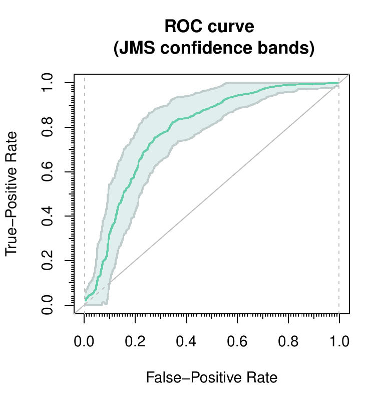
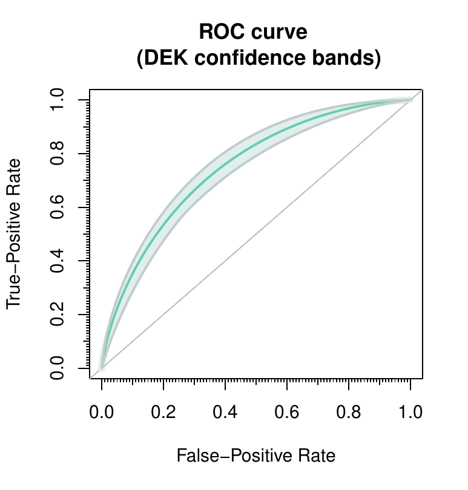

::: article
# Introduction

Given a continuous variable, (bio)marker, we are frequently interested
in performing a binary classification according to its value. This
binary classification can be regarded as the presence or not of a
certain characteristic of interest in the population (for instance, one
disease). On the basis of data containing the real diagnosis, subjects
are called positive when they have the characteristic and negative
otherwise.

The receiver operating characteristic (ROC) curve assumes that higher
values of the marker are associated with a higher probability of having
the characteristic. Therefore, a subject whose marker value is below a
fixed point (usually called threshold or cut-off point) is classified as
negative (without the characteristic) while a subject with a marker
value above the threshold is classified as positive (with the
characteristic). Under this proviso, it displays the ability of the
marker to correctly classify a positive subject as positive, or
true-positive rate (TPR), versus the inability to correctly classify a
negative subject as negative, or false-positive rate (FPR), for each
cut-off point along all the possible values of the marker. That is, the
sensitivity (TPR) versus the complementary of the specificity (FPR) for
each possible threshold. In addition, the area under the ROC curve, AUC,
is frequently used as an index of the global diagnostic capacity
[@fluss:2005]. It ranges between $1/2$, when the marker does not
contribute to a correct classification, and $1$, if the marker may
classify subjects properly. If AUC is less than $1/2$ it means that the
direction of the classification should be the opposite (see comments
about side of the ROC curve discussed below).

Mathematically, let $\chi$ and $\xi$ be two continuous random variables
representing the marker values for negative and positive subjects,
respectively. For a fixed value $t \in [0,1]$, the usual ROC curve
(right-sided) can be defined as follows in terms of the distribution
function of negative ($F_{\chi}$) and positive ($F_{\xi}$) group:
$$\mathcal{R}(t) = 1 - F_{\xi} \left( F^{-1}_{\chi} (1-t) \right) = F_{1 - F_{\chi}(\xi)}(t)$$
leading the following area under the curve:
$$\mathcal{A} = \int_0^1 \mathcal{R}(t) \, dt = \mathcal{P} \left( \chi < \xi \right).$$

Of course there exists a wide literature dealing with both theoretical
and practical aspects of the ROC curve and other related problems. The
interested reader can consult the monographs of @zhou:2002 and
@pepe:2003 for an extensive review of the topic. There are also a number
of papers dealing with some problems related to ROC curve such as the
usual ROC curve point estimation (see @goncalves:2014 for a recent
overview) from both parametric and non-parametric approaches, even
considering Bayesian methods as an alternative to the maximum likelihood
principle; or the curve interval estimation (confidence bands
construction) also using both parametric [@demidenko:2012] and
non-parametric techniques (@jensen:2000, @horvath:2008 and
@camblor:2018).

Furthermore, the ROC curve procedure has been extended to other
situations where the outcome is not binary. For instance, @mossman:1999
extends ROC concepts to diagnostic tests with trichotomous outcomes;
whereas @heagerty:2005 deal with time-dependent responses, whose most
direct extension is by means of the cumulative/dynamic approach
[@heagerty:2000], but it involves a new problem: handling censored data.
Additionally, @camblor:2017 proposed a ROC curve generalization for
non-monotone relationships between the marker and the response,
particularly convenient for situations in which both lower and higher
marker values are associated with higher probabilities of having the
studied characteristic. Some other scenarios where the information is
not provided as standard may lead us to conduct a meta-analysis of ROC
curves (see @camblor:2017meta and references therein) or fit a
regression model for these curves (@cai:2004 and @rodriguez:2011).

On the other hand, the ROC curve comparison is one of the issues which
has been more treated in literature. Usually ROC curves are compared
from their respective AUCs, but in some situations these hypothesis
tests are not the most appropriate (further discussed in the
**Comparison** section). The similarity between two ROC curves have been
traditionally discussed by @venkatraman:1996 for both paired and
unpaired designs [@venkatraman:2000]. On the other hand, the comparison
of the curves as functions is not different from the cumulative
distribution function comparison problem, and this analogy was used by
@camblor:2011, and subsequently extended to paired structures
[@camblor:2013].

Some of the previous approaches have already been implemented in several
software packages, including R packages such as
[*pROC*](https://CRAN.R-project.org/package=pROC) [@proc-package] and
[*ROCR*](https://CRAN.R-project.org/package=ROCR) [@rocr-package] which
include different procedures to estimate the usual ROC curve
(incorporating smoothing techniques), as well as confidence intervals
computation for different parameters of the curve (sensitivity,
specificity, AUC) and comparison of areas under two curves. There exist
also more specific packages to deal with different particular topics and
approaches of the ROC curve. For instance
[*plotROC*](https://CRAN.R-project.org/package=plotROC) [@plotroc]
displays sophisticated plots of these curves;
[*fbroc*](https://CRAN.R-project.org/package=fbroc) [@fbroc] focuses on
a fast implementation of bootstrap techniques;
[*OptimalCutpoints*](https://CRAN.R-project.org/package=OptimalCutpoints)
[@optimalcutpoints-package] includes several methods to select optimal
cut-off points of the marker;
[*timeROC*](https://CRAN.R-project.org/package=timeROC)
[@timeroc-package] and
[*survivalROC*](https://CRAN.R-project.org/package=survivalROC)
[@survivalroc] estimate time-dependent ROC curves and deal with some
related analyses; and
[*HSROC*](https://CRAN.R-project.org/package=HSROC) [@hsroc] implements
a model for joint meta-analysis of sensitivity and specificity of the
diagnostic test under evaluation.

ROC curves research is in fact a growing field in statistics. The
aforementioned R packages are some of the most relevant ones in this
topic but there are also more implementations covering certain
algorithms. However, some non-standard ROC curve analyses exist which
were not available to the scientific community in a practical software
and this is the main reason why the new package presented in this paper
has been created. The
[*nsROC*](https://CRAN.R-project.org/package=nsROC) package
[@nsroc-package] is a compilation of different analyses not computed to
date which attempts to boost awareness of new techniques that have
already been published but not implemented in a user-friendly software
widely available. Furthermore, it incorporates several studies and
techniques (from comparison of ROC curves to time-dependent estimation
and meta-analysis), making it more manageable since all of them are
included in the same package.

The rest of the paper is organized as follows: in the next two sections,
**Estimation** and **Comparison**, some basic information about the
statistical techniques included in the *nsROC* package, as well as some
remarkable technical issues about its main functions, are provided.
Particularly, the **Estimation** section incorporates several
aforementioned situations: the ROC curve generalization for non-monotone
relationships, confidence bands construction, censored data treatment
for time-dependent outcomes, and meta-analysis involving ROC curves. In
turn, the **Comparison** section includes three different methods of
comparison (based on AUC, diagnostic capacity of the marker, or ROC
curve definition in terms of CDF) to deal with both paired and unpaired
data scenarios. Subsequently, in the **Examples** section, a complete
analysis with different datasets is carried out to illustrate certain
applications of the submitted package; and finally a **Summary** of the
utility of the package is reported.

# Estimation

## Non-standard ROC curve estimation

As mentioned previously, an ROC curve is a graphical method which
displays the sensitivity (Se) versus the complementary of the
specificity (1-Sp) for all possible thresholds of the considered marker.

Although different parametric and semi-parametric estimators for the ROC
curve have been studied, in our package the empirical estimator, based
on replacing the involved unknown distribution functions with their
respective empirical cumulative distribution functions, $\hat{F}$, has
been considered. Hence, the implemented ROC curve estimator is
$$\mathcal{\widehat{R}}(t) = \hat{F}_{1 - \hat{F}_{\chi}(\xi)}(t) \, .$$

This is the usual definition when higher values of the marker are
considered to be associated with a higher probability of existence of
the characteristic under study. It can be also called right-sided ROC
curve.

However, sometimes it can be supposed the opposite, i.e. that higher
values of the marker are associated with a lower probability of the
existence of the characteristic. In this context, the definitions should
be adapted and the resulting ROC curve (usually called left-sided curve)
estimator is
$$\mathcal{\widehat{R}}(t) = \hat{F}_{\hat{F}_{\chi}(\xi)}(t) \, .$$

There exist several R packages also incorporating the non-parametric
estimation, for instance the *pROC* package includes smoothed estimates.
However, they suppose one of the assumptions aforementioned (right-sided
or left-sided curve), considering a single threshold of the marker in
order to classify, since the standard ROC curve definition is associated
with this particular type of classification subsets.

Nevertheless, an extension of those classification subsets has been
studied by @camblor:2017, dealing with situations in which not only
higher or lower values of the marker are associated with a higher
probability of existence of the studied characteristic, but both may be
related. Under this assumption, not only one cut-off point is
considered, but two $x_l$ and $x_u$ corresponding to the extremes of a
marker interval are regarded, i.e those subjects with a marker value
within the interval $(x_l, x_u)$ are classified as negative and those
with a marker value below $x_l$ or greater that $x_u$ are supposed to be
positive. In this context, the sensitivity and specificity definitions
are the following ones:
$$Se(x_l, x_u) = P \left( \xi \leq x_l \cup \xi \geq x_u \right) = F_{\xi}(x_l) +1 - F_{\xi}(x_u)$$

$$Sp(x_l, x_u) = P \left( x_l < \chi < x_u \right) = F_{\chi}(x_u) - F_{\chi}(x_l).$$
At this juncture, it is important to note that there may be different
couples $(x_l, x_u)$ reporting the same specificity but different
sensitivity, so the generalized ROC curve is defined by the supreme of
them:
$$\mathcal{R}_g(t) = \sup_{(x_l, x_u) \in \mathcal{F}_t} 
\left\{ F_{\xi}(x_l) +1 - F_{\xi}(x_u) \right\}$$
where $(x_l, x_u) \in \mathcal{F}_t$ iff $x_l \leq x_u$ and
$Sp(x_l, x_u) \geq 1-t$. It is clear that $(x_l, x_u) \in \mathcal{F}_t$
can also be written as $x_l = F^{-1}_{\chi} \left( \gamma t \right)$ and
$x_u = F^{-1}_{\chi} \left(1 - \left[ 1 - \gamma \right] t \right)$ for
some $\gamma \in [0,1]$, therefore
$$\mathcal{R}_g(t) = \sup_{\gamma \in [0,1]} 
\left\{ F_{\xi} \left( F^{-1}_{\chi} \left(\gamma t \right) \right) + 1 - 
F_{\xi} \left( F^{-1}_{\chi} \left(1 - \left[1 - \gamma \right] t \right) \right) \right\}.$$
Using the aforementioned notation, the implemented general ROC curve
estimator is
$$\mathcal{\widehat{R}}_g(t) = \sup_{\gamma \in [0,1]} 
\left\{ 1 - \hat{F}_{1- \hat{F}_{\chi}(\xi)} \left( 1 - \gamma t \right) + 
\hat{F}_{1- \hat{F}_{\chi}(\xi)} \left( \left[1 - \gamma \right] t \right) \right\}.$$

Different parametric models have been considered in order to estimate
the ROC curve. Among them, the binormal model is one of the most used,
according to which the usual and general ROC curves, respectively, are
the following:
$$\mathcal{R}(t) = \Phi \left( a + b \cdot \Phi^{-1}(t) \right)$$

$$\mathcal{R}_g(t) = \sup_{\gamma \in [0,1]} \left\{ 
\Phi \left( a + b \cdot \Phi^{-1} \left( \left[ 1 - \gamma \right] \cdot t \right) \right) + 1
-  \Phi \left( a + b \cdot \Phi^{-1} \left( 1 - \gamma \cdot t \right) \right)  \right\}$$
where $a = \left( \mu_\xi - \mu_\chi \right)/\sigma_\xi$,
$b = \sigma_\chi / \sigma_\xi$ and $\Phi$ is the cumulative distribution
function of a standard normal. Therefore, the parametric ROC curve
estimation gets boiled down to estimate the parameters involved.

While the usual AUC has a direct probabilistic interpretation: "given
two randomly and independently selected subjects, one negative and one
positive, the AUC is the probability that the marker value in the
positive subject is greater than in the negative subject", this reading
is not directly related to the classification subsets involved in the
definition of the usual ROC curve. However, it is possible to enunciate
this relationship in terms of the diagnostic rule involved (citing
@camblor:2017param) and following the same idea the authors also proved
the interpretation of the generalized AUC in terms of the probability of
belonging to the corresponding classification subsets, under a condition
about the continuity of $R_g(\cdot)$ and self-contained subsets as
specificity increases.

In the *nsROC* package the point non-parametric ROC curve estimation can
be computed by the `gROC` function. Some computational details must be
mentioned: if `Ni` is `NULL` a fast algorithm is used to estimate the
ROC curve for the considered sample; otherwise, if `Ni` is a number,
thresholds considered are the marker values collected (adding $-\infty$
and $\infty$) and the specificities, $t$, used to estimate the ROC curve
are those resulting from dividing the unit interval in `Ni` subintervals
with the same length. This latter case is slower because the vector of
$\gamma$-values taken into account in order to estimate the general ROC
curve is the result of dividing the unit interval in subintervals with
length $0.001$. The area under the curve is computed by the trapezoidal
rule.

::: {#table0}
  ----------------------------------- --------------------------------------------------------------------------------------------------------------------------------------------------------------------------------------------------------------------------------------------------------------
           Input parameters           

                  `X`                 Vector of marker values.

                  `D`                 Vector of response values. Two levels; if more, the two first ones are used.

                `side`                Type of ROC curve. One of `"right"` (right-sided), `"left"` (left-sided), `"auto"` (right or left-sided is automatically chosen so that AUC will be greater than $0.5$) or `"both"` (general). Default: `"right"`.

                 `Ni`                 Number of subintervals of the unit interval considered to compute the curve. Default: NULL (which will use the fast algorithm considering as many subintervals as number of positive subjects).

              `pval.auc`              If TRUE, a permutation test to test $H_1: AUC \neq 0$ is performed.

                  `B`                 Number of permutations used for testing. Default: 500.

           Output parameters          

           `controls, cases`          Marker values of negative and positive subjects, respectively.

         `points.coordinates`         Matrix whose second and third columns correspond to coordinates where the ROC curve has a step in case of right or left-sided ROC curves. In the first column there are the marker thresholds considered reporting these coordinates.

       `pairpoints.coordinates`       Matrix whose third and fourth columns correspond to coordinates where the ROC curve has a step in case of general ROC curves. The first and second columns are the marker thresholds considered, $x_l$ and $x_u$, respectively, reporting these coordinates.

                 `roc`                Vector of values of the ROC curve for each `t` considered.

                 `auc`                Area under the curve estimate.

           `pval.auc, Paucs`          p-value and different permutation AUCs if the hypothesis test is performed.

   Additional functions to be passed  

                `plot`                Plot the ROC curve estimate.

                `print`               Print some relevant information.
  ----------------------------------- --------------------------------------------------------------------------------------------------------------------------------------------------------------------------------------------------------------------------------------------------------------

  : Table 1: The most relevant input and output parameters of the `gROC`
  function.
:::

[]{#table0 label="table0"}

The point estimation of the curve is essential, but it is also important
to have an idea of how relevant the underlying sample is in this
estimation, i.e. the interval estimation: how to build confidence bands
of the ROC curve. This problem has been addressed from different points
of view, most of them based on point-wise confidence intervals for
sensitivity and/or specificity instead of focusing on the curve as a
function.

There are some R packages providing some kind of confidence regions:
*fbroc* includes a function which computes regions for the right-sided
curve but no information about the method used to build them is
provided; *plotROC* displays 'rectangular confidence regions for the ROC
curve'; and *pROC* computes square pointwise confidence bands of the
AUC, thresholds, specificity, sensitivity and/or coordinates of an ROC
curve.

A review of the performance of these methods has already been carried
out by @macskassy:2005 who pointed out the difficulty of translating
methods for building pointwise confidence intervals into methods to
obtain confidence bands. However, when the focus is the whole ROC curve,
one should construct confidence bands, and just considering the 'band'
obtained joining the pointwise confidence intervals does not provide a
real confidence band with the desired confidence level, because the
probability that one point of the curve will be outside this 'band' is
higher.

In this package three different techniques dealing with the ROC curve
itself have been computed. Namely, one parametric assuming the binormal
model (@demidenko:2012) and two non-parametric have been included
(@jensen:2000 and @camblor:2018):

-   @demidenko:2012 adapted the Working-Hotelling type confidence bands
    used in linear regression and proposed a method called
    ellipse-envelope. It should be noted that the ROC curve estimated by
    this method is not empirical, but the binormal one.
-   @jensen:2000 approach is based on the asymptotic distribution of the
    ROC curve in terms of Brownian bridges, developing symmetrical
    non-parametric confidence bands for the curve, even on a particular
    region. The main drawback is the need to estimate density functions
    from smooth procedures involving a scale parameter (not chosen by
    the user) which can strongly affect the resulting ROC curve
    estimate. In terms of computational aspects it must be pointed out
    that the `BBridge` function in the
    [*sde*](https://CRAN.R-project.org/package=sde) [@sde] package has
    been used to simulate the Brownian bridges involved. In addition,
    the extremes of the interval in $(0,1)$ in which the user wants to
    compute the regional confidence bands must be set. The bootstrap
    method has been applied and the confidence bands are truncated
    making the lower-band being inside the $(0,0.95)$ interval and the
    upper-band within $(0.05,1)$.
-   @camblor:2018 method approximates the distribution of the following
    pivotal function by a smoothed bootstrap method:
    $$\sqrt{n} \cdot \sigma_n^{-1}(t) \cdot \left[ \widehat{\mathcal{R}}(t) - 
    \mathcal{R}(t) \right]$$
    where $n$ is the number of positive subjects and $\sigma_n(t)$ is
    the standard deviation estimate of
    $\sqrt{n} \left[ \widehat{\mathcal{R}}(t) - 
    \mathcal{R}(t) \right]$. Computational issues which should be taken
    into account are the following: confidence bands are truncated as in
    the previous method and the scale parameter, $s$, used to compute
    the smoothed kernel distribution functions (with bandwidth
    $h = s \cdot \hat{\sigma} \cdot \min \left\{ n_{+}, n_{-} \right\}$)
    must be set by the user. Furthermore, there exists the option of
    selecting a parameter, $\alpha_1$, affecting the width between lower
    (and consequently upper) band and ROC curve point estimate. If
    $\alpha_1$ is not specified by the user, the one minimizing the
    theoretical area between the bands is automatically considered. It
    should be remarked that this is the only method designed to estimate
    ROC curve confidence bands for the general ROC curve.

::: {#table01}
  ----------------------------------- ---------------------------------------------------------------------------------------------------
  Input parameters                    

  `groc`                              Output of the `gROC` function. `Ni` is the number of subintervals used for estimation.

  `method`                            Method used. One of `"PSN"` [@camblor:2018], `"JMS"` [@jensen:2000] or `"DEK"` [@demidenko:2012].

  `conf.level`                        Confidence level considered. Default: $0.95$.

  `B`                                 Number of bootstrap replicates. Default: $500$.

  `alpha1, s`                         Parameters to pass to `"PSN"` method. Default: `s`$=1$.

  `a.J, b.J`                          Extremes of interval to pass to `"JMS"` method. Default: `a.J`$=1/$`Ni`, `b.J`$=1-1/$`Ni`.

  `plot.var`                          If `TRUE`, variance estimate along $t$ resulting from `"PSN"` or `"JMS"` method is displayed.

  Output parameters                   

  `L, U`                              Lower and upper bands respectively for each $t \in \{0, 
                                      1/$`Ni`$, 2/$`Ni`$, ..., 1 \}$.

  `practical.area`                    Estimated area between lower and upper band.

  `alpha1, alpha2`                    $\alpha_1$ and $\alpha_2$ used in `"PSN"` method.

  Additional functions to be passed   

  `plot`                              Plot the confidence bands of the ROC curve.

  `print`                             Print some relevant information.
  ----------------------------------- ---------------------------------------------------------------------------------------------------

  : Table 2: The most relevant input and output parameters of the
  `ROCbands` function.
:::

[]{#table01 label="table01"}

## Time-dependent ROC curve

Sometimes the response variable is not binary but time-dependent. In
this case the resulting curve is called time-dependent ROC curve.
Although there exist different approaches of this kind of curves
depending on the association between the referred time-dependent outcome
and the binary classification (for instance, @heagerty:2005 considered
the incident sensitivity defined as
$Se^{I}(x) = P \left( X > x | T = t \right)$ to build the
incident/dynamic ROC curve), the most direct one is the
cumulative/dynamic approach, which classifies as positive a subject in
which the event happens before a fixed point of time $t$ and negative
otherwise. In other words, the cumulative sensitivity and the dynamic
specificity are defined as follows:
$Se^{C}(x) = P\left( X > x | T \leq t \right)$ and
$Sp^{D}(x) = P\left( X \leq x |  T > t \right)$.

However, the time-dependent problem involves a new issue to be
addressed: how to deal with subjects censored before $t$. There are some
R packages which incorporate time-dependent ROC curve estimation
procedures in the presence of censored data. Some good examples are
*timeROC*, which also performs some estimations about different concepts
related to time-dependent ROC curve and compare time-dependent AUCs (see
@timeroc-article for a complete overview of the implemented methods);
*survivalROC* which computes time-dependent ROC curves from censored
survival data using the Kaplan-Meier (KM) or Nearest Neighbor Estimation
(NNE) method by @heagerty:2000; and
[*tdROC*](https://CRAN.R-project.org/package=tdROC) [@tdroc], based on
the @li:2018 method mentioned below.

In order to deal with time-dependent outcomes, the *nsROC* package has
used the cumulative/dynamic approach. A different solution for the
censoring problem has been proposed by @camblor:2016cd, considering a
time-dependent ROC curve estimator based on assigning a probability to
be negative (consequently positive) to those censored subjects.
Particularly, two different statistics have been suggested in order to
estimate the probability of surviving beyond $t$: a semiparametric one,
using a proportional hazard Cox regression model considering the marker
as the covariate; and a non-parametric one, using directly the
Kaplan-Meier estimator. There exists a subsequent paper based on the
same idea [@li:2018] but using the kernel-weighted Kaplan-Meier
estimator instead of the naive one. This last method is also included in
*nsROC* package, allowing the user to choose the kernel and bandwidth to
be considered in the kernel-weighted statistic.

In terms of computational aspects it should be noted that the
[*survival*](https://CRAN.R-project.org/package=survival)
[@survival-package] package has been used. In particular, the `survfit`
and `Surv` functions are required to estimate survival functions, and
the `coxph` function is used to fit the Cox proportional hazard
regression model involved in the semiparametric approach aforementioned.

[]{#table1 label="table1"}

::: {#table1}
  -------------------------------------------------------------------------------------------------------------------------------------------------------------------------------------------------
           Input parameters           
  ----------------------------------- -------------------------------------------------------------------------------------------------------------------------------------------------------------
                `stime`                                                                                 Vector of observed times.

               `status`                                                           Vector of status ($0$ if the subject is censored and $1$ otherwise).

               `marker`                                                                                 Vector of marker values.

            `predict.time`                                                                             Time point $t$ considered.

               `method`                                                   Method to estimate the probability aforementioned. One of `"Cox"`, `"KM"` or `"wKM"`.

               `kernel`                Procedure used to calculate kernel function if `method` is `"wKM"`. One of `"normal"`, `"Epanechnikov"` or `"other"` (if the user defines a different one).

            `h, kernel.fun`                                               Bandwidth and kernel function used if `method` is `"wKM"` and `kernel` is `"other"`.

               `boot.n`                                                                  Number of bootstrap samples considered. Default: $100$.

           Output parameters          

              `TPR, TNR`                                                           Vector of sensitivities and specificities estimates, respectively.

              `cutPoints`                                                                        Vector of marker thresholds considered.

                 `auc`                                                                      Area under the time-dependent ROC curve estimate.

   Additional functions to be passed  

                `plot`                                                                         Plot the time-dependent ROC curve estimate.

                `print`                                                                             Print some relevant information.
  -------------------------------------------------------------------------------------------------------------------------------------------------------------------------------------------------

  : Table 3: The most relevant input and output parameters of the
  `cdROC` function.
:::

## Meta-analysis

Meta-analysis is a popular statistical methodology for combining the
results from multiple independent studies about the same topic. It
allows us to know the state of the art, strengths and weaknesses of one
considered topic, combining estimation effects from different
independent comparable studies [@riley:2010]. However, the main
particularity of meta-analysis is that only limited information is
available from each study considered. There exist two different
meta-analysis models depending on the consideration (or not) of the
variability between studies: the fixed-effects model just considers the
within-study variability whereas the random-effects model also takes
into account the variability between studies [@dersimonian:1986].

In the case that the target is the ROC curve, the goal of meta-analysis
is combining the results from several independent studies performed by
the same marker and characteristic of interest in a single outcome.
Different methods to compute summary ROC curves have been introduced in
order to determine the global diagnostic accuracy for both fixed-effects
(@moses:1993) and random-effects model (@hamza:2008, among others).
Besides, the *HSROC* package implements the procedure of @rutter:2001.
However, most of those approaches are parametric and consider that only
one estimated pair of sensitivity and specificity from each paper exist
and they are supposed to be independently selected in each study, but
often the reported points are the best ones in the Youden index sense.
Nevertheless, some new techniques have been developed taking into
account all the pairs of points reported; @hoyer:2018 and
@steinhauser:2016 are good examples. @camblor:2017meta includes a
different view focusing on the direct ROC curve estimation from a
non-parametric approach, using weighted means of each individual ROC
curve, taking all pairs of points $(Se, Sp)$ reported in each study, and
performing a simple linear interpolation between them. Moreover, both
the fixed and random-effects model are covered.

The `metaROC` function in the *nsROC* package implements this last
approach reporting a fully non-parametric ROC curve estimate from a data
frame including the number of true positive and negative (`TP` and `TN`)
subjects, false positive and negative (`FP` and `FN`) subjects and a
identifier of the study they come from. It displays in a plot the
non-parametric summary ROC (nPSROC) curve estimate, and the user has the
possibility of including all ROC curve interpolations in the same
graphic, as well as a confidence band estimate. In the random-effects
model there is also the option of plotting the inter-study variability
estimate along the different specificities on the unit interval.

::: {#table2}
  ------------------- ---------------------------------------------------------------------------------------------------------------------------------------------------------------------
   Input parameters   

        `data`        A data frame containing the variables: `"Author"`, `"TP"`, `"TN"`, `"FP"` and `"FN"`.

        `model`       Meta-analysis model considered. One of `"fixed-effects"` or `"random-effects"`.

         `Ni`         Number of subintervals of the unit interval considered to compute the curve. Default: $1000$.

     `plot.Author`    If `TRUE`, a plot including ROC curve estimates (by linear interpolation) for each study under consideration is displayed.

     `plot.bands`     If `TRUE`, confidence interval estimate for the ROC curve is added.

   `plot.inter.var`   If `TRUE`, a plot reflecting inter-study variability estimate is displayed on an additional window.

   Output parameters  

         `sRA`        nPSROC curve estimate resulting from the `model` considered with a slight modification to ensure the monotonicity along the points on the unit interval considered.

        `se.RA`       Standard-error of nPSROC curve estimate.

        `area`        Area under the curve estimate.

    `youden.index`    Optimal specificity and sensitivity in the Youden index sense for nPSROC curve.

        `roc.j`       A matrix whose columns contain the ROC curve estimate (by linear interpolation) of each study.

    `w.j, w.j.rem`    A matrix whose columns contain the weights in fixed or random-effects model, respectively, of each study.
  ------------------- ---------------------------------------------------------------------------------------------------------------------------------------------------------------------

  : Table 4: The most relevant input and output parameters of the
  `metaROC` function.
:::

[]{#table2 label="table2"}

# Comparison

An important role of diagnostic medicine research is the comparison of
the accuracy of diagnostic tests. With the goal of comparing their
global accuracy, the comparison of AUCs is the most usual method
[@delong:1988]. However, when there is no uniform dominance between the
involved curves (i.e. the sensitivities associated with each specificity
along the unit interval are not always higher in one curve than in the
other), they can differ having the same AUC. In these situations, these
tests are not valid to compare the equality among the ROC curves, and
some other approaches could be considered to compare the equality of all
the curves, such as @camblor:2013 and @camblor:2011 mentioned below,
which deal with the ROC curve by its definition as a cumulative
distribution function. On the other hand, @venkatraman:1996 and
@venkatraman:2000 propose the use of a non-parametric permutation test
to compare the equality of two diagnostic criteria. Both paired and
unpaired designs have been treated, i.e. when different markers for
detecting the existence of one characteristic are compared in the same
sample (just one positive-negative sample) or when the same marker is
compared along different and independent samples (as many
positive-negative samples as groups to compare), respectively.

In the first case (paired design), different non-parametric tests have
been implemented to perform the comparison:

-   The procedure of @camblor:2013 takes into account the expression of
    the ROC curve in terms of the distribution function shown in the
    **Estimation** section and extends classical tests for comparing the
    cumulative distribution functions to this context. Four of these
    tests have been included in the `compareROCdep` function but any
    other can be defined by the `FUN.dist` input parameter. Those
    included are the following: Kolmogorov-Smirnov, the two ones based
    on the $L_1$ or $L_2$ measure and Cramér von-Mises. It is important
    to highlight that the user can set any other criteria to perform the
    test.
    Two different methods could also be considered in order to
    approximate the distribution function of the selected statistic
    under the null hypothesis: the procedure of @venkatraman:1996 or the
    one of @camblor:2012 based on permutated and bootstrap samples,
    respectively. This last one (gBA) is a novel bootstrap procedure
    which allows us to deal with complex structures.
-   @venkatraman:1996 method tests the hypothesis that two curves are
    identical for all cut-off points. It should be noted that the
    permutation procedure covered in this paper requires the
    exchangeability assumption.
    Some technical issues should be also indicated: if the comparison
    involves more than two ROC curves, the value of the statistic is the
    sum of the corresponding values of each pair without repetition. In
    addition, the Venkatraman estimator has been developed just for
    comparing right-sided ROC curves.
-   One test based on the comparison of the areas under the curve has
    also been included; in particular, the one proposed by @delong:1988.
    It should be noted that two different ROC curves can have the same
    AUC as it has been mentioned above. In computational terms this
    procedure takes longer because the statistic involved requires
    $positive \, sample \, size \times negative \, sample 
    \, size$ comparisons.

::: {#table3}
  ------------------- ----------------------------------------------------------------------------------------------------------------------------------------------------------------------
  Input parameters    

  `X`                 A matrix whose columns are the vectors of each marker-values sample.

  `D`                 Vector of response values.

  `side`              Type of ROC curve. One of `"right"` or `"left"`.

  `statistic`         Statistic used to compare the curves. One of `"KS"`, `"L1"`, `"L2"`, `"CR"`, `"other"` (if the user defines a different one using other input parameters) or `"VK"`.

  `FUN.dist`          The distance considered as a function of one variable. Example: `FUN.dist = function(g){max(abs(g))}` defines the Kolmogorov-Smirnov statistic.

  `method`            Method used to approximate the statistic distribution under the null. One of `"general.bootstrap"`, `"permutation"` or `"auc"`.

  `B, perm`           Number of bootstrap or permutation samples considered, respectively. Default: $500$.

  `plot.roc`          If `TRUE`, a plot including the ROC curve estimates for each sample and their mean is displayed.

  Output parameters   

  `statistic`         The value of the test statistic.

  `p.value`           The p-value for the test.
  ------------------- ----------------------------------------------------------------------------------------------------------------------------------------------------------------------

  : Table 5: The most relevant input and output parameters of the
  `compareROCdep` function.
:::

In the second case (unpaired design), different non-parametric tests
have also been implemented to perform the comparison. They are similar
to the previous ones:

-   The comparisons of @camblor:2011 are inspired by the usual distances
    between cumulative distribution functions. Three of those distances
    have been included in the `compareROCindep` function (particularly,
    the two ones based on $L_1$ and $L_2$ measures and the Cramér
    von-Mises criterion), but it should be highlighted that the user has
    the possibility to define any other distance by the `FUN.stat.dist`
    and `FUN.stat.cons` input parameters, described in more detail
    below.
    Furthermore, the permutation method proposed by @venkatraman:2000 is
    used to approximate the distribution function of the selected
    statistic under the null. Related to this method, both raw or ranked
    data (including a method for breaking ties) could be considered.
-   The procedure of @venkatraman:2000 is based on the idea that two ROC
    curves are identical if and only if for every cut-off point from one
    marker there is an equivalent one from the other with the same
    probabilities of failure, i.e the same sensitivity and specificity.
    Technical issues which are worth noting are the same as those
    aforementioned in the Venkatraman method for paired samples.
    A straightforward k-sample non-parametric test for the AUC statistic
    computing the differences with respect to the mean can also be
    considered. It should be remembered the consideration mentioned
    above about comparing areas under the curve.

::: {#table4}
  ------------------- -----------------------------------------------------------------------------------------------------------------------------------------------------------------------------------------------------------------------------------------------------------------------
  Input parameters    

  `X`                 Vector of marker values.

  `G`                 Vector of group identifier values (with as many levels as independent samples to compare).

  `D`                 Vector of response values.

  `side`              Type of ROC curve. One of `"right"` or `"left"`.

  `statistic`         Statistic used to compare the curves. One of `"L1"`, `"L2"`, `"CR"`, `"other"` (if the user defines a different one using other input parameters), `"VK"` or `"AUC"`.

  `FUN.stat.int`      A function of two variables, `roc.i` and `roc` standing for ROC curve estimate for i-th sample and mean ROC curve estimate along k samples, respectively. Example: `FUN.stat.int = function(roc.i, roc){mean(abs(roc.i - roc))}` defines the $L_1$-measure statistic.

  `raw`               If TRUE, raw data is considered; if FALSE (default) data is ranked and a method to break ties in permutations is performed.

  `perm`              Number of permutation samples considered. Default: $500$.

  `plot.roc`          If `TRUE`, a plot of ROC curve estimates for each sample and their mean is displayed.

  Output parameters   

  `statistic`         The value of the test statistic.

  `p.value`           The p-value for the test.
  ------------------- -----------------------------------------------------------------------------------------------------------------------------------------------------------------------------------------------------------------------------------------------------------------------

  : Table 6: The most relevant input and output parameters of the
  `compareROCindep` function.
:::

# Examples

Some examples analysing real data-sets are shown in this section in
order to illustrate the application of the different functions included
in the *nsROC* package. Namely, the *Breast Cancer dataset* is used to
show the different estimation of the ROC curve considering the usual
definition versus the generalization (`gROC` function) as well as
confidence bands estimation reported by different procedures,
particularly `PSN`, `JMS` and `DEK` (`ROCbands` function). Furthermore,
a comparison of the ROC curve reported by two different markers is
performed by the `compareROCdep` function and also the diagnostic
capacity of one marker in three different groups is studied by the
`compareROCindep` function. The intended goal of the *Primary Biliary
Cirrhosis dataset* example is considered to show time-dependent ROC
curve estimation in the presence of censored data at a specific time
using different procedures implemented in `cdROC` function: `Cox`, `KM`
and `wKM` with different kernels. Finally, the *Interleukin 6 dataset*
includes the results regarding diagnostic ability of a marker over the
same characteristic reported by different research papers and the goal
is to perform a meta-analysis over them in order to unify the studies in
one unique response (`metaROC` function).

## Breast cancer dataset

The Breast Cancer dataset consists of several features computed from a
digitized image of a fine needle aspirate (FNA) of a breast mass
describing the characteristics of the cell nuclei present in a 3D image.
This dataset, freely available at
[https://archive.ics.uci.edu/ml/machine-learning-databases/breast-
cancer-wisconsin/wdbc.data](https://archive.ics.uci.edu/ml/machine-learning-databases/breast-
cancer-wisconsin/wdbc.data){.uri} , includes a diagnosis variable
("malignant" vs "benign") and ten real-valued features about each cell
nucleus (radius, texture, perimeter, area, smoothness, compactness,
concavity, concave points, symmetry and fractal dimension) collected
from 569 patients in Wisconsin. The mean, standard error and worst
(defined as the mean of the three largest values) of these features were
computed for each image, resulting in 30 variables. The reader is
referred to @bennett:1992 for a complete information about the dataset.

There exists a variable, the fractal dimension (mean), which does not
seem to correctly distinguish between "malignant" and "benign" cases,
reporting an usual ROC curve (left-sided) crossing the diagonal with an
AUC of $0.513$. Looking at the density function estimates displayed in
Figure [1](#figure:Figure1) (top), it can be seen that although the vast
majority of the fractal dimension values are in the interval
$(0.055, 0.075)$ in both groups (so this marker is not a good one to
perform the classification), lower and higher values are likely to be
"malignant" cases (positive subjects). Thus, it makes sense to compute
the general ROC curve estimate proposed in this package, which reports
an AUC of $0.633$, higher than the usual one, and of course the curve is
above the diagonal by definition (see graph bottom-right in
Figure [1](#figure:Figure1)).

<figure id="figure:Figure1">
<p><br />
</p>
<figcaption>Figure 1: Top, density function estimates of fractal
dimension mean variable for both “malignant” and “benign” subjects.
Bottom, left-sided and generalized ROC curve estimates,
respectively.</figcaption>
</figure>

Figure [1](#figure:Figure1) and information about ROC curve estimates
have been reported using the `gROC` function:

``` r
library(data.table)
data <- fread('https://archive.ics.uci.edu/ml/machine-learning-databases/breast-
cancer-wisconsin/wdbc.data')
names(data) <- c("id", "diagnosis", "radius_mean", "texture_mean", "perimeter_mean",
                 "area_mean", "smoothness_mean", "compactness_mean", "concavity_mean",
                 "concave.points_mean", "symmetry_mean", "fractal_dimension_mean",
                 "radius_se", "texture_se", "perimeter_se", "area_se", "smoothness_se", 
                 "compactness_se", "concavity_se", "concave.points_se", "symmetry_se", 
                 "fractal_dimension_se", "radius_worst", "texture_worst", 
                 "perimeter_worst", "area_worst", "smoothness_worst", 
                 "compactness_worst", "concavity_worst", "concave.points_worst", 
                 "symmetry_worst", "fractal_dimension_worst")
attach(data)

library(nsROC)

roc <- gROC(fractal_dimension_mean, diagnosis, side = "auto", plot.density = TRUE)
generalroc <- gROC(fractal_dimension_mean, diagnosis, side = "both")

print(roc)
#> Data was encoded with B (controls) and M (cases).
#> Wilcoxon rank sum test:
#> 	 alternative hypothesis: median(cases) < median(controls); p-value = 0.7316
#> It is assumed that lower values of the marker indicate larger confidence that a 
#> given subject is a case.
#> There are 357 controls and 212 cases.
#> The area under the ROC curve (AUC) is 0.513.

print(generalroc)
#> Data was encoded with B (controls) and M (cases).
#> It is assumed that both lower and larges values of the marker indicate larger 
#> confidence that a given subject is a case.
#> There are 357 controls and 212 cases.
#> The area under the ROC curve (AUC) is 0.633.

plot(roc, main = "ROC curve (left-sided)")
plot(generalroc, main = "General ROC curve")
```

In order to illustrate the confidence bands construction reported by
each method implemented (`"PSN"` [@camblor:2018], `"JMS"` [@jensen:2000]
and `"DEK"` [@demidenko:2012]), a marker with a better global diagnostic
accuracy (in terms of AUC) than the previous one has been considered:
the texture (mean).

In Figure [2](#figure:Figure2) it can be seen that not only the bands
are different but also the ROC curve point estimates. This is because
each method uses a different way to compute it: \"PSN\" considers the
same as the one computed in the `gROC` function, \"JMS\" performs a
similar one with smoothed estimators and \"DEK\" computes a parametric
estimate based on the assumption of the binormal model. This last one
displays the narrowest confidence bands as it was expected (with an area
between the CI bands equals to $0.069$).

The `ROCbands` function has been used for this purpose:

``` r
roc <- gROC(texture_mean, diagnosis)	# right-sided in this case

rocbands_psn <- ROCbands(roc, method = "PSN")
rocbands_psn_mod <- ROCbands(roc, method = "PSN", alpha1 = 0.025)
rocbands_jms <- ROCbands(roc, method = "JMS")
rocbands_dek <- ROCbands(roc, method = "DEK")
```

<figure id="figure:Figure2">
<p><br />
</p>
<figcaption>Figure 2: Top, confidence bands for the ROC curve using the
<code>"PSN"</code> procedure for optimal <span
class="math inline"><em>α</em><sub>1</sub></span> and fixed <span
class="math inline"><em>α</em><sub>1</sub> = <em>α</em>/2</span>,
respectively. Bottom, confidence bands for the ROC curve constructed by
the <code>"JMS"</code> and <code>"DEK"</code> method, respectively.
Confidence level: <span
class="math inline">1 − <em>α</em> = 0.95</span>.</figcaption>
</figure>

The computations performed to get the graphics and some useful
information about the confidence bands construction are detailed below:

``` r
print(rocbands_psn)
#> The method considered to build confidence bands is the one proposed in 
#> Martinez-Camblor et al. (2016).
#> Confidence level (1-alpha): 0.95.
#> Bootstrap replications: 500.
#> Scale parameter (bandwidth construction): 1.
#> The optimal confidence band is reached for alpha1 = 0.035 and alpha2 = 0.015.
#> The area between the confidence bands is 0.2294 (theoretically 0.2453).

print(rocbands_psn_mod)
#> The method considered to build confidence bands is the one proposed in
#> Martinez-Camblor et al. (2016).
#> Confidence level (1-alpha): 0.95.
#> Bootstrap replications: 500.
#> Scale parameter (bandwidth construction): 1.
#> alpha1: 0.025.
#> The area between the confidence bands is 0.2368 (theoretically 0.2539).

print(rocbands_jms)
#> The method considered to build confidence bands is the one proposed in 
#> Jensen et al. (2000).
#> Confidence level (1-alpha): 0.95.
#> Bootstrap replications: 500.
#> Interval in which compute the regional confidence bands: (0.00280112,0.9971989).
#> K.alpha: 3.163202.
#> The area between the confidence bands is 0.1668.

print(rocbands_dek)
#> The method considered to build confidence bands is the one proposed in 
#> Demidenko (2012).
#> Confidence level (1-alpha): 0.95.
#> The area between the confidence bands is 0.0694.

plot(rocbands_psn)
plot(rocbands_psn_mod)
plot(rocbands_jms)
plot(rocbands_dek)
```

Figure [3](#figure:Figure3) presents the comparison of two dependent ROC
curves describing the ability of the markers mean and the worst
smoothness to make an accurate diagnosis. Different procedures dealing
with different estimators and ways to approximate their distribution
under the null hypothesis
($H_0: R_1(t) = R_2(t) \; \; \forall t \in (0,1)$) have been considered.

<figure id="figure:Figure3">
<p><br />
</p>
<figcaption>Figure 3: Top, ROC curve estimates for mean (<span
class="math inline"><em>R̂</em><sub>1</sub>(<em>t</em>)</span>) and worst
(<span class="math inline"><em>R̂</em><sub>2</sub>(<em>t</em>)</span>)
smoothness, in black the mean ROC curve estimate (<span
class="math inline"><em>R̂</em>(<em>t</em>)</span>). Bottom, p-values of
previous tests by bootstrap (black line) and permutated (blue line)
iterations based on the Kolmogorov-Smirnov test, <span
class="math inline"><em>L</em><sub>1</sub></span> and <span
class="math inline"><em>L</em><sub>2</sub></span> measures, Cramér
von-Mises criterion, a new one whose statistic value is defined as <span
class="math inline">$\displaystyle \frac{1}{2} \sum_{i=1}^2 \int_ 0^1
n^2 \left( \widehat{R}_i(t) - \widehat{R}(t) \right)^4 dt$</span>, and
the Venkatraman approach.</figcaption>
</figure>

The p-values reported by every method are below $0.05$ except for
Kolmogorov-Smirnov. It should be noted that the p-values returned by the
Venkatraman permutation method are slightly lower than those ones
obtained by the general bootstrap technique.

The `compareROCdep` function has been used with this objective:

``` r
depmarker <- cbind(smoothness_mean,smoothness_worst)

out.KS <- compareROCdep(depmarker, diagnosis)
out.L1 <- compareROCdep(depmarker, diagnosis, statistic = "L1")
out.L2 <- compareROCdep(depmarker, diagnosis, statistic = "L2")
out.CR <- compareROCdep(depmarker, diagnosis, statistic = "CR")
out.new <- compareROCdep(depmarker, diagnosis, statistic = "other", 
			 FUN.dist = function(g){mean(g^4)})

out.perm.KS <- compareROCdep(depmarker, diagnosis, method = "perm")
out.perm.L1 <- compareROCdep(depmarker, diagnosis, statistic = "L1", method = "perm")
out.perm.L2 <- compareROCdep(depmarker, diagnosis, statistic = "L2", method = "perm")
out.perm.CR <- compareROCdep(depmarker, diagnosis, statistic = "CR", method = "perm")
out.VK <- compareROCdep(depmarker, diagnosis, statistic="VK")
out.perm.new <- compareROCdep(depmarker, diagnosis, statistic = "other", method = "perm", 
			      FUN.dist = function(g){mean(g^4)})
```

On the other hand, Figure [4](#figure:Figure4) reflects the comparison
of three independent ROC curves performed to analyze the diagnostic
accuracy of the mean radius variable in each group defined by symmetry
values: group 1 if symmetry_mean $< 0.18$ and symmetry_worst $< 0.29$,
group 3 if symmetry_mean $> 0.18$ and symmetry_worst $> 0.29$, and group
2 otherwise. The five estimators computed in the `compareROCindep`
function have been used.

<figure id="figure:Figure4">
<p><br />
</p>
<figcaption>Figure 4: Top, ROC curve estimates for radius mean variable
in each group (<span
class="math inline"><em>R̂</em><sub><em>i</em></sub>(<em>t</em>)</span>)
and their mean ROC curve estimate (<span
class="math inline"><em>R̂</em>(<em>t</em>)</span>). Bottom, p-values of
previous tests based on <span
class="math inline"><em>L</em><sub>1</sub></span> and <span
class="math inline"><em>L</em><sub>2</sub></span> measures, Cramér
von-Mises criterion, Venkatraman approach and AUC comparison
test.</figcaption>
</figure>

The p-value is greater than $0.1$ for all tests considered, being the
one reported by the AUC approach the lowest one. Therefore it might be
concluded that there is no statistically significant evidence to state
that these three ROC curves differ.

The commands used to build Figure [4](#figure:Figure4) are the
following, using the `compareROCindep` function:

``` r
type <- as.numeric(symmetry_mean > 0.18) + as.numeric(symmetry_worst > 0.29) + 1
table(type,diagnosis)
#>     diagnosis
#> type   B   M
#>    1 189  48
#>    2  91  51
#>    3  77 113

output.L1 <- compareROCindep(radius_mean, type, diagnosis, statistic = "L1")
output.L2 <- compareROCindep(radius_mean, type, diagnosis, statistic = "L2")
output.CR <- compareROCindep(radius_mean, type, diagnosis, statistic = "CR")
output.VK <- compareROCindep(radius_mean, type, diagnosis, statistic = "VK")
output.AUC <- compareROCindep(radius_mean, type, diagnosis, statistic = "AUC")
```

## Primary Biliary Cirrhosis (PBC) Data

The Primary Biliary Cirrhosis (PBC) dataset contains the results of a
trial in PBC of the liver conducted between 1974 and 1984 referred to
Mayo Clinic. A total of 424 PBC patients met eligibility criteria for
the randomized placebo controlled trial of the drug D-penicillamine;
among them, the 393 non-transplanted ones have been considered for this
analysis. This dataset is freely available within the R package
*survival* by the name `pbc`. The reader is referred to @survival-book
for a complete information about the study.

In order to analyze how good the marker serum bilirubin (mg/dl) is to
detect those patients who died or survived by 4000 days from their
registration in the study, the ROC curve has been estimated. However,
there are some patients censored before the regarded time, and two
different approaches have been considered in order to estimate the
survival probability of those patients censored before the time
considered: Figure [5](#figure:Figure5) at top-left, a semi-parametric
one based on Cox regression model; at top-right and bottom, a
non-parametric one based on naive and smoothed Kaplan-Meier estimators,
respectively.

<figure id="figure:Figure5">
<p><br />
</p>
<figcaption>Figure 5: Time-dependent ROC curve estimate using
<code>"Cox"</code>, <code>"KM"</code> (top) and <code>"wKM"</code>
method with normal kernel and bandwidth <span
class="math inline"><em>h</em> = 1</span> and with uniform kernel and
<span class="math inline"><em>h</em> = 0.5</span> (bottom),
respectively.</figcaption>
</figure>

As shown in Figure [5](#figure:Figure5), the different approaches
considered report similar ROC curves but it should be noted that the
area under the curve reported by the weighted Kaplan-Meier method with
normal kernel is slightly higher (AUC$=0.809$) because the sensitivities
related to specificity values close to one are the highest.

The `cdROC` function has been used for this purpose:

``` r
library(survival)
data <- subset(pbc, status!=1)
attach(data)
status <- status/2

out1 <- cdROC(time, status, bili, 4000)
out2 <- cdROC(time, status, bili, 4000, method = "KM")
out3 <- cdROC(time, status, bili, 4000, method = "wKM")
out4 <- cdROC(time, status, bili, 4000, method = "wKM", kernel = "other", 
	      kernel.fun = function(x,xi,h){u <- (x-xi)/h; 1/(2*h)*(abs(u) <= 1)}, h = 0.5)

plot(out1, main="ROC curve at time 4000 (Cox method)")
text(0.8, 0.1, paste("AUC =", round(out1$auc,3)))
plot(out2, main="ROC curve at time 4000 (KM method)")
text(0.8, 0.1, paste("AUC =", round(out2$auc,3)))
plot(out3, main="ROC curve at time 4000 \n (Weighted KM method with normal kernel)")
text(0.8, 0.1, paste("AUC =", round(out3$auc,3)))
plot(out4, main="ROC curve at time 4000 \n (Weighted KM method with uniform kernel)")
text(0.8, 0.1, paste("AUC =", round(out4$auc,3)))
```

## Interleukin 6 (IL6) Data

The Interleukin 6 (IL6) dataset includes the results of 9 papers which
study the use of the IL6 as a marker for the early detection of neonatal
sepsis. An analysis of this dataset, freely available within the *nsROC*
package by the name `interleukin6`, can be found in @camblor:2017meta.
Particularly it includes true-positive (TP), false-positive (FP),
true-negative (TN) and false-negative (FN) sizes for all cut-off points
reported in each paper, resulting in 19 entries.

Figure [6](#figure:Figure6) shows the summary ROC curve estimate from
the 9 papers included, considering either a fixed-effects or a
random-effects meta-analysis model (up and down, respectively). The
optimal point of the curve in the Youden index sense is displayed, as
well as the area under the curve. In this case, the curve does not vary
much when the variability between studies is taken into account,
reporting similar AUC ($0.772$ and $0.788$, respectively) as a
consequence. In addition, both estimates seem to be below most of the
interpolated curves they come from; that is because the weights for the
study number 9 (with an interpolate ROC curve close to diagonal) are the
largest ones in the interval $(0, 0.5)$. As it can be seen in the
bottom-right plot of Figure [6](#figure:Figure6), the FPR interval with
higher inter-study variability is $(0, 0.2)$.

<figure id="figure:Figure6">
<p><br />
</p>
<figcaption>Figure 6: Summary ROC curve estimate considering a
fixed-effects (top) and a random-effects meta-analysis model (bottom),
respectively. Bottom-right, inter-study variability estimate of summary
ROC curve reported by a random-effects model.</figcaption>
</figure>

The code computed, using the `metaROC` function, is listed below:

``` r
data(interleukin6)

output1 <- metaROC(interleukin6, plot.Author = TRUE)
#> Number of papers included in meta-analysis: 9 
#> Model considered: fixed-effects 
#> The area under the summary ROC curve (AUC) is 0.772.
#> The optimal specificity and sensitivity (in the Youden index sense) for summary 
#> ROC curve are 0.7 and 0.76, respectively.
points(1-output1$youden.index[1], output1$youden.index[2], pch = 16, col = 'blue')

output2 <- metaROC(interleukin6, model = "random-effects", plot.Author = TRUE, 
		   plot.inter.var = TRUE)
#> Number of papers included in meta-analysis: 9 
#> Model considered: random-effects 
#> The area under the summary ROC curve (AUC) is 0.788.
#> The optimal specificity and sensitivity (in the Youden index sense) for summary  
#> ROC curve are 0.701 and 0.763, respectively.
points(1-output2$youden.index[1], output2$youden.index[2], pch = 16, col = 'blue')
```

# Summary

This article introduces the usage of the R package *nsROC* for analyzing
ROC curves. In particular, the package contains the following new
techniques:

-   point ROC curve non-standard estimation implementing the
    generalization proposed by @camblor:2017 \[`gROC` function\];
-   confidence bands construction by three different methods: two of
    them are non-parametric (@jensen:2000 and @camblor:2018) and the
    other one is based on the binormal model (@demidenko:2012)
    \[`ROCbands` function\];
-   time-dependent ROC curve estimation, dealing with the presence of
    censored data respect to the time-dependent response variable
    following @camblor:2016cd procedure \[`cdROC` function\];
-   meta-analysis, implementing the methods proposed by
    @camblor:2017meta, covering both fixed and random-effects model
    considering all the points of the curve reported in each study
    \[`metaROC` function\];
-   comparison of several ROC curves using different procedures, among
    which the ones based on usual tests to compare distribution
    functions proposed by @camblor:2011 and @camblor:2013 stand out. Not
    only the usual tests can be performed, but the user can define any
    other by the input parameters in the `compareROCdep` and
    `compareROCindep` functions.

In spite of the popularity of R packages about ROC curves dealing with
some of the most important analyses related to this tool, *nsROC*
includes some algorithms which had not been computed to date in order to
address some of those standard analyses (such as time-dependent ROC
curve estimation and comparison between curves) and others totally new
such as the generalized ROC curve estimation and non-parametric
procedure for meta-analysis. Any of these particular techniques had been
addressed earlier, excluding the usual estimation of the curve, the
weighted Kaplan-Meier method to deal with the presence of censored data
in time-dependent ROC curves estimation, and the Venkatraman and DeLong
approaches to compare diagnostic accuracies of two tests.

The following table indicates which functions in the package can be used
for different options of side of the ROC curve. In addition to this, it
should be mentioned that `cdROC` function estimates a time-dependent ROC
based on cumulative sensitivity and dynamic specificity definitions,
which are ultimately related to right-sided ROC curve. On the other
hand, `metaROC` function includes directly the TP, FP, TN and FN as
input parameters, and those may have been generated by any ROC curve
approach, but it should be the same for all studies considered.

::: {#table5}
  ------------------- ------------------------------------ ---------------------------
  Right               Left                                 Both

  `gROC`              `gROC`                               `gROC`

  `ROCbands`          `ROCbands(method=="PSN")`            `ROCbands(method=="PSN")`

  `compareROCdep`     `compareROCdep(method!="VK")`        

  `compareROCindep`   `compareROCindep(statistic!="VK")`   
  ------------------- ------------------------------------ ---------------------------

  : Table 7: Options of side of the ROC curve for different functions of
  the *nsROC* package
:::

# Acknowledgements

The authors acknowledge support by the Grants MTM2015-63971-P and
MTM2014-55966-P from the Spanish Ministerio of Economía y Competitividad
and by FC-15-GRUPIN14-101 from the Principado de Asturias.
:::
