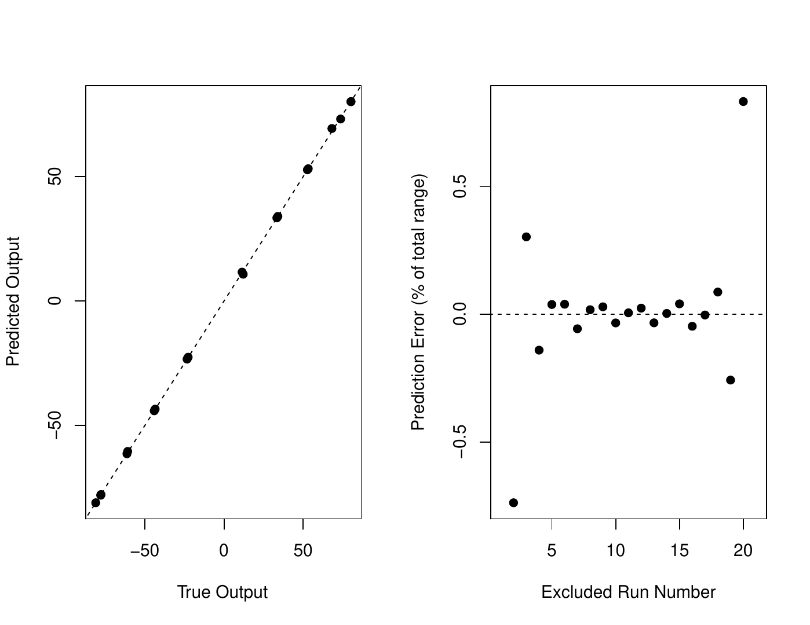

::: article
# Introduction

Emulation of computer model behavior in parameter space is a challenging
problem
[@DRI_ETAL_08; @HIG_ETAL_2008; @HOL_ETAL_10; @BHA_ETAL_12; @OLS_ETAL_12; @SEXTON_ETAL_12; @OLS_ETAL_13; @CHA_ETAL_2014b; @CHA_ETAL_2014].
Often a limited number of runs are available and we desire to estimate
model output at a variety of new parameter settings
[@DRI_ETAL_08; @HOL_ETAL_10; @BHA_ETAL_12; @OLS_ETAL_12; @SEXTON_ETAL_12; @OLS_ETAL_13; @CHA_ETAL_2014].
Emulation is often used in the context of another common problem, input
parameter estimation. Here, we desire to find probability distribution
functions for model input parameters given observational data [e.g.,
@OLS_ETAL_12; @CHA_ETAL_2014]. While model output is often
multi-dimensional, we restrict the discussion here to time series
although our approach can apply to vector output more generally.

Gaussian processes [@KEN_OHA_01; @RAS_WIL_06; @HIG_ETAL_2008; @ROU_08]
are a very useful methodology for such emulation. Gaussian processes
provide the best linear unbiased prediction under highly general
conditions [@STE_1999]. This methodology assumes that model response is
a smooth function of parameter settings. Central to the method is
formulation of the covariance function, which quantifies the covariance
between model output as a function of distance in each model input
parameter. This covariance is typically parametrized by parameters
controlling, for example, magnitude or the correlation ranges in each
coordinate dimension. Associated with emulator parameters is a
likelihood function given the model output. There are two main
approaches: (i) find the "best" parameter setting that maximizes this
likelihood, or (ii) find the full probability distribution of the
parameters. The next step is prediction at new parameter settings. The
former approach ignores the uncertainty in emulator parameters during
the prediction, while the latter approach accounts for it. The
prediction is probabilistic as it includes the predictive mean and the
uncertainty around it.

There are many existing R packages to perform Gaussian process emulation
for vector and time series output. In particular, they include
[*gstat*](https://CRAN.R-project.org/package=gstat) [@GRA_2016],
[*mlegp*](https://CRAN.R-project.org/package=mlegp)
[@DAN_DOR_2008; @DAN_2013],
[*spBayes*](https://CRAN.R-project.org/package=spBayes)
[@FIN_ETAL_2015], [*ramps*](https://CRAN.R-project.org/package=ramps)
[@SMI_ETAL_2008],
[*spTimer*](https://CRAN.R-project.org/package=spTimer)
[@BAK_ETAL_2015a; @BAK_ETAL_2015b], and
[*RandomFields*](https://CRAN.R-project.org/package=RandomFields)
[@SCH_ETAL_2015]. These spatio-temporal packages are usually general and
do not focus on time series specifically. Moreover, they are usually
presented in context of spatial interpolation ("kriging") rather than
emulation. They may provide flexible functionality in terms of
covariance functions (*RandomFields*), handling replicates (*mlegp*),
dealing with missing observations (*spTimer*), or considering both areal
as well as point observations (*ramps*). The procedure for fitting
emulator parameters differs between packages. Some packages use maximum
likelihood or another form of optimization to find the best parameters,
while others use Bayesian analysis.

Due to their statistical complexity, the broad scientific community may
find it challenging to use existing software. Particularly, the concept
of Markov chain Monte Carlo (MCMC) employed in some work may be
unfamiliar to some scientists. In addition, a large variety of modeling
or prior choices may leave a user struggling with which model or prior
they should employ and why. Many packages appear to be tailored to a
statistical audience, and elaborate statistical terminology may be
beyond the grasp for some scientists. Second, the packages do not
usually focus on the spatio-temporal output ubiquitous in computer
modelling. Thus, scientists may invest substantial time in finding the
right function among the plethora available. Finally, there is an issue
of terminology: many scientists may not realize that "spatio-temporal
modeling" may disguise the same technique as "emulation" and hence, may
be oblivious to the applicability of these packages.

We introduce the R package
[*stilt*](https://CRAN.R-project.org/package=stilt) version 1.3.0 for
simplified Gaussian Process AR(1) time series emulation with a focus on
climate modeling [@OLS_2017]. The package is available on Comprehensive
R Archive Network (CRAN). The main differences from prior approaches
are: (i) a simplified framework with fewer modeling choices and no MCMC
that is still applicable to real-life problems, and (ii) a focus on
emulation of time-series in parameter space. Specifically, there is only
one function to fit the emulator to model output and only one function
for prediction. Statistical modeling accounts for random noise in the
model output through the nugget term, and also allows for user-chosen
linear terms in model parameters and/or time. Mathematically, this is
the first public implementation of a separable covariance model of
[@ROU_08]. In this model, space-time covariance between two locations is
a product of a space covariance and a time covariance term. This allows
the use of matrix algebra to achieve considerable computational gains.
We include useful utility functions for extensive cross-validation, 2D
response surface plotting, and empirical 95% prediction interval
coverage. In three examples, we apply *stilt* to emulation in spaces
ranging from one- to five-dimensional. Note that whilst the software is
for emulation of time series output in parameter space, the package is
general and can be used for interpolation of observations (or model
output) in geographical coordinates [e.g.,
@CRE_JOH_08; @JON_ETAL_09; @HAN_ETAL_10; @BHA_ETAL_12; @HIR_ETAL_14].

In the rest of the paper we first outline the statistical approach, then
give three examples in 1D, 2D, and 5D parameter space, then present some
concluding remarks. We provide technical details in
the [6](#sec:Appendix).

# Statistical approach {#Stat_Met}

## Overview of Approach

Here, we briefly describe our statistical approach. Our statistical
model includes optional linear terms in parameters and/or time, a smooth
Gaussian process, and a purely random nugget term. The Gaussian process
represents smooth non-linear effects of parameters or time on the model
output. The nugget term represents purely random effects. For climate
model output, this corresponds to internal climate variability.

The first step is fitting the Gaussian process statistical model to the
computer model output. Specifically, the statistical model has several
parameters. They control the linear slopes in parameters and time, the
correlation ranges of the field in each of the input parameters, the
temporal autocorrelation, the overall magnitude of the covariance, and
the nugget strength. Associated with the emulator parameters is the
likelihood which quantifies how likely the emulator parameter values are
given the model output. During the emulator fitting, we vary the
parameters so that this likelihood is maximized to obtain the optimized
emulator. We use this optimized emulator for prediction. The prediction
follows the standard Gaussian process theory. The rest of the section
describes the details of the statistical methodology.

## Statistical model

We base our implementation on standard Gaussian process theory
[@CRE_1993; @STE_1999; @RAS_WIL_06]. Consider the case of interpolating
spatio-temporal model output of a perturbed parameter model ensemble in
parameter space. Let $y_{i,j} \in R$ be physical model output at a
parameter setting $\boldsymbol{\theta_i}$ and a time $t_j$. Time values
form an $n$-dimensional regularly spaced vector
$\boldsymbol{t} = (t_1, \dots, t_n)^T$.

Each parameter setting is an $m$-dimensional vector:
$\boldsymbol{\theta_i} = (\theta_{1,i}, \dots, \theta_{m,i})$. For all
$p$ model runs, the parameter settings $\boldsymbol{\theta_i}$ form a
$p \times m$ parameter matrix $\Theta$. Let
$\boldsymbol{y_j} = (y_{1,j}, \dots, y_{p,j})^T$ be a $p$-dimensional
vector of model outputs for all $p$ parameters for time $t_j$.
Consecutively, the stacked $pn \times 1$ column matrix of all model
output for times from 1 through $n$ is
$\mathbf{Y} = (\boldsymbol{y_1}^T , \dots, \boldsymbol{y_n}^T )^T$ .
Associated with $\mathbf{Y}$ is the $pn \times (m + 1)$ design matrix
$\mathbf{D}$. Its columns represent parameters and time, whereas rows
correspond to elements of $\mathbf{Y}$. We calculate the design matrix
$\mathbf{D}$ as:
$$\mathbf{D} = 
\begin{pmatrix}
	\begin{bmatrix}
	1 \\
	1 \\
	\vdots \\
	1
	\end{bmatrix}_{n \times 1}  
	\otimes \: \Theta &
	\quad \mathbf{t} 
    \otimes \begin{bmatrix}
	1 \\
	1 \\
	\vdots \\
	1
	\end{bmatrix}_{p \times 1}
\end{pmatrix},$$
where $\otimes$ is the Kronecker product. We model the output as a
Gaussian process such that
$$\mathbf{Y} \sim N(\boldsymbol{\mu_{\beta}}, \Sigma(\boldsymbol{\xi_y})),$$
where $\boldsymbol{\mu_{\beta}}$ is a mean function that is either
constant or linear in any combination of parameters and/or time, and
$\boldsymbol{\xi_y}$ is a vector of covariance matrix parameters. We
assume that $\boldsymbol{\mu_{\beta}} = \mathbf{X} \boldsymbol{\beta}$,
where $\boldsymbol{\beta}$ is a column vector of regression
coefficients, and $\mathbf{X}$ is a matrix of covariates. It always
includes a column of ones as its first column to represent the
intercept. Depending on the number of regressors, it can additionally
have corresponding columns of the design matrix $\mathbf{D}$. As an
example, for a mean function that is linear in time,
$\boldsymbol{\beta}$ has dimensions of $2 \times 1$, and $\mathbf{X}$ is
$pn \times 2$:

$$\mathbf{X} = 
\begin{bmatrix}
1 & t_1 \\
1 & t_2 \\
\vdots & \vdots \\
1 & t_n
\end{bmatrix}_{n \times 2}
\otimes
\begin{bmatrix}
1 \\
1 \\
\vdots \\
1
\end{bmatrix}_{p \times 1.}$$

Under the assumption of separability [see @ROU_08], we can represent the
covariance matrix $\Sigma$ as a Kronecker product of a separate
covariance matrix in time $\Sigma_t$ and in parameters
$\Sigma_{\theta}$:

$$\Sigma = \Sigma_t \otimes \Sigma_{\theta}.$$

This means that the covariance between any two locations in time and
parameter space is a product of the time covariance term, and the
parameter covariance term. This is a different approach to speed up the
computation, compared to performing singular value decomposition (SVD)
of model output
[@DAN_DOR_2008; @DAN_2013; @HIG_ETAL_2008; @CHA_ETAL_2014]. We assume
that the time covariance matrix $\Sigma_t \: (n \times n)$ has an AR(1)
structure. AR(1) dependence in time is a feature of many environmental
processes [e.g., @HAS_76; @KEL_MCI_08; @OLS_ETAL_13]. To avoid
identifiability issues, we do not use any multipliers for this matrix.
Specifically, its $(j,k)$ element is:
$$\varsigma_{t, jk} = \frac{\rho^{|t_j - t_k|}}{1 - \rho^2},$$
where $\rho$ is the lag-1 autocorrelation parameter. We assume that the
parameter covariance $\Sigma_{\theta}$ ($p \times p)$ is squared
exponential, as in the package *mlegp* [@DAN_DOR_2008; @DAN_2013]. The
squared exponential covariance function is frequently used in computer
model emulation, as computer model outputs can be often represented
using a highly smooth Gaussian process. The $(i,j)$ element of
$\Sigma_{\theta}$ is:
$$\varsigma_{\theta, ij} = \kappa \exp(-\sum_{k=1}^m \frac{|\theta_{k,i}-\theta_{k,j}|^2}{\phi_k^2}) + \zeta 1(i=j)$$
where $\kappa$ is the partial sill, $\zeta$ is the nugget, and $\phi_k$
is the range parameter for the $k^{th}$ model input parameter. The range
parameters form a vector $\boldsymbol{\phi} = \phi_1, \dots, \phi_m$. We
construct the total covariance matrix ($np \times np$) as:
$$\Sigma = 
\begin{bmatrix}
\varsigma_{t, 11}\Sigma_{\theta} & \cdots & \varsigma_{t, 1n}\Sigma_{\theta} \\
\vdots & \ddots & \vdots \\
\varsigma_{t, n1}\Sigma_{\theta} & \cdots & \varsigma_{t, nn}\Sigma_{\theta} 
\end{bmatrix}.$$

Hence, the covariance parameters are
$\boldsymbol{\xi_y} = (\rho, \kappa, \boldsymbol{\phi}, \zeta)^T$. The
emulator parameters are $\boldsymbol{\psi} = (\boldsymbol{\beta}^T,
\boldsymbol{\xi_y}^T)^T$. The actual number of emulator parameters will
be different depending on the number of model parameters that the
ensemble varies and on the number of covariates.

## Estimating emulator parameters

We can write the log-likelihood for the model output $\mathbf{Y}$ given
the emulator parameters $\boldsymbol{\psi}$ as [see, e.g., @RAS_WIL_06]:
$$\label{Eq_lik}
\ln L(\mathbf{Y} | \boldsymbol{\psi}) = -\frac{1}{2}(\mathbf{Y} - \boldsymbol{\mu_{\beta}})^T \Sigma^{-1} (\mathbf{Y} - \boldsymbol{\mu_{\beta}}) - \frac{1}{2}\ln |\Sigma| - \frac{np}{2}\ln{2\pi}.   (\#eq:Eq-lik)$$
Under the uniform priors for the emulator parameters,
$$L(\boldsymbol{\psi} | \mathbf{Y}) \propto L(\mathbf{Y} | \boldsymbol{\psi}).$$
Consequently, maximizing the log-likelihood for the model output also
maximizes the likelihood for the parameters. Note that this likelihood
evaluation involves a computationally expensive inverse of an
$np \times np$ matrix. However, we can reduce the dimension of the
inverted matrices to $p \times p$ and $n \times n$, and speed up the
computation (see [6](#sec:Appendix)). Thus, the computational cost of
inversion becomes $O(p^3)$ or $O(n^3)$, as opposed to $O([pn]^3)$.
Further computational savings accrue when calculating $|\Sigma|$,
considering that $\Sigma$ is a Kronecker product of two positive
definite matrices (see [6](#sec:Appendix)).

We optimize the emulator parameters $\boldsymbol{\psi}$ by maximizing
the likelihood function over a reasonable parameter range using a local
optimization routine. Specifically, *stilt* uses the `nlminb` function
which calls FORTRAN code [@GAY_90]. In the package, there is an option
to either fix $\boldsymbol{\beta}$ parameters at their multiple linear
regression estimates or to optimize them along with other emulator
parameters.

## Prediction

We are interested in predicting model output for all times for a new
parameter setting $\boldsymbol{\theta^*}$. We denote the $n$-dimensional
vector output as
$\boldsymbol{y^*} = (y_{\boldsymbol{\theta^*},1}, \dots,
y_{\boldsymbol{\theta^*},n})^T$. Associated with the prediction
parameter setting is an $n \times 1$ prediction design matrix
$\mathbf{D^*}$ and a matrix of covariates $\mathbf{X^*}$ evaluated at
predictions points. It is constructed similarly to $\mathbf{X}$. For a
mean function that is linear in time, $\mathbf{X^*}$ is:
$$\mathbf{X^*} = 
\begin{bmatrix}
1 & t_1 \\
1 & t_2 \\
\vdots & \vdots \\
1 & t_n
\end{bmatrix}_{n \times 2}
.$$

The prediction is given by the following multivariate normal
distribution [@RAS_WIL_06]:
$$\boldsymbol{y^*} \sim N(\boldsymbol{\mu}^*_{\boldsymbol{\beta}}, \Sigma^*).$$
Here,
$$\boldsymbol{\mu}^*_{\boldsymbol{\beta}} = \mathbf{X^*}\boldsymbol{\beta} + (\Sigma_t \otimes \Sigma_{\theta^* \theta}) \Sigma^{-1} (\mathbf{Y} - \boldsymbol{\mu}_{\boldsymbol{\beta}}),$$
where $\Sigma_{\theta^* \theta}$ is a $1 \times p$ cross-covariance
matrix between the prediction parameter setting and all the ensemble
parameters settings. For this matrix, we use the same covariance
function as for $\Sigma_{\theta}$. To evaluate the mean function, we
need the inverse of the $\Sigma$ matrix ($np \times np$). However, using
matrix algebra [@GOL_VAN_LOA_96; @ROU_08], we can reduce the dimension
to $p \times p$ by writing $\boldsymbol{\mu}^*_{\boldsymbol{\beta}}$ in
the following way:
$$\boldsymbol{\mu}^*_{\boldsymbol{\beta}} = \mathbf{X^*}\boldsymbol{\beta} + (\mathbf{I}_{n \times n} \otimes \Sigma_{\theta^* \theta} \Sigma_{\theta}^{-1})(\mathbf{Y} - \boldsymbol{\mu}_{\boldsymbol{\beta}}).$$
The predictive covariance also requires an inversion of a $p \times p$
matrix only:
$$\Sigma^* = (\kappa + \zeta)\Sigma_t - \Sigma_t \otimes \Sigma_{\theta^* \theta} \Sigma_{\theta}^{-1} \Sigma_{\theta^* \theta}^T.$$
Prediction for many points uses the same inverse parameter covariance.
Hence, we can calculate the inverse once and recycle it for prediction
at many points. This further enhances computational savings.

# Examples using stilt {#Exa}

## Preparing model output

Here, we describe how to prepare model output for use with the *stilt*
emulator. Two R list objects are required. These objects can be easily
prepared by the user before the start of the analysis. The first,
`mpars`, contains information on parameter settings in the ensemble. It
has the following components:

-   `par` is the actual matrix of parameter settings, with rows
    corresponding to parameter index, and columns to the model run
    index.

-   `parnames` is a vector of parameter names corresponding to the rows
    of `par`,

-   `parunits` is a vector of units.

The second object, `moutput` has information on model output. It also
has several components, the most important being `out` which is the
output model matrix with rows referencing time and columns referencing
model run. Other elements contain metadata: `t` is the corresponding
time vector, `tunuts` are time units, `outname` is the name of the
modeled variable, and `outunits` are the corresponding units.

## Simple 1D example

This and the following examples are based on running *stilt* version
1.3.0 on R version 3.3.3 using a 3 Ghz Intel core i5 16GB 2400 MHz DDR4
Macintosh 10.13.6 computer. The following versions were used for other
required packages: [*fields*](https://CRAN.R-project.org/package=fields)
(9.0), [*maps*](https://CRAN.R-project.org/package=maps) (3.3.0),
[*spam*](https://CRAN.R-project.org/package=spam) (2.1-2), and
[*dotCall64*](https://CRAN.R-project.org/package=dotCall64) (0.9-5). The
results were observed to differ slightly according to the programming
environment and the operating system.

We first consider interpolating a toy model dataset consisting of a
simple time-series output for one parameter with a total of 21 parameter
settings and 11 time points. The output of this simple model as a
function of time $t$ and parameter $\theta$ is:
$y = \sin(\theta)(1 + 2t + t^2)$. The model is evaluated for
$\theta=(0, 1, \dots, 20)$, and each run produces a time series for
times $t=(0, 1, \dots, 10)$. First, we can plot model output for all
parameters:

``` r
R> data("Data.1D.model")
R> data("Data.1D.par")
R> plot(NA, xlim=c(0, 11), ylim=c(-150, 150), xlab="Time", ylab="Model output")
R> for (c in 1:21) {lines(Data.1D.model$t, Data.1D.model$out[,c])}
```

The output of this code is shown in Figure [1](#fig:Figure1).

{#fig:Figure1 width="100%"
alt="graphic without alt text"}

Now, we fit a Gaussian process emulator to these data. While we do not
use any parameter covariances (`par.reg=FALSE`), we do use a linear time
covariate (`time.reg=TRUE`). The optimization follows the default
behavior of fixing the linear regressors at the multiple linear
regression estimates. We select 100 as the starting values for both
$\kappa$ and $\zeta$ because this leads to reasonable optimization
results.

``` r
R> emul1D = emulator(Data.1D.par, Data.1D.model, par.reg=FALSE, time.reg=TRUE, 
kappa0=100, zeta0=100)
Initializing the emulator...

Initial regression parameters:
-0.665481 0.570413

Initial emulator likelihood is: -960.2755

Optimizing the emulator...
Obtaining emulator parameter ranges for optimization...

Relative tolerance to be used in optimization: 1e-10

Option 'fix.betas': during optimization beta parameters are going to be
fixed at the following values:
-0.665481 0.570413

------------------------------------
Starting parameter optimization...
-------------------------------------
  0:     960.27550: 0.900000  100.000  100.000  10.0000
  1:     947.88498: 0.903188  72.2395  233.781  10.1709
  2:     898.20175: 0.957801 0.00240862  151.661  13.5627
  3:     889.24528: 0.977342 0.00240862  131.201  13.4426

 48:     464.48240: 0.982420  1076.06 0.00240862  3.93464
Optimization SUCCESSFUL! Optimization message below:

relative convergence (4)

Final parameterss
rho kappa zeta phi
0.98242004 1076.05714589 0.00240862 3.93464218

48 iterations were performed
Final likelihood = -464.4824

CAUTION! The optimization might only find a local minimum.
```

The package informs us of key emulator parameter settings, and of
optimization results. (For brevity, only the start and the end of
optimization process are shown above.) The list of parameters to be
optimized is $\rho$, $\kappa$, $\zeta$, and $\phi_1$ in this case. The
final emulator is a highly autocorrelated process with a large partial
sill, but a very low nugget. The emulator object `emul1D` is a list with
many components, with a secondary custom `"emul"` class. The components
include information on the data used to fit the emulator, optimized
emulator parameters, some settings used during optimization, time and
parameter covariance matrices, and the inverse of the parameter
covariance matrix. Now, we validate the emulator using one-at-a-time
cross-validation for time index 9 (close to the end of the time series).
Specifically, we remove each parameter setting from the ensemble one at
a time, and use the emulator to predict the output at the excluded
parameter setting, given the output at other parameter settings.

``` r
R> test.all(emul1D, 9)
```

The emulator mean prediction shows a remarkable accuracy at predicting
actual model response: the two fall almost perfectly on the 1:1 line of
a reliability diagram (Figure [2](#fig:Figure2)). The emulator
prediction error is much less than 1% for almost all runs (Figure
[2](#fig:Figure2)). Note that the emulator does not extrapolate beyond
the ensemble parameter range.

<figure id="fig:Figure2">
<div class="center">

</div>
<figcaption>Figure 2: Toy example emulator one-at-a-time
cross-validation results: (left) predicted vs. actual model output
(black dots) and a 1:1 line; (right) relative prediction error as a
function of the excluded model run number. </figcaption>
</figure>

The emulator predicts at new parameter settings using the function
`predict.emul`. This is implemented using the generic S3 `predict`
function that dispatches to the `predict.emul()` method for objects of
class `"emul"`. This function returns an object with components `mean`
and `covariance` representing the mean and the covariance of the
prediction.

## A more challenging test case: 2D Korean summer mean maximum temperature variability and change

Next, we consider Korean summer mean maximum temperature output from 29
Coupled Model Intercomparison Project phase 5 (CMIP5) climate models
[@TAY_ETAL_2012] for years 2081-2100 for the RCP8.5 forcing scenario
[@MOS_ETAL_2010]. All of the models and calculations used here follow
@SHI_ETAL_2018, however here we exclude the model IPSL$\_$CM5A$\_$LR
from the analysis. Of interest is the relationship between the
present-day (years 1973-2005) sample red noise properties for annual
temperature time-series, and the future mean maximum summer temperature
changes in these climate models. Hence, each model $i$ is associated
with $\boldsymbol{\theta_i}=(\sigma_i, \rho_i)$, where $\sigma_i$ is
sample innovation standard deviation, and $\rho_i$ is sample first-order
autocorrelation. In this case, $m=2$, $p=29$, and $n=20$.

First, we load the relevant datasets and plot the temperature time
series for all models.

``` r
R> data("Data.AR1Korea.model")
R> data("Data.AR1Korea.par")
R> mycolors = rainbow(29)
R> plot.default(NA, xlim=c(2081, 2100), ylim=c(0,10), xlab="Year",
             ylab="JJA Mean Max Temp Anomaly wrt. 1973-2005 [K]")
R> for (c in 1:29) {lines(Data.AR1Korea.model$t, Data.AR1Korea.model$out[,c],
                       col=mycolors[c])}
```

{#fig:Figure3 width="15cm"}

We note that the models show a considerable internal variability
superimposed on a trend of slow warming (Figure [3](#fig:Figure3)).
Next, we fit an emulator while also allowing for optimization of
regression slopes in innovation standard deviation and time. We also use
a custom relative tolerance to illustrate how this parameter may be
changed to fit user needs.

``` r
R> emul = emulator(Data.AR1Korea.par, Data.AR1Korea.model, par.reg=c(TRUE, 
FALSE), time.reg=TRUE, kappa0=1, zeta0=1, myrel.tol=1E-9, fix.betas=FALSE)

Initializing the emulator...

Initial regression parameters:
-116.0626827 3.8544881 0.0563853

Initial emulator likelihood is: -937.479

Optimizing the emulator...
Obtaining emulator parameter ranges for optimization...

Relative tolerance to be used in optimization: 1e-09


------------------------------------
Starting parameter optimization...
-------------------------------------
 0: 937.479: 0.900000  1.00000  1.00000 -116.063  3.85449 0.0563853 0.322532 0.257
 1: 923.956: 0.899929 0.468880  1.36686 -116.087  3.85444 0.0563734 0.322768 0.257
 2: 901.460: 0.899874 9.24879e-05  1.05990 -116.096  3.85442 0.0563689 0.322900 0.257
 3: 900.363: 0.899860 0.0377996  1.17131 -116.068  3.85445 0.0563831 0.322900 0.257

54: 858.446: 0.616698 9.24879e-05  1.10326 -123.432 3.86546 0.0599039 6.45065 4.396
Optimization SUCCESSFUL! Optimization message below:

relative convergence (4)

Final parameterss
rho kappa zeta beta beta beta phi phi
0.616698 9.24879e-05  1.10326 -123.432 3.86546 0.0599039 6.45065 4.396

54 iterations were performed
Final likelihood = -858.4463

CAUTION! The optimization might only find a local minimum.
```

Note that we have formatted the output slightly to fit the page width.

We see that the initial multiple regression provides reasonable mean and
parameter slopes. They are close to the final optimized results (fourth
through sixth elements of the optimized parameter vector called
`"Final parameters"` above). There is a considerable linear dependence
on both time and innovation standard deviation. The non-linear part of
the emulator has a strong random component, and a very weak Gaussian
process component. This suggests no systematic dependence of the model
output on the present-day autocorrelation. We can predict the
temperature response at an arbitrary setting of the parameters using the
`predict` function. We do this for $\sigma=1$ and $\rho=0$:

``` r
R> pred = predict(emul, c(1, 0))
R> plot.default(NA, xlim=c(2081, 2100), ylim=c(3.5,7.5), xlab="Year",
             ylab="JJA Mean Max Temp Anomaly wrt. 1973-2005 [K]")
R> lines(emul$t.vec, pred$mean)
R> lines(emul$t.vec, pred$mean + sqrt(diag(pred$covariance)), col="brown")
R> lines(emul$t.vec, pred$mean - sqrt(diag(pred$covariance)), col="brown")
```

The mean vector of the prediction is the `mean` component of `pred`, and
the variance vector is composed of the diagonal entries of `covariance`.
Figure [4](#fig:Figure4) shows the predicted response, with the
associated 1-std uncertainty. We note the linearity of the warming in
time. This illustrates the ability of the emulator to identify
fluctuations of temperature in the models around the linear trend as
random, and not to include them into the emulated response.

{#fig:Figure4 width="11cm"}

## An even more challenging test case: Five-dimensional ice sheet model output

Next, we consider a 5D emulator for the SICOPOLIS ice sheet model output
[@GRE_1997; @GRE_ETAL_2011] for Greenland ice mass loss relative to the
year 2003. This is a perturbed parameter 100-member ensemble which
varies five model parameters: flow enhancement factor, basal sliding
factor, geothermal heat flux, snow positive degree-day (PDD) factor, and
ice PDD factor. The future forcing scenario is that of a gradual
temperature increase stabilizing at approximately 5 K warmer than
present [@APP_ETAL_12]. Output is available annually between years 1840
and 2500.

We load relevant data and fit an emulator to the ensemble using all five
parameters and time as covariates. For computational expediency, we fix
slope parameters at their multiple regression estimates.

``` r
R> data(Data.Sicopolis.par)
R> data(Data.Sicopolis.model)
R> emul.Sicopolis = emulator(Data.Sicopolis.par, Data.Sicopolis.model, 
        par.reg=c(TRUE, TRUE, TRUE, TRUE, TRUE),
        time.reg=TRUE, kappa0=1000000, zeta0=50000)
Initializing the emulator...

Initial regression parameters:
5154878.375 171.401 8590.267 -182.659 49920.313 1300.488 -2725.378

Initial emulator likelihood is: -10782007

Optimizing the emulator...
Obtaining emulator parameter ranges for optimization...

Relative tolerance to be used in optimization: 1e-10

Option 'fix.betas': during optimization beta parameters are going to be
fixed at the following values:
5154878.375 171.401 8590.267 -182.659 49920.313 1300.488 -2725.378

------------------------------------
Starting parameter optimization...
-------------------------------------
 0:     10782007.: 0.900 1.00e+06  50000.0  1.97305  9.84502  19.9205  1.98380  7.45
 1:     672836.29:  1.00 3.29e+07 7.05408e+07  2.83691  8.68834  27.1292  2.24728 0.00149
 2:     672613.27: 0.999 3.29e+07 7.05341e+07  2.83691  8.68834  27.1292  2.24728 0.0537
 3:     667210.63: 0.997 3.20e+07 7.08502e+07  2.86488  8.69561  27.3808  2.26410  14.54

79:     485611.17: 0.999989 5.83e+06  41529.0  13.4764  20.1003  199.578  5.72313  10.9
Optimization SUCCESSFUL! Optimization message below:

relative convergence (4)

Final parameters
rho kappa zeta phi phi phi phi phi
0.999989 5829746.770135 41528.993339 13.476403 20.100261 199.578404 5.723128 10.901509

79 iterations were performed
Final likelihood = -485611.2

CAUTION! The optimization might only find a local minimum.
```

The emulator takes roughly 3 minutes to fit on a 3 Ghz Intel core i5
16GB 2400 MHz DDR4 Macintosh computer. The final emulator is very smooth
as evidenced by the relatively high range parameters compared to the
ensemble parameter range, and has an extremely low nugget compared to
the partial sill parameter.

Next, we perform cross-validation of the emulator for the entire time
series. We withhold three ensemble members, and predict at withheld
parameters using the model output at the remaining 97 parameter
settings.

``` r
R> test.csv(emul.Sicopolis, num.test=3, plot.std=TRUE, theseed=13241240)
Predicting for run number:  3 
Predicting for run number:  26 
Predicting for run number:  93 
```

Here, we have specified a random seed, and the output tells us which
model runs were excluded. Alternatively, we can select the runs to
withhold via the `test.runind` argument. We present the results in
Figure [5](#fig:Figure5). The emulator has remarkable skill at
recovering the output of the withheld models.

![Figure 5: Cross-validation of Greenland Ice Sheet anomaly with respect
to year 2003 \[Gt\] from the SICOPOLIS ensemble. Thick beige lines:
actual model output. Brown lines: emulator predictions with standard
error confidence intervals.](Figure5.png){#fig:Figure5 width="15cm"}

Now, we withhold more runs and perform a more systematic analysis of
emulator behavior:

``` r
R> mytest = test.csv(emul.Sicopolis, num.test=10, plot.std=FALSE, theseed=13241240,
                  make.plot=FALSE)
Predicting for run number:  3 
Predicting for run number:  7 
Predicting for run number:  26 
Predicting for run number:  34 
Predicting for run number:  37 
Predicting for run number:  43 
  ...Prediction error. Likely because prediction parameters are out of bounds
Predicting for run number:  91 
Predicting for run number:  93 
Predicting for run number:  99 
Predicting for run number:  100 
NOTE: 1  prediction points were omitted

R> cat("95% CI coverage:", mytest$coverage, "\n")
95% CI coverage: 0.9768028
```

Note that *stilt* does not extrapolate beyond the parameter range of the
ensemble. Since one of the parameters is at its maximum among the
ensemble for the $43^{rd}$ run, this run is skipped during the
cross-validation. We disable the plotting since our main interest here
is empirical coverage of the 95% prediction interval. The coverage
(0.977) is relatively close to the ideal theoretical value of 0.95,
which suggests that the emulator is relatively well calibrated.

We finish by plotting the response surface of the emulator for
parameters 4 (snow PDD factor), and 5 (ice PDD factor). We fix flow
enhancement factor, basal sliding factor, and geothermal heat flux at
values of 3.0, 10.0 m y$^{-1}$ Pa$^{-1}$, and 45.0 m W m$^{-2}$,
respectively.

``` r
R> rsurface.plot(emul.Sicopolis, parind=c(4,5), parvals=c(3, 10, 45, NA, NA),
              tind=600, n1=10, n2=10)
```

We look at the 600$^{th}$ time index (year 2439), where `n1` and `n2`
are the number of grid points to use in the $x$ and $y$ directions,
respectively. Figure [6](#fig:Figure6) shows the response surface. A
monotonic positive relationship exists between the ice mass anomaly as a
function of the snow PDD factor across most of the ice PDD factor range.
However, the relationship between the ice mass loss and the ice PDD
factor appears to be non-monotonic.

![Figure 6: Response surface of SICOPOLIS Greenland Ice Sheet anomaly
with respect to year 2003 \[Gt\] for year 2439 as a function of
parameter 4 (snow PDD factor, mm day$^{-1}$ K$^{-1}$) and parameter 5
(ice PDD factor, mm day$^{-1}$ K$^{-1}$) ](Figure6.png){#fig:Figure6
width="15cm"}

# Concluding remarks {#Con_Rem}

Here, we present *stilt* - a package for simplified Gaussian process
emulation. The package is designed for emulation of time series model
output in parameter space, although it can be applied for kriging more
generally. The focus is on simplicity, so the package could be easily
applied to many challenging problems by users outside of the statistics
research community. The streamlined emulator fitting and prediction
means the package is also useful pedagogically in demonstrating the
Gaussian process emulation. We assume separability in space and time for
the Gaussian process. This allows us to reduce computational burden
using matrix algebra, and makes it possible to apply the package to
moderately large datasets, especially in the time dimension. We showcase
package capabilities on three examples which differ in the amount of
parameters in the model ensemble. Specifically, we use a 1D toy dataset,
a 2D dataset of Korean summer mean maximum temperatures, and the 5D
SICOPOLIS ice sheet model output. Using cross-validation functions, we
show the capability of the emulator to predict model response at
excluded parameter values in up to five dimensions. We demonstrate the
capacity to visualize estimated 2D model response surfaces. The package
can be useful when computational resources are limited, and a relatively
fast statistical approximator is required for a complex model across a
range of parameter space. Some limitations of the package are
homoskedasticity, separability, and the fixed covariance structure
(e.g., AR(1) and the squared exponential function). We choose the AR(1)
model because it is applicable to data in diverse scientific fields
[@HAS_76; @KEL_MCI_08; @ZEN_2011; @OLS_ETAL_13]. The disadvantage is
that such an emulator may not handle seasonal or periodic effects that
may be present in computer model output. Extending the package to
account for heteroskedasticity [e.g., *hetGP* package, @BIN_GRA_2017]
should be considered in future work.

# Acknowledgments

For their roles in producing, coordinating, and making available the
CMIP5 model output, we acknowledge the climate modeling groups, the
World Climate Research Programme's (WCRP) Working Group on Coupled
modeling (WGCM), and the Global Organization for Earth System Science
Portals (GO-ESSP). We thank Jong-Soo Shin for help with extracting
Korean temperature output, and Patrick Applegate for sharing the
SICOPOLIS ice sheet model output. We acknowledge financial support from
National Research Foundation of Korea (NRF-2009-0093069,
NRF-2018R1A5A1024958), and from the Institute for Basic Science (project
code IBS-R028-D1). This work was also co-supported by the National
Science Foundation through the Network for Sustainable Climate Risk
Management (SCRiM) under NSF cooperative agreement GEO-1240507 and the
Penn State Center for Climate Risk Management. Any opinions, findings,
and conclusions or recommendations expressed in this material are those
of the authors and do not necessarily reflect the views of the National
Science Foundation, or any other foundation or entity.

# Appendix {#sec:Appendix}

This Appendix describes the technique to reduce computational cost when
evaluating the likelihood (Equation \@ref(eq:Eq-lik)). In its original
form, it involves a computationally expensive inverse of an
$np \times np$ matrix. Consider a $p \times n$ matrix $\mathbf{C}$,
where
$\mathbf{Y} - \boldsymbol{\mu_\beta} = \textnormal{vec}(\mathbf{C})$,
and the vec operation stacks columns of a matrix into a column vector,
from left to right [@ROU_08]. Using properties of Kronecker products
[@GOL_VAN_LOA_96], of the vec operator [@MAG_NEU_2007], and other matrix
algebra:
$$\begin{aligned}
(\mathbf{Y} - \boldsymbol{\mu_{\beta}})^T \Sigma^{-1} (\mathbf{Y} - \boldsymbol{\mu_{\beta}}) & =
(\textnormal{vec}(\mathbf{C}))^T [ \Sigma_{t}^{-1} \otimes \Sigma_{\theta}^{-1} ] \textnormal{vec}(\mathbf{C}) \\
 & = (\textnormal{vec}(\mathbf{C}))^T [ (\Sigma_{t}^{-1})^T \otimes \Sigma_{\theta}^{-1} ] \textnormal{vec}(\mathbf{C}) \\
 & = (\textnormal{vec}(\mathbf{C}))^T \textnormal{vec}(\Sigma_{\theta}^{-1} \mathbf{C} \Sigma_t^{-1}) \\
 & = \textnormal{sum} 
\begin{bmatrix}
\mathbf{C} \ast (\Sigma_{\theta}^{-1}\mathbf{C}\Sigma_t^{-1})
\end{bmatrix},
\end{aligned}$$
where $*$ is the Hadamard product. This reduces the dimension of
matrices that are inverted to $p \times p$ and $n \times n$, thus
substantially reducing computational burden. We further note that both
matrices $\Sigma_{\theta}$ and $\Sigma_t$ are positive definite
[@WIC_2013 and others]. Thus, the inverses can be found through the
Cholesky decomposition of
$\Sigma_{\theta} = \mathbf{R}^T_{\theta}\mathbf{R}_{\theta}$, where
$\mathbf{R}_{\theta}$ (called Cholesky factor) is an upper triangular
matrix; and similarly for $\Sigma_t$.

Additionally, determinant computations can be simplified considerably
[@GEN_07]:
$$|\Sigma| = |\Sigma_t \otimes \Sigma_{\theta}| = |\Sigma_t|^p |\Sigma_{\theta}|^n.$$
Thus, we only need to evaluate the determinants of the individual
covariance matrices. Moreover, since $\Sigma_{\theta}$ and $\Sigma_t$
are positive definite,
$|\Sigma_{\theta}| = \prod_{i=1}^p r_{\theta, ii}^2$, where
$r_{\theta, ii}$ are diagonal elements of the Cholesky factor
$\mathbf{R}_{\theta}$. Similar calculations can be performed for
$|\Sigma_t|$.
:::
