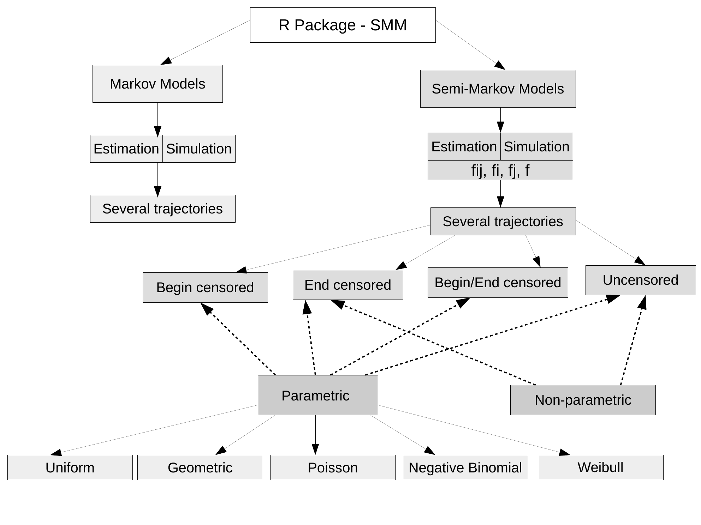

::: article
# Introduction

Semi-Markov models, independently introduced by @Lev54, @Smi55 and
@Tak54, are a generalization of the well-known Markov models. For
semi-Markov models, sojourn times can be arbitrarily distributed, while
sojourn times of Markov models are constrained to be exponentially
distributed (in continuous time) or geometrically distributed (in
discrete time). For this reason, semi-Markov processes are more general
and more adapted for applications than the Markov processes.

Semi-Markov processes have become important tools in probability and
statistical modeling with applications in various domains like survival
analysis, biology, reliability, DNA analysis, insurance and finance,
earthquake modeling, meteorology studies, etc.; see, e.g., @HeHu02,
@ouli2, @Marg06, @JaMa06, @Votsi2012, @ENV:ENV2215, @Votsi, @Gu2016,
@Barbu2016, @Gu2016b for semi-Markov processes in continuous or discrete
time with various applications and @SaTh01, @Bull06, @BarLim2008, for
hidden semi-Markov models and applications in climatology, finance and
DNA analysis.

Note that the semi-Markov theory is developed mainly in a
continuous-time setting, while utterly less works address the
discrete-time case. We refer the reader to @limnios1 for continuous-time
framework and to @BarLim2008 and references therein for discrete-time
framework. The R package [*SMM*](https://CRAN.R-project.org/package=SMM)
that we present in this paper is developed in discrete time. Note that
undertaking works also in discrete time (modeling stochastic tools,
associated estimation procedures, corresponding software, etc.) is an
important issue for several reasons. In our opinion, the most relevant
of these reasons is that the time scale is intrinsically discrete in
several applications. For instance, in DNA studies, when modeling a
nucleotide or protein sequence by means of a stochastic process, the
"time" of that process is in fact the position along the sequence, so it
is discrete. Other examples can be found in some reliability/survival
analysis applications where the time represents the number of cycles of
a system or the counting of days/hours/etc. We can argue further for the
importance of developing works also in discrete time, in parallel to
their analogous ones developed in continuous time. For instance, we can
mention the simplicity of computations in discrete time, the fact that a
discrete-time stochastic process does not explode, the potential use of
discrete processes after the discretization of continuous ones, etc.

Few R packages have been developed to handle semi-Markov models or
hidden semi-Markov models. For semi-Markov models we have the recent
[*semiMarkov*](https://CRAN.R-project.org/package=semiMarkov) R package
[@krol_semimarkov_2015] that performs maximum likelihood estimation for
parametric continuous-time semi-Markov processes, where the distribution
can be chosen between Exponential, Weibull or exponentiated Weibull.
That package computes associated hazard rates; covariates can also be
taken into account through the Cox proportional hazard model. Two R
packages are also dedicated to hidden semi-Markov models, implementing
estimation and prediction methods: the
[*hsmm*](https://CRAN.R-project.org/package=hsmm) R package
[@bulla_hsmm_2010] and the
[*mhsmm*](https://CRAN.R-project.org/package=mhsmm) R package
[@oconnell_hidden_2011].

Note that there is no R package developed for discrete-time multi-state
semi-Markov models. Thus the purpose of this paper is to present an R
package that we have developed, called *SMM*, which performs parametric
and non-parametric estimation and simulation for multi-state
discrete-time semi-Markov processes. For the parametric estimation,
several discrete distributions are considered for the sojourn times:
Uniform, Geometric, Poisson, Discrete Weibull and Negative Binomial. The
non-parametric estimation concerns the sojourn time distributions, where
no assumptions are made on the shape of distributions. Moreover, the
estimation can be done on the basis of one or several trajectories, with
or without censoring. The aim of this paper is to describe the different
possibilities of this package. To summarize, the package *SMM* that we
present deals with different problems:

-   Parametric estimation for sojourn time distributions (Uniform,
    Geometric, Poisson, Discrete Weibull and Negative Binomial) or
    non-parametric estimation;

-   One or several sample paths;

-   Four different types of sojourn times: a general one depending on
    the current state and on the next state to be visited, one depending
    only on the next state, one depending only on the current state, and
    one depending neither on the current state nor on the next state;

-   Four different types of censoring: censoring at the beginning of
    sample paths, censoring at the end of sample paths, censoring at the
    beginning and at the end of sample paths or no censoring at all.

Let us make some remarks about these points.

First, concerning the censoring, the simplest situation is the one when
all the sojourn times are completely observed (non censored). A more
complicated and realistic framework is when the last sojourn time is not
completely observed, thus being right censored; in most practical
situations this case occurs. An analogous situation is when the first
sojourn time is not completely observed, thus being also right censored.
In practice, this last case occurs when one does not know the beginning
of a phenomenon modeled by a semi-Markov chain. Note that this censoring
at the beginning of the sample path is a right censoring (not a left
censoring); indeed, when the first sojourn time is censored as in our
paper, the available information is that the real sojourn time (that is
not observed) is greater than this censored observed time. Thus we are
clearly in a right censoring framework, although this happens at the
beginning (i.e., left) of the trajectory, which could seem confusing.
The most complete framework is when both the first and the last sojourn
times are right censored.

Second, when considering estimation starting from several independent
sample paths of a semi-Markov chain, it is assumed that all the
trajectories are censored in the same way; note that this is not a real
constraint, but we imposed this condition only in order to avoid useless
technical notations that would make the comprehension more difficult.

Third, note that it is important for the four types of models (of
sojourn times) to be considered separately because: (i) in practical
situations, one model could be more adapted than some other; (ii)
different models will yield specific parameter estimators, so it is
important to study them separately.

The paper is organized as follows. The next section **Semi-Markov
models** describes the semi-Markov models used in this package. Section
**The SMM package** illustrates the different functions of the *SMM*
package. We end the paper by presenting some concluding remarks on this
R package.

# Semi-Markov models {#semi-Markov_models}

Let us consider a random system with finite state space
$E=\{1,\ldots, s\}$, $s < \infty.$ Let $(\Omega,\mathcal{A},\mathbb{P})$
be a probability space and assume that the time evolution of the system
is governed by a stochastic process $Y=(Y_k)_{k\in \mathbb N^*},$
defined on $(\Omega,\mathcal{A},\mathbb{P})$ with values in $E;$ that is
to say that $Y_k$ gives the state of the system at time $k.$ Let
$T=(T_m)_{m\in \mathbb N^*},$ defined on
$(\Omega,\mathcal{A},\mathbb{P})$ with values in $\mathbb N$, be the
successive time points when state changes in $(Y_k)_{k\in \mathbb N^*}$
occur (the jump times) and let also $J=(J_m)_{m\in \mathbb N^*},$
defined on $(\Omega,\mathcal{A},\mathbb{P})$ with values in $E$, be the
successively visited states at these time points. The relation between
the process $Y$ and the process $J$ of the successively visited states
is given by $Y_k =J_{N(k)},$ or, equivalently,
$J_m =Y_{T_m},  m, k \in \mathbb N,$ where
$N(k):=\max \{m \in \mathbb N \mid T_m \leq k \}$ is the discrete-time
counting process of the number of jumps in $[1,k] \subset \mathbb N$.\
In this paper we consider four different semi-Markov models
corresponding to the following four types of sojourn times.

-   Sojourn times depending on the current state and on the next state:
    $$f_{ij}(k)= \mathbb{P}(T_{m+1} - T_m = k  |J_{m} =i, J_{m+1} =j);$$

-   Sojourn times depending only on the current state:
    $$f_{i\bullet}(k)= \mathbb{P}(T_{m+1} - T_m = k  |J_{m} =i);$$

-   Sojourn times depending only on the next state to be visited:
    $$f_{\bullet j}(k)= \mathbb{P}( T_{m+1} - T_m = k  | J_{m+1} =j) ;$$

-   Sojourn times depending neither on the current state nor on the next
    state:
    $$f(k)= \mathbb{P}( T_{m+1} - T_m = k).$$

Note that the sojourn times of the type $f_{i \bullet}(\cdot),$
$f_{\bullet j}(\cdot)$ or $f(\cdot)$ are particular cases of the general
type $f_{ij}(\cdot).$ Nonetheless, in some specific applications,
particular cases can be important because they are adapted to the
phenomenon under study; that is the reason why we investigate these
cases separately.

## General case: sojourn times of the type $f_{ij}(.)$

::: definition
**Definition 1** (semi-Markov chain SMC and Markov renewal chain MRC).
*If we have
$$\begin{aligned}
\mathbb{P}(J_{m+1} = j , T_{m+1} - T_m =k | J_m =i, J_{m-1}, \ldots, J_1, T_m, \ldots, T_1)
= \label{propr_mark_ren}
\mathbb{P}(J_{m+1} = j , T_{m+1} - T_m =k | J_m =i),
\end{aligned}   (\#eq:propr-mark-ren)$$
then $Y=(Y_k)_k$ is called a *semi-Markov chain* (SMC) and
$(J, T) = (J_m,T_m)_m$ is called a *Markov renewal chain* (MRC).*
:::

All along this paper we assume that the MRC or SMC are homogeneous with
respect to the time in the sense that Equation
(\@ref(eq:propr-mark-ren)) is independent of $m.$

Note that if $(J, T)$ is a MRC, then it can be proved that
$J=(J_m)_{m\in \mathbb N^*}$ is a Markov chain with state space $E,$
called the *embedded Markov chain* of the MRC $(J, T)$ (or of the SMC
$Y$).

::: definition
**Definition 2**. *For a semi-Markov chain we define:*

-   *the *semi-Markov kernel*
    $(q_{ij}(k))_{i,j \in E, k \in \mathbb N},$
    $$q_{ij}(k) = \mathbb{P}(J_{m+1} = j , T_{m+1} - T_m =k | J_m = i);$$
    *

-   *the *initial distribution* $(\mu_{i})_{i \in E},$
    $$\mu_i =\mathbb{P}(J_1 = i) = \mathbb{P}(Y_1 =i);$$
    *

-   *the *transition matrix* $(p_{ij})_{i,j \in E}$ of the embedded
    Markov chain $J=(J_m)_{m},$
    $$p_{ij} = \mathbb{P}(J_{m+1} =j | J_m =i);$$
    *

-   *the *conditional sojourn time distributions*
    $(f_{ij}(k))_{i,j \in E, k \in \mathbb N},$
    $$f_{ij}(k)= \mathbb{P}(T_{m+1}-T_m = k |J_{m} =i, J_{m+1} =j).$$
    *
:::

Note that

$$\label{eq_kernel_fij}
q_{ij}(k)=p_{ij}f_{ij}(k).   (\#eq:eq-kernel-fij)$$

Clearly, a semi-Markov chain is uniquely determined a.s. by an initial
distribution $(\mu_{i})_{i \in E}$ and a semi-Markov kernel
$(q_{ij}(k))_{i,j \in E, k \in \mathbb N}$ or, equivalently, by an
initial distribution $(\mu_{i})_{i \in E},$ a Markov transition matrix
$(p_{ij})_{i,j \in E}$ and conditional sojourn time distributions
$(f_{ij}(k))_{i,j \in E, k \in \mathbb N}.$

Other assumptions we make are: (i) We do not allow transitions to the
same state, i.e., $p_{ii} = 0$ for all $i \in E,$ or equivalently
$q_{ii}(k)=0$, for all $i\in E,\ k\in \mathbb{N};$ (ii) We assume that
there are not instantaneous transitions, that is $q_{ij}(0) \equiv 0$ or
equivalently $f_{ij}(0) \equiv 0$ for all $i, j \in E;$ note that this
implies that $T$ is a strictly increasing sequence.

For the conditional sojourn time distributions, one can consider the
associated cumulative distribution function defined by
$$F_{ij}(k) :=  \mathbb{P}( T_{m+1}-T_m \leq k|J_{m} = i , J_{m+1} =j) = \sum_{t=1}^{k} f_{ij}(t).$$
For any distribution function $F(\cdot)$ we can consider the associated
survival/reliability function defined by
$$\overline{F}(k) :=  1 - F(t).$$
Consequently we have
$$\overline{F}_{ij}(k) := \mathbb{P}(T_{m+1} - T_m > k|J_{m} =i, J_{m+1} =j) = 1 - \sum_{t=1}^{k} f_{ij}(t) = \sum_{t=k + 1}^{\infty} f_{ij} (t).$$

## Particular cases: sojourn times of the type $f_{i.}(.)$, $f_{.j}(.)$ and $f(.)$

We have considered up to here general semi-Markov models with the
semi-Markov kernel of the type given in (\@ref(eq:eq-kernel-fij)).
Particular types of this semi-Markov model can be taken into account, by
considering particular cases of holding time distributions $f_{ij}(k),$
where these distributions depend only on the current state $i,$ or only
on the next state $j,$ or neither on $i$ nor on $j.$ For each case, let
us define the semi-Markov kernel and the distribution function
associated to the sojourn time distribution.

-   Sojourn times depending only on the current state:
    $$\begin{aligned}
    q_{ij}(k) &:= p_{ij}f_{i \bullet}(k), \label{eq_kernel_fi} \textrm{ where}  \\
    f_{i \bullet}(k) &= \mathbb{P}(T_{m+1}-T_m = k |J_{m} =i) =  \sum_{v \in E} p_{i v} f_{i v}(k), \nonumber  \\
     F_{i \bullet}(k) &:=  \mathbb{P}(T_{m+1}-T_m \leq k|J_{m} = i) = \sum_{t=1}^{k} f_{i
       \bullet}(t) = \sum_{t=1}^{k} \sum_{v \in E} p_{i v} f_{i v}(t). \nonumber
    \end{aligned}   (\#eq:eq-kernel-fi)$$

-   Sojourn times depending only on the next state:
    $$\begin{aligned}
    q_{ij}(k) &:= p_{ij}f_{\bullet j}(k), \label{eq_kernel_fj} \textrm{ where} \\
    f_{\bullet j}(k) &= \mathbb{P}(T_{m+1}-T_m = k |J_{m+1} =j), \nonumber \\
     F_{\bullet j}(k) &:=  \mathbb{P}(T_{m+1}-T_m \leq k|J_{m+1} = j) = \sum_{t=1}^{k} f_{\bullet
       j}(t). \nonumber
    \end{aligned}   (\#eq:eq-kernel-fj)$$

-   Sojourn times depending neither on the current state nor on the next
    state:
    $$\begin{aligned}
    q_{ij}(k) &:= p_{ij}f(k) \label{eq_kernel_f},  \textrm{ where} \\
    f(k) &= \mathbb{P}(T_{m+1}-T_m = k). \nonumber  \\
     F(k) &:=  \mathbb{P}(T_{m+1}-T_m \leq k) = \sum_{t=1}^{k} f(t). \nonumber
    \end{aligned}   (\#eq:eq-kernel-f)$$

We also denote the associated survival/reliability functions
respectively by $\overline{F}_{i \bullet}(k),$
$\overline{F}_{\bullet j}(k),$ $\overline{F}(k).$

# The SMM package {#SMM_package}

The *SMM* R package is mainly devoted to the simulation and estimation
of discrete-time semi-Markov models in different cases by the two
following functions:

-   `simulSM()` for the simulation of sequences from a semi-Markov
    model:

    -   One or several trajectories

    -   According to classical distributions for the sojourn times
        (Uniform, Geometric, Poisson, Discrete Weibull and Negative
        Binomial) or according to distributions given by the user

    -   Four different types of censoring mechanisms: censoring at the
        beginning of sample paths, censoring at the end, censoring at
        the beginning and at the end, no censoring

    -   Four different types of sojourn times: depending on the current
        state and on the next state, depending only on the current
        state, depending only on the next state, depending neither on
        the current state nor on the next state

-   `estimSM()` for the estimation of model parameters:

    -   One or several trajectories

    -   Parametric (Uniform, Geometric, Poisson, Discrete Weibull and
        Negative Binomial) or non-parametric distributions for the
        sojourn times

    -   Four different types of censoring mechanisms: censoring at the
        beginning of sample paths, censoring at the end, censoring at
        the beginning and at the end, no censoring

    -   Four different types of sojourn times: depending on the current
        state and on the next state, depending only on the current
        state, depending only on the next state, depending neither on
        the current state nor on the next state

    As the Negative Binomial distribution and the Discrete Weibull
    distribution can have several different parameterizations, note that
    we have considered the following ones in our package:

    -   Discrete Weibull of type I with the density
        $f(x)=q^{(x-1)^{\beta}}-q^{x^{\beta}}$ for $x=1,2,\dots,n$ with
        $n > 0$, $q$ is the first parameter, $0<q<1,$ and $\beta$ is the
        second parameter, $\beta>0;$

    -   Negative Binomial with the density
        $f(x)=\displaystyle\frac{\Gamma(x+\alpha)}{\Gamma(\alpha)
                x!}\left(\displaystyle\frac{\alpha}{\alpha+\mu}\right)^\alpha
              \left(\displaystyle\frac{\mu}{\alpha+\mu}\right)^x$ for
        $x=0,1, \dots,n$ with $n>0$, $\Gamma$ is the Gamma function,
        $\alpha$ is the parameter of overdispersion, $\alpha > 0,$ and
        $\mu$ is the mean, $\mu \in \mathbb R$.

    In order to avoid any confusion, note also that the expressions of
    the different densities considered in this package are also provided
    in the corresponding manual.

The *SMM* R package is also devoted to the simulation and estimation of
discrete-time Markov models by the two following functions:

-   `simulMk()` for the simulation of sequences from a $k$th order
    Markov model;

-   `estimMk()` for the estimation of the parameters of the model.

All the different possibilities of the package are illustrated in Figure
[1](#fig).

{#fig
width="100%" alt="graphic without alt text"}

## Simulation of semi-Markov models {#sec_SimulSM}

#### Parametric simulation: according to classical distributions

 \
In this part, we will consider the simulation according to classical
distributions.

#### Parameters: 

This simulation is carried out by the function `simulSM()`. The
different parameters of the function are:

-   `E`: Vector of state space of length $S$

-   `NbSeq`: Number of simulated sequences

-   `lengthSeq`: Vector containing the lengths of each simulated
    sequence

-   `TypeSojournTime`: Type of sojourn time; it can be `"fij"`, `"fi"`,
    ` "fj"` or `"f"` according to the four cases previously discussed

-   `init`: Vector of initial distribution of length $S$

-   `Ptrans`: Matrix of transition probabilities of the embedded Markov
    chain $J=(J_m)_{m}$ of size $S\times S$

-   `distr`: Sojourn time distributions:

    -   is a matrix of distributions of size $S\times S$ if
        `TypeSojournTime` is equal to `"fij"`,

    -   is a vector of distributions of size $S$ if `TypeSojournTime` is
        equal to `"fi"` or `"fj"`,

    -   is a distribution if `TypeSojournTime` is equal to `"f"`,

    where the distributions to be used can be one of `"uniform"`,
    `"geom"`, `"pois"`, `"weibull"` or `"nbinom"`.

-   `param`: Parameters of sojourn time distributions:

    -   is an array of parameters of size $S\times S \times 2$ if
        `TypeSojournTime` is equal to `"fij"`

    -   is a matrix of parameters of size $S \times 2$ if
        `TypeSojournTime` is equal to `"fi"` or `"fj"`

    -   is a vector of parameters if `TypeSojournTime` is equal to `"f"`

-   `cens.beg`: Type of censoring at the beginning of sample paths; $1$
    (if the first sojourn time is censored) or $0$ (if not). All the
    sequences must be censored in the same way.

-   `cens.end`: Type of censoring at the end of sample paths; $1$ (if
    the last sojourn time is censored) or $0$ (if not). All the
    sequences must be censored in the same way.

-   `File.out`: Name of fasta file for saving the sequences; if
    `File.out` = NULL, no file is created. A fasta file is a simple text
    file containing sequences only described by one description line
    beginning by a \"\>\": an example is given in Figure [2](#fasta).

<figure id="fasta">
<div class="sourceCode" id="cb1"><pre class="sourceCode r"><code class="sourceCode r"><span id="cb1-1"><a href="#cb1-1" aria-hidden="true" tabindex="-1"></a><span class="sc">&gt;</span> sequence <span class="dv">1</span></span>
<span id="cb1-2"><a href="#cb1-2" aria-hidden="true" tabindex="-1"></a>aaacgtacgagtcgatcgatcgactcgatcgtacgtacggt</span>
<span id="cb1-3"><a href="#cb1-3" aria-hidden="true" tabindex="-1"></a><span class="sc">&gt;</span> sequence <span class="dv">2</span></span>
<span id="cb1-4"><a href="#cb1-4" aria-hidden="true" tabindex="-1"></a>acgtattacgatgctagctaggttggggactgcatgcatgaatgagcgatc</span></code></pre></div>
<figcaption>Figure 2: Example of a fasta file. </figcaption>
</figure>

The R commands below generate three sequences of size $1 000, 10 000$
and $2 000$ respectively with the finite state space
$E = \{a, c, g, t\},$ where the sojourn times depend on the current
state and on the next state.

``` r
## state space
E = c("a","c","g","t")
S = length(E)
## sequence sizes
lengthSeq3 = c(1000, 10000, 2000)
## creation of the initial distribution
vect.init = c(1/4,1/4,1/4,1/4)
## creation of transition matrix
Pij = matrix(c(0,0.2,0.3,0.4,0.2,0,0.5,0.2,0.5,0.3,0,0.4,0.3,0.5,0.2,0),
             ncol=4)
## creation of the distribution matrix
distr.matrix = matrix(c("dweibull", "pois", "geom", "nbinom",
			"geom", "nbinom", "pois", "dweibull",
                        "pois", "pois", "dweibull", "geom",
                        "pois","geom", "geom", "nbinom"),
                      nrow = S, ncol = S, byrow = TRUE)
## creation of an array containing the parameters
param1.matrix = matrix(c(0.6,2,0.4,4,0.7,2,5,0.6,
						 2,3,0.6,0.6,4,0.3,0.4,4),
					  nrow = S, ncol = S, byrow = TRUE)
param2.matrix = matrix(c(0.8,0,0,2,0,5,0,0.8,
                         0,0,0.8,0,4,0,0,4),
					  nrow = S, ncol = S, byrow = TRUE)
param.array = array(c(param1.matrix, param2.matrix), c(S,S,2))
## for the reproducibility of the results
set.seed(1)
## simulation of 3 sequences
seq3 = simulSM(E = E, NbSeq = 3, lengthSeq = lengthSeq3,
			   TypeSojournTime = "fij", init = vect.init,
               Ptrans = Pij, distr = distr.matrix, param = param.array,
               File.out = "seq3.txt")
```

First, note that in this simulation, the parameters `cens.beg` and
`cens.end` are equal to 0, that is to say the simulated sequences are
not censored.

Second, note also that the parameters of the distributions are given in
the following way: for example, $f_{13}(\cdot)$ is Geometric
distribution with parameter $0.4$, while $f_{14}(\cdot)$ is Negative
Binomial with parameters $4$ and $2$. In other words, the parameters of
$f_{13}(\cdot)$ are given in the vector `param.array[1,3,]` that is
equal to `(0.4, 0)` and the parameters of $f_{14}(\cdot)$ are given in
the vector `param.array[1,4,]` that is equal to `(4, 2)`; that means
that if a distribution has only $1$ parameter, the corresponding vector
of parameters will have $0$ on the second position.

#### Values:

The function `simulSM()` returns a list of simulated sequences. These
sequences can be saved in a fasta file by using the parameter
`File.out`.

``` r
seq3[[1]][1:15]
[1] "g" "g" "g" "g" "c" "c" "c" "a" "a" "a" "c" "c" "c" "g" "g"
```

#### Non-parametric simulation: according to distributions given by the user

 \
Now we will consider the simulation according to distributions given by
the user.

#### Parameters: 

This simulation is carried out by the function `simulSM()`. The
different parameters of the function are:

-   `E`: Vector of state space of length $S$

-   `NbSeq`: Number of simulated sequences

-   `lengthSeq`: Vector containing the lengths of each simulated
    sequence

-   `TypeSojournTime`: Type of sojourn time; it can be `"fij"`, `"fi"`,
    ` "fj"` or `"f"` according to the four cases previously discussed

-   `init`: Vector of initial distribution of length $S$

-   `Ptrans`: Matrix of transition probabilities of the embedded Markov
    chain $J=(J_m)_{m}$ of size $S\times S$

-   `laws`: Sojourn time distributions introduced by the user:

    -   is an array of size $S\times S \times Kmax$ if `TypeSojournTime`
        is equal to `"fij"`,

    -   is a matrix of size $S \times Kmax$ if `TypeSojournTime` is
        equal to `"fi"` or `"fj"`,

    -   is a vector of length $Kmax$ if `TypeSojournTime` is equal to
        `"f"`,

    where $Kmax$ is the maximum length for the sojourn times.

-   `cens.beg`: Type of censoring at the beginning of sample paths; $1$
    (if the first sojourn time is censored) or $0$ (if not). All the
    sequences must be censored in the same way.

-   `cens.end`: Type of censoring at the end of sample paths; $1$ (if
    the last sojourn time is censored) or $0$ (if not). All the
    sequences must be censored in the same way.

-   `File.out`: Name of fasta file for saving the sequences; if
    `File.out` = NULL, no file is created.

The R commands below generate three sequences of size $1 000, 10 000$
and $2 000$ respectively with the finite state space $E = \{a,c,g,t\},$
where the sojourn times depend only on the next state.

``` r
## state space
E = c("a","c","g","t")
S = length(E)
## sequence sizes
lengthSeq3 = c(1000, 10000, 2000)
## creation of the initial distribution
vect.init = c(1/4,1/4,1/4,1/4)
## creation of transition matrix
Pij = matrix(c(0,0.2,0.3,0.4,0.2,0,0.5,0.2,0.5,0.3,0,0.4,0.3,0.5,0.2,0),
             ncol=4)
## creation of a matrix corresponding to the conditional
## sojourn time distributions
Kmax = 6
nparam.matrix = matrix(c(0.2,0.1,0.3,0.2,0.2,0,0.4,0.2,0.1,
						 0,0.2,0.1,0.5,0.3,0.15,0.05,0,0,
						 0.3,0.2,0.1,0.2,0.2,0),
                       nrow = S, ncol = Kmax, byrow = TRUE)
## for the reproducibility of the results
set.seed(2)
## simulation of 3 sequences with censoring at the beginning
seqNP3_begin = simulSM(E = E, NbSeq = 3, lengthSeq = lengthSeq3,
TypeSojournTime = "fj", init = vect.init, Ptrans = Pij,
				 laws = nparam.matrix, File.out = "seqNP3_begin.txt",
                                 cens.beg = 1, cens.end = 0)
## simulation of 3 sequences with censoring at the end
seqNP3_end = simulSM(E = E, NbSeq = 3, lengthSeq = lengthSeq3,
				 TypeSojournTime = "fj", init = vect.init, Ptrans = Pij,
				 laws = nparam.matrix, File.out = "seqNP3_end.txt",
                                 cens.beg = 0, cens.end = 1)
## simulation of 3 sequences censored at the beginning and at the end
seqNP3_begin_end = simulSM(E = E, NbSeq = 3, lengthSeq = lengthSeq3,
				 TypeSojournTime = "fj", init = vect.init, Ptrans = Pij,
				 laws = nparam.matrix, File.out = "seqNP3_begin_end.txt",
                                 cens.beg = 1, cens.end = 1)
## simulation of 3 sequences without censoring
seqNP3_no = simulSM(E = E, NbSeq = 3, lengthSeq = lengthSeq3,
				 TypeSojournTime = "fj", init = vect.init, Ptrans = Pij,
				 laws = nparam.matrix, File.out = "seqNP3_no.txt")
## for the reproducibility of the results
seqNP3_begin = read.fasta("seqNP3_begin.txt")
seqNP3_end = read.fasta("seqNP3_end.txt")
seqNP3_begin_end = read.fasta("seqNP3_begin_end.txt")
seqNP3_no = read.fasta("seqNP3_no.txt")
seqNP3_begin[[1]][1:15]
```

Note that in this simulation all the different censoring mechanisms are
considered.

#### Values: 

The function `simulSM()` returns a list of simulated sequences. These
sequences can be saved in a fasta file by using the parameter
`File.out`.

``` r
seqNP3_begin[[1]][1:15]
 [1] "c" "g" "g" "g" "g" "g" "g" "c" "c" "c" "a" "a" "a" "a" "a"
```

## Estimation of semi-Markov models {#estSM}

In this subsection we explain and illustrate the estimation of a
semi-Markov model in the parametric and non-parametric cases.

#### Parametric estimation of semi-Markov models

 \
We will consider the distributions $f_{ij}(k) = f_{ij}(k; \theta_{ij})$
depending on unknown parameters $\theta_{ij} \in \mathbb R^{m_{ij}},$
where the dimension of parameters set $m_{ij}$ is known; no assumptions
are made on $\left(p_{ij}\right)_{ij}$. From the data, we want to
estimate $p_{ij}$ and $\theta_{ij},$ $i,j \in E.$ Let us assume that we
have at our disposal several independent sample paths of a semi-Markov
chain, say $L,$ each of them of length $n_l,$ $l=1, \ldots, L,$ censored
at the beginning and at the end of the trajectory, i.e.,
$$y_1^l, y_2^l, \ldots, y_{n_l}^l,$$
or, equivalently,
$$j_0^l, k_0^l, j_1^l, k_1^l, j_2^l, k_2^l, \ldots, j_{t^l}^l, k_{t^l}^l, j_{t^l+1}^l, k_{t^l +1}^l$$
with $\sum_{i=0}^{t^l+1} k_i^l = n_l,$ where
$j_0^l, \ldots, j_{t^l+1}^l$ are the successive distinct visited states,
$k_{0}^l$ is the first sojourn time, assumed to be right censored,
$k_{t^l +1}^l$ is the last sojourn time, assumed also to be right
censored, while $k_1^l, \ldots, k_{t^l}^l$ are the other successive
sojourn times, assumed to be complete (observed, non censored).

To estimate the parameters of model, we use the maximum likelihood
estimation:
$$\begin{aligned}
\label{EMV}
& \operatorname{argmax}_{p_{uv}, \theta_{uv}; u,v \in E}\left(l(p_{uv}, \theta_{uv}; u,v \in E)\right)\\ \nonumber
&= \left( \operatorname{argmax}_{p_{uv},\theta_{uv}; v \in E}\left(\sum_{v \in E} N_{uv}(L, n_{1:L}) \log(p_{uv}) + \sum_{v \in E} \sum_{k=1}^{\max_{l}(n_l)} N_{uv}(k; L, n_{1:L}) \log(f_{uv}(k; \theta_{u v})) \right. \right. \\ \nonumber
& \left. \left. + \sum_{v \in E} \sum_{k=1}^{\max_{l}(n_l)} \overline{N}_{uv}^b(k; L) \log(\overline{F}_{u v}(k; \theta_{uv})) \right. \right.\\& \left. \left. + \sum_{k=1}^{\max_{l}(n_l)} \overline{N}_{u \bullet}^e(k; L) \log \left(1- \sum_{m=1}^{k} \sum_{v \in E} p_{u v} f_{u v}(m; \theta_{u v})\right) \right)_{u \in E} \right), \nonumber
\end{aligned}   (\#eq:EMV)$$
where we introduced the following counting processes

$$\begin{aligned}
N_{ij}(L, n_{1:L}) &=  \sum_{l=1}^{L} \sum_{m=1}^{N^l(n_l)-1}  \mathbb{1}_{\{J_m^l = i ; J_{m+1}^l=j\}},\nonumber\\
N_{ij}(k; L, n_{1:L}) &=  \sum_{m=1}^{N^l(n_l)-1} \mathbb{1}_{\{J_m^l = i ; J_{m+1}^l=j ; T_{m+1}^l-T_m^l=k\}},\nonumber\\
\overline{N}_{ij}^b(k; L) &=  \sum_{l=1}^{L} \mathbb{1}_{\{J_0^l = i ; J_{1}^l=j ; T_{1}^l-T_0^l > k\}},\nonumber\\
\overline{N}_{i \bullet}^e(k; L) &=  \sum_{l=1}^{L} \mathbb{1}_{\{J^l_{T^l_{N^l(n_l)}} = i, X^l_{T^l_{N^l(n_l)+1}} > k\}},\nonumber
\end{aligned}$$
where
$$N^l(n_l) = \max \{m \in \mathbb N \mid T_m^l \leq n_l \}$$
is the counting process of jump number in $[1;n_l]$ of the trajectory
$l.$\
Note that:\
- $N_{ij}(L, n_{1:L})$ represents the number of transitions from state
$i$ to state $j$ along the $L$ sample paths;\
- $N_{ij}(k; L, n_{1:L})$ represents the number of transitions from
state $i$ to state $j$ along the $L$ sample paths, with sojourn time of
length $k$ in state $i$;\
- $\overline{N}_{ij}^b(k; L)$ represents the number of trajectories
starting in state $i,$ with a next transition to state $j$ and censored
sojourn time in state $i$ greater than $k$;\
- $\overline{N}_{i \bullet}^e(k; L)$ represents the number of
trajectories ending in state $i$ with a censored sojourn time in state
$i$ greater than $k.$\
Note also that in the expression \@ref(eq:EMV) of the log-likelihood,
the first two terms correspond to the transition probabilities and the
observed (non censored) sojourn times, the third term is the
contribution to the likelihood of the first sojourn times, assumed to be
right censored, while the last term is the contribution to the
likelihood of the last sojourn times, assumed to be right censored.\
Up to here we presented the estimation for the general case, taking into
account the censoring at the beginning and at the end and the sojourn
times depending on the current state and on the next state. Thus the
maximization problem \@ref(eq:EMV) is written with the sojourn times
depending on the current state and on the next state (the general model
of the type $q_{ij}(k)=p_{ij}f_{ij}(k)$ given in
\@ref(eq:eq-kernel-fij)), but the different cases of sojourn times are
written and coded in the package. Note also that different types of
censoring are also written and coded in the package.

#### Parameters: 

The estimation is carried out by the function `estimSM()`. The different
parameters of the function are:

-   `file`: Path of the fasta file which contains the sequences from
    which to estimate

-   `seq`: List of the sequence(s) from which to estimate

-   `E`: Vector of state space of length $S$

-   `TypeSojournTime`: Type of sojourn time; it can be `"fij"`, `"fi"`,
    ` "fj"` or `"f"` according to the four cases previously discussed

-   `distr`: Sojourn time distributions:

    -   is a matrix of distributions of size $S\times S$ if
        `TypeSojournTime` is equal to `"fij"`,

    -   is a vector of distributions of size $S$ if `TypeSojournTime` is
        equal to `"fi"` or `"fj"`,

    -   is a distribution if `TypeSojournTime` is equal to `"f"`,

    where the distributions to be used can be one of `"uniform"`,
    `"geom"`, `"pois"`, `"weibull"` or `"nbinom"`.

-   `cens.beg`: Type of censoring at the beginning of sample paths; $1$
    (if the first sojourn time is censored) or $0$ (if not). All the
    sequences must be censored in the same way.

-   `cens.end`: Type of censoring at the end of sample paths; $1$ (if
    the last sojourn time is censored) or $0$ (if not). All the
    sequences must be censored in the same way.

Note that the sequences from which we estimate can be given either as an
`R` list (`seq` argument) or as a file in fasta format (`file`
argument).\

``` r
## data
seq3 = read.fasta("seq3.txt")
E = c("a","c","g","t")
## creation of the distribution matrix
distr.matrix = matrix(c("dweibull", "pois", "geom", "nbinom",
                        "geom", "nbinom", "pois", "dweibull",
                        "pois", "pois", "dweibull", "geom",
                        "pois","geom", "geom", "nbinom"),
                      nrow = S, ncol = S, byrow = TRUE)
## estimation of simulated sequences
estSeq3 = estimSM(seq = seq3, E = E, TypeSojournTime = "fij",
distr = distr.matrix, cens.end = 0, cens.beg = 0)
```

Here, we estimate simulated sequences with no censoring. The estimation
performed will correspond to the likelihood given in \@ref(eq:EMV),
without the third and forth terms.

#### Values: 

The function `estimSM()` returns a list containing:

-   `init`: Vector of size $S$ with estimated initial probabilities of
    the semi-Markov chain

    ``` r
    estSeq3$init
    [1] 0.0000000 0.0000000 0.3333333 0.6666667
    ```

-   `Ptrans`: Matrix of size $S\times S$ with estimated transition
    probabilities of the embedded Markov chain $J=(J_m)_{m}$

    ``` r
    estSeq3$Ptrans
              [,1]      [,2]      [,3]      [,4]
    [1,] 0.0000000 0.2263948 0.4957082 0.2778970
    [2,] 0.2134472 0.0000000 0.2892209 0.4973319
    [3,] 0.2900627 0.4709042 0.0000000 0.2390331
    [4,] 0.4108761 0.2024169 0.3867069 0.0000000
    ```

-   `param`: Array with estimated parameters of the sojourn time
    distributions

    ``` r
    estSeq3$param
    , , 1

              [,1]      [,2]     [,3]      [,4]
    [1,] 0.0000000 1.7867299 0.411398 4.1358797
    [2,] 0.6920415 0.0000000 4.745387 0.6131806
    [3,] 2.0123457 3.0722433 0.000000 0.5729614
    [4,] 3.8088235 0.3068702 0.392237 0.0000000

    , , 2

         [,1] [,2] [,3]      [,4]
    [1,]    0    0    0 2.1043710
    [2,]    0    0    0 0.8425902
    [3,]    0    0    0 0.0000000
    [4,]    0    0    0 0.0000000
    ```

    Note that, for example, `estSeq3$param[1,3,]` is the vector
    containing the parameters of the distribution $f_{13}(\cdot).$

-   `q`: Array of size $S \times S \times Kmax$ with estimated
    semi-Markov kernel

    ``` r
    estSeq3$q[,,1:3]
    , , 1

               [,1]       [,2]       [,3]       [,4]
    [1,] 0.00000000 0.03792273 0.20393336 0.05070777
    [2,] 0.14771431 0.00000000 0.00251382 0.19237763
    [3,] 0.03877405 0.02181093 0.00000000 0.13695675
    [4,] 0.00911087 0.06211573 0.15168076 0.00000000

    , , 2

               [,1]       [,2]       [,3]       [,4]
    [1,] 0.00000000 0.06775768 0.12003558 0.07072333
    [2,] 0.04548987 0.00000000 0.01192905 0.09806611
    [3,] 0.07802680 0.06700849 0.00000000 0.05848582
    [4,] 0.03470170 0.04305426 0.09218596 0.00000000

    , , 3

               [,1]       [,2]       [,3]       [,4]
    [1,] 0.00000000 0.06053233 0.07065318 0.06124460
    [2,] 0.01400899 0.00000000 0.02830398 0.06214172
    [3,] 0.07850845 0.10293320 0.00000000 0.02497570
    [4,] 0.06608632 0.02984219 0.05602722 0.00000000
    ```

Note that, for example,
$q_{13}(2)=\mathbb P(J_{m+1} = 3, T_{m+1} - T_{m}=2 |J_{m} =1)= 0.12192187.$

#### Non-parametric estimation of semi-Markov models

 \
Here we will consider two types of estimation for semi-Markov chains: a
direct estimation, obtaining thus empirical estimators (in fact,
approached MLEs), cf. @BL06, @BarLim2008 and an estimation based on a
couple Markov chain associated to the semi-Markov chain [see @TL11].

#### No censoring: direct estimation

 \
Let $\{ Y_1, Y_2, \ldots, Y_n\}$ be a trajectory of a semi-Markov chain
$Y=(Y_n)_{n\in\mathbb{N}},$ censored at an arbitrary fixed time $n.$\

-   The case $q_{ij}(k)=p_{ij}f_{i j}(k)$: The maximum likelihood
    estimators are
    $$\widehat{p_{ij}}(n)  =   \nonumber \frac{N_{ij}(n)}{N_{i\bullet}(n)}, \quad
    \widehat{f_{ij}}(k; n)  =  \frac{N_{ij}(k; n)}{N_{ij}(n)}, \quad
    \widehat{q_{ij}}(k; n)  =  \frac{N_{ij}(k; n)}{N_{i\bullet}(n)}.$$
    where
    $N_{ij}(n) = \sum_{m=1}^{N(n)-1}  \mathbb{1}_{\{J_m = i ; J_{m+1}=j\}},$
    $N_{i\bullet}(n) = \sum_{m=1}^{N(n)-1} \mathbb{1}_{\{J_m = i\}},$\
    $N_{ij}(k; n) = \sum_{m=1}^{N(n)-1} \mathbb{1}_{\{J_m = i ; J_{m+1}=j ; T_{m+1}-T_m=k\}}.$

-   The case $q_{ij}(k)=p_{ij}f_{i \bullet}(k)$: The maximum likelihood
    estimators are
    $$\widehat{p_{ij}}(n)  =  \frac{N_{ij}(n)}{N_{i\bullet}(n)}, \quad
    \widehat{f_{i \bullet}}(k; n)  = \frac{N_{i\bullet}(k; n)}{N_{ij}(n)}, \quad
    \widehat{q_{ij}}(k; n)  = \frac{N_{i\bullet}(k; n)}{N_{i\bullet}(n)},$$
    where
    $N_{i \bullet}(k; n) = \label{eq_NikSM} \sum_{m=1}^{N(n)-1} \mathbb{1}_{\{J_m = i; T_{m+1}-T_m=k\}}.$

-   The case $q_{ij}(k)=p_{ij}f_{\bullet j}(k)$: The maximum likelihood
    estimators are
    $$\widehat{p_{ij}}(n)  =   \frac{N_{ij}(n)}{N_{i\bullet}(n)}, \quad
    \widehat{f_{\bullet j}}(k; n)  =  \frac{N_{\bullet j}(k; n)}{N_{ij}(n)}, \quad
    \widehat{q_{ij}}(k; n)  = \frac{N_{\bullet j}(k; n)}{N_{i\bullet}(n)},$$
    where
    $N_{\bullet j}(k; n) = \label{eq_NjkSM} \sum_{m=1}^{N(n)-1} \mathbb{1}_{\{J_{m+1} = j; T_{m+1}-T_m=k\}}.$

-   The case $q_{ij}(k)=p_{ij}f(k)$: The maximum likelihood estimators
    are
    $$\widehat{p_{ij}}(n)  =   \nonumber \frac{N_{ij}(n)}{N_{i\bullet}(n)}, \quad
    \widehat{f}(k; n)  = \frac{N(k; n)}{N_{ij}(n)},\quad
    \widehat{q_{ij}}(k; n)  =  \frac{N(k; n)}{N_{i\bullet}(n)},$$
    where
    $N(k; n) = \label{eq_NkSM} \sum_{m=1}^{N(n)-1} \mathbb{1}_{\{T_{m+1}-T_m=k\}}.$

#### Censoring: couple Markov chain

For a semi-Markov chain $Y=(Y_n)_{n\in\mathbb{N}},$ let
$U=(U_n)_{n\in\mathbb{N}}$ be the backward recurrence time of the SMC,
defined by
$$\label{eqUn}
U_n:=n - T_{N(n)}.   (\#eq:eqUn)$$
We can show [cf. @limnios1] that the chain
$(Y,U)=(Y_n,U_n)_{n\in\mathbb{N}}$ is a Markov chain with state space
$E \times \mathbb{N}.$ We will denote its transition matrix by
$\widetilde{{\bf p}}:= (p_{(i,t_1)(j,t_2)})_{i,j\in E, t_1, t_2\in \mathbb{N}}.$\
The maximum likelihood estimators of $q_{ij}(k)$ [@TL11] are given by

$$\label{eq_EstqFnctPBack}
\widehat{q_{ij}}(k; n) = \widehat{p}_{(i,k-1)(j,0)}(n) \prod_{t=0}^{k-2} \widehat{p}_{(i,t)(i,t+1)}(n),   (\#eq:eq-EstqFnctPBack)$$
where $\widehat{p}_{(i,t_1)(j,t_2)}(n)$ represents the classical MLE of
the transition probability $p_{(i,t_1)(j,t_2)}.$ Thus we obtain the
corresponding estimator of $p_{ij}$
$$\label{eq_EstpFnctq}
\widehat{p}_{ij} = \sum_{k=0}^{\infty}\widehat{q}_{ij}(k).   (\#eq:eq-EstpFnctq)$$

In order to compute the estimators of the sojourn times, we consider the
four different types of semi-Markov kernels defined in Equations
(\@ref(eq:eq-kernel-fij)), (\@ref(eq:eq-kernel-fi)),
(\@ref(eq:eq-kernel-fj)) and (\@ref(eq:eq-kernel-f)).

#### Parameters: 

The estimation is carried out by the function `estimSM()` and several
parameters must be given.

-   `file`: Path of the fasta file which contains the sequences from
    which to estimate

-   `seq`: List of the sequence(s) from which to estimate

-   `E`: Vector of state space of length $S$

-   `TypeSojournTime`: Type of sojourn time; always equal to \"NP\" for
    the non-parametric estimation

-   `cens.beg`: Type of censoring at the beginning of sample paths; $1$
    (if the first sojourn time is censored) or $0$ (if not). All the
    sequences must be censored in the same way.

-   `cens.end`: Type of censoring at the end of sample paths; $1$ (if
    the last sojourn time is censored) or $0$ (if not). All the
    sequences must be censored in the same way.

Note that the sequences from which we estimate can be given either as an
R list (`seq` argument) or as a file in fasta format (`file` argument).
The parameter `distr` is always equal to \"NP\".\

``` r
 ## data
seqNP3_no = read.fasta("seqNP3_no.txt")
E = c("a","c","g","t")
## estimation of simulated sequences
estSeqNP3= estimSM(seq = seqNP3_no, E = E, TypeSojournTime = "fj",
                    distr = "NP", cens.end = 0, cens.beg = 0)
```

Here, we estimate simulated sequences with no censoring.

#### Values:

The function `estimSM()` returns a list containing:

-   `init`: Vector of size $S$ with estimated initial probabilities of
    the semi-Markov chain

    ``` r
    estSeqNP3$init
    [1] 0.0000000 0.6666667 0.3333333 0.0000000
    ```

-   `Ptrans`: Matrix of size $S\times S$ with estimated transition
    probabilities of the embedded Markov chain $J=(J_m)_{m}$

    ``` r
    estSeqNP3$Ptrans
              [,1]      [,2]      [,3]      [,4]
    [1,] 0.0000000 0.2051948 0.5090909 0.2857143
    [2,] 0.1938179 0.0000000 0.3107769 0.4954052
    [3,] 0.3010169 0.4874576 0.0000000 0.2115254
    [4,] 0.3881686 0.1936791 0.4181524 0.0000000
    ```

-   `laws`: Array of size $S \times S \times Kmax$ with estimated values
    of the sojourn time distributions

    ``` r
    estSeqNP3$laws[,,1:2]
    , , 1

              [,1]      [,2]      [,3]      [,4]
    [1,] 0.0000000 0.3941423 0.4728997 0.2939271
    [2,] 0.1896104 0.0000000 0.4728997 0.2939271
    [3,] 0.1896104 0.3941423 0.0000000 0.2939271
    [4,] 0.1896104 0.3941423 0.4728997 0.0000000

    , , 2

              [,1]      [,2]      [,3]      [,4]
    [1,] 0.0000000 0.1949791 0.3089431 0.1959514
    [2,] 0.1073593 0.0000000 0.3089431 0.1959514
    [3,] 0.1073593 0.1949791 0.0000000 0.1959514
    [4,] 0.1073593 0.1949791 0.3089431 0.0000000
    ```

-   `q`: Array of size $S \times S \times Kmax$ with estimated
    semi-Markov kernel

    ``` r
    estSeqNP3$q[,,1:3]
    , , 1

               [,1]       [,2]      [,3]       [,4]
    [1,] 0.00000000 0.07792208 0.2562771 0.06753247
    [2,] 0.03508772 0.00000000 0.1378446 0.15956558
    [3,] 0.05559322 0.18576271 0.0000000 0.06372881
    [4,] 0.07698541 0.08670989 0.1920583 0.00000000

    , , 2

               [,1]       [,2]      [,3]       [,4]
    [1,] 0.00000000 0.04329004 0.1411255 0.05627706
    [2,] 0.01670844 0.00000000 0.1019215 0.10025063
    [3,] 0.03796610 0.09762712 0.0000000 0.03864407
    [4,] 0.03889789 0.03160454 0.1385737 0.00000000

    , , 3

               [,1]       [,2]       [,3]       [,4]
    [1,] 0.00000000 0.02770563 0.07965368 0.04069264
    [2,] 0.07101086 0.00000000 0.05179616 0.03926483
    [3,] 0.09152542 0.05423729 0.00000000 0.02440678
    [4,] 0.10940032 0.01782820 0.05591572 0.00000000
    ```

## Supplementary functions

In this package, others functions are available. These functions enable
to compute the initial distribution for a semi-Markov model, the
log-likelihood of a semi-Markov model and the AIC and BIC of a
semi-Markov model.

-   `InitialLawSM()`: Estimation of initial distribution for a
    semi-Markov model

#### Parameters: 

-   `q`: Array of size $S \times S \times Kmax$ with estimated
    semi-Markov kernel

``` r
seq = list(c("a","c","c","g","t","a","a","a","a",
			   "g","c","t","t","t","g"))
res = estimSM(seq = seq, E = c("a","c","g","t"), distr = "NP")
Warning message:
In .comptage(J, L, S, Kmax): Warning: missing transitions
q = res$q
p = res$Ptrans

InitialLawSM(E = c("a","c","g","t"), seq = seq, q = q)
$init
[1] 0.2205882 0.2205882 0.2058824 0.3529412
```

#### Values: 

The function `InitialLawSM()` returns a list containing a vector of the
initial distribution.

-   `LoglikelihoodSM ()`: Computation of the log-likelihood

#### Parameters: 

-   `E`: Vector of state space of length $S$

-   `seq`: List of the sequence(s) from which to estimate

-   `mu`: Vector of initial distribution of length $S$

-   `Ptrans`: Matrix of transition probabilities of the embedded Markov
    chain $J=(J_m)_{m}$ of size $S\times S$

-   `TypeSojournTime`: Type of sojourn time; it can be `"fij"`, `"fi"`,
    ` "fj"` or `"f"` according to the four cases previously discussed

-   `distr`: Sojourn time distributions:

    -   is a matrix of distributions of size $S\times S$ if
        `TypeSojournTime` is equal to `"fij"`,

    -   is a vector of distributions of size $S$ if `TypeSojournTime` is
        equal to `"fi"` or `"fj"`,

    -   is a distribution if `TypeSojournTime` is equal to `"f"`,

    where the distributions to be used can be one of `"uniform"`,
    `"geom"`, `"pois"`, `"weibull"` or `"nbinom"`.

-   `param`: Parameters of sojourn time distributions:

    -   is an array of parameters of size $S\times S \times 2$ if
        `TypeSojournTime` is equal to `"fij"`

    -   is a matrix of parameters of size $S \times 2$ if
        `TypeSojournTime` is equal to `"fi"` or `"fj"`

    -   is a vector of parameters if `TypeSojournTime` is equal to `"f"`

-   `laws`: Sojourn time distributions introduced by the user:

    -   is an array of size $S\times S \times Kmax$ if `TypeSojournTime`
        is equal to `"fij"`,

    -   is a matrix of size $S \times Kmax$ if `TypeSojournTime` is
        equal to `"fi"` or `"fj"`,

    -   is a vector of length $Kmax$ if `TypeSojournTime` is equal to
        `"f"`,

    where $Kmax$ is the maximum length for the sojourn times.

``` r
## state space
E = c("a","c","g","t")
S = length(E)
## creation of transition matrix
Pij = matrix( c(0,0.2,0.3,0.4,0.2,0,0.5,0.2,0.5,0.3,0,0.4,0.3,0.5,0.2,0),ncol=4)
## for the reproducibility of the results
set.seed(3)
## simulation
seq5000 = simulSM(E = E, NbSeq = 1, lengthSeq = 5000,
				  TypeSojournTime = "f", init = c(1/4,1/4,1/4,1/4),
				  Ptrans = Pij, distr = "pois", param = 2, File.out =
					"seq5000.txt")
## computation of the log-likelihood
LoglikelihoodSM(seq = seq5000, E = E, mu = rep(1/4,4),
				  Ptrans = Pij, distr = "pois", param = 2,
				  TypeSojournTime = "f")
$L
$L[[1]]
[1] -1748.431

$Kmax
[1] 10
```

#### Values: 

The function `likelihoodSM()` returns a list containing:

-   `L: ` List with the value of the likelihood for each sequence

-   `Kmax: ` Maximal sojourn time

We also consider model selection criteria in order to evaluate and
choose among candidate models; the Akaike information criterion (AIC)
and the Bayesian information criterion (BIC) are considered.

-   `AIC_SM()`: computation of the AIC

$$AIC(M)= -2\log{\cal L}+2 M,$$
where $\cal L$ is the log-likelihood, $M$ is the number of parameters
involved in the model

#### Parameters: 

-   `E`: Vector of state space of length $S$

-   `seq`: List of the sequence(s) from which to estimate

-   `mu`: Vector of initial distribution of length $S$

-   `Ptrans`: Matrix of transition probabilities of the embedded Markov
    chain $J=(J_m)_{m}$ of size $S\times S$

-   `TypeSojournTime`: Type of sojourn time; it can be `"fij"`, `"fi"`,
    ` "fj"` or `"f"` according to the four cases previously discussed

-   `distr`: Sojourn time distributions:

    -   is a matrix of distributions of size $S\times S$ if
        `TypeSojournTime` is equal to `"fij"`,

    -   is a vector of distributions of size $S$ if `TypeSojournTime` is
        equal to `"fi"` or `"fj"`,

    -   is a distribution if `TypeSojournTime` is equal to `"f"`,

    where the distributions to be used can be one of `"uniform"`,
    `"geom"`, `"pois"`, `"weibull"` or `"nbinom"`.

-   `param`: Parameters of sojourn time distributions:

    -   is an array of parameters of size $S\times S \times 2$ if
        `TypeSojournTime` is equal to `"fij"`

    -   is a matrix of parameters of size $S \times 2$ if
        `TypeSojournTime` is equal to `"fi"` or `"fj"`

    -   is a vector of parameters if `TypeSojournTime` is equal to `"f"`

-   `laws`: Sojourn time distributions introduced by the user:

    -   is an array of size $S\times S \times Kmax$ if `TypeSojournTime`
        is equal to `"fij"`,

    -   is a matrix of size $S \times Kmax$ if `TypeSojournTime` is
        equal to `"fi"` or `"fj"`,

    -   is a vector of length $Kmax$ if `TypeSojournTime` is equal to
        `"f"`,

    where $Kmax$ is the maximum length for the sojourn times.

``` r
## state space
E = c("a","c","g","t")
S = length(E)
lengthSeq3 = c(1000, 10000, 2000)
## creation of the initial distribution
vect.init = c(1/4,1/4,1/4,1/4)
## creation of transition matrix
Pij = matrix( c(0,0.2,0.3,0.4,0.2,0,0.5,0.2,0.5,0.3,0,0.4,0.3,0.5,0.2,0),ncol=4)
## creation of the distribution matrix
distr.matrix = matrix(c("dweibull", "pois", "geom", "nbinom",
						  "geom", "nbinom", "pois", "dweibull",
						  "pois", "pois", "dweibull", "geom",
						  "pois","geom", "geom", "nbinom"),
						  nrow = S, ncol = S, byrow = TRUE)
## creation of an array containing the parameters
param1.matrix = matrix(c(0.6,2,0.4,4,0.7,2,5,0.6,2,3,0.6,
						   0.6,4,0.3,0.4,4), nrow = S,
						 ncol = S, byrow = TRUE)
param2.matrix = matrix(c(0.8,0,0,2,0,5,0,0.8,0,0,0.8,
						  0,4,0,0,4), nrow = S, ncol = S,
						 byrow = TRUE)
param.array = array(c(param1.matrix, param2.matrix), c(S,S,2))
## for the reproducibility of the results
set.seed(4)
## simulation of 3 sequences
seq.crit = simulSM(E = E, NbSeq = 3, lengthSeq = lengthSeq3,
				 TypeSojournTime = "fij", init = vect.init,
				 Ptrans = Pij, distr = distr.matrix,
				 param = param.array, File.out = "seq.crit.txt")
## computation of the AIC
AIC_SM(seq = seq.crit, E = E, mu = rep(1/4,4), Ptrans = Pij,
		 distr = distr.matrix, param = param.array,
		 TypeSojournTime = "fij")
[[1]]
[1] 1692.061

[[2]]
[1] 16826.28

[[3]]
[1] 3334.314
```

#### Values: 

The function `AIC_SM()` returns a list with the value of AIC for each
sequence.

-   `BIC_SM()`: computation of the BIC

$$BIC(M) = -2\log{\cal L}+log(n) M$$
where $\cal L$ is the log-likelihood, $M$ is the number of parameters
involved in the model and $n$ is the sample size.

#### Parameters: 

-   `E`: Vector of state space of length $S$

-   `seq`: List of the sequence(s) from which to estimate

-   `mu`: Vector of initial distribution of length $S$

-   `Ptrans`: Matrix of transition probabilities of the embedded Markov
    chain $J=(J_m)_{m}$ of size $S\times S$

-   `TypeSojournTime`: Type of sojourn time; it can be `"fij"`, `"fi"`,
    ` "fj"` or `"f"` according to the four cases previously discussed

-   `distr`: Sojourn time distributions:

    -   is a matrix of distributions of size $S\times S$ if
        `TypeSojournTime` is equal to `"fij"`,

    -   is a vector of distributions of size $S$ if `TypeSojournTime` is
        equal to `"fi"` or `"fj"`,

    -   is a distribution if `TypeSojournTime` is equal to `"f"`,

    where the distributions to be used can be one of `"uniform"`,
    `"geom"`, `"pois"`, `"weibull"` or `"nbinom"`.

-   `param`: Parameters of sojourn time distributions:

    -   is an array of parameters of size $S\times S \times 2$ if
        `TypeSojournTime` is equal to `"fij"`

    -   is a matrix of parameters of size $S \times 2$ if
        `TypeSojournTime` is equal to `"fi"` or `"fj"`

    -   is a vector of parameters if `TypeSojournTime` is equal to `"f"`

-   `laws`: Sojourn time distributions introduced by the user:

    -   is an array of size $S\times S \times Kmax$ if `TypeSojournTime`
        is equal to `"fij"`,

    -   is a matrix of size $S \times Kmax$ if `TypeSojournTime` is
        equal to `"fi"` or `"fj"`,

    -   is a vector of length $Kmax$ if `TypeSojournTime` is equal to
        `"f"`,

    where $Kmax$ is the maximum length for the sojourn times.

``` r
## computation of the BIC
BIC_SM(seq = seq3, E = E, mu = rep(1/4,4), Ptrans = Pij,
		 distr = distr.matrix, param = param.array,
		 TypeSojournTime = "fij")
[[1]]
[1] 1760.811

[[2]]
[1] 16927.22

[[3]]
[1] 3412.733
```

#### Values: 

The function `BIC_SM()` returns a list with the value of BIC for each
sequence.

## The Markov case

In the `SMM R` package, we have also implemented the estimation and the
simulation of discrete-time multi-state Markov models. As in the
semi-Markov case, other functions are available, enabling to estimate
the initial distribution, to compute the log-likelihood and also the AIC
and BIC of a Markov model.

-   `simulMk()`: Simulation of a Markov chain of order $k$

``` r
## state space
E <- c("a","c","g","t")
S = length(E)
vect.init <- c(1/4,1/4,1/4,1/4)
k<-2
p <- matrix(0.25, nrow = S^k, ncol = S)
## for the reproducibility of the results
set.seed(5)
## simulation of 3 sequences with the simulMk function
seq.markov = simulMk(E = E, nbSeq = 3, lengthSeq = c(1000, 10000, 2000),
           Ptrans = p, init = vect.init, k = 2, File.out= "seq.markov.txt")

seq.markov[[1]][1:25]
[1] "g" "g" "g" "g" "c" "c" "c" "a" "a" "a" "c" "c" "c" "g" "g" "c" "c" "c" "c"
 "c" "g" "g" "g" "a" "a"
```

-   `estimMk()`: Estimation of a Markov chain of order $k$

``` r
## state space
E <- c("a","c","g","t")
## for the reproducibility of the results
seq.markov = read.fasta("seq.markov.txt")
## estimation of simulated sequences
res.markov = estimMk(seq = seq.markov, E = E, k = 2)
```

#### Values: 

The function `estimMk()` returns a list containing:

-   `init:` Vector of initial probabilities of the Markov chain

    ``` r
    res.markov$init
    [1] 0.2513810 0.2491905 0.2519048 0.2475238
    ```

-   `Ptrans:` Matrix of transition probabilities of the Markov chain

    ``` r
    res.markov$Ptrans
               [,1]      [,2]      [,3]      [,4]
     [1,] 0.2845283 0.2498113 0.2188679 0.2467925
     [2,] 0.2479645 0.2361214 0.2709104 0.2450037
     [3,] 0.2640625 0.2507813 0.2515625 0.2335937
     [4,] 0.2577475 0.2448980 0.2433862 0.2539683
     [5,] 0.2371988 0.2454819 0.2402108 0.2771084
     [6,] 0.2458629 0.2584712 0.2450749 0.2513790
     [7,] 0.2435897 0.2533937 0.2624434 0.2420814
     [8,] 0.2457887 0.2258806 0.2710567 0.2572741
     [9,] 0.2300296 0.2692308 0.2684911 0.2322485
    [10,] 0.2767584 0.2194190 0.2484709 0.2553517
    [11,] 0.2542248 0.2578986 0.2549596 0.2329170
    [12,] 0.2377567 0.2535545 0.2440758 0.2646130
    [13,] 0.2527473 0.2590267 0.2417582 0.2464678
    [14,] 0.2448196 0.2578665 0.2509593 0.2463546
    [15,] 0.2617602 0.2276176 0.2594841 0.2511381
    [16,] 0.2390469 0.2790161 0.2559570 0.2259800
    ```

```{=html}
<!-- -->
```
-   `InitialLawMk()`: Estimation of the initial distribution of a Markov
    chain of order $k$

``` r
seq = list(c("a","c","c","g","t","a","a","a","a","g","c","t","t","t","g"))
res = estimMk(seq = seq, E = c("a","c","g","t"), k = 1)
Warning message:
In estimMk(seq = seq, E = c("a", "c", "g", "t"), k = 1):
  missing transitions
p = res$Ptrans

InitialLawMk(E = c("a","c","g","t"), seq = seq, Ptrans = p, k = 1)
$init
[1] 0.2205882 0.2205882 0.2058824 0.3529412
```

-   `LoglikelihoodMk()`: Computation of the log-likelihood

#### Parameters: 

-   `mu`: Initial distribution

-   `Ptrans`: Probability transition matrix

-   `k`: Order of the Markov chain

``` r
## state space
E = c("a","c","g","t")
S = length(E)
## creation of transition matrix
p = matrix(rep(1/4,S*S),ncol=4)
## for the reproducibility of the results
set.seed(6)
## simulation of two sequences of length 20 and 50 respectively
seq.markov2 = simulMk(E = E, nbSeq = 2, lengthSeq = c(20,50),
                      Ptrans = p, init = rep(1/4,4), k = 1,
                      File.out = "seq.markov2.txt")
## computation of the log-likelihood
LoglikelihoodMk(seq = seq.markov2, E = E, mu = rep(1/4,4), Ptrans = p, k = 1)
$L
$L[[1]]
[1] -27.72589

$L[[2]]
[1] -69.31472
```

#### Values: 

The function `likelihoodSM()` returns a list containing the value of the
likelihood for each sequence.

-   `AIC_Mk()`: Computation of the AIC for a Markov chain of order $k$

#### Parameters: 

-   `mu`: Initial distribution

-   `Ptrans`: Probability transition matrix

-   `k`: Order of the Markov chain

``` r
## for the reproducibility of the results
seq.markov2 = read.fasta("seq.markov2.txt")

## computation of the AIC
AIC_Mk(seq = seq.markov2, E = E, mu = rep(1/4,4), Ptrans = p, k = 1)
[[1]]
[1] 79.45177

[[2]]
[1] 162.6294
```

#### Values: 

The function `AIC_Mk()` returns a list containing the value of the AIC
for each sequence.

-   `BIC_Mk()`: Computation of the BIC for a Markov chain of order $k$

#### Parameters: 

-   `mu`: Initial distribution

-   `Ptrans`: Probability transition matrix

-   `k`: Order of the Markov chain

``` r
## for the reproducibility of the results
seq.markov2 = read.fasta("seq.markov2.txt")

## computation of the AIC
BIC_Mk(seq = seq.markov2, E = E, mu = rep(1/4,4), Ptrans = p, k = 1)
[[1]]
[1] 91.40056

[[2]]
[1] 185.5737
```

#### Values: 

The function `BIC_Mk()` returns a list containing the value of the BIC
for each sequence.

# Concluding remarks {#concluding}

In this paper we have presented the *SMM*, an R package for the
simulation and the estimation of discrete-time multi-state semi-Markov
models.The conditional sojourn time can be modeled by an arbitrary
distribution for a semi-Markov model, which enables a generalization
with respect to Markov models, where the sojourn time is only modelled
by a Geometric distribution (in discrete time) or an Exponential
distribution (in continuous time). The *SMM* package offers a variety of
conditional sojourn time distributions (Poisson, Uniform, Negative
Binomial, Geometric and Discrete Weibull). This package provides also
non-parametric estimation and simulation and takes into account censored
data of several types.\
To summarize, the importance and interest of the R package *SMM* that we
have developed come from:\
- considering versatile tools, namely discrete-time multi-state
semi-Markov processes, that are of use in a variety of applied fields,
like survival analysis, biology, reliability, DNA analysis, insurance
and finance, earthquake modeling, meteorology studies, etc. An example
of application can be the description of DNA sequences by using a
2-state process to distinguish between coding and non-coding regions in
DNA sequences. It is well known that the length of such regions
generally does not follow a Geometric distribution. Thus semi-Markov
chains can represent adapted tools for this type of modeling.

\- implementing parametric and non-parametric estimation/simulation;\
- considering several censoring schemes, that important in various
applications;\
- taking into account one or several independent sample paths;\
- considering different types of semi-Markov kernels: either of the
general type $q_{ij}(k)=p_{ij}f_{ij}(k)$ with the holding time
distributions $f_{ij}(k)$ depending on the current state and on the next
state to be visited, or with the holding time distributions depending
only on the current state, $q_{ij}(k) := p_{ij}f_{i \bullet}(k),$ or
with the holding time distributions depending only on the next state to
be visited, $q_{ij}(k) := p_{ij}f_{\bullet j}(k),$ or with the holding
time distributions depending neither on the current, nor on the future
state, $q_{ij}(k) := p_{ij}f(k).$ As already mentioned, it is important
that these four types of models be considered separately.\
In conclusion, the R package *SMM* that we have developed deals with an
important and versatile tool, useful for researchers, practitioners and
engineers in various fields.
:::
