::: article
# Background

Univariate distributional assessment is a common thread throughout
statistical analyses during both the exploratory and confirmatory
stages. When we begin exploring a new data set we often consider the
distribution of individual variables before moving on to explore
multivariate relationships. After a model has been fit to a data set, we
must assess whether the distributional assumptions made are reasonable,
and if they are not, then we must understand the impact this has on the
conclusions of the model. Graphics provide arguably the most common way
to carry out these univariate assessments. While there are many plots
that can be used for distributional exploration and assessment, a
quantile-quantile (Q-Q) plot [@Wilk1968-ii] is one of the most common
plots used.

Q-Q plots compare two distributions by matching a common set of
quantiles. To compare a sample, $y_1, y_2, \ldots, y_n$, to a
theoretical distribution, a Q-Q plot is simply a scatterplot of the
sample quantiles, $y_{(i)}$, against the corresponding quantiles from
the theoretical distribution, $F^{-1}( F_n (y_{(i)} ) )$. If the
empirical distribution is consistent with the theoretical distribution,
then the points will fall on a line. For example, Figure
[1](#fig:ex-qq1) shows two Q-Q plots: the left plot compares a sample
drawn from a lognormal distribution to a lognormal distribution, while
the right plot compares a sample drawn from a lognormal distribution to
a normal distribution. As expected, the lognormal Q-Q plot is
approximately linear, as the data and model are in agreement, while the
normal Q-Q plot is curved, indicating disagreement between the data and
the model.

<figure id="fig:ex-qq1">
<p>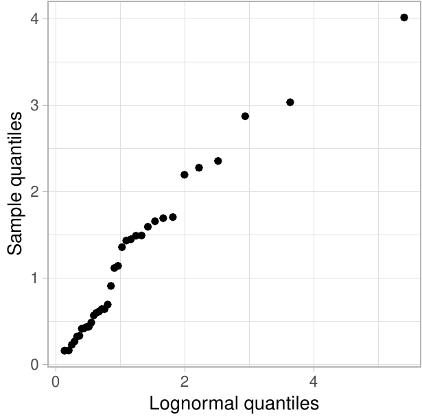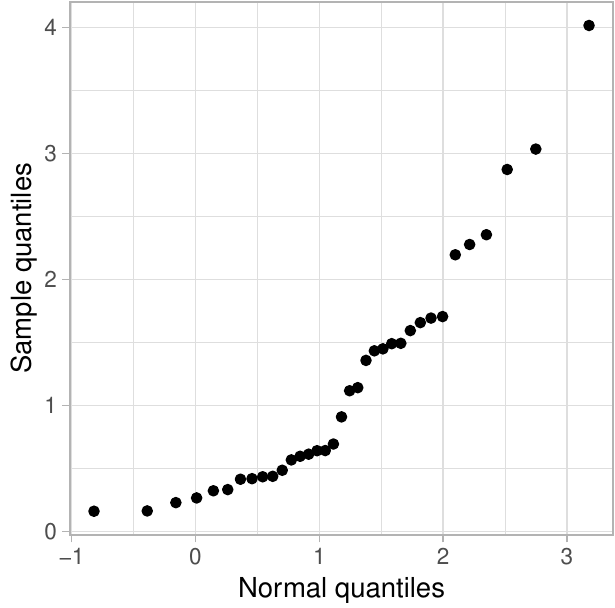</p>
<figcaption>Figure 1: The left plot compares a sample of size <span
class="math inline"><em>n</em> = 35</span> drawn from a lognormal
distribution to a lognormal distribution, while the right plot compares
this sample to a normal distribution. The curvature in the normal Q-Q
plot highlights the disagreement between the data and the
model.</figcaption>
</figure>

Additional graphical elements are often added to Q-Q plots in order to
aid in distributional assessment. A reference line is often added to a
Q-Q plot to help detection of departures from the proposed model. This
line is often drawn either by tracing the identity line or by connecting
two pairs of quantiles, such as the first and third quartiles, which is
known as the Q-Q line. Pointwise or simultaneous confidence bands can be
built around the reference line to display the expected degree of
sampling error for the proposed model. Such bands help gauge how
troubling a departure from the proposed model may be. Figure
[2](#fig:ex-qq2) adds Q-Q lines and 95% pointwise confidence bands to
the Q-Q plots in Figure [1](#fig:ex-qq1). While confidence bands help
analysts interpret Q-Q plots, this practice is less commonplace than it
ought to be. One possible cause is that confidence bands are not
implemented in all statistical software packages. Further, manual
implementation can be tedious for the analyst, breaking the
data-analytic flow---for example, a common simultaneous confidence band
relies on an inversion of the Kolmogorov-Smirnov test.

<figure id="fig:ex-qq2">
<p>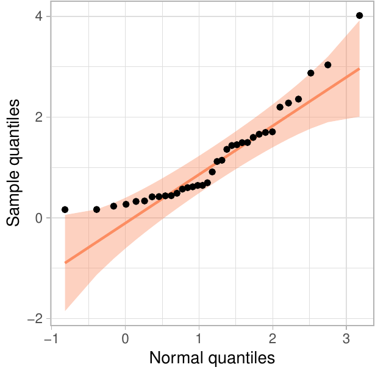</p>
<figcaption>Figure 2: Adding reference lines and <span
class="math inline">95%</span> pointwise confidence bands to the Q-Q
plots in Figure 1.</figcaption>
</figure>

Different orientations of Q-Q plots have also been proposed, most
notably the detrended Q-Q plot. To detrend a Q-Q plot, the $y$-axis is
changed to show the difference between the observed quantile and the
reference line. Consequently, the $y$-axis represents agreement with the
theoretical distribution. This makes the de-trended version of a Q-Q
plot easier to process: cognitive research
[@sineillusion; @robbins; @cleveland] suggests that onlookers have a
tendency to intuitively assess the distance between points and lines
based on the shortest distance (i.e., the orthogonal distance) rather
than the vertical distance appropriate for the situation. In the
de-trended Q-Q plot, the line to compare to points is rotated parallel
to the $x$-axis, which makes assessing the vertical distance equal to
assessing orthogonal distance. This is further investigated in
@Loy2016-fg, who find that detrended Q-Q plots are more powerful than
other designs as long as the $x$- and $y$-axes are adjusted to ensure
that distances in the $x$- and $y$-directions are on the same scale.
This Q-Q plot design is called an adjusted detrended Q-Q plot. Without
this adjustment to the range of the axes, ordinary detrended Q-Q plots
are produced, which were found to have lower power than the standard Q-Q
plot in some situations [@Loy2016-fg], while the adjusted detrended Q-Q
plots were found to be consistently more powerful. Figure
[3](#fig:ex-detrend) displays the normal Q-Q plot from Figure
[2](#fig:ex-qq2) along with its adjusted detrended version.

<figure id="fig:ex-detrend">
<p>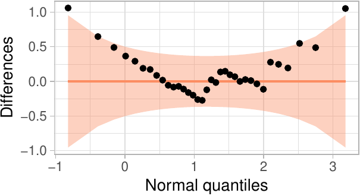</p>
<figcaption>Figure 3: The left plot displays a traditional normal Q-Q
plot for data simulated from a lognormal distribution. The right plot
displays an adjusted detrended Q-Q plot of the same data, created by
plotting the differences between the sample quantiles and the proposed
model on the <span
class="math inline"><em>y</em></span>-axis.</figcaption>
</figure>

Various implementations of Q-Q plots exist in R. Normal Q-Q plots, where
a sample is compared to the Standard Normal Distribution, are
implemented using `qqnorm` and `qqline` in
[*base*](https://CRAN.R-project.org/package=base) graphics. `qqplot`
provides a more general approach in *base* R that allows a specification
of a second vector of quantiles, enabling comparisons to distributions
other than a Normal. Similarly, the
[*lattice*](https://CRAN.R-project.org/package=lattice) package provides
a general framework for Q-Q plots in the `qqmath` function, allowing
comparison between a sample and any theoretical distribution by
specifying the appropriate quantile function [@lattice]. `qqPlot` in the
[*car*](https://CRAN.R-project.org/package=car) package also allows for
the assessment of non-normal distributions and adds pointwise confidence
bands via normal theory or the parametric bootstrap [@car]. The
[*ggplot2*](https://CRAN.R-project.org/package=ggplot2) package provides
`geom_qq` and `geom_qq_line`, enabling the creation of Q-Q plots with a
reference line, much like those created using `qqmath` [@ggplot2]. None
of these general-use packages allow for easy construction of detrended
Q-Q plots.

The [*qqplotr*](https://CRAN.R-project.org/package=qqplotr) package
extends *ggplot2* to provide a complete implementation of Q-Q plots. The
package allows for quick construction of all Q-Q plot designs without
sacrificing the flexibility of the *ggplot2* framework. In the remainder
of this paper, we introduce the plotting framework provided by *qqplotr*
and provide multiple examples of how it can be used.

# Implementing Q-Q plots in the *ggplot2* framework {#implementing-q-q-plots-in-the-framework}

[]{#sec:implementing label="sec:implementing"}

*qqplotr* provides a *ggplot2* layering mechanism for Q-Q points,
reference lines, and confidence bands by implementing separate
statistical transformations (`stat`s). In this section, we describe each
transformation.

## `stat_qq_point`

This modified version of `stat_qq` / `geom_qq` (from *ggplot2*) plots
the sample quantiles against the theoretical quantiles (as in Figure
[1](#fig:ex-qq1)). The novelty of this implementation is the ability to
create a detrended version of the plotted points. All other
transformations in *qqplotr* also allow for the `detrend` option. Below,
we present a complete call to `stat_qq_point` and highlight the default
values of its parameters:

``` r
stat_qq_point(data = NULL,
              mapping = NULL,
              geom = "point",
              position = "identity",
              na.rm = TRUE,
              show.legend = NA,
              inherit.aes = TRUE,
              distribution = "norm",
              dparams = list(),
              detrend = FALSE,
              identity = FALSE,
              qtype = 7,
              qprobs = c(0.25, 0.75),
              ...)
```

-   Parameters such as `data`, `mapping`, `geom`, `position`, `na.rm`,
    `show.legend`, and `inherit.aes` are commonly found among several
    *ggplot2* transformations.

-   `distribution` is a character string that sets the theoretical
    probability distribution. Here, we followed the nomenclature from
    the [*stats*](https://CRAN.R-project.org/package=stats) package, but
    rather than requiring the full function name for a distribution
    (e.g., `"dnorm"`), only the suffix is required (e.g., `"norm"`). If
    you wish to provide a custom distribution, then you must first
    create its density (PDF), distribution (CDF), quantile, and
    simulation functions, following the nomenclature outlined in
    *stats*. For example, to create the `"custom"` distribution, you
    must provide the appropriate `dcustom`, `pcustom`, `qcustom`, and
    `rcustom` functions. A detailed example is given in the
    [[sec:user-dists]](#sec:user-dists) section.

-   `dparams` is a named list specifying the parameters of the proposed
    `distribution`. By default, maximum likelihood etimates (MLEs) are
    used, so specifying this argument overrides the MLEs. Please note
    that MLEs are currently only supported for distributions available
    in *stats*, so if a custom distribution is provided to
    `distribution`, then *all* of its parameters must be estimated and
    passed as a named list to `dparams`.

-   `detrend` is a logical that controls whether the points should be
    detrended (as in Figure [3](#fig:ex-detrend)), producing ordinary
    detrended Q-Q plots. For additional details on how to use this
    parameter and produce the more powerful adjusted detrended Q-Q
    plots, see the [[sec:detrending]](#sec:detrending) section.

-   `identity` is a logical value only used in the case of detrending
    (i.e., if `detrend = TRUE`). If `identity = FALSE` (default), then
    the points will be detrended according to the traditional Q-Q line
    that intersects the two data quantiles specified by `qprobs` (see
    below). If `identity = TRUE`, the identity line will be used instead
    as the reference line when constructing the detrended Q-Q plot.

-   `qtype` and `qprobs` are only used when `detrend = TRUE` **and**
    `identity = FALSE`. These parameters are passed on to the `type` and
    `probs` parameters of the `quantile` function from *stats*, both of
    which are used to specify which quantiles are used to form the Q-Q
    line.

## `stat_qq_line`

The `stat_qq_line` statistical transformation draws a reference line in
a Q-Q plot.

``` r
stat_qq_line(data = NULL,
             mapping = NULL,
             geom = "path",
             position = "identity",
             na.rm = TRUE,
             show.legend = NA,
             inherit.aes = TRUE,
             distribution = "norm",
             dparams = list(),
             detrend = FALSE,
             identity = FALSE,
             qtype = 7,
             qprobs = c(0.25, 0.75),
             ...)
```

Nearly all of the parameters for `stat_qq_line` are identical to those
for `stat_qq_point`. Hence, with the exception of `identity`, all other
parameters have the same interpretation. For `stat_qq_line`, the
`identity` parameter is *always* used, regardless of the value of
`detrend`. This parameter controls which reference line is drawn:

1.  When `identity = FALSE` (default), the Q-Q line is drawn. By default
    the Q-Q line is drawn through two points, the .25 and .75 quantiles
    of the theoretical and empirical distributions. This line provides a
    robust estimate of the empirical distribution, which is of
    particular advantage for small samples [@Loy2016-fg].

2.  When `identity = TRUE`, the identity line is drawn. By definition of
    a Q-Q plot the identity line represents the theoretical
    distribution.

Both of these reference lines have a special meaning in the context of
Q-Q plots. By comparing these two lines we learn about how well the
parameters estimated from the sample match the theoretical parameters.
For a distributional family that is invariant to linear transformations,
the parameters specified in the theoretical distribution only have an
effect on the Q-Q line and the Q-Q points. That is, the parameters get
shifted and scaled in the plot, but relative relationships do not change
aside from a change of scale on the $x$-axis. For other distributions,
such as a lognormal distribution, re-specifications of the parameters
result in non-linear transformations of the Q-Q line and Q-Q points (see
Figure [4](#fig:qqline) for an example).

## `stat_qq_band`

Confidence bands can be drawn around the reference line using one of
four methods: simultaneous Kolmogorov-type bounds, a pointwise normal
approximation, the parametric bootstrap [@Davison:1997], or the
tail-sensitive procedure [@Aldor-Noiman2013-xw].

``` r
stat_qq_band(data = NULL,
             mapping = NULL,
             geom = "qq_band",
             position = "identity",
             show.legend = NA,
             inherit.aes = TRUE,
             na.rm = TRUE,
             distribution = "norm",
             dparams = list(),
             detrend = FALSE,
             identity = FALSE,
             qtype = 7,
             qprobs = c(0.25, 0.75),
             bandType = "pointwise",
             B = 1000,
             conf = 0.95,
             mu = NULL,
             sigma = NULL,
             ...)
```

<figure id="fig:qqline">
<p>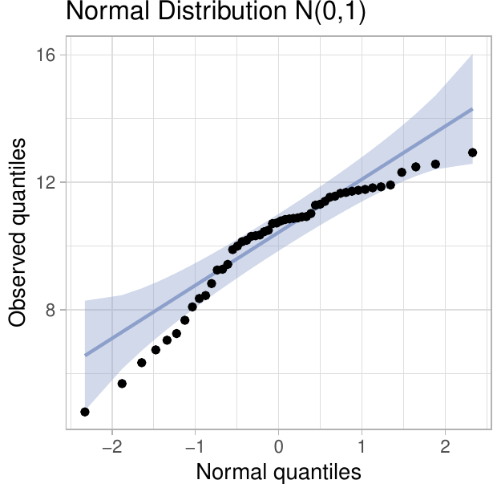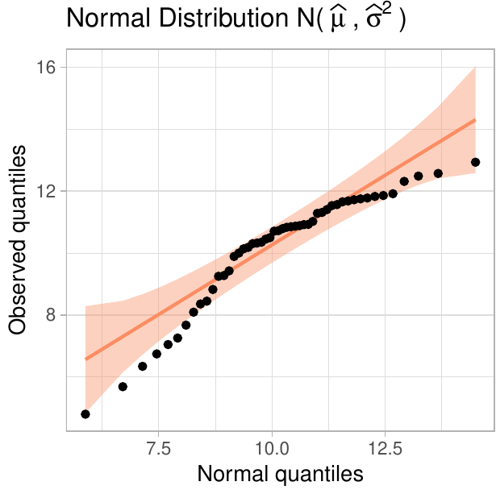</p>
<p>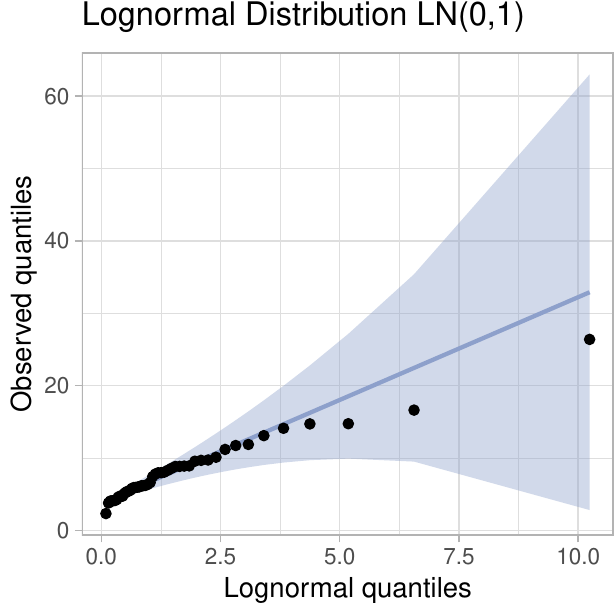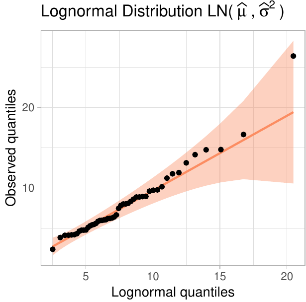</p>
<figcaption>Figure 4: Q-Q plots of a sample of size <span
class="math inline"><em>n</em> = 50</span> drawn from a normal
distribution setting as theoretical the Standard Normal distribution
(top-left) and a normal distribution with ML parameter estimates
(top-right). Note how only the scales on the axes change between those
plots. The bottom two plots show Q-Q plots of a sample of size <span
class="math inline"><em>n</em> = 50</span> drawn from a lognormal
distribution. On the left, the mean and variance of the theoretical are
0 and 1, respectively, on the log scale. On the right, ML estimates for
mean and variance are used. 95% pointwise confidence bands are displayed
on all Q-Q plots. </figcaption>
</figure>

-   `bandType` is a character string controlling the method used to
    construct the confidence bands:

    -   **Simultaneous**: Specifying `bandType = "ks"` constructs
        simultaneous confidence bands based on an inversion of the
        Kolmogorov-Smirnov test. For an i.i.d. sample from CDF $F$, the
        Dvoretzky-Kiefer-Wolfowitz (DKW) inequality [@dkw; @massart-dkw]
        states that
        $P ( \sup_{x} | F(x) - \widehat{F}(x)| \ge \varepsilon ) \le 2 \exp \left(-2n\varepsilon^2 \right)$.
        Thus, lower and upper $(1-\alpha)100\%$ confidence bounds for
        $\widehat{F}(n)$ are given by
        $L(x) = \max\{ \widehat{F}(n) - \varepsilon, 0 \}$ and
        $U(x) = \min \{ \widehat{F}(n) + \varepsilon, 1 \}$,
        respectively. Confidence bounds for the points on a Q-Q plot are
        then given by $F^{-1} \left( L(x) \right)$ and
        $F^{-1} \left(U(x) \right)$.

    -   **Pointwise:** Specifying `bandType = "pointwise"` constructs
        pointwise confidence bands based on a normal approximation to
        the distribution of the order statistics. An approximate 95%
        confidence interval for the $i$th order statistic is
        $\widehat{X}_{(i)}~\pm~\Phi^{-1}(.975)~\cdot~SE (X_{(i)} )$,
        where $\widehat{X}_{(i)}$ denotes the value along the fitted
        reference line, $\Phi^{-1}(\cdot)$ denotes the quantile function
        for the Standard Normal Distribution, and $SE (X_{(i)} )$ is the
        standard error of the $i$th order statistic.

    -   **Bootstrap:** Specifying `bandType = "boot"` constructs
        pointwise confidence bands using percentile confidence intervals
        from the parametric bootstrap.

    -   **Tail-sensitive:** Specifying `bandType = "ts"` constructs the
        simulation-based tail-sensitive simultaneous confidence bands
        proposed by @Aldor-Noiman2013-xw. Currently, tail-sensitive
        bands are only implemented for `distribution = "norm"`.

-   `B` is a dual-purpose integer parameter. If `bandType = "boot"`, it
    specifies the number of bootstrap replicates. If `bandType = "ts"`,
    it specifies the number of simulated samples necessary to construct
    the tail-sensitive bands.

-   `conf` is a numerical variable bound between 0 and 1 that sets the
    confidence level of the bands.

-   `mu` and `sigma` are only used when `bandType = "ts"`. They
    represent the center and scale parameters, respectively, used to
    construct the simulated tail-sensitive confidence bands. If either
    is `NULL`, then *both* of the parameters are estimated using robust
    estimates via the
    [*robustbase*](https://CRAN.R-project.org/package=robustbase)
    package [@robustbase]. Currently, `bandType = "ts"` is only
    implemented for `distribution = "norm"`, which is the only
    distribution discussed by @Aldor-Noiman2013-xw.

## Groups in *qqplotr*

`qqplotr` is implemented in accordance with the *ggplot2* concept of
groups. When the user maps values to aesthetics that explicitly (by
using `group`) or implicitly (such as `shape` or discrete values of
`colour`, `size` etc.) introduce groups, the corresponding calculations
respect the grouping in the data. All groups are compared to the same
distributional family, but the parameters are estimated *separately* for
each of the groups if `dparams` is not specified (which is the default
for all transformations). If the user wants to fit the *same*
distribution (i.e., the same parameter estimates) to each group, then
the estimates must be manually calculated and passed to `dparams` as a
named list for each of the desired *qqplotr* transformations. The use of
groups is illustrated in more detail in the [[sec:brfss]](#sec:brfss)
section.

# Examples

[]{#sec:examples label="sec:examples"}

In this section, we demonstrate the capabilities of *qqplotr* by
providing multiple examples of how the package can be used. We start by
loading the package:

``` r
library(qqplotr)
```

## Constructing Q-Q plots with *qqplotr*

To give a brief introduction on how to use *qqplotr* and its
transformations, consider the `urine` dataset from the
[*boot*](https://CRAN.R-project.org/package=boot) package. This small
dataset consists of 79 urine specimens that were analyzed to determine
if certain physical characteristics of urine (e.g., pH or urea
concentration) might be related to the formation of calcium oxalate
crystals. In this example, we focus on the distributional assessment of
pH measurements made on the samples.

We start by creating a normal Q-Q plot of the data. The top-left plot in
Figure [5](#fig:urine-qq-bands) shows a Q-Q plot comparing the pH
measurements to the normal distribution. The code used to create this
plot is shown below. As previously noted, the parameters of the normal
distribution are automatically estimated using the MLEs when the
parameters are not otherwise specified in `dparams`. The shaded region
represents the area between the normal pointwise confidence bands. As we
can see, the distribution of urine pH measurements is somewhat
right-skewed.

``` r
library(dplyr) # for using `%>%` and later data transformation
data(urine, package = "boot")
urine %>%
  ggplot(aes(sample = ph)) +
  stat_qq_band(bandType = "pointwise", fill = "#8DA0CB", alpha = 0.4) +
  stat_qq_line(colour = "#8DA0CB") +
  stat_qq_point() +
  ggtitle("Normal") +
  xlab("Normal quantiles") +
  ylab("pH measurements quantiles") +
  theme_light() +
  ylim(3.2, 8.7)
```

Figure [5](#fig:urine-qq-bands) also provides an overview of *qqplotr*'s
capabilities:

-   The left column displays Q-Q plots with 95% pointwise confidence
    bands obtained from a normal approximation.

```{=html}
<!-- -->
```
-   The center column displays Q-Q plots with 95% Kolmogorov-type
    simultaneous confidence bands.

-   The right column displays Q-Q plots with 95% tail-sensitive
    simultaneous confidence bands. Notice that these are substantially
    narrower in the tails than the Kolmogorov-type bands.

-   The bottom row shows the detrended versions of the Q-Q plots in the
    top row.

<figure id="fig:urine-qq-bands">
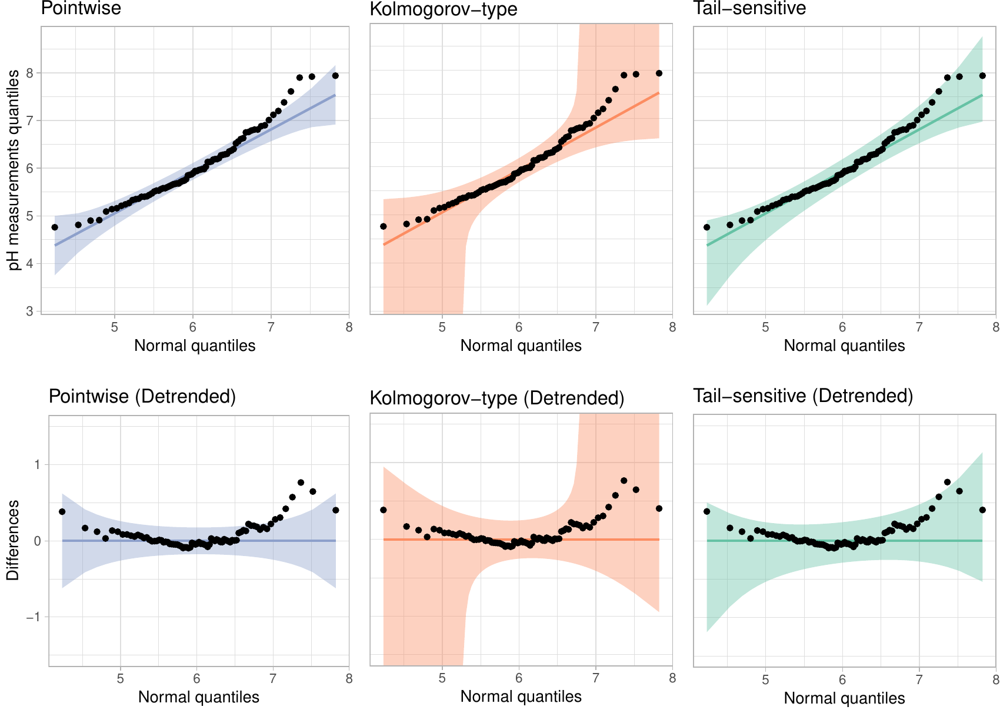
<figcaption>Figure 5: Normal Q-Q plots of pH measurements from urine
samples using different confidence bands. Depending on the type of
confidence band used, we come to different conclusions.</figcaption>
</figure>

## User-provided distributions

[]{#sec:user-dists label="sec:user-dists"}

Using the capabilities of *qqplotr* with the distributions implemented
in *stats* is relatively straightfoward, since the implementation allows
you to specify the suffix (i.e., distribution or abbreviation) via the
`distribution` argument and the parameter estimates via the `dparams`
argument. However, there are times when the distributions in *stats* are
not sufficient for the demands of the analysis. For example, there is no
left-skewed distribution listed aside from the beta distribution, which
has a restrictive support. User-coded distributions, or distributions
from other packages, can be used with *qqplotr* as long as the
distributions are defined following the conventions laid out in *stats*.
Specfically, for some distribution there must be density/mass (`d`
prefix), CDF (`p` prefix), quantile (`q` prefix), and simulation (`r`
prefix) functions. In this section, we illustrate the use of the
smallest extreme value distribution (SEV).

To qualify for the 2012 Olympics in the men's long jump, athletes had to
meet/exceed the 8.1 meter standard or place in the top twelve. During
the qualification events, each athlete was able to jump up to three
times, using their best (i.e., longest) jump as the result. Figure
[6](#fig:jump-density) shows a density plot of the results, which is
clearly left skewed.

We start by loading the `longjump` dataset included in *qqplotr* and
removing any `NA`s:

``` r
data("longjump", package = "qqplotr")
longjump <- na.omit(longjump)
```

<figure id="fig:jump-density">
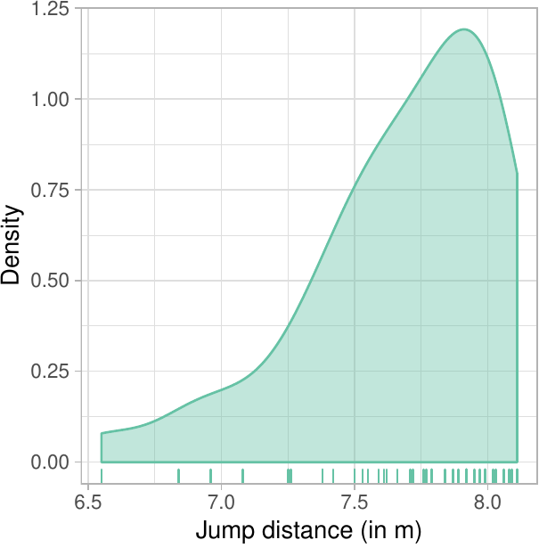
<figcaption>Figure 6: Density and rug plot of the 2012 men’s long jump
qualifying round. The distances are clearly left skewed.</figcaption>
</figure>

Next, we define the suite of distributional functions necessary to
utilize the SEV distribution.

``` r
# CDF
psev <- function(q, mu = 0, sigma = 1) {
  z <- (q - mu) / sigma
  1 - exp(-exp(z))
}

# PDF
dsev <- function(x, mu = 0, sigma = 1) {
  z <- (x - mu) / sigma
  (1 / sigma) * exp(z - exp(z))
}

# Quantile function
qsev <- function(p, mu = 0, sigma = 1) {
  mu + log(-log(1 - p)) * sigma
}

# Simulation function
rsev <- function(n, mu = 0, sigma = 1) {
  qsev(runif(n), mu, sigma)
}
```

With the `*sev` distribution functions in hand, we can create a Q-Q plot
to assess the appropriateness of the SEV model (Figure
[7](#fig:sev-qq)). The Q-Q plot shows that the distances do not
substantially deviate from the SEV model, so we have found an adequate
representation of the distances. The code used to create Figure
[7](#fig:sev-qq) is given below:

``` r
ggplot(longjump, aes(sample = distance)) +
  stat_qq_band(distribution = "sev",
               bandType = "ks",
               dparams = list(mu = 0, sigma = 1),
               fill = "#8DA0CB",
               alpha = 0.4) +
  stat_qq_line(distribution = "sev",
               colour = "#8DA0CB",
               dparams = list(mu = 0, sigma = 1)) +
  stat_qq_point(distribution = "sev",
                dparams = list(mu = 0, sigma = 1)) +
  xlab("SEV quantiles") +
  ylab("Jump distance (in m)") +
  theme_light()
```

<figure id="fig:sev-qq">
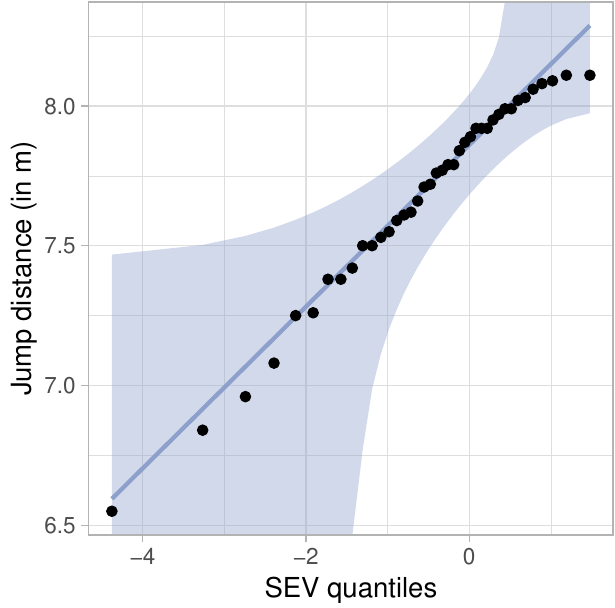
<figcaption>Figure 7: Q-Q plot comparing the long jump distances to the
standard SEV distribution with 95% simultaneous confidence bands. The
SEV distribution appears to adequately model the distances.</figcaption>
</figure>

## Detrending Q-Q plots

[]{#sec:detrending label="sec:detrending"}

To illustrate how to construct an adjusted detrended Q-Q plot using
*qqplotr*, consider detrending Figure [7](#fig:sev-qq). This is done by
adding the argument `detrend = TRUE` to `stat_qq_point`, `stat_qq_line`,
and `stat_qq_band`. To adjust the aspect ratio to ensure that vertical
and horizontal distances are on the same scale we further add
`coord_fixed(ratio = 1)`. We leave it to the user to adjust the $y$-axis
limits on a case-by-case basis. The full command to construct Figure
[8](#fig:detrend-sev) is given below:

``` r
ggplot(longjump, aes(sample = distance)) +
  stat_qq_band(distribution = "sev",
               bandType = "ks",
               detrend = TRUE,
               dparams = list(mu = 0, sigma = 1),
               fill = "#8DA0CB",
               alpha = 0.4) +
  stat_qq_line(distribution = "sev",
               detrend = TRUE,
               dparams = list(mu = 0, sigma = 1),
               colour = "#8DA0CB") +
  stat_qq_point(distribution = "sev",
                detrend = TRUE,
                dparams = list(mu = 0, sigma = 1)) +
  xlab("SEV quantiles") +
  ylab("Differences") +
  theme_light() +
  coord_fixed(ratio = 1, ylim = c(-2, 2))
```

<figure id="fig:detrend-sev">
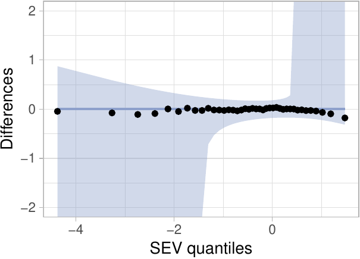
<figcaption>Figure 8: An adjusted detrended Q-Q plot assessing the
appropriateness of the SEV distribution for the long jump
data.</figcaption>
</figure>

## BRFSS example

[]{#sec:brfss label="sec:brfss"}

The Center for Disease Control and Prevention runs an annual telephone
survey, the Behavioral Risk Factor Surveillance System (BRFSS), to track
"health-related risk behaviors, chronic health conditions, and use of
preventive services" [@brfss]. Close to half a million interviews are
conducted each year. In this example, we focus on the responses for Iowa
in 2012. The data set consists of 7166 responses across 359 questions
and derived variables. To further illustrate the functionality of
*qqplotr*, we focus on assessing the distributions of Iowan's heights
and weights.

Figure [9](#fig:heights) shows two Q-Q plots constructed from a sample
of 200 men and 200 women drawn from the overall number of responses. On
the left-hand side, individuals' heights are displayed in a Q-Q plot
comparing raw heights to a normal distribution. We see that the
distributions for both men and women show horizontal steps: this
indicates that the distributional assessement is heavily dominated by
the discreteness in the data, as most respondents provided their height
to the nearest inch. On the right-hand side of Figure [9](#fig:heights),
we use jittering to remedy this situation. That is, we add a random
number generated from a random uniform distribution on $\pm 0.5$ inch to
the reported height, as shown in the code below:

``` r
data("iowa", package = "qqplotr")
set.seed(3145)

sample_ia <- iowa %>%
  tidyr::nest(-SEX) %>%
  mutate(
    data = data %>%
    purrr::map(.f = function(x) sample_n(x, size = 200))
    ) %>%
  tidyr::unnest(data) %>%
  dplyr::select(SEX, WTKG3, HTIN4) %>%
  mutate(Gender = c("Male", "Female")[SEX])

params <- iowa %>%
  filter(!is.na(HTIN4)) %>%
  summarize(m = mean(HTIN4), s = sd(HTIN4))

customization <- list(scale_fill_brewer(palette = "Set2"),
                      scale_colour_brewer(palette = "Set2"),
                      xlab("Normal quantiles"),
                      ylab("Height (in.)"),
                      coord_equal(),
                      theme_light(),
                      theme(legend.position = c(0.8, 0.2), aspect.ratio = 1))

sample_ia %>%
  ggplot(aes(sample = HTIN4, colour=Gender, fill=Gender)) +
  stat_qq_band(bandType = "ts",
               alpha = 0.4,
               dparams = list(mean = params$m, sd = params$s)) +
  stat_qq_point(dparams = list(mean = params$m, sd = params$s)) +
  customization

sample_ia %>%
  mutate(HTIN4.jitter = jitter(HTIN4, factor = 2)) %>%
  ggplot(aes(sample = HTIN4.jitter, colour = Gender, fill = Gender)) +
  stat_qq_band(bandType = "ts",
               alpha = 0.4,
               dparams = list(mean = params$m, sd = params$s)) +
  stat_qq_line(dparams = list(mean = params$m, sd = params$s)) +
  stat_qq_point(dparams = list(mean = params$m, sd = params$s)) +
  customization +
  ylab("Jittered Height (in.)")
```

<figure id="fig:heights">
<p>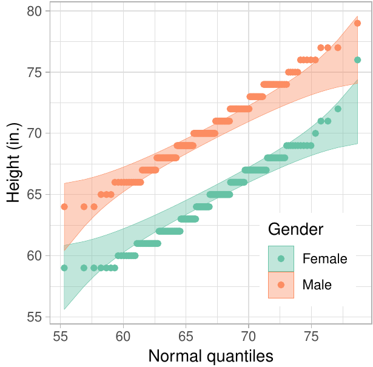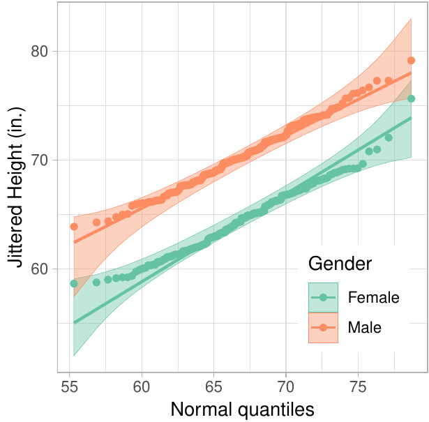</p>
<figcaption>Figure 9: Q-Q plots comparing the raw (left) and jittered
(right) heights to a normal distribution for a sample of 200 men and 200
women. The distribution on the left is dominated by the discreteness of
the data. On the right, using a normal distribution to model people’s
height is not completely absurd, except for a few extreme
outliers.</figcaption>
</figure>

Notice that the same theoretical normal distribution was fit to both
genders as specified in `dparams`. If we had used the default, then the
MLEs for each gender would be used. As a result, we would be comparing
the two genders over a different range of theoretical quantiles. By
explicity providing parameter estimates for the mean and standard
deviation via `dparams`, we force the Q-Q plots to use the same
$x$-coordinates (theoretical quantiles), which is more useful when
comparing the distribution of these groups.

As seen in Figure [9](#fig:heights), by using jittering we diminish the
effect that discreteness has on the distribution and brings the observed
distribution much closer to a normal distribution. Unsurprisingly, the
resulting distributions have different means (women are, on average, 6
inches shorter than men in this data set). Interestingly, the slope of
the two genders is similar, indicating that the same scale parameter
fits both genders' distributions (the standard deviation of height in
the data set is 2.97 inch for men and 2.91 inch for women, see Table
[1](#tab:heights)).

::: {#tab:heights}
  ----------------------------------------------------------------------
  SEX        mean height (in)   sd (in)   mean log weight (kg)   sd (kg)
  -------- ------------------ --------- ---------------------- ---------
  Male                  70.55      2.97                   9.10      0.20

  Female                64.51      2.91                   8.89      0.23

  Total                 66.99      4.18                   8.98      0.24
  ----------------------------------------------------------------------

  : Table 1: []{#tab:heights-table label="tab:heights-table"}Summary of
  Iowa residents' heights and weights with corresponding standard
  deviations by gender and for the total population.
:::

Unlike respondents' heights, their weights do not seem to be normally
distributed. Figure [10](#fig:weights) shows two Q-Q plots of these
data. For both, distributional parameters are estimated separately for
each group. This means that for each group we compare against its
theoretical distribution shown as the identity line. The Q-Q plot on the
left compares raw weights to a normal distribution. We see that tails of
the observed distribution are heavier than expected under a normal
distribution. On the right, weights are log-transformed. We see that
using a normal distribution for each gender appears to be reasonable,
with the exception of a few extreme outliers. The code used to create
Figure [10](#fig:weights) is shown below:

``` r
sample_ia %>%
  ggplot(aes(sample = WTKG3 / 100, colour = Gender, fill = Gender)) +
  geom_abline(colour = "grey40") +
  stat_qq_band(bandType = "ts", alpha = 0.4) +
  stat_qq_line() +
  stat_qq_point() +
  customization +
  ylab("Weight (kg.)")

sample_ia %>%
  ggplot(aes(sample = log(WTKG3/100), colour=Gender, fill=Gender)) +
  geom_abline(colour = "grey40") +
  stat_qq_band(bandType = "ts", alpha = 0.4) +
  stat_qq_line() +
  stat_qq_point() +
  customization +
  ylab("log Weight (kg.)")
```

<figure id="fig:weights">
<p>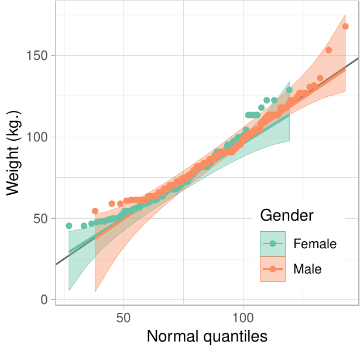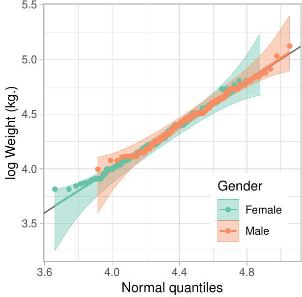</p>
<figcaption>Figure 10: Q-Q plots comparing weights to a normal
distribution for a sample of 200 men and 200 women. Unlike people’s
height, weight seems to be right skewed with some additional outliers in
the left tail (left plot). On the right, weight was log-transfomed
before its distribution is compared to a theoretical normal.
</figcaption>
</figure>

Instead of log-transforming the observed weights, we can change the
theoretical distribution to a lognormal. Figure [11](#fig:weights-log)
shows two lognormal Q-Q plots, one for each gender. Note the MLEs are
used to parameterize the lognormal distribution for each group since
`dparams` is not specified:

``` r
sample_ia %>%
  ggplot(aes(sample = WTKG3 / 100, colour = Gender, fill = Gender)) +
  geom_abline(colour = "grey40") +
  stat_qq_band(bandType = "ks", distribution = "lnorm", alpha = 0.4) +
  stat_qq_line(distribution = "lnorm") +
  stat_qq_point(distribution = "lnorm") +
  customization +
  facet_grid(. ~ Gender) +
  xlab("Lognormal quantiles") +
  ylab("Weight (kg.)") +
  theme(legend.position = c(0.9, 0.2))
```

<figure id="fig:weights-log">
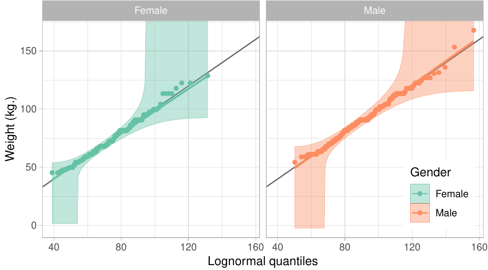
<figcaption>Figure 11: Q-Q plots comparing weights to a lognormal
distribution for a sample of 200 men and 200 women. The parameters are
estimated separately for each gender to specify the lognormal reference
distribution for each gender.</figcaption>
</figure>

# Discussion

This paper presented the *qqplotr* package, an extension of *ggplot2*
that implements Q-Q plots in both the standard and detrended
orientations, along with reference lines and confidence bands. The
examples illustrated how to create Q-Q plots for non-standard
distributions found outside of the *stats* package, how to create
detrended Q-Q plots, and how to create Q-Q plots when data are grouped.
Further, in the BRFSS example, we illustrated how jittering can be used
in Q-Q plots to better compare discretized data to a continuous
distribution.

While *qqplotr* provides a complete implementation of the Q-Q plot,
there is room for development in future versions. For example, Q-Q plots
are members of the larger probability plotting family, so future
versions of *qqplotr* will likely include additional members of that
family.

Finally, we have made design choices in *qqplotr* that we believe are in
line with best practices for distributional assessment, but the
implementation is flexible enough to allow for easy customization. For
example, maximum likelihood is used to estimate the parameters of the
proposed model, but if outliers are present robust estimators may be
desirable, such as when comparing the empirical distribution to a normal
distribution. In this scenario, robust estimates of the location and
scale can be obtained using the *robustbase* package [@robustbase], and
specified using the `dparams` parameter directly. This is especially
useful if you wish to use the parametric bootstrap to build confidence
bands. Similarly, `stat_qq_line` implements two types of reference
lines: the identity line, and the traditional Q-Q line that passes
through two quantiles of the distributions, such as the first and third
quartiles. While those are the most conventionally used reference lines,
alternative ones can be quickly implemented using `ggplot2::geom_abline`
by specifying the slope and intercept. By default, the Q-Q line is used;
however, this is not always the most appropriate choice. In order to
*test* whether the data follow a specific distribution, the reference
line should be used rather than using the data twice: once to estimate
the parameters, and once for comparison.

# Acknowledgements

This work was partially funded by Google Summer of Code 2017. We thank
the reviewers for their helpful comments and suggestions.
:::
