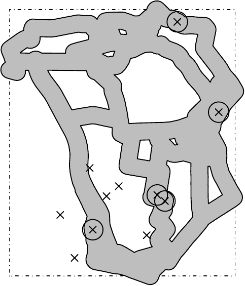
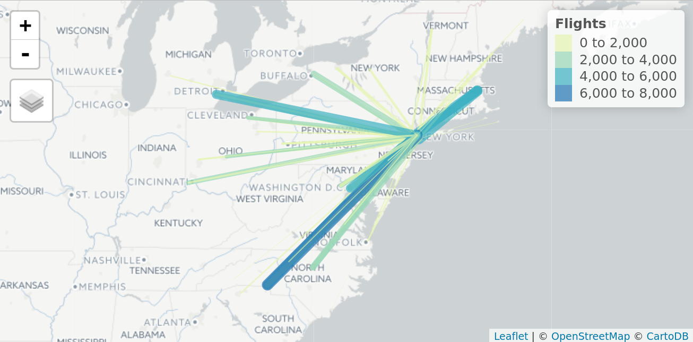
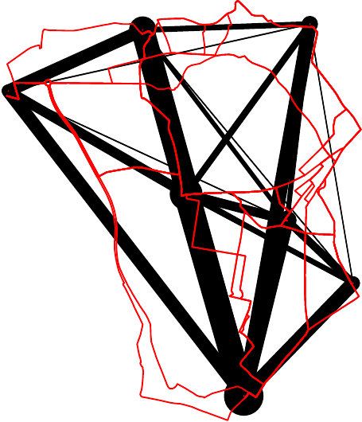
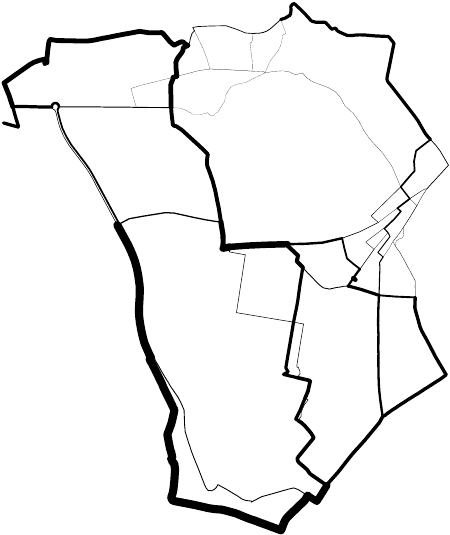
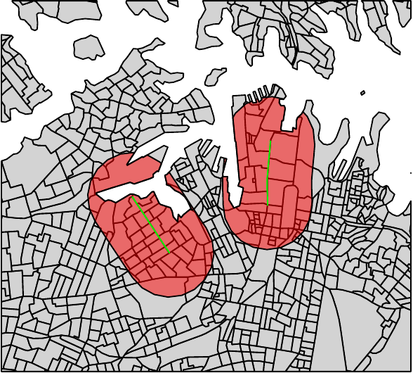
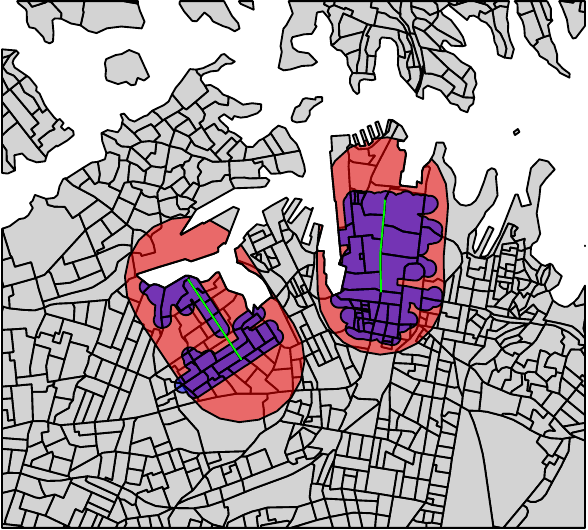
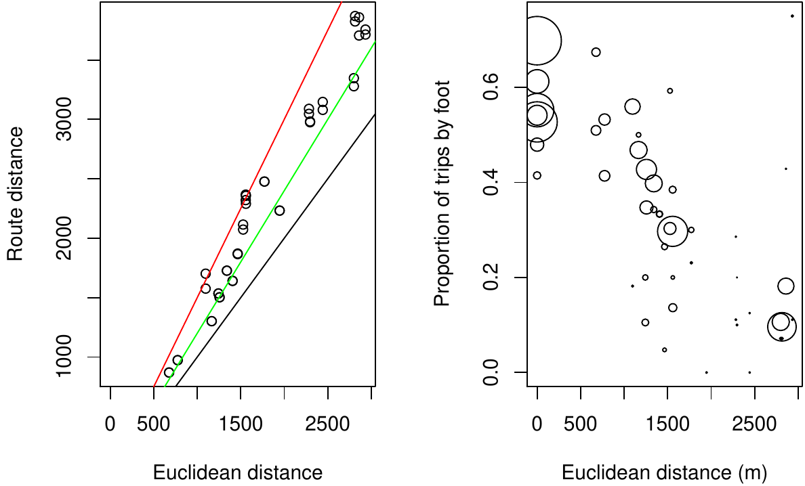
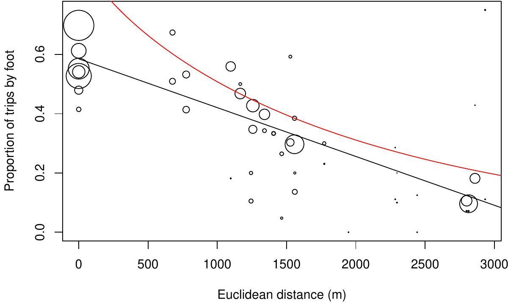

::: article
# Introduction

Transport planning can broadly be defined as the process of designing
and evaluating transport interventions [@willumsen_modelling_2011],
usually with the ultimate aim of improving transport systems from
economic, social, and environmental perspectives. This inevitably
involves a degree of subjective judgment and intuition. With the
proliferation of new transport datasets --- and the increasing
availability of hardware and software to make sense of them --- there is
great potential for the discipline to become more evidence-based and
scientific [@balmer_matsim-t:_2009]. Transport planners have always
undertaken a wide range of computational activities
[@boyce_forecasting_2015], but with the digital revolution the demands
have grown beyond the capabilities of a single, monolithic product. The
diversity of tasks, and the need for democratic accountability in public
decision making, suggests that future-proof transport planning software
should be:

-   flexible, able to handle a wide range of data formats

-   scalable, able to work at multiple geographic levels from single
    streets to large cities and regions

-   robust and reliable, tested on a range of datasets and able to work
    "out of the box" in a range of real-world projects

-   open source and reproducible, ensuring transparency and encouraging
    citizen science

This paper sets out to demonstrate that open source software with a
command-line interface (CLI) can provide a foundation for transport
planning software that meets each of these criteria. R provides a strong
basis for progress in this direction because it already contains
functionality used in common transport planning workflows. The
[*sp*](https://CRAN.R-project.org/package=sp),
[*rgeos*](https://CRAN.R-project.org/package=rgeos), and
[*rgdal*](https://CRAN.R-project.org/package=rgdal) packages greatly
improved R's spatial abilities [@bivand_applied_2013], work that is
being consolidated and extended in the recent
[*sf*](https://CRAN.R-project.org/package=sf) package.

Building on these foundations, a number of spatial packages have been
developed for applied domains including: disease mapping and modelling,
with packages such as
[*SpatialEpi*](https://CRAN.R-project.org/package=SpatialEpi) and
[*diseasemapping*](https://CRAN.R-project.org/package=diseasemapping)
[@kim_spatialepi:_2016; @brown_diseasemapping:_2016]; spatial ecology,
with the **adehabitat** family of packages [@calenge_package_2006]; and
visualisation, with packages such as
[*leaflet*](https://CRAN.R-project.org/package=leaflet),
[*tmap*](https://CRAN.R-project.org/package=tmap),
[*mapview*](https://CRAN.R-project.org/package=mapview), and
[*mapmisc*](https://CRAN.R-project.org/package=mapmisc) [@RJ-2016-005].
However, there has been little prior work to develop R functionality
designed specifically for transport planning, with the notable
exceptions of [TravelR](http://r-forge.r-project.org/projects/travelr/)
(a package on R-Forge last updated in 2012) and
[gtfsr](https://github.com/ropensci/gtfsr) (a package for handling
General Transit Feed Specification (GTFS) data).

The purpose of *stplanr* is to provide a toolbox rather than a specific
solution for transport planning, with an emphasis on spatial data and
active modes. This emphasis is timely given the recent emphasis on
sustainability [@banister_sustainable_2008] and 'Big Data'
[@zheng_big_2016] in the wider field of transport planning.

A major motivation was the lack of R packages, and open source software
in general, for transport applications. This may be surprising given the
ubiquity of transport problems;[^1] R's proficiency at handling spatial,
temporal and travel survey data that describe transport systems; and the
growing popularity of R in applied domains
[@jalal_overview_2017; @moore_why_2017]. Another motivation is the
growth in open access datasets: the main purpose of early versions of
the package was to process open origin-destination data
[@lovelace_propensity_2017].

R is already used in transport applications, as illustrated by recent
research that applies packages from other domains to transport problems.
For instance, @efthymiou_use_2012 ([-@efthymiou_use_2012]) use R to
analyse the data collected from an online survey focused on car-sharing,
bicycle-sharing, and electric vehicles. @efthymiou_use_2012
([-@efthymiou_use_2012]) also used R to collect and analyse
transport-related data from Twitter using packages including
[*XML*](https://CRAN.R-project.org/package=XML),
[*twitteR*](https://CRAN.R-project.org/package=twitteR) and
[*ggplot2*](https://CRAN.R-project.org/package=ggplot2). These packages
were used to download, parse and plot the Twitter data using a method
that can be repeated and the results reproduced or updated. More general
statistical analyses have also been conducted on transport-related
datasets using packages including
[*muStat*](https://CRAN.R-project.org/package=muStat) and
[*mgcv*](https://CRAN.R-project.org/package=mgcv)
[@diana_studying_2012; @cerin_walking_2013]. Despite the rising use of R
for transport research, there has yet been to be a package for transport
planning.

The design of the R language, with its emphasis on flexibility, data
processing, and statistical modelling, suggests it can provide a
powerful environment for transport planning research. There are many
quantitative methods in transport planning, many of which fit into the
classic 'four stage' transport model which involves the following steps
[@willumsen_modelling_2011]: (1) trip *generation* to estimate trip
frequency from origins; (2) *distribution* of trips to destinations; (3)
*modal split* of trips between walking, cycling, buses etc.; (4)
*assignment* of trips to the transport route network. To this we would
like to add two more stages for the big data age: (0) data processing
and exploration; and (5) validation. This sequence is not the only way
of transport modelling and some have argued that its dominance has
reduced innovation. However it is certainly a common approach and
provides a useful schema for classifying the kinds of task that
*stplanr* can tackle:

-   accessing and processing of data on transport infrastructure and
    behaviour (stage 0)

-   analysis and visualisation of the transport network (0)

-   analysis of origin-destination (OD) data and the visualisation of
    resulting 'desire lines'

-   the allocation of desire lines to roads and other guideways via
    routing services

-   the aggregation of routes to estimate total levels of flow on
    segments throughout the transport network

-   development of models to estimate transport behaviour currently and
    under various scenarios of change

-   the calculation of "catchment areas" affected by transport
    infrastructure

The automation of such tasks can assist researchers and practitioners to
create evidence for decision making. If the data processing and analysis
stages are fast and painless, more time can be dedicated to
visualisation and decision making. This should allow researchers to
focus on problems, rather than on clunky graphical user interfaces
(GUIs), and ad-hoc scripts that could be generalised. Furthermore, if
the process can be made reproducible and accessible (e.g. via online
visualisation packages such as
[*shiny*](https://CRAN.R-project.org/package=shiny)), this could help
transport planning move away from reliance on "black boxes"
[@waddell_urbansim:_2002] and empower citizens to challenge decisions
made by transport planning authorities based on the evidence
[@hollander_transport_2016].

There are many advantages of using a scriptable, interactive, and open
source language such as R for transport planning. Such an approach
enables: reproducible research; the automation and sharing of code
between researchers; reduced barriers to innovation, as anyone can
create new features for the benefit of all planners; easier interaction
with non domain experts (who will lack dedicated software); and
integration with other software systems, as illustrated by the use of
*leaflet* to generate JavaScript for sharing interactive maps for
transport planning, used in the publicly accessible Propensity to Cycle
Tool [@lovelace_propensity_2017]. Furthermore, R has a strong user
community which can support newcomers (*stplanr* was peer reviewed
thanks to the community surrounding ROpenSci). The advantages of using R
specifically to develop the functionality described in this paper are
that it has excellent geo-statistical capabilities
[@pebesma_software_2015], visualisation packages (e.g. *tmap*,
*ggplot2*), support for logit models (which are useful for modelling
modal shift), and support for the many formats that transport datasets
are stored in (e.g., via the
[*haven*](https://CRAN.R-project.org/package=haven) and
[*rio*](https://CRAN.R-project.org/package=rio) packages).

# Package structure and functionality

The package can be installed and attached as follows (see the package's
[README](https://github.com/ropensci/stplanr) for dependencies and
access to development versions):

``` r
install.packages("stplanr")
```

``` r
library(stplanr)
```

*stplanr* imports both *sp* and its successor *sf*. This means that
spatial objects used in and produced by the package work with base R
generic functions such as `summary`, `aggregate`, and `plot`
[@bivand_applied_2013]. Furthermore, output objects of class `"sf"` are
*mostly* compatible with the popular data processing package
[*dplyr*](https://CRAN.R-project.org/package=dplyr).

## Core functions and classes

The package's core functions are structured around three common types of
spatial transport data:

-   Origin-destination (OD) data, which report the number of people
    travelling between origin-destination pairs. This type of data is
    not explicitly spatial (OD datasets are usually represented as data
    frames) but represents movement over space between points in
    geographical space. An example is provided in the `flow` dataset.

-   Line data, one dimensional linear features on the surface of the
    Earth. These are typically stored as a `"SpatialLinesDataFrame"`
    object.

-   Route data are special types of lines which have been allocated to
    the transport network. Routes typically result from the allocation
    of a straight "desire line" allocated to the route network with a
    `route_` function. Route network represent many overlapping routes.
    All are typically stored as a `"SpatialLinesDataFrame"` object.

A convention has been developed whereby function names are prefixed
depending on the the input data type (`od_`, `line_` and `route_`
respectively, although `route_` functions do not take routes as inputs,
they output them). A selection of these is presented in Table 1
(`lsf.str("package:stplanr")` returns a list of all functions).
Additional "core functions" could be developed, such as those prefixed
with `rn_` (for working with route network data) and `geo_` functions
for geographic operations such as buffer creation on lat/lon projected
data (this function is currently named `buff_geo`).

::: {#texor:dummylabel1}
  -----------------------------------------------------------------------------
  Function              Input data type(s)                   Output data type
  --------------------- ------------------------------------ ------------------
  `od_dist`             Data frame                           Numeric vector

  `od_id_order`         Data frame                           Data frame

  `line_bearing`        Spatial line                         Numeric vector

  `line_midpoint`       Spatial line                         Spatial points

  `route_cyclestreet`   Coordinates, spatial point or text   Spatial lines

  `route_graphhopper`   Coordinates, spatial point or text   Spatial lines

                                                             
  -----------------------------------------------------------------------------

  : Table 1: Selection of functions for working with or generating OD,
  line and route data types.
:::

We aim to preserve type in some functions: `line2route`, for example,
takes spatial lines objects and returns spatial lines objects. Type
stability has its limitations with spatial data, however: it would be
wasteful for functions such as `line_bearing` (which returns the bearing
of a line) to duplicate the spatial data contained in its input, for
instance. Generic classes enable *stplanr* to handle objects of class
`"sf"` from the new *sf* package in a type preserving way.

A class system has not been developed for each data type (this option is
discussed in the final section) and more classes would be possible:
transport datasets are diverse. This diversity helps explain why some
functions have more ad-hoc names. Rather than attempting a systematic
description of each of *stplanr*'s functions, the remainder of this
paper shows how the package can be used for transport planning,
beginning with data access and ending with visualisation.

## Road traffic casualty data {#accessing-and-processing-transport-data}

Gaining access to data is often the problem in transport planning. It
can be a long and protracted process but is becoming easier thanks to
the "open data" movement and packages such as *tigris* and
[*osmdata*](https://CRAN.R-project.org/package=osmdata)
[@walker_tigris:_2016].

The *stplanr* package helps import data with functions including
`read_table_builder`, for importing data from the Australian Bureau of
Statistics (ABS), and `dl_stats19` --- which has now been split-out into
the package [*stats19*](https://CRAN.R-project.org/package=stats19) ---
for downloading datasets from the UK's Stats19 road traffic casualty
system [@lovelace_stats19_2019]. A brief example of the latter is
demonstrated below, which begins with downloading the data (warning this
downloads \~100 MB of data):

``` r
dl_stats19() # download and extract stats19 road traffic casualty data
```

``` r
#> [1] "Data saved at: /tmp/RtmpppF3E2/Accidents0514.csv"
#> [2] "Data saved at: /tmp/RtmpppF3E2/Casualties0514.csv"
#> [3] "Data saved at: /tmp/RtmpppF3E2/Vehicles0514.csv"
```

Once the data has been saved in the default directory, determined by
`tempdir`, it can be read-in and cleaned with the `read_stats19_`
functions (note these call `format_stats19_` functions internally to
clean the datasets and add correct labels to the variables):

``` r
ac <- read_stats19_ac()
ca <- read_stats19_ca()
ve <- read_stats19_ve()
```

The resulting datasets (representing accident, casualty, and vehicle
level data, respectively) can be merged and made geographic, as
illustrated below:[^2]

``` r
library(dplyr)
ca_ac <- inner_join(ca, ac)
ca_fatal <- ca_ac %>%
  filter(Casualty_Severity == "Fatal" & !is.na(Latitude)) %>%
  select(Age = Age_of_Casualty, Mode = Casualty_Type, Longitude, Latitude)
ca_sp <- sp::SpatialPointsDataFrame(coords = ca_cycle[3:4], data = ca_cycle[1:2])
```

Now that this casualty data has been cleaned, subsetted (to only include
fatal crashes) and converted into a spatial class system, we can analyse
the data using geographical datasets of the type commonly used by
*stplanr*. The following code, for example, geographically subsets the
dataset to include only crashes that occurred within the bounding box of
a sample [route network
dataset](https://github.com/ropensci/stplanr/blob/master/data/route_network.rda?raw=true)
contained as a dataset in *stplanr* for illustrative purposes. Note the
use of `bb2poly`, which converts a spatial dataset into a box,
represented as a rectangular `SpatialPolygonsDataFrame`:

``` r
data("route_network")
sp::proj4string(ca_sp) <- sp::proj4string(route_network)
bb <- bb2poly(route_network)
sp::proj4string(bb) <- sp::proj4string(route_network)
ca_local <- ca_sp[bb,]
```

The above code chunk shows the importance of understanding geographical
data when working with transport data. It is only by converting the
casualty data into a spatial data class, and adding a coordinate
reference system (CRS), that transport planners and researchers can link
this important dataset back to the route network. We can now perform GIS
operations on the results. The next code chunk, for example, finds all
the fatalities that took place within 100 m of the route network, using
the function `buff_geo`:

``` r
rnet_buff_100 <- buff_geo(route_network, width = 100)
ca_buff <- ca_local[rnet_buff_100,]
```

These can be visualised using base R graphics, extended by *sp*, as
illustrated in Figure [1](#fig:fats). This provides a good start for
analysis but for publication-quality plots and interactive plots,
designed for public engagement, we recommend using dedicated
visualisation packages that work with spatial data such as *tmap*.

``` r
plot(bb, lty = 4)
plot(rnet_buff_100, col = "grey", add = TRUE)
points(ca_local, pch = 4)
points(ca_buff, cex = 3)
```

<figure id="fig:fats">

<figcaption>Figure 1: Road traffic fatalities in the study area
downloaded with with stplanr (crosses). Deaths that happened within 100
m of the route network are represented by circles.</figcaption>
</figure>

### Reading census data

National censuses are one common source of transport data, that
frequently include questions on where people live and work. This is
often accompanied by a question on what mode was taken. These data are
generally provided in standard tables that can be downloaded for free.
For the Australian census, both these standard tables are available as
well as custom tables that can be produced using a service named
TableBuilder. TableBuilder generates Excel or CSV files that contain
additional lines that make reading these data into R difficult. The
*stplanr* package provides the `read_table_builder` function to read in
these files.

Using the example `SA1Population.xlsx` file included with *stplanr* that
contains the population by SA1 zone (a statistical area used for the
Australian census), we can use the `read_table_builder` function to read
and format the table for use in R. The function automatically removes
the additional lines and sets the column headers and data types as
appropriate. The result is a data frame that can be used with GIS
boundary files and other datasets produced for SA1 zones.

``` r
data_dir <- system.file("extdata", package = "stplanr")
t2 <- read_table_builder(file.path(data_dir, 'SA1Population.xlsx'),
                         filetype = 'xlsx', sheet = 1, removeTotal = TRUE)
```

### Bicycle share data

The *stplanr* package can also be used in conjunction with complementary
R packages for downloading data from Open Street Maps (OSM) using
*osmdata* and bicycle share data using the
[*bikedata*](https://CRAN.R-project.org/package=bikedata) package.

The bicycle share data that can be accessed using the *bikedata* package
is particularly well suited for integration with *stplanr* as it
produces origin-destination (OD) flows from bicycle sharing systems.
This data can be used together with the `sum_network_links` function to
generate the likely paths and how these overlap. This can be used to
generate heatmaps of a road network showing modelled common routes such
as in Figure [2](#fig:nyc-bicycle-data).[^3]

{#fig:nyc-bicycle-data width="100%"
alt="graphic without alt text"}

## Creating geographic desire lines

Origin-destination (OD) data, which represent the number of people
travelling between geographical zones, is a key input for transport
planning [@calabrese_estimating_2011]. OD data usually represent an
aggregate data source, and are therefore able to represent the travel
patterns of an entire country in a file of manageable size (see
[wicid.ukdataservice.ac.uk/](http://wicid.ukdataservice.ac.uk/) for
example). They can be stored as a (sparse) matrix or (more commonly) a
long table of OD pairs. The long form is illustrated in the code chunk
below which shows a sample of the `flow` object. `flow` is a data frame
representing the number of home-work commutes by mode between
residential areas in the UK, provided provided in
[*stplanr*](https://CRAN.R-project.org/package=stplanr) for teaching and
demonstration purposes (see `?flow` to see how this dataset was
created):

``` r
data("flow", package = "stplanr")
head(flow[c(1:3, 12)])
```

``` r
#>        Area.of.residence Area.of.workplace All Bicycle
#> 920573         E02002361         E02002361 109       2
#> 920575         E02002361         E02002363  38       0
#> 920578         E02002361         E02002367  10       0
#> 920582         E02002361         E02002371  44       3
#> 920587         E02002361         E02002377  34       0
#> 920591         E02002361         E02002382   7       0
```

Although the flow data displayed above describes movement over
geographical space, it contains no explicitly geographical information.
Instead, the coordinates of the origins and destinations are linked to a
separate geographical dataset (represented by the `cents` dataset), as
illustrated below:[^4]

``` r
data("cents", package = "stplanr")
as.data.frame(cents[1:3, -c(3,4)])
```

``` r
#>       geo_code  MSOA11NM coords.x1 coords.x2
#> 1708 E02002384 Leeds 055 -1.546463  53.80952
#> 1712 E02002382 Leeds 053 -1.511861  53.81161
#> 1805 E02002393 Leeds 064 -1.524205  53.80410
```

A common task is linking an OD dataset (e.g., `flow`) to a geographic
dataset representing zone centroids (e.g. `cents`). We use `od2line` to
combine them, as illustrated in the code chunk below, which creates an
object named `l`, a spatial object that will be visualised in the next
section:

``` r
l <- od2line(flow = flow, zones = cents)
```

<figure id="fig:flights">

<figcaption>Figure 3: Flights from New York to airports within 1000 km.
Data from the <a
href="https://CRAN.R-project.org/package=nycflights"><em>nycflights</em></a>
package converted to geographic desire lines with the
<code>od2line</code> function.</figcaption>
</figure>

A larger example represents flights from New York in 2013 from the
[*nycflights13*](https://CRAN.R-project.org/package=nycflights13)
package. The code chunk below makes use of the function `geo_buffer`,
and highlights *stplanr*'s ability to work with `"Spatial"` or `"sf"`
objects interchangeably. Figure [3](#fig:flights) demonstrates how the
resulting spatial object can be plotted interactively using packages
such as *tmap* (see the accompanying R file for visualisation code).

``` r
library(nycflights13)
airports_sf <- sf::st_as_sf(airports, coords = c("lon", "lat"), crs = 4326)
ny_buff <- geo_buffer(airports_sf[airports_sf$faa == "NYC",], dist = 1e6)
airports_near <- airports_sf[ny_buff,]
flights_near <- flights[flights$dest %in% airports_near$faa,]
flights_agg <- dplyr::group_by(flights_near, origin, dest) %>%
  dplyr::summarise(Flights = n())
flights_sf = od2line(flow = flights_agg, zones = airports_near)
plot(flights_sf, lwd = flights_sf$Flights / 1e3)
```

## Allocating flows to the transport network

A common problem faced by transport researchers is network allocation:
converting the 'as the crow flies' lines illustrated in
Figure [3](#fig:flights) into routes. These are the complex, winding
paths that people and animals make to avoid obstacles such as buildings
and to make the journey faster and more efficient (e.g. by following the
route network).

This is difficult (and was until recently near impossible using free
software) because of the size and complexity of transport networks, the
complexity of realistic routing algorithms and need for
context-specificity in the routing engine. Inexperienced cyclists, for
example, would take a very different route than a heavy goods vehicle.
The *stplanr* package tackles this issue in two ways: by providing
routing functionality that can work on locally stored data and by using
third party APIs. Each approach has advantages: local routing
functionality is fast and free, whereas online routing services can be
more sophisticated (e.g., taking into account local traffic conditions)
and work anywhere in the world without needing to download unwieldy
datasets and new software libraries such as OSRM. A disadvantage of
relying on online services is that they may break or change without
warning in the future.

Route allocation is undertaken by `route_` functions such as
`route_cyclestreets` and `route_graphhopper`. These allocate a single OD
pair (represented by `from` and `to` arguments as coordinates, spatial
point objects, or text strings to be \"geo-coded\") to the transport
network. This is illustrated below with `route_cyclestreet`, which uses
the [CycleStreets.net API](http://www.cyclestreets.net/api/), a routing
service "by cyclists for cyclists" which provides \"fastest\",
\"quietest,\" and \"balanced\" routes:[^5]

``` r
route_bl <- route_cyclestreet(from = "Bradford, Yorkshire", to = "Leeds, Yorkshire")
route_c1_c2 <- route_cyclestreet(cents[1,], cents[2,])
```

The raw output from routing APIs is usually provided as a JSON or
GeoJSON text string. By default, `route_cyclestreet` saves a number of
key variables (including length, time, hilliness and busyness variables
generated by CycleStreets.net) from the attribute data provided by the
API. If the user wants to save the raw output, the `save_raw` argument
can be used:

``` r
route_bl_raw <- route_cyclestreet(from = "Bradford", to = "Leeds", save_raw = TRUE)
```

Additional arguments taken by the `route_` functions depend on the
routing function in question. By changing the `plan` argument of
`route_cyclestreet` to `fastest`, `quietest`, or `balanced`, for
example, routes favouring speed, quietness or a balance between speed
and quietness will be saved, respectively.

To automate the creation of route-allocated lines over many desire
lines, the `line2route` function loops over each line, wrapping any
`route_` function as an input. The output is a `SpatialLinesDataFrame`
with the same number of dimensions as the input dataset (see the right
panel in Figure [4](#fig:lines_routes)).

``` r
routes_fast <- line2route(l = l, route_fun = route_cyclestreet)
```

The result of this 'batch routing' exercise is illustrated in Figure
[4](#fig:lines_routes). The red lines in the left hand panel are very
different from the hypothetical straight 'desire lines', highlighting
the importance of this route-allocation functionality (see
`vignette("introducing-stplanr")` and
[kateto.net](http://kateto.net/network-visualization) for more
sophisticated visualisation methods).

``` r
plot(route_network, lwd=0)
plot(l, lwd = l$All / 10, add = TRUE)
lines(routes_fast, col = "red")
routes_fast$All <- l$All
rnet <- overline(routes_fast, "All", fun = sum)
rnet$flow <- rnet$All / mean(rnet$All) * 3
plot(rnet, lwd = rnet$flow / mean(rnet$flow))
```

<figure id="fig:lines_routes">
<p></p>
<figcaption>Figure 4: Visualisation of travel desire lines, with width
proportional to number of trips between origin and destination (black)
and routes allocated to network (red) in the left-hand panel. The right
hand panel shows the route network dataset generated by
overline().</figcaption>
</figure>

To estimate the amount of capacity needed at each segment on the
transport network, the `overline` function demonstrated above, is used
to divide line geometries into unique segments and aggregate the
overlapping values. The results, illustrated in the right-hand panel of
Figure [4](#fig:lines_routes), could be used to inform the decision
making process at the route network level, such as where to create new
bus routes cycle paths.

Limitations with the `route_cyclestreet` routing API include its
specificity to one mode (cycling) and a single region (the UK and part
of Europe). To overcome these limitations, additional routing APIs were
added with the functions `route_graphhopper`,
`route_transportapi_public`, and `viaroute`. These interface to
Graphhopper, TransportAPI, and the Open Source Routing Machine (OSRM)
routing services, respectively. Advanced users can set-up local routing
services (as demonstrated in a guide by
[DigitalOcean](https://www.digitalocean.com/community/tutorials/how-to-set-up-an-osrm-server-on-ubuntu-14-04)),
reducing the disadvantages of using online routing services (they rely
on on potentially slow internet connections, changeable APIs, and
variable/high prices).

A short example of finding the route by car and bike between New York
and Oaxaca demonstrates how `route_graphhopper` can collect geographical
and other data on routes by various modes, anywhere in the world. The
output, shown in Table [2](#tab:xtnyoa), shows that the function also
saves time, distance, and (for bike trips) vertical distance climbed for
the trips.

``` r
ny2oaxaca1 <- route_graphhopper("New York", "Oaxaca", vehicle = "bike")
ny2oaxaca2 <- route_graphhopper("New York", "Oaxaca", vehicle = "car")
rbind(ny2oaxaca1@data, ny2oaxaca2@data)
```

::: {#tab:xtnyoa}
  -----------------------------------------
  mode         time      dist   change_elev
  ------ ---------- --------- -------------
  Bike     17522.73   4885663      87388.13

  Car       2759.89   4754772            NA

                              
  -----------------------------------------

  : Table 2: Results obtained from the Graphhopper API using the
  `route_graphhopper` function to estimate the time taken and route
  distance to travel between New York and Oaxaca by cycling and driving.
:::

## Modelling travel catchment areas

Catchment areas are useful analytic and visual tools in transport
planning. They can help who will benefit from a particular transport
intervention (such as a new bus stop) and illustrate the geographic area
that is covered by (or omitted from) a particular service or transport
system, to help prioritize new investment. Passengers are often said to
be willing to walk up to 400 metres to a bus stop or 800 metres to a
railway station [@el-geneidy_new_2014], leading to surrounding smaller
or larger polygons representing the catchment within which people would
be willing to travel. Such catchment areas have been criticised as being
arbitrary or as underestimating the true sphere of influence of public
transport nodes [@el-geneidy_new_2014; @daniels_explaining_2013].
However, they nonetheless represent a good starting point from which the
geographical and social distribution of service provision can be
estimated.

Often catchment areas are calculated using straight-line (or "as the
crow flies") distances. This approach is appealing because it requires
little additional data and is simple to compute (using buffer function)
and understand.

The *stplanr* package provides functionality that calculates catchment
areas using straight-line distances with the `calc_catchment` function.
This function takes a `"SpatialPolygonsDataFrame"` object that contains
the population (or other) data, typically from a census, and a
`Spatial*` layer that contains the geometry of the transport facility.
These two layers are overlayed to calculate statistics for the desired
catchments including \"proportioning\" polygons to account for the
proportion located within the catchment area.

To illustrate this functionality, the following code chunk reads-in
sample datasets stored in the common ESRI Shapefile format using the
`readOGR` function from *rgdal*. The resulting object `smallsa1`
contains population data for Statistical Area 1 (SA1) zones in Sydney,
Australia. The `testcycleway` data set contains hypothetical cycleways
aligned to streets in Sydney:

``` r
data_dir <- system.file("extdata", package = "stplanr")
unzip(file.path(data_dir, 'smallsa1.zip'))
unzip(file.path(data_dir, 'testcycleway.zip'))
sa1income <- rgdal::readOGR(".", "smallsa1")
testcycleway <- rgdal::readOGR(".", "testcycleway")
# Remove unzipped files
file.remove(list.files(pattern = "^(smallsa1|testcycleway).*"))
```

The calculation of catchment areas requires two parameters: a vector
containing column names to calculate statistics and a distance. Since
proportioning the areas assumes projected data, unprojected data are
automatically projected to either a common projection (if one is already
projected) or a specified projection. It should be emphasized that the
choice of projection is important and has an effect on the results
meaning setting a local projection is recommended to achieve the most
accurate results. The catchment area is calculated as follows:

``` r
catch800m <- calc_catchment(
  polygonlayer = sa1income,
  targetlayer = testcycleway,
  calccols = c('Total'),
  distance = 800,
  projection = 'austalbers',
  dissolve = TRUE
)
```

The result can be used to calculate the total population within the
catchment areas of the cycleway, with the command
`sum(catch800m$Total)`: 39418 people. The catchment area can then be
visualised (see Figure [5](#fig:catchmentplot)):

``` r
plot(sa1income, col = "light grey")
plot(catch800m, col = rgb(1, 0, 0, 0.5), add = TRUE)
plot(testcycleway, col = "green", add = TRUE)
```

<figure id="fig:catchmentplot">

<figcaption>Figure 5: An 800 metre catchment area (red) associated with
a cycle path (green) using straight-line distance in
Sydney.</figcaption>
</figure>

This simplistic catchment area is useful when the straight-line distance
is a reasonable approximation of the route taken to walk (or cycle) to a
transport facility. However, this is often not the case. The catchment
area in Figure [5](#fig:catchmentplot) initially appears reasonable but
the red-shaded catchment area includes an area that requires travelling
around a bay to access from the (green-coloured) cycleway: users may
have *access* but that does not mean it's *accessible*. To allow for
more realistic catchment areas for most situations, *stplanr* provides
the `calc_network_catchment` function that uses the same principle as
`calc_catchment` but also takes into account the transport network.

To use `calc_network_catchment`, a transport network, as a
`"SpatialLinesNetwork"` object, must be provided. This combines a
`"SpatialLinesDataFrame"` object with a graph network (using the
[*igraph*](https://CRAN.R-project.org/package=igraph) package) to allow
routing (estimation of shortest paths). The network is used to calculate
the shortest actual paths within the specific catchment distance, as
demonstrated in the following code chunk:

``` r
unzip(file.path(data_dir, 'sydroads.zip'))
sydroads <- rgdal::readOGR(".", "roads")
file.remove(list.files(pattern = "^(roads).*"))
sydnetwork <- SpatialLinesNetwork(sydroads)
```

The network catchment is then calculated using a similar method as with
`calc_catchment` but with a few minor changes. Specifically these are
including the `SpatialLinesNetwork`, and using the `maximpedance`
parameter to define the distance, with distance being the additional
distance from the network. In contrast to the distance parameter that is
based on the straight-line distance in both the `calc_catchment` and
`calc_network_catchment` functions, the `maximpedance` parameter is the
maximum value in the units of the network's weight attribute. In
practice this is generally distance in metres but can also be travel
times, risk or other measures.

``` r
netcatch800m <- calc_network_catchment(
  sln = sydnetwork,
  polygonlayer = sa1income,
  targetlayer = testcycleway,
  calccols = c('Total'),
  maximpedance = 800,
  distance = 100,
  projection = 'austalbers'
)
```

Once calculated, the network catchment area can be used just as the
straight-line network catchment. This includes extracting the catchment
population of 23457 and plotting the original catchment area together
with the original area with the results shown in Figure
[6](#fig:netcatchplot):

``` r
plot(sa1income, col = "light grey")
plot(catch800m, col = rgb(1, 0, 0, 0.5), add = TRUE)
plot(netcatch800m, col = rgb(0, 0, 1, 0.5), add = TRUE)
plot(testcycleway, col = "green", add = TRUE)
```

<figure id="fig:netcatchplot">

<figcaption>Figure 6: A 800 metre network catchment are (blue) compared
with a catchment area based on Euclidean distance (red) associated with
a cycle path (green).</figcaption>
</figure>

The `calc_catchment` and `calc_network_catchment` functions are
complementary functions allowing for the computation of catchment areas.
Although for many transport applications it would be better to use the
`calc_network_catchment` function that uses the true network distances,
it may still be useful to use the straight-line version in some cases.
These include calculating the population that may be affected by noise
levels from transport infrastructure (such as a motorway) where the
effects of noise are not limited by the network. In situations where
network data is not available it would be possible to use the
`calc_catchment` function together with a fixed assumption about what
straight-line distance corresponds to the desired network distance
(i.e., 1km network = 700m straight-line). It may also be appropriate to
use the straight-line distance when the network is not a reasonable
constraint. This may be because the infrastructure of interest is
accessed primarily by walking or cycling in an area where these are not
limited to the road network (such as parks or shopping areas with
passthroughs or overpasses available to pedestrians).

# Modelling and visualisation

## Analysing mode use {#modelling-mode-choice}

Route-allocated lines allow estimation of *route distance* and therefore
*circuity ($Q$)* (route distance divided by Euclidean distance)
[@levinson_minimum_2009]:

$$Q = \frac{d_{Rf}}{d_E},$$

where ($d_E$) and ($d_{Rf}$) represent Euclidean and fastest route
distance respectively.

These variables can help model the rate of flow between origins and
destination, as illustrated in the left-hand panel of Figure
[7](#fig:euclidfastest). The code below demonstrates how objects
generated by *stplanr* can be used to undertake such analysis, with the
`line_length` function used to find the distance, in meters, of lat/lon
data.

``` r
l$d_euclidean <- line_length(l)
l$d_rf <- routes_fast@data$length
plot(l$d_euclidean, l$d_rf,
  xlab = "Euclidean distance", ylab = "Route distance")
abline(a = 0, b = 1)
abline(a = 0, b = 1.2, col = "green")
abline(a = 0, b = 1.5, col = "red")
```

The left hand panel of Figure [7](#fig:euclidfastest) shows the expected
strong correlation between Euclidean ($d_E$) and fastest route
($d_{Rf}$) distance. However, some OD pairs have a proportionally higher
route distance than others, as illustrated by distance from the black
line in the plot.

An extension to the concept of circuity is the \"quietness diversion
factor\" ($QDF$) of a desire line [@lovelace_propensity_2017], the ratio
of the route distance of a quiet route option ($d_{Rq}$) to that of the
fastest:

$$QDF = \frac{d_{Rq}}{d_{Rf}}.$$

Thanks to the \"quietest\" route option provided by `route_cyclestreet`,
we can estimate average values for both metrics as follows:

``` r
routes_slow <- line2route(l, route_cyclestreet, plan = "quietest")
```

``` r
l$d_rq <- routes_slow$length # quietest route distance
Q <- mean(l$d_rf / l$d_euclidean, na.rm = TRUE)
QDF <- mean(l$d_rq / l$d_rf, na.rm = TRUE)
Q
```

``` r
#> [1] 1.298767
```

``` r
QDF
```

``` r
#> [1] 1.034721
```

The results show that cycle paths are not particularly direct in the
study region by international standards [@crow_design_2007]. This is
hardly surprisingly given the small size of the sample and the short
distances covered: $Q$ tends to decrease at a decaying rate with
distance, meaning longer paths tend to be more direct. What is
surprising is that the quietness diversion factor is close to unity,
which could imply that the quiet routes are constructed along direct,
and therefore sensible routes. When time is explored, we find that the
\"quietness diversion factor with respect to time\" ($QDF_t$) is
slightly larger, although larger datasets would be needed for any
inferences to be made:

``` r
(QDFt <- mean(routes_slow$time / routes_fast$time, na.rm = TRUE))
```

``` r
#> [1] 1.052855
```

## Analyzing and estimating trip flows {#models-of-travel-behaviour}

The second step in the four-stage transport model (after trip
generation) is trip distribution. This involves identifying destinations
for trips generated in each zone (creating OD data), which can be done
with a gravity model, logit model, or other technique under the broad
banner of \"spatial interaction model\" (SIM). The *stplanr* package is
not intended primarily as an SIM package, but could be extended in this
direction, as illustrated by the `od_radiation` function, which
implements a SIM proposed by @simini_universal_2012. Further development
in this direction (or integration with a package dedicated to SIMs)
would complement *stplanr*'s focus on geographic functions.

At present there are no functions for modelling distance decay, but this
is something we would like to add in future versions of *stplanr*.
Although it is only one of several methods used for modelling trip
distribution as part of four-step models, distance decay is an
especially important concept for sustainable transport planning due to
physical limitations on the ability of people to walk and cycle large
distances [@iacono_measuring_2010]. It can also be used to model
relationships between locations in situations that are sensitive to
distance (cycling facilities for instance) in addition to its use in
four-step models.

We can explore the relationship between distance and the proportion of
trips made by walking using the same object `l` generated by *stplanr*.

``` r
l$pwalk <- l$On.foot / l$All
plot(l$d_euclidean, l$pwalk, cex = l$All / 50,
  xlab = "Euclidean distance (m)", ylab = "Proportion of trips by foot")
```

<figure id="fig:euclidfastest">

<figcaption>Figure 7: Euclidean and fastest route distance of trips in
the study area (left) and Euclidean distance vs the proportion of trips
made by walking (right).</figcaption>
</figure>

Based on the right-hand panel in Figure [7](#fig:euclidfastest), there
is a clear negative relationship between distance of trips and the
proportion of those trips made by walking. This is unsurprising: beyond
a certain distance (around 1.5km according the the data presented in the
figure above) walking is usually seen as too slow and other modes are
considered. This \"distance decay\" is non-linear and can be
approximated by a range of functional forms [@martinez_new_2013]. From
the range of options we test below just two forms. We will compare the
ability of linear and log-square-root functions to fit the data
contained in `l` for walking.

``` r
lm1 <- lm(pwalk ~ d_euclidean, data = l@data, weights = All)
lm2 <- lm(pwalk ~ d_rf, data = l@data, weights = All)
lm3 <- glm(pwalk ~ d_rf + I(d_rf^0.5),
           data = l@data, weights = All, family = quasipoisson(link = "log"))
```

The results of these regression models can be seen using `summary()`.
Surprisingly, Euclidean distance was a better predictor of walking than
route distance, but no strong conclusions can be drawn from this
finding, with such a small sample of desire lines (n = 42). The results
are purely illustrative, of the possibilities created by using *stplanr*
in conjunction with R's modelling capabilities (see Figure
[8](#fig:euclidwalking2)).

``` r
plot(l$d_euclidean, l$pwalk, cex = l$All / 50,
  xlab = "Euclidean distance (m)", ylab = "Proportion of trips by foot")
l2 <- data.frame(d_euclidean = 1:5000, d_rf = 1:5000)
lm1p <- predict(lm1, l2)
lm2p <- predict(lm2, l2)
lm3p <- predict(lm3, l2)
lines(l2$d_euclidean, lm1p)
lines(l2$d_euclidean, exp(lm2p), col = "green")
lines(l2$d_euclidean, exp(lm3p), col = "red")
```

<figure id="fig:euclidwalking2">

<figcaption>Figure 8: Relationship between Euclidean distance and
walking.</figcaption>
</figure>

## Visualization {#visualisation}

Visualization is an important aspect of any transport study, as it
enables researchers to communicate their findings to other researchers,
policy-makers, and, ultimately, the public. It may therefore come as a
surprise that *stplanr* contains no functions for visualisation.
Instead, users are encouraged to make use of existing spatial
visualisation tools in R, such as *tmap*, *leaflet*, and *ggmap*
[@cheshire_spatial_2015; @kahle_ggmap:_2013].

Furthermore, with the development of online application frameworks, such
as *shiny*, it is now easier than ever to make the results of transport
analysis and modelling projects available to the public. There is great
potential to expand on the principle of publicly accessible transport
planning tools via \"web apps\", perhaps through new R packages
dedicated to visualising and communicating transport data.

# Future directions of travel

This paper demonstrates that transport planning can be done with R. We
set out reasons for using open source software in general and
command-line interfaces in particular for reproducibility, transparency,
and democratic accountability. This is, to our knowledge, the first R
package aimed at enabling practitioners and researchers to design more
sustainable transport systems. Much more is possible in this direction.

The *stplanr* package focuses on geographic analysis of transport
systems, a niche that is apparent from existing tools. Proprietary
software such as [INRO](https://www.inrosoftware.com/en/products/emme/),
[PTV
Visum](http://vision-traffic.ptvgroup.com/en-us/products/ptv-visum/),
and [TransCAD](http://www.caliper.com/tcovu.htm) dominate geospatial
methods in applied transport planning. This differs from other fields
that use geospatial methods such as spatial epidemiology and ecology,
where open source software dominate. Furthermore, the successful \"UNIX
approach\" to software development implies that each piece of software
does a limited number of things well. To avoid the pitfall of \"feature
creep\" it makes sense to specialise.

The lack of existing packages that do the same job direct our attention
towards *stplanr*'s basic functionality rather than more advanced
features. A good example of this is the `SpatialLinesNetwork` class
which could provide a basis for future developments including the
recently implemented `route_local` function. This direction of
\"incremental growth\" could proceed by adding interfaces to more
transport planning APIs, including
[Routino](https://www.routino.org/uk/) and
[Directions](https://www.mapbox.com/directions/) provided by the mapping
company Mapbox.

Another example of the potential to develop basic functionality rather
than new advanced features is the the possibility of creating an `"OD"`
class to represent origin-destination data, which could ease the
geographical analysis of OD data via generic methods. Building on the
example data presented in previous sections the idea is for a single
`OD` object to be able represent `flowlines`, `routes_fast` and
`routes_quiet`. The recent development of the *sf*, with its support for
multiple geometry columns, makes this option more feasible.

Another direction of travel is towards better support for large
datasets. We have demonstrated *stplnr*'s capabilities on deliberately
small datasets for ease of understanding. However, the third criterion
of transport planning software set-out in the introduction ---
*scalability* --- is vital to package's real world utility in the age of
transport-related \"Big Data\" [@lovelace_big_2016]. Some functions use
C++ (via [*Rcpp*](https://CRAN.R-project.org/package=Rcpp)) for
computationally intensive operations, and we plan to continue the drive
toward performant code. Opportunities for improving performance include:
integration with transport databases (e.g., via the *bikedata* package);
support for batch routing APIs; parallel implementations of
time-consuming functions; and the refactoring of slow functions (e.g.,
`overline`, which takes hours to run on large datasets).

Rather than a one-size-fits-all package, we see *stplanr* as an
additional tool in the transport planner's cabinet. It is part of a
wider movement that is making transport planning a more open and
democratic process. Other developments in this movement include the
increasing availability of open data [@naumova_building_2016] and the
rise of open source products for transport modelling, such as
[SUMO](http://www.dlr.de/ts/en/desktopdefault.aspx/tabid-9883/16931_read-41000/),
[MATSim](http://www.matsim.org/),
[MITSIMLAB](https://its.mit.edu/software/mitsimlab)
[@saidallah_comparative_2016], and [pgRouting](http://pgrouting.org/).
In this context, *stplanr*'s focus on GIS operations represents a niche
in the market, allowing it to complement such software and help make
better use of new open data sources. The *stplanr* package could also be
used alongside other R packages that use spatial transport data such as
[*aspace*](https://CRAN.R-project.org/package=aspace) and
[*MCI*](https://CRAN.R-project.org/package=MCI) [@RJ-2017-020].

The *stplanr* package was first developed to generate data for the
Propensity to Cycle Tool (PCT), which estimates cycling potential down
to the street level across all major cyclable routes in England and
Wales [@lovelace_propensity_2017]. We believe there are many other
national and international transport planning challenges the package
could be used to solve. In the context of the increasing availability of
open access data[^6] packages for analyzing transport datasets. The
*stplanr* package could help ensure that the evidence on which transport
planning decisions are based is reproducible, systematic, and therefore
democratically accountable.

# Acknowledgements

We would like to thank a number of people and organisations who have
supported the development of *stplanr*: the UK's Department for
Transport (DfT) for funding the Propensity to Cycle Tool (see
[www.pct.bike](http://www.pct.bike/)), which instigated code which
eventually became *stplanr*; Colin Gillespie, whose teaching helped turn
the code into a package; ROpenSci, for hosting the package (special
thanks to Scott Chamberlin who reviewed the package); to Maëlle Salmon,
Mark Padgham, Martin Lucas-Smith, and Marcus Young for commenting on
early drafts of this paper; and to transport planning professionals Tom
van Vuren (Mott MacDonald), John Parkin (University of the West of
England), Helen Bowkett (Welsh Government), and Yaron Hollander, who
provided input on the paper and ideas for future priorities.
:::

[^1]: Many people can think of things that could be improved on their
    local transport networks, especially for walking, cycling and
    wheel-chairs, but most lack the evidence to communicate the issues,
    and potential solutions, to others.

[^2]: Note the `inner_join` function from the *dplyr* package was used
    because it is substantially faster and more effective than the
    equivalent function, `merge`, in base R. This is communicated in a
    number of places, including on the website
    [zevross.com](http://zevross.com/blog/2014/04/30/mini-post-for-large-tables-in-r-dplyrs-function-inner_join-is-much-faster-than-merge/).
    For this reason we import *dplyr* and use it internally for joins.

[^3]: The figure is based on the shortest path, although other criteria
    could be used by setting weights in the network accordingly --- see
    <https://github.com/ropensci/stplanr/issues/194> in the package's
    issue tracker for details.

[^4]: Such geographic datasets are best represented as in a spatial
    class system, explaining *stplanr*'s close integration with R's
    spatial packages.

[^5]: An API key is needed for this function to work. This can be
    requested (or purchased for large scale routing) from
    [cyclestreets.net/api/apply](https://www.cyclestreets.net/api/apply/).
    See `?route_cyclestreet` for details. Thanks to Martin Lucas-Smith
    and Simon Nuttall for making this possible. Note: an updated
    interface to [cyclestreets.net](cyclestreets.net){.uri} has been
    made available via the package
    [*cyclestreets*](https://CRAN.R-project.org/package=cyclestreets).

[^6]: Two examples of this are the *osmdata* CRAN package [@Padgham2017]
    and the Python package [OSMnx](https://github.com/gboeing/osmnx)
    [@boeing_osmnx:_2017], for downloading and processing open access
    datasets from OpenStreetMap.
