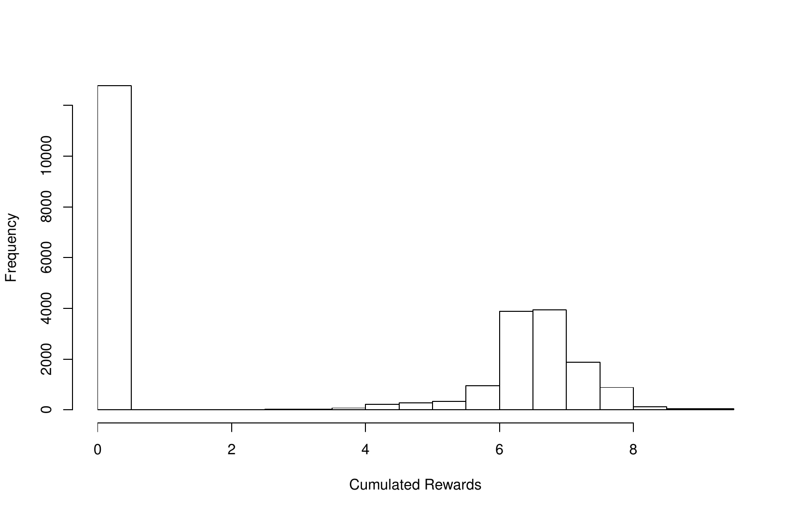
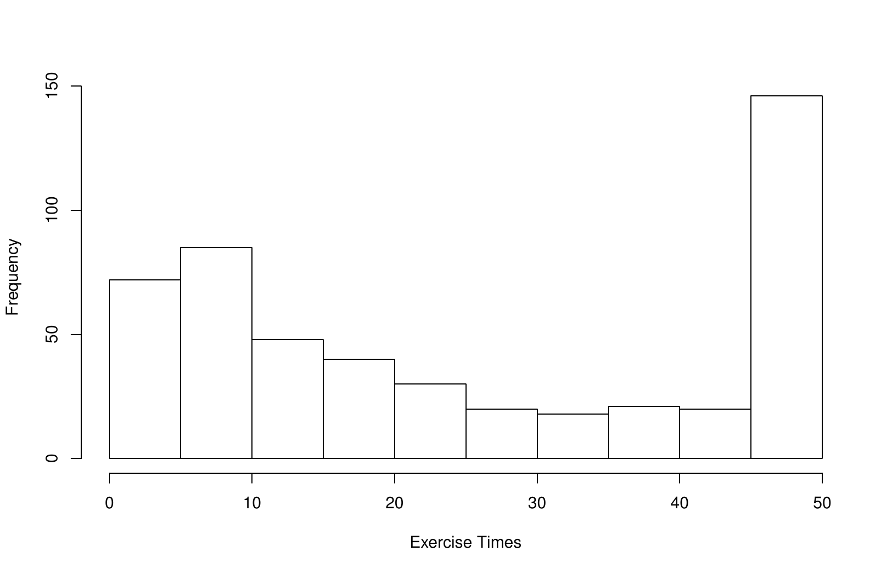
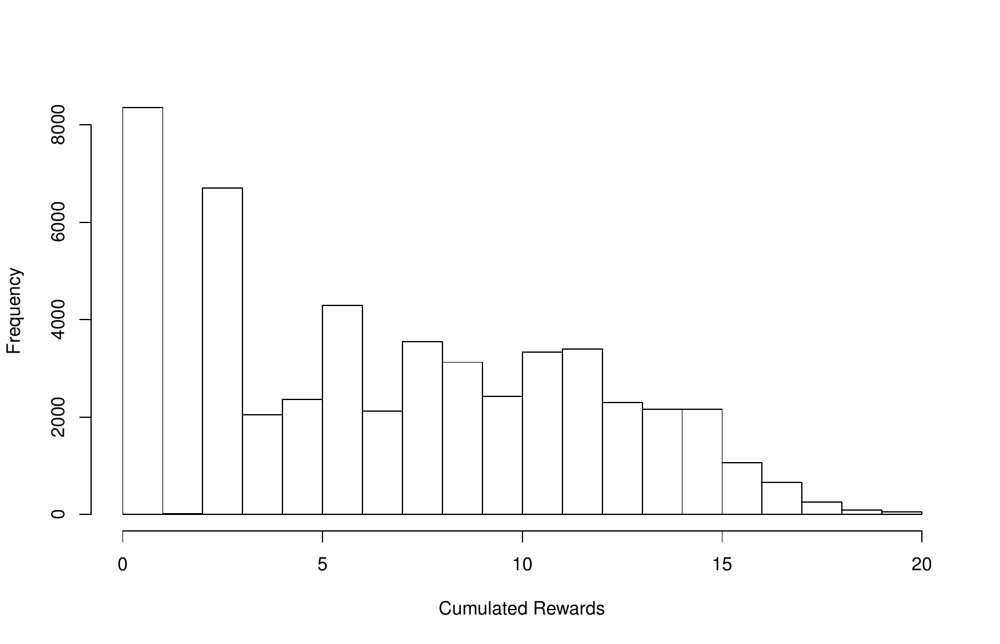
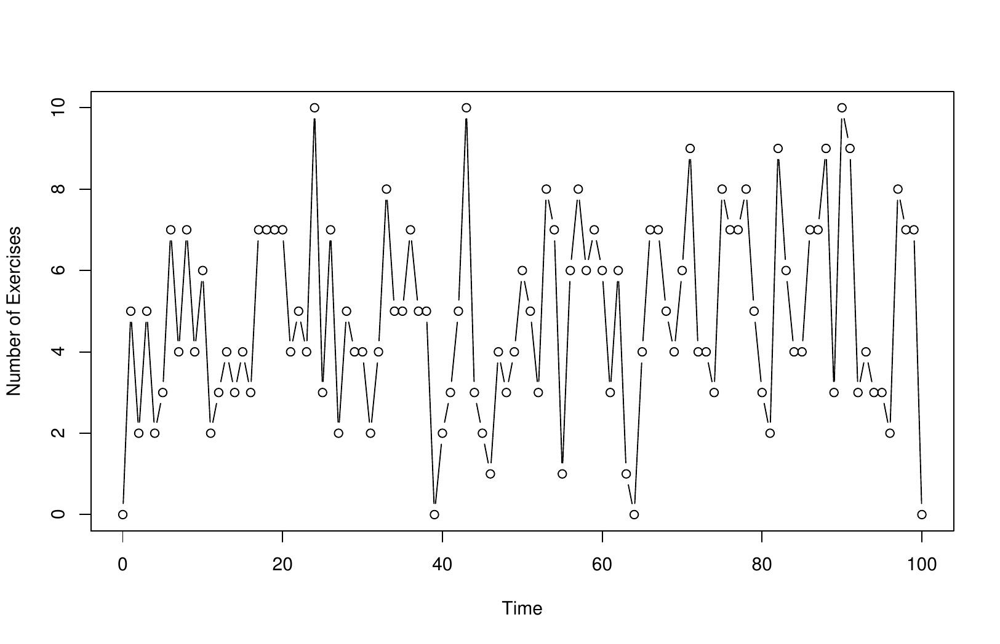
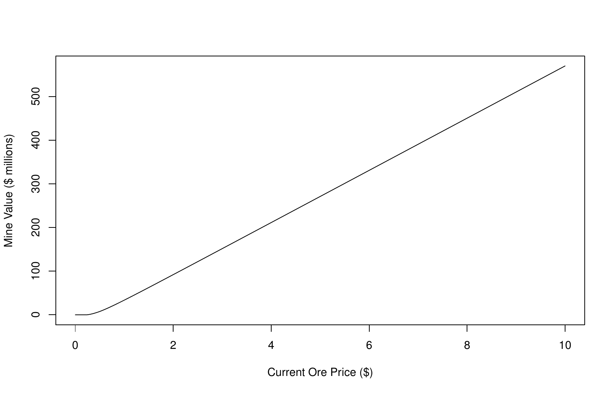

::: article
# Motivation

Sequential decision making is usually addressed under the framework of
discrete-time stochastic control. The theory of *Markov Decision
Processes/Dynamic Programming* provides a variety of methods to deal
with such questions. In generic situations, approaching analytical
solutions for even some of the simplest decision processes may be a
cumbersome process ([@powell], [@bauerle_rieder], [@pham]). The use of
numerical approximations may often be far more practical given the rapid
improvements in available computational power. The ability to gauge the
quality of these approximations is also of significant importance. This
paper will describe the implementation of fast and accurate algorithms
to address problems with a finite time setting, finite action set, and
convex reward functions whose state processes follow linear dynamics.

Although these assumptions seem restrictive, a large class of
practically important control problems can be solved using our methods.
For instance, approximating a compact action set by a sufficiently dense
finite grid of representative actions, an approximate solution with
excellent precision and numerical performance can be obtained. This
technique is illustrated by battery storage control ([@hinz_yee_battery]
in the present contribution. Furthermore, various extension to
non-linear state dynamics are possible. By using appropriate
transformations to linearize the state dynamics, our methodology becomes
applicable to control partially observable systems ([@hinz_yee_pomdp]).

This R package implements algorithms to approximate the value functions
in finite horizon Markov decision processes and also to gauge the
quality of these approximations. Under the conditions discussed in
[@hinz2014], these value functions converge to the true unknown value
functions *uniformly on compact sets*. Defined by the maxima half-norms
over compact sets, the corresponding topology ensures that the decision
rules, inferred from value function approximations, converge pointwise
to the optimal decision policy.

This paper points any interested readers to the technical details
contained in [@hinz2014]. The package
[*rcss*](https://CRAN.R-project.org/package=rcss) represents the first
software implementation of these algorithms and has already been used to
address problems such as pricing financial options ([@hinz_yap2015]),
natural resource extraction ([@hinz_etal_mining]), battery management
([@hinz_yee_battery]), and optimal asset allocation under hidden state
dynamics ([@hinz_yee_pomdp]). One of the major benefits of implementing
these methods within R ([@r]) is that the results can be analysed using
the vast number of statistical tools available in this language.

This R package focuses on linear state dynamics for the continuous state
component. While non-linear dynamics have been covered in [@yee_convex],
linear dynamics allow much of the computational effort to be reduced to
a series of multiplications and additions of matrices. This is an
attractive feature given the availability of well developed linear
algebra libraries. Linear state dynamics also allow for a standardized
problem formulation which is desirable for a software package. This R
package also focuses on problems with finite action sets which occur
frequently in many real world problems. While this may seem restrictive
for other problems, note that action sets are often discretized in
practice to allow for numerical tractability.

# Problem setting {#sec_problem}

Suppose that state space $\mathbf{X} = \mathbf{P} \times \mathbf{Z}$ is
the product of a finite set $\mathbf{P}$ and an open convex set
$\mathbf{Z} \subseteq \mathbb{R}^d$. Furthermore, assume that a finite
set $\mathbf{A}$ represents all possible actions. Given a finite time
horizon $\{0, 1, \dots, T\} \subset {\mathbb N}$, consider *a fully
observable* controlled Markovian process
$(X_t)_{t=0}^T := (P_t, Z_t)_{t=0}^T$ which consists of two parts. The
discrete component $(P_t)_{t=0}^T$ describes the evolution of a
finite-state controlled Markov chain which takes values in a finite set
$\mathbf{P}$. Further assume that at any time $t=0, \dots, T-1$ the
controller takes an action $a \in
\mathbf{A}$ from a finite set $\mathbf{A}$ of all admissible actions in
order to cause the one-step transition from the mode $p \in
\mathbf{P}$ to the mode $p' \in \mathbf{P}$ with a probability
$\alpha_{p, p'}(a)$, where $(\alpha_{p, p'}(a))_{p, p' \in
	\mathbf{P}}$ are pre-specified stochastic matrices for all $a \in
\mathbf{A}$.

Let us now turn to the evolution of the other component $(Z_t)_{t=0}^T$
of the state process $(X_t)_{t=0}^T$. Here, we assume that it follows an
uncontrolled evolution in the space $\mathbf{Z}$ driven as
$$Z_{t+1}=W_{t+1} Z_{t}, \qquad t=0, \dots, T-1$$
by independent *disturbance matrices* $(W_{t})_{t=1}^T$. That is, the
transition kernels ${\cal K}^a_t$ governing the evolution of our
controlled Markov process $(X_t)_{t=0}^T := (P_t, Z_t)_{t=0}^T$ from
time $t$ to $t+1$ are given for each $a \in \mathbf{A}$ by
$${\cal K}^a_t v(p,z)= \sum_{p' \in \mathbf{P}} \alpha_{p, p'}(a)
\mathbb E(v(p', W_{t+1}z)), \quad p \in \mathbf{P}, \, z \in \mathbf{Z}, \, t=0,
\dots, T-1$$
which acts on each function
$v: \mathbf{P} \times \mathbf{Z} \to {\mathbb R}$ where the above
expectations are well-defined.

If the system is in the state $(p, z)$, the costs of applying action
$a \in
\mathbf{A}$ at time $t=0, \dots, T-1$ are expressed through $r_t(p, z,
a)$. Having arrived at time $t=T$ in the state $(p, z)$, a final *scrap
value* $r_T(p, z)$ is collected. Thereby the reward and scrap functions
$$r_t: \mathbf{P} \times \mathbf{Z} \times \mathbf{A} \to {\mathbb R}, \quad
r_T: \mathbf{P} \times \mathbf{Z} \to {\mathbb R}$$
are exogenously given for $t=0, \dots, T-1$. At each time $t=0,
\dots, T$, the *decision rule* $\pi_{t}$ is given by a mapping
$\pi_{t}: \mathbf{P} \times \mathbf{Z} \to \mathbf{A}$, prescribing at
time $t$ an action $\pi_{t}(p,z) \in \mathbf{A}$ for a given state
$(p, z)
\in \mathbf{P} \times \mathbf{Z}$. Note that each decision rule refers
to the recent state of the system, representing a *feedback control*. A
sequence $\pi =
(\pi_{t})_{t=0}^{T-1}$ of decision rules is called a *policy*. For each
policy $\pi = (\pi_{t})_{t=0}^{T-1}$, the so-called policy value
$v^{\pi}_{0}(p_0, z_{0})$ is defined as the total expected reward
$$v^{\pi}_{0}(p_0, z_{0})=\mathbb{E}^{ (p_0, z_0), \pi } \left[
\sum_{t=0}^{T} r_{t}(P_t, Z_{t}, \pi_{t}(P_t, Z_t)) + r_{t}(P_t,
Z_{t}) \right].$$
In this formula $\mathbb{E}^{ (p_0, z_0), \pi }$ stands for the
expectation with respect to the probability distribution of
$(X_t)_{t=0}^T := (P_t, Z_t)_{t=0}^T$ defined by Markov transitions from
$(P_{t}, Z_{t})$ to $(P_{t+1}, Z_{t+1})$, which are induced by the
kernels ${\cal K}^{\pi_t(P_t, Z_t)}_t$ for $t=0, \dots, T-1$, started at
the initial point $(P_0, Z_0)=(p_0, z_0)$.

Now we turn to the optimization goal. A policy
$\pi^{*}=(\pi^{*}_{t})_{t=0}^{T-1}$ is called optimal if it maximizes
the total expected reward over all policies $\pi \mapsto
v^{\pi}_{0}(p, z)$. To obtain such policy, one introduces for $t = 0,
\dots, T-1$ the so-called *Bellman operator*
$$\label{bell}
{\cal T}_{t}v(p,z)=\max_{a \in \mathbf{A}} \left[
r_{t}(p,z , a) + \sum_{p'\in\mathbf{P}}
\alpha_{p,p'}(a)\mathbb{E}[v(p',W_{t+1}z)]\right]   (\#eq:bell)$$
for $(p, z) \in \mathbf{P} \times \mathbf{Z}$, acting on all functions
$v$ where the stochastic kernel is defined. Consider the *Bellman
recursion*, also referred to as backward induction:
$$\label{backward_induction}
v_{T}= r_{T}, \quad v_{t}= {\cal T}_{t}
v_{t+1} \qquad \hbox{for t=T-1,} \dots,
	0.   (\#eq:backward-induction)$$
Having assumed that the reward functions are convex and globally
Lipschitz and the disturbances $W_{t+1}$ are integrable, there exists a
unique recursive solution $(v^{*}_{t})_{t=0}^{T}$ to the Bellman
recursion. These functions $(v^{*}_{t})_{t=0}^{T}$ are called *value
functions* and they determine an optimal policy (possibly not unique)
$\pi^{*}=(\pi^{*}_{t})_{t=0}^{T}$ via
$$\begin{aligned}
\pi^{*}_{t}(p,z) & = \arg\max_{a \in
	\mathbf{A}}\left[r_{t}(p, z, a)+ \sum_{p'\in\mathbf{P}}
\alpha_{p,p'}(a)\mathbb{E}[v^{*}_{t+1}(p',W_{t+1}z)] \right],
\end{aligned}$$
for $t = T-1,\dots, 0$.

The aim of the package *rcss* is to approximate the true value functions
$(v^{*}_{t})_{t=0}^{T-1}$ and the corresponding optimal policies
$\pi^{*}=(\pi^{*}_{t})_{t=0}^{T-1}$. Given these approximations, our
package also determines their distance to optimality which will allow
the user to decide whether it is within some acceptable margin or
whether further fine tuning is needed to obtain even more accurate
results.

# Numerical approach {#sec_algo}

Since the reward and scrap functions are convex in the continuous
variable, the value functions are also convex and can be approximated by
piecewise linear and convex functions. For this, introduce the so-called
subgradient envelope ${\cal S}_{\mathbf{G}^m}f$ of a convex function
$f: \mathbf{Z} \to {\mathbb R}$ on a grid
$\mathbf{G}^m \subset \mathbf{Z}$ with $m$ points:
$$({\cal S}_{\mathbf{G}^m}f) (z)=\max_{g \in \mathbf{G}^m}
  (\triangledown_{g}f )(z),$$
for $z\in\mathbf{Z}$ where $\triangledown_{g}f$ is the tangent of $f$ at
grid point $g \in
\mathbf{G}^m$. Using the subgradient envelope operator, define the
double-modified Bellman operator as
$${\cal T}^{m, n}_{t}v(p, z) = {{\cal S}_{\mathbf{G}^{m}}} {\max_{a \in
\mathbf{A}}}\left( {r_{t}(p, z , a)+}
{\sum_{p'\in\mathbf{P}} \alpha_{p,p'}^a\sum_{k=1}^{n}\nu^{(k)}_{t+1}v(p', W^{(k)}_{t+1}z)} \right),$$
where the probability weights $(\nu^{(k)}_{t+1})_{k=1}^{n}$ correspond
to the distribution sampling $(W_{t+1}^{(k)})_{k=1}^{n}$ of each
disturbance $W_{t+1}$. The corresponding backward induction
$$\begin{aligned}
\label{scheme1}
v^{m, n}_{T}(p, z)&=&{\cal S}_{\mathbf{G}^{m}} r_{T}(p, z), 
\end{aligned}   (\#eq:scheme1)$$

$$\begin{aligned}
\label{scheme2}
v^{m, n}_{t}(p, z)&=&{\cal T}^{m, n}_{t}v^{m, n}_{t+1}(p, z),
\qquad t=T-1, \dots 0, 
\end{aligned}   (\#eq:scheme2)$$
yields the so-called double-modified value functions
$(v^{m, n}_{t})_{t=0}^{T}$. Under appropriate assumptions regarding grid
density and the disturbance sampling, the double-modified value
functions converge uniformly to the true value functions on compact sets
(see [@hinz2014]). To gauge the quality of the above approximations, we
construct two random variables whose expectations bound the true value
function i.e.
$$\label{gap}
  \mathbb E(\underline{\upsilon}_0(p,z_0)) \leq v_0(p,z_0) \leq \mathbb E(\overline{\upsilon}_0(p,z_0)), \qquad p_0 \in \mathbf{P}, \quad z_0 \in \mathbf{Z}.   (\#eq:gap)$$
We refer any interested readers to [@hinz_yap2015] for the technical
details. This process exhibits a helpful *self-tuning* property. The
closer the value function approximations resemble their true unknown
counterparts, the tighter the bounds in Equation \@ref(eq:gap) and the
lower the standard errors of the bound estimates. The R package *rcss*
represents these piece-wise linear functions as matrices and utilises
nearest neighbor algorithms (from [@nabor]) to reduce the computational
effort. Most of the computational work is done in C++ via
[*Rcpp*](https://CRAN.R-project.org/package=Rcpp) ([@rcpp]) and is
parallelized using [*OpenMp*](https://CRAN.R-project.org/package=OpenMp)
([@openmp]). The following sections give some code demonstrations.

# Example: Bermuda put

Stochastic control problems of optimal switching type naturally arise in
the framework of valuation of financial contracts. A simple example is
given by the Bermudan put option. This option gives its owner the right
but not an obligation to choose a time to exercise the option in a
finite number of time points before the maturity of the option in order
to receive a payment which depends on the price of the underlying asset
at the exercise time. The so-called fair price of the Bermudan option is
related to the solution of an optimal stopping problem (see
[@glasserman]). Here, the risk-neutral undiscounted asset price process
$( \tilde Z_{t})_{t=0}^{T}$ at time steps $0, \dots, T$ is modeled as a
sampled geometric Brownian motion
$$\tilde Z_{t+1}=  \epsilon_{t+1} \tilde Z_{t}, \quad t=0, \dots, T-1,  \,  Z_{0} \in {\mathbb R}_{+}, \label{prev} 
(\#eq:prev)$$
where $( \varepsilon_{t})_{t=1}^{T}$ are independent identically
distributed random variables following a log-normal distribution,
usually modeled in terms of
$$\varepsilon_t=\exp(((\mu-\frac{\sigma^2}{2})\Delta + \sigma  \sqrt{\Delta}N_t),$$
with independent, identically standard normally distributed random
variables $(N_t)_{t=1}^T$ where the parameters $\sigma>0$ and
$\mu \in {\mathbb R}_{+}$ represent the stock price volatility and the
continuously compounded interest rate respectively , measured on yearly
scale. The tenor $\Delta$ describes the length (measured in years) of
the equidistant time interval between exercise times. The fair price of
such option with strike price $K$, interest rate parameter
$\rho=\mu \Delta$, and maturity date $\Delta T$, is given by the
solution to the optimal stopping problem
$$\begin{array}{c}
\sup\{ \mathbb E(e^{-\rho \tau} \max(( K- \tilde Z_{\tau}), 0) ): \enspace
{\tau \text{is} \{0,1, \ldots, T\}-\text{valued stopping time}}\}.
\end{array}$$
A transformation of the state space is required to represent the reward
functions in a convenient way. Thus, we introduce an augmentation with 1
via
$$Z_{t}=\left[\begin{array}{c} 1 \\ \tilde Z_{t} \end{array}\right], \qquad  t=0, \dots, T.$$
then it becomes possible to represent the evolution as the linear state
dynamics
$$Z_{t+1}=W_{t+1}Z_{t}, \qquad t=0, \dots, T-1$$
with independent and identically distributed matrix-valued random
variables $(W_{t})_{t=1}^{T}$ given by
$$W_{t+1}= \left[ \begin{array}{cc} 1 & 0 \\  0 & \epsilon_{t+1}
\end{array}\right], \quad t=0,...,T-1. \label{bm}   (\#eq:bm)$$

This switching system is defined by two positions $\mathbf{P}=\{1, 2\}$
and two actions $\mathbf{A}=\{1, 2\}$. Here, the positions "exercised"
and "not exercised" are represented by $p=1$ and $p=2$ respectively, and
the actions "don't exercise" and "exercise" are denoted by $a=1$ and
$a=2$ respectively. With this interpretation, the position change is
given by deterministic transitions to specified states:
$$\alpha_{p,p'}^a
=\left\{
 \begin{array}{cl}
  1 &  \text{if} p'=\alpha(p, a)  \\ 0 & \text{else; } \label{deftwodim1}
 \end{array}
\right.   (\#eq:deftwodim1)$$
deterministically determined by the target positions
$$\label{twodim1}
(\alpha(p, a))_{p,a=1}^{2} \sim
\left[\begin{array}{cc}
\alpha(1,1) & \alpha(1,2)\\
\alpha(2,1) & \alpha(2,2)
\end{array}
\right].
=\left[\begin{array}{cc}
1 & 1\\
2 & 1
\end{array}
\right],   (\#eq:twodim1)$$
While the rewards at time $t=0, \dots, T$, are defined as
$$\begin{aligned}
r_{t}(p, (z^{(1)}, z^{(2)}), a) &=& e^{-\rho t}\max(K-  z^{(2)}, 0)(p-\alpha(p, a)),  \label{rewput}
\end{aligned}   (\#eq:rewput)$$

$$\begin{aligned}
r_{T}(p, (z^{(1)}, z^{(2)}) ) &=& e^{-\rho T} \max(K-  z^{(2)}, 0)(p-\alpha(p, 2)), \label{scrapput}
\end{aligned}   (\#eq:scrapput)$$
for all $p\in \mathbf{P}$, $a \in \mathbf{A}$, $z \in {\mathbb R}_{+}$.

## Code example

As a demonstration, let us consider a Bermuda put option with strike
price 40 that expires in 1 year. The put option is exercisable at 51
evenly spaced time points in the year, which includes the start and end
of the year. The following code approximates the value functions in the
Bellman recursion.

``` r
library(rcss)
rate <- 0.06                  ## Interest rate
step <- 0.02                  ## Time step between decision epochs
vol <- 0.2                    ## Volatility of stock price process
n_dec <- 51                   ## Number of decision epochs
strike <- 40                  ## Strike price
control <- matrix(c(c(1, 1), c(2, 1)), nrow = 2, byrow = TRUE)  ## Control
grid <- as.matrix(cbind(rep(1, 301), seq(30, 60, length = 301)))  ## Grid
## Disturbance sampling
u <- (rate - 0.5 * vol^2) * step
sigma <- vol * sqrt(step)
condExpected <- function(a, b) {
    aa <- (log(a) - (u + sigma^2)) / sigma
    bb <- (log(b) - (u + sigma^2)) / sigma
    return(exp(u + sigma^2 / 2) * (pnorm(bb) - pnorm(aa)))
}
weight <- rep(1 / 1000, 1000)
disturb <- array(0, dim = c(2, 2, 1000))
disturb[1,1,] <- 1
part <- qlnorm(seq(0, 1, length = 1000 + 1), u, sigma)
for (i in 1:1000) {
    disturb[2,2,i] <- condExpected(part[i], part[i+1]) / (plnorm(part[i+1], u, sigma) -
            plnorm(part[i], u, sigma))
}
## Subgradient representation of reward
in_money <- grid[,2] <= strike
reward <- array(0, dim = c(301, 2, 2, 2, n_dec - 1))
reward[in_money,1,2,2,] <- strike
reward[in_money,2,2,2,] <- -1
for (tt in 1:n_dec - 1){
    reward[,,,,tt] <- exp(-rate * step * (tt - 1)) * reward[,,,,tt]
}
## Subgrad representation of scrap
scrap <- array(data = 0, dim = c(301, 2, 2))
scrap[in_money,1,2] <- strike
scrap[in_money,2,2] <- -1
scrap <- exp(-rate * step * (n_dec - 1)) * scrap
## Bellman
r_index <- matrix(c(2, 2), ncol = 2)
bellman <- FastBellman(grid, reward, scrap, control, disturb, weight, r_index)
```

The matrix `grid` represents the grid points where each row represents a
point. The 3-dimensional array `disturb` represents the sampling of the
disturbances where `disturb[,,i]` gives the i-th sample. Here, we use
local averages on a $1000$ component partition of the disturbance space.
The 5-dimensional array `reward` represents the subgradient
approximation with `reward[,,a,p,t]` representing
${\mathcal S}_{{\mathbf G}^m} r_{t}(p,.,a)$. The object `bellman` is a
list containing the approximations of the value functions and expected
value functions for all positions and decision epochs. Please refer to
the package manual for the format of the inputs and outputs. To
visualise the value function of the Bermuda put option, simply run the
following plot command:

``` r
plot(grid[,2], rowSums(bellman$value[,,2,1] * grid), type = "l", xlab = "Stock Price",
     ylab = "Option Value")
```

{#bermuda_plot width="100%"
alt="graphic without alt text"}

The following code then performs the solution diagnostics by computing
the lower and upper bound estimates for the value of the option when
$Z_0 = 36$.

``` r
## Reward function
RewardFunc <- function(state, time) {
  output <- array(data = 0, dim = c(nrow(state), 2, 2))
  output[,2,2] <- exp(-rate * step * (time - 1)) * pmax(40 - state[,2], 0)
  return(output)
}
## Scrap function
ScrapFunc <- function(state) {
  output <- array(data = 0, dim = c(nrow(state), 2))
  output[,2] <- exp(-rate * step * (n_dec - 1)) * pmax(40 - state[,2], 0)
  return(output)
}
## Get primal-dual bounds
start <- c(1, 36)
## Path disturbances
set.seed(12345)
n_path <- 500
path_disturb <- array(0, dim = c(2, 2, n_path, n_dec - 1))
path_disturb[1, 1,,] <- 1
rand1 <- rnorm(n_path * (n_dec - 1) / 2)
rand1 <- as.vector(rbind(rand1, -rand1))
path_disturb[2, 2,,] <- exp((rate - 0.5 * vol^2) * step + vol * sqrt(step) * rand1)
path <- PathDisturb(start, path_disturb)
policy <- FastPathPolicy(path, grid, control, RewardFunc, bellman$expected)
## Subsim disturbances
n_subsim <- 500
subsim <- array(0, dim = c(2, 2, n_subsim, n_path, (n_dec - 1)))
subsim[1,1,,,] <- 1
rand2 <- rnorm(n_subsim * n_path * (n_dec - 1) / 2)
rand2 <- as.vector(rbind(rand2, -rand2))
subsim[2,2,,,] <- exp((rate - 0.5 * vol^2) * step + vol * sqrt(step) * rand2)
subsim_weight <- rep(1 / n_subsim, n_subsim)
mart <- FastAddDual(path, subsim, subsim_weight, grid, bellman$value, ScrapFunc)
bounds <- AddDualBounds(path, control, RewardFunc, ScrapFunc, mart, policy)
```

The above code takes the exact reward and scrap functions as inputs. The
function `FastPathPolicy` computes the candidate optimal policy. The
object `bounds` is a list containing the primals and duals for each
sample path $i$ and each position $p$ at each decision time $t$. Again,
please refer to the package manual for the format of the inputs and
outputs. If the price of the underlying asset is $36$, the $99\%$
confidence interval for the option price is given by the following.

``` r
> print(GetBounds(bounds, 0.01, 2))
[1] 4.475802 4.480533
```

The package *rcss* also allows the user to test the prescribed policy
from the Bellman recursion on any supplied set of sample paths. The
resulting output can then be further studied with time series analysis
or other statistical work. In the following code, we will use the
previously generated $500$ sample paths to backtest our policy and
generate histograms.

``` r
test <- FullTestPolicy(2, path, control, RewardFunc, ScrapFunc, policy)
## Histogram of cumulated rewards
hist(test$value, xlab = "Cumulated Rewards", main = "")
## Exercise times
ex <- apply(test$position == 1, 1, function(x) min(which(x)))
ex[ex == Inf] <- 51
ex <- ex - 1
hist(ex, xlab = "Exercise Times", main = "")
```

<figure id="bermuda_plot2">
<p></p>
<figcaption>Figure 2: Distribution of cumulated rewards and exercise
times.</figcaption>
</figure>

Figure [2](#bermuda_plot2) contains the histograms for the cumulated
rewards and exercise times. These can be useful to a practitioner (e.g.,
anticipating when the holder will exercise their option). Let us
emphasise the usefulness of such scenario generation. Given an
approximately optimal policy and backtesting, one can perform
statistical analysis on the backtested values to obtain practical
insights such as for risk analysis purposes.

# Example: swing option

Let us now consider the swing option which is a financial contract
popular in the energy business. In the simplest form, it gives the owner
the right to obtain a certain commodity (such as gas or electricity) at
a pre-specified price and volume at a number of exercise times which can
be freely chosen by the contract owner. Let us consider a specific case
of such a contract, referred to as a *unit-time refraction period* swing
option. In this contract, there is a limit to exercise only one right at
any time. Given the discounted commodity price $(S_{t})_{t=0}^{T}$, the
so-called fair price of a swing option with $N$ rights is given by the
supremum,
$$\sup_{0\leq\tau_1<\dots<\tau_N\leq T}\mathbb{E}\Big{[}\sum^N_{n=1}(S_{\tau_n}-Ke^{-\rho {\tau_n}})^+\Big{]},$$
over all stopping times, $\tau_1,\dots,\tau_N$, with values in
$\{0, \dots, T\}$. In order to represent this control problem as a
switching system, we use the position set $\mathbf{P}=\{1,\dots,N+1\}$
to describe the number of exercise rights remaining. That is,
$p \in \mathbf{P}$ stands for the situation when there are $p-1$ rights
remaining to be exercised. The action set $\mathbf{A}=\{1,2\}$
represents the choice between exercising ($a=1$) or not exercising
($a=2$). The control matrices $(\alpha_{p,p'}^{a})$ are given for
exercise action $a=1$
$$\alpha_{p, p'}^{1}=\left\{ \begin{array}{ll} 1 & \text{if}  p'=\max\{1, (p-1)\} \\
0 & \text{else,}
\end{array}\right.$$
and for not-exercise action $a=2$ as
$$\alpha_{p, p'}^{2}=\left\{ \begin{array}{ll} 1 & \text{if  p'=p} \\
0 & \text{else}
\end{array}\right.$$
for all $p, p' \in
\mathbf{P}$. In the case of the swing option, the transition between $p$
and $p'$ occurs deterministically, since once the controller decides to
exercise the right, the number of rights remaining is diminished by one.
The deterministic control of the discrete component is easier to
describe in terms of the matrix $(\alpha(p,a))_{p \in \mathbf{P}, a \in
  \mathbf{A}}$ where $p'=\alpha(p, a) \in
\mathbf{P}$ stands for the discrete component which is reached from
$p \in
\mathbf{P}$ by the action $a \in
\mathbf{A}$. For the case of the swing option this matrix is
$$(\alpha(p,a))_{p \in \mathbf{P},a \in \mathbf{A}} =
\left[ \begin{array}{cc}
1 & 1 \\
1 & 2\\
2& 3 \\
\dots & \dots \\
N & N+1 \\
\end{array} \right]. \label{twodim}   (\#eq:twodim)$$
Having modelled the discounted commodity price process as an exponential
mean-reverting process with a reversion parameter $\kappa
\in [0, 1[$, long run mean $\mu>0$, and volatility $\sigma>0$, we obtain
the logarithm of the discounted price process as
$$\label{ou}
\tilde Z_{t+1} = (1-\kappa) (\tilde Z_{t}-\mu)+\mu + \sigma \epsilon_{t+1}, \quad \tilde Z_{0}=\ln(S_{0}).   (\#eq:ou)$$
A further transformation of the state space is required before linear
state dynamics can be achieved. If we introduce an augmentation with 1
via
$$Z_{t}=\left[\begin{array}{c} 1 \\ \tilde Z_{t} \end{array}\right], \qquad  t=0, \dots, T,$$
then it becomes possible to represent the evolution as the linear state
dynamics
$$Z_{t+1}=W_{t+1}Z_{t}, \qquad t=0, \dots, T-1,$$
with independent and identically distributed matrix-valued random
variables $(W_{t})_{t=1}^{T}$ given by
$$W_{t+1}= \left[ \begin{array}{cc} 1 & 0 \\  \kappa \mu + \sigma \epsilon_{t+1} &
(1 - \kappa) \end{array}\right], \quad t=0,...,T-1.$$
The reward and scrap values are given by
$$\label{eq:reward2}
r_t(p,(z^{(1)}, z^{(2)}),a)= (e^{z^{(2)}}-Ke^{-\rho t})^{+} \big{(} p-\alpha(p,a) \big{)}   (\#eq:reward2)$$
for $t=0,\dots,T-1$ and
$$\label{eq:scrap2}
r_T(p,(z^{(1)}, z^{(2)}))=(e^{z^{(2)}}-Ke^{-\rho T})^{+} \big{(} p-\alpha(p,1) \big{)}   (\#eq:scrap2)$$
respectively for all $p \in \mathbf{P}$ and $a \in \mathbf{A}$.

## Code example

In this example, consider a swing option with $5$ rights exercisable on
$101$ time points. As before, we begin by performing the value function
approximation.

``` r
## Parameters
rho <- 0
kappa <- 0.9
mu <- 0
sigma <- 0.5
K <- 0
n_dec <- 101                  ## number of time epochs
N <- 5                        ## number of rights
n_pos <- N + 1                ## number of positions
grid <- cbind(rep(1, 101), seq(-2, 2, length = 101))  ## Grid
## Control matrix
control <- cbind(c(1, 1:N), 1:(N + 1))
## Reward subgradient representation
reward <- array(0, dim = c(101, 2, 2, nrow(control), n_dec - 1))
slope <- exp(grid[, 2])
for (tt in 1:(n_dec - 1)) {
    discount <- exp(-rho * (tt - 1))
    for (pp in 2:n_pos) {
        intercept <- (exp(grid[,2]) - K * discount) - slope * grid[, 2]
        reward[, 1, 1, pp, tt] <- intercept
        reward[, 2, 1, pp, tt] <- slope
    }
}
## Scrap subgradient representation
scrap <- array(0, dim = c(101, 2, nrow(control)))
discount <- exp(-rho * (n_dec - 1))
for (pp in 2:n_pos) {
    intercept <- (exp(grid[,2]) - K * discount) - slope * grid[, 2]
    scrap[, 1, pp] <- intercept
    scrap[, 2, pp] <- slope
}
## Disturbance sampling
weight <- rep(1/1000, 1000)
disturb <- array(0, dim = c(2, 2, 1000))
disturb[1, 1,] <- 1
disturb[2, 2,] <- 1 - kappa
CondExpected <- function(a, b){
    return(1/sqrt(2 * pi) * (exp(-a^2/2)- exp(-b^2/2)))
}
part <- qnorm(seq(0, 1, length = 1000 + 1))
for (i in 1:1000) {
  disturb[2,1,i] <- kappa * mu + sigma *
    (CondExpected(part[i], part[i+1]) / (pnorm(part[i+1]) - pnorm(part[i])))
}
## Bellman recursion
r_index <- matrix(c(2, 1), ncol = 2)
bellman <- FastBellman(grid, reward, scrap, control, disturb, weight, r_index)
```

After obtaining these function approximations, the following code
computes the $99\%$ confidence intervals for the value of a swing option
with $5$ remaining rights.

``` r
## Exact reward function
RewardFunc <- function(state, time) {
    output <- array(0, dim = c(nrow(state), 2, nrow(control)))
    discount <- exp(-rho * (time - 1))
    for (i in 2:nrow(control)) {
        output[, 1, i] <- pmax(exp(state[, 2]) - K * discount, 0)
    }
    return(output)
}
## Exact scrap function
ScrapFunc <- function(state) {
    output <- array(0, dim = c(nrow(state), nrow(control)))
    discount <- exp(-rho * (n_dec - 1))
    for (i in 2:nrow(control)) {
        output[, i] <- pmax(exp(state[, 2]) - K * discount, 0)
    }
    return(output)
}
## Generate paths
set.seed(12345)
n_path <- 500
path_disturb <- array(0, dim = c(2, 2, n_path, n_dec - 1))
path_disturb[1, 1,,] <- 1
path_disturb[2, 2,,] <- 1 - kappa
rand1 <- rnorm(n_path * (n_dec - 1) / 2)
rand1 <- as.vector(rbind(rand1, -rand1))
path_disturb[2, 1,,] <- kappa * mu + sigma * rand1
start <- c(1, 0)
path <- PathDisturb(start, path_disturb)
policy <- FastPathPolicy(path, grid, control, RewardFunc, bellman$expected)
## Set subsimulation disturbances
n_subsim <- 500
subsim <- array(0, dim = c(2, 2, n_subsim, n_path, n_dec - 1))
subsim[1, 1,,,] <- 1
subsim[2, 2,,,] <- 1 - kappa
rand2 <- rnorm(n_subsim * n_path * (n_dec - 1) / 2)
rand2 <- as.vector(rbind(rand2, -rand2))
subsim[2, 1,,,] <- kappa * mu + sigma * rand2
subsim_weight <- rep(1 / n_subsim, n_subsim)
## Primal-dual
mart <- FastAddDual(path, subsim, subsim_weight, grid, bellman$value, ScrapFunc)
bounds <- AddDualBounds(path, control, RewardFunc, ScrapFunc, mart, policy)
```

``` r
> print(GetBounds(bounds, 0.01, 6))
[1] 13.42159 13.44162
```

The tight $99\%$ confidence interval for the price of the swing option
above seems to indicate that the function approximations are of a good
quality. With this in mind, we now proceed to backtesting the associated
policy. We reuse the $1,000$ sample path generated for the solution
diagnostics.

``` r
test <- FullTestPolicy(6, path, control, RewardFunc, ScrapFunc, policy)
## Histogram of cumulated rewards
hist(test$value, xlab = "Cumulated Rewards", main = "")
## Exercise times
ex <- rep(0, n_dec)
for (i in 1:n_path) {
  for (t in 1:(n_dec - 1)) {
    if ((test$position[i, t] != 1) && (test$action[i, t] == 1)) {
      ex[t] <- ex[t] + 1
    }
  }
}
plot(0:(n_dec-1), ex, xlab="Time", ylab="Number of Exercises", type="b", main="")
```

<figure id="swing_plot2">
<p></p>
<figcaption>Figure 3: Distribution of cumulated rewards and number of
exercises.</figcaption>
</figure>

Figure [3](#swing_plot2) show the histogram for the cumulated rewards
and the number of exercises at each time point over the $1,000$ sample
paths. As mentioned before, more sophisticated statistical analysis can
be performed on these path values to gain practical insights.

# Example: optimal energy storage

This section examines optimal energy storage for an energy retailer in
the presence of a battery. The model is beyond the scope of this paper
and this paper points any interested readers to [@hinz_yee_battery] for
more details.

<figure id="new_grid">
<span class="math display">$${\begin{array}{c}
   \boxed{\text{{\bf \Large Consumer}}} \\
   \ominus\\
   \boxed{\begin{array}{c}
            \text{{\bf Renewable}} \\
            \text{{\bf Energy}}
          \end{array}
   }
\end{array}}
\Longleftrightarrow \begin{array}{c}
\boxed{\text{\bf \large Optimal Control}} \\
\Updownarrow \\
\boxed{ \begin{array}{c} {\text{\bf Battery Storage \&amp;}} \\
{\text{\bf Forward Contracts}} \end{array}}
\end{array}
\Longleftrightarrow
\boxed{\hbox{\bf \Large Grid}}$$</span>
<figcaption>Figure 4: Energy dispatch in the presence of renewable
energy and battery storage.</figcaption>
</figure>

The model is represented by the above figure and the basic gist is as
follows:

-   At every decision epoch, the energy retailer faces an energy
    imbalance determined by the net energy demand and the retailer's
    forward position in the electricity market.
-   Any real time imbalance must be rectified by buying or selling at
    real time grid prices.
-   When the electricity retailer has access to a battery, any
    imbalances can be offset (at least partially) by stored energy. This
    battery has fixed capacity.
-   The retailer's actions is given by the size of the retailer's
    forward positions in the electricity market. These actions determine
    the expected amount of energy stored in the battery at each time.
-   The goal of the retailer is to reduce the amount of balancing costs
    and forward trading costs.

The code below begins by specifying the grid, the battery
specifications, the action set, and the effect of the action on the
battery level. The grid will be used to represent the continuous state
component that drives the forward price in the electricity market. Here,
the battery has capacity 100 and discretized into steps of 5 from 0. The
action set represents the safety margin (the amount of energy bought in
the day ahead market that exceeds the predicted net demand) that the
retailer may choose. The control array below captures the transition
probabilities of the expected change in the battery level based on the
current battery level and the retailer's safety margin.

``` r
## Grid
n_grid <- 501                 ## number of grid points
grid_start <- -15             ## lowest state
grid_end <- 15  ## highest state
grid <- cbind(rep(1, n_grid), seq(grid_start, grid_end, length = n_grid))
## Battery specification
step <- 5                     ## step between battery levels
pos_start <- 0
pos_end <- 100
position <- seq(pos_start, pos_end, by = step)  ## battery levels
n_pos <- length(position)
## Standard deviation for the consumer demand
std <- 10
## Actions
n_action <- 11                ## number of safety margins
safety_start <- 0
safety_end <- 50
safety <- seq(safety_start, safety_end, length = n_action)  ## safety margins
## Control array
control <- array(data = 0, dim = c(n_pos, n_action, n_pos))
for (p in 1:n_pos) {
    for (a in 1:n_action) {
        temp <- position[p] + safety[a]  ## center of normal distribution
        control[p,a,1] <- pnorm(pos_start + step/2, temp, std)
        control[p,a,n_pos] <- 1 - pnorm(pos_end - step/2, temp, std)
        for (pp in 2:(n_pos-1)) {
            control[p,a,pp] <- pnorm(position[pp] + step/2, temp, std) -
                pnorm(position[pp] - step/2, temp, std)
        }
    }
}
```

Next the code computes the expected excess and shortages of electricity
faced by the retailer at each time period.

``` r
## Functions to calculate expected excess and shortage energy demand
erf <- function(x){  ## error function
    return(2 * pnorm(x * sqrt(2)) - 1)
}
Excess <- function(pos, act) {
    temp1 <- pos_end + step/2
    temp2 <- pos + act
    result <- std/sqrt(2*pi) * exp(-(temp1-temp2)^2/(2*std^2)) +
        (temp2 - pos_end)/2 * (1 - erf(1/sqrt(2*std^2) * (temp1 - temp2)))
    return(result)
}
Shortage <- function(pos, act) {
    temp1 <- pos_start - step/2
    temp2 <- pos + act
    result <- std/sqrt(2*pi) * exp(-(temp1-temp2)^2/(2*std^2)) +
        (pos_start - temp2)/2 * (erf(1/sqrt(2*std^2) * (temp1 - temp2)) + 1)
    return(result)
}
## Expected excess and shortage energy demand
excess <- matrix(data = NA, nrow = n_pos, ncol = n_action)
shortage <- matrix(data = NA, nrow = n_pos, ncol = n_action)
for (p in 1:n_pos) {
    for (a in 1:n_action) {
        excess[p,a] <- Excess(position[p], safety[a])
        shortage[p,a] <- Shortage(position[p], safety[a])
    }
}
```

The subgradient envelope of the reward and scrap functions are then
specified below. Essentially, the reward is given by the cost of the
forward trading and the cost of any expected shortages or excess energy
that needs to be balanced. At the final time, the retailer sells all
stored energy in the battery at the forward price. This is captured by
the scrap reward function.

``` r
## Subgradient representation of reward functions
n_dec <- 48 * 7 ## number of decision epochs
u_t <- 10 + cos((0:(n_dec-1)) * 2*pi/48 + 3*pi/2)
v_t <- 1 + (sin((0:(n_dec-1)) * 2*pi/48 + 3*pi/2))/2
buy <- 20  ## price to buy from grid
sell <- 0  ## price to sell to grid
reward <- array(0, dim = c(n_grid, 2, n_action, n_pos, n_dec - 1))
for (p in 1:n_pos) {
    for (a in 1:n_action) {
        for (t in 1:(n_dec-1)) {
            reward[,1,a,p,t] <- -safety[a] * u_t[t] - shortage[p, a] * buy + excess[p, a] * sell
            reward[,2,a,p,t] <- -safety[a] * v_t[t]
        }
    }
}
scrap <- array(0, dim = c(n_grid, 2, n_pos))
for (p in 1:n_pos) {
    scrap[,1,p] <- position[p] * u_t[n_dec]
    scrap[,2,p] <- position[p] * v_t[n_dec]
}
```

Finally, the disturbance sampling and the resulting double modified
value functions are computed using the subgradient approach. Here, we
assume that the continuous state ($Z_t$) driving the forward price is an
autoregression of order one. For the disturbance sample, we partition
the disturbance space into 1000 components of equal probability measure
and take the local average on each component.

``` r
## Parameters for AR(1) process (Z_t)
mu <- 0
sigma <- 0.5
phi <- 0.9
## Disturbance sampling
n_disturb <- 1000  ## size of sampling
disturb_weight <- rep(1/n_disturb, n_disturb)  ## probability weights
disturb <- array(matrix(c(1, 0, 0, phi), ncol = 2, byrow = TRUE), dim = c(2, 2, n_disturb))
CondExpected <- function(a, b){
  return(1/sqrt(2 * pi) * (exp(-a^2/2)- exp(-b^2/2)))
}
part <- qnorm(seq(0, 1, length = n_disturb + 1))
for (i in 1:n_disturb) {
  disturb[2,1,i] <- mu + sigma *
    (CondExpected(part[i], part[i+1]) / (pnorm(part[i+1]) - pnorm(part[i])))
}
r_index <- matrix(c(2, 1), ncol = 2)  ## randomness index
## Fast bellman recursion
bellman <- FastBellman(grid, reward, scrap, control, disturb, disturb_weight, r_index)
```

The following code example performs the solution diagnostics, computes
the bound estimates, and then outputs the results (shown in Table
[1](#tableBattery)). This gives the expected cumulative cost (and its
$99\%$ confidence interval) faced by the retailer depending on the
current amount of stored energy in the battery. If interested, we point
the reader to [@hinz_yee_battery] for more details regarding this
interesting problem.

``` r
## Exact reward function
RewardFunc <- function(state, time) {
  output <- array(0, dim = c(nrow(state), n_action, n_pos))
  for (p in 1:n_pos) {
    for (a in 1:n_action) {
      output[,a,p] <- -safety[a] * (u_t[time] + v_t[time] * state[,2]) -
        shortage[p,a] * buy + excess[p,a] * sell
    }
  }
  return(output)
}
## Scrap function
ScrapFunc <- function(state) {
  output <- array(0, dim = c(nrow(state), n_pos))
  for (p in 1:n_pos) {
    output[,p] <- position[p] * (u_t[n_dec] + v_t[n_dec] * state[,2])
  }
  return(output)
}
## Generate sample path disturbances
set.seed(12345)
n_path <- 100
path_disturb <- array(matrix(c(1, 0, 0, phi), ncol = 2, byrow = TRUE),
                      dim = c(2, 2, n_path, n_dec - 1))
rand <- rnorm(n_path * (n_dec - 1) / 2)
rand <- as.vector(rbind(rand, -rand))
path_disturb[2,1,,] <- mu + sigma * rand
start <- c(1, 0)  ## z_0
path <- PathDisturb(start, path_disturb)
policy <- FastPathPolicy(path, grid, control, RewardFunc, bellman$expected)
## Specifying subsimulation disturbance matrices
n_subsim <- 100
subsim_weight <- rep(1/n_subsim, n_subsim)
subsim <- array(matrix(c(1, 0, 0, phi), ncol = 2, byrow = TRUE),
                dim = c(2, 2, n_subsim, n_path, n_dec - 1))
rand <- rnorm(n_subsim * n_path * (n_dec - 1)/2)
rand <- as.vector(rbind(rand, -rand))
subsim[2,1,,,] <- mu + sigma * rand
## Compute primal and dual values
mart <- FastAddDual(path, subsim, subsim_weight, grid, bellman$value, ScrapFunc)
bounds <- AddDualBounds(path, control, RewardFunc, ScrapFunc, mart, policy)
## Storing the results
results <- matrix(data = NA, nrow = n_pos, ncol = 3)
alpha <- 0.01
for (p in 1:n_pos) {
  results[p,1] <- sum(bellman$value[251,,p,1] * grid[251,])
  results[p,2:3] <- GetBounds(bounds, alpha, p)
}
print(results)
```

::: {#tableBattery}
  -------------------------------------------------------------------
   Start Level (MWh)   Subgradient Estimate         $99\%$ CI
  ------------------- ---------------------- ------------------------
           0                -1679.859         (-1679.862, -1679.612)

           5                -1629.859         (-1629.862, -1629.612)

          10                -1579.859         (-1579.862, -1579.612)

          15                -1529.859         (-1529.862, -1529.612)

          20                -1480.168         (-1480.171, -1479.922)

          25                -1433.574         (-1433.577, -1433.328)

          30                -1389.685         (-1389.688, -1389.441)

          35                -1348.509         (-1348.512, -1348.266)

          40                -1310.129         (-1310.131, -1309.887)

          45                -1274.601         (-1274.604, -1274.362)

          50                -1241.952         (-1241.955, -1241.714)

          55                -1212.186         (-1212.188, -1211.949)

          60                -1185.294         (-1185.297, -1185.059)

          65                -1161.261         (-1161.263, -1161.027)

          70                -1140.063         (-1140.066, -1139.831)

          75                -1121.677         (-1121.680, -1121.446)

          80                -1106.080         (-1106.083, -1105.850)

          85                -1093.250         (-1093.253, -1093.021)

          90                -1083.161         (-1083.164, -1082.932)

          95                -1075.727         (-1075.730, -1075.499)

          100               -1070.728         (-1070.731, -1070.500)
  -------------------------------------------------------------------

  : Table 1: Subgradient and duality approach using $Z^{(2)}_0=0$ .
:::

# Natural resource extraction

As a final example, let us consider the case of optimal resource
extraction in [@hinz_etal_mining]. Suppose we have a hypothetical copper
mine represented in Table [2](#bs_table).

::: {#bs_table}
  ------------------------------------- -------------------------------------
  Output rate: 10 million pounds/year   Inventory level: 150 million pounds

  Costs of production: \$0.50/pound     Opening/closing costs: \$200,000

  Maintenance costs: \$500,000/year     Inflation rate: 8%/year

  Convenience yield: 1%/year            Price variance: 8%/year

  Real estate tax: 2%/year              Income tax: 50%

  Royalty tax: 0%                       Interest rate: l0%/year
  ------------------------------------- -------------------------------------

  : Table 2: Hypothetical copper mine.
:::

The following code approximates the value function of the above mine
using the following setting:

-   The mining lease is 30 years. After 30 years, the owner relinquishes
    ownership of the mine to the government.
-   Time is discretized into quarter years.
-   At the start of each time epoch, the owner decides whether the mine
    will be open (i.e. extracting ore) or closed (not extracting) for
    the next quarter. The owner can also relinquish ownership of the
    mine early at any of these time points.
-   Switching between open and closed states incurs a switching cost.
-   An open mine produces income but incurs higher operating costs than
    a closed mine.
-   The amount of ore in the mine is finite and decreases whenever the
    mine is open.
-   The owner wishes to maximise the expected total profits which gives
    the true value of the mine.

In the code below, the grid will be used to represent the price of the
ore which is assumed to follow geometric Brownian motion. The control
matrix will be used to reflect changes in the amount of unextracted ore
based on the owner's dynamic decision to open or close. For the
disturbance sampling, the disturbance space is partitioned into 1000
components of equal probability measure and the local averages on each
partition component is taken.

``` r
## Parameters
n_grid <- 501
grid <- as.matrix(cbind(rep(1, n_grid), seq(0, 10, length = n_grid)))
rate <- 0.1
delta <- 0.01
vol <- sqrt(0.08)
step <- 0.25
## Disturbance sampling
n_disturb <- 1000
disturb_weight <- rep(1/n_disturb, n_disturb)
disturb <- array(0, dim = c(2, 2, n_disturb))
disturb[1, 1,] <- 1
quantile <- rep(NA, n_disturb)
u <- (rate - delta - 0.5 * vol^2) * step
sigma <- vol * sqrt(step)
part <- qlnorm(seq(0, 1, length = n_disturb + 1), u, sigma)
condExpected <- function(a, b){  ##[a,b]
  aa <- (log(a) - (u+sigma^2))/sigma
  bb <- (log(b) - (u+sigma^2))/sigma
  vv <- exp(u + sigma^2/2) * (pnorm(bb) - pnorm(aa))
  return(vv)
}
for (i in 1:n_disturb) {
  quantile[i] <- condExpected(part[i], part[i+1]) /
	 (plnorm(part[i+1], u, sigma) - plnorm(part[i], u, sigma))
}
disturb[2, 2,] <- quantile
r_index <- matrix(c(2, 2), ncol = 2)
## Control matrix, a = 1 (close), 2 (abandon), 3 (open)
## p = 1 (exhausted), levels + 1 (full open), 2 * levels + 1 (full closed)
levels <- 15 / step
control <- matrix(data = 1, nrow = (2 * levels + 1), ncol = 3)
control[2:(2 * levels + 1), 1] <- (levels + 2):(2 * levels + 1)
control[2:(2 * levels + 1), 3] <- 1:levels
```

Next, we define the subgradient representation of the reward and scrap
functions. When the mine is open, the reward is essentially the income
from selling the extracted ore minus the cost of extracting that ore.
When the mine is closed, the reward is the cost of maintenance. If the
owner switches between open and closed states, there is a switching
cost. When the owner relinquishes ownership of the mine, there is no
reward or cost. The scrap reward function is set to zero in the below
code. These objects are then passed into the `FastBellman` function
which computes the value function approximations using nearest
neighbors.

``` r
## Subgrad rep of rewards
H1 <- 5 * step
H2 <- -2.5 * step
maint <- 0.5 * step
switch <- 0.2
inflation <- 0.08
tax_property <- 0.02
n_dec <- 1 + 30 / step + 1
discount <- exp(-(rate + tax_property) * step)
n_pos <- nrow(control)
n_action <- ncol(control)
n_dim <- ncol(grid)
reward <- array(data = 0, dim = c(n_grid, n_dim, n_action, n_pos, n_dec - 1))
for (p in 2:n_pos) {
  for (t in 1:(n_dec - 1)) {
    pi <- exp(inflation * (t-1) * step)
    adjust <- discount ^ (t-1)
    ## Close the asset
    if (p > (levels + 1)) {  ## Closed
      ## Close
      reward[, 1, 1, p, t] <- adjust * -maint * pi
      ## Open
      reward[, 1, 3, p, t] <- (H2 - switch) * pi * adjust
      reward[, 2, 3, p, t] <- H1 * adjust
    } else if (p <= (levels + 1)) {  ## Opened
      ## Close
      reward[, 1, 1, p, t] <- -(maint + switch) * pi * adjust
      ## Open
      reward[, 1, 3, p, t] <- H2 * pi * adjust
      reward[, 2, 3, p, t] <- H1 * adjust
    }
  }
}
## Subgrad rep of scrap
scrap <- array(data = 0, dim = c(n_grid, n_dim, n_pos))
## Performing fast bellman recursion
bellman <- FastBellman(grid, reward, scrap, control, disturb, disturb_weight, r_index)
```

Finally, running the following code gives an illustration of the value
of an open mine based on the current ore price.

``` r
plot(grid[,2], rowSums(bellman$value[,,levels,1] * grid), type = "l",
	xlab = "Current Ore Price ($)", ylab = "Mine Value ($ millions)")
```

{#bermuda_plot
width="100%" alt="graphic without alt text"}

For more details regarding this problem, we point any interested readers
to [@hinz_etal_mining].

# Conclusion {#sec_end}

This paper gives a demonstration of our R package, *rcss* in solving
optimal switching problems. Our package represents the first software
implementation of this class of algorithms. The problem setting
discussed in this paper is broad and can be used to model a wide range
of problems. Using nearest neighbor algorithms, the package *rcss* is
able to solve some real world problems in an accurate and quick manner.
It is also worth mentioning that this R package can be used to address
Markov decision processes when there is a hidden Markov model as shown
in [@hinz_yee_pomdp]. However, this is not demonstrated here in order to
preserve the brevity of this paper.
:::
