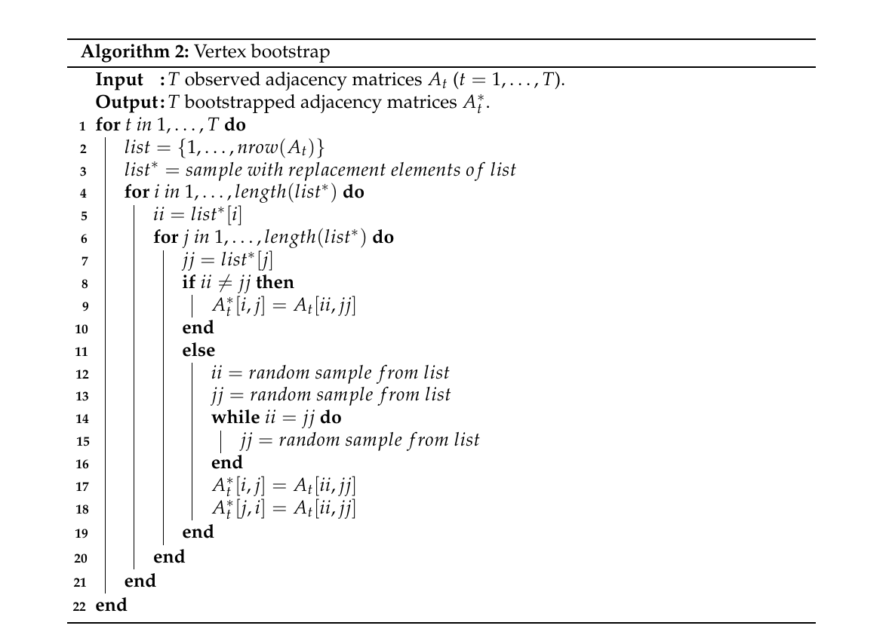
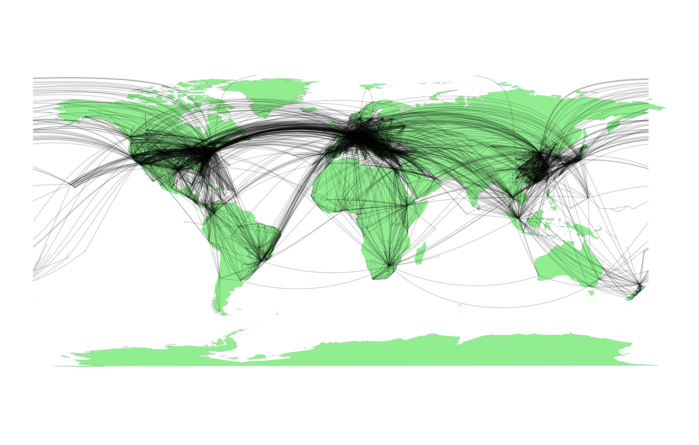
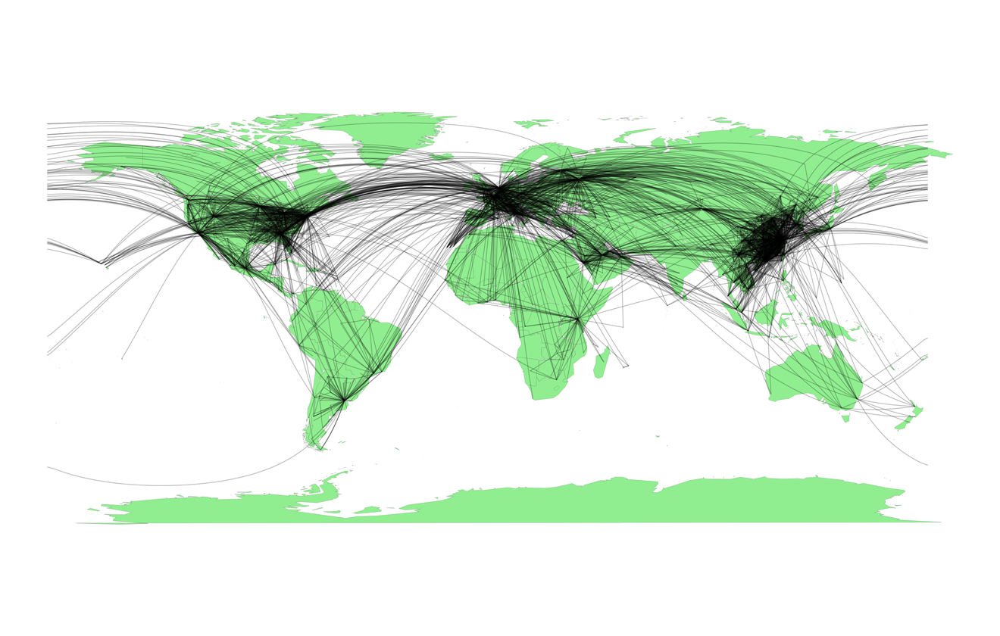
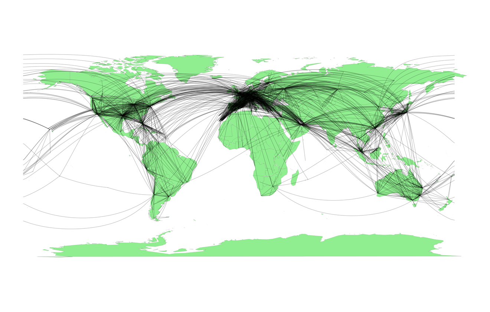

# Introduction

Traditionally, the structural network analysis, that is, the analysis of
data in the form of graphs, has been primarily approached as a
descriptive task, in contrast to an inferential task, while the employed
analytic tools have rooted mainly within research areas outside of
"mainstream" statistical methodology. In the recent years, however,
there has been a flare of interest in developing new statistical methods
for inference on complex networks [see overviews by
@Goldenberg:etal:2010; @Kolaczyk:Csardi:2014; @Brugere:etal:2017 and
references therein]. Despite the explosive growth of statistical methods
for network analysis, the developed methodology for inference on
graph-structured data remains predominantly parametric and model-based.
At the same time, nonparametric bootstrap and resampling appears as an
appealing and flexible data-driven alternative for network inference,
especially, if only a single realization of a large complex network
exists. That is, we can follow the same route as the classical bootstrap
of [@Efron:1979] which was proposed four decades ago as an alternative
to conventional parametric methods for independent and identically
distributed data, and later was extended to various weakly dependent
space-time processes [@Hall:2013; @Shao:Tu:1995; @Chernick:2007].

We attribute the first pioneering attempt to develop nonparametric
bootstrap on networks to @Snijders:Borgatti:1999. The Snijders--Borgatti
procedure, called vertex bootstrap, allows evaluating estimation
uncertainty for network density and testing one- and two-sample
hypotheses for densities, under the assumption that all the network
information is available upfront. Vertex bootstrap is widely used in
social studies and is implemented in such highly popular software for
social network analysis as UCINET [@UCINET]. However, vertex bootstrap
remains largely unknown in statistics and there still exists no
implementation of this procedure in R. The next attempt to draw
bootstrap inference on complex networks, with a focus on uncertainty
quantification in network degree estimation, has been suggested by
@Thompson:etal:2016 and @Gel:etal:2016. The idea is to borrow the
"blocking" argument, developed for bootstrapping of time series and
re-tiling of spatial data, and adapt it to random networks. The
resulting procedure, called patchwork bootstrap, starts from sampling a
set of multiple ego networks of varying orders and forming a patch
(i.e., a network block analogue), and then proceeds to resampling the
data within patches. Patchwork bootstrap allows to quantify estimation
uncertainties for network degree distribution and its functions, and to
construct reliable and sharp confidence intervals in a fully data-driven
way. Furthermore, patchwork bootstrap is applicable to ultra-sparse and
only partially observable networks.

The new R package
[*snowboot*](https://CRAN.R-project.org/package=snowboot) [@snowboot] is
the first to offer vertex and patchwork bootstrap in R. Moreover, to our
knowledge, there currently exist only two more R packages implementing
bootstrap analysis of networks,
[*bootnet*](https://CRAN.R-project.org/package=bootnet) and
[*sna*](https://CRAN.R-project.org/package=sna). The package *bootnet*
assesses uncertainty in estimation of edge-weights and centrality
indices but does not account for network dependence structure among
vertices. The package [*sna*](https://CRAN.R-project.org/package=sna)
implements parametric bootstrapping of edges to generate new random
graphs that can be further used for hypothesis testing of matching
between the observed network and randomized baseline network as well as
canonical correlation coefficients. This paper aims to further fill the
gap and showcase utility of nonparametric resampling for network
inference, with a particular focus on vertex and patchwork bootstraps.
*snowboot* imports the R packages
[*graphics*](https://CRAN.R-project.org/package=graphics),
[*igraph*](https://CRAN.R-project.org/package=igraph) [@igraph],
[*parallel*](https://CRAN.R-project.org/package=parallel),
[*Rcpp*](https://CRAN.R-project.org/package=Rcpp) [@Rcpp],
[*Rdpack*](https://CRAN.R-project.org/package=Rdpack) [@Rdpack],
[*stats*](https://CRAN.R-project.org/package=stats), and
[*VGAM*](https://CRAN.R-project.org/package=VGAM) [@VGAM].

The paper is organized as follows. In the next section, we discuss
methodology and implementation of vertex and patchwork bootstraps. In
the simulation studies, we evaluate the implemented bootstrap methods in
an application to synthetic data. Our case studies illustrate
application of the bootstrap to analysis of airline networks, power
grids, and the David Copperfield network. The paper is concluded by a
discussion.

# Bootstrap algorithms on networks {#sec:BootAlg}

## Patchwork bootstrap

While the first results on sampling on networks go back to the 1960s
[see, e.g., @Goodman:1961; @Frank:1969; @Granovetter:1976] and while
nowadays there exist numerous graph sampling procedures [see overviews
by
@Carrington:2011; @Ahmed:etal:2014; @Kolaczyk:2009; @simpson2015catching; @Zhang:etal:2015
and references therein], still surprisingly little is known on how to
reliably and efficiently quantify sampling uncertainties, without
imposing typically unverifiable model specification constraints. In this
section, we discuss the new method of patchwork sampling and bootstrap
(based on algorithms of [@Thompson:etal:2016] and [@Gel:etal:2016]) that
enables us to quantify sampling estimation uncertainties for network
degree distribution and its functions, while using only a small
proportion of network information.

{#fig:diag width="100%"
alt="graphic without alt text"}

### Assumptions {#assum}

Consider an undirected random graph $G=(V, E)$ with a set of vertices,
$V(G)$, and a set of edges, $E(G)$. The order and size of $G$ are
defined as the number of vertices and edges in $G$, i.e., $|V(G)|$ and
$|E(G)|$, respectively. We assume that $G$ has no self-loops, i.e.,
$u\neq v$ for any edge $e_{uv} \in E$. The degree of a vertex $v$ is the
number of edges incident to $v$. We denote the probability that a
randomly selected vertex has a degree $k$ by $f(k)$, the degree
distribution of $G$ by $F=\{f(k), k\geq 0\}$, and the mean degree of $G$
by $\mu(G)$.

Let graph $G$ represent some hypothetical "true" random graph of
interest that is never fully observed, and its degree distribution $F$
with finite mean and its order are unknown. Instead, we observe a random
graph $G_{n}$ of order $n$ with a degree distribution
$F_{n}=\{f_{n}(k), k\geq 0\}$. Let $N^{(n)}_k$ be the number of vertices
with a degree $k$ in $G_n$. Observed graph $G_n$ can be viewed as a
realization of $G$ in a sense that as $n\to\infty$,
$N^{(n)}_k/n\to f(k)$ in probability (empirical distribution $F_n$
converges in probability to $F$) and joint degree distribution of
$G_{n}$ approaches that of $G$ (see
[@Britton:etal:2006; @vanderHofstad:2014] and references therein).

Furthermore, we assume that $G$ is *involution invariant*
[@Lovasz:2012; @Orbanz:Roy:2013; @Crane:2018]. Note that involution
invariance is linked to unimodularity [@Aldous:Lyons:2007]. That is, let
us select a vertex $v$, $v \in V$ and perform a single step random walk
from $v$ to one of its neighbors $u$, $u\in V$; then the distribution of
the neighborhood of $v$ will be the same as the distribution of the
neighborhood of $u$. I.e., from the vantage point of any randomly
selected vertex, the rest of the connected network is probabilistically
the same. The property of involution invariance can be viewed as a
network analogue of stationarity of stochastic
processes [@Orbanz:Roy:2013; @Crane:2018]. Indeed, as
per [@Aldous:Lyons:2007], unimodularity, or involution invariance,
relates to "statistical homogeneity" or "spatial stationarity" of a
network. In turn, stationarity is typically an essential condition for
consistency of block bootstrap for space and time dependent data, thus,
again linking our bootstrap procedure with the "blocking" argument.
However, similarly to strong stationarity in time series analysis,
involution invariance is not a formally *verifiable* condition. In
practical terms of network analysis, the proposed patchwork bootstrap is
applicable to networks that are believed to be "homogenous," that is,
their distributional properties are the same across the whole network,
which includes, for example, but not limited to exchangeable
graphs [@Crane:2018]. In turn, the patchwork bootstrap will not be, for
example, applicable to networks with community structures. Note that in
contrast to exchangeable networks which are dense, involution invariance
(and the proposed patchwork bootstrap) is also applicable to sparse
networks [@Orbanz:2017].

To the best of our knowledge, there currently exists no competing
bootstrap procedure for quantifying uncertainty in estimators of network
degree distribution. The subsampling procedure
of [@Bhattacharyya:Bickel:2015] focuses on assessment of uncertainty in
motif, or subgraph counts in dense exchangeable networks and is not
feasible for inference on degree distribution. The method
of [@Ali:etal:2016] also targets inference on counts of small sub-graphs
and is based on the notion of dependency graphs under the network
exchangeability framework. The vertex bootstrap approach
of [@Snijders:Borgatti:1999], implemented in our R package *snowboot*,
does not impose density limitations but assumes availability of the
whole network upfront and is applicable to only small networks. In turn,
[@Lusseau_etal_2008] and [@Epskamp:etal:2018] propose bootstrap for
edge-weights and centrality indices without accounting for network
dependence structure among vertices.

The workflow of the proposed patchwork bootstrap consists of the three
key steps, that is, Labeled Snowball Sampling with Multiple Inclusions,
Resampling, and Cross-Validation (see Figure [1](#fig:diag)).

### Labeled snowball sampling with multiple inclusions

The central element of our technique for network sampling and inference
is a patch, which is a structured sample of vertices and edges joining
them. Patch sampling is performed in the following three steps:

1.  Sample randomly without replacement several vertices from a network
    (Figure [2](#fig:LSMI)(a)).

2.  Construct a Labeled Snowball with Multiple Inclusions (LSMI)
    independently around each vertex (Figure [2](#fig:LSMI)(b)):

    1.  Label each of the sampled vertices as a seed.

    2.  Select adjacent vertices by following the edges emanating from
        the seed and label them as the first wave of non-seeds.

    3.  Select and label neighborhoods of second and higher orders by
        following the edges emanating from the first wave of non-seeds.
        A vertex with degree $k>1$ is included into the sample as many
        times as it is selected by following the previously unused edges
        (multiple inclusions are allowed).

3.  Join all LSMIs into one patch (Figure [2](#fig:LSMI)(c)).

{#fig:LSMI width="100%"
alt="graphic without alt text"}

Detailed steps of the patch formation are given in
Figure [3](#alg:LSMI), which is a modified version of respective
algorithms by @Thompson:etal:2016 and @Gel:etal:2016. The advantage of
the algorithm in Figure [3](#alg:LSMI) is that we explore patches with a
smaller number of seeds by taking a subset from the seeds we have
sampled, rather than by sampling new seeds from a network. This further
improves computational efficiency of the algorithm and minimizes the
amount of information obtained from a network.

{#alg:LSMI width="100%"
alt="graphic without alt text"}

To demonstrate the algorithm, we use one of the artificial networks
stored in the R package *snowboot*:

``` r
> library(snowboot)
> net <- artificial_networks[[1]]
```

Function `lsmi` allows us to create a patch with seeds being randomly
sampled or pre-specified. For example, a patch with two random seeds and
one wave of neighbors around them:

``` r
> set.seed(1)
> lsmi(net, n.seed = 2, n.wave = 1)
  [[1]]
  [[1]][[1]]
  [1] 532
  [[1]][[2]]
  [1] 524 763

  [[2]]
  [[2]][[1]]
  [1] 744
  [[2]][[2]]
  [1] 145 858
```

The output is structured as a list of length equal to the number of
seeds sampled. Each element of this list is a list itself, where first
element contains the seed ID; second element contains IDs of vertices in
the first wave, and so on. This structure allows us to keep track of
neighborhoods around each seed separately, including the labels -- waves
in which the vertices appear. The above output shows that two seeds were
sampled, with IDs `532` and `744`. The first-order neighbors of vertex
`532` are `524` and `763`; of vertex `744` -- vertices `145` and `858`.

Alternatively, we can specify particular seeds and select the
neighborhoods around them:

``` r
> lsmi(net, seeds = c(532, 744), n.wave = 1)
```

This option can be used to study specific vertices in a network [e.g.,
select the neighborhood around in the collaboration network of
mathematical scientists; @Thompson:etal:2016].

The next function, `lsmi_union`, records information about patches
obtained by subsetting the originally sampled seeds
(Figure [3](#alg:LSMI)):

``` r
> patches <- lsmi_union(net, n.seeds = c(2, 5, 10), n.wave = 2)
> ls(patches)
  [1] "lsmi_big"       "sequence_seeds"
> patches$sequence_seeds
  [[1]]
  [1]  124  352  403  411 1146 1255 1319 1795 1816 1886

  [[2]]
  [1]  411 1146 1319 1816 1886

  [[3]]
  [1] 1146 1886
```

The output is a list of two elements: a patch with the biggest number of
seeds and waves from those specified (in the example above,
`patches$lsmi_big` is a patch with 10 seeds and 2 waves around each
seed) and a list of seeds and their subsamples (in the example above,
those are vectors of lengths 10, 5, and 2 with IDs of the vertices) for
constructing smaller patches.

The current version of the LSMI algorithm (Figure [3](#alg:LSMI)) pays
special attention to counting the edges to precisely record of the
vertices' degrees. In each patch, estimates of the probabilities for a
vertex to have a certain degree $k$ ($k>0$) are obtained with a modified
Horvitz--Thompson estimator, whereas $\hat f(0)$, the probability of
vertices with zero degree, is approximated by the proportion of seeds
with zero degree, $\hat{p}_0$. These estimates can be employed to
calculate functions of the network degree distribution, e.g., mean
degree $\mu$ [@Thompson:etal:2016; @Gel:etal:2016]:
$$\begin{aligned}
 \label{eq:Estimates}
\hat{f}(0)&=&\hat{p}_0 = \frac{|\{d_s=0\}|}{|\{d_s\}|} ,\nonumber  \\
\hat{f}(k)&=&\frac{|\{d_s=k\}|+(1-\hat{p}_0)\hat{\mu}_s|\{d_{ns}=k\}|k^{-1}}{|\{d_s\}|+\hat{\mu}_s\sum_{k\geqslant 1}|\{d_{ns}=k\}|k^{-1}}, \\
\hat{\mu}(G) &=& \sum_{k \geqslant 0}{k \hat{f}(k)}, \nonumber
\end{aligned}   (\#eq:Estimates)$$
where ${d_{s}}$ are the degrees of the sampled seeds; ${d_{ns}}$ are the
degrees of non-seeds; $\left| \cdot \right |$ denotes cardinality of a
set; $\hat{\mu}_s$ is the estimated mean degree based on $\{d_s\}$:
$$\label{eq:Ek}
\hat{\mu}_s=\sum_{k\geqslant 0}k\frac{|\{d_{s}=k\}|}{|\{d_{s}\}|}.   (\#eq:Ek)$$
Since the probability of non-seed vertices to be included into an LSMI
is proportional to their degree, the estimates $\hat{f}(k)$
in (\@ref(eq:Estimates)) use information from non-seeds downweighted by
$k^{-1}$.

Using the `lsmi_dd` function, calculate $\hat{f}(k)$ from the patch we
obtained earlier:

``` r
> empdd <- lsmi_dd(patches$lsmi_big, net)
> empdd$mu
  [1] 2.40574
> empdd$fk
            0           1           2           3           4           5
  0.000000000 0.369724254 0.248171075 0.207653348 0.082301632 0.040517727
            6           7           8           9
  0.004220597 0.025323579 0.016460326 0.005627462
```

The output is an object of class `’snowboot’` containing the estimates
of mean degree and degree distribution. The length of the latter vector
depends on what was the maximal degree ($\max(k)$) of the vertices
included into the current patch. In the example above, $\max(k) = 9$.

### Resampling procedure

To quantify uncertainty associated with the sample
estimates (\@ref(eq:Estimates)) of network statistics, we apply a
weighted bootstrap procedure. The probability of each non-seed vertex to
appear in a bootstrap sample is assigned a weight of $d_{ns}^{-1}$,
i.e., reciprocal of the vertex's degree. We obtain $B$ bootstrap samples
and compute a network statistic on each of them to approximate the
distribution of the sample estimates. Each combination of the number of
seeds and waves gives different estimates (\@ref(eq:Estimates)), hence,
the bootstrap procedure is applied separately to patches of different
seed-wave combinations. The bootstrap counterparts of the
estimates (\@ref(eq:Estimates)) are as follows:
$$\begin{aligned}
 \label{eq:BootEstimates}
\hat{f}^*(0)&=& \hat{p}^*_0 = \frac{|\{d^*_s=0\}|}{|\{d^*_s\}|}, \nonumber\\
\hat{f}^*(k)&=&\frac{ |\{d^*_s=k\}|+(1-\hat{p}^*_0) |\{d^*_{ns}=k\}|}
{ |\{d^*_s\}| + |\{d^*_{ns}\}| },\\
\hat{\mu}^*(G) &=& \sum_{k \geqslant 0}{k \hat{f}^*(k)}, \nonumber
\end{aligned}   (\#eq:BootEstimates)$$
where $\{d^*_s\}$ and $\{d^*_{ns}\}$ are the respective sets of
bootstrapped seeds and non-seeds.

The empirical bootstrap degree distribution can be obtained using the
`boot_dd` function from the *snowboot* package:

``` r
> B <- 50
> bootdd <- boot_dd(empdd, B)
```

A part of the output is a $(1 + \max(k)) \times B$ matrix of bootstrap
estimates $\hat{f}^*(k)$, where $k=0,1,\ldots,\max(k)$, and a vector of
length $B$ with $\hat{\mu}^*$:

``` r
> dim(bootdd$fkb)
  [1] 10 50
> length(bootdd$mub)
  [1] 50
```

The bootstrap degree distributions are used to quantify estimation
uncertainty. That is, let $\eta$ be the parameter of interest (i.e., the
population value, $\mu$ or $f(k)$), $\hat{\eta}^j_n$ and
$\hat{\eta}_n^{j*}$ be the respective conventional and bootstrap
estimators of $\eta$ based on a graph $G_n$ ($j= 1,\ldots, J$ are the
different seed-wave combinations for constructing patches). Then the
Efron's $100(1-\alpha)\%$ bootstrap confidence interval for $\eta$:
$$\label{eq:CI}
CI^j_{percentile} = \left( \hat{\eta}_{n,\left[B\alpha/2 \right]}^{j*},\; \hat{\eta}_{n,\left[ B(1-\alpha/2) \right]}^{j*} \right),   (\#eq:CI)$$
where $B$ is the number of bootstrap samples;
$\hat{\eta}_{n,\left[B\alpha/2 \right]}^{j*}$ and
$\hat{\eta}_{n,\left[ B(1-\alpha/2) \right]}^{j*}$ are the empirical
quantiles from the bootstrap distribution.

Having all bootstrapped values available from the output of `boot_dd`,
we can employ a variety of methods for calculating bootstrap intervals
alternative to the percentile method (\@ref(eq:CI)). At this time, the
function `boot_ci` can be switched to compute "basic" bootstrap
intervals (see Equation 5.6 by [@Davison:Hinkley:1997]):
$$CI^j_{basic} = \left( 2\hat{\eta}^j_n - \hat{\eta}^{j*}_{n,[B(1-\alpha/2)]},\; 2\hat{\eta}^j_n - \hat{\eta}^{j*}_{n,[B\alpha/2]} \right).$$

In our synthetic network example, $\hat{f}(3)=$ 0.208, and its 95%
bootstrap confidence interval (\@ref(eq:CI)), based on the 50 bootstrap
samples, is

``` r
> CIpercentile <- boot_ci(bootdd)
> CIpercentile$fk_ci[,"3"]
       2.5%     97.5%
  0.1286842 0.2631579
```

The outputs of the functions `lsmi_dd`, `boot_dd`, and `boot_ci` are
estimates of the network degree distribution $f(k)$ and mean degree
$\mu$ based on a single patch. They are recognized as objects of class
`’snowboot’` and can be plotted with the S3 method `plot` for this class
(Figure [4](#fig:plotsnowboot)).

{#fig:plotsnowboot width="100%"
alt="graphic without alt text"}

### Cross-validation with LSMI

Growing snowball samples to higher waves is used in sampling surveys
when obtaining new seeds is prohibitively expensive, for example, in
hard-to-reach and "hidden" subpopulations of HIV high risk individuals.
Even if no more new seeds can be obtained, varying the number of seeds
in a patch offers an additional flexibility, so that multiple seed-wave
combinations can be evaluated and an optimal seed-wave combination is
selected for a given observed network.

Given bootstrap confidence intervals from patches for each $j$th
seed-wave combination ($j=1,\ldots,J$), we use Algorithm 2 of
@Gel:etal:2016 to decide which patch provides confidence intervals of
the best coverage for our statistic $\eta$. We approximate the ground
truth using proxy samples. A proxy sample is obtained by resampling
(with or without replacement) vertices already used in the LSMIs, so no
new information is needed from the network. From multiple such samples,
proxy statistics $\hat{\eta}^{proxy}$ are estimated, and then for each
$j$ a proportion of proxy statistics within the interval $CI^j$ is
calculated. This proportion aims to approximate the true coverage
probability of the bootstrap confidence intervals, so an interval
$CI^{j_{opt}}$ with the coverage closer to the nominal level $1-\alpha$
can be selected.

Cross-validation is performed automatically by an upper-level function
`lsmi_cv` in the *snowboot* package. This function obtains multiple
patches for each of the specified seed-wave combinations and runs
cross-validation to select the optimal bootstrap confidence interval
based on proxy values for the mean (by default, 19 proxy samples are
obtained, each comprising 30 vertices):

``` r
> cv <- lsmi_cv(net, n.seeds = c(10, 20, 30), n.wave = 5, B = 100)
> cv
  $`bci`
      2.5%    97.5%
  1.749167 2.952500

  $estimate
  [1] 2.387042

  $best_combination
  n.seed n.wave
      10      2

  $seeds
  [1]  218  323  851 1003 1039 1097 1410 1624 1723 1756
```

The output of `lsmi_cv` contains the optimal seed-wave combination
(`best_combination`), the corresponding point estimate (`estimate`) and
bootstrap confidence interval (`bci`), and, for information purposes,
the IDs of the actual seeds that were used in the patch with the
selected seed-wave combination (`seeds`). In this example, a fixed
increment grid is used for the number of seeds and waves, however, a
user may choose to do a stochastic search in the parameter space.

### Why does patchwork bootstrap work and its areas of limitations

**Bias vs. variance** Many estimators of graph totals based solely on
seeds are known to be unbiased [@Frank:1977]. However, variance of such
seed-based estimator might be high if the number of seeds is low. In
turn, in many applications sampling more seeds might be prohibitively
expensive, e.g., due to data privacy and cost restrictions (see overview
by [@Illenberger:Flotterod:2012] and references therein). Adding
information from non-seeds into the degree estimator increases bias but
reduces variance. Hence, the choice of optimal number of seeds (egos)
and waves of non-seeds in LSMI implies a classical bias vs. variance
trade-off, and we address it using the cross-validation procedure
described above.

**Network properties** Furthermore, as in many non-network settings, in
order to ensure consistency of the bootstrap estimator
$\hat{\eta}_n^{*}$ of the statistic of interest $\eta_n$, based on a
degree distribution $F_{n}=\{f_{n}(k), k\geq 0\}$ of a random graph
$G_{n}$, we typically need to ensure that $F_{n}$ is a satisfactory
approximation of $F$ as $n\to\infty$. That is, we need to ensure that
the empirical degree distribution $F_{n}$ cannot be drastically
different from the population degree distribution $F$ and shall approach
the population degree distribution $F$ with increasing $n$, which in
turn is a necessary condition for $\eta_n \to \eta$ as $n\to\infty$. In
addition, $F$ needs to satisfy some invariance properties. Those
conditions give rise to the assumptions for patchwork bootstrap on
page . Note that while nowadays there are no formal tests for assessing
involution invariance, similarly as there exists no test to assess
strong stationarity in time series, a class of involution invariant
graphs includes, for example, such a large subclass as exchangeable
graphs [@Lovasz:2012; @Orbanz:Roy:2013]. Asymptotic properties of
patchwork bootstrap for $\hat{\eta}_n^{*}$ for involution invariant
graphs are discussed in more details in @Gel:etal:2016. In addition,
@Thompson:etal:2016 consider the two-phase conditional inference
framework to derive asymptotic properties for patchwork bootstrap
estimator of mean degree $\mu$.

**Sampling design** Finally, we would like to emphasize that properties
of bootstrap on networks largely depend not only on the underlying
network topology but on the closely linked question on how sampling is
performed. In this section we focus only on properties of a network
degree distribution and argue that LSMI appears to be a suitable choice
(see more discussion in [@Illenberger:Flotterod:2012; @Gel:etal:2016]).
In turn, bootstrap and, generally, finite-sample inference for other
network statistics will typically require adjustment of a sampling
design [@Kolaczyk:2009].

Hence, the algorithms of LSMI sampling and estimation realized in the
*snowboot* package target such network statistics as network degree
distribution (probabilities of observing vertices with a specific
degree) and its functions (e.g., mean degree and network density). In
turn, the algorithm of patchwork bootstrap aims to quantify the
uncertainty of those estimates.

Switching to other network statistics, such as clustering coefficient or
motifs, requires implementation of different sampling and bootstrap
schemes, for example, via combination of patchwork bootstrap with the
algorithm of [@Ali:etal:2016] [see @Orbanz:2017 for discussion on
sampling and subsampling designs]. Hence, this extension constitutes a
natural direction for future methodological research and R code
implementation.

## Vertex bootstrap {#vertex_bootstrap}

Vertex bootstrap (Figure [5](#alg:VB)), or the Snijders--Borgatti
procedure, is the pioneering approach to non-parametric bootstrap
inference on graphs. Nevertheless, despite its high popularity in social
sciences, vertex bootstrap remains largely unknown in statistics. Vertex
bootstrap employs an induced graph sampling for quantification of
standard errors in network density estimation and allows hypothesis
testing on density of two networks. The algorithm assumes availability
of the entire network data upfront and requires resampling of the entire
data set and, hence, is limited to relatively small networks due to
computational costs. To the best of our knowledge, there exists no
analysis of asymptotic properties and theoretical guarantees for the
Snijders--Borgatti procedure.

We implement vertex bootstrap in the R package *snowboot* in a function
`vertboot`, which resembles calculations under the option "Network
$\rightarrow$ Compare densities" of the UCINET software [@UCINET].

{#alg:VB width="100%"
alt="graphic without alt text"}

The `vertboot` function not only generates similar results compared with
UCINET, but also returns results with higher precision and faster run
times. In *snowboot*, the algorithm is written in C`++`.

Another important improvement is that `vertboot` allows users to compare
statistics of interest for multiple networks, whereas the number of
different networks, $T$ (Figure [5](#alg:VB)), in UCINET is limited to 1
or 2. Finally, the output of `vertboot` (Figure [5](#alg:VB)) is a
bootstrapped network, which implies that users can analyze various
network statistics besides the network density.

We demonstrate the `vertboot` function using prison network data. The
data were collected from 67 prison inmates; each inmate could choose as
few or as many "friends" as he desired. A direct factor analysis of
these sociometric data was performed by @MacRae:1960.

-   Get the observed adjacency matrix for the prison network:

    ``` r
    > a <- scan("http://vlado.fmf.uni-lj.si/pub/networks/data/ucinet/prison.dat",
    +            skip = 4)
    > A <- matrix(a, sqrt(length(a)), byrow = TRUE)
    ```

-   Apply vertex bootstrap (Figure [5](#alg:VB)) $B$ times to generate
    $B$ bootstrapped adjacency matrices (networks):

    ``` r
    > set.seed(1)
    > B <- 500
    > Astar <- vertboot(A, B)
    ```

-   Get the densities of $B$ bootstrapped networks:

    ``` r
    > library(igraph)
    > densities <- sapply(1:B, function(x)
    +    graph.density(graph_from_adjacency_matrix(Astar[[x]])))
    ```

-   Estimate density of the observed network and bootstrap standard
    error of the estimates:

    ``` r
    > density_obs <- graph.density(graph_from_adjacency_matrix(A))
    > densities_se <- sd(densities)
    ```

-   Obtain a 95% bootstrap confidence interval for the population
    density:

    ``` r
    > quantile(densities, c(0.025, 0.975))
            2.5%      97.5%
      0.03301673 0.05178652
    ```

We can use the outputs of the vertex bootstrap (Figure [5](#alg:VB)) to
build bootstrap confidence intervals for other statistics:

-   Mean degree:

    ``` r
    > mu_star <- sapply(1:B, function(x)
    +    mean(degree(graph_from_adjacency_matrix(Astar[[x]]), mode = "in")))
    > quantile(mu_star, c(0.025, 0.975))
          2.5%    97.5%
      2.179104 3.417910
    ```

-   Transitivity:

    ``` r
    > net_transitivity <- sapply(1:B, function(x)
    +    transitivity(graph_from_adjacency_matrix(Astar[[x]]), type = "undirected"))
    > quantile(net_transitivity, c(0.025, 0.975))
            2.5%      97.5%
      0.08890533 0.21852252
    ```

# Simulation studies {#sec:Simulation}

## Light- and heavy-tailed degree distributions

In this section, we demonstrate the performance of the patchwork
bootstrap algorithm for inference on mean degree of simulated graphs. We
consider random graphs of orders 1000, 5000, and 10000 that are
constructed from two polylogarithmic distributions of the same mean
(population mean degree $\mu(G)=2.67$ for all simulated networks), but
with different tail behavior. Particularly, polylogarithmic distribution
with parameters $\delta=0.001$, $\lambda=2.13$ has a light tail, whereas
polylogarithmic distribution with parameters $\delta=0.987$, $\lambda=5$
has a heavy tail (Figure [6](#fig:two_poly)).

{#fig:two_poly width="100%"
alt="graphic without alt text"}

The results of our simulation study (Table [1](#talbe_ver_pat_sim)) show
a good performance of the patchwork bootstrap approach with automatic
selection of patch sizes (i.e., seed-wave combinations) using the
cross-validation procedure. Thus, the observed coverage probabilities of
the confidence intervals are close to the nominal level 95% for both
light- and heavy-tailed networks. At the same time, confidence intervals
in the considered light-tailed networks are approximately 25% narrower.
Time complexity of the patchwork procedure on any random graph is
$\mathcal{O}([\left | d_{s}\right |\cdot \hat{\mu}_s]^{\left | d_{ns}\right |})$.

::: {#talbe_ver_pat_sim}
  ----------------------------------------- ---------------------- --------------- ------------------- --------------- --
                                                                                    Network order $n$                  

                                                                                                                       

                Distribution                 Mean degree $\mu(G)$       1000              5000              10000      

   polylog($\delta=0.001$, $\lambda=2.13$)           2.67           97.7% (0.794)     96.4% (0.812)     97.7% (0.805)  

    polylog($\delta=0.987$, $\lambda=5$)             2.67           98.6% (1.051)     98.7% (1.078)     97.7% (1.069)  
  ----------------------------------------- ---------------------- --------------- ------------------- --------------- --

  : Table 1: Observed coverage probabilities of 95% patchwork bootstrap
  confidence intervals for the mean degree (average interval width is in
  parentheses). These intervals come from the optimal seed-wave
  combination (one for each random graph) defined via a cross-validation
  over a grid of 20 combinations: waves from 1 to 5; and number of seeds
  20, 30, 40, and 50. In cross-validation, proxy mean degrees are
  estimated 13 times from 100 vertices sampled without replacement from
  the patch data. The number of bootstrap samples, $B$, is 500. The
  experiment uses 1000 Monte Carlo simulations, carried out as parallel
  processes on a distributed computing cluster.
:::

## Vertex removal

In this section, we randomly remove vertices (and edges emanating from
those vertices) from the simulated networks prior to applying the
patchwork and vertex bootstrap methods for the inference on mean degree.
This allows us to assess the methods' robustness and capabilities of
providing reliable inference when part of the network information is
missing. Our goal is to estimate when performance of the methods
decreases significantly.

As Table [2](#table_patch_sim) shows, when only 1% of the vertices are
removed, both methods deliver confidence intervals with coverage close
to the declared 95% level. When 2% of network vertices are removed,
coverage probabilities of vertex bootstrap intervals decline to 81.8%
and 89.8% for light- and heavy-tailed networks, respectively. The
performance of vertex bootstrap further rapidly declines as more
vertices are removed, and the decline is more severe for the
light-tailed polylogarithmic distribution. Remarkably, patchwork
bootstrap performs consistently well on both distributions (observed
coverage probabilities are close to the nominal level), even when 5% of
the vertices are removed (Table [2](#table_patch_sim)). Using the
example of the light-tailed polylogarithmic distribution, we show that
coverage of vertex bootstrap declines to zero when 10% or 15% of
vertices are removed, while respective coverage of the patchwork
bootstrap intervals is 93.9% and 85.1%, respectively
(Figure [7](#fig:node_removal_light)).

::: {#table_patch_sim}
  ----------------------------------------- ----------------- ------------------ ---------------------------- ----------- ----------- -----------
                                                  Mean                            Number of vertices removed                          

                                                                                                                                      

  Distribution                               degree $\mu(G)$        Method                    1%                  2%          3%          5%

  polylog($\delta=0.001$, $\lambda=2.13$)         2.67            Patchwork                 96.0%                97.8%       97.6%       97.5%

                                                                                           (0.807)              (0.801)     (0.806)     (0.795)

                                                                                          \[0.187\]            \[0.194\]   \[0.191\]   \[0.196\]

                                                                                                                                      

                                                               Vertex bootstrap             96.3%                81.8%       54.7%       5.8%

                                                                                           (0.170)              (0.170)     (0.169)     (0.169)

                                                                                          \[0.090\]            \[0.091\]   \[0.090\]   \[0.090\]

  polylog($\delta=0.987$, $\lambda=5$)            2.67            Patchwork                 99.4%                99.0%       98.9%       99.4%

                                                                                           (1.072)              (1.062)     (1.062)     (1.032)

                                                                                          \[0.230\]            \[0.239\]   \[0.249\]   \[0.237\]

                                                                                                                                      

                                                               Vertex bootstrap             96.3%                89.8%       74.0%       25.7%

                                                                                           (0.212)              (0.211)     (0.211)     (0.209)

                                                                                          \[0.113\]            \[0.113\]   \[0.113\]   \[0.112\]
  ----------------------------------------- ----------------- ------------------ ---------------------------- ----------- ----------- -----------

  : Table 2: Observed coverage probabilities of 95% nonparametric
  bootstrap confidence intervals. Average interval width is in
  parentheses, standard errors are in square brackets. Network order
  $n=5000$; number of bootstrap samples $B=500$; 1000 Monte Carlo
  simulations. For the patchwork method, $J=20$ seed-wave combinations:
  number of seeds 20, 30, 40, and 50; number of neighbors from 1 to 5.
:::

{#fig:node_removal_light
width="100%" alt="graphic without alt text"}

Hence, the patchwork bootstrap approach is a competitive alternative
when analyzing large complex networks, both in terms of computational
speed and reliability of inference when a part of the network
information is missing. Moreover, the patchwork method is both
computationally efficient and information-greedy, i.e., only a small
proportion of the network data is required, the procedure subsets the
sampled seeds to consider patches of different sizes and re-uses
information from the patches in the cross-validation procedure. In
contrast, the vertex bootstrap employs information of the whole target
network so that its time complexity is $\mathcal{O}(n^{2})$. At the same
time, for small networks with all the network information being
available upfront, the vertex bootstrap is the preferred method as it
provides noticeably sharper confidence intervals under the same level of
calibration.

# Case studies {#sec:CaseStudies}

In this section, we illustrate utility of the *snowboot* package for
analysis of airline networks, power grids, and the David Copperfield
network.

## The David Copperfield network

We start from a smaller network, namely, the David Copperfield network
collected by [@Newman:2006]. It examines the lexicon of Charles
Dickens's classic 19th century novel. The network vertices are common
nouns and adjectives; undirected edges connect adjacent words
(Figure [8](#fig:david_graph)).

{#fig:david_graph
width="100%" alt="graphic without alt text"}

The number of vertices and edges in the David Copperfield network are
112 and 425, respectively. This is a relatively small network, so the
vertex bootstrap algorithm is suitable for analysis. Some basic network
statistics of the David Copperfield network are presented in
Table [3](#tab:Copp).

::: {#tab:Copp}
  --------------------------------------------------------------------------
   Order   Density   Number of edges   Mean degree   Clustering coefficient
  ------- --------- ----------------- ------------- ------------------------
    112     0.068          425            7.589              0.157

  --------------------------------------------------------------------------

  : Table 3: Parameters of the David Copperfield network.
:::

Perform the vertex bootstrap in the following steps:

-   Load the network data and obtain an adjacency matrix:

    ``` r
    > library(igraph)
    > graph_david <- read.graph(
    +    "http://networkdata.ics.uci.edu/data/adjnoun/adjnoun.gml", format = "gml")
    > A <- as.matrix(as_adjacency_matrix(graph_david))
    ```

-   Use vertex bootstrap (Figure [5](#alg:VB)) to obtain bootstrapped
    adjacency matrices:

    ``` r
    > library(snowboot)
    > B <- 500
    > set.seed(1)
    > Astar <- vertboot(A, B)
    ```

-   Use these bootstrapped networks to calculate 95% bootstrap
    confidence intervals for the density and bootstrap standard error:

    ``` r
    > boot_density <- sapply(1:B, function(x)
    +    graph.density(graph_from_adjacency_matrix(Astar[[x]])))
    > CIvertboot <- quantile(boot_density, c(0.025, 0.975))
    > CIvertboot
            2.5%      97.5%
      0.05473174 0.08579271
    > bootstrap_standard_error <- sd(boot_density)
    > bootstrap_standard_error
      [1] 0.007681788
    ```

    That is, we find that the resulting 95% confidence interval from the
    vertex bootstrap is (0.055, 0.086); the interval contains the
    observed density of 0.068. Now let us apply the patchwork bootstrap
    to the David Copperfield network.

-   Use the patchwork bootstrap to calculate 95% bootstrap confidence
    intervals for the density:

    ``` r
    > set.seed(5)
    > igraph_david <- igraph_to_network(graph_david)
    > CIpatchwork <- lsmi_cv(igraph_david, n.seeds = c(3:5), n.wave = 1, B = B)
    > CIpatchwork$bci/(igraph_david$n - 1)
            2.5%      97.5%
      0.04305405 0.08957658
    ```

We find that the 95% confidence interval from the patchwork bootstrap
also contains the observed density of 0.068. However, the patchwork
bootstrap CI is wider than the vertex bootstrap CI (i.e., 0.047 for
patchwork vs. 0.031 for vertex procedure). At the same time, the
patchwork bootstrap used only about 31.4% of the available vertices.

## Larger networks

### Flight networks of the airline alliances

With constantly increasing costs of operation and rigid legal
restrictions on ownership of national flag carriers, no single airline
can provide a comprehensive global network, which is vital to its
success. An urgent need for expansion propels airlines to effectively
cooperate on multiple levels: from interlining (combining flights from
different airlines in one travel itinerary) to joint frequent flyer
programs, to sharing revenue, costs, and benefits [@IATA:2011].

Nowadays, three major passenger airline alliances (Star Alliance,
Oneworld, and SkyTeam) share more than 70% of the world market. There
exists a constant, fierce competition in customer acquisition and
retention among these three alliances, and one of its key factors is
claimed to be a route map (number of served destinations and better
connections). Traditional indicators, such as total passenger
enplanements or number of aircraft movements, fail to capture the
competitiveness of airline networks [@Burghouwt:Redondi:2013]. However,
for a fixed network structure, e.g., with hubs and spokes, dense air
flight networks (with a high mean degree) are more convenient, since
they further minimize the required number of connections. The
International Air Transport Association (IATA) study of European Union
countries showed that a 10% rise of the number of destinations served
and/or the frequency of service can increase long-run gross domestic
product by 1.1% [@IATA:2006].

We then evaluate densities of the three flight networks (Star Alliance,
SkyTeam, and Oneworld) to assess which alliance offers the most
convenient travel network to its passengers. Since flight connections
are easier if a transfer occurs within one airport, we focus on airport
networks. This approach treats all airports as separate vertices even
some of them have the same service area (for example, Toronto Pearson
International Airport and Billy Bishop Toronto City Airport).

To construct the networks, we obtained the crowdsourced air flights data
from OpenFlights.org on October 23, 2013. At the time of analysis, Star
Alliance, Oneworld, and SkyTeam included 28, 13, and 19 members,
respectively. We used the airline codes to select all flights for each
airline alliance, but removed self-loops and the cases with missing
airport identifications (up to 0.4% of the records). To eliminate the
repeated entries, including the codeshare flights within each alliance,
we kept only unique links between airports. About 11.0% of all remaining
vertices had different in-degree and out-degree, but we neglected the
directions for simplicity. Thus, for each airline alliance, we obtained
a network where the vertices stand for airports, and each unweighted
undirected edge represents existing flight connection at least in one
direction (Figure [9](#fig:alliances)).

<figure id="fig:alliances">
<p>(a) Star Alliance  (b) SkyTeam  (c) Oneworld </p>
<figcaption>Figure 9: Airport networks of the airline
alliances.</figcaption>
</figure>

Table [4](#table_air) reports the networks orders $n$ and network
densities $\hat{d}(G_n)$ estimated on all observed data along with the
results of the patchwork bootstrap. The network order (i.e., number of
served airports) is close to 1,000 for all three alliances. (Given a
relatively high order of the airline networks, we do not consider the
vertex bootstrap in this case study.) The optimal seed-wave combinations
suggested by the cross-validation procedure differ among the networks:
20 seeds and 1 wave for SkyTeam, 30 seeds and 1 wave for Star Alliance,
and 40 seeds and 1 wave for Oneworld. The width of the confidence
interval for Star Alliance and Oneworld is only 0.00296 and 0.00321,
respectively, compared with 0.00497 for SkyTeam. Since all three
confidence intervals overlap with each other, we conclude that currently
there exists no significant difference in flight connections offered by
the three major airline alliances. Thus, the loyalty of frequent fliers
and acquisition of new customers are likely to be attributed to other
factors, such as customer service, loyalty program benefits, ticket
prices, and availability of flights in particular regions (e.g.,
Figure [9](#fig:alliances) shows that Oneworld network provides almost
no service in African airports).

::: {#table_air}
  --------------- ------ ---------------- ------------- ------- ------------------------ ---------
                                                Optimal            95% confidence bounds 

                                            combination           for the density $d(G)$ 

                                                                                         

          Network    $n$   $\hat{d}(G_n)$         Seeds   Waves                    Lower     Upper

    Star Alliance   1289          0.00621            30       1                  0.00492   0.00788

          SkyTeam   1040          0.00736            20       1                  0.00561   0.01058

         Oneworld    914          0.00655            40       1                  0.00533   0.00854
  --------------- ------ ---------------- ------------- ------- ------------------------ ---------

  : Table 4: The 95% bootstrap confidence intervals for the density of
  airline alliance networks, replicating connections of the airports
  (vertices) with the flights of member airlines (edges). Considered 12
  seed-wave combinations: waves from 1 to 3, seeds 20, 30, 40, and 50.
  Number of bootstrap resamples is 500 per each combination.
  Cross-validation is based on a random selection of 100 vertices 10
  times.
:::

### United States and Germany power grids

The power grid serves as the backbone of the critical infrastructure
sector and is essential for today's society as an enabling
infrastructure. A combination of three substations, i.e., generator,
transmission, and distribution, connected by high voltage transmission
lines, provide the United States and Germany with electrical power
people so heavily rely on. As with many other large scale
infrastructures, the power grid serves users who may notice its presence
and realize its importance only when the system fails in some way. One
of the main issues with the system is that failures or disruptive events
like hurricanes, earthquakes, and attacks, can cause cascading failures
in a power grid. As the power grids increase in size and complexity, it
is of a paramount importance to study their vulnerability.

To better understand the effects of power system failures, the power
grids can be analyzed from the perspective of random networks. In this
case study, we consider two power grids that are represented as
undirected networks, that is, the power grids of the western states of
the United States [@Watts:Strogatz:1998] and Germany [@SciGRIDv0.2].
Each edge represents a power supply line and vertex is a generator, a
transformer, or a substation (Figure [10](#fig_power_grid)).

{#fig_power_grid width="100%"
alt="graphic without alt text"}

Centrality statistics are one of the most widely explored attributes of
a power grid network. Some studies focus on the relationship between
various centrality statistics and resilience of the power grid networks
[@pagani:etal:2013]. Another potential indicator of power system
robustness and resilience is network density [@Cuadra_et_al2015]. In
addition, @Sole_et_al2008 and @RosasCasals_CorominasMurtra2009 propose
to use a characteristic parameter $\gamma$, based on fitting an
exponential distribution to an empirical cumulative distribution of each
grid as a classifier of grid fragility. That is, the network is robust
if $\gamma < 1.5$ and is fragile otherwise. In this study, we would like
to examine the difference in fragility properties of the power grids in
Germany and the western states of the United States, in terms of the
$\gamma$ parameter and the proportion of distribution stations in
high-voltage networks. Given a relatively high order of the networks,
the vertex bootstrap is not feasible, and we apply the patchwork
bootstrap to compare the two power grids (see Table [5](#table_Power)).
We find that both power grids deliver the characteristic parameter
$\hat{\gamma}$ of higher than 1.5, that is, 2.09 and 2.62 for the US and
Germany, respectively, and hence both grids shall be classified as
fragile. However, the respective 90% patchwork bootstrap confidence
intervals do not overlap, and we can conclude that the US power grid in
the western states tends to be less fragile than the German power grid.
Remarkably, the 90% confidence intervals for densities of the two
networks also do not overlap, hence, indicating that there likely exists
a significant difference in connectivity of the two power grid networks.

While it is premature to conclude that the Western US power grid system
is more robust than the German power system due to its higher sparsity,
especially given the lack of a uniformly accepted notion of power system
fragility and
robustness [@pagani:etal:2013; @Cuadra_et_al2015; @Dey:etal:2017:GlobalSIP; @Islambekov:etal:2018],
it is reasonable to conclude that the two systems exhibit significant
differences in their structure. In turn, the bootstrap methodology
provides a route how power grids and their network properties can be
systematically evaluated and compared in a framework of statistical
hypothesis testing.

::: {#table_Power}
  -------------------- ------ ---------------- ---------------- ----------------------- --------- --------- ---------
                                                                  90% confidence bounds                     

                                                                               $\gamma$              $d(G)$ 

                                                                                                            

    Power grid network    $n$   $\hat{\gamma}$   $\hat{d}(G_n)$                   Lower     Upper     Lower     Upper

         United States   4941          2.08943          0.00054                 1.75241   2.12021   0.00048   0.00056

               Germany    523          2.62055          0.00642                 2.20408   2.78395   0.00586   0.00692
  -------------------- ------ ---------------- ---------------- ----------------------- --------- --------- ---------

  : Table 5: The 90% bootstrap confidence intervals for the fragility
  parameter $\gamma$ and density $d(G)$ of two power grid networks.
  Considered 20 seed-wave combinations: waves from 1 to 5, seeds 20, 30,
  40, and 50. Number of bootstrap resamples is 500 per each combination.
  Cross-validation is based on a random selection of 100 vertices 13
  times.
:::

# Conclusion {#sec:Conclusion}

In this paper we discuss utility and implementation of the two bootstrap
methods for nonparametric inference on complex networks, that is,
patchwork bootstrap of @Thompson:etal:2016 and @Gel:etal:2016 and vertex
bootstrap of @Snijders:Borgatti:1999. We primarily focus on developing
inference on network degree distribution and its functions, e.g., mean
and density. Furthermore, we perceive the observed network data as a
single realization of some "true" unobserved network, and our target is
to draw statistical inference in a model-free data-driven way, given
only this single network realization. While there is an ever increasing
interest in nonparametric inference on complex networks and despite the
fact that the vertex bootstrap has been implemented in UCINET software
for social network analysis for more than a decade, to our knowledge,
there exists no single implementation of bootstrap methods on graphs in
R. Our new package *snowboot* fills this gap and offers a flexible
data-driven alternative for parametric analysis of complex networks.
Furthermore, *snowboot* is fully compatible with *igraph*, and provides
a number of options, such as Labeled Snowball Sampling with Multiple
Inclusions and cross-validation on graphs -- the functionality of
standalone interest for graph mining and network analysis.

# Acknowledgements

The authors thank Steve P. Borgatti for the help with the vertex
bootstrap and Marti Rosas-Casals for the help with interpretation of
$\gamma$ fragility parameter in the power grid analysis. This work was
partially supported by grants from the National Science Foundation (NSF)
of the United States, IIS 1633331/1633355, DMS 1736368 and ECCS 1824710.

