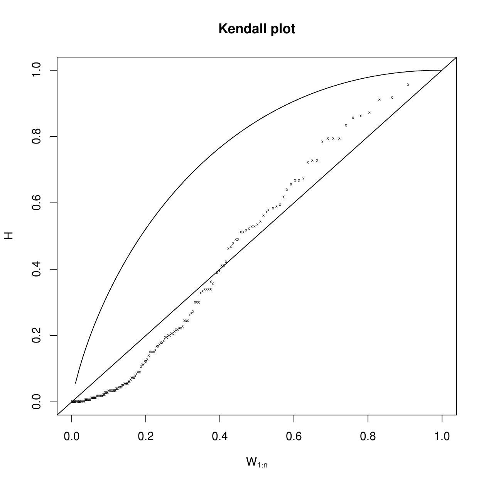

::: article
# Introduction

In this article, we present the
[*testforDEP*](https://CRAN.R-project.org/package=testforDEP) R package,
a package for testing dependence between variables. Since in
nonparametric settings there are no most powerful tests for
independence, it is important to implement various reasonable
independence tests tuned for different classes of alternatives. This
package addresses a need for implementing *both* classical and novel
tests of independence in a single easy to use function. The function
`cor.test` offered in the base R package gives classical tests for
association/correlation between two samples, using the Pearson product
moment correlation coefficient [@Pearson1920], Kendall $\tau$ rank
correlation coefficient [@Kendall1938] and Spearman $\rho$ rank
correlation coefficient [@Spearman1904]. The function `cor.test` is
helpful to test for independence between two samples when the samples
are linearly dependent or monotonically associated. However the function
`cor.test` is less powerful to detect general structures of dependence
between two random variables, including non-linear and/or random-effect
dependence structures. Many modern statistical methodologies have been
proposed to detect these general structures of dependence. These methods
include an empirical likelihood based test [@einmahl2003empirical], a
density-based empirical likelihood ratio test for independence
[@vexler2014simple], data-driven rank test for independence
[@KallenbergandLedwina1999], maximal information coefficient
[@DavidandYakir2011] and a continuous analysis of variance test
[@wang2015efficient]. These methods are useful to detect complex
structures of dependence and until now there were no R packages
available to implement these modern tests.

We propose the new package *testforDEP*, combining both classical and
modern tests. The package *testforDEP* also provides dependence
visualization tools such as the Kendall plot with the area under Kendall
plot [@vexler2015dependence] which previously has not been available in
R packages. Moreover, we develop an exact test based on the maximal
information coefficient to detect dependence between two random variable
and we perform a power analysis for these different tests. The
*testforDEP* package is available from the Comprehensive R Archive
Network and also available for download at the author's department
webpage.

We will focus on tests of bivariate independence of two random variables
$X$ and $Y$ where we have $n$ sample measurements or observations
$(X_1,X_2,\dots,X_n)$ and $(Y_1,Y_2,\dots,Y_n)$, respectively. If $X$
and $Y$ have cumulative distribution functions $F_X(x)$ and $F_Y(y)$ and
probability density functions $f_X(x)$ and $f_Y(y)$ we say $X$ and $Y$
are independent if and only if the combined random variable $(X,Y)$ has
a joint cumulative distribution function $F(x,y) = F_X(x)F_Y(y)$ or
equivalently, if the joint density exists, $f(x,y) = f_X(x)f_Y(y)$ for
all $x,y \in \mathbb{R}$. We are interested in testing the null
hypothesis:
$$\label{eq:mainhyp}
H_0:X  \text{ and }  Y  \text{ are independent},   (\#eq:mainhyp)$$
which is equivalent to
$$\label{eq:mainhyp2}
H_0: F(x,y) = F_X(x)F_Y(y) \text{ for all } x, y \in \mathbb{R}.   (\#eq:mainhyp2)$$
We note there are no most powerful testing strategies in this setting.
Thus a strategy for choosing a test depends on the type of correlation
that a user is trying to detect. The following sections detail the
different tests for independence, outline the components of the
*testforDEP* package and provides real data examples demonstrating the
power of the modern methods to detect nonlinear dependence. Finally, we
conclude with a brief summary and future directions.

# Classical tests of independence {#sec:tests}

In the following subsections we outline the classical tests of
independence.

## Pearson product moment correlation coefficient

The Pearson product-moment correlation coefficient $\gamma$ is a
well-known measure of linear correlation (or dependence) between two
random variables with a full presentation in [@Pearson1920] and
[@HaukeandKossowksi2011]. Using the standard Pearson estimator (denoted
$\hat{\gamma}$) we have that $T_{\hat{\gamma}}$ asymptotically follows a
$t$ distribution with $n-2$ degrees of freedom under independence.
Accordingly, a size $\alpha$ rejection rule is:
$$\label{eq:pearsont}
|T_{\hat{\gamma}}|>t_{1-\alpha/2},   (\#eq:pearsont)$$
where $t_{1-\alpha/2}$ is the $1-\alpha/2$ quantile for the $t$
distribution with $n-2$ degree of freedom. Advantages of the Pearson
test are that it is simple to execute, has high power to detect linear
dependency and also when the underlying data are normally distributed it
takes the form of a maximum likelihood estimator. A weakness of the
Pearson test is that it has very weak power to detect dependency that is
not characterized by first moments and is often not powerful in many
nonparametric settings. For example, if $X_i$ is a normally distributed
random variable and $Y_i=1/X_i$ then the Pearson test will have very
lower power to detect this structure (see, [@techreport]).

## Kendall rank correlation coefficient

The Kendall rank correlation coefficient $\tau$ is a well-known method
proposed in [@Kendall1938] as a nonparametric measure of monotonic
association between two variables. Using the standard estimator
$\hat{\tau}$, the test statistic $Z_{\tau}$ is given by:
$$Z_{\tau}=\frac{3\tau\sqrt{n(n-1)}}{\sqrt{2(2n+5)}},$$
where $Z_{\tau}$ approximately follows a standard normal distribution
under independence. A level $\alpha$ rejection rule for the null
hypothesis is as follows:
$$\label{eq:kendallt}
|Z_{\tau}|>z_{1-\alpha/2},   (\#eq:kendallt)$$
where $z_{1-\alpha/2}$ is $1-\alpha/2$ quantile for a standard normal
distribution. A weakness of the Kendall rank correlation coefficient
test is that it has low power to detect non-monotonic dependency
structures.

## Spearman rank correlation coefficient

Spearman's rank correlation coefficient $\rho$ proposed by
[@Spearman1904] is a nonparametric measure of statistical dependence
between two variables. Spearman's rank correlation measures the
monotonic association between two variables
[@Spearman1904; @HaukeandKossowksi2011]. The statistic $\rho$ is defined
as:
$$\label{eq:spearman}
\rho=1-\frac{6\sum_{i=1}^{n}{d_i}^2}{n(n^2-1)}, \quad d_i=R_i-S_i,   (\#eq:spearman)$$
where $R_i$, $S_i$ are the ranks of $X_i$ and $Y_i$, respectively. Note
$\rho = 0$ suggests $X$ and $Y$ are independent. To conduct a test for
statistical independence under the null hypothesis, we use the test
statistic $T_{\rho}$ defined as:
$$\label{eq:srcc}
T_{\rho}=\rho\sqrt{\frac{n-2}{1-{\rho}^2}},   (\#eq:srcc)$$
which is distributed approximately as a Student's $t$  distribution with
$n-2$ degrees of freedom under the null hypothesis. Accordingly, a level
$\alpha$ rejection rule is:
$$\label{eq:spearmant}
|T_{\rho}|>t_{1-\alpha/2}.   (\#eq:spearmant)$$

Similar to the Kendall rank correlation coefficient, a weakness of the
Spearman rank correlation coefficient test is that it has low power to
detect non-monotonic dependency structures.

## Hoeffding's test for independence

Hoeffding's test for dependence is proposed in [@hoeffding1948non] as a
test for two random variables with continuous distribution functions.
Hoeffding's $D$ is a nonparametric measure of the distance between the
joint distribution, $F(x,y)$ and the product of marginal distributions,
$F_X(x)F_Y(y)$ [@harrell2006hmisc]. The coefficient $D$ is defined as:
$$\label{D}
D(x, y) = F(x,y) - F_X(x)F_Y(y).   (\#eq:D)$$
We can also define $\Delta$ as:
$$\label{delta}
\Delta = \Delta(F) = \int D^2(x,y)dF(x,y),   (\#eq:delta)$$
where $F$ is the joint distribution of $X$ and $Y$ and the integral is
over $\mathbb{R^{\text{2}}}$.

We denote $\Omega^{\prime}$ as the class of $X$, $Y$'s such that their
joint density function $F(x,y)$ is continuous. Denote
$\Omega^{\prime\prime}$ as the class of $X$, $Y$'s such that their joint
and marginal probability density functions are continuous. It has been
shown that if $F(x,y)$ belongs to $\Omega^{\prime\prime}$,
$\Delta(F) = 0 \iff D(x,y) = 0$. The random variables $X$ and $Y$ are
independent if and only if $D(x,y) = 0$.

It can be shown that $D$ ranges between $-\frac{1}{60}$ and
$\frac{1}{30}$ where larger values of $D$ suggest dependence. An
estimator of $D$, $\hat{D}$ is defined as:
$$\label{Dest}
\hat{D}(x, y) = \hat{F}(x,y) - \hat{F}_X(x)\hat{F}_Y(y).   (\#eq:Dest)$$
We use $\hat{D}$ as the test statistic and note that it only depends on
the rank order of observations [@hoeffding1948non]. For computing the
test statistic $\hat{D}$, we use the R package
[*Hmisc*](https://CRAN.R-project.org/package=Hmisc)
[@harrell2006hmisc2]. Note the returned test statistic $\hat{D}'$ is 30
times the original $\hat{D}$ in [@hoeffding1948non]. A size $\alpha$
test can be given by:
$$\hat{D}^{\prime} > C_{\alpha},$$
where $C_{\alpha}$ is a size $\alpha$ critical value.

Due to the limiting computing tools available for the original
publication in 1948, the author only provided cutoff tables for small
sample sizes. With advanced computing power, we compute the $C_{\alpha}$
cutoffs for $n = 10, 20, 50 , 100, 200, 500$ in Table
[1](#table:hoeffd).

::: {#table:hoeffd}
  --------------- --------- --------- --------- --------- --------- ---------
  $\alpha=0.01$      0.2976    0.1145    0.0377    0.0191    0.0086    0.0037

  $\alpha=0.05$      0.1548    0.0589    0.0209    0.0098    0.0045    0.0020

  $\alpha=0.1$       0.0952    0.0378    0.0131    0.0061    0.0028    0.0013

  $\alpha=0.2$       0.0437    0.0184    0.0060    0.0028    0.0011    0.0006

  $\alpha=0.8$      -0.0635   -0.0232   -0.0078   -0.0037   -0.0018   -0.0007

  $\alpha=0.9$      -0.0794   -0.0294   -0.0097   -0.0045   -0.0021   -0.0008
  --------------- --------- --------- --------- --------- --------- ---------

  : Table 1: Hoeffding cutoff values for $\hat{D}^{\prime}$ based on
  5000 Monte Carlo simulations.
:::

We note this test is not as powerful as Pearson's test when the
dependency is linear.

# Modern tests of independence

In the following subsections we outline the modern tests of
independence.

## Density-based empirical likelihood ratio test for independence

A density-based empirical likelihood ratio test is proposed in
[@vexler2014simple] as a nonparametric test of dependence for two
variables. Following [@vexler2014simple], to test the null hypothesis we
use the test statistic $VT_n$ defined as:
$$\label{eq:VT}
VT_n=\max_{0.5n^{\beta_2}\leq m \leq \gamma_n}\max_{0.5n^{\beta_2}\leq r \leq \gamma_n}\prod_{i=1}^{n}\frac{n\widetilde{\Delta_i}(m,r)}{2m} \,,   (\#eq:VT)$$
where $\gamma_n=\min(n^{0.9},n/2), 0.75 <\beta_2<0.9$ and
$\widetilde{\Delta_i}(m,r)$ is defined as,
$$$\widetilde{\Delta_i}(m,r)\equiv \frac{\hat{F}(X_{(s_i+r)},Y_{(i+m)})-\hat{F}(X_{(s_i-r)},Y_{(i+m)})-\hat{F}(X_{(s_i+r)},Y_{(i-m)})+\hat{F}(X_{(s_i-r)},Y_{(i-m)})+n^{-\beta_1}}{\hat{F_{X}}(X_{(s_i+r)})-\hat{F_{X}}(X_{(s_i-r)})}$,$$
where $\hat{F}$ is the empirical joint distribution of $X$, $Y$ and
$Y_{(1)}\leq Y_{(2)}, \dots, \leq Y_{(n)}$ are the order statistics of
$Y_1,Y_2,\dots Y_n$ and $X_{t(i)}$ is the concomitant of the $i$th order
statistic defined in [@DavidandNagaraja1970]. $\hat{F}_{X}$ is the
empirical marginal distribution of $X$, $s_i$ is the integer number such
that $X_{(s)} = X_{t(i)}$, $\beta_1 \in (0,0.5)$.

The statistic $VT_n$ reaches its maximum with respect to
$m\geq 0.5n^{\beta_2}$ and $r\geq 0.5n^{\beta_2}$ at
$m = 0.5n^{\beta_2}$ and $r = 0.5n^{\beta_2}$ [@vexler2014simple]. Thus,
we simplify \@ref(eq:VT) to
$$\label{eq:VEXLER}
VT_n=\prod_{i=1}^{n}n^{1-\beta_2}\widetilde{\Delta_i}\left([0.5n^{\beta_2}],[0.5n^{\beta_2}]\right),   (\#eq:VEXLER)$$
where the function $[x]$ denotes the nearest integer to $x$.
Accordingly, a size $\alpha$ rejection rule of the test is given by:
$$\label{eq:VEXLERt}
\log(VT_n)>C_\alpha,   (\#eq:VEXLERt)$$
where $C_\alpha$ is an $\alpha$-level test threshold. It is established
in [@vexler2014simple] that $VT_n$ is distribution free under
\@ref(eq:mainhyp) and the critical values $C_\alpha$ are estimated by
50,000 Monte Carlo simulations from $X_1,\dots,X_n \sim Uniform[0,1]$
and $Y_1,\dots,Y_n\sim Uniform[0,1]$.

This test is very powerful for many nonparametric alternatives as it is
designed to approximate corresponding nonparametric likelihood ratios,
however, when the dependency is linear with normal data other methods
such as Pearson and Spearman tests will outperform this method.

## Kallenberg data-driven test for independence

@KallenbergandLedwina1999 propose two data-driven rank tests for
independence, $TS2$ and $V$. The $TS2$ statistic uses the intermediate
statistic $T_k$ defined as:
$$T_k=\sum_{j=1}^{k}\Bigg\{\frac{1}{\sqrt{n}}\sum_{i=1}^{n}b_j\left(\frac{R_i-\frac{1}{2}}{n}\right)b_j\left(\frac{S_i-\frac{1}{2}}{n}\right)\Bigg\}^2,$$
where $b_j$ denotes the $j$th orthonormal Legendre polynomial. The
selection of the order $k$ in $T_k$ is done by the modified Schwarz's
rule, given by
$$S2=\min\{1\leq k \leq d(n), T_k-k\log{n}\geq T_j-j\log{n},\,j=1,\ldots,d(n)\},$$
where $d(n)$ is a sequence of numbers tending to infinity as $n$
$\rightarrow\infty$. The test statistic is,
$$\label{eq:TS2}
TS2=\sum_{j=1}^{S2}\Bigg\{\frac{1}{\sqrt{n}}\sum_{i=1}^{n}b_j\left(\frac{R_i-\frac{1}{2}}{n}\right)b_j\left(\frac{S_i-\frac{1}{2}}{n}\right)\Bigg\}^2.   (\#eq:TS2)$$
It is reported in [-@KallenbergandLedwina1999] that there is almost no
change in the critical value of $TS2$ for $d(n) > 2$. By default, we
choose $d(n)=4$. The decision rule to reject the null hypothesis in
\@ref(eq:mainhyp2) is
$$\label{eq:kallenberg1t}
TS2 > C_\alpha,   (\#eq:kallenberg1t)$$
where $C_\alpha$ is an $\alpha$-level test threshold.

In [@KallenbergandLedwina1999] the $TS2$ test statistic in \@ref(eq:TS2)
is called the diagonal  test statistic and the other test statistic, $V$
is called the mixed  statistic due to the fact that it involves mixed 
products. To derive the $V$ statistic, we only consider the case
$d(n)=2$ and have sets of indexes $\{(1,1)\},\,\{(1,1),(i,j)\}$, where
$(i,j)\neq(1,1)$. Let $\Lambda$ be one of these sets and define
$$T_\Lambda=\sum_{(r,s)\in\Lambda}^{}V(r,s),$$
where
$$V(r,s)=\Bigg\{\frac{1}{\sqrt{n}}\sum_{i=1}^{n}b_r\left(\frac{R_i-\frac{1}{2}}{n}\right)b_s\left(\frac{S_i-\frac{1}{2}}{n}\right)\Bigg\}^2.$$
Letting $|\Lambda|$ denote the cardinality of $\Lambda$, we now search
for a model, say $\Lambda^{(max)}$, for which
$T_\Lambda-|\Lambda|\,\log{n}$ is maximized. Having obtained
$\Lambda^{(max)}$, the second test statistic of \@ref(eq:mainhyp2) is
$$V=T_{\Lambda^{(max)}}.$$
It can be easily seen that the test statistic $V$ can be rewritten (for
$d(n)=2$) in the simple form,
$$V=\left\{
\begin{array}{ll}
V(1,1) & \quad ,\text{if}\max\Big\{V(1,2),V(2,1),V(2,2)\Big\}<\log{n}\\
V(1,1)+\max\Big\{V(1,2),V(2,1),V(2,2)\Big\} & \quad ,\text{otherwise}.
\end{array}
\right.$$
A size $\alpha$ rejection rule for the test is given by
$$\label{kallenberg2t}
V > C_\alpha,   (\#eq:kallenberg2t)$$
where $C_{\alpha}$ is a size $\alpha$ critical value.

This test is very powerful when data are from an exponential family,
however the statistic is rather complicated and a required assumption is
that the data distributions belong to semiparametrically defined
families.

## Maximal information coefficient

The maximal information coefficient (MIC) proposed in
[@DavidandYakir2011] is a measure of strength of the linear and
non-linear association between two variables $X$ and $Y$. The maximal
information coefficient uses binning as a means to apply mutual
information on continuous random variables. Defining $\mathcal{D}$ as a
finite set of ordered pairs, we can partition the $x$-values of
$\mathcal{D}$ into $x$ bins and the $y$-values of $\mathcal{D}$ into $y$
bins, allowing empty bins. We call such a partition an $x$-by-$y$ grid,
denoted $G$. For a fixed $\mathcal{D}$, different grids $G$ result in
different distributions $\mathcal{D}|G$. The MIC of a set $\mathcal{D}$
of two-variable data with sample size $n$ and grid size less than $B(n)$
is defined as:
$$\label{eq:mic}
MIC(\mathcal{D})=\max\limits_{xy<B(n)}\{M(\mathcal{D})_{x,y}\},   (\#eq:mic)$$
where $x$ and $y$ are observed values of variables $X$ and $Y$,
$\omega_{(1)}<B(n)\leq o(n^{1-\varepsilon})\:\text{for some}\,0<\varepsilon <1$.
Note $M(\mathcal{D})_{x,y}$ is called the characteristic matrix of a set
$\mathcal{D}$ of two-variable data $x,y$ and defined as:
$$M(\mathcal{D})_{x,y}=\frac{I^{*}(\mathcal{D},x,y)}{\log\min\{x,y\}},$$
where $I^{*}(\mathcal{D},x,y)$ is defined as:
$$I^{*}(\mathcal{D},x,y)=\max{I(\mathcal{D}|G)},$$
for a finite set $\mathcal{D}\subset \mathbb{R^{\text{2}}}$ and positive
integers $x, y$. We define the mutual information of two discrete random
variables $X$ and $Y$ as:
$$I(\mathcal{D}|G)=\sum_{\substack{y\in Y}}\sum_{\substack{x\in X}}\hat{F}(x,y)\,\log\left(\frac{\hat{F}(x,y)}{\hat{F}_X(x)\hat{F}_Y(y)}\right),$$
The MIC statistic in \@ref(eq:mic) is computed using the R package
[*minerva*](https://CRAN.R-project.org/package=minerva) (see
[@Rminerva2]). To our knowledge there is no hypothesis tests published
to detect general structures of dependence based on MIC. We use an
approach similar to the one in [@simon2014comment] to develop an exact
test based on the MIC statistic. A size $\alpha$ MIC test can be given
by,
$$\label{eq:mict}
MIC(\mathcal{D}) > C_{\alpha}   (\#eq:mict)$$
where $C_{\alpha}$ is a size $\alpha$ critical value. To evaluate our
approach, we simulated 5000 Monte Carlo sets of independent random
variables $X$ and $Y$ of size $n$ from the standard normal distribution,
exponential distribution and reverse of the standard normal
distribution. The cutoff results are shown in Table [2](#table:a).
Regardless of the data distribution, the cutoff values for a given
sample size are very similar.

It has been noted in [@simon2014comment] that the MIC approach has
serious power deficiencies and when used for large-scale exploratory
analysis will result in too many false positives.

::: {#table:a}
  -----------------------------------------------------------------------------------
                       $n=10$           $n=35$           $n=75$          $n=100$
  --------------- ---------------- ---------------- ---------------- ----------------
                     N | E | RN       N | E | RN       N | E | RN       N | E | RN

  $\alpha=0.01$    0.61|0.61|0.61   0.50|0.52|0.50   0.38|0.37|0.38   0.33|0.33|0.33

  $\alpha=0.05$    0.61|0.61|0.61   0.43|0.43|0.43   0.33|0.33|0.33   0.30|0.30|0.30

  $\alpha=0.1$     0.61|0.61|0.61   0.41|0.40|0.41   0.31|0.31|0.31   0.28|0.28|0.28

  $\alpha=0.5$     0.24|0.24|0.24   0.31|0.30|0.31   0.25|0.25|0.25   0.23|0.24|0.23

  $\alpha=0.75$    0.24|0.24|0.24   0.27|0.26|0.27   0.23|0.23|0.23   0.21|0.21|0.21

  $\alpha=0.9$     0.12|0.12|0.12   0.24|0.23|0.24   0.21|0.21|0.21   0.20|0.20|0.20

  $\alpha=0.95$    0.12|0.12|0.12   0.23|0.22|0.23   0.20|0.20|0.20   0.19|0.19|0.19

  $\alpha=0.99$    0.11|0.11|0.11   0.20|0.20|0.20   0.18|0.18|0.18   0.17|0.17|0.17
  -----------------------------------------------------------------------------------

  : Table 2: Cutoff values from 5000 Monte Carlo simulations for a
  normal distribution (N), exponential distribution (E) and reverse
  normal distribution (RN).
:::

## Empirical likelihood based test for independence

An empirical likelihood based test is proposed by
[@einmahl2003empirical]. The approach is via localizing the empirical
likelihood with one or more time  variables implicit in the given null
hypothesis and then constructing an omnibus test statistic by
integrating the log-likelihood ratio over those variables. We first
consider a null hypothesis,
$$H_0: F_X = F_0,$$
where $F_0$ is a fully specified distribution function. We define the
localized empirical likelihood ratio $R(x)$ as:
$$R(x) = \frac{sup\{L(\tilde{F_X}): \tilde{F}_X(x) = F_0(x)\}}{sup\{L(\tilde{F}_X)\}},$$
where $\tilde{F}$ is an arbitrary distribution function,
$L(\tilde{F}_X) = \prod_{i=1}^{n}(\tilde{F}_X(X_i) - \tilde{F}_X(X_i-)).$
The supremum in the denominator is achieved when $\tilde{F} = \hat{F}$,
the empirical distribution function. The supremum in the numerator is
attained by putting mass $F_0/ (n\hat{F}(x))$ on each observation up to
and including $x$ and mass $(1-F_0(x))/(n(1-\hat{F}(x)))$ on each
observation beyond $x$ [@einmahl2003empirical]. This gives the log
localized empirical likelihood ratio:
$$\log R(x) = nF(x)\log \frac{F_0(x)}{\hat{F}(x)} + n(1-\hat{F}(x))\log \frac{1-F_0(x)}{1-\hat{F}(x)}.$$
Note that $0\log(a/0)$ is defined as 0. For an independence test, the
local likelihood ratio test statistic is:
$$R(x,y) = \frac{sup\{L(\tilde{F}): \tilde{F}(x,y) = \tilde{F}_X(x) \tilde{F}_Y(y)\}}{sup\{L(\tilde{F})\}},$$
for $(x,y) \in \mathbb{R^{\text{2}}}$, with
$L(\tilde{F}) = \prod_{i=1}^{n} \tilde{P}(\{X_i\})$, where $\tilde{P}$
is the probability measure corresponding to $\tilde{F}$. The log local
likelihood ratio test statistic is then:
$$\begin{aligned}
 \log R(x,y) =
 & n\hat{P}(A_{11})\log \frac{\hat{F}_{X}(x) \hat{F}_{Y}(y)}{\hat{P}(A_{11})}  \\
 & + n\hat{P}(A_{12})\log \frac{\hat{F}_{X}(x) (1-\hat{F}_{Y}(y))}{\hat{P}(A_{12})} \\
 & + n\hat{P}(A_{21})\log \frac{(1-\hat{F}_{X}(x)) \hat{F}_{Y}(y)}{\hat{P}(A_{21})}\\
 & + n\hat{P}(A_{22})\log \frac{(1-\hat{F}_{X}(x)) (1-\hat{F}_{Y}(y))}{\hat{P}(A_{22})},
 \end{aligned}$$
where $\hat{P}$ is the empirical measure of joint probability and
$$\begin{aligned}
 &A_{11} = (-\infty, x] \times (-\infty, y],\\
 &A_{12} = (-\infty, x] \times (y, \infty),\\
 &A_{21} = (x, \infty) \times (-\infty, y],\\
 &A_{22} = (x, \infty) \times (y, \infty).
 \end{aligned}$$
The test statistic $T_{el}$ is defined as:
$$T_{el} = -2\int_{-\infty}^{\infty} \int_{-\infty}^{\infty} \log R(x,y)d\hat{F}_{X}(x)\hat{F}_{Y}(y),$$
where $T_{el}$ is distribution-free. We reject $H_0$ when
$$T_{el} > C_\alpha,$$
where $C_{\alpha}$ is a size $\alpha$ critical value.

This test is characterized by moments and is very powerful for many
nonparametric alternatives. However, when the dependency is linear with
normally distributed data, this test is outperformed by Pearson and
Spearman tests.

## Kendall plot and area under Kendall plot

The Kendall plot, also called K-plot, is a visualization of dependence
in a bivariate random sample. It is proposed in [@genest2012detecting].
Similar to a Chi-plot which detects association in random samples from
continuous bivariate distributions, the K-plot adapts the concept of a
probability plot to detect dependence.

The horizontal axis in a K-plot, $W_{i:n}$ is the expectation of the
$i$th order statistic in a random sample of size $n$ from the
distribution $K_0$ of the $H_i$ (defined below) under the null
hypothesis of independence. [@genest2012detecting]. $W_{i:n}$ can be
computed as:
$$W_{i:n} = n \binom {n-1}{i-1} \int_{0}^{1}w \{K_0(w)\}^{i-1} \times \{1-K_0(w)\}^{n-i} dK_0(w),$$
for all $1 \leq i \leq n$. Note $K_0$ is given as:
$$K_0(w) = w - w\log(w), 0 \leq w \leq 1.$$
The vertical axis is the sorted $H_i$. Unlike $W_{i:n}$, $H_i$ is
computed based on information provided by the data.

Note $H_i$ is defined as:
$$H_i= \frac{1}{n-1} \sum_{i=1}^{n} Ind(X \leq X_i, Y \leq Y_i),$$
where $Ind$ is indicator function.

Let $0 \leq p \leq 1$ then some properties of the K-plot are:

1.  when $Y$ = $X$, all points fall on curve $K^{-1}(p)$,

2.  when $Y$ = $-X$, all points fall on a horizontal line,

3.  when $X$ and $Y$ are independent, the graph is linear.

The area under the Kendall plot (AUK) is proposed in
[@vexler2015dependence] as an index to independence. It applies
area-under-curve analysis and computes the area under the Kendall plot.
Some properties are listed below:

1.  when $Y$ = $X$, $AUK = 0.75$,

2.  when $Y$ = $-X$, $AUK = 0$,

3.  when $X$ and $Y$ are independent, $AUK = 0$.

Note $AUK = 0$ does not imply independence. The AUK is similar to
computing the area under the curve (AUC) for a receiver operating curve
(ROC). In an ROC curve the true positive rate (sensitivity) is plotted
as a function of the false positive rate for different cut-off points. A
large AUC (near 1) suggests a good prediction model whereas a small AUC
(near 0.5) suggests a model that is no better than chance. Similarly, a
large AUK suggests dependence while an AUK near 0 may be suggestive of
independence and should be further examined using one of the proposed
tests. Further, more complicated correlation patterns such as a mixture
of positive and negative correlations as in Example 2 (see Data analysis
examples) can be detected with the K-plot.

# What is the package testforDEP? {#sec:what}

The R Package `testforDEP` includes two functions, `testforDEP()`,
`AUK()` and one data frame, `LSAT`.

## testforDEP

The function `testforDEP()` is the interface for the tests. The function
`testforDEP()` takes two vectors $X$, $Y$ as inputs and returns an S4
object containing the

1.  test statistic,

2.  $p$-value,

3.  bootstrap confidence intervals.

The interface of `testforDEP()` is:

``` r
testforDEP(x, y, data, test = c("PEARSON", "KENDALL", "SPEARMAN",
	 "VEXLER", "TS2", "V", "MIC", "HOEFFD", "EL"),
	 p.opt = c("dist", "MC", "table"), num.MC = 10000,
	 BS.CI = 0, rm.na = FALSE, set.seed = FALSE)
```

where `x` and `y` are two equal-length numeric vectors of input data.
The parameter `data` is an alternative input that takes a data frame
with two columns representing $X$ and $Y$. When `x` or `y` are not
provided, parameter `data` is taken as input. The parameter `test`
specifies the hypothesis test to implement. A summary of the test
options with the associated statistic returned is given below,

-   `PEARSON`, $T_{\hat{\gamma}}$,

-   `KENDALL`, $Z_{\tau}$,

-   `SPEARMAN`, $T_{\rho}$,

-   `VEXLER`, $\log(VT_n)$,

-   `TS2`, $TS2$,

-   `V`, $V$,

-   `MIC`, $MIC(\mathcal{D})$,

-   `HOEFFD`, $\hat{D}$,

-   `EL`, $T_{el}$.

Parameter `p.opt` is the option for computing $p$-values in which
$p$-values can be computed by the asymptotic null distribution of the
test statistic (applicable for Pearson, Kendall and Spearman only), by
an exact method (applicable for all tests) or by pre stored simulated
tables based on an exact method. By default, `p.opt = "MC"`. The
parameter `num.MC` gives the Monte Carlo simulation number and will only
be used when `p.opt = "MC"`. When `p.opt = "dist"` or `p.opt = "table"`,
`num.MC` will be ignored. To balance accuracy and computation time,
`num.MC` must $\in [100, 10000]$, with `num.MC = 10000` as default. The
parameter `BS.CI` specifies a $1-\alpha$ bootstrap confidence intervals.
When `BS.CI = 0`, the confidence intervals will not be computed.
Parameter `rm.na` is a flag for removing rows with missing data.
Parameter `set.seed` is a flag for setting the random number generator
seed.

## AUK

The function `AUK()` provides an interface for Kendall plots and AUK. It
takes two vectors $X$, $Y$ and returns a list containing:

1.  AUK,

2.  $W_{i:n}$,

3.  sorted $H_i$,

4.  bootstrap confidence intervals.

The interface of `AUK()` is:

``` r
AUK(x, y, plot = FALSE, main = "Kendall plot", Auxiliary.line = TRUE,
	BS.CI = 0, set.seed = FALSE)
```

where `x` and `y` are two equal-length numeric vectors of input data.
Parameter `plot` is a flag for drawing the Kendall plot. Parameter
`main` determines the title of the plot. If `plot = FALSE`, `main` will
be ignored. Parameter `Auxiliary.line` is a flag for auxiliary line.
Parameter `BS.CI` specifies a $1-\alpha$ bootstrap confidence intervals.
The bootstrap confidence intervals were produced using a non-parametric
bootstrap procedure with a normal, pivotal and percentile based
confidence interval obtained as described in [@wasserman2013all]. The
bootstrap confidence intervals are on the scale of the test statistics
that are returned from each test in *testforDEP*. When `BS.CI = 0`,
confidence intervals will not be computed. Parameter `set.seed` is a
flag for setting seed.

# Data analysis examples {#sec:example}

Here we present two data analysis examples to demonstrate the utility of
the *testforDEP* package. In the first example, the data are average law
school admission test (LSAT) and grade point average (GPA) from 82 law
schools (details described in [@EfronTibshirani1994]). The data frame
LSAT  is available in *testforDEP* package. The aim is to determine the
dependence between LSAT and GPA. Table [3](#table:d) gives the data and
a scatter plot is shown in Figure 1 (Top Left).

::: {#table:d}
  --------------------------------------------------------------------
   School   LSAT   GPA    School   LSAT   GPA    School   LSAT   GPA
  -------- ------ ------ -------- ------ ------ -------- ------ ------
     1      622    3.23     28     632    3.29     56     641    3.28

     2      542    2.83     29     587    3.16     57     512    3.01

     3      579    3.24     30     581    3.17     58     631    3.21

     4      653    3.12     31     605    3.13     59     597    3.32

     5      606    3.09     32     704    3.36     60     621    3.24

     6      576    3.39     33     477    2.57     61     617    3.03

     7      620    3.10     34     591    3.02     62     637    3.33

     8      615    3.40     35     578    3.03     63     572    3.08

     9      553    2.97     36     572    2.88     64     610    3.13

     10     607    2.91     37     615    3.37     65     562    3.01

     11     558    3.11     38     606    3.20     66     635    3.30

     12     596    3.24     39     603    3.23     67     614    3.15

     13     635    3.30     40     535    2.98     68     546    2.82

     14     581    3.22     41     595    3.11     69     598    3.20

     15     661    3.43     42     575    2.92     70     666    3.44

     16     547    2.91     43     573    2.85     71     570    3.01

     17     599    3.23     44     644    3.38     72     570    2.92

     18     646    3.47     45     545    2.76     73     605    3.45

     19     622    3.15     46     645    3.27     74     565    3.15

     20     611    3.33     47     651    3.36     75     686    3.50

     21     546    2.99     48     562    3.19     76     608    3.16

     22     614    3.19     49     609    3.17     77     595    3.19

     23     628    3.03     50     555    3.00     78     590    3.15

     24     575c   3.01     51     586    3.11     79     558    2.81

     25     662    3.39     52     580    3.07     80     611    3.16

     26     627    3.41     53     594    2.96     81     564    3.02

     27     608    3.04     54     594    3.05     82     575    2.74

                            55     560    2.93                  
  --------------------------------------------------------------------

  : Table 3: LSAT data from [@EfronTibshirani1994].
:::

Figure 1 (Top Left) suggests a linear positive relationship between LSAT
and GPA. To confirm this, we draw the Kendall plot and compute AUK (see
Figure 1 (Top Right)). Figure 1 (Top Right) shows a curve above the
diagonal and AUK of 0.665, both of which suggest a positive dependence.

Now consider the dependence tests provided in package *testforDEP*.
Table [4](#Table:Example) shows the test statistics and p-values. All
tests, classical and modern, suggest dependence between LSAT and GPA.
From this analysis, it is clear that LSAT and GPA variables are
dependent.

To further examine this data and explore the comparable power of the
modern methods, we also examine a subset of 15 randomly chosen points
from the full dataset as shown in Figure 1 (Bottom Left). An analysis of
this subset reveals significant $p$-values for the empirical likelihood,
density based empirical likelihood and Kallenberg tests (see Table
[4](#Table:Example)). The small $p$-values, especially for the
density-based empirical likelihood method, indicate the power of modern
methods to detect non linear dependence in small sample sizes. We
further explore this point in the next example.

::: {#Table:Example}
  -----------------------------------------------------------------
                 Full Data               Subset Data   
  -------------- ----------- ----------- ------------- ------------
  test           statistic   p-value     statistic     p-value

  Pearson        10.46       \< 0.0001   1.77          0.1074

  Kendall        7.46        \< 0.0001   69.00         0.0990

  $\log(VT_n)$   65.70       \< 0.0001   12.05         **0.0067**

  $TS_2$         80.76       \< 0.0001   3.16          0.2003

  $V$            69.04       \< 0.0001   8.51          **0.0146**

  MIC            0.53        \< 0.0001   0.38          0.0993

  Hoeffding      0.22        \< 0.0001   0.08          0.0658

  $T_{el}$       13.64       \< 0.0001   2.15          **0.0238**
  -----------------------------------------------------------------

  : Table 4: Example 1: Test results for the full LSAT/GPA data and for
  a randomly chosen subset of 15 data points.
:::

::: {#Table:Example2}
  --------------------------------------
  test           statistic   p-value
  -------------- ----------- -----------
  Pearson        -1.015      0.3156

  Kendall        -2.321      0.0196

  Spearman       -2.900      0.0050

  $\log(VT_n)$   140.554     \< 0.0001

  $TS_2$         13.347      0.0042

  $V$            82.712      \< 0.0001

  MIC            0.666       \< 0.0001

  Hoeffding      0.085       \< 0.0001

  $T_{el}$       12.254      \< 0.0001
  --------------------------------------

  : Table 5: Example 2: Dependence test results for the microarray study
  with genes Pla2g7 and Pcp2 displayed in Figure 2 and published in
  [@rohrer2004multidestructive] with re-examination in
  [@chen2010nonparametric].
:::

<figure id="texor:dummylabel">
<table>
<caption> </caption>
<tbody>
<tr class="odd">
<td style="text-align: center;"></td>
<td style="text-align: center;"></td>
</tr>
<tr class="even">
<td style="text-align: center;"></td>
<td style="text-align: center;"></td>
</tr>
</tbody>
</table>
<figcaption>Figure 1: Top Left: Scatter plot based on data in Table .
Top Right: Kendall plot of the full dataset. Bottom Left: A scatter plot
of a subset of the LSAT/GPA data. Bottom Right: A Kendall plot of the
subset of data. </figcaption>
</figure>

In the second example, we demonstrate the power of the modern methods to
detect non-linear dependence. This example was originally published in
[@rohrer2004multidestructive] and re-examined in
[@chen2010nonparametric]. It involves analyzing microarray expression
data collected to identify critical genes in photoreceptor degeneration.
The data in Figure 2 are from 2 genes (Pcp2 and Pla2g7) with each point
representing another gene with its x-coordinate being the Euclidean
distance from Pla2g7 and the y-coordinate as the Euclidean distance from
Pcp2. The Euclidean distance is calculated from expression profiles
between wild type (*wt*) and rod degeneration (*rd*) mice. The
correlation shown in Figure 2 measures the relationship between how the
Pla2g7 gene interacts with all the other genes vs. how the Pcp2 gene
interacts with all the other genes. From Figure 2 we see the genes are
negatively correlated when their transformed levels are both less than
5. Otherwise, these genes are positively correlated. We proceed to
analyze the data using the *testforDEP* package. The results are
presented in Table 5. From this analysis, we see a large gain in power
using the modern methods such as
$\log(VT_n), TS_2, V, MIC, Hoeffding, T_{el}$ compared to the
traditional methods (Pearson, Kendall, Spearman). Taken together, these
examples demonstrate the power advantage of using modern methods to
detect nonlinear dependence while still maintaining comparable power to
traditional methods in detecting linear dependence.

<figure id="texor:dummylabel2">
<table>
<caption> </caption>
<tbody>
<tr class="odd">
<td style="text-align: center;"></td>
<td style="text-align: center;"></td>
</tr>
</tbody>
</table>
<figcaption>Figure 2: Left: Scatter plot of the transformed expression
levels of Pla2g7 and Pcp2 genes studied in <span class="citation"
data-cites="chen2010nonparametric">(Chen et al. 2010)</span>. Right:
Kendall plot of the dataset highlighting the negative correlation
(points below <span class="math inline"><em>y</em> = <em>x</em></span>
line) for smaller expression values and positive dependence (points
above <span class="math inline"><em>y</em> = <em>x</em></span> line) for
larger values.</figcaption>
</figure>

# Conclusion {#sec:conclusion}

The R package *testforDEP* is a new package that allows users for the
first time to analyze complex structures of dependence via modern test
statistics and visualization tools. Moreover, a novel exact method based
on the MIC measurement has been proposed in the package *testforDEP*.
Future work is necessary to further develop a formal testing structure
based on the MIC statistic. We note that users of this package should
carefully consider the strengths and weaknesses of the proposed tests as
outlined in each section when deciding what test to apply. Further, a
topic for future work is to develop a complete set of consistent
criteria to determine which test is most appropriate for a specific
setting. We note extensive simulations comparing each of the tests are
provided in [@techreport] which may help guide users to choose among the
tests. Ultimately, we believe that the package *testforDEP* will help
investigators identify dependence using the cadre of modern tests
implemented to detect dependency.

# Acknowledgments

Albert Vexler's efforts were supported by the National Institutes of
Health (NIH) grant 1G13LM012241-01. We are grateful to the Editor,
Associate Editor and the two referees for helpful comments that clearly
improved this manuscript.
:::
