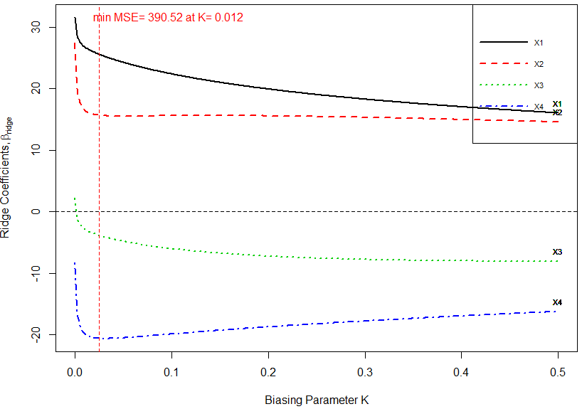
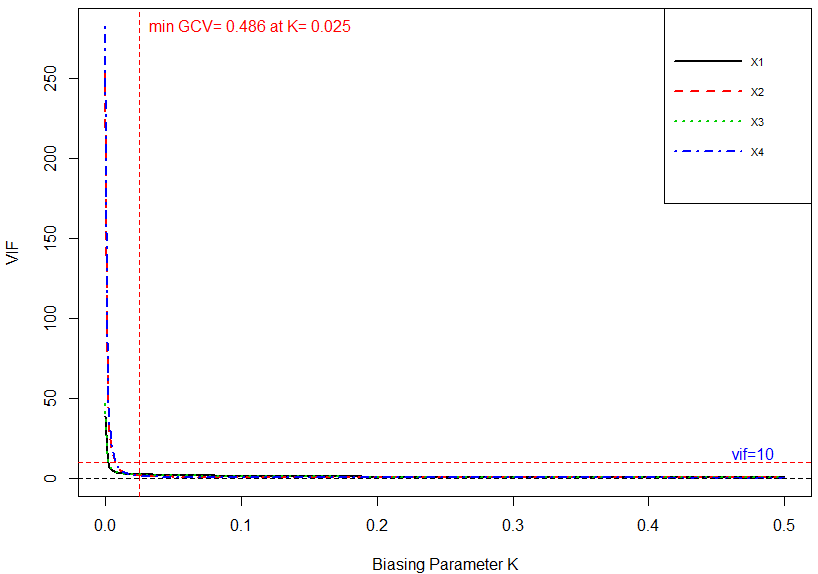
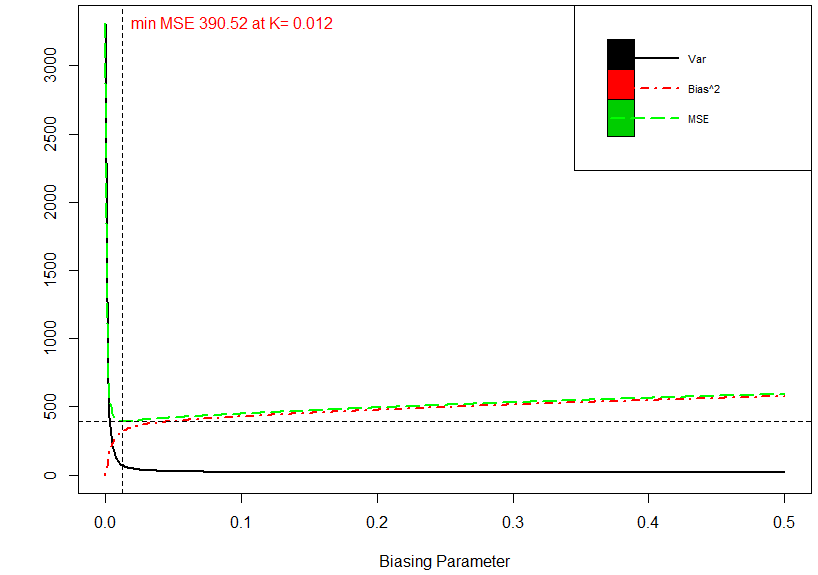
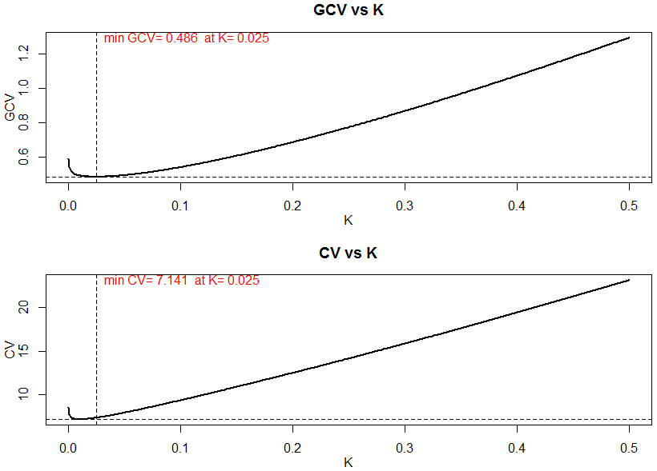
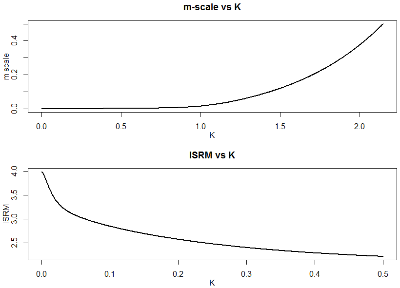
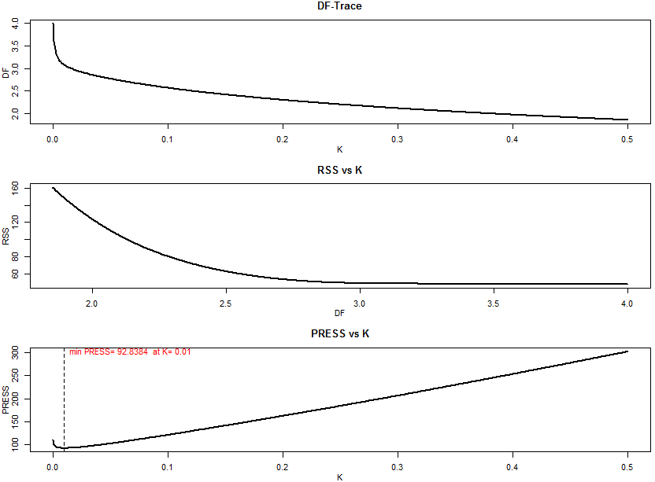

::: article
# Introduction

For data collected either from a designed experiment or from an
observational study, the ordinary least squares (OLS) method does not
provide precise estimates of the effect of any explanatory variable
(regressor) when regressors are interdependent (collinear with each
other). Consider a multiple linear regression (MLR) model,
$$\begin{aligned}
\label{eqols}
y=X\beta + \varepsilon,
\end{aligned}   (\#eq:eqols)$$
where $y$ is an $n \times 1$ vector of observation on dependent
variable, $X$ is known design matrix of order $n \times p$, $\beta$ is a
$p \times 1$ vector of unknown parameters and $\varepsilon$ is an
$n \times 1$ vector of random errors with mean zero and variance
$\sigma^2 I_n$, where $I_n$ is an identity matrix of order $n$.

The OLS estimator (OLSE) of $\beta$ is given by
$$\begin{aligned}
\label{olse}
\hat{\beta}= (X'X)^{-1}X' y,
\end{aligned}   (\#eq:olse)$$
which depends on characteristics of the matrix $X'X$. If $X'X$ is
ill-conditioned (near dependencies among various columns (regressors) of
$X'X$ exist) or $det(X'X)\approx0$, then the OLS estimates are sensitive
to a number of errors, such as non-significant or imprecise regression
coefficients [@Kmenta1980] with wrong sign and non-uniform eigenvalues
spectrum. Moreover, the OLS method, can yield high variances of
estimates, large standard errors, and wide confidence intervals. Quality
and stability of the fitted model may be questionable due to erratic
behaviour of the OLSE in case when regressors are collinear.

Researchers may tempt to eliminate regressor(s) causing the problem by
consciously removing regressors from the model. However, this method may
destroy the usefulness of the model by removing relevant regressor(s)
from the model. To control variance and instability of the OLS
estimates, one may regularize the coefficients, with some regularization
methods such as ridge regression (RR), Liu regression, and Lasso
regression methods etc., as alternative to OLS. Computationally, RR
suppresses the effects of collinearity and reduces the apparent
magnitude of the correlation among regressors in order to obtain more
stable estimates of the coefficients than the OLS estimates and it also
improves accuracy of prediction [see
@HoerlKennard1970; @MontgomeryPeck1982; @Myers1986; @Rawlings1998; @SeberLee2003; @Tripp1983
etc.].

There are only a few software programs and R packages capable of
estimating and/ or testing of ridge coefficients. The design goal of our
[*lmridge*](https://CRAN.R-project.org/package=lmridge)
[@ImdadAslam2018a] is primarily to provide functionality of all possible
ridge related computations. The output of our developed package
(*lmridge*) is consistent with output of existing software/ R packages.
The package, *lmridge* also provides the most complete suite of tools
for ordinary RR, comparable to those listed in Table [1](#softcomp). For
package development and R documentation, we followed [@Hadley2015],
[@Leisch2008] and [@Team2015]. The
[*ridge*](https://CRAN.R-project.org/package=ridge) package by
[@MoritzCule2017] and `lm.ridge()` from the
[*MASS*](https://CRAN.R-project.org/package=MASS) [@lmridge] also
provided guidance in coding.

::: {#softcomp}
  ---------------------------------------------------------------------------------------------------------------------------------------------------------------------------------------------------------------------------------------------------------------------------------------------------------------------------------------------------------------------------------
                                                       NCSS           SAS           Stata       StatGraphics   [*lrmest*](https://CRAN.R-project.org/package=lrmest)   [*ltsbase*](https://CRAN.R-project.org/package=ltsbase)   [*penalized*](https://CRAN.R-project.org/package=penalized)   [*glmnet*](https://CRAN.R-project.org/package=glmnet)     *ridge*       *lmridge*
  ----------------------------------------------- -------------- -------------- -------------- -------------- ------------------------------------------------------- --------------------------------------------------------- ------------------------------------------------------------- ------------------------------------------------------- -------------- --------------
  *Standardization of regressors*                                                                                                                                                                                                                                                                                                                                    

                                                   $\checkmark$   $\checkmark$   $\checkmark$   $\checkmark$                                                                                $\checkmark$                                                $\checkmark$                                               $\checkmark$                        $\checkmark$   $\checkmark$

  *Estimation and testing of ridge coefficient*                                                                                                                                                                                                                                                                                                                      

  Estimation                                       $\checkmark$   $\checkmark$   $\checkmark$   $\checkmark$                       $\checkmark$                                             $\checkmark$                                                $\checkmark$                                               $\checkmark$                        $\checkmark$   $\checkmark$

  Testing                                                                        $\checkmark$                                      $\checkmark$                                                                                                                                                                                                        $\checkmark$   $\checkmark$

  SE of coef                                       $\checkmark$                  $\checkmark$                                      $\checkmark$                                                                                                                                                                                                        $\checkmark$   $\checkmark$

  *Ridge related statistics*                                                                                                                                                                                                                                                                                                                                         

  $R^2$                                            $\checkmark$                  $\checkmark$   $\checkmark$                                                                                                                                                                                                                                                          $\checkmark$

  adj-$R^2$                                                                      $\checkmark$   $\checkmark$                                                                                                                                                                                                                                                          $\checkmark$

  m-scale & ISRM                                                                                                                                                                                                                                                                                                                                                      $\checkmark$

  Variance                                                                                                                                                                                                                                                                                                                                                            $\checkmark$

  Bias${}^2$                                                                                                                                                                                                                                                                                                                                                          $\checkmark$

  MSE                                                                                                                              $\checkmark$                                             $\checkmark$                                                                                                                                                              $\checkmark$

  F-test                                                                         $\checkmark$                                                                                                                                                                                                                                                                         $\checkmark$

  Shrinkage factor                                                                                                                                                                                                                                                                                                                                                    $\checkmark$

  CN                                                                                                                                                                                                                                                                                                                                                                  $\checkmark$

  $\sigma^2$                                                                                                                                                                                                                                                                                                                                                          $\checkmark$

  C${}_k$                                                                                                                                                                                                                                                                                                                                                             $\checkmark$

  DF                                                                                                                                                                                                                                                                                                                                                                  $\checkmark$

  EDF                                                                                                                                                                                                                                                                                                                                                                 $\checkmark$

  Eft                                                                                                                                                                                                                                                                                                                                                                 $\checkmark$

  Hat matrix                                                                                                                                                                                                                                                                                                                                                          $\checkmark$

  Var-Cov matrix                                                                                                                                                                                                                                                                                                                                                      $\checkmark$

  VIF                                              $\checkmark$                                 $\checkmark$                                                                                                                                                                                                                                           $\checkmark$   $\checkmark$

  Residuals                                        $\checkmark$                  $\checkmark$   $\checkmark$                                                                                $\checkmark$                                                $\checkmark$                                                                                                  $\checkmark$

  Ridge fitted                                                                                                                                                                              $\checkmark$                                                $\checkmark$                                                                                                  $\checkmark$

  Predict                                          $\checkmark$                  $\checkmark$   $\checkmark$                                                                                                                                            $\checkmark$                                               $\checkmark$                        $\checkmark$   $\checkmark$

  *Ridge model selection*                                                                                                                                                                                                                                                                                                                                            

  CV & GCV                                                                       $\checkmark$                                                                                                                                                           $\checkmark$                                               $\checkmark$                                       $\checkmark$

  AIC & BIC                                                                                                                                                                                                                                                                                                                                                           $\checkmark$

  PRESS                                                                                                                                                                                                                                                                                                                                                               $\checkmark$

  *Ridge related graphs*                                                                                                                                                                                                                                                                                                                                             

  Ridge trace                                      $\checkmark$   $\checkmark$                  $\checkmark$                                                                                                                                                                                                                                           $\checkmark$   $\checkmark$

  VIF trace                                        $\checkmark$   $\checkmark$                  $\checkmark$                                                                                                                                                                                                                                                          $\checkmark$

  Bias, var, MSE                                                                                                                                                                                                                                                                                                                                                      $\checkmark$

  CV, GCV                                                                                                                                                                                                                                                                                                                                                             $\checkmark$

  AIC & BIC                                                                                                                                                                                                                                                                                                                                                           $\checkmark$

  m-scale, ISRM                                                                                                                                                                                                                                                                                                                                                       $\checkmark$

  DF, RSS, PRESS                                                                                                                                                                                                                                                                                                                                                      $\checkmark$
  ---------------------------------------------------------------------------------------------------------------------------------------------------------------------------------------------------------------------------------------------------------------------------------------------------------------------------------------------------------------------------------

  : Table 1: Comparison of ridge related software and R packages.
:::

All available software and R packages mentioned in Table [1](#softcomp)
are compared with our *lmridge* package. For multicollinearity
detection, NCSS statistical software [@Software2016] computes VIF/TOL,
$R^2$, eigenvalue, eigenvector, incremental and cumulative percentage of
eigenvalues and CN. For RR, ANOVA table, coefficient of variation, plot
of residuals vs predicted, histogram and density trace of residuals are
also available in NCSS. In SAS [@SASInstitute2011], `collin` option in
the `model` statement is used to perform collinearity diagnostics while
for remedy of multicollinearity, RR can be performed using a `ridge`
option in `proc reg` statement. The `outVIF` option results in VIF
values. For RR, Stata [@StataCorp2014] has no built-in command, however
`ridgereg` add-on is available that performs calculation on scalar `k`.
The *lrmest* package [@DissanayakeWijekoonR-Core2013] computes
estimators such as OLS, ordinary RR (ORR), Liu estimator (LE), LE
type-1,2,3, Adjusted Liu Estimator (ALTE), and their type-1,2,3 etc.
Moreover, *lrmest* provides scalar mean square error (MSE), prediction
residual error sum of squares (PRESS) values of some of the estimators.
The testing of ridge coefficient is performed only on scalar `k`,
however, for vector of `k`, function `rid()` of *lrmest* package returns
only MSE along with value of biasing parameter used. The function
`optimum()` of *lrmest* package can be used to get the optimal scalar
MSE and PRESS values [@Arumairajan2015]. Statgraphics standardizes the
dependent variable and computes some statistics for detection of
collinearity such as $R^2$, adj-$R^2$, and VIF. Statgraphics also
facilitates to perform RR and computes different RR related statistics
such as VIF and ridge trace for different biasing parameter used, $R^2$,
adj-$R^2$ and standard error of estimates etc. The *ltsbase* package
[@KilincAlpu2013; @Kan-Kilinc2015] computes ridge and Liu estimates
based on the least trimmed squares (LTS) method. The MSE value from four
regression models can be compared graphically if the argument
`plot=TRUE` is passed to the `ltsbase()` function. There are three main
functions (i) `ltsbase()` computes the minimum MSE values for six
models: OLS, ridge, ridge based on LTS, LTS, Liu, and Liu based on LTS
method for sequences of biasing parameters ranging from 0 to 1. If
`print=TRUE`, `ltsbase()` prints all the MSEs (along with minimum MSE)
for ridge, Liu, and ridge & Liu based on LTS method for the sequence of
biasing parameters given by the user, (ii) the `ltsbaseDefault()`
function returns the fitted values and residual of the six models (OLS,
ridge, Liu, LTS, and ridge & Liu based LTS methods) having minimum MSE,
and (iii) the `ltsbaseSummary()` function returns the coefficients and
the biasing parameter for the best MSE among the four regression models.
The *penalized* package [@GoemanMeijerChaturvedi2017] is designed for
penalized estimation in generalized linear models. The supported models
are linear regression, logistic regression, Poisson regression and the
Cox proportional hazard models. The *penalized* package allows an L1
absolute value (\"LASSO\") penalty, and L2 quadratic (\"ridge\") penalty
or a combination of the two. It is also possible to have a fused LASSO
penalty with L1 absolute value penalty on the coefficients and their
differences. The *penalized* package also includes facilities for
likelihood, cross-validation and for optimization of the tuning
parameter. The *glmnet* package [@FriedmanHastieTibshirani2008] has some
efficient procedures for fitting the entire LASSO or elastic-net
regularization path for linear regression, logistic and multinomial
regression model, Poisson regression and Cox model. The *glmnet* can
also be used to fit the RR model by setting `alpha` argument to zero.
The *ridge* package fits linear and also logistic RR models, including
functions for fitting linear and logistic RR models for genome-wide SNP
data supplied as files names when the data are too big to read into R.
The RR biasing parameter is chosen automatically using the method
proposed by [@CuleDeIorio2012], however value of biasing parameter can
also be specified for estimation and testing of ridge coefficients. The
function, `lm.ridge()` from *MASS* only fits linear RR model and returns
ridge biasing parameters given by [@HoerlKennard1970] and [@lmridge] and
vector GCV criterion, given by [@GolubWahbaHeath1979].

There are other software and R packages that can be used to perform RR
analysis such as S-PLUS [@SPLUS2008], Shazam [@Shazam2011] and R
packages such as
[*RXshrink*](https://CRAN.R-project.org/package=RXshrink)
[@Obenchain2014], [*rrBLUP*](https://CRAN.R-project.org/package=rrBLUP)
[@Endelman2011],
[*RidgeFusion*](https://CRAN.R-project.org/package=RidgeFusion)
[@Price2014], [*bigRR*](https://CRAN.R-project.org/package=bigRR)
[@ShenAlamFikseEtAl2013],
[*lpridge*](https://CRAN.R-project.org/package=lpridge) [@Seifert2013],
[*genridge*](https://CRAN.R-project.org/package=genridge)
[@Friendly2017] and
[*CoxRidge*](https://CRAN.R-project.org/package=CoxRidge)
[@Perperoglou2013] etc.

This paper outlines the collinearity detection methods available in the
existing literature and uses the *mctest* [@ImdadAslam2018] package
through an illustrative example. To overcome the issues of the
collinearity effect on regressors a thorough introduction to ridge
regression, properties of the ridge estimator, different methods for
selecting values of $k$, and testing of the ridge coefficients are
presented. Finally, estimation of the ridge coefficients, methods of
selecting a ridge biasing parameter, testing of the ridge coefficients,
and different ridge related statistics are implemented in R within the
*lmridge*.

# Collinearity detection

Diagnosing collinearity is important to many researchers. It consists of
two related but separate elements: (1) detecting the existence of
collinear relationship among regressors and (2) assessing the extent to
which this relationship has degraded the parameter estimates. There are
many diagnostic measures used for detection of collinearity in the
existing literature provided by various authors
[@BelsleyKuhWelsch1980; @CurtoPinto2011; @FarrarGlauber1967; @FoxWeisberg2011; @GunstMason1977; @ImdadullahAslamAltafjournal2016; @Klein1962; @Koutsoyiannis1977; @KovacsPetresToth.2005; @Marquardt1970; @Theil1971].
These diagnostics methods assist in determining whether and where some
corrective action is necessary [@BelsleyKuhWelsch1980]. Widely used, and
the most suggested diagnostics, are value of pair-wise correlations,
variance inflation factor (VIF)/ tolerance (TOL) [@Marquardt1970],
eigenvalues and eigenvectors [@Kendall1957], CN & CI
[@BelsleyKuhWelsch1980; @ChatterjeeHadi2006; @Maddala1988], Leamer's
method [@Greene2002], Klein's rule [@Klein1962], the tests proposed by
Farrar and Glauber [@FarrarGlauber1967], Red indicator
[@KovacsPetresToth.2005], corrected VIF [@CurtoPinto2011] and Theil's
measures [@Theil1971], (see also [@ImdadullahAslamAltafjournal2016]).
All of these diagnostic measures are implemented in the R package,
*mctest*. Below, we use the Hald dataset [@Hald1952], for testing
collinearity among regressors. We then use the *lmridge* package to
compute the ridge coefficients for different ridge related statistics
and methods of selection of ridge biasing parameter is also performed.
For optimal choice of ridge biasing parameter, graphical representations
of the ridge coefficients, vif values, cross validation criteria (CV &
GCV), ridge DF, RSS, PRESS, ISRM and m-scale versus used ridge biasing
parameter are considered. In addition graphical representation of model
selection criteria (AIC & BIC) of ridge regression versus ridge DF is
also performed. The Hald data are about heat generated during setting of
13 cement mixtures of 4 basic ingredients and used by
[@HoerlKennardBaldwin1975]. Each ingredient percentage appears to be
rounded down to a full integer. The data set is already bundled in
*mctest* and *lmridge* packages.

## Collinearity detection: Illustrative example

``` r
> library("mctest")
> x <- Hald[, -1]
> y <- Hald[,  1]
> mctest (x, y)
Call:
omcdiag(x = x, y = y, Inter = TRUE, detr = detr, red = red, conf = conf,
   theil = theil, cn = cn)

Overall Multicollinearity Diagnostics

                       MC Results detection
Determinant |X'X|:         0.0011         1
Farrar Chi-Square:        59.8700         1
Red Indicator:             0.5414         1
Sum of Lambda Inverse:   622.3006         1
Theil's Method:            0.9981         1
Condition Number:        249.5783         1

1 --> COLLINEARITY is detected
0 --> COLLINEARITY is not detected by the test
```

The results from all overall collinearity diagnostic measures indicate
the existence of collinearity among regressor(s). These results do not
tell which regressor(s) are reasons of collinearity. The individual
collinearity diagnostic measures can be obtained through:

``` r
> imcdiag(x = x, y, all = TRUE)
Call:
imcdiag(x = x, y = y, method = method, corr = FALSE, vif = vif,
       tol = tol, conf = conf, cvif = cvif, leamer = leamer, all = all)

Individual Multicollinearity Diagnostics

    VIF  TOL  Wi  Fi  Leamer  CVIF  Klein
X1    1    1   1   1       0     0      0
X2    1    1   1   1       1     0      1
X3    1    1   1   1       1     0      0
X4    1    1   1   1       0     0      1

1 --> COLLINEARITY is detected
0 --> COLLINEARITY is not detected by the test

X1, X2, X3, X4, coefficient(s) are non-significant may be due to multicollinearity

R-square of y on all x: 0.9824

* use method argument to check which regressors may be the reason of collinearity
```

Results from the most of individual collinearity diagnostics suggest
that all of the regressors are the reason for collinearity among
regressors. The last line of `imcdiag()` function's output suggests that
`method` argument should be used to check which regressors may be the
reason of collinearity among different regressors. For further
information about `method` argument, see the help file of `imcdiag()`
function.

# Ridge regression analysis

In the seminal work by [@Hoerl1959; @Hoerl1962; @Hoerl1964] and
[@HoerlKennard1970a; @HoerlKennard1970] have developed ridge analysis
technique that purports the departure of the data from orthogonality.
[@Hoerl1962] introduced the RR, based on the James-Stein estimator by
stating that existence of correlation among regressors can cause errors
in estimating regression coefficients when applying the OLS method. The
RR is similar to the OLS method however, it shrinks the coefficients
towards zero by minimizing the MSE of the estimates, making the RR
technique better than the OLSE with respect to MSE, when regressors are
collinear with each other. A penalty (degree of bias) is imposed on the
size of coefficients in the RR to reduce their variances. However, the
expected values of these estimates are not equal to the true values and
tend to under estimate the true parameter. Though the ridge estimators
are biased but have lower MSE (more precision) than the OLSEs have, less
sensitive to sampling fluctuations or model misspecification if number
of regressors is more than the number of observations in a data set
(i.e., $p>n$), and omitted variables specification bias [@Theil1957]. In
summary, the RR procedure is intended to overcome the ill-conditioned
situation, and is used to improve the estimation of regression
coefficients when regressors are correlated and it also improves the
accuracy of prediction [@SeberLee2003]. Obtaining the ridge model
coefficients ($\hat{\beta}_R$) is relatively straight forward, because
the ridge coefficients are obtained by solving a slightly modified form
of the OLS method.

The design matrix $X$ in Eq. \@ref(eq:eqols) can be standardized, scaled
or centered. Usually, standardization of $X$ matrix is done as described
by [@BelsleyKuhWelsch1980] and [@DraperSmith1998], that is,
$X_j=\frac{x_{ij}-\overline{x}_j} {\sqrt{\sum (x_{ij}-\overline{x}_j)^2}}$;
where $j=1, 2, \cdots, p$ such that $\overline{X}_j=0$ and $X'_j X_j=1$,
where $X_j$ is the $j$th column of the matrix $X$. In this way, the new
design matrix (say $\tilde{X})$ that contains the standardized $p$
columns and the matrix $\tilde{X}' \tilde{X}$ will be correlation matrix
of regressors. To avoid complexity of different notations and terms, the
centered and scaled design matrix $\tilde{X}$ will be represented by $X$
and centered response variable as $y$.

The ridge model coefficients are estimated as,
$$\begin{aligned}
\label{ridgeeq}
\hat{\beta}_{R_k}=(X' X+k I_p)^{-1} X' y,
\end{aligned}   (\#eq:ridgeeq)$$
where $\hat{\beta}_{R_k}$ is the vector of standardized RR coefficients
of order $p\times 1$ and $kI_p$ is a positive semi-definite matrix added
to the $X'X$ matrix. Note that for $k=0$,
$\hat{\beta}_{R_k}=\hat{\beta}_{ols}$.

The addition of constant term $k$ to diagonal element of $X' X$ (in
other words addition of $k I_p$ to $X' X$) in Eq. \@ref(eq:ridgeeq) is
known as penalty and $k$ is called the biasing or shrinkage parameter.
Addition of this biasing parameter guarantees the invertibility of
$X' X$ matrix, such that there is always a unique solution
$\hat{\beta}_{R_k}$ exists
[@DraperSmith1998; @HoerlKennard1970; @McCallum1970] and the condition
number (CN) of $X' X+kI$
($CN_k=\sqrt{\frac{\lambda_1+kI}{\lambda_p+kI}}$) also becomes smaller
as compared to that of $X' X$, where $\lambda_1$ is the largest and
$\lambda_p$ is the smallest eigenvalues of the correlation matrix
$X' X$. Therefore, the ridge estimator (RE) is an improvement over the
OLSE for collinear data.

It is desirable to select the smallest value of $k$ for which stabilized
regression coefficients occur and there always exists a particular value
of $k$ for which the total MSE of the REs is less than the MSE of the
OLSE, however, the optimum value of $k$ (which produces minimum MSE as
compared to other values of $k$s) varies from one application to another
and hence optimal value of $k$ is unknown. Any estimator that has a
small amount of bias, less variance and substantially more precise than
an unbiased estimator may be preferred since it will have larger
probability of being close to the true parameter being estimated.
Therefore, criterion of goodness of estimation considered in the RR is
the minimum total MSE.

## Properties of the ridge estimator

Let $X_j$ denotes the $j$th column of $X$ ($1,2,\cdots,p$), where
$X_j=(x_{1j},x_{2j},\cdots,x_{nj})'$. As already discussed, assume that
the regressors are centered such that $\sum\limits_{i=1}^n x_{ij}=0$ and
$\sum\limits_{i=1}^n x_{ij}^2=1$ and the response variable $y$ is
centered.

The RR is the most popular among biased methods, because of its
relationship to the OLS method and statistical properties of the RE are
also well defined. Most of the RR properties have been discussed, proved
and extended by many researchers such as
[@Allen1974; @Hemmerle1975; @HoerlKennard1970a; @HoerlKennard1970; @Marquardt1970; @McDonaldGalarneau1975; @Newhouse1971].
Table [2](#rproperties) lists the RR properties.

::: {#rproperties}
  ----------------------------------------------------------------------------------------------------------------------------------------------------------------------------------------------
   **sr.#**  **Property**                                   **Formula**
  ---------- ---------------------------------------------- ------------------------------------------------------------------------------------------------------------------------------------
     1\)     Mean                                           $E(\hat{\beta}_R)=(X' X+kI_p)^{-1}X' X\beta$

     2\)     Shorter regression coeffs.                     $\hat{\beta}'_R\hat{\beta}_R\le \hat{\beta}'\hat{\beta}$

     3\)     Linear transformation                          $\hat{\beta}_R=Z\hat{\beta} \, \text{,where } Z=(X' X+kI)^{-1}X' X$

     4\)     Variance                                       $Var(\hat{\beta}_R)=\sigma^2 \sum\limits_{j=1}^p \frac{\lambda_j}{(\lambda_j+k)^2}$

     5\)     Var-Cov matrix                                 $\begin{aligned}Cov(\hat{\beta}_R)&=Cov(Z\hat{\beta})\\ &=\sigma^2(X' X+kI)^{-1}X' X(X' X+kI)^{-1}\\&=\sigma^2[VIF]\end{aligned}$

     6\)     Bias                                           $\begin{aligned}Bias(\hat{\beta}_R)&=-k(X' X+kI)^{-1}\beta\\&=-k\, P\, diag\left(\frac{1}{\lambda_j+k}\right)P'\beta\end{aligned}$

     7\)     MSE                                            $MSE=\sigma^2\sum\limits_{j=1}^p \frac{\lambda_j}{(\lambda_j+k)^2}+\sum\limits_{j=1}^p \frac{k^2 \alpha^2_j}{(\lambda_j+k)^2}$

     8\)     Distance between $\hat{\beta}_R$ and $\beta$   $\hat{\beta}_R$ and the true vector of $\beta$ have minimum distance

     9\)     Inflated RSS                                   $\phi_0=k^2 \hat{\beta}'_R(X' X)^{-1}\hat{\beta}_R$

     10\)    $R^2_R$                                        $R^2_R=\frac{\hat{\beta}'_RX' y-k\hat{\beta}'_R\hat{\beta}_R}{y' y}$

     11\)    Sampling fluctuations                          The $\hat{\beta}_R$ is less sensitive to the sampling fluctuation

     12\)    Accurate prediction                            $\sigma^2_{f_R}=\sigma^2\left[1+x' \, P \, diag \left(\frac{\lambda_j}{(\lambda+k)^2}\right)P' x\right]+(Bias(\hat{\beta}_R))^2$

     13\)    Wide range of $k$                              $0<k<k_{max}$, have smaller set of MSE than OLSE

     14\)    Optimal $k$                                    An optimal $k$ always exists that gives minimum MSE

     15\)    DF Ridge                                       $df_{R_k}=EDF=\sum\limits_{j=1}^p \frac{\lambda_j}{\lambda_j+k}=trace\left[H_{R_k}\right]$,

                                                            where $H_R{_k}=X\left(X'X+kI\right)^{-1}X'$

      16     Effective no. of parameters                    $EP=trace[2H_{R_k}-H_{R_k}H'_{R_k}]$

      17     Residual EDF                                   $REDF=n-trace[2H_{R_k}-H_{R_k}H'_{R_k}]=n-EP$
  ----------------------------------------------------------------------------------------------------------------------------------------------------------------------------------------------

  : Table 2: Properties of the ridge estimator.
:::

Theoretically and practically, the RR is used to propose some new
methods for the choice of the biasing parameter $k$ to investigate the
properties of RE, since biasing parameter plays a key role while the
optimal choice of $k$ is the main issue in this context. In the
literature, there are many methods for estimating the biasing parameter
$k$ [see
@Allen1974; @GuilkeyMurphy1975; @Hemmerle1975; @HoerlKennard1970a; @HoerlKennard1970; @McDonaldGalarneau1975; @Obenchain1977; @HockingSpeedLynn1976; @LawlessWang1976; @Vinod1976; @KasardaShih1977; @HemmerleBrantle1978; @WichernChurchill1978; @Nordberg1982; @SalehKibria1993; @SinghTracy1999; @Wencheko2000; @Kibria2003; @KhalafShukur2005; @AlkhamisiKhalafShukur2006; @AlkhamisiAlkhamisi2007; @Khalaf2013
among many more], however, there is no consensus about which method is
preferable [@ChatterjeeHadi2006]. Similarly, each of the estimation
method of biasing parameter cannot guarantee to give a better $k$ or
even cannot give a smaller MSE as compared to that for the OLS.

## Methods of selecting values of $k$

The optimal value of $k$ is one which gives minimum MSE. There is one
optimal $k$ for any problem, while a wide range of $k$ ($0<k<k_{opt}$)
give smaller MSE as compared to that of the OLS. For collinear data, a
small change in $k$ varies the RR coefficients rapidly. At some values
of $k$, the ridge coefficients get stabilized and the rate of change
slow down gradually to almost zero. Therefore, a disciplined way of
selecting the shrinkage parameter is required that minimizes the MSE.
The biasing parameter $k$ depends on the true regression coefficients
($\beta$) and the variance of the residuals $\sigma^2$, unfortunately
these are unknown, but they can be estimated from the sample data.

We classified these estimation method as (i) Subjective or (ii)
Objective

### Subjective methods

In all these methods, the selection of $k$ is subjective or of
judgmental nature and provides graphical evidence of the effect of
collinearity on the regression coefficient estimates and also accounts
for variation by the RE as compared to the OLSE. In these methods, the
reasonable choice of $k$ is done using the ridge trace, df trace, VIF
trace and plotting of bias, variance, and MSE. The ridge trace is a
graphical representation of regression coefficients $\hat{\beta}_R$, as
a function of $k$ over the interval $[0,1]$. The df trace and VIF trace
are like the ridge trace plot in which EDF and VIF values are plotted
against $k$. Similarly, plotting of bias, variance, and MSE from the RE
may also be helpful in selecting an appropriate value of $k$. All these
graphs can be used for selection of optimal (but judgmental) value of
$k$ from horizontal axis to assess the effect of collinearity on each of
the coefficients. The effect of collinearity is depressed when value of
$k$ increases and all the values of the ridge coefficients, EDF and VIF
values decrease and/ or may stabilize after certain value of $k$. These
graphical representations do not provide a unique solution, rather they
render a vaguely defined class of acceptable solutions. However, these
traces are still useful graphical representations to check for some
optimal $k$.

### Objective methods

Suppose, we have set of observations
$(x_1, y_1), (x_2, y_2), \cdots, (x_n, y_n)$ and the RR model as given
in Eq. \@ref(eq:ridgeeq). Objective methods, to some extent, are similar
to judgmental methods for selection of biasing parameter $k$, but they
require some calculations to obtain these biasing parameters.
Table [3](#objmethod) lists widely used methods to estimate the biasing
parameter $k$ already available in the existing literature.
Table [3](#objmethod) also lists other statistics that can be used for
the selection of the biasing parameter $k$.

::: {#objmethod}
  -----------------------------------------------------------------------------------------------------------------------------------------------------------------------------------------------------------------------------
  **method**                  **formula**                                                                                                                                                        **reference**
  --------------------------- ------------------------------------------------------------------------------------------------------------------------------------------------------------------ ------------------------------
  $C_k$                       $\begin{aligned} C_k&=\frac{SSR_k}{s^2}-n+2+2\, trace(H_{R_k})\\ &=\frac{SSR_k}{s^2}+2(1+trace(H_{R_k}))-n\end{aligned}$                                           [@Kennard1971; @Mallows1973]

  $PRESS_k$                   $\begin{aligned}PRESS_k&=\sum\limits_{i=1}^n (y_i-\hat{y}_{(i,-i)_k})^2\\&=\sum\limits_{i=1}^n e^2_{(i,-i)_k}\end{aligned}$                                        [@Allen1971; @Allen1974]

  CV                          $CV_k=n^{-1}\sum\limits_{i=1}^n (y_i-X_j \hat{\beta}_{j_{R_k}})^2$                                                                                                 [@DelaneyChatterjee1986]

  GCV                         $GCV_k=\frac{SRR_k}{n-(1+trace(H_{R_k}))^2}$                                                                                                                       [@GolubWahbaHeath1979]

  ISRM                        $ISRM_k= \sum\limits_{j=1}^p \left(\frac{p\left(\frac{\lambda_j}{\lambda_j+k}\right)^2}{\sum_{j=1}^p \frac{\lambda_j}{(\lambda_j+k)^2} \, \lambda_j}-1\right)^2$   [@Vinod1976]

  m-scale                     $m=p-\sum\limits_{j=1}^p \frac{\lambda_j}{\lambda_j+k}$                                                                                                            [@Vinod1976]

  Information criteria        $\begin{aligned}AIC&=n\cdot \log(RSS/n)+2\cdot df_R{_k}\\BIC&=n \cdot \log(RSS) + 2 \cdot df_R{_k}\end{aligned}$                                                   [@Akaike1973; @Schwarz1978]

  Effectiveness index (Eft)   $EF=\frac{\sigma^2\, trace(X' X)^{-1}-\sigma^2\,trace(VIF)} {(Bias(\hat{\beta}_R))^2}$                                                                             [@Lee1979]
  -----------------------------------------------------------------------------------------------------------------------------------------------------------------------------------------------------------------------------

  : Table 3: Objective methods for selection of biasing parameter $k$.
:::

There are other methods to estimate biasing parameter $k$.
Table [4](#ktable) lists various methods for the selection of biasing
parameter $k$, proposed by different researchers.

::: {#ktable}
  ----------------------------------------------------------------------------------------------------------------------------------------------------------------------------------------------------------------
  **Sr. \#**   **Formula**                                                                                                                                                            **Reference**
  ------------ ---------------------------------------------------------------------------------------------------------------------------------------------------------------------- ----------------------------
  1\)          $K_{HKB}=\frac{p \hat{\sigma}^2}{\hat{\beta}'\hat{\beta}}$                                                                                                             @HoerlKennard1970

  2\)          $K_{TH}=\frac{(p-2)\hat{\sigma}2}{\hat{\beta}'\hat{\beta}}$                                                                                                            @Thisted1976

  3\)          $K_{LW}=\frac{p\hat{\sigma}^2}{\sum_{j=1}^{p}\lambda_j \hat{\alpha}_j^2}$                                                                                              @LawlessWang1976

  4\)          $K_{DS}=\frac{\hat{\sigma}^2}{\hat{\beta}'\hat{\beta}}$                                                                                                                @DwividiShrivastava1978

  5\)          $K_{LW}=\frac{(p-2)\hat{\sigma}^2 \times n}{\hat{\beta}' X' X\hat{\beta}}$                                                                                             @lmridge

  6\)          $K_{AM}=\frac{1}{p}\sum\limits_{j=1}^p \frac{\hat{\sigma}^2}{\hat{\alpha}}_j$                                                                                          @Kibria2003

  7\)          $\hat{K}_{GM}=\frac{\hat{\sigma}^2}{\left(\prod\limits_{j=1}^p \hat{\alpha}_j^2\right)^ {\frac{1}{p}}}$                                                                @Kibria2003

  8\)          $\hat{K}_{MED}=Median  \{\frac{\hat{\sigma}^2}{\hat{\alpha}_j^2}\}$                                                                                                    @Kibria2003

  9\)          $K_{KM2}=max \left(\frac{1}{\sqrt{\frac{\hat{\sigma}^2}{\hat{\alpha}_j^2}}} \right)$                                                                                   @MunizKibria2009

  10\)         $K_{KM3}=max \left(\sqrt{\frac{\hat{\sigma}^2_j}{\hat{\alpha}^2_j }}\right)$                                                                                           @MunizKibria2009

  11\)         $K_{KM4}=\left(\prod\limits_{j=1}^p \frac{1}{\sqrt{\frac{\hat{\sigma}^2_j}{\hat{\alpha}_j^2}}} \right)^{\frac{1}{p}}$                                                  @MunizKibria2009

  12\)         $K_{KM5}=\left(\prod\limits_{j=1}^p \sqrt{\frac{\hat{\sigma}^2_j}{\hat{\alpha}^2_j}}\right)^{\frac{1}{p}}$                                                             @MunizKibria2009

  13\)         $K_{KM6}=Median \left(\frac{1}{\sqrt{\frac{\hat{\sigma}^2_j}{\hat{\alpha}^2_j}}}\right)$                                                                               @MunizKibria2009

  14\)         $K_{KM8}=max\left(\frac{1}{\sqrt{\frac{\lambda_{max} \hat{\sigma}^2}{(n-p)\hat{\sigma}^2 +\lambda_{max}\hat{\alpha}_j^2}}}\right)$                                     @MunizKibriaMansonEtAl2012

  15\)         $K_{KM9}=max \left(\sqrt{\frac{\lambda_{max} \hat{\sigma}^2}{(n-p)\hat{\sigma}^2+\lambda_{max} \hat{\alpha}_j^2}}\right)$                                              @MunizKibriaMansonEtAl2012

  16\)         $K_{KM10}=\left(\prod\limits_{j=1}^p \frac{1}{\sqrt{\frac{\lambda_{max} \hat{\sigma}^2}{(n-p) \hat{\sigma^2}+\lambda_{max} \hat{\alpha}_j^2}}}\right)^{\frac{1}{p}}$   @MunizKibriaMansonEtAl2012

  17\)         $K_{KM11}=\left(\prod\limits_{j=1}^p \sqrt{\frac{\lambda_{max} \hat{\sigma}^2}{(n-p)\hat{\sigma}^2+\lambda_{max}\hat{\alpha}_j^2}} \right)^{\frac{1}{p}}$              @MunizKibriaMansonEtAl2012

  18\)         $K_{KM12}=Median\left(\frac{1}{\sqrt{\frac{\lambda_{max} \hat{\sigma}^2}{(n-p)\hat{\sigma}^2 +\lambda_{max}\hat{\alpha}_j^2}}} \right)$                                @MunizKibriaMansonEtAl2012

  19\)         $K_{KD}=max\left(0, \frac{p\hat{\sigma}^2}{\hat{\alpha}' \hat{\alpha}}-\frac{1}{n (VIF_j)_{max} }\right)$                                                              @DorugadeKashid2010

  20\)         $\begin{aligned}K_{4(AD)}&=Harmonic\, Mean[K_i (AD)]\\ &=\frac{2p}{\lambda_{max}} \sum_{j=1}^p \frac{\hat{\sigma}^2}{\hat{\alpha}_j^2}\end{aligned}$                   @Dorugade2014

                                                                                                                                                                                      

                                                                                                                                                                                      

                                                                                                                                                                                      
  ----------------------------------------------------------------------------------------------------------------------------------------------------------------------------------------------------------------

  : Table 4: Different available methods to estimate $k$.
:::

## Testing of the ridge coefficients

Investigating of the individual coefficients in a linear but biased
regression models such as ridge based, exact and non-exact $t$ type and
$F$ test can be used. Exact $t$-statistics derived by [@Obenchain1977]
based on the RR for matrix $G$ whose columns are the normalized
eigenvectors of $X' X$, is,
$$\begin{aligned}
\label{Texact}
t^*=\frac{\hat{\beta}_{R_j}-\beta_j}{\sqrt{\hat{var}(\hat{\beta}_{R_j}-\beta_j)}},
\end{aligned}   (\#eq:Texact)$$
where $j=1,2,\cdots,p$, $\hat{var}(\hat{\beta}_{R_j}-\beta_j)$ is an
unbiased estimator of the variance of the numerator in Eq.
\@ref(eq:Texact), and
$$\beta_j=g'_i \Delta G'[I-(X' X)^{-1} e'_i (e_i(X' X)^{-1}e'_i)^{-1}]\hat{\beta}(0),$$
where $g'_i$ is the $i$th row of $G$, $\Delta$ is the ($p\times p$)
diagonal matrix with $i$th diagonal element given by
$\delta_i=\frac{\lambda_i}{\lambda_i+k}$ and $e_i$ is the $i$th row of
the identity matrix.

It has been established that
$\beta_R\sim N(ZX\beta,\, \phi=Z\Omega Z')$, where
$Z=(X' X+kI_p)^{-1}X'$. Therefore, for $j$th ridge coefficient
$\beta_R \sim N(Z_j X\beta,\, \phi_{jj}=Z_j \Omega Z'_j)$ [see
@Aslam2014; @HalawaElBassiouni2000]. @HalawaElBassiouni2000 presented to
tackle the problem of testing $H_0:\beta_j=0$ by considering a non-exact
$t$ type test of the form,
$$t_{R_j}=\frac{\hat{\beta}_{R_j}}{\sqrt{S^2 (\hat{\beta}_{R_j})}},$$
where $\hat{\beta}_{R_j}$ is the $j$th element of RE and
$S^2(\hat{\beta}_{R_j})$ is an estimate of the variance of
$\hat{\beta}_{R_j}$ given by the $i$th diagonal element of the matrix
$\sigma^2(X' X+kI_p)^{-1}X' X(X' X+kI_p)^{-1}$.

The statistic $t_{R_j}$ is assumed to follow a Student's $t$
distribution with ($n-p$) d.f. [@HalawaElBassiouni2000].
@HastieTibshirani1990 [@CuleDeIorio2012] suggested to use
\[$n-trace(H_R{_k})$\] d.f. For large sample size, the asymptotic
distribution of this statistic is normal [@HalawaElBassiouni2000]. Thus,
$H_0$ is rejected when $|T| > Z_{1-\frac{\alpha}{2}}$.

Similarly, for testing the hypothesis $H_0:\beta \ne \beta_0$, where
$\beta_0$ is vector of fixed values. The $F$ statistic for significance
testing of the ORR estimator $\beta_R$ with $E(\hat{\beta}_R)=ZX\beta$
and estimate of $Cov(\beta_R)$ distributed as $F(DF_{ridge}, REDF)$ is
$$F=\frac{1}{p} (\hat{\beta}_R-ZX\beta)'\,{ \left(Cov(\hat{\beta}_R)\right)}^{-1}\,(\hat{\beta}_R-ZX\beta)$$

# The R package *lmridge*

Our R package *lmridge* contains functions related to fitting of the RR
model and provides a simple way of obtaining the estimates of RR
coefficients, testing of the ridge coefficients, and computation of
different ridge related statistics, which prove helpful for selection of
optimal biasing parameter $k$. The package computes different ridge
related measures available for the selection of biasing parameter $k$,
and also computes value of different biasing parameters proposed by some
researchers in the literature.

The *lmridge* objects contain a set of standard methods such as
`print(), summary(), plot()` and `predict()`. Therefore, inferences can
be made easily using `summary()` method for assessing the estimates of
regression coefficients, their standard errors, $t$ values and their
respective $p$ values. The default function `lmridge` which calls
`lmridgeEst()` to perform required computations and estimation for given
values of non-stochastic biasing parameter $k$. The syntax of default
function is,

`lmridge (formula, data, scaling = ("sc", "scaled", "centered"), K, ...)`

The four arguments of *lmridge()* are described in
Table [5](#arguments):

::: {#arguments}
  -------------------------------------------------------------------------------------------------------------------------------------------------------------------------------------------------------------------------------------------------------------------------------------------------------------------------------
  **Argument**   **Description**
  -------------- ----------------------------------------------------------------------------------------------------------------------------------------------------------------------------------------------------------------------------------------------------------------------------------------------------------------
  `formula`      Symbolic representation for RR model of the form, response $\sim$ predictors.

  `data`         Contains the variables that have to be used in RR model.

  `K`            The biasing parameter, may be a scalar or vector. If a $K$ value is not provided, $K=0$ will be used as the default value, i.e., the OLS results will be produced.

  `scaling`      The methods for scaling the predictors. The `sc` option uses the default scaling of the predictors in correlation form as described in [@Belsley1991; @DraperSmith1998]; the `scaled` option standardizes the predictors having zero mean and unit variance; and the `centered` option centers the predictors.
  -------------------------------------------------------------------------------------------------------------------------------------------------------------------------------------------------------------------------------------------------------------------------------------------------------------------------------

  : Table 5: Description of `lmridge()` function arguments.
:::

The `lmridge()` function returns an object of class \"lmridge\". The
function `summary(), kest()`, and `kstats1()` etc., are used to compute
and print a summary of the RR results, list of biasing parameter given
in Table [4](#ktable), and ridge related statistics such as estimated
squared bias, $R^2$ and variance etc., after addition of $k$ to diagonal
of $X' X$ matrix. An object of class \"lmridge\" is a list, the
components of which are described in Table [6](#robject):

::: {#robject}
  -------------------------------------------------------------------------------
  **Object**   **Description**
  ------------ ------------------------------------------------------------------
  coef         A named vector of fitted ridge coefficients.

  xscale       The scales used to standardize the predictors.

  xs           The scaled matrix of predictors.

  y            The centered response variable.

  Inter        Whether an intercept is included in the model or not.

  K            The RR biasing parameter(s).

  xm           A vector of means of design matrix $X$.

  rfit         Matrix of ridge fitted values for each biasing parameter $k$.

  d            Singular values of the SVD of the scaled predictors.

  div          Eigenvalues of scaled regressors for each biasing parameter $k$.

  scaling      The method of scaling used to standardized the predictors.

  call         The matched call.

  terms        The `terms` object used.

  Z            A matrix $(X' X+kI_p)^{-1}X'$ for each biasing parameter.
  -------------------------------------------------------------------------------

  : Table 6: Objects from \"lmridge\" class.
:::

Table [7](#lmridgefunctions) lists the functions and methods available
in *lmridge* package:

::: {#lmridgefunctions}
  ------------------------------------------------------------------------------------------------------------------------------------------------------------------------------------------------------------------------------------------------------------------------------------
  **Functions**                                **Description**
  -------------------------------------------- ---------------------------------------------------------------------------------------------------------------------------------------------------------------------------------------------------------------------------------------
  *Ridge coefficient estimation and testing*   

  `lmridgeEst()`                               The main model fitting function for implementation of RR models in R.

  `coef()`                                     Display de-scaled ridge coefficients.

  `lmridge()`                                  Generic function and default method that calls `lmridgeEst()` and returns an object of S3 class \"lmridge\" with different set of methods to standard generics. It has a print method for display of ridge de-scaled coefficients.

  `summary()`                                  Standard RR output (coefficient estimates, scaled coefficients estimates, standard errors, $t$ values and $p$ values); returns an object of class \"summaryridge\" containing the relative summary statistics and has a print method.

  *Residuals, fitted values and prediction*    

  `predict()`                                  Produces predicted value(s) by evaluating `lmridgeEst()` in the frame `newdata`.

  `fitted()`                                   Displays ridge fitted values for observed data.

  `residuals()`                                Displays ridge residuals values.

  `press()`                                    Generic function that computes prediction residual error sum of squares (PRESS) for ridge coefficients.

  *Methods to estimate $k$*                    

  `kest()`                                     Displays various $k$ (biasing parameter) values from different authors available in literature and have a print method.

  *Ridge statistics*                           

  `vcov()`                                     Displays associated Var-Cov matrix with matching ridge parameter $k$ values

  `hatr()`                                     Generic function that displays hat matrix from RR.

  `infocr()`                                   Generic function that compute information criteria AIC and BIC.

  `vif()`                                      Generic function that computes VIF values.

  `rstats1()`                                  Generic function that displays different statistics of RR such as MSE, squared bias and $R^2$ etc., and have print method.

  `rstats2()`                                  Generic function that displays different statistics of RR such as df, m-scale and LSRM etc., and have print method.

  *Ridge plots*                                

  `plot()`                                     Ridge and VIF trace plot against biasing parameter $k$.

  `bias.plot()`                                Bias-Variance tradeoff plot. Plot of ridge MSE, bias and variance against $k$

  `cv.plot()`                                  Cross validation plots of CV and GCV against biasing parameter $k$.

  `info.plot()`                                Plot of AIC and BIC against $k$.

  `isrm.plot()`                                Plots ISRM and m-scale measure.

  `rplots.plot()`                              Miscellaneous ridge related plots such as df-trace, RSS and PRESS plots.
  ------------------------------------------------------------------------------------------------------------------------------------------------------------------------------------------------------------------------------------------------------------------------------------

  : Table 7: Functions and methods in *lmridge* package.
:::

## The *lmridge* package implementation in R

The use of *lmridge* is explained through examples by using the Hald
dataset.

``` r
> library("lmridge")
> mod <- lmridge(y ~ X1 + X2 + X3 + X4, data = as.data.frame(Hald),
+  scaling = "sc", K = seq(0, 1, 0.001))
```

The output of linear RR from *lmridge()* function is assigned to an
object `mod`. The first argument of the function is `formula`, which is
used to specify the required linear RR model for the data provided as
second argument. The `print` method for `mod`, an object of class
\"lmridge\", will display the de-scaled coefficients. The output
(de-scaled coefficients) from the above command is only for a few
selected biasing parameter values.

``` r
Call:
lmridge.default(formula = y ~ ., data = as.data.frame(Hald),
K = seq(0, 1, 0.001))
       Intercept      X1      X2       X3       X4
K=0.01  82.67556 1.31521 0.30612 -0.12902 -0.34294
K=0.05  85.83062 1.19172 0.28850 -0.21796 -0.35423
K=0.5   89.19604 0.78822 0.27096 -0.36391 -0.28064
K=0.9   90.22732 0.65351 0.24208 -0.34769 -0.24152
K=1     90.42083 0.62855 0.23540 -0.34119 -0.23358
```

To get the ridge scaled coefficients `mod$coef` can be used,

``` r
> mod$coef
       K=0.01    K=0.05      K=0.5      K=0.9        K=1
X1  26.800306  24.28399  16.061814  13.316802  12.808065
X2  16.500987  15.55166  14.606166  13.049400  12.689060
X3  -2.862655  -4.83610  -8.074509  -7.714626  -7.570415
X4 -19.884534 -20.53939 -16.272482 -14.004088 -13.543744
```

Objects of class \"lmridge\" contain components such as `rfit`, `K` and
`coef` etc. For fitted ridge model, the generic method `summary()` is
used to investigate the ridge coefficients. The parameter estimates of
ridge model are summarized using a matrix of 5 columns namely
*estimates*, *estimates (Sc)*, *StdErr (Sc)*, *t values (Sc)* and
*P(\>|t|)* for ridge coefficients. The following results are shown only
for $K=0.012$ which produces minimum MSE as compared to others values
specified in the argument.

``` r
> summary(mod)
Call:
lmridge.default(formula = y ~ ., data = as.data.frame(Hald), K = 0.012)

Coefficients: for Ridge parameter K= 0.012
           Estimate Estimate (Sc) StdErr (Sc) t-value (Sc)  Pr(>|t|)
Intercept   83.1906     -246.5951    269.2195       -0.916  0.3837
X1           1.3046       26.5843      3.8162        6.966  0.0001 ***
X2           0.3017       16.2649      4.6337        3.510  0.0067 ***
X3          -0.1378       -3.0585      3.7655       -0.812  0.4377
X4          -0.3470      -20.1188      4.7023       -4.279  0.0021 ***
---
Signif. codes:  0 ‘***’ 0.001 ‘**’ 0.01 ‘*’ 0.05 ‘.’ 0.1 ‘ ’ 1

Ridge Summary
     R2    adj-R2  DF ridge         F       AIC       BIC
0.96990   0.95980   3.04587 134.14893  23.24068  58.30578
Ridge minimum MSE= 390.5195 at K= 0.012
P-value for F-test ( 3.04587 , 9.779581 ) = 2.914733e-08
```

The `summary()` function also displays ridge related $R^2$,
adjusted-$R^2$, df, $F$ statistics, AIC, BIC and minimum MSE at certain
$k$ given in `lmridge()`.

The `kest()` function, which works with ridge fitted model, computes
different biasing parameters developed by researchers, see
Table [4](#ktable). The list of different `k` values (22 in numbers) may
help in deciding the amount of bias needs to be introduced in RR.

``` r
> kest(mod)

Ridge k from different Authors
                              k values
Thisted (1976):                0.00581
Dwividi & Srivastava (1978):   0.00291
LW (lm.ridge)                  0.05183
LW (1976)                      0.00797
HKB (1975)                     0.01162
Kibria (2003) (AM)             0.28218
Minimum GCV at                 0.01320
Minimum CV at                  0.01320
Kibria 2003 (GM):              0.07733
Kibria 2003 (MED):             0.01718
Muniz et al. 2009 (KM2):      14.84574
Muniz et al. 2009 (KM3):       5.32606
Muniz et al. 2009 (KM4):       3.59606
Muniz et al. 2009 (KM5):       0.27808
Muniz et al. 2009 (KM6):       7.80532
Mansson et al. 2012 (KMN8):   14.98071
Mansson et al. 2012 (KMN9):    0.49624
Mansson et al. 2012 (KMN10):   6.63342
Mansson et al. 2012 (KMN11):   0.15075
Mansson et al. 2012 (KMN12):   8.06268
Dorugade et al. 2010:          0.00000
Dorugade et al. 2014:          0.00000
```

The `rstats1()` and `rstats2()` functions can be used to compute
different statistics for a given ridge biasing parameter specified in a
call to `lmridge`. The ridge statistics are MSE, squared bias,
$F$ statistics, ridge variance, degrees of freedom by
[@HastieTibshirani1990], condition numbers, PRESS, $R^2$, and ISRM etc.
Following are the results using `rstats1()` and `rstats2()` functions,
for some ($K = 0,\, 0.012,\, 0.1,\, 0.2$).

``` r
> rstats1(mod)
Ridge Regression Statistics 1:

         Variance   Bias^2       MSE rsigma2        F     R2 adj-R2        CN
K=0     3309.5049   0.0000 3309.5049  5.3182 125.4142 0.9824 0.9765 1376.8806
K=0.012   72.3245 318.1951  390.5195  4.9719 134.1489 0.9699 0.9598  164.9843
K=0.1     19.8579 428.4112  448.2692  5.8409 114.1900 0.8914 0.8552   22.9838
K=0.2     16.5720 476.8887  493.4606  7.6547  87.1322 0.8170 0.7560   12.0804
```

``` r
> rstats2(mod)
Ridge Regression Statistics 2:

             CK DF ridge     EP    REDF      EF   ISRM m scale    PRESS
K= 0     6.0000   4.0000 4.0000  9.0000  0.0000 3.9872  0.0000 110.3470
K= 0.012 4.8713   3.0459 3.2204  9.7796 10.1578 3.6181  0.9541  92.8977
K= 0.1   4.2246   2.5646 2.9046 10.0954  7.6829 2.8471  1.4354 121.2892
K= 0.2   3.8630   2.2960 2.7290 10.2710  6.9156 2.5742  1.7040 162.2832
```

The residuals, fitted values from the RR and predicted values of the
response variable $y$ can be computed using functions `residual()`,
`fitted()` and `predict()`, respectively. To obtain the *Var*-*Cov*
matrix, VIF and Hat matrix, the function `vcov()`, `vif()` and `hatr()`
can be used. The df are computed by following [@HastieTibshirani1990].
The results for VIF, *Var*-*Cov* and diagonal elements of the hat matrix
from `vif()`, `vcov()` and `hatr()` functions are given below for
$K=0.012$.

``` r
> hatr(mod)
> hatr(mod)[[2]]
> diag(hatr(mod)[[2]])
> diag(hatr(lmridge(y ~ ., as.data.frame(Hald), K = c(0, 0.012)))[[2]])
      1       2       3       4       5       6       7       8       9      10      11
0.39680 0.21288 0.10286 0.16679 0.24914 0.04015 0.28424 0.30163 0.12502 0.58426 0.29625
     12      13
0.12291 0.16294

> vif(mod)
              X1        X2       X3        X4
k=0     38.49621 254.42317 46.86839 282.51286
k=0.012  2.92917   4.31848  2.85177   4.44723
k=0.1    1.28390   0.51576  1.20410   0.39603
k=0.2    0.78682   0.34530  0.75196   0.28085

R> vcov(mod)
$`K=0.012`
          X1        X2        X3        X4
X1 14.563539  1.668783 11.577483  4.130232
X2  1.668783 21.471027  3.066958 19.075274
X3 11.577483  3.066958 14.178720  4.598000
X4  4.130232 19.075274  4.598000 22.111196
```

Following are possible uses of some functions to compute different ridge
related statistics. For detail description of these functions/ commands,
see the *lmridge* package documentation.

``` r
> mod$rfit
> resid(mod)
> fitted(mod)
> infocr(mod)
> press(mod)
```

For given values of $X$, such as for first five rows of $X$ matrix, the
predicted values for some $K=0,\, 0.012,\, 0.1$, and $\,0.2$ will be
computed by `predict()`:

``` r
> predict(mod, newdata = as.data.frame(Hald[1 : 5, -1]))
        K=0   K=0.012     K=0.1     K=0.2
1  78.49535  78.52225  79.75110  80.73843
2  72.78893  73.13500  74.32678  75.38191
3 105.97107 106.39639 106.04958 105.62451
4  89.32720  89.48443  89.52343  89.65432
5  95.64939  95.73595  96.56710  96.99781
```

The model selection criteria's of AIC and BIC can be computed using
`infocr()` function for each value of $K$ used in argument of `ridge()`.
For some $K=0, 0.012, 0.1$, and $0.2$, the AIC and BIC values are:

``` r
> infocr(mod)
             AIC      BIC
K=0     24.94429 60.54843
K=0.012 23.24068 58.30578
K=0.1   24.78545 59.57865
K=0.2   27.98813 62.62961
```

The effect of multicollinearity on the coefficient estimates can be
identified by using different graphical displays such as ridge, VIF and
df traces, plotting of RSS against df, PRESS vs $k$, and the plotting of
bias, variance, and MSE against $K$ etc. Therefore, for selection of
optimal $k$ using subjective (judgmental) methods, different plot
functions are also available in *lmridge* package. For example, the
ridge (Figure [1](#ridgetrace)) or vif trace (Figure [2](#viftrace)) can
be plotted using `plot()` function. The argument to plot functions are
`abline = TRUE`, and `type = c("ridge", "vif")`. By default, ridge trace
will be plotted having horizontal line parallel to horizontal axis at
$y=0$ and vertical line on $x$-axis at $k$ having minimum $GCV$.

{#ridgetrace
width="100%" alt="graphic without alt text"}

``` r
> mod <- lmridge(y ~ ., data = as.data.frame(Hald), K = seq(0, 0.5, 0.001))
> plot(mod)
> plot(mod, type = "vif", abline = FALSE)
> plot(mod, type = "ridge", abline = TRUE)
```

{#viftrace width="100%"
alt="graphic without alt text"}

``` r
> bias.plot(mod, abline = TRUE)
> info.plot(mod, abline = TRUE)
```

{#biasvar
width="100%" alt="graphic without alt text"}

{#aicbic width="100%"
alt="graphic without alt text"}

``` r
> cv.plot(mod, abline = TRUE)
```

{#cvgcv
width="100%" alt="graphic without alt text"}

The vertical lines in ridge trace and VIF trace suggest the optimal
value of biasing parameter $k$ selected at which GCV is minimum. The
horizontal line in ridge trace is reference line at $y=0$ for ridge
coefficient against vertical axis .

The bias-variance tradeoff plot (Figure [3](#biasvar)) may be used to
select optimal $k$ using `bias.plot()` function. The vertical line in
bias-variance tradeoff plot shows the value of biasing parameter $k$ and
horizontal line shows minimum MSE for ridge.

The plot of model selection criteria AIC and BIC for choosing optimal
$k$ (Figure [4](#aicbic)), `info.plot()` function may be used,

Function `cv.plot()` plots the CV and GCV cross validation against
biasing parameter $k$ for the optimal selection of $k$ (see
Figure [5](#cvgcv)), that is,

``` r
> isrm.plot(mod)
```

{#isrm width="100%"
alt="graphic without alt text"}

The *m*-scale and ISRM (Figure [6](#isrm)) measures by [@Vinod1976] can
also be plotted from function of `isrm.plot()` and can be used to judge
the optimal value of $k$.

Function `rplots.plot()` plots the panel of three plots namely (i) df
trace, (ii) RSS vs $k$ and (iii) PRESS vs $k$ and may be used to judge
the optimal value of $k$, see Figure [7](#rplots).

``` r
> rplots.plot(mod)
```

{#rplots
width="100%" alt="graphic without alt text"}

# Summary

Our developed *lmridge* package provides the most complete suite of
tools for RR available in R, comparable to those available as listed in
Table [1](#softcomp). We have implemented functions to compute the ridge
coefficients, testing of these coefficients, computation of different
ridge related statistics and computation of the biasing parameter for
different existing methods by various authors (see Table [4](#ktable)).

We have greatly increased the ridge related statistics and different
graphical methods for the selection of biasing parameter $k$ through
*lmridge* package in R.

Up to now, a complete suite of tools for RR was not available for an
open source or paid version of statistical software packages, resulting
in reduced awareness and use of developed ridge related statistics. The
package *lmridge* provides a complete open source suite of tools for the
computation of ridge coefficients estimation, testing and computation of
different statistics. We believe the availability of these tools will
lead to increase utilization and better ridge related practices.
:::
