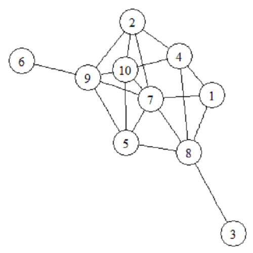

::: article


# Introduction {#sec:intro}

Convex optimization is a well traversed field with far reaching
applications. While perhaps unfamiliar to those in the statistical
sciences, many problems important to statisticians can be formulated as
a convex optimization, perhaps the most well known of which would be the
least squares problem. More specifically, many problems in statistics
can be formulated as a subset of these convex optimization problems,
known as *conic linear optimization problems*.

One such example would be the nearest correlation matrix problem
[@higham2002computing], which was first considered when attempting to
find correlations between stocks, where incomplete data on daily stock
returns are not unusual. Pairwise correlations are only computed when
data is available for both pairs of stocks under consideration,
resulting in a correlation matrix that contains pairwise correlations,
but is not necessarily positive semidefinite - an *approximate*
correlation matrix. The goal is to then find the correlation matrix that
is nearest to the approximate correlation matrix in some way.

Other examples of problems that can be formulated in terms of a conic
linear optimization problem include D-optimal experimental design
[@smith1918standard], classification using distance weighted
discrimination [@marron2007distance], minimum volume ellipsoids
[@john2014extremum], and problems in educational testing
[@chu1995educational].

Problems in related fields can also be solved, including finding the
maximum cut (or maximum k-cut) of a graph, finding the upper bound of
the Shannon entropy of a graph, also known as the Lovasz number
[@vandenberghe1998determinant], as well as problems in control theory,
Toeplitz matrix approximation, and Chebyshev approximation.

For the purpose of solving these conic linear optimization problems, we
introduce the R package
[*sdpt3r*](https://CRAN.R-project.org/package=sdpt3r), an implementation
of the Matlab package SDPT3 by @toh1999sdpt3. Of the R packages
available to perform conic optimization, *sdpt3r* is among the most
general. [*Rdsdp*](https://CRAN.R-project.org/package=Rdsdp) [@Rdsdp] &
[*Rcsdp*](https://CRAN.R-project.org/package=Rcsdp) [@Rcsdp] are capable
of solving semidefinite conic optimization problems, while
[*cccp*](https://CRAN.R-project.org/package=cccp) [@cccp] solves linear
and quadratic conic optimization problems. The *sdpt3r* package allows
for all of linear, quadratic, and semidefinite conic optimization to be
solved simultaneously (i.e., a problem with any combination of
semidefinite, quadratic, or linear cones can be solved). Two comparable
packages, [*scs*](https://CRAN.R-project.org/package=scs) [@scs] and
[*Rmosek*](https://CRAN.R-project.org/package=Rmosek)
[@friberg2012rmosek], solve a similar suite of problems. Additionally,
the R packages *CXVR* [@cvxr] and *ROI* [@roi] provide sophisticated
modelling interfaces to these solvers.

As a point of difference, *scs* and *Rmosek* allow for the exponential
and power cones to be included in the constraints, while *sdpt3r*
handles log-barrier terms in the objective function directly. The
inclusion of log-barrier terms allows for the D-optimal design of
experiments and minimum volume ellipsoid problems to be solved with
minimal modifications. In addition, *sdpt3r* provides helper functions
which directly solve a number of well known problems (such as the "max
cut" or nearest correlation matrix problems) with minimal input burden
on the user. This additional functionality is not found in either *scs*
or *Rmosek* (although *scs* can be used with the *CVXR* package).

This paper is structured as follows. In Section [2](#sec:math) we
discuss in greater detail the mathematical formulation of the linear
conic optimization problem, and introduce three examples to explore the
increasing generality of the problem to be solved. Section
[3](#sec:usage) discusses the R implementation of *sdpt3r*, and the main
function by which conic linear optimization problems are solved, `sqlp`,
including the required input, and the output generated. The same
examples used in Section [2](#sec:math) will be used to demonstrate how
a standard conic linear optimization problem can be converted to a form
solvable by `sqlp`. Section [4](#sec:morex) presents the classic form of
several other well known problems that can be solved using *sdpt3r*, as
well as the helper functions available to convert them to the
appropriate form. Finally Section [5](#sec:conc) provides some closing
remarks.

# Conic linear optimization {#sec:math}

At its simplest, a conic linear optimization problem has the following
standard form [@tutuncu2003solving]:

$$\begin{array}{ll}
\underset{\mathbf{X}}{\text{minimize}} & \langle \mathbf{C},~\mathbf{X} \rangle \\
\text{subject to} & \\
&
\begin{array}{rll}
\langle \mathbf{A}_{k},~\mathbf{X} \rangle &=~~\mathbf{b}_{k}, & k=1,...,m \\
\mathbf{X} &\in~~\mathcal{K} &
\end{array}
\end{array}
\label{eq:con1}   (\#eq:con1)$$

where $\mathcal{K}$ is a cone. Generally, $\mathcal{K}$ is either a

-   Semidefinite Cone -
    $\mathcal{S}^{n} = \{\mathbf{X} \in \mathcal{R}^{n\times n} : \mathbf{X} \succeq 0, \mathbf{X}_{ij} = \mathbf{X}_{ji}~\forall~i\neq j\}$
-   Quadratic Cone -
    $\mathcal{Q}^{n} = \{\mathbf{x}=[x_{0};\tilde{\mathbf{x}}] \in \mathcal{R}^{n}: x_{0} \geq \sqrt{{\tilde{\mathbf{x}}}^{\mkern-1.5mu\mathsf{T}}\tilde{\mathbf{x}}}\}$
-   Linear Cone - $\mathcal{L}^{n}$ - non-negative orthant of
    $\mathcal{R}^{n}$

Here, $\tilde{\mathbf{x}} = [x_{1},\dots,x_{n-1}]$, and
$\langle\cdot{,}\cdot\rangle$ represents the standard inner product in
the appropriate space. In the semidefinite cone the inner product is
$\langle \mathbf{X},~\mathbf{Y} \rangle = {vec(\mathbf{X})}^{\mkern-1.5mu\mathsf{T}}vec(\mathbf{Y})$,
where the operator $vec$ is the by-column vector version of the matrix
$\mathbf{X}$, that is, for the $n\times n$ matrix
$\mathbf{X} = [x_{ij}]$, $vec(\mathbf{X})$ is the $n^{2}\times 1$ vector
${[x_{11},x_{12},x_{13},\dots,x_{(n-1)n},x_{nn}]}^{\mkern-1.5mu\mathsf{T}}$.
Note that $vec$ does not require a square matrix in general.

One of the simplest problems that can be formulated in terms of a conic
linear optimization problem is finding the maximum cut of a graph. Let
$\mathbf{G} = [\mathbf{V},\mathbf{E}]$ be a graph with vertices
$\mathbf{V}$ and edges $\mathbf{E}$. A *cut* of the graph $\mathbf{G}$
is a partition of the vertices of $\mathbf{G}$ into two disjoint subsets
$\mathbf{G}_{1} = [\mathbf{V}_{1},\mathbf{E}_{1}]$,
$\mathbf{G}_{2} = [\mathbf{V}_{2},\mathbf{E}_{2}]$, with
$\mathbf{V}_{1} \cap \mathbf{V}_{2} = \varnothing$. The size of the cut
is defined to be the number of edges connecting the two subsets. The
*maximum cut* is defined to be the cut of a graph $\mathbf{G}$ whose
size is at least as large as any other cut. For a weighted graph object,
we can also define the maximum cut to be the cut with weight at least as
large as any other cut.

Finding the maximum cut is referred to as the **Max-Cut Problem**, and
was one of the first problems found to be NP-complete, and is also one
of the 21 algorithms on Karp's 21 NP-complete problems
[@karp1972reducibility]. The Max-Cut problem is also known to be *APX
hard* [@papadimitriou1991optimization], meaning in addition to there
being no polynomial time solution, there is also no polynomial time
approximation.

Using the semidefinite programming approximation formulation of
@goemans1995improved, the Max-Cut problem can be approximated to within
an *approximation constant*. For a weighted adjacency matrix
$\mathbf{B}$, the objective function can be stated as

$$\begin{array}{ll}
\underset{\mathbf{X}}{\text{minimize}} & \langle \mathbf{C},\mathbf{X} \rangle \\
\text{subject to} & \\
&
\begin{array}{rl}
diag(\mathbf{X}) &=~~ \mathbf{1} \\
\mathbf{X} & \in~~\mathcal{S}^{n} \\
\end{array}
\end{array}$$

where $\mathcal{S}^{n}$ is the cone of symmetric positive semidefinite
matrices of size $n$, and
$\mathbf{C} = -(diag(\mathbf{B}\mathbf{1}) - \mathbf{B})/4$. Here, we
define $diag(\mathbf{a})$ for an $n \times 1$ vector $\mathbf{a}$ to be
the diagonal matrix $\mathbf{A} = [A_{ij}]$ of size $n \times n$ with
$A_{ii} = a_{i},~~ i=1,\dots,n$. For a matrix $\mathbf{X}$,
$diag(\mathbf{X})$ extracts the diagonal elements from $\mathbf{X}$ and
places them in a column-vector.

To see that the Max-Cut problem is a conic linear optimization problem
it needs to be written in the same form as Equation \@ref(eq:con1). The
objective function is already in a form identical to that of Equation
\@ref(eq:con1), with minimization occurring over $\mathbf{X}$ of its
inner product with a constant matrix
$\mathbf{C} = -(diag(\mathbf{B}\mathbf{1}) - \mathbf{B})/4$. There are
$n$ equality constraints of the form $x_{kk} = 1,~~k=1,...,n$, where
$x_{kk}$ is the $k^{th}$ diagonal element of $\mathbf{X}$, and
$b_{k} = 1$ in Equation \@ref(eq:con1). To represent this in the form
$\langle \mathbf{A}_{k},~\mathbf{X} \rangle = x_{kk}$, take
$\mathbf{A}_{k}$ to be

$$\mathbf{A}_{k} = [a_{ij}] =
\begin{cases}
1, & i = j = k \\
0, & \text{otherwise}
\end{cases}$$

Now
$\langle \mathbf{A}_{k},~\mathbf{X} \rangle = {vec(\mathbf{A}_{k})}^{\mkern-1.5mu\mathsf{T}}vec(\mathbf{X}) = x_{kk}$
as required, and the Max-Cut problem is specified as a conic linear
optimization problem.

Allowing for optimization to occur over only one variable at a time is
quite restrictive, as only a small number of problems can be formulated
in this form. Allowing optimization to occur over multiple variables
simultaneously would allow for a broader range of problems to be solved.

## A separable set of variables {#sec:gen2}

The conic linear optimization problem actually covers a much wider class
of problems than those expressible as in Equation \@ref(eq:con1).
Variables can be separated into those which are constrained to a
semidefinite cone, $\mathcal{S}$, a quadratic cone, $\mathcal{Q}$, or a
linear cone, $\mathcal{L}$. The objective function is a sum of the
corresponding inner products of each set of variables. The linear
constraint is simply a sum of variables of linear functions of each set.
This more general version of the conic linear optimization problem is

$$\begin{array}{ll}
\underset{\mathbf{X}^{s},\mathbf{X}^{q},\mathbf{X}^{l}}{\text{minimize}} & \sum_{j=1}^{n_{s}} \langle \mathbf{C}_{j}^{s},~\mathbf{X}_{j}^{s} \rangle + \sum_{i=1}^{n_{q}} \langle \mathbf{C}_{i}^{q},~\mathbf{X}_{i}^{q} \rangle +  \langle \mathbf{C}^{l},~\mathbf{X}^{l} \rangle\\
\text{subject to} & \\
&
\begin{array}{rl}
\sum_{j=1}^{n_{s}} {(\mathbf{A}_{j}^{s})}^{\mkern-1.5mu\mathsf{T}}svec(\mathbf{X}_{j}^{s}) + \sum_{i=1}^{n_{q}} {(\mathbf{A}_{i}^{q})}^{\mkern-1.5mu\mathsf{T}}\mathbf{X}_{i}^{q} + {(\mathbf{A}^{l})}^{\mkern-1.5mu\mathsf{T}}\mathbf{X}^{l} &=~~\mathbf{b} \\[5pt]
\mathbf{X}_{j}^{s} &\in~\mathcal{S}^{s_{j}}~~\forall~j \\[5pt]
\mathbf{X}_{i}^{q} &\in ~\mathcal{Q}^{q_{i}}~~\forall~i \\[5pt]
\end{array}
\end{array}
\label{eq:con2}   (\#eq:con2)$$

Here, *svec* takes the upper triangular elements of a matrix (including
the diagonal) in a column-wise fashion and vectorizes them. In general
for an $n \times p$ matrix $\mathbf{X}=[x_{ij}]$, $svec(\mathbf{X})$
will have the following form
${[x_{11},x_{12},x_{22},x_{13},...,x_{(n-1)p},x_{np}]}^{\mkern-1.5mu\mathsf{T}}$.
Recall that matrices in $\mathcal{S}$ are symmetric, so it is sufficient
to constrain only the upper triangular elements of the matrix
$\mathbf{X}^{s}$. For this formulation, $\mathbf{A}_{j}^{s}$,
$\mathbf{A}_{i}^{q}$ and $\mathbf{A}^{l}$ are the constraint matrices of
the appropriate size.

Some important problems in statistics can be formulated to fit this form
of the optimization problem.

### The nearest correlation matrix

First addressed by @higham2002computing in dealing with correlations
between stock prices, difficulty arises when data is not available for
all stocks on each day, which is unfortunately a common occurrence. To
help address this situation, correlations are calculated for pairs of
stocks only when data is available for both stocks on any given day. The
resulting correlation matrix is only approximate in that it is not
necessarily positive semidefinite.

This problem was cast by @higham2002computing as

$$\begin{array}{ll}
\underset{\mathbf{X}}{\text{minimize}} & ||\mathbf{R} - \mathbf{X}||_{F}\\
\text{subject to} & \\
& \begin{array}{rl}
diag(\mathbf{X}) &=~~\mathbf{1} \\
\mathbf{X} &\in~~\mathcal{S}^{n}
\end{array}
\end{array}$$

where $\mathbf{R}$ is the approximate correlation matrix and
$||\cdot||_{F}$ denotes the Frobenius norm. Unfortunately, the Frobenius
norm in the objective function prevents the problem being formatted as a
conic linear optimization problem.

Since the matrix $\mathbf{X}$ is constrained to have unit diagonal and
be symmetric, and the matrix $\mathbf{R}$ is an approximate correlation
matrix, meaning it will also have unit diagonal and be symmetric, we can
re-write the objective function as

$$||\mathbf{R}-\mathbf{X}||_{F} = 2*||svec(\mathbf{R}) - svec(\mathbf{X})|| = 2*||\mathbf{e}||$$

Now, introduce a variable $e_{0}$ such that $e_{0} \geq ||\mathbf{e}||$,
and define $\mathbf{e}^{\ast} = [e_{0};~\mathbf{e}]$. The vector
$\mathbf{e}^{\ast}$ is now restricted to be in the quadratic cone
$\mathcal{Q}^{n(n+1)/2+1}$. This work leads to the formulation of
@toh1999sdpt3

$$\begin{array}{ll}
\underset{\mathbf{e}^{\ast},~\mathbf{X}}{\text{minimize}} & e_{0} \\
\text{subject to} & \\
&
\begin{array}{rl}
svec(\mathbf{R}) - svec(\mathbf{X}) &=~~ [\mathbf{0}, \mathbf{I}_{n(n+1)/2}]~\mathbf{e}^{\ast} \\
diag(\mathbf{X}) &=~~\mathbf{1} \\
\mathbf{X} &\in~~\mathcal{S}^{n} \\
\mathbf{e}^{\ast} &\in~~\mathcal{Q}^{n(n+1)/2+1}
\end{array}
\end{array}$$

Here, $[\mathbf{X},\mathbf{Y}]$ denotes column binding of the two
matrices $\mathbf{X}_{n\times p}$ and $\mathbf{Y}_{n \times m}$ to form
a matrix of size $n \times (p+m)$. By minimizing $e_{0}$, we indirectly
minimize $\mathbf{e} = svec(\mathbf{R}) - svec(\mathbf{X})$, since
recall we have $e_{0} \geq ||\mathbf{e}||$, which is the goal of the
original objective function.

To see this as a conic linear optimization problem, notice that $e_{0}$
can be written as $\langle \mathbf{C}^{q},~\mathbf{X}^{q} \rangle$ by
letting $\mathbf{C}^{q} = [1;\mathbf{0}_{n(n+1)/2}]$ and
$\mathbf{X}^{q} = \mathbf{e}^{\ast}$. Since the matrix $\mathbf{X}$
(i.e., $\mathbf{X}^{s}$) does not appear in the objective function, the
matrix $\mathbf{C}^{s}$ is an $n \times n$ matrix of zeros.

Re-writing the first constraint as

$$svec(\mathbf{X}) + [\mathbf{0}, \mathbf{I}_{n(n+1)/2}]~\mathbf{e}^{\ast} =~~  svec(\mathbf{R})$$

we can easily define the constraint matrices and right hand side of the
first constraint as

$$\begin{array}{rl}
\mathbf{A}_{1}^{s} &= \mathbf{I}_{n(n+1)/2} \\
\mathbf{A}_{1}^{q} &= [\mathbf{0}, \mathbf{I}_{n(n+1)/2}] \\
\mathbf{b}_{1} &= svec(\mathbf{R})
\end{array}$$

The second constraint is identical to the constraint from the Max-Cut
problem, where each diagonal element of $\mathbf{X}$ is constrained to
be equal to 1. Define $\mathbf{b}_{2} = \mathbf{1}$, and for the
$k^{th}$ diagonal element of $\mathbf{X}$, define the matrix
$\mathbf{A}_{k}$ as

$$\mathbf{A}_{k} = [a_{ij}] =
\begin{cases}
1, & i = j = k \\
0, & \text{otherwise}
\end{cases}$$

yielding $\langle \mathbf{A}_{k},\mathbf{X} \rangle = x_{kk}$. To write
this as ${(\mathbf{A}_{2}^{s})}^{\mkern-1.5mu\mathsf{T}}\mathbf{X}^{s}$,
define

$$\mathbf{A}_{2}^{s} = [svec(\mathbf{A}_{1}),...,svec(\mathbf{A}_{n})]$$

Since $\mathbf{e}^{\ast}$ does not appear in the second constraint,
$\mathbf{A}_{2}^{q} = \mathbf{0}_{n(n+1)/2+1}$.

The final step is to combine the individual constraint matrices from
each constraint to form one constraint matrix for each variable, which
is done by defining
$\mathbf{A}^{s} = [\mathbf{A}_{1}^{s},~\mathbf{A}_{2}^{s}]$,
$\mathbf{A}^{q} = [\mathbf{A}_{1}^{q},~\mathbf{A}_{2}^{q}]$. We also
concatenate both right hand side vectors to form a single vector by
defining $\mathbf{b} = [\mathbf{b}_{1};~\mathbf{b}_{2}]$. Here, the
notation $[\mathbf{X};\mathbf{Y}]$ is used to denote two matrices
$\mathbf{X}_{p \times m}$ and $\mathbf{Y}_{q \times m}$ bound vertically
to form a matrix of size $(p+q) \times m$. With this, the nearest
correlation matrix problem is written as a conic linear optimization.

## Semidefinite quadratic linear programming {#sec:gen3}

While Equation \@ref(eq:con2) allows for additional variables to be
present, it can be made more general still to allow even more problems
to be solved. We will refer to this general form as a *semidefinite
quadratic linear programming* (SQLP) problem.

The first generality afforded by an SQLP is the addition of an
unconstrained variable $\mathbf{X}^{u}$, which, as the name suggests, is
not bound to a cone, but instead, it is "constrained" to the reals in
the appropriate dimension. The second generalization is to allow for
what are known as *log-barrier* terms to exist in the objective
function. In general, a barrier function in an optimization problem is a
term that approaches infinity as the point approaches the boundary of
the feasible region. As we will see, these log-barrier terms appear as
log terms in the objective function.

Recall that for any linear optimization problem, there exists two
formulations - the primal formulation and the dual formulation. For the
purposes of a semidefinite quadratic linear programming problem, the
primal problem will always be defined as a minimization, and the
associated dual problem will therefore be a maximization

### The primal problem

The primal formulation of the SQLP problem is

$$\begin{array}{ll}
\underset{\mathbf{X}_{j}^{s},\mathbf{X}_{i}^{q},\mathbf{X}^{l},\mathbf{X}^{u}}{\text{minimize}} &  \sum_{j=1}^{n_{s}} [\langle \mathbf{C}_{j}^{s},~ \mathbf{X}_{j}^{s} \rangle - \mathbf{v}_{j}^{s} ~ log~det~\mathbf{X}_{j}^{s}] ~ + ~ \sum_{i=1}^{n_{q}} [\langle \mathbf{C}_{i}^{q},~ \mathbf{X}_{i}^{q} \rangle - \mathbf{v}_{i}^{q} ~ log ~\gamma(\mathbf{X}_{i}^{q})] \\
& \quad \quad \quad + ~ \langle \mathbf{C}^{l},~ \mathbf{X}^{l} \rangle ~ - ~ \sum_{k=1}^{n_{l}}\mathbf{v}_{k}^{l}~log~\mathbf{X}_{k}^{l} ~ + ~ \langle \mathbf{C}^{u},~ \mathbf{X}^{u} \rangle \\
\text{subject to} & \\
& \begin{array}{rll}
\sum_{j=1}^{n_{s}} \mathbf{A}_{j}^{s}(\mathbf{X}_{j}^{s}) + \sum_{i=1}^{n_{q}} \mathbf{A}_{i}^{q}\mathbf{X}_{i}^{q} + \mathbf{A}^{l}\mathbf{X}^{l} + \mathbf{A}^{u}\mathbf{X}^{u} & = ~ \mathbf{b} & \\[5pt]
\mathbf{X}_{j}^{s} & \in ~ \mathcal{S}^{s_{j}} & \forall~j \\[5pt]
\mathbf{X}_{i}^{q} & \in ~ \mathcal{Q}^{q_{i}} & \forall~i \\[5pt]
\mathbf{X}^{l} & \in ~ \mathcal{L}^{n_{l}} & \\[5pt]
\mathbf{X}^{u} & \in ~ \mathcal{R}^{n_{u}} &
\end{array}
\end{array}
\label{eq:Primal}   (\#eq:Primal)$$

For each $j$, $\mathbf{C}_{j}^{s}$ and $\mathbf{X}_{j}^{s}$ are
symmetric matrices of dimension $s_{j}$, restricted to the cone of
positive semidefinite matrices of the same dimension. Similarly, for all
$i$, $\mathbf{C}_{i}^{q}$ and $\mathbf{X}_{i}^{q}$ are real vectors of
dimension $q_{i}$, restricted to the quadratic cone of dimension
$q_{i}$. For a vector $\mathbf{u} = [u_{0}; \tilde{\mathbf{u}}]$ in a
second order cone, define
$\gamma(u) = \sqrt{u_{0}^{2} - {\tilde{\mathbf{u}}}^{\mkern-1.5mu\mathsf{T}}\tilde{\mathbf{u}}}$.
Finally, $\mathbf{C}^{l}$ and $\mathbf{X}^{l}$ are vectors of dimension
$n_{l}$, restricted to linear cone of the same dimension, and
$\mathbf{C}^{u}$ and $\mathbf{X}^{u}$ are unrestricted real vectors of
dimension $n_{u}$.

As before, the matrices $\mathbf{A}_{i}^{q}$, $\mathbf{A}^{l}$, and
$\mathbf{A}^{u}$ are constraint matrices in $q_{i}$, $n_{l}$, and
$n_{u}$ dimensions respectively, each corresponding to their respective
quadratic, linear, or unrestricted block. $\mathbf{A}_{j}^{s}$ is
defined to be a linear map from $\mathcal{S}^{s_{j}}$ to
$\mathcal{R}^{m}$ defined by

$$\mathbf{A}_{j}^{s_{j}}(\mathbf{X}_{j}^{s}) = [\langle \mathbf{A}_{j,1}^{s}, \mathbf{X}_{j}^{s} \rangle; \dots ; \langle \mathbf{A}_{j,m}^{s}, \mathbf{X}_{j}^{s} \rangle]$$

where
$\mathbf{A}_{j,1}^{s} \dots \mathbf{A}_{j,m}^{s} \in \mathcal{S}^{s_{j}}$
are constraint matrices associated with the $j^{th}$ semidefinite
variable $\mathbf{X}_{j}^{s}$.

### The dual problem

The dual problem associated with the semidefinite quadratic linear
programming formulation is

$$\begin{array}{lll}
\underset{\mathbf{Z}^{s}_{j},\mathbf{Z}^{q}_{i},\mathbf{Z}^{l},\mathbf{y}}{\text{maximize}} & {\mathbf{b}}^{\mkern-1.5mu\mathsf{T}}\mathbf{y} &+~\sum_{j=1}^{n_{s}}[\mathbf{v}_{j}^{s}~log~det~\mathbf{Z}_{j}^{s} ~ + ~ s_{j}~\mathbf{v}_{j}^{s}~(1-log~\mathbf{v}_{j}^{s})] \\
& & +~\sum_{i=1}^{n_{q}} [\mathbf{v}_{i}^{q}~log~\gamma(\mathbf{Z}_{i}^{q}) ~+~ \mathbf{v}_{i}^{q}~(1-log~\mathbf{v}_{i}^{q})] \\[10pt]
& & +~\sum_{k=1}^{n_{l}}[\mathbf{v}_{k}^{l}~log~\mathbf{Z}_{k}^{l} ~ + ~ \mathbf{v}_{k}^{l}~(1-log~\mathbf{v}_{k}^{l})] \\
\text{subject to} & & \\
& & \begin{array}{llllll}
{(\mathbf{A}_{j}^{s})}^{\mkern-1.5mu\mathsf{T}}\mathbf{y} & +~~ \mathbf{Z}_{j}^{s} & = ~ \mathbf{C}_{j}^{s}, & \mathbf{Z}_{j}^{s} & \in ~ \mathcal{S}^{s_{j}}, & j = 1,\dots, n_{s} \\[5pt]
{(\mathbf{A}_{i}^{q})}^{\mkern-1.5mu\mathsf{T}}\mathbf{y} & +~~ \mathbf{Z}_{i}^{q} & = ~ \mathbf{C}_{i}^{q}, & \mathbf{Z}_{i}^{q} & \in ~ \mathcal{Q}^{q_{i}}, &  i = 1,\dots, n_{q} \\[5pt]
{(\mathbf{A}^{l})}^{\mkern-1.5mu\mathsf{T}}\mathbf{y} & +~~ \mathbf{Z}^{l} & = ~ \mathbf{C}^{l}, & \mathbf{Z}^{l} & \in ~ \mathcal{L}^{n_{l}} & \\[5pt]
{(\mathbf{A}^{u})}^{\mkern-1.5mu\mathsf{T}}\mathbf{y} & & = ~ \mathbf{C}^{u}, & \mathbf{y} & \in ~ \mathcal{R}^{m} & \\
\end{array}
\end{array}
\label{eq:Dual}   (\#eq:Dual)$$

where $(\mathbf{A}_{j}^{s})^{T}$ is defined to be the adjoint operator
of $\mathbf{A}_{j}^{s}$, where
${(\mathbf{A}_{j}^{s})}^{\mkern-1.5mu\mathsf{T}}\mathbf{y} = \sum_{k=1}^{m}\mathbf{y}_{k}\mathbf{A}_{j,k}^{s}$.
Equations \@ref(eq:Primal) and \@ref(eq:Dual) represent the most general
form of the linear conic optimization problem that can be solved using
*sdpt3r*.

### Optimal design of experiments

Consider the problem of estimating a vector $\mathbf{x}$ from
measurements $\mathbf{y}$ given by the relationship

$$\mathbf{y} = \mathbf{A}\mathbf{x} + \boldsymbol{\epsilon}, \quad \boldsymbol{\epsilon} \sim \mathcal{N}(0,1).$$

The variance-covariance matrix of such an estimator is proportional to
$({\mathbf{A}}^{\mkern-1.5mu\mathsf{T}}\mathbf{A})^{-1}$. A reasonable
goal during the design phase of an experiment would therefore be to
minimize $({\mathbf{A}}^{\mkern-1.5mu\mathsf{T}}\mathbf{A})^{-1}$ in
some way.

There are many different ways in which
$({\mathbf{A}}^{\mkern-1.5mu\mathsf{T}}\mathbf{A})^{-1}$ might be made
minimal. For example, minimization of the trace of
$({\mathbf{A}}^{\mkern-1.5mu\mathsf{T}}\mathbf{A})^{-1}$ (A-Optimality),
minimization of the maximum eigenvalue of
$({\mathbf{A}}^{\mkern-1.5mu\mathsf{T}}\mathbf{A})^{-1}$ (E-Optimality),
minimization of the determinant of
$({\mathbf{A}}^{\mkern-1.5mu\mathsf{T}}\mathbf{A})^{-1}$ (D-Optimality),
and maximization of the trace of
${\mathbf{A}}^{\mkern-1.5mu\mathsf{T}}\mathbf{A}$ (T-Optimality) all
have their merits.

Perhaps the most commonly used of these optimality criteria is
D-Optimality, which is equivalent to maximizing the determinant of
${\mathbf{A}}^{\mkern-1.5mu\mathsf{T}}\mathbf{A}$. Typically, the rows
of $\mathbf{A} = [\mathbf{a}_{1},...,\mathbf{a}_{q}]^{T}$ are chosen
from $M$ possible test vectors
$\mathbf{u}_{i} \in \mathcal{R}^{p}, ~ i=1,...M$, which are known in
advance. That is,

$$\mathbf{a}_{i} \in \{\mathbf{u}_{1},...,\mathbf{u}_{M}\}, \quad i = 1,...,q$$

Given that the matrix $\mathbf{A}$ is made up of these test vectors
$\mathbf{u}_{i}$, @vandenberghe1998determinant write the matrix
${\mathbf{A}}^{\mkern-1.5mu\mathsf{T}}\mathbf{A}$ as

$${\mathbf{A}}^{\mkern-1.5mu\mathsf{T}}\mathbf{A} = q \sum_{i=1}^{M}\lambda_{i}\mathbf{u}_{i}{\mathbf{u}_{i}}^{\mkern-1.5mu\mathsf{T}}
\label{eq:dopt}   (\#eq:dopt)$$

where $\lambda_{i}$ is the fraction of rows in $\mathbf{A}$ that are
equal to the vector $\mathbf{u}_{i}$. Then, @vandenberghe1998determinant
write the D-optimal experimental design problem as a minimum determinant
problem

$$\begin{array}{ll}
\underset{\boldsymbol{\lambda}}{\text{minimize}} & \text{log}~\text{det}~(\sum_{i=1}^{M}\lambda_{i}\mathbf{u}_{i}{\mathbf{u}_{i}}^{\mkern-1.5mu\mathsf{T}})^{-1} \\
\text{subject to} & \\
&
\begin{array}{rl}
\lambda_{i} &\geq~~0, \quad i = 1,...,m \\
\sum_{i=1}^{M}\lambda_{i} &=~~1
\end{array}
\end{array}$$

Due to the inequality constraint, this primal formulation cannot be
interpreted as an SQLP of the form of Equation \@ref(eq:Primal). By
defining
$\mathbf{Z} = \mathbf{u}~diag(\boldsymbol{\lambda})~{\mathbf{u}}^{\mkern-1.5mu\mathsf{T}}$,
the dual problem is [@toh1999sdpt3]

$$\begin{array}{ll}
\underset{\mathbf{Z},~\mathbf{z}^{l},~\boldsymbol{\lambda}}{\text{maximize}} & \text{log det}~(\mathbf{Z})\\
\text{subject to} &\\
&
\begin{array}{rll}
-\sum_{i=1}^{p} \lambda_{i}(\mathbf{u}_{i}{\mathbf{u}_{i}}^{\mkern-1.5mu\mathsf{T}}) + \mathbf{Z} &=~~0, & \mathbf{Z} \in \mathcal{S}^{n} \\
-\boldsymbol{\lambda} + \mathbf{z}^{l} & =~~0, & \mathbf{z}^{l} \in \mathcal{R}^{p}_{+} \\
\mathbf{1}^{T}\boldsymbol{\lambda} & =~~1, & \boldsymbol{\lambda} \in \mathcal{R}^{p} \\
\end{array}
\end{array}$$

Keeping in mind that this is a dual configuration, and thus follows
Equation \@ref(eq:Dual), we proceed with writing the D-Optimal design
problem as an SQLP by first considering the objective function. The
objective function depends only on the determinant of the matrix
variable $\mathbf{Z}$, which is the log-barrier. This indicates that the
variable $v^{s}$ in Equation \@ref(eq:Dual) is equal to 1 in this
formulation, while $v^{q}$ and $v^{l}$ are both zero. Since
$\boldsymbol{\lambda}$ does not appear in the objective function, the
vector $\mathbf{b}$ is equal to $\mathbf{0}$.

The constraint matrices $\mathbf{A}$ are easy to define in the case of
the dual formulation, as they multiply the vector $\mathbf{y}$ in
Equation \@ref(eq:Dual), so therefore multiply $\boldsymbol{\lambda}$ in
our case. In the first constraint, each $\lambda_{i}$ is multiplied by
the matrix formed by
$-\mathbf{u}_{i}{\mathbf{u}}^{\mkern-1.5mu\mathsf{T}}_{i}$, so define
$\mathbf{A}_{i}$ to be

$$\mathbf{A}_{i} = -\mathbf{u}_{i}{\mathbf{u}}^{\mkern-1.5mu\mathsf{T}}_{i},~~ i = 1,...,p.$$

Then, the constraint matrix is
$\mathbf{A}^{s} = [svec(\mathbf{A}_{1}),...,svec(\mathbf{A}_{p})]$. In
the second constraint containing the linear variable $\mathbf{z}^{l}$,
the constraint matrix is $\mathbf{A}^{l} = -\mathbf{I}_{p}$, and in the
third constraint containing only the unconstrained variable
$\boldsymbol{\lambda}$, the constraint matrix is
$\mathbf{A}^{u} = {\mathbf{1}}^{\mkern-1.5mu\mathsf{T}}$. Since there is
no quadratic variable, $A^{q} = \mathbf{0}$.

Finally, define the right hand side of each constraint
$$\begin{array}{rl}
\mathbf{C}^{s} &= \mathbf{0}_{n\times n} \\
\mathbf{C}^{l} &= \mathbf{0}_{p\times 1} \\
\mathbf{C}^{u} &= 1
\end{array}$$

which fully specifies the D-Optimal design problem as an SQLP.

In the next section, we will demonstrate using R how these definitions
can be translated for use in the main function of *sdpt3r* so an SQLP
problem can be solved.

# Solving a conic linear optimization problem with sdpt3r {#sec:usage}

Each of the problems presented in Section [2](#sec:math) can be solved
using the *sdpt3r* package, an R implementation of the Matlab program
SDPT3. The algorithm is an infeasible primal-dual predictor-corrector
path-following method, utilizing either an HKM [@helmberg1996interior]
or NT [@nesterov1997self] search direction. The interested reader is
directed to @tutuncu2003solving for further details surrounding the
implementation.

The main function available in *sdpt3r* is `sqlp`, which takes a number
of inputs (or an `sqlp_input` object) specifying the problem to be
solved, and executes the optimization, returning both the primal and
dual solution to the problem. This function will be thoroughly discussed
in Section [3.1](#sec:sqlp), and examples will be provided. In addition
to `sqlp`, a prospective user will also have access to a number of
helper functions for well known problems that can be solved using
*sdpt3r*. For example, the function `maxcut` takes as input an adjacency
matrix $\mathbf{B}$, and produces an S3 object containing all the input
variables necessary to solve the problem using `sqlp`. These functions
will be discussed in Sections [3.3](#sec:maxcut), [3.4](#sec:nearcorr),
[3.4.2](#sec:doptimal), and [4](#sec:morex).

For *sdpt3r*, each optimization variable will be referred to as a
*block* in the space in which it is restricted. For instance, if we have
an optimization variable $\mathbf{X} \in \mathcal{S}^{n}$, we will refer
to this as a semidefinite block of size $n$. It is important to note
that it is possible to have multiple blocks from the same space, that
is, it is possible to have both $\mathbf{X} \in \mathcal{S}^{n}$ as well
as $\mathbf{Y} \in \mathcal{S}^{m}$ in the same problem.

## Input variables {#sec:sqlp}

The main function call in *sdpt3r* is `sqlp`, which takes the following
input variables

  ------------------ -------------------------------------------------------------------------------------------------------------------------
               `blk` A named-list object describing the block structure of the optimization variables.

                `At` A list object containing constraint matrices $\mathbf{A}^{s}$, $\mathbf{A}^{q}$, $\mathbf{A}^{l}$, and $\mathbf{A}^{u}$

                     for the primal-dual problem.

                 `b` A vector containing the right hand side of the equality constraints, $\mathbf{b}$,

                     in the primal problem, or equivalently the constant vector in the dual.

                 `C` A list object containing the constant $\mathbf{C}$ matrices in the primal objective

                     function or equivalently the corresponding right hand side of the equality

                     constraints in the dual problem.

    `X0`, `y0`, `Z0` Matrix objects containing an initial iterate for the $\mathbf{X}$, $\mathbf{y}$, and $\mathbf{Z}$ variables for

                     the SQLP problem. If not provided, an initial iterate is computed internally.

           `control` A list object providing additional parameters for use in `sqlp`.

                     If not provided, default values are used.
  ------------------ -------------------------------------------------------------------------------------------------------------------------

  : 

The input variable `blk` describes the block structure of the problem.
Letting `L` be the total number of semidefinite, quadratic, linear, and
unrestricted blocks in the SQLP problem, define `blk` to be a
named-vector object of length $L$, with names describing the type of
block, and values denoting the size of the optimization variable,
summarized in Table [1](#tab:blk).

::: {#tab:blk}
  -------------------------------
  Block type      Name    Value
  -------------- ------ ---------
  Semidefinite     s     $s_{j}$

  Quadratic        q     $q_{i}$

  Linear           l     $n_{l}$

  Unrestricted     u     $n_{u}$
  -------------------------------

  : Table 1: *Structure of `blk`.*
:::

The input variable `At` corresponds to the constraint matrices in
Equation \@ref(eq:Primal), and `C` the constant matrices in the
objective function. The size of these input variables depends on the
block they are representing, summarized in Table [2](#tab:size1) for
each block type.

::: {#tab:size1}
  ------ ------------------------ ------------------ ------------------ ------------------
                Block type                                              

               Semidefinite           Quadratic            Linear          Unrestricted

    `At`  $\bar{s}_{j} \times m$   $q_{j} \times m$   $n_{l} \times m$   $n_{u} \times m$

     `C`   $s_{j} \times s_{j}$    $q_{j} \times 1$   $n_{l} \times 1$   $n_{u} \times 1$
  ------ ------------------------ ------------------ ------------------ ------------------

  : Table 2: *Size of `At` and `C` for each block type.*
:::

Note that in Table [2](#tab:size1), $\bar{s}_{j} = s_{j}(s_{j} + 1)/2$.
The size of `At` in the semidefinite block reflects the upper-triangular
input format that has been discussed previously. In a semidefinite
block, the optimization variable $\mathbf{X}$ is necessarily symmetric
and positive semidefinite, it is therefore more efficient to consider
only the upper-triangular portion of the corresponding constraint
matrix.

It is important to note that both input variables `At` and `C` are lists
containing constraint and constant matrices for each optimization
variable. In general, the user need not supply initial iterates `X0`,
`y0`, and `Z0` for a solution to be found using `sqlp`. The infeasible
starting point generated internally by `sqlp` tends to be sufficient to
find a solution. If the user wishes to provide a starting point however,
the size parameters in Table [3](#tab:init) must be met for each block.

::: {#tab:init}
  ------ ---------------------- ------------------ ------------------ ------------------
               Block type                                             

              Semidefinite          Quadratic            Linear          Unrestricted

    `X0`  $s_{j} \times s_{j}$   $q_{j} \times 1$   $n_{l} \times 1$   $n_{u} \times 1$

    `y0`    $s_{j} \times 1$     $q_{j} \times 1$   $n_{l} \times 1$   $n_{u} \times 1$

    `Z0`  $s_{j} \times s_{j}$   $q_{j} \times 1$   $n_{l} \times 1$   $n_{u} \times 1$
  ------ ---------------------- ------------------ ------------------ ------------------

  : Table 3: *Required size for initial iterates `X0`, `y0`, and `Z0`.*
:::

The user may choose to depart from the default values of several
parameters which could affect the optimization by specifying alternative
values in the `control` list. A complete list of all parameters that can
be altered can be found in Appendix [6](#sec:A).

An important example is the specification of the `parbarrier` parameter
in `control`, which specifies the presence of a log-barrier in the
objective function. The default case in `control` assumes that the
parameters $\mathbf{v}_{j}^{s},~\mathbf{v}_{i}^{q},~\mathbf{v}_{k}^{l}$
in Equation \@ref(eq:Primal) are all $\mathbf{0}$. If this, however, is
not the case, then the user must specify an $L \times 1$ matrix object
in `controlparbarrier` to store the values of these parameters
(including zeros). If the $j^{th}$ block is a semidefinite block
containing $p$ variables,
$parbarrier_{j} = [v_{j1}^{s},...,v_{jn}^{s}]$. If the $j^{th}$ block is
a quadratic block containing $p$ variables,
$parbarrier_{j} = [v_{j1}^{q},...,v_{jn}^{q}]$. If the $j^{th}$ block is
a linear block $parbarrier_{j} = [v_{1}^{l},...,v_{n_{l}}^{l}]$.
Finally, if the $j^{th}$ block is the unrestricted block, then
$parbarrier_{j} = [0,...,0]$, where 0 is repeated $n_{u}$ times.

When executed, `sqlp` simultaneously solves both the primal and dual
problems, meaning solutions for both problems are returned. The
relevance of each output therefore depends on the problem being solved.
The following object of class `sqlp_output` is returned upon completion

  -------- ----------------------------------------------------------------------------------
    `pobj` the value of the primary objective function

    `dobj` the value of the dual objective function

       `X` A list object containing the optimal matrix $\mathbf{X}$ for the primary problem

       `y` A vector object containing the optimal vector $\mathbf{y}$ for the dual problem

       `Z` A list object containing the optimal matrix $\mathbf{Z}$ for the dual problem
  -------- ----------------------------------------------------------------------------------

  : 

The examples in subsequent subsections will demonstrate the output
provided by `sqlp`.

## Toy Examples

Before moving on to more complex problems, consider first some very
simple example to illustrate the functionality of the *sdpt3r* package.
First, consider the following simple linear programming problem:

$$\begin{array}{ll}
\text{Minimize} & x_{1} + x_{2} \\
\text{subject to} & \\
&
\begin{array}{rl}
x_{1} + 4x_{2} &=~~ 12 \\
3x_{1} - x_{2} &=~~ 10 \\
\end{array}
\end{array}$$

This problem can be solved using *sdpt3r* in very straightforward
fashion. First, this is a linear programming problem with two variables,
$x_{1}$ and $x_{2}$. This implies that `blk = c("l" = 2)`. Next the
objective function can be written as $1*x_{1} + 1*x_{2}$, so
`C = matrix(c(1,1),nrow=1)`. The constraints can be summarized in matrix
form as:

$$A = \left[\begin{array}{cc}
1 & 4 \\
3 & -1\\
\end{array}\right]$$

so `A = matrix(c(1,3,4,-1), nrow=2))` and `At = t(A)`. Finally the right
hand side can be written in vector form as $[12,10]$, so `b = c(12,10)`.
Pulling these all together, the problem is solved using `sqlp`:

``` r
blk = c("l" = 2)
C = matrix(c(1,1),nrow=1)
A = matrix(c(1,3,4,-1), nrow=2)
At = t(A)
b = c(12,10)

out = sqlp(blk,list(At),list(C),b)
out

$X
$X[[1]]
2 x 1 Matrix of class "dgeMatrix"
     [,1]
[1,]    4
[2,]    2


$y
          [,1]
[1,] 0.3076923
[2,] 0.2307692

$Z
$Z[[1]]
2 x 1 Matrix of class "dgeMatrix"
             [,1]
[1,] 6.494441e-10
[2,] 1.234448e-09


$pobj
[1] 6

$dobj
[1] 6
```

which returns the solution $x_{1} = 4$ and $x_{2} = 2$, and the optimal
primal solution of $6$. Second, consider the following simple quadratic
programming problem:

$$\begin{array}{ll}
\text{Minimize} & \frac{1}{2}x_{1}^{2} - x_{2}^{2} \\
\text{subject to} & \\
&
\begin{array}{rl}
2x_{1} - x_{2} &=~~ 5 \\
x_{1} + x_{2} &=~~ 4 \\
\end{array}
\end{array}$$

This problem can be solved using *sdpt3r* by formulating the input
variables in a similar fashion as the linear programming problem:

``` r
blk = c("q" = 2)
C = matrix(c(0.5,-1),nrow=1)
A = matrix(c(2,1,-1,1), nrow=2)
At = t(A)
b = c(5,4)

out = sqlp(blk,list(At),list(C),b)
out

$X
$X[[1]]
2 x 1 Matrix of class "dgeMatrix"
     [,1]
[1,]    3
[2,]    1


$y
     [,1]
[1,]  0.5
[2,] -0.5

$Z
$Z[[1]]
2 x 1 Matrix of class "dgeMatrix"
              [,1]
[1,]  2.186180e-09
[2,] -3.522956e-10


$pobj
[1] 0.5

$dobj
[1] 0.5
```

which returns the solution $x_{1} = 3$ and $x_{2} = 1$, with optimal
primal solution of $0.5$. Finally, consider the following simple
semidefinite programming problem (taken from @freund2004introduction):

$$\begin{array}{ll}
\text{Minimize} &
\left[\begin{array}{ccc}
1 & 2 & 3 \\
2 & 9 & 0 \\
3 & 0 & 7
\end{array}\right] \cdot
\left[\begin{array}{ccc}
x_{1} & x_{2} & x_{3} \\
x_{4} & x_{5} & x_{6} \\
x_{7} & x_{8} & x_{9}
\end{array}\right]\\
\text{subject to} & \\
&
\begin{array}{rl}
\left[\begin{array}{ccc}
1 & 0 & 1 \\
0 & 3 & 7 \\
1 & 7 & 5
\end{array}\right] \cdot
\left[\begin{array}{ccc}
x_{1} & x_{2} & x_{3} \\
x_{4} & x_{5} & x_{6} \\
x_{7} & x_{8} & x_{9}
\end{array}\right] = 11 \\
 & \\
\left[\begin{array}{ccc}
0 & 2 & 8 \\
2 & 6 & 0 \\
8 & 0 & 4
\end{array}\right] \cdot
\left[\begin{array}{ccc}
x_{1} & x_{2} & x_{3} \\
x_{4} & x_{5} & x_{6} \\
x_{7} & x_{8} & x_{9}
\end{array}\right] = 9 \\
\end{array}
\end{array}$$

This problem is written almost exactly in the language used by *sdpt3*,
and so can be easily solved by taking:

``` r
blk = c("s" = 3)
C = list(matrix(c(1,2,3,2,9,0,3,0,7), nrow=3))
A1 = matrix(c(1,0,1,0,3,7,1,7,5), nrow=3)
A2 = matrix(c(0,2,8,2,6,0,8,0,4), nrow=3)
At = svec(blk,list(A1,A2))
b = c(11,9)

out = sqlp(blk,At,C,b)
out

$X
$X[[1]]
3 x 3 Matrix of class "dgeMatrix"
           [,1]      [,2]      [,3]
[1,] 0.08928297 0.1606827 0.2453417
[2,] 0.16068265 0.2891815 0.4415426
[3,] 0.24534167 0.4415426 0.6741785


$y
          [,1]
[1,] 0.5172462
[2,] 0.4262486

$Z
$Z[[1]]
3 x 3 Matrix of class "dsyMatrix"
           [,1]      [,2]       [,3]
[1,]  0.4827538  1.147503 -0.9272352
[2,]  1.1475028  4.890770 -3.6207235
[3,] -0.9272352 -3.620723  2.7087744


$pobj
[1] 9.525946

$dobj
[1] 9.525946
```

which provides the optimal matrix solution $X$, and the optimal value of
the objective function 9.53. Note that the function `svec` is used since
the problem is a semidefinite programming problem, and thus each `A`
matrix is necessarily symmetric.

## The Max-Cut problem {#sec:maxcut}

Recall that the maximum cut of a graph $\mathbf{G}$ with adjacency
matrix $\mathbf{B}$ can be found as the solution to

$$\begin{array}{ll}
\text{Minimize} & \langle \mathbf{C},\mathbf{X} \rangle \\
\text{subject to} & \\
&
\begin{array}{rl}
diag(\mathbf{X}) &=~~ \mathbf{1} \\
\mathbf{X} & \in~~\mathcal{S}^{n} \\
\end{array}
\end{array}$$

where $\mathbf{C} = -(diag(\mathbf{B}\mathbf{1}) - \mathbf{B})/4$. In
Section [2](#sec:math), we wrote this in the form of an SQLP

$$\begin{array}{ll}
\text{Minimize} & \langle \mathbf{C},\mathbf{X} \rangle \\
\text{subject to} & \\
&
\begin{array}{rl}
\langle \mathbf{A}_{k},\mathbf{X} \rangle &=~~ 1, \quad k~=~1,\dots,n \\
\mathbf{X} & \in~~\mathcal{S}^{n} \\
\end{array}
\end{array}$$

where we defined $\mathbf{A}_{k}$ as

$$\mathbf{A}_{k} = [a_{ij}] =
\begin{cases}
1, & i = j = k \\
0, & \text{otherwise}
\end{cases}$$

To convert this to a form usable by `sqlp`, we begin by noting that we
have one optimization variable, $\mathbf{X}$, and therefore $L=1$. For
an adjacency matrix `B` of dimension `n` for which we would like to
determine the Max-Cut, $\mathbf{X}$ is constrained to the space of
semidefinite matrices of size $n$. Therefore, for a $10\times 10$ matrix
`B` (as in Figure [3.1](#fig:maxcut)), `blk` is specified as

``` r
B <- rbind(c(0, 0, 0, 1, 0, 0, 1, 1, 0, 0),
           c(0, 0, 0, 1, 0, 0, 1, 0, 1, 1),
           c(0, 0, 0, 0, 0, 0, 0, 1, 0, 0),
           c(1, 1, 0, 0, 0, 0, 0, 1, 0, 1),
           c(0, 0, 0, 0, 0, 0, 1, 1, 1, 1),
           c(0, 0, 0, 0, 0, 0, 0, 0, 1, 0),
           c(1, 1, 0, 0, 1, 0, 0, 1, 1, 1),
           c(1, 0, 1, 1, 1, 0, 1, 0, 0, 0),
           c(0, 1, 0, 0, 1, 1, 1, 0, 0, 1),
           c(0, 1, 0, 1, 1, 0, 1, 0, 1, 0))

n <- max(dim(B))

blk <- c("s" = n)
```

With the objective function in the form
$\langle \mathbf{C}, \mathbf{X} \rangle$, we define the input `C` as

``` r
 one <- matrix(1, nrow = n, ncol = 1)
 C <- -(diag(c(B %*% one)) - B) / 4
```

where, again, $\mathbf{B}$ is the adjacency matrix for a graph on which
we would like to find the maximum cut, such as the one in Figure
[3.1](#fig:maxcut).

<figure id="fig:maxcut">
<p><span class="math inline">$\mathbf{B} =
\left[
\begin{array}{cccccccccc}
0 & 0 & 0 & 1 & 0 & 0 & 1 & 1 & 0 &
0\\
0 & 0 & 0 & 1 & 0 & 0 & 1 & 0 & 1 &
1\\
0 & 0 & 0 & 0 & 0 & 0 & 0 & 1 & 0 &
0\\
1 & 1 & 0 & 0 & 0 & 0 & 0 & 1 & 0 &
1\\
0 & 0 & 0 & 0 & 0 & 0 & 1 & 1 & 1 &
1\\
0 & 0 & 0 & 0 & 0 & 0 & 0 & 0 & 1 &
0\\
1 & 1 & 0 & 0 & 1 & 0 & 0 & 1 & 1 &
1\\
1 & 0 & 1 & 1 & 1 & 0 & 1 & 0 & 0 &
0\\
0 & 1 & 0 & 0 & 1 & 1 & 1 & 0 & 0 &
1\\
0 & 1 & 0 & 1 & 1 & 0 & 1 & 0 & 1 &
0\\
\end{array} \right]$</span></p>
<figcaption>Figure 1: <em>A graph object and associated adjacency matrix
for which we would like to find the maximum cut.</em></figcaption>
</figure>


The matrix `At` is constructed using the upper triangular portion of the
$\mathbf{A}_{k}$ matrices. To do this in R, the function `svec` is made
available in *sdpt3r*.

``` r
  A <- list()
  for(k in 1:n){
    A[[k]] <- Matrix(0,n,n)
    A[[k]][k,k] <- 1
  }

 At <- svec(blk[1],A,1)
```

Having each of the diagonal elements of $\mathbf{X}$ constrained to be
1, `b` is a $n \times 1$ matrix of ones

``` r
 b <- matrix(1, nrow = n, ncol = 1)
```

With all the input variables now defined, we can now call `sqlp` to
solve the Max-Cut problem

``` r
 sqlp(blk, At, list(C), b)
```

### A numerical example and the maxcut function

The built-in function `maxcut` takes as input a (weighted) adjacency
matrix `B` and returns the optimal solution directly. If we wish to find
to the maximum cut of the graph in Figure [3.1](#fig:maxcut), given the
adjacency matrix $\mathbf{B}$ we can compute using `maxcut` as

``` r
out <- maxcut(B)
out

$pobj

[1] -14.67622

$X

      [,1]   [,2]   [,3]   [,4]   [,5]   [,6]   [,7]   [,8]   [,9]  [,10]
V1   1.000  0.987 -0.136 -0.858  0.480  0.857 -0.879  0.136 -0.857  0.597
V2   0.987  1.000  0.026 -0.763  0.616  0.929 -0.791 -0.026 -0.929  0.459
V3  -0.136  0.026  1.000  0.626  0.804  0.394  0.592 -1.000 -0.394 -0.876
V4  -0.858 -0.763  0.626  1.000  0.039 -0.469  0.999 -0.626  0.470 -0.925
V5   0.480  0.616  0.804  0.039  1.000  0.864 -0.004 -0.804 -0.864 -0.417
V6   0.857  0.929  0.394 -0.469  0.864  1.000 -0.508 -0.394 -1.000  0.098
V7  -0.879 -0.791  0.592  0.999 -0.004 -0.508  1.000 -0.592  0.508 -0.907
V8   0.136 -0.026 -1.000 -0.626 -0.804 -0.394 -0.592  1.000  0.394  0.876
V9  -0.857 -0.929 -0.394  0.470 -0.864 -1.000  0.508  0.394  1.000 -0.098
V10  0.597  0.459 -0.876 -0.925 -0.417  0.098 -0.907  0.876 -0.098  1.000
```

Note that the value of the primary objective function is negative as we
have defined $\mathbf{C} = -(diag(\mathbf{B}\mathbf{1}) - \mathbf{B})/4$
since we require the primal formulation to be a minimization problem.
The original formulation given in @goemans1995improved frames the
Max-Cut problem as a maximization problem with
$\mathbf{C} = (diag(\mathbf{B}\mathbf{1}) - \mathbf{B})/4$. Therefore,
the approximate value of the maximum cut for the graph in Figure
[3.1](#fig:maxcut) is 14.68 (recall we are solving a relaxation).

As an interesting aside, we can show that the matrix $\mathbf{X}$ is
actually a correlation matrix by considering its eigenvalues - we can
see it clearly is symmetric, with unit diagonal and all elements in
\[-1,1\].

``` r
eigen(out$X[[1]])

$values

 [1] 5.59e+00 4.41e+00 2.07e-07 1.08e-07 4.92e-08 3.62e-08 3.22e-08
 [8] 1.90e-08 1.66e-08 9.38e-09
```

The fact that $\mathbf{X}$ is indeed a correlation matrix comes as no
surprise. @goemans1995improved show that the set of feasible solutions
for the Max-Cut problem is in fact the set of correlation matrices. So
while we may not be interested in $\mathbf{X}$ as an output for solving
the Max-Cut problem, it is nonetheless interesting to see that it is in
fact in the set of feasible solutions.

## Nearest correlation matrix {#sec:nearcorr}

Recall that the nearest correlation matrix is found as the solution to

$$\begin{array}{ll}
\underset{\mathbf{e}^{\ast},~\mathbf{X}}{\text{minimize}} & e_{0} \\
\text{subject to} & \\
&
\begin{array}{rl}
svec(\mathbf{R}) - svec(\mathbf{X}) &=~~ [\mathbf{0}, \mathbf{I}_{n(n+1)/2}]~\mathbf{e}^{\ast} \\
diag(\mathbf{X}) &=~~\mathbf{1} \\
\mathbf{X} &\in~~\mathcal{S}^{n} \\
\mathbf{e}^{\ast} &\in~~\mathcal{Q}^{n(n+1)/2+1}
\end{array}
\end{array}$$

In Section [2.1](#sec:gen2) we wrote this as the following SQLP

$$\begin{array}{ll}
\underset{\mathbf{e}^{\ast},~\mathbf{X}}{\text{minimize}} & \langle \mathbf{C}, \mathbf{e}^{\ast} \rangle \\
\text{subject to} & \\
&
\begin{array}{rl}
{(\mathbf{A}^{s})}^{\mkern-1.5mu\mathsf{T}}svec(\mathbf{X}) + {(\mathbf{A}^{q})}^{\mkern-1.5mu\mathsf{T}}\mathbf{e}^{\ast} &=~~ \mathbf{b} \\
\mathbf{X} &\in~~\mathcal{S}^{n} \\
\mathbf{e}^{\ast} &\in~~\mathcal{Q}^{n(n+1)/2+1}
\end{array}
\end{array}$$

for $\mathbf{C} = [1,\mathbf{0}_{n(n+1)/2}]$, and\

::: center
$\begin{array}{rl}
\mathbf{A}^{s} &=~~ [\mathbf{A}_{1}^{s},~\mathbf{A}_{2}^{s}]~~~~~~~~~~~~~~~~~~~~ \\
\mathbf{A}^{q} &=~~ [\mathbf{A}_{1}^{q},~\mathbf{A}_{2}^{q}]~~~~~~~~~~~~~~~~~~~~ \\
\end{array}$
:::

::: center
$\begin{array}{ll}
\mathbf{b} &=~ [\mathbf{b}_{1};~\mathbf{b}_{2}] \\
\end{array}$
:::

\
where\

::: center
$\begin{array}{rl}
\mathbf{A}_{1}^{s} &=~~ \mathbf{I}_{n_{2}} \\
\mathbf{A}_{1}^{q} &=~~ [\mathbf{0}, \mathbf{I}_{n_{2}}] \\
& \\
\mathbf{A}_{2}^{s} &=~~ [svec(\mathbf{A}_{1}),\dots,svec(\mathbf{A}_{n})] \\
\mathbf{A}_{2}^{q} &=~~ \mathbf{0}_{n_{2}} \\
\end{array}$
:::

::: center
$\begin{array}{ll}
\mathbf{b}_{1} &=~ svec(\mathbf{R}) \\
\mathbf{b}_{2} &=~ {\mathbf{1}}^{\mkern-1.5mu\mathsf{T}} \\
\end{array}$
:::

\
and $\mathbf{A}_{1},\dots,\mathbf{A}_{n}$ are given by

$$\mathbf{A}_{k} = [a_{ij}] =
\begin{cases}
1, & i = j = k \\
0, & \text{otherwise}
\end{cases}$$

To be solved using `sqlp`, we first define `blk`. There are two
optimization variables in the formulation of the nearest correlation
matrix - $\mathbf{X}$ is an $n \times n$ matrix constrained to be in a
semidefinite cone, and $\mathbf{y}$ is an $n(n+1)/2 + 1$ length vector
constrained to be in a quadratic cone, so

``` r
 data(Hnearcorr)

 X = Hnearcorr
 n = max(dim(X))
 n2 = n * (n + 1) / 2

 blk <- c("s" = n, "q" = n2+1)
```

Note that $\mathbf{X}$ does not appear in the objective function, so the
`C` entry corresponding to the block variable $\mathbf{X}$ is an
$n \times n$ matrix of zeros, which defines `C` as

``` r
 C1 <- matrix(0, nrow = n, ncol = n)
 C2 <- rbind(1, matrix(0, nrow = n2, ncol = 1))
 C <- list(C1,C2)
```

Next comes the constraint matrix for $\mathbf{X}$

``` r
 Aks <- matrix(list(), nrow = 1, ncol = n)
 for(k in 1:n){
   Aks[[k]] <- matrix(0, nrow = n, ncol = n)
   diag(Aks[[k]])[k] <- 1
 }

 A1s <- svec(blk[1], Aks)[[1]]
 A2s <- diag(1, nrow = n2, ncol = n2)

 At1 <- cbind(A1s,A2s)
```

then the constraint matrix for $\mathbf{e}^{\ast}$.

``` r
 A1q <- matrix(0, nrow = n, ncol = n2 + 1)

 A2q1 <- matrix(0, nrow = n2, ncol = 1)
 A2q2 <- diag(1, nrow = n2, ncol = n2)
 A2q <- cbind(A2q1, A2q2)

 At2 <- rbind(A1q, A2q)
```

and the right hand side vector `b`

``` r
 b <- rbind(matrix(1, n, 1),svec(blk[1], X))
```

The nearest correlation matrix problem is now solved by

``` r
 sqlp(blk, list(At1,At2), C, b)
```

### A numerical example and the nearcorr function

To demonstrate the nearest correlation matrix problem, we will modify an
existing correlation matrix by exploring the effect of changing the sign
of just one of the pairwise correlations. In the context of stock
correlations, we make use of tools available in the R package
[*quantmod*](https://CRAN.R-project.org/package=quantmod) [@quantmod] to
access stock data from five tech firms (Microsoft, Apple, Amazon,
Alphabet/Google, and IBM) beginning in 2007.

``` r
 library("quantmod")

 getSymbols(c("MSFT", "AAPL", "AMZN", "GOOGL", "IBM"))
 stock.close <- as.xts(merge(MSFT, AAPL, AMZN,
    GOOGL, IBM))[, c(4, 10, 16, 22, 28)]
```

The correlation matrix for these five stocks is

``` r
 stock.corr <- cor(stock.close)
 stock.corr

            MSFT.Close AAPL.Close AMZN.Close GOOGL.Close IBM.Close
MSFT.Close   1.0000000 -0.2990463  0.9301085   0.5480033 0.2825698
AAPL.Close  -0.2990463  1.0000000 -0.1514348   0.3908624 0.6887127
AMZN.Close   0.9301085 -0.1514348  1.0000000   0.6228299 0.3870390
GOOGL.Close  0.5480033  0.3908624  0.6228299   1.0000000 0.5885146
IBM.Close    0.2825698  0.6887127  0.3870390   0.5885146 1.0000000
```

Next, consider the effect of having a positive correlation between
Microsoft and Apple

``` r
 stock.corr[1, 2] <- -1 * stock.corr[1, 2]
 stock.corr[2, 1] <- stock.corr[1, 2]
 stock.corr

            MSFT.Close AAPL.Close AMZN.Close GOOGL.Close IBM.Close
MSFT.Close   1.0000000  0.2990463  0.9301085   0.5480033 0.2825698
AAPL.Close   0.2990463  1.0000000 -0.1514348   0.3908624 0.6887127
AMZN.Close   0.9301085 -0.1514348  1.0000000   0.6228299 0.3870390
GOOGL.Close  0.5480033  0.3908624  0.6228299   1.0000000 0.5885146
IBM.Close    0.2825698  0.6887127  0.3870390   0.5885146 1.0000000
```

Unfortunately, this correlation matrix is not positive semidefinite

``` r
 eigen(stock.corr)$values

[1]  2.8850790  1.4306393  0.4902211  0.3294150 -0.1353544
```

Given the approximate correlation matrix `stock.corr`, the built-in
function `nearcorr` solves the nearest correlation matrix problem using
`sqlp`

``` r
 out <- nearcorr(stock.corr)
```

Since this is a minimization problem, and thus a primal formulation of
the SQLP, the output `X` from `sqlp` will provide the optimal solution
to the problem - that is, `X` will be the nearest correlation matrix to
`stock.corr`.

``` r
out$X

          [,1]        [,2]        [,3]      [,4]      [,5]
[1,] 1.0000000  0.25388359  0.86150833 0.5600734 0.3126420
[2,] 0.2538836  1.00000000 -0.09611382 0.3808981 0.6643566
[3,] 0.8615083 -0.09611382  1.00000000 0.6115212 0.3480430
[4,] 0.5600734  0.38089811  0.61152116 1.0000000 0.5935021
[5,] 0.3126420  0.66435657  0.34804303 0.5935021 1.0000000
```

The matrix above is symmetric with unit diagonal and all entries in
$[-1,1]$. By checking the eigenvalues,

``` r
 eigen(out$X)

 $values

 [1] 2.846016e+00 1.384062e+00 4.570408e-01 3.128807e-01 9.680507e-11
```

we can see that `X` is indeed a correlation matrix.

### D-optimal experimental design {#sec:doptimal}

Recall from Section [2.2](#sec:gen3) that the D-Optimal experimental
design problem was stated as the following dual SQLP

$$\begin{array}{ll}
\underset{\mathbf{Z},~\mathbf{z}^{l},~\boldsymbol{\lambda}}{\text{maximize}} & \text{log det}~(\mathbf{Z})\\
\text{subject to} &\\
&
\begin{array}{rll}
-\sum_{i=1}^{p} \lambda_{i}(\mathbf{u}_{i}{\mathbf{u}_{i}}^{\mkern-1.5mu\mathsf{T}}) + \mathbf{Z} &=~~0, & \mathbf{Z} \in \mathcal{S}^{n} \\
-\boldsymbol{\lambda} + \mathbf{z}^{l} & =~~0, & \mathbf{z}^{l} \in \mathcal{R}^{p}_{+} \\
\mathbf{1}^{T}\boldsymbol{\lambda} & =~~1, & \boldsymbol{\lambda} \in \mathcal{R}^{p} \\
\end{array}
\end{array}$$

which we wrote as

$$\begin{array}{ll}
\underset{\mathbf{Z},~\mathbf{z}^{l},~\boldsymbol{\lambda}}{\text{maximize}} & \text{log det}~(\mathbf{Z})\\
\text{subject to} &\\
&
\begin{array}{rll}
{(\mathbf{A}^{s})}^{\mkern-1.5mu\mathsf{T}} \boldsymbol{\lambda} &+~~ \mathbf{Z} &=~~\mathbf{C}^{s}, \quad \mathbf{Z} \in \mathcal{S}^{n} \\
{(\mathbf{A}^{l})}^{\mkern-1.5mu\mathsf{T}} \boldsymbol{\lambda} &+~~ \mathbf{z}^{l} & =~~\mathbf{C}^{q}, \quad \mathbf{z}^{l} \in \mathcal{R}^{p}_{+} \\
{(\mathbf{A}^{u})}^{\mkern-1.5mu\mathsf{T}}\boldsymbol{\lambda} & & =~~\mathbf{C}^{u}, \quad \boldsymbol{\lambda} \in \mathcal{R}^{p} \\
\end{array}
\end{array}$$

where $\mathbf{b} = \mathbf{0}$, and\

::: center
$\begin{array}{rl}
\mathbf{A}^{s} &= -[svec(\mathbf{A}_{1}),\dots,svec(\mathbf{A}_{p})] \\
\mathbf{A}^{l} &= -\mathbf{I}_{p} \\
\mathbf{A}^{u} &= {\mathbf{1}}^{\mkern-1.5mu\mathsf{T}}
\end{array}$
:::

::: center
$\begin{array}{rl}
\mathbf{C}^{s} &= \mathbf{0}_{n\times n} \\
\mathbf{C}^{l} &= \mathbf{0}_{p\times 1} \\
\mathbf{C}^{u} &= 1
\end{array}$
:::

\
Here, $\mathbf{A}_{1},\dots,\mathbf{A}_{p}$ are given by

$$\mathbf{A}_{i} = \mathbf{u}_{i}{\mathbf{u}_{i}}^{\mkern-1.5mu\mathsf{T}}, \quad i = 1,\dots,p$$

To convert this to a form usable by *sdpt3r*, we first declare the three
blocks in `blk`. For a matrix The first block is semidefinite containing
the matrix $\mathbf{Z}$, the second a linear block containing
$\mathbf{z}^{l}$, and the third an unrestricted block containing
$\boldsymbol{\lambda}$

``` r
 data(DoptDesign)
 V = DoptDesign
 n = nrow(V)
 p = ncol(V)

 blk = c("s" = n, "l" = p, "u" = 1)
```

Next, by noting the variable $\boldsymbol{\lambda}$ does not appear in
the objective function, we specify `b` as a vector of zeros

``` r
 b <- matrix(0, nrow = p, ncol = 1)
```

Next, looking at the right-hand side of the constraints, we define the
matrices `C`

``` r
 C1 <- matrix(0, nrow = n, ncol = n)
 C2 <- matrix(0, nrow = p, ncol = 1)
 C3 <- 1

 C = list(C1,C2,C3)
```

Finally, we construct `At` for each variable

``` r
 A <- matrix(list(), nrow = p, ncol = 1)

 for(k in 1:p){
   A[[k]] <- -V[,k] %*% t(V[,k])
 }

 At1 <- svec(blk[1], A)[[1]]
 At2 <- diag(-1, nrow = p, ncol = p)
 At3 <- matrix(1, nrow = 1, ncol = p)

 At = list(At1,At2,At3)
```

The final hurdle necessary to address in this problem is the existence
of the log-barrier. Recall that it is assumed that $v^{s}, v^{q}$, and
$v^{l}$ in Equation \@ref(eq:Dual) are all zero in `control`. In this
case, we can see that is not true, as we have a log term containing
$\mathbf{Z}$ in the objective function, meaning $v^{s}$ is equal to one.
To pass this to `sqlp`, we define the `controlparbarrier` variable as

``` r
 control <- list(parbarrier = matrix(list(),3,1))
 control$parbarrier[[1]] <- 1
 control$parbarrier[[2]] <- 0
 control$parbarrier[[3]] <- 0
```

The D-Optimal experimental design problem can now be solved using `sqlp`

``` r
 sqlp(blk, At, C, b, control)
```

### A numerical example and the doptimal function

To demonstrate the output generated from a D-optimal experimental design
problem, we consider a simple $3 \times 25$ matrix containing the known
test vectors $\mathbf{u}_{1},...,\mathbf{u}_{25}$ (the data is available
in the `sqlp` package). To solve the problem using`sqlp`, we use the
function `doptimal`, which takes as input an $n \times p$ matrix
$\mathbf{U}$ containing the known test vectors, and returns the optimal
solution. The output we are interested in is `y`, corresponding to
$\boldsymbol{\lambda}$ in our formulation, the percentage of each
$\mathbf{u}_{i}$ necessary to achieve maximum information in the
experiment.

``` r
 data("DoptDesign")

 out <- doptimal(DoptDesign)

out$y
       [,1]
 [1,] 0.000
 [2,] 0.000
 [3,] 0.000
 [4,] 0.000
 [5,] 0.000
 [6,] 0.000
 [7,] 0.154
 [8,] 0.000
 [9,] 0.000
[10,] 0.000
[11,] 0.000
[12,] 0.000
[13,] 0.319
[14,] 0.000
[15,] 0.000
[16,] 0.240
[17,] 0.000
[18,] 0.000
[19,] 0.000
[20,] 0.000
[21,] 0.000
[22,] 0.000
[23,] 0.287
[24,] 0.000
[25,] 0.000
```

The information matrix ${\mathbf{A}}^{\mkern-1.5mu\mathsf{T}}\mathbf{A}$
is a linear combination of the test vectors $\mathbf{u}_{i}$, weighted
by the optimal vector `y` above.

# Additional problems {#sec:morex}

The *sdpt3r* package considerably broadens the set of optimization
problems that can be solved in R. In addition to those problems
presented in detail in Section [3](#sec:usage), there are a large number
of well known problems that can also be formulated as an SQLP.

Each problem presented will be described briefly, with appropriate
references for the interested reader, and presented mathematically in
its classical form, not as an SQLP as in Equation \@ref(eq:Primal) or
\@ref(eq:Dual). Accompanying each problem will be an R helper function,
which will solve the corresponding problem using `sqlp`. Each helper
function in *sdpt3r* (including those for the max-cut, D-optimal
experimental design, and nearest correlation matrix) is an R
implementation of the helper functions that are available to the user in
the Matlab *SDPT3* package [@toh1999sdpt3].

## Minimum volume ellipsoids

The problem of finding the ellipsoid of minimum volume containing a set
of points $\mathbf{v}_{1},...,\mathbf{v}_{n}$ is stated as the following
optimization problem [@vandenberghe1998determinant]

$$\begin{array}{ll}
\underset{\mathbf{B},~\mathbf{d}}{\text{maximize}} & log~det(\mathbf{B}) \\
\text{subject to} & \\
& \begin{array}{rl}
||\mathbf{B}\mathbf{x} + \mathbf{d}|| &\leq~~ 1, \quad \forall~]ve{x}~\in~[\mathbf{v}_{1},...,\mathbf{v}_{n}]
\end{array}
\end{array}$$

The function `minelips` takes as input an $n \times p$ matrix
$\mathbf{V}$ containing the points around which we would like to find
the minimum volume ellipsoid, and returns the optimal solution using
`sqlp`.

``` r
 data(Vminelips)
 out <- minelips(Vminelips)
```

## Distance weighted discrimination

Given two sets of points in a matrix $\mathbf{X} \in \mathcal{R}^{n}$
with associated class variables \[-1,1\] in
$\mathbf{Y} = diag(\mathbf{y})$, distance weighted discrimination
[@marron2007distance] seeks to classify the points into two distinct
subsets by finding a hyperplane between the two sets of points.
Mathematically, the distance weighted discrimination problem seeks a
hyperplane defined by a normal vector, $\boldsymbol{\omega}$, and
position, $\beta$, such that each element in the residual vector
$\bar{\mathbf{r}} = \mathbf{Y}{\mathbf{X}}^{\mkern-1.5mu\mathsf{T}}\boldsymbol{\omega} + \beta \mathbf{y}$
is positive and large. Since the class labels are either 1 or -1, having
the residuals be positive is equivalent to having the points on the
proper side of the hyperplane.

Of course, it may be impossible to have a perfect separation of points
using a linear hyperplane, so an error term $\xi$ is introduced. Thus,
the perturbed residuals are defined to be

$$\mathbf{r} =  \mathbf{Y}{\mathbf{X}}^{\mkern-1.5mu\mathsf{T}}\boldsymbol{\omega} + \beta \mathbf{y} + \boldsymbol{\xi}$$

Distance weighted discrimination [@marron2007distance] solves the
following optimization problem to find the optimal hyperplane.

$$\begin{array}{ll}
\underset{\mathbf{r},~\boldsymbol{\omega},~\beta,~\boldsymbol{\xi}}{\text{minimize}} & \sum_{i=1}^{n}(1/r_{i}) + C{\mathbf{1}}^{\mkern-1.5mu\mathsf{T}}\boldsymbol{\xi} \\
\text{subject to} & \\
& \begin{array}{rl}
\mathbf{r} &=~~ \mathbf{Y}{\mathbf{X}}^{\mkern-1.5mu\mathsf{T}}\boldsymbol{\omega} + \beta \mathbf{y} + \boldsymbol{\xi} \\
{\boldsymbol{\omega}}^{\mkern-1.5mu\mathsf{T}}\boldsymbol{\omega} &\leq~~ 1 \\
\mathbf{r} &\geq~~ \mathbf{0} \\
\boldsymbol{\xi} &\geq~~ \mathbf{0}
\end{array}
\end{array}$$

where $C > 0$ is a penalty parameter to be chosen.

The function `dwd` takes as input two $n \times p$ matrices `X1` and
`X2` containing the points to be separated, as well as a penalty term
`C` $\geq 0$ penalizing the movement of a point on the wrong side of the
hyperplane to the proper side, and returns the optimal solution using
`sqlp`.

``` r
 data(Andwd)
 data(Apdwd)
 C <- 0.5

 out <- dwd(Apdwd,Andwd,penalty)
```

## Max-kCut

Similar to the Max-Cut problem, the Max-kCut problem asks, given a graph
$\mathbf{G} = (\mathbf{V},\mathbf{E})$ and an integer $k$, does a cut
exist of at least size $k$. For a given (weighted) adjacency matrix
$\mathbf{B}$ and integer $k$, the Max-kCut problem is formulated as the
following primal problem

$$\begin{array}{ll}
\underset{\mathbf{X}}{\text{minimize}} & \langle \mathbf{C},~\mathbf{X} \rangle \\
\text{subject to} & \\
 & \begin{array}{rl}
diag(\mathbf{X}) &=~~\mathbf{1} \\
X_{ij} &\geq~~ 1/(k-1) \quad \forall~i \neq j\\
\mathbf{X} &\in ~~\mathcal{S}_{n}
\end{array}
\end{array}$$

Here,
$\mathbf{C} = -(1-1/k)/2 * (diag(\mathbf{B}\mathbf{1})-\mathbf{B})$. The
Max-kCut problem is slightly more complex than the Max-Cut problem due
to the inequality constraint. In order to turn this into a standard
SQLP, we must replace the inequality constraints with equality
constraints, which we do by introducing a slack variable
$\mathbf{x}^{l}$, allowing the problem to be restated as

$$\begin{array}{ll}
\underset{\mathbf{X}}{\text{minimize}}  & \langle \mathbf{C},~\mathbf{X} \rangle \\
\text{subject to} & \\
 & \begin{array}{rl}
diag(\mathbf{X}) &=~~\mathbf{1} \\
X_{ij} - x^{l} &=~~ 1/(k-1) \quad \forall~i \neq j\\
\mathbf{X} &\in ~~\mathcal{S}^{n} \\
\mathbf{x}^{l} &\in ~~ \mathcal{L}^{n(n+1)/2}
\end{array}
\end{array}$$

The function `maxkcut` takes as input an adjacency matrix `B` and an
integer `k`, and returns the optimal solution using `sqlp`.

``` r
 data(Bmaxkcut)
 k = 2

 out <- maxkcut(Bmaxkcut,k)
```

## Graph partitioning problem

The graph partitioning problem can be formulated as the following primal
optimization problem

$$\begin{array}{ll}
\underset{\mathbf{X}}{\text{minimize}} & tr(\mathbf{C}\mathbf{X}) \\
\text{subject to} & \\
 & \begin{array}{rl}
tr(\mathbf{1}{\mathbf{1}}^{\mkern-1.5mu\mathsf{T}}\mathbf{X}) &=~~ \alpha \\
diag(\mathbf{X}) &=~~ \mathbf{1}
\end{array}
\end{array}$$

Here, $\mathbf{C} = -(diag(\mathbf{B}\mathbf{1}) - \mathbf{B})$, for an
adjacency matrix $\mathbf{B}$, and $\alpha$ is any real number.

The function `gpp`, takes as input a weighted adjacency matrix `B` and a
real number `alpha` and returns the optimal solution using `sqlp`.

``` r
 data(Bgpp)
 alpha <- nrow(Bgpp)

 out <- gpp(Bgpp, alpha)
```

### The Lovasz number

The Lovasz Number of a graph $\mathbf{G}$, denoted
$\vartheta(\mathbf{G})$, is the upper bound on the Shannon capacity of
the graph. For an adjacency matrix $\mathbf{B} = [B_{ij}]$ the problem
of finding the Lovasz number is given by the following primal SQLP
problem

$$\begin{array}{ll}
\underset{\mathbf{X}}{\text{minimize}} & tr(\mathbf{C}\mathbf{X}) \\
\text{subject to} & \\
& \begin{array}{rl}
tr(\mathbf{X}) & = ~~1 \\
X_{ij} &=~~ 0 \quad \text{if $B_{ij}$ = 1} \\
\mathbf{X} &\in~~ \mathcal{S}^{n}
\end{array}
\end{array}$$

The function `lovasz` takes as input an adjacency matrix $\mathbf{B}$,
and returns the optimal solution using `sqlp`.

``` r
 data(Glovasz)

 out <- lovasz(Glovasz)
```

## Toeplitz approximation

Given a symmetric matrix $\mathbf{F}$, the Toeplitz approximation
problem seeks to find the nearest symmetric positive definite Toeplitz
matrix. In general, a Toeplitz matrix is one with constant descending
diagonals, i.e.,

$$\mathbf{T} = \left[
\begin{array}{ccccc}
a & b & c & d & e \\
f & a & b & c & d \\
g & f & a & b & c \\
h & g & f & a & b \\
i & h & g & f & a
\end{array}
\right]$$

is a general Toeplitz matrix. The problem is formulated as the following
optimization problem

$$\begin{array}{ll}
\underset{\mathbf{X}}{\text{maximize}} & -y_{n+1} \\
\text{subject to} & \\
&
\begin{array}{rl}
\left[\begin{array}{cc}
\mathbf{I} & \mathbf{0} \\
\mathbf{0} & -\beta
\end{array}\right] ~~+~~ \sum_{k=1}^{n}y_{k}
\left[\begin{array}{cc}
\mathbf{0} & \gamma_{k}\mathbf{e}_{k} \\
\gamma_{k}\mathbf{e}_{k}^{T} & -2q_{k}
\end{array}\right] ~~+~~y_{n+1}\mathbf{B} &\geq~~ \mathbf{0} \\
{[y_{1},...,y_{n}]}^{\mkern-1.5mu\mathsf{T}} + y_{n+1}\mathbf{B} & \geq~~ \mathbf{0}
\end{array}
\end{array}$$

where $\mathbf{B}$ is an $(n+1)\times(n+1)$ matrix of zeros, and
$\mathbf{B}_{(n+1)(n+1)} = 1$, $q_{1} = -tr(\mathbf{F})$, $q_{k} =$ sum
of $k^{th}$ diagonal upper and lower triangular matrix,
$\gamma_{1} = \sqrt{n}$, $\gamma_{k} = \sqrt{2*(n-k+1)},~k=2,...,n$, and
$\beta = ||\mathbf{F}||_{F}^{2}$.

The function `toep` takes as input a symmetric matrix `F` for which we
would like to find the nearest Toeplitz matrix, and returns the optimal
solution using `sqlp`.

``` r
 data(Ftoep)

 out <- toep(Ftoep)
```

## The educational testing problem

The educational testing problem arises in measuring the reliability of a
student's total score in an examination consisting of a number of
sub-tests [@fletcher1981nonlinear]. In terms of formulation as an
optimization problem, the problem is to determine how much can be
subtracted from the diagonal of a given symmetric positive definite
matrix $\mathbf{S}$ such that the resulting matrix remains positive
semidefinite [@chu1995educational].

The Educational Testing Problem (ETP) is formulated as the following
dual problem

$$\begin{array}{rl}
\underset{\mathbf{d}}{\text{maximize}} & {\mathbf{1}}^{\mkern-1.5mu\mathsf{T}}\mathbf{d} \\
\text{subject to} & \\
& \begin{array}{rl}
\mathbf{A} - diag(\mathbf{d}) &\succeq~~ \mathbf{0} \\
\mathbf{d} &\geq~~ \mathbf{0}
\end{array}
\end{array}$$

where $\mathbf{d} = [d_{1},~d_{2},...,~d_{n}]$ is a vector of size $n$
and $diag(\mathbf{d})$ denotes the corresponding $n \times n$ diagonal
matrix. In the second constraint, having each element in $\mathbf{d}$ be
greater than or equal to 0 is equivalent to having
$diag(\mathbf{d}) \succeq 0$.

The corresponding primal problem is

$$\begin{array}{rl}
\underset{\mathbf{X}}{\text{minimize}} & tr(\mathbf{A}\mathbf{X}) \\
\text{subject to} & \\
& \begin{array}{rl}
diag(\mathbf{X}) &\geq~~ \mathbf{1} \\
\mathbf{X} &\succeq~~ 0
\end{array}
\end{array}$$

The function `etp` takes as input an $n \times n$ positive definite
matrix `A`, and returns the optimal solution using `sqlp`.

``` r
 data(Betp)

 out <- etp(Betp)
```

## Logarithmic Chebyshev approximation

For a $p \times n$ ($p > n$) matrix $\mathbf{B}$ and $p \times 1$ vector
$\mathbf{f}$, the Logarithmic Chebyshev Approximation problem is stated
as the following optimization problem [@vandenberghe1998determinant]

$$\begin{array}{ll}
\underset{\mathbf{x},~t}{\text{minimize}} & t \\
\text{subject to} & \\
 & \begin{array}{rl}
1/t & \leq~~({\mathbf{x}}^{\mkern-1.5mu\mathsf{T}}\mathbf{B}_{i\cdot})/\mathbf{f}_{i}~~\leq~~t, \quad i = 1,...,p
\end{array}
\end{array}$$

where $\mathbf{B}_{i\cdot}$ denotes the $i^{th}$ row of the matrix
$\mathbf{B}$. Note that we require each element of
$\mathbf{B}_{\cdot j}/\mathbf{f}$ to be greater than or equal to 0 for
all $j$.

The function `logcheby` takes as input a matrix `B` and vector `f`, and
returns the optimal solution to the Logarithmic Chebyshev Approximation
problem using `sqlp`.

``` r
 data(Blogcheby)
 data(flogcheby)

 out <- logcheby(Blogcheby, flogcheby)
```

## Linear matrix inequality problems

We consider three distinct linear matrix inequality problems, all
written in the form of a dual optimization problem. The first linear
matrix inequality problem we will consider is defined by the following
optimization equation for some $n\times p$ matrix $\mathbf{B}$ known in
advance

$$\begin{array}{ll}
\underset{\eta,~\mathbf{Y}}{\text{maximize}} & -\eta \\
\text{subject to} & \\
 & \begin{array}{rl}
\mathbf{B}\mathbf{Y} + \mathbf{Y}{\mathbf{B}}^{\mkern-1.5mu\mathsf{T}} &\preceq~~ 0 \\
-\mathbf{Y} &\preceq~~ -\mathbf{I} \\
\mathbf{Y} - \eta \mathbf{I} &\preceq~~ 0 \\
Y_{11} &=~~ 1, \quad \mathbf{Y} \in \mathcal{S}^{n}
\end{array}
\end{array}$$

The function `lmi1` takes as input a matrix $\mathbf{B}$, and returns
the optimal solution using `sqlp`.

``` r
 B <- matrix(c(-1,5,1,0,-2,1,0,0,-1), nrow=3)

 out <- lmi1(B)
```

The second linear matrix inequality problem is

$$\begin{array}{ll}
\underset{\mathbf{P},~\mathbf{d}}{\text{maximize}} & -tr(\mathbf{P}) \\
\text{subject to} & \\
& \begin{array}{rl}
\mathbf{A}_{1}\mathbf{P} + \mathbf{P}{\mathbf{A}_{1}}^{\mkern-1.5mu\mathsf{T}} + \mathbf{B}*diag(\mathbf{d})*{\mathbf{B}}^{\mkern-1.5mu\mathsf{T}} &\preceq~~ 0 \\
\mathbf{A}_{2}\mathbf{P} + \mathbf{P}{\mathbf{A}_{2}}^{\mkern-1.5mu\mathsf{T}} + \mathbf{B}*diag(\mathbf{d})*{\mathbf{B}}^{\mkern-1.5mu\mathsf{T}} &\preceq~~ 0 \\
-\mathbf{d} &\preceq~~ 0 \\
\sum_{i}^{p} d_{i}  &=~~ 1
\end{array}
\end{array}$$

Here, the matrices $\mathbf{B}$, $\mathbf{A}_{1}$, and $\mathbf{A}_{2}$
are known in advance.

The function `lmi2` takes the matrices `A1`, `A2`, and `B` as input, and
returns the optimal solution using `sqlp`.

``` r
 A1 <- matrix(c(-1,0,1,0,-2,1,0,0,-1),3,3)
 A2 <- A1 + 0.1*t(A1)
 B  <- matrix(c(1,3,5,2,4,6),3,2)

 out <- lmi2(A1,A2,B)
```

The final linear matrix inequality problem originates from a problem in
control theory [@boyd1994linear] and requires three matrices be known in
advance, $\mathbf{A}$, $\mathbf{B}$, and $\mathbf{G}$

$$\begin{array}{ll}
\underset{\eta,~\mathbf{P}}{\text{maximize}} & \eta \\
\text{subject to} & \\
 & \left[\begin{array}{cc}
\mathbf{A}\mathbf{P} + \mathbf{P}{\mathbf{A}}^{\mkern-1.5mu\mathsf{T}} & \mathbf{0} \\
\mathbf{B}\mathbf{P} & \mathbf{0}
\end{array} \right]
+ \eta
\left[\begin{array}{cc}
\mathbf{0} & \mathbf{0} \\
\mathbf{0} & \mathbf{I}
\end{array} \right]
\preceq
\left[\begin{array}{cc}
-\mathbf{G} & \mathbf{0} \\
\mathbf{0} & \mathbf{0}
\end{array} \right]
\end{array}$$

The function `lmi3` takes as input the matrices `A`, `B`, and `G`, and
returns the optimal solution using `sqlp`.

``` r
 A <- matrix(c(-1,0,1,0,-2,1,0,0,-1),3,3)
 B <- matrix(c(1,2,3,4,5,6), 2, 3)
 G <- matrix(1,3,3)

 out <- lmi3(A,B,G)
```

# Summary {#sec:conc}

In Section [2](#sec:math), we introduced the problem of conic linear
optimization. Using the Max-Cut, Nearest Correlation Matrix, and
D-Optimal Experimental Design problems as examples, we demonstrated the
increasing generality of the problem, culminating in a general form of
the conic linear optimization problem, known as the semidefinite
quadratic linear program, in Section [2.2](#sec:gen3).

In Section [3](#sec:usage), we introduced the R package *sdpt3r*, and
the main function call available in the package, `sqlp`. The specifics
of the necessary input variables, the optional input variables, and the
output variables provided by `sqlp` were presented. Using the examples
from Section [2](#sec:math), we showed how a problem written as a
semidefinite quadratic linear program could be solved in R using
*sdpt3r*.

Finally, in Section [4](#sec:morex), we presented a number of additional
problems that can be solved using the *sdpt3r* package, and presented
the helper functions available so these problems could be easily solved
using `sqlp`.

The *sdpt3r* package broadens the range of problems that can be solved
using R. Here, we discussed a number of problems that can be solved
using *sdpt3r*, including problems in the statistical sciences, graph
theory, classification, control theory, and general matrix theory. The
`sqlp` function in *sdpt3r* is in fact even more general, and users may
apply it to any other conic linear optimization problem that can be
written in the form of Equation \@ref(eq:Primal) or \@ref(eq:Dual) by
specifying the input variables `blk`, `At`, `C`, and `b` for their
particular problem.

# control {#sec:A}

  --------------- ------------------------------------------------------------------------------------
           `vers` specifies the search direction

                  0, HKM if semidefinite blocks present, NT otherwise (default)

                  1, HKM direction

                  2, NT direction

       `predcorr` TRUE, use Mehrotra prediction-correction (default)

                  FALSE, otherwise

            `gam` step-length (default 0)

          `expon` exponent used to decrease sigma (default 1)

         `gaptol` tolerance for duality gap as a fraction of the objective function (default $1e-8$)

         `inftol` tolerance for stopping due to infeasibility (default 1e-8)

        `steptol` tolerance for stopping due to small steps (default 1e-6)

          `maxit` maximum number of iterations (default 100)

      `stoplevel` 0, continue until successful completion, maximum iteration, or numerical failure

                  1, automatically detect termination, restart if small steps is cause (default)

                  2, automatically detect termination

     `scale_data` TRUE, scale data prior to solving

                  FALSE, otherwise (default)

    `rmdepconstr` TRUE, remove nearly dependent constraints

                  FALSE, otherwise (default)

     `parbarrier` declare the existence of a log barrier term

                  default value is 0 (i.e., no log barrier)
  --------------- ------------------------------------------------------------------------------------

  : 
:::
