::: article
# Introduction

There are many approaches to non- and semi-parametric modeling. From a
Bayesian perspective, @muller2013 provide a review that covers methods
for density estimation, modeling of random effects distributions in
mixed effects models, clustering, and modeling of unknown functions in
regression models.

Our interest is on Bayesian methods for modeling unknown functions in
regression models. In particular, we are interested in modeling both the
mean and variance functions non-parametrically, as general functions of
the covariates. There are multiple reasons why allowing the variance
function to be a general function of the covariates may be important
[@Chan06]. Firstly, it can result in more realistic prediction intervals
than those obtained by assuming constant error variance, or as
@muller2013 put it, it can result in more honest representation of
uncertainties. Secondly, it allows the practitioner to examine and
understand which covariates drive the variance. Thirdly, it results in
more efficient estimation of the mean function. Lastly, it produces more
accurate standard errors of unknown parameters.

In the R [@R] package *BNSP* [@bnsp] we implemented Bayesian regression
models with Gaussian errors and with mean and log-variance functions
that can be modeled as general functions of the covariates. Covariate
effects may enter the mean and log-variance functions parametrically or
non-parametrically, with the nonparametric effects represented as linear
combinations of basis functions. The strategy that we follow in
representing unknown functions is to utilize a large number of basis
functions. This allows for flexible estimation and for capturing true
effects that are locally adaptive. Potential problems associated with
large numbers of basis functions, such as over-fitting, are avoided in
our implementation, and efficient estimation is achieved, by utilizing
spike-slab priors for variable selection. A review of variable selection
methods is provided by @ohara2009.

The methods described here belong to the general class of models known
as generalized additive models for location, scale, and shape (GAMLSS)
[@RS05; @SR07] or the Bayesian analogue termed as BAMLSS [@Umlauf17] and
implemented in package
[*bamlss*](https://CRAN.R-project.org/package=bamlss) [@bamlss].
However, due to the nature of the spike-and-slab priors that we have
implemented, in addition to flexible modeling of the mean and variance
functions, the methods described here can also be utilized for selecting
promising subsets of predictor variables in multiple regression models.
The implemented methods fall in the general class of methods known as
stochastic search variable selection (SSVS). SSVS has received
considerable attention in the Bayesian literature and its applications
range from investigating factors that affect individual's happiness
[@george93], to constructing financial indexes [@george97], and to gene
mapping [@ohara2009]. These methods associate each regression
coefficient, either a main effect or the coefficient of a basis
function, with a latent binary variable that indicates whether the
corresponding covariate is needed in the model or not. Hence, the joint
posterior distribution of the vector of these binary variables can
identify the models with the higher posterior probability.

R packages that are related to *BNSP* include
[*spikeSlabGAM*](https://CRAN.R-project.org/package=spikeSlabGAM) [@ssg]
that also utilizes SSVS methods [@Scheipl11]. A major difference between
the two packages, however, is that whereas *spikeSlabGAM* utilizes
spike-and-slab priors for function selection, *BNSP* utilizes
spike-and-slab priors for variable selection. In addition, Bayesian
GAMLSS models, also refer to as distributional regression models, can
also be fit with R package
[*brms*](https://CRAN.R-project.org/package=brms) using normal priors
[@brms]. Further, the R package
[*gamboostLSS*](https://CRAN.R-project.org/package=gamboostLSS) [@gLSS]
includes frequentist GAMLSS implementation based on boosting that can
handle high-dimensional data [@Mayr12]. Lastly, the R package
[*mgcv*](https://CRAN.R-project.org/package=mgcv) [@mgcv] can also fit
generalized additive models with Gaussian errors and integrated
smoothness estimation, with implementations that can handle large
datasets.

In *BNSP* we have implemented functions for fitting such semi-parametric
models, summarizing model fits, visualizing covariate effects and
predicting new responses or their means. The main functions are `mvrm`,
`mvrm2mcmc`, `print.mvrm`, `summary.mvrm`, `plot.mvrm`, and
`predict.mvrm`. A quick description of these functions follows. The
first one, `mvrm`, returns samples from the posterior distributions of
the model parameters, and it is based on an efficient Markov chain Monte
Carlo (MCMC) algorithm in which we integrate out the coefficients in the
mean function, generate the variable selection indicators in blocks
[@Chan06], and choose the MCMC tuning parameters adaptively
[@roberts_examples_2009]. In order to minimize random-access memory
utilization, posterior samples are not kept in memory, but instead
written in files in a directory supplied by the user. The second
function, `mvrm2mcmc`, reads-in the samples from the posterior of the
model parameters and it creates an object of class `"mcmc"`. This
enables users to easily utilize functions from package
[*coda*](https://CRAN.R-project.org/package=coda) [@coda], including its
`plot` and `summary` methods for assessing convergence and for
summarizing posterior distributions. Further, functions `print.mvrm` and
`summary.mvrm` provide summaries of model fits, including models and
priors specified, marginal posterior probabilities of term inclusion in
the mean and variance models and models with the highest posterior
probabilities. Function `plot.mvrm` creates plots of parametric and
nonparametric terms that appear in the mean and variance models. The
function can create two-dimensional plots by calling functions from the
package [*ggplot2*](https://CRAN.R-project.org/package=ggplot2)
[@ggplot2]. It can also create static or interactive three-dimensional
plots by calling functions from the packages
[*plot3D*](https://CRAN.R-project.org/package=plot3D) [@plot3d] and
[*threejs*](https://CRAN.R-project.org/package=threejs) [@3js]. Lastly,
function `predict.mvrm` provides predictions either for new responses or
their means given feature/covariate vectors.

We next provide a detailed model description followed by illustrations
on the usage of the package and the options it provides. Technical
details on the implementation of the MCMC algorithm are provided in the
Appendix. The paper concludes with a brief summary.

# Mean-variance nonparametric regression models

Let ${\mathbf{y}} =(y_1,\dots,y_n)^{\top}$ denote the vector of
responses and let
${\mathbf{X}} = [{\mathbf{x}} _1,\dots,{\mathbf{x}} _n]^{\top}$ and
${\mathbf{Z}} = [{\mathbf{z}} _1,\dots,{\mathbf{z}} _n]^{\top}$ denote
design matrices. The models that we consider express the vector of
responses utilizing
$${\mathbf{Y}} = \beta_0 {\mathbf{1}} _n + {\mathbf{X}} {\mathbf{\beta }}_1 + {\mathbf{\epsilon }}, \nonumber$$
where ${\mathbf{1}} _n$ is the usual n-dimensional vector of ones,
$\beta_0$ is an intercept term, ${\mathbf{\beta }}_1$ is a vector of
regression coefficients and
${\mathbf{\epsilon }}= (\epsilon_1,\dots,\epsilon_n)^{\top}$ is an
n-dimensional vector of independent random errors. Each
$\epsilon_i, i=1,\dots,n,$ is assumed to have a normal distribution,
$\epsilon_i \sim N(0,\sigma^2_i)$, with variances that are modeled in
terms of covariates. Let
${\mathbf{\sigma }}^2=(\sigma_1^2,\dots,\sigma_n^2)^{\top}$. We model
the vector of variances utilizing
$$\label{mv1}
\log({\mathbf{\sigma }}^2) = \alpha_0 {\mathbf{1}} _n + {\mathbf{Z}} {\mathbf{\alpha }}_1, \nonumber   (\#eq:mv1)$$
where $\alpha_0$ is an intercept term and ${\mathbf{\alpha }}_1$ is a
vector of regression coefficients. Equivalently, the model for the
variances can be expressed as
$$\label{mv2}
\sigma^2_i = \sigma^2 \exp({\mathbf{z}} _i^{\top} {\mathbf{\alpha }}_1), i=1,\dots,n,   (\#eq:mv2)$$
where $\sigma^2=\exp(\alpha_0)$.

Let ${\mathbf{D}} ({\mathbf{\alpha }})$ denote an n-dimensional,
diagonal matrix with elements
$\exp({\mathbf{z}} _i^{\top} {\mathbf{\alpha }}_1/2), i=1,\dots,n$.
Then, the model that we consider may be expressed more economically as
$$\begin{aligned}
&&{\mathbf{Y}} = {\mathbf{X}} ^* {\mathbf{\beta }}+ {\mathbf{\epsilon }}, \nonumber\\
&&{\mathbf{\epsilon }}\sim N({\mathbf{0}} , \sigma^2 {\mathbf{D}} ^2({\mathbf{\alpha }})), \label{linear}
\end{aligned}   (\#eq:linear)$$
where ${\mathbf{\beta }}= (\beta_0,{\mathbf{\beta }}_1^{\top})^{\top}$
and ${\mathbf{X}} ^* = [{\mathbf{1}} _n, {\mathbf{X}} ]$.

In the following subsections we describe how, within model
(\@ref(eq:linear)), both parametric and nonparametric effects of
explanatory variables on the mean and variance functions can be captured
utilizing regression splines and variable selection methods. We begin by
considering the special case where there is a single covariate entering
the mean model and a single covariate entering the variance model.

## Locally adaptive models with a single covariate

Suppose that the observed dataset consists of triplets
$(y_i,u_i,w_i), i=1,\dots,n,$ where explanatory variables $u$ and $w$
enter flexibly the mean and variance models, respectively. To model the
nonparametric effects of $u$ and $w$ we consider the following
formulations of the mean and variance models
$$\begin{aligned}
&& \mu_{i} = \beta_0 + f_{\mu}(u_i) = \beta_0 + \sum_{j=1}^{q_1} \beta_{j} \phi_{1j}(u_i) = \beta_0 + {\mathbf{x}} _i^{\top} {\mathbf{\beta }}_1, \label{mu1}\\
\end{aligned}(\#eq:mu1)
$$
$$
\begin{aligned}
&& \log(\sigma^2_{i}) = \alpha_0 + f_{\sigma}(w_i) = \alpha_0 + \sum_{j=1}^{q_2} \alpha_{j} \phi_{2j}(w_i) = \alpha_0 + {\mathbf{z}} _i^{\top} {\mathbf{\alpha }}_1. \label{logSigma1}
\end{aligned}   (\#eq:logSigma1)$$
In the preceding
${\mathbf{x}} _i = (\phi_{11}(u_i),\dots,\phi_{1q_{1}}(u_i))^{\top}$ and
${\mathbf{z}} _i = (\phi_{21}(w_i),\dots,\phi_{2q_{2}}(w_i))^{\top}$ are
vectors of basis functions and
${\mathbf{\beta }}_1 = (\beta_1,\dots,\beta_{q_1})^{\top}$ and
${\mathbf{\alpha }}_1 = (\alpha_1,\dots,\alpha_{q_2})^{\top}$ are the
corresponding coefficients.

In package *BNSP* we implemented two sets of basis functions. Firstly,
radial basis functions
$$\begin{aligned}
\label{rbf}
\mathcal{B}_1 = \big\{\phi_{1}(u)=u , \phi_{2}(u)=||u-\xi_{1}||^2 \log\left(||u-\xi_{1}||^2\right), \dots,\nonumber\\
\phi_{q}(u)=||u-\xi_{q-1}||^2 \log\left(||u-\xi_{q-1}||^2\right)\big\},
\end{aligned}   (\#eq:rbf)$$
where $||u||$ denotes the Euclidean norm of $u$ and
$\xi_1,\dots,\xi_{q-1}$ are the knots that within package *BNSP* are
chosen as the quantiles of the observed values of explanatory variable
$u$, with $\xi_1=\min(u_i)$, $\xi_{q-1}=\max(u_i)$ and the remaining
knots chosen as equally spaced quantiles between $\xi_1$ and
$\xi_{q-1}$.

Secondly, we implemented thin plate splines
$$\mathcal{B}_2 = \left\{\phi_{1}(u)=u , \phi_{2}(u)=(u-\xi_{1})_{+}, \dots, \phi_{q}(u)=(u-\xi_{q})_{+}\right\},\nonumber$$
where $(a)_+ = \max(a,0)$ and the knots $\xi_1,\dots,\xi_{q-1}$ are
determined as above.

In addition, *BNSP* supports the smooth constructors from package *mgcv*
(e.g., the low-rank thin plate splines, cubic regression splines,
P-splines, their cyclic versions, and others). Examples on how these
smooth terms are used within *BNSP* are provided later in this paper.

Locally adaptive models for the mean and variance functions are obtained
utilizing the methodology developed by @Chan06. Considering the mean
function, local adaptivity is achieved by utilizing a large number of
basis functions, $q_1$. Over-fitting, and problems associated with it,
is avoided by allowing positive prior probability that the regression
coefficients are exactly zero. The latter is achieved by defining binary
variables $\gamma_{j}, j=1,\dots,q_1,$ that take value $\gamma_{j} = 1$
if $\beta_{j} \neq 0$ and $\gamma_{j} = 0$ if $\beta_j = 0$. Hence,
vector ${\mathbf{\gamma }}= (\gamma_{1}, \dots, \gamma_{q_1})^{\top}$
determines which terms enter the mean model. The vector of indicators
${\mathbf{\delta }}= (\delta_{1}, \dots, \delta_{q_2})^{\top}$ for the
variance function is defined analogously.

Given vectors ${\mathbf{\gamma }}$ and ${\mathbf{\delta }}$, the
heteroscedastic, semiparametric model (\@ref(eq:linear)) can be written
as
$$\begin{aligned}
\label{modcor}
&&{\mathbf{Y}} = {\mathbf{X}} ^*_{\gamma} {\mathbf{\beta }}_{\gamma} + {\mathbf{\epsilon }},\nonumber\\
&&{\mathbf{\epsilon }}\sim N({\mathbf{0}} , \sigma^2 {\mathbf{D}} ^2({\mathbf{\alpha }}_{\delta})),\nonumber
\end{aligned}   (\#eq:modcor)$$
where ${\mathbf{\beta }}_{\gamma}$ consisting of all non-zero elements
of ${\mathbf{\beta }}_1$ and ${\mathbf{X}} ^*_{\gamma}$ consists of the
corresponding columns of ${\mathbf{X}} ^*$. Subvector
${\mathbf{\alpha }}_{\delta}$ is defined analogously.

We note that, as was suggested by @Chan06, we work with mean corrected
columns in the design matrices ${\mathbf{X}}$ and ${\mathbf{Z}}$, both
in this paper and in the *BNSP* implementation. We remove the mean from
all columns in the design matrices except those that correspond to
categorical variables.

## Prior specification for models with a single covariate {#prior}

Let
$\;\tilde{\boldsymbol{X}}= {\mathbf{D}} ({\mathbf{\alpha }})^{-1} {\mathbf{X}} ^*$.
The prior for ${\mathbf{\beta }}_{\gamma}$ is specified as [@AZ]
$$\begin{aligned}
{\mathbf{\beta }}_{\gamma} | c_{\beta}, \sigma^2, {\mathbf{\gamma }}, {\mathbf{\alpha }}, {\mathbf{\delta }}\sim N({\mathbf{0}} ,c_{\beta} \sigma^2 (\tilde{\boldsymbol{X}}_{\gamma}^{\top} \tilde{\boldsymbol{X}}_{\gamma} )^{-1}).\nonumber
\end{aligned}$$

Further, the prior for ${\mathbf{\alpha }}_{\delta}$ is specified as
$$\begin{aligned}
{\mathbf{\alpha }}_{\delta} | c_{\alpha}, {\mathbf{\delta }}\sim N({\mathbf{0}} ,c_{\alpha} {\mathbf{I}} ).\nonumber
\end{aligned}$$

Independent priors are specified for the indicators variables $\gamma_j$
as $P(\gamma_{j} = 1 | \pi_{\mu}) = \pi_{\mu}, j=1,\dots,q_1$, from
which the joint prior is obtained as
$$\begin{aligned}
P({\mathbf{\gamma }}|\pi_{\mu}) = \pi_{\mu}^{N(\gamma)} (1-\pi_{\mu})^{q_1-N(\gamma)},\nonumber
\end{aligned}$$
where $N(\gamma) = \sum_{j=1}^{q_1} \gamma_j$.

Similarly, for the indicators $\delta_j$ we specify independent priors
$P(\delta_{j} = 1 | \pi_{\sigma}) = \pi_{\sigma}, j=1,\dots,q_2$. It
follows that the joint prior is
$$\begin{aligned}
P({\mathbf{\delta }}|\pi_{\sigma}) = \pi_{\sigma}^{N(\delta)} (1-\pi_{\sigma})^{q_2-N(\delta)},\nonumber
\end{aligned}$$
where $N(\delta) = \sum_{j=1}^{q_2} \delta_j$.

We specify inverse Gamma priors for $c_{\beta}$ and $c_{\alpha}$ and
Beta priors for $\pi_{\mu}$ and $\pi_{\sigma}$
$$\begin{aligned}
\label{PriorParams1}
&& c_{\beta} \sim \text{IG}(a_{\beta},b_{\beta}),
c_{\alpha} \sim \text{IG}(a_{\alpha},b_{\alpha}),\nonumber\\
&& \pi_{\mu} \sim \text{Beta}(c_{\mu},d_{\mu}), \pi_{\sigma} \sim \text{Beta}(c_{\sigma},d_{\sigma}).
\end{aligned}   (\#eq:PriorParams1)$$
Lastly, for $\sigma^2$ we consider inverse Gamma and half-normal priors
$$\begin{aligned}
\label{PriorParams2}
\sigma^2 \sim \text{IG}(a_{\sigma},b_{\sigma}) \;\text{and}\; |\sigma| \sim N(0,\phi^2_{\sigma}).
\end{aligned}   (\#eq:PriorParams2)$$

## Extension to bivariate covariates

It is straightforward to extend the methodology described earlier to
allow fitting of flexible mean and variance surfaces. In fact, the only
modification required is in the basis functions and knots. For fitting
surfaces, in package *BNSP* we implemented radial basis functions
$$\begin{aligned}
\mathcal{B}_3 = \Big\{\phi_{1}({\mathbf{u}} )=u_1,\phi_{2}({\mathbf{u}} )=u_2,\phi_{3}({\mathbf{u}} )=||{\mathbf{u}} -{\mathbf{\xi }}_{1}||^2 \log\left(||{\mathbf{u}} -{\mathbf{\xi }}_{1}||^2\right),\dots,
\nonumber \\
\phi_{q}({\mathbf{u}} )=||{\mathbf{u}} -{\mathbf{\xi }}_{q-2}||^2 \log\left(||{\mathbf{u}} -{\mathbf{\xi }}_{q-2}||^2\right)\Big\}.\nonumber
\end{aligned}$$

We note that the prior specification presented earlier for fitting
flexible functions remains unchained for fitting flexible surfaces.
Further, for fitting bivariate or higher order functions, *BNSP* also
supports smooth constructors `s`, `te`, and `ti` from *mgcv*.

## Extension to additive models

In the presence of multiple covariates, the effects of which may be
modeled parametrically or semiparametrically, the mean model in
(\@ref(eq:mu1)) is extended to the following
$$\begin{aligned}
\mu_{i} = \beta_0 + {\mathbf{u}} _{ip}^{\top} {\mathbf{\beta }}+ \sum_{k=1}^{K_1} f_{\mu,k}(u_{ik}), i=1,\dots,n,\nonumber
\end{aligned}$$
where ${\mathbf{u}} _{ip}$ includes the covariates the effects of which
are modeled parametrically, ${\mathbf{\beta }}$ denotes the
corresponding effects, and $f_{\mu,k}(u_{ik}), k=1,\dots,K_1,$ are
flexible functions of one or more covariates expressed as
$$f_{\mu,k}(u_{ik}) = \sum_{j=1}^{q_{1k}} \beta_{kj} \phi_{1kj}(u_{ik}),\nonumber$$
where $\phi_{1kj}, j=1,\dots,q_{1k}$ are the basis functions used in the
$k$th component, $k=1,\dots,K_1$.

Similarly, the variance model \@ref(eq:logSigma1), in the
presence of multiple covariates, is expressed as
$$\begin{aligned}
\log(\sigma^2_i) = \alpha_0 + {\mathbf{w}} _{ip}^{\top} {\mathbf{\alpha }}+ \sum_{k=1}^{K_2} f_{\sigma,k}(w_{ik}), i=1,\dots,n,\nonumber
\end{aligned}$$
where
$$f_{\sigma,k}(w_{ik}) = \sum_{j=1}^{q_{2k}} \alpha_{kj} \phi_{2kj}(w_{ik}).\nonumber$$

For additive models, local adaptivity is achieved using a similar
strategy, as in the single covariate case. That is, we utilize a
potentially large number of knots or basis functions in the flexible
components that appear in the mean model, $f_{\mu,k},k=1,\dots,K_1,$ and
in the variance model, $f_{\sigma,k},k=1,\dots,K_2$. To avoid
over-fitting, we allow removal of the unnecessary ones utilizing the
usual indicator variables,
${\mathbf{\gamma }}_k = (\gamma_{k1},\dots,\gamma_{kq_{1k}})^{\top}, k=1,\dots,K_1,$
and
${\mathbf{\delta }}_k = (\delta_{k1},\dots,\delta_{kq_{2k}})^{\top}, k=1,\dots,K_2.$
Here, vectors ${\mathbf{\gamma }}_k$ and ${\mathbf{\delta }}_k$
determine which basis functions appear in $f_{\mu,k}$ and $f_{\sigma,k}$
respectively.

The model that we implemented in package *BNSP* specifies independent
priors for the indicators variables $\gamma_{kj}$ as
$P(\gamma_{kj} = 1 | \pi_{\mu_k}) = \pi_{\mu_k}, j=1,\dots,q_{1k}$. From
these, the joint prior follows
$$\begin{aligned}
P({\mathbf{\gamma }}_k|\pi_{\mu_k}) = \pi_{\mu_k}^{N(\gamma_k)} (1-\pi_{\mu_k})^{q_{1k}-N(\gamma_k)},\nonumber
\end{aligned}$$
where $N(\gamma_k) = \sum_{j=1}^{q_{1k}} \gamma_{kj}$.

Similarly, for the indicators $\delta_{kj}$ we specify independent
priors
$P(\delta_{kj} = 1 | \pi_{\sigma_k}) = \pi_{\sigma_k}, j=1,\dots,q_{2k}$.
It follows that the joint prior is
$$\begin{aligned}
P({\mathbf{\delta }}_k|\pi_{\sigma_k}) = \pi_{\sigma_k}^{N(\delta_k)} (1-\pi_{\sigma_k})^{q_{2k}-N(\delta_k)},\nonumber
\end{aligned}$$
where $N(\delta_k) = \sum_{j=1}^{q_{2k}} \delta_{kj}$.

We specify the following independent priors for the inclusion
probabilities.
$$\pi_{\mu_k} \sim \text{Beta}(c_{\mu_k},d_{\mu_k}), k=1,\dots,K_1 \quad
\pi_{\sigma_k} \sim \text{Beta}(c_{\sigma_k},d_{\sigma_k}), k=1,\dots,K_2. \label{gam.priors}   (\#eq:gam-priors)$$

The rest of the priors are the same as those specified for the single
covariate models.

# Usage

In this section we provide results on simulation studies and real data
analyses. The purpose is twofold: firstly we point out that the package
works well and provides the expected results (in simulation studies) and
secondly we illustrate the options that the users of *BNSP* have.

## Simulation studies

Here we present results from three simulations studies, involving one,
two, and multiple covariates. For the majority of these simulation
studies, we utilize the same data-generating mechanisms as those
presented by @Chan06.

### Single covariate case

We consider two mechanisms that involve a single covariate that appears
in both the mean and variance model. Denoting the covariate by $u$, the
data-generating mechanisms are the normal model
$Y \sim N\{\mu(u),\sigma^2(u)\}$ with the following mean and standard
deviation functions:

1.  $\mu(u) = 2u, \sigma(u)=0.1+u$,

2.  $\mu(u) = \left\{N(u,\mu=0.2,\sigma^2=0.004)+N(u,\mu=0.6,\sigma^2=0.1)\right\}/4,$\
    $\sigma(u)=\left\{N(u,\mu=0.2,\sigma^2=0.004)+N(u,\mu=0.6,\sigma^2=0.1)\right\}/6$.

We generate a single dataset of size $n=500$ from each mechanism, where
variable $u$ is obtained from the uniform distribution,
$u \sim \text{Unif}(0,1)$. For instance, for obtaining a dataset from
the first mechanism we use

``` r
> mu <- function(u) {2 * u}
> stdev <- function(u) {0.1 + u}
> set.seed(1)
> n <- 500
> u <- sort(runif(n))
> y <- rnorm(n, mu(u), stdev(u))
> data <- data.frame(y, u)
```

Above we specified the seed value to be one, and we do so in what
follows, so that our results are replicable.

To the generated dataset we fit a special case of the model that we
presented, where the mean and variance functions in (\@ref(eq:mu1)) and
\@ref(eq:logSigma1) are specified as
$$\begin{aligned}
\mu = \beta_0 + f_{\mu}(u) = \beta_0 + \sum_{j=1}^{q_1} \beta_{j} \phi_{1j}(u) \quad\text{and}\quad
\log(\sigma^2) = \alpha_0 + f_{\sigma}(u) = \alpha_0 + \sum_{j=1}^{q_2} \alpha_{j} \phi_{2j}(u), \label{modelsim1}
\end{aligned}   (\#eq:modelsim1)$$
with $\phi$ denoting the radial basis functions presented in
(\@ref(eq:rbf)). Further, we choose $q_1=q_2=21$ basis functions or,
equivalently, $20$ knots. Hence, we have
$\phi_{1j}(u)=\phi_{2j}(u), j=1,\dots,21,$ which results in identical
design matrices for the mean and variance models. In R, the two models
are specified using

``` r
> model <- y ~ sm(u, k = 20, bs = "rd") | sm(u, k = 20, bs = "rd")
```

The above formula [@ZC10] specifies the response, mean and variance
models. Smooth terms are specified utilizing function `sm`, that takes
as input the covariate $u$, the selected number of knots and the
selected type of basis functions.

Next we specify the hyper-parameter values for the priors in
(\@ref(eq:PriorParams1)) and (\@ref(eq:PriorParams2)). The default prior
for $c_{\beta}$ is inverse Gamma with $a_{\beta}=0.5,b_{\beta}=n/2$
[@liang_mixtures_2008]. For parameter $c_{\alpha}$ the default prior is
a non-informative but proper inverse Gamma with
$a_{\alpha}=b_{\alpha}=1.1$. Concerning $\pi_{\mu}$ and $\pi_{\sigma}$,
the default priors are uniform, obtained by setting $c_{\mu}=d_{\mu}=1$
and $c_{\sigma}=d_{\sigma}=1$. Lastly, the default prior for the error
standard deviation is the half-normal with variance $\phi^2_{\sigma}=2$,
$|\sigma|\sim N(0,2)$.

We choose to run the MCMC sampler for $10,000$ iterations and discard
the first $5,000$ as burn-in. Of the remaining $5,000$ samples we retain
1 of every 2 samples, resulting in $2,500$ posterior samples. Further,
as mentioned above, we set the seed of the MCMC sampler equal to one.
Obtaining posterior samples is achieved by a function call of the form

``` r
> DIR <- getwd()
> m1 <- mvrm(formula = model, data = data, sweeps = 10000, burn = 5000,
+       thin = 2, seed = 1, StorageDir = DIR,
+       c.betaPrior = "IG(0.5,0.5*n)", c.alphaPrior = "IG(1.1,1.1)",
+       pi.muPrior = "Beta(1,1)", pi.sigmaPrior = "Beta(1,1)", sigmaPrior = "HN(2)")
```

Samples from the posteriors of the model parameters
$\{{\mathbf{\beta }},{\mathbf{\gamma }},{\mathbf{\alpha }},{\mathbf{\delta }},c_{\beta},c_{\alpha},\sigma^2\}$
are written in seven separate files which are stored in the directory
specified by argument `StorageDir`. If a storage directory is not
specified, then function `mvrm` returns an error message, as without
these files there will be no output to process. Furthermore, the last
two lines of the above function call show the specified priors, which
are $c_{\beta} \sim \text{IG}(0.5,n/2)$,
$c_{\alpha} \sim \text{IG}(1.1,1.1),$ $\pi_{\mu} \sim \text{Beta}(1,1)$,
$\pi_{\sigma} \sim \text{Beta}(1,1)$ and $|\sigma|\sim N(0,2)$,
respectively. As we mentioned above, these priors are the default ones,
and hence the same function call can be achieved without specifying the
last two lines. Here we display the priors in order to describe how
users can specify their own priors. For parameters $c_{\beta}$ and
$c_{\alpha}$ only inverse Gamma priors are available, with parameters
that can be specified by the user in the intuitive way. For instance,
the prior $c_{\beta} \sim \text{IG}(1.01,1.01)$ can be specified in
function `mvrm` by using `c.betaPrior = "IG(1.01,1.01)"`. The second
parameter of the prior for $c_{\beta}$ can be a function of the sample
size $n$ (but only symbol $n$ would work here), so for instance
`c.betaPrior = "IG(1,0.4*n)"` is another acceptable specification.
Further, Beta priors are available for parameters $\pi_{\mu}$ and
$\pi_{\sigma}$ with parameters that can be specified by the user again
in the intuitive way. Lastly, two priors are available for the error
variance. These are the default half-normal and the inverse Gamma. For
instance, `sigmaPrior = "HN(5)"` defines $|\sigma|\sim N(0,5)$ as the
prior while `sigmaPrior = "IG(1.1,1.1)"` defines
$\sigma^2 \sim \text{IG}(1.1,1.1)$ as the prior.

Function `mvrm2mcmc` reads in posterior samples from the files that the
call to function `mvrm` generated and creates an object of class
`"mcmc"`. Hence, for summarizing posterior distributions and for
assessing convergence, functions `summary` and `plot` from package
*coda* can be used. As an example, here we read in the samples from the
posterior of ${\mathbf{\beta }}$ and summarize the posterior using
`summary`. For the sake of economizing space, only the part of the
output that describes the posteriors of $\beta_0, \beta_1$, and
$\beta_2$ is shown below:

``` r
> beta <- mvrm2mcmc(m1, "beta")

> summary(beta)

Iterations = 5001:9999
Thinning interval = 2
Number of chains = 1
Sample size per chain = 2500

1. Empirical mean and standard deviation for each variable,
   plus standard error of the mean:

                  Mean       SD  Naive SE Time-series SE
(Intercept)  9.534e-01 0.004399 8.799e-05      0.0002534
u            1.864e+00 0.042045 8.409e-04      0.0010356
sm(u).1      3.842e-04 0.016421 3.284e-04      0.0003284


2. Quantiles for each variable:

              2.5%    25%    50%    75%  97.5%
(Intercept) 0.946 0.9513 0.9533 0.9554 0.960
u           1.833 1.8565 1.8614 1.8682 1.923
sm(u).1     0.000 0.0000 0.0000 0.0000 0.000
```

Further, we may obtain a plot using

``` r
> plot(beta)
```

Figure [1](#betasim1) shows the first three of the plots created by
function `plot`. These are the plots of the samples from the posteriors
of coefficients $\beta_0, \beta_1$ and $\beta_2$. As we can see from
both the summary and Figure [1](#betasim1), only the first two
coefficients have posteriors that are not centered around zero.

Returning to the function `mvrm2mcmc`, it requires two inputs. These are
an object of class `"mvrm"` and the name of the file to be read in R.
For the parameters in the current model
$\{{\mathbf{\beta }},{\mathbf{\gamma }},{\mathbf{\alpha }},{\mathbf{\delta }},c_{\beta},c_{\alpha},\sigma^2\}$
the corresponding file names are `beta`, `gamma`, `alpha`, `delta`,
`cbeta`, `calpha`, and `sigma2` respectively.

{#betasim1
width="100%" alt="graphic without alt text"}

Summaries of `mvrm` fits may be obtained utilizing functions
`print.mvrm` and `summary.mvrm`. The method `print` takes as input an
object of class `"mvrm"`. It returns basic information of the model fit,
as shown below:

``` r
> print(m1)

Call:
mvrm(formula = model, data = data, sweeps = 10000, burn = 5000,
    thin = 2, seed = 1, StorageDir = DIR, c.betaPrior = "IG(0.5,0.5*n)",
    c.alphaPrior = "IG(1.1,1.1)", pi.muPrior = "Beta(1,1)",
    pi.sigmaPrior = "Beta(1,1)", sigmaPrior = "HN(2)")

2500 posterior samples

Mean model - marginal inclusion probabilities
       u  sm(u).1  sm(u).2  sm(u).3  sm(u).4  sm(u).5  sm(u).6  sm(u).7
  1.0000   0.0040   0.0036   0.0032   0.0084   0.0036   0.0044   0.0028
 sm(u).8  sm(u).9 sm(u).10 sm(u).11 sm(u).12 sm(u).13 sm(u).14 sm(u).15
  0.0060   0.0020   0.0060   0.0036   0.0056   0.0056   0.0036   0.0052
sm(u).16 sm(u).17 sm(u).18 sm(u).19 sm(u).20
  0.0060   0.0044   0.0056   0.0044   0.0052

Variance model - marginal inclusion probabilities
       u  sm(u).1  sm(u).2  sm(u).3  sm(u).4  sm(u).5  sm(u).6  sm(u).7
  1.0000   0.6072   0.5164   0.5808   0.5488   0.6760   0.5320   0.6336
 sm(u).8  sm(u).9 sm(u).10 sm(u).11 sm(u).12 sm(u).13 sm(u).14 sm(u).15
  0.6936   0.6708   0.5996   0.4816   0.4912   0.3728   0.6268   0.5688
sm(u).16 sm(u).17 sm(u).18 sm(u).19 sm(u).20
  0.5872   0.6528   0.4428   0.6900   0.5356
```

The function returns a matched call, the number of posterior samples
obtained, and marginal inclusion probabilities of the terms in the mean
and variance models.

Whereas the output of the `print` method focuses on marginal inclusion
probabilities, the output of the `summary` method focuses on the most
frequently visited models. It takes as input an object of class `"mvrm"`
and the number of (most frequently visited) models to be displayed,
which by default is set to `nModels = 5`. Here to economize space we set
`nModels = 2`. The information returned by the `summary` method is shown
below

``` r
> summary(m1, nModels = 2)

Specified model for the mean and variance:
y ~ sm(u, k = 20, bs = "rd") | sm(u, k = 20, bs = "rd")

Specified priors:
[1] c.beta = IG(0.5,0.5*n) c.alpha = IG(1.1,1.1)  pi.mu = Beta(1,1)
[4] pi.sigma = Beta(1,1)   sigma = HN(2)

Total posterior samples: 2500 ; burn-in: 5000 ; thinning: 2

Files stored in /home/papgeo/1/

Null deviance:           1299.292
Mean posterior deviance:  -88.691

Joint mean/variance model posterior probabilities:
  mean.u mean.sm.u..1 mean.sm.u..2 mean.sm.u..3 mean.sm.u..4 mean.sm.u..5
1      1            0            0            0            0            0
2      1            0            0            0            0            0
  mean.sm.u..6 mean.sm.u..7 mean.sm.u..8 mean.sm.u..9 mean.sm.u..10
1            0            0            0            0             0
2            0            0            0            0             0
  mean.sm.u..11 mean.sm.u..12 mean.sm.u..13 mean.sm.u..14 mean.sm.u..15
1             0             0             0             0             0
2             0             0             0             0             0
  mean.sm.u..16 mean.sm.u..17 mean.sm.u..18 mean.sm.u..19 mean.sm.u..20 var.u
1             0             0             0             0             0     1
2             0             0             0             0             0     1
  var.sm.u..1 var.sm.u..2 var.sm.u..3 var.sm.u..4 var.sm.u..5 var.sm.u..6
1           1           1           1           1           1           1
2           1           0           1           1           1           1
  var.sm.u..7 var.sm.u..8 var.sm.u..9 var.sm.u..10 var.sm.u..11 var.sm.u..12
1           1           1           1            0            1            0
2           1           1           1            1            1            1
  var.sm.u..13 var.sm.u..14 var.sm.u..15 var.sm.u..16 var.sm.u..17 var.sm.u..18
1            1            1            1            1            1            1
2            0            1            1            1            1            0
  var.sm.u..19 var.sm.u..20 freq prob cumulative
1            1            1  141 5.64       5.64
2            1            0  120 4.80      10.44
Displaying 2 models of the 916 visited
2 models account for 10.44% of the posterior mass
```

Firstly, the method provides the specified mean and variance models and
the specified priors. This is followed by information about the MCMC
chain and the directory where files have been stored. In addition, the
function provides the null and the mean posterior deviance. Finally, the
function provides the specification of the joint mean/variance models
that were visited most often during MCMC sampling. This specification is
in terms of a vector of indicators, each consisting of zeros and ones,
that show which terms are in the mean and variance model. To make clear
which terms pertain to the mean and which to the variance function, we
have preceded the names of the model terms by "`mean.`" or "`var.`". In
the above output, we see that the most visited model specifies a linear
mean model (only the linear term is included in the model) while the
variance model includes twelve terms. See also Figure [2](#sim1mv).

We next describe the function `plot.mvrm` which creates plots of terms
in the mean and variance functions. Two calls to the `plot` method can
be seen in the code below. Argument `x` expects an object of class
`"mvrm"`, as created by a call to the function `mvrm`. The `model`
argument may take on one of three possible values: `"mean"`, `"stdev"`,
or `"both"`, specifying the model to be visualized. Further, the `term`
argument determines the term to be plotted. In the current example there
is only one term in each of the two models which leaves us with only one
choice, `term = "sm(u)"`. Equivalently, `term` may be specified as an
integer, `term = 1`. If `term` is left unspecified, then, by default,
the first term in the model is plotted. For creating two-dimensional
plots, as in the current example, the `plot` method utilizes the package
*ggplot2*. Users of *BNSP* may add their own options to plots via the
argument `plotOptions`. The code below serves as an example.

``` r
> x1 <- seq(0, 1, length.out = 30)
> plotOptionsM <- list(geom_line(aes_string(x = x1, y = mu(x1)), col = 2, alpha = 0.5,
+                      lty = 2), geom_point(data = data, aes(x = u, y = y)))
> plot(x = m1, model = "mean", term = "sm(u)", plotOptions = plotOptionsM,
+      intercept = TRUE, quantiles = c(0.005, 0.995), grid = 30)
> plotOptionsV = list(geom_line(aes_string(x = x1, y = stdev(x1)), col = 2,
+                     alpha = 0.5, lty = 2))
> plot(x = m1, model = "stdev", term = "sm(u)", plotOptions = plotOptionsV,
+      intercept = TRUE, quantiles = c(0.05, 0.95), grid = 30)
```

The resulting plots can be seen in Figure [2](#sim1mv), panels (a) and
(b). Panel (a) displays the simulated dataset, showing the expected
increase in both the mean and variance with increasing values of the
covariate $u$. Further, we see the posterior mean of
$\mu(u) = \beta_0 + f_{\mu}(u) = \beta_0 + \sum_{j=1}^{21} \beta_{j} \phi_{1j}(u)$
evaluated over a grid of $30$ values of $u$, as specified by the
(default) `grid = 30` option for `plot`. For each sample
${\mathbf{\beta }}^{(s)}, s=1,\dots,S,$ from the posterior of
${\mathbf{\beta }}$, and for each value of $u$ over the grid of $30$
values, $u_j, j=1,\dots,30,$ the `plot` method computes
$\mu(u_j)^{(s)} = \beta_0^{(s)} + \sum_{j=1}^{21} \beta_{j}^{(s)} \phi_{1j}(u_j)$.
The default option `intercept = TRUE` specifies that the intercept
$\beta_0$ is included in the computation, but it may be removed by
setting `intercept = FALSE`. The posterior means are computed by the
usual $\bar{\mu}(u_j) = S^{-1}\sum_{s} \mu(u_j)^{(s)}$ and are plotted
with solid (blue-color) line. By default, the function displays $80\%$
point-wise credible intervals (CI). In Figure [2](#sim1mv), panel (a) we
have plotted $99\%$ CIs, as specified by option
`quantiles = c(0.005, 0.995)`. This option specifies that for each value
$u_j, j=1,\dots,30,$ on the grid, $99\%$ CIs for $\mu(u_j)$ are computed
by the $0.5\%$ and $99.5\%$ quantiles of the samples
$\mu(u_j)^{(s)}, s=1,\dots,S$. Plots without credible intervals may be
obtained by setting `quantiles = NULL`.

Figure [2](#sim1mv), panel (b) displays the posterior mean of the
standard deviation function
$\sigma(u) = \sigma \exp\{\sum_{j=1}^{q_2} \alpha_{j} \phi_{2j}(u)/2\}$.
The details are the same as for the plot of the mean function, so here
we briefly mention a difference: option `intercept = TRUE` specifies
that $\sigma$ is included in the calculation. It may be removed by
setting `intercept = FALSE`, which will result in plots of
$\sigma(u)^{*} = \exp\{\sum_{j=1}^{q_2} \alpha_{j} \phi_{2j}(u)/2\}$.

<figure id="sim1mv">
<table>
<caption> </caption>
<tbody>
<tr class="odd">
<td style="text-align: center;">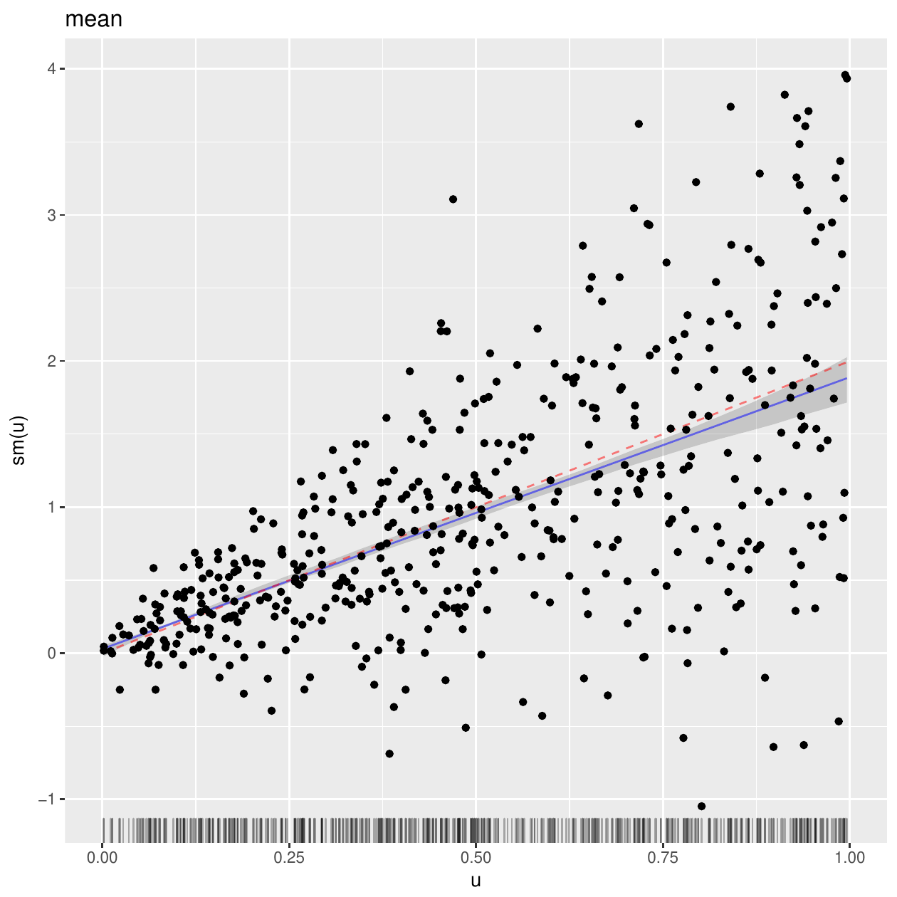</td>
<td style="text-align: center;">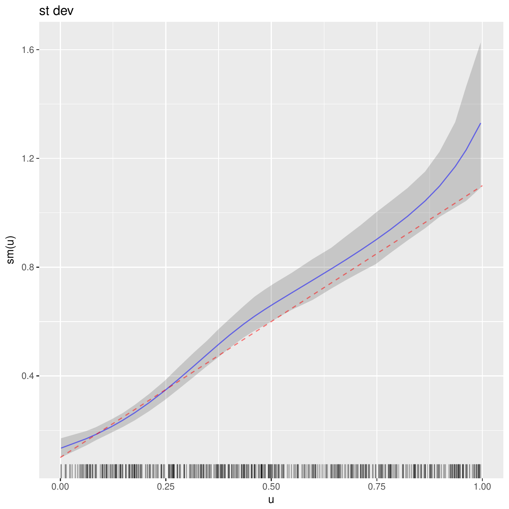</td>
</tr>
<tr class="even">
<td style="text-align: center;">(a)</td>
<td style="text-align: center;">(b)</td>
</tr>
<tr class="odd">
<td style="text-align: center;">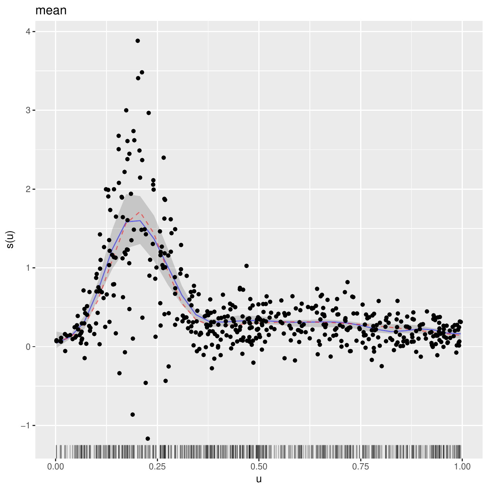</td>
<td style="text-align: center;">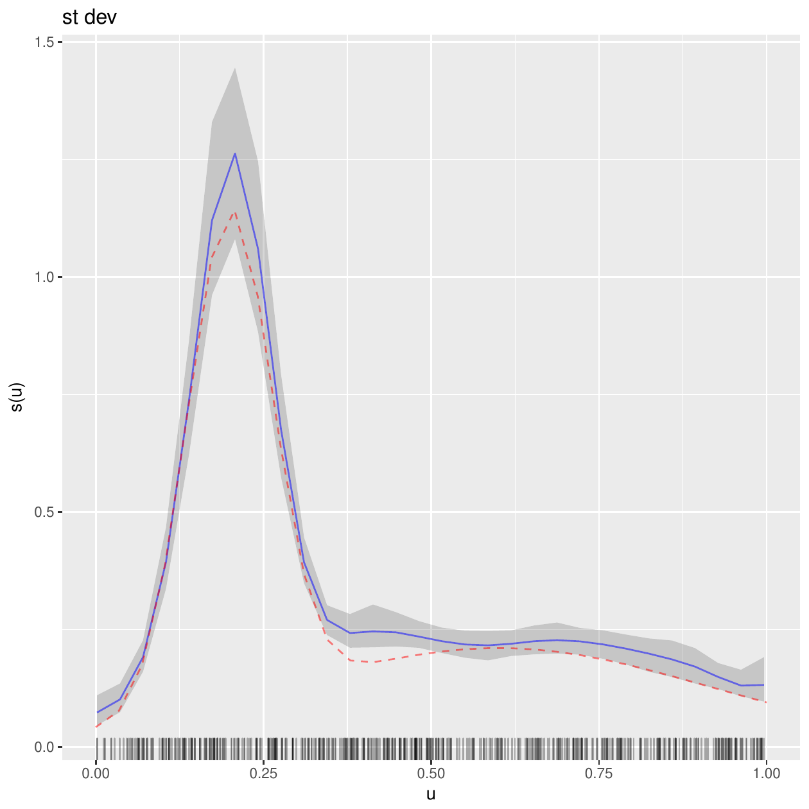</td>
</tr>
<tr class="even">
<td style="text-align: center;">(c)</td>
<td style="text-align: center;">(d)</td>
</tr>
</tbody>
</table>
<figcaption>Figure 2: Results from the single covariate simulated
examples. The column on the left-hand side displays the generated data
points and posterior means of the estimated effect along with <span
class="math inline">99%</span> CIs. The column on the right-hand side
displays the posterior mean of the estimated standard deviation function
along with <span class="math inline">90%</span> CIs. In all panels, the
truth is represented by dashed (red color) lines, the posterior means by
solid (blue color) lines, and the CIs by gray color.</figcaption>
</figure>

We use the second simulated dataset to show how the `s` constructor from
the package *mgcv* may be used. In our example, we use `s` to specify
the model:

``` r
> model <- y ~ s(u, k = 15, bs = "ps", absorb.cons=TRUE) |
+              s(u, k = 15, bs = "ps", absorb.cons=TRUE)
```

Function `BNSP::s` calls in turn `mgcv::s` and `mgcv::smoothCon`. All
options of the last two functions may be passed to `BNSP::s`. In the
example above we used options `k`, `bs`, and `absorb.cons`.

The remaining R code for the second simulated example is precisely the
same as the one for the first example, and hence omitted. Results are
shown in Figure [2](#sim1mv), panels (c) and (d).

We conclude the current section by describing the function
`predict.mvrm`. The function provides predictions and posterior credible
or prediction intervals for given feature vectors. The two types of
intervals differ in the associated level of uncertainty: prediction
intervals attempt to capture a future response and are usually much
wider than credible intervals that attempt to capture a mean response.

The following code shows how credible and prediction intervals can be
obtained for a sequence of covariate values stored in `x1`

``` r
> x1 <- seq(0, 1, length.out = 30)
> p1 <- predict(m1, newdata = data.frame(u = x1), interval = "credible")
> p2 <- predict(m1, newdata = data.frame(u = x1), interval = "prediction")
```

where the first argument in the `predict` method is a fitted `mvrm`
model, the second one is a data frame containing the feature vectors at
which predictions are to be obtained and the last one defines the type
of interval to be created. We applied the `predict` method to the two
simulated datasets. To each of those datasets we fitted two models: the
first one is the one we saw earlier, where both the mean and variance
are modeled in terms of covariates, while the second one ignores the
dependence of the variance on the covariate. The latter model is
specified in R using

``` r
> model <- y ~ sm(u, k = 20, bs = "rd") | 1
```

Results are displayed in Figure [3](#sim1pred). Each of the two figures
displays a credible interval and two prediction intervals. The figure
emphasizes a point that was discussed in the introductory section, that
modeling the variance in terms of covariates can result in more
realistic prediction intervals. The same point was recently discussed by
@Mayr12.

<figure id="sim1pred">
<table>
<caption> </caption>
<tbody>
<tr class="odd">
<td style="text-align: center;">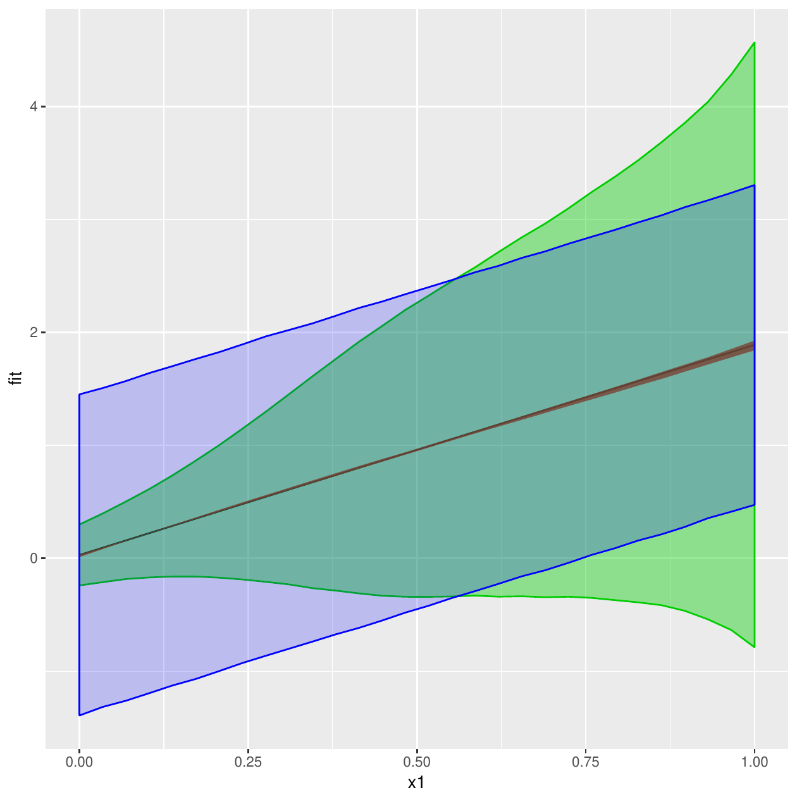</td>
<td style="text-align: center;">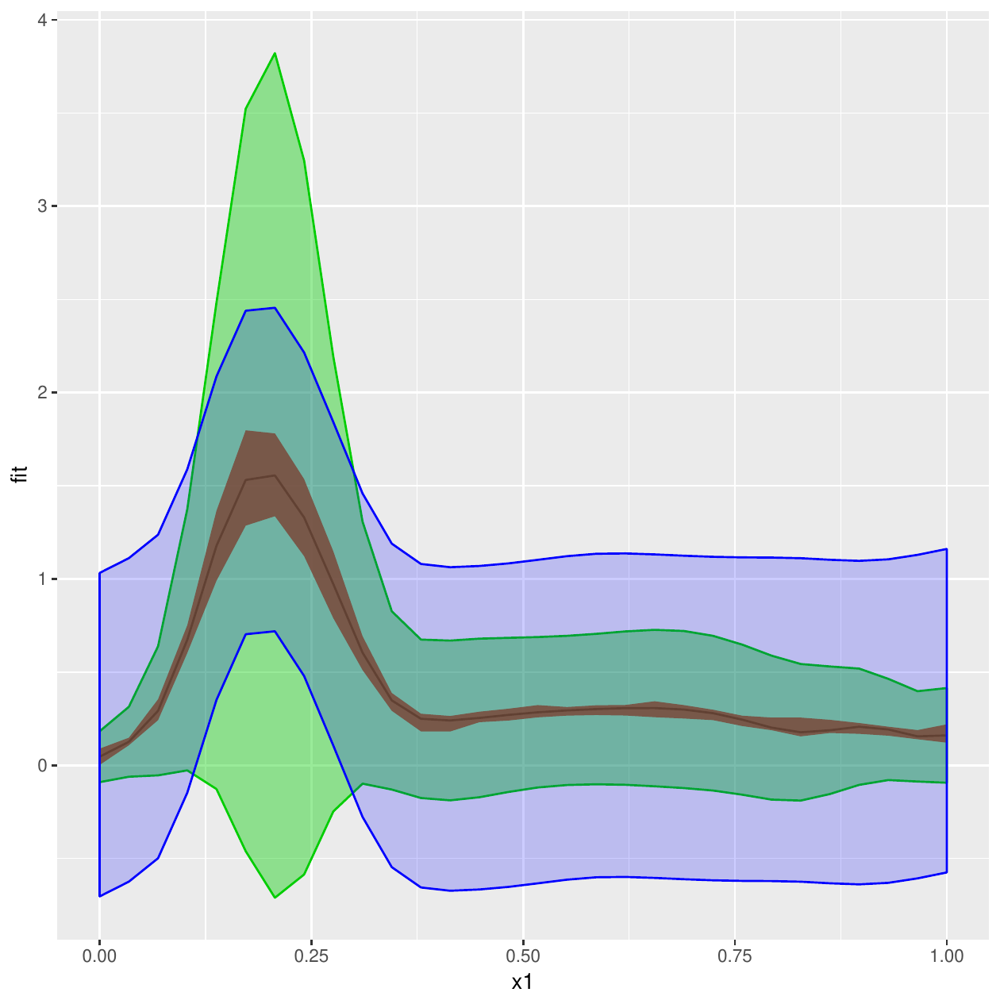</td>
</tr>
<tr class="even">
<td style="text-align: center;">(a)</td>
<td style="text-align: center;">(b)</td>
</tr>
</tbody>
</table>
<figcaption>Figure 3: Predictions results from the first two simulated
datasets. Each panel displays a credible interval and two prediction
intervals, one obtained using a model that recognizes the dependence of
the variance on the covariate and one that ignores it.</figcaption>
</figure>

### Bivariate covariate case

Interactions between two predictors can be modeled by appropriate
specification of either the built-in `sm` function or the smooth
constructors from *mgcv*. Function `sm` can take up to two covariates,
both of which may be continuous or one continuous and one discrete. Next
we consider an example that involves two continuous covariates. An
example involving a continuous and a discrete covariate is shown later
on, in the second application to a real dataset.

Let ${\mathbf{u}} =(u_1,u_2)^{\top}$ denote a bivariate predictor. The
data-generating mechanism that we consider is
$$\begin{aligned}
&& y({\mathbf{u}} ) \sim N\{\mu({\mathbf{u}} ),\sigma^2({\mathbf{u}} )\}, \nonumber\\
&& \mu({\mathbf{u}} ) = 0.1 + N\left({\mathbf{u}} , {\mathbf{\mu }}_1, {\mathbf{\Sigma }}_1 \right) + N\left({\mathbf{u}} , {\mathbf{\mu }}_2, {\mathbf{\Sigma }}_2\right), \nonumber\\
&& \sigma^2({\mathbf{u}} ) = 0.1 + \left\{N\left({\mathbf{u}} , {\mathbf{\mu }}_1, {\mathbf{\Sigma }}_1 \right) + N\left({\mathbf{u}} , {\mathbf{\mu }}_2, {\mathbf{\Sigma }}_2\right)\right\}/2, \nonumber\\
&& {\mathbf{\mu }}_1 = \begin{pmatrix} 0.25 \\ 0.75 \end{pmatrix},
{\mathbf{\Sigma }}_1 = \begin{pmatrix} 0.03 & 0.01 \\ 0.01 & 0.03 \end{pmatrix},
{\mathbf{\mu }}_2 = \begin{pmatrix} 0.65 \\ 0.35 \end{pmatrix},
{\mathbf{\Sigma }}_2 = \begin{pmatrix} 0.09 & 0.01 \\ 0.01 & 0.09 \end{pmatrix}.\nonumber
\end{aligned}$$
As before, $u_1$ and $u_2$ are obtained independently from uniform
distributions on the unit interval. Further, the sample size is set to
$n=500$.

In R, we simulate data from the above mechanism using

``` r
> mu1 <- matrix(c(0.25, 0.75))
> sigma1 <- matrix(c(0.03, 0.01, 0.01, 0.03), 2, 2)
> mu2 <- matrix(c(0.65, 0.35))
> sigma2 <- matrix(c(0.09, 0.01, 0.01, 0.09), 2, 2)
> mu <- function(x1, x2) {x <- cbind(x1, x2);
+       0.1 + dmvnorm(x, mu1, sigma1) + dmvnorm(x, mu2, sigma2)}
> Sigma <- function(x1, x2) {x <- cbind(x1, x2);
+          0.1 + (dmvnorm(x, mu1, sigma1) + dmvnorm(x, mu2, sigma2)) / 2}
> set.seed(1)
> n <- 500
> w1 <- runif(n)
> w2 <- runif(n)
> y <- vector()
> for (i in 1:n) y[i] <- rnorm(1, mean = mu(w1[i], w2[i]),
+                              sd = sqrt(Sigma(w1[i], w2[i])))
> data <- data.frame(y, w1, w2)
```

We fit a model with mean and variance functions specified as
$$\begin{aligned}
\mu({\mathbf{u}} ) = \beta_0 + \sum_{j_1=1}^{12} \sum_{j_2=1}^{12} \beta_{j_1,j_2} \phi_{1j_1,j_2}({\mathbf{u}} ), \quad
\log(\sigma^2({\mathbf{u}} )) = \alpha_0 + \sum_{j_1=1}^{12} \sum_{j_2=1}^{12} \alpha_{j_1,j_2} \phi_{2j_1,j_2}({\mathbf{u}} ). \nonumber\label{modelsim2}
\end{aligned}   (\#eq:modelsim2)$$
The R code that fits the above model is

``` r
> Model <- y ~ sm(w1, w2, k = 10, bs = "rd") | sm(w1, w2, k = 10, bs = "rd")
> m2 <- mvrm(formula = Model, data = data, sweeps = 10000, burn = 5000, thin = 2,
+            seed = 1, StorageDir = DIR)
```

As in the univariate case, convergence assessment and univariate
posterior summaries may be obtained by using function `mvrm2mcmc` in
conjunction with functions `plot.mcmc` and `summary.mcmc`. Further,
summaries of the `mvrm` fits may be obtained using functions
`print.mvrm` and `summary.mvrm`. Plots of the bivariate effects may be
obtained using function `plot.mvrm`. This is shown below, where argument
`plotOptions` utilizes the package
[*colorspace*](https://CRAN.R-project.org/package=colorspace) [@ZHM09].

``` r
> plot(x = m2, model = "mean", term = "sm(w1,w2)", static = TRUE,
+      plotOptions = list(col = diverge_hcl(n = 10)))
> plot(x = m2, model = "stdev", term = "sm(w1,w2)", static = TRUE,
+      plotOptions = list(col = diverge_hcl(n = 10)))
```

Results are shown in Figure [4](#sim2). For bivariate predictors,
function `plot.mvrm` calls function `ribbon3D` from the package
*plot3D*. Dynamic plots, viewable in a browser, can be created by
replacing the default `static=TRUE` by `static=FALSE`. When the latter
option is specified, function `plot.mvrm` calls the function
`scatterplot3js` from the package *threejs*. Users may pass their own
options to `plot.mvrm` via the `plotOptions` argument.

<figure id="sim2">
<table>
<caption> </caption>
<tbody>
<tr class="odd">
<td style="text-align: center;"></td>
<td style="text-align: center;">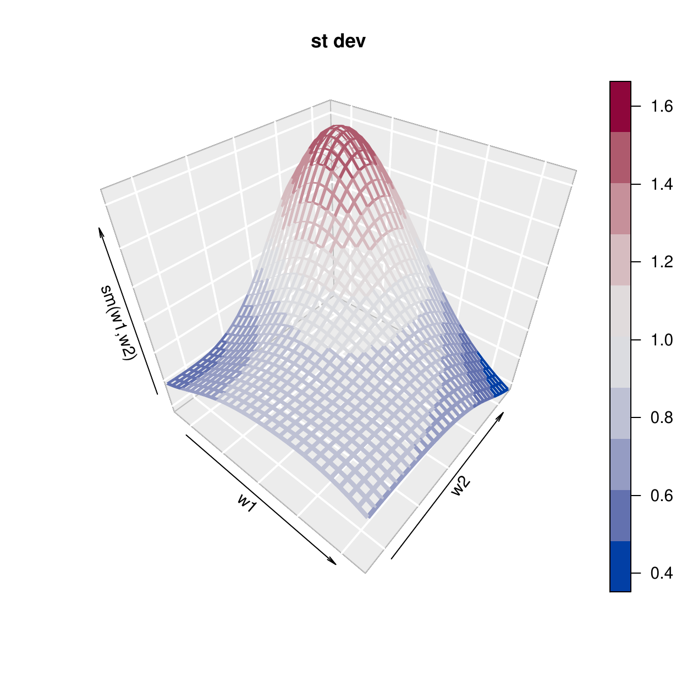</td>
</tr>
<tr class="even">
<td style="text-align: center;">(a)</td>
<td style="text-align: center;">(b)</td>
</tr>
</tbody>
</table>
<figcaption>Figure 4: Bivariate simulation study results with two
continuous covariates. Shown are posterior means of (a) the mean and (b)
the standard deviation function.</figcaption>
</figure>

### Multiple covariate case

We consider fitting general additive models for the mean and variance
functions in a simulated example with four independent continuous
covariates. In this scenario, we set $n=1000$. Further the covariates
${\mathbf{w}} =(w_1,w_2,w_3,w_4)^{\top}$ are simulated independently
from a uniform distribution on the unit interval. The data-generating
mechanism that we consider is
$$\begin{aligned}
&& Y({\mathbf{w}} ) \sim N(\mu({\mathbf{w}} ),\sigma^2({\mathbf{w}} )), \nonumber \\
&& \mu({\mathbf{w}} ) = \sum_{j=1}^4 \mu_j(w_j) \quad \text{and} \quad \sigma({\mathbf{w}} ) = \prod_{j=1}^4 \sigma_j(w_j), \nonumber
\end{aligned}$$
where functions $\mu_j, \sigma_j, j=1,\dots,4,$ are specified below:

1.  $\mu_1(w_1) = 1.5 w_1, \sigma_1(w_1)=\left\{N(w_1,\mu=0.2,\sigma^2=0.004)+N(w_1,\mu=0.6,\sigma^2=0.1)\right\}/2$,

2.  $\mu_2(w_2) = \left\{N(w_2,\mu=0.2,\sigma^2=0.004)+N(w_2,\mu=0.6,\sigma^2=0.1)\right\}/2,$\
    $\sigma_2(w_2)=0.6+0.5\sin(2 \pi w_2)$,

3.  $\mu_3(w_3) = 1+ \sin(2 \pi w_3), \sigma_3(w_3)=1.1-w_3$,

4.  $\mu_4(w_4) = -w_4, \sigma_4(w_4)=0.2+1.5w_4$.

To the generated dataset we fit a model with mean and variance functions
modeled as
$$\begin{aligned}
\mu({\mathbf{w}} ) = \beta_0 + \sum_{k=1}^{4} \sum_{j=1}^{16} \beta_{kj} \phi_{kj}(w_k) \quad \text{and} \quad
\log\{\sigma^2({\mathbf{w}} )\} = \alpha_0 + \sum_{k=1}^{4} \sum_{j=1}^{16} \alpha_{kj} \phi_{kj}(w_k). \nonumber\label{modelsim3}
\end{aligned}   (\#eq:modelsim3)$$
Fitting the above model to the simulated data is achieved by the
following R code

``` r
> Model <- y ~ sm(w1, k = 15, bs = "rd") + sm(w2, k = 15, bs = "rd") +
+              sm(w3, k = 15, bs = "rd") + sm(w4, k = 15, bs = "rd") |
+              sm(w1, k = 15, bs = "rd") + sm(w2, k = 15, bs = "rd") +
+              sm(w3, k = 15, bs = "rd") + sm(w4, k = 15, bs = "rd")
> m3 <- mvrm(formula = Model, data = data, sweeps = 50000, burn = 25000,
+            thin = 5, seed = 1, StorageDir = DIR)
```

By default the function `sm` utilizes the radial basis functions, hence
there is no need to specify `bs = "rd"`, as we did earlier, if radial
basis functions are preferred over thin plate splines. Further, we have
selected `k = 15` for all smooth functions. However, there is no
restriction to the number of knots and certainly one can select a
different number of knots for each smooth function.

As discussed previously, for each term that appears in the right-hand
side of the mean and variance functions, the model incorporates
indicator variables that specify which basis functions are to be
included and which are to be excluded from the model. For the current
example, the indicator variables are denoted by $\gamma_{kj}$ and
$\delta_{kj}, k=1,2,3,4,j=1,\dots,16$. The prior probabilities that
variables are included were specified in (\@ref(eq:gam-priors)) and they
are specific to each term,
$\pi_{\mu_k} \sim \text{Beta}(c_{\mu_k},d_{\mu_k}), \quad
\pi_{\sigma_k} \sim \text{Beta}(c_{\sigma_k},d_{\sigma_k}), k=1,2,3,4.$
The default option `pi.muPrior = "Beta(1,1)"` specifies that
$\pi_{\mu_k} \sim \text{Beta}(1,1),k=1,2,3,4.$ Further, by setting, for
example, `pi.muPrior = "Beta(2,1)"` we specify that
$\pi_{\mu_k} \sim \text{Beta}(2,1),k=1,2,3,4.$ To specify a different
Beta prior for each of the four terms, `pi.muPrior` will have to be
specified as a vector of length four, as an example,
`pi.muPrior = c("Beta(1,1)","Beta(2,1)","Beta(3,1)","Beta(4,1)")`.
Specification of the priors for $\pi_{\sigma_k}$ is done in a similar
way, via argument `pi.sigmaPrior`.

We conclude this section by presenting plots of the four terms in the
mean and variance models. The plots are presented in
Figure [5](#gamsim). We provide a few details on how the `plot` method
works in the presence of multiple terms, and how the comparison between
true and estimated effects is made. Starting with the mean function, to
create the relevant plots, that appear on the left panels of
Figure [5](#gamsim), the `plot` method considers only the part of the
mean function $\mu({\mathbf{u}} )$ that is related to the chosen `term`
while leaving all other terms out. For instance, in the code below we
choose `term = "sm(u1)"` and hence we plot the posterior mean and a
posterior credible interval for
$\sum_{j=1}^{16} \beta_{1j} \phi_{1j}(u_1)$, where the intercept
$\beta_0$ is left out by option `intercept = FALSE`. Further, comparison
is made with a centered version of the true curve, represented by the
dashed (red color) line and obtained by the first three lines of code
below.

``` r
> x1 <- seq(0, 1, length.out = 30)
> y1 <- mu1(x1)
> y1 <- y1 - mean(y1)
> PlotOptions <- list(geom_line(aes_string(x = x1, y = y1),
+                     col = 2, alpha = 0.5, lty = 2))
> plot(x = m3, model = "mean", term = "sm(w1)", plotOptions = PlotOptions,
+      intercept = FALSE, centreEffects = FALSE, quantiles = c(0.005, 1 - 0.005))
```

The plots of the four standard deviation terms are shown in the right
panels of Figure [5](#gamsim). Again, these are created by considering
only the part of the model for $\sigma({\mathbf{u}} )$ that is related
to the chosen `term`. For instance, below we choose `term = "sm(u1)"`.
Hence, in this case the plot will present the posterior mean and a
posterior credible interval for
$\exp\{\sum_{j=1}^{16} \alpha_{1j} \phi_{1j}(u_1)/2\}$, where the
intercept $\alpha_0$ is left out by option `intercept = FALSE`. Option
`centreEffects = TRUE` scales the posterior realizations of
$\exp\{\sum_{j=1}^{16} \alpha_{1j} \phi_{1j}(u_1)/2\}$ before plotting
them, where the scaling is done in such a way that the realized function
has mean one over the range of the predictor. Further, the comparison is
made with a scaled version of the true curve, where again the scaling is
done to achieve mean one. This is shown below and it is in the spirit of
@Chan06 who discuss the differences between the data generating
mechanism and the fitted model.

``` r
> y1 <- stdev1(x1) / mean(stdev1(x1))
> PlotOptions <- list(geom_line(aes_string(x = x1, y = y1),
+                     col = 2, alpha = 0.5, lty = 2))
> plot(x = m3, model = "stdev", term = "sm(w1)", plotOptions = PlotOptions,
+      intercept = FALSE, centreEffects = TRUE, quantiles = c(0.025, 1 - 0.025))
```

<figure id="gamsim">
<table>
<caption> </caption>
<tbody>
<tr class="odd">
<td style="text-align: center;">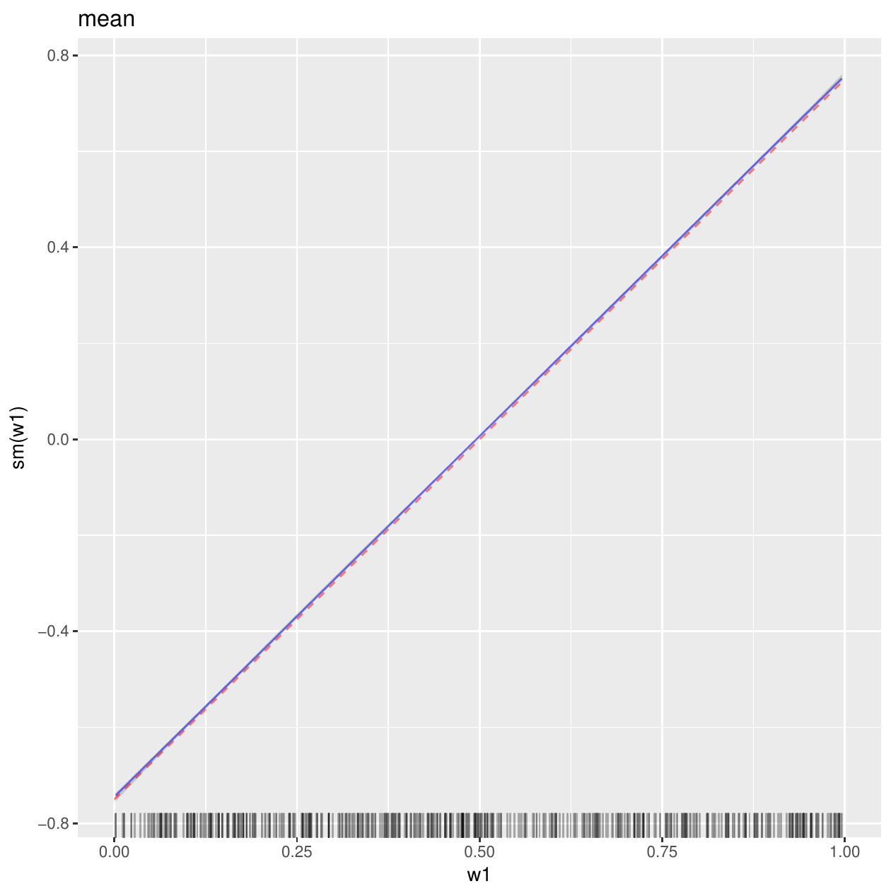</td>
<td style="text-align: center;">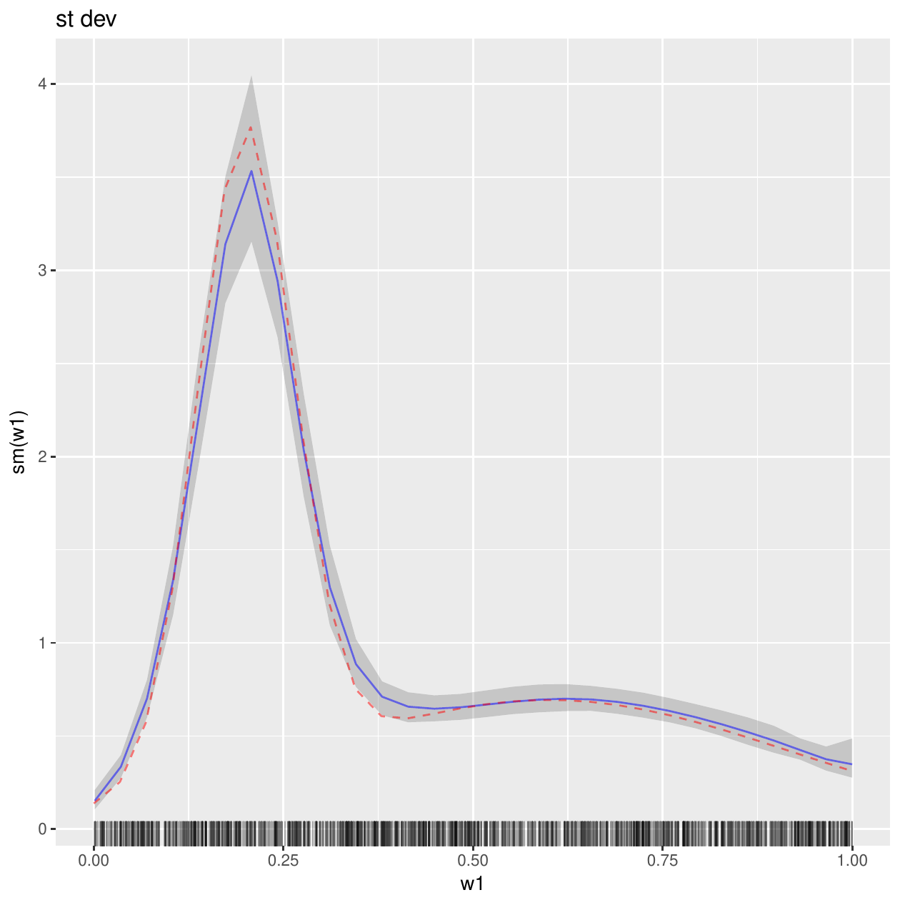</td>
</tr>
<tr class="even">
<td style="text-align: center;">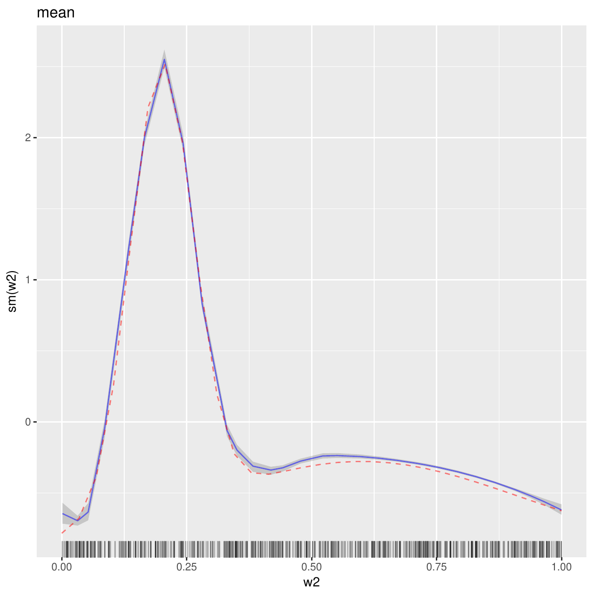</td>
<td style="text-align: center;">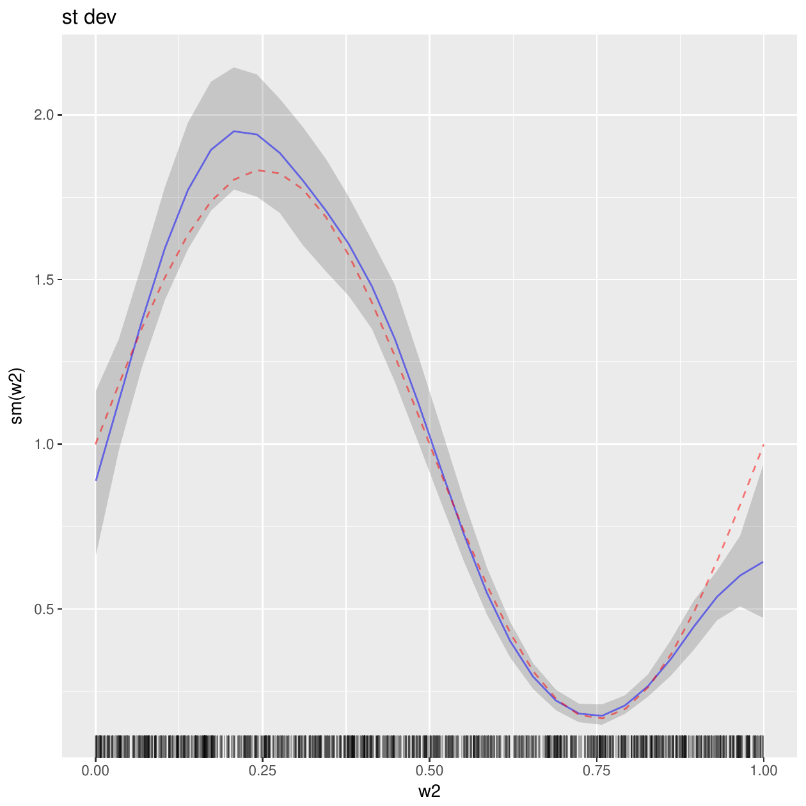</td>
</tr>
<tr class="odd">
<td style="text-align: center;">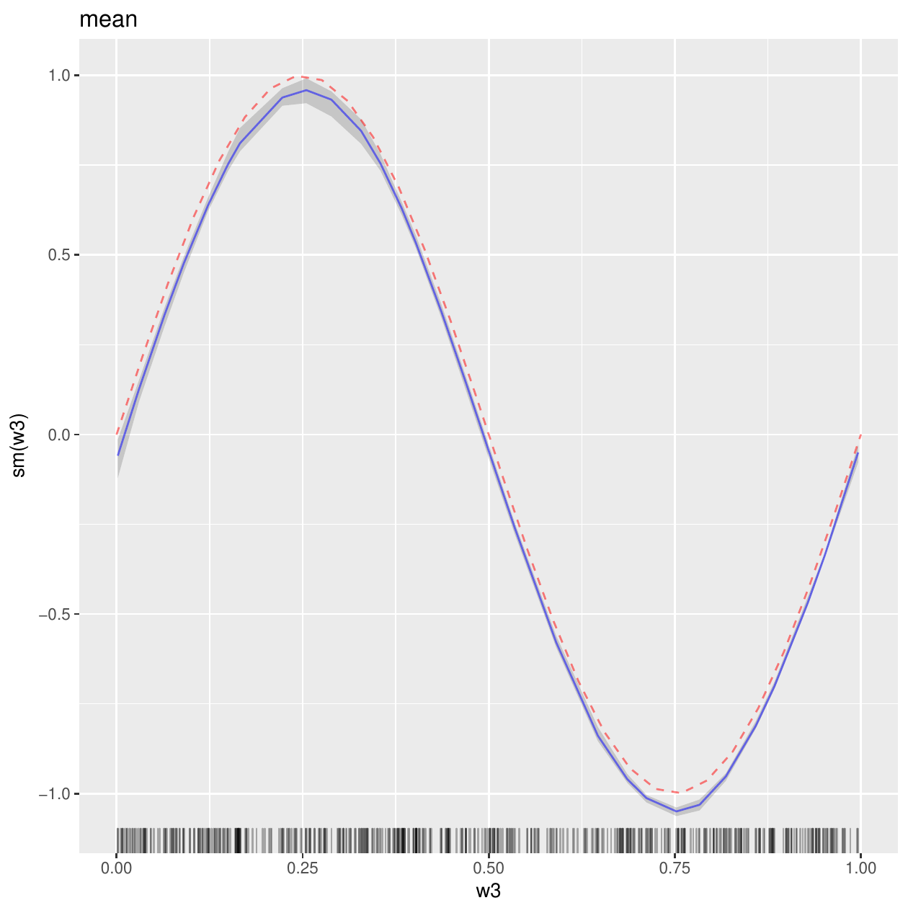</td>
<td style="text-align: center;">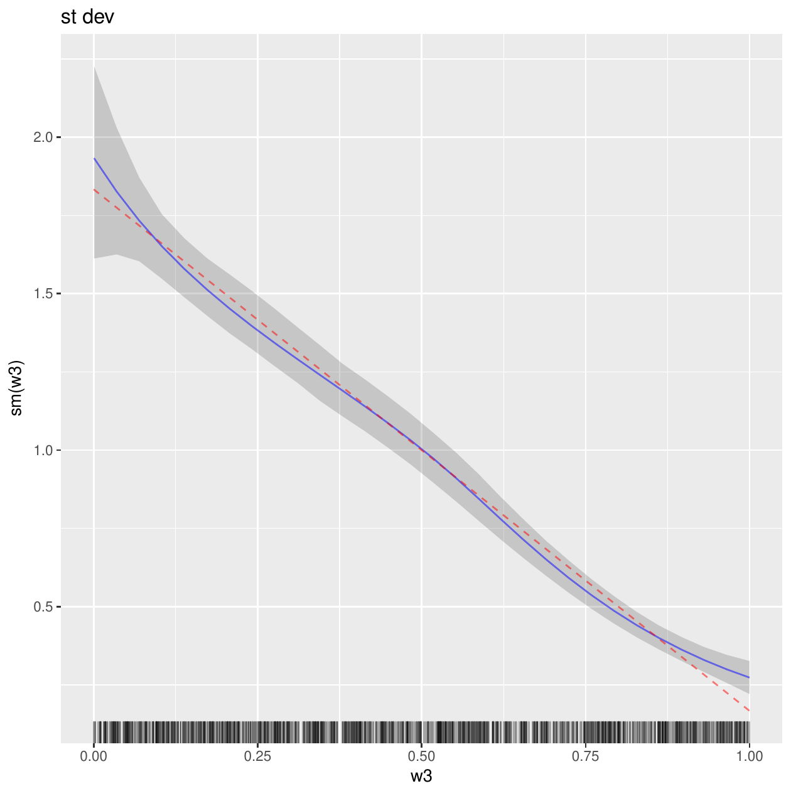</td>
</tr>
<tr class="even">
<td style="text-align: center;">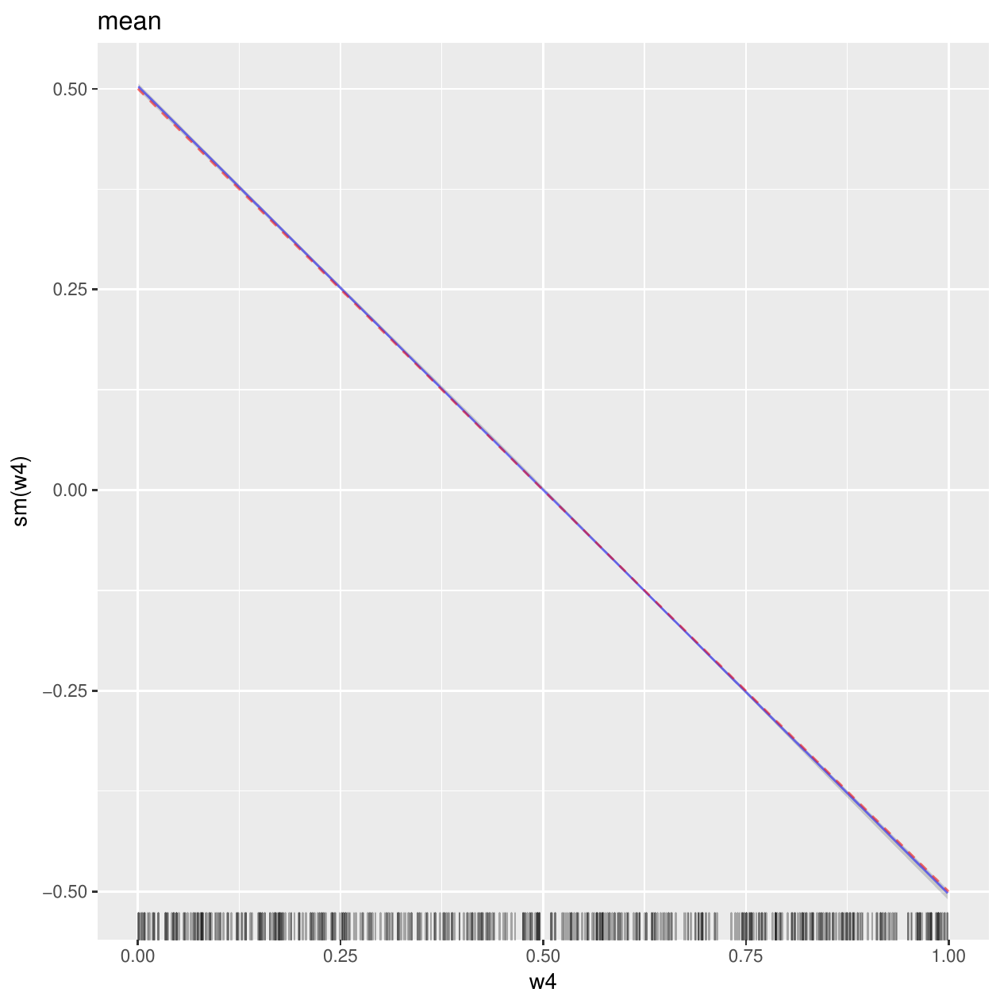</td>
<td style="text-align: center;">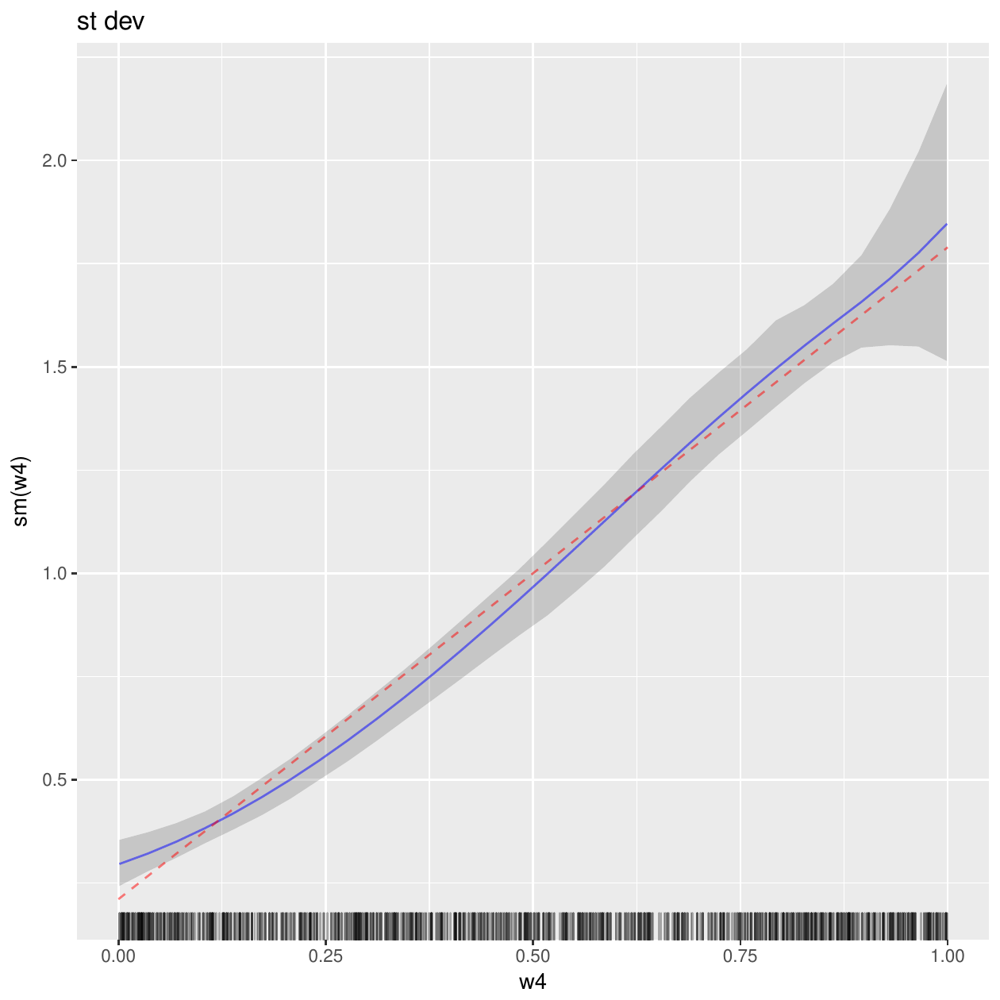</td>
</tr>
</tbody>
</table>
<figcaption>Figure 5: Multiple covariate simulation study results. The
column on the left-hand side presents the true and estimated mean
functions, along with <span class="math inline">99%</span> credible
intervals. The column on the right-hand side presents the true and
estimated standard deviation functions, along with <span
class="math inline">95%</span> credible intervals. In all panels, the
truth is represented by dashed (red color) lines, the estimated
functions by solid (blue color) lines, and the credible intervals by
gray color. </figcaption>
</figure>

## Data analyses

In this section we present four empirical applications.

### Wage and age

In the first empirical application, we analyse a dataset from @Pagan
that is available in the R package
[*np*](https://CRAN.R-project.org/package=np) [@np]. The dataset
consists of $n=205$ observations on dependent variable `logwage`, the
logarithm of the individual's wage, and covariate `age`, the
individual's age. The dataset comes from the 1971 Census of Canada
Public Use Sample Tapes and the sampling units it involves are males of
common education. Hence, the investigation of the relationship between
age and the logarithm of wage is carried out controlling for the two
potentially important covariates education and gender.

We utilize the following R code to specify flexible models for the mean
and variance functions, and to obtain $5,000$ posterior samples, after a
burn-in period of $25,000$ samples and a thinning period of $5$.

``` r
> data(cps71)
> DIR <- getwd()
> model <- logwage ~ sm(age, k = 30, bs = "rd") | sm(age, k = 30, bs = "rd")
> m4 <- mvrm(formula = model, data = cps71, sweeps = 50000,
+            burn = 25000, thin = 5, seed = 1, StorageDir = DIR)
```

After checking convergence, we use the following code to create the
plots that appear in Figure [6](#udaf1).

``` r
> wagePlotOptions <- list(geom_point(data = cps71, aes(x = age, y = logwage)))
> plot(x = m4, model = "mean", term = "sm(age)", plotOptions = wagePlotOptions)
> plot(x = m4, model = "stdev", term = "sm(age)")
```

Figure [6](#udaf1) (a) shows the posterior mean and an $80\%$ credible
interval for the mean function and it suggests a quadratic relationship
between `age` and `logwage`. Figure [6](#udaf1) (b) shows the posterior
mean and an $80\%$ credible interval for the standard deviation
function. It suggest a complex relationship between `age` and the
variability in `logwage`. The relationship suggested by
Figure [6](#udaf1) (b) is also suggested by the spread of the
data-points around the estimated mean in Figure [6](#udaf1) (a). At ages
around $20$ years the variability in `logwage` is high. It then reduces
until about age $30$, to start increasing again until about age $45$.
From age $45$ to $60$ it remains stable but high, while for ages above
$60$, Figure [6](#udaf1) (b) suggests further increase in the
variability, but the wide credible interval suggests high uncertainty
over this age range.

<figure id="udaf1">
<table>
<caption> </caption>
<tbody>
<tr class="odd">
<td style="text-align: center;">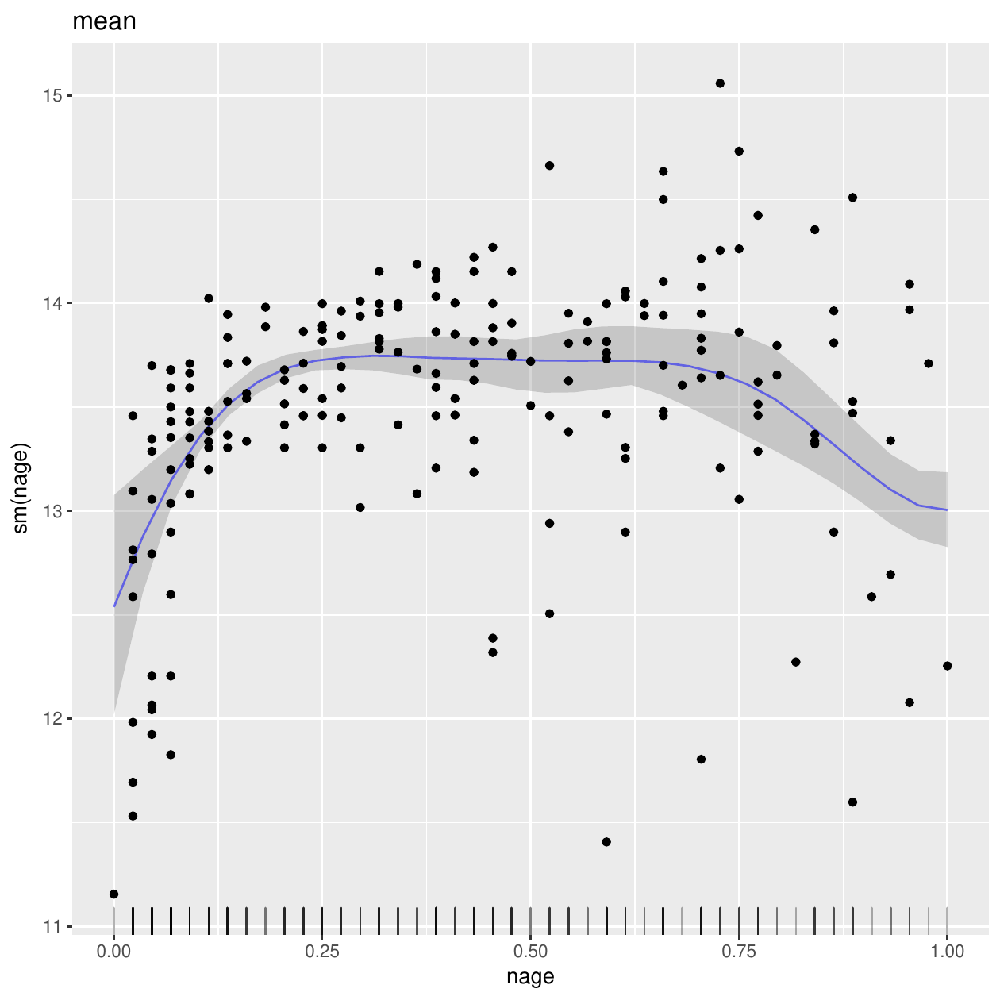</td>
<td style="text-align: center;">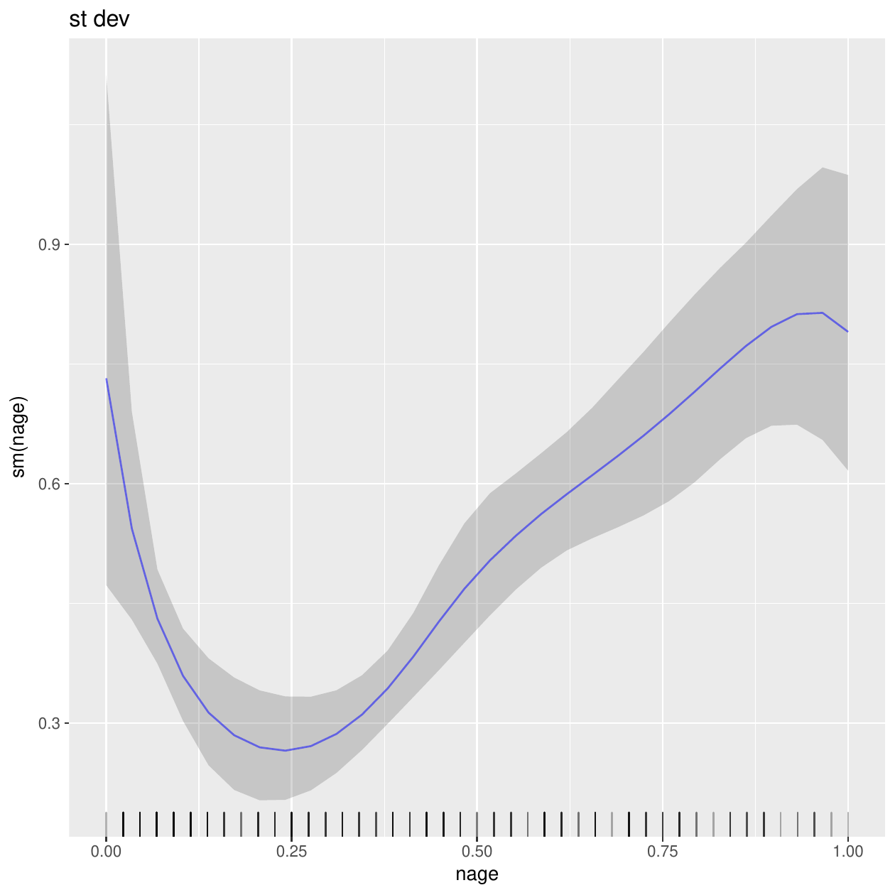</td>
</tr>
<tr class="even">
<td style="text-align: center;">(a)</td>
<td style="text-align: center;">(b)</td>
</tr>
</tbody>
</table>
<figcaption>Figure 6: Results from the data analysis on the relationship
between age and the logarithm of wage. Panel (a) shows the posterior
mean, an <span class="math inline">80%</span> credible interval of the
mean function, and the observed data-points. Panel (b) shows the
posterior mean and an <span class="math inline">80%</span> credible
interval of the standard deviation function.</figcaption>
</figure>

### Wage and multiple covariates

In the second empirical application, we analyse a dataset from
@Wooldridge that is also available in the R package *np*. The response
variable here is the logarithm of the individual's hourly wage (`lwage`)
while the covariates include the years of education (`educ`), the years
of experience (`exper`), the years with the current employer (`tenure`),
the individual's gender (named as `female` within the dataset, with
levels `Female` and `Male`), and marital status (named as `married` with
levels `Married` and `Notmarried`). The dataset consists of $n=526$
independent observations. We analyse the first three covariates as
continuous and the last two as discrete.

As the variance function is modeled in terms of an exponential, see
(\@ref(eq:mv2)), to avoid potential numerical problems, we transform the
three continuous variables to have range in the interval $[0,1]$, using

``` r
> data(wage1)
> wage1$ntenure <- wage1$tenure / max(wage1$tenure)
> wage1$nexper <- wage1$exper / max(wage1$exper)
> wage1$neduc <- wage1$educ / max(wage1$educ)
```

We choose to fit the following mean and variance models to the data
$$\begin{aligned}
&&\mu_i = \beta_0 + \beta_1 \;\texttt{married}_i+ f_1(\texttt{ntenure}_i) +
          f_2(\texttt{neduc}_i) + f_3(\texttt{nexper}_i,\texttt{female}_i), \nonumber\\
&&\log(\sigma^2_i) = \alpha_0 + f_4(\texttt{nexper}_i). \nonumber
\end{aligned}$$
We note that, as it turns out, an interaction between variables `nexper`
and `female` is not necessary for the current data analysis. However, we
choose to add this term in the mean model in order to illustrate how
interaction terms can be specified. We illustrate further options below.

``` r
> knots1 <- seq(min(wage1$nexper), max(wage1$nexper), length.out = 30)
> knots2 <- c(0, 1)
> knotsD <- expand.grid(knots1, knots2)
> model <- lwage ~ fmarried + sm(ntenure) + sm(neduc, knots=data.frame(knots =
+ seq(min(wage1$neduc), max(wage1$neduc), length.out = 15))) +
+ sm(nexper, ffemale, knots = knotsD) | sm(nexper, knots=data.frame(knots =
+ seq(min(wage1$nexper), max(wage1$nexper), length.out=15)))
```

The first three lines of the R code above specify the matrix of
(potential) knots to be used for representing
$f_3(\texttt{nexper,female})$. Knots may be left unspecified, in which
case the defaults in function `sm` will be used. Furthermore, in the
specification of the mean model we use `sm(ntenure)`. By this, we chose
to represent $f_1$ utilizing the default $10$ knots and the radial basis
functions. Further, the specification of $f_2$ in the mean model
illustrates how users can specify their own knots for univariate
functions. In the current example, we select $15$ knots uniformly spread
over the range of `neduc`. Fifteen knots are also used to represent
$f_4$ within the variance model.

The following code is used to obtain samples from the posteriors of the
model parameters.

``` r
> DIR <- getwd()
> m5 <- mvrm(formula = model, data = wage1, sweeps = 100000,
+            burn = 25000, thin = 5, seed = 1, StorageDir = DIR))
```

After summarizing results and checking convergence, we create plots of
posterior means, along with $95\%$ credible intervals, for functions
$f_1,\dots,f_4$. These are displayed in Figure [7](#da2). As it turns
out, variable `married` does not have an effect on the mean of `lwage`.
For this reason, we do not provide further results on the posterior of
the coefficient of covariate `married`, $\beta_1$. However, in the code
below we show how graphical summaries on $\beta_1$ can be obtained, if
needed.

``` r
> PlotOptionsT <- list(geom_point(data = wage1, aes(x = ntenure, y = lwage)))
> plot(x = m5, model = "mean", term="sm(ntenure)", quantiles = c(0.025, 0.975),
+      plotOptions = PlotOptionsT)
> PlotOptionsEdu <- list(geom_point(data = wage1, aes(x = neduc, y = lwage)))
> plot(x = m5, model = "mean", term = "sm(neduc)", quantiles = c(0.025, 0.975),
+      plotOptions = PlotOptionsEdu)
> pchs <- as.numeric(wage1$female)
> pchs[pchs == 1] <- 17; pchs[pchs == 2] <- 19
> cols <- as.numeric(wage1$female)
> cols[cols == 2] <- 3; cols[cols == 1] <- 2
> PlotOptionsE <- list(geom_point(data = wage1, aes(x = nexper, y = lwage),
+                      col = cols, pch = pchs, group = wage1$female))
> plot(x = m5, model = "mean", term="sm(nexper,female)", quantiles = c(0.025, 0.975),
+      plotOptions = PlotOptionsE)
> plot(x = m5, model = "stdev", term = "sm(nexper)", quantiles = c(0.025, 0.975))
> PlotOptionsF <- list(geom_boxplot(fill = 2, color = 1))
> plot(x = m5, model = "mean", term = "married", quantiles = c(0.025, 0.975),
+      plotOptions = PlotOptionsF)
```

<figure id="da2">
<table>
<caption> </caption>
<tbody>
<tr class="odd">
<td style="text-align: center;">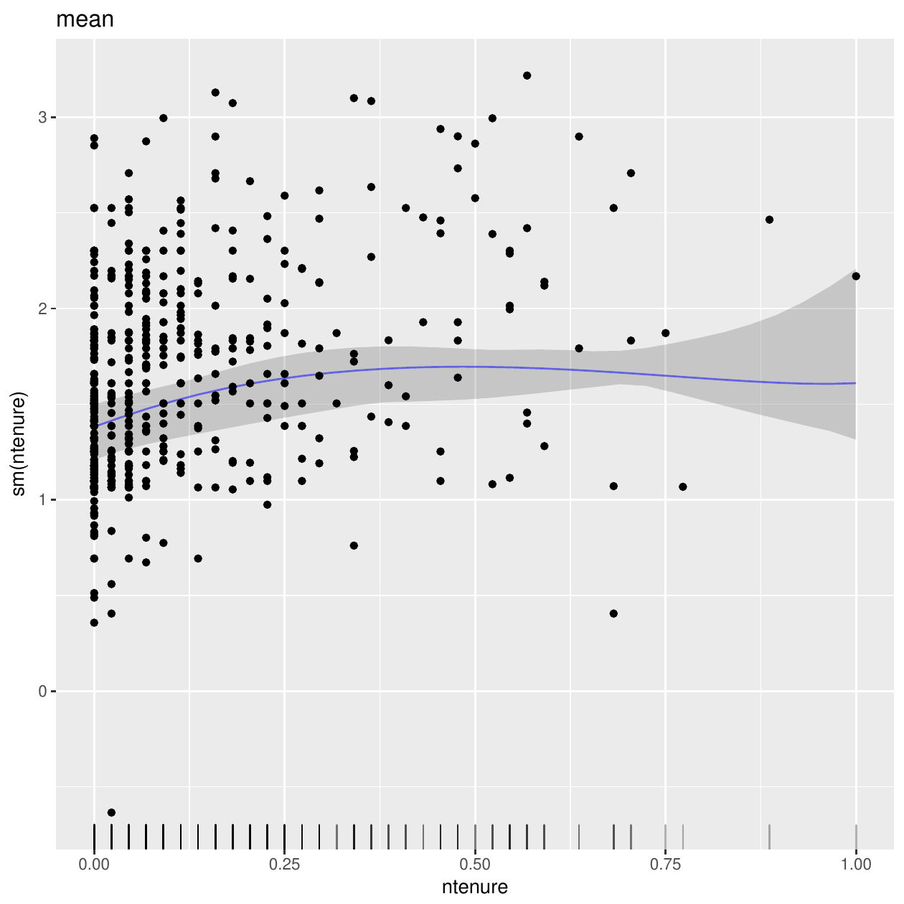</td>
<td style="text-align: center;">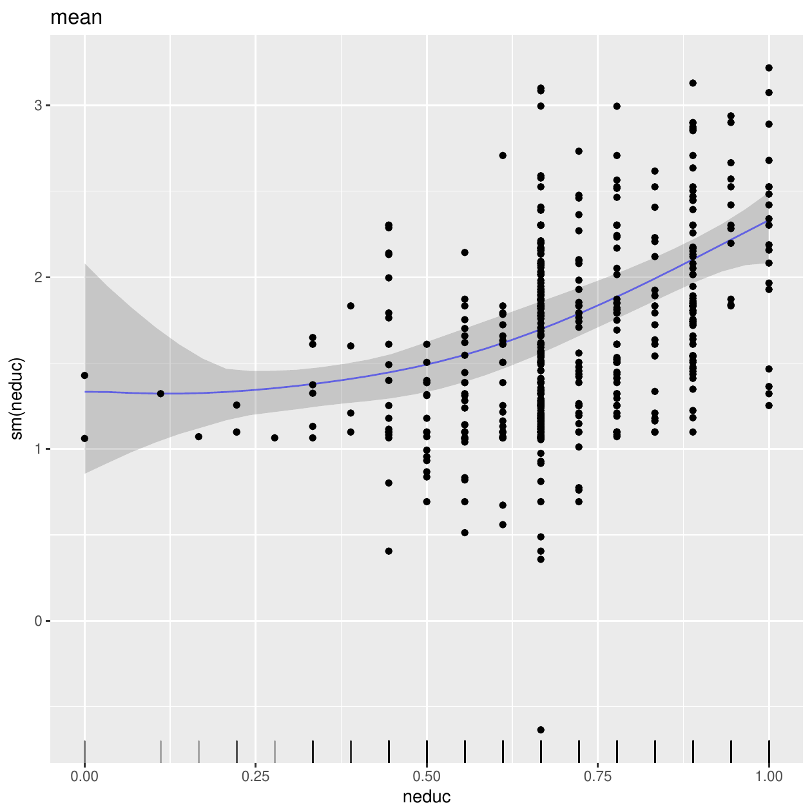</td>
</tr>
<tr class="even">
<td style="text-align: center;">(a)</td>
<td style="text-align: center;">(b)</td>
</tr>
<tr class="odd">
<td style="text-align: center;">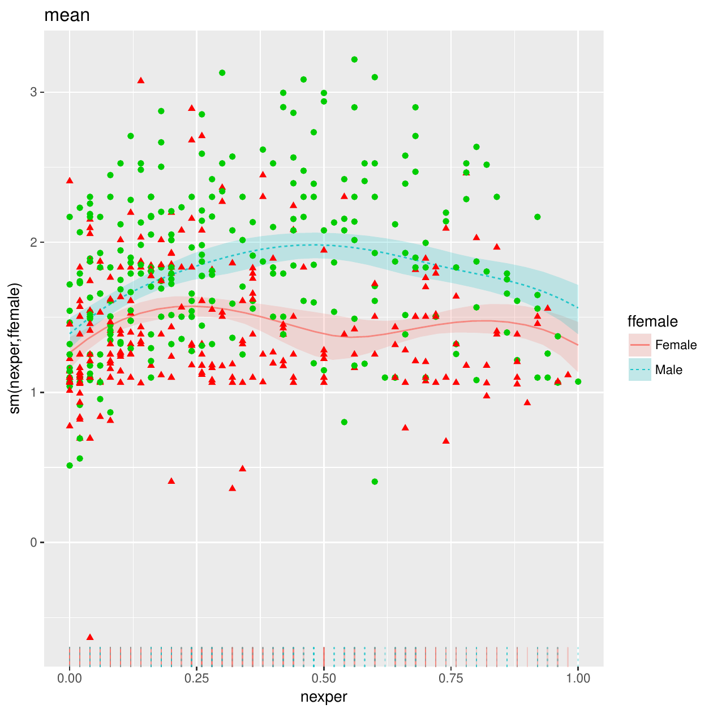</td>
<td style="text-align: center;">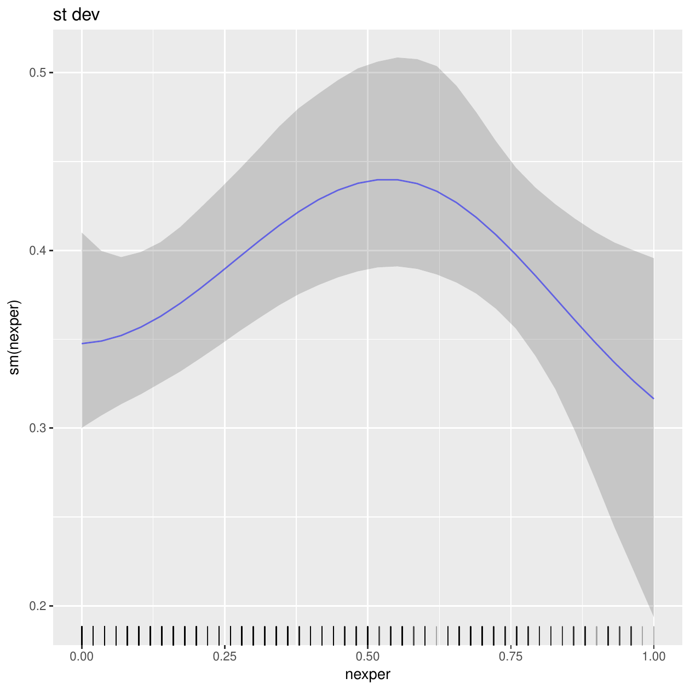</td>
</tr>
<tr class="even">
<td style="text-align: center;">(c)</td>
<td style="text-align: center;">(d)</td>
</tr>
</tbody>
</table>
<figcaption>Figure 7: Results from the data analysis on the relationship
between covariates gender, marital status, experience, education, and
tenure, and response variable logarithm of hourly wage. Posterior means
and <span class="math inline">95%</span> credible intervals for (a)
<span
class="math inline"><em>f</em><sub>1</sub>(<code>ntenure</code>)</span>,
(b) <span
class="math inline"><em>f</em><sub>2</sub>(<code>neduc</code>)</span>,
(c) <span
class="math inline"><em>f</em><sub>3</sub>(<code>nexper</code>,<code>female</code>)</span>,
and (d) the standard deviation function <span
class="math inline"><em>σ</em><sub><em>i</em></sub> = <em>σ</em>exp [<em>f</em><sub>4</sub>(<code>nexper</code>)/2]</span>.</figcaption>
</figure>

Figure [7](#da2), panels (a) and (b) show the posterior means and $95\%$
credible intervals for $f_1(\texttt{ntenure})$ and
$f_2(\texttt{neduc})$. It can be seen that expected wages increase with
tenure and education, although there is high uncertainty over a large
part of the range of both covariates. Panel (c) displays the posterior
mean and a $95\%$ credible interval for $f_3$. We can see that although
the forms of the two functions are similar, (i.e. the interaction term
is not needed), males have higher expected wages than females. Lastly,
panel (d) displays posterior summaries of the standard deviation
function, $\sigma_i = \sigma \exp(f_4/2)$. It can be seen that
variability first increases and then decreases as experience increases.

Lastly, we show how to obtain predictions and credible intervals for the
levels `"Married"` and `"Notmarried"` of variable `fmaried` and the
levels `"Female"` and `"Male"` of variable `fffemale`, with variables
`ntenure`, `nedc`, and `nexper` fixed at their mid-range.

``` r
> p1 <- predict(m5, newdata = data.frame(fmarried = rep(c("Married", "Notmarried"), 2),
+       ntenure = rep(0.5, 4), neduc = rep(0.5, 4), nexper = rep(0.5, 4),
+       ffemale = rep(c("Female", "Male"), each = 2)), interval = "credible")

> p1
       fit      lwr      upr
1 1.321802 1.119508 1.506574
2 1.320400 1.119000 1.505272
3 1.913341 1.794035 2.036255
4 1.911939 1.791578 2.034832
```

The predictions are suggestive of no "marriage" effect and of "gender"
effect.

### Brain activity

Here we analyse brain activity level data obtained by functional
magnetic resonance imaging. The dataset is available in package
[*gamair*](https://CRAN.R-project.org/package=gamair) [@gamSW] and it
was previously analysed by @Landou. We are interested in three of the
columns in the dataset. These are the response variable, `medFPQ`, which
is calculated as the median over three measurements of "Fundamental
Power Quotient" and the two covariates, `X` and `Y`, which show the
location of each voxel.

The following R code loads the relevant data frame, removes two outliers
and transforms the response variable, as was suggested by @gamSW. In
addition, it plots the brain activity data using function `levelplot`
from the package [*lattice*](https://CRAN.R-project.org/package=lattice)
[@lats].

``` r
> data(brain)
> brain <- brain[brain$medFPQ > 5e-5, ]
> brain$medFPQ <- (brain$medFPQ) ^ 0.25
> levelplot(medFPQ ~ Y * X, data = brain, xlab = "Y", ylab = "X",
+           col.regions = gray(10 : 100 / 100))
```

The plot of the observed data is shown in Figure [8](#brainact), panel
(a). Its distinctive feature is the noise level, which makes it
difficult to decipher any latent pattern. Hence, the goal of the current
data analysis is to obtain a smooth surface of brain activity level from
the noisy data. It was argued by @gamSW that for achieving this goal a
spatial error term is not needed in the model. Thus, we analyse the
brain activity level data using a model of the form
$$\begin{aligned}
\text{medFPQ}_i \stackrel{\text{ind}}{\sim} N(\mu_i,\sigma^2), \text{\;where\;}
\mu_i = \beta_0 + \sum_{j_1=1}^{10} \sum_{j_2=1}^{10} \beta_{j_1,j_2} \phi_{1j_1,j_2}(X_i,Y_i), i=1,\dots,n, \nonumber
\end{aligned}$$
where $n=1565$ is the number of voxels.

The R code that fits the above model is

``` r
> Model <- medFPQ ~ sm(Y, X, k = 10, bs = "rd") | 1
> m6 <- mvrm(formula = Model, data = brain, sweeps = 50000, burn = 20000, thin = 2,
+            seed = 1, StorageDir = DIR)
```

From the fitted model we obtain a smooth brain activity level surface
using function `predict`. The function estimates the average activity at
each voxel of the brain. Further, we plot the estimated surface using
function `levelplot`.

``` r
> p1 <- predict(m6)
> levelplot(p1[, 1] ~ Y * X, data = brain , xlab = "Y", ylab = "X",
+           col.regions = gray(10 : 100 / 100), contour = TRUE)
```

Results are shown in Figure [8](#brainact), panel(b). The smooth surface
makes it much easier to see and understand which parts of the brain have
higher activity.

<figure id="brainact">
<table>
<caption> </caption>
<tbody>
<tr class="odd">
<td style="text-align: center;">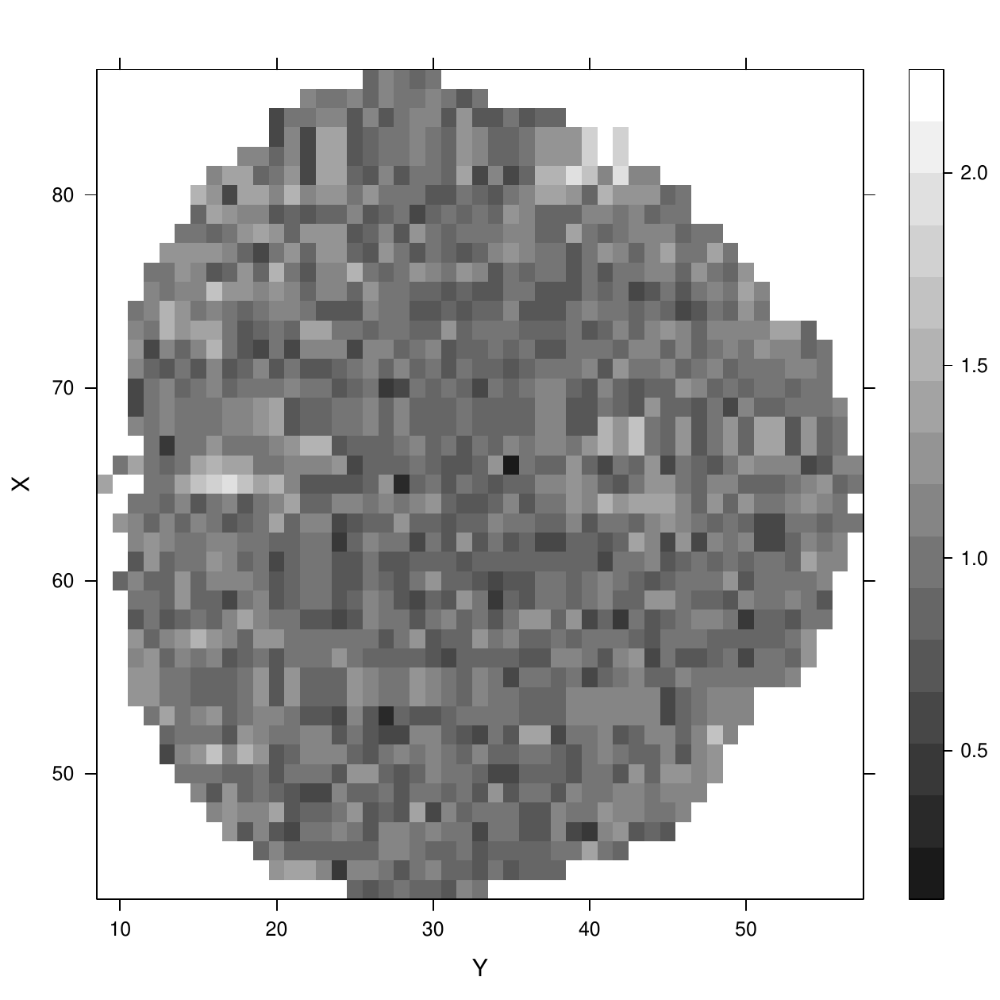</td>
<td style="text-align: center;">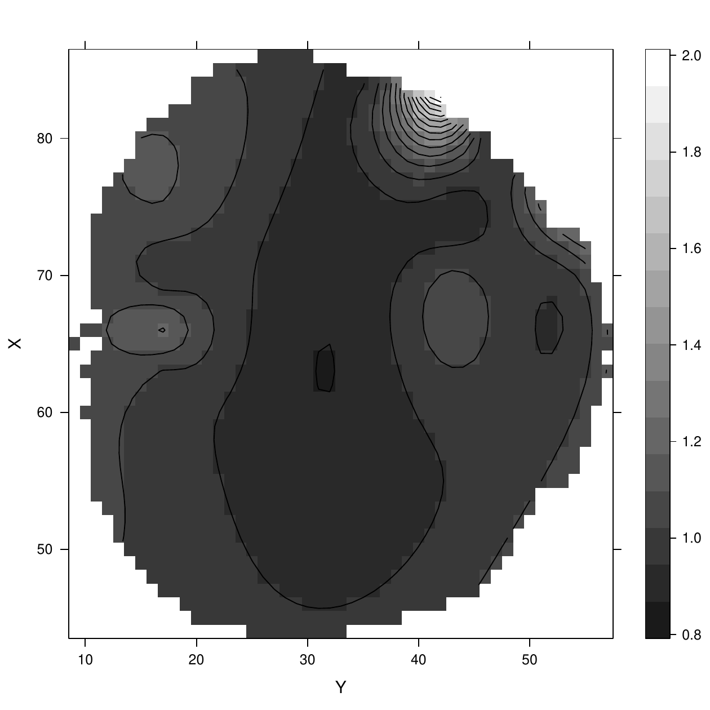</td>
</tr>
<tr class="even">
<td style="text-align: center;">(a)</td>
<td style="text-align: center;">(b)</td>
</tr>
</tbody>
</table>
<figcaption>Figure 8: Results from the brain activity level data
analysis. Panel (a) shows the observed data and panel (b) the
model-based smooth surface.</figcaption>
</figure>

### Cars

In the fourth and final application we use the function `mvrm` to
identify the best subset of predictors in a regression setting. Usually
stepwise model selection is performed, using functions `step` from base
R and `stepAIC` from the *MASS* package. Here we show how `mvrm` can be
used as an alternative to those two functions. The data frame that we
apply `mvrm` on is `mtcars`, where the response variable is `mpg` and
the explanatory variables that we consider are `disp`, `hp`, `wt`, and
`qsec`. The code below loads the data frame, specifies the model and
obtains samples from the posteriors of the model parameters.

``` r
> data(mtcars)
> Model <- mpg ~ disp + hp + wt + qsec | 1
> m7 <- mvrm(formula = Model, data = mtcars, sweeps = 50000, burn = 25000, thin = 2,
+            seed = 1, StorageDir = DIR)
```

The following is an excerpt of the output that the `summary` method
produces showing the three models with the highest posterior
probability.

``` r
> summary(m7, nModels = 3)

Joint mean/variance model posterior probabilities:
mean.disp mean.hp mean.wt mean.qsec freq  prob cumulative
1       0       1       1         0 1085 43.40      43.40
2       0       0       1         1 1040 41.60      85.00
3       0       0       1         0  128  5.12      90.12
Displaying 3 models of the 11 visited
3 models account for 90.12% of the posterior mass
```

The model with the highest posterior probability ($43.4\%$) is the one
that includes explanatory variables `hp` and `wt`. The model that
includes `wt` and `qsec` has almost equal posterior probability,
$41.6\%$. These two models account for $85\%$ of the posterior mass. The
third most promising model is the one that includes only `wt` as
predictor, but its posterior probability is much lower, $5.12\%$.

# Appendix: MCMC algorithm

In this section we present the technical details of how the MCMC
algorithm is designed for the case where there is a single covariate in
the mean and variance models. We first note that to improve mixing of
the sampler, we integrate out vector ${\mathbf{\beta }}$ from the
likelihood of ${\mathbf{y}}$, as was done by @Chan06:
$$\begin{aligned}
\label{marginal}
f({\mathbf{y}} |{\mathbf{\alpha }},c_{\beta},{\mathbf{\gamma }},{\mathbf{\delta }},\sigma^2) \propto
|\sigma^2 D^2({\mathbf{\alpha }}_{\delta})|^{-\frac{1}{2}} (c_{\beta}+1)^{-\frac{N(\gamma)+1}{2}} \exp(-S/2\sigma^2),
\end{aligned}   (\#eq:marginal)$$
where, with
$\tilde{\boldsymbol{y}}=  {\mathbf{D}} ^{-1}({\mathbf{\alpha }}_{\delta}) {\mathbf{y}}$,
we have
$S = S({\mathbf{y}} ,{\mathbf{\alpha }},c_{\beta},{\mathbf{\gamma }},{\mathbf{\delta }}) = \tilde{\boldsymbol{y}}^{\top} \tilde{\boldsymbol{y}}- \frac{c_{\beta}}{1+c_{\beta}}\tilde{\boldsymbol{y}}^{\top}\tilde{\boldsymbol{X}}_{\gamma}
(\tilde{\boldsymbol{X}}_{\gamma}^{\top}\tilde{\boldsymbol{X}}_{\gamma})^{-1}\tilde{\boldsymbol{X}}_{\gamma}^{\top}\tilde{\boldsymbol{y}}$.

The six steps of the MCMC sampler are as follows

1.  Similar to @Chan06, the elements of ${\mathbf{\gamma }}$ are updated
    in blocks of randomly chosen elements. The block size is chosen
    based on probabilities that can be supplied by the user or be left
    at their default values. Let ${\mathbf{\gamma }}_B$ be a block of
    random size of randomly chosen elements from ${\mathbf{\gamma }}$.
    The proposed value for ${\mathbf{\gamma }}_B$ is obtained from its
    prior with the remaining elements of ${\mathbf{\gamma }}$, denoted
    by ${\mathbf{\gamma }}_{B^C}$, kept at their current value. The
    proposal pmf is obtained from the Bernoulli prior with $\pi_{\mu}$
    integrated out
    $$\begin{aligned}
    p({\mathbf{\gamma }}_{B}|{\mathbf{\gamma }}_{B^C}) = \frac{p({\mathbf{\gamma }})}{p({\mathbf{\gamma }}_{B^C})}=
    \frac{\text{Beta}(c_{\mu}+N({\mathbf{\gamma }}),d_{\mu}+q_1-N({\mathbf{\gamma }}))}
    {\text{Beta}(c_{\mu}+N({\mathbf{\gamma }}_{B^C}),d_{\mu}+q_1-L({\mathbf{\gamma }}_{B})-N({\mathbf{\gamma }}_{B^C}))},\nonumber
    \end{aligned}$$
    where $L({\mathbf{\gamma }}_{B})$ denotes the length of
    ${\mathbf{\gamma }}_{B}$ (i.e., the size of the block). For this
    proposal pmf, the acceptance probability of the Metropolis-Hastings
    move reduces to the ratio of the likelihoods in (\@ref(eq:marginal))
    $$\begin{aligned}
    \min\left\{1,\frac{(c_{\beta}+1)^{-\frac{N({\mathbf{\gamma }}^P)+1}{2}} \exp(-S^P/2\sigma^2)}
    {(c_{\beta}+1)^{-\frac{N({\mathbf{\gamma }}^C)+1}{2}} \exp(-S^C/2\sigma^2)}\right\}, \nonumber
    \end{aligned}$$
    where superscripts $P$ and $C$ denote proposed and currents values
    respectively.

2.  Vectors ${\mathbf{\alpha }}$ and ${\mathbf{\delta }}$ are updated
    simultaneously. Similarly to the updating of ${\mathbf{\gamma }}$,
    the elements of ${\mathbf{\delta }}$ are updated in random order in
    blocks of random size. Let ${\mathbf{\delta }}_B$ denote a block.
    Blocks ${\mathbf{\delta }}_B$ and the whole vector
    ${\mathbf{\alpha }}$ are generated simultaneously. As was mentioned
    by @Chan06, generating the whole vector ${\mathbf{\alpha }}$,
    instead of subvector ${\mathbf{\alpha }}_B$, is necessary in order
    to make the proposed value of ${\mathbf{\alpha }}$ consistent with
    the proposed value of ${\mathbf{\delta }}$.

    Generating the proposed value for ${\mathbf{\delta }}_B$ is done in
    a similar way as was done for ${\mathbf{\gamma }}_B$ in the previous
    step. Let ${\mathbf{\delta }}^P$ denote the proposed value of
    ${\mathbf{\delta }}$. Next, we describe how the proposed vale for
    ${\mathbf{\alpha }}_{\delta^P}$ is obtained. The development is in
    the spirit of @Chan06 who built on the work of @Gamerman1997.

    Let
    $\hat{{\mathbf{\beta }}}_{\gamma}^C = \{c_{\beta}/(1+c_{\beta})\}(\tilde{\boldsymbol{X}}_{\gamma}^{\top} \tilde{\boldsymbol{X}}_{\gamma})^{-1}\tilde{\boldsymbol{X}}_{\gamma}^{\top} \tilde{\boldsymbol{y}}$
    denote the current value of the posterior mean of
    ${\mathbf{\beta }}_{\gamma}$. Define the current squared residuals
    $$e_{i}^C = (y_{i} - ({\mathbf{x}} ^*_{i \gamma})^{\top} \hat{{\mathbf{\beta }}}_{\gamma}^C)^2, \nonumber$$
    $i=1,\dots,n$. These will have an approximate $\sigma^2_i \chi^2_1$
    distribution, where
    $\sigma^2_i = \sigma^2 \exp({\mathbf{z}} _i^{\top} {\mathbf{\alpha }})$.
    The latter defines a Gamma generalized linear model (GLM) for the
    squared residuals with mean
    $E(\sigma^2_i \chi^2_1) = \sigma^2_i = \sigma^2 \exp({\mathbf{z}} _i^{\top} {\mathbf{\alpha }})$,
    which, utilizing a $\log$-link, can be thought of as Gamma GLM with
    an offset term:
    $\log(\sigma^2_i) = \log(\sigma^2) + {\mathbf{z}} _i^{\top} {\mathbf{\alpha }}$.
    Given the proposed value of ${\mathbf{\delta }}$, denoted by
    ${\mathbf{\delta }}^P$, the proposal density for
    ${\mathbf{\alpha }}^P_{\delta^P}$ is derived utilizing the one step
    iteratively re-weighted least squares algorithm. This proceeds as
    follows. First define the transformed observations
    $$\begin{aligned}
    d_{i}^C({\mathbf{\alpha }}^C) = \log(\sigma^2) + {\mathbf{z}} _i^{\top} {\mathbf{\alpha }}^C + \frac{e_{i}^C-(\sigma^2_i)^C}{(\sigma^2_i)^C},\nonumber
    \end{aligned}$$
    where superscript $C$ denotes current values. Further, let
    ${\mathbf{d}} ^C$ denote the vector of $d_{i}^C$.

    Next we define
    $$\begin{aligned}
    {\mathbf{\Delta }}({\mathbf{\delta }}^P) = (c_{\alpha}^{-1}{\mathbf{I}} + {\mathbf{Z}} _{\delta^P}^{\top}{\mathbf{Z}} _{\delta^P})^{-1}
    \text{\;and\;}
    \hat{\boldsymbol{\alpha}}({\mathbf{\delta }}^P,{\mathbf{\alpha }}^C) =  {\mathbf{\Delta }}_{\delta^P} {\mathbf{Z}} _{\delta^P}^{\top} {\mathbf{d}} ^C, \nonumber
    \end{aligned}$$
    where ${\mathbf{Z}}$ is the design matrix. The proposed value
    ${\mathbf{\alpha }}_{\delta^P}^P$ is obtained from a multivariate
    normal distribution with mean
    $\hat{\boldsymbol{\alpha}}({\mathbf{\delta }}^P,{\mathbf{\alpha }}^C)$
    and covariance $h{\mathbf{\Delta }}({\mathbf{\delta }}^P)$, denoted
    as
    $N({\mathbf{\alpha }}_{\delta^P}^P;\hat{\boldsymbol{\alpha}}({\mathbf{\delta }}^P,{\mathbf{\alpha }}^C),h{\mathbf{\Delta }}({\mathbf{\delta }}^P))$,
    where $h$ is a free parameter that we introduce and select its value
    adaptively [@roberts_examples_2009] in order to achieve an
    acceptance probability of $20\% - 25\%$ [@Roberts2001c].

    Let
    $N({\mathbf{\alpha }}_{\delta^C}^C;\hat{\boldsymbol{\alpha}}({\mathbf{\delta }}^C,{\mathbf{\alpha }}^P),h{\mathbf{\Delta }}({\mathbf{\delta }}^C))$
    denote the proposal density for taking a step in the reverse
    direction, from model ${\mathbf{\delta }}^P$ to
    ${\mathbf{\delta }}^C$. Then the acceptance probability of the pair
    $({\mathbf{\delta }}^P,{\mathbf{\alpha }}^P_{\delta^P})$ is the
    minimum between 1 and
    $$\begin{aligned}
    \frac{|D^2({\mathbf{\alpha }}^P_{\delta^P})|^{-\frac{1}{2}} \exp(-S^P/2\sigma^2)}
    {|D^2({\mathbf{\alpha }}^C_{\delta^C})|^{-\frac{1}{2}} \exp(-S^C/2\sigma^2)}
    \frac{
    (2\pi c_{\alpha})^{-\frac{N(\delta^P)}{2}}\exp(-\frac{1}{2c_{\alpha}} ({\mathbf{\alpha }}^P_{\delta^P})^{\top} {\mathbf{\alpha }}^P_{\delta^P})
    }{
    (2\pi c_{\alpha})^{-\frac{N(\delta^C)}{2}}\exp(-\frac{1}{2c_{\alpha}} ({\mathbf{\alpha }}^C_{\delta^C})^{\top} {\mathbf{\alpha }}^C_{\delta^C})
    }
    \frac{
    N({\mathbf{\alpha }}_{\delta^C}^C;\hat{\boldsymbol{\alpha}}_{\delta^C},h{\mathbf{\Delta }}_{\delta^C})
    }{
    N({\mathbf{\alpha }}_{\delta^P}^P;\hat{\boldsymbol{\alpha}}_{\delta^P},h{\mathbf{\Delta }}_{\delta^P})
    }.\nonumber
    \end{aligned}$$
    We note that the determinants that appear in the above ratio are
    equal to one when utilizing centred explanatory variables in the
    variance model and hence can be left out of the calculation of the
    acceptance probability.

3.  We update $\sigma^2$ utilizing the marginal (\@ref(eq:marginal)) and
    the two priors in (\@ref(eq:PriorParams2)). The full conditional
    corresponding to the IG$(a_{\sigma},b_{\sigma})$ prior is
    $$\begin{aligned}
    f(\sigma^2|\dots) \propto (\sigma^2)^{-\frac{n}{2}-a_{\sigma}-1} \exp\{-(S/2+b_{\sigma})/\sigma^2\}, \nonumber
    \end{aligned}$$
    which is recognized as another inverse gamma
    IG$(n/2+a_{\sigma},S/2+b_{\sigma})$ distribution.

    The full conditional corresponding to the normal prior
    $|\sigma| \sim N(0,\phi^2_{\sigma})$ is
    $$\begin{aligned}
    f(\sigma^2|\dots) \propto (\sigma^2)^{-\frac{n}{2}} \exp(-S/2\sigma^2) \exp(-\sigma^2/2\phi^2_{\sigma}). \nonumber
    \end{aligned}$$
    Proposed values are obtained from
    $\sigma^2_p \sim N(\sigma^2_c,f^2)$ where $\sigma^2_c$ denotes the
    current value. Proposed values are accepted with probability
    $f(\sigma^2_p|\dots)/f(\sigma^2_c|\dots)$. We treat $f^2$ as a
    tuning parameter and we select its value adaptively
    [@roberts_examples_2009] in order to achieve an acceptance
    probability of $20\% - 25\%$ [@Roberts2001c].

4.  Parameter $c_{\beta}$ is updated from the marginal
    (\@ref(eq:marginal)) and the IG$(a_{\beta},b_{\beta})$ prior
    $$\begin{aligned}
    f(c_{\beta}|\dots) \propto (c_{\beta}+1)^{-\frac{N(\gamma)+1}{2}} \exp(-S/2\sigma^2)
    (c_{\beta})^{-a_{\beta}-1} \exp(-b_{\beta}/c_{\beta}). \nonumber
    \end{aligned}$$
    To sample from the above, we utilize a normal approximation to it.
    Let $\ell(c_{\beta}) = \log\{f(c_{\beta}|\dots)\}$. We utilize a
    normal proposal density
    $N(\hat{c}_{\beta},-g^2/\ell^{''}(\hat c_{\beta})),$ where
    $\hat{c}_{\beta}$ is the mode of $\ell(c_{\beta})$, found using a
    Newton-Raphson algorithm, $\ell^{''}(\hat c_{\beta})$ is the second
    derivative of $\ell(c_{\beta})$ evaluated at the mode, and $g^2$ is
    a tuning variance parameter the value of which is chosen adaptively
    [@roberts_examples_2009]. At iteration $u+1$ the acceptance
    probability is the minimum between one and
    $$\frac{f(c_{\beta}^{(u+1)}|\dots)}{f(c_{\beta}^{(u)}|\dots)}
    \frac{N(c_{\beta}^{(u)};\hat{c}_{\beta},-g^2/\ell^{''}(\hat c_{\beta}))}
    {N(c_{\beta}^{(u+1)};\hat{c}_{\beta},-g^2/\ell^{''}(\hat c_{\beta}))}. \nonumber$$

5.  Parameter $c_{\alpha}$ is updated from the inverse Gamma density
    IG$(a_{\alpha}+N(\delta)/2,b_{\alpha}+{\mathbf{\alpha }}_{\delta}^{\top}{\mathbf{\alpha }}_{\delta}/2)$.

6.  The sampler utilizes the marginal in (\@ref(eq:marginal)) to improve
    mixing. However, if samples are required from the posterior of
    ${\mathbf{\beta }}$, they can be generated from
    $$\begin{aligned}
    {\mathbf{\beta }}_{\gamma} | \dots \sim N(\frac{c_{\beta}}{1+c_{\beta}}(\tilde{\boldsymbol{X}}_{\gamma}^{\top} \tilde{\boldsymbol{X}}_{\gamma})^{-1}\tilde{\boldsymbol{X}}_{\gamma}^{\top} \tilde{\boldsymbol{y}},
    \frac{\sigma^2 c_{\beta}}{1+c_{\beta}}(\tilde{\boldsymbol{X}}_{\gamma}^{\top} \tilde{\boldsymbol{X}}_{\gamma})^{-1}), \nonumber
    \end{aligned}$$
    where ${\mathbf{\beta }}_{\gamma}$ is the non-zero part of
    ${\mathbf{\beta }}$.

# Summary

We have presented a tutorial on several functions from the R package
*BNSP*. These functions are used for specifying, fitting and summarizing
results from regression models with Gaussian errors and with mean and
variance functions that can be modeled nonparametrically. Function `sm`
is utilized to specify smooth terms in the mean and variance functions
of the model. Function `mvrm` calls an MCMC algorithm that obtains
samples from the posteriors of the model parameters. Samples are
converted into an object of class `"mcmc"` by the function `mvrm2mcmc`
which facilitates the use of multiple functions from package *coda*.
Functions `print.mvrm` and `summary.mvrm` provide summaries of fitted
`"mvrm"` objects. Further, function `plot.mvrm` provides graphical
summaries of parametric and nonparametric terms that enter the mean or
variance function. Lastly, function `predict.mvrm` provides predictions
for a future response or a mean response along with the corresponding
prediction/credible intervals.
:::
