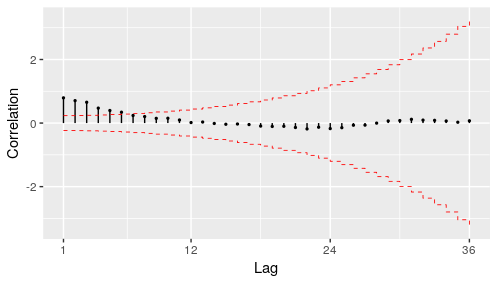
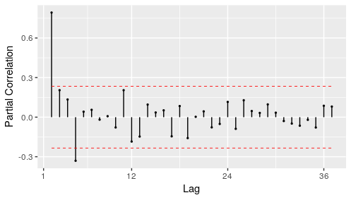
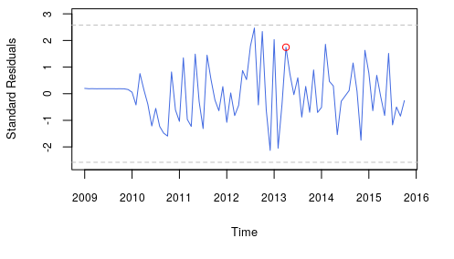
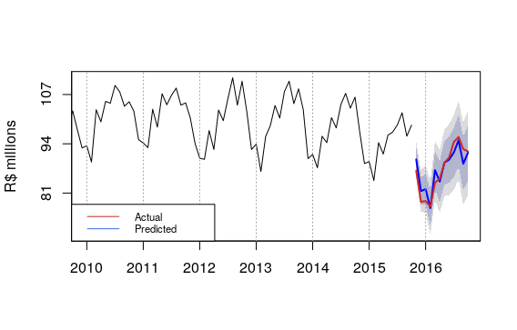

::: article
# Introduction

The [*BETS*](https://CRAN.R-project.org/package=BETS) [@BETS] package
(an abbreviation for Brazilian Economic Time Series) for R [@R] allows
easy access to the most important Brazilian economic time series and a
range of powerful tools for analyzing and visualizing not only these
data, but also external series. It provides a much-needed single access
point to the many Brazilian series through a simple, flexible and robust
interface. The package now contains more than 18,000 Brazilian economic
series and contains an integrated modelling and learning environment. In
addition, some functions include the option of generating explanatory
outputs that encourage and help users to expand their knowledge.

*BETS* relies on several well-established R packages. In order to work
with time series, *BETS* functions build upon packages such as
[*forecast*](https://CRAN.R-project.org/package=forecast) [@forecast],
[*mFilter*](https://CRAN.R-project.org/package=mFilter) [@mFilter],
[*urca*](https://CRAN.R-project.org/package=urca) [@urca] and
[*seasonal*](https://CRAN.R-project.org/package=seasonal) [@seasonal].
Access to external APIs to obtain data is handled by the web scraping
and HTTP tools available through the
[*httr*](https://CRAN.R-project.org/package=httr) [@httr] and
[*rvest*](https://CRAN.R-project.org/package=rvest) [@rvest] packages,
whereas *BETS* own databases are queried using the package
[*RMySQL*](https://CRAN.R-project.org/package=RMySQL) [@RMySQL].

This article seeks to demonstrate many of these features through a
practical case. We create a SARIMA model [@boxjenkins] for the Brazilian
production of intermediate goods index (BPIGI) series, step by step,
using mostly functions from *BETS*. Then, we show that *BETS* is capable
of using [*rmarkdown*](https://CRAN.R-project.org/package=rmarkdown)
[@rmarkdown] to generate a fully automated report that includes a
virtually identical SARIMA analysis. The report needs few inputs, runs
for any given time series and has the advantage of outputting several
informative comments, explaining to the user how and why it achieved the
given results. The outputs, of course, vary according to the inputs.
Reports provide a link to a file containing the series under analysis
and the predictions calculated by the automated model.

Automated reports can also produce GRNN[^1] and exponential smoothing
models, but here we focus on the previously specified methodology[^2].
In the next section, we briefly present the SARIMA approach and show how
to use *BETS* functions to conduct such an analysis in a typical case:
predicting the future levels of the BPIGI. Then, in Section 3, we
introduce the automated model reports and illustrate its capabilities by
applying it to the series under study using a range of other inputs.
Section 4 concludes this article.

# SARIMA Analysis: A Case Study {#casestudy}

In this section we develop a case study in which we use a handful of
*BETS* functions to model and forecast values of the Brazilian
production of intemediate goods index, following the SARIMA (Box &
Jenkins) approach. Before starting the analysis we will briefly look at
the methodology to be used. For a more comprehensive treatment of the
topic, see [@boxjenkins] and [@ferreira][^3].

## Box & Jenkins Methodology {#metodologia}

The Box & Jenkins methodology allows the prediction of future values of
a series based only on past and present values of the same series. These
univariate models are known as SARIMA, an abbreviation for Seasonal
Autoregressive Integrated Moving Average, and have the following form:

$$\Phi_{P}(B)\phi_{p}(B)\nabla^{d}\nabla^{D}Z_t = \Theta_{Q}(B)\theta_{q}(B)a_t,$$

where

-   $B$ is the lag operator, i.e., for all $t > 1$, $BZ_t = Z_{t-1}$

-   $P$, $Q$, $p$ and $q$ are the orders of the polynomials

-   $\Phi_{P}(B)$ is the seasonal autoregressive polynomial

-   $\phi_{p}(B)$ is the autoregressive polynomial

-   $\nabla^{d} = (1-B)^{d}$ is the difference operator and $d$ is the
    number of unit roots

-   $\nabla^{D} = (1-B^{s})^{D}$ is the difference operator at the
    seasonal frequency $s$ and $D$ is the number of seasonal unit roots

-   $Z_t$ is the series being studied

-   $\Theta_{Q}(B)$ is the seasonal moving average polynomial

-   $\theta_{q}(B)$ is the moving average polynomial

-   $a_t$ is the random error.

In its original form, which will be used here, the Box & Jenkins
methodology consists of three iterative stages:

1.  Identification and selection of the models: the series is checked
    for stationarity and the appropriate corrections are made for
    non-stationary cases, by differencing the series `d` times in its
    own frequency and `D` times in the seasonal frequency. The orders of
    the polynomials $\phi$, $\Phi$, $\theta$, and $\Theta$ are
    identified using the autocorrelation function (ACF) and partial
    autocorrelation function (PACF) of the series.

2.  Estimation of the model's parameters using maximum likelihood or
    dynamic regression.

3.  Confirmation of model compliance using statistical tests.

The ACF, used in stage (i), can be defined as the correlation of a
series with a lagged copy of itself as a function of lags. Formally, we
can write the ACF of a time series $s$ with realizations $s_i$ for
$i \in [1,N]$ and mean $\bar{s}$ as

$$ACF(s,l) = \frac{\sum_{i=1}^{N-l} (s_i - \bar{s})(s_{i+l} - \bar{s})}{\sum_{i=1}^{N} (s_i - \bar{s})^2}.$$

Another tool for phase (i), the PACF also gives the correlation of a
series with its own lagged values, but controlling for all lower lags.
Let $P_{t,l}(x)$ denote the projection of $x_t$ onto the space spanned
by $x_{t+1},\dots, x_{t+l-1}$. We can define the PACF as

$$PACF(s,l) = \begin{cases}
    & Cor(s_i, s_{i+1}) \text{ if } l = 1, \\
    & Cor(s_{t+l} - P_{t,l}(s_{t+l}) \text{, ... ,} s_t - P_{t,l}(s_t)) \text{ if } l \geq 1.
  \end{cases}$$

The PACF is used to find `p` (the lag beyond which the PACF becomes zero
is the indicated number of autoregressive terms), while the ACF is used
to find `q` (the cut in the ACF points to the number of moving average
terms). Seasonal polynomial orders, `P` and `Q`, are identified in a
similar fashion, but by inspecting high values at fixed intervals. In
this case, the intervals become the orders.

If the model does not pass phase (iii), the procedure starts again at
step (i). Otherwise, the model is ready to be used to make forecasts. In
the next section we will look at each of these stages in more detail and
say more about the methodology as we go through the case study.

## Some preliminary topics {#prevs.sarima}

The first step is to find the series in the *BETS* database. This can be
done with the `BETSsearch()` function. It performs flexible searches on
the metadata table that stores series characteristics. Since metadata is
accessed through SQL queries, searchers are fast and the package
performs well in any environment. `BETSsearch()` is a crucial feature of
*BETS*, so we provide a thorough description in this section.

Accepted parameters, expected data types, and definitions are the
following:

-   `description` - A `character`. A search *string* to look for
    matching series descriptions.

-   `src` - A `character`. The source of the data.

-   `periodicity` - A `character`. The frequency with which the series
    is observed.

-   `unit` - A `character`. The unit in which the data were measured.

-   `code` - An `integer`. The unique code for the series in the *BETS*
    database.

-   `view` - A `boolean`. By default, `TRUE`. If `FALSE`, the results
    will be shown directly on the R console.

-   `lang` - A `character`. Search language. By default, 'pt', for
    Portuguese. A search can also be performed in English by changing
    the value to 'en'.

To refine the search, there are syntax rules for the parameter
`description`:

-   To look for alternative words, separate them by blank spaces.
    Example: `description = ’core ipca’` means that the description of
    the series should contain the words *core* **and** *ipca*.

-   To search for complete expressions, put them inside single quotes ('
    '). Example: `description = "index and ’core ipca’"` means that the
    description of the series should contain the expression *core ipca*
    **and** the word *index*.

-   To exclude words from the search, insert a $\sim$ before each word.
    Example: `description = "ipca `$\sim$` core"` means that the
    description of the series should contain the word *ipca* and should
    **not** contain the word *core*.

-   To exclude a whole expression from a search, place them inside
    single quotes (' ') and insert a $\sim$ before each of them.
    Example: `description = "index `$\sim$` ’core ipca’"` means that the
    description of the series should contain *index* and should **not**
    contain *core ipca*.

-   It is possible to search for or exclude certain words as long as
    these rules are obeyed.

-   No blank space is required after the exclusion sign ($\sim$), but it
    is required after each expression or word.

Finally, the command to find information about the series, which we will
use throughout this article, is shown below, along with the
corresponding output.

``` r
# Searching for the production of intermediate goods index series
# excluding the term 'imports' from the search

results <- BETSsearch(description = "'intermediate goods' ~ imports", view = F, lang = "en")
results
```

``` r
#> # A tibble: 3 x 7
#>   code  description      unit  periodicity start
#>   <chr> <chr>            <chr> <chr>       <chr>
#> 1 11068 Intermediate go? Index M           31/0?
#> 2 1334  Production indi? Index M           31/0?
#> 3 21864 Physical Produc? Index M           01/0?
#> # ... with 2 more variables: last_value <chr>,
#>   source <chr>
```

The series we are looking for is the third (code 21864). We now load it
using the function `BETSget()` and store some values for later
comparison with the model's forecasts. We will also produce a graph
(Figure [1](#fig:chart)) to help formulate hypotheses about the behavior
of the underlying stochastic process. The professional looking chart is
created with `chart()`, which has the nice property of displaying useful
information about the series, such as the last value and
monthly/interannual variations.

``` r
# Get the series with code 21864 (BPIGI, IBGE)
data <- BETSget(21864)

# Keep last values for comparison with the forecasts
data_test <- window(data, start = c(2015,11), end = c(2016,4), frequency = 12)
data <- window(data, start = c(2002,1), end = c(2015,10), frequency = 12)

# Graph of the series
params <- list(
    title = "Intermediate Goods Production",
    subtitle = "Index",
    colors = "royalblue")
chart(ts = data, style = "normal", open = T, params = params, file = "igp.png")
```

{#fig:chart width="100%"
alt="graphic without alt text"}

Four characteristics can be observed. First, the series is
homoskedastic, with monthly seasonality. A further striking feature is
the structural break in November 2008, when the international financial
crisis occurred and investor confidence plummeted. This break had a
direct impact on the next important characteristic of the series, the
trend, which was initially clearly one of growth, albeit not at
explosive rates. From November 2008 onward, however, production appeared
to remain unchanged or even to fall. Since the main goal of this article
is to present *BETS*' features, rather than performing an overcautious
time series analysis, we decided to work with fewer observations, thus
avoiding problems with the structural break. Only the values from
January 2009 on were used. This did not imply poorer results. In fact,
discarding older values yields better predictions, at least within the
SARIMA framework.

``` r
data <- window(data, start = c(2009,1), end = c(2015,10), frequency = 12)
```

In the following sections we create a model for the chosen series
following the previously defined modelling steps.

## I. Identification

### Stationarity Tests

This subsection covers a crucial step in the Box & Jenkins approach:
checking if there are unit roots in the seasonal and non-seasonal
autoregressive model polynomials and determining how many of these roots
there are. If there are no unit roots, the series is stationary. In case
we find unit roots, it is possible to obtain stationarity by
differencing the original series. Then, the order of the polynomials can
be identified using the ACF and the PACF funcitons.

The `ur_test()` function performs unit root tests. The user can choose
among *Augmented Dickey Fuller* (ADF, [@dickey]), *Phillips-Perron* (PP,
[@perron]), and *KPSS* [@kpss] tests. The `ur_test()` function was built
around functions from the *urca* package. Relative to those, the
advantage of `ur_test()` is the output, which is designed to quickly see
the test's results and all the needed information. The output is an
object with two fields: (i) a table showing test statistics, critical
values and whether the null hypothesis is rejected or not, and (ii) a
vector containing the residuals of the test's equation. This equation is
shown below.

$$\Delta y_t = \phi_1 + \tau_{1} t + \tau_{2} y_{t-1} + \delta_1 \Delta y_{t-1} + \cdots +\delta_{p-1} \Delta y_{t-p+1} + \varepsilon_t$$

The test statistics in the output table refer to the coefficients $\phi$
(drift), $\tau_{1}$ (deterministic trend) and $\tau_{2}$ (unit root).
Inclusion of the constant (drift) and deterministic trend is optional.
To control the test parameters, `ur_test()` accepts the same parameters
as `urca`'s `ur.df()`, as well as the desired significance level.

``` r
df <- ur_test(y = data, type = "drift", lags = 12,
              selectlags = "BIC", level = "5pct")
# Show the result of the tests
df$results

##       statistic crit.val rej.H0
## tau2 -0.9673939    -2.89     no
## phi1  0.7526983     4.71    yes
```

Therefore, for the series in levels, the null hypothesis that there is a
unit root cannot be rejected at a 95% confidence level, as the test
statistic `tau2` is greater than the critical value. We will now apply
the `diff` function to the series repeatedly, to determine whether the
differenced series has a unit root. This way we find out how many unit
roots there are.

``` r
ns_roots <- 0
d_ts <- data

# Dickey-Fuller tests loop
# Execution is interrupted when the null hypothesis cannot be rejected
while(df$results[1,"statistic"] > df$results[1,"crit.val"]) {
    ns_roots <- ns_roots + 1
    d_ts <- diff(d_ts)
    df <- ur_test(y = d_ts, type = "none", lags = 12,
                  selectlags = "BIC", level = "5pct")
 }
ns_roots
#> [1] 1
```

Hence, for the series in first differences, the hypothesis that there is
a unit root is rejected at the 5% significance level. We now use the
`nsdiffs` function from the *forecast* package to perform the
Osborn-Chui-Smith-Birchenhall test [@osborn] and identify unit roots at
the seasonal frequency (in our case, monthly).

``` r
library(forecast)

# OCSB tests for unit roots at the seasonal frequency
nsdiffs(data, test = "ocsb")

#> [1] 1
```

The results indicate that there is a seasonal unit root and that
seasonal differencing is therefore required:

``` r
d.data <- diff(diff(data), lag = 12, differences = 1)
```

### Autocorrelation Functions {#adfs}

The previous conclusions are corroborated by the autocorrelation
function of the series in differences (from now on,
$\nabla \nabla^{12} Z_t$). It shows that statistically significant
correlations, i.e., correlations outside the confidence interval, are
not persistent for lags corresponding to multiples of 12 or values close
to these multiples. This indicates the absence of a seasonal unit root.

The *BETS* function that we use to draw the correlograms is
`corrgram()`. Unlike its main alternative, the *forecast* package's
`Acf()` function, `corrgram()` returns an attractive graph and provides
the option of calculating the confidence intervals using the method
proposed by Bartlett [@bartlett]. The greatest advantage it offers,
however, cannot be shown here as it depends on Javascript. If the
`style` parameter is set to `’plotly’`, an interactive graph is
produced, displaying all the values of interest (autocorrelations, lags
and confidence intervals) on mouse hover, as well as providing zooming,
panning, and the option to save the graph in *png* format.

``` r
# Correlogram of differenced series
corrgram(d.data, lag.max = 48, mode = "bartlett", style="normal")
```

<figure id="fig:fac1">

<figcaption>Figure 2: Autocorrelation function of <span
class="math inline">∇∇<sup>12</sup><em>Z</em><sub><em>t</em></sub></span></figcaption>
</figure>

This correlogram, however, is not sufficient for us to propose a model
for the series. We will therefore produce a graph of the partial
autocorrelation function (PACF) of $\nabla \nabla^{12} Z_t$.
`corrgram()` can also be used for this purpose.

``` r
# Partial autocorrelation function of diff(data)
corrgram(d.data, lag.max = 48, type = "partial", style="normal")
```

<figure id="fig:fac2">

<figcaption>Figure 3: Partial autocorrelation function of <span
class="math inline">∇∇<sup>12</sup><em>Z</em><sub><em>t</em></sub></span></figcaption>
</figure>

The ACF in Figure [2](#fig:fac1) and PACF in Figure [3](#fig:fac2) could
have been generated by a *SARIMA(1,0,0)(0,0,0)* process. The explanation
is straightforward: the ACF exhibits exponential decay and the PACF has
a sharp cutoff after the first lag. This is a textbook example of an
AR(1) process. Therefore, the first model proposed for $Z_t$ will be a
*SARIMA(1,1,0)(0,1,0)\[12\]* model.

### II. Estimation

To estimate the coefficients of the *SARIMA(1,1,0)(0,1,0)\[12\]* model,
we will use the `Arima()` function from the *forecast* package. The $t$
tests will be performed using the `t_test()` function, which receives an
object of type `"arima"` or `"Arima"`, an integer representing the
number of exogenous variables in the model and an integer for the
desired significance level. It returns a data frame containing
information related to the test (estimated coefficients, standard
errors, test statistics, critical values and the results of the test).

``` r
# Estimation of the model parameters
model1 <- Arima(data, order = c(1,1,0),
                seasonal = list(order = c(0,1,0), period = 12))

# t-test with the estimated coefficients
# 1% significance level
t_test(model1, alpha = 0.01)
```

``` r
#>        Coeffs Std.Errors        t Crit.Values Rej.H0
#> ar1 -0.386501  0.1099599 3.514925    2.639505   TRUE
```

We conclude from column `Rej.H0` that the AR(1) coefficient, when
estimated by maximum likelihood, is statistically significant at a 99%
confidence level .

### III. Diagnostic Tests

The aim of the diagnostic tests is to determine whether the chosen model
is suitable. Here, two well-known tools will be used: analysis of
standardized residuals and the Llung-Box test [@ljungbox].

The graph of the standardized residuals will be produced with the
`std_resid()` function, which was implemented specifically for this
purpose.

``` r
# Graph of the standardized residuals
resids <- std_resid(model1, alpha = 0.01)

# Highlight outlier
points(2013 + 1/4, resids[52], col = "red")
```

{#fig:stdr1 width="100%"
alt="graphic without alt text"}

We can see that there is a prominent and statistically significant
outlier in April 2013. A second model including a dummy (a time series
whose values can be either 0 or 1, to control for the structural break)
is therefore proposed. The dummy is defined as follows:

$$D1_{t} = \begin{cases}
& 1 \text{, } t = \text{April 2013} \\
& 0 \text{, } \text{otherwise}
\end{cases}$$

This dummy can be created using the `dummy()` function, as shown below.
The `start` and `end` parameters indicate time period covered by the
dummy. The `from` and `to` fields indicate the interval within which the
dummy should take a value of 1.

``` r
dummy1 <- dummy(start = c(2009,1), end = c(2015,10),
                year = 2013, month = 4)
```

Estimation of this model by maximum likelihood resulted in coefficients
that are statistically different from 0 at a 1% significance level. The
graph of the standardized residuals of the new model (Figure
[5](#fig:stdr2)) also shows that the decision to include $D_t$ was
correct as there is no more evidence of a structural break.

``` r
# Estimation of the parameters of the model with a dummy
model2 <- Arima(data, order = c(1,1,0),
                seasonal = list(order = c(0,1,0), period = 12), xreg = dummy1)

# t-test with the estimated coefficients
# 1% significance level
t_test(model2, alpha = 0.01)
```

``` r
#>           Coeffs Std.Errors        t Crit.Values Rej.H0
#> ar1   -0.4063976  0.1095272 3.710472    2.639505   TRUE
#> dummy  5.2072304  1.3552891 3.842155    2.639505   TRUE
```

``` r
resids <- std_resid(model2, alpha = 0.01)

# Highlight November 2008
points(2013 + 1/4, resids[52], col = "red")
```

<figure id="fig:stdr2">

<figcaption>Figure 5: Standard residuals of the model proposed after the
detection of a structural break</figcaption>
</figure>

We spotted some other possible outliers in the standard residuals graph.
Hence we introduce two more dummies to improve the model and then
estimate a third set of coefficients.

$$D2_{t} = \begin{cases}
& 1 \text{, } t = \text{December 2012} \\
& 0 \text{, } \text{otherwise}
\end{cases}$$

$$D3_{t} = \begin{cases}
& 1 \text{, } t = \text{January 2013 or February 2013} \\
& 0 \text{, } \text{otherwise}
\end{cases}$$

``` r
dummy2 <- dummy(start = c(2009,1), end = c(2015,10), year = 2012, month = 12)
dummy3 <- dummy(start = c(2009,1), end = c(2015,10), year = 2013, month = c(1,2))
dummy <- cbind(dummy1,dummy2,dummy3)

model3 <- Arima(data, order = c(1,1,0),
                seasonal = list(order = c(0,1,0), period = 12), xreg = dummy)
```

One possible way of evaluating the quality of the models is to calculate
the value of an information criterion. This is already contained in the
object returned by `Arima()`.

``` r
# Show BIC for the two estimated models
model1$bic
#> [1] 335.7308
model3$bic
#> [1] 334.3813
```

Note also that the Bayesian Information Criterion (`BIC`, [@bic78]) for
the model with the dummies is smaller. Hence, based on this criterion as
well, the model with the dummy should be preferred over the previous
one.

The Ljung-Box test for the chosen model can be performed with the
`Box.test()` function in the
[*stats*](https://CRAN.R-project.org/package=stats) package. We will
follow Rob Hyndman's suggestion[^4] and use $min(2m, T/5)$ lags, where
$m$ is the period of seasonality (12 here) and $T$ is the length of the
time series (82), which yields 16 in our case.

``` r
# Ljung-Box test on the residuals of the model with a dummy
Box.test(resid(model3), type = "Ljung-Box",lag = 16)

#>	 Box-Ljung test

#> data:  resid(model2)
#> X-squared = 27.073, df = 16,
#> p-value = 0.04067
```

The p-value of 0.041 is low and indicates there is no statistical
evidence to reject the null hypothesis of no autocorrelation in the
residuals. We could have added one MA term to double the p-value and
generate such evidence, but we decided not to, for two reasons: (i) the
law of parsimony; (ii) adding an extra term would be an *ad hoc*
solution - we have no indication from the ACF and PACF that this term
should exist; and (iii) there is no reason to be overcautious and
present an extensive analysis, because our intention is to exhibit
*BETS*' features.

### IV. Forecasts {#prevs:sarima}

*BETS* provides a convenient way of making forecasts with SARIMA, GRNN,
and exponential smoothing models. The `predict()` function receives the
parameters from the `forecast()` function (from the package of the same
name) and returns not only the objects containing the information
related to the forecasts, but also produces a graph of the series
including the predicted values. Displaying the information in this way
is important to get a better idea of how suitable the model is. The
actual values for the forecasting period can also be shown if desired.

We now call `predict()` to generate the forecasts for the proposed
model. The parameters `object` (object of type `arima` or `Arima`), `h`
(forecast horizon), and `xreg` (the dummy for the forecasting period)
are inherited from the `forecast()` function. The others are from
`predict()` itself and control features of the graph, except for
`actual`, which is the the series of effective values observed during
the forecasting period.

``` r
new_dummy <- dummy(start = start(data_test), end = end(data_test))
new_dummy <- cbind(new_dummy, new_dummy, new_dummy)

preds <- predict(object = model3, xreg = new_dummy,
                 actual = data_test, xlim = c(2010, 2016.2),
                 ylab = "R$ Millions",
                 style = "normal", legend.pos = "bottomleft")
```

<figure id="fig:unnamed-chunk-17">

<figcaption>Figure 6: Graph of the proposed SARIMA model forecasts, an
output of predict</figcaption>
</figure>

The areas in dark blue and light blue around the forecasts are the 85%
and 95% confidence intervals, respectively. It appears that the
forecasts were satisfactory, since in general the actual values are
inside the confidence interval.

To make this statement more meaningful, we can check various measures of
fit by consulting the `accuracy` field contained within the predictions
object (`preds`).

``` r
preds$accuracy

#>                   ME     RMSE  MAE        MPE    MAPE      ACF1
#> Test set -0.08333333 2.252776 1.85 -0.2144377 2.14463 0.3403901
#>          Theil's U
#> Test set 0.5675735
```

The other field in this object, `predictions`, contains the object
returned by `forecast()` (or by another forecasting function, such as
`grnn.test()` or `predict()`, depending on the model).

# Using the automated report for SARIMA modeling

The `report()` function performs the Box & Jenkins modeling for any
series chosen by the user and generates reports with the results and
explanatory comments. Besides, it allows the forecasts of the model to
be saved in a data file and accepts parameters in order to increase
model flexibility. Each input series produce a different output, as
expected. The `report()` prototype is as follows:

``` r
report(mode = "SARIMA", ts = 21864, parameters = NULL,
       report.file = NA, series.saveas = "none")
```

If the user changes the value of the parameter `series.saveas()` from
`none` to a valid format, the series and the model forecasts are saved
in a file. `series.saveas` accepts all the formats `save()` functions
can handle (namely, `.sas`, `.dta` and `.spss`) plus `.csv`, which is
very convenient. The argument `ts` is just as flexible, and is capable
of receiving a list containing `ts` objects, codes of series within the
*BETS* database, or a combination of both. A report is generated for
each element on this list. For instance, the following piece of code
would work:

``` r
series <- list(21863, BETSget(21864))

parameters <- list(cf.lags= 25, n.ahead = 15 )

report(ts = series, parameters = parameters)
```

The list of reports' specific arguments are passed through `parameters`,
whose accepted fields vary according to the type of report (defined via
`mode`). In the case of SARIMA models, these fields are presented in
table [1](#tab:fields), all of them being optional.

::: {#tab:fields}
  -----------------------------------------------------------------------------------------------
  **Name**      **Type**      **Description**
  ------------- ------------- -------------------------------------------------------------------
  `cf.lags`     `integer`     Maximum number of lags to show on the ACFs and PACFs

  `n.ahead`     `integer`     Prevision horizon (number of steps ahead)

  `inf.crit`    `character`   Information criterion to be used in model selection (BIC or AIC).

  `dummy`       `ts` object   A dummy regressor. Must also cover the forecasting period.

  `ur.test`     `list`        Parameters of `ur_test`

  `arch.test`   `list`        Parameters of `arch_test`

  `box.test`    `list`        Parameters of `Box.test`, from package *stats*
  -----------------------------------------------------------------------------------------------

  : Table 1: Possible fields of `parameters`, an argument of `report`
  function, when `mode` is set to SARIMA
:::

To model the BPIGI series in a similar way to what we modeled in the
last section, we resort to the call below:

``` r
params = list(
  cf.lags = 48,
  n.ahead = 12,
  box.test = list(lag = 16),
  dummy = dummy(start= c(2009,1) , end = c(2016,4) , year = 2013, month = 4),
  ur.test =  list(mode = "ADF", type = "none", lags = 12,
                  selectlags = "BIC", level = "5pct")
)

report(ts = window(BETSget(21864), start= c(2009,1) , end = c(2015,10)),
       parameters = params,
       series.saveas = "csv")
```

The report is rendered in the form of an *html* file, which opens
automatically in the user's default internet browser. This whole file is
shown in Figure [7](#fig:report). It consists of the following:

{#fig:report width="100%"
alt="graphic without alt text"}

1.  The information about the series as it is found in the *BETS*
    metadata table. In our example call, we use a custom series, so it
    exhibits more general information.

2.  The graph of the series along with its trend, which is extracted
    with an HP Filter [@hp]. The graph is produced with the
    [*dygraphs*](https://CRAN.R-project.org/package=dygraphs) package
    [@dygraphs] and enables the user to define windows and examine the
    series' values.

3.  The steps involved in the identification of a possible model: unit
    root tests (at the moment, ACF [@dickey], PP [@perron] or KPSS
    [@kpss] for non-seasonal unit roots, and OCSB [@osborn] test for
    seasonal unit roots) and correlograms of the original series (if no
    unit root is found), or the differenced series (if one or more unit
    roots are found).

4.  Estimation of the parameters and display of the result from the
    automatic model selection performed by the `auto.arima()` function
    (from the *forecast* package).

5.  The ARCH test [@arch] for heteroskedasticity in the residuals. If
    residuals are found to be heteroskedastic, the report performs a log
    transformation on the original series and run steps 3 and 4 again
    for the transformed series.

6.  The graph of the standard residuals.

7.  The Ljung-Box [@ljungbox] test for autocorrelation in the residuals.
    If the null hypothesis of no autocorrelation is rejected, the user
    will be advised to use a dummy or another type of model.

8.  The n-steps-ahead forecasts and a graph of the original series with
    the forecasted values and confidence intervals, also produced with
    `dygraphs` (this output is an option of `predict()`).

9.  A link to the file containing the original data and the forecasts.

One example of how the output could change in response to different
inputs is obtained by removing the dummy from the last example. The call
without a dummy renders a report that, after detecting autocorrelation
in the residuals, suggests the usage of a dummy to solve the problem
(Figure [8](#fig:report5)). It does indeed solve it, as we demonstrated.

{#fig:report5 width="100%"
alt="graphic without alt text"}

We now provide one more call and output snippets from the `report()`
function, aiming at illustrating its capabilities. First, suppose we
need to model the Brazilian production of capital goods (BPCG) series.
Its unique identifier in the *BETS* database is 21863, so this will be
the value of parameter `ts`. The next piece of code builds a SARIMA
report using the same dummy we needed in the case study, but ARCH test
and Box test parameters are different.[^5]

``` r
dum <- dummy(start= c(2002,1) , end = c(2017,12) , from = c(2008,7) , to = c(2008,11))
series <- window(BETSget(21863), start = c(2002,1), end = c(2017,6))

params <- list(
    cf.lags = 36,
    n.ahead = 6,
    dummy = dum,
    arch.test = list(lags = 12, alpha = 0.03),
    box.test = list(type = "Box-Pierce")
)
report(ts = series, parameters = params)
```

Figures [9](#fig:report2) to [11](#fig:report4) show snippets of the
report that was generated by the last call and demonstrate that it
presents different results when compared to the one produced previously.
OCSB test, for instance, did not find any seasonal unit root, thereby
displaying a different comment (Figure [9](#fig:report2)).

{#fig:report2 width="100%"
alt="graphic without alt text"}

In addition, residuals were found to be heteroskedastic, which forced
the model to be estimated a second time, using the log transformation of
the original series (Figure [10](#fig:report3)).

{#fig:report3 width="100%"
alt="graphic without alt text"}

Finally, the second model was tested and considered better than the
first (Figure [11](#fig:report4)) and no autocorrelation in the
residuals were found.

{#fig:report4 width="100%"
alt="graphic without alt text"}

Note that running a report saves a lot of time and might be insightful.
However, performing the analysis in detail, using individual *BETS*
functions rather than the batch of functions included in the reports,
may provide more flexibility. Since reports use `auto.arima()`, they
might not find models that are in line with a more sofisticated
analysis. For example, the SARIMA model calculated by `auto.arima()` in
the first example (Figure [7](#fig:report)) is not the one we proposed
in the case study. This happened because the function did not find a
non-seasonal unit root, since it does not test for more than 2 lags, and
we tested for 6. For now, we cannot include the option of testing for
more lags, the reason being that `auto.arima()` does not accept it.

# Conclusion

We have shown in this article that the approach adopted in *BETS* is a
novel one as it allows users not only to quickly and easily access
thousands of Brazilian economic time series, but also to use and analyze
these series in many different ways. Its automated reports are
comprehensive, fully customizable and three methods can be readily
applied: SARIMA models, GRNNs and exponential smoothing models. We
showed case studies to examine the use of the first, but only mentioned
the latter two. Nevertheless, the user can benefit from the extensive
documentation shipped with the package, where example code to generate
GRNN and exponential smoothing reports are exhibited and discussed.

In the future we hope to expand these dynamic reports and provide new
options for users. One such option has already been taken into account
in the design of the package: a display mode that does not include
explanations about the methodology, so that the information is provided
in a more technical, succinct manner. In addition to developing new
modeling methods, such as *Multi-Layer Perceptrons*, fuzzy logic, Box &
Jenkins with transfer functions, and multivariate models, we plan to
refine the analyses themselves.
:::

[^1]: General Regression Neural Network, as proposed by [@specht]

[^2]: Examples on how to use GRNN and exponential smoothing reports are
    available in the documentation for the function `report()`.

[^3]: For a hands-on introduction, see the tutorial of Arima models
    offered by Duke university at
    <https://people.duke.edu/~rnau/411arim.htm>

[^4]: The discussion can be found at
    <https://robjhyndman.com/hyndsight/ljung-box-test/>.

[^5]: This time, we employ the Box-Pierce test [@boxpierce]
