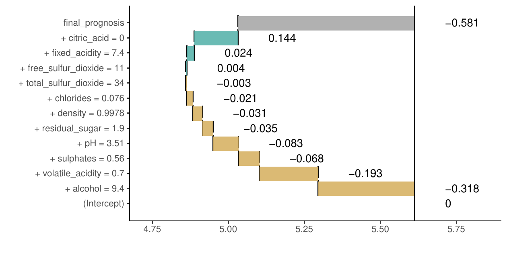
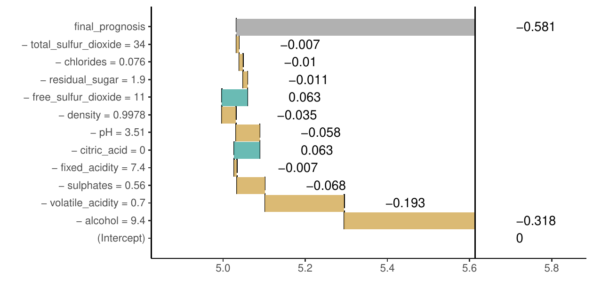

<div style="position:absolute;left:-10000px;top:auto;width:1px;height:1px;overflow:hidden;">This article is converted from a Legacy LaTeX article using the texor package. The pdf version is the official version. To report a problem with the html, refer to CONTRIBUTE on the R Journal homepage.
    This article includes tables which may not be properly formatted. This article includes figures which have not been given correct alternative text.</div>

::: article
# Introduction

Predictive modeling is a very exciting field with a wide variety of
applications. Lots of algorithms have been developed in this area. As
proven in many Kaggle competitions [@kaggle], winning solutions are
often obtained with the use of elastic tools like random forest,
gradient boosting or neural networks. Many of them are implemented by R
packages found in the CRAN Task View
[*MachineLearning*](https://CRAN.R-project.org/view=MachineLearning).

These algorithms have many strengths but they also share a major
weakness, which is a deficiency in interpretability of a model
structure. A single random forest, an xgboost model or a neural network
may be parameterized with thousands of parameters which make these
models hard to understand. Lack of interpretability results in the lack
of trust in model predictions. Lack of trust is a major obstacle when
one thinks about applications in regulated areas such as personalized
medicine or similar fields. An interesting example of a situation in
which trust issues are fully justified is presented in [@lime]. Authors
compare two classifiers that were trained to recognize whether a text
describes Christianity or Atheism. After explanations were provided, it
turned out that the model with superior performance in the test set
often based its prediction on irrelevant words, for example,
prepositions. To overcome this problem, the interpretability of complex
machine learning models has been a subject of much research, devoted
partially also to model visualization
[@Strumbelj:2011:GMV:1997005.1997009; @nnet_vis; @Zeiler_Fergus_2014].

The general approach to interpretability is to identify important
variables (features) in the model and then learn the expected model
response for a single variable. A description of a general framework of
permutation-based variable importance rankings may be found in
[@Altmann_Tolosi_Sander_Lengauer_2010]. An interesting and widely
adopted tool for estimation of marginal model response is *Partial
Dependency Plot* [@friedman2001], that presents the marginal
relationship between the variable of interest and a single variable from
the model. An effective and very elastic implementation of this method
is available in the [*pdp*](https://CRAN.R-project.org/package=pdp)
package [@pdp]. This method has many extensions such as for example
*Individual Conditional Expectations* [@goldstein_peeking_2015]. The ICE
method allows for tracing predictions for individual variables and it is
very useful for the identification of interactions. On the other hand,
ALE plots [@aleplot_art] were proposed as a superior tool for handling
strongly correlated predictors by describing the conditional
distribution of predicted values. This method can be used to assess both
main effects and interactions between predictors. All these methods are
focused on the effect of a single variable or small set of variables
within the black box model.

A different approach is presented by [@lime]. While methods such as PDP
and ALE plot aim to describe model behavior globally, it is also
possible to explain individual predictions as in ICE. We will focus on
such methods. The authors propose LIME (*Locally Interpretable Model
agnostic Explanations*) as a method for explaining black box predictions
by fitting an interpretable model locally around a prediction of
interest. This methodology was illustrated with examples from image and
text classification areas. Later, it was extended by [@magix] to MAGIX
methodology (*Model Agnostic Globally Interpretable Explanations*) and
modified by the authors of the original article to aLIME (*anchor-LIME*)
by [@alime].

So far, two implementations of the method have been found. Python
library was developed by the authors of the original article and it is
available on GitHub at <https://github.com/marcotcr/lime>. It works for
any text or image classifier as well as for tabular data. Regression
models can be explained using simple linear regression. The R package
[*lime*](https://CRAN.R-project.org/package=lime) is a port to the
original Python package. This package works with tabular and text data
and handles all models supported by either
[*caret*](https://CRAN.R-project.org/package=caret) [@caret] or
[*mlr*](https://CRAN.R-project.org/package=mlr) [@mlr] package and it
can be easily extended to work with other models. An implementation of
the *sp-LIME* algorithm proposed in the original article to choose
representative observations that would explain the behavior of the model
globally is available for Python.

In addition to packages that implement single methods, in R we have also
two packages with a consistent collection of explainers:
[*DALEX*](https://CRAN.R-project.org/package=DALEX) [@dalex] and
[*iml*](https://CRAN.R-project.org/package=iml).

In this article, we give a short overview of methods for explaining
predictions made by complex models. We also introduce two new methods
implemented in R packages
[*live*](https://CRAN.R-project.org/package=live) and
[*breakDown*](https://CRAN.R-project.org/package=breakDown). Examples
presented in this paper were recorded with the
[*archivist*](https://CRAN.R-project.org/package=archivist) package
[@archivist]. They can be accessed and restored with a single R
instruction listed in footnotes.

# Related work

In this section we present two of the most recognized methods for
explanations of a single prediction from a complex black box model
(so-called instance-level explanations).

### Locally Interpretable Model-agnostic Explanations (LIME)

[@lime] proposed **LIME** method for explaining prediction for a single
observation. The algorithm is designed to explain predictions of any
classifier and it works primarily for image and text data. First,
original observation of interest is transformed into simplified input
space of binary vectors (for example presence or absence of words). Then
a dataset of similar observations is created by sampling features that
are present in the representation of the explained instance. The
closeness of these observations to the original observations is measured
via a specified similarity kernel. This distance is taken into account
while the explanation model is fitted to the new dataset. The
interpretable model can be penalized to assure that it does not become
too complex itself. In mathematical terms, LIME explanation for
observation $x$ is a model $g$ which approximates complex model $f$ by
solving the following optimization problem
$$g(\cdot) = \arg \min_{h \in  G}\bigg[\mathcal{L}(f, h, \pi_{x}(z)) + \Omega(h)\bigg],$$
where $z$ is the interpretable (binary) representation of $x$,
$\pi_{x}(z)$ is a measure of closeness of $z$ and $x$ (the kernel),
$\mathcal{L}$ is a loss function that measures local faithfulness of the
explanation and $\Omega$ is a model complexity measure, that serves as a
regularization term.

## Shapley values (SHAP)

In 2017 [@shapley] introduced a general framework for explaining machine
learning models that encompasses LIME among other methods. The method is
associated with some specific visualization techniques that present how
predictors contribute to the predicted values. In this framework,
observations are transformed into the space of binary variables called
simplified inputs. Explanation models are restricted to the so-called
**additive feature attributions methods**, what means that values
predicted by the explanation model are linear combinations of these
binary input vectors. Formally, if $z = (z_{1}, \ldots, z_{p})$ is a
binary vector in simplified inputs space and $g$ is the explanation
model, then
$$g(z) = \phi_{0} + \sum_{j = 1}^{M}\phi_{j}z_{j},$$
where $\phi_{j}, j = 0, \ldots, M$ are weights. These weights measure
how each feature contributes to the prediction. Authors prove that in
this class of explanation models **Shapley values** provide unique
solutions to the problem of finding optimal weights $\phi_{j}$ that
assure that the model has desirable properties of local accuracy and
consistency. For formal treatment and examples, please refer to the
original article of [@shapley]. In particular, you will find there a
proof that for certain choices of parameters in the LIME method,
coefficients of the fitted local linear model are Shapley values. The
Python implementation of this method is available at
<https://github.com/slundberg/shap>. In R *Shapley values* can be found
in few packages. For tree based models they are implemented in
[*xgboost*](https://CRAN.R-project.org/package=xgboost) package
[@xgboost]. An independent model agnostic implementation is available in
the *iml* package. A development version of a package dedicated entirely
to Shapley values can be found at <https://github.com/redichh/ShapleyR>.

# Local Interpretable Visual Explanations (LIVE)

The next two sections introduce two new approaches to explaining model
prediction, implemented in R packages *live* and *breakDown*,
respectively. Both of these methods describe locally (at an instance
level) how features contribute to a model prediction.

## Motivation

*live* is an alternative implementation of LIME for regression problems,
which emphasizes the role of model visualization in the understanding of
complex models. In comparison with the original LIME, both the method of
local exploration and handling of interpretable inputs are changed. A
dataset for local exploration is simulated by perturbing the explained
instance one feature at a time. The process is described in section
[3.2](#algs). By default, the Gaussian kernel is used to measure
distances between simulated observation and the observation of interest,
but other kernels can also be used, too. Original variables are used as
interpretable inputs, so numerical features are used in the explanation
model. Interpretability of the local explanation comes from a tractable
relationship between inputs and the predicted response. Variable
selection is optional for linear regression when sparsity is required.

One of the main purposes of *live* is to provide tools for model
visualization, which is why in this package emphasis is put on models
that are easy to visualize. For linear models, waterfall plots can be
drawn to present how predictors contribute to the overall model score
for a given prediction, while forest plots [@forestplot] can be drawn to
summarize the structure of local linear approximation. Examples
clarifying both techniques are given in section [5](#case_study). Other
interpretable models that are equipped with generic `plot` function can
be visualized, too. In particular, decision trees which can be plotted
using [*party*](https://CRAN.R-project.org/package=party) package
[@party] are well suited for this task, as they can help discover
interactions. An example is given in section [5](#case_study). The
package uses the *mlr* interface to handle machine learning algorithms,
hence any classifier or regression method supported by *mlr* can be used
as an interpretable model, though in practice simple models will be
preferred. The most common choice is a sparse linear model.

## Methodology {#algs}

*live* package uses a two-step procedure to explain prediction of a
selected black box model in the point $x$. First, an artificial dataset
$X'$ is created around point $x$. Then, the white box model is fitted to
the model predictions for points in $X'$.

The first step is described by the Algorithm 1.

1. $p \gets \text{number of predictors}$
2. $m \gets \text{number of observations to generate}$
3. $\text{Duplicate the given observation } m \text{ times}$
4. for i in $\{1, \ldots, m\}$ do
5.    Draw number $k \in \{1, \ldots, p\}$ uniformly. Replace the value of $k$-th variable in i-th duplicate with a random draw from the empirical distribution of this variable in the original dataset
6. end for

<figure>
<figcaption>Algorithm 1: Simulating <span
class="math inline"><em>X</em>′</span> - surroundings around the
selected <span class="math inline"><em>x</em></span>.</figcaption>
</figure>

In other words, the procedure amounts to iterating over the set of $m$
observations identical to a given instance and changing the value of one
random variable at each step. Alternatively, in *live* package new
dataset can be sampled from a multivariate normal distribution and using
permutations of each column. Details can be found in the manual. Current
implementation of this algorithm relies on
[*data.table*](https://CRAN.R-project.org/package=data.table) package
for performance [@data_table]. The choice of the number of instances to
sample is an open problem both in LIME and LIVE methods.

# Model agnostic greedy explanations of model predictions (breakDown)

## Motivation

*live* package approximates the local structure of the black box model
around a single point in the feature space. The idea behind the
*breakDown* is different. In the case of that package, the main goal is
to decompose model predictions into parts that can be attributed to
particular variables. It is straightforward for linear (and more
generally: additive) models. Below we present a model agnostic approach
that works also for nonlinear models.

Let us use the following notation:
$x = (x_1, x_2, ..., x_p) \in X \subset \mathcal R^p$ is a vector in
feature space $X$. $f:X \rightarrow R$ is a scoring function for the
model under consideration, that may be used for regression of
classification problems. $X^{train}$ is a training dataset with $n$
observations.

For a single observation $x^{new}$ the model prediction is equal to
$f(x^{new})$. Our goal is to attribute parts of this score to variables
(dimensions) in the $X$ space.

## The lm-break: version for additive models

For linear models (and also generalized linear models) the scoring
function (e.g. link function) may be expressed as a linear combination
of feature vectors.

$$f(x^{new}) = (1, x^{new}) (\mu, \beta)^T = \mu + x^{new}_1 \beta_1 + \ldots + x^{new}_p \beta_p.
\label{eq:linearmodel}   (\#eq:linearmodel)$$

In this case it is easy to attribute the impact of feature $x_i$ to
prediction $f(x^{new})$. The most straightforward approach would be to
use the $x^{new}_i \beta_i$ as the attribution. However, it is easier to
interpret variable attributions if they are invariant to scale-location
transformations of $x_i$, such as change of the units or origin.
Centering addresses location changes and scaling also changes the scales
of $\beta$ parameters. This is why for linear models the **lm-break**
variable attributions are defined as $(x^{new}_i - \bar x_i) \beta_i$.
The equation \@ref(eq:linearmodel) may be rewritten as follows:

$$f(x^{new}) = (1, x^{new}) (\mu, \beta)^T = baseline + (x^{new}_1 - \bar x_1) \beta_1 + ... + (x^{new}_p - \bar x_p) \beta_p$$

where
$$baseline = \mu + \bar x_1 \beta_1 + ... + \bar x_p \beta_p.$$

Components $(x^{new}_i - \bar x_i) \beta_i$ are all expressed in the
same units. For `lm` and `glm` models these values are calculated and
plotted by the generic `broken()` function from the *breakDown* package.

## The ag-break: model agnostic approach

Interpretation of **lm-break** attributions is straightforward but
limited only to additive models. In this section, we present an
extension for non-additive models. This extension uses additive
attributions to explain predictions from non-additive models thus some
information about the model structure will be lost. Still, for many
models, such attribution may be useful. For additive models the
**ag-break** approach gives the same results as **lm-break** approach.

The intuition behind **ag-break** approach is to identify components of
$x^{new}$ that cannot be changed without a significant change in the
prediction $f(x^{new})$. In order to present this approach in a more
formal way, we first need to introduce some definitions.

::: defn
**Definition 1** (Relaxed model prediction). Let $f^{IndSet}(x^{new})$
denote an expected model prediction for $x^{new}$ relaxed on the set of
indexes $IndSet \subset \{1, \ldots, p\}$.
$$f^{IndSet}(x^{new}) = E[f(x)|x_{IndSet} = x^{new}_{IndSet}].$$
Thus $f^{IndSet}(x^{new})$ is an expected value for model response
conditioned on variables from set $IndSet$ in such a a way, that
$\forall_{i\in IndSet} x_i = x^{new}_i$.
:::

The intuition behind relaxed prediction is that we are interested in an
average model response for observations that are equal to $x^{new}$ for
features from $IndSet^C$ set and follow the population distribution for
features from $IndSet$ set. Clearly, two extreme cases are
$$f^{\{1, \ldots, p\}}(x^{new}) = f(x^{new}),$$
which is the case of no relaxation, and
$$f^{\emptyset}(x^{new}) = E [f(x)].$$
which corresponds to full relaxation. We will say that a variable was
relaxed when we do not fix its value and we let it follow the population
distribution. This will play a crucial part in the algorithm presented
in this section.

Since we do not know the joint distribution of $x$, we will use its
estimate instead.
$$\widehat {f^{IndSet}(x^{new})} = \frac 1n \sum_{i = 1}^n f(x^i_{-IndSet},x^{new}_{IndSet}).$$
We will omit the dashes to simplify the notation.

::: defn
**Definition 2** (Distance to relaxed model prediction). Let us define
the distance between model prediction and relaxed model prediction for a
set of indexes $IndSet$.
$$d(x^{new}, IndSet) := |f^{IndSet}(x^{new}) - f(x^{new})|.$$
:::

It is the difference between model prediction for observation $x^{new}$
and observation relaxed on features $indSet$. The smaller the
difference, the less important are variables in the $indSet$ set.

::: defn
**Definition 3** (Added feature contribution). For j-th feature we
define its contribution relative to a set of indexes $IndSet$ (*added
contribution*) as
$$\text{contribution}^{IndSet}(j) = f^{IndSet \cup \{j\}}(x^{new}) - f^{IndSet}(x^{new}).$$
It is the change in model prediction for $x^{new}$ after relaxation on
$j$.
:::

The model agnostic feature contribution is based on distances to relaxed
model predictions. In this approach, we look for a series of variables
that can be relaxed in such a way so as to move model prediction from
$f(x^{new})$ to a fully relaxed prediction $E [f(x)]$ (expected value
for all model predictions). The order of features in this series is
important. But here we use a greedy strategy in which we add features to
the $indSet$ iteratively (one feature per iteration) and minimize
locally the distance to relaxed model prediction.

This approach can be seen as an approximation of Shapley values where
feature contribution is linked with the average effect of a feature
across all possible relaxations. These approaches are identical for
additive models. For non-additive models, the additive attribution is
just an approximation in both cases, yet the greedy strategy produces
explanations that are easier to interpret. It is worth noting that
similar decomposition of predictions and measures of contribution for
classifiers have been examined in [@4407709].

The greedy search can start from a null set of indexes (then in each
step a single feature is being relaxed) or it can start from a full set
of relaxed features (then in each step a single feature is removed from
the set). The above approaches are called *step-up* and *step-down*,
respectively. They are presented in algorithms [2](#alg:relaxedalg) and
[3](#alg:relaxedalg2).

The algorithm [2](#alg:relaxedalg) presents the procedure that generates
a sequence of variables with increasing contributions. This sequence
corresponds to variables that can be relaxed in such a way so as to
minimize the distance to the original prediction. The resulting sequence
of $Contributions$ and $Variables$ may be plotted with Break Down Plots,
see an example in Figure [2](#fig:breakDownScores). Figure
[1](#fig:breakDownDistr) summarizes the idea behind algorithm
[2](#alg:relaxedalg). By relaxing consecutive variables one finds a path
between single prediction and average model prediction.

One can also consider an opposite strategy - instead of starting from
$IndSet = \{1, \ldots, p\}$ one can start with $IndSet = \emptyset$.
That strategy is called *step-up* approach and it is presented in
Algorithm [3](#alg:relaxedalg2).

Note that the Break Down method is also available for Python in the
`pyBreakDown` library.[^1]

1. $p \gets \text{number of variables}$
2.  $IndSet \gets \{1, \ldots, p\} \text{ set of indexes of all variables}$
3.  for i in $\{1, \ldots, p\}$ do
4.    Find new variable that can be relaxed with small loss in relaxed distance to $f(x^{new})$
5.    for j in $IndSet$ do
6.        Calculate relaxed distance with $j$ removed
7.        $dist(j) \gets d(x^{new}, IndSet \setminus \{j\})$
8.    end for
9.  Find and remove $j$ that minimizes loss
10.  $j_{min} \gets \text{arg}\min_j dist(j)$ 
11. $Contribution^{IndSet}(i) \gets f^{IndSet}(x^{new}) - f^{IndSet \setminus \{j_{min}\}}(x^{new})$
12. $Variables(i) \gets j_{min}$
13. $IndSet \gets IndSet \setminus \{j_{min}\}$
14. end for
<figure id="alg:relaxedalg">
<figcaption>Algorithm 2: <span id="alg:relaxedalg"
label="alg:relaxedalg"></span>Model agnostic break down of model
predictions. The <em>step-down</em> approach.</figcaption>
</figure>

1. $p \gets \text{number of variables}$
2. $IndSet \gets \emptyset \text{ empty set}$
3. fori in $\{1, \ldots, p\}$ do
4. Find new variable that can be relaxed with large distance to $f^{\emptyset}(x^{new})$
5.    for j in $\{1, \ldots, p\} \setminus IndSet$ do
6.        Calculate relaxed distance with $j$ added
7.        $dist(j) \gets d(x^{new}, IndSet \cup \{j\})$
8.    end for
9. Find and add $j$ that maximize distance
10.$j_{max} \gets \text{arg}\max_j dist(j)$ 
11. $Contribution^{IndSet}(i) \gets f^{IndSet \cup \{j_{max}\}}(x^{new}) - f^{IndSet}(x^{new})$
12. $Variables(i) \gets j_{max}$
13. $IndSet \gets IndSet \cup \{j_{max}\}$
14. end for

<figure id="alg:relaxedalg2">
<figcaption>Algorithm 3: <span id="alg:relaxedalg2"
label="alg:relaxedalg2"></span>Model agnostic break down of model
predictions. The <em>step-up</em> approach.</figcaption>
</figure>

![Figure 1: []{#fig:breakDownDistr label="fig:breakDownDistr"} An
illustration of algorithm [2](#alg:relaxedalg). Each row in this plot
correspond to a distribution of model scores
$f(x)|x_{IndSet} = x^{new}_{IndSet}$ for different sets of $IndSet$
indexes. Initially $IndSet = \{1, \ldots, p\}$ and in each step single
variable is removed from this set. Labels on the left-hand side of the
plots show which variable is removed in a given step. Red dots stand for
conditional average - an estimate of relaxed predictions
$f^{IndSet}(x^{new})$. Violin plots summarize conditional distributions
of scores while gray lines show how model predictions change for
particular observations between consecutive relaxations. This plot is
based on `wine` dataset described in
section [5](#case_study).](breakDownDistr.png){#fig:breakDownDistr
width="100%" alt="graphic without alt text"}

![Figure 2: []{#fig:breakDownScores label="fig:breakDownScores"} Break
Down Plot for decomposition identified in Figure
[1](#fig:breakDownDistr). Beginning and end of each rectangle
corresponds to relaxed prediction (red dot in Figure
[1](#fig:breakDownDistr)) with and without a particular feature. This
plot is based on `wine` dataset described in section
[5](#case_study).](breakDownScores.png){#fig:breakDownScores
width="100%" alt="graphic without alt text"}

# Case study: How good is this red wine? {#case_study}

Wine quality data [@wine_quality] is a well-known dataset which is
commonly used as an example in predictive modeling. The main objective
associated with this dataset is to predict the quality of some variants
of Portuguese *Vinho Verde* on the basis of 11 chemical properties. A
single observation from the dataset can be found in Table
[1](#table:example_wine). According to the results from the original
article, the Support Vector Machine (SVM) model performs better than
other models including linear regression, neural networks and others.

In this section we will show how *live* package can be used to fit
linear regression model locally and generate a visual explanation for
the black box model as well as how *breakDown* package can be used to
attribute parts of the final prediction to particular features. This
example will focus on a regression problem, but since both methods are
supposed to be model-agnostic, classification problems are treated in
the same way by using scores (probabilities) rather than predicted
classes.

::: {#table:example_wine}
  --------------------------------------------------------------------------------------------------------------------------------------------------------------------------------
    fixed acidity   volatile acidity   citric acid   res. sugar   $\text{Cl}^{-}$   free $\text{SO}_{2}$   total $\text{SO}_{2}$      D     pH   $\text{SO}_{4}^{2-}$   alcohol 
  --------------- ------------------ ------------- ------------ ----------------- ---------------------- ----------------------- ------ ------ ---------------------- --------- --
             7.40               0.70          0.00         1.90              0.08                  11.00                   34.00   1.00   3.51                   0.56      9.40 

  --------------------------------------------------------------------------------------------------------------------------------------------------------------------------------

  : Table 1: The fifth observation in wine quality dataset. D denotes
  density, $\text{Cl}^{-}$ stands for chlorides, \"res.\" for residual
  and $\text{SO}_{4}^{2-}$ for sulphates.
:::

The SVM model[^2] used in this example is trained with the use of
[*e1071*](https://CRAN.R-project.org/package=e1071) package [@e1071]. We
do not perform hyperparameter's tuning as the model performance is not
relevant in this use-case.

``` r
library("e1071")
data(wine, package = "live")
wine_svm_model <- svm(quality~., data = wine)
```

Different approaches for explaining single predictions are illustrated
on the basis of the prediction for the fifth wine from this dataset, the
one presented in table [1](#table:example_wine). The actual quality of
this wine is 5, while the quality predicted by the SVM model is $5.03$.

``` r
predict(wine_svm_model, wine[5, ])
##        1 
## 5.032032
```

## The *live* package

The *live* package approximates black box model (here SVM model) with a
simpler white box model (here linear regression model) to explain the
local structure of a black box model and in consequence to assess how
features contribute to a single prediction.

To do this, we first need to generate artificial observations around the
selected observation $x^{new}$ for local exploration. We use
`sample_locally` function from *live* package.

``` r
library("live")
library("mlr")
wine_sim <- sample_locally(data = wine, 
                           explained_instance = wine[5, ],
                           explained_var = "quality", 
                           size = 2000,
                           seed = 17)
wine_sim_svm <- add_predictions(wine_sim, wine_svm)
nc <- which(colnames(wine) == "quality")
```

If multiple models are to be explained, there is no need to generate
multiple *artificial* datasets. Predictions of each model on a single
simulated dataset can be added with the use of `add_predictions`
function. A different object should be created for each model, but the
same result of a call to `sample_locally` function should be used as the
`to_explain` argument. Black box model can be passed as a model object
or as a name of *mlr* learner. While the object created by
`sample_locally` function stores the dataset, name of the response
variable and other metadata, the object returned by `add_predictions`
function also stores the fitted black box model. The result of applying
`sample_locally` functions does not contain the response but the result
of `add_predictions` contains a column with model predictions, which has
the same name as the response in the original dataset. The `seed`
argument is passed to `set.seed` function to ensure reproducibility,
though our experience with this approach shows that the results are
stable.

Once the artificial data points around $x^{new}$ are generated, we may
fit the white box model to them. In this example we fit a linear
regression model using `fit_explanation` function[^3].

``` r
wine_expl_live <- fit_explanation(wine_sim_svm)
```

This function returns a native *mlr* object. The model object (for
example, `lm` object) can be extracted with the use of `getLearnerModel`
function.

The white box model `wine_expl` approximates the black box model
`wine_svm_model` around $x^{new}$. Coefficients of this model can be
presented graphically with the generic `plot` function for class
`live_explainer`. See the corresponding Forest Plot in Figure
[3](#fig:forestModel) and the corresponding Waterfall Plot in Figure
[4](#fig:waterfallModel).

``` r
plot(wine_expl, type = "forest")
plot(wine_expl, type = "waterfall")
```

![Figure 3: []{#fig:forestModel label="fig:forestModel"}Forest plot for
a linear white box model that approximates the black box
model.](live_forest.png){#fig:forestModel width="100%"
alt="graphic without alt text"}

![Figure 4: []{#fig:waterfallModel label="fig:waterfallModel"}Waterfall
plot for additive components of linear model that approximates the black
box model around $x^{new}$.](live_waterfall.png){#fig:waterfallModel
width="100%" alt="graphic without alt text"}

In case of datasets with larger number of variables, we could obtain
sparse results by setting `selection = TRUE` in the `fit_explanation`
function. This option allows for performance of variable selection based
on LASSO implemented in
[*glmnet*](https://CRAN.R-project.org/package=glmnet)
[@lasso_pkg; @lasso_art]. When using Generalized Linear Model or Elastic
Net as a white box model it is possible to set `family` argument to one
of the distribution families available in `glm` and `glmnet` functions
via `response_family` argument to `fit_explanation`.

As mentioned, other interpretable models are suitable as local
explanations, too. In particular, decision trees can be used to
visualization interactions between variables. It is enough to select a
different white box model while calling `fit_explanation` function.

``` r
wine_expl_tree <- fit_explanation(wine_sim_svm, "regr.ctree", kernel = identity_kernel,
                                  hyperpars = list(maxdepth = 2))
```

Kernel is set to identity, because trees built by *party* package cannot
handle non-integer weights. The result is the following decision tree in
Figure [5](#fig:live_tree).

![Figure 5: []{#fig:live_tree label="fig:live_tree"}Decision tree that
approximates the black box model around
$x^{new}$.](live_tree.png){#fig:live_tree width="100%"
alt="graphic without alt text"}

## The *lime* package

The LIME method is implemented in the R package *lime*. It produces
sparse explanations by default. In the first step a `lime` object is
created for a specified dataset and a fitted black box model.

``` r
library("lime")
set.seed(17)
wine_expl_lime <- lime(wine[5, ], wine_svm_model)
```

Then we use the `explain` function, which in case of regression takes
the observation of interest, `lime` object and the number of top
features to be used for explanation[^4]. In this case data is low
dimensional, hence we can use all predictors. Alternatively, we could
set `feature_select` to `none` to skip the selection part.

``` r
model_type.svm <- function(x, ...) "regression"
svm_explained <- explain(wine[5, ], wine_expl_lime, n_features = 11)
plot_explanation(svm_explained)
```

Results produced by the `plot_explanation` function are presented in
Figure [6](#fig:lime).

![Figure 6: []{#fig:lime label="fig:lime"}Contributions of particular
features to the prediction calculated with SVM model assessed with LIME
method.](lime_explanation.png){#fig:lime width="100%"
alt="graphic without alt text"}

Note that here, the explanation is presented in terms of discretized
variables rather than original continuous predictors.

## The *breakDown* package

The *breakDown* package directly calculates variable attributions for a
selected observation. It does not use any surrogate model.

The `broken()` function is used to calculate feature attributions[^5].
Generic functions `print()` and `plot()` show feature attributions as
texts or waterfall plots. The `baseline` argument specifies the origin
of a waterfall plot. By default, it is 0. Use `baseline = "intercept"`
to set the origin to average model prediction.

``` r
library("breakDown")
explain_bd <- broken(wine_svm, new_observation = wine[5, -nc],
                     data = wine[, -nc],
                     baseline = "Intercept",
                     keep_distributions = TRUE)
explain_bd
##                             contribution
## baseline                           5.613
## + alcohol = 9.4                   -0.318
## + volatile_acidity = 0.7          -0.193
## + sulphates = 0.56                -0.068
## + pH = 3.51                       -0.083
## + residual_sugar = 1.9            -0.035
## + density = 0.9978                -0.031
## + chlorides = 0.076               -0.021
## + total_sulfur_dioxide = 34       -0.003
## + quality = 5                      0.000
## + free_sulfur_dioxide = 11         0.004
## + fixed_acidity = 7.4              0.024
## + citric_acid = 0                  0.144
## final_prognosis                    5.032

plot(explain_bd)
```

Figure [7](#fig:breakDownSVN) shows variable contributions for step-up
and step-down strategy. Variable ordering is different but the
contributions are consistent across both strategies.

Find more examples for classification and regression models created with
*caret*, *mlr*,
[*randomForest*](https://CRAN.R-project.org/package=randomForest)
[@randomForestpkg] and other frameworks in package vignettes[^6].

<figure id="fig:breakDownSVN">


<figcaption>Figure 7: <span id="fig:breakDownSVN"
label="fig:breakDownSVN"></span><strong>ag-break</strong> feature
attributions for SVM model calculated for the 5th wine. The upper plot
presents feature attributions for the step-up strategy, while the bottom
plot presents results for the step-down strategy. Attributions are very
similar even if the ordering is different. Vertical black line shows the
average prediction for the SVM model. The 5th wine gets final prediction
of 5.032 which is below the average for this model by 0.581
point.</figcaption>
</figure>

## Shapley values (SHAP)

Authors of the original article about Shapley values maintain a Python
package which implements several methods of computing these values.
Also, it provides visual diagnostic tools that help understand global
behavior of the black box model such as plotting variable contributions
for all instances in the dataset.

The *iml* package can be used to compute Shapley values for any model.
Other tools are more restricted in this regard, for example, the
*shapleyR* package only works with *mlr* models. First, we need to
create a `Predictor` object for the model, then it is enough to apply
the `Shapley` function for a specified instance. This implementation
samples permutation of variables to take into account different orders
in which conditioning can be done and the number of permutations to be
used is a parameter of this function. Details can be found in the
documentation for the package.

``` r
model_svm = Predictor$new(model = wine_svm, data = wine[, -nc], y = wine$quality)
set.seed(17)
shapley_iml = Shapley$new(model_svm, x.interest = wine[5, -nc])
plot(shapley_iml)
```

Calculated Shapley values[^7] are presented in Table
[2](#tab:comparisionSBD) and compared to results of Break Down method.
Shapley values can be also visualized on a plot similar to waterfall
plot, which can be created using generic `plot` function. An example is
shown in Figure [8](#fig:shapley_vis).

::: {#tab:comparisionSBD}
  -------------------------------------------------------------
       feature                  Shapley value   breakDown score
  ---- ---------------------- --------------- -----------------
     1 alcohol                          -0.31             -0.32

     2 volatile_acidity                 -0.23             -0.19

     3 sulphates                        -0.19             -0.07

     4 citric_acid                       0.17              0.14

     5 fixed_acidity                    -0.06              0.02

     6 pH                               -0.04             -0.08

     7 density                          -0.03             -0.03

     8 residual_sugar                   -0.01             -0.03

     9 total_sulfur_dioxide              0.00             -0.00

    10 chlorides                        -0.00             -0.02

    11 free_sulfur_dioxide               0.00              0.00
  -------------------------------------------------------------

  : Table 2: Comparison of feature attributions calculated with *iml*
  and *breakDown* packages.
:::

{#fig:shapley_vis width="100%"
alt="graphic without alt text"}

# Discussion

In this paper, we presented four approaches and four R packages that can
be used for explanations of predictions from complex black box models.
Two of them have already been introduced in literature, while *live* and
*breakDown* were introduced in this article for the first time.

All four approaches are model agnostic in a sense that, the method does
not depend on any particular structure of black box model. Yet there are
also some differences between these approaches.

1.  Surrogate models vs. conditional expected responses. *live* and
    *lime* packages use surrogate models (the so-called white box
    models) that approximate local structure of the complex black box
    model. Coefficients of these surrogate models are used for
    explanations. Unlike them, *breakDown* and *shapleyR* construct
    feature attributions on the basis of conditional responses of a
    black box model.

2.  *live* and *lime* packages differ in terms of the manner in which
    the surrounding of $x^{new}$ is defined. This task is highly
    non-trivial especially for mixed data with continuous and
    categorical features. *live* does not use *interpretable input
    space* (and so does not fall under the *additive feature attribution
    methods* category), but approximates the black box model directly in
    the data space, what can be considered a more effective use of data.
    It comes with no theoretical guarantees that are provided for
    Shapley values, but apart from being very intuitive, it offers
    several tools for visual inspection of the model.

3.  Computations required to obtain LIME and LIVE explanations are
    relatively simple. For large datasets, sampling can be easily
    parallelized. Shapley values and Break Down Plots, on the other
    hand, are more computationally demanding, but the current
    implementation of *breakDown* computes additive explanations in
    linear time.

4.  *shapleyR* and *breakDown* take conditional expectation of the
    predictor function with respect to explanatory features. They differ
    in terms of the manner in which conditioning is applied to
    calculating feature attributions. *shapleyR* is based on results
    from game theory; in this package contribution of a single feature
    is averaged across all possible conditionings. *breakDown* uses a
    greedy approach in which only a single series of nested
    conditionings is considered. The greedy approach is easier to
    interpret and faster to compute. Moreover, exact methods of
    computing Shapley values exist only for linear regression and tree
    ensemble models. Approximate computations are also problematic, as
    they require the choice of the number of samples of subsets of
    predictors which will be used. These two methods produce nearly
    identical results for linear models (see table Table
    [2](#tab:comparisionSBD)), but for more complex models the estimated
    contributions can be very different, even pointing in opposite
    directions. An advantage of Shapley values are proven theoretical
    properties, though they are restricted to explanation models that
    belong to the *additive feature attribution methods* class.

5.  When parameters (kernel and regularization term) are chosen as in
    [@shapley], *lime* produces estimates of Shapley values, while other
    choices of kernel and penalty term lead to inconsistent results. The
    fact that the suggested penalty term is equal to 0 can be considered
    a huge limitation of LIME and SHAP, because in this setting they
    will not produce sparse explanations.

6.  All presented methods decompose final prediction into additive
    components attributed to particular features. This approach will not
    work well for models with heavy components related to interactions
    between features.

7.  Evaluation of human-readability of discussed methods will be a
    subject of future research. It will help in making comparisons
    between different approaches to individual prediction explanations.

8.  Authors of SHAP and LIME proposed methods of combining explanations
    calculated for different observations into global explanations. Such
    aggregation methods for Break Down and LIVE will also be a subject
    of future research.

Comparison of the methods presented in the previous section is far from
being comprehensive. More research is needed to better understand the
differences between these approaches and new approaches are needed to
overcome the constraints listed above. Nevertheless, the availability of
the mentioned packages creates an opportunity for further studies on
model exploration.

# Acknowledgements

Work on this article is financially supported by the *NCN Opus grant
2017/27/B/ST6/01307*.
:::

[^1]: https://github.com/MI2DataLab/pyBreakDown/

[^2]: Access this model with
    `archivist::aread("MI2DataLab/live/arepo/1025d")`

[^3]: Access this model with
    `archivist::aread("MI2DataLab/live/arepo/eebe6")`

[^4]: Access this object with
    `archivist::aread("MI2DataLab/live/arepo/878d5")`

[^5]: Access example attributions with
    `archivist::aread("MI2DataLab/live/arepo/1f320")`

[^6]: https://pbiecek.github.io/breakDown/

[^7]: Access this object with
    `archivist::aread("MI2DataLab/live/arepo/50f5f")`
