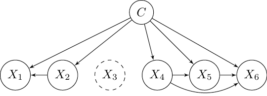

::: article
# Introduction {#sec:introduction}

Bayesian network classifiers [@Bielza14; @Friedman1997] are competitive
performance classifiers [e.g., @Zaidi2013] with the added benefit of
interpretability. Their simplest member, the naive Bayes (NB)
[@Minsky1961], is well-known [@Hand2001]. More elaborate models exist,
taking advantage of the Bayesian network [@Pearl1988; @Koller2009]
formalism for representing complex probability distributions. The tree
augmented naive Bayes [@Friedman1997] and the averaged one-dependence
estimators (AODE) [@Webb2005] are among the most prominent.

A Bayesian network classifier is simply a Bayesian network applied to
classification, that is, to the prediction of the probability
$P(c \mid \mathbf{x})$ of some discrete (class) variable $C$ given some
features $\mathbf{X}$. The
[*bnlearn*](https://CRAN.R-project.org/package=bnlearn)
[@bnlearn43; @scutari2009learning] package already provides state-of-the
art algorithms for learning Bayesian networks from data. Yet, learning
classifiers is specific, as the implicit goal is to estimate
$P(c \mid \mathbf{x})$ rather than the joint probability
$P(\mathbf{x}, c)$. Thus, specific search algorithms, network scores,
parameter estimation, and inference methods have been devised for this
setting. In particular, many search algorithms consider a restricted
space of structures, such as that of augmented naive Bayes
[@Friedman1997] models. Unlike with general Bayesian networks, it makes
sense to omit a feature $X_i$ from the model as long as the estimation
of P(c) is no better than that of $P(c\mid \mathbf{x} \setminus x_i)$.
Discriminative scores, related to the estimation of P(c) rather than
P(c, ), are used to learn both structure
[@Keogh2002; @grossman2004; @pernkopf10; @carvalho11] and parameters
[@Zaidi2013; @Zaidi2017]. Some of the prominent classifiers [@Webb2005]
are ensembles of networks, and there are even heuristics applied at
inference time, such as the lazy elimination technique
[@zheng2006efficient]. Many of these methods [e.g.,
@Dash2002; @Zaidi2013; @Keogh2002; @Pazzani1996] are, at best, just
available in standalone implementations published alongside the original
papers.

The [*bnclassify*](https://CRAN.R-project.org/package=bnclassify)
package implements state-of-the-art algorithms for learning structure
and parameters. The implementation is efficient enough to allow for
time-consuming discriminative scores on relatively large data sets. It
provides utility functions for prediction and inference, model
evaluation with network scores and cross-validated estimation of
predictive performance, and model analysis, such as querying structure
type or graph plotting via the
[*Rgraphviz*](https://www.bioconductor.org/packages/release/bioc/html/Rgraphviz.html)
package [@Rgraphviz2200]. It integrates with the
[*caret*](https://CRAN.R-project.org/package=caret)
[@caret6078; @Kuhn2008] and
[*mlr*](https://CRAN.R-project.org/package=mlr) [@mlr211] packages for
straightforward use in machine learning pipelines. Currently it supports
only discrete variables. The functionalities are illustrated in an
introductory vignette, while an additional vignette provides details on
the implemented methods. It includes over 200 unit and integration tests
that give a code coverage of 94 percent (see
<https://codecov.io/github/bmihaljevic/bnclassify?branch=master>).

The rest of this paper is structured as follows. We begin by providing
background on Bayesian network classifiers (Section [2](#sec:bcground))
and describing the implemented functionalities
([[sec:functionalities]](#sec:functionalities)). We then illustrate
usage with a synthetic data set ([[sec:usage]](#sec:usage)) and compare
the methods' running time, predictive performance and complexity over
several data sets ([[sec:properties]](#sec:properties)). Finally, we
discuss implementation ([[sec:implementation]](#sec:implementation)),
briefly survey related software ([[sec:relatedsw]](#sec:relatedsw)), and
conclude by outlining future work ([[sec:conclusion]](#sec:conclusion)).

# Background {#sec:bcground}

## Bayesian network classifiers

[]{#bayesian-networks label="bayesian-networks"} A Bayesian network
classifier is a Bayesian network used for predicting a discrete class
variable $C$. It assigns $\mathbf{x}$, an observation of $n$ predictor
variables (features) $\mathbf{X} = (X_1,\ldots,X_n$), to the most
probable class:

$$c^* = \mathop{\mathrm{arg\,max}}_c P(c \mid \mathbf{x}) = \mathop{\mathrm{arg\,max}}_c P(\mathbf{x}, c).$$

The classifier factorizes $P(\mathbf{x}, c)$ according to a Bayesian
network
$\mathcal{B} = \langle \mathcal{G}, \boldsymbol{ \theta } \rangle$.
$\mathcal{G}$ is a directed acyclic graph with a node for each variable
in $(\mathbf{X}, C)$, encoding conditional independencies: a variable
$X$ is independent of its nondescendants in $\mathcal{G}$ given the
values $\mathbf{pa}(x)$ of its parents. $\mathcal{G}$ thus factorizes
the joint into local (conditional) distributions over subsets of
variables:

$$P(\mathbf{x}, c) = P(c \mid \mathbf{pa}(c)) \prod_{i=1}^{n} P(x_i \mid \mathbf{pa}(x_i)).$$

Local distributions $P(C \mid \mathbf{pa}(c))$ and
$P(X_i \mid \mathbf{pa}(x_i))$ are specified by parameters
$\boldsymbol{ \theta }_{(C,\mathbf{pa}(c))}$ and
$\boldsymbol{ \theta }_{(X_i,\mathbf{pa}(x_i))}$, with
$\boldsymbol{ \theta } = \{ \boldsymbol{ \theta }_{(C,\mathbf{pa}(c))}, \boldsymbol{ \theta }_{(X_1,\mathbf{pa}(x_1))}, \ldots, \boldsymbol{ \theta }_{(X_n,\mathbf{pa}(x_n))}\}$.
It is common to assume each local distribution has a parametric form,
such as the multinomial, for discrete variables, and the Gaussian for
real-valued variables.

## Learning structure

[]{#sec:bkg:learning label="sec:bkg:learning"}

We learn $\mathcal{B}$ from a data set
$\mathcal{D} = \{ (\mathbf{x}^{1}, c^{1}), \ldots, (\mathbf{x}^{N}, c^{N}) \}$
of $N$ observations of $\mathbf{X}$ and $C$. There are two main
approaches to learning the structure from $\mathcal{D}$: (a) testing for
conditional independence among triplets of sets of variables and (b)
searching a space of possible structures in order to optimize a network
quality score. Under assumptions such as a limited number of parents per
variable, approach (a) can produce the correct network in polynomial
time [@cheng-greiner02; @Tsamardinos2003a]. On the other hand, finding
the optimal structure--even with at most two parents per variable--is
NP-hard [@Chickering2004]. Thus, heuristic search algorithms, such as
greedy hill-climbing, are commonly used [see e.g., @Koller2009]. Ways to
reduce model complexity, in order to avoid overfitting the training data
$\mathcal{D}$, include searching in restricted structure spaces and
penalizing dense structures with appropriate scores.

Common scores in structure learning are the penalized log-likelihood
scores, such as the Akaike information criterion (AIC) [@Akaike74] and
Bayesian information criterion (BIC) [@Schwarz1978]. They measure the
model's fitting of the empirical distribution P(c, ) adding a penalty
term that is a function of structure complexity. They are decomposable
with respect to $\mathcal{G}$, allowing for efficient search algorithms.
Yet, with limited $N$ and a large $n$, discriminative scores based on
P(c), such as conditional log-likelihood and classification accuracy,
are more suitable to the classification task [@Friedman1997]. These,
however, are not decomposable according to $\mathcal{G}$. While one can
add a complexity penalty to discriminative scores [e.g., @grossman2004],
they are instead often cross-validated to induce preference towards
structures that generalize better, making their computation even more
time demanding.

For Bayesian network classifiers, a common [see @Bielza14] structure
space is that of augmented naive Bayes [@Friedman1997] models (see
Figure [1](#fig:structures)), factorizing $P(\mathbf{X}, C)$ as

$$P(\mathbf{X}, C) = P(C) \prod_{i=1}^{n} P(X_i \mid \mathbf{Pa}(X_i)), \label{eq:augnb}   
(\#eq:augnb)$$

with $C \in \mathbf{Pa}(X_i)$ for all $X_i$ and
$\mathbf{Pa}(C) = \emptyset$. Models of different complexity arise by
extending or shrinking the parent sets $\mathbf{Pa}(X_i)$, ranging from
the NB [@Minsky1961] with $\mathbf{Pa}(X_i) = \{C \}$ for all $X_i$, to
those with a limited-size $\mathbf{Pa}(X_i)$
[@Friedman1997; @Sahami1996], to those with unbounded $\mathbf{Pa}(X_i)$
[@Pernkopf2003]. While the NB can only represent linearly separable
classes [@jaeger2003], more complex models are more expressive
[@Varando2015jmlr]. Simpler models, with sparser $\mathbf{Pa}(X_i)$, may
perform better with less training data, due to their lower variance, yet
worse with more data as the bias due to wrong independence assumptions
will tend to dominate the error.

The algorithms that produce the above structures are generally instances
of greedy hill-climbing [@Keogh2002; @Sahami1996], with arc inclusion
and removal as their search operators. Some [e.g., @Pazzani1996] add
node inclusion or removal, thus embedding feature selection [@Guyon2003]
within structure learning. Alternatives include the adaptation
[@Friedman1997] of the Chow-Liu [@Chow1968] algorithm to find the
optimal one-dependence estimator (ODE) with respect to decomposable
penalized log-likelihood scores in time quadratic in $n$. Some
structures, such as NB or AODE, are fixed and thus require no search.

## Learning parameters

Given $\mathcal{G}$, learning $\boldsymbol{\theta}$ in order to best
approximate the underlying P(C, ) is straightforward. For discrete
variables $X_i$ and $\mathbf{Pa}(X_i)$, Bayesian estimation can be
obtained in closed form by assuming a Dirichlet prior over
$\boldsymbol{\theta}$. With all Dirichlet hyper-parameters equal to
$\alpha$,

$$\theta_{ijk} = \frac{N_{ijk} + \alpha}{N_{ \cdot j \cdot } + r_i \alpha},
\label{eq:disparams}   (\#eq:disparams)$$

where $N_{ijk}$ is the number of instances in $\mathcal{D}$ such that
$X_i = k$ and $\mathbf{pa}(x_i) = j$, corresponding to the $j$-th
possible instantiation of $\mathbf{pa}(x_i)$, $N_{\cdot j \cdot}$ is the
number of instances in which $\mathbf{pa}(x_i) = j$, while $r_i$ is the
cardinality of $X_i$. $\alpha = 0$ in Equation \@ref(eq:disparams)
yields the maximum likelihood estimate of $\theta_{ijk}$. With
incomplete data, the parameters of local distributions are no longer
independent and we cannot separately maximize the likelihood for each
$X_i$ as in Equation \@ref(eq:disparams). Optimizing the likelihood
requires a time-consuming algorithm like expectation maximization
[@Dempster1977] which only guarantees convergence to a local optimum.

While the NB can separate any two linearly separable classes given the
appropriate , learning by approximating P(C, ) cannot recover the
optimal in some cases [@jaeger2003]. Several methods
[@Hall2007; @Zaidi2013; @Zaidi2017] learn a weight $w_i \in [0,1]$ for
each feature and then update $\boldsymbol{\theta}$ as

$$\theta_{ijk}^{weighted} = \frac{(\theta_{ijk})^{w_i}}{\sum_{k=1}^{r_i} (\theta_{ijk})^{w_i}}.$$

A $w_i < 1$ reduces the effect of $X_i$ on the class posterior, with
$w_i = 0$ omitting $X_i$ from the model, making weighting more general
than feature selection. The weights can be found by maximizing a
discriminative score [@Zaidi2013] or computing the usefulness of a
feature in a decision tree [@Hall2007]. Mainly applied to naive Bayes
models, a generalization for augmented naive Bayes classifiers has been
recently developed [@Zaidi2017].

Another parameter estimation method for the naive Bayes is by means of
Bayesian model averaging over the $2^n$ possible naive Bayes structures
with up to $n$ features [@Dash2002]. It is computed in time linear in
$n$ and provides the posterior probability of an arc from $C$ to $X_i$.

## Inference

Computing P(c) for a fully observed means multiplying the corresponding
$\boldsymbol{\theta}$. With an incomplete , however, exact inference
requires summing over parameters of the local distributions and is
NP-hard in the general case [@cooper1990], yet can be tractable with
limited-complexity structures. The AODE ensemble computes P(c) as the
average of the $P_i (c\mid\mathbf{x})$ of the $n$ base models. A special
case is the lazy elimination [@zheng2006efficient] heuristic which omits
$x_i$ from Equation \@ref(eq:augnb) if $P(x_i \mid x_j) = 1$ for some
$x_j$.

# Functionalities

[]{#sec:functionalities label="sec:functionalities"} The package has
four groups of functionalities:

1.  Learning network structure and parameters

2.  Analyzing the model

3.  Evaluating the model

4.  Predicting with the model

Learning is split into two separate steps, the first step is structure
learning and the second, optional, step is parameter learning. The
obtained models can be evaluated, used for prediction, or analyzed. The
following provides a brief overview of this workflow. For details on
some of the underlying methods please see the "methods" vignette.

## Structures

The learning algorithms produce the following network structures:

-   Naive Bayes (NB) (Figure [1](#fig:structures)a) [@Minsky1961]
-   One-dependence estimators (ODE)
    -   Tree-augmented naive Bayes (TAN) (Figure [1](#fig:structures)b)
        [@Friedman1997]
    -   Forest-augmented naive Bayes (FAN) (Figure
        [1](#fig:structures)c)
-   k-dependence Bayesian classifier (k-DB) [@Sahami1996; @pernkopf10]
-   Semi-naive Bayes (SNB)(Figure [1](#fig:structures)d) [@Pazzani1996]
-   Averaged one-dependence estimators (AODE) [@Webb2005]

Figure [1](#fig:structures) shows some of these structures and their
factorizations of P(c, ). We use k-DB in the sense meant by
[@pernkopf10] rather than that by [@Sahami1996], as we impose no minimum
on the number of augmenting arcs. SNB is the only structure whose
complexity is not *a priori* bounded: the feature subgraph might be
complete in the extreme case.

<figure id="fig:structures">
<table>
<caption> </caption>
<tbody>
<tr class="odd">
<td style="text-align: center;"></td>
<td style="text-align: center;"></td>
</tr>
<tr class="even">
<td style="text-align: center;"><span
class="math inline"><em>p</em>(<em>c</em>,<strong>x</strong>) = <em>p</em>(<em>c</em>)<em>p</em>(<em>x</em><sub>1</sub>|<em>c</em>)<em>p</em>(<em>x</em><sub>2</sub>|<em>c</em>)<em>p</em>(<em>x</em><sub>3</sub>|<em>c</em>)<em>p</em>(<em>x</em><sub>4</sub>|<em>c</em>)</span></td>
<td style="text-align: center;"></td>
</tr>
<tr class="odd">
<td style="text-align: center;"><span
class="math inline"><em>p</em>(<em>x</em><sub>5</sub>|<em>c</em>)<em>p</em>(<em>x</em><sub>6</sub>|<em>c</em>)</span></td>
<td style="text-align: center;"><span
class="math inline"><em>p</em>(<em>c</em>,<strong>x</strong>) = <em>p</em>(<em>c</em>)<em>p</em>(<em>x</em><sub>1</sub>|<em>c</em>,<em>x</em><sub>2</sub>)<em>p</em>(<em>x</em><sub>2</sub>|<em>c</em>,<em>x</em><sub>3</sub>)<em>p</em>(<em>x</em><sub>3</sub>|<em>c</em>,<em>x</em><sub>4</sub>)<em>p</em>(<em>x</em><sub>4</sub>|<em>c</em>)</span></td>
</tr>
<tr class="even">
<td style="text-align: center;"><span
class="math inline"><em>p</em>(<em>x</em><sub>5</sub>|<em>c</em>,<em>x</em><sub>4</sub>)<em>p</em>(<em>x</em><sub>6</sub>|<em>c</em>,<em>x</em><sub>5</sub>)</span></td>
<td style="text-align: center;"></td>
</tr>
<tr class="odd">
<td style="text-align: center;"></td>
<td style="text-align: center;"></td>
</tr>
<tr class="even">
<td style="text-align: center;"><span
class="math inline"><em>p</em>(<em>c</em>,<strong>x</strong>) = <em>p</em>(<em>c</em>)<em>p</em>(<em>x</em><sub>1</sub>|<em>c</em>,<em>x</em><sub>2</sub>)<em>p</em>(<em>x</em><sub>2</sub>|<em>c</em>)<em>p</em>(<em>x</em><sub>3</sub>|<em>c</em>)<em>p</em>(<em>x</em><sub>4</sub>|<em>c</em>)</span></td>
<td style="text-align: center;"></td>
</tr>
<tr class="odd">
<td style="text-align: center;"><span
class="math inline"><em>p</em>(<em>x</em><sub>5</sub>|<em>c</em>,<em>x</em><sub>4</sub>)<em>p</em>(<em>x</em><sub>6</sub>|<em>c</em>,<em>x</em><sub>5</sub>)</span></td>
<td style="text-align: center;"><span
class="math inline"><em>p</em>(<em>c</em>,<strong>x</strong>) = <em>p</em>(<em>c</em>)<em>p</em>(<em>x</em><sub>1</sub>|<em>c</em>,<em>x</em><sub>2</sub>)<em>p</em>(<em>x</em><sub>2</sub>|<em>c</em>)<em>p</em>(<em>x</em><sub>4</sub>|<em>c</em>)</span></td>
</tr>
<tr class="even">
<td style="text-align: center;"><span
class="math inline"><em>p</em>(<em>x</em><sub>5</sub>|<em>c</em>,<em>x</em><sub>4</sub>)<em>p</em>(<em>x</em><sub>6</sub>|<em>c</em>,<em>x</em><sub>4</sub>,<em>x</em><sub>5</sub>)</span></td>
<td style="text-align: center;"></td>
</tr>
</tbody>
</table>
<figcaption>Figure 1: Augmented naive Bayes models produced by the
<em>bnclassify</em> package. (a) NB; (b) TAN (c) FAN (d) SNB. k-DB and
AODE not shown. The NB assumes that the features are independent given
the class. ODE allows each predictor to depend on at most one other
predictor: the TAN is a special case with exactly <span
class="math inline"><em>n</em> − 1</span> augmenting arcs (i.e.,
inter-feature arcs) while a FAN may have less than <span
class="math inline"><em>n</em> − 1</span>. The k-DB allows for up to
<span class="math inline"><em>k</em></span> parent features per feature
<span class="math inline"><em>X</em><sub><em>i</em></sub></span>, with
NB and ODE as its special cases with <span
class="math inline"><em>k</em> = 0</span> and <span
class="math inline"><em>k</em> = 1</span>, respectively. The SNB does
not restrict the number of parents but requires that connected feature
subgraphs be complete (connected, after removing <span
class="math inline"><em>C</em></span>, subgraphs in (d): <span
class="math inline">{<em>X</em><sub>1</sub>, <em>X</em><sub>2</sub>}</span>,
and <span
class="math inline">{<em>X</em><sub>4</sub>, <em>X</em><sub>5</sub>, <em>X</em><sub>6</sub>}</span>),
also allowing the removal of features (<span
class="math inline"><em>X</em><sub>3</sub></span> omitted in (d)). The
AODE is not a single structure but an ensemble of <span
class="math inline"><em>n</em></span> ODE models in which one feature is
the parent of all others (a super-parent). </figcaption>
</figure>

## Algorithms

Each structure learning algorithm is implemented by a single R function.
Table [1](#tbl:algorithms) lists these algorithms along with the
corresponding structures that they produce, the scores they can be
combined with, and their R functions. Below we provide their
abbreviations, references, brief comments, and illustrate function
calls.

### Fixed structure

We implement two algorithms:

-   NB
-   AODE

The NB and AODE structures are fixed given the number of variables, and
thus no search is required to estimate them from data. For example, we
can get a NB structure with

``` r
n <- nb('class', dataset = car)
```

where `class` is the name of the class variable $C$ and `car` the
dataset containing observations of $C$ and .

### Optimal ODEs with decomposable scores

We implement one algorithm:

-   Chow-Liu for ODEs (CL-ODE; [@Friedman1997])

Maximizing log-likelihood will always produce a TAN while maximizing
penalized log-likelihood may produce a FAN since including some arcs can
degrade such a score. With incomplete data our implementation does not
guarantee the optimal ODE as that would require computing maximum
likelihood parameters. The arguments of the `tan_cl()` function are the
network score to use and, optionally, the root for features' subgraph:

``` r
n <- tan_cl('class', car, score = 'AIC', root = 'buying')
```

### Greedy hill-climbing with global scores

The *bnclassify* package implements five algorithms:

-   Hill-climbing tree augmented naive Bayes (HC-TAN) [@Keogh2002]
-   Hill-climbing super-parent tree augmented naive Bayes (HC-SP-TAN)
    [@Keogh2002]
-   Backward sequential elimination and joining (BSEJ) [@Pazzani1996]
-   Forward sequential selection and joining (FSSJ) [@Pazzani1996]
-   Hill-climbing k-dependence Bayesian classifier (k-DB)

These algorithms use the cross-validated estimate of predictive accuracy
as a score. Only the FSSJ and BSEJ perform feature selection. The
arguments of the corresponding functions include the number of
cross-validation folds, `k`, and the minimal absolute score improvement,
`epsilon`, required for continuing the search:

``` r
fssj <- fssj('class', car, k = 5, epsilon = 0)
```

::: {#tbl:algorithms}
  -----------------------------------------------------------------------------------
  Structure   Search algorithm   Score               Feature selection   Function
  ----------- ------------------ ------------------- ------------------- ------------
  NB          \-                 \-                  \-                  `nb`

  TAN/FAN     CL-ODE             log-lik, AIC, BIC   \-                  `tan_cl`

  TAN         TAN-HC             accuracy            \-                  `tan_hc`

  TAN         TAN-HCSP           accuracy            \-                  `tan_hcsp`

  SNB         FSSJ               accuracy            forward             `fssj`

  SNB         BSEJ               accuracy            backward            `bsej`

  AODE        \-                 \-                  \-                  `aode`

  kDB         kDB                accuracy            \-                  `kdb`
  -----------------------------------------------------------------------------------

  : Table 1: Implemented structure learning algorithms.
:::

## Parameters

[]{#sec:params label="sec:params"} The *bnclassify* package only handles
discrete features. With fully observed data, it estimates the parameters
with maximum likelihood or Bayesian estimation, according to Equation
\@ref(eq:disparams), with a single $\alpha$ for all local distributions.
With incomplete data it uses *available case analysis* and substitutes
$N_{\cdot j \cdot}$ in Equation \@ref(eq:disparams) with
$N_{i j \cdot} = \sum_{k = 1}^{r_i} N_{i j k}$, i.e., with the count of
instances in which $\mathbf{Pa}(X_i) = j$ and $X_i$ is observed.

We implement two methods for weighted naive Bayes parameter estimation:

-   Weighting attributes to alleviate naive Bayes' independence
    assumption (WANBIA) [@Zaidi2013]
-   Attribute-weighted naive Bayes (AWNB) [@Hall2007]

We implement one method for estimation by means of Bayesian model
averaging over all NB structures with up to $n$ features:

-   Model averaged naive Bayes (MANB) [@Dash2002]

It makes little sense to apply WANBIA, MANB, and AWNB to structures
other than NB. WANBIA, for example, learns the weights by optimizing the
conditional log-likelihood of the NB. Parameter learning is done with
the `lp()` function. For example,

``` r
a <- lp(n, smooth = 1, manb_prior = 0.5)
```

computes Bayesian parameter estimates with $\alpha = 1$ (the `smooth`
argument) for all local distributions, and updates them with the MANB
estimation obtained with a 0.5 prior probability for each
class-to-feature arc.

## Utilities

Single-structure-learning functions, as opposed to those that learn an
ensemble of structures, return an S3 object of class `"bnc_dag"`. The
following functions can be invoked on such objects:

-   Plot the network: `plot()`
-   Query model type: `is_tan()`, `is_ode()`, `is_nb()`, `is_aode()`,
    ...
-   Query model properties: `narcs()`, `families()`, `features()`, ...
-   Convert to a [*gRain*](https://CRAN.R-project.org/package=gRain)
    object: `as_grain()`

Ensembles are of type `"bnc_aode"` and only `print()` and model type
queries can be applied to such objects. Fitting the parameters (by
calling `lp()`) of a `"bnc_dag"` produces a `"bnc_bn"` object. In
addition to all `"bnc_dag"` functions, the following are meaningful:

-   Predict class labels and class posterior probability: `predict()`
-   Predict joint distribution: `compute_joint()`
-   Network scores: `AIC(),BIC(),logLik(),clogLik()`
-   Cross-validated accuracy: `cv()`
-   Query model properties: `nparams()`
-   Parameter weights: `manb_arc_posterior()`, `weights()`

The above functions for `"bnc_bn"` can also be applied to an ensemble
with fitted parameters.

## Documentation

This vignette provides an overview of the package and background on the
implemented methods. Calling `?bnclassify` gives a more concise overview
of the functionalities, with pointers to relevant functions and their
documentation. The "usage" vignette presents more detailed usage
examples and shows how to combine the functions. The "methods" vignette
provides details on the underlying methods and documents implementation
specifics, especially where they differ from or are undocumented in the
original paper.

# Usage example

[]{#sec:usage label="sec:usage"}

The available functionalities can be split into four groups:

1.  Learning network structure and parameters

2.  Analyzing the model

3.  Evaluating the model

4.  Predicting with the model

We illustrate these functionalities with the synthetic `car` data set
with six features. We begin with a simple example for each functionality
group and then elaborate on the options in the following sections. We
first load the package and the dataset:

``` r
library(bnclassify)
data(car)
```

Then we learn a naive Bayes structure and its parameters:

``` r
nb <- nb('class', car)
nb <- lp(nb, car, smooth = 0.01)
```

Then we get the number of arcs in the network:

``` r
narcs(nb)
```

``` r
[1] 6
```

Then we get the 10-fold cross-validation estimate of accuracy:

``` r
cv(nb, car, k = 10)
```

``` r
[1] 0.8628258
```

Finally, we classify the entire data set:

``` r
p <- predict(nb, car)
head(p)
```

``` r
[1] unacc unacc unacc unacc unacc unacc
Levels: unacc acc good vgood
```

## Learning

The functions for structure learning, shown in
Table [1](#tbl:algorithms), correspond to the different algorithms. They
all receive the name of the class variable and the data set as their
first two arguments, which are then followed by optional arguments. The
following runs the CL-ODE algorithm with the AIC score, followed by the
FSSJ algorithm to learn another model:

``` r
ode_cl_aic <- tan_cl('class', car, score = 'aic')
set.seed(3)
fssj <- fssj('class', car, k = 5, epsilon = 0)
```

The `bnc()` function is a shorthand for learning structure and
parameters in a single step,

``` r
ode_cl_aic <- bnc('tan_cl', 'class', car, smooth = 1, dag_args = list(score = 'aic'))
```

where the first argument is the name of the structure learning function
while and optional arguments go in `dag_args`.

## Analyzing

Printing the model, such as the above `ode_cl_aic` object, provides
basic information about it.

``` r
ode_cl_aic
```

``` r

  Bayesian network classifier

  class variable:        class
  num. features:   6
  num. arcs:   9
  free parameters:   131
  learning algorithm:    tan_cl
```

While plotting the network is especially useful for small networks,
printing the structure in the
[*deal*](https://CRAN.R-project.org/package=deal) [@deal1237] and
*bnlearn* format may be more useful for larger ones:

``` r
ms <- modelstring(ode_cl_aic)
strwrap(ms, width = 60)
```

``` r
[1] "[class] [buying|class] [doors|class] [persons|class]"
[2] "[maint|buying:class] [safety|persons:class]"
[3] "[lug_boot|safety:class]"
```

We can query the type of structure--`params()` lets us access the
conditional probability tables (CPTs), while `features()` lists the
features:

``` r
is_ode(ode_cl_aic)
```

``` r
[1] TRUE
```

``` r
params(nb)$buying
```

``` r
       class
buying         unacc          acc         good        vgood
  low   0.2132243562 0.2317727320 0.6664252607 0.5997847478
  med   0.2214885458 0.2994740131 0.3332850521 0.3999077491
  high  0.2677680077 0.2812467451 0.0001448436 0.0001537515
  vhigh 0.2975190903 0.1875065097 0.0001448436 0.0001537515
```

``` r
length(features(fssj))
```

``` r
[1] 5
```

For example, `fssj()` has selected five out of six features.

The `manb_arc_posterior()` function provides the MANB posterior
probabilities for arcs from the class to each of the features:

``` r
manb <- lp(nb, car, smooth = 0.01, manb_prior = 0.5)
round(manb_arc_posterior(manb))
```

``` r
  buying    maint    doors  persons lug_boot   safety
       1        1        0        1        1        1
```

With the posterior probability of 0% for the arc from `class` to
`doors`, and 100% for all others, MANB renders `doors` independent from
the class while leaving the other features' parameters unaltered. We can
see this by printing out the CPTs:

``` r
params(manb)$doors
```

``` r
       class
doors   unacc  acc good vgood
  2      0.25 0.25 0.25  0.25
  3      0.25 0.25 0.25  0.25
  4      0.25 0.25 0.25  0.25
  5more  0.25 0.25 0.25  0.25
```

``` r
all.equal(params(manb)$buying, params(nb)$buying)
```

``` r
[1] TRUE
```

For more functions for querying a structure with parameters (`"bnc_bn"`)
see `?inspect_bnc_bn`. For a structure without parameters (`"bnc_dag"`),
see `?inspect_bnc_dag`.

## Evaluating

Several scores can be computed:

``` r
logLik(ode_cl_aic, car)
```

``` r
'log Lik.' -13307.59 (df=131)
```

``` r
AIC(ode_cl_aic, car)
```

``` r
[1] -13438.59
```

The `cv()` function estimates the predictive accuracy of one or more
models with a single run of stratified cross-validation. In the
following we assess the above models produced by NB and CL-ODE
algorithms:

``` r
set.seed(0)
cv(list(nb = nb, ode_cl_aic = ode_cl_aic), car, k = 5, dag = TRUE)
```

``` r
        nb ode_cl_aic
 0.8582303  0.9345913
```

Above, `k` is the desired number of folds, and `dag = TRUE` evaluates
structure and parameter learning, while `dag = FALSE` keeps the
structure fixed and evaluates just the parameter learning. The output
gives 86% and 93% accuracy estimates for NB and CL-ODE, respectively.
The *mlr* and *caret* packages provide additional options for evaluating
predictive performance, such as different metrics, and *bnclassify* is
integrated with both (see the "usage" vignette).

## Predicting

As shown above, we can predict class labels with `predict()`. We can
also get the class posterior probabilities:

``` r
pp <- predict(nb, car, prob = TRUE)
# Show class posterior distributions for the first six instances of car
head(pp)
```

``` r
  unacc          acc         good        vgood
[1,] 1.0000000 2.171346e-10 8.267214e-16 3.536615e-19
[2,] 0.9999937 6.306269e-06 5.203338e-12 5.706038e-19
[3,] 0.9999908 9.211090e-06 5.158884e-12 4.780777e-15
[4,] 1.0000000 3.204714e-10 1.084552e-15 1.015375e-15
[5,] 0.9999907 9.307467e-06 6.826088e-12 1.638219e-15
[6,] 0.9999864 1.359469e-05 6.767760e-12 1.372573e-11
```

# Properties

[]{#sec:properties label="sec:properties"} We illustrate the algorithms'
running times, resulting structure complexity and predictive performance
on the datasets listed in Table [2](#tbl:datasets). We only used
complete data sets as time-consuming inference with incomplete data
makes cross-validated scores costly for medium-sized or large data sets.
The structure and parameter learning methods are listed in the legends
of Figure [2](#fig:runtimes), Figure [3](#fig:params), and
Figure [4](#fig:accuracies).

::: {#tbl:datasets}
  ----------------------------------
     $N$   $n$   $r_c$ Dataset
  ------ ----- ------- -------------
    1728     7       4 car

     958    10       2 tic-tac-toe

     435    17       2 voting

     351    35       2 ionosphere

     562    36      19 soybean

    3196    37       2 kr-vs-kr

    3190    61       3 splice
  ----------------------------------

  : Table 2: Data sets used, from the UCI repository [@Lichman2013].
  Incomplete rows have been removed. The number of classes (i.e.,
  distinct class labels) is $r_c$.
:::

Figure [2](#fig:runtimes) shows that the algorithms with cross-validated
scores, followed by WANBIA, are the most time-consuming. Running time is
still not prohibitive: TAN-HC ran for 139 seconds on kr-vs-kp and 282
seconds on splice, adding 27 augmenting arcs on the former and 7 on the
latter ($a$ added arcs mean $a$ iterations of the search algorithm).
Note that their running time is linear in the number of cross-validation
folds `k`; using `k` $= 10$ instead of `k` $=5$ would have roughly
doubled the time.

{#fig:runtimes width="100%"
alt="graphic without alt text"}

CL-ODE tended to produce the most complex structures (see
Figure [3](#fig:params)), with FSSJ learning complex models on car,
soybean and splice, yet simple ones, due to feature selection, on voting
and tic-tac-toe. The NB models with alternative parameters, WANBIA and
MANB, have as many parameters as the NB, because we are not counting the
length-$n$ weights vector, rather just the parameters of the resulting
NB (the weights simply produce an alternative parameterization of the
NB).

{#fig:params width="100%"
alt="graphic without alt text"}

In terms of accuracy, NB and MANB performed comparatively poorly on car,
voting, tic-tac-toe, and kr-vs-kp, possibly because of many wrong
independence assumptions (see Figure [4](#fig:accuracies)). WANBIA may
have accounted for some of these violations on voting and kr-vs-kp, as
it outperformed NB and MANB on these datasets, showing that a simple
model can perform well on them when adequately parameterized. More
complex models, such as CL-ODE and AODE, performed better on `car`.

{#fig:accuracies width="100%"
alt="graphic without alt text"}

# Implementation

[]{#sec:implementation label="sec:implementation"} With complete data,
*bnclassify* implements prediction for augmented naive Bayes models as
well as for ensembles of such models. It multiplies the corresponding in
logarithmic space, applying the *log-sum-exp* trick before normalizing,
to reduce the chance of underflow. On instances with missing entries, it
uses the *gRain* package [@grain130; @Hojsgaard2012] to perform exact
inference, which is noticeably slower. Network plotting is implemented
by the *Rgraphviz* package. Some functions are implemented in C++ with
*Rcpp* for efficiency. The package is extensively tested, with over 200
unit and integrated tests that give a 94% code coverage.

# Related software

[]{#sec:relatedsw label="sec:relatedsw"} NB, TAN, and AODE are available
in general-purpose tools such as *bnlearn* and Weka. WANBIA
(<https://sourceforge.net/projects/rawnaivebayes>) and MANB
(<http://www.dbmi.pitt.edu/content/manb>) are only available in
stand-alone software, published along with the original publications. We
are not aware of available implementations of the remaining methods
implemented in *bnclassify*.

The *bnlearn* package implements algorithms for learning general purpose
Bayesian networks. Among them, algorithms for Markov blanket learning by
testing for independencies, such as IAMB [@Tsamardinos2003] and GS
[@Margaritis2000], can be very useful for classification as they can
look for the Markov blanket of the class variable. The *bnlearn* package
combines the search algorithms, such as greedy hill-climbing and tabu
search [@Glover2013], only with generative scores such as penalized
log-likelihood. Among classification models, it implements the discrete
NB and CL-ODE. It does not handle incomplete data and provides
cross-validation and prediction only for the NB and TAN models, but not
for the unrestricted Bayesian networks.

Version 3.8 of Weka [@Hall2009; @bouckaert2004bayesian] provides
variants of the AODE [@Webb2005] as well as the CL-ODE and NB. It
implements five additional search algorithms, such as K2 [@Cooper1992],
tabu search, and simulated annealing [@kirkpatrick1983optimization],
combining them only with generative scores. Except for the NB, Weka only
handles discrete data and uses simple imputation (replacing with the
mode or mean) to handle incomplete data. It provides two
constraint-based algorithms, but performs conditional independence tests
in an ad-hoc way [@bouckaert2004bayesian]. Weka provides Bayesian model
averaging for parameter estimation [@Bouckaert1995].

The Java library jBNC (<http://jbnc.sourceforge.net/>, version 1.2.2)
learns ODE classifiers from [@Sacha2002] by optimizing penalized
log-likelihood or the cross-validated estimate of accuracy. The CGBayes
(version 7.14.14) package [@McGeachie2014] for MATLAB implements
conditional Gaussian networks [@lauritzen89]. It provides four structure
learning algorithms, including a variant of K2 and a greedy
hill-climber, all optimizing the marginal likelihood of the data given
the network.\

# Conclusion

[]{#sec:conclusion label="sec:conclusion"} The *bnclassify* package
implements several state-of-the art algorithms for learning Bayesian
network classifiers. It also provides features such as model analysis
and evaluation. It is reasonably efficient and can handle large data
sets. We hope that *bnclassify* will be useful to practitioners as well
as researchers wishing to compare their methods to existing ones.

Future work includes handling real-valued feature via conditional
Gaussian models. Straightforward extensions include adding flexibility
to the hill-climbing algorithm, such as restarts to avoid local minima.

# Acknowledgements

This project has received funding from the European Union's Horizon 2020
Research and Innovation Programme under Grant Agreement No. 785907 (HBP
SGA2), the Spanish Ministry of Economy and Competitiveness through the
Cajal Blue Brain (C080020-09; the Spanish partner of the EPFL Blue Brain
initiative) and TIN2016-79684-P projects, from the Regional Government
of Madrid through the S2013/ICE-2845-CASI-CAM-CM project, and from
Fundación BBVA grants to Scientific Research Teams in Big Data 2016.
:::
