::: article
# Introduction

Assessments that are used to measure students' ability or knowledge need
to produce valid, reliable and fair scores (@brennan2006educational
[-@brennan2006educational]; @haladyna2011handbook
[-@haladyna2011handbook]; AERA, APA and NCME [-@aera2014standards]).
While many R packages have been developed to cover general psychometric
concepts (e. g. [*psych*](https://CRAN.R-project.org/package=psych)
[@psych], [*ltm*](https://CRAN.R-project.org/package=ltm) [@ltm]) or
specific psychometric topics
(e. g. [*difR*](https://CRAN.R-project.org/package=difR) [@difR],
[*lavaan*](https://CRAN.R-project.org/package=lavaan)
[@rosseel2012lavaan], see also
[*Psychometrics*](https://CRAN.R-project.org/view=Psychometrics)),
stakeholders in this area are often non-programmers and thus, may find
it difficult to overcome the initial burden of an R-based environment.
Commercially available software provides an alternative but high prices
and limited methodology may be an issue. Nevertheless, it is of high
importance to enforce routine psychometric analysis in development and
validation of educational tests of various types worldwide. Freely
available software with user-friendly interface and interactive features
may help this enforcement even in regions or scientific areas where
understanding and usage of psychometric concepts is underdeveloped.

In this work we introduce
[*ShinyItemAnalysis*](https://CRAN.R-project.org/package=ShinyItemAnalysis)
[@martinkova2018shiny] - an R package and an online application based on
[*shiny*](https://CRAN.R-project.org/package=shiny) [@shiny] which was
initially created to support teaching of psychometric concepts and test
development, and subsequently used to enforce routine validation of
admission tests to Czech universities
[@martinkova2017shinyitemanalysis]. Its current mission is to support
routine validation of educational and psychological measurements
worldwide.

We first briefly explain the methodology and concepts in a step-by-step
way, from the classical test theory (CTT) to the item response theory
(IRT) models, including methods to detect differential item functioning
(DIF). We then describe the implementation of *ShinyItemAnalysis* with
practical examples coming from development and validation of the
Homeostasis Concept Inventory [HCI, @mcfarland2017development]. We
conclude with discussion of features helpful for teaching psychometrics,
as well as features important for generation of PDF and HTML reports,
enforcing routine analysis of admission and other educational tests.

# Psychometric models for analysis of items and tests

## Classical test theory

Traditional item analysis uses counts, proportions and correlations to
evaluate properties of test items. Difficulty of items is estimated as
the percentage of students who answered correctly to that item.
Discrimination is usually described as the difference between the
percent correct in the upper and lower third of the students tested
(upper-lower index, ULI). As a rule of thumb, ULI should not be lower
than 0.2, except for very easy or very difficult items
[@ebel1954procedures]. ULI can be customized by determining the number
of groups and by changing which groups should be compared: this is
especially helpful for admission tests where a certain proportion of
students (e. g. one fifth) are usually admitted [@martinkova2017semi].

Other traditional statistics for a description of item discrimination
include the point-biserial correlation, which is the Pearson correlation
between responses to a particular item and scores on the total test.
This correlation (R) is denoted RIT index if an item score (I) is
correlated with the total score (T) of the whole test, or RIR if an item
score (I) is correlated with the sum of the rest of the items (R).

In addition, difficulty and discrimination may be calculated for each
response of the multiple choice item to evaluate distractors and
diagnose possible issues, such as confusing wording. Respondents are
divided into N groups (usually 3, 4 or 5) by their total score.
Subsequently, the percentage of students in each group which selected a
given answer (correct answer or distractor) is calculated and may be
displayed in a distractor plot.

To gain empirical proofs of the construct validity of the whole
instrument, correlation structure needs to be examined. Empirical proofs
of validity may be provided by correlation with a criterion variable.
For example, a correlation with subsequent university success or
university GPA may be used to demonstrate predictive validity of
admission scores.

To gain proofs of test reliability, internal consistency of items can be
examined using Cronbach's alpha (@cronbach1951coefficient
[-@cronbach1951coefficient], see also @zinbarg2005cronbach
[-@zinbarg2005cronbach] for more discussion). Cronbach's alpha of test
without a given item can be used to determine items not internally
consistent with the rest of the test.

## Regression models for description of item properties

Various regression models may be fitted to describe item properties in
more detail. With binary data, logistic regression may be used to model
the probability of a correct answer as a function of the total score by
an S-shaped logistic curve. Parameter $b_0 \in R$ describes horizontal
location of the fitted curve, parameter $b_1 \in R$ describes its slope.
$$\begin{aligned}
\mathrm{P}\left(Y = 1|X, b_0, b_1\right) = \frac{\exp\left(b_0 + b_1 X\right)}{1 + \exp\left(b_0 + b_1 X\right)}.
\label{eq:2PLreg}
\end{aligned}   (\#eq:2PLreg)$$

A standardized total score may be used instead of a total score as an
independent variable to model the properties of a given item. In such a
case, the estimated curve remains the same, only the interpretation of
item properties now focuses on improvement of 1 standard deviation
rather than 1 point improvement. It is also helpful to re-parametrize
the model using new parameters $a \in R$ and $b \in R$. Item difficulty
parameter $b$ is given by location of the inflection point, and item
discrimination parameter $a$ is given by the slope at the inflection
point:
$$\begin{aligned}
\mathrm{P}(Y = 1|Z, a, b) = \frac{\exp(a(Z - b))}{1 + \exp(a(Z - b))}.
\label{eq:2PLregZIRT}
\end{aligned}   (\#eq:2PLregZIRT)$$

Further, non-linear regression models allow us to account for guessing
by providing non-zero left asymptote $c \in [0,1]$ and inattention by
providing right asymptote $d \in [0,1]$:
$$\begin{aligned}
\mathrm{P}\left(Y = 1|Z, a, b, c, d\right) = c + \left(d - c\right)\frac{\exp\left(a\left(Z - b\right)\right)}{1 + \exp\left(a\left(Z - b\right)\right)}.
\label{eq:4PLreg}
\end{aligned}   (\#eq:4PLreg)$$

Other regression models allow for further extensions or different data
types: Ordinal regression allows for modelling Likert-scale and
partial-credit items. To model responses to all given options (correct
response and all distractors) in multiple-choice questions, a
multinomial regression model can be used. Further complexities of the
measurement data and item functioning may be accounted for by
incorporating student characteristics with multiple regression models or
clustering with hierarchical models.

A logistic regression model \@ref(eq:2PLreg) for item description, and
its re-parametrizations and extensions as illustrated in equations
\@ref(eq:2PLregZIRT) and \@ref(eq:4PLreg) may serve as a helpful
introductory step for explaining and building IRT models which can be
conceptualized as (logistic/non-linear/ordinal/multinomial) mixed effect
regression models [@rijmen2003nonlinear].

## Item response theory models

IRT models assume respondent abilities being unobserved/latent scores
$\theta$ which need to be estimated together with item parameters.
4-parameter logistic (4PL) IRT model corresponds to regression model
\@ref(eq:4PLreg) above
$$\begin{aligned}
\mathrm{P}\left(Y = 1|\theta, a, b, c, d\right) = c + \left(d - c\right)\frac{\exp\left(a\left(\theta - b\right)\right)}{1 + \exp\left(a\left(\theta - b\right)\right)}.
\label{eq:4PLIRT}
\end{aligned}   (\#eq:4PLIRT)$$
Similarly, other submodels of 4PL model \@ref(eq:4PLIRT) may be obtained
by fixing appropriate parameters. E. g. the 3PL IRT model is obtained by
fixing inattention to $d = 1.$ The 2PL IRT model is obtained by further
fixing pseudo-guessing to $c = 0,$ and the Rasch model by fixing
discrimination $a = 1$ in addition.

Other IRT models allow for further extensions or different data types:
Modelling Likert-scale and partial-credit items can be done by modelling
cumulative responses in a graded response model [GRM,
@samejima1970estimation]. Alternatively, ordinal items may be analyzed
by modelling adjacent categories logits using a generalized partial
credit model [GPCM, @muraki1992generalized], or its restricted version -
partial credit model [PCM, @masters1982rasch], and rating scale model
[RSM, @andrich1978rating]. To model distractor properties in
multiple-choice items, Bock's nominal response model [NRM,
@bock1972estimating] is an IRT analogy of a multinomial regression
model. This model is also a generalization of GPCM/PCM/RSM ordinal
models. Many other IRT models have been used in the past to model item
properties, including models accounting for multidimensional latent
traits, hierarchical structure or response times [@van2017handbook].

A wide variety of estimation procedures has been proposed in last
decades. Joint maximum likelihood estimation treats both ability and
item parameters as unknown but fixed. Conditional maximum likelihood
estimation takes an advantage of the fact that in exponential family
models (such as in the Rasch model), total score is a sufficient
statistics for an ability estimate and the ratio of correct answers is a
sufficient statistics for a difficulty parameter. Finally, in a marginal
maximum likelihood estimation used by the
[*mirt*](https://CRAN.R-project.org/package=mirt) [@mirt] and *ltm*
[@ltm] package as well as in *ShinyItemAnalysis*, parameter $\theta$ is
assumed to be a random variable following certain distribution (often
standard normal) and is integrated out [see for example,
@johnson2007marginal]. An EM algorithm with a fixed quadrature is used
in latent scores and item parameters estimation. Besides MLE approaches,
Bayesian methods with the Markov chain Monte Carlo are a good
alternative, especially for multidimensional IRT models.

## Differential item functioning

DIF occurs when respondents from different groups (e. g. such as defined
by gender or ethnicity) with the same underlying true ability have a
different probability of answering the item correctly. Differential
distractor functioning (DDF) is a phenomenon when different distractors,
or incorrect option choices, attract various groups with the same
ability differentially. If an item functions differently for two groups,
it is potentially unfair, thus detection of DIF and DDF should be
routine analysis when developing and validating educational and
psychological tests [@martinkova2017checking].

Presence of DIF can be tested by many methods including Delta plot
[@angoff1973item], Mantel-Haenszel test based on contingency tables that
are calculated for each level of a total score [@mantel1959statistical],
logistic regression models accounting for group membership
[@swaminathan1990detecting], nonlinear regression
[@drabinova2017detection], and IRT based tests
[@lord1980applications; @raju1988area; @raju1990determining].

# Implementation

The *ShinyItemAnalysis* package can be used either locally or online.
The package uses several other R packages to provide a wide palette of
psychometric tools to analyze data (see Table [1](#tab:rpackages)). The
main function is called `startShinyItemAnalysis()`. It launches an
interactive shiny application (Figure [1](#fig:intro)) which is further
described below. Furthermore, function `gDiscrim()` calculates
generalized coefficient ULI comparing the ratio of correct answers in
predefined upper and lower groups of students [@martinkova2017semi].
Function `ItemAnalysis()` provides a complete traditional item analysis
table with summary statistics and various difficulty and discrimination
indices for all items. Function `DDplot()` plots difficulty and selected
discrimination indices of the items ordered by their difficulty.
Function `DistractorAnalysis()` calculates the proportions of choosing
individual distractors for groups of respondents defined by their totals
score. Graphical representation of distractor analysis is provided via
function `plotDistractorAnalysis()`. Other functions include item -
person maps for IRT models, `ggWrightMap()`, and plots for DIF analysis
using IRT methods, `plotDIFirt()`, and logistic regression models,
`plotDIFlogistic()`. These functions may be applied directly on data
from an R console as shown in the provided R code. The package also
includes training datasets Medical 100, Medical 100 graded
[@martinkova2017semi], and HCI [@mcfarland2017development].

::: {#tab:rpackages}
  ------------------------------------------------------------------------------------------------------------------------------------------------------------------------------------------
  R package                                                               Citation            Title
  ----------------------------------------------------------------------- ------------------- ----------------------------------------------------------------------------------------------
  [*corrplot*](https://CRAN.R-project.org/package=corrplot)               [@corrplot]         Visualization of a correlation matrix

  [*cowplot*](https://CRAN.R-project.org/package=cowplot)                 [@cowplot]          Streamlined plot theme and plot annotations for 'ggplot2'

  [*CTT*](https://CRAN.R-project.org/package=CTT)                         [@CTT]              Classical test theory functions

  [*data.table*](https://CRAN.R-project.org/package=data.table)           [@data.table]       Extension of `data.frame`

  [*deltaPlotR*](https://CRAN.R-project.org/package=deltaPlotR)           [@deltaPlotR]       Identification of dichotomous differential item functioning using Angoff's delta plot method

  [*difNLR*](https://CRAN.R-project.org/package=difNLR)                   [@difNLR]           DIF and DDF detection by non-linear regression models

  *difR*                                                                  [@difR]             Collection of methods to detect dichotomous differential item functioning

  [*DT*](https://CRAN.R-project.org/package=DT)                           [@DT]               A wrapper of the JavaScript library 'DataTables'

  [*ggdendro*](https://CRAN.R-project.org/package=ggdendro)               [@ggdendro]         Create dendrograms and tree diagrams using 'ggplot2'

  [*ggplot2*](https://CRAN.R-project.org/package=ggplot2)                 [@ggplot2]          Create elegant data visualisations using the grammar of graphics

  [*gridExtra*](https://CRAN.R-project.org/package=gridExtra)             [@gridExtra]        Miscellaneous functions for 'grid' graphics

  [*knitr*](https://CRAN.R-project.org/package=knitr)                     [@knitr]            A general-purpose package for dynamic report generation in R

  [*latticeExtra*](https://CRAN.R-project.org/package=latticeExtra)       [@latticeExtra]     Extra graphical utilities based on lattice

  *ltm*                                                                   [@ltm]              Latent trait models under IRT

  *mirt*                                                                  [@mirt]             Multidimensional item response theory

  [*moments*](https://CRAN.R-project.org/package=moments)                 [@moments]          Moments, cumulants, skewness, kurtosis and related tests

  [*msm*](https://CRAN.R-project.org/package=msm)                         [@msm]              Multi-state Markov and hidden Markov models in continuous time

  [*nnet*](https://CRAN.R-project.org/package=nnet)                       [@mass]             Feed-forward neural networks and multinomial log-linear models

  [*plotly*](https://CRAN.R-project.org/package=plotly)                   [@plotly]           Create interactive web graphics via 'plotly.js'

  *psych*                                                                 [@psych]            Procedures for psychological, psychometric, and personality research

  [*psychometric*](https://CRAN.R-project.org/package=psychometric)       [@psychometric]     Applied psychometric theory

  [*reshape2*](https://CRAN.R-project.org/package=reshape2)               [@reshape2]         Flexibly reshape data: A reboot of the reshape package

  [*rmarkdown*](https://CRAN.R-project.org/package=rmarkdown)             [@rmarkdown]        Dynamic documents for R

  *shiny*                                                                 [@shiny]            Web application framework for R

  [*shinyBS*](https://CRAN.R-project.org/package=shinyBS)                 [@shinyBS]          Twitter bootstrap components for shiny

  [*shinydashboard*](https://CRAN.R-project.org/package=shinydashboard)   [@shinydashboard]   Create dashboards with 'shiny'

  [*shinyjs*](https://CRAN.R-project.org/package=shinyjs)                 [@shinyjs]          Easily improve the user experience of your shiny apps in seconds

  [*stringr*](https://CRAN.R-project.org/package=stringr)                 [@stringr]          Simple, consistent wrappers for common string operations

  [*xtable*](https://CRAN.R-project.org/package=xtable)                   [@xtable]           Export tables to LaTeXor HTML
  ------------------------------------------------------------------------------------------------------------------------------------------------------------------------------------------

  : Table 1: R packages used for developing *ShinyItemAnalysis*.
:::

# Examples

## Running the application

The *ShinyItemAnalysis* application may be launched in R by calling
`startShinyItemAnalysis()`, or more conveniently, directly from
<https://shiny.cs.cas.cz/ShinyItemAnalysis>. The intro page (Figure
[1](#fig:intro)) includes general information about the application.
Various tools are included in separate tabs which correspond to separate
sections.

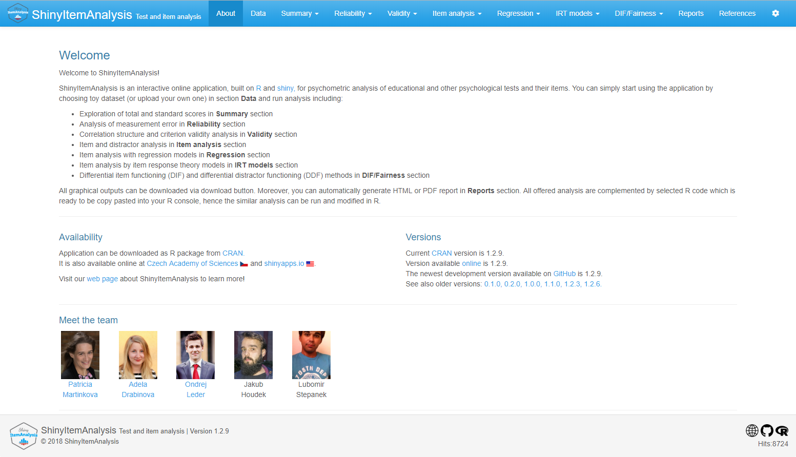{#fig:intro width="100%"
alt="graphic without alt text"}

## Data selection and upload

Data selection is available in section **Data**. Six training datasets
may be uploaded using the **Select dataset** button: Training datasets
Medical 100, Medical 100 graded [@martinkova2017semi] and HCI
[@mcfarland2017development] from the *ShinyItemAnalysis* package, and
datasets GMAT [@martinkova2017checking], GMAT2 and MSAT-B
[@drabinova2017detection] from the *difNLR* package [@difNLR].

Besides the provided toy datasets, users' own data may be uploaded as
csv files and previewed in this section. To replicate examples involving
the HCI dataset [@mcfarland2017development], csv files are provided for
upload in Supplemental Materials.

{#fig:data width="100%"
alt="graphic without alt text"}

## Item analysis step-by-step

Further sections of the *ShinyItemAnalysis* application allow for
step-by-step test and item analysis. The first four sections are devoted
to traditional test and item analyses in a framework of classical test
theory. Further sections are devoted to regression models, to IRT models
and to DIF methods. A separate section is devoted to report generation
and references are provided in the final section. The individual
sections are described below in more detail.

Section **Summary** provides for histogram and summary statistics of the
total scores as well as for various standard scores (Z scores, T
scores), together with percentile and success rate for each level of the
total score. Section **Reliability** offers internal consistency
estimates with Cronbach's alpha.

Section **Validity** provides correlation structure (Figure
[3](#fig:validity), left) and checks of criterion validity (Figure
[3](#fig:validity), right). A correlation heat map displays selected
type of correlation estimates between items. Polychoric correlation is
the default correlation used for binary data. The plot can be reordered
using hierarchical clustering while highlighting a specified number of
clusters. Clusters of correlated items need to be checked for content
and other similarities to see if they are intended. Criterion validity
is analyzed with respect to selected variables (e. g. subsequent study
success, major, or total score on a related test) and may be analyzed
for the test as a whole or for individual items.

<figure id="fig:validity">

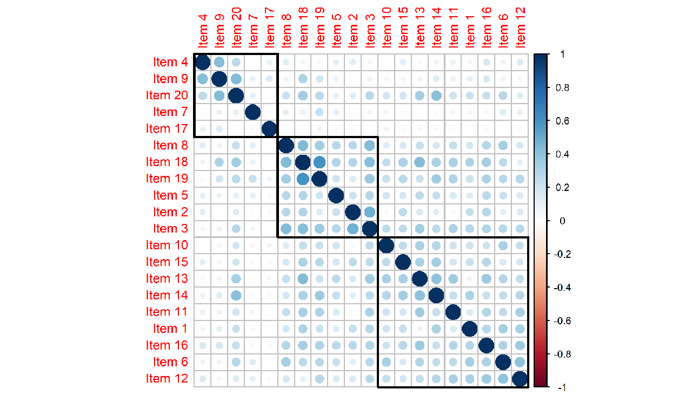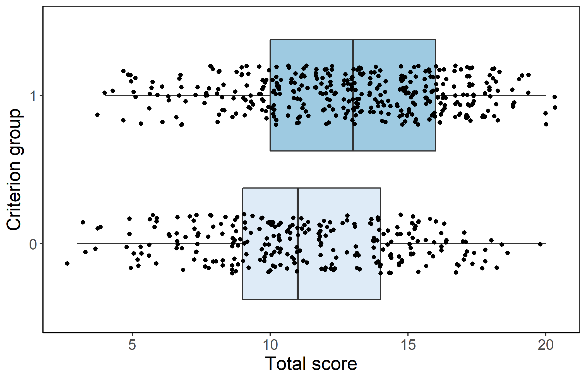

<figcaption>Figure 3: Validity plots for HCI data.</figcaption>
</figure>

Section **Item analysis** offers traditional item analysis of the test
as well as a more detailed distractor analysis. The so called DD plot
(Figure [4](#fig:ddplot)) displays difficulty (red) and a selected
discrimination index (blue) for all items. Items are ordered by
difficulty. While lower discrimination may be expected for very easy or
very hard items, all items with ULI discrimination lower than 0.2
(borderline in the plot) are worth further checks by content experts.

{#fig:ddplot width="100%"
alt="graphic without alt text"}

The distractor plot (Figure [5](#fig:distractor)) provides for detailed
analysis of individual distractors by the respondents' total score. The
correct answer should be selected more often by strong students than by
students with a lower total score, i. e. the solid line in the
distractor plot (see Figure [5](#fig:distractor)) should be increasing.
The distractors should work in an opposite direction, i. e. the dotted
lines should be decreasing.

<figure id="fig:distractor">

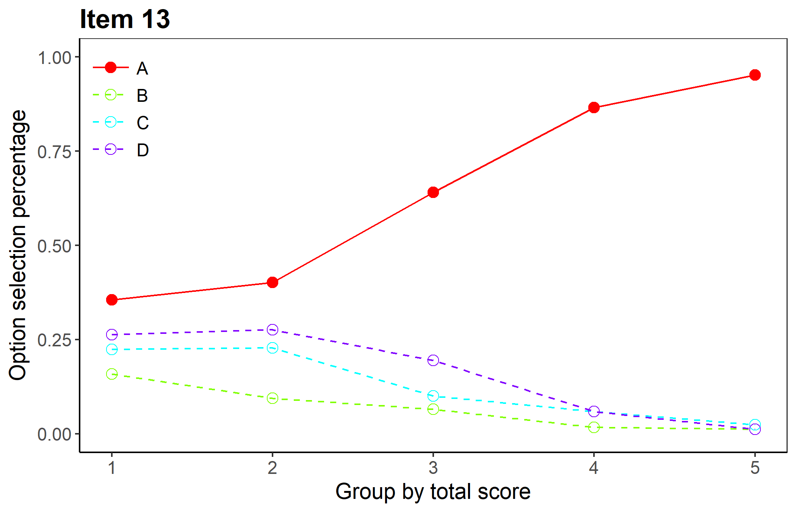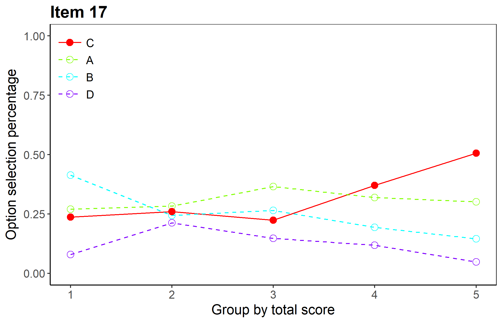

<figcaption>Figure 5: Distractor plots for items 13 and 17 in HCI
data.</figcaption>
</figure>

Section **Regression** allows for modelling of item properties with a
logistic, non-linear or multinomial regression (see Figures
[6](#fig:regression)). Probability of the selection of a given answer is
modelled with respect to the total or standardized total score.
Classical as well as IRT parametrization are provided for logistic and
non-linear models. Model fit can be compared by Akaike's
[@akaike1974new] or Schwarz's Bayesian [@schwarz1978estimating]
information criteria and a likelihood-ratio test.

<figure id="fig:regression">

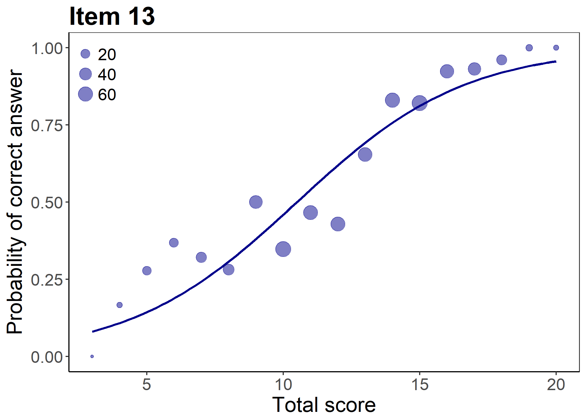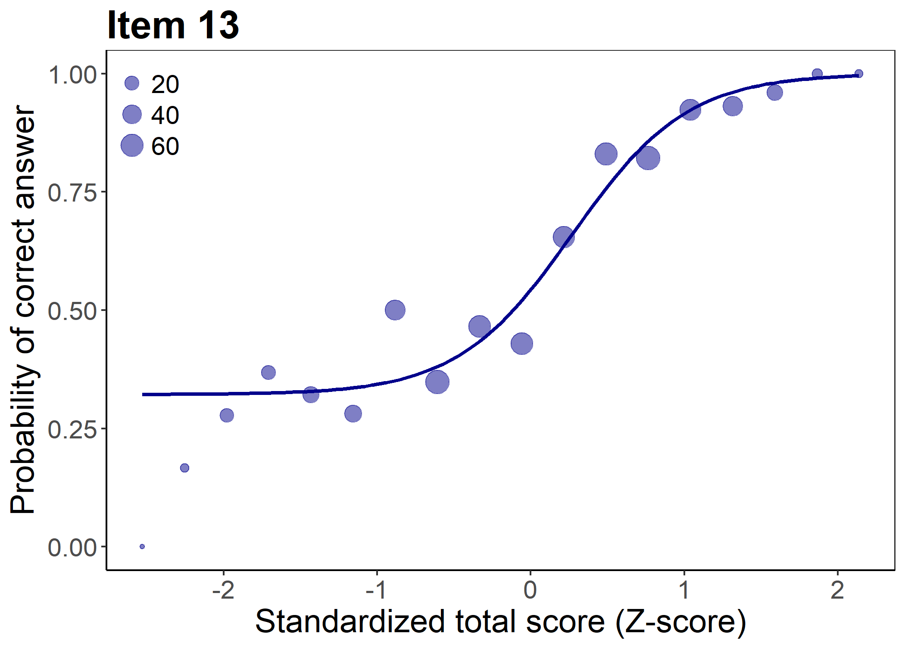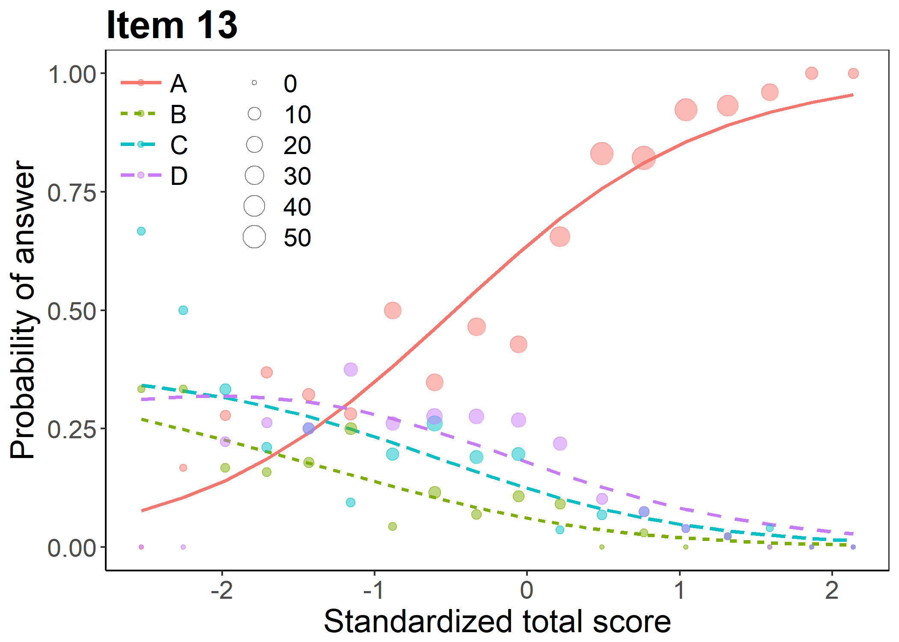

<figcaption>Figure 6: Regression plots for item 13 in HCI
data.</figcaption>
</figure>

Section **IRT models** provides for 1-4PL IRT models as well as Bock's
nominal model, which may also be used for ordinal items. In IRT model
specification, *ShinyItemAnalysis* uses default settings of the *mirt*
package and for the Rasch model [@rasch1960studies] it fixes
discrimination to $a = 1$, while variance of ability $\theta$ is freely
estimated. Contrary to Rasch model, 1PL model allows any discrimination
$a \in R$ (common to all items), while fixing variance of ability
$\theta$ to 1. Similarly, other submodels of 4PL model \@ref(eq:4PLIRT),
e. g. 2PL and 3PL model, may be obtained by fixing appropriate
parameters, while variance of ability $\theta$ is fixed to 1.

Interactive item characteristic curves (ICC), item information curves
(IIC) and test information curves (TIC) are provided for all IRT models
(see Figure [7](#fig:irt)). An item-person map is displayed for Rasch
and 1PL models (Figure [7](#fig:irt), bottom right). Table of item
parameter estimates is completed by $S-X^2$ item fit statistics
[@orlando2000fit]. Estimated latent abilities (factor scores) are also
available for download. While fitting of IRT models is mainly
implemented using the *mirt* package [@mirt], sample R code is provided
for work in both *mirt* and *ltm* [@ltm].

{#fig:irt width="100%"
alt="graphic without alt text"}

Finally, section **DIF/Fairness** offers the most used tools for
detection of DIF and DDF included in *deltaPlotR* [@deltaPlotR], *difR*
[@difR] and the *difNLR* package (@difNLR, [-@difNLR], see also
@drabinova2018difnlr, [-@drabinova2018difnlr] and
@drabinova2017detection, [-@drabinova2017detection]).

Datasets GMAT and HCI provide valuable teaching examples, further
discussed in [@martinkova2017checking]. HCI is an example of a situation
whereby the two groups differ significantly in their overall ability,
yet no item is detected as DIF. Dataset GMAT was simulated to
demonstrate that it is hypothetically possible that even though the
distributions of the total scores for the two groups are identical, yet,
there may be an item present that functions differently for each group
(see Figure [8](#fig:dif_histogram)).

<figure id="fig:dif_histogram">

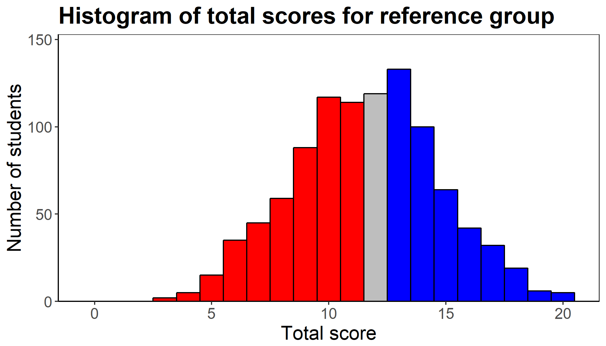

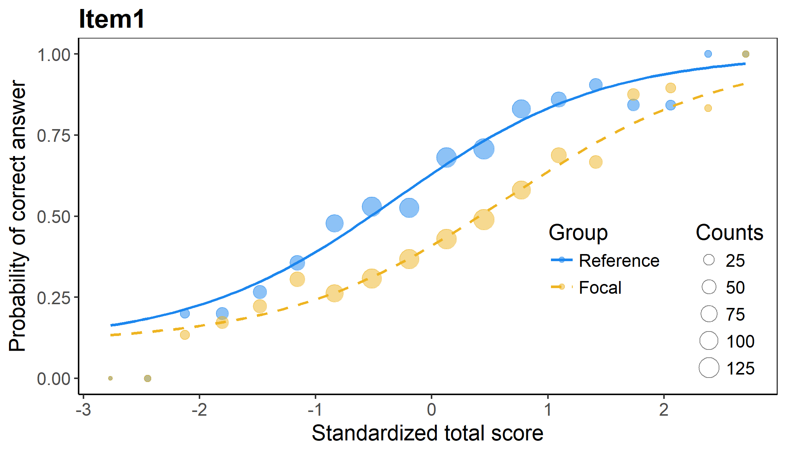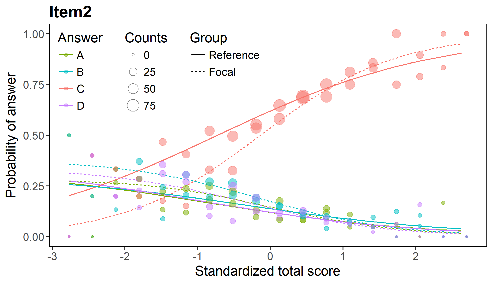

<figcaption>Figure 8: GMAT data simulated to show that hypothetically,
two groups may have an identical distribution of total scores, yet there
may be a DIF item present in the data. </figcaption>
</figure>

## Teaching with *ShinyItemAnalysis*

*ShinyItemAnalysis* is based on examples developed for a course of IRT
models and psychometrics offered to graduate students at the University
of Washington and at the Charles University. It has also been used at
workshops for educators developing admission tests and other tests in
various fields.

Besides the presence of a broad range of CTT as well as IRT methods, toy
data examples, model equations, parameter estimates, and interactive
interpretation of results, selected R code is also available, ready to
be copy-pasted and run in R. The shiny application can thus serve as a
bridge to users who do not feel secure in the R programming environment
by providing examples which can be further modified or adopted to
different datasets.

As an important teaching tool, an interactive training section is
present, deploying item characteristic and item information curves for
IRT models. For dichotomous models (Figure [9](#fig:training), left),
the user can specify parameters $a,$ $b,$ $c,$ and $d$ of two toy items
and latent ability $\theta$ of respondent. ICC is then provided
interactively, displaying probability of a correct answer for any
$\theta$ and highlighting this probability for selected $\theta$. IIC
compares the two items in the amount of information they provide about
respondents of a given ability level.

For polytomous items (Figure [9](#fig:training), right), analogous
interactive plots are available for GRM, (G)PCM as well as for NRM. Step
functions are displayed for GRM, and category response functions are
available for all three models. In addition, the expected item score is
displayed for all the models.

<figure id="fig:training">

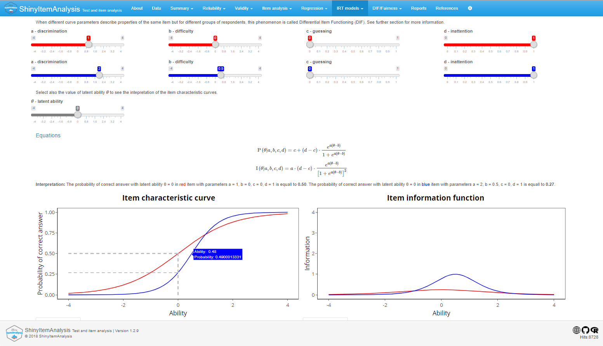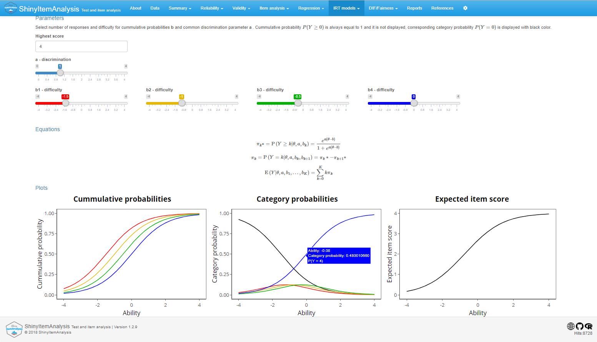

<figcaption>Figure 9: Interactive training IRT section. </figcaption>
</figure>

The training sections also contain interactive exercises where students
may check their understanding of the IRT models. They are asked to
sketch ICC and IIC functions of items with given parameters, and to
answer questions, e. g. regarding probabilities of correct answers and
the information these items provide for certain ability levels.

## Automatic report generation

To support routine usage of psychometric methods in test development,
*ShinyItemAnalysis* offers the possibility to upload your own data for
analysis as csv files, and to generate PDF or HTML reports. A sample PDF
report and the corresponding csv files used for its generation are
provided in Supplemental Materials.

Report generation uses *rmarkdown* templates and *knitr* for compiling
(see Figure [10](#fig:reportworkflow)). LaTeX is used for creating PDF
reports. The latest version of LaTeX with properly set paths is needed
to generate PDF reports locally.

<figure id="fig:reportworkflow">
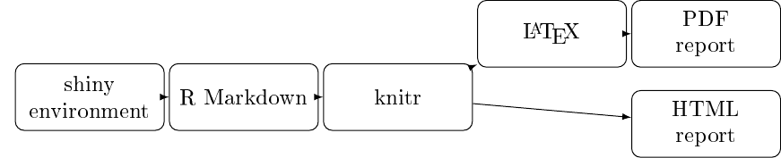

<figcaption>Figure 10: Report generation workflow.</figcaption>
</figure>

Page with report setting allows user to specify a dataset name, the name
of the person who generated the report, to select a method and to
customize the settings (see Figure [11](#fig:report)). The **Generate
report** button at the bottom starts analyses needed for the report to
be created. Subsequently, the **Download report** button initializes
compiling the text, tables and figures into a PDF or an HTML file.

<figure id="fig:report">

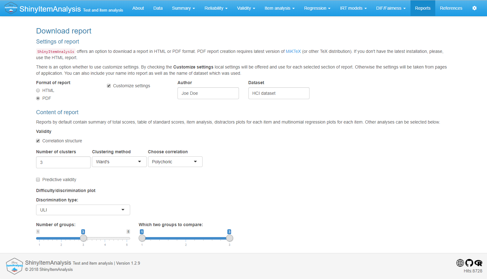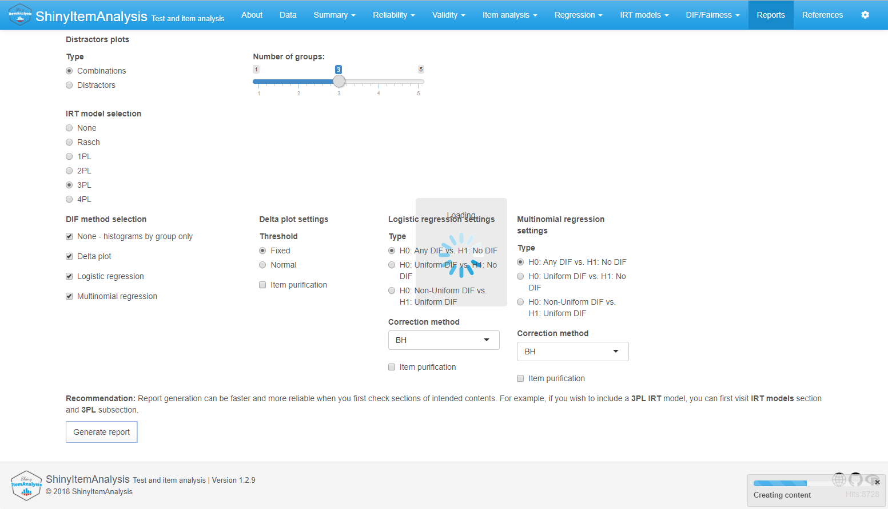

<figcaption>Figure 11: Report settings for the HCI data analysis.
</figcaption>
</figure>

Sample pages of a PDF report on the HCI dataset are displayed in Figure
[12](#fig:reportsample). Reports provide a quick overview of test
characteristics and may be a helpful material for test developers, item
writers and institutional stakeholders.

<figure id="fig:reportsample">
<table>
<caption> </caption>
<tbody>
<tr class="odd">
<td style="text-align: center;">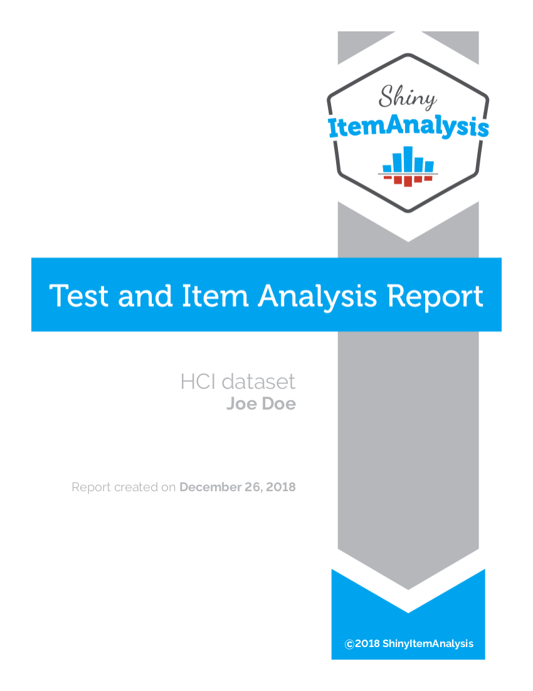</td>
<td style="text-align: center;">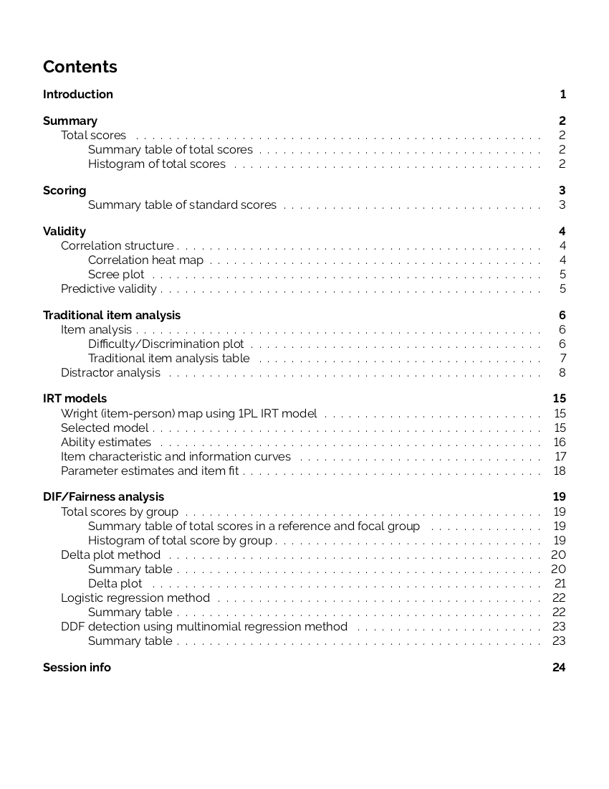</td>
<td style="text-align: center;">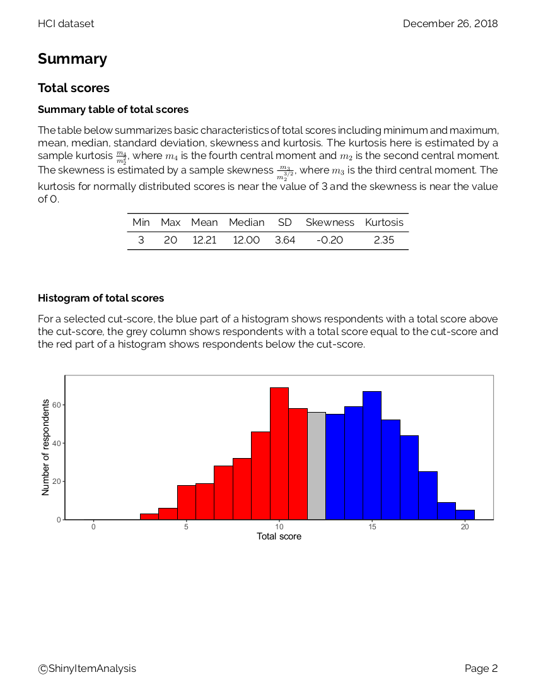</td>
<td style="text-align: center;">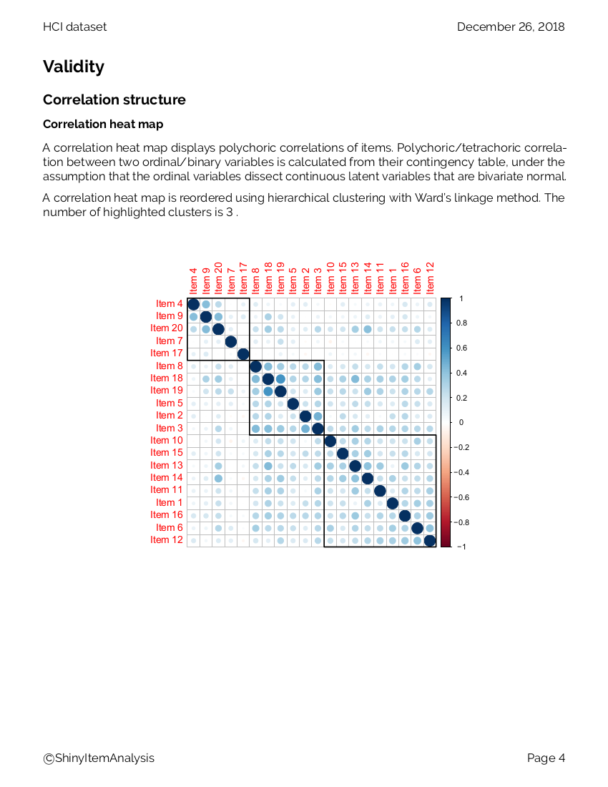</td>
</tr>
<tr class="even">
<td style="text-align: center;">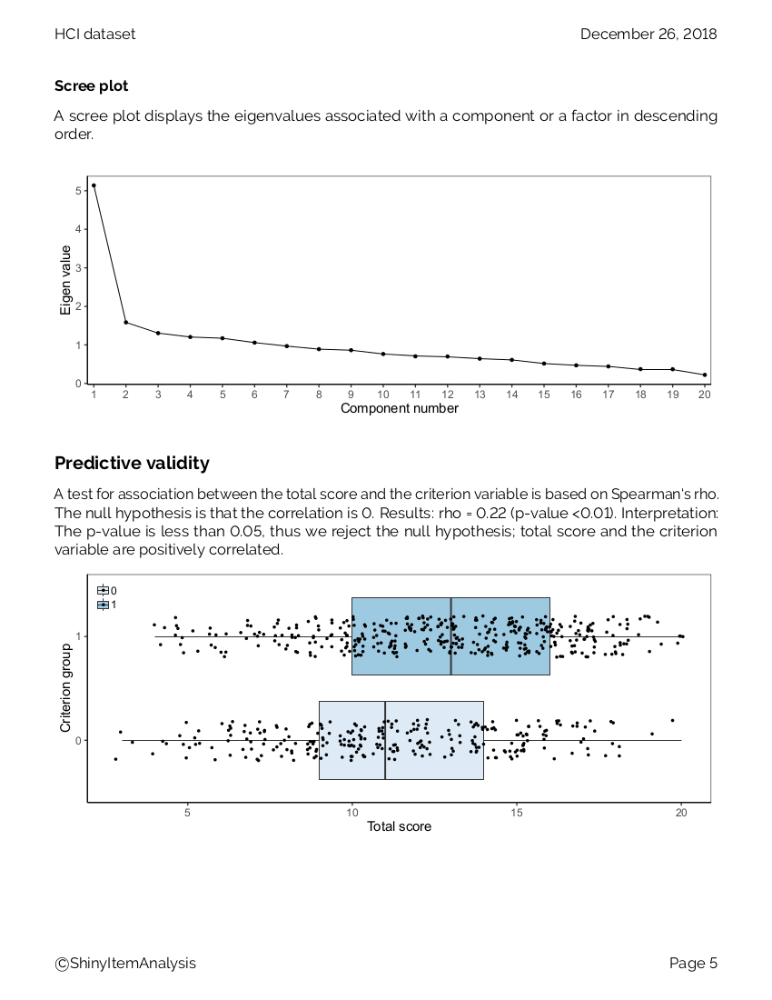</td>
<td style="text-align: center;">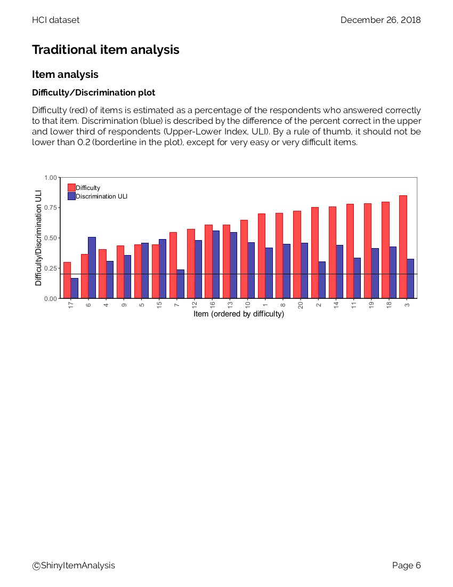</td>
<td style="text-align: center;">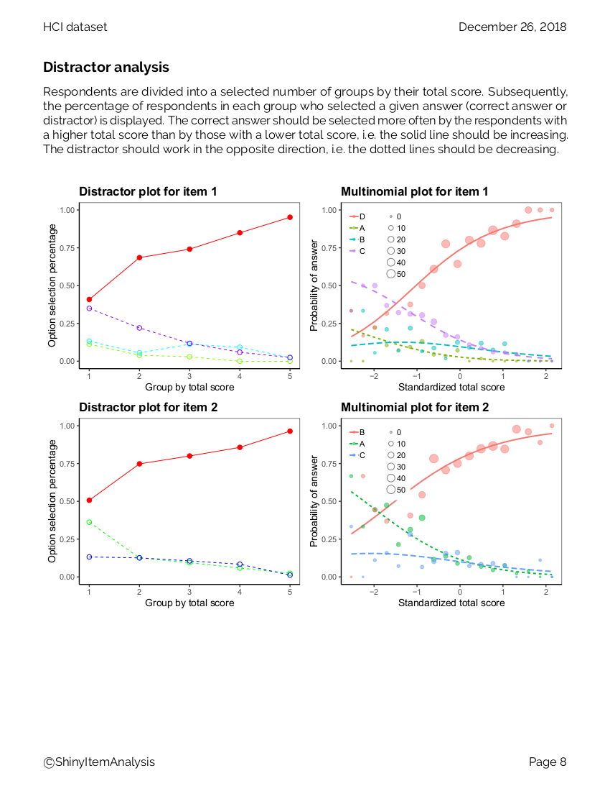</td>
<td style="text-align: center;">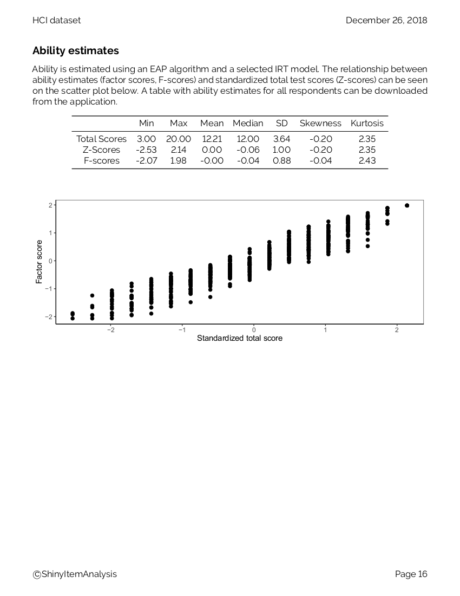</td>
</tr>
</tbody>
</table>
<figcaption>Figure 12: Selected pages of a report on the HCI
data.</figcaption>
</figure>

# Discussion and conclusion

*ShinyItemAnalysis* is an R package (currently version 1.2.9) and an
online shiny application for psychometric analysis of educational tests
and items. It is suitable for teaching psychometric concepts and it
aspires to be an easy-to-use tool for routine analysis of educational
tests. For teaching psychometric concepts, a wide range of models and
methods are provided, together with interactive plots, exercises, data
examples, model equations, parameter estimates, interpretation of
results, and selected R code to bring new users to R. For analysis of
educational tests by educators, *ShinyItemAnalysis* interactive
application allows users to upload and analyze their own data online or
locally, and to automatically generate analysis reports in PDF or HTML.

Functionality of the *ShinyItemAnalysis* has been validated on three
groups of users. As the first group, two university professors teaching
psychometrics and test development provided their written feedback on
using the application and suggested edits for wording used for
interpretation of results provided by the shiny application. As the
second group, over 20 participants of a graduate seminar on \"Selected
Topics in Psychometrics\" at the Charles University in 2017/2018 used
*ShinyItemAnalysis* throughout the year in practical exercises. Students
prepared their final projects with *ShinyItemAnalysis* applied on their
own datasets and provided closer feedback on their experience. The third
group consisted of more than 20 university academics from different
fields who participated in a short-term course on \"Test Development and
Validation\" in 2018 at the Charles University. During the course,
participants used the application on toy data embedded in the package.
In addition, an online knowledge test was prepared in Google Docs,
answered by participants, and subsequently analyzed in
*ShinyItemAnalysis* during the same session. Participants provided their
feedback and commented on usability of the package and shiny
application. As a result, various features were improved (e. g. data
upload format was extended, some cases of missing values are now
handled).

Current developments of the *ShinyItemAnalysis* package comprise
implementation of wider types of models, especially ordinal and
multinomial models and models accounting for effect of the rater and a
hierarchical structure. In reliability estimation, further sources of
data variability are being implemented to provide estimation of
model-based inter-rater reliability [@martinkova2018disparities].
Technical improvements include a more complex data upload or automatic
testing of new versions of the application.

We argue that psychometric analysis should be a routine part of test
development in order to gather proofs of reliability and validity of the
measurement and we have demonstrated how *ShinyItemAnalysis* may enforce
this goal. It may also serve as an example for other fields,
demonstrating the ability of shiny applications to interactively present
theoretical concepts and, when complemented with sample R code, to bring
new users to R, or to serve as a bridge to those who have not yet
discovered the beauties of R.

# Acknowledgments

This work was initiated while P. Martinková was a Fulbright-Masaryk
fellow with University of Washington. Research was partly supported by
the Czech Science Foundation (grant number GJ15-15856Y). We gratefully
thank Jenny McFarland for providing HCI data and David Magis, Hynek
Cígler, Hana Ševčíková, Jon Kern and anonymous reviewers for helpful
comments to previous versions of this manuscript. We also wish to
acknowledge those who contributed to the *ShinyItemAnalysis* package or
provided their valuable feedback by e-mail, on GitHub or through an
online Google form at <http://www.ShinyItemAnalysis.org/feedback.html>.
:::
