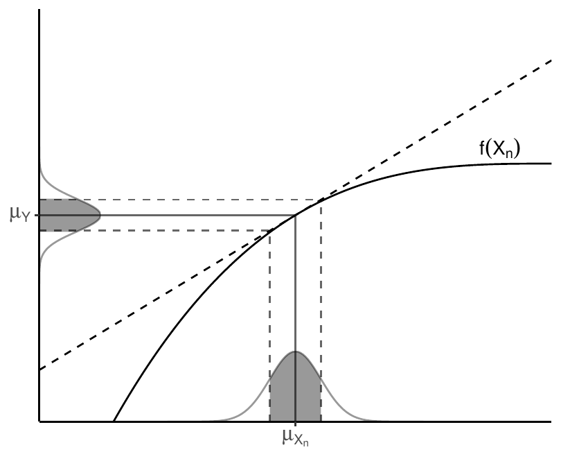

::: article
# Introduction

The International Vocabulary of Metrology (VIM) defines a quantity as "a
property of a phenomenon, body, or substance, where the property has a
magnitude that can be expressed as a number and a reference", where most
typically the number is a quantity value, attributed to a measurand and
experimentally obtained via some measurement procedure, and the
reference is a measurement unit [@VIM:2012].

Additionally, any quantity value must accommodate some indication about
the quality of the measurement, a quantifiable attribute known as
uncertainty. The Guide to the Expression of Uncertainty in Measurement
(GUM) defines uncertainty as "a parameter, associated with the result of
a measurement, that characterises the dispersion of the values that
could reasonably be attributed to the measurand" [@GUM:2008].
Uncertainty can be mainly classified into standard uncertainty, which is
the result of a direct measurement (e.g., electrical voltage measured
with a voltmeter, or current measured with a amperemeter), and combined
standard uncertainty, which is the result of an indirect measurement
(i.e., the standard uncertainty when the result is derived from a number
of other quantities by the means of some mathematical relationship;
e.g., electrical power as a product of voltage and current). Therefore,
provided a set of quantities with known uncertainties, the process of
obtaining the uncertainty of a derived measurement is called propagation
of uncertainty.

Traditionally, computational systems have treated these three components
(quantity values, measurement units and uncertainty) separately. Data
consisted of bare numbers, and mathematical operations applied to them
solely. Units were just metadata, and uncertainty propagation was an
unpleasant task requiring additional effort and complex operations.
Nowadays though, many software libraries have formalised quantity
calculus as method of including units within the scope of mathematical
operations, thus preserving dimensional correctness and protecting us
from computing nonsensical combinations of quantities. However, these
libraries rarely integrate uncertainty handling and propagation
[@Flatter:2018].

Within the R environment, the
[*units*](https://CRAN.R-project.org/package=units) package
[@CRAN:units; @Pebesma:2016:units] defines a class for associating unit
metadata to numeric vectors, which enables transparent quantity
derivation, simplification and conversion. This approach is a very
comfortable way of managing units with the added advantage of
eliminating an entire class of potential programming mistakes.
Unfortunately, neither *units* nor any other package address the
integration of uncertainties into quantity calculus.

This article presents
[*errors*](https://CRAN.R-project.org/package=errors) [@CRAN:errors], a
package that defines a framework for associating uncertainty metadata to
R vectors, matrices and arrays, thus providing transparent, lightweight
and automated propagation of uncertainty. This implementation also
enables ongoing developments for integrating units and uncertainty
handling into a complete solution.

# Propagation of uncertainty

There are two main methods for propagation of uncertainty: the Taylor
series method (TSM) and the Monte Carlo method (MCM). The TSM, also
called the delta method, is based on a Taylor expansion of the
mathematical expression that produces the output variables. As for the
MCM, it can deal with generalised input distributions and propagates the
uncertainty by Monte Carlo simulation.

## Taylor series method

The TSM is a flexible and simple method of propagation of uncertainty
that offers a good degree of approximation in most cases. In the
following, we will provide a brief description. A full derivation,
discussion and examples can be found in @Arras:1998.

Mathematically, an indirect measurement is obtained as a function of $n$
direct or indirect measurements, $Y = f(X_1, ..., X_n)$, where the
distribution of $X_n$ is unknown *a priori*. Usually, the sources of
random variability are many, independent and probably unknown as well.
Thus, the central limit theorem establishes that an addition of a
sufficiently large number of random variables tends to a normal
distribution. As a result, the **first assumption** states that $X_n$
are normally distributed.

The **second assumption** presumes linearity, i.e., that $f$ can be
approximated by a first-order Taylor series expansion around $\mu_{X_n}$
(see Figure [[propagation]](#propagation)). Then, given a set of $n$
input variables $X$ and a set of $m$ output variables $Y$, the
first-order uncertainty propagation law establishes that

$$\Sigma_Y = J_X \Sigma_X J_X^T\label{eq:prop-law}   
(\#eq:prop-law)$$

where $\Sigma$ is the covariance matrix and $J$ is the Jacobian
operator.

<figure id="fig:fig1">

<figcaption>Figure 1: Illustration of linearity in an interval <span
class="math inline">±</span> one standard deviation around the
mean.<span id="propagation" label="propagation"></span></figcaption>
</figure>

In practice, as recommended in the GUM [@GUM:2008], this first-order
approximation is good even if $f$ is non-linear, provided that the
non-linearity is negligible compared to the magnitude of the
uncertainty, i.e., $\mathbb{E}[f(X)]\approx f(\mathbb{E}[X])$. Also,
this weaker condition is distribution-free: no assumptions are needed on
the probability density functions (PDF) of $X_n$, although they must be
reasonably symmetric.

If we consider Equation \@ref(eq:prop-law) for pairwise computations,
i.e., $Y = f(X_1, X_2)$, we can write the propagation of the uncertainty
$\sigma_Y$ as follows:

$$\label{eq:prop-var}
  \sigma_Y^2 = \left(\frac{\partial^2 f}{\partial X_1^2}\right)^2 \sigma_{X_1}^2 +
               \left(\frac{\partial^2 f}{\partial X_2^2}\right)^2 \sigma_{X_2}^2 +
               2 \frac{\partial f \partial f}{\partial X_1 \partial X_2} \sigma_{X_1 X_2}   (\#eq:prop-var)$$

The cross-covariances for the output $Y$ and any other variable $Z$ can
be simplified as follows:

$$\label{eq:prop-covar}
  \sigma_{Y Z} = \frac{\partial f}{\partial X_1} \sigma_{X_1 Z} +
                 \frac{\partial f}{\partial X_2} \sigma_{X_2 Z}   (\#eq:prop-covar)$$

where, notably, if $Z=X_i$, one of the covariances above results in
$\sigma_{X_i}^2$. Finally, and for the sake of completeness, the
correlation coefficient can be obtained as
$r_{Y Z} = \sigma_{Y Z} / (\sigma_{Y}\sigma_{Z})$.

## Monte Carlo method

The MCM is based on the same principles underlying the TSM. It is based
on the propagation of the PDFs of the input variables $X_n$ by
performing random sampling and evaluating them under the model
considered. Thus, this method is not constrained by the TSM assumptions,
and explicitly determines a PDF for the output quantity $Y$, which makes
it a more general approach that applies to a broader set of problems.
For further details on this method, as well as a comparison with the TSM
and some discussion on the applicability of both methods, the reader may
refer to the Supplement 1 of the GUM [@GUM:2008].

# Reporting uncertainty

The GUM [@GUM:2008] defines four ways of reporting standard uncertainty
and combined standard uncertainty. For instance, if the reported
quantity is assumed to be a mass $m_S$ of nominal value 100 g:

> 1.  $m_S = 100.02147$ g with (a combined standard uncertainty) $u_c$ =
>     0.35 mg.
>
> 2.  $m_S = 100.02147(35)$ g, where the number in parentheses is the
>     numerical value of (the combined standard uncertainty) $u_c$
>     referred to the corresponding last digits of the quoted result.
>
> 3.  $m_S = 100.02147(0.00035)$ g, where the number in parentheses is
>     the numerical value of (the combined standard uncertainty) $u_c$
>     expressed in the unit of the quoted result.
>
> 4.  $m_S = (100.02147 \pm 0.00035)$ g, where the number following the
>     symbol $\pm$ is the numerical value of (the combined standard
>     uncertainty) $u_c$ and not a confidence interval.

Schemes (2, 3) and (4) would be referred to as parenthesis notation and
plus-minus notation respectively throughout this document. Although (4)
is a very extended notation, the GUM explicitly discourages its use to
prevent confusion with confidence intervals.

# Related work

Several R packages are devoted to or provide methods for propagation of
uncertainties. The [*car*](https://CRAN.R-project.org/package=car)
[@CRAN:car; @Fox:2011:car] and
[*msm*](https://CRAN.R-project.org/package=msm)
[@CRAN:msm; @Jackson:2011:msm] packages provide the functions
`deltaMethod()` and `deltamethod()` respectively. Both of them implement
a first-order TSM with a similar syntax, requiring a formula, a vector
of values and a covariance matrix, thus being able to deal with
dependency across variables.

``` r
library(msm)

vals <- c(5, 1)
err <- c(0.01, 0.01)
deltamethod(~ x1 / x2, vals, diag(err**2))
```

``` r
#> [1] 0.0509902
```

The [*metRology*](https://CRAN.R-project.org/package=metRology)
[@CRAN:metRology] and
[*propagate*](https://CRAN.R-project.org/package=propagate)
[@CRAN:propagate] packages stand out as very comprehensive sets of tools
specifically focused on this topic, including both TSM and MCM. The
*metRology* package implements TSM using algebraic or numeric
differentiation, with support for correlation. It also provides a
function for assessing the statistical performance of GUM uncertainty
(TSM) using attained coverage probability. The *propagate* package
implements TSM up to second order. It provides a unified interface for
both TSM and MCM through the `propagate()` function, which requires an
expression and a data frame or matrix as input. In the following
example, the uncertainty of $x/y$ is computed, where $x=5.00(1)$ and
$y=1.00(1)$. The first result corresponds to the TSM method and the
second one, to the MCM.

``` r
library(propagate); set.seed(42)

x <- c(5, 0.01)
y <- c(1, 0.01)
propagate(expression(x/y), data=cbind(x, y), type="stat", do.sim=TRUE)
```

``` r
#>    Mean.1    Mean.2      sd.1      sd.2      2.5%     97.5% 
#> 5.0000000 5.0005000 0.0509902 0.0509952 4.9005511 5.1004489 
#>       Mean         sd     Median        MAD       2.5%      97.5% 
#> 5.00042580 0.05101762 4.99991050 0.05103023 4.90184577 5.10187805
```

Unfortunately, as in the case of *car* and *msm*, these packages are
limited to work only with expressions, which does not solve the issue of
requiring a separate workflow to deal with uncertainties.

The [*spup*](https://CRAN.R-project.org/package=spup) package
[@CRAN:spup] focuses on uncertainty analysis in spatial environmental
modelling, where the spatial cross-correlation between variables becomes
important. The uncertainty is described with probability distributions
and propagated using MCM.

Finally, the [*distr*](https://CRAN.R-project.org/package=distr) package
[@CRAN:distr; @Ruckdeschel:2006:distr] takes this idea one step further
by providing an S4-based object-oriented implementation of probability
distributions, with which one can operate arithmetically or apply
mathematical functions. It implements all kinds of probability
distributions and has more methods for computing the distribution of
derived quantities. Also, *distr* is the base of a whole family of
packages, such as
[*distrEllipse*](https://CRAN.R-project.org/package=distrEllipse),
[*distrEx*](https://CRAN.R-project.org/package=distrEx),
[*distrMod*](https://CRAN.R-project.org/package=distrMod),
[*distrRmetrics*](https://CRAN.R-project.org/package=distrRmetrics),
[*distrSim*](https://CRAN.R-project.org/package=distrSim) and
[*distrTeach*](https://CRAN.R-project.org/package=distrTeach).

All these packages provide excellent tools for uncertainty analysis and
propagation. However, none of them addresses the issue of an integrated
workflow, as *units* does for unit metadata by assigning units directly
to R vectors, matrices and arrays. As a result, units can be added to
any existing R computation in a very straightforward way. On the other
hand, existing tools for uncertainty propagation require building
specific expressions or data structures, and then some more work to
extract the results out and to report them properly, with an appropriate
number of significant digits.

# Automated uncertainty handling in R: the *errors* package {#automated-uncertainty-handling-in-r-the-package}

The *errors* package aims to provide easy and lightweight handling of
measurement with errors, including uncertainty propagation using the
first-order TSM presented in the previous section and a formally sound
representation.

## Package description and usage

Standard uncertainties, can be assigned to numeric vectors, matrices and
arrays, and then all the mathematical and arithmetic operations are
transparently applied to both the values and the associated
uncertainties:

``` r
library(errors)

x <- 1:5 + rnorm(5, sd = 0.01)
y <- 1:5 + rnorm(5, sd = 0.02)
errors(x) <- 0.01
errors(y) <- 0.02
x; y
```

``` r
#> Errors: 0.01 0.01 0.01 0.01 0.01
#> [1] 0.990148 1.993813 2.995589 3.995865 5.011481
```

``` r
#> Errors: 0.02 0.02 0.02 0.02 0.02
#> [1] 1.014570 1.996277 2.959307 3.992147 5.013118
```

``` r
(z <- x / y)
```

``` r
#> Errors: 0.021616206 0.011190137 0.007630253 0.005605339 0.004459269
#> [1] 0.9759291 0.9987660 1.0122601 1.0009312 0.9996735
```

The `errors()` method assigns or retrieves a vector of uncertainties,
which is stored as an attribute of the class `errors`, along with a
unique object identifier:

``` r
str(x)
```

``` r
#>  'errors' num [1:5] 0.99(1) 1.99(1) 3.00(1) 4.00(1) 5.01(1)
#>  - attr(*, "id")=<environment: 0x55e111773cd8> 
#>  - attr(*, "errors")= num [1:5] 0.01 0.01 0.01 0.01 0.01
```

Correlations (and thus covariances) between pairs of variables can be
set and retrieved using the `correl()` and `covar()` methods. These
correlations are stored in an internal hash table indexed by the unique
object identifier assigned to each `errors` object. If an object is
removed, its associated correlations are cleaned up automatically.

``` r
correl(x, x) # one, cannot be changed
```

``` r
#> [1] 1 1 1 1 1
```

``` r
correl(x, y) # NULL, not defined yet
```

``` r
#> NULL
```

``` r
correl(x, y) <- runif(length(x), -1, 1)
correl(x, y)
```

``` r
#> [1]  0.39668415 -0.03191595  0.91062883 -0.37620892  0.25118328
```

``` r
covar(x, y)
```

``` r
#> [1]  7.933683e-05 -6.383190e-06  1.821258e-04 -7.524178e-05  5.023666e-05
```

Internally, *errors* provides S3 methods for the generics belonging to
the groups `Math` and `Ops`, which propagate the uncertainty and the
covariance using Equations \@ref(eq:prop-var) and \@ref(eq:prop-covar)
respectively.

``` r
z # previous computation without correlations
```

``` r
#> Errors: 0.021616206 0.011190137 0.007630253 0.005605339 0.004459269
#> [1] 0.9759291 0.9987660 1.0122601 1.0009312 0.9996735
```

``` r
(z_correl <- x / y)
```

``` r
#> Errors: 0.017799486 0.011332199 0.004014688 0.006393033 0.003986033
#> [1] 0.9759291 0.9987660 1.0122601 1.0009312 0.9996735
```

Other many S3 methods are also provided, such as generics belonging to
the `Summary` group, subsetting operators (`[`, `[<-`, `[[`, `[[<-`),
concatenation (`c()`), differentiation (`diff`), row and column binding
(`rbind`, `cbind`), coercion to list, data frame and matrix, and more.
Such methods mutate the `errors` object, and thus return a new one with
no correlations associated. There are also *setters* defined as an
alternative to the assignment methods (`set_*()` instead of `errors<-`,
`correl<-` and `covar<-`), primarily intended for their use in
conjunction with the pipe operator (`%>%`) from the
[*magrittr*](https://CRAN.R-project.org/package=magrittr)
[@CRAN:magrittr] package.

Additionally, other useful summaries are provided, namely, the mean, the
weighted mean and the median. The uncertainty of any measurement of
central tendency cannot be smaller than the uncertainty of the
individual measurements. Therefore, the uncertainty assigned to the mean
is computed as the maximum between the standard deviation of the mean
and the mean of the individual uncertainties (weighted, in the case of
the weighted mean). As for the median, its uncertainty is computed as
$\sqrt{\pi/2}\approx1.253$ times the standard deviation of the mean,
where this constant comes from the asymptotic variance formula
[@Hampel:2011:Robust].

It is worth noting that both values and uncertainties are stored with
all the digits. However, when a single measurement or a column of
measurements in a data frame are printed, there are S3 methods for
`format()` and `print()` defined to properly format the output and
display a single significant digit for the uncertainty. This default
representation can be overridden using the `digits` option, and it is
globally controlled with the option `errors.digits`.

``` r
# the elementary charge
e <- set_errors(1.6021766208e-19, 0.0000000098e-19)
print(e, digits = 2)
```

``` r
#> 1.6021766208(98)e-19
```

The parenthesis notation, in which *the number in parentheses is the
uncertainty referred to the corresponding last digits of the quantity
value* (scheme 2 from the GUM, widely used in physics due to its
compactness), is used by default, but this can be overridden through the
appropriate option in order to use the plus-minus notation instead.

``` r
options(errors.notation = "plus-minus")
print(e, digits = 2)
```

``` r
#> (1.6021766208 ± 0.0000000098)e-19
```

``` r
options(errors.notation = "parenthesis")
```

Finally, *errors* also facilitates plotting of error bars. In the
following, we first assign a 2% of uncertainty to all the numeric
variables in the `iris` data set and then we plot it using base graphics
and [*ggplot2*](https://CRAN.R-project.org/package=ggplot2)
[@CRAN:ggplot2; @Wickham:2009:ggplot2]. The result is shown in Figure
[[plot]](#plot).

``` r
library(dplyr)

iris.e <- iris %>%
  mutate_at(vars(-Species), funs(set_errors(., .*0.02)))

head(iris.e, 5)
```

``` r
#>   Sepal.Length Sepal.Width Petal.Length Petal.Width Species
#> 1       5.1(1)     3.50(7)      1.40(3)    0.200(4)  setosa
#> 2       4.9(1)     3.00(6)      1.40(3)    0.200(4)  setosa
#> 3      4.70(9)     3.20(6)      1.30(3)    0.200(4)  setosa
#> 4      4.60(9)     3.10(6)      1.50(3)    0.200(4)  setosa
#> 5       5.0(1)     3.60(7)      1.40(3)    0.200(4)  setosa
```

``` r
plot(iris.e[["Sepal.Length"]], iris.e[["Sepal.Width"]], col=iris.e[["Species"]])
legend(6.2, 4.4, unique(iris.e[["Species"]]), col=1:length(iris.e[["Species"]]), pch=1)
```

``` r
library(ggplot2)

ggplot(iris.e, aes(Sepal.Length, Sepal.Width, color=Species)) + 
  geom_point() + theme_bw() + theme(legend.position=c(0.6, 0.8)) +
  geom_errorbar(aes(ymin=errors_min(Sepal.Width), ymax=errors_max(Sepal.Width))) +
  geom_errorbarh(aes(xmin=errors_min(Sepal.Length), xmax=errors_max(Sepal.Length)))
```

![Figure 2: Base plot with error bars (left) and *ggplot2*'s version
(right).[]{#plot label="plot"}](includes/fig2-1.png){#fig:fig2
width="100%" alt="graphic without alt text"}

In base graphics, the error bars are automatically plotted when an
object of class `errors` is passed. Additionally, we provide the
convenience functions `errors_min(x)` and `errors_max(x)` for obtaining
the boundaries of the interval in *ggplot2* and other plotting packages,
instead of writing `x - errors(x)` and `x + errors(x)` respectively.

## Example: Simultaneous resistance and reactance measurement

From Annex H.2 of the GUM [@GUM:2008]:

> The resistance $R$ and the reactance $X$ of a circuit element are
> determined by measuring the amplitude $V$ of a
> sinusoidally-alternating potential difference across its terminals,
> the amplitude $I$ of the alternating current passing through it, and
> the phase-shift angle $\phi$ of the alternating potential difference
> relative to the alternating current.

The measurands (resistance $R$, reactance $X$ and impedance $Z$) are
related to the input quantities ($V$, $I$, $phi$) by the Ohm's law:

$$R = \frac{V}{I}\cos\phi; \qquad X = \frac{V}{I}\sin\phi; \qquad Z = \frac{V}{I}$$

Five simultaneous observations for each input variable are provided
(Table H.2 of the GUM), which are included in *errors* as dataset
`GUM.H.2`. First, we need to obtain the mean input values and set the
correlations from the measurements. Then, we compute the measurands and
examine the correlations between them. The results agree with those
reported in the GUM:

``` r
V   <- mean(set_errors(GUM.H.2$V))
I   <- mean(set_errors(GUM.H.2$I))
phi <- mean(set_errors(GUM.H.2$phi))

correl(V, I)   <- with(GUM.H.2, cor(V, I))
correl(V, phi) <- with(GUM.H.2, cor(V, phi))
correl(I, phi) <- with(GUM.H.2, cor(I, phi))

print(R <- (V / I) * cos(phi), digits = 2, notation = "plus-minus")
```

``` r
#> 127.732 ± 0.071
```

``` r
print(X <- (V / I) * sin(phi), digits = 3, notation = "plus-minus")
```

``` r
#> 219.847 ± 0.296
```

``` r
print(Z <- (V / I), digits = 3, notation = "plus-minus")
```

``` r
#> 254.260 ± 0.236
```

``` r
correl(R, X); correl(R, Z); correl(X, Z)
```

``` r
#> [1] -0.5884298
```

``` r
#> [1] -0.4852592
```

``` r
#> [1] 0.9925116
```

## Example: Calibration of a thermometer

From Annex H.3 of the GUM [@GUM:2008]:

> A thermometer is calibrated by comparing $n=11$ temperature readings
> $t_k$ of the thermometer \[...\] with corresponding known reference
> temperatures $t_{R,k}$ in the temperature range 21 $^\circ$C to 27
> $^\circ$C to obtain the corrections $b_k=t_{R,k}-t_k$ to the readings.

Measured temperatures and corrections (Table H.6 of the GUM), which are
included in *errors* as dataset `GUM.H.3`, are related by a linear
calibration curve:

$$b(t) = y_1 + y_2 (t - t_0)$$

In the following, we first fit the linear model for a reference
temperature $t_0=20$ $^\circ$C. Then, we extract the coefficients, and
assign the uncertainty and correlation between them. Finally, we compute
the predicted correction $b(30)$, which agrees with the value reported
in the GUM:

``` r
fit <- lm(bk ~ I(tk - 20), data = GUM.H.3)

y1 <- set_errors(coef(fit)[1], sqrt(vcov(fit)[1, 1]))
y2 <- set_errors(coef(fit)[2], sqrt(vcov(fit)[2, 2]))
covar(y1, y2) <- vcov(fit)[1, 2]

print(b.30 <- y1 + y2 * set_errors(30 - 20), digits = 2, notation = "plus-minus")
```

``` r
#> -0.1494 ± 0.0041
```

# Discussion

The *errors* package provides the means for defining numeric vectors,
matrices and arrays with errors in R, as well as to operate with them in
a transparent way. Propagation of uncertainty implements the commonly
used first-order TSM formula from Equation \@ref(eq:prop-law). This
method has been pre-computed and expanded for each operation in the S3
groups `Math` and `Ops`, instead of differentiating symbolic expressions
on demand or using functions from other packages for this task. The
advantages of this approach are twofold. On the one hand, it is faster,
as it does not involve simulation nor symbolic computation, and very
lightweight in terms of package dependencies.

Another advantage of *errors* is the built-in consistent and formally
sound representation of measurements with errors, rounding the
uncertainty to one significant digit by default and supporting two
widely used notations: parenthesis (e.g., $5.00(1)$) and plus-minus
(e.g., $5.00 \pm 0.01$). These notations are applied for single numbers
and data frames, as well as `tbl_df` data frames from the
[*tibble*](https://CRAN.R-project.org/package=tibble) [@CRAN:tibble]
package.

Full support is provided for both `data.frame` and `tbl_df`, as well as
matrices and arrays. However, some operations on those data structures
may drop uncertainties (i.e., object class and attributes). More
specifically, there are six common *data wrangling* operations: row
subsetting, row ordering, column transformation, row aggregation, column
joining and (un)pivoting. Table [1](#tab:compat) shows the
correspondence between these operations and R base functions, as well as
the compatibility with *errors*.

::: {#tab:compat}
  -----------------------------------------------------------------------------
  Operation               R base function(s)            Compatibility
  ----------------------- ----------------------------- -----------------------
  Row subsetting          `[`, `[[`, `subset`           Full

  Row ordering            `order` + `[`                 Full

  Column transformation   `transform`, `within`         Full

  Row aggregation         `tapply`, `by`, `aggregate`   with `simplify=FALSE`

  Column joining          `merge`                       Full

  (Un)Pivoting            `reshape`                     Full
  -----------------------------------------------------------------------------

  : Table 1: []{#tab:unnamed-chunk-14
  label="tab:unnamed-chunk-14"}Compatibility of *errors* and R base data
  wrangling functions.
:::

Overall, *errors* is fully compatible with data wrangling operations
embed in R base, and this is because those functions are mainly based on
the subsetting generics, for which *errors* provides the corresponding
S3 methods. Nonetheless, special attention must be paid to aggregations,
which store partial results in lists that are finally simplified. Such
simplification is made with `unlist`, which drops all the input
attributes, including custom classes. However, all these aggregation
functions provide the argument `simplify` (sometimes `SIMPLIFY`), which
if set to `FALSE`, prevents this destructive simplification, and lists
are returned. Such lists can be simplified *non-destructively* by
calling `do.call(c, ...)`.

``` r
unlist <- function(x) if (is.list(x)) do.call(c, x) else x
iris.e.agg <- aggregate(. ~ Species, data = iris.e, mean, simplify=FALSE)
as.data.frame(lapply(iris.e.agg, unlist), col.names=colnames(iris.e.agg))
```

``` r
#>      Species Sepal.Length Sepal.Width Petal.Length Petal.Width
#> 1     setosa       5.0(1)     3.43(7)      1.46(3)     0.25(1)
#> 2 versicolor       5.9(1)     2.77(6)      4.26(9)     1.33(3)
#> 3  virginica       6.6(1)     2.97(6)       5.6(1)     2.03(4)
```

# Summary and future work

We have introduced *errors*, a lightweight R package for managing
numeric data with associated standard uncertainties. The new class
`errors` provides numeric operations with automated propagation of
uncertainty through a first-order TSM, and a formally sound
representation of measurements with errors. Using this package makes the
process of computing indirect measurements easier and less error-prone.

Future work includes importing and exporting data with uncertainties and
providing the user with an interface for plugging uncertainty
propagation methods from other packages. Finally, *errors* enables
ongoing developments for integrating *units* and uncertainty handling
into a complete solution for quantity calculus. Having a unified
workflow for managing measurements with units and errors would be an
interesting addition to the R ecosystem with very few precedents in
other programming languages.
:::
