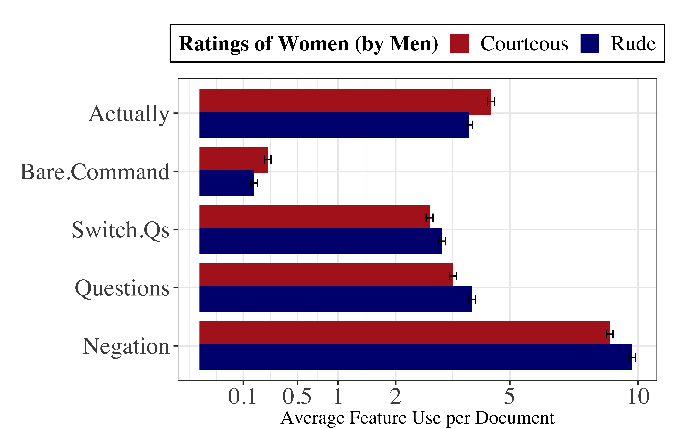
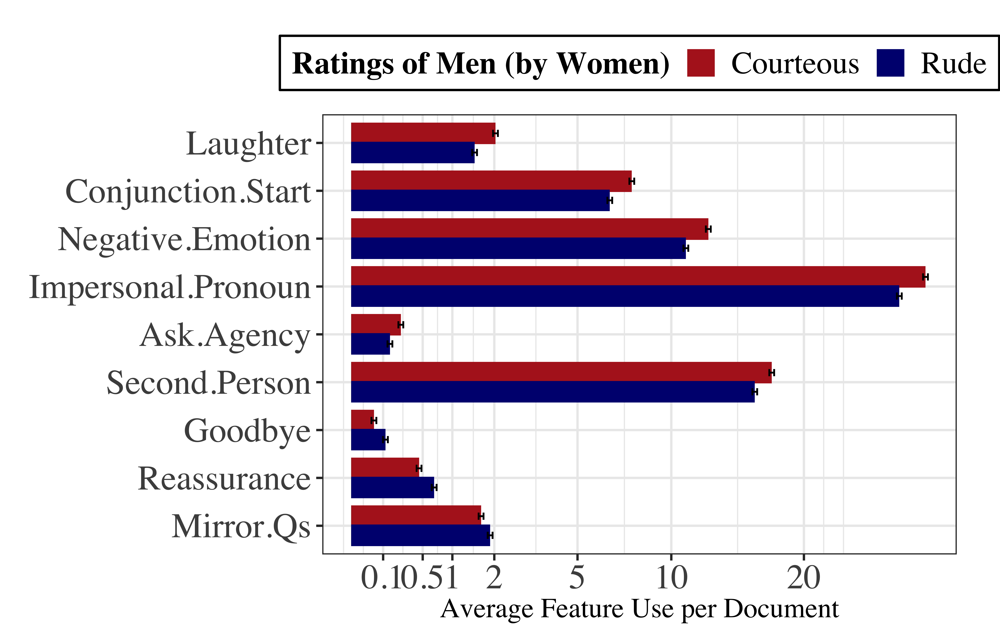

::: article
# Introduction

Politeness is a universal dimension of human communication
[@goffman:1967; @lakoff:1973; @brown:1987]. In practically all settings,
a speaker can choose to be more or less polite to their audience, and
this can have consequences for the speakers' social goals. Politeness is
encoded in a discrete and rich set of linguistic markers that modify the
information content of an utterance. Sometimes politeness is an act of
commission (for example, saying "please" and "thank you") \<and
sometimes it is an act of omission (for example, declining to be
contradictory). Furthermore, the mapping of politeness markers often
varies by culture, by context (work vs. family vs. friends), by a
speaker's characteristics (male vs. female), or the goals (buyer vs.
seller). Many branches of social science might be interested in how (and
when) people express politeness to one another, as one mechanism by
which social co-ordination is achieved.

The `politeness` package is designed to make it easier to detect
politeness in English natural language, by quantifying relevant
characteristics of polite speech, and comparing them to other data about
the speaker. For example, researchers may want to know whether
politeness is associated with some situational or trait-level covariate
(text as description). Or researchers might want to know whether people
respond differently to polite rather than impolite language (text as
treatment). Or they might want to know how an intervention affects the
production of politeness (text as outcome). Finally, all of these
analytical approaches can coalesce to support a theoretical model in
which speakers strategically choose their politeness as a way to affect
their audience's behavior (text as mediator).

Politeness typically draws from a common pool of linguistic markers for
social co-ordination between speaker and listener. But the weight and
valence of each marker depends on the context. Thus, we do not try to
provide a single "politeness dictionary" for all contexts. Instead our
approach draws from common methods in computational linguistics that use
algorithms to select from a curated set of features.
[@manning:1999; @grimmer:2013; @jurafsky:2014]. That is, we draw on
existing linguistic theory to calculate a wide set of potentially
relevant features from the text. But we then estimate the weights on
those features empirically, defining politeness using some ground truth
label---from a randomized treatment, or the listener, or a third party,
or the speaker herself. We then use a supervised machine learning
algorithm as a context-specific model of politeness: to classify
unlabeled documents, and to characterize the nature of how politeness is
expressed in the domain of interest.

Our software contributes to a rich ecosystem of general text analysis
packages in R. This includes structuring raw text
(e.g. [*tidytext*](https://CRAN.R-project.org/package=tidytext),
[*tm*](https://CRAN.R-project.org/package=tm),
[*quanteda*](https://CRAN.R-project.org/package=quanteda),
[*coreNLP*](https://CRAN.R-project.org/package=coreNLP),
[*spacyR*](https://CRAN.R-project.org/package=spacyR)), sentiment
analysis (e.g., *tidytext*,
[*SentimentAnalysis*](https://CRAN.R-project.org/package=SentimentAnalysis),
[*syuzhet*](https://CRAN.R-project.org/package=syuzhet)), and topic
modeling
([*topicmodeling*](https://CRAN.R-project.org/package=topicmodeling),
[*stm*](https://CRAN.R-project.org/package=stm)). We incorporate some of
these packages in our own work. Our package is the first in R to study
politeness specifically, and also one of the first to focus on
linguistic pragmatics more broadly. By focusing on the turn-level
syntactic structure in natural language, our work is complementary to
(and distinct from) existing work that primarily focuses on semantic
content, such as identifying trends in topics or emotions over large
corpora.

In this paper we also work through two important applications of
politeness detection in social science. First, we measure manipulated
politeness as a treatment effect in an experiment in which writers were
instructed to write offers for a phone on
[craigslist.com](craigslist.com){.uri}, in a style that was high (or
low) in politeness. This was used to validate a psychometric construct
across several studies. Second, we measure observed politeness as a
context-specific and naturally-occurring construct in a dataset on
speed-dating. This was used to understand the meaning of politeness from
different perspectives.

# Politeness workflow

The `politeness` package provides functions to identify politeness
markers in natural language, graphically compare these to covariates of
interest, develop a supervised model to detect politeness in new
documents, and inspect high- and low-politeness documents.
Table [1](#ta:functions) summarizes the main functions of the
`politeness` package. A full description of the functions is available
in the package documentation.

::: {#ta:functions}
  --------------------------------------------------------------------------------------------------------------------------------------------------------------------------------------------------------------------------------------------------------------------------------------------
  Function                   Description                                                                                                                                                                                                                                                    
  -------------------------- -------------------------------------------------------------------------------------------------------------------------------------------------------------------------------------------------------------------------------------------------------------- --
  `politeness()`             Detects linguistic markers of politeness in natural language. Takes an N-length vector of text documents and returning an N-row data.frame of feature counts. Some politeness features depend on grammatical parsing.                                          

  `politenessPlot()`         Plots the prevalence of politeness features over a set of documents. Highlights differences in politeness across covariate.                                                                                                                                    

  `politenessProjection()`   Training and projecting a regression model of politeness based on a binary or continuous variable. Supports both [*glmnet*](https://CRAN.R-project.org/package=glmnet) and [*textir*](https://CRAN.R-project.org/package=textir), with LASSO as the default.   

  `findPoliteTexts()`        Finds examples of most or least polite texts in a corpus from a covariate identifying politeness scores of texts.                                                                                                                                              
  --------------------------------------------------------------------------------------------------------------------------------------------------------------------------------------------------------------------------------------------------------------------------------------------

  : Table 1: Politeness functions.
:::

These tools can be combined in a workflow that we believe will be useful
to most researchers interested in linguistic politeness. First, we offer
a function, `politeness()` that will calculate a set of linguistic
features that have been identified in the past as relating to
politeness. Second, we offer a function, `politenessPlot()` to visualize
these counts, in comparison to a covariate related to politeness (e.g.,
treatment/control). If the researcher wants to generate a politeness
classifier, they can do so using the `politenessProjection()` function,
which creates a single mapping from the politeness features in the
supplied text to some other measure of interest. In particular, if the
researcher has some "ground truth" labels of politeness over a set of
texts, they can use this function as a politeness classifier, and
automatically assign politeness scores to many more new texts.

# Politeness features

Broadly speaking, the space of politeness features is guided by a rich
literature on the linguistics of politeness
[@goffman:1967; @lakoff:1973; @brown:1987]. In general, politeness in
language is designed to pay face to the listener, so that they feel
respected. And while the linguistic markers of politeness vary from
situation to situation, there are two common themes in most polite
speech: Positive Politeness, and Negative Politeness.

Positive politeness involves actively bolstering the listener's
self-image (showing gratitude, identifying as an in-group member, paying
complements) as well as not derogating that image (complaints, cursing,
informal titles, and so on). Negative Politeness involves respecting the
listener's autonomy. This involves a general softening of statements,
using hedges and adverbs. Requests may also be tempered, using indirect
subjunctive language, and apologizing. Alternatively, speakers may
express low negative politeness by making bare commands and being
contradictory.

These elements are all included in this package as part of the
`politeness()` function, which tallies 36 separate politeness markers
(summarized in Table [2](#ta:features), along with examples of each.).
Many are translated directly from recent research on the computational
linguistics of politeness [@danescu:2013; @voigt:2017]. We collected all
of the features from these two papers, and removed a few that were very
contextually specific (e.g., "keep your hands on the wheel\" for
drivers). However as we demonstrate below, many kinds of
context-specific features can be helpful, and we show how to add them to
the feature set manually.

The features in the politeness detector are summarized in in
Table [2](#ta:features). We refer interested users to the original
papers for details on the design of each feature. All features involve
counting matches to a pre-defined list, which includes some combination
of individual words, word stems, adjacency pairs, dependency pairs,
part-of-speech-tags. Additionally, some features distinguish whether a
match is found at the beginning of a sentence or not. Some (e.g.,
positive or negative emotion) include hundreds of possible matches;
while others (e.g., \"for you\") are defined by a single phrase.

``` r

library(politeness)

data("feature_table")

feature_table
```

::: {#ta:features}
  -------------------------------------------------------------------------------------------------------------------
  Feature Name          POS Tags   Description                                Example
  --------------------- ---------- ------------------------------------------ ---------------------------------------
  Hello                 No         \"hi\", \"hello\", \"hey\"                 \"Hi, how are you today?\"

  Goodbye               No         \"goodbye\", \"bye\", \"see you later\"    \"That's my best offer. Bye!\"

  Please Start          Yes        Please to start sentence                   \"Please let me know if that works\"

  Please                Both       Please mid-sentence                        \"Let me know if that works, please\"

  Gratitude             Both       \"thank you\", \"i appreciate\", etc.      \"Thanks for your interest\"

  Apologies             Both       \"sorry\", \"oops\", \"excuse me\", etc.   \"I'm sorry for being so blunt\"

  Formal Title          No         \"sir\", \"madam\", \"mister\", etc.       \"Sir, that is quite an offer.\"

  Informal Title        No         \"buddy\", \"chief\", \"boss\", etc.       \"Dude, that is quite an offer.\"

  Swearing              No         Vulgarity of all sorts                     \"The dang price is too high\"

  Subjunctive           No         Indirect request                           \"Could you lower the price?\"

  Indicative            No         Direct request                             \"Can you lower the price?\"

  Bare Command          Yes        Unconjugated verb to start sentence        \"Lower the price for me\"

  Let Me Know           No         \"let me know\"                            \"Let me know if that works\"

  Affirmation           Yes        Direct agreement at start of sentence      \"Cool, that works for me\"

  Conjunction Start     Yes        Begin sentence with conjunction            \"And if that works for you\"

  Reasoning             No         Explicit reference to reasons              \"I want to explain my offer price\"

  Reassurance           No         Minimizing other's problems                \"Don't worry, we're still on track\"

  Ask Agency            No         Request an action for self                 \"Let me step back for a minute\"

  Give Agency           No         Suggest an action for other                \"I want to let you come out ahead\"

  Hedges                No         Indicators of uncertainty                  \"I might take the deal\"

  Actually              Both       Indicators of certainty                    \"This is definitely a good idea.\"

  Positive              No         Positive emotion words                     \"that is a great deal\"

  Negative              No         Negative emotion words                     \"that is a bad deal\"

  Negation              No         Contradiction words                        \"This cannot be your best offer\"

  Questions             No         Question words to start sentence           \"Why did you settle on that value?\"

  By The Way            No         \"by the way\"                             \"By the way, my old offer stands\"

  Adverbial Just        Yes        modifying a quantity with \"just\"         \"It is just enough to be worth it\"

  Filler Pause          No         Filler words and verbal pauses             \"That would be, um, fine\"

  For Me                No         \"for me\"                                 \"It would be great for me\"

  For You               No         \"for you\"                                \"It would be great for you\"

  First Person Plural   No         First-person plural pronouns               \"it's a good deal for both of us\"

  First Person Single   Both       First-person singular mid-sentence         \"It would benefit me, as well\"

  Second Person         Both       Second person mid-sentence                 \"It would benefit you, as well\"

  First Person Start    Yes        First-person singular to start sentence    \"I would take that deal\"

  Second Person Start   Yes        Second-person to start sentence            \"You should take that deal\"

  Impersonal Pronoun    No         Non-person referents                       \"That is a deal\"
  -------------------------------------------------------------------------------------------------------------------

  : Table 2: Politeness features detected by `politeness()`. Features
  that have "No" in the POS Tags column require part-of-speech (POS)
  tagging; where as those with "Both" can be approximated with out POS
  tagging, but POS tagging is recommended.
:::

# Parsing grammar {#se:pos}

The meaning of a sentence often depends not just on its constituent
words, but also on its grammatical structure. This is useful for words
that can have different meanings, such as the adverbial \"just\" in \"it
is just enough\" compared to the adjectival use in \"the decision was
just\". Politeness can also be expressed in the grammatical structure
itself (e.g., the unconjugated verbs in bare commands like \"give me
that!\"). This information is lost in in bag-of-words analyses that do
not label the sentence structure, or ignore word order.

As of this writing, there was no available grammar parsing software
available wholly within the R language. Instead, we build off one of the
most powerful natural language processing tools available
currently---the Python module [SpaCy](https://spacy.io/)
[@honnibal:2015]. It is open-source, fast, accurate, and
well-benchmarked. We use *spacyr* [@spacyr] to connect to
[SpaCy](https://spacy.io/) and take advantage of their pretrained models
to identify the grammatical structure of each document. The current
SpaCy model en_core_web_sm is a Convolutional Neural Network trained on
[OntoNotes](https://catalog.ldc.upenn.edu/ldc2013t19), a large corpus
comprising of news, conversational telephone speech, weblogs, usenet
newsgroups, broadcast, and talk shows texts. Prior to using *spacyr*,
users must install SpaCy in Python. As of *spacyr* version 0.9.6, this
spacy installation can be detected automatically on the user's computer
by *spacyr* when it is first called.[^1]

Many of the politeness features can be calculated without grammar
parsing by setting `parser="none"`. We recommend this as an initial
first step for researchers, without having to install SpaCy. At this
reduced setting, some features are dropped entirely (e.g., Bare Commands
are a specific verb class). However, some features are approximated. For
example, tags allow users to differentiate between a mid-sentence
"please" and a "please" to start a sentence, while the tagless version
of the function will collapse them into a single feature.

# Detecting politeness features

The function `politeness()` takes in an *n*-length vector of texts, and
returns an *n*-by-*f* data.frame, with *f* columns corresponding to the
number of calculated features. We note that our package does not perform
any spell- or grammar-checking on the text---though these kinds of
errors can degrade the fidelity of the information in the text. Instead,
we recommend that users do this on their own---either in R, using
another package like
[*hunspell*](https://CRAN.R-project.org/package=hunspell), or else using
other software or by hand.

There are 36 features in total (see Table [2](#ta:features)), but some
user options affect the number of features that are returned. For one,
if a part-of-speech tagger is not used (by setting `parser = "none"`)
then some features that depend on these tags will not be calculated, as
detailed in Table [2](#ta:features). Additionally, you may use the
default setting `drop_blank = TRUE` which will remove features that were
not detected in any of the texts.

For example, consider the following texts.

``` r
library(politeness)

texts <- c("Hello, you", "You")
```

`politeness()` with `parser="none"` (default) will identify that both
texts contain the feature **Second.Person** and that only the first
contains **Hello**.

``` r

df_politeness <- politeness(texts, parser="none", drop_blank = TRUE)
df_politeness

  Hello Second.Person
1     1             1
2     0             1
```

In order to get the full feature space we use `parser="spacy"`. Now
`politeness()` differentiates between the features
**Second.Person.Start** (which captures the pronoun as a sentence
subject) and **Second.Person** (which captures the pronoun as a sentence
object) as shown below.

``` r

df_politeness <- politeness(texts, parser="spacy", drop_blank = TRUE)
df_politeness

  Hello Second.Person.Start Second.Person
1     1                   0             1
2     0                   1             0
```

The examples above are very short, in practice longer sentences will use
features multiple times (e.g., positive words). Setting `metric="count"`
will populate each cell with the raw count of each feature in the text.
Alternatively, `metric="binary"` will return a binary indicator of the
presence or absence of each feature. Finally, `metric="average"` will
count the prevalence of features as a percentage of the word count of
each document. This is useful as a robustness check when there is wide
variance in document length. For example take the following two texts
(this data, borrowed from [@jeong:2018] is included in the package):

``` r

data("phone_offers")
texts <- phone_offers$message[c(21,25)]
texts

[1] "Hi I am very interested in your phone.  It is exactly what I have been looking for.
I would like to offer you 115 for it.  It would make me very happy to buy the phone today."

[2] "Hi, I hope your day is going well. I am very pleased to see the phone you are offering
for sale, as it is exactly what I need! I am on a very tight budget so I hope that you will
be willing for accept $115 for the phone. It is the most I can pay. Please know that I
would be so happy if I am able to buy this phone. I'm sorry that I can't offer more.
If you are willing to accept my offer, perhaps I can do you a small favor as well, like
mow your lawn or something. In any case if you accept my offer you would have my sincere
and heartfelt gratitude.   Whether you accept my offer or not, I hope that this
message finds you and yours well and happy. I hope you have a great day. :)"
```

Given a subset of features we observe the following counts.

``` r


features <- c("Positive.Emotion", "Impersonal.Pronoun","First.Person","Second.Person",
              "Negative.Emotion")

df_politeness <- politeness(texts,drop_blank = TRUE)
df_politeness[ , features]

  Positive.Emotion Impersonal.Pronoun First.Person Second.Person Negative.Emotion
1                2                  4            3             2                0
2               14                 10           17            12                1
```

Although both texts have similar politeness features, the longer text
contains larger count values. The option `metric="binary"`, on the other
hand, will return a simplified result with a $1$ if the feature is
present in the text as shown below.

``` r
df_politeness <- politeness(texts, metric="binary",drop_blank = TRUE)
df_politeness[ , features]

  Positive.Emotion Impersonal.Pronoun First.Person Second.Person Negative.Emotion
1                1                  1            1             1                0
2                1                  1            1             1                1

```

# Plotting politeness features

The `politenessPlot()` function combines the politeness feature matrix
with another measure of substantive interest that might covary with the
prevalence of some of the politeness features---in particular, a
ground-truth measure of politeness from annotation or assignment to
treatment. This function generates a horizontal bar plot (with 95%
confidence intervals) of feature prevalence among two groups of
documents.

The function can handle any kind of politeness metric (counts, binary,
or averaged), but that distinction must be made in the initial call to
`politeness()`. Below, we plot the politeness features from a feature
count matrix in Figure [1](#fg:plotcount), and a binary feature matrix
in Figure [2](#fg:plotbinary).

The order of the bars themselves are sorted automatically, and
determined by calculating the variance-weighted log odds of each feature
with respect to the binary covariate. Many covariates are continuous. By
default, this package treats the top and bottom terciles of that
distribution as binary categories, with the middle tercile dropped.
Users can also create their own categories beforehand, and enter those
labels in place of the covariate.

Often some features are not meaningful for further analysis -- either
because they are too rare in the data, or else because they do not
meaningfully covary with the covariate of interest. Users have two
options to exclude these from the plot. First, the `drop_blank`
parameter can remove rare features -- it takes a number between 0 and 1,
which determines a cut-off based on prevalence. Specifically, all
features which appear in less than this proportion of texts are excluded
from the plot. To include all features, leave this value at 0.

Second, the `middle_out` parameter can remove features which do not vary
meaningfully across the covariate. Each feature is evaluated using a
two-sample t.test, and features are removed when the p-value of this
test lies above the user's provided cut-off, a number between 0 and 1
(the default is 0.1). To include all features, simply set this value at
1.

``` r
df_politeness_count <- politeness(phone_offers$message,
                                  parser="none",
                                  drop_blank=FALSE)

politenessPlot(df_politeness_count,
               split=phone_offers$condition,
               split_levels = c("Tough","Warm"),
               split_name = "Condition")
```

{#fg:plotcount width="100%"
alt="graphic without alt text"}

``` r
df_politeness_binary <- politeness(phone_offers$message,
                                   parser="none",
                                   metric="binary",
                                   drop_blank=FALSE)

politenessPlot(df_politeness_binary,
               split=phone_offers$condition,
               split_levels = c("Tough","Warm"),
               split_name = "Condition")
```

{#fg:plotbinary width="100%"
alt="graphic without alt text"}

# Projecting politeness features

Users can generate a politeness classifier with the
`politenessProjection()` function. This creates a single mapping from
the politeness features in the supplied text to the covariate of
interest. This can then be used to predict the covariate itself in
held-out texts. In particular, if the user has some \"ground truth\"
labels of politeness over a set of texts, they can use this function as
a politeness classifier, and automatically assign politeness scores to
many more new texts. This ground truth can be labelled by annotators in
observational data, or, as in our example below, generated from a
randomized experiment in which the text itself is the outcome.

This function is a wrapper around supervised learning algorithms. The
default uses `glmnet` [@glmnet], the vanilla LASSO implementation in R.
We also allow users to use a different algorithm, `textir` [@textir],
which implements a massively multinomial inverse regression.
Intuitively, this model represents a more realistic causal structure to
text-plus-covariate data -- that is, the metadata is typically an *ex
ante* property of the speaker that has a causal effect on the words they
use, rather than the words having a causal effect on the speaker's
metadata. Both packages have their merits, though for now we recommend
using `glmnet` to start, especially if its use is familiar.

In addition to the `phone_offers` dataset, we have included a smaller
`bowl_offers` dataset (also from [@jeong:2018]). Participants in this
study were given similar instructions (i.e., communicate in a warm or
tough style) but for a different negotiation exercise. We use the
`phone_offers` dataset to define the construct of interest, and use the
`bowl_offers` dataset as held-out data in `politenessProjection()`. The
results confirm that the manipulation in the held-out data induced more
politeness in one condition than the other.

In addition to the projected labels for the new documents,
`politenessProjection()` also returns the coefficients estimated in the
model. This provides some transparency regarding the exact functional
form of politeness being generated. However, we caution users that the
coefficients are chosen to maximize the prediction accuracy of the model
of the whole, rather than recovering the \"true\" coefficient for any
particular feature. In particular, these models may not reflect the
first-order relationships in the data, especially when many relevant
features are colinear with each other.

``` r

df_polite_train <- politeness(phone_offers$message, drop_blank=FALSE)

df_polite_holdout <- politeness(bowl_offers$message, drop_blank=FALSE)

project <- politenessProjection(df_polite_train,
                                phone_offers$condition,
                                df_polite_holdout)


t.test(project$test_proj[bowl_offers$condition==0],
        project$test_proj[bowl_offers$condition==1])

t = -6.4515, df = 66.914, p-value = 1.439e-08
alternative hypothesis: true difference in means is not equal to 0
95 percent confidence interval:
 -0.4216472 -0.2223876
sample estimates:
mean of x mean of y
0.2217517 0.5437691

project$train_coefs

   Positive.Emotion     Negative.Emotion         Negation   Informal.Title
         0.49911207           0.38236159      -1.04272459       0.10637694
        Subjunctive              For.You      Give.Agency            Hello
         0.92618688           0.11704362       0.48516687       0.60900150
First.Person.Plural            Questions        Gratitude         Actually
        -0.52233935           1.32231435       0.69019865       1.34960715
             Please  First.Person.Single    Second.Person
         0.04522580           0.03072077       0.03484301
```

We consistently recommend that researchers build a context-specific
model of politeness for their own datasets, using labeled examples from
within-domain. However, some new users may want to try this workflow
before deciding whether to hand-label new documents in their own domain.
In that case, users can follow the example above to build a rudimentary
out-of-the-box politeness classifier with the `phone_offers` dataset and
the `politenessProjection()` function). This analysis assumes that the
rules of politeness in the user's domain are identical to the rules of
politeness in negotiations, which may or may not hold.

# Finding examples of polite and impolite documents

Before users apply any output from the `politenessProjection()` function
to other analyses, they should first be curious about examples of texts
that best represent the distinction made by that projection (i.e., the
most- or least-typically polite texts()). The `findPoliteTexts()`
function replicates the analyses of `politenessProjection` but instead
returns a selection of the texts that are the most extreme (i.e., high,
or low, or both) along the projected dimension. The parameters `type`
and `num_docs` allow users to specify the type and number of texts that
are returned.

``` r

set.seed(111)

fpt_most <- findPoliteTexts(phone_offers$message,
                            df_polite_train,
                            phone_offers$condition,
                            type="most",
                            num_docs=2)
fpt_least <- findPoliteTexts(phone_offers$message,
                             df_polite_train,
                             phone_offers$condition,
                             type="least",
                             num_docs=2)

fpt_most$text

[1] Hello,   Oh my goodness, I'm so excited to see your listing. The phone is EXACTLY
what I have been searching for! And I can tell from your description and the photo
that it's just perfect, too. I can almost hear it ringing in my pocket right now!
What's that? Hello? So, happy to hear from you. Sorry, sorry. I'm getting ahead of
myself.
Soooo, I was wondering if there was any way that you might consider taking a little bit
less for this phone? It's absolutely everything I've been looking for but my bosses
&lt; grrrrr!!!&gt; will only give us $115 to get this phone. I know! Can you believe
it? Is there any way you could absolutely make my day and say ""yes"" to $115? I'd
be so, so grateful. Just let me know when you can. Thanks so much. :)

[2] Hello,  I am glad you're selling this phone. Is it still available? I would love to
purchase it. Would you consider $115 for it? I can buy it today if that price works.
Thank you.
```

``` r

fpt_least$text

[1] I am inquiring about your Iphone 6 plus that you had posted.  I am wanting to buy
and I have cash in hand.  The max amount I can offer is $115.  No more, no less.
Let me know.

[2] Come on. The price you are offering on a product that ISN'T NEW is unreasonable.
Now, I for one am very interested in getting this item. BUT, I will only pay $115.
I am not paying a penny more.
```

# Execution time

In principle, these functions can handle an arbitrarily large set of
documents. In practice, however, language data can be quite large, both
in the amount of documents and the length of the documents. This can
have a marked effect on execution time, especially on smaller computers.

In order to reduce computation time, we use
[*data.table*](https://CRAN.R-project.org/package=data.table)
[@datatable] and *quanteda* [@quanteda] in the backend which have fast
implementations of data manipulation. We also analyzed the execution
time of intermediate steps within `politeness()` to identify any
potential critical points.

To provide rough benchmarks, we ran the `politeness()` function with a
range of document counts ($10^{2}, 10^{3},10^{4}$) and lengths (100,
200). The tests were performed using a 2012 Macbook Pro with a 2.5 GHz
Intel Core i5. For each case we ran it three times, both with and
without part-of-speech tagging, and the resulting execution times are
plotted below.

Figure [3](#fg:executiontime) shows that `politeness()` scales
reasonably well for large sets of documents. For example, given 200-word
documents, and using the `spacy` parser, we found that 100 and 1,000
length vectors of texts take an average of 7.3 and 70.6 seconds,
respectively. We recommend that for larger corpora, researchers test the
code on smaller subsets first.

{#fg:executiontime width="100%"
alt="graphic without alt text"}

A common and complex situation is when text is broken up into many
documents per observation. One example of this would be a conversation
transcript, in which people take many turns over a single conversation,
but the covariates are measured at the level of the person, or
conversation. In these cases, we recommend calculating the politeness
markers in individual documents separately, and then aggregated into
person-level counts afterwards, for plotting, analysis, and
model-building. This will be more efficient and more accurate than
concatenating each person's turns into one long document and calculating
the politeness of the entire text at once.

# Extended Example: Politeness in Speed Dating

We demonstrate the broader applications of our package in a new context:
courtship, in face-to-face conversation with many turns per speaker.
This example comes from the SpeedDate corpus (originally published in
[@ranganath:2009; @mcfarland:2013]. Here, politeness is not a treatment
effect. Instead, we model the naturally-occurring variation in
politeness (as rated by listeners) during a series of speed dating
events. Furthermore, we highlight the context-specificity of
politeness---we compare the linguistic markers of politeness in both
female speakers (as rated by men) and male speakers (as rated by women),
while holding constant the domain, the outcome measure, and the
conversation itself.

The data were collected over three evenings, in which 110 heterosexual
participants each met with 15-20 other potential partners for four
minutes at a time. The main observations are gathered from each dater,
from a survey immediately after their date. For privacy reasons, we
cannot include the text of the dates themselves. However, we do include
the matrix of politeness features as calculated by the `politeness()`
function.

Note that the original function call treats each turn in the dataset as
a separate document, to produce a one-row-per-turn matrix. So to analyze
these data within our framework we need to condense the politeness
feature matrix to the same one-row-per-person-date level. To do this
here, we loop through each row of the per-person-date data, and add up
the counts from the relevant section of the per-turn database.

``` r
load("speedDateDates.rdata")
load("speedDateTurns.rdata")

id.vars<c("selfid","otherid","turn","span","group")
polite.cols<-names(speedDateTurns)[!names(speedDateTurns) %in% id.vars]
speedDateDates[,polite.cols] <- NA
for (o in 1:nrow(speedDateDates)) {
  matched.rows<-(speedDateTurns$selfid==speedDateDates[o, "otherid"])
                 & (speedDateTurns$otherid==speedDateDates[o, "selfid"])
  speedDateDates[o,polite.cols] <- colSums(speedDateTurns[matched.rows,polite.cols],
                                           na.rm=T)
}
```

We wanted to include extra domain-specific features, to capture elements
of live face-to-face conversation. These were calculated separately, and
merged into the politeness feature matrix. First, we counted moments of
laughter, which were indicated by the transcribers. We also included
repair questions (e.g., \"pardon?\") using a list from @ranganath:2009.
Finally, we included four kinds of question types from
@huang:2017---switch questions, which change the topic; follow-up
questions, which expand on the current topic; introductory questions,
which open a dialogue; and mirror questions, in which one person returns
a question that they had just been asked. By merging these six extra
features into the politeness feature matrix, downstream functions will
treat them as though they were part of the original feature set.

``` r
extra_names<-c(paste0(c("Followup", "Switch", "Intro", "Mirror", "Repair"), ".Qs"),
               "Laughter")

extras<-rbind(round(colMeans(speedDateDates[(speedDateDates$sex==1),extra_names]), 2),
              round(colMeans(speedDateDates[(speedDateDates$sex==0),extra_names]), 2))
row.names(extras)<-c("Spoken by Women (to Men)", "Spoken by Men (to Women)")

extras
```

::: {#extra:table}
  ----------------- ------------- ----------- ---------- ----------- ----------- ----------
                    Followup.Qs   Switch.Qs   Intro.Qs   Mirror.Qs   Repair.Qs   Laughter

  Spoken by Women   4.04          2.89        0.26       1.85        0.13        4.42

  Spoken by Men     5.11          3.51        0.38       1.73        0.17        1.83
  ----------------- ------------- ----------- ---------- ----------- ----------- ----------

  : Table 3: Prevalence of features added to politeness detector, by
  gender.
:::

Immediately after each date, both participants evaluated their partner
on a set of dimensions. The one most relevant for our purposes was the
question "how courteous was your partner\", which was rated on a scale
from 1-10 (plotted in Figure [4](#fg:courtesy)). We use this as a ground
truth measure of politeness. Because politeness was measured (not
manipulated) we must dichotomize the continuous variable into two
groups. We drop the middle third of medium-courtesy dates and compare
the dates that were rated as most and least rude, to increase contrast.
For clarity we do this manually in the example below, but the package
also does this automatically if the provided labels are on a continuous
scale.

``` r

speedDateDates$politeness <- ""
speedDateDates$politeness[speedDateDates$courtesy > 8] <- "Courteous"
speedDateDates$politeness[speedDateDates$courtesy < 6] <- "Rude"
speedDateDates<-speedDateDates[speedDateDates$politeness != "", ]
```

{#fg:courtesy width="100%"
alt="graphic without alt text"}

Finally, we wanted to know whether the rules by which politeness is
judged were different for men and for women. The average courtesy rating
of men by women was slightly lower than that of the women by men. But
these summary ratings do not tell us anything about how rudeness or
courtesy is determined. Instead, we apply the `politenessPlot()`
function among each gender separately to determine gender-specific
models for how politeness is related to the linguistic choices of the
speaker.

``` r

politenessPlot(speedDateDates[(speedDateDates$sex==1),
               c(polite.cols, extra_names)],
               split=speedDateDates$politeness[(speedDateDates$sex==1)],
               split_name="Ratings of Women (by Men)",
               top_title="",
               middle_out=0.1)


politenessPlot(speedDateDates[(speedDateDates$sex==0),
               c(polite.cols, extra_names)],
               split=speedDateDates$politeness[(speedDateDates$sex==0)],
               split_name="Ratings of Men (by Women)",
               top_title="",
               middle_out=0.1)

```

<figure id="fg:speeddate">


<figcaption>Figure 5: Politeness markers in speed-dating by speaker
gender.</figcaption>
</figure>

The results in Figure [5](#fg:speeddate) demonstrate that the rules for
what is considered polite behavior from a man or a woman can be quite
different, even the same conversation. Men laugh less often than women,
overall; but when they do laugh it is associated with courtesy by their
partner. Men who are considered rude tend to give formal goodbyes as
they are leaving, and more often respond to a question by mirroring it
back to their partner. On the other hand, women are seen as rude when
they contradict, or when they ask questions (in particular,
topic-switching questions) but are seen as polite when they reveal more
about themselves---the \"actually\" feature captures pivots to greater
detail, such as \"in fact\" or \"to be honest.\" Interpreting these
features can be difficult without the text in hand, though, and users
are encouraged to incorporate qualitative analyses of their own data, in
addition to the analyses provided here.

We note that the differences in feature use between polite and impolite
daters (of both genders) are not as stark in this example as in the
negotiation study. This is for two reasons. First, the variation in
politeness is naturally occurring, rather than induced by a randomized
treatment. Contrasts will be greater when writers are instructed and
able to adopt a particular communication style. Secondly, the speed
daters communicated face-to-face, so there could be other sources of
information that would affect the listener's rating of a speaker's
politeness (such as intonation, body language, pacing, and so on). In
datasets where they are measured, these other features could be added to
the workflow in the same way as the extra text-based features above.

# Conclusions

We detail an empirical model of politeness, as codified in the
[*politeness*](https://CRAN.R-project.org/package=politeness) package.
We use simple examples to show the range of output from the
`politeness()` and `politenessPlot()` functions. We also show how
`politenessProjection()` can be used to develop a domain-specific
supervised model for politeness, which can be used by
`findPoliteTexts()` to identify and explore distinctive documents. We
also work through two examples of consequential politeness---as
manipulated amongst negotiators, and as observed amongst speed
daters---that highlight many challenges that are common for all sorts of
research in R that uses natural language data from social interactions.

The tools presented here should be useful for all researchers who study
how people interact with one another, across a wide variety of contexts.
In future work, we hope to expand this toolkit to handle a wider range
of politeness markers that are not present in proper written english
(including shorthand, slang, nonverbals, and other languages). Further
research is also needed into the extent to which the markers of
politeness can vary from one context to another, and the consequences of
politeness on interpersonal relations.

# Acknowledgements

We thank the Spencer Foundation, the Hewlett Foundation, Harvard's
Institute for Quantitative Social Science, and the Harvard Vice Provost
for Advances in Learning Research Group for their support.
:::

[^1]: For advanced users, including those who may have multiple Python
    installations, you may have to *initialize* the SpaCy engine first,
    so that it is ready for use during the session. That is done using a
    separate function
    (`spacyr::spacy_initialize(python_executable = PYTHON_PATH)`---make
    sure to substitute in your preferred Python path name) and is
    explained well in the *spacyr* documentation.
