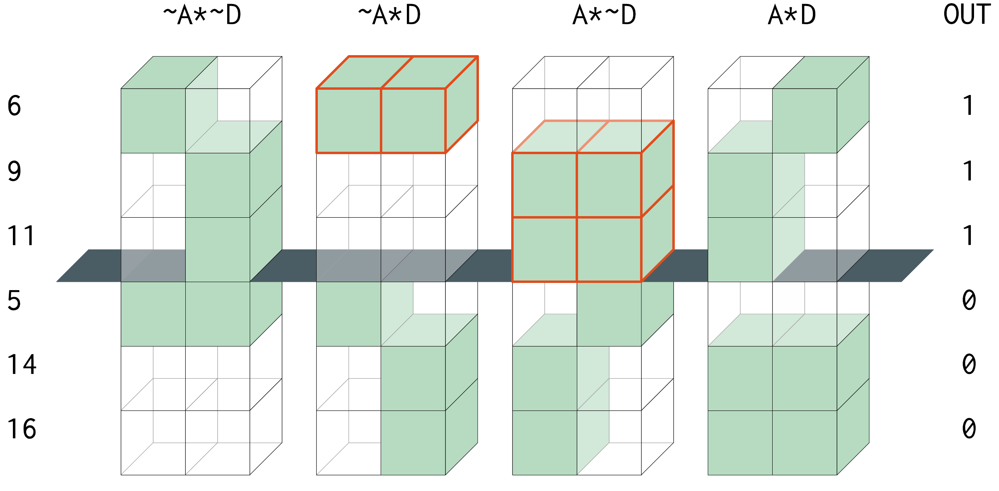

::: article
# Context

QCA (Qualitative Comparative Analysis) is a Boolean minimization method
that seeks to find the smallest causal configuration that is associated
with (sufficient for) the presence of an outcome of interest. It has
been introduced in the social sciences literature by @ragin1987, and
applies an algorithm firmly introduced in the engineering field by
@mccluskey1956, building on the previous work of @quine1952
[@quine1955].

The input for such a procedure is a truth table, which presents all
possible combinations of presence (coded with 1) and absence (coded with
0) for all causal conditions, plus an additional column to specify in
which cases the output is present and respectively absent.

With four causal conditions, a complete matrix with all their possible
combinations could be generated using these commands:

``` r
> library(QCA)
> createMatrix(rep(2, 4))
      [,1] [,2] [,3] [,4]
 [1,]    0    0    0    0
 [2,]    0    0    0    1
 [3,]    0    0    1    0
 [4,]    0    0    1    1
 [5,]    0    1    0    0
 [6,]    0    1    0    1
 [7,]    0    1    1    0
 [8,]    0    1    1    1
 [9,]    1    0    0    0
[10,]    1    0    0    1
[11,]    1    0    1    0
[12,]    1    0    1    1
[13,]    1    1    0    0
[14,]    1    1    0    1
[15,]    1    1    1    0
[16,]    1    1    1    1
```

For all rows / combinations of causal conditions that enter the analysis
(that is, where an additional column with the output coded as 1), the
task is to:

-   compare all possible pairs to determine if they can be minimized
    (only those which differ by exactly one literal)
-   compile a list of implicants as the result of minimizing pairs of
    rows
-   iteratively compare all pairs of the surviving implicants and
    minimize further
-   until nothing more can be minimized, thus obtaining the so-called
    "prime implicants"

In this example, the last two rows can be minimized (they differ only in
the fourth column), with the following result:

  ----- ----- ----- -----
   `1`   `1`   `1`   `0`

   `1`   `1`   `1`   `1`

   `1`   `1`   `1`   `x`
  ----- ----- ----- -----

  : 

A computer intensive, iterative process can determine a final solution
in a polynomial time for a relatively small number of conditions. But
each new condition included in the analysis exponentially increases the
complexity of the problem to at least the powers of 3, and even more for
multi-value conditions.

Although the initial truth table is specified in base 2, the
calculations are in fact done in base 3 because an additional bit of
information is needed to specify which column has been minimized (coded
"x" in the example above).

All solutions are found in the so-called "implicant matrix", which for
binary crisp conditions has $3^k$ rows and $k$ columns, where $k$ is the
number of conditions. Solving time increases exponentially with each new
condition added in the analysis, and quickly grows towards infinity when
$k$ reaches a certain value.

Memory consumption is obviously a big issue, as generating the entire
implicant matrix quickly depletes all available memory and make the
computer stop because of lack of resources. Such an approach is bound to
be inefficient even for moderately sized situations (11 or 12 causal
conditions), after which finding a solution in polynomial time becomes
impossible.

# Previous attempts

A first attempt to find a non-polynomial complete solution was presented
in "A mathematical approach to the Boolean minimization problem"
[@dusa2010]. The basic novelty of that approach was the use of a vector
of decimal row numbers instead of the entire implicant matrix. This
shortcut partially solved the memory use ($k$ times lower than a
complete matrix), while the solving time was significantly reduced by
using a basic mathematical operation `2x - y` to minimize two rows using
their decimal representations:

  ------ -- ----- ----- ----- -----
  `79`       `2`   `2`   `2`   `1`

  `80`       `2`   `2`   `2`   `2`

  `78`       `2`   `2`   `2`   `0`
  ------ -- ----- ----- ----- -----

  : 

In this example, the original binary number 0 for the absence is changed
to 1 in the base 3 implicant matrix, the original binary number 1 for
the presence is changed to the number 2, while the number 0 is reserved
to signal a minimized condition. Applying the `2x - y` operation, the
minimized implicant is found on the line `158 - 80 = 78`.

These kinds of improvements helped a lot, at that time obtaining a
solution in a significantly lower time and probing into a previously
unexplored space of 14 to 15 causal conditions with exact results, the
complexity growing three times with each new condition.

However, it was still a problem finding and comparing all possible pairs
of minimizable row numbers (not all pairs of numbers can be minimized,
because as not all pairs of rows in the implicant matrix differ by
exactly one column). A mathematical shortcut was used to find
minimizable pairs using the powers of 3 after transforming the row into
base 3, at the cost of more computing time.

Even if using vectors of row numbers instead of matrices, after the
ceiling of 14 to 15 causal conditions the memory was still an issue and
solving time also progressed towards infinity. In addition, this method
was restricted to binary data only, whereas QCA also needed to use
multi-valued data.

The next attempt to solve this problem was represented by the so-called
"enhanced Quine-McCluskey\" procedure [@dusa+thiem2015], which improved
on the classical minimization algorithm on both speed and memory, and
this algorithm is the current "best" workhorse for QCA family of
[R]{.sans-serif} packages.

The foundation of the second attempt is represented by an important
observation which is also valid for the algorithm to be presented in
this paper: the final list of prime implicants are supersets of those
cases with a positive output, and at the same time they cannot be
supersets of the cases with a negative output. To better understand this
concept, the entire truth table can be generated and presented as below:

``` r
> set.seed(1234)
> tt <- data.frame(createMatrix(rep(2, 4)), stringsAsFactors = FALSE,
            OUT = sample(c(1, 0, "?"), 16, replace = TRUE, prob = c(.19, .18, .63)))
> colnames(tt)[1:4] = LETTERS[1:4]
> tt
   A B C D  OUT
1  0 0 0 0   ?
2  0 0 0 1   ?
3  0 0 1 0   ?
4  0 0 1 1   ?
5  0 1 0 0   0
6  0 1 0 1   1
7  0 1 1 0   ?
8  0 1 1 1   ?
9  1 0 0 0   1
10 1 0 0 1   ?
11 1 0 1 0   1
12 1 0 1 1   ?
13 1 1 0 0   ?
14 1 1 0 1   0
15 1 1 1 0   ?
16 1 1 1 1   0
```

For some rows, the output is positive (coded with "1"), for other rows
it is absent (coded with "0") while for the rest of the truth table the
output is unknown (and coded with "?"). That happens because the number
of all possible combinations (especially when the number of causal
conditions $k$ increases), is far greater than what we can observe in
reality. In other words, as @ragin+sonnett2005 put it, the diversity is
limited and it can be reduced to this part of the truth table (sorted
decreasingly by the output):

``` r
> tt <- tt[tt$OUT != "?", ]
> (tt <- tt[order(tt$OUT, decreasing = TRUE), ])
    A B C D  OUT
6   0 1 0 1   1
9   1 0 0 0   1
11  1 0 1 0   1
5   0 1 0 0   0
14  1 1 0 1   0
16  1 1 1 1   0
```

Minimizing the three rows with a positive output is a trivial task and
doesn't require a special computer program. The difficulty starts when
employing the so-called "counterfactual analysis" to determine the most
parsimonious solution, by assuming the output is also positive for the
configurations with no empirical information (called "remainders" in
QCA, also known as "don't cares").

But instead of calculating all possible pairs of minimizable
configurations where the output is not negative (either positive, or
unknown, as in the previous attempt), the eQMC algorithm focuses only on
the known sub-matrix and applies the following procedure:

-   find all possible superset implicants of the rows with a positive
    output
-   find all possible superset implicants of the rows with a negative
    output
-   calculate the differences, preserving those implicants where the
    output is positive
-   remove the redundant implicants: those which already have supersets
    in the surviving vector of differences

A superset is a simpler, less complex logical expression that covers a
specific conjunction. For example, the causal condition A is a superset
of the intersection A\*B. In the implicant matrix, this would be:

  ------ -- ----- ----- ----- ----- -- -------
             `A`   `B`   `C`   `D`     

  `54`       `2`   `0`   `0`   `0`     `A`

  `72`       `2`   `2`   `0`   `0`     `A*B`
  ------ -- ----- ----- ----- ----- -- -------

  : 

Determining specific supersets of specific row numbers (in this case,
that row number 54 is a superset of row number 72) uses the same
mathematical tricks as in the previous attempt, employing a vector with
the powers of 3 for binary data: $3^3,\: 3^2,\: 3^1,\: 3^0$.

This new procedure brought a great deal of speed compared with the
previous one, consuming a lot less memory (for 15 causal conditions,
about 15 MB compared to 1.4 GB). It also made it possible to explore up
to 18 conditions at once, therefore additional three conditions meaning
$3^3 = 27$ times more complex situations than before.

Past that threshold, the eQMC algorithm reaches its maximum
possibilities. The culprit is less represented by memory consumption,
although at an extremely high number of causal conditions the generated
vectors of row numbers for the supersets can potentially grow larger
than available memory. Possibly problematic, after 19 causal conditions
the row numbers cannot even be represented in 32 bit computers, which
have an upper representation limit of $2^{31}$, that is still higher
than $3^{19}$ but not enough compared to $3^{20}$ for the implicant
matrix with 20 causal conditions.

The more serious issue was the calculation time, especially at the final
step to remove the redundant implicants from the surviving differences:
having that vector sorted in increasing order, the procedure involved an
inverse process of finding all subsets for each surviving implicant,
starting from the lowest, and iteratively remove those which are found
in the rest of the vector.

That process involved a backward transformation from the base 10 row
numbers to their base 3 equivalent then applying specific mathematical
operations to find all their subsets. For millions or tens of millions
of implicants, even this "quick" process can take a lot more time than
expected.

# Consistency Cubes: the newest approach

Compared to the first attempt, eQMC excelled because it focused on the
observed data only. Indirectly, it probes into the implicants' space
during the calculation of supersets and subsets, which requires some
memory and costs a lot of time. But the focus on the observed data
(ignoring the remainders but obtaining exactly the same solutions), has
to be the right approach and still stays at the foundation of the new
consistency cubes (CCubes) method, which starts with a simple
observation:

::: {#def:PI .definition}
**Definition 1**. A prime implicant is the simplest possible,
non-redundant, fully consistent superset of any positive output
configuration.
:::

Fully consistent also means that it can never be a superset of any
observed negative configuration. The simplest possible superset
expression is a single condition (either its presence, or its absence).
Figure [1](#fig:ABCD) presents the graphical representation of the
generated truth table `tt` above, and shows that no single condition
qualify as a prime implicant in its presence (lit cubes above and below
the middle separator). The only condition that is fully consistent in
its *absence* is B, but since it does not cover all observed positive
configurations, the search must be continued at the next level of
complexity.

{#fig:ABCD width="100%"
alt="graphic without alt text"}

The next simplest superset expressions can be found in all combinations
of 2 conditions out of 4, and for each such combination a normal
computer program would search within all pairs of their respective
levels. If conjunctions of two conditions will not prove to be
sufficient, the next simplest are superset expressions formed with 3
conditions out of 4, and so on.

For any general case involving multi-value causal conditions, the
complete search space $S$ (containing the total number of possibilities
to check using a polynomial approach) is equal to the sum of all
combinations of `c` selected conditions out of `k`, times the product of
their respective number of levels $l_s$ for each such selected
combination:

$$S_{MV} = \sum_{c = 1}^{k}\binom{k}{c}\prod_{s = 1}^{c} l_s
\label{eq:SMV}   (\#eq:SMV)$$

The CS (crisp sets) space is just a special case with all binary causal
conditions having two levels each, 0 and 1, where this equation gives
the same result as $3^k - 1$ that describes the implicant matrix having
exactly this number of all possible expressions which @ragin2000
[pp.132-136] calls "groupings". These are all rows from the entire $3^k$
implicant matrix, minus the first one which indicates a situation when
all causal conditions are minimized:

$$S_{CS} = \sum_{c = 1}^{k}\binom{k}{c}2^c = 3^k - 1
\label{eq:SCS}   (\#eq:SCS)$$

Ragin uses a similar technique and lists all possible combinations of
causal conditions and their levels in Table 5.4 (p.134). But he applied
his calculation backwards, starting from the most complex expressions of
four conditions out of four, towards all combinations of levels from the
most simple situations with one separate condition at a time.

As it will be shown in the next section, starting from the simplest
expression towards the most complex, has a direct consequence over the
performance of this algorithm. Fast forward, the properties of
Equation \@ref(eq:SMV), combined with the requirements from
Definition [1](#def:PI) that describe a minimal prime implicant, are key
ingredients behind the speed of the new CCubes algorithm.

{#fig:AD
width="100%" alt="graphic without alt text"}

Increasing the complexity to level `c = 2`, Figure [2](#fig:AD) above
shows all possible combinations of levels for the pair of conditions `A`
and `D`, out of which two qualify as prime implicants: $\sim$`A``*D` and
`A*`$\sim$`D` are both associated with a positive output above the
middle grey separator, and at the same time not associated with a
negative output below the separator.

## Search space

An exhaustive exploration of the entire search space, through all
possible combinations of columns, and all their subsequent combinations
of levels, is a polynomial approach which is bound to consume time.
Figure [2](#fig:AD) displays all combinations of levels from columns `A`
and `D`, but there are 6 such pairs of columns, each having 4 pairs of
levels. For each pair of columns, a basic program would have to spend
time comparing 2 columns, times 4 pairs of levels, times 6 rows which
gives 48 computer cycles.

The search space described in Equation \@ref(eq:SMV) can be partitioned
into successive layers of complexity, from a single condition for
`c = 1` to the most complex conjunctions for `c = k`. Within each layer,
it is not necessary to search within all possible combination of levels,
because the relevant ones can already be found in the observed data.
This is a fortunate situation that alleviates the memory problem
because, unlike the previous two attempts, no other memory needs to be
used in the process.

The particular arrangement of the cube components in Figure [2](#fig:AD)
offers a first hint: out of the four pairs, only two are meaningful, and
they need not be displayed into separate combinations of levels, as they
can already be detected in the original structure of the observed data.

``` r
> tt[, c("A", "D", "OUT")]
   A D OUT
6  0 1   1
9  1 0   1
11 1 0   1
5  0 0   0
14 1 1   0
16 1 1   0
```

The conjunction $\sim$`A``*D` (which is the binary combination '`01`',
on the first line number 6), and the conjunction `A*`$\sim$`D` (binary
combination '`10`' on the second and third lines, numbers 9 and 11) are
both prime implicants because they are found in the observed positive
cases and not in the negative ones.

In this example, the search space can be shortened to only two columns
times 6 rows, already four times quicker than a polynomial approach. But
as it turns out, the search space can be shortened even further using
the mathematical tricks from the previous approaches, transforming from
any (multiple) base (in this example with all conditions in base 2) to
their decimal representation:

``` r
> data.frame(AD = as.matrix(tt[, c("A", "D")]) %*% c(2^1, 2^0), OUT  = tt$OUT)
   AD OUT
6   1   1
9   2   1
11  2   1
5   0   0
14  3   0
16  3   0
```

Instead of the exhaustive 48 computer cycles, the same conclusion can be
derived by examining only these 6 rows, where decimal numbers `1` and
`2` (corresponding to the binary combinations `01` and `10`) are not
found among the observed negative cases. In this simple example, the
gain might be minimal, but for more complex datasets with conjunctions
of 5 or 6 causal conditions, these sort of transformations dramatically
reduce the search space, with a significant boost of the overall speed.

This technique of partitioning the search space is fundamentally
different from the previous two attempts, which approached the implicant
matrix in the increasing order of its decimal row numbers. The implicant
matrix is by definition unpartitioned, and the example below display all
levels for each individual condition, equivalent to the simplest level
of complexity in Figure [1](#fig:ABCD):

``` r
> IM <- createMatrix(rep(3, 4)) # base 3 for 4 causal conditions
> rownames(IM) <- seq(nrow(IM))
> colnames(IM) <- LETTERS[1:4]
> IM[apply(IM, 1, function(x) sum(x > 0) == 1), ]
   A B C D
2  0 0 0 1
3  0 0 0 2
4  0 0 1 0
7  0 0 2 0
10 0 1 0 0
19 0 2 0 0
28 1 0 0 0
55 2 0 0 0
```

The presence of a single condition `A` is found all the way on the
decimal row number 55, therefore the entire implicant matrix has to be
scanned to find even the most simple conjunctions, and that takes a lot
of time. By contrast, and in line with Definition [1](#def:PI), the same
search space can be partitioned in successive layers of complexity
before starting the search process, as shown in Equation \@ref(eq:SMV).

This is one of the key novelties of the CCubes algorithm, that boosts
its speed to unprecedented levels while maintaining the same overall
requirement to arrive at exact and complete solutions. It does that by
exploring the same space (the implicant matrix), but using a different
method. As an added bonus, the new algorithm uses the best features from
all attempts, by partitioning the search space and at the same time
using the decimal representation from eQMC, when comparing which numbers
are found in the positive part and (not) in the negative part of the
truth table.

## Search depth

Another factor that can increase the speed of the CCubes algorithm is
the search depth, which seeks to terminate the partitioned search space
as soon as possible. To satisfy Definition [1](#def:PI), the algorithm
has to search through all possible combinations of `c` selected
conditions out of the total `k`, starting from a single condition with
`c = 1` up to the most complex conjunctions with `c = k`.

But parsimonious prime implicants are never found among the most complex
expressions, instead they are always found among the simplest possible
ones. A "simple" expression, for say 4 or 5 initial causal conditions is
a single condition or a conjunction of two conditions. For a more
complex dataset with 20 causal conditions, the word "simple" has a
different meaning, with possible conjunctions of up to 4 or 5 conditions
each.

More complex expressions are either not contributing to the
minimization, or they are subsets of other, less complex expressions
which have already been found in the previous iterations of `c` selected
conditions. As the redundant prime implicants are to be removed anyways
(a key part of the current eQMC procedure), they will never qualify as
"minimal" prime implicant expressions. This is why
Definition [1](#def:PI) explicitly mentions "non-redundant" expressions
that do qualify as prime implicants.

To maximise speed, the search depth has to be stopped as soon as there
is proof that no more prime implicants will be found at more complex
expressions. A brute force traditional algorithm searches the entire
search space from equation \@ref(eq:SMV). In the binary crisp sets
analysis, it involves an exhaustive search of all $3^k$ possible
combinations in the implicants matrix. But that is a huge space,
especially at a large number of causal conditions, and most of the
verifications are void. It is one of the reasons why the traditional
algorithms are inherently slow.

A brute force, exhaustive search will always find all non-redundant
prime implicants, at the cost of a larger search time. The task is to
find those prime implicants without spending additional time for
unnecessary, void verifications. As it turns out, the design of the
equation \@ref(eq:SMV) is also the answer for this task.

Using the truth table `tt` presented in this paper, any minimization
algorithm will find exactly four prime implicants: $\sim$`B`,
$\sim$`A``*D`, `A*`$\sim$`D` and `C*`$\sim$`D`, extracted from an
implicants matrix with $3^4 - 1 = 80$ rows.

The simplest prime implicant is $\sim$`B`, which has the biggest number
of subsets in the implicants matrix. More complex prime implicants have
fewer subsets, and there is a method to determine the exact number of
subsets for any given prime implicant.

The prime implicant $\sim$`B` can be written as `0100` (where `1` means
absence of `B`, and `0` means all other conditions are minimized), and
using a similar product formula as that from equation \@ref(eq:SMV) it
can be determined it has $27 - 1 = 26$ subsets. There are three
minimized conditions in this prime implicant (`A`, `C` and `D`), each
having 2 + 1 levels in the implicants matrix, and the number of subsets
can be obtained with the product of the number of levels for the
minimized conditions:

$$\prod_{c = 1}^{3} (l_c + 1) = 3^3 = 27$$

27 rows from the implicant matrix contain $\sim$`B`, out of which 26 are
subsets for which further verifications would consume unnecessary time.
The second prime implicant $\sim$`A``*D` has 8 subsets, out of which 3
are already covered by $\sim$`B`, making 31 unique subsets. The third
has 8 subsets as well, out of which 3 are already covered by the first
two, making 36 unique subsets, and the fourth has 8 subsets out of which
5 are already covered by the first three, making a grand total of 39
unique subsets for all found prime implicants.

Out of the 80 rows of the implicants matrix to verify, it is certain
that 39 will turn void results, which means the search could have been
terminated after about half of the search space. This procedure is valid
for any number of input causal conditions and for any number of
non-redundant prime implicants, leading to the general formula:

$$S_{MV} = \sum_{c = 1}^{k}\binom{k}{c}\prod_{s = 1}^{c} l_s = P + U + N
\label{eq:PSMV}   (\#eq:PSMV)$$

Here $P$ is the number of prime implicants, $U$ is the total number of
unique subsets (of all found $P$ prime implicants), and $N$ is the
number of non (prime) implicants. The new algorithm verifies all $P$
rows, most of the $N$ rows, and a small percentage of the $U$ unique
subsets. It stops when there is proof that all remaining rows are either
$U$ or $N$: when the prime implicants chart can be solved at a certain
complexity level $c$, and no more prime implicants are identified at
complexity level $c + 1$.

This is a crude, but very effective rule to make sure the search is
exhaustive, although only a fraction of the entire implicants matrix is
actually verified. $U$ represents the largest part of the implicants
matrix, and is not necessary to be verified. Avoiding the search through
this void part of the implicants matrix dramatically increases the speed
of the CCubes algorithm.

To find all possible $P$ prime implicants in a shorter time is already a
major achievement, but the next section presents a method to stop the
search even sooner, for the default option of an absolute minimal
solution corresponding to the setting `min.pin = TRUE` in function
`minimize()`.

The prime implicants chart gives a better understanding of how many
prime implicants are needed to cover all observed positive cases. By
iteratively solving this chart after each partition of complexity, the
search space can be terminated as soon as the number of prime implicants
needed to solve the chart reaches a minimum.

# Solving the prime implicants chart

Once the prime implicants are found, the next and final step of the
Quine-McCluskey procedure is to find the minimal disjunctions of
expressions (sums of products) that cover all the initial positive
configurations in the observed data. The hypothetical example above
generates four prime implicants:

``` r
> PIs <- translate("~B + ~A*D + A*~D + C*~D")
> PIs

       A  B  C  D
~B        0
~A*D   0        1
A*~D   1        0
C*~D         1  0
```

The PI chart is obtained by distributing these four prime implicants on
each of the three observed, positive configurations. In this chart
representation, the symbol `x` indicates the prime implicant is a
superset of a specific initial configuration (it covers a specific
column) and the symbol `-` indicates the prime implicant is not a
superset of (does not cover) that specific configuration:

``` r
> pic <- makeChart(rownames(PIs), c("~A*B*~C*D", "A*~B*~C*~D", "A*~B*C*~D"))
> pic

      ~A*B*~C*D  A*~B*~C*~D A*~B*C*~D
~B        -          x          x
~A*D      x          -          -
A*~D      -          x          x
C*~D      -          -          x
```

None of the generated prime implicants is able to explain all three
initial configurations, because none is covering all three columns. The
final solution will be a disjunction of at least 2 prime implicant
expressions, where $\sim$`A``*D` is an essential part of the solution
because it is the only one which covers the first column.

The expression `C*`$\sim$`D`, although minimal and non-redundant, is
found to be irrelevant because it covers a column which is already
covered by two other prime implicants (the so called principle of "row
dominance"): both $\sim$`B` and `A*`$\sim$`D` dominate `C*`$\sim$`D`
because they cover more columns.

The final solution is a disjunction of exactly 2 prime implicants, and
there are two alternative such solutions:

``` r
> minimize(tt, "OUT", include = "?", use.tilde = TRUE)

M1: ~A*D + (~B) <=> OUT
M2: ~A*D + (A*~D) <=> OUT
```

The package [*QCA*](https://CRAN.R-project.org/package=QCA)
[@dusa2019; @thiem+dusa2012] in [R]{.sans-serif} [@R] used to have a
dependency on package
[*lpSolve*](https://CRAN.R-project.org/package=lpSolve), to determine
the minimum number of prime implicants through linear programming. There
is, however, another direct method of determining this minimum number,
involving a two phase procedure:

1.  iteratively simplify the chart, by:

    -   eliminating dominated rows
    -   eliminating dominating columns

2.  iteratively find all sets of (the rest of the) rows that maximally
    cover the (rest of the) columns

On each iteration in the first phase, the chart is progressively
simplified, and on each iteration in the second phase, a new prime
implicant is introduced to each previous maximal set, and the procedure
stops with the first set to win and cover all columns. There is a
dedicated function to find this minimum number `m`, equal to the output
of the previous linear programming:

``` r
> findmin(pic)
[1] 2
```

For this particular purpose, the new procedure is faster than linear
programming but the gain is negligible. The real purpose is to solve the
prime implicants chart from within the CCubes algorithm after each
partition of complexity `c` out of `k` from Equation \@ref(eq:SMV), to
determine:

-   if the generated prime implicants can explain all initial positive
    configurations (all columns in the prime implicants chart are
    covered by at least one row)
-   more importantly, if the number of prime implicants necessary to
    explain all positive configurations reaches a minimum (when at
    complexity `c + 1` the number `m` remains the same).

These factors terminate the search space at the depth where the new
prime implicants do not contribute to minimally solving the PI chart,
thus demonstrating that not all prime implicants are relevant. Only
those which are found at the lowest levels of complexity from the search
space matter.

This is rather easy to explain: the more complex a prime implicants is,
the more specific it becomes and covers fewer columns from the PI chart
(initial combinations). A more and more specific conjunction is a
smaller and smaller intersection that covers less and less from the
Universe, as shown in the following Venn diagram using the package
[*venn*](https://CRAN.R-project.org/package=venn) [@dusa2018]:

``` r
> library(venn)
> venn("~A*D + ~B", snames = "A, B, C, D", zcolor = "red, #008833")
```

{#fig:RJvenn width="100%"
alt="graphic without alt text"}

Figure [3](#fig:RJvenn) above shows the green area corresponding to
$\sim$`B` of complexity level 1, is much larger than the red area
corresponding to $\sim$`A``*D` of complexity level 2. A more specific
intersection, for example $\sim$`A``*C*D` at complexity level 3, covers
an even smaller area (it is actually a subset of $\sim$`A``*D`).

Less complex prime implicants have a much higher chance of covering more
columns from the prime implicants chart, which explains why the most
complex PIs are almost never part of the minimal solution. For 20 causal
conditions, tests have revealed that prime implicants are found up to
the complexity level 7, while the minimal solutions don't use prime
implicants from a complexity level more than 4.

This is an important observation: although non redundant PIs can be
found at higher complexity levels, the search can be stopped at lower
complexities, as soon as there is proof the prime implicants chart is
solved using a minimal number of prime implicants. Terminating the
search space at lower complexity levels dramatically shortens the time
necessary to find all possible minimal solutions.

# Performance benchmark

All three algorithms (QMC, eQMC and CCubes) are now available in
function `minimize()` via the new argument `method`. The motivation is
partly due to the existence of multiple competing algorithms and users
should choose which one to use, but more importantly to allow for
testing and benchmarking, controlling for input and return exactly the
same output. The main difference maker is the speed.

In the world of Boolean minimization, the acknowledged champion software
is Espresso [@brayton1984], built more than three decades ago at the
University of California, Berkeley. It is a heuristic algorithm that
finds a minimal solution with record speed, but unsuitable for social
science research. While in circuit design the goal is to find one
minimal solution, QCA needs to find all possible causal paths that are
sufficient for an outcome, thus involving all possible prime implicants
that form a PI chart.

There is an [R]{.sans-serif} package on CRAN that implements Espresso
version 2.3, called
[*LogicOpt*](https://CRAN.R-project.org/package=LogicOpt) [@stiehl2016],
a perfect opportunity to test the performance of CCubes in terms of
speed and solutions found. First of all, a data generation function is
needed to make sure all algorithms receive the same input:

``` r
> gendat <- function(ncols, nrows, seed = 12345) {
    set.seed(seed)
    dat <- unique(matrix(sample(0:1, ncols*nrows, replace = TRUE), ncol = ncols))
    colnames(dat) <- LETTERS[seq(ncols)]
    return(as.data.frame(dat[order(dat[, ncols], decreasing = TRUE), ]))
  }
```

For simplicity, all datasets are restricted to binary crisp having 10
unique configurations (a usual number in QCA research, given the known
limited diversity problem), and the number of columns are given by
argument `ncols` out of which the last column will play the role of the
output. For a small number of say 10 conditions all three algorithms can
be tested, for a large number of 16 conditions QMC is unable to perform,
and above 20 conditions CCubes is the only algorithm left.

``` r
> dat <- gendat(ncols = 11, nrows = 10)
> minimize(dat, outcome = "K", include = "?", method = "QMC")
M1: C + (g) <=> K
M2: C + (b*d) <=> K
M3: C + (d*e) <=> K
M4: C + (d*H) <=> K
M5: C + (d*J) <=> K
M6: C + (e*J) <=> K

> all.equal(
      capture.output(minimize(dat, outcome = "K", include = "?", method = "QMC")),
      capture.output(minimize(dat, outcome = "K", include = "?", method = "eQMC"))
  )
[1] TRUE

> all.equal(
      capture.output(minimize(dat, outcome = "K", include = "?", method = "eQMC")),
      capture.output(minimize(dat, outcome = "K", include = "?", method = "CCubes"))
  )
[1] TRUE
```

The examples above show the solutions are identical for all three
algorithms. But function `minimize()` does many other things besides the
logical minimization: calculating parameters of fit, deriving
simplifying assumptions, easy and difficult counterfactuals etc. To
compare the speed of the algorithms themselves, another function is
needed, that arranges the input for the specificities of each.

``` r
> test <- function(dat, method = "", min.pin = FALSE) {
    dat <- as.matrix(dat)
    nconds <- ncol(dat) - 1
    noflevels <- rep(2, nconds)
    output <- dat[, nconds + 1]
    switch(method,
    "QMC" = {
        mbase <- rev(c(1, cumprod(rev(noflevels))))[-1]
        neg <- drop(dat[output == 0, seq(nconds)] %*% mbase) + 1
        .Call("QMC", createMatrix(noflevels)[-neg, ] + 1, noflevels, PACKAGE = "QCA")
    },
    "eQMC" = {
        mbase <- rev(c(1, cumprod(rev(noflevels + 1))))[-1]
        pos <- dat[output == 1, seq(nconds)]
        neg <- dat[output == 0, seq(nconds)]
        rows <- sort.int(setdiff(findSupersets(input = pos + 1, noflevels + 1),
                                 findSupersets(input = neg + 1, noflevels + 1)))
        .Call("removeRedundants", rows, noflevels, mbase, PACKAGE = "QCA")
    },
    "CCubes" = {
        .Call("ccubes", list(dat, min.pin), PACKAGE = "QCA")
    })
  }
```

The output of interest for all three algorithms is the list of prime
implicants, either as a matrix for QMC and CCubes, or as a numerical
vector of corresponding row numbers for eQMC. The output itself is
therefore not identical, but the final solutions are. What matters here
is the timings, on a MacBook Pro with an Intel Core i7 processor at 2.7
GHz with 16GB of RAM, at 1600 MHz DDR3.

``` r
> system.time(test(dat, method = "QMC"))
   user  system elapsed
  4.438   0.010   4.448
> system.time(test(dat, method = "eQMC"))
   user  system elapsed
  0.013   0.000   0.031
> system.time(test(dat, method = "CCubes"))
   user  system elapsed
  0.000   0.000   0.001
```

For as little as 10 causal conditions, the classical Quine-McCluskey
algorithm is already the slowest, while eQMC performs very decent. The
real test begins 16 conditions and above:

``` r
> dat <- gendat(ncols = 17, nrows = 10)
> system.time(test(dat, method = "eQMC"))
   user  system elapsed
  6.735   0.996   7.676
> system.time(test(dat, method = "CCubes"))
   user  system elapsed
  0.010   0.000   0.011
```

Past 18 causal conditions, the eQMC algorithm reaches its upper limit,
while the CCubes algorithm performs effortlessly:

``` r
> dat <- gendat(ncols = 26, nrows = 10)
> system.time(test(dat, method = "CCubes"))
   user  system elapsed
  0.482   0.001   0.489
```

Obviously, some truth tables are more complex, the speed depending not
only on the number of causal conditions but also on the number of input
configurations and their complexity. In this example, the truth table is
a very simple one with 5 positive and 5 negative configurations, but
more unique configurations added to the truth table have an obvious
impact, even with fewer causal conditions:

``` r
> dat <- gendat(ncols = 21, nrows = 20)
> system.time(cc <- test(dat, method = "CCubes"))
   user  system elapsed
  0.930   0.003   0.946
```

Comparing with Espresso is the more serious challenge. Despite its
heuristic nature, it also has a particular implementation that can find
all relevant prime implicants, known in the literature under the name of
"Espresso-exact" and adapted in the package
[*LogicOpt*](https://CRAN.R-project.org/package=LogicOpt) for comparison
with package [*QCA*](https://CRAN.R-project.org/package=QCA). Due to
historical reasons, Espresso-exact generates not one set of prime
implicants, but three: EPs - essential prime implicants, PRPs -
partially redundant prime implicants and TRPs - totally redundant prime
implicants.

The relevant function in package
[*LogicOpt*](https://CRAN.R-project.org/package=LogicOpt) is called
`logicopt()`, with a control argument named `mode` that can take three
values: `"primes"` (which leverages the PI generation C-code that is a
part of "Espresso-exact"), `"multi-min"` (which finds the minimum set of
non-redundant solutions that cover all the EPs and the minimal set of
PRPs) and `"multi-full"` (that finds additional coverings of prime
implicants beyond what is found in multi-min, and an exhaustive covering
of all PRPs). However, since the number of coverings (solutions) is
potentially very large, the package
[*LogicOpt*](https://CRAN.R-project.org/package=LogicOpt) employs an
arbitrary upper limit of 50 coverings, therefore the output of these two
arguments is not directly comparable with the exhaustive number of
solutions found by package
[*QCA*](https://CRAN.R-project.org/package=QCA).

The only way to compare with Espresso-exact is to employ the argument
`mode = "primes"` and measure the time taken to identify the prime
implicants.

Out of the three sets of prime implicants from Espresso-exact, only the
EPs and PRPs play an active role in finding the minimal solutions when
solving the PI chart, however it's implementation spends additional time
to find the set of TRPs. On the other hand, CCubes does not bother with
the TRPs and finds only the relevant set of PRPs (the essential PIs are
identified when solving the PI chart).

``` r
> library(LogicOpt)
> system.time(lo <- logicopt(dat, 20, 1, find_dc = TRUE, mode = "primes"))
   user  system elapsed
  3.030   0.012   3.034
> nrow(cc)
[1] 1931
> lo[[2]][2]
[1] 1931
```

There are exactly 1931 prime implicants identified by both Espresso and
CCubes, which is a cross-validation proof between these two algorithms.
In terms of speed, CCubes seems to be faster and it can be faster still,
by choosing to stop the search when the PI chart can be solved with a
minimal number of PIs, using the argument `min.pin`:

``` r
> system.time(cc <- test(dat, method = "CCubes", min.pin = TRUE))
user  system elapsed
  0.045   0.000   0.045
> nrow(cc)
[1] 687
```

Out of the 1931 prime implicants, only 687 really contribute to
minimally solving the PI chart, with the search being terminated a lot
sooner with the same final solutions. A more intensive test of speed was
carried by generating 1000 random datasets changing the seed in function
`gendat()`:

``` r
> set.seed(12345)
> seeds <- sample(1000000000, 1000)
> result <- matrix(NA, nrow = length(seeds), ncol = 3)
> for (i in seq(length(seeds))) {
    dat <- gendat(21, 20, seeds[i])
    result[i, ] <- c(system.time(test(dat, method = "CCubes"))[[3]],
        system.time(logicopt(dat, 20, 1, find_dc = TRUE, mode = "primes"))[[3]],
        system.time(test(dat, method = "CCubes", min.pin = TRUE))[[3]])
  }
```

On average, CCubes spends 0.941 seconds per dataset, while
Espresso-exact spends 2.017 seconds. The timings are more homogeneous
for CCubes, with a standard deviation of 0.550 seconds, compared to
1.727 seconds for Espresso-exact. Using the argument `min.pin`, CCubes
spends an impressive average of 0.571 seconds (over 3.5 times faster
than Espresso-exact). In some cases it can be thousands of times faster,
while slower in only 5.7% of cases, depending on how many complex PIs
contribute to solving the PI chart (more time spent when approaching the
total number of PIs).

While the cross-validation between Espresso-exact and CCubes lies in the
number of found PIs, the purpose of the QCA minimization is to make sure
all possible (minimal) solutions are found. From this perspective,
CCubes is the only algorithm in [R]{.sans-serif} that can do that out of
the box, but it is not the only one to operate with a high number of
causal conditions.

Another software that is capable to output complete and exhaustive
solutions is called Tosmana [@cronqvist2017], that implements another
very different algorithm called GBA - Graph Based Agent. A direct
comparison is not possible in this paper because Tosmana does not
operate in [R]{.sans-serif}, but according to all tests the solutions
are identical, with a superior speed for CCubes.

A cross-validation with QMC (up to 10-11 conditions), eQMC (up to 16-18
conditions), Tosmana (around 20 conditions) and Espresso-exact (up to 30
conditions but indirectly via the number of prime implicants) should be
sufficient for any QCA researcher seeking a confirmation that CCubes and
the other algorithms used in package
[*QCA*](https://CRAN.R-project.org/package=QCA) are exact and
exhaustive.

# Summary

A cube is understood as a multi-dimensional matrix. Just as sets can be
either subsets or supersets of other sets, cubes can sometimes be formed
with more complex, and sometimes with less complex cubes. The cube
should be defined and interpreted relative to a certain context: it can
be either a single condition, or a conjunction of causal conditions, or
the entire dataset where that conjunction was extracted from.
Figure [2](#fig:AD) offers a graphical exemplification of a "cube": the
simplest structure can be one single red colored component, but if
thinking about an entire conjunction as a "single" component, then
$\sim$`A``*D` can be considered a cube as well, and the entire structure
where this particular conjunction resides can also be considered a cube.

Such a conceptualization of a cube is important for the social sciences
and it can be even better understood by noting that, at its heart, the
CCubes algorithm is only an extension of Mill's joint method of
agreement and difference:

> If two or more instances in which the phenomenon occurs have only one
> circumstance in common, while two or more instances in which it does
> not occur have nothing in common save the absence of that
> circumstance; the circumstance in which alone the two sets of
> instances differ, is the effect, or cause, or a necessary part of the
> cause, of the phenomenon.
>
> John Stuart Mill (1843) A System of Logic, vol. 1, pp. 463.

Usually, researchers think about a "circumstance" as a single causal
condition, but a conjunction of causal conditions can also be considered
a circumstance, or in this case a "cube". Instead of highly expensive,
base to base mathematical transformations, this new algorithm merely
applies the fundamentals of the comparative method.

It seems that, after all, simple is better. And a whole lot quicker.

## Acknowledgements

This new algorithm appeared while preparing a presentation for the Logic
Seminar, organised at the Faculty of Mathematics and Informatics,
University of Bucharest. The author is grateful to all participants of
that Seminar, and especially to Professor Ioana Leuștean and students
Irina Gutanu and Matei Bejan, for their valuable ideas and fine tuning
my C programming.

The paper was also presented at the 5th International QCA Expert
Workshop in Zürich, December 2017.

Special thanks go to Lasse Cronqvist and to William Stiehl for their
generous time while attempting to cross-validate the results, a number
of important ideas from this paper being generated during this process.
:::
