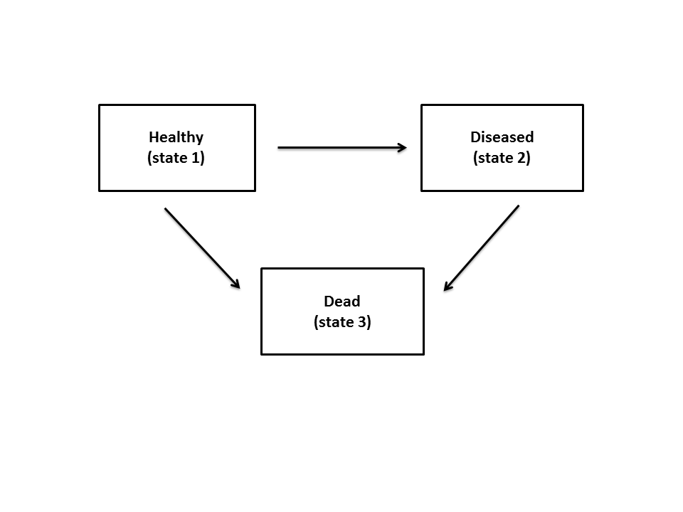

::: article
# Introduction

In a classical survival study, patients start from an initial state
\"alive\" and are followed up until the end of the study. They make a
transition to the absorbing state \"dead\", unless they drop out of the
study. In many medical studies, state \"alive\" includes two or more
transient states. For example, in the illness trajectory of a cancer, a
particular stage of the illness as a transient state is usually observed
over time (e.g. cancer recurrence). Multi-state models are particularly
useful for modeling the overall process of survival [@Hougaard2000],
[@Andersen2002]. A multi-state model is a model for a continuous-time
stochastic process allowing individuals to move among a finite number of
states. A transition from one state to another one is the occurrence of
one event of interest. The progressive illness-death model depicted in
Figure [1](#figure:ill) is a three-state multi-state model used in the
medical literature to describe disease progression [@MeiraMachado2008].
It consists of three states: \"Healthy\" (state 1), \"Diseased\" (state
2) and \"Dead\" (state 3). All patients start in healthy state, then
each patient can either have a transition directly to the dead state or
they can be diseased before moving to the dead state. That means, the
trajectory for a patient will be $1 \longrightarrow3$ or
$1\longrightarrow 2 \longrightarrow3$, but the entire trajectory might
not be observed due to censoring.

Often, in the presence of censoring, estimating the effect of a set of
prognostic factors on the course of the disease is an important target
for the progressive illness-death model. The effect of prognostic
factors for the Markov progressive illness-death model is generally
modeled by Aalen´s additive model, [@Aalen2001]. According to their
model, the effects on transition intensities are estimated and, from
them, the effects on transition probabilities (therefore, the
conditional transition probabilities) can be calculated by solving the
so-called forward Kolmogorov differential equation. But the violation of
Markov condition does not allow such a calculation. To this end,
Meira-Machado´s approach [@MeiraMachado2014] based on kernel smoothing
is an alternative to the Aalen model. The method considers the
nonparametric estimation of conditional transition probabilities in a
non-Markov illness-death Model that allows only conditioning on
continuous covariates in low dimension. [@Azarang2017] proposed the
direct binomial regression method for the transition probabilities in
the right-censored progressive illness-death model. By applying this
method, one can estimate the possibly time-varying regression
coefficients as covariate effects on the transition probabilities. The
method does not require the Markov assumption and has no restriction on
the dimension of covariates. In addition, it can be applied for both
continuous and categorical covariates. Based on this method, we have
developed a software package in R, called
[*idmTPreg*](https://CRAN.R-project.org/package=idmTPreg) (available
from the Comprehensive R Archive Network at
<https://cran.r-project.org/web/packages/idmTPreg/>). The progressive
illness-death model illustrated in Figure [1](#figure:ill) is the only
progressive disease model supported by the *idmTPreg* package.

Furthermore, several packages to analyse multi-state survival data like
the progressive illness-death data are available on the Comprehensive R
Archive Network (CRAN). For example, the
[*mstate*](https://CRAN.R-project.org/package=mstate) [@deWreede2010],
provides estimation of the transition probabilities possibly depending
on covariates, the implemented technique assumes proportional transition
intensities. The package can be applied to right censored and left
truncated multi-state data. The
[*msm*](https://CRAN.R-project.org/package=msm) package [@Jackson2011],
in terms of covariates, can be used to obtain conditional transition
probabilities in continuous-time Markov and hidden-Markov multistate
models for longitudinal data. In the
[*p3state.msm*](https://CRAN.R-project.org/package=p3state.msm) package
[@MeiraMachado2011], estimates of regression parameters can be obtained
by assuming that each transition may be specified by a Cox-type model.
To this end, one of the three possible options for the model can be
chosen; TDCM, CMM or CSMM. TDCM (time dependent Cox model) associates a
time dependent covariate with the occurrence of disease, in CMM (Cox
Markov model) it is assumed that the future is independent of the past
given the present state, and the CSMM model (Cox semi-Markov model)
emphasizes the importance of time spent in the current state,
[*Survival*](https://CRAN.R-project.org/view=Survival).

This paper describes *idmTPreg* package and its capabilities through the
following sections. In the next section, we outline the methodology of
the direct modeling approach in the progressive illness-death model, the
detailed mathematics underlying the package have been discussed in our
previous paper. Then, we describe the package in full detail, and
demonstrate how to apply the functions provided by the package through
the analysis of a real dataset. Ultimately, the last section gives a
summary of the work.

{#figure:ill
width="100%" alt="graphic without alt text"}

# An overview of the methodology {#Sec:2}

In this section we briefly review the methodological background behind
the *idmTPreg* package. As mentioned before, the progressive
illness-death model presents two transient states (state 1 and state 2)
and an absorbing state (state 3). The three possible transitions are
shown by forward arrows in Figure [1](#figure:ill). We assume here that
recovery (transition from 2 to 1) is not possible. Five different
transition probabilities of the model are: $p_{11}(s, t)$,
$p_{12}(s, t)$, $p_{13}(s, t)$, $p_{22}(s, t)$ and $p_{23}(s, t)$; $s$
and $t$ $(s < t)$ are times. Among the transition probabilities the
following relations hold:
$p_{11}(s, t) + p_{12}(s, t) + p_{13}(s, t) = 1$ and
$p_{22}(s, t) + p_{23}(s, t) = 1$. The transition probabilities
$p_{kl}(s, t)$´s, where $k = 1, 2$; $l = 1, 2, 3$ and $k \leq l$, are
defined as:

$p_{kl}(s, t)$ = Pr(patient is at state $l$ at time $t$ | patient was at
state $k$ at time $s$.)

Likewise, in the presence of covariates ($\pmb X$) the conditional
transition probabilities denoted by $p_{kl}(s, t |X)$ are defined. Let
$Z$ be the sojourn time in state 1, $T$ be the total survival time, and
$C$ be the censoring time of the model. The observed information is
$(\tilde Z, \Delta_1, \tilde T, \Delta, \pmb X)$, where $\Delta_1$ and
$\Delta$ are the censoring indicator of $Z$ and $T$ respectively;
$\tilde Z = min(Z, C)$ and $\tilde T = min(T, C)$; and $\pmb X$ is the
vector of time-independent covariates. In order to correct for
estimation bias due to censoring, we update $\Delta_1$ and $\Delta$ with
time $t$ and define $\Delta^t_1$ and $\Delta^t$ as follows:

$\Delta^t = 1_{\{\min(T,t) \leq C\}}=
\left\{
\begin{array}{ll}
\Delta  & if  \tilde T \leq t  \\
1 & if  \tilde T > t
\end{array}
\right.$

and

$\Delta_1^t = 1_{\{\min(Z,t) \leq C\}}=
\left\{
\begin{array}{ll}
\Delta  & if  \tilde Z \leq t  \\
1 & if  \tilde Z > t
\end{array}
\right.$

[@Azarang2017] introduced regression modeling to estimate the possibly
time-varying coefficients for the conditional transition probabilities
($p_{kl}(s, t|\pmb X)$, $k = 1, 2$; $l = 1, 2, 3$; $k \leq l$) in the
progressive illness-death model via defining binomial time-varying
response variables ($Y_{kl}(t)$'s), and time-varying random weights
$W^{s}_{kl} (t)$ (depending on transition from $k$ to $l$ the weights
are either a function of $\Delta_1^t$ or a function of $\Delta^t$ and
are estimated by $\hat W^{s}_{kl} (t)$, see [@Azarang2017] for more
details). The response variables and weights for each transition
probability are well defined so that:

$$p_{kl}(s, t |\pmb X) = E_s[W^{s}_{kl} (t)Y_{kl}(t) | \pmb X] \quad  k = 1, 2; \quad  l = 1, 2, 3; \quad  k \leq l,$$

where $E_s$ for $k = 1$ is the expectation value conditioned on the
event of being observed at the initial state by a given time $s$
$(Z > s)$ and for $k = 2$ it is the expectation value conditioned on
being observed at the intermediate state by time $s$ $(Z \leq s < T)$.
Then for a fixed time $s$, the linear predictor
$\pmb {X \beta}^{(s)}_{kl} (t)$ is linked to the transition probability
$p_{kl}(s, t|X)$ via an allowable link function for the binomial family.
Without the loss of generality, we consider logit link function:

$p_{kl}(s, t | \pmb X) = \dfrac{\exp(\pmb {X \beta}^{(s)}_{kl} (t))}{1 + \exp(\pmb {X \beta}^{(s)}_{kl} (t))}.$

As mentioned before, we consider $s$ to be fixed and $t \in [a, \tau]$,
where $t$ is the last event time point, and $p_{kl}(s, a |\pmb x) > 0$.
Then, $\pmb \beta ^{(s)}_{kl} (t)$, which is a vector of possibly
time-varying coefficients, can be estimated by solving the following
score equations:

$$\sum _{I_k} \dfrac{\partial {p_{kl}(s, t |\pmb X_i)}}{\partial \pmb \beta^{(s)}_{kl}(t)} 
\hat W_{kl}^{s} (t) [Y_{kl}(t) - p_{kl}(s, t|\pmb X_i)] \equiv 0,$$

where $I_1 = \{i : \tilde Z_i > s\}$ and
$I_2 =  \{i : \tilde Z_i \leq s < \tilde T_i \}$. Note that the expected
value of the above score functions equals zero. Since the estimates of
the coefficients, $\hat{\pmb \beta} ^{(s)}_{kl} (t)$, are piecewise
constant between the jump times of $Y_{kl}$ (that are the jump times of
$W^{s}_{kl}$ too) we can fit the standard approach for generalised
linear models at each jump time of the corresponding response variable.
Therefore, for each $t$ between $a$ and $\tau$,
$\hat{\pmb \beta} ^{(s)}_{kl} (t)$ are given.

# Package description

The *idmTPreg* package provides estimates of the coefficients on
transition probabilities for a progressive illness-death dataset. The
package consists of 6 user-visible functions described in Table
[1](#tab1). In addition, there is an invisible function called
`mod.glm.fit` that is contained inside the main function to fit
generalized linear type models. This function is a modified version of
`glm.fit` available in the [R Stats
Package](https://stat.ethz.ch/R-manual/R-devel/library/stats/html/00Index.html).
The modification was done to give special weights to the binary
responses discussed in the previous section. The modified function
`mod.glm.fit` gives the estimated vector of coefficients. Also, the call
to `mod.glm.fit` has been programmed in parallel to obtain $95\%$
pointwise bootstrap confidence bands. The number of cores for parallel
execution is set to the number of CPU cores on the current host by
default unless it is specified by the user. Then, `registerDoParallel`
of the [*doParallel*](https://CRAN.R-project.org/package=doParallel)
package is used to register the parallel backend. The parallel
computation is performed by the `foreach` function of
[*foreach*](https://CRAN.R-project.org/package=foreach) package.

::: {#tab1}
  -------------------------------------------------------------------------------------------------
  Function    Description
  ----------- -------------------------------------------------------------------------------------
  `TPreg`     Fits the semi-parametric regression model to estimate the effects on transition

              probabilities for a sequence of time.

  `summary`   Gives details about the estimated effects of pre-specified transition probabilities

              for a sequence from a given `s` to a given `t`.

  `plot`      Makes a plot for the estimated effect of pre-specified transition probabilities

              along time, from time `s` to time `t`.

  `print`     Provides the details about the estimated effects of pre-specified transition

              probabilities for given `s` and `t`.

  `iddata`    Converts a raw illness-death data to a data frame which can be passed into

              `TPreg` function (described before) .
  -------------------------------------------------------------------------------------------------

  : Table 1: Functions and summary of their descriptions in the
  *idmTPreg* package.
:::

The main function, intended to be called by the user, is `TPreg()`. The
data frame to be passed into the main function of the package, other
than covariates, must contain `Zt`, `Tt`, `delta1`, and `delta`
variables (denoted by $\tilde{Z}$, $\tilde{T}$, $\Delta_1$ and $\Delta$
in the previous section). Assessing these variables for a
non-statistician might be challenging, so `iddata` function is used to
convert simple records of progressive illness-death data to the proper
format. To this end, one may ask clinicians to give them the total
survival time (`Stime`), the indicator of uncensored total survival time
(`Sind`), the arrival time to the diseased state (`Iltime`), the
indicator of visiting diseased state (`Ilind`) and a vector of
covariates (`cov`). By convention for patients who have not been
diseased (`Ilind=0`), their arrival time to the diseased state is
recorded equal to their total survival time.

# Example of application

To illustrate our method with the capability of our package, we consider
the colon cancer dataset which is freely available as a part of the
[*survival*](https://CRAN.R-project.org/package=survival) package. In
this study, from 929 patients who had curative-intent resections of
stage III colon cancer, 315 were randomly assigned to observation only,
310 to levamisole alone (Lev), and 304 to levamisole plus fluorouracil
(Lev+5FU). See [@Moertel1990] for details. By the end of the study, 477
patients remained alive, 468 developed a recurrence, and 452 died and
among these, 38 died without recurrence. The possible events for a
patient may be described by the progressive illness-death model with
states 1, 2 and 3 corresponding to \"Alive and disease-free\", \"Alive
with recurrence\", and \"Dead\" respectively. A subset of colon cancer
dataset called `colonTPreg` is available in the *idmTPreg* package, but
just three risk factors were included in the dataset : Age (in years)
and Nodes (number of lymph nodes with detectable cancer), and treatment.
We use the `colonTPreg` dataset to demonstrate the functionality of the
package.

``` r
> library(idmTPreg)
> data(colonTPreg)
> head(colonTPreg)
 
   id   Zt   Tt delta1 delta Nodes Age treatment
 1  1  968 1521      1     1     5  43   Lev+5FU
 2  2 3087 3087      0     0     1  63   Lev+5FU
 3  3  542  963      1     1     7  71       Obs
 4  4  245  293      1     1     6  66   Lev+5FU
 5  5  523  659      1     1    22  69       Obs
 6  6  904 1767      1     1     9  57   Lev+5FU
```

Each row in the data corresponds to a single individual. The columns
`Zt`, and `Tt` are time variables, measured in days. For instance,
patient 1 experienced a recurrence after 968 days (transition from state
1 to state 2), and died after 1521 days. Patient 2 was censored after
3087 days without having the recurrence. These data have a suitable
format for the analysis.

Estimates for the effect of covariates on transition probabilities are
obtained using function `TPreg()`. The first argument of this function
is an object of class `"formula"` which specifies the covariates on the
right-hand side of the $\sim$ operator, that are separated by +
operators. The left side of the $\sim$ operator is left empty because
the time-dependent binary responses corresponding to each transition are
defined in the main function. The `data` argument must be a data frame
of `"iddata"` class or a data frame similar to `colonTPreg` format
described previously. The `link` argument is a suitable link function
for binomial family (logit, probit and cauchit). Argument `s` is the
current time for the transition probabilities; default is zero which
reports the occupation probabilities. Argument `t` is the Future time
for the transition probabilities; default is NULL which is the largest
uncensored sojourn time in the initial state. The `R` argument specifies
the number of bootstrap replicates, default is 199. The argument `trans`
indicates the possible transition(s) for a progressive illness-death
model. The output is an object of class `"TPreg"`. This object has its
own `print()`, `summary()` and `plot()` methods.

We apply the method described in the previous section to estimate the
effect of the risk factors on transition \"Alive and
disease-free\"$\longrightarrow$\"Dead\". To see the result for each time
of the sequence from time s = 0 to 7 years with the default increment,
we use the following input command:

``` r
> co13 <- TPreg( ~ Age + Nodes + treatment, colonTPreg, 
+                link = "logit", s = 0, R = 99,
+                t = 365.24*7, trans = "13")
> co13

Call:
TPreg(formula = ~Age + Nodes + treatment, data = colonTPreg, 
link = "logit", s = 0, t = 365.24 * 7, R = 99, trans = "13")
		
Transition:
[1] "13"
		
(s,t):
[1]    0.00 2556.68
		
Coefficients:
	           Estimate      St.Err         LW.L        UP.L      P.value
X.Intercept.     -1.5899472 0.588179192 -2.742778368 -0.43711594 6.868203e-03
Age               0.0162786 0.008990345 -0.001342478  0.03389967 7.019108e-02
Nodes             0.2773286 0.066204572  0.147567677  0.40708960 2.802296e-05
treatmentLev     -0.2360843 0.209801808 -0.647295861  0.17512722 2.604733e-01
treatmentLev.5FU -0.6222765 0.281455569 -1.173929431 -0.07062360 2.704119e-02
		
		
[1] "18 observations deleted due to missingness from 'data'"
```

The `print()` method returns the results for `s=0` and `t= 2556.68`
days; and provides $95\%$ pointwise bootstrap confidence bands based on
nonparametric resampling and normal method (normal approximation of
two-sided nonparametric confidence interval). Then, using the
`summary()` function one can obtain estimated values at each especified
time between `s=0` and `t=2556.68`. The estimates between the jump times
of $Y_{13}$ in the time interval \[`s`,`t`\] are piecewise constant, and
one can choose a vector of times from the jump times via argument `by`.
Then, at the selected times the values are estimated. This argument
gives the increment of the sequence from time `s` to time `t`. The
default is
$\lfloor \dfrac{\max(\tilde Z) - \min (\tilde Z)} {q_{0.01}(\tilde Z)} \rfloor$,
where $q_{0.01}(.)$ is the sample quantile corresponding to 0.01
probability and $\lfloor x\rfloor$ gives the largest integer less than
or equal to $x$.

``` r
> summary(co13)

Call:
TPreg(formula = ~Age + Nodes + treatment, data = colonTPreg, 
	link = "logit", s = 0, t = 365.24 * 7, R = 99, trans = "13")
(s,t):
[1]    0.00 2556.68
		
 Transition 13  :
		
   Coefficients:
    time   X.Intercept.        Age       Nodes  treatmentLev  treatmentLev.5FU
1    23.00   -28.325534 -0.024555212 -0.03918837  3.388159555      24.27533991
2   402.00    -4.092865  0.025096305  0.08050421  0.156140164      -0.07222873
3   659.00    -2.220785  0.003369437  0.16278647  0.001584098      -0.22781061
4   938.00    -2.003750  0.007666566  0.19530069 -0.009332136      -0.35912373
5  1313.00    -1.599525  0.008508928  0.20271435  0.068328191      -0.54960487
6  1891.00    -1.438688  0.009063383  0.24205416 -0.035327744      -0.48638357
7  2122.00    -1.623667  0.013412336  0.25594531 -0.124328431      -0.52617865
8  2221.00    -1.296856  0.010038380  0.25308608 -0.202232077      -0.59947602
9  2385.00    -1.488674  0.014490552  0.26120609 -0.295496733      -0.67206843
10 2556.68    -1.589947  0.016278598  0.27732864 -0.236084318      -0.62227652
		
  Standard Errors:
    time   X.Intercept.        Age       Nodes  treatmentLev  treatmentLev.5FU
1    23.00 6951.8911865 0.012738568 0.02106333 6951.7974079     7332.1281285
2   402.00    0.7536143 0.012812950 0.02905815    0.3390078        0.3389652
3   659.00    0.5991375 0.009148785 0.03054517    0.2120707        0.2345916
4   938.00    0.4703039 0.006894272 0.03200788    0.1997101        0.2180372
5  1313.00    0.4797216 0.007066202 0.03454175    0.1730820        0.1684948
6  1891.00    0.4183546 0.006680265 0.03836143    0.1509584        0.1735455
7  2122.00    0.5117859 0.007847209 0.03600325    0.1715612        0.2003901
8  2221.00    0.4941523 0.007429709 0.03879966    0.2166193        0.1933320
9  2385.00    0.4466957 0.007199118 0.04701630    0.1918290        0.2106014
10 2556.68    0.5881792 0.008990345 0.06620457    0.2098018        0.2814556
		
 Lower limit:
    time   X.Intercept.        Age       Nodes  treatmentLev  treatmentLev.5FU
1    23.00 -13654.032259 -4.952281e-02 -0.08047250 -1.362213e+04 -1.434670e+04
2   402.00     -5.569949 -1.707772e-05  0.02355023 -5.083151e-01 -7.366005e-01
3   659.00     -3.395094 -1.456218e-02  0.10291793 -4.140744e-01 -6.876100e-01
4   938.00     -2.925546 -5.846207e-03  0.13256524 -4.007639e-01 -7.864766e-01
5  1313.00     -2.539779 -5.340829e-03  0.13501253 -2.709125e-01 -8.798548e-01
6  1891.00     -2.258663 -4.029937e-03  0.16686576 -3.312062e-01 -8.265328e-01
7  2122.00     -2.626767 -1.968194e-03  0.18537895 -4.605884e-01 -9.189432e-01
8  2221.00     -2.265394 -4.523850e-03  0.17703874 -6.268059e-01 -9.784067e-01
9  2385.00     -2.364197  3.802815e-04  0.16905414 -6.714816e-01 -1.084847e+00
10 2556.68     -2.742778 -1.342478e-03  0.14756768 -6.472959e-01 -1.173929e+00
	    
		
 Upper limit:
    time   X.Intercept.        Age       Nodes  treatmentLev  treatmentLev.5FU
1    23.00 13597.3811919 0.0004123815 0.002095746 1.362891e+04     1.439525e+04
2   402.00    -2.6157811 0.0502096878 0.137458182 8.205954e-01     5.921430e-01
3   659.00    -1.0464752 0.0213010553 0.222655003 4.172426e-01     2.319888e-01
4   938.00    -1.0819546 0.0211793383 0.258036135 3.820996e-01     6.822917e-02
5  1313.00    -0.6592702 0.0223586842 0.270416172 4.075688e-01    -2.193550e-01
6  1891.00    -0.6187126 0.0221567029 0.317242567 2.605507e-01    -1.462343e-01
7  2122.00    -0.6205667 0.0287928650 0.326511677 2.119315e-01    -1.334141e-01
8  2221.00    -0.3283172 0.0246006100 0.329133417 2.223417e-01    -2.205453e-01
9  2385.00    -0.6131503 0.0286008224 0.353358041 8.048813e-02    -2.592898e-01
10 2556.68    -0.4371159 0.0338996729 0.407089599 1.751272e-01    -7.062360e-02
		
  p.value:
    time   X.Intercept.        Age       Nodes  treatmentLev  treatmentLev.5FU
1    23.00 9.967490e-01 0.05390150 6.281445e-02    0.9996111      0.997358354
2   402.00 5.604497e-08 0.05015178 5.597856e-03    0.6451000      0.831259885
3   659.00 2.100303e-04 0.71265448 9.855485e-08    0.9940401      0.331501133
4   938.00 2.039302e-05 0.26612969 1.049831e-09    0.9627297      0.099542518
5  1313.00 8.552157e-04 0.22852284 4.392863e-09    0.6930100      0.001106878
6  1891.00 5.840419e-04 0.17486385 2.793398e-10    0.8149671      0.005068814
7  2122.00 1.511058e-03 0.08741659 1.169284e-12    0.4686432      0.008645272
8  2221.00 8.680053e-03 0.17665908 6.896373e-11    0.3505190      0.001930250
9  2385.00 8.602758e-04 0.04413322 2.765814e-08    0.1234587      0.001416893
10 2556.68 6.868203e-03 0.07019108 2.802296e-05    0.2604733      0.027041188
		
		
[1] "18 observation(s) deleted due to missingness from 'data'"
```

The `plot()` method is used to plot estimated regression coefficients
with $95\%$ confidence bands to visualize possible time-varying effects
of covariates along time. Argument `covar` of `plot.Tpreg()` function
indicates the covariates for which their effects are to be plotted. The
argument `rug` (`(`TRUE) by default) adds a rug representation of times
between time `s` and time `t`. And argument `Ylim` gives the list of
limits for the `y` axes.

``` r
> plot(co13, covar = c("Age", "Nodes", "treatmentLev", "treatmentLev.5FU"),
	Ylim = list(c(-0.1,0.1), c(-0.5,0.5), c(-2,2), c(-2,2)))
```

{#figure:p13 width="100%"
alt="graphic without alt text"}

Figure [2](#figure:p13) shows the plot corresponding the adjusted
effects of Age, Nodes, Lev and Lev+5FU on transition probability
$p_{13}$. The covariate age, shows no significant effect of age on
$p_{13}$ along time. The increasing number of nodes with detectable
cancer significantly increases the probability of dying steadily over
time. As for the effect of treatment, after 1000 days the Lev+5FU
decreases the transition probability to the death state (in the long
run), while no effect of Lev on $p_{13}$ is appreciated. By setting
`trans = all` inside `TPreg()` function, `plot()` simultaneously
displays the effect of prespesified covariate(s) on all transition
probabilities.

We set `by=1` and `trans=11` to calculate all regression results on
transition probability $p_{11}$ for all times between $0$ and $7$ years.
Compared with a larger `by`, `by=1` results in a longer time for R to
run the code.

``` r
> co11 <- TPreg( ~ Age + Nodes + treatment, colonTPreg,  link = "logit", s = 0,
             R = 199, by = 1, t = 365.24*7, trans = "11")
> co11		

Call:
TPreg(formula = ~Age + Nodes + treatment, data = colonTPreg, 
link = "logit", s = 0, t = 365.24 * 7, R = 199, by = 1, trans = "11")

Transition:
[1] "11"

(s,t):
[1]    0.00 2556.68

Coefficients:
                  Estimate      St.Err        LW.L         UP.L      P.value
X.Intercept.      0.909156911 0.585357182 -0.23814317  2.056456987 0.1203834661
Age              -0.009283428 0.009090987 -0.02710176  0.008534907 0.3071746946
Nodes            -0.260231227 0.068103658 -0.39371440 -0.126748057 0.0001328551
treatmentLev      0.099705824 0.279628624 -0.44836628  0.647777927 0.7214173649
treatmentLev.5FU  0.743733904 0.253849957  0.24618799  1.241279820 0.0033916175


[1] "18 observations deleted due to missingness from 'data'"
```

``` r
> plot(co11, covar = c("Age", "Nodes", "treatmentLev", "treatmentLev.5FU"),
	Ylim = list(c(-0.1,0.1), c(-0.5,0.5), c(-2,2), c(-2,2)))
```

{#figure:p11
width="100%" alt="graphic without alt text"}

The rugs on $x$ axis are all jump times of the response variable
corresponding to transition (i.e. $Y_{11}(t)$). As mentioned in the
second section, the estimates of the coefficients are piecewise constant
between the jump times. Therefore, Figure [3](#figure:p11) depicts all
the estimates, for every time between 0 and 7 years. From the figure, we
see that the number of nodes significantly reduces the probability of
consistently staying healthy and treatment Lev+5FU significantly
increases this probability at each time point.

# Summary

This paper describes the implementation of a flexible method in R for
fitting a regression model to possibly non-Markov progressive
illness-death data. The *idmTPreg* package offers the user the
opportunity to estimate possibly time-varying effect of covariates on
the transition probabilities for the progressive illness-death model. We
have explained the use of the *idmTPreg* package by applying the method
to a colon cancer dataset. The results in this paper were obtained using
R 3.4.2. In a future version of the package, we plan to implement a
similar method to estimate coefficients on net survivals for a
progressive illness-death in a relative survival setting.

# Acknowledgment

This work was supported by funding from the European Community's Seventh
Framework Programme FP7/2011: Marie Curie Initial Training Network
MEDIASRES ("Novel Statistical Methodology for Diagnostic/Prognostic and
Therapeutic Studies and Systematic Reviews"; www.mediasres-itn.eu) with
the Grant Agreement Number 290025, by the Basque Government through the
BERC 2014-2017 program, by Spanish Ministry of Economy and
Competitiveness MINECO: BCAM Severo Ochoa excellence accreditation
SEV-2013-0323, Grant MTM2016-76969-P and European Regional Development
Fund (ERDF). The second author acknowledges financial support from
Ministerio de Economía y Competitividad Grant MTM2016-76969-P and
European Regional Development Fund (ERDF).
:::
