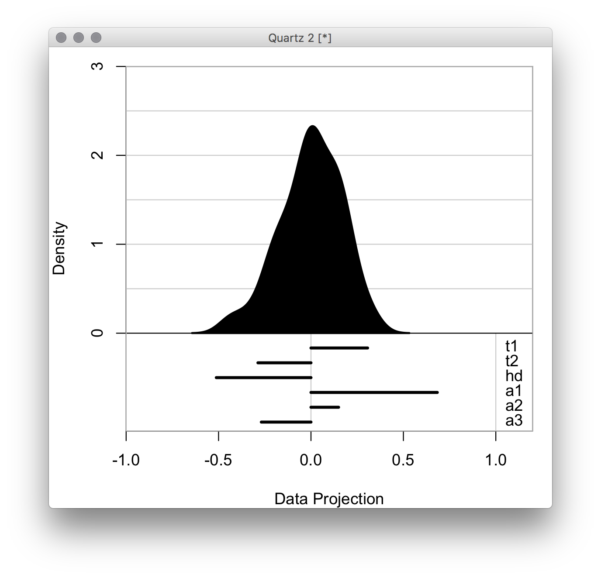
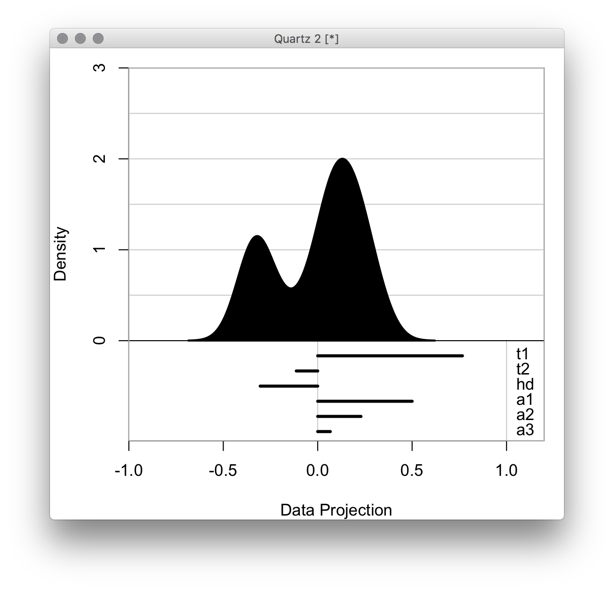
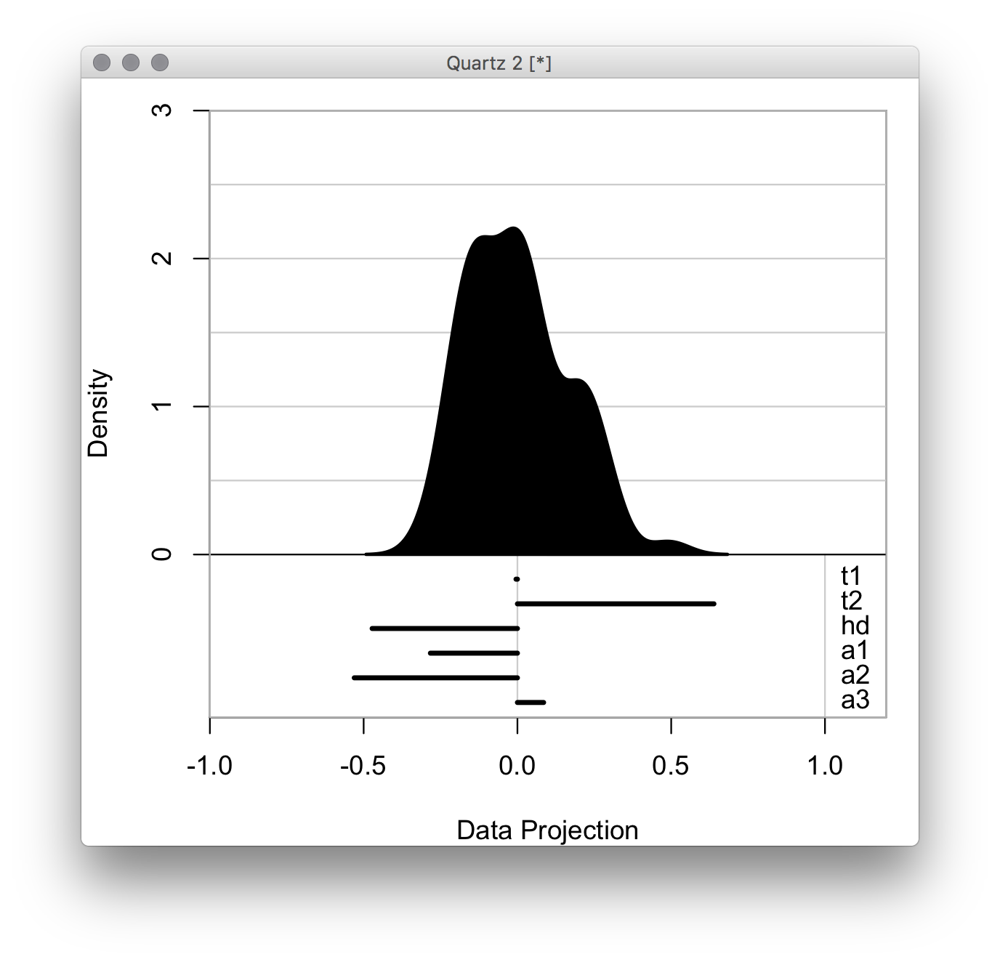
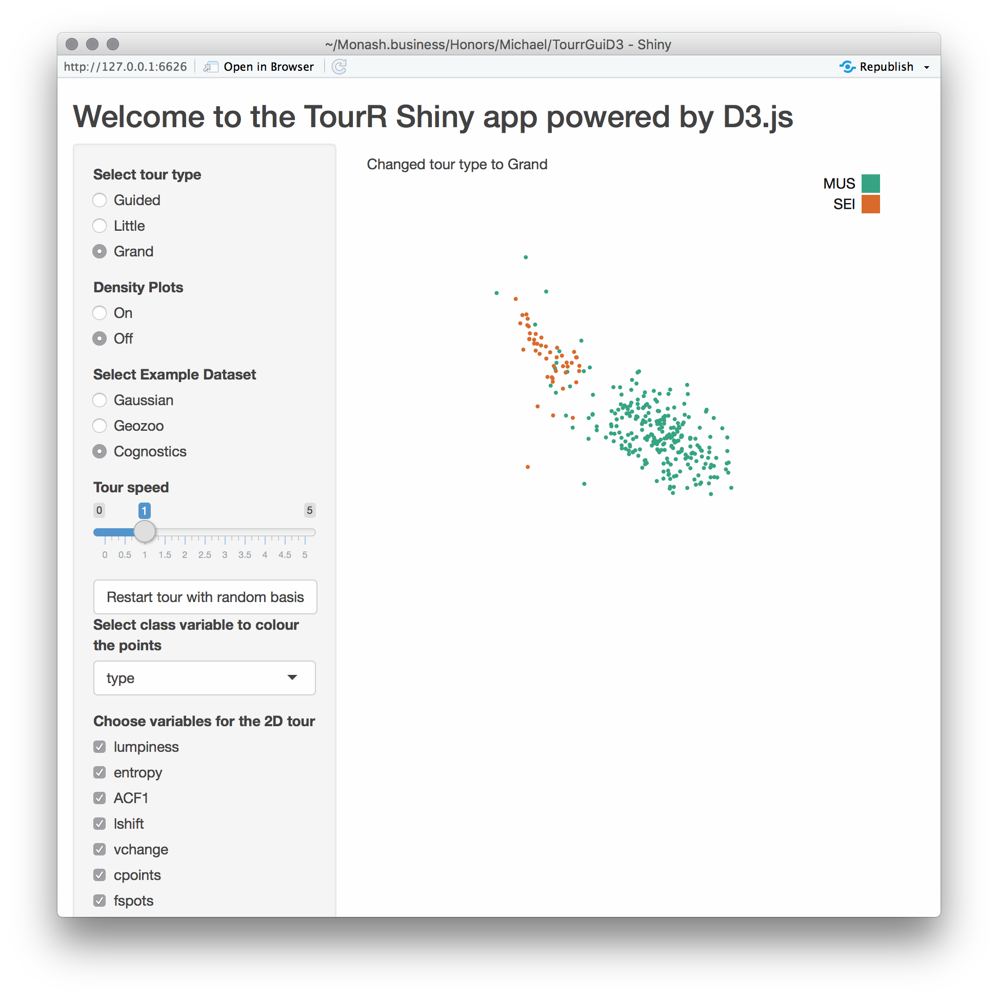

::: article
## Introduction

Did you know you can run *any javascript you like* in a Shiny
application and you can pass *whatever you want including JSON* back and
forth? This massively widens the scope of what you can do with Shiny,
and generating a tour of multivariate data with this approach is a
really good example of what is possible.

The tour algorithm [@As85] is a way of systematically generating and
displaying projections of high-dimensional spaces in order for the
viewer to examine the multivariate distribution of data. It can do this
either randomly, or by picking projections judged interesting according
to some criterion or index function. The
[*tourr*](https://CRAN.R-project.org/package=tourr) package [@tourr]
provides the computing and display in R to make several types of tours:
grand, guided, little and local. The projection dimension can be chosen
between one and the number of variables in the data. The display,
though, has no capacity for interaction. The viewer can watch the tour
like a movie, but not pause it and restart, or change tour type, or
number of variables.

These interactive controls were provided with the
[*tourrGui*](https://CRAN.R-project.org/package=tourrGui) package
[@tourrGui], with was programmed with the
[*RGtk2*](https://CRAN.R-project.org/package=RGtk2) package [@RGtk2].
This is not the toolkit of choice today, and has been superceded with
primarily web-capable tools, like Shiny [@shiny]. To display dynamic
graphics though, is not straight-forward. This paper explains how to use
D3 [@D3] as the display engine in a Shiny graphical user interface
(GUI), using custom message passing between server and client.

## Creating a tour, with the tourr package

The [*tourr*](https://CRAN.R-project.org/package=tourr) package [@tourr]
is an R implementation of the tour algorithms discussed in [@gt_pp_mc].
It includes methods for geodesic interpolation and basis generation, as
well as an implementation of the simulated annealing algorithm to
optimise projection pursuit indices for the guided tour. The tour can be
displayed directly in the R graphics device, for example, the code below
generates a 1D density tour. Figure [1](#tour) shows snapshots.

``` r
library(tourr)
# quartz() # to display on a Mac; X11() # For windows; The Rstudio graphics
# device is not advised
animate_dist(flea[, 1:6], center = TRUE)
```

<figure id="tour">
<p></p>
<figcaption>Figure 1: Three projections from a 1D tour of 6D data,
displayed as a density. Full video can be seen at
https://vimeo.com/255466661.</figcaption>
</figure>

A tour path is a smooth sequence of projection matrices, $p\times d$,
that when combined with a matrix of n data points, $n\times p$, and a
rendering method, produces a steady stream of $d$-dimensional views of
the data. Each tour is initialised with the `new_tour()` method, which
instantiates a tour object and takes as arguments the data $X$, the tour
method, e.g. `guided_tour()`, and the starting basis. Once initialised,
a new target plane is chosen, and a series of steps along a geodesic
path from starting to target plane are generated by interpolation.

This requires a series of calls to the tour object producing the series
of projections. The steps are discrete, of size given by
$\omega/\Delta$, where $\omega$ denotes the angular velocity of the
geodesic interpolation, and $\Delta$ is a parameter denoting frames per
second, reflecting the rendering speed of the device in use. The
$\Delta$ parameter can be thought of as the frames per second, while
$\omega$ affects the speed at which the tour moves through the
projection space. For our purposes, $\Delta$, `fps` in the code, is set
at 25, while the $\omega$ can be adjusted by the user.

## Connecting the tour projections to D3 display using `sendCustomMessage`

D3.js (Data-Driven Documents) [@D3] is a JavaScript library for
manipulating documents based on data. The advantages of D3 are similar
to those provided by Shiny: namely, an industry standard with rich array
of powerful, easy to use methods and widgets that can be displayed on a
wide variety of devices, with a large user base. D3 works on data
objects in the JavaScript Object Notation (JSON) format, which are then
parsed and used to display customisable data visualisations.

The new implementation of the tour interface uses D3 to render each
projection step returned by R, focusing on 2D projections as a test
case. It does this by drawing and re-drawing a scatterplot with dots (or
circles in D3 language) and providing SVG objects for the web browser to
render. Figure [2](#tourrD3) shows the new GUI.

<figure id="tourrD3">
<p><span></span></p>
<figcaption>Figure 2: Shiny GUI for the tour, with D3 as the display
engine. GUI provides controls to select tour type, change speed,
restart, and select variables to include.</figcaption>
</figure>

The Shiny functions `session$sendCustomMessage()` and
`Shiny.addCustomMessageHandler()` are provided to transport data between
R and JavaScript. Whenever the former is executed in R, the latter
function will execute a code block in JS. There are many examples of
such functions being used to pass arbitrary data from an R app to a JS
front-end, few examples exist of this basic functionality to update a D3
animation in real-time.

To set up the interface for the app, we need to load the relevant
scripts into the Shiny app and assign a section for the resulting plots.
This is done when setting up the user interface. We import D3 and our
plotting code via the `tags$script` (for web links) and `includeScript`
(for reading from a full path). We use `tags$div` to assign an id for
the output section that can be accessed in the D3 code.

``` r
tags$script(src = "https://d3js.org/d3.v4.min.js"),
includeScript(system.file("js/d3anim.js", package = "tourrGUID3")),
tags$div(id = "d3_output")
```

On the D3 side we can access the id defined in Shiny, and for example
assign it to a scalable vector graphics (svg) object to be filled in D3
and rendered onto the Shiny app.

``` r
var svg = d3.select("#d3_output")
    .append("svg")
    .attr("width", w)
    .attr("height", h);
```

The data format expected by D3 is in JSON format, which combines two
basic programming paradigms: a collection of name/value pairs, and an
ordered list of values. R's preferred data formats include data frames,
vectors and matrices. Every time a new projection has been calculated
with the tour path, the resulting matrix needs to be converted to JSON
and sent to D3. Using a named list we can send multiple JSON datasets to
D3, e.g. to draw both the data points (stored in dataframe d) and the
projection axes (stored in dataframe a). Converting dataframes will pass
the column names to JSON. The code to send the D3 data looks like this:

``` r
session$sendCustomMessage(type = "data", message = list(d = toJSON(d), a = toJSON(a)))
```

This code is from the observe environment from the `server.R` file. It
converts the matrix of projected data points to JSON format, and sends
it to JavaScript with the id data. The list entries of the "message" can
parsed in D3 by its `data()` method, e.g. `data(message.d)` to access
the projected data points, and we can access each column through the
column names assigned in the original dataframe, and loop over all rows
for rendering. All of the code required to render the scatterplots and
legends, along with colours, is JavaScript code in the file `d3anim.js`.
In particular, the data from R is handled with the following code:

``` r
Shiny.addCustomMessageHandler("data",
    function(message) {
        /* D3 scatterplot is drawn and re-drawn using the
            data sent from the server. */
}
```

Every time the message is sent (25 times per second), the code-block is
run.

## Getting projections

The `observeEvent` Shiny method defines a code block to be run whenever
some input value changes. The following code snippet restarts a tour
using a random basis:

``` r
observeEvent(input$restart_random,
  {
    p <- length(input$variables)
    b <- matrix(runif(2*p), p, 2)
    rv$tour <- 
      new_tour(as.matrix(rv$d[input$variables]),
              choose_tour(input$type, 
              input$guidedIndex,
              c(rv$class[[1]])), b)
})
```

The projections are calculated using the tour object in an `observe()`
environment, which re-executes the code whenever it is invalidated. The
invalidation is either by a change in reactive value inside the code
block, or we can schedule a re-execution by explicitly invalidating the
observer after a selected interval using `invalidateLater()`. The
projections are calculated using the following code block:

``` r
observe({
    if (length(rv$mat[1, ]) < 3) {
      session$sendCustomMessage(type = "debug",
      message = "Error: Need >2 variables.")
    }
    aps <- rv$aps
    tour <- rv$tour
    step <- rv$tour(aps / fps)
    invalidateLater(1000 / fps)
    j <- center(rv$mat %*% step$proj)
    j <- cbind(j, class = rv$class)
    colnames(j) <- NULL
    session$sendCustomMessage(type = "data",
         message = list(d = toJSON(data.frame(pL=rv$pLabel[,1], x=j[,2], 
                                              y=j[,1], c=j[,3])),
                        a = toJSON(data.frame(n=rv$vars, y=step$proj[,1], 
                                              x=step$proj[,2]))))
})
```

## Try it

You can try the app yourself using this code:

``` r
devtools::install_github("uschiLaa/tourrGUID3")
library(tourrGUID3)
launchApp(system.file("extdata", "geozoo.csv", package = "tourrGUID3"))
```

## Troubleshooting

Fixing bugs in the JavaScript code can be cumbersome, as R and Shiny
will not report any errors. Tracing JavaScript errors can be done when
using the JavaScript console in the web browser. For example, in Google
Chrome the console can be accessed via the "Developer Tools" option
found under "Moore Tools" in the control menu. Typical errors that we
encountered were version dependent syntax in D3, e.g. for axis
definitions or scaling.

## Pros and cons

The D3 canvas makes for smooth drawing and re-drawing of the data
projections. Adding a GUI around the display is straightforward with the
Shiny package, e.g. control elements such as stop/go, increase/decrease
speed, change tour type, add/remove variables from the mix.

The main disadvantage is that the speed is inconsistent, as server and
client play tag to keep up with each other, and the display cannot
handle many observations. Noticeable slow down was oberved with 2000
points, the main reason being the rendering time required for the large
number of SVG circle elements. The situation can be improved when using
a single HTML5 canvas element to draw the scatter points, significantly
reducing the rendering time.

Another disadvantage is that the displays needs to be coded anew. D3
provides mostly primitives, and example code, to make scatterplots, and
contours, but the data displays all need to be coded again.

## Summary

The custom message tools from Shiny provide a way to share a tour path
with the D3 renderer, and embed it in a Shiny GUI providing controls
such as stop/go, increase/decrease speed, change tour type, add/remove
variables. However, the approach doesn't provide the smooth motion that
is needed for easy display of projections, and is slow for large numbers
of observations.

## Code

The code is available at <https://github.com/uschiLaa/tourrGUID3>, and
the source material for this paper is available at
<https://github.com/dicook/paper-tourrd3>.

## Acknowledgements

Thanks to Yihui Xie for pointing out the custom message tools.
:::
