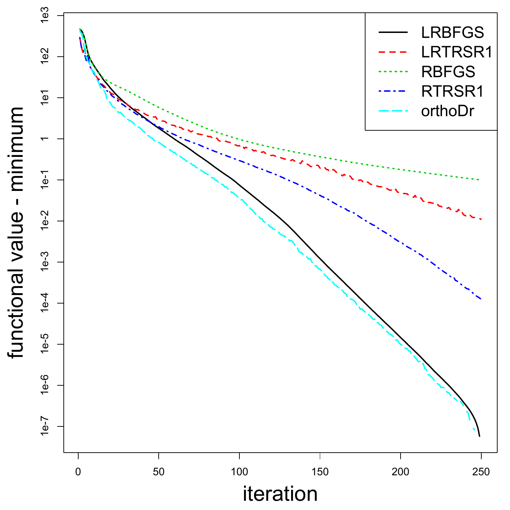
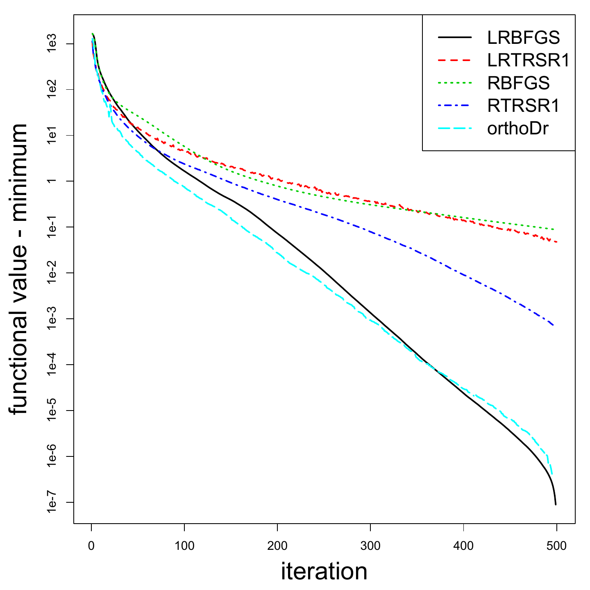
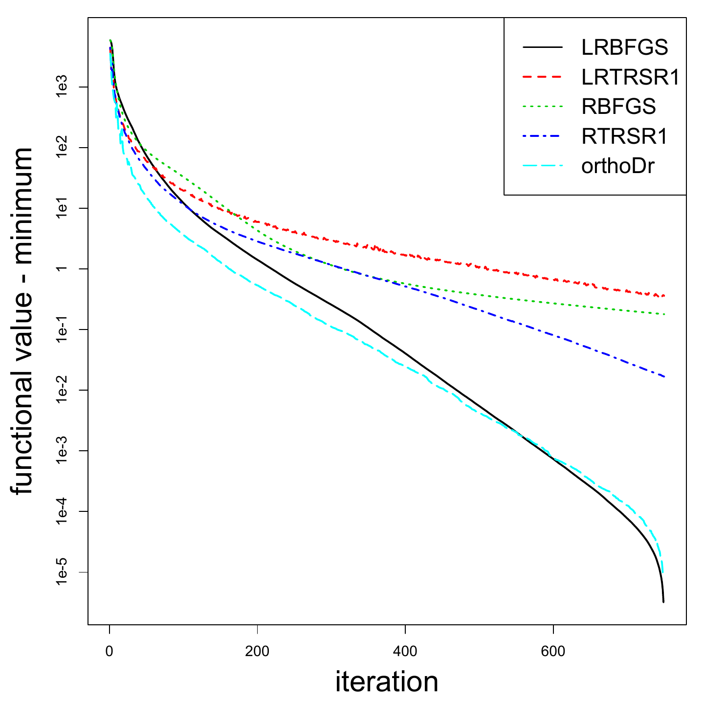
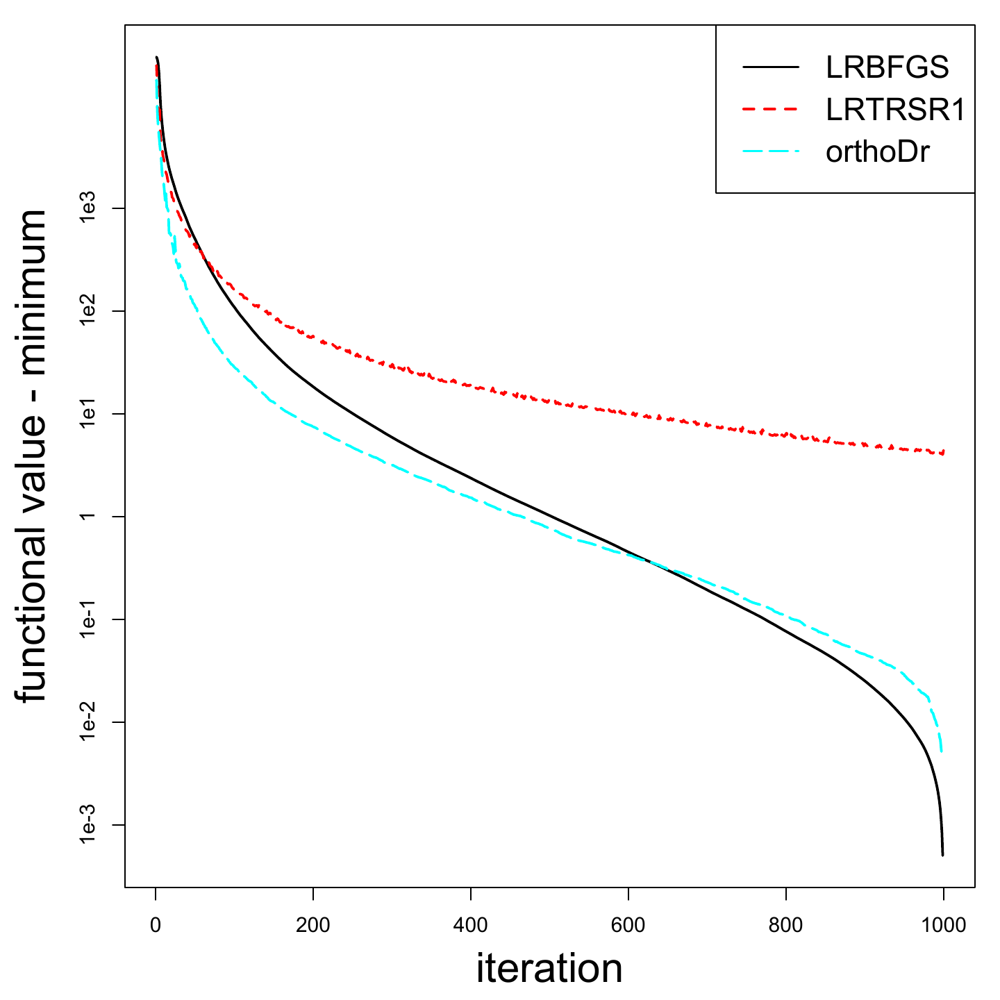
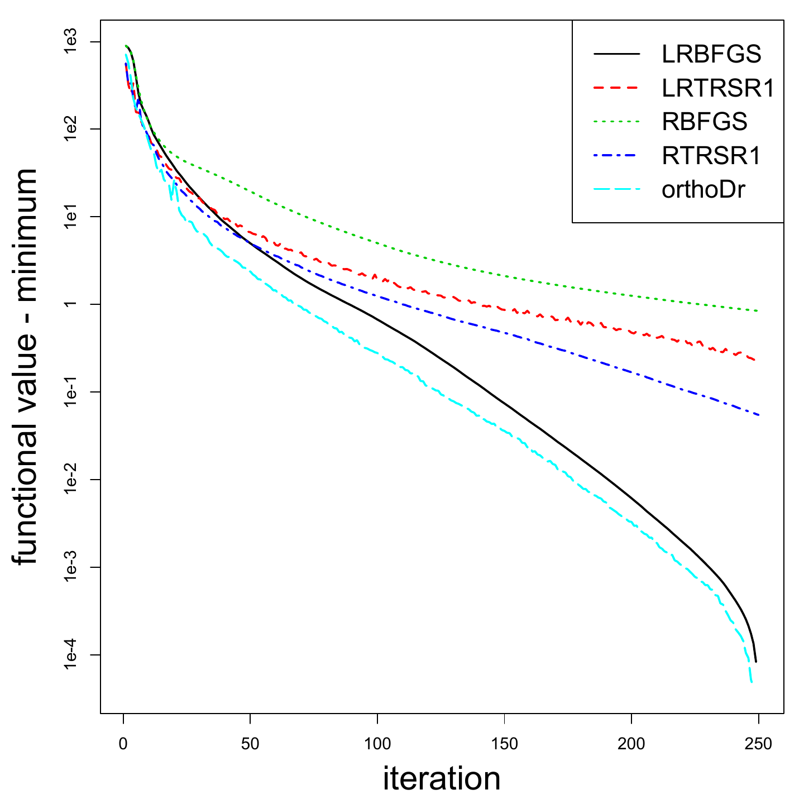
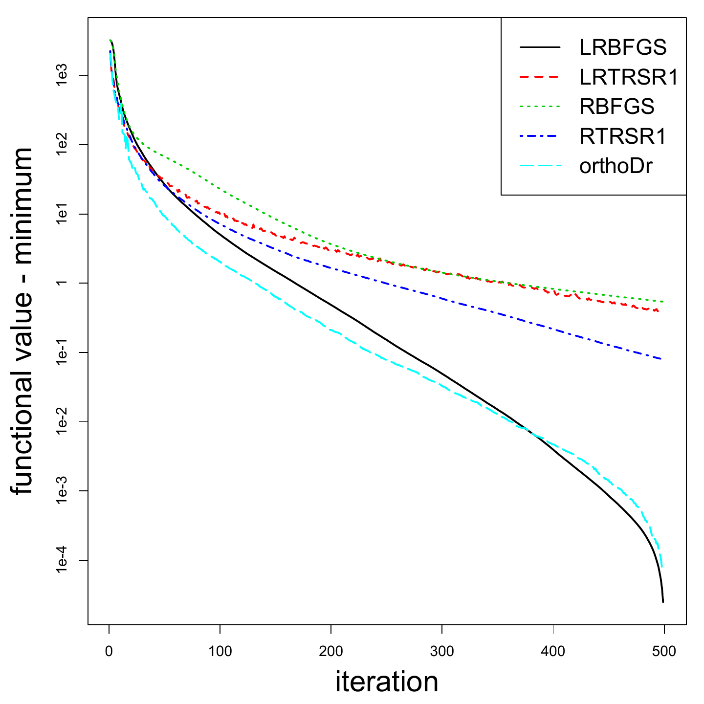
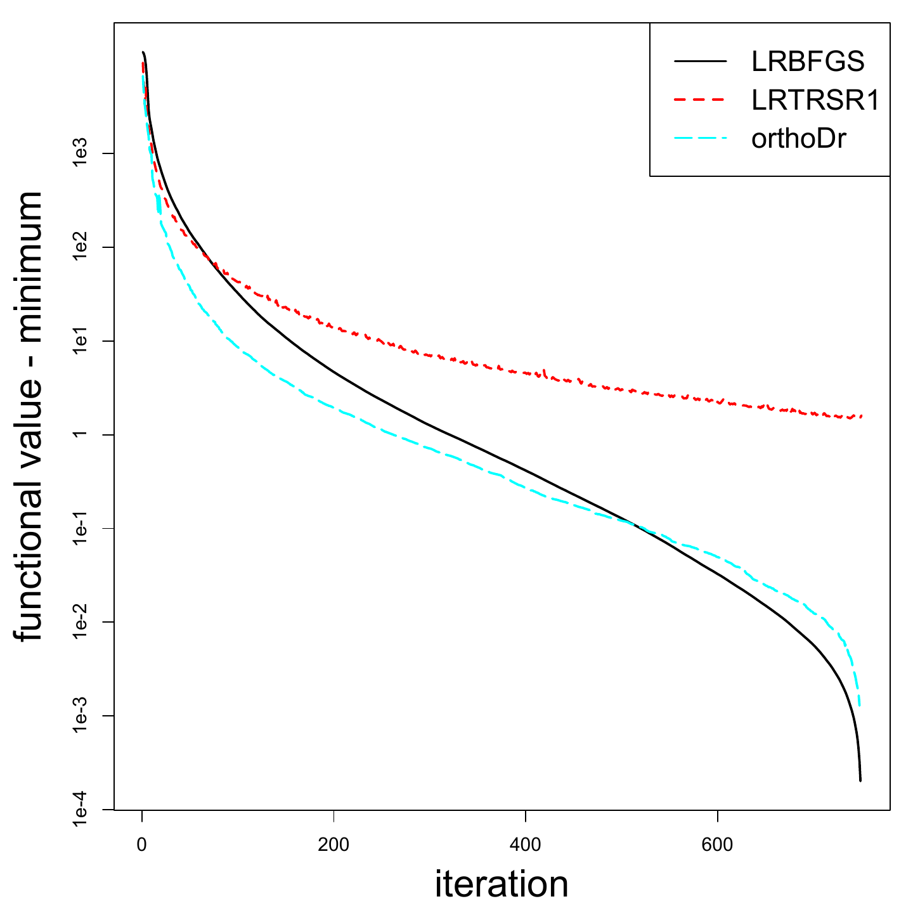
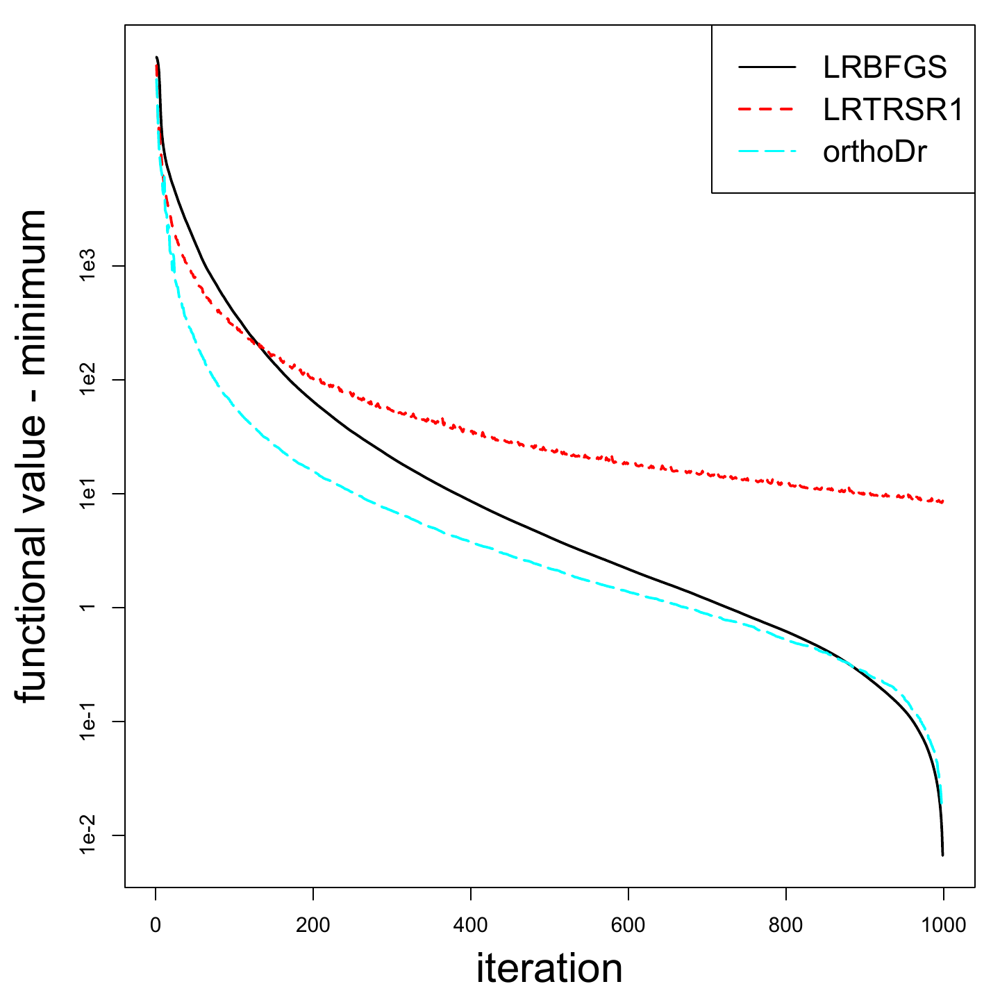

::: article
# Introduction

Dimension reduction is a long-standing problem in statistics and data
science. While the traditional principal component analysis
[@jolliffe1986principal] and related works provide a way of reducing the
dimension of the covariates, the term "sufficient dimension reduction"
is more commonly referring to a series of regression works originated
from the seminal paper on sliced inverse regression [@li1991sliced]. In
such problems, we observe an outcome $Y \in \mathbb{R}$, along with a
set of covariates
$X = (X_1, \ldots, X_p)^{ \mathrm{\scriptscriptstyle T} }\in \mathbb{R}^p$.
Dimension reduction models are interested in modeling the conditional
distribution of $Y$ given $X$, while their relationship satisfies, for
some $p \times d$ matrix
${ \mathbf{B} }= (\boldsymbol\beta_1, \ldots, \boldsymbol\beta_p)$,

$$\label{dr:model} Y = h(X, \epsilon) = h({ \mathbf{B} }^{ \mathrm{\scriptscriptstyle T} }X, \epsilon) = h(\boldsymbol\beta_1^{ \mathrm{\scriptscriptstyle T} }X, \ldots, \boldsymbol\beta_d^{ \mathrm{\scriptscriptstyle T} }X, \epsilon),   
(\#eq:drmodel)$$
where $\epsilon$ represents any error terms and $h$, with a slight abuse
of notation, represents the link function using $X$ or
${ \mathbf{B} }^{ \mathrm{\scriptscriptstyle T} }X$. One can easily
notice that when $d$, the number of columns in ${ \mathbf{B} }$, is less
than $p$, a dimension reduction is achieved, in the sense that only a
$d$ dimensional covariate information is necessary for fully describing
the relationship [@cook2009regression]. Alternatively, this relationship
can be represented as [@zeng2010integral]
$$\label{dr:perp} 
Y \perp X \mid { \mathbf{B} }^{ \mathrm{\scriptscriptstyle T} }X,    (\#eq:drperp)$$
which again describes the sufficiency of
${ \mathbf{B} }^{ \mathrm{\scriptscriptstyle T} }X$. Following the work
of [@li1991sliced], a variety of methods have been proposed. An
incomplete list of literature includes
[@cook1991discussion; @cook1999dimension; @yin2002dimension; @chiaromonte2002sufficient; @zhu2006sliced; @li2007directional; @zhu2010dimension; @zhu2010sufficient; @cook2010envelope; @lee2013general; @cook2014fused; @li2017parsimonious].
For a more comprehensive review of the literature, we refer the readers
to [@ma2013review]. One advantage of many early developments in
dimension reduction models is that only a singular value decomposition
is required to obtain the reduced space parameters ${ \mathbf{B} }$
through inverse sliced averaging. However, this comes at a price of
assuming the linearity assumption [@li1991sliced], which is almost the
same as assuming that the covariates follow an elliptical distribution
[@li2009dimension; @dong2010dimension]. Moreover, some methods require
more restrictive assumptions on the covariance structure
[@cook1991discussion]. Many methods attempt to avoid these assumptions
by resorting to nonparametric estimations. The most successful ones
include [@xia2002adaptive] and [@xia2007constructive]. However, recently
a new line of work started by
[@ma2012semiparametric; @ma2012efficiency; @ma2013efficient] shows that
by formulating the problem into semiparametric estimating equations, not
only we can avoid many distributional assumptions on the covariates, the
obtained estimator of ${ \mathbf{B} }$ also enjoys efficiency. Extending
this idea, [@sun2017counting] developed a framework for dimension
reduction in survival analysis using a counting process based estimating
equations. The method performs significantly better than existing
dimension reduction methods for censored data such as
[@li1999dimension; @xia2010dimension] and [@lu2011sufficient]. Another
recent development that also utilizes this semiparametric formulation is
[@zhao2017efficient], in which an efficient estimator is derived.

Although there are celebrated theoretical and methodological advances,
estimating ${ \mathbf{B} }$ through the semiparametric estimating
equations is still not a trivial task. Two challenges remain: first, by
a careful look at the model definition \@ref(eq:drmodel), we quickly
noticed that the parameters are not identifiable unless certain
constraints are placed. In fact, if we let $\mathbf{A}$ be any
$d \times d$ full rank matrix, then
$({ \mathbf{B} }\mathbf{A})^{ \mathrm{\scriptscriptstyle T} }X$
preserves the same column space information of
${ \mathbf{B} }^{ \mathrm{\scriptscriptstyle T} }X$, hence, we can
define
$h^\ast(({ \mathbf{B} }\mathbf{A})^{ \mathrm{\scriptscriptstyle T} }X, \epsilon)$
accordingly to retain exactly the same model as \@ref(eq:drmodel). While
traditional methods can utilize singular value decompositions (SVD) of
the estimation matrix to identify the column space of ${ \mathbf{B} }$
instead of recovering each parameter [@cook1999dimension], it appears to
be a difficult task in the semiparametric estimating equation framework.
One challenge is that if we let ${ \mathbf{B} }$ change freely, the rank
of the ${ \mathbf{B} }$ matrix cannot be guaranteed, which makes the
formulation meaningless. Hence, for both computational and theoretical
concerns, [@ma2012semiparametric] resorts to an approach that fixes the
upper $d \times d$ block of ${ \mathbf{B} }$ as an identity matrix,
i.e.,
${ \mathbf{B} }= (\mathbf{I}_{d \times d}, \,{ \mathbf{B} }^{\ast{ \mathrm{\scriptscriptstyle T} }})^{ \mathrm{\scriptscriptstyle T} }$,
where ${ \mathbf{B} }^\ast$ is a $(p-d) \times d$ matrix that sits in
the lower block of ${ \mathbf{B} }$. Hence, in this formulation, only
${ \mathbf{B} }^\ast$ needs to be solved. While the solution is
guaranteed to be rank $d$ in this formulation, as pointed out by
[@sun2017counting], this approach still requires correctly identifying
and reordering of the covariate vector $\mathbf{x}$ such that the first
$d$ entries are indeed important, which creates another daunting task.
Another challenge is that solving semiparametric estimating equations
requires the estimation of nonparametric components. These components
need to be computed through kernel estimations, usually the
Nadaraya-Watson type, which significantly increases the computational
intensity of the method considering that these components need to be
recalculated at each iteration of the optimization. Up to date, these
drawbacks remain as the strongest criticism of the semiparametric
approaches. Hence, although enjoying superior statistical asymptotic
properties, are not as attractive as a traditional sliced inverse type
of approaches such as [@li1991sliced] and [@cook1991discussion].

The goal of our [*orthoDr*](https://CRAN.R-project.org/package=orthoDr)
package is to develop a computationally efficient optimization platform
for solving the semiparametric estimating equation approaches proposed
in [@ma2013efficient], [@sun2017counting] and possibly any future work
along this line. Revisiting the rank preserving problem of
${ \mathbf{B} }$ mentioned above, we can essentially set a constraint
that
$$\label{B:constraint}
{ \mathbf{B} }^{ \mathrm{\scriptscriptstyle T} }{ \mathbf{B} }= \mathbf{I},   (\#eq:Bconstraint)$$
where $\mathbf{I}$ is a $d \times d$ identity matrix. A solution of the
estimating equations that satisfies the constraint will correctly
identify the dimensionality-reduced subspace. This is known as
optimizing on the Stiefel manifold, which is a class of well-studied
problems [@edelman1998geometry]. A recent R development
[@martin2016manifoldoptim] utilizes quasi-Newton methods such as the
well known BFGS method on the Riemannian manifold [@huang2016roptlib].
However, second order optimization methods always require forming and
storing large hessian matrices. In addition, they may not be easily
adapted to penalized optimization problems, which often appear in high
dimensional statistical problems [@zhu2006sliced; @li2008sliced]. On the
other hand, first-order optimization methods are faster in each
iteration, and may also incorporate penalization in a more convenient
way [@wen2010alternating]. By utilizing the techniques developed by
[@wen2013feasible], we can effectively search for the solution in the
Stiefel manifold, and this becomes the main machinery of our package.
Further incorporating the popular
[*Rcpp*](https://CRAN.R-project.org/package=Rcpp)
[@eddelbuettel2011Rcpp] and
[*RcppArmadillo*](https://CRAN.R-project.org/package=RcppArmadillo)
[@eddelbuettel2014RcppArmadillo] toolboxes and the OpenMP parallel
commuting, the computational time for our package is comparable to
state-of-the-art existing implementations (such as
[*ManifoldOpthm*](https://CRAN.R-project.org/package=ManifoldOpthm)),
making the semiparametric dimension reduction models more accessible in
practice.

The purpose of this article is to provide a general overview of the
*orthoDr* package (version 0.6.2) and provide some concrete examples to
demonstrate its advantages. *orthoDr* is available from the
Comprehensive R Archive Network (CRAN) at
<https://CRAN.R-project.org/package=orthoDr> and GitHub at
<https://github.com/teazrq/orthoDr>. We begin by explaining the
underlying formulation of the estimating equation problem and the
parameter updating scheme that preserves orthogonality. Next, the
software is introduced in detail using simulated data and real data as
examples. We further demonstrate an example that utilizes the package as
a general purpose solver. We also investigate the computational time of
the package compared with existing solvers. Future plans for extending
the package to other dimension reduction problems are also discussed.

# Model description

## Counting process based dimension reduction

To give a concrete example of the estimating equations, we use the
semiparametric inverse regression approach defined in [@sun2017counting]
to demonstrate the calculation. Following the common notations in the
survival analysis literature, let $X_i$ be the observed $p$ dimensional
covariate values of subject $i$, $Y_i = \min(T_i, C_i)$ is the observed
survival time, with failure time $T_i$ and censoring time $C_i$, and
$\delta_i = I(T_i \leq C_i)$ is the censoring indicator. A set of i.i.d.
observations $\{X_i, Y_i, \delta_i\}_{i=1}^n$ is observed. We are
interested in a situation that the conditional distribution of failure
time $T_i | X_i$ depends only on the reduced space
${ \mathbf{B} }^{ \mathrm{\scriptscriptstyle T} }X_i$. Hence, to
estimate ${ \mathbf{B} }$, the estimating equation is given by
$$\label{eeq:IR-Semi}
\widehat{\psi}_n \big({ \mathbf{B} }\big)\!=\!\text{vec} \Bigg[
\!\frac{1}{n}\sum_{i=1}^n \sum_{\substack{j=1 \\ \delta_j = 1}}^n \!\left\{ X_i \!-\! \widehat E \big(X \big| Y \geq Y_j, { \mathbf{B} }^{ \mathrm{\scriptscriptstyle T} }X_i\big) \right\} \widehat \varphi^{ \mathrm{\scriptscriptstyle T} }(Y_j) \left\{\delta_i I(j \!=\! i) \!-\! \widehat \lambda\big(Y_j | { \mathbf{B} }^{ \mathrm{\scriptscriptstyle T} }X_i\big) \right\} \Bigg],   (\#eq:eeqIR-Semi)$$
where the operator $\text{vec}(\cdot)$ is the vectorization of matrix.
Several components are estimated nonparasitically: the function
$\widehat\varphi(u)$ is estimated by sliced averaging,
$$\label{eq:phi}
\widehat \varphi(u)=\frac{\sum_{i=1}^n X_i I\big( u \leq Y_i < u + \triangle u, \delta_i = 1\big) }{\sum_{i=1}^n I\big( u \leq Y_i < u+\triangle u, \delta_i = 1\big)} - \frac{\sum_{i=1}^n X_i I\big(Y_i \geq u\big)}{\sum_{i=1}^n I\big(Y_i \geq u\big)},   (\#eq:phi)$$
where $\triangle u$ is chosen such that there are $hn$ number of
observations lie between $u$ and $u + \triangle u$. The conditional mean
function
$\widehat E \big(X | Y \geq u, { \mathbf{B} }^{ \mathrm{\scriptscriptstyle T} }X \! = \! z\big)\!$
is estimated through the Nadaraya-Watson kernel estimator
$$\label{eq:condX}
\widehat E \big(X | Y \geq u, { \mathbf{B} }^{ \mathrm{\scriptscriptstyle T} }X \! = \! z\big)\! = \frac{\sum_{i=1}^n X_i K_h({ \mathbf{B} }^{ \mathrm{\scriptscriptstyle T} }X_i \!-\! z)I(Y_i \geq u) }{\textstyle\sum_{i=1}^n K_h({ \mathbf{B} }^{ \mathrm{\scriptscriptstyle T} }X_i \!-\! z) I(Y_i \geq u)}.   (\#eq:condX)$$
In addition, the the conditional hazard function at any time point $u$
can be estimated by
$$\label{eq:chf}
\widehat \lambda(u | { \mathbf{B} }^{ \mathrm{\scriptscriptstyle T} }X = z) = \frac{\sum_{i=1}^n K_b(Y_i-u) \delta_i K_h\big({ \mathbf{B} }^{ \mathrm{\scriptscriptstyle T} }X_i - z\big)}{\sum_{j=1}^n I\big(Y_j \geq u\big) K_h \big({ \mathbf{B} }^{ \mathrm{\scriptscriptstyle T} }X_j - z\big)}.   (\#eq:chf)$$

However, this substantially increase the computational burden since the
double kernel estimator requires ${\cal O}(n^2)$ flops to calculate the
hazard at any given $u$ and $z$. Instead, an alternative version using
[@dabrowska1989uniform] can greatly reduce the computational cost
without compromising the performance. Hence, we estimate the conditional
hazard function by

$$ \label{eq:lambda}
\widehat \lambda(u | { \mathbf{B} }^{ \mathrm{\scriptscriptstyle T} }X = z) = \frac{\sum_{i=1}^n I\big(Y_i = u\big)I\big(\delta_i = 1\big)K_h\big({ \mathbf{B} }^{ \mathrm{\scriptscriptstyle T} }X_i - z\big)}{\sum_{i=1}^n I\big(Y_i \geq u\big) K_h\big({ \mathbf{B} }^{ \mathrm{\scriptscriptstyle T} }X_i - z\big)}, 
(\#eq:lambda)$$

which requires only ${\cal O}(n)$ flops. In the above equations
\@ref(eq:phi), \@ref(eq:condX) and \@ref(eq:lambda), $h$ is a
pre-specified kernel bandwidth and $K_h(\cdot) = K(\cdot/h)/h$, where
$K(\cdot)$ is the Gaussian kernel function. By utilizing the method of
moments estimators [@hansen1982large] and noticing our constraint for
identifying the column space of ${ \mathbf{B} }$, solving for the
solution of the estimating equations \@ref(eq:eeqIR-Semi) is equivalent
to
$$\begin{aligned}
\label{eq:GMM}
\text{minimize} \quad & f({ \mathbf{B} }) = \widehat{\psi}_n({ \mathbf{B} })^{ \mathrm{\scriptscriptstyle T} }\widehat{\psi}_n({ \mathbf{B} })\\
\text{subject to} & \quad { \mathbf{B} }^{ \mathrm{\scriptscriptstyle T} }{ \mathbf{B} }= \mathbf{I}.
\end{aligned}   (\#eq:GMM)$$
Essentially all other semiparametric dimension reduction models
described in [@ma2013efficient], and more recently [@ma2015validated]
[@xu2016estimating], [@sun2017counting], [@huang2017effective] and many
others can be estimated in the samimilar fashion as the above
optimization problem. However, due to the difficult in the constrains
and the purpose of identifiability, all of these methods resort to
either fixing the upper block of the ${ \mathbf{B} }$ matrix as an
identity matrix or adding a penalty of
$\lVert { \mathbf{B} }^{ \mathrm{\scriptscriptstyle T} }{ \mathbf{B} }- \mathbf{I} \rVert_F$
to preserve the orthogonality constraint. There appears to be no
existing method that solves \@ref(eq:GMM) directly. Here, we utilize
[@wen2013feasible]'s approach which can effectively tackle this problem.

## Orthogonality preserving updating scheme

The algorithm works in the same fashion as a regular gradient decent,
except that we need to preserve the orthogonality at each iteration of
the update. As described in [@wen2013feasible], given any feasible point
${ \mathbf{B} }_0$, i.e.,
${{ \mathbf{B} }_0}^{ \mathrm{\scriptscriptstyle T} }{ \mathbf{B} }_0 = \mathbf{I}$,
which can always be generated randomly, we update ${ \mathbf{B} }_0$ as
follows. Let the $p \times d$ gradient matrix be
$$\begin{aligned}
\label{eq:gradient}
\mathbf{G} = \left( \frac{\partial f({ \mathbf{B} }_0)}{\partial { \mathbf{B} }_0(i,j) } \right)_{\{i,j\}}.
\end{aligned}   (\#eq:gradient)$$
Then, utilizing the Cayley transformation, we have
$$\begin{aligned}
\label{eq:update}
{ \mathbf{B} }_{\text{new}} &= \Big(\mathbf{I} + \frac{\tau}{2} \mathbf{A} \Big)^{-1} \Big(\mathbf{I} - \frac{\tau}{2} \mathbf{A} \Big) { \mathbf{B} }_0,
\end{aligned}   (\#eq:update)$$
with the orthogonality preserving property
${ \mathbf{B} }_{\text{new}}^{ \mathrm{\scriptscriptstyle T} }{ \mathbf{B} }_{\text{new}} = \mathbf{I}$.
Here,
$\mathbf{A} = \mathbf{G} {{ \mathbf{B} }_0}^{ \mathrm{\scriptscriptstyle T} }- { \mathbf{B} }_0 \mathbf{G}^{ \mathrm{\scriptscriptstyle T} }$
is a skew-symmetric matrix. It can be shown that
$\{{ \mathbf{B} }_{\text{new}}(\tau)\}_{\tau \geq 0}$ is a descent path.
Similar to line search algorithms, we can then find a proper step size
$\tau$ through a curvilinear search. Recursively updating the current
value of ${ \mathbf{B} }$, the algorithm stops when the tolerance level
is reached. An initial value is also important for the performance of
nonconvex optimization problems. A convenient initial value for our
framework is the computational efficient approach developed in
[@sun2017counting], which only requires a SVD of the estimation matrix.

# The R package orthoDr

There are several main functions in the *orthoDr* package:
`orthoDr_surv`, `ortho_reg` and `ortho_optim`. They are corresponding to
the survival model described perviously [@sun2017counting], the
regression model in [@ma2012semiparametric], and a general constrained
optimization function, respectively. In this section, we demonstrate the
details of using these main functions, illustrate them with examples.

## Semiparametric dimension reduction models for survival data {#sec:surv}

The `orthoDr_surv` function implements the optimization problem defined
in Equation \@ref(eq:GMM), where the kernel estimations and various
quantities are implemented and calculated within C++. Note that in
addition, the method defined previously, some simplified versions are
also implemented such as the counting process inverse regression models
and the forward regression models, which are all described in
[@sun2017counting]. These specifications can be made using the `method`
parameter. A routine call of the function `orthoDr_surv` proceed as

``` r
    orthoDr_surv(x, y, censor, method, ndr, B.initial, bw, keep.data,
                 control, maxitr, verbose, ncore)
```

-   `x`: A matrix or data.frame for features (numerical only).
-   `y`: A vector of observed survival times.
-   `censor`: A vector of censoring indicators.
-   `method`: The estimating equation method used.
    -   `"dm"` (default): semiparametric inverse regression given in
        \@ref(eq:eeqIR-Semi).
    -   `"dn"`: counting process inverse regression.
    -   `"forward"`: forward regression model with one structural
        dimensional.
-   `ndr`: The number of structural dimensional. For `method` = `"dn"`
    or `"dm"`, the default is 2. For `method` = `"forward"` only one
    structural dimension is allowed, hence the parameter is suppressed.
-   `B.initial`: Initial `B` values. Unless specifically interested,
    this should be left as default, which uses the computational
    efficient approach (with the `CPSIR()` function) in
    [@sun2017counting] as the initial. If specified, must be a matrix
    with `ncol(x)` rows and `ndr` columns. The matrix will be processed
    by Gram-Schmidt if it does not satisfy the orthogonality constrain.
-   `bw`: A kernel bandwidth, assuming each variables have unit
    variance. By default we use the Silverman rule-of-thumb formula
    [@silverman2018density] to determine the bandwidth
    $$\text{\texttt{bw}} = 1.06\times\left(\frac4{d+2}\right)^\frac1{d+4}n^{-\frac1{d+4}}.$$
    This bandwidth can be computed using the `silverman(n, d)` function
    in our package.
-   `keep.data`: Should the original data be kept for prediction?
    Default is `FALSE`.
-   `control`: A list of tuning variables for optimization, including
    the convergence criteria. In particular, `epsilon` is the size for
    numerically approximating the gradient, `ftol`, `gtol`, and `btol`
    are tolerance levels for the objective function, gradients, and the
    parameter estimations, respectively, for judging the convergence.
    The default values are selected based on [@wen2013feasible] .
-   `maxitr`: Maximum number of iterations. Default is 500.
-   `verbose`: Should information be displayed? Default is `FALSE`.
-   `ncore`: Number of cores for parallel computing when approximating
    the gradients numerically. The default is the maximum number of
    threads.

We demonstrate the usage of `orthoDr_surv` function by solving a problem
with generated survival data.

``` r
    # generate some survival data with two structural dimensions
    R> set.seed(1)
    R> N = 350; P = 6; dataX = matrix(rnorm(N*P), N, P)
    R> failEDR = as.matrix(cbind(c(1, 1, 0, 0, 0, 0, rep(0, P-6)),
     +  c(0, 0, 1, -1, 0, 0, rep(0, P-6))))
    R> censorEDR = as.matrix(c(0, 1, 0, 1, 1, 1, rep(0, P-6)))
    R> T = exp(-2.5 + dataX %*% failEDR[,1] + 0.5*(dataX %*%
     +  failEDR[,1])*(dataX %*% failEDR[,2]) + 0.25*log(-log(1-runif(N))))
    R> C = exp( -0.5 + dataX %*% censorEDR  + log(-log(1-runif(N))))
    R> Y = pmin(T, C)
    R> Censor = (T < C)

    # fit the model
    R> orthoDr.fit = orthoDr_surv(dataX, Y, Censor, ndr = 2)
    R> orthoDr.fit

                 [,1]        [,2]
    [1,] -0.689222616  0.20206497
    [2,] -0.670750726  0.19909057
    [3,] -0.191817963 -0.66623300
    [4,]  0.192766630  0.68605407
    [5,]  0.005897188  0.02021414
    [6,]  0.032829356  0.06773089
```

To evaluate the accuracy of this estimation, a distance function
`distance()` can be used. This function calculates the distance between
the column spaces generated by the true ${ \mathbf{B} }$ and the
estimated version $\widehat{{ \mathbf{B} }}$. Note that the sine angle
distance between the two column spaces is closely related to the
canonical correlation between the two matrices ${ \mathbf{B} }$ and
$\widehat{{ \mathbf{B} }}$.

``` r
    distance(s1, s2, method, x)
```

-   `s1`: A matrix for the first column space (e.g., ${ \mathbf{B} }$).
-   `s2`: A matrix for the second column space (e.g.,
    $\widehat{{ \mathbf{B} }}$).
-   `method`:
    -   `"dist"`: the Frobenius norm distance between the projection
        matrices of the two given matrices, where for any given matrix
        ${ \mathbf{B} }$, the projection matrix
        $\mathbf{P} = { \mathbf{B} }({ \mathbf{B} }^{ \mathrm{\scriptscriptstyle T} }{ \mathbf{B} })^{-1} { \mathbf{B} }^{ \mathrm{\scriptscriptstyle T} }$.
    -   `"trace"`: the trace correlation between two projection matrices
        $\textnormal{tr}(\mathbf{P} \widehat{\mathbf{P}})/d$, where $d$
        is the number of columns of the given matrix.
    -   `"canonical"`: the canonical correlation between
        ${ \mathbf{B} }^{ \mathrm{\scriptscriptstyle T} }X$ and
        $\widehat{{ \mathbf{B} }}^{ \mathrm{\scriptscriptstyle T} }X$.
    -   `"sine"`: the sine angle distance $\|\sin{\Theta} \|_F$ obtained
        from
        $\mathbf{P}_1(\mathbf{I} - \mathbf{P}_2) = \mathbf{U} \sin{\Theta} \mathbf{V}^{ \mathrm{\scriptscriptstyle T} }$.
-   `x`: The design matrix $X$ (default = `NULL`), required only if
    `method` $=$ `"canonical"` is used.

We compare the accuracy of the estimations obtained by the
`method =``"dm"` and `"dn"`. Note that the `"dm"` method enjoys double
robustness property of the estimating equations, hence the result is
usually better.

``` r
    # Calculate the distance to the true parameters
    R> distance(failEDR, orthoDr.fit$B, "dist")

    [1] 0.1142773
```

``` r
    # Compare with the counting process inverse regression model
    R> orthoDr.fit1 = orthoDr_surv(dataX, Y, Censor, method = "dn", ndr = 2)
    R> distance(failEDR, orthoDr.fit1$B, "dist")

    [1] 0.1631814
```

## Semiparametric dimension reduction models for regression

The `orthoDr_reg ` function implements the semiparametric dimension
reduction methods proposed in [@ma2012semiparametric]. A routine call of
the function `orthoDr_reg` proceed as

``` r
    orthoDr_reg(x, y, method, ndr, B.initial, bw, keep.data, control,
                maxitr, verbose, ncore)
```

-   `x`: A matrix or data.frame for features (numerical only).
-   `y`: A vector of observed continuous outcome.
-   `method`: We currently implemented two methods: the semiparametric
    sliced inverse regression method (`"sir"`), and the semiparametric
    principal Hessian directions method (`"phd"`).
    -   `"sir"`: semiparametric sliced inverse regression method solves
        the sample version of the estimating equation
        $$E\Big(\big[E(X|Y)-E\{E(X|Y)|{ \mathbf{B} }^{ \mathrm{\scriptscriptstyle T} }X\}\big]\big[X-E(X|{ \mathbf{B} }^{ \mathrm{\scriptscriptstyle T} }X)\big]^{ \mathrm{\scriptscriptstyle T} }\Big) = 0$$
    -   `"phd"`: semiparametric principal Hessian directions method that
        estimates ${ \mathbf{B} }$ by solving the sample version of
        $$E\big[\{Y-E(Y|{ \mathbf{B} }^{ \mathrm{\scriptscriptstyle T} }X)\}\{XX^{ \mathrm{\scriptscriptstyle T} }- E(XX^{ \mathrm{\scriptscriptstyle T} }| { \mathbf{B} }^{ \mathrm{\scriptscriptstyle T} }X)\}\big] = 0$$
-   `ndr`: The number of structural dimensional (default is 2).
-   `B.initial`: Initial `B` values. For each method, the initial values
    are taken from the corresponding traditional inverse regression
    approach using the *dr* package. The obtained matrix will be
    processed by Gram-Schmidt for orthogonality.
-   `bw`, `keep.data`, `control`, `maxitr`, `verbose` and `ncore` are
    exactly the same as those in the `orthoDr_surv` function.

To demonstrate the usage of `orthoDr_reg`, we consider the problem of
dimension reduction by fitting a semi-PHD model proposed by
[@ma2012semiparametric].

``` r
    R> set.seed(1)
    R> N = 100; P = 4; dataX = matrix(rnorm(N*P), N, P)
    R> Y = -1 + dataX[,1] + rnorm(N)
    R> orthoDr_reg(dataX, Y, ndr = 1, method = "phd")

    Subspace for regression model using phd approach:
                [,1]
    [1,]  0.99612339
    [2,]  0.06234337
    [3,] -0.04257601
    [4,] -0.04515279
```

## Parallelled gradient approximation through OpenMP

The estimation equations of the dimension reduction problem in the
survival and regression settings usually have a complicated form.
Especially, multiple kernel estimations are involved, which results in
difficulties in taking derivatives analytically. As an alternative,
numerically approximated gradients are implemented using OpenMP. A
comparison between a single core and multiple cores (4 cores) is given
in the following example. Results from 20 independent simulation runes
are summarized in Table [1](#tab:openmp). The data generating procedure
used in this example is the same as the survival data used in Section
[3.1](#sec:surv). All simulations are performed on an i7-4770K CPU.

``` r
    R> t0 = Sys.time()
    R> dn.fit = orthoDr_surv(dataX, Y, Censor, method = "dn", ndr = ndr,
     + ncore = 4, control = list(ftol = 1e-6))
    R> Sys.time() - t0
```

::: {#tab:openmp}
  ------------------------------------------------
                              \# of cores 
  ------------------------- ------------- --------
  2-3                                   1        4

  $n\!=\!350$, $p\!=\!6$           3.9831   1.2741

  $n\!=\!350$, $p\!=\!12$         12.7780   3.4850
  ------------------------------------------------

  : Table 1: Computational cost of different numbers of cores
:::

## General solver for orthogonality constrained optimization

`ortho_optim` is a general purpose optimization function that can
incorporate any user defined objective function $f$ (and gradient
function if supplied). The usage of `ortho_optim` is similar to the
widely used `optim()` function. A routine call of the function proceed
as

``` r
  ortho_optim(B, fn, grad, ..., maximize, control, maxitr, verbose)
```

-   `B`: Initial `B` values. Must be a matrix, and the columns are
    subject to the orthogonality constrains. It will be processed by
    Gram-Schmidt if not orthogonal.
-   `fn`: A function that calculates the objective function value. The
    first argument should be `B`. Returns a single value.
-   `grad`: A function that calculate the gradient. The first argument
    should be `B`. Returns a matrix with the same dimension as `B`. If
    not specified, a numerical approximation is used.
-   `...`: Arguments passed to `fn` and `grad` besides `B`.
-   `maximize`: By default, the solver will try to minimize the
    objective function unless `maximize = TRUE`.
-   The parameters `maxitr`, `verbose` and `ncore` works in the same way
    as introduced in the previous sections.

To demonstrate the simple usage of `ortho_optim` as a drop-in function
of `optim()`, we consider the problem of searching for the first
principle component for a data matrix.

``` r
    # an example of searching for the first principal component
    R> set.seed(1)
    R> N = 400; P = 100; X = scale(matrix(rnorm(N*P), N, P), scale = FALSE)
    R> w = gramSchmidt(matrix(rnorm(P), P, 1))$Q
    R> fx <- function(w, X) t(w) %*% t(X) %*% X %*% w
    R> gx <- function(w, X) 2*t(X) %*% X %*% w

    # fit the model
    R> fit = ortho_optim(w, fx, gx, X = X, maximize = TRUE, verbose = 0)
    R> head(fit$B)

                [,1]
    [1,]  0.01268226
    [2,] -0.09065592
    [3,] -0.01471700
    [4,]  0.10583958
    [5,] -0.02656409
    [6,] -0.04186199

    # compare results with the prcomp() function
    R> library(pracma)
    R> distance(fit$B, as.matrix(prcomp(X)$rotation[, 1]), type = "dist")

    [1] 1.417268e-05
```

The *ManifoldOptim* [@martin2016manifoldoptim] package is known for
solving optimization problems on manifolds. We consider the problem of
optimizing Brockett cost function [@huang2016roptlib] on the Stiefel
manifold with objective and gradient functions written in R. The problem
can be stated as

$$\min_{{ \mathbf{B} }^{ \mathrm{\scriptscriptstyle T} }{ \mathbf{B} }= \mathbf{I}_{p}, \, \, { \mathbf{B} }\in \mathbb{R}^{n\times p}} \text{trace}({ \mathbf{B} }^{ \mathrm{\scriptscriptstyle T} }X { \mathbf{B} }D),$$

where $X \in \mathbb{R}^{n\times n}$,
$X = X^{ \mathrm{\scriptscriptstyle T} }$,
$D = \text{diag}(\mu_1,\mu_2,...,\mu_p)$ with
$\mu_1\geq\mu_2\geq...\geq\mu_p$. We generate the data with exactly the
same procedure as the documentation file provided in the *ManifoldOptim*
package, with only a change of notation. For our *orthoDr* package, the
following code is used to specify the objective and gradient functions
and solve for the optimal ${ \mathbf{B} }$.

``` r
    R> n = 150; p = 5; set.seed(1)

    R> X <- matrix(rnorm(n*n), nrow=n)
    R> X <- X + t(X)
    R> D <- diag(p:1, p)

    R> f1 <- function(B, X, D) { Trace( t(B) %*% X %*% B %*% D ) }
    R> g1 <- function(B, X, D) { 2 * X %*% B %*% D }

    R> b1 = gramSchmidt(matrix(rnorm(n*p), nrow=n, ncol=p))$Q
    R> res2 = ortho_optim(b1, fn = f1, grad = g1, X, D)
    R> head(res2$B)

                 [,1]         [,2]         [,3]        [,4]         [,5]
    [1,] -0.110048632 -0.060656649 -0.001113691 -0.03451514 -0.063626067
    [2,] -0.035495670 -0.142148873 -0.011204859  0.01784039  0.129255824
    [3,]  0.052141162  0.015140614 -0.034893426  0.02600569  0.006868275
    [4,]  0.151239722 -0.008553174 -0.096884087  0.01398827  0.132756189
    [5,] -0.001144864 -0.056849007  0.080050182  0.23351751 -0.007219738
    [6,] -0.140444290 -0.112932425  0.082197835  0.18644089 -0.057003273
```

Furthermore, we compare the performence with the *ManifoldOptim*
package, using four optimization methods: `"LRBFGS"`, `"LRTRSR1"`,
`"RBFGS"` and `"RTRSR1"` [@huang2016roptlib]. We wrote the same required
functions for the Brockett problem in R. Further more, note that
different algorithms implements slightly different stoping criterion, we
run each algorithm a fixed number of iterations with a single core. We
consider three smaller settings with $n = 150$, and $p = 5, 10$ and 15,
and a larger setting with $n = 500$ and $p = 50$. Each simulation is
repeated 100 times. The functional value progression (Figures
[1](#fig:iter) and [2](#fig:iter2)) and the total time cost up to a
certain number of iterations (Table [2](#tab:compare_time)) are
presented.

We found that `"LRBFGS"` and our *orthoDr* package usually achieve the
best performance, with functional value decreases the steepest in the
log scale. In terms of computing time, `"LRBFGS"` and *orthoDr*
performers similarly. Although `"LRTRSR1"` has similar computational
time, its functional value falls behind. This is mainly because the
theoretical complexity of second-order algorithms is similar to first
order algorithms, both are of order ${\cal O}(p^3)$. However, it should
be noted that for a semiparametric dimension reduction method, the major
computational cost is not due to the parameter updates, rather, it is
calculating the gradient since complicated kernel estimations are
involved. Hence, we believe there is no significant advantage using
either `"LRBFGS"` or our *orthoDr* package regarding the efficiency of
the algorithm. However, first order algorithms may have an advantage
when developing methods for penalized high-dimensional models.

<figure id="fig:iter">
<p></p>
<p> From left to
right, top to bottom: <span
class="math inline"><em>p</em> = 5, 10, 20</span> and 50
respectively.</p>
<figcaption>Figure 1: Log of function value vs. iteration (<span
class="math inline"><em>n</em> = 150</span>)</figcaption>
</figure>

<figure id="fig:iter2">
<p></p>
<p></p>
<p>From left to right, top to bottom: <span
class="math inline"><em>p</em> = 5, 10, 20</span> and 50
respectively.</p>
<figcaption>Figure 2: Log of function value vs. iteration (<span
class="math inline"><em>n</em> = 500</span>)</figcaption>
</figure>

[]{#tab:compare_time label="tab:compare_time"}

::: {#tab:compare_time}
  -----------------------------------------------------------------------------------
  $n$     $p$   iteration     *ManifoldOpthm*                               *orthoDr*
  ------- ----- ----------- ----------------- --------- -------- -------- -----------
                                       LRBFGS   LRTRSR1    RBFGS   RTRSR1 

  $150$   5     250                     0.053     0.062    0.451    0.452       0.065

  $150$   10    500                     0.176     0.201    4.985    5.638       0.221

  $150$   20    750                     0.526     0.589   28.084   36.142       0.819

  $150$   50    1000                    2.469     2.662       --       --       6.929

  $500$   5     250                     0.403     0.414    7.382    7.426       0.423

  $500$   10    500                     1.234     1.305   57.047   67.738       1.332

  $500$   20    750                     3.411       3.6       --       --       3.974

  $500$   50    1000                   13.775     14.43       --       --      19.862

                                                                          
  -----------------------------------------------------------------------------------

  : Table 2: Running times with a fixed number of iterations (in
  seconds)
:::

# Examples

We use the *Concrete Compressive Strength* [@yeh1998modeling] dataset as
an example to further demonstrate the `orthoDr_reg` function and to
visualize the results. The dataset is obtained from the UCI Machine
Learning Repository.

Concrete is the most important material in civil engineering. The
concrete compressive strength is a highly nonlinear function of age and
ingredients. These ingredients include cement, blast furnace slag, fly
ash, water, superplasticizer, coarse aggregate, and fine aggregate. In
this dataset, we have $n=1030$ observation, 8 quantitative input
variables, and 1 quantitative output variable. We present the estimated
two directions for structural dimension and further plot the observed
data in these two directions. A non-parametric kernel estimation surface
is further included to approximate the mean concrete strength.

``` r
    R> concrete_data = read.csv(choose.files())
    R> X = as.matrix(concrete_data[,1:8])
    R> colnames(X) = c("Cement", "Blast Furnace Slag", "Fly Ash", "Water",
                "Superplasticizer", "Coarse Aggregate", "Fine Aggregate", "Age")
    R> Y = as.matrix(concrete_data[,9])

    R> result = orthoDr_reg(X, Y, ndr = 2, method = "sir", maxitr = 1000,
     + keep.data = TRUE)
    R> rownames(result$B) = colnames(X)
    R> result$B

                             [,1]         [,2]
    Cement             0.08354280 -0.297899899
    Blast Furnace Slag 0.27563507  0.320304097
    Fly Ash            0.82665328 -0.468889856
    Water              0.20738201  0.460314093
    Superplasticizer   0.43496780  0.540733516
    Coarse Aggregate   0.01141892  0.011870495
    Fine Aggregate     0.02936740 -0.004718979
    Age                0.02220664 -0.290444936
```

{#fig:concrete width="100%"
alt="graphic without alt text"}

# Discussion

Using the algorithm proposed by [@wen2013feasible] for optimization on
the Stiefel manifold, we developed the *orthoDr* package that serves
specifically for semi-parametric dimension reductions problems. A
variety of dimension reduction models are implemented for censored
survival outcome and regression problems. In addition, we implemented
parallel computing for numerically appropriate the gradient function.
This is particularly useful for semi-parametric estimating equation
methods because the objective function usually involves kernel
estimations and the gradients are difficult to calculate. Our package
can also be used as a general purpose solver and is comparable with
existing manifold optimization approaches. However, since the
performances of different optimization approaches could be problem
dependent, hence, it could be interesting to investigate other choices
such as the "LRBFGS" approach in the *ManifoldOptim* package.

Our package also serves as a platform for future methodology
developments along this line of work. For example, we are currently
developing a personalized dose-finding model with dimension reduction
structure [@zhou2018dimension]. Also, when the number of covariates $p$
is large, the model can be over-parameterized. Hence, applying a $L_1$
penalty can force sparsity and allow the model to handle
high-dimensional data. To this end, first-order optimization approaches
can have advantages over second-order approaches. However, persevering
the orthogonality during the Cayley transformation while also preserve
the sparsity can be a challenging task and requires new methodologies.
Furthermore, tuning parameters can be selected through a
cross-validation approach, which can be implemented in the future.

# Acknowledgement

Xin Zhang's research was supported in part by grants DMS-1613154 and
CCF-1617691 from U.S. National Science Foundation. Ruoqing Zhu's
research was supported in part by grant RB19046 from UIUC.
:::
