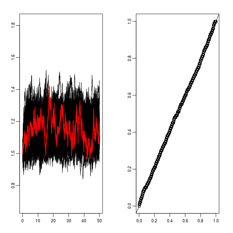
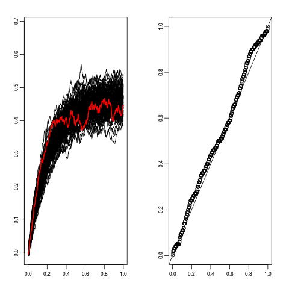
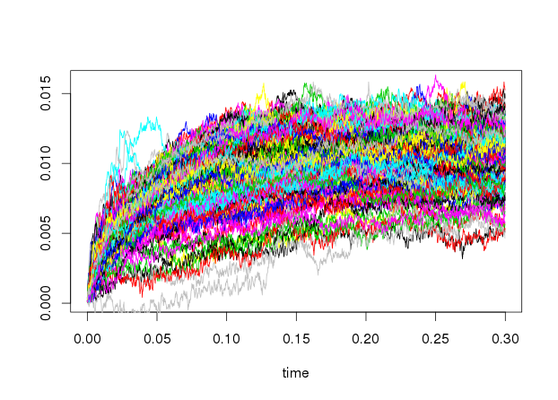

::: article
# Introduction

Continuous stochastic processes are usually observed discretely in time
(with equidistant time points or not) leading to times series, although
their intrinsic nature is of continuous time. While discrete time
stochastic models such as auto-regressive models (ARMA, GARCH, \...)
have been widely developed for time series with equidistant times, more
and more attention have been focused on Stochastic Differential
Equations (SDEs). Examples of applications where SDEs have been used
include dynamics of thermal systems [@Bacher2011], solar and wind power
forecasting [@Iversen2014], neuronal dynamics [@DS2014],
pharmacokinetic/pharmacodynamic (PK/PD) [@Hansen2014], crack growth
[@HERMANN]. Estimation for SDE is available in different softwares. We
can cite among others the computer software CTSM with a (extended)
Kalman filter approach [@Kristensen2003], the *sde* package which
proposes several tools for the simulation and the estimation of a
variety of SDEs, and more recently the R-packages *Sim.DiffProc*
[@SimDiffProc] and *yuima* [@yuima] (the last one proposes also some
tools for quantitative finance).

Depending on the applications, independent repeated temporal measures
might be available. For examples, drug concentration of several subjects
is usually observed in PK; dynamics of several neurons is measured along
time; time to crack lengths can be measured repeatedly in crack growth
study. Each trajectory represents the behavior of a unit/subject. The
functional form is similar for all the trajectories. Fitting the overall
data simultaneously obviously improves the quality of estimation, but
one has to take into account these variabilities between experiments.
This is the typical framework of mixed-effects models where some
parameters are considered as random variables (random effects) and
proper to each trajectory. Hence the random effects represent the
particularity of each subject. Some parameters can also be considered as
common to all the trajectories (fixed effects).

In this work the model of interest is thus a mixed-effects stochastic
differential equation (MSDE), mixed-effects for both fixed and random
effects. The *mixedsde* package has been developed to estimate the
density of the random effects from the discrete observations of $M$
independent trajectories of a MSDE. It is available from the
Comprehensive R Archive Network [CRAN @mixedsdecran]. The package's
development is actively continued with the latest source code available
from a GitHub repository <https://github.com/charlottedion/mixedsde>.

More precisely, we focus on MSDE with linear drift. We consider $M$
diffusion processes $(X_j(t), t\geq 0)$, $j=1, \ldots, M$ with dynamics
ruled by SDE, for $t \in [0,T]$
$$\label{MSDE} 
\begin{cases}
dX_j(t) &= ( \alpha_j - \beta_j X_j(t)) dt+ \sigma a(X_j(t))dW_j(t)\\
X_j(0) &= x_j
\end{cases}   (\#eq:MSDE)$$
where $(W_j)_{1\ldots j \ldots M}$ are $M$ independent Wiener processes,
$(\alpha_j, \beta_j)$ are two (random) parameters,
$\sigma a(X_j(\cdot))$ is the diffusion coefficient with $a$ a known
function and $\sigma$ an unknown constant. The initial condition $x_j$
is assumed fixed (and known) in the paper with possibly different values
for each trajectory.

In the package, we restrict the models to the two famous SDEs with
linear drift, namely the Ornstein-Uhlenbeck model (OU) with $a(x)=1$ and
the Cox-Ingersoll-Ross model (CIR) with $a(x)=\sqrt{x}$. For the CIR
model, we assume that $x_j>0$, $\sigma >0$, $\alpha_j >\sigma^2/2$ and
$\beta_j >0$ to ensure that the process never crosses zero.

The random parameters are denoted $\phi_j$ and belong to $\mathbb{R}^d$
with either $d=1$ or $d=2$:

-   ($d=1$) $\phi_j=\alpha_j$ random and for all $j=1, \ldots, M$,
    $\beta_j=\beta$ fixed,
-   ($d=1$) $\phi_j=\beta_j$ random and for all $j=1, \ldots, M$,
    $\alpha_j=\alpha$ fixed,
-   ($d=2$) $\phi_j=(\alpha_j, \beta_j)$ random.

The $\phi_j$'s are assumed independent and identically distributed
(*i.i.d.*) and independent of the $W_j$'s. The *mixedsde* package aims
at estimating the random effects $\phi_j$ and their distribution whose
density is denoted $f$, from $N$ discrete observations of the $M$
trajectories $(X_j(t))_j$ from Equation \@ref(eq:MSDE) at discrete times
$t_0=0 <t_1<\ldots< t_N=T$ (not necessarily equidistant).\
*Context*: To the best of our knowledge, this is the first package in
`R` language dedicated to the estimation of MSDE. The main software
considering mixed models is [@MONOLIX] but methods for mixed stochastic
differential equations are not implemented for `R`. One package named
*PSM* [@PSM] provides functions for estimation of linear and non-linear
mixed-effects models using stochastic differential equations. But the
model includes measurement noise and proposes only parameter estimation.
Moreover, there is no mathematical property about the used estimators.
In this context, the package presented is this paper is pioneer.\
Estimation procedures for MSDE have been proposed in the non-parametric
and the parametric frameworks, with a frequentist and a Bayesian point
of view. The parametric approaches assume Gaussian random effects
$\phi_j$. Among other references, for parametric maximum likelihood
estimation, we can cite [@DDG2005; @PGD2010] (Hermite expansion of the
likelihood); [@DGCS] (explicit integration of the Girsanov likelihood)
or [@DGCS2015] (mixture of Gaussian distributions for the random
effects); for parametric Bayesian estimation, we can cite [@Oravecz2009]
(restricted to Ornstein-Uhlenbeck) and [@HERMANN] (general methodology);
for non-parametric estimation, we can cite [@CGCS; @DION2014; @DGC]
(kernel estimator and deconvolution estimators).\
Three estimation procedures are implemented in the *mixedsde* package: a
kernel nonparametric estimator [@DGC], a parametric maximum likelihood
estimator [@DGCS] and a parametric Bayesian estimator [@HERMANN]. The
parametric frequentist and Bayesian approaches assume the random effects
Gaussian. The Bayesian approach seems the most appropriate method for a
small time of observation $T$ and a small number of trajectories $M$.
The nonparametric approach can be used when no prior idea on the density
is available and when $T$ and $M$ are both large enough. Finally, the
parametric frequentist estimation can be used with a large number of
discrete observations.\
This paper reviews in Section [2](#sec:theory) the three estimation
methods. An overview of the *mixedsde* package is given in Section
[3](#package) through a description of the main functions and of other
related companion functions. The practical use of this package is
illustrated in Section [4](#sec:simulation) on simulated data and in
Section [5](#sec:real) on one real dataset in neuronal modeling.

# Density estimation in mixed stochastic differential models {#sec:theory}

We briefly recall the methodology of the three estimators implemented in
the *mixedsde* package. We start with the nonparametric approach, then
the frequentist parametric Gaussian method and finally the Bayesian
parametric Gaussian method.

## Nonparametric estimation of the random effects density {#nonparam}

The first step of the nonparametric approach is to estimate the random
effects. The idea is to maximize the likelihood of the process
$X_j^{\varphi}$ solution of the stochastic differential equation with
fixed $\varphi$. Assuming continuous observations of
$(X_j(t), 0 \leq t \leq T)$, the likelihood function is obtained with
the Girsanov formula:
$$\ell_T(\varphi)=\exp \left(  \int_0^T \frac{\alpha-\beta X_j^\varphi (s)}{\sigma^2a^2(X_j^\varphi(s))}dX_j(s) 
-\frac{1}{2} \int_0^T \frac{(\alpha-\beta X_j^\varphi (s))^2}{\sigma^2a^2(X_j^\varphi(s))}ds   \right).$$
Maximizing the likelihood yields to the following estimator of $\phi_j$
$$\label{Aj}
A_{j}: = V_j^{-1} U_j   (\#eq:Aj)$$
where $U_j$ and $V_j$ are the two sufficient statistics of the model.
They are explicit depending on the form of the random effects:

-   $\alpha_j$ random and $\beta$ known
    $$U_j:= \int_0^T \frac{1}{\sigma^2 a^2(X_j (s))}dX_j(s) + \beta \int_0^T \frac{X_j(s)}{\sigma^2 a^2(X_j (s))} ds, ~V_j := \int_0^T \frac{1}{\sigma^2 a^2(X_j (s))} ds,$$
-   $\beta_j$ random and $\alpha$ known
    $$U_j := - \int_0^T \frac{X_j (s)}{\sigma^2 a^2(X_j (s))}dX_j(s)  + \alpha \int_0^T \frac{X_j (s)}{\sigma^2 a^2(X_j(s))} ds, \quad V_j :=\int_0^T \frac{X_j (s) ^2}{\sigma^2 a^2(X_j(s))} ds,$$
-   $(\alpha_j, \beta_j)$ random, denote $b(x)= (1,-x)^t$ with $u^t$ the
    transposition of vector $u$. Here $U_j$ is a column vector with size
    $2\times 1$ and $V_j= (V_{j,k,\ell})_{k,\ell \in \{1,2\}}$ a
    $2\times 2$ symmetric matrix:

$$\label{UVrandom12}
U_j:=\int_0^T \frac{b}{\sigma^2a^2}(X_j(s))dX_j(s), ~
V_j:= \int_0^T \frac{b\, b^t}{\sigma^2a^2}(X_j(s))ds.   (\#eq:UVrandom12)$$
Truncated versions of this estimator have been introduced for
theoretical reasons. In the bidimensional case
$\phi_j=(\alpha_j, \beta_j)$, [@DGC] propose the following estimator
$$\label{estimateurtronque1}
\widehat{A_j}:=A_j \mathbf{1}_{B_j},~~ B_j:=\{V_j \geq \kappa \sqrt{T} I_2 \}=\{\min(\lambda_{1,j},\lambda_{2,j}) \geq \kappa \sqrt{T}  \}   (\#eq:estimateurtronque1)$$
with $I_2$ the $2\times 2$ identity matrix and $\lambda_{i,j}, i=1,2$
the two eigenvalues of the symmetric non negative matrix $V_j$, and
$\kappa$ a numerical constant that has been calibrated [@DGC]. In the
one-dimensional case $\phi_j=\beta_j$ with $\alpha=0$, [@GCL] propose
$$\label{estimateurtronque2}
\widehat{A_j}:=A_j \mathbf{1}_{{V_j} \geq {\kappa}{\sqrt{T}} }   (\#eq:estimateurtronque2)$$
with $\kappa$ a numerical constant calibrated in practice. Based on
these estimators of the $\phi_j$'s, we can proceed to the second step,
the estimation of their density $f$. Several nonparametric estimators of
$f$ have been proposed [see @CGCS for example]. In the package
*mixedsde*, we focus on the kernel estimator of $f$. Let us introduce
the kernel function $K: \mathbb{R}^d \rightarrow \mathbb{R}$, with
$d=1,2$ depending on the dimension of $\phi_j$. We assume $K$ to be a
$\mathcal{C}^2$ function satisfying
$$\int K(u)du=1, ~~\|K\|^2=\int K^2(u)du < +\infty,~~  \int (\nabla K(u))^2du < +\infty$$
(with $\nabla K$ the gradient of $K$). A bandwidth
$h\in (\mathbb{R}^+)^d$, for $d=1,2$, is used to define the function
$$K_h(x)=\frac{1}{h}K\left(\frac{x}{h}\right), x\in \mathbb{R}^d.$$
Note that in the bidimensional case, $h=(h_1, h_2)$ and the two marginal
bandwidths are different. The nonparametric estimator of the density $f$
of $\phi_j$ is
$$\label{kernel}
{\widehat{f_h}}(x)=\frac{1}{M} \sum_{j=1}^{M} K_h(x-{A}_j).   (\#eq:kernel)$$
and the estimator
$\displaystyle \widehat{\widehat{f_h}}(x)=\frac{1}{M} \sum_{j=1}^{M} K_h(x-\widehat{A}_j)$
is computed when the truncated estimator $\hat A_j$ is different than
$A_j$.

In the *mixedsde* package, Gaussian kernel estimators are implemented
with the `R` -functions `density` (available in package *stats*) when
$d=1$ and `kde2d` (available in package *MASS* [@MASS]) when $d=2$ with
an automatic selection of the bandwidth $h$. Note that when there is
only one random effect, the bandwidth is selected by unbiased
cross-validation with the argument `bw="ucv"`, or as the default value
given by the rule-of-thumb if the chosen bandwidth is too small. Note
that the estimator is unstable for small variance of the random effects.

It is important to notice that the two random effects are not assumed
independent. When there is only one random effect, the fixed parameter
has to be entered by the user.

The computation of $A_j=V_j^{-1}U_j$ does not require the knowledge of
$\sigma^2$ as it appears both in $U_j$ and $V_j$. It requires however
the evaluation of the two continuous integrals in $U_j$ and $V_j$ while
observing the trajectories $(X_j)$ at discrete times
$(t_0, t_1, \ldots, t_N)$. For $\Delta_k= t_{k+1}-t_k$,
$k=0, \dots, N-1$, the non-stochastic integrals $\int_0^T g(X_j(s))ds$
for the functions $g= \frac b{a^2}$ or $g=\frac{b\, b^t}{a^2}$ are
approximated by
$$\int _0 ^T g(X_j(s)) ds \approx \sum_{k=0} ^{N-1} g(X_j(t_k)) \Delta_k.$$
For the stochastic integrals, we use the following simple discretization
$$\int _0 ^T g(X_j(s)) dX_j(s) \approx  \sum_{k=0} ^{N-1} g(X_j( t_k )) (X_j( t_{k+1})- (X_j(t_k)) ) \Delta_k.$$
Note that there is no integrability issue for these two types of
integrals considering the two functions $g= \frac b{a^2}$ or
$g=\frac{b\, b^t}{a^2}$ involved in the sufficient statistics.

## Frequentist parametric estimation approach {#paramMLE}

In this section and the following one, we assume that the random
parameters $\phi_j$ are Gaussian:

-   when $d=1$, $\phi_j\sim \mathcal{N}(\mu, \omega^2)$ with
    $\mu\in \mathbb{R}$,
-   when $d=2$, $\phi_j\sim \mathcal{N}(\mu, \Omega)$ with
    $\mu\in \mathbb{R}^2$ and a diagonal covariance matrix
    $\Omega=\text{diag}(\omega_1^2, \omega_2^2)$.

For the bidimensional case $d=2$ we estimate by maximum likelihood the
parameters $\theta:=(\mu, \Omega)$. We define the likelihood function
assuming first that the trajectories are continuously observed,
similarly to the nonparametric approach (Section [2.1](#nonparam)).
Thanks to the Girsanov formula, the likelihood function of the
$j^{\text{th}}$ trajectory $X_j$ is
$$L(X_j, \theta)= \frac{1}{\sqrt{\det(I_2 + \Omega V_j)}} \exp \left[ -\frac12 (\mu-V_j^{-1}U_j)' R_j^{-1}(\mu-V_j^{-1}U_j) \right] \exp \left(\frac12 U_j'V_j^{-1}U_j\right)$$
with $R_j^{-1} =(I_2 +V_j\Omega)^{-1} V_j$ and $I_2$ is the $2\times 2$
identity matrix.

For the case $d=1$, the parameters to estimate are
$\theta:=(\mu, \omega, \psi)$ where $\psi$ denotes the fixed effect
$\alpha$ or $\beta$. We adopt the subscript $r$ for the value of random,
equal to 1 or 2, and $c$ for the position of the common fixed effect
(thus 2 or 1). The likelihood function of the $j^{\text{th}}$ trajectory
$X_j$ is
$$\begin{aligned}
L(X_j, \theta)&=& \frac{1}{\sqrt{1+\omega^2V_{j,r,r}}}
\exp\left[ -\frac{1}{2}V_{j,r,r}(1+ \omega^{2} V_{j,r,r})^{-1} (\mu-V_{j,r,r}^{-1}(U_{j,r}-\psi V_{j,c,r}))^2\right]\\
&&\times  \exp\left(\psi U_{j,c}-\frac{\psi^2}{2}V_{j,c,c}\right)\exp\left( \frac{1}{2}(U_{j,r}-\psi V_{j,r,c})^2V_{j,r,r}^{-1} \right)
\end{aligned}$$
with the notations $U$, $V$ from Equation \@ref(eq:UVrandom12). Details
on this formula are available in the [Appendix](#appendix).

The likelihood function is defined as
$L(\theta)=\prod_{j=1}^M L(X_j, \theta)$. The maximum likelihood
estimator
$\widehat{\theta}:=( \widehat{\mu},\widehat{\Omega} , \widehat{\psi})$
when $d=1$ and $\widehat{\theta}:=( \widehat{\mu},\widehat{\Omega} )$
when $d=2$ is defined by
$$\label{MLE}
\widehat{\theta}=\arg\max_\theta L(\theta) = \arg\max_\theta \prod_{j=1}^M L(X_j, \theta).   (\#eq:MLE)$$
This estimator is not explicit. In the *mixedsde* package, the function
`optim` is used to maximize numerically the likelihood. The maximum is
generally not unique and depend on the initialization. A good
initialization is another estimator, for example the moment estimator of
$\theta$. Function `optim` is thus initialized with the mean and the
variance of the estimators $A_j$ of the random parameters (see Equation
\@ref(eq:Aj)). Sufficient statistics $U_j$ and $V_j$ are discretized as
explained in Section [2.1](#nonparam).

Note that this parametric approach requires the knowledge of $\sigma^2$
to compute the sufficient statistics $U_j$ and $V_j$ because $V_j$
appears alone in $R_j$. We plug the following estimator of $\sigma^2$
$$\begin{aligned}
\label{estimsigma}
\widehat{\sigma^2}=\frac{1}{M}\sum_{j=1}^M \left( 
\frac{1}{N}\sum_{k=0}^{N-1} \frac{(X_{j}(t_{k+1})-X_j(t_k))^2}{\Delta_k a^2(X_j(t_k))} 
\right).  
\end{aligned}   (\#eq:estimsigma)$$

Selection of (non-nested) models can be performed with the BIC criteria,
defined by $-2\log L(\widehat{\theta})+2\log(M)$ for model with one
random effect and $-2\log L(\widehat{\theta})+4\log(M)$ with two random
effects and the AIC criteria defined by $-2\log L(\widehat{\theta})+2$
for one random effect and $-2\log L(\widehat{\theta})+4$ for two random
effects. These asymptotic criteria indicate the trade-off between
maximizing fit and minimizing model complexity. Note that their
theoretical properties are guaranteed only when $\sigma^2$ is known.\
Theoretical results are obtained on these estimators in the continuous
observations context under the asymptotic regime $T \rightarrow \infty$,
$N \rightarrow \infty$, see [@DGC; @DGCS]. For discrete observations,
similar results are obtained in the high frequency context:
$T=n \Delta$, $n \rightarrow \infty$ ($\Delta \rightarrow 0$).
Nevertheless, in practice the points may not be equidistant and the
package allows a non-regular grid. The influence of $T$ is lighter in
the parametric strategy. Moreover, asymptotic normality is obtained
under the additional assumption $n/N \rightarrow \infty$.

## Bayesian parametric approach {#parambayes}

For the Bayesian approach we assume similarly to the frequentist
parametric estimation method a Gaussian distribution for $\phi_j$, with
a diagonal covariance matrix
$\Omega=\text{diag}(\omega_1^2, \omega_2^2)$. In this method, we
estimate in the same time the diffusion coefficient $\sigma$. The
parameters of interest are thus $\theta=(\mu, \Omega,  \sigma)$ and we
want to estimate their posterior distribution
$p(\theta| (X_j(t_k))_{j=1, \ldots, M, k=1, \ldots, N})$. Let denote
$\mathbf{X}_{1:M}=(X_j(t_k))_{j=1, \ldots, M, k=1, \ldots, N}$ in the
following.

We now introduce prior distributions implemented in *mixedsde* package
for the parameters $\theta$:
$$\begin{aligned}
\mu &\sim \mathcal{N}(m, V),\ V=\text{diag}(v)\\
\omega_i^2&\sim \text{IG}(\alpha_{\omega,i}, \beta_{\omega,i} ),\ i=1,2\\
\sigma^2&\sim \text{IG}(\alpha_{\sigma}, \beta_{\sigma} ),
\end{aligned}$$
where IG is the Inverse Gamma distribution which is conjugate to the
normal likelihood and $m, V, \alpha_{\omega,i},$
$\beta_{\omega, i}, \alpha_\sigma, \beta_\sigma$ are hyperparameters
fixed by the user. The case of only one random effect is nested by
setting $\omega_1^2$ or $\omega_2^2$ equal to zero.

The aim is to calculate the posterior distribution
$p(\theta| \mathbf{X}_{1:M})$ which is not explicit for the whole vector
of parameters. Therefore, we simulate it through a Gibbs sampler [see
e.g., @Robert]. Here, we have a true transition density of both
processes that is used for the likelihood, see [@Iacus]. For a general
hierarchical diffusion approach based on the Euler approximation, see
[@HERMANN].

Analogically to the frequentist approach, there is a first step: sample
from the full conditional posterior of the random effects
$p(\phi_j| (X_j(t_k))_{k=1, \ldots, N}, \theta), j=1,\ldots,M$. This is
done by a Metropolis Hastings (MH) algorithm.

The second step is the estimation of the hierarchical parameters $\mu$
and $\Omega$. Full conditional posteriors
$p(\mu|\phi_1,\ldots,\phi_M,\Omega)$ (resp.
$p(\Omega|\phi_1,\ldots,\phi_M,\mu)$) are Gaussian (resp. inverse Gamma)
and can, for example, be found in [@HERMANN].

The last step of the Gibbs sampler is sampling from the full conditional
posterior of $\sigma^2$. For the CIR model, this is also conducted by a
MH step. For the OU model, the inverse Gamma distribution is conjugate
to the normal likelihood. The full conditional posterior distribution is
given by
$$\begin{aligned}
&\sigma^2 | \mathbf{X}_{1:M}, \phi_1,...,\phi_M \sim \\
&\text{IG}\left( \alpha_\sigma + \frac{MN}{2}, \beta_\sigma + \frac{1}{2}\sum_{j=1}^M\sum_{k=1}^N \frac{\beta_j}{1-e^{-2\beta_j\Delta_k}}\left(X_j(t_k) - \frac{\alpha_j}{\beta_j} - 
\left(X_j(t_{k-1})-   \frac{\alpha_j}{\beta_j}\right)e^{-\beta_j\Delta_k}\right)^2 \right).
\end{aligned}$$

In the case of one random effect, there is one additional Gibbs sampler
step for the fixed effect, that is also conducted through a MH
algorithm.

In the package, the starting values for the Gibbs sampler are set equal
to the mean of the prior distributions. In all the MH algorithms, one
each has to choose a proposal density. In the package *mixedsde*, we use
a normal density for all location parameters with mean equal to the last
chain iteration and a proposal variance that has to be chosen. For the
CIR model, the proposal distribution for $\sigma^2$ is chosen by
$\sqrt{\sigma^2} \sim \mathcal{N}(\sqrt{\sigma^2_{\text{prev}}}, \text{variance})$
where $\sigma^2_{\text{prev}}$ is the previous value of $\sigma^2$. The
remaining question is how to choose the suitable proposal variance. This
variance controls the chain dependence and the acceptance rate. If the
variance is small, the acceptance rate is large and the chains gets very
dependent. If the proposal variance is large, only few candidates are
accepted with the advantage of weakly dependent chains. This problem is
solved in the package with an adaptive Metropolis-within Gibbs algorithm
[@ROSENTHAL] using the proposal distribution $\mathcal{N}(0,e^{2l})$
with $l$ the logarithm of the standard deviation of the increment. This
parameter is chosen so that the acceptance rate is approximately 0.44
which is proposed to be optimal in the Metropolis-within Gibbs sampler
[@ROSENTHAL]. It is proposed to add/subtract an adoption amount
$\delta(n)=\min(0.1,n^{-1/2})$ to/from $t$ after every 50th iteration
and adapt the proposal variance if the acceptance rate is smaller than
0.3 or larger than 0.6.

## Predictions {#prediction1}

In many cases, one is not only interested in parameter estimation but
also in the prediction for future observations. The first step is the
prediction of a future random effect $\phi_{\text{pred}}$. The
simulation of a new random effect is direct for the frequentist
parametric approach sampling from
$\mathcal{N}(\widehat{\mu}, \widehat{\Omega})$. For the nonparametric
approach, first note that $\widehat{f}_h$ is an estimator given on a
discrete grid $\{x_1, \dots, x_n\}$, i.e. a vector of corresponding
$\{p_1, \dots, p_n\}$ after normalisation. Simulating from the estimator
$\widehat{f}_h$ can therefore be performed simulating a discrete
variable from vector $\{x_1, \dots, x_n\}$ with (normalized)
probabilities $\{p_1, \dots, p_n\}$. For the Bayesian approach, a new
$\phi_{\text{pred}}$ is sampled from the predictive distribution
$p(\phi_{\text{pred}}| \mathbf{X}_{1:M})=\int p(\phi_{\text{pred}}| \mu,\Omega) p(\mu,\Omega| \mathbf{X}_{1:M})\,d(\mu,\Omega)$
where the posterior of $\mu$ and $\Omega$ is approximated by the results
of the Gibbs sampler. This distribution is not explicit, and hence we
suggest to sample over a grid through inversion method, equal to the
nonparametric case.

Given a new random effect $\phi_{\text{pred}}$, we are able to simulate
predictive trajectories. This is performed using the transition density
$p(X(t_k)|X(t_{k-1}), \phi_{\text{pred}}, \sigma^2)$ for the frequentist
approach. The starting points of the process $x_j$ are the observed
ones. For the Bayesian approach, we implement two prediction settings.
Firstly, analogously to the frequentist approach a new trajectory is
simulated using the transition density
$p(X(t_k)|X(t_{k-1}), \phi_{\text{pred}}, \sigma^2)$ where
$\phi_{\text{pred}}$ is sampled from the MCMC (Markov chain Monte Carlo)
posterior distribution $p(\phi|X_{1:M})$. Secondly, we can calculate the
predictive distribution
$$p(X(t_i)|\mathbf{X}_{1:M}) = \int p(X(t_i)|   \phi_{\text{pred}}, \sigma^2)p(\phi_{\text{pred}}, \sigma^2| \mathbf{X}_{1:M})\, d(\phi_{\text{pred}}, \sigma^2)$$
in each time point. We can then calculate only the quantiles for a
prediction interval or to draw directly samples from the predictive
distribution. For this predictive distribution, we take the starting
point $x_j=x_0$ to be the same for all series. If the starting points
would vary, this is an additional random effect whose density has to be
estimated. This is not implemented in the estimation procedure and will,
therefore, left out for the prediction.

It is then interesting to compare the new trajectories with the real
ones. If the number of new trajectories is large enough we compute an
empirical confidence interval.

# Overview of the mixedsde functions {#package}

This Section presents an overview of the functions implemented in the
package. Illustrations of the code are given in Section
[4](#sec:simulation).

## Data {#dataexplications}

Data is a matrix `X` of size $M \times N$ for $M$ trajectories with $N$
time points. The time points are not necessarily equidistant but are the
same for the $M$ trajectories. These time points are gathered in the
vector `times` of length $N$. Real datasets are available on the
package, and detailed on Section [5](#sec:real).

To lead a simulation study, the function `mixedsde.sim` allows to
generate a list with a $M\times N$ matrix `X` of $M$ trajectories on the
interval $[0,T]$ with $N$ equidistant points (default value $100$) and a
vector `times` with the equidistant times. This function leans on
function `sde.sim` available via package *sde* [@Iacuspackage] to
simulate SDE. One has to choose: `model` either OU or CIR; `random` that
fixes the position and the number of random effects: `random = 1` for
$\alpha_j$ random, `random = 2` for $\beta_j$ random or
`random = c(1,2)` for $\alpha_j$ and $\beta_j$ random; $\sigma$ the
diffusion coefficient; `invariant`, default value 0 means that $X_0$ is
0 (default) or fixed by the user, value 1 means that $X_0$ is generated
from the invariant distribution (see details in the package
documentation); `density.phi` to choose the distribution of the random
effect (see package documentations).

## Main function {#sec:mainFunction}

Main function is `mixedsde.fit` producing estimation of the random
effects and their common density. Inputs of `mixedsde.fit` are

-   `X` a $M\times N$ matrix containing the trajectories by rows.
-   `times` The vector of observations times.
-   `model` The chosen model either OU or CIR.
-   `random` It fixes the position and the number of random effects:
    `random = 1` for $\alpha_j$ random, `random = 2` for $\beta_j$
    random or `random = c(1,2)` for $\alpha_j$ and $\beta_j$ random.
-   `estim.method` The estimation method: `nonparam` (see Section
    [2.1](#nonparam)), `paramML` (see Section [2.2](#paramMLE)) or
    `paramBayes` (see Section [2.3](#parambayes)).
-   `fixed` The value of the fixed effect $\beta$ (resp. $\alpha$) when
    `random = 1` (resp. `random = 2`), default 0. (Only for the
    frequentist approaches).
-   `estim.fix` 1 if the fixed effect is estimated, default 0. (Only for
    the frequentist parametric approach when `random=1` or 2).
-   `gridf` The x-axis grid on which the random effect distribution is
    computed: we recommend a fine grid with at least 200 points, default
    value is a sequence of length 500 starting in
    $0.8 \times \min_j \widehat \phi_j$ and ending in
    $1.2 \times \max_j \widehat \phi_j$. (Only for the frequentist
    approaches).
-   `prior` The list of prior parameters
    `m, v, alpha.omega, beta.omega, alpha.sigma,`\
    ` beta.sigma` for `paramBayes` method: Default values are calculated
    based on the estimations $(A_j)_j$ for the first
    $\min(3,\lceil  M\cdot0.1\rceil)$ series and main estimation is only
    made with the remaining $\lfloor M\cdot 0.9\rfloor$. (Only for the
    Bayesian approach).
-   `nMCMC` The length of the Markov chain for `paramBayes` method.
    (Only for the Bayesian approach).

Note that for the frequentist approach if there is only one random
effect, then the user has the choice: fix it to a value of the user
choice (using: `fixed`= the value and `estim.fix`=0) or estimate it
through the package (choosing `estim.fix=1`. In the following we
describe the related methods, proposed in the package, they are
summarized in Table [1](#tablemethods).

::: {#tablemethods}
  ----------------------------------
   Class    Freq.fit    Bayes.fit
  -------- ---------- --------------
   Method     out          out

   Method     plot         plot

   Method      --      plot2compare

   Method    print        print

   Method   summary      summary

   Method     pred         pred

   Method    valid        valid
  ----------------------------------

  : Table 1: Summary of the different methods for the two S4-classes
  `Freq.fit` and `Bayes.fit` resulting of the package *mixedsde*.
:::

## Outputs

Output of `mixedsde.fit` is a S4 class called `Freq.fit` for the
frequentist approaches and `Bayes.fit` for the Bayesian approach.
Results of the estimation procedure are available as a list applying
function `out` to the `Freq.fit` (resp. `Bayes.fit`) object.

Elements of `Freq.fit` are:

-   `sigma2` Estimator $\widehat{\sigma^2}$ given in Equation
    \@ref(eq:estimsigma) of the diffusion coefficient.
-   `estimphi` Estimator $(A_j)_j$ given in Equation \@ref(eq:Aj) of the
    random effects.
-   `estimphi.trunc` The truncated estimator $(\widehat{A_j})_j$ given
    in Equation \@ref(eq:estimateurtronque1) or
    \@ref(eq:estimateurtronque2) of the random effects.
-   `estim.fixed` The estimator of the fixed effect if `random = 1` or
    2, `estim.method = paramML;` `estim.fix = 1`, default 0.
-   `gridf` The x-axis grid on which the random effect distribution is
    computed.
-   `estimf` The estimator of the density of the random effects (for
    both `paramML` method with Equation \@ref(eq:MLE) and `nonparam`
    method with Equation \@ref(eq:kernel)).
-   `cutoff` Binary $M$-vector of binary values indicating the truncated
    trajectories, default `FALSE` when no truncation.
-   `estimf.trunc` The truncated estimation of the density of the random
    effects.
-   `mu` Estimation of Gaussian mean of the random effects (only for
    `paramML` method from Equation \@ref(eq:MLE)).
-   `omega` Estimation of Gaussian variance matrix of the random effects
    (only for `paramML` method method from Equation \@ref(eq:MLE)).
-   `aic` and `bic` AIC and BIC criteria (only for `paramML` method).
-   `index` Indices of trajectories used for the estimation, excluded
    are trajectories with $V_j=0$ or $V_j = +\infty$ (one random effect)
    or $\det V = +\infty$ (two random effects), trajectories containing
    negative values for `CIR` model.

Elements of `Bayes.fit` are:

-   `sigma2` Trace of the Markov chain simulated from the posterior of
    $\sigma^2$.
-   `mu` Trace of the Markov chain simulated from the posterior of $\mu$
    .
-   `omega` Trace of the Markov chain simulated from the posterior of
    $\omega^2$.
-   `alpha` Trace of the Markov chain simulated from the posterior of
    $\alpha_j$, `nMCMC`$\times M$ matrix if $\alpha$ is random effect,
    `nMCMC`$\times1$ otherwise.
-   `beta` Trace of the Markov chain simulated from the posterior of
    $\beta_j$, `nMCMC`$\times M$ matrix if $\beta$ is random effect,
    `nMCMC`$\times1$ otherwise.
-   `burnIn` A proposal for the burn-in phase.
-   `thinning` A proposal for the thin rate.
-   `ind.4.prior` The indices used for the prior parameter calculation,
    $M+1$ if prior parameters were specified.

Outputs `burnIn` and `thinning` are only proposals for a burn-in phase
and a thin rate. The proposed `burnIn` is calculated by dividing the
Markov chains into 10 blocks and calculate the 95% credibility intervals
and the respective mean. Starting in the first one, the block is taken
as burn-in as long as the mean of the current block is not in the
credibility interval of the following block or vice versa. The thinning
rate is proposed by the first lag which leads to a chain autocorrelation
of less than 80%. It is not easy to automate these choices, so it is
highly recommended by the authors to plot the chains and look at the
mixing property (the chain should not be piecewise constant).

Command `plot()` applied to a `Freq.fit` object produces a frequencies
histogram of $(A_j(T))_j$ (one or two according to the number of random
effects) with the estimated density (red curve) and the truncated
estimator if available (dotted grey red curve) and a quantile-quantile
graph with the quantiles of the ${A}_j$'s versus the quantiles of a
normal sample of the same length, with the same empirical mean and
standard deviation. This illustrates the normality of the sample.
Applying this function to the nonparametric results indicates if the
Gaussian assumption of the parametric approach is appropriate. When
`plot()` is applied to a `Bayes.fit` object, one can choose four
different options, named `style`. The default value is `chains`, it
plots the Markov chains for the different parameter values. `acf` leads
to the corresponding autocorrelation functions, `density` to the
approximated densities for each parameter and `cred.int` leads to the
credibility intervals of the random parameters with the input parameter
`level` with default 0.05. For all options, with the input parameter
`reduced = TRUE`, the burn-in period is excluded and a thinning rate is
taken, default is `FALSE`. There is also a possibility to include the
prior means in the plots by lines with `plot.priorMean = TRUE`, default
is `FALSE`.

In the Bayesian estimation the influence of prior parameters is
interesting, thus for the `Bayes.fit` object, there is a second plot
method, named `plot2compare` where three estimation objects can be
compared. For reasons of clarity, only the densities are compared, with
the default `reduced = TRUE`. Here, there is also a possibility to
include `true.values`, a list of the true parameters for the comparison
in a simulation example.

Command `summary()` applied to a `Freq.fit` object computes the kurtosis
and the skewness of the distribution, $\widehat{\sigma^2}$, the
empirical mean and standard deviation computed from the estimators
$(A_j)_j$, $\widehat \mu$, $\widehat \Omega$ (and the fixed effect
$\widehat \alpha$ or $\widehat \beta$), AIC, BIC criteria for the
frequentist MLE method. When applied to a `Bayes.fit` object, it
computes means and credibility interval (default level 95%) for each
parameter ($\mu, \Omega, \sigma, \alpha, \beta$). Here, there is also a
possibility to choose the burn-in and the thinning rate manually by the
input parameters `burnIn` and `thinning`.

Command `print()` applied to a `Freq.fit` object returns the use or not
of the cutoff and the vector of excluded trajectories. When applied to a
`Bayes.fit` object, it returns the acceptance rates of the MCMC
procedure.

## Validation methods

Validation of a mixed model, obtained with function `valid`, is an
individual validation. Indeed, the validation of estimation of
trajectory number $j$ is obtained comparing it to $M$ new trajectories
simulated with parameters $(\alpha, \beta)$ fixed to the estimator
$A_{j}$ (or $\widehat{A}_j$) in the frequentist approaches and to the
posterior means in the Bayesian approach. Inputs of the function are

-   `Freq.fit` or `Bayes.fit` object.
-   `plot.valid` 1 to generate a figure (default value is 1).
-   `numj` A specific individual trajectory to validate (default:
    randomly chosen between 1 and $M$).
-   `Mrep` The number of simulated trajectories (default value 100).

Each observation $X_{\text{numj}}(t_k)$ is compared with the `Mrep`
simulated values
$(X_{\text{numj}}^1(t_k), \dots, X_{\text{numj}}^{M_{\text{rep}}}(t_k))$,
for $k=1, \ldots, N$.

Outputs are the list of the
$(X_{\text{numj}}^1(t_k), \dots, X_{\text{numj}}^{M_{\text{rep}}}(t_k))$.
If `plot.valid`=1, two plots are produced. Left: plot of the `Mrep` new
trajectories (black) and the true trajectory number `numj` (in
grey/red). Right: quantile-quantile plot of the quantiles of a uniform
distribution and the $N$ quantiles obtained comparing
$X_{\text{numj}}(t_k)$ with the `Mrep` simulated values
$(X_{\text{numj}}^1(t_k), \dots, X_{\text{numj}}^{M_{\text{rep}}}(t_k))$,
for $k=1, \ldots, N$.

This is an empirical method. The recent work [@KZ] on depth and quantile
regions for stochastic processes (see for example [@ZS] for depth
functions definitions) should provide the theoretical context for a more
extensive study. This could be done in further works.

## Prediction methods {#prediction2}

Prediction (see Section [2.4](#prediction1)) is implemented in function
`pred`. Main inputs of the function are

-   `Freq.fit` or `Bayes.fit` object.
-   `invariant` TRUE if the new trajectories are simulated according to
    the invariant distribution.
-   `level` The level of the empiric prediction intervals (default
    0.05).
-   `plot.pred` TRUE to generate a figure (default TRUE).

(and optional plot parameters). Function `pred` applied to a `Freq.fit`
object returns a list with predicted random effects `phipred`, predicted
trajectories `Xpred` and indexes of the corresponding true trajectories
`indexpred` (see Section [2.4](#prediction1) for details of simulation).
If `plot.pred = TRUE` (default) three plots are produced. Left predicted
random effects versus estimated random effects. Middle: true
trajectories. Right predicted trajectories and their empirical 95%
prediction intervals (default value `level=0.05`). The prediction can
also be done from the truncated estimator $\widehat{\widehat{f}_h}$
based on the $\widehat{A}_j$ given by Equation
\@ref(eq:estimateurtronque2), if the argument `pred.trunc = 1`.

Function `pred` applied to a `Bayes.fit` object returns a S4 class
object `Bayes.pred`. The first element of this class is `Xpred`, which
depends on the input parameters. Including the input
`trajectories = TRUE`, matrix `Xpred` contains the $M$ drawn
trajectories by rows (see first method described for the Bayesian
approach in Section [2.4](#prediction1)). Default is
`trajectories = FALSE` which leads to the calculation of the predictive
distribution explained in Section [2.4](#prediction1). With the input
`only.interval = TRUE` (default), only the quantiles for the 1- `level`
prediction interval are calculated, stored in `qu.l` and `qu.u`. Input
`only.interval = FALSE` provides additionally `Xpred` containing
`sample.length` (default 500) samples from the predictive distribution
in each time point of the observations (except the first). In both
cases, with `plot.pred = TRUE`, two figures are produced. On the left
side, the data trajectories are compared with the prediction intervals
and on the right side, the coverage rate is depicted which is stored in
entry `coverage.rate`, namely the amount of series covered by the
prediction intervals for each time point. The last class entry `estim`
stores the results from the `Bayes.fit` object in a list. Other input
parameters are `burnIn` and `thinning` which allow for the choice of
other burn-in phase and thinning rate than proposed in the `Bayes.fit`
object.

For the `Bayes.pred` class object, two plot methods are available.
`plot()` repeats the figures that are created with the
`plot.pred = TRUE` command in the `pred` method. `plot2compare()`
compares up to three `Bayes.pred` objects, where in a first figure the
prediction intervals are presented in colors black, red and green and
the observed data series in grey and in a second figure the
corresponding coverage rates are compared. With the input parameter
`names` a vector of characters to be written in a legend can be
indicated.\
Note that to avoid over-fitting, we recommend to use only $2/3$ of the
data for the estimation of the density $f$ and the last third for the
prediction.

# Package mixedsde through simulated examples {#sec:simulation}

In this part two simulated examples are given to illustrate the
strengths of each proposed method. Two datasets are simulated according
to:

1.  CIR model with one non-Gaussian random effect
    $\beta_j \sim \Gamma(1.8,0.8)$, $\alpha_j=1$, $T= 50$, $M=200$,
    $N=1000$:

    ``` r
    R> model1 <- "CIR"; random1 <- 2; fixed1 <- 1; sigma1 <- 0.1 ; M1 <- 200; 
    R> T1 <- 50; N1 <- 1000; X01 <- 1; density.phi1 <- "gamma"; 
    +  param1 <- c(1.8,0.8); 

    R> simu1 <- mixedsde.sim(M = M1, T = T1, N = N1, model = model1, 
    +  random =random1, fixed = fixed1, density.phi = density.phi1,
    +  param = param1, sigma = sigma1, X0 = X01)
    R> X1<- simu1$X; phi1 <- simu1$phi; times1 <-simu1$times
    ```

2.  OU model with one Gaussian random effect
    $\alpha_j \sim \mathcal{N}(3,0.5^2)$, $\beta_j=5$, $T=1$, $M=50$,
    $N=500$:

    ``` r
    R> model2 <- "OU"; random2 <- 1; sigma2 <- 0.1; fixed2 <- 5; M2 <- 50; 
    +  T2 <- 1;N2 <- 500; X02 <- 0; density.phi2 <- "normal"; 
    +  param2 <- c(3, 0.5); 
    R> simu2 <- mixedsde.sim(M = M2, T = T2, N = N2, model = model2, 
    +  random  = random2, fixed = fixed2, density.phi = density.phi2,
    +  param = param2, sigma = sigma2, X0 = X02)
    R> X2 <- simu2$X; phi2 <- simu2$phi; times2 <- simu2$times
    ```

Example 1 has non Gaussian random effect, the nonparametric method is
the most appropriate approach. Example 2 has $T$ small and Gaussian
random effect, nonparametric method is therefore not the most
appropriate approach. Parametric methods should performed better than
the non-parametric one as the number of trajectories $M2=50$ is not
large (and only 2/3 are used for the estimation of $f$). A small number
of trajectories is especially a good framework to apply the Bayesian
estimation method.

## Frequentist nonparametric estimation {#freqNPonexamples}

We illustrate nonparametric estimation on Example 1. Code for the
nonparametric estimation is

``` r
R> estim.method <- 'nonparam'
R> estim_nonparam <- mixedsde.fit(times = times1, X = X1, model = model1,
+  random = random1, fixed = fixed1, estim.method = estim.method) 
R> outputsNP <- out(estim_nonparam)  # stores the results in a list
```

Summary function provides:

``` r
R> summary(estim_nonparam)
     [,1]    [,2]      
[1,] "sigma" "0.099868"

Random effect:
                 [,1]
empiric mean 1.355403
empiric sd   0.939410
kurtosis     3.695013
skewness     1.083577
```

As expected kurtosis is larger than 3 and skewness is positive which
means that the distribution is right-tail. Figure [1](#plotNPCIR) is
provided by

``` r
R> plot(estim_nonparam) 
```

Nonparametric estimation fits well the histogram of $(A_j)$ (left plot)
and we see that the random effects are non-Gaussian (right plot).

{#plotNPCIR width="100%"
alt="graphic without alt text"}

Because we are working on simulated data, we can compare the estimations
with the true random effects and the true $f$:

``` r
# Comparison of the true f and its estimation
R> gridf1 <- outputsNP$gridf 
# True density function
R> f1 <- dgamma(gridf1, shape = param1[1], scale = param1[2]) 
# Nonparametric estimated density function 
R> fhat <- outputsNP$estimf  
R> plot(gridf1, f1, type='l', lwd=2, xlab='', ylab='')   
R> lines(gridf1, fhat, col='red')   
# Comparison of the true random effects and their estimations
# Estimated random effects
R> phihat1 <- outputsNP$estimphi   
R> plot(phi1, phihat1, type = "p", pch = 18, xlab='', ylab='')  
R> abline(0, 1)
```

This results in Figure [2](#estimfNPCIR). On the left plot, the
estimated density (dotted curve) is very close to the true density $f$
(plain line). The right plot shows that $A_j$ is a good estimation of
$\phi_j$. This confirms that the nonparametric approach performs well
for this settings.

{#estimfNPCIR
width="100%" alt="graphic without alt text"}

Validation of the MSDE is produced by function `valid`. The two graphs
on the right of Figure [5](#valid1effetOUCIR) are obtained by

``` r
R> validationCIR <- valid(estim_nonparam)
```

Prediction are obtained with `pred` and similar Figure [6](#predPOU)
(not shown) can be obtained with

``` r
R> predNPCIR <- pred(estim_nonparam)  
```

## Frequentist parametric estimation {#freqPonexamples}

We present the parametric estimation on Example 2. The code is

``` r
# Parametric estimation
R> estim.method<-'paramML';
R> estim_param <- mixedsde.fit(times2, X = X2, model = model2, 
+  random = random2, estim.fix = 1, estim.method = 'paramML' )
# Store the results in a list:
R> outputsP <- out(estim_param)      
```

Summary function provides:

``` r
R> summary(estim_param)
     [,1]    [,2]      
[1,] "sigma" "0.109144"

Random and fixed effects:
                 [,1]
estim.fixed  4.914685
empiric mean 2.955582
MLE mean     2.955512
empiric sd   0.536956
MLE sd       0.519955
kurtosis     2.472399
skewness     0.427223
     [,1]  [,2]          
[1,] "BIC" "-3780.383134"
[2,] "AIC" "-3795.335809"
```

Kurtosis is, as expected, close to 3 and skewness close to 0. The
diffusion parameter $\sigma$ is well estimated (true value 0.1). The
fixed effect is also well estimated (true value 5). Empirical mean and
standard deviations are very close to MLE (estimator of the mean is the
same in that case) and close to the real ones (3, 0.5). Then,
Figure [3](#plotPOU) (left and right) is provided by

``` r
R> plot(estim_param) 
```

The small number of observations makes the estimation harder,
nevertheless here, the histogram seems pretty well fitted by the
parametrically estimated density.

{#plotPOU
width="100%" alt="graphic without alt text"}

Because we are working on simulated data, we can compare the estimations
with the true random effects and the true $f$:

``` r
# Comparison of the true f and its estimation
R> gridf2 <- outputsP$gridf
# True density
R> f2 <- dnorm(gridf2, param2[1], param2[2])                  
# Parametric estimated density
R> fhat_param <- outputsP$estimf               
R> plot(gridf2, f2, type = 'l', lwd = 2, xlab = '', ylab = '') 
R> lines(gridf2, fhat_param, col='red', lty = 2, lwd = 2)  
# Comparison of the true random effects and their estimations
# Estimated random effects
R> phihat2 <- outputsP$estimphi  
R> plot(phi2, phihat2, type="p", pch=18, xlab='', ylab='') 
R> abline(0, 1)
```

This results in Figure [4](#estimfPOU). It shows that estimation of the
density is satisfactory (left) and estimation of the random effects is
very good (right).

{#estimfPOU width="100%"
alt="graphic without alt text"}

Validation of the MSDE is produced by function `valid`. For example the
individual validation of the first trajectory is plotted Figure
[5](#valid1effetOUCIR), the first two graphs on the left, using

``` r
R> validationOU <- valid(estim_param)
```

<figure id="valid1effetOUCIR">


<figcaption>Figure 5: Simulated examples frequentist approaches, outputs
of <code>valid</code> method. Two top plots: frequentist nonparametric
estimation on example 1 (CIR process). Two bottom plots: frequentist
parametric estimation on example 2 (OU process). </figcaption>
</figure>

This illustrates the good estimation of the random effects: a beam of
trajectories with the true one in the middle and the lining up of the
quantiles.

Finally, we can predict some trajectories using `pred`. Predictions are
shown on Figure [6](#predPOU), as a result of

``` r
R> predPOU <- pred(estim_param)  
```

Beam of 32 predicted trajectories (right) is close to the true ones
(middle). The lining up of the predicted random effects versus the
estimated random effects (left) shows the goodness of the prediction
from the estimated density, thus of the estimation of the density.

{#predPOU width="100%"
alt="graphic without alt text"}

## Bayesian estimation {#bayesonexamples}

Bayesian method is applied to Example 2. Priors are constructed from the
true values, but default values can be used.

``` r
R> prior2 <- list( m = c(param2[1],  fixed2), v = c(param2[1], fixed2),
+  alpha.omega = 11, beta.omega = param2[2] ^ 2 * 10, alpha.sigma = 10,
+  beta.sigma = sigma2 ^ 2 * 9)
R> estim.method <- 'paramBayes'
R> estim_bayes <- mixedsde.fit(times = times2, X = X2, model = 'OU',
+  random = random2,  estim.method = estim.method, prior = prior2, nMCMC = 10000) 
R> outputsBayes <- out(estim_bayes)
```

Figure [7](#Bayes_plot_ex2) is produced by

``` r
R> plot(estim_bayes)
```

Traces of the Markov chains of $\mu_1$, $\beta$, $\omega_1^2$ and
$\sigma$ are plotted, showing that all chains converge and have the
correct location.

{#Bayes_plot_ex2 width="100%"
alt="graphic without alt text"}

Command `print()` yields acceptance rates of the MH algorithm:

``` r
R> print(estim_bayes)

acceptance rates for random effect:
   Min. 1st Qu.  Median    Mean 3rd Qu.    Max. 
 0.5569  0.5646  0.5676  0.5682  0.5718  0.5805 

acceptance rate for fixed effect: 0.4248
```

The fixed effect $\beta$ has a small acceptance rate, explaining the
dependent chain (Figure [7](#Bayes_plot_ex2) top right). This is due to
a very sharp likelihood because of the large amount of observations
($N\cdot M$) in comparison to the random effect ($N$).

Predictions in the Bayesian framework and the corresponding Figure
[8](#Bayes_pred_ex2) is obtained by

``` r
R> pred.result <- pred(estim_bayes)
```

Figure [8](#Bayes_pred_ex2) shows the beam of simulated data
trajectories together with the 95% prediction interval. Coverage rates
are shown on the right plot and we see that the intervals hold the
level.

{#Bayes_pred_ex2 width="100%"
alt="graphic without alt text"}

# Package mixedsde through a real data example {#sec:real}

A real dataset is available (`neuronal.data.rda`) through lists of a
matrix `X` and a vector `times`. We detail below the analysis of this
dataset, following the next steps: run the two random effects model with
both the parametric and nonparametric procedure; choose the number of
random effects depending on the variability of the estimators
$(A_{j,1},A_{j,2})$, on the shape of $\widehat{f}_h$ and the variance
$\widehat \Omega$.

These data are available thanks to Rune Berg and Jufang He. Details on
data acquisition can be found in [@LANSKY].

## Neuronal data

Neurons are the basement of nervous system and each neuron is connected
with around 1000 other neurons. They are communicating through emission
of electrical signal. We focus on the dynamic of the neuron membrane
potential between two spikes emission measured in volts as the
difference of ions concentration between the exterior and the interior
of the cell. Data are obtained from one single neuron of a pig. Data are
composed of $M=240$ membrane potential trajectories with $N=2000$
equidistant observation times. Time step is $\delta= 0.00015$ \[`s`\]
and observation time is $T=0.3~$\[`s]`. Data are uploaded using
`data("neuronal.data")`. They are presented on Figure [9](#ISIdata).

{#ISIdata width="100%"
alt="graphic without alt text"}

These data have been previously analysed with a Ornstein-Uhlenbeck model
with one additive random effect ($\alpha_j$): [@PDDGL2008] and
[@PGD2010] use parametric methods assuming the normality of the random
effect, and [@DION2014] with a nonparametric method. Here $\alpha_j$
represents the local average input that the neuron receives after the
$j^{\rm th}$ spike. The initial voltage (the value following a spike) is
assumed to be equal to the resting potential and set to zero: $x_j=0$.
Parameter $\beta_j$ (non negative) is the time constant of the neuron.
It was fixed in [@PDDGL2008] and [@PGD2010].

In this new analysis, we assume that both $\alpha_j$ and $\beta_j$ may
change from one trajectory to another because of other neurons or
environment influence, for example. Indeed, the form of each trajectory
lead us to think that this is the good model: each one has its
mean-reverting value and its own speed to reach this value. There is no
reason to assume that the speed is always the same, but looking at the
trajectories the stationary state seems to be reached nearly at the same
time, thus the second random effect should have a small variance.

## Fitting with MSDEs

Our goal is also to compare the two models OU and CIR, both with two
random effects, and two approaches: the nonparametric density estimation
and the parametric density estimation. Let us remark that for the CIR
model the algorithm removes two trajectories: 168 and 224, because they
contain negatives values. For two random effects the command is

``` r
R> estim <- mixedsde.fit(times, X = X, model = model, random = c(1,2),
+  estim.method = estim.method)
```

and they can be found in the help data file (command `?neuronal.data`).
We first apply the two frequentist approaches on models with two random
effects. Kurtosis and skewness of the distribution of the estimation
$A_j$ of the random effects given in Table [2](#symmetry) are not closed
to a symmetric distribution. The bidimensional density of
$(\alpha_j, \beta_j)$ is estimated for both models with the parametric
and nonparametric methods running function `mixedsde.fit`.
Figure [10](#margin) gives the 4 estimated marginals. The blue (black)
is for the OU model and the green (grey) for the CIR model. The dotted
lines are the estimations from the parametric method, the plain lines
for the nonparametric estimation. Parametric and nonparametric
estimators are close, except for the second random effect with the OU
model. Indeed, parametric estimation produces a small variance for the
second random effect, suggesting it could be fixed. Would this
assumption be valid, it explains the difference with the nonparametric
estimator which is not stable if the variance is to small. Estimation of
$\sigma$ is $\widehat{\sigma}= 0.0136$ for the OU model and
$\widehat \sigma= 0.163$ for the CIR model.

To compare with previous literature results, we focus on the OU model.
To select the number and the position of the random effects, we run the
code with one random effect, additive or multiplicative: `random = 1` or
`random = 2`, for both models estimating the common fixed parameter with
the parametric frequentist strategy. Estimators of the means
$\mu_1, \mu_2$ and standard deviations $\omega_1, \omega_2$ are given in
Table [3](#tableMLEnew). Criteria AIC and BIC are also given in
Table [3](#tableMLEnew). From this table, we can see that models
`random = 1` and `random = c(1,2)` are the best according to the BIC and
AIC criteria.

Finally, in Table [4](#tableMLE) we compare the BIC and AIC criteria for
`random = 1` when the value of the fixed effect is plugged in: the one
we obtained in Table [3](#tableMLEnew) and to values obtained in
[@PDDGL2008] and [@PGD2010]. The preferred model is the one minimizing
both criteria. Thus, the OU model with one additive random effect
$\phi_j=\alpha_j$ and $\widehat \beta=37.22$ seems to be the best model
to describe these data. The method gives for the kurtosis: 4.55 and for
the skewness -0.95. Also $\widehat{\sigma} =0.0136$. Estimated densities
obtained for this model with $\widehat\beta=37.22$ are given in
Figure [11](#estimfOUrandom1). The dotted line is the result of the
parametric estimation and the plain line of the nonparametric
estimation, plotted on the histogram of the $A_j(T)$'s. The
nonparametric estimation detects a left tail that is not detected by the
parametric one. Otherwise both estimators are very close.

The OU model with `random = 1` is then validated with `valid` function.
Figure [12](#validindOU1) illustrates the result for a random trajectory
(number 141): 100 simulated trajectories (black) and true trajectory
$(X_{141}$, red) (left plot) and quantiles of the true measurement among
the 100 simulated points at each time points versus uniform quantiles.
The qq-plot is satisfactory (compared to the graph obtained on simulated
data Figure [5](#valid1effetOUCIR)).

Finally some prediction plots are performed (not shown) with the `pred`
method and they confirm that model OU with `random = c(1,2)` with the
parameters obtain from the parametric estimation, and the OU model with
`random = 1` and $\widehat\beta=37.22$ produce very close trajectories
and could be both validated.\
We then apply the Bayesian procedure. As already mentioned, for the
Bayesian procedure, large data sets are a problem because of the very
long running time. Therefore, we thin the data set by 10. That means,
every 10th data point of the series is used for the estimation and also
for the prediction. Even with this thinning, one estimation with 20000
samples takes half an hour.

Based on the best model selected by the frequentist approach, the OU
model with one random effect $\phi_j=\alpha_j$ is fitted. No prior
knowledge is available, we therefore leave this information out and let
the algorithm take the first 10%, i.e. 24, series for the calculation of
the prior parameter, as described in Section [3.2](#sec:mainFunction).
Figure [13](#Bayes_chainsISIdata) plots the Markov chains estimated from
the remaining $M-24=216$ trajectories and show good convergence of the
chains. Bayesian point estimations, i.e. posterior means, are
$\widehat{\mu}_1=0.34$,
$\widehat{\omega}_1=\sqrt{\widehat{\omega}_1^2}=0.06$,
$\widehat{\beta}=33$ and
$\widehat{\sigma}=\sqrt{\widehat{\sigma}^2}=0.01$. Compared to
frequentist estimation (Table [4](#tableMLE)), we notice that these
results are a compromise between [@PGD2010] and frequentist estimation.

In Figure [14](#Bayes_predISIdatacompar), we can see a comparison of the
prediction results for all three cases, $\alpha$, $\beta$ or both being
random effects. The black and the green lines are very similar, which
means, that the prediction intervals are nearly the same for $\alpha$
and both parameters being random effects. This confirms the frequentist
conclusion of Table [3](#tableMLEnew). Therefore, it could be enough to
treat $\alpha$ as random and $\beta$ as fixed effect.

::: {#symmetry}
  -----------------------------
                     OU     CIR
  -------------- ------ -------
  Aj1 Kurtosis     6.17   11.70

  Skewness         0.96    2.32

  Aj2 Kurtosis     6.68    7.07

  Skewness         0.96    2.32
  -----------------------------

  : Table 2: Neuronal data. Kurtosis and skewness estimations for
  samples $(A_{j,1})$'s and $(A_{j,2})$'s, for OU and CIR models.
:::

::: {#tableMLEnew}
  -------------------------------------------------------------------------------------
                      $\mu_1$   $\omega_1$   $\mu_2$   $\omega_2$        BIC        AIC
  ----------------- --------- ------------ --------- ------------ ---------- ----------
  `random=c(1,2)`        0.38         0.06     37.30         1.10   -3229.67   -3247.59

  `random=2`             0.37         \- -     37.70         7.47   -3082.36   -3103.40

  `random=1`             0.38         0.06     37.22         \- -   -3227.47   -3248.51
  -------------------------------------------------------------------------------------

  : Table 3: Neuronal data. MLE given by Equation \@ref(eq:MLE), BIC and
  AIC criteria, for OU model, depending on the number of random effects
  (with `estim.fix=1` for `random = 1` or `random = 2`).
:::

::: {#tableMLE}
  --------------------------------------------------------------------------------------------------------------------------
                                                                $\mu_1$   $\omega_1$   $\beta$            BIC            AIC
  ----------------------------------------------------------- --------- ------------ --------- -------------- --------------
  $\beta$ from Picchini 2008                                       0.27         0.04     25.64       -2971.59       -2980.55

  $\beta$ from Picchini 2010                                       0.47         0.08     47.00       -3043.89       -3052.86

  Previous estimator MLE of $\beta$ Table [3](#tableMLEnew)        0.38         0.06     37.22   **-3240.55**   **-3249.51**
  --------------------------------------------------------------------------------------------------------------------------

  : Table 4: Neuronal data. Results obtained with `random=1` for the OU
  model, where the value of the fixed effect $\beta$ is plugged in.
:::

{#margin
width="100%" alt="graphic without alt text"}

{#estimfOUrandom1 width="100%"
alt="graphic without alt text"}

{#validindOU1
width="100%" alt="graphic without alt text"}

{#Bayes_chainsISIdata
width="100%" alt="graphic without alt text"}

{#Bayes_predISIdatacompar
width="100%" alt="graphic without alt text"}

# Discussion

In this paper we illustrate the functionality of the package *mixedsde*
for inference of stochastic differential equations with random and/or
fixed effects. This package, and mainly the function `misedsde.fit`, can
be used to choose the best model to fit some data. It allows to compare
two models: OU or CIR with one or two random effects. The three
estimation methods can be used to help the decision maker. Nevertheless
each method can be more appropriate to a specific situation, as
explained before: the Bayesian method is recommended for a small number
of observations, the frequentist nonparametric is a good tool with two
random effects and no prior available. In particular the frequentist
parametric proposes for a large sample, an estimation of the fixed
effect and of the parameters of the Gaussian distribution for the fixed
effect when there is only one. A neuronal dataset is studied with the
three methods. Furthermore, other real data should be investigated with
the present package.

Recently, the parameter estimation method developed in [@DGCS2015] for
random effects distributed according to a Gaussian mixture distribution
has been implemented in the R package *MseParEst* [@MsdeParEst].

# Acknowledgements {#acknowledgements .unnumbered}

The authors would like to thank Vincent Brault and Laurent Bergé for
technical help on the package. This work has been partially supported by
the LabExPERSYVAL-Lab(ANR-11-LABX-0025-01).

The second author, Simone Hermann, was financially supported by Project
B5 "Statistical methods for damage processes under cyclic load" of the
Collaborative Research Center "Statistical modeling of nonlinear dynamic
processes" (SFB 823) of the German Research Foundation (DFG).

# Appendix {#appendix .unnumbered}

When there is one random effect, what is the likelihood function and the
MLE of the fixed effect?\
Assume that we are in the case of `random = 1`, thus the process is
$$dX_j(t)= (\alpha -\phi_j X_j(t)) dt +\sigma a(X_j(t)) dW_j(t).$$
Let us compute the log-likelihood function when $\phi_j=\varphi$ fixed.
We omit the subscript $j$ in the following. We use the same notation as
for `random=c(1,2)`, where $V=(V_{k, \ell})_{k,\ell \in \{1,2\}}$ is a
symmetric matrix size $2\times 2$. We have :
$$\begin{aligned}
\log L(X, \alpha, \varphi)& =&  \int_0^T \frac{b(X(s), \varphi)}{\sigma^2(X(s))}dX(s) -\frac{1}{2}\int_0^T \frac{b^2(X(s), \varphi)}{\sigma^2(X(s))}ds\\
&=& \alpha U_1-\frac{\alpha^2}{2}V_{1,1}+\varphi[U_2-\alpha V_{1,2}]- \frac{\varphi^2}{2} V_{2,2}.
\end{aligned}$$
We assume that the random effect is Gaussian with density $f_\xi$, and
denote $\xi=(\mu, \omega)$ and ${\theta}:=( {\mu},{\omega}, \alpha )$.
Thus,
$$L(X, \theta)= \int \exp\left(\alpha U_1-\frac{\alpha^2}{2}V_{1,1}+\varphi[U_2-\alpha V_{1,2}]- \frac{\varphi^2}{2} V_{2,2}\right) f_\xi(\varphi) d\varphi= \int \exp(\mathcal{E}(\varphi)) d\varphi.$$
We find:
$$\begin{aligned}
\mathcal{E}(\varphi)& =& \alpha U_1-\frac{\alpha^2}{2}V_{1,1}-\frac{1}{2} \left[\varphi^2(V_{2,2}+\omega^{-2})-2\varphi (U_2-\alpha V_{1,2}+\mu \omega^{-2}) \right] \\
&=&\alpha U_1-\frac{\alpha^2}{2}V_{1,1}-\frac{1}{2\Sigma^2} (\varphi-m)^2+ \frac{m^2}{2\Sigma^2} -\frac{1}{2}\mu^2\omega^{-2} 
\end{aligned}$$
with
$$m=\frac{\mu + \omega^{2} U_2-\omega^{2}V_{1,2}\alpha}{1+\omega^{2}V_{2,2}}, \quad \Sigma^2= \frac{\omega^{2}}{1+\omega^{2}V_{2,2}}.$$
Finally after simplification we get:
$$\frac{m^2}{2\Sigma^2} -\frac{1}{2}\mu^2\omega^{-2} = -\frac{1}{2}(1+ \omega^{2} V_{2,2})^{-1} V_{2,2}[\mu-V_{2,2}^{-1}(U_2-\alpha V_{1,2})]^2+ \frac{1}{2V_{2,2}} (U_2-\alpha V_{1,2})^2.$$
Thus for `random=1` we get
$$L(X, \theta)= \frac{1}{\sqrt{1+\omega^2V_{2,2}}}
\exp\left[\alpha U_1-\frac{\alpha^2}{2}V_{1,1} -\frac{V_{2,2}}{2(1+ \omega^{2} V_{2,2})} [\mu-V_{2,2}^{-1}(U_2-\alpha V_{1,2})]^2+ \frac{(U_2-\alpha V_{1,2})^2}{2V_{2,2}} \right].$$
Then, when `random = 2` the roles of $\alpha$ and $\varphi$ are
exchanged. To implement a general formula, we note: $r$ for random: 1 or
2, and $c$ for the number of the common effect. We denote $\psi$ the
fixed effect and we the get the general formula:
$$L(X, \theta)= \frac{1}{\sqrt{1+\omega^2V_{r,r}}}
\exp\left[\psi U_c-\frac{\psi^2}{2}V_{c,c} -\frac{V_{r,r}}{2(1+ \omega^{2} V_{r,r})} [\mu-V_{r,r}^{-1}(U_r-\psi V_{c,r})]^2+ \frac{(U_r-\psi V_{r,c})^2}{2V_{r,r}} \right].$$
:::
