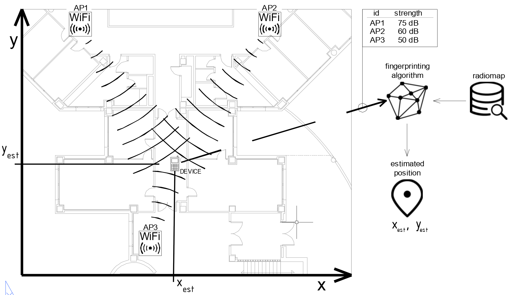
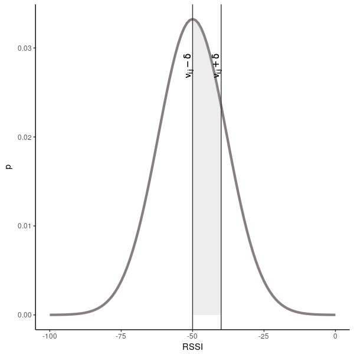

::: article
# Introduction {#S:intro}

Intelligent spaces, as a particularity of the concept known as Ambient
Intelligence (AmI) [@Aarts2009; @Werner2005], where agents communicate
and use technology in a non-intrusive way, have an interest in both open
and closed environments. Since people spend 90% of time indoors
[@Klepeis2001], one of the most relevant aspects of AmI is indoor
localization, due to the large number of potential applications:
industrial and hospital applications, passenger transport, residences,
assistance to emergency services and rescue, localization and support
guide for the disabled, leisure applications, etc. It is expected that
the global market for this type of location will grow from USD 7.11
billion in 2017 to USD 40.99 billion by 2022 [@researchandmarkets2017],
being among the key technologies in the future. This is a technology
that has already awakened but that in a short period of time will suffer
a big explosion, as happened with the systems of positioning by
satellite in exteriors and its applications.

This paper introduces the R package
[*ipft*](https://CRAN.R-project.org/package=ipft) [@ipft-package], a
collection of algorithms and utility functions to create models, make
estimations, analyze and manipulate RSSI fingerprint data sets for
indoor positioning. Given the abundance of potential applications for
indoor positioning, the package may have a broad relevance in fields
such as pervasive computing, Internet of Things (IoT) or healthcare,
among many others.

The main progress in indoor location systems has been made during the
last years. Therefore, both the research and commercial products in this
area are new, and researchers and industry are currently involved in the
investigation, development and improvement of these systems. We believe
that the R language is a good environment for machine learning and data
analysis related research, as its popularity is constantly growing [^1],
researchers related to indoor positioning have explicitly selected R as
developing framework for their experiments
[@quan2017; @Harbicht2017; @Popleteev2011], it is well maintained by an
active community, and provides an ecosystem of good-quality packages
that leverage its potential to become a standard programming platform
for researchers. There are some open source applications and frameworks
to build indoor positioning services, such as FIND [^2], Anyplace [^3]
or RedPIN [^4], based on fingerprinting techniques but, as far as we
know, there is not any public framework or package that provides
functions and algorithms to manipulate fingerprinting datasets and
experiment with positioning algorithms.

RSSI (Received Signal Strength Indicator) positioning systems are based
on measuring the intensities of the received radio signals of the
emitting devices (beacons) that are available at a particular position,
and comparing them with a previously built RSSI data set [@Lee2013].
RSSI is used to measure the relative quality of a received signal to a
client device, and each chipset manufacturer is free to define their own
scale for this term. The value read by a device is given on a
logarithmic scale and can correspond to an instant reading or a mean of
some consecutive readings.

In this scenario, a fingerprint is an RSSI feature vector composed of
received signal values from different emitting devices or beacons,
associated to a precise position. In the last years, this technique is
becoming increasingly important for indoor localization
[@Liu2007; @He2016], since Wi-Fi is generally available in indoor
environments where GPS signals cannot penetrate, and the wireless access
points (WAPs) can be used as emitting devices [@Li2006]. Other types of
indoor localization RF emitters, such as Bluetooth [@Wang2013], RFID
[@Liu2011], or Ultra Wide Band (UWB) [@Gigl2007], can be also used in
combination with Wi-Fi access points or as a standalone positioning
system.

The RSSI fingerprinting localization approach requires two phases of
operation: a training phase, also known as off-line or survey phase, and
a positioning phase, sometimes referred as on-line, runtime or tracking
phase. In the training phase, multidimensional vectors of RSSI values
(the fingerprints) are generated and associated with known locations.
These measurements are used to build a data set (also known as radio
map) that covers the area of interest. This data set can include, along
with the collected RSSI values and the location coordinates, many other
useful parameters, as the device type used in the measurements or its
orientation. Later, during the positioning phase, an RSSI vector
collected by a device is compared with the stored data to generate an
estimation of its position (Figure [1](#fingerprint_figure)).

<figure id="fingerprint_figure">
<p><span></span></p>
<figcaption>Figure 1: During the on-line phase, once the radio map has
been built, the fingerprinting algorithm uses it to estimate the
device’s position by comparing the RSSI values heard by the device with
the ones stored in the radio map.</figcaption>
</figure>

Despite the increasing interest in RSSI positioning [@Xiao2016], this
topic has not been explicitly covered yet by any publicly available R
package. The proposed package has been developed to provide users with a
collection of fundamental algorithms and tools to manipulate RSSI radio
maps and perform fingerprinting analysis. While fundamental algorithms
and similarity measurement functions are implemented to provide a main
framework for research and comparison purposes, these are highly
customizable, to allow researchers to tailor those methods with their
own parameters and functions.

This paper describes these algorithms and their implementation, and
provides examples of how to use them. The remainder of the paper is
structured as follows: Section [2](#S:statement) defines the
fingerprinting problem statement and the nomenclature that will be used
in the rest of the paper. An overview of the implemented algorithms is
given in Section [3](#S:description). Section [4](#S:wrangling) outlines
some data wrangling techniques included in the package. Section
[5](#S:positioning_algorithms) describes the implemented positioning
algorithms. Section [6](#S:WAPestimation) presents the included methods
for access point position estimation. Then, Section [7](#S:clustering)
discuses some tools and functions included to create clusters or groups
of fingerprints. Section [8](#S:plot) illustrates the use of the
plotting functions also included in the package. In all these sections,
functions are described and explored using practical examples, and
particular emphasis is placed on how to use them with real world
examples and data sets. Finally, the paper is summarized in Section
[9](#S:conclusions).

# Problem statement. Terminology and notation {#S:statement}

This section provides a brief and general introduction to the principles
of fingerprinting positioning, as well as a description of the notation
and terminology that will be used in the next sections. The terms
described here are related to general concepts of fingerprinting
techniques, while the remaining of the paper describes the particular
implementation of these concepts in the `ipft` package.

The main goal of the indoor localization techniques is to determine the
position of a user in an indoor environment, where the GPS signal might
not be received. This objective might require the use of an existing
infrastructure, the deployment of a new one, the use of the so-called
signals-of-opportunity [@Yang2014], or even a combination of some of
these techniques. Many of these techniques take advantage of the
radio-frequency signals emitted by devices, whose position can be known
or not, to estimate the user's position from the perceived strength of
these signals. There are many kinds of devices that can be used for this
purpose, such as Wi-Fi access points, bluetooth beacons, RFID or UWB
devices, but for all of them, the information provided for a given
position, the fingerprint, can be stored as a vector of received signal
strength intensities (RSSI), whose length is determined by the number of
detected emitters.

A radio map, or a fingerprinting data set, is composed of a set of
collected fingerprints and the associated positions where the
measurements were taken, and may contain some additional variables, such
as the the type of device used or a time stamp of the observation, among
any other useful data. Let $\mathcal{D}$ be a fingerprinting data set.
Then:

$$\mathcal{D} = \left\lbrace\mathcal{F}, \mathcal{L}\right\rbrace$$

where $\mathcal{F}$ is the set of collected fingerprints and
$\mathcal{L}$ is the set of associated locations.

For research purposes, a fingerprinting data set is usually divided into
training and test sets. The training data set is used to store the
fingerprints and location data to create models of the environment that
can be used to estimate the position of a new fingerprint. The test data
set is used to test the models obtained from the training data, and to
compute the errors from the results of the position estimation.

Let $\mathcal{D}_{train}$ be a training data set:

$$\mathcal{D}_{train} = \left\lbrace\mathcal{F}_{train}, \mathcal{L}_{train}\right\rbrace$$

where

$$\mathcal{F}_{train} = \left\lbrace \lambda_{1}^{tr}, \lambda_{2}^{tr}, ..., \lambda_{n}^{tr}  \right\rbrace$$

$$\mathcal{L}_{train} = \left\lbrace \tau_{1}^{tr}, \tau_{2}^{tr}, ..., \tau_{n}^{tr}  \right\rbrace$$

$\mathcal{D}_{train}$ is composed of $n$ fingerprints, stored as $n$
vectors of RSSI measurements
($\lambda_{i}^{tr}, \ i \in [1, 2, ..., n]$), and $n$ locations
($\tau_{i}^{tr}, \ i \in [1, 2, ..., n]$), stored as vectors,
representing the position associated with its correspondent fingerprint.
Each fingerprint consists of $q$ RSSI values ($\rho_{h,i}^{tr}$,
$h \in [1,...,q]$), where $q$ is the number of beacons considered when
building the training set:

$$\lambda_{i}^{tr} = \left\lbrace \rho_{1,i}^{tr}, \rho_{2,i}^{tr}, ..., \rho_{q,i}^{tr}  \right\rbrace, \ i \in [1,...,n]$$

and each associated position is composed of one or more values,
depending on the number of dimensions to be considered and the
coordinate system used. The position can be given as a vector of values
representing its coordinates, although on multi-floor and multi-building
environments labels can be used to represent buildings, floors, offices,
etc. Let $l$ be the number of dimensions of a position vector. Then:

$$\tau_{i}^{tr} = \left\lbrace \nu_{1,i}^{tr}, \nu_{2,i}^{tr}, ..., \nu_{l,i}^{tr}  \right\rbrace, \ i \in [1,...,n]$$

The test data set is also composed of a collection of fingerprints
associated to known positions. This data set is used for testing
purposes, during research or during model building adjustments, to
assess the model's performance by comparing its estimation of the
positions with the ground truth.

The situation is different in real applications, where the goal is to
estimate the unknown position of the receiver given the RSSI values
detected at a particular location, using a previously built model. In
this case, the test data set is just composed of a unique fingerprint,
and the objective is to estimate the actual location of the receiver.
Therefore, no information about its location is provided.

The test data set is composed of $m$ observations:

$$\mathcal{D}_{test} = \left\lbrace\mathcal{F}_{test}, \mathcal{L}_{test}\right\rbrace$$

where

$$\mathcal{F}_{test} = \left\lbrace \lambda_{1}^{ts}, \lambda_{2}^{ts}, ..., \lambda_{m}^{ts}  \right\rbrace$$

$$\mathcal{L}_{test} = \left\lbrace \tau_{1}^{ts}, \tau_{2}^{ts}, ..., \tau_{m}^{ts}  \right\rbrace$$

To be able to compare the test observations with the training
fingerprints, the number of RSSI values of its respective fingerprints
has to be the same, and the position in the RSSI vector must represent
the same beacon in both data sets. Therefore, each one of the $m$
observations of the test data set is composed of a fingerprint with $q$
RSSI values:

$$\lambda_{j}^{ts} = \left\lbrace \rho_{1,j}^{ts}, \rho_{2,j}^{ts}, ..., \rho_{q,j}^{ts}  \right\rbrace, \ j \in [1,...,m]$$

and a location vector with the same spatial dimensions as the training
location vectors:

$$\tau_{j}^{ts} = \left\lbrace \nu_{1,j}^{ts}, \nu_{2,j}^{ts}, ..., \nu_{l,j}^{ts}  \right\rbrace, \ j \in [1,...,m]$$

The notation depicted above will be used in the remaining of the paper
to represent the fingerprinting data. Symbols $i$ and $j$ will be used
to represent iterations over the training and test data sets,
respectively, while $h$ will be used to iterate over the beacons present
in each fingerprint.

# An overview of the implemented algorithms {#S:description}

This section presents an introduction to the main functions, included in
the [*ipft*](https://CRAN.R-project.org/package=ipft)[^5] package, that
implement fingerprinting-based indoor localization methods. The package
also provides two data sets for training and validation purposes that
are briefly described in this section.

The `ipft` package implements three algorithms to build models to
estimate the position of a receiver in an indoor environment. Two of
these implementations are based on the well known k-Nearest Neighbors
algorithm (*knn*) [@CoverTIT67] to, given an RSSI vector, select the $k$
most similar training examples from the radio map. The similarity
between the RSSI value vectors can be measured, for example, as the
$euclidean$ distance between them, but other distance functions may be
used [@Torres-Sospedra2015ESWA]. The selection of a method to compute
this measure can be provided to the function in two ways, either
choosing one of the already implemented distance measurements
($euclidean$, $manhattan$, etc.), or by way of a reference to a function
implemented by the user that returns the distance (the lower, the more
similar or 'closer') between two matrices or vectors. Once the $k$
neighbors are selected, the location of the user is estimated as the
weighted average of the neighbors positions.

The first implementation, corresponding to the function `ipfKnn`, may
behave in a deterministic way, finding the $k$ more similar neighbors
using a deterministic similarity function such as the euclidean or
manhattan distances, or in a probabilistic way, using similarity
functions such as LDG (Logarithmic Gaussian Distance) or PLGD (Penalized
Logarithmic Gaussian Distance) [@Cramariuc2016a], that are based upon
statistical assumptions on the RSSI measurement error. The similarity
function can be chosen from the set of implemented options or provided
by the user via a custom function. This implementation is discussed in
the Section [5.1](#S:deterministicknn).

The other implementation of the knn algorithm assumes a probabilistic
nature for the received signal distribution [@Roos2002] and uses
collections of many fingerprints at each particular position, acquired
during the training phase. Therefore, the radio map is composed of
several groups, where a group is a set of fingerprints (vectors of RSSI
values) that share the same location. Assuming that the RSSI value for a
specific beacon can be modeled as a random variable following a normal
distribution [@Haeberlen], any of these collections, or groups, of
fingerprints can be represented by the statistical parameters of this
distribution, in this case, the mean and the standard deviation. This
implies that the original data set can be transformed into a new type of
data structure by storing the mean and the standard deviation of every
detected beacon for every group. All the original data for a group is
transformed into two vectors, one storing the means and the other the
standard deviations. The trustworthiness of the data in the new data set
will depend on the number of measurements for every location of the
original data. It is assumed that the more measurements for a particular
location, the more reliable will be their inferred statistical
parameters.

The implementation of this probabilistic-based method takes the original
radio map and a set of group indices, and fits these groups of
measurements to a normal (Gaussian) distribution for every beacon and
every location, so that the signal intensity distribution is determined
by the mean and the standard deviation of the Gaussian fit. Then, given
a test fingerprint, the algorithm estimates its position by selecting
the *k* most probable locations, making explicit use of the statistical
parameters of the data stored in the radio map to optimize the
probabilities in the assignment of the estimated position by computing a
similarity function based on a summatory of probabilities. This approach
is implemented through the `ipfProbabilistic` function and is described
in the Section [5.2](#S:probabilistic).

Finally, the third implemented algorithm is based on a scenario where
the location of the beacons is known, and an estimation of the
fingerprint position can be made using the log-distance path loss model
[@seybold2005introduction]. The strength of the received signal at a
particular point can be modeled as a function of the logarithmic
distance between the receiver and the emitter and some parameters
related to the environment properties and the devices characteristics.
Therefore, as this method uses an analytical model to evaluate the
position, no radio map is needed to train a model to compare
fingerprints with, since the position might be estimated from the
fingerprint data and the position of the beacons. This method is
implemented by the function `ipfProximity` and is described in Section
[5.3](#S:deterministicprox).

The previous functions `ipfKnn`, `ipfProbabilistic` and `ipfProximity`
create models based on the training data and parameters provided. These
models can then be evaluated using the `ipfEstimate` function, that
internally detects the algorithm to apply based on the model that
receives as parameter.

The package also includes data from the IPIN2016[^6] Tutorial data set.
In the `ipftrain` data frame there are $n$ = 927 observations, including
the RSSI values for $q$ = 168 wireless access points, the location,
expressed in Cartesian coordinates, for the observation (x, y), and some
other variables, as timestamps for the measurements or an identifier for
the user who took the survey. The `ipftest` data frame contains $m$ =
702 observations with the same structure, for testing and validation
purposes. The fingerprints included in both data sets where taken in the
same building and the same floor. The `ipfpwap` data frame contains the
position of 39 of the WAPs included in the `ipftrain` and `ipftest` data
sets. The unknown positions of the remaining WAPs are stored as `NA`.
The characteristics of these data sets attributes are:

-   `RSSI values`: Columns from 1 to 168. The values represent the
    strength of the received signal expressed in decibels, on a scale
    that ranges from $-30$dBm to $-97$dBm in the training set, and from
    $-31$dBm to $-99$dBm in the test set. The closer the value to zero,
    the stronger the signal.
-   `position`: Columns 169 (X) and 170 (Y). The position given in
    Cartesian coordinates, with its origin in the same corridor where
    the data was acquired.
-   `user id`: A numeric value from 1 to 8 to represent each of the 8
    users that acquired the train data set. The test dataset was
    acquired by a different user, represented by the value 0.
-   `timestamp`: The UNIX time stamp of the observation, in seconds.

There are some other publicly available indoor location data sets that
have been used to develop and test this package and that are not
included for size reasons, as the UJIIndoorLoc Data Set
[@Torres-Sospedra2015] or the Tampere University data set
[@Cramariuc2016].

The theoretical foundations of the algorithms and its uses are discussed
in detail in Section [5](#S:positioning_algorithms). A description of
the functions `ipfKnn`, `ipfProximity`, `ipfProbabilistic` and
`ipfEstimate` is given while presenting some simulations to show how
these algorithms can be useful in practice.

# Data wrangling  {#S:wrangling}

An RSSI fingerprint is a vector composed of signal strength measurements
from all the emitters received by a client device at a particular point,
and can be measured in any unit of power. It is often expressed in
decibels (dBm), or as percentage values between 1-100, and can be a
negative or a positive value. Typically this values are stored as
negative figures, where the strongest signals are closer to zero.

Some algorithms are sensitive to the scale of the data. For example,
Neural Networks generally work better [@LeCun1998] with data scaled to a
range between \[0, 1\] or \[$-1$, 1\], since unscaled data may slow down
the learning process and the convergence of the network parameters and,
in some cases, prevent the network from effectively learning the
problem. Thus, the first step before the data can be fed to a
positioning algorithm may involve some kind of transformation, depending
on the characteristics of the original data.

The data sets included in this package represent the RSSI data from a
set of wireless access points as negative integer numbers from $-99$
(weakest detected signal) to $-30$ (strongest detected signal). When the
RSSI of a WAP is not available, the value used is `NA`. This convention
may be inconvenient for some calculations. For example, a similarity
measure between two fingerprints as the euclidean distance will only
take into account those WAPs that have been detected in both
observations, causing a loss of information that otherwise could be
utilized.

The [*ipft*](https://CRAN.R-project.org/package=ipft) package contains
some functions to manipulate and wrangle raw fingerprint data. The
`ipfTransform` function mutates the given fingerprint data into a new
data set with a specified range for the RSSI signals. The signature of
the function is:

``` r
  ipfTransform <- function(data, outRange = c(0, 1), outNoRSSI = 0, inRange = NULL, 
                           inNoRSSI = 0, trans = "scale", alpha = 24)
```

where:

-   `data`: The input data set with the original RSSI fingerprints.
-   `outRange`: A numeric vector with two values indicating the desired
    range of the output data.
-   `outNoRSSI`: The desired value for not detected beacons in the
    output data.
-   `inRange`: A numeric vector with two values indicating the range of
    signal strength values in the input data. If this parameter is not
    provided, the function will infer it from the provided data.
-   `inNoRSSI`: The value given to a not detected beacon in the original
    data.
-   `trans`: The transformation to perform over the RSSI data, either
    'scale' or 'exponential'.
-   `alpha`: The $\alpha$ parameter for the exponential transformation.

The *scale* transformation scales the input data values to a range
specified by the user. The feature scaling is performed according to
Equation \@ref(eq:scaleT):

$$\label{eq:scaleT}
		\rho_{h,i}^{out} =\begin{cases} 
      a+b\cdot\rho_{h,i}^{in}, &\mathrm{if}\,\rho_{h,i}^{in}\neq inNoRSSI\\ 
      outNoRSSI,&otherwise 
      \end{cases}   (\#eq:scaleT)$$

$$b = \frac{outMin-outMax}{inMin-inMax}$$

$$a = outMin - inMin \cdot b$$

where:

-   $\rho_{h,i}^{out}$ and $\rho_{h,i}^{in}$ are the output and input
    RSSI values, respectively, for the $h^{th}$ beacon from the $i^{th}$
    observation
-   $outMax$ and $outMin$ are the maximum and minimum values,
    respectively, specified for the output by the `outRange` parameter.
-   $inMax$ and $inMin$ are the maximum and minimum values,
    respectively, of the input data.
-   $outNoRSSI$ and $inNoRSSI$ are the values assigned in the
    fingerprint to represent a not detected beacon for the output and
    input data, respectively, specified by the parameters `outNoRSSI`
    and `inNoRSSI`.

The *exponential* transformation [@Torres-Sospedra2015ESWA] changes the
data according to the next equation:

$$\rho_{h,i}^{out} =\begin{cases} 
      \exp(\frac{pos(\rho_{h,i}^{in})}{\alpha})      
      , &\mathrm{if}\,\rho_{h,i}^{in}\neq inNoRSSI\\ 
      outNoRSSI,&otherwise 
      \end{cases}$$

$$pos(\rho_{h,i}^{in}) =\begin{cases} 
      \rho_{h,i}^{in} - inMin      
      , &\mathrm{if}\,\rho_{h,i}^{in}\neq inNoRSSI\\ 
      0,&otherwise 
      \end{cases}$$

where $\alpha$ is a parameter for the exponential transformation. The
authors establish $\alpha$ as a case-based parameter, and find that 24
is a good value for RSSI fingerprinting data, but they did not study the
effects of $\alpha$ in the transformed data.

The following code scales the `ipftrain` and `ipftest` data sets RSSI
data, stored in the columns 1:168, to a positive range of values, from 0
to 1, with NA representing a not detected WAP. As a not detected WAP is
represented by a `NA` value in the original data, this has to be
indicated to the function so it can transform these values to the
desired output:

``` r
  trainRSSI <- ipfTransform(ipftrain[, 1:168], outRange = c(0.1, 1), inNoRSSI = NA, 
                            outNoRSSI = NA)
  testRSSI <- ipfTransform(ipftest[, 1:168], outRange = c(0.1, 1), inNoRSSI = NA, 
                           outNoRSSI = NA)
```

The `ipfTransform` function returns a new data set with the same
structure (vector, matrix or data frame) as the input.

# Positioning algorithms {#S:positioning_algorithms}

This section describes three positioning algorithms implemented in the
`ipft` package. The examples illustrating each description are based on
the data previously scaled in Section [4](#S:wrangling).

## The `ipfKnn` function. {#S:deterministicknn}

The `ipfKnn` and `ipfEstimate` functions implement a version of the knn
algorithm to select the $k$ nearest neighbors (the $k$ more similar
vectors from the training set) to a given RSSI vector. Many different
distance metrics [@Torres-Sospedra2015ESWA] can be used to compare two
RSSI vectors and measure how 'near' or similar they are.

The distance metrics implemented in the package include some typical
functions, as the *$L^{1}$* norm, or manhattan distance, or the
*$L^{2}$*, or euclidean distance. The *$L^{u}$* norm between two
fingerprints with indices $a$ and $b$ is defined as follows:

$$L^{u} = \left(\sum_{h=1}^{q} \lvert(\rho_{h,a} - \rho_{h,b}\rvert^{u}  \right)^{1/u}$$

The package also implements some fingerprinting specific distance
estimation functions such as LDG and PLGD. The LGD between two RSSI
vectors $\lambda_{i}^{tr}$ and $\lambda_{j}^{ts}$ of longitude $q$ is
given by:

$$LGD(\lambda_{i}^{tr}, \lambda_{j}^{ts}) = - \sum_{h = 1} ^ {q} \log \ \max(G(\rho_{h, i}^{tr},\ \rho_{h, j}^{ts}),\ \epsilon)$$

where $\epsilon$ is a parameter to avoid logarithm of zero, as well as
having one beacon RSSI value influence the LGD only above a certain
threshold. $G(\rho_{h, i}^{tr},\ \rho_{h, j}^{ts})$ represents the
Gaussian similarity between $\rho_{h, i}^{tr}$ and $\rho_{h, j}^{ts}$,
defined as

$$\mathrm{G}(\rho_{h, i}^{tr}, \rho_{h, j}^{ts})= 
      \begin{cases} 
      \frac{1}{\sqrt{2\pi\sigma^{2}}}\exp\left(-\frac{(\rho_{h, i}^{tr} - \rho_{h, j}^{ts})^{2}}{2\sigma^{2}}\right), &\mathrm{if}\,\rho_{h, i}^{tr}\neq 0\,\mathrm{and}\,\rho_{h, j}^{ts}\neq 0\\ 
      0,&otherwise 
      \end{cases}$$

The $\sigma^2$ parameter represents the shadowing variance
[@Shrestha2013]. Values for $\sigma$ in the range between 4 and 10 dBm
are usually good for indoor scenarios [@Lohan2014].

The PLGD between two RSSI vectors $\lambda_{i}^{tr}$ and
$\lambda_{j}^{ts}$ of longitude $q$ is given as:

$$PLGD(\lambda_{i}^{tr}, \lambda_{j}^{ts}) = LGD(\lambda_{i}^{tr}, \lambda_{j}^{ts}) + \alpha(\phi(\lambda_{i}^{tr}, \lambda_{j}^{ts}) + \phi(\lambda_{j}^{ts}, \lambda_{i}^{tr}))$$

where $\phi(\lambda_{i}^{tr}, \lambda_{j}^{ts})$ is a penalty function
for the beacons that are visible in the $i^{th}$ training fingerprint
but not in the $j^{th}$ test fingerprint,
$\phi(\lambda_{j}^{ts}, \lambda_{i}^{tr})$ is a penalty function for the
beacons that are visible in the $j^{th}$ test fingerprint but not in the
$i^{th}$ training fingerprint, and are defined as follows:

$$\phi(\lambda_{i}^{tr}, \lambda_{j}^{ts}) = \sum_{h=1} ^ {q} T_{max} - \rho_{h, i}^{tr}, \ \mathrm{for} \ \ 0 < \rho_{h, i}^{tr} \leq T_{max} \ \mathrm{and} \ r_i = 0)$$

$$\phi(\lambda_{j}^{ts}, \lambda_{i}^{tr}) = \sum_{h=1} ^ {q} T_{max} - \rho_{h, j}^{ts}, \ \mathrm{for} \ \ 0 < \rho_{h, j}^{ts} \leq T_{max} \ \mathrm{and} \ r_j = 0)$$

$T_{max}$ is an upper threshold for the strength of the signal, and
$\alpha$ is a scaling factor.

The similarity measurement method can be chosen by means of the
parameter `method`, or by providing a custom function (parameters `FUN`
and `...`). The signature of the `ipfKnn` function is:

``` r
  ipfKnn <- function(train_fgp, train_pos, k = 3, method = 'euclidean', 
                     weights = 'distance', norm = 2, sd = 5, epsilon = 1e-3, 
                     alpha = 1, threshold = 20, FUN = NULL, ...)
```

where:

-   `train_fgp`: A data frame of $n$ rows and $q$ columns containing the
    fingerprint vectors of the training set.
-   `train_pos`: A data frame of $n$ rows and $l$ columns containing the
    positions of the training observations.
-   `k`: The $k$ parameter of the $knn$ algorithm, the number of nearest
    neighbors to consider.
-   `method`: The distance metric to be used by the algorithm. The
    implemented options are 'euclidean', 'manhatan', 'norm', 'LGD' and
    'PLGD'
-   `weights`: The weight function to be used by the algorithm. The
    implemented options are 'distance' and 'uniform'. The default
    'distance' function calculate the weights from the distances as:
    $$w_{j,t} = \frac{1}{(1 + d_{j,t})\mathcal{W}_{j}}$$
    where $w_{j,t}$ is the weight assigned to the
    $t^{th} \ (t \in{[1 .. k])}$ neighbor of the
    $j^{th} \ (j \in{[1 .. m])}$ test observation, $d_{j,t}$ is the
    distance in the feature (RSSI) space between the $t^{th}$ neighbor
    and the $j^{th}$ test fingerprint, and $\mathcal{W}_{j}$ is a term
    used to normalize the values so that the total sum of the $k$
    weights is 1.
    The 'uniform' function assigns the same weight value to each
    neighbor:
    $$w_{j,t} = \frac{1}{k}$$
-   `norm, sd, epsilon, alpha, threshold`: Parameters for the 'norm',
    'LGD' and 'PLGD' methods.
-   `FUN`: An alternative function provided by the user to compute the
    distance.
-   `...`: Additional parameters for the function FUN.

For a training data set of $n$ RSSI vectors (a data frame or a matrix
named `tr_fingerprints`) and a data set of $n$ position vectors (a data
frame or a matrix named `tr_positions`), the code for fitting a knn
model with a $k$ value of 4 and the manhattan distance as the distance
measurement method is:

``` r
  knnModel <- ipfKnn(tr_fingerprints, tr_positions, k = 4, method = 'manhattan')
```

This function returns an S3 object of class `ipftModel` containing the
following properties:

-   `params`: A list with the parameters passed to the function.
-   `data`: A list with the fingerprints and the location data of the
    radio map.

To estimate the position of a new fingerprint, the `ipfEstimate`
function makes use of the previously obtained model. An `ipfModel`
object holds the data model needed by the `ipfEstimate` function to
apply the selected algorithm and returns an estimation of the test
fingerprints positions. The signature of `ipfEstimate` is:

``` r
  ipfEstimate <- function(ipfmodel, test_fgp, test_pos = NULL)
```

where:

-   `ipfmodel`: An S3 object of class `ipfModel`.
-   `test_fgp`: A data frame of $m$ rows and $q$ columns containing the
    fingerprints of the test set.
-   `test_pos`: An optional parameter containing a data frame of $m$
    rows and $l$ columns with the position of the test observations.

The `ipfEstimate` function returns an S3 object of the class
`ipfEstimation` with the following elements:

-   `location`: A $m \times l$ matrix with the predicted position for
    each observation in the `test` data set.
-   `errors`: If the actual location of the test observations is passed
    in parameter `test_pos`, and the data that represents the position
    is numeric, this property returns a numeric vector of length $n$
    with the errors, calculated as the $euclidean$ distances between the
    actual and the predicted locations.
-   `confusion`: If the actual location of the test observations is
    passed in parameter `test_pos`, and the data that represents the
    position is a factor, the estimation of the actual position is
    performed as a classification task, and this property returns a
    confusion matrix summarizing the results of this classification.
-   `neighbors`: A $m \times k$ matrix with the indices of the $k$
    selected neighbors for each observation in the `test` data set.
-   `weights`: A $m \times k$ matrix containing the weights assigned by
    the algorithm to the selected neighbors.

The following `R` code shows an example of the usage of the `ipfKnn`
function with the data set included in the package. This example takes
the data previously scaled and generates a positioning model from the
input data `trainRSSI` (the radio map) that is stored in `knnModel`.
Then, the model is passed to the `ipfEstimate` function, along with the
test data, to get an estimation of the position of the 702 test
observations:\

``` r
  tr_fingerprints <- trainRSSI[, 1:168]
  tr_positions    <- ipftrain[, 169:170]
  knnModel        <- ipfKnn(tr_fingerprints, tr_positions, k = 7, method = "euclidean")
  ts_fingerprints <- testRSSI[, 1:168]
  ts_positions    <- ipftest[, 169:170]
  knnEstimation   <- ipfEstimate(knnModel, ts_fingerprints, ts_positions)
```

Since the position of the test observations is known, the mean error for
the 702 test observations can be calculated as follows:

``` r
  > mean(knnEstimation$errors)
  [1] 3.302739
```

The mean positioning error is one of the most common evaluation metrics
used in indoor positioning [@Liu2007] to assess the system's accuracy.
This metric corresponds to the average Euclidean distance between the
estimated locations and the true locations. As positions in the
`ipftrain` and `ipftest` are expressed in meters, this metric represents
the average error in meters for this scenario.

The neighbors selected from the training data set for the 6 first test
fingerprints are:

``` r
  > head(knnEstimation$neighbors)
       [,1] [,2] [,3] [,4] [,5] [,6] [,7]
  [1,]   71  176  126  125  127  771  130
  [2,]   71  176  126  125  127  771  130
  [3,]  465  914  915  913  217   77  218
  [4,]  465  914  915  176  913  461  217
  [5,]  176  126  125  771  130  127  914
  [6,]   77  914  915  217  176  465  218
```

where each row of the output corresponds to the indices of the $k$ = 7
more similar vectors from the training data set to the $i^{th}$ vector
of the `test` data set.

As an example of how to use `ipfKnn` with a custom function, the next
code shows the definition of a *C++* function that implements a modified
version of the manhattan distance. The function needs at least two
parameters, the two matrices representing the training and test data
sets. A third parameter is here introduced to represent a penalization
value. This function penalizes the computed distance between two RSSI
measurements when one of the beacons is not detected (represented by the
value $\emptyset$), by multiplying the resulting distance by a factor
$F$. Given two fingerprints $\lambda_{i}^{tr}$ and $\lambda_{j}^{ts}$ of
length $q$, the $myD$ distance is:

$$\mathrm{myD}(\lambda_{i}^{tr}, \lambda_{j}^{ts})= \sum_{h=1}^{q}{\mathrm{myd}(\rho_{h,i}^{tr}, \rho_{h,j}^{ts})},$$

where

$$\mathrm{myd}(\rho_{h,i}^{tr}, \rho_{h,j}^{ts})= 
      \begin{cases}
      \mathrm{\lvert}\rho_{h,i}^{tr} - \rho_{h,j}^{ts}\rvert  , &\mathrm{if}\,\rho_{h,i}^{tr}\neq \emptyset\,\mathrm{and}\,\rho_{h,j}^{ts}\neq \emptyset\\ 
      \mathrm{\lvert}\rho_{h,i}^{tr} - \rho_{h,j}^{ts}\lvert F , &otherwise 
      \end{cases}$$

The following code implements the `myD` function and shows an example of
its usage with `ipfKnn`, as well as the results obtained. The function
is coded in *C++* to improve its performance when using large data sets,
although the method also accepts custom plain R functions. The `myD`
function assumes that the fingerprints are in a positive range:

``` r
  library('ipft')
  library('Rcpp')
  cppFunction('
    NumericMatrix myD(NumericMatrix train, NumericMatrix test, double F = 2.0) {
      NumericMatrix distanceMatrix(test.nrow(), train.nrow());
      double d = 0, pv = 0, rssi1 = 0, rssi2 = 0;
      for (int itrain = 0; itrain < train.nrow(); itrain++) {
        for (int itest = 0; itest < test.nrow(); itest++) {
          d = 0;
          for (int i = 0; i < train.ncol(); i++) {
            rssi1 = R_IsNA(train(itrain, i))? 0 : train(itrain, i);
            rssi2 = R_IsNA(test(itest, i))? 0 : test(itest, i);
            pv = (rssi1 != 0 && rssi2 != 0)? 1 : F;
            d = d + std::abs(rssi1 - rssi2) * pv;
          }
          distanceMatrix(itest, itrain) = d;
        }
      }
      return distanceMatrix;
    }'
  )
  customModel      <- ipfKnn(tr_fingerprints, tr_positions, k = 1, FUN = myD, F = 0.25)
  customEstimation <- ipfEstimate(customModel, ts_fingerprints, ts_positions)

  > head(customEstimation$neighbors)
       [,1]
  [1,]  773
  [2,]  773
  [3,]  776
  [4,]  773
  [5,]  130
  [6,]  130
```

The previous code outputs the selected neighbors for the first 6
observations in the test data set. As the `ts_positions` data frame
contains the actual location of the observations, the absolute error
committed by the model is returned in the `ipfEstimation` object:

``` r
  > head(customEstimation$errors)
  [1] 5.708275 5.708275 5.708275 5.708275 3.380000 3.380000

And the mean error with this custom similarity function is:

  > mean(customEstimation$errors)
  [1] 3.297342
```

An `ipfEstimation` object can be used directly to plot the Empirical
cumulative distribution function of the error (function `ipfPlotEcdf()`)
and the Probability density function (function `ipfPlotPdf()`). Figures
1 and 2 show the plots obtained from the following code:

``` r
  > ipfPlotEcdf(customEstimation)
  > ipfPlotPdf(customEstimation)
```

The plotting functions included in the package are described in detail
in Section [8](#S:plot).

{#plot_ecdf width="100%"
alt="graphic without alt text"}

{#plot_pdf width="100%"
alt="graphic without alt text"}

## The `ipfProbabilistic` function. {#S:probabilistic}

Given the limitations of sensors accuracy [@Luo2014] and the irregular
character of signal propagation [@Ali2010], the RSSI vector stored for a
particular position cannot have completely reliable and accurate
information about the emitters signal strength. This uncertainty is
generally modeled by a normal distribution [@Haeberlen], but to do so
many readings of the signals at the same position are needed to obtain a
representative set of statistical parameters to model each RSSI present
at that position.

Thus, the initial collection of RSSI observations associated to a
particular point is transformed into a pair of vectors containing the
means and the standard deviations of the RSSI for each beacon, and then
the complete training data is stored as a set of statistical parameters
that can be used to infer the location of a test observation as the one
that maximizes a probability function.

Let $\widehat{\mathcal{D}}_{train}$ be the new training set obtained
from the previous procedure:

$$\widehat{\mathcal{D}}_{train} = \left\lbrace  \widehat{\mathcal{F}}_{train},\ \widehat{\mathcal{L}}_{train} \right\rbrace$$

$$\widehat{\mathcal{F}}_{train} = \left\lbrace \widehat{\lambda_{1}^{tr}}, \widehat{\lambda_{2}^{tr}}, ..., \widehat{\lambda_{g}^{tr}} \right\rbrace$$

$$\widehat{\mathcal{L}}_{train} = \left\lbrace \widehat{\tau_{1}^{tr}}, \widehat{\tau_{2}^{tr}}, ..., \widehat{\tau_{g}^{tr}}  \right\rbrace$$

where $\widehat{\mathcal{F}}_{train}$ is the set of statistical
parameters obtained from the fingerprints of the training set, $g$ is
the number of groups of fingerprints with the same associated position,
and $\widehat{\mathcal{L}}_{train}$ is the set of positions associated
to each group. Each one of the $g$ observations of the training data set
is now composed of a fingerprint with $q$ values:

$$\widehat{\lambda_{i}^{tr}} = \left\lbrace \theta_{1,i}^{tr}, \theta_{2,i}^{tr}, ..., \theta_{q,i}^{tr}  \right\rbrace, \ i \in [1,...,g]$$

$$\theta_{h,i}^{tr} \sim \mathcal{N}(\mu_{h,i}, \sigma_{h,i}^{2})$$

where $\mu_{h,i}$ and $\sigma_{h,i}^{2}$ are the mean and the variance,
respectively, of the $h^{th}$ RSSI of the $i^{th}$ group of original
fingerprints.

Let $\rho_{h,j}^{ts}$ be the $h^{th}$ RSSI measurement of the $j^{th}$
test fingerprint ($\lambda_{j}^{ts}$), and let $\mu_{h,i}$ and
$\sigma_{h,i}^{2}$ be the mean and the standard deviation of the
$h^{th}$ beacon distribution obtained for the $i^{th}$ position from the
training set. The probability $p_{h,j}^{(i)}$, of observing
$\rho_{h,j}^{ts}$ at the $i^{th}$ position is:

$$p_{h,j}^{(i)} = \int_{\rho_{h,j}^{ts}-\delta}^{\rho_{h,j}^{ts}+\delta} \frac {1}{\sigma_{h,i}\sqrt{2\pi}} \ 	\mathrm{e}^{-\frac{x-\mu_{h,i}}{2\sigma_{h,i} ^ 2}} \ dx$$

where $\delta$ is a parameter to allow the discretization of the normal
distribution (Figure [4](#plot_delta)).

<figure id="plot_delta">
<p><span></span></p>
<figcaption>Figure 4: <span class="math inline"><em>δ</em></span>
parameter for the probabilistic approach. This parameter sets the width
of the discretization steps.</figcaption>
</figure>

The set of all probabilities $p_{h,j}^{(i)}, \ h \in [1, ..., q]$
obtained for a given test observation $j$, expresses the similarity
between the observation measurement and the training data for a
particular location. An evaluation of the total similarity for every
location can be computed as a function of these individual
probabilities, like its sum or its product. In the
[*ipft*](https://CRAN.R-project.org/package=ipft) package, this
algorithm is implemented by the `ipfProbabilistic` and `ipfEstimate`
functions, and by default uses the sum of probabilities as default
operator to evaluate the similarity:

$$\psi_{j}^{(i)} = \sum_{h = 1}^{p} p_{h,j}^{(i)}$$

where $\psi_{j}^{(i)}$ is the similarity between the $j^{th}$ test
observation and the $i^{th}$ distribution from the training data set.
The function to evaluate the similarity can be passed to
`ipfProbabilistic` as a parameter.

As well as the `ipfKnn` and `ipfProximity` funtions, `ipfProbabilistic`
returns a `ipfModel` object with the same data structure seen in Section
[5.1](#S:deterministicknn), but with the difference that now the `data`
property returns the probabilistic parameters that define the fitted
distributions for every group of fingerprints on the training set. The
clustering or grouping of the training data is performed by default over
the location data provided by the user, but this behavior can be
customized by passing a parameter with the columns over which to group
the data, or by passing the group indices directly. The `ipft` package
implements two functions (`ipfGroup()` and `ipfCluster()`) to perform
clustering tasks. These functions are described in Section
[7](#S:clustering).

The signature of the `ipfProbabilistic` function is:

``` r
  ipfProbabilistic <- function(train_fgp, train_pos, group_cols = NULL, groups = NULL, 
                               k = 3, FUN = sum, delta = 1, ...)
```

where `train_fgp`, `train_pos` and `k` have the same meaning and
structure as described in Section [5.1](#S:deterministicknn), and, given
$n$ observations in the training set:

-   `groups`: is a numeric vector of length $n$, containing the index of
    the group assigned to each observation of the training set. This
    parameter is optional.
-   `group_cols`: is a character vector with the names of the columns to
    use as criteria to form groups of fingerprints. This parameter is
    optional.
-   `FUN`: is a function to estimate a similarity measure from the
    calculated probabilities.
-   `delta`: is a parameter to specify the interval around the test RSSI
    value to take into account when determining the probability.
-   `...`: are additional parameters for `FUN`.

The following code shows how to use the `ipfProbabilistic` function to
obtain a probabilistic model from the `ipftrain` and `ipftest` data
sets. The default behavior of `ipfProbabilistic` groups the training
data attending at the position of each observation, in this case, its x
and y coordinates:

``` r
  > probModel <- ipfProbabilistic(tr_fingerprints, tr_positions, k = 7, delta = 10)
  > head(probModel$data$positions)
       X     Y
  1 -0.6 24.42
  2 -0.6 27.42
  3  0.0  0.00
  4  0.4  0.00
  5  0.4  3.38
  6  0.4  6.81
```

Now the `ipfModel$data` property returns a list with 3 elements:

-   `means`: a data frame with the means for every beacon and every
    group of fingerprints.
-   `sds`: a data frame with the standard deviations for every beacon
    and every group of fingerprints.
-   `positions`: a data frame with the position of each group of
    fingerprints.

To obtain an estimation from this model, the same code used in section
[5.1](#S:deterministicknn) can be used to produce the estimated
locations:

``` r
  > ts_fingerprints <- ipftest[, 1:168]
  > ts_positions    <- ipftest[, 169:170]
  > probEstimation  <- ipfEstimate(probModel, ts_fingerprints, ts_positions)
```

and their errors and its mean value:

``` r
  > mean(probEstimation$errors)
  [1] 6.069336
```

An alternative function can be passed to `ipfProbabilistic`. The
following code uses the maximum value of the probabilities as the
similarity measure, and passes a parameter to remove `NA`s from the
data[^7]:

``` r
  > probModel      <- ipfProbabilistic(tr_fingerprints, tr_positions, k = 9, delta = 10, 
  +                                    FUN = max, na.rm = TRUE)
  > probEstimation <- ipfEstimate(probModel, ts_fingerprints, ts_positions)
  > mean(probEstimation$errors)
  [1] 8.652321
```

## The `ipfProximity` function. {#S:deterministicprox}

When the location of the access points is known, it's possible to
estimate the position of a fingerprint using the log-distance path loss
model [@seybold2005introduction]. Given a set of $q$ beacons, and a
fingerprint vector
$\lambda = \left\lbrace\rho_{1}, \rho_{2}, ..., \rho_{q} \right\rbrace$
of length $q$, this model is expressed as:

$$\rho_{h} = P_{1m,h} - 10\alpha\log_{10}{d_{h}}-\gamma, \ \ h \in [1, 2, ..., q]$$

where $\rho_{h}$ is the value of the received signal from the $h^{th}$
beacon, $d_{h}$ is the distance from the observation to the beacon,
$P_{1m, h}$ is the received power at 1 meter from the emitter, $\alpha$
is the path loss exponent, and
$\gamma \sim \mathcal{N}({0, \sigma_{\gamma}^{2}})$ represents a zero
mean Gaussian noise that models the random shadowing effects of the
environment.

The estimator of the distance between the emitting beacon and the
position where the signal is received is:

$$\hat{d}_{h} = 10 ^ {\frac{\rho_{h} - P_{1m,h}}{10\alpha}}$$

This estimation follows a log-normal distribution that is:

$$\ln{\hat{d}_{h}} \sim \mathcal{N}({\ln{d_{h}}, \sigma_{d}^{2}})$$

where $\sigma_{d} = (\sigma_{\gamma}ln{10})/(10\alpha)$.

The mean and the variance of the distribution are:

$$E[\hat{d}_{h}]=d_{h}\ e^{\sigma_{d}^2 / 2}$$

$$\textit{Var}[\hat{d}_{h}]=d_{h}^2\ e^{\sigma_{d}^2}\ (e^{\sigma_{d}^2} - 1)$$

Note that the variance grows quadratically with the distance, making the
estimation less reliable as the distance becomes larger. Therefore, the
distances estimated from different beacons will have different
accuracies. To take this into account, the algorithm estimates the
position of a fingerprint as a minimization problem of the overall
squared error of the estimated distances. The objective function to
minimize is:

$$\underset{\tau}{min}{J} = \sum_{h = 1}^{p} \omega_{h}(\hat{d}_{h} - \Vert s_{h} - \tau \Vert)^2$$

where $\tau$ is the position that minimizes the function, that is, the
estimated position, $q$ is the number of beacons present in the
fingerprint, and $\omega_{h} = 1/Var[\hat{d}_{h}]$ are the weights.

The functions `ipfProximity` and `ipfEstimate` implement this design,
and uses the Broyden-Fletcher-Goldfard-Shano algorithm (BFGS)
[@broyden1969new; @fletcher1970new; @goldfarb1970; @shanno1970], a
quasi-Newton method, to minimize the previous function to make an
estimation of the fingerprint position. The accuracy of the estimation
is strongly dependent on the reliability of the emitters positions. When
these positions are unknown, they can be estimated with the function
`ipfEstimateBeaconPositions`. Section [6](#S:WAPestimation) details the
implementation and usage of this function. The `ipfProximity` function
returns an `ipfModel` object with the data needed by the `ipfEstimate`
function to estimate a fingerprint position.

The signature of the `ipfProximity` function is:

``` r
  ipfProximity <- function(bpos, rssirange = c(-100, 0), norssi = NA, alpha = 5, 
                           wapPow1 = -30)
```

where:

-   `bpos`: a matrix or a data frame containing the position of the
    beacons, in the same order as they appear in fingerprints.
-   `rssirange`: the range of the RSSI data in the fingerprints.
-   `norssi`: the value used to represent a not detected beacon.
-   `alpha`: the path loss exponent ($\alpha$).
-   `wapPow1`: a numeric vector with the received power at one meter
    distance from the beacon ($P_{1m,h}$). If only one value is
    supplied, it will be assigned to all beacons.

In the following example, the goal is to estimate the position of the
702 fingerprints included in the test set, using the known position of
the WAPs and the log-distance path loss model. The `ipfpwap` dataset
contains the location of 39 of the 168 wireless access points of the
`ipftrain` and `ipftest` data sets. The `ipfProximity` function returns
a model that is used to estimate the position of the fingerprints. As
the real position of the test fingerprints is known, this information
can be also passed to the `ipfEstimate` function. Thus, the returned
`ipfEstimation` object will contain, along with the estimated positions,
the associated errors:

``` r
  > proxModel      <- ipfProximity(ipfpwap, alpha = 4, rssirange = c(-100, 0), 
  +                           norssi = NA, wapPow1 = -32)
  > fingerprints   <- ipftest[, 1:168]
  > positions      <- ipftest[, 169:170]
  > proxEstimation <- ipfEstimate(proxModel, ipftest[, 1:168], ipftest[, 169:170])
  > mean(proxEstimation$errors)
  [1] 8.0444
```

## Positioning algorithms comparison {#S:poscomparison}

In a classical fingerprint-based positioning system, the radio map is
constructed in accordance to the positioning algorithm to be used in the
online phase. The knn algorithm follows a deterministic approach that
performs well in most cases, while the probabilistic method is based on
the assumption that there is enough training data for each particular
position to obtain reliable parameters to model a distribution for each
signal at each survey location. As regards to the proximity algorithm,
it is based on two assumptions; first, the ability to realistically
simulate the propagation model of the signal, and second, the known
positions of the emitter beacons. These conditions are not met in many
scenarios, where changes in occupation, for example, modify the
propagation model and thus the performance of the positioning system.

To illustrate the previous considerations, Table [1](#table:accuracy)
shows the mean and the quartile errors in meters for the implemented
algorithms, computed using the dataset included in the package. In this
particular case, given the characteristics of the training data, knn
performs better than the rest.

::: {#table:accuracy}
  ----------------------------------------------------------------------------------------------
                                     Quartile error (m)                               
  --------------- ---------------- -------------------- --------- --------- --------- ----------
  algorithm         mean error (m)                   0%       25%       50%       75%       100%

  knn                       3.3027              0.15172   1.46891   2.61281   4.08992   19.84650

  probabilistic             6.0693              0.14289   3.26988   5.63051   8.19933   17.93031

  proximity                 8.0444              2.49865   5.71055   7.42602   9.88427   20.12029
  ----------------------------------------------------------------------------------------------

  : Table 1: Comparison of the algorithms' accuracy on the dataset
  included in the package
:::

To compare the performance of the proposed implementation of the
previous positioning algorithms, we ran a benchmark test of 1000
iterations on each function, using the dataset included in the package.
The results for the model fitting functions are shown in Table
[2](#table:perftablefit). As it can be seen, the proximity and knn
algorithms are the fastest, as expected, since their model fitting
process basically consists in storing the training data for later
processing during the estimation stage. In contrast, the probabilistic
algorith has to fit a normal distribution for each signal received at
each position, and thus, it takes longer to complete the process.

::: {#table:perftablefit}
  ----------------------------------------------
  function             elapsed (sec)    relative
  ------------------ --------------- -----------
  ipfKnn                       0.031       1.409

  ipfProbabilistic          1035.446   47065.727

  ipfProximity                 0.022       1.000
  ----------------------------------------------

  : Table 2: Performance comparison of the model building functions
:::

The outcomes are different when considering the results for the
estimation function (Table [3](#table:perftableest)). The position
estimation for the probabilistic algorithm is faster that the rest. For
the knn algorithm, the estimation process could be improved using
clustering techniques to avoid comparing the test fingerprint with all
the instances in the training set. With regards to the estimation
process for the proximity algorithm, the fact that the result is
computed by solving an unconstrained nonlinear optimization through an
iterative method highly penalyzes its performance.

::: {#table:perftableest}
  --------------------------------------------------------
  model           function        elapsed (sec)   relative
  --------------- ------------- --------------- ----------
  knn             ipfEstimate          2508.079      2.998

  probabilistic   ipfEstimate           836.651      1.000

  proximity       ipfEstimate         28259.110     33.776
  --------------------------------------------------------

  : Table 3: Performance comparison of the estimation functions on each
  model
:::

# Beacon position estimation {#S:WAPestimation}

If the actual position of the beacons is unknown, it can be estimated in
many ways from the RSSI data. Two basic methods for estimation of the
beacons location have been included in the `ipft` package through the
`ipfEstimateBeaconPositions` function. The 'centroid' and the 'weighted
centroid' methods.

Both methods use the fingerprint data to guess the position of the
beacons. Let $q$ be the number of beacons and $\tau^{\mathcal{B}}$ be
the set of beacons locations:

$$\tau^{\mathcal{B}} = \left\lbrace \nu_{1,h}^{\mathcal{B}}, \nu_{2,h}^{\mathcal{B}}, \nu_{3,h}^{\mathcal{B}}  \right\rbrace, \ h \in [1,2,...,q]$$

the position of the $h^{th}$ beacon is given by:

$$\tau_{h}^{\mathcal{B}} = \left\lbrace \sum_{i=1}^{n}\omega_{i} \nu_{1,i}^{tr}, \ \sum_{i=1}^{n}\omega_{i} \nu_{2,i}^{tr}, \ \sum_{i=1}^{n}\omega_{i} \nu_{3,i}^{tr}   \right\rbrace$$

where $n$ is the number of fingerprints in the training set. The value
of $\omega_{i}$ is:

$$\omega_{i} = \frac{1}{n}$$

for the 'centroid' method and:

$$\omega_{i} = \frac{\rho_{h,i}^{tr}}{\sum_{l=1}^{n}\rho_{h,l}^{tr}}$$

for the 'weighted centroid' method. Since the biggest weights have to be
assigned to the strongest RSSI values, the fingerprint vector values
should be positive, or at least, positively correlated to the beacon
received intensity. This is checked by the function implementation so
the input data is internally transformed to a positive range when
needed.

This is the signature of the `ipfEstimateBeaconPositions` function:

``` r
  ipfEstimateBeaconPositions <- function(fingerprints, positions, method = 'wcentroid', 
                                         rssirange = c(-100, 0), norssi = NA)
```

where:

-   `fingerprints`: is a data frame with the fingerprint vectors as
    rows.
-   `positions`: a data frame with the position of the fingerprints.
-   `method`: the method to use by the algorithm, either 'centroid' or
    'wcentroid'.
-   `rssirange`: the range of the signal strength values of the
    fingerprints.
-   `norssi`: the value assigned in the fingerprints to a non detected
    beacon.

The following code uses the function `ipfEstimateBeaconPositions` with
the 'weighted centroid' method to estimate the position of the wireless
access points, under the assumption that this position is unknown.
Finally, the function `ipfProximity` estimates the positions of the
first 6 test fingerprints:

``` r
  > bc_positions   <- ipfEstimateBeaconPositions(ts_fingerprints, ts_positions, 
                                                 method = 'wcentroid')
  > proxModel      <- ipfProximity(bc_positions, rssirange = c(0.1, 1), 
  +                                norssi = NA)
  > proxEstimation <- ipfEstimate(proxModel, fingerprints[1:6,],
  +                               positions[1:6,])
  > proxEstimation$location
        V1       V2
  1 1.686950 12.02117
  2 1.686950 12.02117
  3 1.654255 10.91767
  4 1.682121 10.96035
  5 1.711448 10.88966
  6 1.695007 10.09507
```

# Data clustering {#S:clustering}

Clustering techniques can be used with the aim of enhancing localization
performance and reducing computational overhead [@Cramariuc2016a]. The
`ipft` package includes some functions for cluster analysis and grouping
of the fingerprinting and location data. These functions can be used to
create or detect clusters based on the position of the observations, on
its signal levels, or on any other criteria that might be useful to
group the data by. Performing RSSI clustering before the positioning
process groups a large number of reference points into various clusters
that can be used to perform first-level classification. This allows to
assess the testing point location by using only the fingerprints in the
matched cluster rather than the whole radio map. Furthermore, given the
amplitude atenuation that building partitions cause to electromagnetic
signals, clusters usually can be related to physical spaces such as
buildings, floors or even rooms.

The main function for clustering tasks is `ipfCluster`. The more basic
usage of the function takes the provided data and uses the k-means
algorithm to classify it into $k$ disjoint sets of observations, by
selecting a set of $k$ cluster centers to minimize the sum of the
squared distances between the data vectors and their corresponding
centers.

The k-means clustering procedure begins with an initial set of randomly
selected centers, and iteratively tries to minimize the sum of the
squared distances. This makes the algorithm very sensitive to the
arbitrary selection of initial centers, and introduces variability in
the results obtained from one execution to another. Besides, the number
of clusters has to be established beforehand, and that may be
inconvenient in some scenarios.

The signature of the `ipftCluster` function is:

``` r
  ipfCluster <- function(data, method = 'k-means', k = NULL, grid = NULL, ...)
```

where

-   `data`: is a data frame with the data to cluster. When using the
    *k-means* method, the data frame must not contain any `NA` values.
-   `method`: the algorithm used to create clusters. The implemented
    algorithms are 'k-means' for k-means algorithm, 'grid' for
    clustering based on spatial grid partition, and 'AP' for affinity
    propagation algorithm.
-   `k`: a numeric parameter for k-means algorithm.
-   `grid`: a numeric vector with the size of the grid for the
    [grid]{.roman} algorithm.

When using the default k-means algorithm, the function behaves as a
wrapper around the k-means function of the *stats* package, and
therefore, the usage can be further customized by passing extra
parameters, as the number of iterations or the algorithm to be used
(\"Hartigan-Wong\" is the default).

The following example will find $k = 30$ clusters of similar
fingerprints in the `ipftrain` dataset. First the data set of
fingerprints is transformed to eliminate the `NA` values that represent
a not detected beacon. Then, the data is passed to the `ipfCluster`
function to find the 30 clusters using the 'MacQueen' algorithm:

``` r
  > set.seed(1)
  > cl_fingerprints <- ipfTransform(tr_fingerprints, inNoRSSI = NA, outNoRSSI = 0)
  > clusterData     <- ipfCluster(cl_fingerprints, k = 30, iter.max = 20, 
  +                               algorithm = "MacQueen")
  > head(clusterData$clusters)
  [1] 3 3 3 3 3 3
```

The outcome of the `ipfCluster` function is a list containing the
indices of the $k$ clusters and its centroids. Given the previous
example, `clusterData$centers` will return the $k$ centroids, and
`clusterData$clusters` will return the cluster index $i \in [1,..,k]$
for every observation in `ipftrain`.

The `ipfCluster` function includes an implementation of the affinity
propagation (AP) algorithm [@Frey2007] that can be used to estimate the
number of distinct clusters present in the radio map. AP does not
require the number of clusters to be determined before running it. It
finds members of the input set, known as 'exemplars', that are
representative of clusters by creating the centers and the corresponding
clusters based on the constant exchanging of reading similarities
between the observations. This message-passing process continues until a
good set of centers and corresponding clusters emerges.

The following code uses AP clustering to find groups of similar RSSI
vectors from the `ipftrain` data set. With no further parametrization,
it will classify the RSSI data into 43 distinct clusters:

``` r
  > clusterData     <- ipfCluster(tr_fingerprints, method = 'AP')
  > dim(clusterData$centers)
  [1]  43 168
```

Now, `clusterData$centers` holds the 43 'exemplars', those RSSI vectors
from the radio map that are representative of a cluster, and
`clusterData$clusters` contains the indices that link every observation
of the data set with its assigned cluster.

To perform a more simple grouping based on a precise set of variables,
the `ipfGroup` function provides a method to group the data by column
name. The function signature is:

``` r
  ipfGroup <- function(data, ...)
```

where

-   `data`: is a data frame with the data to group.
-   `...`: The variables to group the data by.

The `ipfGroup` function returns a numeric vector with the same length as
the number of observations contained in the `data` data frame,
containing the index of the group assigned to each observation. The
following example groups the data according to the position of the
observations, that in the `ipftrain` and `ipftest` datasets are
represented by the columns 'X' and 'Y':

``` r
  > groups <- ipfGroup(ipftrain, X, Y)
  > head(groups)
  [1]  4  4  4  4 22 22
  > length(unique(groups))
  [1]  41
```

# Plotting functions {#S:plot}

Indoor positioning generally involves statistical analysis of datasets,
and the [*ipft*](https://CRAN.R-project.org/package=ipft) provides some
useful functions to produce graphs for exploring data. All the graphic
functions included in the package are built upon the
[*ggplot2*](https://CRAN.R-project.org/package=ggplot2) package
[@Wickham2011], and return a `ggplot` object that can be plotted or
further personalized with custom labels, theme, etc.

The `ipfPlotPdf` and the `ipfPlotEcdf` have already been introduced in
Section [5.1](#S:deterministicknn). These functions will plot the
probability density function and the empirical cumulative distribution
function, respectively. Both functions take an `ipfEstimation` object to
produce the plot, while the axis labels and plot tittle can be also
supplied by the parameters `xlab`, `ylab` and `tittle`. Their respective
signatures are:

``` r
  ipfPlotPdf <- function(estimation, xlab = 'error', ylab = 'density',
                         title = 'Probability density function')
           
  ipfPlotEcdf <- function(estimation, xlab = 'error',
                          ylab = 'cumulative density of error',
                          title = 'Empirical cumulative density function')
```

The function `ipfPlotLocation` will produce a plot of the location of
the data. The following code shows its signature and presents an example
of its use. The example calls the function with parameter `plabel` set
to `TRUE`, to plot labels identifying each location, and `reverseAxis`
set to `TRUE` to swap the axis. It also modifies the resulting object by
changing the default
[*ggplot2*](https://CRAN.R-project.org/package=ggplot2) theme to the
white one. The result is shown in Figure [5](#plot_loc).

``` r
  ipfPlotLocation <- function(positions, plabel = FALSE, reverseAxis = FALSE, 
                              xlab = NULL, ylab = NULL, title = '')
```

``` r
  library(ggplot2)
  ipfPlotLocation(ipftrain[, 169:170], plabel = TRUE, reverseAxis = TRUE) + theme_bw()
```

{#plot_loc
width="100%" alt="graphic without alt text"}

![Figure 6: Estimated and actual positions of test observations 61, 62,
81 and 82 from the `ipftrain` data set. The circles indicate the actual
positions of the observations. The squares show the estimated positions.
The red arrows connect the actual positions with the estimated ones. The
dashed lines connect the estimated positions with the $k$ neighbors from
which the location has been estimated, represented by the crosses.
[]{#plot_est label="plot_est"}](plotest.png){#plot_est width="100%"
alt="graphic without alt text"}

The function `ipfPlotEstimation` plots the estimated position of the
test observations based on an `ipfModel` object and an `ipfEstimation`
object, as well as the actual position (parameter `testpos`), if known,
and the position of the $k$ selected fingerprints from the training set
used to guess its location (parameter `showneighbors`). The green dots
indicate the actual position of the observations, while the black dots
indicate the estimated ones. The blue lines connect the estimated
positions with the $k$ neighbors from which the location has been
estimated, and the red arrows connect the actual position of the
fingerprint with the estimated one. The following code shows the
function signature and provides an example of its usage. The result plot
is shown in Figure [6](#plot_est):

``` r
  ipfPlotEstimation <- function(model, estimation, testpos = NULL, observations = c(1),
                                reverseAxis = FALSE, showneighbors = FALSE, 
                                showLabels = FALSE, xlab = NULL, ylab = NULL, 
                                title = '')
```

``` r
  library(ggplot2)
  probModel <- ipfProbabilistic(ipftrain[, 1:168], ipftrain[, 169:170])
  probEst   <- ipfEstimate(probModel, ipftest[, 1:168], ipftest[, 169:170])
  ipfPlotEstimation(probModel, probEst, ipftest[, 169:170], 
                    observations = c(61:62, 81:82), reverseAxis = TRUE, 
                    showneighbors = TRUE, showLabels = TRUE) + theme_bw()
```

# Summary {#S:conclusions}

In this paper, the package
[*ipft*](https://CRAN.R-project.org/package=ipft) is presented. The main
goal of the package is to provide researchers with a set of functions to
manipulate, cluster, transform, create models and make estimations using
indoor localization fingerprinting data. This package enables
researchers to use a well established set of algorithms and tools to
manipulate and model RSSI fingerprint data sets, and also allows them to
customize the included algorithms with personalized parameters and
functions to adapt the working mode to their particular research
interests.

In this work some of the fundamental algorithms used in indoor
fingerprinting localization techniques have been formally presented and
illustrated, while detailed examples and information about its usage and
implementation have been provided.

# Future work {#S:future_work}

This package is an ongoing work, and future versions will implement new
algorithms and tools with the aim of providing a base framework for
researchers, and become a reference library for fingerprinting-based
indoor positioning research.

In particular, future lines of work should consider the implementation
of deep learning based algorithms. Many deep learning techniques can be
exploited to try to obtain better positioning performance. Recurrent
neural networks could be used to learn not only spatial but also
temporal patterns of the received signals. Deep autoencoders can be
implemented as a way to encode fingerprints and reduce their
dimensionality to a few number of significant features. Their
variational and generative extensions can be of use to better model the
stochastic nature of RSSI data. These models can also be applied to
generate new training data for deep learning-based clasisifiers,
increasing the robustness of positioning systems and trying to address
problems caused by heterogeneity of devices.

# Acknowledgements

The authors would like to thank the two anonymous reviewers for
providing useful feedback that helped to improve the paper.

This work has been partially funded by the Spanish Ministry of Economy
and Competitiveness through the \"Proyectos I + D Excelencia\" programme
(TIN2015-70202-P) and by Jaume I University \"Research promotion plan
2017\" programme (UJI-B2017-45).
:::

[^1]: <https://stackoverflow.blog/2017/10/10/impressive-growth-r/>

[^2]: <https://www.internalpositioning.com#about>

[^3]: <https://anyplace.cs.ucy.ac.cy>

[^4]: <http://redpin.org>

[^5]: The [*ipft*](https://CRAN.R-project.org/package=ipft) package is
    available at CRAN and can be installed as any other R package:\
    ` > install.packages("ipft")`\
    The package has to be loaded into the main environment to use it for
    the first time in an R session:\
    ` > library("ipft")`\

[^6]: http://www3.uah.es/ipin2016/

[^7]: The `ipfProbabilistic` function takes into account the `NA`s
    contained in the data when using the default function (sum), but the
    user needs to manage this situation when a custom function is
    provided. In this example, the data is not previously transformed,
    is passed as it is, with `NA`s for not detected WAPs, to illustrate
    this situation.
