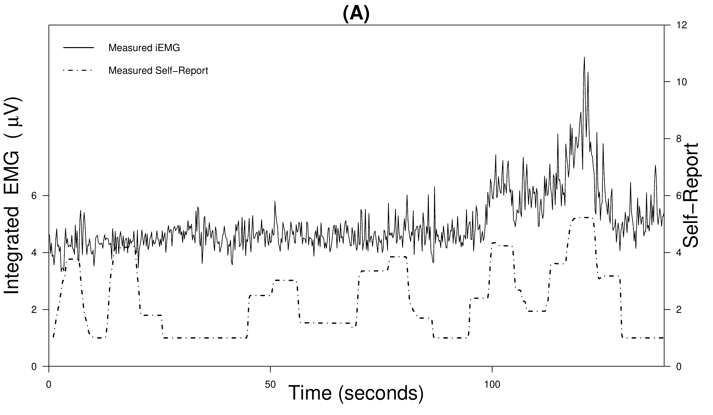
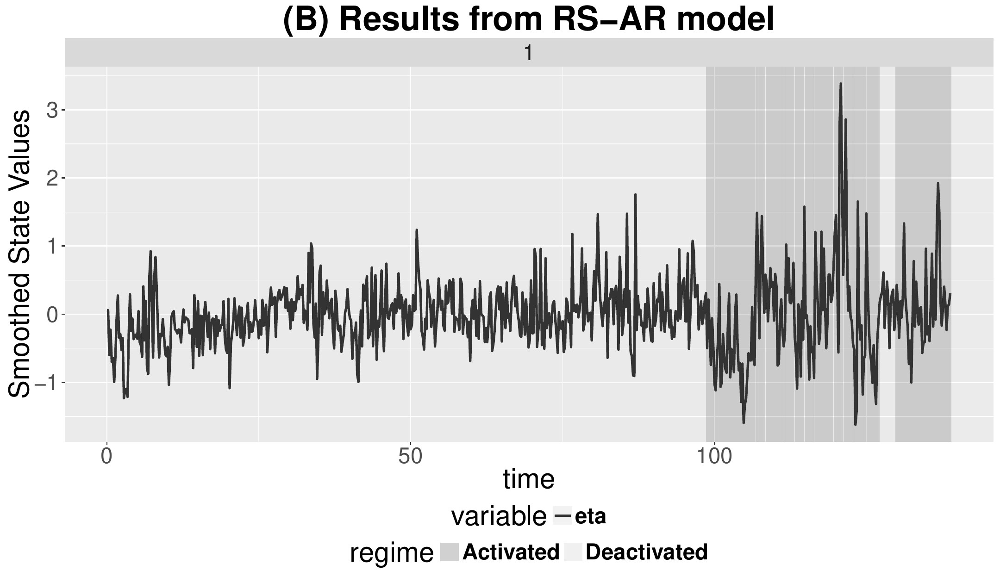
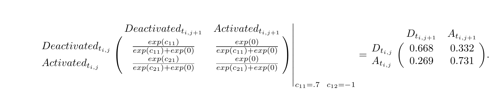
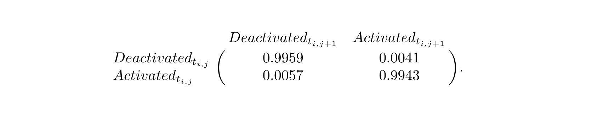
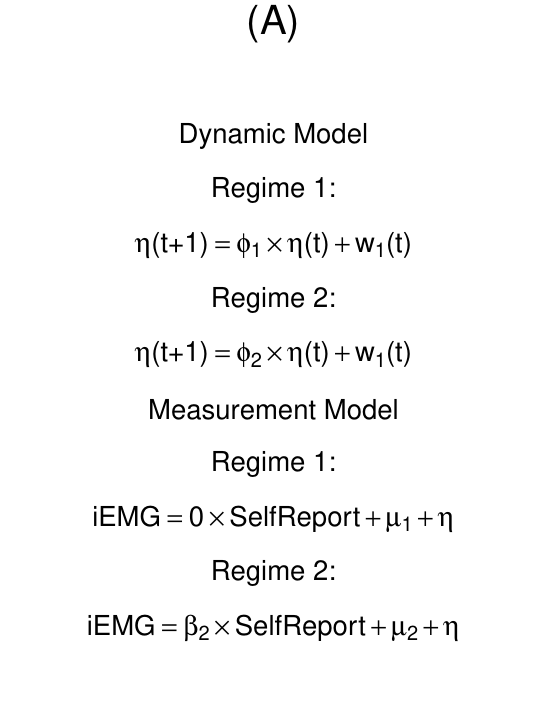
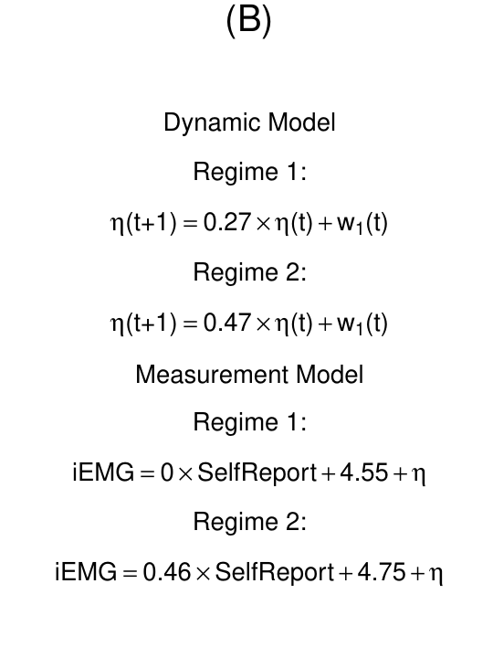
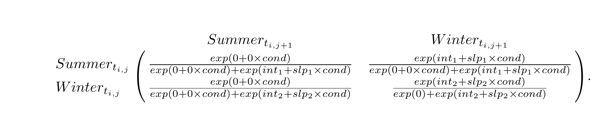

# Introduction

The past several decades have seen a significant rise in the prevalence
of intensive longitudinal data (ILD), particularly in the social and
behavioral sciences [@Bolger2013; @Byrom10a; @Stone07a]. Differential
equation and difference equation models in the form of state-space
models have been one of the most dominant tools for representing the
dynamics of ILD in disciplines such as the physical sciences,
econometrics, engineering, and ecology. In parallel, some computational
advances have been proposed in estimating *regime-switching* models ---
namely, models positing how otherwise continuous dynamic processes may
undergo discontinuous changes through categorical but unobserved phases
known as "regimes"
[@Kim99a; @Hamilton89a; @Muthen11a; @Chow13a; @Chow15a; @Dolan09a].
Throughout, we use the terms *regimes* and *classes* interchangeably to
denote unobserved unit- and time-specific indicator variables that serve
to group portions of repeated measures into phases with homogeneous
dynamics or measurement properties.

Examples of regime-switching phenomena from psychology includes Piaget's
([-@Piaget69a]) theory of human cognitive development and related
extensions [@Dolan04a; @vanderMaas92a; @Hosenfeld97a]; Kohlberg's
[@Kohlberg69a] conceptualization of stagewise development in moral
reasoning; Van Dijk and Van Geert's ([-@VanDijk07a]) findings on
discrete shifts in early language development; as well as Fukuda and
Ishihara's ([-@Fukuda97a]) work on the discontinuous changes in infant
sleep and wakefulness rhythm during the first six months of life.
Related to, but distinct from, hidden Markov models
[@Elliott95a; @Visser07a], regime-switching differential and difference
equation models allow researchers to specify targeted differential or
difference functions to describe the continuous changes that occur
within regimes. Ample work exists on fitting these models
[@Hamilton89a; @Dolan09a; @Yang10a; @Chow13a; @Chow13b; @Chow15a; @Muthen11a; @Tong80a; @Tiao94a],
but readily accessible software suited for handling such models with ILD
are lacking.

Several programs and packages exist for fitting differential equation,
difference equation, and hidden Markov models. However, each program has
certain limitations that
[*dynr*](https://CRAN.R-project.org/package=dynr) [@dynrauto] aims to
overcome. Speaking broadly, the largest differences between *dynr* and
other packages are threefold: (1) *dynr* readily allows for multi-unit
models, (2) *dynr* allows for nonlinear discrete-time and
continuous-time dynamics, and (3) *dynr* allows for regime switching
throughout every part of the model. Many R packages exist for univariate
and multivariate time series. CRAN lists hundreds of packages in its
task view for [*TimeSeries*](https://CRAN.R-project.org/view=TimeSeries)
[@cranTsTaskView], a complete review of which is well-beyond the scope
of this work. However, generally these packages lack facilities for
fitting time series from multiple units. Likewise there are very few
software utilities designed for nonlinear dynamics or regime switching
(see Table [1](#tab:big) for an overview). [@statespaceR] reviewed three
packages for linear state-space models:
[*dlm*](https://CRAN.R-project.org/package=dlm) [@dynmodR; @dlmauto],
[*KFAS*](https://CRAN.R-project.org/package=KFAS)
[@KFASarticle; @KFASauto], and
[*dse*](https://CRAN.R-project.org/package=dse) [@dse; @dseauto]. These
are among the state of the art for state-space modeling in R. Although
*KFAS* can accommodate in its measurement model all densities within the
exponential family, the corresponding dynamic model is required to be
linear. In addition to these R packages, the
[*OpenMx*](https://CRAN.R-project.org/package=OpenMx) 2.0 release
[@OpenMx2Cite; @OpenMxauto] has maximum likelihood time-varying linear
discrete- and continuous-time state-space modeling [@Hunter2017].
Likewise, the MKFM6 program [@mkfm6] implements methods of [@Harvey1989]
for time-invariant linear state-space models. SsfPack [@ssfpack22]
implements the methods of [@Durbin01a] for linear state-space modeling
and Markov chain Monte Carlo methods for nonlinear modeling, but it is
primarily restricted to single-unit time series without regime
switching. The [*ctsem*](https://CRAN.R-project.org/package=ctsem)
package [@Driver2017; @ctsemauto] has utilities for linear state-space
modeling of multiple units in continuous time, but lacks functionality
for nonlinear models or regime switching. MATLAB [@MATLAB:2016b] has
numerous extensions for time series and state-space modeling
[@matlabKF08], but lacks the ability to include regime switching and
multiple units. Some R packages that handle regime switching are only
designed for hidden Markov models, for example,
[*depmixS4*](https://CRAN.R-project.org/package=depmixS4)
[@depmixS4auto; @depmixS4] and
[*RHmm*](https://CRAN.R-project.org/package=RHmm) [@RHmmauto], while the
others are only for specific Markov-switching discrete-time time-series
models, including [*MSwM*](https://CRAN.R-project.org/package=MSwM)
[@MSwMauto] for univariate autoregressive models,
[*MSBVAR*](https://CRAN.R-project.org/package=MSBVAR) [@MSBVARauto] for
vector autoregressive models, and
[*MSGARCH*](https://CRAN.R-project.org/package=MSGARCH) [@MSGARCHauto]
for generalized autoregressive conditional heteroskedasticity models.
The [*pomp*](https://CRAN.R-project.org/package=pomp) package
[@pomp; @pompauto] lists among its features hidden Markov models and
state-space models, both of which can be discrete- or continuous-time,
non-Gaussian, and nonlinear. However, *pomp* does not currently support
regime-switching functionality beyond the regime switching found in
hidden Markov modeling. [@KFASarticle] included a review of numerous
other packages for non-Gaussian time series models which generally do
not involve latent variables.

Overall, developments in fitting differential/difference equation models
that evidence discontinuities in dynamics are still nascent. Despite
some of the above-mentioned advances in computational algorithms, there
is currently no readily available software package that allows
researchers to fit differential/difference equations with
regime-switching properties. As stated previously, currently available
computational programs for dynamic modeling are limited in one of
several ways: (1) they are restricted to handling only linear models
within regimes such as the package *OpenMx*, (2) they can only handle
very specific forms of nonlinear relations among latent variables, (3)
they are computationally slow, (4) they do not allow for stochastic
qualitative shifts in the dynamics over time, or (5) they require that
the user write complex compiled code to enhance computational speed at
the cost of high user burden. Efficient and user-friendly computer
software needs to be developed to overcome these restrictions so the
estimation of dynamic models can become more applicable by researchers.

We present an R package, *dynr*, that allows users to fit both linear
and nonlinear differential and difference equation models with
regime-switching properties. All computations are performed quickly and
efficiently in C, but are tied to a user interface in the familiar R
language. Specifically, for a very broad class of linear and nonlinear
differential/difference equation models with linear Gaussian measurement
functions, *dynr* provides R helper functions that write appropriate C
code based on user input in R into a local (potentially temporary) C
file, which is then compiled on user's end with a call to an R function
in *dynr*. The C function pointers are passed to the back-end for
computation of a negative log-likelihood function, which is numerically
optimized also in C using the optimization routine SLSQP
[@SLSQP1; @SLSQP2] for parameter estimation. During the process, the
user never has to write or even see the C code that underlies *dynr* and
yet, the computations are performed entirely in C, with no interchanges
between R and C to reduce memory copying and optimize speed. This
removes some of the barriers to dynamic modeling, opening it as a
possibility to a broader class of users, while retaining the flexibility
of specifying targeted model-specific functions in C for users wishing
to pursue models that are not yet supported in the R interface.

In the remaining sections, we will first present the mathematical and
computational bases of the *dynr* R package, and then demonstrate the
interface of *dynr* for modeling multivariate observations with Gaussian
measurement errors using two ILD modeling examples from the social and
behavioral sciences. Key features of the *dynr* package we seek to
highlight include: (1) *dynr* fits discrete- and continuous-time dynamic
models to multivariate longitudinal/time-series data; (2) *dynr* deals
with dynamic models with regime-switching properties; (3) for improved
speed, *dynr* computes and optimizes negative log-likelihood function
values in C; (4) *dynr* handles linear and nonlinear dynamic models with
an easy-to-use interface that includes a matrix form (for linear dynamic
models only) and formula form (for linear as well as nonlinear models);
(5) *dynr* removes the burden on the user to perform analytic
differentiation in fitting nonlinear differential/difference equation
models by providing the user with R's symbolic differentiation; and (6)
*dynr* provides ready-to-present results through LaTeX equations and
plots.

# General modeling framework

At a basic level, our general modeling framework comprises a dynamic
model and a measurement model. The former describes the ways in which
the latent variables change over time, whereas the latter portrays the
relationships between the observed variables and latent variables at a
specific time.

The dynamic model for a particular regime in continuous-time assumes the
following form:
$$d \boldsymbol{\eta}_i (t) = \boldsymbol{f}_{S_i(t)}\left(\boldsymbol{\eta}_i(t), t, \boldsymbol{x}_i(t) \right)dt + d\boldsymbol{w}_i(t),\label{RS-SDE}   
(\#eq:RS-SDE)$$
where $i$ indexes the smallest independent unit of analysis, $t$ indexes
time, $\boldsymbol{\eta}_i(t)$ is the $r\times 1$ vector of latent
variables at time $t$, $\boldsymbol{x}_i(t)$ is the vector of covariates
at time $t$, and $\boldsymbol{f}_{S_i(t)}(.)$ is the vector of (possibly
nonlinear) dynamic functions which depend on the latent regime
indicator, $S_i(t)$. The left-hand side of Equation \@ref(eq:RS-SDE),
$d \boldsymbol{\eta}_i (t)$, gives the differential of the vector of
continuous latent variables, $\boldsymbol{\eta}_i(t)$, and
$\boldsymbol{f}_{S_i(t)}(.)$ is called the *drift* function. Added to
these deterministic changes induced by the drift function is
$\boldsymbol{w}_i(t)$, an $r$-dimensional Wiener process. The
differentials of the Wiener processes have zero means and covariance
matrix, ${\bf Q}_{S_i(t)}$, called the *diffusion* matrix. When the
dynamic model consists only of linear functions, Equation
\@ref(eq:RS-SDE) reduces to:
$$d \boldsymbol{\eta_i} (t) = \left( \boldsymbol{\alpha}_{S_i(t)} + \boldsymbol{F}_{S_i(t)} \boldsymbol{\eta_i} (t) + \boldsymbol{B}_{S_i(t)} \boldsymbol{x}_i(t) \right) dt + d \boldsymbol{w}_i(t).\label{eq:linDynC}  
(\#eq:linDynC)$$
where the general function $\boldsymbol{f}_{S_i(t)}()$ is replaced with
a linear function consisting of (1) an intercept term
$\boldsymbol{\alpha}_{S_i(t)}$, (2) linear dynamics in a matrix
$\boldsymbol{F}_{S_i(t)}$, and (3) linear covariate regression effects
$\boldsymbol{B}_{S_i(t)}$.

For discrete-time processes, we adopt a dynamic model in state-space
form [@Durbin01a] as
$$\boldsymbol{\eta_i} (t_{i,j+1}) = \boldsymbol{f}_{S_i(t_{i,j})}\left(\boldsymbol{\eta_i} (t_{i,j}), t_{i,j}, \boldsymbol{x}_i(t_{i,j+1}) \right) + \boldsymbol{w}_i(t_{i,j+1}),\label{RS-dyn}   
(\#eq:RS-dyn)$$
now postulated to unfold at discrete time points indexed by sequential
positive integers, $t_{i,j}$, $j = 1, 2, \cdots$. In this case,
$\boldsymbol{w}_i(t_{i,j})$ denotes a vector of Gaussian distributed
process noise with covariance matrix, ${\bf Q}_{S_i(t_{i,j})}$. We have
intentionally kept notation similar between discrete- and
continuous-time models to facilitate their linkage. *dynr* allows for an
easy transition between these two frameworks with a binary flag. In a
similar vein, we refer to $\boldsymbol{f}_{S_i(t)}(.)$ in both Equations
\@ref(eq:RS-SDE) and \@ref(eq:RS-dyn) broadly as the *dynamic
functions*. The same structure as Equation \@ref(eq:linDynC) is possible
in discrete time as the linear analog of Equation \@ref(eq:RS-dyn),
$$\boldsymbol{\eta_i} (t_{i,j+1}) = \boldsymbol{\alpha}_{S_i(t_{i,j})} + \boldsymbol{F}_{S_i(t_{i,j})} \boldsymbol{\eta_i} (t_{i,j}) + \boldsymbol{B}_{S_i(t_{i,j})} \boldsymbol{x}_i(t_{i,j+1}) + \boldsymbol{w}_i(t_{i,j+1}).\label{eq:linDyn}   
(\#eq:linDyn)$$

In both the discrete- and continuous-time cases, the initial conditions
for the dynamic functions are defined explicitly to be the latent
variables at a unit-specific first observed time point, $t_{i,1}$,
denoted as $\boldsymbol{\eta}_i(t_{i,1})$, and are specified to be
normally distributed with means $\boldsymbol{\mu_{\eta_1}}$ and
covariance matrix, $\boldsymbol{\Sigma_{\eta_1}}$:
$$\boldsymbol{\eta}_i(t_{i,1})\sim N\left(\boldsymbol{\mu_{\eta_1}}, \boldsymbol{\Sigma_{\eta_1}}\right). \label{initial}  
(\#eq:initial)$$

Likewise for both discrete- and continuous-time models, we assume that
observations only occur at selected, discrete time points. Thus, we have
a discrete-time measurement model in which
$\boldsymbol{\eta}_i(t_{i,j})$ at discrete time point $t_{i,j}$ is
indicated by a $p$ $\times$ 1 vector of manifest observations,
$\boldsymbol{y}_i(t_{i,j})$. Continuous-time processes allow unequal
time intervals for these observations. Missing data may be present under
either specification. The vector of manifest observations is linked to
the latent variables as
$$\boldsymbol{y}_i(t_{i,j})=\mathbf{\tau}_{S_i(t_{i,j})}+ {\mathbf{\Lambda}}_{S_i(t_{i,j})} \boldsymbol{\eta}_i(t_{i,j})+ \boldsymbol{\mathrm{A}}_{S_i(t_{i,j})} \boldsymbol{x}_i(t_{i,j}) + \boldsymbol{\epsilon}_i(t_{i,j}),
\text{\hskip .1in} {\mathbf{\epsilon}}_i(t_{i,j})
\sim N\left(\mathbf{0},
{\bf R}_{S_i(t_{i,j})}\right), \label{SSMeaSt}   
(\#eq:SSMeaSt)$$
where $\mathbf{\tau}_{S_i(t_{i,j})}$ is a $p \times 1$ vector of
intercepts, $\boldsymbol{\mathrm{A}}_{S_i(t_{i,j})}$ is a matrix of
regression weights for the covariates,
${\mathbf{\Lambda}}_{S_i(t_{i,j})}$ is a $p \times r$ factor loadings
matrix that links the observed variables to the latent variables, and
${\mathbf{\epsilon}}_i(t_{i,j})$ is a $p \times 1$ vector of measurement
errors assumed to be serially uncorrelated over time and normally
distributed with zero means and covariance matrix,
${\bf R}_{S_i(t_{i,j})}$. Of course, all parts of the measurement model
may be regime-dependent.

The subscript $S_i(t)$ in Equations \@ref(eq:RS-SDE)--\@ref(eq:SSMeaSt)
indicates that these functions and matrices may depend on $S_i(t)$, the
operating regime. To make inferences on $S_i(t_{i,j})$, we initialize
the categorical latent variable $S_i(t_{i,j})$ on the first occasion and
then provide a model for how $S_i(t_{i,j})$ changes over time. The
initial regime probabilities for $S_i(t_{i,1})$ are represented using a
multinomial regression model as
$$\Pr\big(S_i(t_{i,1}) = m |\boldsymbol{x}_i(t_{i,1})\big) \stackrel{\Delta}{=}\pi_{m,i1} = \frac{\exp(a_{m} + {\bf b}^T_{m}\boldsymbol{x}_i(t_{i,1}))}{\sum_{k=1}^{M} \exp(a_{k} +{\bf b}^T_{k} \boldsymbol{x}_i(t_{i,1}))}, \label{MultinomialReg0}  
(\#eq:MultinomialReg0)$$
where $M$ denotes the total number of regimes, $a_{m}$ is the logit
intercept for the $m$th regime and ${\bf b}_{m}$ is a $n_b \times 1$
vector of regression slopes linked to a vector of covariates that
explain between-unit differences in initial log-odds (LO). For
identification, $a_{m}$ and all entries in ${\bf b}_{m}$ are set to zero
for some regime, $m$.

We use a first-order Markov process to define how the classes change
over time in a transition probability matrix, which contains all
possible transitions from one regime to another. In the matrix, the rows
index the previous regime at time $t_{i,j-1}$ and the columns index the
current regime at time $t_{i,j}$. The rows of this matrix sum to 1
because the probability of transitioning from a particular state to any
other state must be 1. This transition matrix may also depend on
covariates. Thus, a multinomial logistic regression equation is assumed
to govern the probabilities of transitions between regimes as:
$$\Pr\big(S_i(t_{i,j})= m | S_i(t_{i,j-1})=l, \boldsymbol{x}_i(t_{i,j})\big) \stackrel{\Delta}{=}\pi_{lm,it} = \frac{\exp(c_{lm} +{\bf d}^T_{lm}\boldsymbol{x}_i(t_{i,j})}{\sum_{k
=1}^{M} \exp(c_{lk} +{\bf d}^T_{lk}\boldsymbol{x}_i(t_{i,j}))}, \label{MultinomialRegNoDev}   (\#eq:MultinomialRegNoDev)$$
where $\pi_{lm,it}$ denotes unit $i$'s probability of transitioning from
class $l$ at time $t_{i,j-1}$ to class $m$ at time $t_{i,j}$, $c_{lm}$
denotes the logit intercept for the transition probability, and
${\bf d}_{lm}$ is a $n_d\times 1$ vector of logit slopes summarizing the
effects of the covariates in $\boldsymbol{x}_i(t_{i,j})$ on that
transition probability. One regime, again, has to be specified as the
reference regime by fixing all LO parameters, including $c_{lm}$ and all
elements in ${\bf d}^T_{lm}$ for some regime $m$, to zero for
identification purposes.

To summarize, the model depicted in Equations \@ref(eq:RS-SDE) --
\@ref(eq:MultinomialRegNoDev) may take on the form of various linear or
nonlinear dynamic models in continuous or discrete time. Moreover, these
dynamic models may have regime-switching properties. Systematic
between-unit differences stem primarily from changes in the unit- and
time-specific regime, $S_i(t_{i,j})$, and the corresponding changes in
the dynamic and measurement models over units and occasions.

# Estimation procedures

In this section, we outline the procedures implemented in *dynr* for
estimating the model shown in Equations \@ref(eq:RS-SDE) --
\@ref(eq:MultinomialRegNoDev). An overview of the estimation procedures
involved, the different special cases handled by *dynr*, and the
software packages that can handle these special cases are summarized in
Table [1](#tab:big).

## Discrete-time models

Broadly speaking, the estimation procedures implemented in *dynr* are
based on the Kalman filter [KF; @Kalman60a], its various continuous-time
and nonlinear extensions, and the Kim filter
[@Anderson79a; @Bar-Shalom01a; @Kim99a; @Yang10a; @Chow13b; @Kulikov2014; @Kulikova2014; @Chow2018].
The Kim filter, designed to extend the Kalman filter to handle
regime-switching state-space models, was proposed by @Kim99a and
extended by @Chow13b to allow for nonlinear dynamic functions. In
*dynr*, models are allowed to (1) be in discrete or continuous time, (2)
be single regime or regime switching, (3) have linear or nonlinear
dynamics, (4) involve stochastic or deterministic dynamics, and (5) have
one or more units. All combinations of these variations are possible in
*dynr*, creating 32 different kinds of models.

In the case of linear discrete-time dynamics without regime-switching,
the model reduces to a linear state-space model, and we apply the Kalman
filter to estimate the latent variable values and obtain other
by-products for parameter optimization. At each time point, the KF
consists of two steps. In the first step, the dynamics are used to make
a prediction for the latent state at the next time point conditional on
the observed measurements up to time $t_{i,j-1}$, creating a predicted
mean
$\hat{\boldsymbol{\eta}}_i(t_{i,j}|t_{i,j-1})= E(\boldsymbol{\eta}_i (t_{i,j})|{\boldsymbol{\mathrm{Y}}}_i(t_{i,j-1}))$
and covariance matrix for the latent state
${\boldsymbol{\mathrm{P}}}_i(t_{i,j}|t_{i,j-1})$ $=$
$Cov[\boldsymbol{\eta}_i (t_{i,j})| {\boldsymbol{\mathrm{Y}}}_i(t_{i,j-1})]$,
where ${\boldsymbol{\mathrm{Y}}}_i(t_{i,j-1})$ includes manifest
observations from time $t_{i,1}$ up to time $t_{i,j-1}$. In the second
step, the prediction is updated based on the measurement model (Equation
\@ref(eq:SSMeaSt)) and the new measurements, yielding
$\hat{\boldsymbol{\eta}}_i(t_{i,j}|t_{i,j})=E(\boldsymbol{\eta}_i (t_{i,j})|{\boldsymbol{\mathrm{Y}}}_i(t_{i,j}))$
and associated covariance matrix,
${\boldsymbol{\mathrm{P}}}_i(t_{i,j}|t_{i,j})$ $=$
$Cov[\boldsymbol{\eta}_{it} | {\boldsymbol{\mathrm{Y}}}_i(t_{i,j})]$.
Assuming that the measurement and process noise components are normally
distributed and that the measurement equation is linear, as in Equation
\@ref(eq:SSMeaSt), the prediction errors,
${\boldsymbol{\mathrm{Y}}}_i(t_{i,j})- E({\boldsymbol{\mathrm{Y}}}_i(t_{i,j})|{\boldsymbol{\mathrm{Y}}}_i(t_{i,j}))$,
are multivariate normally distributed. Thus, these by-products of the KF
can be used to construct a log-likelihood function known as the
*prediction error decomposition* function
[@likstate; @Harvey1989; @Hamilton94a; @Chow10a]. This log-likelihood
function is optimized to yield maximum-likelihood (ML) estimates of all
the time-invariant parameters, as well as to construct information
criterion (IC) measures [@Chow13b; @Harvey1989] such as the Akaike
Information Criterion [AIC; @Akaike73b] and Bayesian Information
Criterion [BIC; @Schwarz78a]. Standard errors of the parameter estimates
are obtained by taking the square root of the diagonal elements of the
inverse of the negative numerical Hessian matrix of the prediction error
decomposition function at the point of convergence.

At convergence, other products from the linear KF include updated latent
states, $\hat{\boldsymbol{\eta}}_i(t_{i,j}|t_{i,j})$, and the updated
latent covariance matrices,
${\boldsymbol{\mathrm{P}}}_i(t_{i,j}|t_{i,j})$. In the social and
behavioral sciences, the entire time series of observations has often
been collected prior to model fitting. In such cases, we use the fixed
interval smoother [@Anderson79a; @Ansley85a] to refine the latent
variable estimates, yielding the smoothed latent variable estimates,
$\hat{\boldsymbol{\eta}}_i(t_{i,j}|T_{i})=E(\boldsymbol{\eta}_i (t_{i,j})|{\boldsymbol{\mathrm{Y}}}_i(T_{i}))$,
and associated covariance matrices,
${\boldsymbol{\mathrm{P}}}_i(t_{i,j}|T_{i})$.

When the dynamic model takes on the form of a nonlinear state-space
model with differentiable dynamic functions, the linear KF is replaced
with the extended Kalman filter [EKF; @Anderson79a; @Bar-Shalom01a] so
that the nonlinear dynamic functions are "linearized" or approximated by
the first-order Taylor series. Then, a log-likelihood function can be
constructed in similar form to the linear state-space prediction error
decomposition. However, the corresponding parameter estimates are only
"approximate" ML estimates due to the truncation errors in the EKF. The
feasibility of this approach has been demonstrated by @Chow07a.

When a linear state-space model is used as the dynamic model but it is
characterized by regime-switching properties, *dynr* uses an extension
of the KF, known as the Kim filter, and the related Kim smoother
[@Kim99a; @Yang10a]. The Kim filter combines the KF, the Hamilton filter
[@Hamilton89a] that yields filtered state probabilities, and a
collapsing procedure to avoid the need to store $M^2$ new values of
$\hat{\boldsymbol{\eta}}_i(t_{i,j}|t_{i,j})^{l,m}$
$\stackrel{\Delta}{=}$
$\mathbb{E}[\boldsymbol{\eta}_i (t_{i,j})| S_i(t_{i,j-1})= l, S_i(t_{i,j})= m, {\boldsymbol{\mathrm{Y}}}_i(t_{i,j})]$,
as well as ${\boldsymbol{\mathrm{P}}}_i(t_{i,j}|t_{i,j})^{l,m}$
$\stackrel{\Delta}{=}$
$\mathop{\mathrm{Cov}}[\boldsymbol{\eta}_i (t_{i,j})| S_i(t_{i,j-1})= l, S_i(t_{i,j})= m, {\boldsymbol{\mathrm{Y}}}_i(t_{i,j})]$
with each additional time point. The collapsing procedure averages the
estimates over the previous regime $l$ so only the marginal estimates,
$\hat{\boldsymbol{\eta}}_i(t_{i,j}|t_{i,j})^m = E[\boldsymbol{\eta}_i (t_{i,j})| S_i(t_{i,j})=m, {\boldsymbol{\mathrm{Y}}}_i(t_{i,j})]$),
and the associated covariance matrix,
${\boldsymbol{\mathrm{P}}}_i(t_{i,j}|t_{i,j})^m$, need to be stored at
each time step. To handle cases in which nonlinearities are present in
Equation \@ref(eq:RS-dyn), a method proposed by @Chow13b, called the
extended Kim filter, is used for estimation instead. The extended Kim
filter replaces the KF portion of the Kim filter with the EKF.

## Continuous-time models

Finally, when the dynamics are in continuous time---whether composed of
linear or nonlinear dynamic functions---the resultant estimation
procedures are the continuous-discrete extended Kalman filter [CDEKF;
@Bar-Shalom01a; @Kulikov2014; @Kulikova2014]. The CDEKF handles a
single-regime special case of the general model shown in Equations
\@ref(eq:RS-SDE)--\@ref(eq:SSMeaSt).

For continuous processes in the form of Equation \@ref(eq:RS-SDE), let
$\hat{\boldsymbol{\eta}}_i(t) = E(\boldsymbol{\eta}_i(t)|{\boldsymbol{\mathrm{Y}}}_i(t_{i,j-1}))$
and
${\boldsymbol{\mathrm{P}}}_i(t)=Cov[\boldsymbol{\eta}_i(t)|{\boldsymbol{\mathrm{Y}}}_i(t_{i,j-1})]$
denote the mean and covariance matrix of the latent variables,
respectively, at time $t$ in the interval $[t_{i,j-1},t_{i,j}]$. In the
CDEKF framework, the prediction step of the KF is replaced by solving a
set of ordinary differential equations (ODEs) at time $t_{i,j}$, given
the initial conditions at time $t_{i,j-1}$:
$\hat{\boldsymbol{\eta}}_i(t_{i,j-1})=\hat{\boldsymbol{\eta}}_i(t_{i,j-1}|t_{i,j-1})$
and
${\boldsymbol{\mathrm{P}}}_i(t_{i,j-1})={\boldsymbol{\mathrm{P}}}_i(t_{i,j-1}|t_{i,j-1})$.
This set of ODEs is obtained by only retaining the first term,
$\boldsymbol{f}_{S_i(t)}\left(\hat{\boldsymbol{\eta}}_i(t), t, \boldsymbol{x}_i(t) \right)$,
in the Taylor series expansion of
$\boldsymbol{f}_{S_i(t)}\left(\boldsymbol{\eta}_i(t), t, \boldsymbol{x}_i(t) \right)$
around the expectation $\hat{\boldsymbol{\eta}}_i(t)$, and is shown
below:
$$\begin{aligned}
\frac{d\hat{\boldsymbol{\eta}}_i(t) }{dt} &= \boldsymbol{f}_{S_i(t)}\left(\hat{\boldsymbol{\eta}}_i(t), t, \boldsymbol{x}_i(t) \right),\label{deta}\\
\end{aligned}   (\#eq:deta)$$

$$\begin{aligned}
\frac{d{\boldsymbol{\mathrm{P}}}_i(t)}{dt}&=\frac{\partial\boldsymbol{f}_{S_i(t)}\left(\hat{\boldsymbol{\eta}}_i(t), t, \boldsymbol{x}_i(t) \right)}{\partial\hat{\boldsymbol{\eta}}_i(t)}{\boldsymbol{\mathrm{P}}}(t)+{\boldsymbol{\mathrm{P}}}(t)\left(\frac{\partial\boldsymbol{f}_{S_i(t)}\left(\hat{\boldsymbol{\eta}}_i(t), t, \boldsymbol{x}_i(t) \right)}{\partial\hat{\boldsymbol{\eta}}_i(t)}\right)^{\top} + {\bf Q}_{S_i(t)},\label{dP}
\end{aligned}   (\#eq:dP)$$
where
$\frac{\partial\boldsymbol{f}_{S_i(t)}\left(\hat{\boldsymbol{\eta}}_i(t), t, \boldsymbol{x}_i(t) \right)}{\partial\hat{\boldsymbol{\eta}}_i(t)}$
is the Jacobian matrix of
$\boldsymbol{f}_{S_i(t)}\left(\hat{\boldsymbol{\eta}}_i(t), t, \boldsymbol{x}_i(t) \right)$
with respect to $\hat{\boldsymbol{\eta}}_i(t)$ at time $t$. Kulikov and
Kulikova ([-@Kulikov2014], @Kulikova2014) suggested solving for
equations \@ref(eq:deta) and \@ref(eq:dP) using adaptive ODE solvers. We
adopt an approximate numerical solution --- the fourth-order Runge-Kutta
[@Press02a] method --- to solve Equations \@ref(eq:deta) and
\@ref(eq:dP). In cases where the hypothesized continuous-time dynamics
are linear, explicit analytic solutions exist and there is no need to
use numerical solvers. However, in our simulation work, estimating known
special cases of linear stochastic differential equation models using
numerical solvers yielded both comparable estimates and computational
time to estimating the same models using their known solutions. Thus,
for generality, we utilize numerical solvers in solving both linear and
nonlinear differential equations in *dynr*.

As in the case involving nonlinear discrete-time dynamic models,
parameter estimates obtained from optimizing the log-likelihood function
constructed from by-products of the CDEKF are also approximate ML
estimates; however, the approximations now stem both from the truncation
errors from the first-order Taylor series in the CDEKF, as well as the
numerical solution of Equations \@ref(eq:deta) and \@ref(eq:dP).

In cases involving regime-switching ordinary or stochastic differential
equations, the algorithms for estimating regime-switching
continuous-time models are essentially estimation procedures that
combine the CDEKF and part of the Kim filter designed to handle
estimation of the regime-switching portion of the model. The resultant
procedure, referred to herein as *continuous-discrete extended Kim
filter*, is summarized in @Chow2018.

::: {#tab:big}
  ---------------------------------------------------------------------------------------------------------------------------------
                                                                         Discrete-time                              Continuous-time
  ----------------- ----------- ------------------------------------------------------ --------------------------------------------
      Single-regime      Linear         [Linear state-space model]{style="color: red"}         [Linear SDE/ODE]{style="color: red"}

                                                                      [KF]{.underline}                          [CDEKF]{.underline}

                                       *dynr*, *OpenMx*, *pomp*, *KFAS*, *dlm*, *dse*,           *dynr*, *pomp*, *OpenMx*, *ctsem*,

                                                                MKFM6, SsfPack, MATLAB                                       MATLAB

                                                                                       

                      Nonlinear      [Nonlinear state-space model]{style="color: red"}      [Nonlinear SDE/ODE]{style="color: red"}

                                                                     [EKF]{.underline}                          [CDEKF]{.underline}

                                                       *dynr*, *pomp*, SsfPack, MATLAB                       *dynr*, *pomp*, MATLAB

                                                                                       

    Multiple-regime      Linear             [RS state-space model]{style="color: red"}             [RS SDE/ODE]{style="color: red"}

                                                              [Kim filter]{.underline}                  [CD Kim filter]{.underline}

                                                                               *dynr*,                                  *dynr* only

                                                                    GAUSS code, MATLAB 

                                                                                       

                      Nonlinear   [RS nonlinear state-space model]{style="color: red"}   [RS nonlinear SDE/ODE]{style="color: red"}

                                                     [Extended Kim filter]{.underline}         [CD extended Kim filter]{.underline}

                                                                           *dynr* only                                  *dynr* only
  ---------------------------------------------------------------------------------------------------------------------------------

  : Table 1: Models, algorithms, and software for the framework of
  regime-switching (non)linear state space models in discrete- and
  continuous-time. SDE = Stochastic Differential Equation, ODE =
  Ordinary Differential Equation, CD = Continuous-Discrete, RS =
  Regime-Switching, KF = Kalman filter [@Kalman60a], EKF = Extended
  Kalman filter [@Anderson79a; @Bar-Shalom01a], Kim filter = KF +
  Hamilton filter + Collapsing procedure [@Kim99a]. Extended Kim filter
  was proposed by [@Chow13b]; the CD extended Kim filter is proposed by
  [@Chow2018].
:::

# Steps for preparing and "cooking" a model

The theme around the naming convention exploits the pronunciation of the
package name: *dynr* is pronounced the same as "dinner". Therefore, the
names of functions and methods are specifically designed to relate to
things done surrounding dinner, such as gathering ingredients such as
the data, preparing recipes, cooking, which involves combining
ingredients according to a "modeling" recipe and applies heat, and
serving the finished product.

The general procedure for using the *dynr* package can be summarized in
five steps. First, data are gathered and identified with the
`dynr.data()` function. Second, *recipes* are prepared. To each part of
a model there is a corresponding `prep.*()` recipe function. Each of
these functions creates an object of class `"dynrRecipe"`. Each
`prep.*()` function creates an object of class `"dynr*"` which is in
turn a subclass of `"dynrRecipe"`. These recipe functions include:

1.  The `prep.measurement()` function defines the measurement part of
    the model, that is, how latent variables and exogenous covariates
    map onto the observed variables.

2.  The `prep.matrixDynamics()` and `prep.formulaDynamics()` functions
    define the dynamics of the model with either a strictly linear,
    matrix interface or with a possibly nonlinear formula interface,
    respectively.

3.  The `prep.initial()` function defines the initial conditions of the
    model. The initial conditions are used by the recursive algorithms
    as the starting point for latent variable estimates. As such, the
    `prep.initial()` function describes the initial mean vector and
    covariance matrix of the latent variables, assumed to be
    multivariate normally distributed.

4.  The `prep.noise()` function defines the covariance structure for
    both the measurement (or observation) noise and the dynamic (or
    latent) noise.

5.  The `prep.regimes()` function provides the regime switching
    structure of the model. Single-regime models do not require a
    `"dynrRegimes"` object.

Once the data and recipes are prepared, the third step mixes the data
and recipes together into a model object of class `"dynrModel"` with the
`dynr.model()` function. Fourth, the model is cooked with `dynr.cook()`
to estimate the free parameters and standard errors. Fifth and finally,
results are served in summary tables using `summary()`, LaTeX  equations
using `printex()`, and plots of trajectories and equations using
`plot()`, `dynr.ggplot()`, `autoplot()`, and `plotFormula()`.

We will demonstrate the interface of *dynr* using two examples: (1) a
linear state-space example with regime-switching based on @Yang10a and
(2) a regime-switching extension of the predator-prey model
[@Lotka25a; @Volterra26a].

# Example 1: Regime-switching linear state-space model

Facial electromyography (EMG) has been used in the behavioral sciences
as one possible indicator of human emotions
[@Schwartz75a; @Cacioppo81a; @Cacioppo86a; @Dimberg00a]. A time series
of EMG data contains bursts of electrical activity that are typically
magnified when an individual is under emotion induction. @Yang10a
proposed using a regime-switching linear state-space model in which the
individual may transition between regimes with and without facial EMG
activation. As such, heterogeneities in the dynamic patterns and
variance of EMG data are also accounted for through the incorporation of
these latent regimes. Model fitting was previously performed at the
individual level. Data from the participant shown in Figure
[1](#EMGdata)(A) are made available as part of the demonstrative
examples in *dynr*. A complete modeling script for this example is
available as a demo in *dynr* and can be found by calling
`file.edit(system.file("demo", "RSLinearDiscreteYang.R", package = "dynr"))`,
and a full explanation is included as a package vignette called
`LinearDiscreteTimeModels`.

Here we present selected segments of code to showcase how a linear
state-space model with regime-switching can be specified in *dynr*. The
model of interest is the final model selected for this participant by
@Yang10a:
$$\begin{aligned}
&{y}_i(t_{i,j}) = \mu_{yS_i(t_{i,j})} + \beta_{S_i(t_{i,j})} \text{Self-report}(t_{i,j}) + \eta_i (t_{i,j}), \label{eq:emgMeas}\\
\end{aligned}   (\#eq:emgMeas)$$

$$\begin{aligned}
&\eta_i (t_{i,j+1}) = \phi_{S_i(t_{i,j})} \eta_i (t_{i,j}) + \zeta_i (t_{i,j+1}) , \label{eq:emgDyn}
\end{aligned}   (\#eq:emgDyn)$$
[]{#SSTranARMA label="SSTranARMA"}in which we allowed the intercept,
$\mu_{yS_i(t_{i,j})}$; the regression slope, $\beta_{S_i(t_{i,j})}$; and
the autoregression coefficient, $\phi_{S_i(t_{i,j})}$, to be
regime-dependent. By allowing $\phi_{S_i(t_{i,j})}$ to be
regime-specific, we indirectly allowed the total variance of the latent
component, $\eta_i (t_{i,j+1})$, to be heterogeneous across the
deactivation and activation stages, in spite of requiring the dynamic
noise variance, $E(\zeta_i(t)^2)$, to be constant across regimes.

<figure id="EMGdata">
<p></p>
<figcaption>Figure 1: (A) A plot of integrated electromyography (iEMG)
and self–report affect ratings for one participant with a time interval
of 0.2 seconds between two adjacent observations. Self–report =
self–report affect ratings; iEMG = integrated EMG signals. (B) An
automatic plot of the smoothed state estimates for the regime-switching
linear state-space model.</figcaption>
</figure>

The first step in *dynr* modeling is to structure the data. This is done
with the `dynr.data()` function.

``` r
require("dynr")
data("EMG")
EMGdata <- dynr.data(EMG, id = 'id', time = 'time',
  observed = 'iEMG', covariates = 'SelfReport')
```

The first argument of this function is either a `"ts"` class object of
single-unit time series or a `"data.frame"` object structured in a long
relational format with different measurement occasions from the same
unit appearing as different rows in the data frame. When a `"ts"` class
object is passed to `dynr.data()`, no other inputs are needed.
Otherwise, the `id` argument needs the name of the variable that
distinguishes units, allowing multiple replicated time series to be
analyzed together. The `time` argument needs the name of the variable
that indicates unit-specific measurement occasions. If a discrete-time
model is desired, the time variable should contain sequential positive
integers. If the measurement occasions for a unit are sequential but not
consecutive, `NA`s will be inserted automatically to create equally
spaced data. If a continuous-time model is being specified, the time
variable can contain unit-specific increasing sequences of irregularly
spaced real numbers. In this particular example, a discrete-time model
is used. The `observed` and `covariates` arguments are vectors of the
names of the observed variables and covariates in the data.

The next step in *dynr* modeling is to build the recipes for the various
parts of a model. The recipes are created with `prep.*()` functions.

The dynamic functions in Equations \@ref(eq:RS-SDE) and
\@ref(eq:RS-dyn), can be specified using either `prep.formulaDynamics()`
or `prep.matrixDynamics()`. In this example, the dynamics as in Equation
\@ref(eq:emgDyn) are linear and discrete-time, so we can describe the
dynamics in terms of Equation \@ref(eq:linDyn) as
$$\label{eq:ex1dyn}
\eta_i (t_{i,j+1}) = \underbrace{0}_{\boldsymbol{\alpha}_{S_i(t_{i,j})}} + \underbrace{\phi_{S_i(t_{i,j})}}_{\boldsymbol{F}_{S_i(t_{i,j})}} \eta_i (t_{i,j}) + \underbrace{0}_{\boldsymbol{B}_{S_i(t_{i,j})}} \boldsymbol{x}_i(t_{i,j}) + \underbrace{\zeta_i (t_{i,j+1})}_{\boldsymbol{w}_i(t_{i,j+1})}.   (\#eq:ex1dyn)$$
The `prep.matrixDynamics()` function allows the user to specify the
structures of the intercept vector $\boldsymbol{\alpha}_{S_i(t_{i,j})}$,
through `values.int` and `params.int`; the covariate regression matrix
$\boldsymbol{B}_{S_i(t_{i,j})}$, through `values.exo` and `params.exo`;
and the one-step-ahead transition matrix
$\boldsymbol{F}_{S_i(t_{i,j})}$, through `values.dyn` and `params.dyn`.
We illustrate this function below. The `values.dyn` argument gives a
list of matrices for the starting values of
$\boldsymbol{F}_{S_i(t_{i,j})}$. The `params.dyn` argument names the
free parameters. These are the $\phi_{S_t}$ in Equation
\@ref(eq:emgDyn). The `isContinuousTime` argument switches between
continuous-time modeling and discrete-time modeling. The arguments
corresponding to the intercepts (`values.int` and `params.int`) and the
covariate effects (`values.exo` and `params.exo`) are omitted to leave
these matrices as zeros.

``` r
recDyn <- prep.matrixDynamics(values.dyn = list(matrix(0.1, 1, 1), matrix(0.5, 1, 1)),
  params.dyn = list(matrix('phi_1', 1, 1), matrix('phi_2', 1, 1)),
  isContinuousTime = FALSE)
```

The noise recipe is created with `prep.noise()`. The noise recipe is
stored in the `recNoise` object, an abbreviation for "recipe noise". The
latent noise covariance matrix is a $1\times 1$ matrix with a free
parameter called `dynNoise`, short for "dynamic noise". The observed
noise covariance matrix is also a $1 \times 1$ matrix, but has the
measurement noise variance fixed to zero using the special keyword
`fixed`.

``` r
recNoise <- prep.noise(values.latent = matrix(1, 1, 1),
  params.latent = matrix('dynNoise', 1, 1),
  values.observed = matrix(0, 1, 1), params.observed = matrix('fixed', 1, 1))
```

The `prep.regimes()` function specifies the structure of the regime time
evolution shown in Equation \@ref(eq:MultinomialRegNoDev). In this
example, we do not have any covariates in the regime-switching (RS)
functions. The problem then reduces to the specification of a 2 $\times$
2 transition log-odds (LO) matrix. We provide starting values that imply
persisting in the same regime is more likely than transitioning to
another regime, and set the second regime LO to zero for identification,
making it the reference regime. The first column of the transition LO
matrix, is populated with the starting values of: (1) `c11` $= 0.7$,
corresponding to $exp(0.7)$ $=$ $2.01$ times greater LO of staying
within the Deactivated regime as transitioning to the Activated regime;
and (2) `c21` $=-1$, corresponding to $exp(-1)$ $=$ $0.37$ times lower
LO of transitioning to the Deactivated regime.

``` r
recReg <- prep.regimes(values = matrix(c(0.7, -1, 0, 0), 2, 2),
  params = matrix(c('c11', 'c21', 'fixed', 'fixed'), 2, 2))
```

In essence, the above code creates the following transition probability
matrix:

<figure id="eq:regParam">
 </figure>

In many situations it is useful to specify the structure of the
transition LO matrix in deviation form --- that is, to express the LO
intercepts in all but the reference regime as deviations from the LO
intercept in the reference regime. The package vignette illustrates this
by invoking the `deviation` argument of `prep.regimes()`.

After the recipes for all parts of the model are defined, the
`dynr.model()` function creates the model and stores it in the
`"dynrModel"` object. Each recipe object created by `prep.*()` and the
data prepared by `dynr.data()` are given to this function. The
`dynr.model()` function always requires `dynamics`, `measurement`,
`noise`, `initial`, and `data`. When there are multiple regimes, the
`regimes` argument should also be provided. When parameters are subject
to transformation functions, a `transform` argument can be added, which
will be discussed in the second example. The `dynr.model()` function
combines information from the recipes and data to write the text for a C
function. This text is written to a file optionally named by the
`outfile` argument, so that the user can inspect or modify the generated
C code. The default `outfile` is a temporary file returned by
`tempfile()`.

``` r
rsmod <- dynr.model(dynamics = recDyn, measurement = recMeas,
  noise = recNoise, initial = recIni, regimes = recReg,
  data = EMGdata, outfile = "RSLinearDiscreteYang.c")
yum <- dynr.cook(rsmod)
```

In the last line above, the model is "cooked" with the `dynr.cook()`
function to estimate the free parameters and their standard errors. When
cooking, the C code in the `outfile` is compiled and dynamically linked
to the rest of the compiled *dynr* code. If the C functions have
previously been compiled then the user can prevent re-compilation by
setting `compileLib = FALSE` in the `"dynrModel"` object given to
`dynr.cook()`. After compilation the C code is executed to optimize the
free parameters while calling the dynamically linked C functions that
were created from the user-specified recipes. In this way, *dynr*
provides an R interface for dynamical systems modeling while maintaining
much of the speed associated with C.

The final step associated with *dynr* modeling is serving results (a
`"dynrCook"` object) after the model has been cooked. To this end,
several standard, popular S3 methods are defined for the `"dynrCook"`
class, including `coef()`, `confint()`, `deviance()`, `logLik()`,
`AIC()`, `BIC()`, `names()`, `nobs()`, `summary()`, and `vcov()`. These
methods perform the same tasks as their counterparts for regression
models in R. Additionally, *dynr* provides a few other model-serving
functions illustrated here: `summary()`, `plot()`, `dynr.ggplot()` (or
`autoplot()`), `plotFormula()`, and `printex()`. The `summary()` method
provides a table of free parameter names, estimates, standard errors,
$t$-values, and Wald-type confidence intervals.

``` r
summary(yum)
```

``` r
Coefficients:
         Estimate Std. Error t value ci.lower ci.upper Pr(>|t|)
phi_1     0.26608    0.04953   5.372  0.16900  0.36315 5.33e-08 ***
phi_2     0.47395    0.04425  10.711  0.38722  0.56068  < 2e-16 ***
beta_2    0.46449    0.04394  10.571  0.37837  0.55061  < 2e-16 ***
mu_1      4.55354    0.02782 163.658  4.49901  4.60807  < 2e-16 ***
mu_2      4.74770    0.14250  33.318  4.46842  5.02699  < 2e-16 ***
dynNoise  0.20896    0.01129  18.504  0.18683  0.23110  < 2e-16 ***
c11       5.50199    0.70939   7.756  4.11160  6.89237  < 2e-16 ***
c21      -5.16170    1.00424  -5.140 -7.12998 -3.19342 1.79e-07 ***
---
Signif. codes:  0 '***' 0.001 '**' 0.01 '*' 0.05 '.' 0.1 ' ' 1

-2 log-likelihood value at convergence = 1002.52
AIC = 1018.52
BIC = 1054.87
```

These parameter estimates, standard errors, and likelihood values
closely mirror those reported in @Yang10a [p. 755-756]. In the
Deactivated regime, the autoregressive parameter (`phi_1`) and the
intercept (`mu_1`) are lower than those in the Activated regime. So,
neighboring EMG measurements are more closely related in the Activated
regime and the overall level is slightly higher. This matches very well
with the idea that the Activated regime consists of bursts of facial
muscular activities and an elevated emotional state. Similarly, the
effect of the self-reported emotional level is positive in the Activated
regime and fixed to zero in the Deactivated regime, as the freely
estimated value was close to zero with a nonsignificant $t$-value. So,
in the Deactivated regime the self-reported emotional level and the
facial muscular activity decouple. The dynamic noise parameter gives a
sense of the size of the intrinsic unmeasured disturbances that act on
the system. These forces perturb the system with a typical magnitude of
a little less than half a point on the EMG scale seen in Figure
[1](#EMGdata)(A). Lastly, the log-odds parameters (`c11` and `c21`) can
be turned into the transition probability matrix yielding

<figure id="text2">

</figure>

which implies that both the Deactivated and the Activated regimes are
strongly persistent with high self-transistion probabilities. Next we
consider some of the visualization options for serving a model.

The default `plot()` method is used to visualize the time series in a
collection of plots: (1) a plot of time series created by
`dynr.ggplot()` (or `autoplot()`), (2) a histogram of predicted regimes,
and (3) a plot of equations created by `plotFormula()`.

``` r
plot(yum, dynrModel = rsmod, style = 1, textsize = 5)
```

The `dynr.ggplot()` (or `autoplot()`) method creates a plot of the
smoothed state estimates with the predicted regimes. It needs the result
object and model object as inputs, and allows for plotting (1)
user-selected smoothed state variables by default or (2) user-selected
observed-versus-predicted values by setting `style = 2`. An illustrative
plot is created from the code below and shown in
Figure [1](#EMGdata)(B).

``` r
dynr.ggplot(yum, dynrModel = rsmod, style = 1,
  names.regime = c("Deactivated", "Activated"),
  title = "(B) Results from RS-AR model", numSubjDemo = 1,
  shape.values = 1, text = element_text(size = 24), is.bw = TRUE)
```

This shows that for the first 99 seconds the participant is in the
Deactivated regime, with their latent state $\eta_i (t_{i,j+1})$ varying
according to the lower autocorrelation model and having no relation to
the variation in the self-reported emotional data in Figure
[1](#EMGdata)(A). Then the participant switches to the Activated regime
and their latent state becomes more strongly autocorrelated and coupled
to the self-report data. There follows a brief period in the Deactivated
regime around time=130 seconds with a subsequent return to the Activated
regime for the remainder of the observation. Of course, note that Figure
[1](#EMGdata)(A) shows the observed EMG data whereas Figure
[1](#EMGdata)(B) shows the latent state which is related to the observed
data by Equation \@ref(eq:emgMeas).

The `plotFormula()` method can be used to display model equations on R
plots. Equations can be viewed in several ways with different inputs to
the `ParameterAs` argument: (1) with free parameter names, for example,
returned by `names(rsmod)`, as illustrated in
Figure [2](#plotformula)(A); (2) with parameter starting values; or (3)
after estimation with fitted parameter values, for example, returned by
`coef(yum)`, as in Figure [2](#plotformula)(B). The `plotFormula()`
method does not require the user to install LaTeX facilities and compile
LaTeX code in a separate step, and hence are convenient to use. To
maximize the readability of the equations, it is only shown here using
equations for the dynamic and measurement models, which can be obtained
by respectively setting the `printDyn` and `printMeas` arguments to
true.

``` r
plotFormula(dynrModel = rsmod, ParameterAs = names(rsmod),
  printDyn = TRUE, printMeas = TRUE) + ggtitle("(A)") +
  theme(plot.title = element_text(hjust = 0.5, vjust = 0.01, size = 16))

plotFormula(dynrModel = rsmod, ParameterAs = coef(yum),
  printDyn = TRUE, printMeas = TRUE) + ggtitle("(B)") +
  theme(plot.title = element_text(hjust = 0.5, vjust = 0.01, size = 16))
```

We can see that the equations in Figure [2](#plotformula)(A) are
precisely those from Equations \@ref(eq:emgMeas) and \@ref(eq:emgDyn)
which we used to define the model except that we have fixed $\beta_1$ to
zero. If these equations did not match, it may indicate that we made a
mistake in our model specification.

<figure id="plotformula">
<p></p>
<figcaption>Figure 2: Automatic plots of model equations with (A)
parameter names and (B) estimated parameters for the regime-switching
linear state-space model.</figcaption>
</figure>

Finally, for LaTeX users, the `printex()` method helps generate
equations for the model in LaTeX form.

``` r
printex(rsmod, ParameterAs = names(rsmod), printInit = TRUE, printRS = TRUE,
  outFile = "RSLinearDiscreteYang.tex")
```

The `ParameterAs` argument functions the same as that in the
`plotFormula()` method. Here we have specified to use the names of the
free parameters. In this case, the initial conditions and
regime-switching functions are included in the equations, as indicated
by the `printInit` and `printRS` arguments being set to `TRUE`. The
LaTeX code for the equations is written to `RSLinearDiscreteYang.tex`,
which the user can then work with and modify as they wish. Of course,
this function is designed more as a convenience feature for users who
already use LaTeX and requires all the LaTeX-related facilities on the
user's computer.

This example has used real EMG data from a previous study [@Yang10a] to
illustrate many parts of the user-interface for *dynr*. Of particular
note are the various "serving" functions which allow users to both
verify their model and examine their results in presentation-ready
formats. In the next example, we will use simulated data to further
illustrate features of *dynr*, especially the nonlinear formula
interface for dynamics.

# Example 2: Nonlinear continuous-time models

In the study of human dynamics many processes are characterized by
changes that are dependent on interactions with other processes
producing dynamics with nonlinearities. Nonlinear ordinary differential
equations have been used to model, among other phenomena, ovulatory
regulation [@Boker2014], circadian rhythms [@Brown99b], cerebral
development [@Thatcher98a], substance use [@Boker1998], cognitive aging
[@Chow04a], parent-child interactions [@Thomas76a], couple dynamics
[@Chow07a; @gottman2002], and sudden transitions in attitudes
[@vanderMaas03a].

## Single-regime nonlinear continuous-time model

In addition to the linear/matrix dynamics interface, *dynr* also
provides users with a formula interface to accommodate nonlinear as well
as linear dynamic functions. To illustrate the use of the formula
interface in *dynr*, we use a benchmark nonlinear ordinary differential
equation model, the predator-prey model
[@Lotka25a; @Volterra26a; @Hofbauer88a]. One can find the complete demo
scripts in *dynr*, using
`file.edit(system.file("demo", "NonlinearODE.R", package = "dynr"))` and
`file.edit(system.file("demo", "RSNonlinearODE.R", package = "dynr"))`,
and related explanation in the package vignette
`NonlinearContinuousTimeModels`.

The predator-prey model is a classic model for representing the
nonlinear dynamics of interacting populations. The most often cited
behavior of the predator-prey system while in a particular parameter
range is ongoing nonlinear oscillations in the predator and prey
populations with a phase lag between them. The utility of the
predator-prey model extends far beyond the area of population dynamics.
Direct applications or extensions of this predator-prey system include
the epidemic models of the onset of social activities (EMOSA) used to
study the spread of smoking, drinking, delinquency, and sexual behaviors
among adolescents [@EMOSA93; @EMOSA98]; the cognitive aging model
[@Chow04a]; and the model of couples' affect dynamics [@Chow07a].

Written as a differential equation, the predator-prey model is expressed
as:
$$\begin{aligned}
d( prey(t) ) &= \left( a ~prey(t) - b ~prey(t)~predator(t) \right) dt, \label{eq:prey} \\
\end{aligned}   (\#eq:prey)$$

$$\begin{aligned}
d( predator(t)) &= \left( -c ~predator(t) + d ~prey(t)~predator(t) \right) dt, \label{eq:pred}
\end{aligned}   (\#eq:pred)$$
where the parameters $a$, $b$, $c$, $d$ are all nonnegative. These
equations make up the continuous-time dynamics, Equation
\@ref(eq:RS-SDE), for this system. Examining the prey equation (Equation
\@ref(eq:prey)), the prey population would increase exponentially
without bound if there were zero predators. Similarly, examining the
predator equation (Equation \@ref(eq:pred)), if the prey population was
zero, then the predator population would decrease exponentially to zero.
For demonstration purposes, we have included with the *dynr* package a
set of simulated data generated with true parameter values:
$a = 2, b = 1, c = 4, d = 1, e = .25, f = 5$.

Using the formula interface in *dynr*, which supports all native
mathematical functions available in R, the predator-prey model can be
specified as:

``` r
preyFormula <- prey ~ a * prey - b * prey * predator
predFormula <- predator ~ - c * predator + d * prey * predator
ppFormula <- list(preyFormula, predFormula)
ppDynamics <- prep.formulaDynamics(formula = ppFormula,
  startval = c(a = 2.1, c = 0.8, b = 1.9, d = 1.1), isContinuousTime = TRUE)
```

The first argument of the `prep.formulaDynamics()` function is
`formula`. More specifically, this is a list of formulas. Each element
in the list is a single, univariate, formula that defines a differential
(if `isContinuousTime` $=$ TRUE) or difference (if `isContinuousTime`
$=$ FALSE) equation. There should be one formula for every latent
variable, in the order in which the latent variables are specified by
using the `state.names` argument in `prep.measurement()`. The left-hand
side of each formula is either the one-step-ahead projection or the
differential of the latent variable: namely, the left-hand side of
Equations \@ref(eq:RS-SDE) and \@ref(eq:RS-dyn), respectively. In both
cases, users only need to specify the names of the latent variables that
match the specification in `prep.measurement()` on the left-hand side of
the formulas. The right-hand side of each formula gives a linear or
nonlinear function that may involve free or fixed parameters, numerical
constants, exogenous covariates, and other arithmetic/mathematical
functions that define the dynamics of the latent variables. The
`startval` argument is a named vector giving the names of the free
parameters and their starting values. Just as in the
`prep.matrixDynamics()` function, the `isContinuousTime` argument is a
binary flag that switches between continuous- and discrete-time
modeling. The rest of *dynr* code for fitting the predator-prey model
can be specified in similar ways to the code shown in Example 1 and is
omitted here for space constraints. A fully functional demo script can
be found in *dynr*, using
`file.edit(system.file("demo", "NonlinearODE.R", package = "dynr"))`,
and further comments are included as a package vignette.

With the formula interface, *dynr* uses the `D()` function to
symbolically differentiate the formulas provided. Hence, *dynr* uses the
analytic Jacobian of the dynamics in its extended Kalman filter, greatly
increasing its speed and accuracy. The `D()` function can handle the
differentiation of functions involving parentheses, arithmetic
operators, for instance, $+$, $-$, $*$, $/$, and `^`, and numerous
mathematical functions such as `exp()`, `log()`, `sin()`, `cos()`,
`tan()`, `sinh()`, `cosh()`, `sqrt()`, `pnorm()`, `dnorm()`, `asin()`,
`acos()`, `atan()`, and `gamma()`. Thus, for a very large class of
nonlinear functions, the user is spared from supplying the analytic
Jacobian of the dynamic functions. However, symbolic differentiation
will not work for all formulas. For instance, formulas involving the
absolute value function cannot be symbolically differentiated. For
formulas that cannot be differentiated symbolically, the user must
provide the analytic first derivatives through the `jacobian` argument.
One can use
`file.edit(system.file("demo", "RSNonlinearDiscrete.R", package = "dynr"))`
to find an example. An explanation is also included as a package
vignette.

## Regime-switching extension

Just as with the `prep.matrixDynamics()`, the formula interface also
allows for regime-switching functionality. Consider an extension of the
classical predator-prey model that lets the prey and predator
interaction follow seasonal patterns. In the Summer regime, we have the
predator-prey model as previously described, but in the Winter regime we
now have a predator-prey model characterized by within-species
competition and limiting growth/decay. In this competitive predator-prey
model, the two populations do not grow/decline exponentially without
bound in absence of the other, but rather, they grow logistically up to
some finite carrying capacity. This logistic growth adds to the
between-species interactions with the other population. This model can
be specified as:

``` r
cPreyF <- prey ~ a * prey - e * prey ^ 2 - b * prey * predator
cPredF <- predator ~ f * predator - c * predator ^ 2 + d * prey * predator
cpFormula <- list(cPreyF, cPredF)
```

where the predator and prey equations are combined and supplied as a
list.

To specify the regime-switching predator-prey model, we combine the
classical predator-prey model and the predator-prey model with
within-species competition into a list of lists. Then we provide this
list to the usual `prep.formulaDynamics()` function as the `formula`
argument.

``` r
rsFormula <- list(ppFormula, cpFormula)
dynm <- prep.formulaDynamics(formula = rsFormula,
   startval = c(a = 2.1, c = 3, b = 1.2, d = 1.2, e = 1, f = 2),
   isContinuousTime = TRUE)
```

Many dynamic models only lead to permissible values in particular
parameter ranges. As such, we often need to add box constraints to model
parameters. This is accomplished by setting bounds on the parameters as
shown in the next section. An alternative in *dynr* is to apply
unconstrained optimization to a transformed set of parameters. This
latter strategy uses `prep.tfun()`. For example, the $a$ -- $f$
parameters should take on positive values. Thus, we may choose to
optimize their log-transformed values and exponentiate the unconstrained
parameter values during likelihood evaluations to ensure that their
values are always positive. To achieve this, we supply a list of
transformation formulas to the `formula.trans` argument in the
prep.tfun() function as follows:

``` r
tformList <- list(a ~ exp(a), b ~ exp(b), c ~ exp(c),
  d ~ exp(d), e ~ exp(e), f ~ exp(f))
tformInvList <- list(a ~ log(a), b ~ log(b), c ~ log(c),
  d ~ log(d), e ~ log(e), f ~ log(f))
trans <- prep.tfun(formula.trans = tformList, formula.inv = tformInvList)
```

In cases involving transformation functions, the delta method is used to
yield standard error estimates for the parameters on the constrained
scales. If the starting values of certain parameters are indicated on a
constrained scale, the `formula.inv` argument should then give a list of
inverse transformation formulas.

In our hypothetical example, we have discussed how the weather condition
may govern the regime switching processes. Specifically, we assume a
covariate `cond` (with a value of 0 indicating the warmer weather and 1
indicating the colder weather) has an effect on the regime-switching
transition probabilities. Then, we can specify the logistic regression
model by

``` r
regimes <- prep.regimes(
  values = matrix(c(0, 0, -1, 1.5, 0, 0, -1, 1.5), nrow = 2, ncol = 4, byrow = TRUE),
  params = matrix(c("fixed", "fixed", "int_1", "slp_1",
  "fixed", "fixed", "int_2", "slp_2"), nrow = 2, ncol = 4, byrow = TRUE),
  covariates = "cond")
```

In essence, the above code creates a matrix in the following form:
$$\label{eq:rsppTPM1}
\begin{pmatrix}
c_{11}=0 & {d}_{11}=0 & c_{12}=int_1=-1 & {d}_{12}=slp_1=1.5\\\hdashline[2pt/2pt]
c_{21}=0 & {d}_{21}=0 & c_{22}=int_2=-1 & {d}_{22}=slp_2=1.5\\
\end{pmatrix},   (\#eq:rsppTPM1)$$
which in turn creates the following transition probability matrix:

<figure id="eq:regParam2">

</figure>

Here we consider the Summer regime as the reference regime, so the first
two columns of the transition LO matrix (Equation \@ref(eq:rsppTPM1))
are fixed at zero. The third and fourth columns of the transition LO
matrix respectively correspond to the regression intercepts and slopes
associated with the covariate, whose starting values are respectively
set at $-1$ and 1.5. With this set of starting values, the transition
probability from any regime to the Summer regime is 0.73 when `cond`
$= 0$, and 0.38 when `cond` $= 1$. The negative intercept implies that
in warmer days (`cond` $= 0$), there is a greater chance of the process
transitioning into the Summer regime, and the regression slope greater
than the absolute value of the intercept suggests that in colder days
(`cond` $= 1$), the transition into the Winter regime is more likely.

We fitted the specified model to the simulated data.
Figure [3](#RSNonlinearODEStyle2) is created from the `dynr.ggplot()`
(or `autoplot()`) method with `style = 2`, and shows that the predicted
trajectories match with the observed values and alternate between
different regimes.

{#RSNonlinearODEStyle2
width="100%" alt="graphic without alt text"}

# Other miscellaneous control options

In parameter estimation, *dynr* utilizes a sequential quadratic
programming algorithm [@SLSQP1; @SLSQP2] available from an open-source
library for nonlinear optimization --- NLOPT [@NLopt]. By default, we do
not set boundaries on the free parameters. However, one can set the
upper and lower bounds by respectively modifying the `ub` and `lb` slots
of the model object. An example is given below to constrain the `int_1`
and `int_2` parameters to be between $-10$ and 0, while limiting `slp_1`
and `slp_2` to be between 0 to 10:

``` r
model2.2$ub[ c("int_1", "int_2", "slp_1", "slp_2") ] <- c(0, 0, 10, 10)
model2.2$lb[ c("int_1", "int_2", "slp_1", "slp_2") ] <- c(-10, -10, 0, 0)
```

Similarly, the stopping criteria of the optimization can be modified
through the `options` slot of the `"dynrModel"` object, which is a list
consisting of the relative tolerance on optimization parameters
`xtol_rel`; the stopping threshold of the objective value `stopval`; the
absolute and relative tolerance on function value, `ftol_abs` and
`ftol_rel`; the maximum number of function evaluations `maxeval`; and
the maximum optimization time `maxtime`.

If there is no need to re-compile the C functions in a call to
`dynr.cook()`, the user can change the `compileLib` slot of the
`"dynrModel"` object from default true to false. The output of the
estimation function, `dynr.cook()`, is an object of class `"dynrCook"`.
It not only includes estimation results displayed with `summary()`, but
also contains information on posterior regime probabilities in the
`pr_t_given_T` slot, smoothed state estimates
$\hat{\boldsymbol{\eta}}_i(t_{i,j}|T_{i})=E(\boldsymbol{\eta}_i (t_{i,j})|{\boldsymbol{\mathrm{Y}}}_i(T_{i}))$
of the latent variables in the `eta_smooth_final` slot, and smoothed
error covariance matrices ${\boldsymbol{\mathrm{P}}}_i(t_{i,j}|T_{i})$
of the latent variables in the `error_cov_smooth_final` slot, at all
available time points. They can be retrieved by using the `$` operator.

# Discussion and conclusions

This paper has introduced the *dynr* package that attempts to carefully
balance intuitive usability with flexibility in the specification to
satisfy the need of the broad social and behavioral science community.
*dynr* offers linear and nonlinear time series methods for latent
variables in both the traditional discrete-time models and in the hybrid
continuous-time models that have discrete measurements with continuous
underlying processes. Moreover, regime-switching can be layered on top
of any aspect of these models.

Even though *dynr* can specify some models that other programs cannot,
all of the features of other programs that exist for time series
modeling are not subsets of *dynr*. For example, *KFAS* allows for
nonlinear measurement [@KFASarticle] which is not currently possible in
*dynr*. Moreover, SsfPack has nonlinear measurement capabilities along
with many MCMC methods that *dynr* lacks [@ssfpack22]. The *pomp*
package has also implemented several algorithms absent in *dynr*,
including MCMC methods, Bayesian methods, particle filtering, as well as
ensemble filtering and forecasting. However, to our knowledge, no other
software allows for regime-switching nonlinear dynamics with latent
variables.

The *dynr* package highlighted the use of *recipe* objects to prepare
components of the model. The recipes divide the full model into
meaningful conceptual chunks for ease of specification and interactive
inspection. The recipes seamlessly handle various bookkeeping tasks like
the creation and management of the free parameter vector and how free
parameters map onto model components. This is in contrast to several
other packages offload this management on the user, often writing their
own functions in the process. In addition to sparing the user sundry
bothersome tasks, the recipes allow for interactive error checking and
model verification using standard commands that should already be
familiar to users of R. The contents of each recipe can be printed in
the R console, letting the user verify that the recipe they intended to
specify was actually created. Along this vein, `plotFormula()` allows
the user to see nicely formatted equations for their models directly in
R, and `printex()` outputs LaTeX equations for their models which can be
typeset immediately or modified for inclusion in manuscripts,
presentations, and reports.

The *dynr* package critically depends on several data structures and
methods from the GNU Scientific Library [GSL; @GSL2010] for fast and
accurate scientific computing, and consequently requires the user to
install GSL on their system. We wanted to allow users the flexibility of
specifying their own models, while not sacrificing computational speed
that would be influenced by frequent interchanges between R and C
functions. Thus, *dynr* requires that users generate and compile the C
code "on the fly", and pass the C function pointers to the back-end
directly. Hence, *dynr* has a nontrivial set-up cost as compared to
other R packages. However, to alleviate this burden we have written an
installation and configuration guide as a vignette labeled
`InstallationGuideForUsers`. We generally find set-up of *dynr* to be
similar to that of other packages that allow "on the fly" compilation
and ready C interfaces like
[*Rcpp*](https://CRAN.R-project.org/package=Rcpp) [@Rcpp; @Rcppauto] and
[*RcppGSL*](https://CRAN.R-project.org/package=RcppGSL) [@RcppGSLauto].

Alternative computational strategies tended to worsen performance,
increase user burden for model specification, or simply trade one
difficult configuration task for another. In *dynr* the user only needs
to specify a possibly nonlinear model of interest using standard R
syntax. By contrast with *Rcpp*/*RcppGSL* the user would have to write C
functions and hand differentiate their nonlinear dynamics functions: an
error-prone process with a much steeper learning curve that acts as a
deterrent to adoption, particularly to many researchers in the social
and behavioral sciences. Additionally, we have found that automatic
generation of a model specification file coded in C provides more
sophisticated users with the opportunity to define modeling variations
directly in C that are not already supported by the R interface
functions.

Currently *dynr* only allows nonlinearity in the dynamics but not the
measurement model to capitalize on the availability of a Gaussian
approximate log-likelihood function for fast parameter estimation.
Future extensions will incorporate Markov chain Monte Carlo (MCMC)
techniques [@Chow2011a; @Durbin01a; @Kim99a; @Lu15a] and pertinent
frequentist-based estimation techniques [@Fahrmeir94a] to accommodate a
broader class of measurement models consisting of nonlinear functions
and non-Gaussian densities. In addition, several other extensions are
being pursued and implemented in the *dynr* package. For example, *dynr*
currently handles missingness in the dependent variables via
full-information maximum likelihood but does not allow for missingness
in the covariates. Future plans include interfacing *dynr* with R
packages such as [*mice*](https://CRAN.R-project.org/package=mice)
[@vanbuuren11a; @miceauto] to handle missingness in the covariates
and/or dependent variables via multiple imputation. Further, models with
nonlinearities at the dynamic level currently are not supported by
well-established fit indices. Although *dynr* provides AIC [@Akaike73b]
and BIC [@Schwarz78a] for model comparison purposes, the tenability of
using these criteria when nonlinearities at the dynamic level are
present and the optimized log-likelihood function involves
approximations and truncation errors is yet to be investigated. Finally,
even though difference and differential equations have served as and
remain one of the most popular modeling tools across myriad scientific
disciplines, their use is still nascent in many social and behavioral
sciences. Tools to aid model developments and explorations are important
extensions to enable and promote modeling efforts utilizing
difference/differential equations [@Chow16b; @Ramsay09a]. Fortunately,
several existing packages in R offer many of the functionalities to
support these modeling endeavors and may be used in conjunction or
interfaced in the future with *dynr* for these purposes.

Funding for this study was provided by NSF grant SES-1357666, NIH grants
R01MH61388, R01HD07699, R01GM105004, Pennsylvania State Quantitative
Social Sciences Initiative, and UL TR000127 from the National Center for
Advancing Translational Sciences.\

