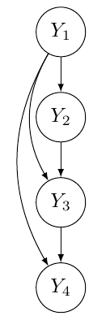
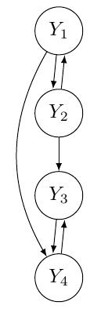
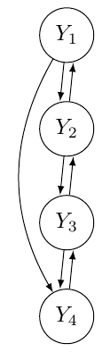

# Introduction {#sec:intro}

As is well known, each equation in a simultaneous equation model (SEM)
represents a specific link between a dependent (endogenous) variable and
a set of other variables which play an explicative role for the former.
These links can reflect either one-way relations between the dependent
and their explicative variables or two-ways relations, ascribable to the
presence of feedback loops operating either at a systematic or a
stochastic level. SEMs are of recursive type as long as the equations
represent unidirectional links. Otherwise, if the equations are
bidirectional, the SEM (or part of it) is interdependent.
Interdependence is, both structurally connected to the presence of
current endogenous variables playing an explicative role, and can result
as a by-product of error-term dependencies.

Investigating the nature, causal rather than interdependent, of a SEM is
important in several respects. First the analysis, unfolding the
dynamics among variables, sheds more light on the rationale behind the
theoretical assumptions of the model. For instance, in an economic
framework, the distinction between interdependent and causal SEMs leads
to models which can be traced back to two main streams of economic
theory: Neoclassical and Keynesian (@bellino2018, [-@bellino2018]).
Furthermore, the implication of interdependence vs. causality is crucial
for undertaking parameter estimation, given that a set of causal
equations can be estimated equation by equation by ordinary least
squares (OLS), while simultaneous estimation methods, like three stage
least squares (3SLS) are required when interdependence occurs. Given
that large SEMs have become increasingly popular, the need for an
analytical set-up, able to effectively detect and test causality versus
interdependence, has of course become more urgent.

Starting from this premise and following @strotz60, [-@strotz60];
@wold64, [-@wold64]; and more recently @faliva92, [-@faliva92];
@faliva94, [-@faliva94]); in this paper we have devised an operational
method to distinguish the causal from the interdependent equations of a
SEM.

Other approaches for detecting feedback-loops arising in deterministic
(error free) models are based on either graph or system theory (see
e.g., @gilli1992 [-@gilli1992]). Our methodological proposal goes beyond
the aforementioned methods, as besides covering both the cases of
deterministic and error-driven feedback effects, it provides a way for
testing the feedback effectiveness. In addition, it differs in principle
from other approaches, as the one proposed by Granger (see @granger1980,
[-@granger1980]) and the Covariance Structural Analysis (CSA;
@joreskog1978). The former essentially rests on a predictability
criterion for defining causality regardless of the theory behind the
model. The latter, which is meant to find the best parametric
approximation of the sample covariance matrix in terms of a given
theoretical SEM structure; as such, it does not lead to a
causal/interdependent interpretation of the model links as the one
developed in our paper.

The feedbacks identified by the method proposed here demand statistical
confirmation on certain empirical evidence arguments. Lack of
significance of (one or more of) the estimated feedbacks can overturn
the nature of the connections among model variables. To this end, a Wald
type test is devised to check whether a given equation is significantly
affected by feedback or not. The statistic of this test hinges on the
parameter matrices of the model: the matrix associated to the endogenous
variables playing an explicative role and the dispersion matrix of the
error terms. If an equation is affected by feedback loops, the testing
procedure allows to diagnose which endogenous variables are
significantly connected in the loop of interest. Indeed, testing the
significance of feedbacks means also checking if the links among
variables, suggested by the theory at the basis of the model, are
confirmed according to an empirical evidence argument.

The methodological approach put forth in this paper is implemented in R
with the [*SIRE*](https://CRAN.R-project.org/package=SIRE) package.
Besides integrating functions usually employed for the estimation of
SEM's, the package provides new functions meant to duly split a system
of equations into its unidirectional and bidirectional links, and test
their significance. To our knowledge, extant alternative approaches to
causality do not offer a similar test.

The paper is structured as follows. The first section provides the
methodological set-up devised to single out causal and interdependent
relations in a SEM. In the second section, a Wald-type test is worked
out to check whether a given equation is affected by feedbacks or not.
The third section shows how the method and the R code work for detecting
and testing feedback-loops in a macroeconomic model. An Appendix, with
proofs of the main theoretical results, completes the paper.

# Detecting Loops in an Equation System {#sec:models}

An equation system is a set of structural equations representing
economic theory-driven relations linking the variables relevant to the
study at hand.

It is customary to specify an equation system as follows
$$\label{eq:struct}
\mathbf y_t = \boldsymbol\Gamma\mathbf y_t + \mathbf A\mathbf z_t + \boldsymbol\epsilon_t\qquad\qquad t = 1,\dots,T   (\#eq:struct)$$
where $\mathbf y_t$ is a $L\times 1$ vector of current dependent or
endogenous variables, $\mathbf z_t$ is a $J\times 1$ vector of
explicative variables and $\boldsymbol\epsilon_t$ is a $L\times 1$
vector of error terms. $T$ is the sample period. $\boldsymbol\Gamma$ and
$\mathbf A$ are, respectively, $L\times L$ and $L\times J$ sparse
parameter matrices. In particular $\boldsymbol\Gamma$, expressing the
relations among current endogenous variables, is a hollow matrix to
prevent any endogenous variable from explaining itself. Furthermore, it
is assumed that ($\mathbf I - \boldsymbol\Gamma$) is of full rank,
meaning that the equations are linearly independent.

Error terms are assumed to be non-systematic, stationary in a wide
sense, and uncorrelated over time, that is
$$\begin{aligned}
\label{eq:hypotheses}
E(\boldsymbol\epsilon_t)&=\mathbf 0_{L} \\ \nonumber
E(\boldsymbol\epsilon_t\boldsymbol\epsilon_\tau')&=
\begin{cases}
\boldsymbol\Sigma_{(L\times L)}\,\;&\text{if}\;t = \tau\\
\mathbf 0_{(L\times L)}\,\;&\text{if}\;t \neq \tau
\end{cases}
\end{aligned}   (\#eq:hypotheses)$$
Actually, the pattern of relations recognizable in an econometric model
can be interpreted either in terms of causal or interdependent schemes.
A causal relation among variables is an asymmetric,
theoretically-grounded and predictive relations which can be ideally
meant as a stimulus-response mechanism (see @wold64, [-@wold64] and
@strotz60 [-@strotz60]). The equations of a model form a causal chain
when, once they are properly ordered, each current endogenous variable
turns out to be, on the one hand, resultant of the joint effect of the
endogenous which precede it in the chain and, on the other hand, cause
of the current endogenous which follow the same endogenous in the chain.
A model with equations that form a causal chain is defined recursive.
The following simple equation system provides an example of a recursive
model (see Figure [1](#gig:examples), left panel)
$$\begin{aligned}
\label{eq:rec}
y_{1,t}=&\boldsymbol{a}_1'\boldsymbol{z}_{t}+ \epsilon_{1,t}\\\nonumber
y_{2,t}=&\gamma_{2,1}y_{1,t}+ \boldsymbol{a}_2'\boldsymbol{z}_{t}+ \epsilon_{2,t}\\\nonumber
y_{3,t}=&\gamma_{3,2}y_{2,t}+\gamma_{3,1}y_{1,t}+\boldsymbol{a}_3'\boldsymbol{z}_{t}+ \epsilon_{3,t}\\\nonumber
y_{4,t}=&\gamma_{4,3}y_{3,t}+\gamma_{4,1}y_{1,t}+ \boldsymbol{a}_4'\boldsymbol{z}_{t}+ \epsilon_{4,t}\nonumber
\end{aligned}   (\#eq:rec)$$
Recursive systems can be easily estimated, equation by equation, using
OLS, starting from the top of the chain.

When a causal chain exists among blocks of current endogenous variables,
a causal order can be established among those blocks of equations. In
this case, the current endogenous variables of a block are effects of
the variables belonging to the blocks which come before them in the
chain, as well as the causes of the variables belonging to blocks which
follow the block at stake in the chain. In this case, the model is of
block-recursive type. The following simple equation system provides an
example of a recursive model (see Figure [1](#gig:examples), middle
panel)
$$\begin{aligned}
\label{eq:ricbloc}
y_{1,t}=&\gamma_{1,2}y_{2,t}+\boldsymbol{a}_1'\boldsymbol{z}_{t}+ \epsilon_{1,t}\\\nonumber
y_{2,t}=&\gamma_{2,1}y_{1,t}+ \boldsymbol{a}_2'\boldsymbol{z}_{t}+ \epsilon_{2,t}\\\nonumber
y_{3,t}=&\gamma_{3,2}y_{2,t}+\gamma_{3,4}y_{4,t}+\boldsymbol{a}_3'\boldsymbol{z}_{t}+ \epsilon_{3,t}\\\nonumber
y_{4,t}=&\gamma_{4,3}y_{3,t}+\gamma_{4,1}y_{1,t}+ \boldsymbol{a}_4'\boldsymbol{z}_{t}+ \epsilon_{4,t}\nonumber
\end{aligned}   (\#eq:ricbloc)$$
Here, the chain is formed by two blocks of variables ($y_1$, $y_2$) and
($y_3$ and $y_4$) with the variables of the first block explaining those
of the second.

Sometimes the composite nature of the connections among variables leads
to a closed sequence of dependencies among variables to be ascribed to
feedback loops. This type of interaction among endogenous variables is
usually called interdependence. Interdependence is structurally
connected to the presence of both current endogenous variables on the
right-hand side of the model and the correlation between contemporaneous
error terms.See the system below as an example in this regard (see
Figure [1](#gig:examples), right panel)
$$\begin{aligned}
\label{eq:interd}
y_{1,t}=&\gamma_{1,2}y_{2,t}+\boldsymbol{a}_1'\boldsymbol{z}_{t}+ \epsilon_{1,t}\\\nonumber
y_{2,t}=&\gamma_{2,1}y_{1,t}+\gamma_{2,3}y_{3,t}+ \boldsymbol{a}_2'\boldsymbol{z}_{t}+ \epsilon_{2,t}\\\nonumber
y_{3,t}=&\gamma_{3,2}y_{2,t}+\gamma_{3,4}y_{4,t}+ \boldsymbol{a}_3'\boldsymbol{z}_{t}+ \epsilon_{3,t}\\\nonumber
y_{4,t}=&\gamma_{4,3}y_{3,t}+\gamma_{4,1}y_{1,t}+ \boldsymbol{a}_4'\boldsymbol{z}_{t}+ \epsilon_{4,t}\nonumber
\end{aligned}   (\#eq:interd)$$

<figure id="gig:examples">
<table>
<caption> </caption>
<tbody>
<tr class="odd">
<td style="text-align: center;"></td>
<td style="text-align: center;"></td>
<td style="text-align: center;"></td>
</tr>
<tr class="even">
<td style="text-align: center;">(a) Recursive model .</td>
<td style="text-align: center;">(b) block-recursive model .</td>
<td style="text-align: center;">(c) interdependent model .</td>
</tr>
</tbody>
</table>
<figcaption>Figure 1: The three patterns of relations in a simultaneous
equation model.</figcaption>
</figure>

Based on this premise, it is clear that the causal or interdependent
features of a model's equations depend on the pair of matrices
$\boldsymbol\Gamma$ and $\boldsymbol\Sigma$. The former matrix
highlights the possible (circular) dependencies or feedbacks among
endogenous variables, while the latter features those induced by the
stochastic components. In fact, the correlation of error terms
associated to an equation-pair may transform the link between the
endogenous, explained by these equations, into a relation with feedback.

Moreover, the essential information concerning the causal structure of a
model can be obtained from the topological properties[^1] of the pair of
the mentioned matrices and, at the very end, from the topological
properties of the associated binary matrices $\boldsymbol\Gamma^b$and
$\boldsymbol\Sigma^b$. [^2]

Following Faliva (@faliva92, [-@faliva92]) matrix $\mathbf\Gamma$ can be
split as follows
$$\label{eq:ttt}
\mathbf\Gamma= \mathbf{\tilde{C}}+\boldsymbol\Psi_0   (\#eq:ttt)$$
where $\mathbf{\tilde{C}}$ includes the coefficients associated to
current endogenous variables involved in feedback loops, and
$\mathbf \Psi_0$ those associated to endogenous variables involved in
causal relations.

Matrix $\mathbf{\tilde{C}}$ is specified as follows
$$\label{eq:ged1}
\mathbf{\tilde{C}}= \mathbf C+\boldsymbol\Psi_1   (\#eq:ged1)$$
where $\mathbf C$ includes the feedbacks arising in the systematic part
of the model and matrix $\boldsymbol\Psi_1$ those induced by the
correlation of the error terms. Matrices $\mathbf C$ and
$\boldsymbol\Psi_1$ are defined as follows
$$\begin{aligned}
\label{eq:dec1}
\mathbf C=\boldsymbol\Gamma\ast\mathbf R\qquad\qquad \mathbf R=\left\{\left[\sum_{r=1}^{L-1}\left(\boldsymbol\Gamma^b\right)^r\right]^b\right\}'
\end{aligned}   (\#eq:dec1)$$

$$\label{eq:covey0}
\boldsymbol\Psi_1= (\boldsymbol\Gamma- \mathbf C)\ast\left[\boldsymbol\Sigma^b\left(\mathbf I +\mathbf R\right)\right]^b,   (\#eq:covey0)$$
where the symbol \"$\ast$\" denotes the Hadamard product.[^3][^4]

The rationale of \@ref(eq:dec1) hinges on the fact that a direct
feedback between variables $y_i$ and $y_j$ corresponds to the
simultaneous non-nullity of $\gamma_{i,j}$ and $\gamma_{j,i}$ of
coefficient matrix $\boldsymbol\Gamma$. This entails that a direct
feedback between these two variables exists if the $(i,j)$-th element of
the matrix [^5]
$$\label{eq:dec100}
\boldsymbol\Gamma\ast(\boldsymbol{\Gamma}^b)'   (\#eq:dec100)$$
is non null. An indirect feedback between the same variables is instead
associated to a bidirectional connection between $y_i$ and $y_j$
established

through other variables and equations. In algebraic terms this
corresponds to the simultaneous non-nullity of the $(i,j)$-th element of
$\boldsymbol\Gamma$ and of the $(i,j)$-th element of a positive power of
$\boldsymbol\Gamma'$ (@Fiedler13, [-@Fiedler13]). This entails that an
indirect feedback exists between the mentioned variables if the
$(i,j)$-th element of the following matrix
$$\label{eq:dec10}
\boldsymbol\Gamma'\ast\left\{\left[\sum_{r=2}^{L-1}\left(\boldsymbol\Gamma^b\right)^r\right]^b\right\}'   (\#eq:dec10)$$
is non-null.

Accordingly, matrix
$$\label{eq:psi0}
\boldsymbol\Psi=\boldsymbol\Gamma-\mathbf C   (\#eq:psi0)$$
includes the coefficients associated to endogenous variables which, as
far as the systematic aspects of the model are concerned, have a causal
role.[^6]

In order to show how feedbacks operating in the systematic part of a
model can be detected, let us consider as an example the following
deterministic model
$$\begin{aligned}
\label{eq:prov}
y_{1,t}=&\gamma_{1,5}y_{5,t}+\gamma_{1,7}y_{7,t}+\boldsymbol{a}_1'\boldsymbol{z}_{t}\\\nonumber
y_{2,t}=&\boldsymbol{a}_2'\boldsymbol{z}_{2,t}\\\nonumber
y_{3,t}=&\gamma_{3,11}y_{11,t}+\boldsymbol{a}_3'\boldsymbol{z}_{t}\\\nonumber
y_{4,t}=&\gamma_{4,3}y_{3,t}+ \boldsymbol{a}_4'\boldsymbol{z}_{t}\\\nonumber
y_{5,t}=&\gamma_{5,10}y_{10,t}+\boldsymbol{a}_5'\boldsymbol{z}_{t}\\\nonumber
y_{6,t}=&\gamma_{6,5}y_{5,t}+\gamma_{6,9}y_{9,t}\boldsymbol+{a}_6'\boldsymbol{z}_{t}\\\nonumber
y_{7,t}=&\gamma_{7,6}y_{6,t}+\boldsymbol{a}_7'\boldsymbol{z}_{t}\\\nonumber
y_{8,t}=&\gamma_{8,12}y_{12,t}+ \boldsymbol{a}_8'\boldsymbol{z}_{t}\\\nonumber
y_{9,t}=&\gamma_{9,7}y_{7,t}+\boldsymbol{a}_9'\boldsymbol{z}_{t}\\\nonumber
y_{10,t}=&\gamma_{10,5}y_{5,t}+\boldsymbol{a}_{10}'\boldsymbol{z}_{2,t}\\\nonumber
y_{11,t}=&\gamma_{11,12}y_{12,t}+\boldsymbol{a}_{11}'\boldsymbol{z}_{t}\\\nonumber
y_{12,t}=&\gamma_{12,4}y_{4,t}+\gamma_{12,11}y_{11,t}+ \boldsymbol{a}_{12}'\boldsymbol{z}_{t}\\\nonumber
y_{13,t}=&\gamma_{13,2}y_{2,t}+\gamma_{13,6}y_{6,t}+ \boldsymbol{a}_{13}'\boldsymbol{z}_{t}\\\nonumber
\end{aligned}   (\#eq:prov)$$
Matrix $\boldsymbol\Gamma^b$ is given by
$$\boldsymbol\Gamma^b =
\begin{bsmallmatrix}
\cdot& \cdot& \cdot& \cdot& 1& \cdot& 1& \cdot& \cdot& \cdot& \cdot&  \cdot& \cdot \\
\cdot& \cdot& \cdot& \cdot& \cdot& \cdot& \cdot& \cdot& \cdot& \cdot& \cdot&  \cdot& \cdot \\
\cdot& \cdot& \cdot& \cdot& \cdot& \cdot& \cdot& \cdot& \cdot& \cdot& 1&  \cdot& \cdot \\
\cdot& \cdot& 1& \cdot& \cdot& \cdot& \cdot& \cdot& \cdot& \cdot& \cdot&  \cdot& \cdot\\
\cdot& \cdot& \cdot& \cdot& \cdot& \cdot& \cdot& \cdot& \cdot& 1& \cdot&  \cdot& \cdot \\
\cdot& \cdot& \cdot& \cdot& 1& \cdot& \cdot& \cdot& 1& \cdot& \cdot&  \cdot& \cdot\\
\cdot& \cdot& \cdot& \cdot& \cdot& 1& \cdot& \cdot& \cdot& \cdot& \cdot&  \cdot& \cdot \\
\cdot& \cdot& \cdot& \cdot& \cdot& \cdot& \cdot& \cdot& \cdot& \cdot& \cdot&  1& \cdot\\
\cdot& \cdot& \cdot& \cdot& \cdot& \cdot& 1& \cdot& \cdot& \cdot& \cdot&  \cdot& \cdot \\
\cdot& \cdot& \cdot& \cdot& 1& \cdot& \cdot& \cdot& \cdot& \cdot& \cdot&  \cdot& \cdot\\
\cdot& \cdot& \cdot& \cdot& \cdot& \cdot& \cdot& \cdot& \cdot& \cdot& \cdot&  1& \cdot \\
\cdot& \cdot& \cdot& 1& \cdot& \cdot& \cdot& \cdot& \cdot& \cdot& 1&  \cdot& \cdot\\
\cdot& 1& \cdot& \cdot& \cdot& 1& \cdot& \cdot& \cdot& \cdot& \cdot&  \cdot& \cdot \\
\end{bsmallmatrix}$$
Using \@ref(eq:dec1) and \@ref(eq:psi0), $\boldsymbol\Gamma^b$ is split
in the following two submatrices
$$\label{eq:sf}
\small
\mathbf{C}^b=
\begin{bsmallmatrix}
\cdot& \cdot& \cdot& \cdot& \cdot& \cdot& \cdot& \cdot& \cdot& \cdot& \cdot&  \cdot& \cdot \\
\cdot& \cdot& \cdot& \cdot& \cdot& \cdot& \cdot& \cdot& \cdot& \cdot& \cdot&  \cdot& \cdot \\
\cdot& \cdot& \cdot& \cdot& \cdot& \cdot& \cdot& \cdot& \cdot& \cdot& 1&  \cdot& \cdot \\
\cdot& \cdot& 1& \cdot& \cdot& \cdot& \cdot& \cdot& \cdot& \cdot& \cdot&  \cdot& \cdot\\
\cdot& \cdot& \cdot& \cdot& \cdot& \cdot& \cdot& \cdot& \cdot& 1& \cdot&  \cdot& \cdot \\
\cdot& \cdot& \cdot& \cdot& \cdot& \cdot& \cdot& \cdot& 1& \cdot& \cdot&  \cdot& \cdot\\
\cdot& \cdot& \cdot& \cdot& \cdot& 1& \cdot& \cdot& \cdot& \cdot& \cdot&  \cdot& \cdot \\
\cdot& \cdot& \cdot& \cdot& \cdot& \cdot& \cdot& \cdot& \cdot& \cdot& \cdot&  \cdot& \cdot\\
\cdot& \cdot& \cdot& \cdot& \cdot& \cdot& 1& \cdot& \cdot& \cdot& \cdot&  \cdot& \cdot \\
\cdot& \cdot& \cdot& \cdot& 1& \cdot& \cdot& \cdot& \cdot& \cdot& \cdot&  \cdot& \cdot\\
\cdot& \cdot& \cdot& \cdot& \cdot& \cdot& \cdot& \cdot& \cdot& \cdot& \cdot&  1& \cdot \\
\cdot& \cdot& \cdot& 1& \cdot& \cdot& \cdot& \cdot& \cdot& \cdot& 1&  \cdot& \cdot\\
\cdot& \cdot& \cdot& \cdot& \cdot& \cdot& \cdot& \cdot& \cdot& \cdot& \cdot&  \cdot& \cdot \\
\end{bsmallmatrix},\;
%while, application of \eqref{eq:covey0} leads to
\small
\boldsymbol\Psi^b=
\begin{bsmallmatrix}
\cdot& \cdot& \cdot& \cdot& 1& \cdot& 1& \cdot& \cdot& \cdot& \cdot&  \cdot& \cdot\\
\cdot& \cdot& \cdot& \cdot& \cdot& \cdot& \cdot& \cdot& \cdot& \cdot& \cdot&  \cdot& \cdot\\
\cdot& \cdot& \cdot& \cdot& \cdot& \cdot& \cdot& \cdot& \cdot& \cdot& \cdot&  \cdot& \cdot\\
\cdot& \cdot& \cdot& \cdot& \cdot& \cdot& \cdot& \cdot& \cdot& \cdot& \cdot&  \cdot& \cdot\\
\cdot& \cdot& \cdot& \cdot& \cdot& \cdot& \cdot& \cdot& \cdot& \cdot& \cdot&  \cdot& \cdot\\
\cdot& \cdot& \cdot& \cdot& 1& \cdot& \cdot& \cdot& \cdot& \cdot& \cdot&  \cdot& \cdot\\
\cdot& \cdot& \cdot& \cdot& \cdot& \cdot& \cdot& \cdot& \cdot& \cdot& \cdot&  \cdot& \cdot\\
\cdot& \cdot& \cdot& \cdot& \cdot& \cdot& \cdot& \cdot& \cdot& \cdot& \cdot&  1& \cdot\\
\cdot& \cdot& \cdot& \cdot& \cdot& \cdot& \cdot& \cdot& \cdot& \cdot& \cdot&  \cdot& \cdot\\
\cdot& \cdot& \cdot& \cdot& \cdot& \cdot& \cdot& \cdot& \cdot& \cdot& \cdot&  \cdot& \cdot\\
\cdot& \cdot& \cdot& \cdot& \cdot& \cdot& \cdot& \cdot& \cdot& \cdot& \cdot&  \cdot& \cdot\\
\cdot& \cdot& \cdot& \cdot& \cdot& \cdot& \cdot& \cdot& \cdot& \cdot& \cdot&  \cdot& \cdot\\
\cdot& 1& \cdot& \cdot& \cdot& 1& \cdot& \cdot& \cdot& \cdot& \cdot&  \cdot& \cdot\\
\end{bsmallmatrix}   (\#eq:sf)$$
\
Looking at matrix $\mathbf{C}^b$, we see that the simultaneous
non-nullity of the $c_{5,10}$, $c_{10,5}$, $c_{11,12}$, and $c_{12,11}$
elements imply the existence of two direct feedbacks: one between the
variable-pair $y_5$ and $y_{10}$, and the other between $y_{11}$ and
$y_{12}$. The non-nullity of the $c_{3,11}$, $c_{4,3}$, and $c_{12,4}$
elements denotes the existence of indirect feedbacks between the four
variables $y_3$, $y_4$, $y_{11}$, and $y_{12}$. Similarly, variables
$y_6$, $y_7$, and $y_9$ are connected by an (indirect) feeback as a
consequence of the non-nullity of the $c_{6,9}$, $c_{7,6}$, and
$c_{9,7}$ elements. Looking at matrix $\boldsymbol\Psi$ we conclude that
variables $y_5$ and $y_7$ have a causal role in the first equation.
Variables $y_5$ and $y_{12}$ have the same role in the equations six and
eight, while variables $y_2$ and $y_6$ play a causal role in the last
equation. The results ensuing from the decomposition of
$\boldsymbol\Gamma^b$ are depicted in Figure [2](#gig:EXA).

{#gig:EXA
width="100%" alt="graphic without alt text"}

If the error terms are correlated, the causal structure of a model could
no longer match that of its systematic counterpart since part of the
relations that are recursive at systematic level, namely
$\boldsymbol\Psi\mathbf y_t$, may become interdependent as a consequence
of the feedback mechanisms induced by the stochastic terms in
$\boldsymbol\Sigma$. In this case, matrix $\boldsymbol\Psi$ turns out to
be the sum of two Hadamard-orthogonal matrices, $\boldsymbol\Psi_0$ and
$\boldsymbol\Psi_1$, that is
$$\label{eq:covey2}
\boldsymbol\Psi = \boldsymbol\Psi_0+\boldsymbol\Psi_1\qquad\qquad\boldsymbol\Psi_0\ast\boldsymbol\Psi_1=\mathbf 0_{(L\times L)}   (\#eq:covey2)$$
where
$$\label{eq:covey3}
\boldsymbol\Psi_1 ^b= \boldsymbol\Psi\ast\mathbf{F}  \qquad\qquad\mathbf{F}=\left[\boldsymbol\Sigma^b\left(\mathbf I +\mathbf R\right)\right]^b   (\#eq:covey3)$$
Here, matrix $\boldsymbol\Psi_1$ includes the coefficients associated to
the endogenous variables involved in loops induced by disturbances. In
fact, it can be proved (see 1. in Appendix) that the matrix
$\left[\boldsymbol\Sigma^b\left(\mathbf I +\mathbf R\right)\right]^b$ is
the binary counterpart of the covariance matrix between the error terms
and the endogenous variables given by
$$\label{eq:covey}
\mathbb E(\boldsymbol\epsilon_t '\mathbf y_t) = [\boldsymbol\Sigma\left(\mathbf I - \boldsymbol\Gamma\right)^{-1}]   (\#eq:covey)$$
The non-null elements of the above matrix express the effect of the
model's left-hand side (LHS) endogenous variables on the right-hand side
(RHS) ones, which are induced by the error term correlation.

Equations \@ref(eq:covey2) and \@ref(eq:covey3) rest on the logical
relations between the concepts of causality and predictability, where
the notion of optimal predictor (in mean-square sense) tallies with that
of conditional expectation. In fact, given that causal relations are
also predictive, but not vice-versa, we can define as causal those
relations that are both causal in the deterministic model and predictive
in a stochastic context. This means that if the conditional expectations
of the relations, which are causal in the deterministic model, namely
$\boldsymbol\Psi\mathbf y_t$, are not affected by the error terms, then
$\boldsymbol\Psi\mathbf y_t$ turns out to also have a causal role in a
stochastic context.

Accordingly, we can say that the stochastic specification is neutral
with respect to the underlying systematic causal structure if the
following holds (@faliva92, [-@faliva92])
$$\label{eq:conexp1}
\mathbb E(\boldsymbol\Psi\mathbf y_t+\boldsymbol\epsilon_t | \boldsymbol\Psi\mathbf y_t) = \boldsymbol\Psi\mathbf y_t+\mathbb E(\boldsymbol\epsilon_t | \boldsymbol\Psi\mathbf y_t)=\boldsymbol\Psi\mathbf y_t   (\#eq:conexp1)$$

meaning that
$$\label{eq:conexp01}
\mathbb E(\boldsymbol\epsilon_t | \boldsymbol\Psi\mathbf y_t) = \mathbf 0   (\#eq:conexp01)$$

Otherwise, the correlation between the error terms and the endogenous
variables may affect the conditional expectation of the error term as
follows (see @faliva92, [-@faliva92])
$$\label{eq:conexp02}
\mathbb E(\boldsymbol\epsilon_t | \boldsymbol\Psi\mathbf y_t) = -\boldsymbol\Psi_1\mathbf y_t   (\#eq:conexp02)$$
which, in turn, implies that
$$\label{eq:conexp11}
\mathbb E(\boldsymbol\Psi\mathbf y_t+\boldsymbol\epsilon_t | \boldsymbol\Psi\mathbf y_t) = \boldsymbol\Psi\mathbf y_t- \boldsymbol\Psi_1\mathbf y_t=\boldsymbol\Psi_0\mathbf y_t   (\#eq:conexp11)$$
In this case, only the subset $\boldsymbol\Psi_0\mathbf y_t$ of the
original set of causal relations, playing a predictive role, is causal.
This, in turn, implies that the overall feedback operating in the system
is included in matrix
$\mathbf{\widetilde{C}}=\mathbf{C}+\boldsymbol\Psi_1$.

To highlight the role played by the stochastic specification on the
model causal structure, let us consider as an example the following
specification for matrix $\boldsymbol\Sigma^b$
$$\label{eq:exb}
\small
\boldsymbol\Sigma^b=
\begin{bsmallmatrix}
1&  \\
\cdot& 1&  \\
\cdot& \cdot& 1&  \\
1& 1& \cdot& 1& \\
1& \cdot& \cdot& 1& 1&  \\
\cdot& 1& 1& 1& \cdot& 1& \\
\cdot& \cdot& 1& \cdot& \cdot& 1& 1&  \\
1& 1& \cdot& 1& 1& 1& \cdot& 1& \\
\cdot& 1& \cdot& 1& \cdot& 1& \cdot& 1& 1&  \\
1& \cdot& \cdot& 1& 1& \cdot& \cdot& 1& \cdot& 1& \\
\cdot& \cdot& 1& \cdot& \cdot& 1& 1& \cdot& \cdot& \cdot& 1&  \\
1& \cdot& \cdot& 1& 1& \cdot& \cdot& 1& \cdot& 1& \cdot&  1& \\
\cdot& \cdot& 1& \cdot& \cdot& 1& 1& \cdot& \cdot& \cdot& 1&  \cdot& 1& \\
\end{bsmallmatrix}   (\#eq:exb)$$
Then, matrices $\widetilde{\mathbf{C}^b}$ and $\boldsymbol\Psi_0^b$ are
$$\label{eq:cf}
\small
\widetilde{\mathbf{C}^b}=
\begin{bsmallmatrix}
\cdot& \cdot& \cdot& \cdot& 1& \cdot& 1& \cdot& \cdot& \cdot& \cdot& \cdot& \cdot\\
\cdot& \cdot& \cdot& \cdot& \cdot& \cdot& \cdot& \cdot& \cdot& \cdot& \cdot& \cdot& \cdot\\
\cdot& \cdot& \cdot& \cdot& \cdot& \cdot& \cdot& \cdot& \cdot& \cdot& 1& \cdot& \cdot \\
\cdot& \cdot& 1& \cdot& \cdot& \cdot& \cdot& \cdot& \cdot& \cdot& \cdot& \cdot& \cdot\\
\cdot& \cdot& \cdot& \cdot& \cdot& \cdot& \cdot& \cdot& \cdot& 1& \cdot& \cdot& \cdot \\
\cdot& \cdot& \cdot& \cdot& \cdot& \cdot& \cdot& \cdot& 1& \cdot& \cdot& \cdot& \cdot\\
\cdot& \cdot& \cdot& \cdot& \cdot& 1& \cdot& \cdot& \cdot& \cdot& \cdot& \cdot& \cdot \\
\cdot& \cdot& \cdot& \cdot& \cdot& \cdot& \cdot& \cdot& \cdot& \cdot& \cdot& 1& \cdot\\
\cdot& \cdot& \cdot& \cdot& \cdot& \cdot& 1& \cdot& \cdot& \cdot& \cdot& \cdot& \cdot \\
\cdot& \cdot& \cdot& \cdot& 1& \cdot& \cdot& \cdot& \cdot& \cdot& \cdot& \cdot& \cdot\\
\cdot& \cdot& \cdot& \cdot& \cdot& \cdot& \cdot& \cdot& \cdot& \cdot& \cdot& 1& \cdot \\
\cdot& \cdot& \cdot& 1& \cdot& \cdot& \cdot& \cdot& \cdot& \cdot& 1& \cdot& \cdot\\
\cdot& \cdot& \cdot& \cdot& \cdot& 1& \cdot& \cdot& \cdot& \cdot& \cdot& \cdot& \cdot \\
\end{bsmallmatrix}
=
\small
{\mathbf{C}^b}+\boldsymbol\Psi_1^b=
\begin{bsmallmatrix}
\cdot& \cdot& \cdot& \cdot& \cdot& \cdot& \cdot& \cdot& \cdot& \cdot& \cdot& \cdot& \cdot \\
\cdot& \cdot& \cdot& \cdot& \cdot& \cdot& \cdot& \cdot& \cdot& \cdot& \cdot& \cdot& \cdot\\
\cdot& \cdot& \cdot& \cdot& \cdot& \cdot& \cdot& \cdot& \cdot& \cdot& 1& \cdot& \cdot \\
\cdot& \cdot& 1& \cdot& \cdot& \cdot& \cdot& \cdot& \cdot& \cdot& \cdot& \cdot& \cdot\\
\cdot& \cdot& \cdot& \cdot& \cdot& \cdot& \cdot& \cdot& \cdot& 1& \cdot& \cdot& \cdot \\
\cdot& \cdot& \cdot& \cdot& \cdot& \cdot& \cdot& \cdot& 1& \cdot& \cdot& \cdot& \cdot\\
\cdot& \cdot& \cdot& \cdot& \cdot& 1& \cdot& \cdot& \cdot& \cdot& \cdot& \cdot& \cdot \\
\cdot& \cdot& \cdot& \cdot& \cdot& \cdot& \cdot& \cdot& \cdot& \cdot& \cdot& \cdot& \cdot\\
\cdot& \cdot& \cdot& \cdot& \cdot& \cdot& 1& \cdot& \cdot& \cdot& \cdot& \cdot& \cdot \\
\cdot& \cdot& \cdot& \cdot& 1& \cdot& \cdot& \cdot& \cdot& \cdot& \cdot& \cdot& \cdot\\
\cdot& \cdot& \cdot& \cdot& \cdot& \cdot& \cdot& \cdot& \cdot& \cdot& \cdot& 1& \cdot \\
\cdot& \cdot& \cdot& 1& \cdot& \cdot& \cdot& \cdot& \cdot& \cdot& 1& \cdot& \cdot\\
\cdot& \cdot& \cdot& \cdot& \cdot& \cdot& \cdot& \cdot& \cdot& \cdot& \cdot& \cdot& \cdot \\
\end{bsmallmatrix}
+
\begin{bsmallmatrix}
\cdot& \cdot& \cdot& \cdot& 1& \cdot& 1& \cdot& \cdot& \cdot& \cdot& \cdot& \cdot \\
\cdot& \cdot& \cdot& \cdot& \cdot& \cdot& \cdot& \cdot& \cdot& \cdot& \cdot& \cdot& \cdot\\
\cdot& \cdot& \cdot& \cdot& \cdot& \cdot& \cdot& \cdot& \cdot& \cdot& \cdot& \cdot& \cdot \\
\cdot& \cdot& \cdot& \cdot& \cdot& \cdot& \cdot& \cdot& \cdot& \cdot& \cdot& \cdot& \cdot\\
\cdot& \cdot& \cdot& \cdot& \cdot& \cdot& \cdot& \cdot& \cdot& \cdot& \cdot& \cdot& \cdot \\
\cdot& \cdot& \cdot& \cdot& \cdot& \cdot& \cdot& \cdot& \cdot& \cdot& \cdot& \cdot& \cdot\\
\cdot& \cdot& \cdot& \cdot& \cdot& \cdot& \cdot& \cdot& \cdot& \cdot& \cdot& \cdot& \cdot \\
\cdot& \cdot& \cdot& \cdot& \cdot& \cdot& \cdot& \cdot& \cdot& \cdot& \cdot& 1& \cdot\\
\cdot& \cdot& \cdot& \cdot& \cdot& \cdot& \cdot& \cdot& \cdot& \cdot& \cdot& \cdot& \cdot \\
\cdot& \cdot& \cdot& \cdot& \cdot& \cdot& \cdot& \cdot& \cdot& \cdot& \cdot& \cdot& \cdot\\
\cdot& \cdot& \cdot& \cdot& \cdot& \cdot& \cdot& \cdot& \cdot& \cdot& \cdot& \cdot& \cdot \\
\cdot& \cdot& \cdot& \cdot& \cdot& \cdot& \cdot& \cdot& \cdot& \cdot& \cdot& \cdot& \cdot\\
\cdot& \cdot& \cdot& \cdot& \cdot& 1& \cdot& \cdot& \cdot& \cdot& \cdot& \cdot& \cdot \\
\end{bsmallmatrix}   (\#eq:cf)$$

$$\label{eq:cf1}
\boldsymbol\Psi_0^b=
\begin{bsmallmatrix}
\cdot& \cdot& \cdot& \cdot& \cdot& \cdot& \cdot& \cdot& \cdot& \cdot& \cdot&  \cdot& \cdot \\
\cdot& \cdot& \cdot& \cdot& \cdot& \cdot& \cdot& \cdot& \cdot& \cdot& \cdot&  \cdot& \cdot \\
\cdot& \cdot& \cdot& \cdot& \cdot& \cdot& \cdot& \cdot& \cdot& \cdot& \cdot&  \cdot& \cdot \\
\cdot& \cdot& \cdot& \cdot& \cdot& \cdot& \cdot& \cdot& \cdot& \cdot& \cdot&  \cdot& \cdot\\
\cdot& \cdot& \cdot& \cdot& \cdot& \cdot& \cdot& \cdot& \cdot& \cdot& \cdot&  \cdot& \cdot \\
\cdot& \cdot& \cdot& \cdot& 1& \cdot& \cdot& \cdot& \cdot& \cdot& \cdot&  \cdot& \cdot\\
\cdot& \cdot& \cdot& \cdot& \cdot& \cdot& \cdot& \cdot& \cdot& \cdot& \cdot&  \cdot& \cdot \\
\cdot& \cdot& \cdot& \cdot& \cdot& \cdot& \cdot& \cdot& \cdot& \cdot& \cdot&  \cdot& \cdot\\
\cdot& \cdot& \cdot& \cdot& \cdot& \cdot& \cdot& \cdot& \cdot& \cdot& \cdot&  \cdot& \cdot \\
\cdot& \cdot& \cdot& \cdot& \cdot& \cdot& \cdot& \cdot& \cdot& \cdot& \cdot&  \cdot& \cdot\\
\cdot& \cdot& \cdot& \cdot& \cdot& \cdot& \cdot& \cdot& \cdot& \cdot& \cdot&  \cdot& \cdot \\
\cdot& \cdot& \cdot& \cdot& \cdot& \cdot& \cdot& \cdot& \cdot& \cdot& \cdot&  \cdot& \cdot\\
\cdot& 1& \cdot& \cdot& \cdot& 1& \cdot& \cdot& \cdot& \cdot& \cdot&  \cdot& \cdot \\
\end{bsmallmatrix}   (\#eq:cf1)$$
The non-null correlation between the pairs of error terms
$\left\{\epsilon_5,\epsilon_1\right\}$,
$\left\{\epsilon_6,\epsilon_{13}\right\}$,
$\left\{\epsilon_7,\epsilon_1\right\}$ and
$\left\{\epsilon_{12},\epsilon_8\right\}$ (see Equation \@ref(eq:exb))
has transformed the relations among the pairs of variables
$\left\{y_5,y_1\right\}$, $\left\{y_6,y_{13}\right\}$,
$\left\{y_7,y_1\right\}$, and $\left\{y_{12},y_8\right\}$, which were
causal in the deterministic model \@ref(eq:prov), into interdependent
links. Figure [3](#gig:EXA2) shows the effect of the stochastic
specification \@ref(eq:exb) on the feedbacks originally detected in the
deterministic model \@ref(eq:prov).

{#gig:EXA2 width="100%"
alt="graphic without alt text"}

The flow-chart in Figure [4](#gig:flowchart) shows the different cases,
according to the structure of matrices $\boldsymbol \Gamma$ and
$\boldsymbol\Sigma$.

{#gig:flowchart width="100%"
alt="graphic without alt text"}

# Testing the Significance of Feedback Loops {#sec:tests}

In the previous section an analytic framework was set up to describe the
potential feedbacks operating in a model. In fact, the analysis
developed, relying on binary matrices, was meant to be qualitative since
it only highlights the feedback set that potentially operates in a
model, given the characteristics of its relations and its stochastic
specification. Only once the model has been duly estimated, can the
coefficients of matrix $\boldsymbol{\widetilde{C}}$ be properly
evaluated. At this point, it proves useful to devise a procedure for
testing the significance of the estimated loops (see @faliva94,
[-@faliva94]). To this end, let us observe that, once the matrix
including all the feedbacks operating in the model
$$\begin{aligned}
\label{eq:geed-dec}
\mathbf C+\boldsymbol\Psi_1=\mathbf C+\boldsymbol\Psi_1 =  \mathbf C+(\boldsymbol\Psi\ast\mathbf F)\qquad\qquad
\mathbf F=\boldsymbol\Sigma(\mathbf I - \boldsymbol\Gamma)^{-1}
\end{aligned}   (\#eq:geed-dec)$$
have been properly estimated, a test for the effective functioning of
feedback loops can be established, based on the significance of its
non-null entries. Any given equation, say the $j$-th one, turns out to
be involved in feedback loops with other equations of the model whenever
the $j-$th row of the above matrix is not a null vector. Should the
$(j,i)$-th entry of this matrix be non-null, then a feedback between the
$j$-th and the $i$-th equation would be expected to exist (see
\@ref(eq:res3) in the Appendix). Actually, it can be proved (see 2. in
Appendix) that, in light of the identity

$$\begin{aligned}
\label{eq:geed-dec2}
\mathbf C+(\boldsymbol\Psi\ast\mathbf F )= (\mathbf C+\boldsymbol\Psi)\ast\mathbf F = \boldsymbol\Gamma\ast\mathbf F
\end{aligned}   (\#eq:geed-dec2)$$
a test for the significance of the loops can be based on the exam of the
statistical non-nullity of the elements of matrix
$\boldsymbol\Gamma\ast\mathbf F$ which, unlike $\mathbf{\widetilde{C}}$,
does not require the preliminary split of $\boldsymbol\Gamma$ into its
components, given the feedback loops $\mathbf C+\boldsymbol\Psi_1$ and
causal links $\boldsymbol\Psi_0$.

In this context (following @faliva94, [-@faliva94]), it can be proved
that the $j$-th row of matrix $\boldsymbol\Gamma\ast\mathbf F$ measures
both the direct effect of the RHS endogenous variables on the $j$-th one
and the feedback effect of the latter on the former variables. In fact,
the direct effects of the RHS endogenous variables, collected in vector
$\mathbf y_o$, on variable $y_j$ are included in the $j$-th row of
matrix $\boldsymbol\Gamma$ (excluding its $j$-th element), that is
$$\label{eq:ff1}
\frac{\partial E( y_j|{\mathbf y_o} )}{\partial \mathbf y_o} = \mathbf e_j'\boldsymbol\Gamma\mathbf M_j   (\#eq:ff1)$$
Here, $\mathbf e_j$ is the $L$-dimensional $j$-th elementary vector and
$\mathbf M_j$ is the $(L\times (L-1))$ selection matrix obtained from
the identity matrix by deleting its $j$-th column, that is
$$\label{eq:gtg}
\mathbf M_j =
\begin{bmatrix}
\underset{(L,1)}{\mathbf e_{1}}, &\ldots &\underset{(L,1)}{\mathbf e_{j-1}}, &\underset{(L,1)}{\mathbf e_{j+1}}, & \ldots\underset{(L,1)}{\mathbf e_{L-1}} \\
\end{bmatrix}   (\#eq:gtg)$$

The feedback effects of the $y_j$ variable on its explicative endogenous
variables, $\mathbf y_o$, are included in the $j$-th row of matrix
$\mathbf F$ (excluding its $j$-th element), that is
$$\frac{\partial E(\mathbf y_o'|y_j)}{\partial y_j} = (\mathbf M_j'\mathbf F '\mathbf e_j)'
\label{eqeq:gedp}   (\#eq:eqeqgedp)$$
To prove \@ref(eq:eqeqgedp), let us focus on the $j$-th equation and
consider this equation as the first of the system, with the others in
sequence, that is
$$\begin{aligned}
\label{eq:geed-sys1}
 \underset{(1,1)}{y_j} &=\underset{(1,L-1)}{\boldsymbol\gamma_j'}\underset{(L-1,1)}{\mathbf y_o} + \underset{(1,J)}{\mathbf a_j'}\underset{(J,1)}{\mathbf z} +\underset{(1,1)}{ \epsilon_j}
\end{aligned}   (\#eq:geed-sys1)$$

$$\begin{aligned}
\label{eq:geed-sys2}
\underset{(L-1,1)}{\mathbf y_o} &= \underset{(L-1,1)}{\boldsymbol \eta} \underset{(1,1)}{y_j} + \underset{(L-1,L-1)}{\boldsymbol\Gamma_o}\underset{(L-1,1)}{\mathbf y_o} +\underset{(L-1,J)}{\mathbf A_o}\underset{(J-1,1)}{\mathbf z} +\underset {(L-1,1)}{\boldsymbol\epsilon_o}
\end{aligned}   (\#eq:geed-sys2)$$

$$\begin{aligned}
\label{eq:geed-sys3}
\begin{pmatrix}
\epsilon_j\\
\boldsymbol\epsilon_o
\end{pmatrix}
&\sim \mathcal N_L\left(
\mathbf 0, \boldsymbol \Sigma
\right)\qquad\text{where}\qquad
\boldsymbol \Sigma=
\begin{pmatrix}
\sigma_{jj}&\boldsymbol\sigma_{jo}\\
\boldsymbol\sigma_{oj}&\boldsymbol\Sigma_{o}\ \
\end{pmatrix}
\end{aligned}   (\#eq:geed-sys3)$$
Looking at the $j$-th equation, it is clear that vector
$\boldsymbol\gamma_j' = \mathbf e_j'\boldsymbol\Gamma\mathbf M_j$
measures the direct effect of the (RHS) endogenous variables on $y_j$.

In order to determine the feedback effect of $y_j$ on $\mathbf y_o$, let
us rewrite \@ref(eq:geed-sys2) as follows
$$\begin{aligned}
\label{eq:geed-y2}
\mathbf y_o &= \boldsymbol\eta (\boldsymbol\gamma_j'\mathbf y_o + \mathbf a_j'\mathbf z + \epsilon_j) +
 \boldsymbol\Gamma_o\mathbf y_o +  \mathbf A_o\mathbf z + \boldsymbol\epsilon_o
\end{aligned}   (\#eq:geed-y2)$$
Next, given that, under normality, the following holds
$$\begin{aligned}
\label{eq:geed-e2}
\boldsymbol\epsilon_o = \frac{\boldsymbol\sigma_{oj}}{\sigma_{jj}}\epsilon_{j} + \boldsymbol\zeta_o; \qquad \boldsymbol\zeta_o \bot \epsilon_j
\end{aligned}   (\#eq:geed-e2)$$
the set of equations (\@ref(eq:geed-y2)) can be conveniently rewritten
in the form
$$\begin{aligned}
\label{eq:geed-y3}
(\mathbf I - \mathbf{G})\mathbf y_o &= \mathbf  D \mathbf z + \mathbf d \boldsymbol\epsilon_j + \boldsymbol\zeta_o
\end{aligned}   (\#eq:geed-y3)$$
where
$$\begin{aligned}
\label{eq:geed-symb}
\mathbf G = \boldsymbol \eta\boldsymbol\gamma_j' + \boldsymbol\Gamma_o;\qquad
\mathbf  D =  \boldsymbol\eta\mathbf a_j'+ \mathbf A_o;\qquad
\mathbf d =  \boldsymbol\eta + \frac{\boldsymbol\sigma_{oj}}{\sigma_{jj}}
\end{aligned}   (\#eq:geed-symb)$$
This, in turn (see 3. in Appendix) entails
$$\label{eq:rpp}
\frac{\partial E(\mathbf y_o'|\epsilon_j)}{\partial y_j} = \frac{\partial E(\mathbf y_o'|\epsilon_j)}{\partial \epsilon_j}\frac{\partial \epsilon_j}{\partial y_j}=
[(\mathbf I - \mathbf{G})^{-1}\mathbf d]' = \boldsymbol \varphi_j' = \frac{1}{\sigma_{jj}}\mathbf e_j'\mathbf F\mathbf M_j   (\#eq:rpp)$$
Thus, we can conclude that the presence of non-zero elements in the
vector
$$\begin{aligned}
\label{eq:geed-rho}
\boldsymbol{\rho}_j' = \boldsymbol{\gamma}_j'\ast\boldsymbol\varphi_j' = (\mathbf e_j'\boldsymbol\Gamma\mathbf M_j) \ast (\frac{1}{\sigma_{jj}}\mathbf e_j'\mathbf F\mathbf M_j) = \mathbf e_j'\frac{1}{\sigma_{jj}}(\boldsymbol\Gamma\ast\mathbf F)\mathbf M_j
\end{aligned}   (\#eq:geed-rho)$$
reveals the simultaneous action of both the direct effects of
$\mathbf y_o$ on $y_j$ and the feedback effects of $y_j$ on
$\mathbf y_o$.

Accordingly, testing the significance of $\boldsymbol \rho_j$ means
checking whether the $j$-th endogenous is involved in feedback loops
with other endogenous variables.

Actually, the statistic of the test can be derived from
\@ref(eq:geed-rho), by deleting from $\boldsymbol\gamma_j'$ the elements
that, according to the exclusion constraints postulated by the economic
theory, are null. This leads to move from the former
$\boldsymbol{\rho}_j$ vector to the following compressed vector
$$\begin{aligned}
\label{eq:geed-rho2}
\boldsymbol{\tilde\rho}_j = \boldsymbol{\tilde\gamma}_j'\ast\tilde{\boldsymbol \varphi_j}' = (\mathbf S_j\boldsymbol\gamma_j)'\ast(\mathbf S_j\boldsymbol \varphi_j)'
\end{aligned}   (\#eq:geed-rho2)$$
which has no zero entries. Here $\mathbf S_j$ is a selection matrix
selecting from $\boldsymbol{\gamma}_j$ and $\boldsymbol \varphi_j$ the
non-null entries. Accordingly, the reference model
\@ref(eq:geed-sys1)-\@ref(eq:geed-sys3) can be restated as
$$\begin{aligned}
\label{eq:geed-sysz1}
y_j &= \boldsymbol{\tilde\gamma}_j'\mathbf y_r + \mathbf{\tilde a}_j'\mathbf z_r + \epsilon_j
\end{aligned}   (\#eq:geed-sysz1)$$

$$\begin{aligned}
\label{eq:geed-sysz2}
\mathbf y_r &= \mathbf K\mathbf z + \tilde{\boldsymbol\varphi}_j\epsilon_j+\boldsymbol\epsilon_r 
\end{aligned}   (\#eq:geed-sysz2)$$

$$\begin{aligned}
\label{eq:geed-sysz3}
f_{(\epsilon_j,\boldsymbol\epsilon_r)}&\sim \mathcal N_L\left(\mathbf 0,
\begin{pmatrix}
\sigma_{jj}&\mathbf 0'\\
\mathbf 0&\boldsymbol\Omega\\
\end{pmatrix}\right)
\end{aligned}   (\#eq:geed-sysz3)$$
where
$$\mathbf y_r = \mathbf S_j \mathbf y_o ,\ \
\mathbf{\tilde a}_j = \mathbf S_r\mathbf{ a}_j,\ \
\mathbf{z}_r = \mathbf S_r\mathbf{z}$$
and $\mathbf S_r$ is the matrix selecting the non-null entries from
$\mathbf{ a}'_j$ and the sub-set of predetermined variables playing an
explicative role in the $j$-th equation.

Furthermore,
$$\begin{aligned}
\label{eq:geed-symbz}
\mathbf K = \mathbf S_j(\mathbf I - \mathbf G)^{-1}\mathbf D,\qquad
\boldsymbol\epsilon_r = \mathbf S_j(\mathbf I - \mathbf G)^{-1}\boldsymbol\zeta_o,\;\;\qquad
\boldsymbol\Omega=E(\boldsymbol\epsilon_r\boldsymbol\epsilon_r')
\end{aligned}   (\#eq:geed-symbz)$$
Hence, the issue of the nature, unidirectional rather than
bidirectional, of the equation at stake can be unfolded by testing a
hypothesis in the given form
$$\begin{aligned}
\label{eq:h0}
\begin{cases}
H_0:\boldsymbol{\tilde\rho}_j = \mathbf 0\\
H_1:\boldsymbol{\tilde\rho}_j\neq\mathbf 0
\end{cases}
\end{aligned}   (\#eq:h0)$$

The Wald test takes the form
$$\label{wald}
W={\hat {\tilde{\boldsymbol{{\rho}}}}_j}'({\hat{\mathbf{J}}\hat{\boldsymbol{\Psi}}^{-1}\hat{\mathbf{J}}'})^{-1}\hat{\tilde{\boldsymbol{\rho}}}_j   (\#eq:wald)$$
where $\hat{\tilde{\boldsymbol{\rho}}}_j$ is the maximum likelihood
estimate of $\tilde{\boldsymbol{\rho}}_j$ (see 4. in Appendix), and
$\hat{\mathbf{J}}$, $\hat{\boldsymbol{\Psi}}$ are, respectively, the
Jacobian matrix
$$\label{jacobian}
\hat{\mathbf{J}}=\frac{\partial\tilde{\boldsymbol{\rho}}_j(\boldsymbol\theta)}{\partial\boldsymbol{\theta}}\bigg\rvert_{\boldsymbol\theta=\hat{\boldsymbol{\theta}}}   (\#eq:jacobian)$$
and the information matrix
$$\label{ingormation}
\hat{\mathbf{\Psi}}=\frac{\partial^2l(\boldsymbol{\theta})}{\partial\boldsymbol{\theta}\partial\boldsymbol{\theta}'}\bigg\rvert_{\boldsymbol\theta=\hat{\boldsymbol{\theta}}}   (\#eq:ingormation)$$
evaluated in correspondence of the maximum likelihood estimate of the
parameter vector
$$\label{par}
\boldsymbol{\theta}'=[\boldsymbol{\tilde{\gamma}}_j', \mathbf{\tilde{a}}_j',\boldsymbol{\tilde{\varphi}}_j',\text{vec}(\mathbf{K}),\sigma_{jj}, \text{vech}(\boldsymbol{\Omega})]'   (\#eq:par)$$
Under the null hypothesis
$$\label{wald2}
W\underset{as.}{\approx}\chi_{k}^2   (\#eq:wald2)$$
where $k$ is the dimension of $\tilde{\boldsymbol{\rho}}_j$.

If the Wald test provides evidence that the $j$-th equation is involved
in a statistically significant feedback loop with other equations of the
model, it is worth singling out the variables that are primarily
responsible for the feedback at hand. They can be identified by checking
the significance of each non-null element of
$\hat{\tilde{\boldsymbol{\rho}}}_j$. Under the null that the $i$-th
element of $\hat{\tilde{\boldsymbol{\rho}}}_j$ is non-zero, the Wald
statistic, for testing the significance of the loop bridging the $i$-th
and $j$-th endogenous, turns out to be
$$\label{wald1}
W=({\mathbf{e}_{i}'\hat{\tilde{\boldsymbol{\rho}}}_j})'[{\mathbf{e}_{i}(\hat{\mathbf{J}}\hat{\mathbf{\Psi}}^{-1}\hat{\mathbf{J}}')^{-1}\mathbf{e}_{i}']}(\hat{\tilde{\boldsymbol{\rho}}}_j\mathbf{e}_{i})\underset{as.}{\approx}\chi_{1}^2   (\#eq:wald1)$$

# Detecting and testing causal and interdependent links in a model with *SIRE* 

## Investigating potential feedbacks with *SIRE* {#sec:rcode}

The analysis developed in the previous sections allows the
identification of the potential feedbacks operating in a model. By
assuming the stochastic specification of the model as known, the
investigation can be carried out by using binary matrices
$\boldsymbol\Gamma^b$ and $\boldsymbol\Sigma^b$ without a preliminary
estimation of the model. The causal structure, which emerges from this
analysis, is implied by the theory underlying the model and mirrored by
the topological properties of matrices $\boldsymbol\Gamma$ and
$\boldsymbol\Sigma$. It is also important to point out that the feedback
loops thus detected are only potential, because their effectiveness must
find confirmation in empirical evidence.

We start by loading the *SIRE* package.

``` r
> install.packages("SIRE")
> library(SIRE)
```

The function `causal_decompose()` is devised for decomposing the matrix
$\boldsymbol\Gamma$. If the structure of $\boldsymbol\Sigma$ is assumed
as known by the user, the function takes the following arguments:

-   `data`: *not appropriate to simulated context, set to* `NULL`.
-   `eq.system`: the system of equations.
-   `resid.est`: *not appropriate to simulated context, set to* `NULL`.
-   `instruments`: *not appropriate to simulated context, set to*
    `NULL`.
-   `sigma.in`: the binary matrix $\boldsymbol \Sigma^b$.

and provides the following output:

-   `eq.system`: the system of equations given as input.
-   `gamma`: the binary matrix $\boldsymbol\Gamma{^{b}}$.
-   `sigma`: the binary matrix $\boldsymbol\Sigma^b$ given as input.
-   `C`: the binary matrix of the coefficients associated to the
    endogenous variables involved in interdependent mechanisms operating
    at a systematic level.
-   `Psi1`: the binary matrix of the coefficients associated to the
    endogenous variables involved in interdependent mechanisms induced
    by error correlation (if `Sigma` is not diagonal).
-   `Psi0`: the binary matrix of the coefficients associated to the
    endogenous variables having a causal role.
-   `all.graph`: the DAG object for the undecomposed path diagram (via
    the R package [*igraph*](https://CRAN.R-project.org/package=igraph);
    @R-igraph, [-@R-igraph]).
-   `dec.graph`: the DAG object for the decomposed path diagram.

Furthermore, if the error terms are assumed to be spherical, then the
*SIRE* package simply splits $\boldsymbol\Gamma$ in two sub-matrices
$\mathbf C{^{b}}$ and $\boldsymbol\Psi{^{b}}$, reflecting the
interdependent and causal relations operating in the system at a
deterministic level.

With regard to the system \@ref(eq:prov), the corresponding code is

``` r
> eq.system <- list(
+              eq1 = y1 ~ y5 + y7, eq2 = y2 ~ z,
+              eq3 = y3 ~ y11, eq4 = y4 ~ y3,
+              eq5 = y5 ~ y10, eq6 = y6 ~ y5 + y9,
+              eq7 = y7 ~ y6, eq8 = y8 ~ y12,
+              eq9 = y9 ~ y7, eq10 = y10 ~ y5,
+              eq11 = y11 ~ y12, eq12 = y12 ~ y4 + y11,
+              eq13 = y13 ~ y2 + y6)
> #fictitious Sigma matrix
> Sigma <- diag(length(eq.system))
> #function call
> decompose.A <- causal_decompose(eq.system , sigma.in = Sigma)
```

The output is comprised of matrices $\mathbf C{^{b}}$ and
$\boldsymbol\Psi{^{b}}$ given in \@ref(eq:sf). The graphical
representation of the system, given in Figure [2](#gig:EXA), is obtained
with the `tkplot()` function of the R package *igraph*

``` r
> tkplot(decompose.A$dec.graph)
```

The following example refers to a matrix $\boldsymbol\Sigma^b$ specified
as in \@ref(eq:exb)

``` r
> # indexes of non-null elements of Sigma
> sigma.idx <- cbind(
+  rbind(rep(1,5),c(4,5,8,10,12)),   #y1
+  rbind(rep(2,4),c(4,6,8,9)),       #y2
+  rbind(rep(3,4),c(6,7,11,13)),     #y3
+  rbind(rep(4,6),c(5,6,8,9,10,12)), #y4
+  rbind(rep(5,3),c(8,10,12)),       #y5
+  rbind(rep(6,5),c(7,8,9,11,13)),   #y6
+  rbind(rep(7,2),c(11,13)),         #y7
+  rbind(rep(8,3),c(9,10,12)),       #y8
+  rbind(rep(10,1),c(12)),           #y10
+  rbind(rep(11,1),c(13)))           #y11
> # fictitious Sigma matrix
> low.tri <- as.matrix(Matrix::sparseMatrix(i = sigma.idx[2,] , j = sigma.idx[1,], x = 1,
+                                           dims = rep(length(eq.system),2)))
> Sigma <- low.tri + t(low.tri) + diag(length(eq.system))
> # function call
> decompose.B <- causal_decompose(eq.system = eq.system,
+                             sigma.in = Sigma)
```

In this case, the package provides as output matrix $\mathbf C{^{b}}$
and splits matrix $\boldsymbol\Psi{^{b}}$ into sub-matrices
$\boldsymbol\Psi_1^{b}$ and $\boldsymbol\Psi_0^{b}$, as in \@ref(eq:cf)
and \@ref(eq:cf1). The `tkplot()` function can still be used to obtain
the pictures of the relations among the variables given in Figure
[3](#gig:EXA2).

The next section will show how to perform the decomposition with
`causal_decompose()` if the structure of $\boldsymbol\Sigma$ is not
known and the goal is to carry out estimation and feedback testing from
observed data.

## Finding significant feedbacks with *SIRE*: an application to Italian macroeconomic data {#sec:klein}

As pointed out in the previous section, empirical evidence aside, the
results of a decomposition based on binary matrices
$\boldsymbol\Gamma^b$ and $\boldsymbol\Sigma^b$ must be considered as
preliminary since they show only the potential links acting in the
system. The effectiveness of these links demands a confirmation based on
a sound empirical-evidence argument. In fact, the lack of significance
of one or more of the feedbacks thus detected can alter the nature of
the connections among the endogenous variables found by the preliminary
decomposition, which is based only on the topological properties of
matrices $\boldsymbol\Gamma$ and $\boldsymbol\Sigma$. In order to show
how effective feedbacks operating in a model can be detected and tested,
we have applied the functionalities of *SIRE* to the Klein model (see
@klein50, [-@klein50], and @greene03, [-@greene03]). This model,
originally conceived for the US economy, has been recast for the Italian
economy. The Italian macroeconomic variables, mirroring the US
counterparts, are available at <http://dati.istat.it/>. The given model
is composed of $n=60$ observations on a quarterly basis and six
equations explaining the following endogenous variables: consumption
expenses for Italian families \[C\], added value \[CP\], private wages
from dependent employment \[WP\], gross investment \[I\], gross capital
stock \[K\], gross domestic product \[GDP\]. The model is specified as
follows
$$\begin{aligned}
\begin{bsmallmatrix}\label{eq:sysmacro}
\text{C}_t \\ \text{I}_t \\ \text{WP}_t \\ \text{GDP}_t \\ \text{CP}_t \\ \text{K}_{t}
\end{bsmallmatrix}=&
\mathbf a_0 +
\begin{bsmallmatrix}
0&\gamma_{12}&0&0&\gamma_{15}&0\\
0&0&0&0&0&\gamma_{26}\\
0&\gamma_{32}&0&\gamma_{34}&0&0\\
\gamma_{41}&\gamma_{42}&0&0&0&0\\
0&0&\gamma_{53}&0&0&0\\
0&\gamma_{62}&0&0&0&0
\end{bsmallmatrix}
\begin{bsmallmatrix}
\text{C}_t \\ \text{I}_t \\ \text{WP}_t \\ \text{GDP}_t \\ \text{CP}_t \\ \text{K}_{t}
\end{bsmallmatrix} + \\\nonumber
&+\begin{bsmallmatrix}
a_{11}&0&0&0\\
a_{21}&0&0&0\\
0&0&a_{34}&0\\
0&0&a_{44}&0\\
0&0&0&a_{55}\\
0&a_{62}&0&0
\end{bsmallmatrix}
\begin{bsmallmatrix}
\text{CP}_{t-1} \\ \text{K}_{t-1}\\ \text{GDP}_{t-1} \\ \text{T}_t
\end{bsmallmatrix}
+
\begin{bsmallmatrix}
e_{\text{C}} \\ e_{\text{I}} \\ e_{\text{WP}} \\ e_{\text{GDP}} \\ e_{\text{CP}}\\ e_{\text{K}}
\end{bsmallmatrix}\nonumber
\end{aligned}   (\#eq:sysmacro)$$
where $\mathbf{a}_0$ is the intercept vector. As equation
\@ref(eq:sysmacro) shows, the set of predetermined variables includes
one exogenous variable, taxes \[$\text{T}_t$\], and three lagged
endogenous variables, that is: the one-lagged added value
\[$\text{CP}_{t-1}$\], the one-lagged gross capital stock
\[$\text{K}_{t-1}$\], and the one-lagged gross domestic product
\[$\text{GDP}_{t-1}$\]. We first load the data into the R workspace.

``` r
> data(macroIT)
```

Following @greene03, the model equations have been estimated with 3SLS
by using the R package
[*systemfit*](https://CRAN.R-project.org/package=systemfit)
(@R-systemfit, [-@R-systemfit]). The one-lagged capital stock
\[$\text{K}_{t-1}$\], \[$\text{T}_t$\], \[$\text{CP}_{t-1}$\], and
\[$\text{GDP}_{t-1}$\] have been employed as instrumental variables.
Matrix $\boldsymbol\Sigma$, if the user does not specify its structure,
is estimated by using the covariance matrix of the structural residuals.
The function `causal_decompose()` can be also employed to estimate both
the model via 3SLS and the $\boldsymbol\Sigma$ matrix, and yields three
matrices: $\mathbf C$, $\boldsymbol\Psi_1$, and $\boldsymbol\Psi_0$. The
first two include the coefficients associated to variables affected by
feedback loops, operating either at a deterministic level or induced by
error terms, the third contains the coefficients associated to variables
playing a causal role in the system.

This version of `causal_decompose()` takes the following arguments:

-   `data`: data frame containing all the variables in the equations.
-   `eq.system`: list containing all the equations, as in *systemfit*.
-   `resid.est`: denotes the method used to estimate
    $\boldsymbol\Sigma$, on the basis of 3SLS residuals; this method is
    specified in *systemfit*.
-   `instruments`: set of instruments used to estimate the model,
    introduced either as a list or as a character vector, as in
    *systemfit*.
-   `sigma.in`: *not appropriate to empirical context, set to* `NULL`.

The output of this function is a list containing the following objects:

-   `eq.system`: the same list of equations provided as input.
-   `gamma`, `C`, `Psi0`, `Psi1`, `A`, and `Sigma`: respectively
    matrices $\mathbf C$, $\boldsymbol\Psi_0$, $\boldsymbol\Psi_1$,
    $\mathbf A$, and $\boldsymbol\Sigma$.
-   `systemfit`: the output of the `systemfit()` function used to
    estimate the model.
-   `all.graph`: the DAG object for the undecomposed path diagram.
-   `dec.graph`: the DAG object for the decomposed path diagram.
-   `path`: the data-set containing all the paths/relations among the
    endogenous variables, along with their classification (i.e., causal,
    interdependent). The graph highlights which interdependent relations
    work at a systematic level and which are induced by the effect of
    correlations among residuals).

The code below performs the decomposition using the `macroIT` data

``` r
> #system of equations
> eq.system <- list(eq1 <- C ~  CP  + I +  CP_1  ,
+                   eq2 <- I ~ K + CP_1,
+                   eq3 <- WP ~  I + GDP +  GDP_1,
+                   eq4 <- GDP ~ C + I + GDP_1,
+                   eq5 <- CP ~   WP  + T,
+                   eq6 <- K ~ I + K_1)
> #instruments
> instruments <- ~ T +  CP_1 + GDP_1 + K_1
> #decomposition
> dec.macroIT <- causal_decompose(data = macroIT,
+                                 eq.system = eq.system,
+                                 resid.est = "noDfCor",
+                                 instruments = instruments)
```

Table [1](#tab:istat0) shows the results of the model estimation. Since
some coefficients are not statistically significant (such as the
coefficient associated to $[\text{I}]$ in the equation explaining
$[\text{C}]$ and the coefficient associated to $[\text{GDP}]$ in the
equation explaining $[\text{WP}]$), the model has been re-estimated and
the coefficient matrix associated to the explicative endogenous
variables decomposed again.

``` r
> #system of equations
> eq.system <- list(eq1 <- C ~ CP + CP_1  ,
+                   eq2 <- I ~ K,
+                   eq3 <- WP ~  I +  GDP_1,
+                   eq4 <- GDP ~ C + I + GDP_1,
+                   eq5 <- CP ~   WP  + T,
+                   eq6 <- K  ~ I + K_1)
> #instruments
> instruments <- ~ T +  CP_1 + GDP_1 + K_1
> #decomposition
> dec.macroIT.new <- causal_decompose(data = macroIT,
+                                     eq.system = eq.system,
+                                     resid.est = "noDfCor",
+                                     instruments = instruments)
```

The results of the last estimation process are shown in Table
[2](#tab:istat). Looking at the Theil inequality indexes (@theil61,
[-@theil61]) reported in the last column of the table, we can see that
the estimated equations fit the data very well. In fact, all Theil
indexes are close to zero.

::: {#tab:istat0}
  ------------------------------------------------------------------------------------------------------------------------------------------------------------------------------------------------------------------------------------------------------------------------------------------------------------------------------------------------------------------------------------------------------------------------
                               $\mathbf a_0$                        $\text{C}_t$                       $\text{I}_t$                       $\text{WP}_t$                   $\text{GDP}_t$                  $\text{CP}_t$                      $\text{K}_t$                       $\text{T}_t$                    $\text{GDP}_{t-1}$                  $\text{CP}_{t-1}$                   $\text{K}_{t-1}$           Theil
  ---------------- ------------------------------------- ---------------------------------- ----------------------------------- ---------------------------------- ---------------------------- --------------------------------- ---------------------------------- ---------------------------------- ---------------------------------- ----------------------------------- ---------------------------------- --------
    $\text{C}_t$        $\underset{(11.97)}{5.50}$                       \-                      $\underset{(0.19)}{-0.1}$                      \-                              \-               $\underset{(0.09)}{10.1}^{***}$                  \-                                 \-                                 \-                  $\underset{(0.099)}{-0.35}^{***}$                  \-                  0.0073

    $\text{I}_t$        $\underset{(7.627)}{10.28}$                      \-                                 \-                                  \-                              \-                             \-                  $\underset{(0.089)}{0.72}^{***}$                  \-                                 \-                     $\underset{(0.04)}{0.005}$                      \-                  0.0115

   $\text{WP}_t$    $\underset{(28.87)}{-320.17}^{***}$                  \-                  $\underset{(0.453)}{-1.93}^{***}$                  \-                  $\underset{(0.277)}{0.46}$                 \-                                 \-                                 \-                  $\underset{(0.251)}{1.04}^{***}$                  \-                                  \-                  0.0288

   $\text{GDP}_t$       $\underset{(10.732)}{4.55}$       $\underset{(0.098)}{1.02}^{***}$    $\underset{(0.181)}{0.37}^{*}$                    \-                              \-                             \-                                 \-                                 \-                  $\underset{(0.075)}{0.31}^{***}$                  \-                                  \-                  0.004

   $\text{CP}_t$    $\underset{(10.848)}{144.49}^{***}$                  \-                                 \-                   $\underset{(0.045)}{0.49}^{***}$               \-                             \-                                 \-                  $\underset{(0.373)}{3.62}^{***}$                  \-                                 \-                                  \-                  0.0074

    $\text{K}_t$     $\underset{(1.599)}{-5.69}^{***}$                   \-                  $\underset{(0.073)}{0.68}^{***}$                   \-                              \-                             \-                                 \-                                 \-                                 \-                                 \-                   $\underset{(0.053)}{0.49}^{***}$   0.0063
  ------------------------------------------------------------------------------------------------------------------------------------------------------------------------------------------------------------------------------------------------------------------------------------------------------------------------------------------------------------------------------------------------------------------------

  : Table 1: Macroeconomic model: preliminary estimates with 3SLS. The
  last column shows the Theil index for each model equation.\
  $\bullet$: significant at level $\alpha$=0.1\
  \*: significant at level $\alpha$=0.05\
  \*\*: significant at level $\alpha$=0.01\
  \*\*\*: significant at level $\alpha$=0.001
:::

::: {#tab:istat}
  ------------------------------------------------------------------------------------------------------------------------------------------------------------------------------------------------------------------------------------------------------------------------------------------------------------------------------------------------------------------------------------------
                               $\mathbf a_0$                         $\text{C}_t$                       $\text{I}_t$                       $\text{WP}_t$             $\text{GDP}_t$            $\text{CP}_t$             $\text{K}_t$             $\text{T}_t$                    $\text{GDP}_{t-1}$                  $\text{CP}_{t-1}$                   $\text{K}_{t-1}$           Theil
  ---------------- -------------------------------------- ---------------------------------- ----------------------------------- ---------------------------------- ---------------- ---------------------------------- -------------- ---------------------------------- ---------------------------------- ----------------------------------- ---------------------------------- --------
    $\text{C}_t$         $\underset{(9.17)}{10.06}$                       \-                                 \-                                  \-                        \-         $\underset{(0.115)}{1.02}^{***}$        \-                       \-                                 \-                  $\underset{(0.111)}{-0.39}^{***}$                  \-                  0.0076

    $\text{I}_t$     $\underset{(2.202)}{11.22}^{***}$                    \-                                 \-                                  \-                        \-                        \-                       \-                       \-                                 \-                   $\underset{(0.027)}{0.73}^{**}$                   \-                  0.0114

   $\text{WP}_t$    $\underset{(26.387)}{-299.12}^{***}$                  \-                  $\underset{(0.444)}{-1.65}^{***}$                  \-                        \-                        \-                       \-                       \-                  $\underset{(0.134)}{1.39}^{***}$                  \-                                  \-                  0.0304

   $\text{GDP}_t$        $\underset{(8.89)}{3.04}$         $\underset{(0.118)}{1.09}^{***}$    $\underset{(0.112)}{0.39}^{**}$                   \-                        \-                        \-                       \-                       \-                  $\underset{(0.076)}{0.28}^{***}$                  \-                                  \-                  0.0042

   $\text{CP}_t$     $\underset{(9.554)}{142.70}^{***}$                   \-                                 \-                   $\underset{(0.034)}{0.48}^{***}$         \-                        \-                       \-        $\underset{(0.299)}{3.68}^{***}$                  \-                                 \-                                  \-                  0.0073

    $\text{K}_t$     $\underset{(1.606)}{-5.53}^{***}$                    \-                  $\underset{(0.074)}{0.67}^{***}$                   \-                        \-                        \-                       \-                       \-                                 \-                                 \-                   $\underset{(0.053)}{0.49}^{***}$   0.0062
  ------------------------------------------------------------------------------------------------------------------------------------------------------------------------------------------------------------------------------------------------------------------------------------------------------------------------------------------------------------------------------------------

  : Table 2: Macroeconomic model: final estimates with 3SLS. The last
  column shows the Theil index for each model equation.\
  $\bullet$: significant at level $\alpha$=0.1\
  \*: significant at level $\alpha$=0.05\
  \*\*: significant at level $\alpha$=0.01\
  \*\*\*: significant at level $\alpha$=0.001
:::

The estimated covariance matrix of the structural error terms is given
by
$$\small
\boldsymbol{\hat\Sigma}=
\begin{bsmallmatrix}
10.93&&&&&\\
-2.51&2.61&&&&\\
10.75&-5.04&52.31&&&\\
-7.55&1.55&3.66&7.15&&\\
-9.6&4.27&-19.73&6.07&15.08&\\
0.43&-0.68&0.53&-0.09&-0.68&0.81\\
\end{bsmallmatrix}$$
while matrices $\mathbf{C}+\boldsymbol{\Psi}_1$ and $\mathbf \Psi_0$
turn out to be
$$\begin{aligned}
\label{eq:syssim5}
\small
\mathbf C+ \boldsymbol \Psi_1 &=
\begin{bsmallmatrix}
0&0&0&0&0&0\\
0&0&0&0&0&0.73\\
0&0&0&0&0&0\\
0&0&0&0&0&0\\
0&0&0&0&0&0\\
0&0.67&0&0&0&0\\
\end{bsmallmatrix}+
\begin{bsmallmatrix}
0&0&0&0&1.02&0\\
0&0&0&0&0&0\\
0&-1.65&0&0&0&0\\
1.09&0.39&0&0&0&0\\
0&0&0.48&0&0&0\\
0&0&0&0&0&0\\
\end{bsmallmatrix}\\
&=\begin{bsmallmatrix}
0&0&0&0&1.02&0\\
0&0&0&0&0&0.73\\
0&-1.65&0&0&0&0\\
1.09&0.39&0&0&0&0\\
0&0&0.48&0&0&0\\
0&0.67&0&0&0&0\\\nonumber
\end{bsmallmatrix}
\end{aligned}   (\#eq:syssim5)$$
[]{#eq:syssim50 label="eq:syssim50"}
$$\label{eq:syssim6}
\mathbf \Psi_0 = \mathbf 0   (\#eq:syssim6)$$
The matrix in Equation \@ref(eq:syssim5) embodies all the coefficients
associated to variables involved in feedback loops, while matrix
\@ref(eq:syssim6) includes those associated to variables playing a
causal role. Looking at \@ref(eq:syssim5) we find a direct feedback
between variables \[I\] and \[K\], while the variables of the pairs \[I,
WP\], \[I, GDP\], \[C, GDP\], \[CP, C\], and \[CP, WP\] are directly
linked (a black arrow connects the variables of each pair) as well as
explained by equations with correlated errors. Accordingly, the
variables of each pair may be internally connected by feedback loops.

The goal of our testing procedure will be to bring out which of these
feedbacks, being significant, are truly effective.

Figure [5](#fig:istata) depicts the links operating in this model, using
the function `tkplot()` of the *igraph* package. In this figure, a
unidirectional arrow denotes that a variable is explicative for another.
If two variables are explicative one for the other, a direct feedback
loop exists, depicted as two red arrows going in opposite directions.
Instead, a red, dashed, curved, two-headed arrow between two variables
indicates the existence of a feedback induced by error correlation.

``` r
> tkplot(dec.macroIT.new$dec.graph)
```

{#fig:istata
width="100%" alt="graphic without alt text"}

## Testing for feedback effects

The significance of these loops has been investigated by using the
function `feedback_ml()` which performs the Wald test given in
\@ref(eq:wald1). The 3SLS parameter estimates have been used as
preliminary estimates to obtain the maximum likelihood (ML) estimates of
the parameters needed to build the test statistic. In particular, in
order to reach the global maximum of the log-likelihood, the initial
3SLS parameter estimates have been randomly perturbed a certain number
of times. The optimizer chosen for the scope is included in the
[*Rsolnp*](https://CRAN.R-project.org/package=Rsolnp) package where the
function `gosolnp` is specially designed for the randomization of
starting values. The function `feedback_ml()` takes the following
arguments:

-   `data`: data frame containing all the variables in the equations.
-   `out.decompose`: the output from the previous causal decomposition
    which is called by using the command `causal_decompose()`.
-   `lb` and `ub`: upper and lower bound of the parameter space (as in
    `gosolnp`).
-   `nrestarts`, `nsim` and `seed.in`: parameters tuning the number of
    random initializations (as in `gosolnp`).

The output of this function is a list containing the following objects:

-   `rho.est`: a data frame containing the estimated feedback loops for
    a given equation. The first column of this data frame,
    `feedback eqn.`, provides the indexes of the equations involved in
    the feedback loop with the equation given in input, while the
    coefficients associated to the explicative endogenous for the
    equation in question are shown in the column `rho.est`.
-   `loglik`: the estimated log-likelihood of the best model.
-   `theta.hessian`: the estimated Hessian matrix $\hat{\mathbf{I}}$.
-   `rho.jacobian`: the estimated Jacobian matrix $\hat{\mathbf{J}}$.
-   `wald`: the value of the Wald test statistic $W$.

As an example, let us assume that the interest is in testing the
significance of the feedbacks affecting the second equation, explaining
the endogenous variable $[\text{I}]$. According to the previous
analysis, this variable is connected to $[\text{K}]$ by a bidirectional
link.

The Wald test for the significance of this feedback is performed by
using the function `feedback_ml()` specified as follows

``` r
> test.E2=feedback_ml(data = macroIT,
+                     out.decompose = dec.macroIT.new,
+                     eq.id = 2,
+                     lb = min(dec.macroIT.new$Sigma) - 10,
+                     ub = max(dec.macroIT.new$Sigma) + 10,
+                     nrestarts = 10,
+                     nsim = 20000,
+                     seed.in = 1)
```

By visualizing the estimate of $\boldsymbol{\rho}$ and the Wald
statistic

``` r
> test.E2$rho.tbl
  Feedback eqn.   rho.est
1             6 0.1641469
```

``` r
> test.E2$wald
         [,1]
[1,] 4.115221
```

we can see that the existence of a feedback loop between \[I\] and \[K\]
is confirmed.

Table [3](#tab:istattest) shows the results of the test for all the
equations of the model. Looking at the $p$-values we conclude that all
feedbacks are significant except the ones involving \[CP\] and \[GDP\].
For what concerns \[CP\], it is explained by \[WP\] without a feedback
effect from the latter to the former. Regarding \[GDP\], which is
affected by feedback effects, a deeper analysis is required in order to
understand which of its two explicative variables \[C\] and \[I\] (if
not both) are responsible for it. To this end, we have applied the Wald
statistic given in \@ref(eq:wald1) which leads us to conclude that only
\[C\] is involved in a feedback loop with \[GDP\].

::: {#tab:istattest}
  -------------------------------------------------------------------------------------
     Equation     Feedback Variable   Joint $W$   $p$-value   Singular $W$   $p$-value
  -------------- ------------------- ----------- ----------- -------------- -----------
    $\text{C}$       $\text{CP}$        386.6      $<.001$                  

    $\text{I}$       $\text{K}$         4.115       0.042          \-           \-

   $\text{WP}$       $\text{I}$         25.55      $<.001$         \-           \-

   $\text{GDP}$      $\text{C}$        95.368     $<0.0001$      84.315      $<0.0001$

                     $\text{I}$                                  0.352         0.553

   $\text{CP}$       $\text{WP}$        0.046       0.831          \-           \-

    $\text{K}$       $\text{I}$        19.595     \<0.0001         \-           \-
  -------------------------------------------------------------------------------------

  : Table 3: Macroeconomic model: tests for feedback effects for the
  final model. Joint $W$ denotes the Wald statistic used to test the set
  of feedback loops affecting a given variable (see \@ref(eq:wald).
  Singular $W$ denotes the Wald statistic used to test the feedback
  effect between two specific variables (see \@ref(eq:wald1)).
:::

In the end, the path diagram fully describing the recurrent and
interdependent relationships in the model is displayed in Figure
[6](#fig:tweak).

{#fig:tweak width="100%"
alt="graphic without alt text"}

# Discussion

The set of functions worked out in the paper allows a system of
simultaneous equations to be split into recursive and/or interdependent
subsystems. The user can rely on `causal_decompose()` in two ways: to
assess the presence of interdependent relations with a known structure
of correlation among the error terms, or to estimate the whole model in
presence of empirical data.

The significance of the feedback loops operating in the model is tested
with a Wald test using the `feedback_ml()` function. The 3SLS parameter
estimates are used as preliminary estimates to obtain the maximum
likelihood ones, which are needed to build the test.

As for the rationale of our procedure, which rests on a properly devised
test, it is worth taking into account the considerable concern raised
recently in the statistical community about the use of significance
testing (see @asapval, [-@asapval]). In this connection, in order to
avoid improper use of $p$-values and significance-related results, it
may be worth addressing the issue of detecting feedback mechanisms in a
simultaneous equations model with different approaches. Among them, the
construction of confidence intervals and the employment of Bayesian
methods look particularly promising for future investigation.

Moving now on more technical notes:

-   The ML estimation is performed by concentrating the likelihood with
    respect to the 3SLS estimates of $\mathbf A$ in Equation
    \@ref(eq:struct), to reduce the computation required to otherwise
    re-estimate parameters that are unnecessary for the computation of
    the feedback effect.
-   As far as the error covariance matrix $\boldsymbol\Sigma$ is
    concerned, in the current formulation of the test its estimate
    $\hat{\boldsymbol{\Sigma}}$ is not involved by itself in any testing
    sub-routine (in fact, all of its elements are retained after the
    3SLS step), and computing the related matrix of standard errors is
    therefore of secondary importance. However, if a matrix normal
    distribution is hypothesized on $\mathbf E$, then the distribution
    of $\hat{\boldsymbol{\Sigma}}$ turns out to be a $L$-dimensional
    Wishart with $T$ degrees of freedom and scale matrix
    $\boldsymbol\Sigma$. Thus, the variance of its elements can be
    calculated straightforwardly (see @gupta99, [-@gupta99]).

::: appendix
# Proof of relevant formulas

In this Appendix we provide the proofs of some relevant formulas of the
paper.

1.  Let $\boldsymbol\Sigma$ and $\mathbf R$ be defined as in Section 2.
    Then, the proof that $\boldsymbol\Sigma^b(\mathbf I +\mathbf R)$ is
    the binary matrix associated to
    $\boldsymbol\Sigma\left(\mathbf I - \boldsymbol\Gamma \right)^{-1}$
    []{#res1 label="res1"} is based on the following two theorems.

    ::: theorem
    []{#th:t1 label="th:t1"} If two conformable matrices, $\mathbf{A}$
    and $\mathbf{B}$, are such that
    $$\mathbf{A}=\mathbf{A}\ast\mathbf{H}\qquad \mathbf{B}=\mathbf{B}\ast\mathbf{K}$$
    then the binary matrix associated to $\mathbf{A}\mathbf{B}$ is
    $(\mathbf{H}\mathbf{K})^b$.${\blacksquare}$
    :::

    ::: theorem
    []{#th:t2 label="th:t2"} If a non-singular matrix $\mathbf{A}$ is
    such that
    $$\mathbf{A}=\mathbf{A}\ast\mathbf{H}$$
    where $\mathbf{H}$ is a given binary matrix, then
    $$(\mathbf{A}^{-1}) \ast(\mathbf{I}+\sum_{n=1}^{N-1}\mathbf{H}^n)^b=(\mathbf{A}^{-1})$$
    where $N$ is the matrix dimension.${\blacksquare}$
    :::

    Now, upon noting that
    $$\mathbf{(I-\Gamma)}=\mathbf{(I-\Gamma)}\ast(\mathbf{I}-\mathbf{\Gamma}^b),$$
    reference to Theorem [[th:t2]](#th:t2) leads to conclude that
    $$\label{hadamprod}
    \mathbf{(I-\Gamma)^{-1}}=\mathbf{(I-\Gamma)^{-1}}\ast\mathbf{(I+R)}   (\#eq:hadamprod)$$
    Next, taking into account that $\boldsymbol\Sigma^b$ and
    $(\mathbf I+\mathbf R)$ are the binary counterparts of the
    $\boldsymbol\Sigma$ matrix and $\mathbf{(I-\Gamma)^{-1}}$ reference
    to Theorem []{#th:t1 label="th:t1"} entails the following
    $$\boldsymbol{\Sigma}(\mathbf I-\boldsymbol\Gamma)=[\boldsymbol{\Sigma}(\mathbf I-\boldsymbol\Gamma)]\ast [\boldsymbol{\Sigma}^b(\mathbf I+\mathbf R)].\$$

2.  The proof that $\mathbf{C}$ and $\mathbf{F}$, defined as in Section
    3, satisfy the following relationship
    $$\label{res3}
     \mathbf{C}\ast\mathbf{F}= \mathbf{C}   (\#eq:res3)$$
    hinges on a preliminary result given in the following theorem.

    ::: theorem
    []{#th:t3 label="th:t3"} The matrices $\mathbf{C}$ and
    $\mathbf{I}+\mathbf{R}$ satisfy the following relationship
    $$\mathbf C^b\ast(\mathbf{I}+\mathbf{R})=\mathbf C^b$$
    :::

    **Proof**

    Taking into account that the Hadamard product is both commutative
    $(\mathbf{A}\ast\mathbf{B}=\mathbf{B}\ast\mathbf{A} )$ and
    idempotent for binary matrices
    $(\mathbf{A}^b\ast\mathbf{A}^b=\mathbf{A}^b)$, and being
    $\boldsymbol{\Gamma}$ hollow, the following holds
    $$\boldsymbol{\Gamma}^b\ast\mathbf{I}=\mathbf{0},$$
    simple computations yield
    $$\begin{aligned}
    \label{eq:uuu}
    \mathbf C^b\ast(\mathbf{I}+\mathbf{R})=\boldsymbol{\Gamma}^b\ast\mathbf{R}\ast(\mathbf{I}+\mathbf{R})=\boldsymbol{\Gamma}^b\ast\mathbf{R}\ast\mathbf{I}+\boldsymbol{\Gamma}^b\ast\mathbf{R}\ast\mathbf{R}=\mathbf C^b
    \end{aligned}   (\#eq:uuu)$$
    ${\blacksquare}$\
    Now, consider the following theorem (where the symbol
    $\mathbf{A}\geq\boldsymbol{0}$ denotes that all the elements of
    matrix $\mathbf{A}$ are non negative numbers):

    ::: theorem
    []{#th:t4 label="th:t4"} Let $\mathbf{B}\geq\mathbf{0}$ and
    $\mathbf{A}^b\ast\mathbf{B}^b=\mathbf{A}^b$. If
    $\mathbf{C}\geq\mathbf{0}$, then
    $$\mathbf{A}^b\ast\mathbf{(B+C)}^b=\mathbf{A}^b$$
    ${\blacksquare}$
    :::

    Given this premise, we can now prove \@ref(eq:res3). To this end,
    let us write $\boldsymbol{\Sigma}^b$ as follows
    $$\label{restf}
    (\mathbf{I}+\boldsymbol{\Delta})= \boldsymbol{\Sigma}^b   (\#eq:restf)$$
    where $\boldsymbol{\Delta}\ast\mathbf{I}=\mathbf{0}$ is a hollow
    matrix, and note that, in light of \@ref(eq:restf) and
    \@ref(eq:hadamprod), the binary matrix associated to $\mathbf{F}$
    is, according to Theorem [[th:t1]](#th:t1), given by
    $$\mathbf{F}^b= [(\mathbf{I}+\boldsymbol{\Delta})(\mathbf{I}+\mathbf{R})]^b$$
    Next, use of Theorems [[th:t3]](#th:t3) and [[th:t4]](#th:t4),
    yields the following
    $$\mathbf C^b\ast\mathbf{F}^b=\mathbf C^b\ast[(\mathbf{I}+\boldsymbol{\Delta})(\mathbf{I}+\mathbf{R})]^b=\mathbf C^b\ast[(\mathbf{I}+\mathbf{R})+\boldsymbol{\Delta}(\mathbf{I}+\mathbf{R})]^b=\mathbf C^b$$
    as
    ${(\boldsymbol{\Delta}(\mathbf{I}+\mathbf{R}) )^b}\geq\boldsymbol{0}$.
    This, in turn, entails that
    $$\label{ressw}
    \mathbf C^b+ \mathbf \Psi_1^b \ast\mathbf{F}^b=(\mathbf C^b+ \mathbf \Psi_1^b)\ast\mathbf{F}^b=\mathbf \Gamma^b\ast\mathbf{F}^b   (\#eq:ressw)$$
    which means that $\mathbf C+ \mathbf \Psi_1 \ast\mathbf{F}$ and
    $\mathbf \Gamma\ast\mathbf{F}$ have the same topological structure.
    ${\blacksquare}$

3.  **Proof of \@ref(eq:rpp)** . Formula \@ref(eq:rpp) can be proved as
    follows. First, note that matrix $\boldsymbol\Gamma^{\ast}$
    weighting the current endogenous explicative variables in the model
    \@ref(eq:geed-sys1), \@ref(eq:geed-sys2) can be expressed as
    $$\label{eq:kkl}
    \boldsymbol\Gamma^{\ast}= \mathbf P_j \boldsymbol \Gamma\mathbf P_j   (\#eq:kkl)$$
    where $\boldsymbol P_j$ is a permutation matrix obtained from an
    identity matrix by interchanging its first row with its $j$-th row.
    Then note that
    $$\boldsymbol \Gamma^{\ast} =
    \begin{bmatrix}
     0&\boldsymbol \gamma_j'\\
    \boldsymbol\eta&\mathbf (\mathbf I - \boldsymbol{\Gamma_o})\\
    \end{bmatrix}$$
    and that
    $$(\mathbf I - {\boldsymbol\Gamma^{\ast}})^{-1} =
    \begin{bmatrix}
     1+\boldsymbol\gamma_j'\mathbf L^{-1}\boldsymbol\eta &\boldsymbol\gamma_j'\mathbf L^{-1}\\
    \mathbf L^{-1}\boldsymbol \eta&\mathbf L^{-1}\\
    \end{bmatrix}$$
    , where
    $$\mathbf L=\mathbf I-\boldsymbol \Gamma_o-\boldsymbol \eta\boldsymbol\gamma_j'=(\mathbf I-\mathbf G )$$
    Accordingly
    $$\frac{1}{\sigma_{jj}}\mathbf M_1'(\mathbf I-{\boldsymbol\Gamma^{\ast}})^{-1}\mathbf \Sigma \mathbf e_1=(\mathbf I-\mathbf G )^{-1}\mathbf d=
    \boldsymbol\varphi_j,$$
    where $\mathbf e_j$ is the first elementary vector,
    $\boldsymbol \Sigma$, $\mathbf G$ and $\mathbf d$ are defined as in
    \@ref(eq:geed-sys3)and \@ref(eq:geed-symb) respectively, and
    $\mathbf M_1$ is the selection matrix obtained from the identity
    matrix by deleting its first column. Now, taking into account that
    the following holds
    $$(\mathbf I-{\boldsymbol\Gamma^{\ast}})=\mathbf P_j(\mathbf I-{\boldsymbol\Gamma})\mathbf P_j$$
    in light of \@ref(eq:kkl), and that the following proves true
    $$(\mathbf I-{\boldsymbol\Gamma^{\ast}})^{-1}=\mathbf P_j(\mathbf I-{\boldsymbol\Gamma})^{-1}\mathbf P_j,$$
    as $\mathbf P_j$ is both symmetric and orthogonal, some computations
    yield
    $$\begin{aligned}
    \label{eq:varphieq}
    \boldsymbol \varphi_j&=\frac{1}{\sigma_{jj}}\mathbf M_1'(\mathbf I-{\boldsymbol\Gamma^{\ast'}})^{-1}\mathbf \Sigma\mathbf e_1=\frac{1}{\sigma_{jj}}\mathbf M_1'\mathbf P_j(\mathbf I-{\boldsymbol\Gamma})^{-1}
    \mathbf P_j\mathbf \Sigma\mathbf P_j\mathbf P_j\mathbf e_1=\\\nonumber
    &=\frac{1}{\sigma_{jj}}\mathbf M_j'(\mathbf I-{\boldsymbol\Gamma})^{-1}\mathbf \Sigma\mathbf e_j=\frac{1}{\sigma_{jj}}\mathbf M_j'\mathbf F'\mathbf e_j
    \end{aligned}   (\#eq:varphieq)$$
    ${\blacksquare}$

4.  **Derivation of the log-likelihood for the model
    \@ref(eq:geed-sysz1)-\@ref(eq:geed-sysz3)**[]{#res5 label="res5"}\
    The logarithm of the density in \@ref(eq:geed-sysz3) is given by
    $$\label{eq:loglik3}
    \ln f_{(\epsilon_j,\boldsymbol\epsilon_r)}=c - \frac{1}{2}\ln\sigma_{jj}-\frac{1}{2}\ln|\boldsymbol\Omega|-
    \frac{\epsilon_j^2}{2\sigma_{jj}}-\frac{1}{2}\boldsymbol\epsilon_r'\boldsymbol\Omega^{-1}\boldsymbol\epsilon_r   (\#eq:loglik3)$$
    where $c$ is a constant term. Now, upon noting that
    $$|\mathbf J|=\left|\frac{\partial(\epsilon_j,\boldsymbol\epsilon_r)'}{\partial(y_j,\mathbf y_r')}\right| = 1,$$
    and assuming to operate with $N$ observations on the variables of
    interest, the log-likelihood function can be written as
    $$\label{eq:lofl}
    l=\sum_{t=1}^N l_{(y_j,\mathbf y_r')}=k - \frac{N}{2}\ln\sigma_{jj}-\frac{N}{2}\ln|\boldsymbol\Omega|-
    \frac{\boldsymbol\alpha'\mathbf H\boldsymbol\alpha}{2\sigma_{jj}}-
    \frac{1}{2}\text{tr}(\boldsymbol\Xi'\boldsymbol\Omega^{-1}\boldsymbol\Xi\mathbf H)   (\#eq:lofl)$$
    where
    $$\begin{aligned}
    \label{eq:parameters1}
    \boldsymbol\alpha' &=  \left[ 1,\;- \boldsymbol{\tilde\gamma}_j',\;- \mathbf{\tilde a}_j'\mathbf S_j \right]
    \end{aligned}   (\#eq:parameters1)$$

    $$\begin{aligned}
    \label{eq:parameters2}
    \boldsymbol\Xi &=\left[ - \boldsymbol{\tilde \varphi}_j, \;\mathbf I + \boldsymbol{\tilde \varphi}_j\boldsymbol{\tilde\gamma}_j' ,\boldsymbol{\tilde \varphi}_j\mathbf{\tilde a}_j'\mathbf S_j-\boldsymbol K \right]
    \end{aligned}   (\#eq:parameters2)$$

    $$\begin{aligned}
    \label{eq:parameters3}
    \boldsymbol \nu' &= \left[y_j,\mathbf y_o,\mathbf z\right]\\
    \mathbf H&=\left(\sum_{t=1}^N\boldsymbol\nu_t \boldsymbol\nu_t'\right),
    \end{aligned}   (\#eq:parameters3)$$
    and $k$ is a constant term. Formula \@ref(eq:lofl) can be obtained
    by noting that, in light of \@ref(eq:geed-sysz1), the following
    holds
    $$\label{yj-rew}
    \epsilon_j = y_j - \boldsymbol{\tilde\gamma}_j'\mathbf y_r - \mathbf{\tilde a}_j'\mathbf z_r =
     \left[ 1,- \boldsymbol{\tilde\gamma}_j',- \mathbf{\tilde a}_j'\mathbf S_r \right]
    \begin{bmatrix}
    y_j\\\mathbf y_r\\\mathbf z
    \end{bmatrix} = \boldsymbol\alpha'\boldsymbol\nu   (\#eq:yj-rew)$$
    and that, according to \@ref(eq:geed-sysz2), we have
    $$\begin{aligned}
    \label{y2-rew}
    \boldsymbol\epsilon_r &= \mathbf y_r - \mathbf K\mathbf z - \boldsymbol{\tilde \varphi}_j\epsilon_j =\\
    &=\mathbf y_r - \mathbf K\mathbf z - \boldsymbol{\tilde \varphi}_j(y_j - \boldsymbol{\tilde\gamma}_j'\mathbf y_r - \mathbf{\tilde a}_j'\mathbf S_r\mathbf z)=\\
    &= \left[ - \boldsymbol{\tilde \varphi}_j, \mathbf I + \boldsymbol{\tilde \varphi}_j\boldsymbol{\tilde\gamma}_j' ,\boldsymbol{\tilde \varphi}_j\mathbf{\tilde a}_j'\mathbf S_r-\mathbf K \right]
    \begin{bmatrix}
    y_j\\\mathbf y_r\\\mathbf z
    \end{bmatrix} = \boldsymbol\Xi\boldsymbol\nu
    \end{aligned}   (\#eq:y2-rew)$$
    This implies that
    $$\label{omega-rew}
    \boldsymbol\epsilon_r'\boldsymbol\Omega^{-1}\boldsymbol\epsilon_r = \text{tr}(\boldsymbol\nu'\boldsymbol\Xi'\boldsymbol\Omega^{-1}\mathbf \Xi\boldsymbol\nu) =
    \text{tr}(\mathbf \Xi'\boldsymbol\Omega^{-1}\boldsymbol \Xi\boldsymbol\nu\boldsymbol\nu')   (\#eq:omega-rew)$$
    ${\blacksquare}$
:::


[^1]: The term topological properties refers to those properties of a
    matrix which depend exclusively on the number and the relative
    position of its null and non-null elements (@marimont69,
    [-@marimont69]).

[^2]: A binary matrix associated to a matrix $\mathbf G$ is a matrix
    whose entries are equal to 1 if the corresponding entries of
    $\mathbf G$ are non-null, or 0 otherwise. Binary matrices preserve
    the topological properties of the parent matrices.

[^3]: The Hadamard product of two matrices, $\mathbf A$ and $\mathbf B$
    of the same order, is defined as the matrix of the term-to-term
    products of the elements of these matrices, that is
    $(\mathbf A\ast\mathbf B)_{(i,j)}=a_{(i,j)}b_{(i,j)}$.

[^4]: An alternative approach for determining the feedbacks operating at
    a systematic level in a model is based on graph theory (see
    @joreskog82, [-@joreskog82] and @ponstein66, [-@ponstein66]).

[^5]: The element $\gamma_{j,i}$ of $\boldsymbol\Gamma$ corresponds to
    the element $\gamma_{i,j}$ of $\boldsymbol\Gamma'$

[^6]: It is worth mentioning that $\boldsymbol\Psi$ is
    Hadamard-orthogonal to $\mathbf C$ (two matrices $\mathbf A$ and
    $\mathbf B$ are said to be Hadamard-orthogonal if
    $\mathbf A\ast\mathbf B$=$\mathbf 0$). Furthermore, while matrix
    $\mathbf C$ is co-spectral to $\boldsymbol\Gamma$ (i.e., they have
    the same eigenvalues), matrix $\boldsymbol\Psi$ is a
    hollow-nilpotent matrix, like $\boldsymbol\Gamma$ (a square matrix
    $\boldsymbol{N}$ is nilpotent if $\boldsymbol{N}^{k}=\boldsymbol{0}$
    for some $k<M$, where M is the matrix dimension). A hollow,
    nilpotent matrix can always be expressed in triangular form.
