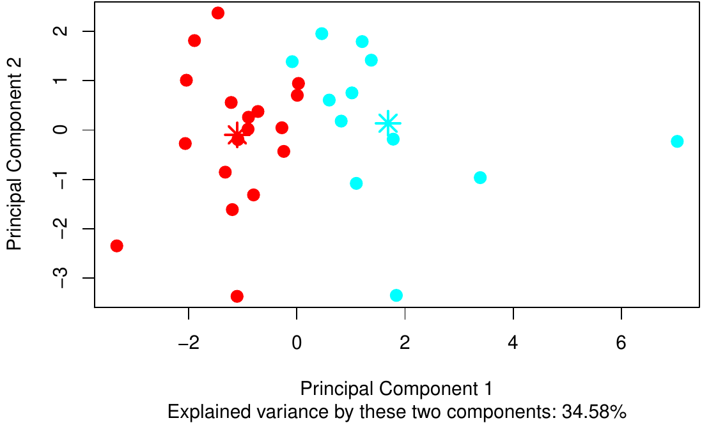
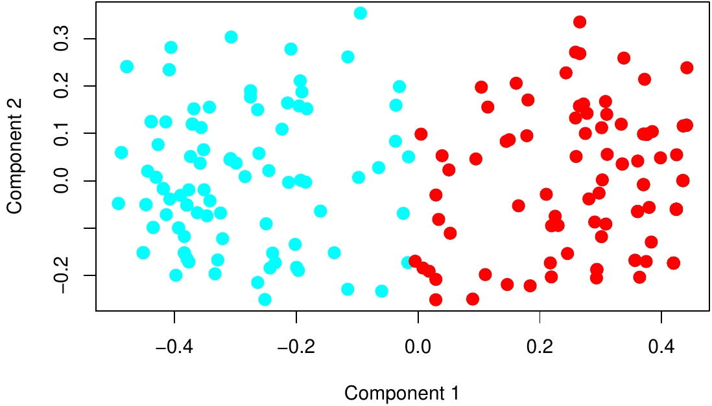

<div style="position:absolute;left:-10000px;top:auto;width:1px;height:1px;overflow:hidden;">This article is converted from a Legacy LaTeX article using the texor package. The pdf version is the official version. To report a problem with the html, refer to CONTRIBUTE on the R Journal homepage.
    This article includes tables which may not be properly formatted. This article includes figures which have not been given correct alternative text.</div>

::: article
# Introduction

Standard clustering algorithms assign a set of observations to a limited
number of clusters such that observations belonging to the same cluster
are more similar to each other than to those in other groups. Generally
speaking, such algorithms usually produce a *hard* partition of the
observations, i. e.  every observation is assigned to one and only one
cluster. This may often be too strict leading to unfeasible partitions.
The well-known Butterfly dataset [@Rus70] helps to clarify the problem.
It is available in the matrix `butterfly` of the package
[*fclust*](https://CRAN.R-project.org/package=fclust), provided that the
first and the last rows of the matrix are removed.

``` r
> data("butterfly", package = "fclust")
> butterfly <- butterfly[-c(1,17),]
> rownames(butterfly) <- as.character(rep(1:nrow(butterfly)))
> plot(butterfly, type = "n", xlab = "Var. 1", ylab="Var. 2")
> text(butterfly[,1], butterfly[,2], labels = rownames(butterfly), cex = 0.7, lwd = 2)
```

{#figure:butterfly width="100%"
alt="graphic without alt text"}

The Butterfly data refer to 15 observations and 2 variables. Two
clusters corresponding to the left and right wings (observations n.1-n.7
and n.9-n.15, respectively) of the butterfly can be graphically depicted
without any need of clustering tools. The assignment of observation n.8
(the body of the butterfly) is a much more complex issue because it is
at the halfway between the two clusters. Standard algorithms fail to
assign properly such an observation. For instance, let us consider the
(hard) $k$-means ($k$M) algorithm [@HW79], the most known clustering
algorithm. We run the $k$M algorithm (using the function `kmeans`) a
large number of times (`nt`).

``` r
> set.seed(12)
> nt <- 1000
> ca8 <- rep(NA,nt)
> lfv <- rep(NA,nt)
> for (n in 1: nt){
+   km.butterfly <- kmeans(butterfly, centers = 2, iter.max = 1000, nstart = 10)
+   lfv[n] <- km.butterfly[[5]]
+   if (km.butterfly$cluster[8] == km.butterfly$cluster[1]){
+     ca8[n] <- 1
+   }else{
+     ca8[n] <- 2
+   } 
+ }
```

``` r
> summary(lfv)
```

``` r
   Min. 1st Qu.  Median    Mean 3rd Qu.    Max. 
  31.43   31.43   31.43   31.43   31.43   31.43 
```

``` r
> table(ca8)
```

``` r
ca8
  1   2 
560 440 
```

We find (details not reported) that the same two clusters are always
obtained (the one formed by observations n-1-n.7, labelled Cluster 1,
and the other one by observations n-9-n.15, labelled Cluster 2), whilst
observation n.8 is assigned to one of the two clusters (`ca8`) by chance
without affecting the loss function value (`lfv`), i. e.  the total
within sum of squares.

The difficulty in the assignment of observation n.8 depends on the fact
that it shares the features of both the groups. This situation
frequently occurs in real life applications. In general, it may exist
observations without clear assignments to the clusters. In such cases,
it would be desirable to assign them to the clusters to a certain
extent. For instance, in the butterfly problem, observation n.8 should
be assigned to the two clusters with the same degree. This goal can be
achieved by the *fuzzy* approach to clustering where observations belong
to clusters with the so-called membership degrees in $[0,1]$ and, for
each observation, the sum of the membership degrees must be equal to 1.
Therefore, in fuzzy clustering, the observations are not strictly
assigned to one and only one cluster, but can share their memberships to
more than one cluster. To differentiate the fuzzy approach from the
standard hard one, it may also be referred to as *soft* clustering.

The most known fuzzy clustering algorithm is the fuzzy $k$-means
(F$k$M), proposed by @bezdek1981objective, which is the fuzzy
counterpart of $k$M. It has been implemented in several functions in
different R packages: we mention
[*cluster*](https://CRAN.R-project.org/package=cluster) [@cluster],
[*clue*](https://CRAN.R-project.org/package=clue) [@clue],
[*e1071*](https://CRAN.R-project.org/package=e1071) [@e1071fer],
[*skmeans*](https://CRAN.R-project.org/package=skmeans) [@skmeans],
[*vegclust*](https://CRAN.R-project.org/package=vegclust) [@vegclust],
[*ppclust*](https://CRAN.R-project.org/package=ppclust) [@ppclust] and
[*fclust*](https://CRAN.R-project.org/package=fclust) [@fclust]. Among
them, *fclust* offers a general toolbox for partitioning data using
fuzzy clustering algorithms, computing cluster validity indices and
visualizing clustering results. The current version (version 2.1.1) of
the package has been deeply improved with respect to the previous ones.
It contains several new routines and performance improvements. As a
first improvement, all the functions have been rewritten in the C++
language using [*Rcpp*](https://CRAN.R-project.org/package=Rcpp) [@Rcpp]
and [*RcppArmadillo*](https://CRAN.R-project.org/package=RcppArmadillo)
[@RcppArmadillo] to enhance their computational efficiency. In addition,
all the clustering algorithms can automatically select the optimal
number of clusters using the cluster validity indexes available in the
package. All the functions usually require data organized by
quantitative variables and observations (object data). To increase the
usability of the package, another relevant improvement is the
implementation of fuzzy clustering algorithms for relational data
[@dave2002robust]. Relational data come from measures of dissimilarity
between observations. Two clustering methods proposed by @dave2002robust
have been considered. They do not require any assumption about the
adopted measure of dissimilarity. Thus, such algorithms can be applied
to a wide range of data. Specifically, whilst all the functions for
object data require quantitative variables, those for relational data
can handle all kinds of data (quantitative, qualitative or mixed)
provided that a suitable measure of dissimilarity/distance is selected,
e. g.  the Gower distance [@gower1971general] specifying the option
`metric="gower"` of the function `daisy` in the package *cluster*.
Finally, new functions to compare two partitions in a fuzzy environment
have been implemented. Namely, the fuzzy versions of the Rand index [RI;
@rand1971objective], the adjusted Rand index [ARI;
@hubert1985comparing], and the Jaccard index
[@jaccard1901etude; @halkidi2001clustering] have been developed by
@campello2007fuzzy. The standard indexes are implemented in different
packages [see, for instance, @mclust; @Jac]. The fuzzy vartiants are now
available in *fclust*.

In this paper, after reviewing the most relevant fuzzy clustering
methods, we recall some of the original functions to present the new
improvements and we introduce the new functions by examples. We assume
that the latest version of *fclust* available on CRAN is already
installed with

``` r
> install.packages("fclust")
```

and loaded into the R session using

``` r
> library(fclust)
```

# Fuzzy clustering

[]{#Sec2 label="Sec2"}

In this section, we recall the fuzzy $k$-means algorithm
[@bezdek1981objective] and its extension suggested by
@gustafson1979fuzzy. Whilst the former detects spherical clusters, the
latter allows for clusters with ellipsoidal shape. Then, a fuzzy
clustering algorithm for relational data is described [@dave2002robust]

## Fuzzy $k$-means algorithm

The most known and used fuzzy clustering algorithm is the fuzzy
$k$-means (F$k$M) [@bezdek1981objective]. The F$k$M algorithm aims at
discovering the best fuzzy partition of $n$ observations into $k$
clusters by solving the following minimization problem:
$$\begin{array}{l}
\mathop {\min }\limits_{{\bf U},{\bf H}} { {J_{\mathrm{F}k\mathrm{M}}}} = \sum\limits_{i = 1}^n {\sum\limits_{g = 1}^k {u_{ig}^m d^2 \left( {{\bf x}_i ,{\bf h}_g } \right)} },  \\
 {\rm s}{\rm .t}{\rm .   \quad}u_{ig}  \in \left[ {0,1} \right], \sum\limits_{g{\rm  = 1}}^k {u_{ig} }  = 1,\\
\end{array} 
\label{modFKM}   (\#eq:modFKM)$$
where $d \left( {{\bf x}_i ,{\bf h}_g } \right)$ is the Euclidean
distance. In (\@ref(eq:modFKM)), $u_{ig}$ is the generic element of the
membership degree matrix ${\bf{U}}$ of order ($n \times k$), taking
values in the interval \[0,1\] and representing the membership degree of
observation $i$ to cluster $g$. The row-wise sums of ${\bf{U}}$ are
equal to 1. The propotypes (centroids)
${\bf{h}}_g=[h_{g1}, h_{g2}, \cdots, h_{gp}]$ ($g=1,\cdots, k$) are
stored in the matrix **H** of order ($k \times p$), being $p$ the number
of variables. Finally, the parameter $m$ tunes the fuzziness of the
obtained solution.

## Gustafson-Kessel extensions of the F$k$M algorithm

The F$k$M algorithm, as the standard $k$-Means, can determine only
spherical shaped clusters. This depends on the use of the Euclidean
distance to measure the dissimilarity between observations. This limits
its applicability when non-spherical clusters are expected. In order to
overcome this drawback, @gustafson1979fuzzy extend the F$k$M algorithm
by replacing the Euclidean distance with a cluster-specific Mahalanobis
distance:
$$d^2_M \left( {{\bf x}_i ,{\bf h}_g } \right)=\left({\bf x}_i -{\bf
h}_g\right)^{'} {\bf M}_g \left({\bf x}_i -{\bf h}_g\right),
\label{Mal}   (\#eq:Mal)$$
where ${\bf M}_g$ is a symmetric and positive-definite matrix of order
$p$. When ${\bf M}_g={\bf I}$, (\@ref(eq:Mal)) is equvalent to the
Euclidean distance. The Gustafson-Kessel F$k$M (briefly, GK-F$k$M)
consists in solving the following minimizatin problem
$$\begin{array}{l}
\mathop {\min }\limits_{{\bf U},{\bf H}, {\bf{M}}_1, \ldots, {\bf{ M}}_k} { {J_{\text{GK-F$k$M}}}} = \sum\limits_{i = 1}^n {\sum\limits_{g = 1}^k {u_{ig}^m d^2_M \left( {{\bf x}_i ,{\bf h}_g } \right)} },  \\
{\rm s}{\rm .t}{\rm . \quad  }u_{ig}  \in \left[ {0,1} \right], \sum\limits_{g{\rm  = 1}}^k {u_{ig} }  = 1, |{\bf M}_g|=\rho_g. \\
\end{array} \label{modGK}   (\#eq:modGK)$$
The constraints in (\@ref(eq:modGK)) are similar to those in
(\@ref(eq:modFKM)) except for the new ones on ${\bf M}_g$
($|{\bf M}_g|=\rho_g>0$, with $\rho_g$ fixed for each $g$), added to
avoid a trivial solution with ${\bf M}_g={\bf 0}$, that would be
obtained since $J_{\text{GK-F$k$M}}$ is linear in ${\bf M}_g$.

For the generic $g$-th cluster, the iterative solution of ${\bf{M}}_g$
is $[\rho_g |\textbf{V}_{g}|]^{\frac{1}{n}}\textbf{V}^{-1}_{g}$, where
$\textbf{V}_{g}$ is the fuzzy covariance matrix for cluster $g$, defined
as
$${\bf V}_g = \frac{\sum_{i=1}^{n} u^{m}_{ig} ({\bf x}_i - {\bf h}_g)({\bf x}_i - {\bf h}_g)^{'}}{\sum_{i=1}^{n}u^{m}_{ig}}, \quad g=1,\dots,k.$$
The eigenvalues and eigenvectors of ${\bf V}_g$ describe the shape and
orientation of the $g$-th cluster. When an eigenvalue is equal to $0$ or
when the condition number of ${\bf{V}}_g$ (i. e.  the ratio between its
maximum and minimum eigenvalue) is very large, the matrix is nearly
singular, hence ${\bf V}_g^{-1}$ cannot be calculated. The condition
$|{\bf V}_g|=\rho_g$ cannot overcome this drawback, as the determinant
becomes $0$. @babuska2002improved propose to avoid these numerical
problems by constraining the condition number of ${\bf{V}}_g$ to be
smaller than a predefined threshold. Since this might lead to overfit
the data, the update of ${\bf V}_g$ can be regularized by considering
the covariance matrix of the whole dataset. See, for more details,
@babuska2002improved.

## Fuzzy clustering algorithms for relational data

In practical applications it may occur that only relational data are
available. Relational data consist in the pairwise relations
(similarities or dissimilarities) between observations, stored in a
square matrix, say ${\bf{D}}$, not necessarily based on object data. In
fact, $\bf{D}$ can be built either by computing the dissimilarity (or
similarity) between all the pairs of observations on which a set of
variables are collected (indirect relational data) or according to
subjective expert knowledge, e. g.  a teacher expresses her/his
subjective degrees of dissimilarity for all the pair of pupils in
her/his classroom (direct relational data). In the latter case, fuzzy
clustering algorithms for object data can no longer be applied. In the
former case, fuzzy clustering algorithms for object data should be
preferred to those for relational data due to their computational
efficiency. Nonetheless, fuzzy clustering algorithms usually assume to
deal with quantitative variables preventing their applicability in case
of qualitative/mixed variables. In such a case, fuzzy clustering methods
for relational data can be fruitfully applied provided that a suitable
dissimilarity measure for qualitative/mixed variables is used.

In the literature, there exist several proposals of fuzzy clustering
algorithms for relational data. Among them, a valuable choice is
represented by the class of algorithms proposed by [@dave2002robust],
which are suitable for all kinds of dissimilarity. We assume that
${\bf{D}}$ is a dissimilarity matrix. If it contains similarities, these
should be converted into dissimilarities. For this purpose, e. g.  the
function `sim2diss` of the package
[*smacof*](https://CRAN.R-project.org/package=smacof) [@SMACOF] can be
used. The non-Euclidean fuzzy relational data clustering algorithm
(NEFRC) consists in solving the following minimization problem:
$$\begin{array}{l}
\mathop {\min }\limits_{{\bf U}} { {J_{\mathrm{NEFRC}}}} = \sum\limits_{g= 1}^k \frac{ \sum\limits_{i = 1}^n  \sum\limits_{j= 1}^n  u^m_{ig} u^m_{jg} d({\bf x}_i ,{\bf x}_j)}{2 \sum\limits_{t= 1}^n  u^m_{tg}},  \\
 {\rm s}{\rm .t}{\rm .   \quad}u_{ig}  \in \left[ {0,1} \right], \sum\limits_{g{\rm  = 1}}^k {u_{ig} }  = 1. \\
\end{array} \label{modNEFRC}   (\#eq:modNEFRC)$$
Notice that the NEFRC algorithm differs from the famous FANNY algorithm
proposed by @KaufmanRousseuw1990 since a general fuzzifier $m$ is used
and it is suitable for all kinds of dissimilarity.

The package also offers a robust variant of NEFRC involving the concept
of noise cluster. It is an additional cluster such that the outliers are
assigned to it with high membership degrees. It is not a cluster in a
strict sense because the outliers are not necessarily similar to each
other. Its role is that the membership degrees of the outliers to the
standard clusters tend to be low without affecting the obtained
partition. The robust version of NEFRC has been implemented in the
current version of *fclust* and represents the relational counterpart of
the F$k$M algorithm with noise cluster, already available in the
package.

# The package

[]{#Sec3 label="Sec3"}

::: {#table:fclust_functions}
  -------------------------------------------------------------------------------------------------------------------------------
        Function                                                   Algorithm                                                   
  --------------------- ------------------------------------------------------------------------------------------------ -- -- --
          `FKM`                                             standard F$k$M algorithm                                           

                                                             [@bezdek1981objective]                                            

        `FKM.ent`                                      F$k$M with entropy regularization                                       

                                                       [@li1995maximum; @li1999gaussian]                                       

       `FKM.noise`                                          F$k$M with noise cluster                                           

                                                          [@dave1991characterization]                                          

     `FKM.ent.noise`                          F$k$M with entropy regularization and noise cluster                              

                                                  [@li1999gaussian; @dave1991characterization]                                 

        `FKM.gk`                                    Gustafson and Kessel extension of F$k$M                                    

                                                             [@gustafson1979fuzzy]                                             

      `FKM.gk.ent`                    Gustafson and Kessel extension of F$k$M with entropy regularization                      

                                                                 [@MariaPaolo]                                                 

     `FKM.gk.noise`                        Gustafson and Kessel extension of F$k$M with noise cluster                          

                                                [@gustafson1979fuzzy; @dave1991characterization]                               

   `FKM.gk.ent.noise`        Gustafson and Kessel extension of F$k$M with entropy regularization and noise cluster             

                                                    [@MariaPaolo; @dave1991characterization]                                   

        `FKM.gkb`                               Gustafson, Kessel and Babuska extension of F$k$M                               

                                                  [@babuska2002improved; @gustafson1979fuzzy]                                  

      `FKM.gkb.ent`               Gustafson, Kessel and Babuska extension of F$k$M with entropy regularization                 

                                                      [@babuska2002improved; @MariaPaolo]                                      

     `FKM.gkb.noise`                  Gustafson, Kessel and Babuska extension of F$k$M with noise cluster                      

                                               [@babuska2002improved; @dave1991characterization]                               

   `FKM.gkb.ent.noise`   Gustafson, Kessel and Babuska extension of F$k$M with entropy regularization and noise cluster        

                                         [@babuska2002improved; @MariaPaolo; @dave1991characterization]                        

        `FKM.pf`                                        F$k$M with polynomial fuzzifier                                        

                                                     [@winkler2009fuzzy; @winkler2011fuzzy]                                    

     `FKM.pf.noise`                            F$k$M with polynomial fuzzifier and noise cluster                               

                                       [@winkler2009fuzzy; @winkler2011fuzzy; @dave1991characterization]                       

        `FKM.med`                                         fuzzy $k$-medoids algorithm                                          

                                                             [@krishnapuram2001low]                                            

     `FKM.med.noise`                             fuzzy $k$-medoids algorithm with noise cluster                                

                                               [@krishnapuram2001low; @dave1991characterization]                               

         `NEFRC`                           non-euclidean fuzzy relational algorithm [@dave2002robust]                          

      `NEFRC.noise`                       non-euclidean fuzzy relational algorithm with noise cluster                          

                                                  [@dave2002robust; @dave1991characterization]                                 
  -------------------------------------------------------------------------------------------------------------------------------

  : Table 1: List of fuzzy clustering algorithms available in the
  package *fclust*.
:::

In this section we present the main features of the package *fclust*
with particular emphasis on the more recent updates. The list of
algorithms with the corresponding functions is reported in Table
[1](#table:fclust_functions). Apart from some peculiarities, all the
available functions in the package require the same input arguments,
involving the set-up of the clustering algorithms, i. e. number of
starts, convergence criterion, data standardization. The user is not
requested to specify such arguments because default options are
specified. Obviously, the dataset to be clustered must be given.

Differently from the previous versions, the number of groups `k` is no
longer required. Of course, the user can select the integer value of
`k`, otherwise the optimal number of clusters is automatically chosen by
maximizing or minimizing one of the available fuzzy cluster validity
indices (see Table [2](#table:fclust_indices)) to be specified in the
option `index` (default `"SIL.F"`). By default the possible number of
clusters is in the vector `k=2:6`, unless a different integer vector is
selected by the user.

A fast way to apply one of the available algorithms is represented by
the function `Fclust`:

``` r
> Fclust (X, k, type, ent, noise, stand, distance)
```

In `Fclust` to choose a given algorithm, the options `type`, `ent`,
`noise` and `distance` should be set. `type` is a character string
specifying the type of algorithm to be used. The currently available
options are `"standard"` (the default option for FKM-type algorithms,
provided that `distance = FALSE`), `"polynomial"`, `"gk"`, `"gkb"`,
`"medoids"`. `ent` (default `FALSE`) and `noise` (default `FALSE`) are
logical values indicating, respectively, whether the entropy
regularization and the noise cluster should be used. Morever, `distance`
(default `FALSE`) is another logical value indicating whether the data
in `X` are distances/dissimilarities. When `distance = TRUE`, `type` is
constrained to be `"standard"` and NEFRC-type algorithms are run.
Finally, `stand` is used for standardization (default: no
standardization) and `k` indicates the desired number of clusters (only
for this function, the default value is `2`). For instance, the
researcher interested in applying the F$k$M algorithm with noise cluster
with $k=3$ clusters to `X` can digit:

``` r
> Fclust (X = X, k = 3, type = "standard", noise = TRUE)
```

::: {#table:fclust_indices}
  -------------------------------------------
  Function   Index
  ---------- --------------------------------
  `PC`       partition coefficient

  `MPC`      modified partition coefficient

  `PE`       partition entropy

  `XB`       partition entropy

  `SIL`      (crisp) silhouette

  `SIL.F`    fuzzy silhouette
  -------------------------------------------

  : Table 2: List of fuzzy cluster validity indices available in the
  package *fclust*.
:::

In the following we are going to present the main features and
improvements of the package by considering the standard F$k$M algorithm
(function `FKM`), the Gustafson--Kessel extension of F$k$M according to
the @babuska2002improved variant (function `FKM.gkb`), and the
clustering algorithm for relational data (function `NEFRC`).

## Fuzzy $k$-means (`FKM`) {#fuzzy-k-means}

The `FKM` function is applied to the NBA dataset available in *fclust*.
The dataset contains some statistics on 30 NBA teams for the regular
season 2017-2018 (source: <https://stats.nba.com/teams/traditional/>):
number of wins (`W`), field goals made (`FGM`), field goals attempted
(`FGA`), field goal percentage (`FGP`), 3 point field goals made
(`3PM`), 3 point field goals attempted (`3PA`), 3 point field goals
percentage (`3PP`), free throws made (`FTM`), free throws attempted
(`FTA`), free throw percentage (`FTP`), offensive rebounds (`OREB`),
defensive rebounds (`DREB`), assists (`AST`), turnovers (`TOV`), steals
(`STL`), blocks (`BLK`), blocked field goal attempts (`BLKA`), personal
fouls (`PF`), personal fouls drawn (`PFD`) and points (`PTS`). In
addition, two more variables are available indicating the conference
(`Conference`) and the playoff appearance (`playoff`). Both the
variables are objects of class `factor` with two levels.

The dataset can be loaded as following:

``` r
> data("NBA")
```

A subset of variables is considered for clustering purposes. The raw
values of field goals, point field goals and free throws are removed
(only the percentage values are considered), as well as the wins and the
personal fouls.

``` r
> X.NBA <- NBA[,c(4,7,10,11,12,13,14,15,16,17,20)]
```

We apply the function `FKM` to the obtained dataset. The parameter of
fuzziness `m` is set to `m = 1.2` (the default value `m = 2` was too
high producing an extremely fuzzy partition with membership degrees not
far from $0.5$) and the number of starts is fixed to 50 (`RS = 50`) to
avoid local optima. The number of clusters is automatically selected
using the fuzzy silhouette index (`index = "SIL.F"`). Notice that the
fuzzy silhouette index represents a fuzzy extension of the well-known
silhouette [@KaufmanRousseuw1990] involving the use of the membership
degree information [for further details, refer to @campello2007fuzzy].
Finally, we set `stand = 1` in order to standardize the data before
running `FKM`:

``` r
> fkm.NBA <-  FKM(X = X.NBA, m = 1.2, RS = 50, stand = 1, index = "SIL.F")
```

The `summary` method returns the most relevant information:

``` r
> summary(fkm.NBA)
```

``` r

 Fuzzy clustering object of class 'fclust' 
 
 Number of objects: 
 30
 
 Number of clusters: 
 2
 
 Cluster sizes: 
Clus 1 Clus 2 
    18     12 

 
 Clustering index values: 
SIL.F k=2 SIL.F k=3 SIL.F k=4 SIL.F k=5 SIL.F k=6 
0.2994904 0.2508281 0.2558217 0.2586680 0.2700120 

 
 Closest hard clustering partition: 
       Houston Rockets        Toronto Raptors  Golden State Warriors 
                     2                      2                      2 
        Boston Celtics     Philadelphia 76ers    Cleveland Cavaliers 
                     1                      2                      2 
Portland Trail Blazers         Indiana Pacers   New Orleans Pelicans 
                     1                      2                      2 
 Oklahoma City Thunder              Utah Jazz Minnesota Timberwolves 
                     1                      2                      2 
     San Antonio Spurs         Denver Nuggets             Miami Heat 
                     1                      2                      1 
       Milwaukee Bucks     Washington Wizards            LA Clippers 
                     2                      2                      1 
       Detroit Pistons      Charlotte Hornets     Los Angeles Lakers 
                     1                      1                      1 
       New York Knicks          Brooklyn Nets          Chicago Bulls 
                     1                      1                      1 
      Sacramento Kings          Orlando Magic          Atlanta Hawks 
                     1                      1                      1 
      Dallas Mavericks      Memphis Grizzlies           Phoenix Suns 
                     1                      1                      1 

 Cluster memberships:
  Clus 1
  [1] "Boston Celtics"         "Portland Trail Blazers"
 [3] "Oklahoma City Thunder"  "San Antonio Spurs"     
 [5] "Miami Heat"             "LA Clippers"           
 [7] "Detroit Pistons"        "Charlotte Hornets"     
 [9] "Los Angeles Lakers"     "New York Knicks"       
[11] "Brooklyn Nets"          "Chicago Bulls"         
[13] "Sacramento Kings"       "Orlando Magic"         
[15] "Atlanta Hawks"          "Dallas Mavericks"      
[17] "Memphis Grizzlies"      "Phoenix Suns"          
 Clus 2
  [1] "Houston Rockets"        "Toronto Raptors"       
 [3] "Golden State Warriors"  "Philadelphia 76ers"    
 [5] "Cleveland Cavaliers"    "Indiana Pacers"        
 [7] "New Orleans Pelicans"   "Utah Jazz"             
 [9] "Minnesota Timberwolves" "Denver Nuggets"        
[11] "Milwaukee Bucks"        "Washington Wizards"    

 Number of objects with unclear assignment (maximal membership degree <0.5): 
 0
 
 Membership degree matrix (rounded): 
                       Clus 1 Clus 2
Houston Rockets          0.02   0.98
Toronto Raptors          0.01   0.99
Golden State Warriors    0.02   0.98
Boston Celtics           0.92   0.08
Philadelphia 76ers       0.11   0.89
Cleveland Cavaliers      0.05   0.95
Portland Trail Blazers   0.95   0.05
Indiana Pacers           0.34   0.66
New Orleans Pelicans     0.00   1.00
Oklahoma City Thunder    0.78   0.22
Utah Jazz                0.14   0.86
Minnesota Timberwolves   0.12   0.88
San Antonio Spurs        0.77   0.23
Denver Nuggets           0.03   0.97
Miami Heat               1.00   0.00
Milwaukee Bucks          0.03   0.97
Washington Wizards       0.03   0.97
LA Clippers              0.96   0.04
Detroit Pistons          1.00   0.00
Charlotte Hornets        0.98   0.02
Los Angeles Lakers       0.93   0.07
New York Knicks          0.96   0.04
Brooklyn Nets            0.99   0.01
Chicago Bulls            1.00   0.00
Sacramento Kings         0.98   0.02
Orlando Magic            1.00   0.00
Atlanta Hawks            0.98   0.02
Dallas Mavericks         0.97   0.03
Memphis Grizzlies        0.99   0.01
Phoenix Suns             0.99   0.01

 Cluster summary: 
       Cl.size Min.memb.deg. Max.memb.deg. Av.memb.deg. N.uncl.assignm.
Clus 1      18          0.77             1         0.95               0
Clus 2      12          0.66             1         0.92               0

 Euclidean distance matrix for the prototypes (rounded): 
       Clus 1
Clus 2   2.91

 Available components: 
 [1] "U"         "H"         "F"         "clus"      "medoid"   
 [6] "value"     "criterion" "iter"      "k"         "m"        
[11] "ent"       "b"         "vp"        "delta"     "stand"    
[16] "Xca"       "X"         "D"         "call"     

 
```

According to `SIL.F`, we select the solution with $k = 2$ clusters. The
obtained clusters can be plotted on the plane spanned by the first two
principal components. This can be done by using the method `plot`
associated to an *fclust* object specifying the option `pca = TRUE`.

<figure id="plot:fkmNBA">
<div class="sourceCode" id="cb1"><pre class="sourceCode r"><code class="sourceCode r"><span id="cb1-1"><a href="#cb1-1" aria-hidden="true" tabindex="-1"></a><span class="sc">&gt;</span> <span class="fu">plot</span>(fkm.NBA, <span class="at">pca =</span> <span class="cn">TRUE</span>)</span></code></pre></div>

<figcaption>Figure 2: Scatterplot of the NBA teams on the plane spanned
by the first two principal components. Points are marked according to
the obtained partition (Cluster 1: red, Cluster 2: cyan).</figcaption>
</figure>

We can see that the first component is able to distinguish the two
clusters. Teams with high first component scores belong to Cluster 2 and
those with low scores to Cluster 1. The first component loadings are
(the script is omitted):

``` r
   FGP    3PP    FTP   OREB   DREB    AST    TOV    STL    BLK   BLKA 
 0.455  0.305  0.278 -0.157  0.158  0.395  0.071  0.160  0.370 -0.338 
   PTS 
 0.369 
```

Hence, it appears that the clusters are mainly distinguish in terms of
`FGP`, `AST`, `BLK`, `PTS`, `BLKA`, `3PP` and `FTP`, i. e.  the
variables with the highest first component loadings in absolute value.

In order to interpret the clusters, we inspect the prototypes. To this
purpose, we apply the function `Hraw` to visualize the prototypes by
using the original units of measurement.

``` r
> round(Hraw(X = X.NBA, H = fkm.NBA$H), 3)
```

``` r
         FGP   3PP   FTP  OREB   DREB    AST    TOV   STL   BLK  BLKA
Clus 1 0.451 0.358 0.759 9.830 33.757 22.483 14.252 7.446 4.581 4.996
Clus 2 0.474 0.367 0.780 9.513 33.891 24.425 14.305 8.096 5.145 4.548
           PTS
Clus 1 104.362
Clus 2 109.357
```

We can see that Cluster 2 recognizes the best teams. In fact, the values
of the prototype of Cluster 2 are better than the corresponding ones of
Cluster 1, except for a few variables such as `OREB` and `BLKA`. To
further characterize the obtained clusters, we consider the variables
`Conference` and `Playoff`. In particular, we aim at discovering whether
the two clusters can be interpreted in terms of the geographical
location and/or the playoff appearance. From a statistical point of
view, this consists in comparing the fuzzy partition resulting from
`FKM` with the hard ones corresponding to the classification variables
`Conference` or `Playoff`. For this purpose, the fuzzy cluster
similarity measures available in the package are considered. Such
measures, proposed by @campello2007fuzzy, are summarized in Table
[3](#table:fclust_compare).

::: {#table:fclust_compare}
  ----------------------------------------------------
  Function      Index
  ------------- --------------------------------------
  `RI.F`        Fuzzy version of Rand index

  `ARI.F`       Fuzzy version of adjusted Rand index

  `JACCARD.F`   Fuzzy version of Jaccard index
  ----------------------------------------------------

  : Table 3: List of fuzzy cluster similarity measures available in the
  package *fclust*.
:::

To report the values of the three measures, the function
`Fclust.compare` can be used. The input required by `Fclust.compare`
(and similarly for `RI.F`, `ARI.F` and `JACCARD.F`) is a fuzzy
membership degree matrix (`U`) and a vector of class labels (`VC`).

``` r
> Fclust.compare(VC = NBA$Playoff, U = fkm.NBA$U)
```

``` r
    ARI.F      RI.F JACCARD.F 
0.3077549 0.6537339 0.4825140 
```

``` r
> Fclust.compare(VC = NBA$Conference, U = fkm.NBA$U)
```

``` r
      ARI.F        RI.F   JACCARD.F 
-0.02547957  0.48701485  0.31724090 
```

It is clear that the clusters cannot be interpreted from a geographical
point of view, whilst, to some extent, they are related to the playoff
appearance. Such a comment holds especially for Cluster 2. In fact, 11
out of 12 teams belonging to Cluster 2 reached the playoff stage. The
only exception is `Denver Nuggets`, which was one of the best teams in
terms of number of wins (`W`) but not qualified to the playoff stage,
because the number of wins was not sufficient to reach the playoff stage
in the Western conference.

## Gustafson-Kessel extensions of the F$K$M algorithm (`FKM.gk` and `FKM.gkb`) {#gustafson-kessel-extensions-of-the-fkm-algorithm-and}

The Gustafson-Kessel extension of the F$k$M algorithm is implemented in
the functions `FKM.gk` and `FKM.gkb`. The former implements the GK-F$k$M
algorithm in the original proposal, whilst the latter, recently added to
the package, considers the computational improvement suggested by
@babuska2002improved. A simulated dataset similar to the one in
@babuska2002improved is used to show the differences between the two
functions. Three different clusters with different size ($100$, $80$,
and $60$) in two-dimensional space are generated as follows:
$$%y_k = \Bigg \{
y = \Bigg \{
\begin{array}{rl}
%6 -2.0x_{1}  &\quad \text{with $x_1 \sim U(1,3)$  for $k=1$}, \\
%-5 +1.5x_{2}  &\quad \text{with $x_2 \sim U(3.2,6)$   for $k=2$}, \\
%3x_{3}  &\quad \text{with $x_3 \sim U(-1,1)$   for $k=3$}. \\
6 -2.0x      &$\quad$ \text{with $x \sim U(1,3)$  for Cluster 1}, \\
-5 +1.5x  &$\quad$ \text{with $x \sim U(3.2,6)$   for Cluster 2}, \\
3x            &$\quad$ \text{with $x \sim U(-1,1)$   for Cluster 3}. \\
\end{array}$$
Data can be found in *fclust* and loaded with the following command:

``` r
> data(synt.data2)
```

Figure [3](#plot:synt) shows the scatterplot of the simulated data. In
this case the cluster covariance matrices are singular because the two
variables are perfectly collinear in all the clusters.

{#plot:synt width="100%"
alt="graphic without alt text"}

By employing the standard function `FKM.gk` numerical problems occur. By
setting `m = 2`, `k = 3` and `RS = 1`, we have:

``` r
> fkm.gk.synt <- FKM.gk(X = synt.data2, k = 3, RS = 1)
```

The following `warning` message appears:

``` r
Warning message:
In FKM.gk(X = synt.data2, k = 3, RS = 1) :
  When k=3, at least one cluster covariance matrix seems to be singular. 
  Increase the number of starts RS or use FKM.gkb
```

Thus, we can see that the algorithm stops because at least one cluster
covariance matrix is singular. In this case, the function returns the
standard object of class `fclust` containing the sub-optimal solution at
the previous iteration, i. e.  the one with no singular cluster
covariance matrices. By studying the number of iterations and the loss
function value of such a local optimum solution, we get:

``` r
> fkm.gk.synt$iter
```

``` r
Start 1 
     13 
```

``` r
> fkm.gk.synt$value
```

``` r
   Start 1 
0.06044555 
```

For comparative purpose, we run the recommended function `FKM.gkb` using
the same start:

``` r
> fkm.gkb.synt <- FKM.gkb(X = synt.data2, k = 3, RS = 1, seed = 123)
```

``` r
> fkm.gkb.synt$iter
```

``` r
Start 1 
     16 
```

``` r
> fkm.gkb.synt$value
```

``` r
     Start 1 
1.482029e-05 
```

The method required two more iterations for convergence. The obtained
solution is characterized by a lower loss function value and is not
affected by singularity problems.

## Fuzzy clustering for indirect relational data (dichotomous variables) {#fuzzy-clustering-for-relational-data}

The NEFRC algorithm can be applied using the function `NEFRC`.
Differently from the other functions for clustering object data, it
requires distances/dissimilarities as input argument. Consistently with
the other functions, the available clustering indices (except for the
Xie and Beni one) can be used to select the optimal number of clusters
`k`. In particular, the silhouette index (`SIL`) and its fuzzy extension
(`SIL.F`) have been rearranged for relational data. Specifically, the
input of `NEFRC` is employed to compute the silhouette and the fuzzy
silhouette indices. This is the default option when `SIL.F` is called by
`NEFRC`. In order to use the distance/dissimilarity matrix for computing
the fuzzy silhouette index, the option `distance = TRUE` in `SIL.F`
should be set. Generally speaking, the fuzzy silhouette index can be
applied for any kind of data (quantitative or qualitative or mixed)
provided that a suitable distance/dissimilarity matrix is used as input.

The function `NEFRC` is presented by considering the congressional
voting records data [@schlimmer1987concept] available in *fclust*. The
data collect 1984 United Stated voting records for 475 U.S. House of
Representative congressmen on 16 key votes identified by the
Congressional Quartely Almanac (CQA). The congressmen are split into
Democrats and Republicans (variable `class`). The 16 key votes are
objects of class `factor` with three levels according to the CQA scheme:
`y` refers to the types of votes "voted for", "paired for" and
"announced for"; `n` to "voted against", "paired against" and "announced
against"; `yn` to "voted present", "voted present to avoid conflict of
interest" and "did not vote or otherwise make a position known".

The dataset can be loaded as follows:

``` r
> data("houseVotes")
```

It contains the following variables:

``` r
> colnames(houseVotes)
```

``` r
 [1] "class"                                  "handicapped-infants"                   
 [3] "water-project-cost-sharing"             "adoption-of-the-budget-resolution"     
 [5] "physician-fee-freeze"                   "el-salvador-aid"                       
 [7] "religious-groups-in-schools"            "anti-satellite-test-ban"               
 [9] "aid-to-nicaraguan-contras"              "mx-missile"                            
[11] "immigration"                            "synfuels-corporation-cutback"          
[13] "education-spending"                     "superfund-right-to-sue"                
[15] "crime"                                  "duty-free-exports"                     
[17] "export-administration-act-south-africa"
```

Since the level `yn` might indicate unknown preferences for some key
votes, these values are considered as missing and, therefore, the rows
with at least one `yn` value are removed:

``` r
> level.drop <- droplevels(houseVotes, exclude = "yn")
> houseVotesComplete <- level.drop[complete.cases(level.drop),]
```

The research interest relies in discovering whether a two-cluster
structure exists and a relationship between the political position and
the system of voting emerges. Even if the dataset is not relational,
`NEFRC` is the only one `R` routine for getting a fuzzy partition based
on qualitative variables. For this purpose, the Gower distance,
implemented in the function `daisy` of the package *cluster*, is used to
generate the dissimilarity matrix:

``` r
> X.houseVotesComplete <- houseVotesComplete[,-1]
> library(cluster)
> D.houseVotes <- daisy(x = X.houseVotesComplete, metric = "gower")
```

The standard algorithm for relational data is employed by running the
function `NEFRC` setting `m = 1.5` and `k = 2` in order to assess
whether the clusters are related to the parties (`class`).

``` r
> nefrc.houseVotes <- NEFRC(D = D.houseVotes, k  = 2, m = 1.5, index = "SIL.F")
```

The `summary` method is similar to that of `FKM` and hence not reported.
The two clusters can be interpreted in terms of the parties. In fact, we
get the following cluster similarity measures:

``` r
> Fclust.compare(VC = houseVotesComplete$class, U = nefrc.houseVotes$U)
```

``` r
    ARI.F      RI.F JACCARD.F 
0.4871095 0.7435544 0.5914710
```

<figure id="figure:Rclust">
<div class="sourceCode" id="cb1"><pre class="sourceCode r"><code class="sourceCode r"><span id="cb1-1"><a href="#cb1-1" aria-hidden="true" tabindex="-1"></a><span class="sc">&gt;</span> <span class="fu">plot</span>(nefrc.houseVotes)</span></code></pre></div>

<figcaption>Figure 4: Scatterplot of relational data with
<code>plot</code> method. Points are marked according to the obtained
classification (Cluster 1: red, Cluster 2: cyan).</figcaption>
</figure>

Morevover, we have:

``` r
> table(nefrc.houseVotes$clus[,1], houseVotesComplete$class)
```

``` r
   
    democrat republican
  1       19        101
  2      105          7
```

Therefore, Cluster 1 and Cluster 2 refer to the Republicans and
Democrats, respectively. In Figure [4](#figure:Rclust) the clusters are
plotted in the low dimensional space spanned by the first two
components. Note that the `plot` method for relational data is based on
non-metric multidimensional scaling [@kruskal1964nonmetric] by calling
the function `isoMDS` of the package
[*MASS*](https://CRAN.R-project.org/package=MASS) [@MASSfer].

To further interpret the clusters, Figure [5](#figure::barplot) displays
the barplots of the 16 key votes for the two clusters (by considering
the closest hard clustering partition). We can observe that the votes
are highly connected with the Congressmen political positions. This
holds for almost all the 16 key votes with particular reference to,
e. g.  `"adoption-of-the-budget"`, `"education-spending"` and
`"anti-satellite-test-ban"`.

{#figure::barplot width="100%"
alt="graphic without alt text"}

## Fuzzy clustering for indirect relational data (ordinal variables) {#fuzzy-clustering-for-relational-data 2}

In this section, a dataset with ordinal data is analyzed by using
`NEFRC`. The data refer to the Math Anxiety Scale Survey administered to
$20$ students in a statistics course [@BaiEtal2009]. In the survey, each
student answers $14$ questions by using a Likert scale with five levels
(`"Strongly Disagree"`, `"Disagree"`, `"Neutral"`, `"Agree"`,
`"Strongly Agree"`). First, we load the dataset:

``` r
> library(likert)
> data("mass")
```

Then, we compute the dissimilarity matrix by using the Gower distance.
When applied to ordinal variables, such a distance is based on ranks.
Note that the first variable of `mass` is `Gender`, not useful for
clustering purposes and, thus, omitted in the computation of the
dissimilarity matrix. We have:

``` r
> library(cluster)
> D.mass <- daisy(x = mass[,-1], metric = "gower")
```

Finally, we run the function `NEFRC` automatically selecting the number
of clusters by means of `SIL.F`:

``` r
> nefrc.mass <- NEFRC(D = D.mass, index = "SIL.F")
```

The fuzzy silhouette values, employed to select the number of clusters,
are:

``` r
> nefrc.mass$criterion
```

``` r
SIL.F k=2 SIL.F k=3 SIL.F k=4 SIL.F k=5 SIL.F k=6 
0.5330319 0.4623684 0.4039311 0.4428360 0.4685703 
```

Hence, $k=2$ clusters are suggested. Since the default options are used,
the solution could also be obtained by considering the function
`Fclust`:

``` r
> nefrc.mass <- Fclust(X = D.mass,  k = 2, noise = FALSE, distance = TRUE)
```

The clusters can be interpreted according to the observed qualitative
variables. For this purpose, we calculate the p-values resulting from
the ${\chi}^2$ tests by which we study the independence between the
closest hard clustering partition and every observed variables. The
p-values are stored in the vector `PV`:

``` r
> PV <- rep(NA,ncol(mass))
> for (j in 1:ncol(mass)) PV[j] <- chisq.test(nefrc.mass$clus[,1], mass[,j])$p.value
```

At the significance level $\alpha = 0.05$, we are interested in those
variables such that the corresponding p-value is lower than $\alpha$:

``` r
> alpha <- 0.05
> names(mass)[PV < alpha]
```

``` r
 [1] "I find math interesting."                                                 
 [2] "I get uptight during math tests."                                         
 [3] "Mind goes blank and I am unable to think clearly when doing my math test."
 [4] "I worry about my ability to solve math problems."                         
 [5] "I get a sinking feeling when I try to do math problems."                  
 [6] "I find math challenging."                                                 
 [7] "Mathematics makes me feel nervous."                                       
 [8] "Mathematics makes me feel uneasy."                                        
 [9] "Math is one of my favorite subjects."                                     
[10] "I enjoy learning with mathematics."                                       
[11] "Mathematics makes me feel confused."                                      
```

We inspect the contingency tables (not reported here) between such a
subset of observed variables and the closest hard clustering partition
and we find that Cluster 1 is characterized by large frequencies for the
modalities `"Strongly Disagree"` and `"Disagree"` with respect to the
variables `"I find math interesting."`,
`"Math is one of my favorite subjects."` and
`"I enjoy learning with mathematics."` and large frequencies for the
modalities `"Agree"` and `"Strongly Agree"` with respect to the
variables `"I get uptight during math tests."`,
`"Mind goes blank and I am unable to think clearly when doing my math test."`,
`"I worry about my ability to solve math problems."`,
`"I get a sinking feeling when I try to do math problems."`,
`"I find math challenging."`, `"Mathematics makes me feel nervous."`,
`"Mathematics makes me feel uneasy."` and
`"Mathematics makes me feel confused."`. Of course, the opposite comment
holds for Cluster 2. Therefore, the partition distinguishes the students
liking math (assigned to Cluster 2) from those who experience feelings
of stress when faced with math (assigned to Cluster 1).

## Fuzzy clustering for direct relational data {#fuzzy-clustering-for-relational-data3}

In the previous two subsections, `NEFRC` is applied in order to discover
homogeneous clusters of observations on which qualitative variables are
collected. In these cases, suitable dissimilarity matrices are built
before running `NEFRC`. In the current subsection, we consider the case
where variables are not available and the only information about the
observations is expressed in terms of their dissimilarities or
distances. The data are stored in the following object of class `dist`:

``` r
> library(smacof)
> data("FaceExp")
```

`FaceExp` contains the dissimilarities between pairs of 13 facial
expressions related to particular stimuli:

``` r
> labels(FaceExp)
```

``` r
 [1] "Grief at death of mother"         "Savoring a Coke"                 
 [3] "Very pleasant surprise"           "Maternal love-baby in arms"      
 [5] "Physical exhaustion"              "Something wrong with plane"      
 [7] "Anger at seeing dog beaten"       "Pulling hard on seat of chair"   
 [9] "Unexpectedly meets old boyfriend" "Revulsion"                       
[11] "Extreme pain"                     "Knows plane will crash"          
[13] "Light sleep"                      
```

The dissimilarities have been calculated in a psychological experiment
where a set of subjects were invited to judge how much two pictures of
emotional expressions differ. Thus, all the possible pairs of emotional
expressions were compared by the subjects and the dissimilarities were
derived. See, for further details, @AbSe1962 .

By means of `NEFRC` the aim is to discover whether similar facial
expressions are perceived by the subjects in connection with similar
emotions intended by the stimuli. In this case, we do not know the
number of clusters and, therefore, we determine it according to `SIL.F`.

``` r
> nefrc.FaceExp <- NEFRC(D = FaceExp, index = "SIL.F")
```

We find that $k=3$ should be set:

``` r
> nefrc.FaceExp$criterion
```

``` r
SIL.F k=2 SIL.F k=3 SIL.F k=4 SIL.F k=5 SIL.F k=6 
0.5298465 0.5929045 0.5470887 0.5436513 0.4003177 
```

The interpretation of the clusters can be done by seeking a common
feature for the facial expressions, i. e.  the stimuli, assigned to the
same cluster. We have:

``` r
> round(nefrc.FaceExp$clus[(nefrc.FaceExp$clus[,1] == 1), 2], 2)
```

``` r
Savoring a Coke   Very pleasant surprise  Maternal love-baby in arms  
       0.64                0.85                      0.75                
Pulling hard on seat    Unexpectedly meets old boyfriend 
        0.59 		         0.94 
```

``` r
> round(nefrc.FaceExp$clus[(nefrc.FaceExp$clus[,1] == 2), 2], 2)
```

``` r
Grief at death of mother      Physical exhaustion    Revulsion  
    0.79                     	 0.81               0.69         
Extreme pain    Light sleep
    0.56            0.64
```

``` r
> round(nefrc.FaceExp$clus[(nefrc.FaceExp$clus[,1] == 3), 2], 2)
```

``` r
Something wrong with plane      Anger at seeing dog beaten     Knows plane will crash 
       0.52                     	    0.93                         0.78 
```

Cluster 1 groups pleasant stimuli with the only exception of
`"Pulling hard on seat of chair"` for which the membership degree is
however the lowest one (`0.59`). The facial expressions showing pain
belong to Cluster 2. `"Light sleep"` is also assigned to the cluster. It
follows that the subjects tend to associate such an expression with
suffering. Finally, anxiety characterizes Cluster 3.

# Conclusion {#summary}

[]{#sec:summary label="sec:summary"}

In this paper we have described the main features of the package
*fclust*. *fclust* represents a toolbox for fuzzy cluster analysis. The
functions in the package offer a wide range of fuzzy clustering
algorithms, fuzzy cluster validity indices, measures of similarity for
comparing hard and fuzzy partitions and visualization tools for fuzzy
clustering results. Particular attention has been paid to the new
improvements and implementations available in the current version of the
package (version 2.1.1). First of all, the functions have been updated
by using the C++ language, with a remarkable reduction in computation
time. Furthermore, the package now includes some fuzzy clustering
algorithms for relational data, allowing the user to perform a fuzzy
clustering analysis when the variables are qualitative or mixed. In such
cases, a dissimilarity matrix can be built by using the existing R
functions (e. g.  `dist` or `daisy` in the package *cluster*) and the
available functions for relational data (`NEFRC` and `NEFRC.noise`) can
then be applied. As far as we know, `NEFRC` and `NEFRC.noise` represent
the first available `R` functions for fuzzy clustering of qualitative or
mixed variables. All the functions have been revised in such a way that
the number of clusters can be automatically selected. This might
increase the computation time, but it is crucial in order to spread the
use of fuzzy clustering methods especially for non-expert users. In this
connection, the function `Fclust` for running the available algorithms
using the default options and specifying the desired number of clusters
is also offered.
:::
