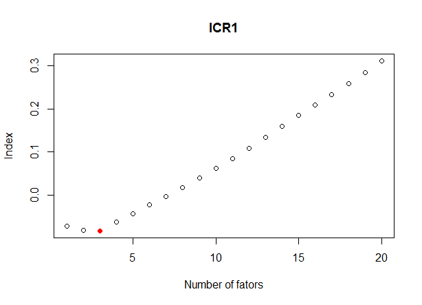

::: article
# Introduction

Important economic decisions are made based on current and future
conditions. Oftentimes, the variables used to measure such conditions
are not available even for the recent past. This is, for instance, the
case with US GDP that is published 45 days after the end of the quarter.
Similarly, Brazilian GDP is published with a 60-day lag. There is
therefore a need for forecasting the current value of given variables.
To this end, [@giannoneetal2008] proposed a statistical model that
allows quarterly variables, such as US GDP, to be forecast using a large
set of monthly variables released with different lags. GDP forecasts for
the current quarter are, furthermore, updated whenever new information
is available. Different central banks have shown interest in this
methodology, among them the European Central Bank
[@angelini2008; @banburarunstler2011; @vanetal2008], and the central
banks of Ireland [@dagostino2008], New Zealand [@mat2010] and Norway
[@as2012].

Factor models are designed to summarize the variation contained in a
large dataset into only a few variables [@stockwatson2006]. In
[@giannoneetal2008], the authors show how to reduce the information
contained in dozens of monthly time series into only two dynamic
factors. These two estimated factors, which are initially monthly, are
then transformed into quarterly factors and used in a regression against
GDP. Various other authors, such as
[@BRE3191; @marcelino2003; @fornietal2004; @boivinng2006; @dagostino2006; @banburaetal2011; @dah2017; @stock2016],
have explored Dynamic Factor Models (DFMs) in time series forecasting
and found promising results.

Given the publication lag of many variables, such as GDP, we can either
forecast past, current or future values. In order to differentiate
between those types of forecasts we adopt the terminology used in
[@giannoneetal2008] and [@banburaetal2011]. Backcasting refers to
forecasting the value of a yet unpublished variable for a past period,
while nowcasting will be with respect to the current period. By way of
illustration, suppose we want to forecast the GDP for the $2^{nd}$
quarter of 2018. If the exercise is made during the $2^{nd}$ quarter of
2018, then the forecast is classified as nowcasting. However, if the
current date is before the $2^{nd}$ quarter of 2018, then the term used
is forecasting. Finally, if the date is after the $2^{nd}$ quarter of
2018 and the GDP has not yet been released, then the forecast is
classified as backcasting.

The aim of the package *nowcasting* is to offer the tools for the
[R]{.sans-serif} user to implement dynamic factor models. The different
steps in the forecasting process and the associated functions within the
package are based on the literature. We have chosen to divide the
process into 4 main steps: 1) constructing a dataset; 2) defining the
model's initiation parameters; 3) forecasting; 4) presenting results.
This particular division will be maintained in most sections.

This brings us to the article's sections that are organized as
follows: 1) the theoretical framework is introduced; 2) the functions of
our package are presented; 3) working examples of how to nowcast
Brazilian GDP and of the New York FED nowcasting are given; 4) and
finally the last section concludes with some considerations.

# Methodology

## Dynamic Factor Model

Let $x_t = (x_{1,t},x_{2,t}, ..., x_{N,t})^{'}$ be the vector
representing $N$ monthly time series transformed to satisfy the weak
stationarity assumption. The general specification of the dynamic factor
model is given by:

$$\begin{aligned}
x_t   &= \mu + \Lambda f_t + \varepsilon_t \label{eq_xt} \\
\end{aligned}   (\#eq:eq-xt)$$

$$\begin{aligned}
f_{t} &= \sum_{i=1}^{p} A_i f_{t-i} + B u_t, \quad u_t \sim i.i.d. N(0,I_q) \label{eq_ft}
\end{aligned}   (\#eq:eq-ft)$$

In equation \@ref(eq:eq-xt), the variables $x_t$ are expressed as a
function of an intercept $\mu$ and $r$ unobserved common factors $f_t$.
Since all variables $x$ will later be demeaned, one may drop the
unconditional means $\mu$. The variables $x_t$ will be loaded into the
unobserved factors $f_t$ through $\Lambda$. Equation \@ref(eq:eq-ft)
imposes the structure of a VAR(p) process on the factors $f_t$. Both
$\varepsilon_t$ and $u_t$ are normal, allowing the use of the Kalman
Filter. Furthermore, the vector of idiosyncratic component
$\varepsilon_t$ is unrelated to $u_t$ at all lags, i.e.,
$E[\epsilon_t u_{t-k}'] = 0$ for any k. An interesting feature of
equation \@ref(eq:eq-ft) is that the number of shocks $q$ to the factors
need not be equal to the number of factors $r$. Structural breaks or
lead/lag relationships of the $r$ factors with $q$ common shocks may
motivate such a modeling choice (see [@stock2016] for more information).

In the so-called *exact dynamic factor model*, the error components from
equation (\@ref(eq:eq-xt)) are assumed to be mutually uncorrelated at
all lags, i.e., $E[\varepsilon_{i,t} \varepsilon_{j,s}] = 0$ for
$i \neq j$. However, following [@banburaetal2011], the error term could
be modeled as an AR(p') process:

$$\label{eq_arq}
\varepsilon_{i,t} = \sum_{j=1}^{p'} \alpha_{i,j} \varepsilon_{i,t-j} + e_{i,t}, \quad e_{i,t} \sim i.i.d. N(0,\sigma^2_i)   (\#eq:eq-arq)$$

where $E[e_{i,t} e_{j,s}] = 0$ for $i \neq j$.

Following is an example, in matrix form, of equation (\@ref(eq:eq-ft))
of the model for orders $r = 2$, $p = 2$ and $q = 2$.

$$\begin{bmatrix}
f_{1,t}\\
f_{2,t}\\
f_{1,t-1}\\
f_{2,t-1}
\end{bmatrix}
=
\begin{bmatrix}
a^1_{1,1} & a^1_{1,2} & a^2_{1,1} & a^2_{1,2} \\
a^1_{2,1} & a^1_{2,2} & a^2_{2,1} & a^2_{2,2} \\
1 & 0 & 0 & 0 \\
0 & 1 & 0 & 0
\end{bmatrix}
\begin{bmatrix}
f_{1,t-1}\\
f_{2,t-1}\\
f_{1,t-2}\\
f_{2,t-2}
\end{bmatrix}
+
\begin{bmatrix}
b_{1,1} & b_{1,2}\\
b_{2,1} & b_{2,2}\\
0 & 0\\
0 & 0
\end{bmatrix}
\begin{bmatrix}
u_{1,t}\\
u_{2,t}
\end{bmatrix}$$

$$F_t
=
\begin{bmatrix}
A_1 & A_2 \\
I_2 & 0
\end{bmatrix}
F_{t-1}
+
B
u_t$$

## Quarterly and monthly variables {#m2q}

In order to predict a quarterly variable using monthly data, we
construct a partially observed monthly counterpart of the quarterly
variable as proposed in [@marianomurasawa2003]. This allows, for
instance, quarterly GDP to be explained by monthly variables. Continuing
with this example, let $Y_t^M$ be the level of the unobservable monthly
GDP level and $Y_t^Q$ the quarterly value of GDP for the partially
observable monthly series. As is usual in the literature, we let
quarterly GDP be observable in the third month of the quarter.

$$\label{eq::partially observable quarterly variable}
Y_t^Q = \begin{cases}
Y_t^M + Y_{t-1}^M + Y_{t-2}^M, & t = 3,6,9, \dots\\
\text{unobserved} & \text{ otherwise }
\end{cases}   (\#eq:partially-observable-quarterly-variable)$$

The above accounting rule states that the quarterly GDP flow is equal to
the sum of the monthly flows. Looking at the quarterly change,
$y_t^Q = Y_t^Q - Y_{t-3}^Q$ [^1], it is easy to show that it can be
expressed as a function of the differences of the monthly variable,
$y_t = Y_t^M - Y_{t-1}^M$, by using equation
\@ref(eq:partially-observable-quarterly-variable):

$$\begin{split}
    y_t^Q &= Y_t^Q - Y_{t-3}^Q \\
    &= Y_t^Q + Y_{t-1}^Q - Y_{t-1}^Q + Y_{t-2}^Q - Y_{t-2}^Q - Y_{t-3}^Q\\
    &= y_t + 2y_{t-1} + 3y_{t-2} + 2y_{t-3} + y_{t-4}, \quad  t = 6,9, \dots
\end{split}$$

Suppose that the variable of interest is a quarterly rate of change,
$x_t^Q$, defined as:

$$\label{eq::quarterly growth}
x_t^Q \equiv \log(Y_t^Q) - \log(Y_{t-3}^Q)   (\#eq:quarterly-growth)$$

Stating the approximation between the arithmetic and geometric means we
have:
$$\label{eq::arithmetic geometric approximation}
    \frac{1}{3}[Y_t^M+Y_{t-1}^M+Y_{t-2}^M] \approx \sqrt[3]{Y_t^MY_{t-1}^MY_{t-2}^M}   (\#eq:arithmetic-geometric-approximation)$$

Combining equations \@ref(eq:quarterly-growth) and
\@ref(eq:arithmetic-geometric-approximation) we obtain the approximation
from [@marianomurasawa2003] that expresses the quarterly growth rate of
GDP as a function of the unobservable monthly growth rates $x_t^M$:

$$\label{eq:Mariano&Murusawa}
x_t^Q \approx \frac{1}{3} \bigg[x_t^M + 2x_{t-1}^M + 3x_{t-2}^M + 2x_{t-3}^M + x_{t-4}^M\bigg]   (\#eq:Mariano&Murusawa)$$

Suppose that the unobserved monthly growth rate $x_t^M$ also admits the
same factor representation as in equation \@ref(eq:eq-xt) with loadings
$\Lambda_Q$, then the quarterly GDP growth rate, $x_t^Q$, can be
expressed as a function of monthly factors.

$$\label{eq::quarterly loadings}
x_t^Q = \overline{\Lambda_{Q}} \ \bigg[f'_t \ \dots \ f_{t-4}'\bigg]' + \bigg[1 \ 2 \ 3 \ 2 \ 1 \bigg] \bigg[\varepsilon_t^M \ \dots \ \varepsilon_{t-4}^M\bigg]'   (\#eq:quarterly-loadings)$$

where
$\overline{\Lambda_{Q}} = [\Lambda_Q \ 2\Lambda_Q \ 3\Lambda_Q \ 2\Lambda_Q \ \Lambda_Q]$
is a restricted matrix of loadings on the factors and their lags. Note
that the errors are normal in the exact dynamic factor model or have an
AR(1) structure as in [@banburaetal2011].

## Determining the number of factors and shocks to the factors

We follow the papers by @baing2002 and @baing2007 to respectively
define 1) the number $r$ of factors in equation (\@ref(eq:eq-xt)) and 2)
the number of shocks $q$ to the factors in equation (\@ref(eq:eq-ft)).

Let $V(r,\hat{F}^r)$ be the sum of squared residuals when $r$ factors
are estimated using principal components. The the information criteria
can then be written as follows:

$$\label{eq_ICP1}
IC_{r1}(r) = ln(V(r,\widehat{F}^r)) + r\bigg(\frac{N+T}{NT}\bigg)ln\bigg(\frac{NT}{N+T}\bigg)   (\#eq:eq-ICP1)$$

$$\label{eq_ICP2}
IC_{r2}(r) = ln(V(r,\widehat{F}^r)) + r\bigg(\frac{N+T}{NT}\bigg)ln\big(\min\{N,T\}\big)   (\#eq:eq-ICP2)$$

$$\label{eq_ICP3}
IC_{r3}(r) = ln(V(r,\widehat{F}^r)) + r\bigg(\frac{ln(\min\{N,T\})}{min\{N,T\}}\bigg)   (\#eq:eq-ICP3)$$

The chosen number of factors $r^*$ will then correspond to
$\arg \min_r IC_{ri}(r)$, for $i \in \{1,2,3\}$. Equations
(\@ref(eq:eq-ICP1)), (\@ref(eq:eq-ICP2)), and (\@ref(eq:eq-ICP3)) are
asymptotically equivalent, but may nevertheless give significantly
different results for finite samples. To this effect, observe that the
penalty in equation (\@ref(eq:eq-ICP2)) is highest when considering
finite samples.

The number of shocks `q` can be lower than the number of factors `r`.
Once the number of factors is determined, we use an information
criterion from @baing2007 to estimate the number of shocks $q$ in
equation (\@ref(eq:eq-ft)). Let $\widehat{F}_t$ be the $r$ factors
estimated using principal components and let $\widehat{u}_t$ be the
residuals from the VAR $A(l) \widehat{F}_t = \widehat{u}_t$. The idea is
to check whether the eigenvalues of the variance-covariance matrix
$\widehat{\sum}_u$ are different from 0. Numerically, we will therefore
want to test whether a given eigenvalue is below a predefined tolerance
level.To this end, define the eigenvalues
$c_1 > c_2 \geq ... \geq c_r \geq 0$ of $\widehat{\sum}_u$ and define
the k$^{th}$ normalization of the k+1$^{th}$ eigenvalue

$$\widehat{D}_k = \bigg(\frac{c^2_{(k+1)}}{\sum^r_{j=1}c^2_j}\bigg)^{1/2}$$

Then for some $0<m<\infty$ and $0<\delta<1/2$ that set the tolerance
level, define the vector K

$$\label{ICQ3}
\textit{K} = \{k: \widehat{D}_k < m/ \min[N^{1/2-\delta},T^{1/2-\delta}] \}   (\#eq:ICQ3)$$

where the estimated number of shocks to the factors will be
$\hat{q} = \min \{ k \in \textit{K}\}$. This estimator will converge in
probability towards the real number of shocks given that $r$ is the real
number of factors.

## Estimation

We will describe two methodologies for estimating dynamic factors:
*Two-Stage* and *Expectation-Maximization*.

1.  *Two-Stage*: This approach is described in [@giannoneetal2008] and
    refers to the exact DFM. In the first stage, the parameters of the
    matrices $\Lambda$ and $f_t$ are estimated by Principal Components
    Analysis (PCA) using a standardized, balanced panel
    ($\overline{X}_t$), in which there are no missing values and
    outliers. Standardization is important as PCA is not scale
    invariant. The estimators $\widehat\Lambda$ and $\widehat{f}_t$ can
    be obtained by solving the following optimization problem:

    $$\label{otimiza_ft}
    \min_{f_1,...,f_T,\Lambda} \frac{1}{NT} \sum_{t=1}^T (\overline{X}_t -\Lambda f_t)'(\overline{X}_t -\Lambda f_t) \quad s.t. \quad N^{-1} \Lambda'\Lambda = I_r   (\#eq:otimiza-ft)$$

    The estimator for the variance and covariance matrix for
    $\varepsilon_t$ is then given by

    $$\widehat{\Psi} = diag\Bigg(\frac{1}{T} \sum_{t=1}^T (\overline{X}_t -\widehat{\Lambda} \widehat{f}_t)(\overline{X}_t -\widehat{\Lambda} \widehat{f}_t)'\Bigg)$$

    According to [@stockwatson2011], the solution to
    (\@ref(eq:otimiza-ft)) is to set $\widehat{\Lambda}$ equal to the
    eigenvectors of the variance and covariance matrix of
    $\overline{X}_t$ associated with the $r$ largest eigenvalues, from
    which it follows that the vector $\widehat{f_t}$ is the $r$ first
    principal components of $\overline{X}_t$. The coefficients of the
    matrix $A_i$, $i = 1,2,...,p,$ from equation \@ref(eq:eq-ft), are
    estimated by OLS regression of $f_t$ on $f_{t-1},...,f_{t-p}$.
    Finally, $BB'$ is estimated as the covariance matrix of the
    residuals of this regression.

    In the second stage, Kalman smoothing [@koopman2012] is used to
    re-estimate the factors for the unbalanced panel $x_t$ considering
    the parameters obtained in the previous step. There are some R
    packages that implemented the Kalman smoothing [@fkR]. However, for
    convenience, in the *nowcasting* package, we used the routine
    provided by [@giannoneetal2008]. Furthermore, two options are
    provided when estimating the factors:

    -   *No aggregation*: No bridge equation, to obtain \@ref(eq:reg),
        is needed if both the dependent and the explanatory variables
        are monthly indicators. Hence, the aggregation procedure as set
        out in [@marianomurasawa2003] is not required. Similarly, if the
        explanatory variables have been transformed to represent
        quarterly quantities, the same aggregation procedure does not
        need to be implemented again on the factors.
    -   *With aggregation*: This option is relevant when having a
        dependent variable `y` of lower frequency than the explanatory
        variables. Factors are estimated using the monthly explanatory
        variables $x$, after which the transformation from
        [@marianomurasawa2003] is applied in order to obtain factors
        representing quarterly quantities. Those will be used to
        forecast the dependent variable in the bridge equation
        \@ref(eq:reg).

    $$\label{reg}
    y_t = \beta_0 + \beta' \widehat{f}_t  + e_t   (\#eq:reg)$$

    The parameters of equation \@ref(eq:reg) are estimated by OLS, and
    the forecast for $y_{t+h}$ is given by

    $$\widehat{y}_{t+h} = \widehat{\beta_0} + \widehat{\beta}' \widehat{f}_{t+h}$$

2.  Expectation-Maximization: This estimation method is able to deal
    with arbitrary patterns of missing values as shown in
    [@banbura_modugno_2014]. It is therefore less restrictive than the
    *Two-Stage* method with regards to the frequencies of the variables
    and allows for a mixed frequency database. Following
    [@banburaetal2011], factors can be defined for different subgroups
    of variables and no longer all need to be global as in the
    *Two-Stage* estimation method. Below, we illustrate a case where
    three factors are partitioned into three groups (global, real and
    nominal) as in [@banburaetal2011]. Rewriting equation
    \@ref(eq:eq-xt) accordingly gives equation
    \@ref(eq:block-structure). As opposed to the *Two-Stage* estimation
    method that builds on an exact dynamic factor model, the error term
    is defined as an AR(1) process. A more restrictive assumption than
    the *Two-Stage* method is that the number of shocks to the factors
    `q` is set equal to the number of factors `r`.

    $$\label{eq::block_structure}
    x_t = \mu + \begin{pmatrix}
      \Lambda_{N,G} & \Lambda_{N,N}  & 0\\
      \Lambda_{R,G} & 0  & \Lambda_{R,R}
    \end{pmatrix}
    \begin{pmatrix}
      f_t^G \\z
      f_t^N \\
      f_t^R
    \end{pmatrix} + \varepsilon_t\\   (\#eq:block-structure)$$

    where

    $$\begin{pmatrix}
      \Lambda_{N,G} & \Lambda_{N,N}  & 0\\
      \Lambda_{R,G} & 0  & \Lambda_{R,R}
    \end{pmatrix} = \Lambda\\$$

    $$\begin{pmatrix}
      f_t^G \\
      f_t^N \\
      f_t^R
    \end{pmatrix} = f_t\\$$

    The global factor is estimated considering all the explanatory
    variables, while the estimates of the nominal and real factors only
    consider variable classified, respectively, as nominal and real. The
    parameter $\mu$ is a vector of constants of dimension N. As
    previously mentioned, the alternative proposed by [@banburaetal2011]
    to the exact DFM, allows for serial autocorrelation among the error
    of equation \@ref(eq:eq-xt) along an $AR(1)$ process:

    $$\varepsilon_{i,t} = \alpha_i \epsilon_{i,t-1} + e_{i,t}, \quad e_{i,t} \sim i.i.d. N(0,\sigma_i^2)$$
    where $E[e_{i,t} e_{j,s}] = 0$ for $i \neq j$.

    In this model, the parameters, the unobserved common factors and the
    missing values are estimated through the *Expectation-Maximization*
    algorithm, which uses the following recursive structure:

    -   E-step: The conditional expectation of the likelihood function
        is calculated using the estimates of the static parameters
        ($\theta$) from the previous iteration, $\theta_j$;
    -   M-step: The new parameters, $\theta_{j+1}$ are estimated by
        maximizing the likelihood function from the previous step with
        respect to $\theta$.

    Convergence is achieved when the absolute change in the value of the
    log-likelihood function is less than $10^{-4}$, the tolerance level
    used for this algorithm. The recursive process starts with the PCA
    estimates given in [@giannoneetal2008] (first stage of the
    *Two-Stage* method).

# The R package

## Working on the dataset

The first step in the nowcasting process is to prepare the data in a way
that is compatible with the proposed models and estimation methods. One
of the motivations of the presented models is the forecasting
improvements that can be achieved by using higher frequency variables.
More specifically, the gains that can be obtained in using monthly
variables to forecast quarterly series. Hence, all functions require
monthly `mts` objects. In practice, the quarterly variables are usually
represented as monthly variables for which the last month of the quarter
is observed. As illustrated in the working examples, such
straightforward transformations from one frequency representation to
another can be achieved by using the functions `qtr2month()` or
`month2qtr()`.

With regards to the estimation methods, different inputs may have to be
provided. As a matter of fact, the *Two-Stage* method is more
restrictive on the format of the variables as it depends on principal
components in the first stage. This requires a strategy to deal with
missing values, which are not part of the jagged edge, beforehand.
[@giannoneetal2008] propose to replace such missing values with the
median of the series that are then smoothed with a moving average. Since
such a strategy assigns a value that is independent of the information
contained in other contemporaneous variables, it is advisable to exclude
series with many missing values. The *EM algorithm*, however, is able to
deal with missing values in a way that uses the information contained in
other variables and might therefore not require discarding such
variables. Finally, independently of the estimation method, stationary
series are required. The usual transformations for making time series
stationary and the different strategies to deal with missing values have
been included in the function `Bpanel()` that prepares the database for
the nowcasting function. Since these choices require careful attention,
the function `Bpanel()` is explained in further detail.

``` r
Bpanel(base, trans, NA.replace = TRUE, aggregate = FALSE, k.ma = 3, na.prop = 1/3, h = 12)
```

`trans`

:   is a vector indicating the transformations to be applied to the
    variables. For most cases, the available transformations are
    sufficient to make economic variables stationary. The transformation
    must be specified by using one of the following values for the
    argument `trans`:

    1.  `trans = 0`: the observed series is preserved;

    2.  `trans = 1`: monthly rate of change:
        $\displaystyle\frac{x_{i,t} - x_{i,t-1}}{x_{i,t-1}}$;

    3.  `trans = 2`: monthly difference: $x_{i,t} - x_{i,t-1}$;

    4.  `trans = 3`: monthly difference in year-over-year rate of
        change:
        $$\displaystyle\frac{x_{i,t} - x_{i,t-12}}{x_{i,t-12}} - \frac{x_{i,t-1} - x_{i,t-13}}{x_{i,t-13}};$$

    5.  `trans = 4`: monthly difference in year-over-year difference:
        $$(x_{i,t} - x_{i,t-12}) - (x_{i,t-1} - x_{i,t-13}).$$

    6.  `trans = 5`: year difference:
        $$(x_{i,t} - x_{i,t-12})$$

    7.  `trans = 6`: year-over-year rate of change:
        $$\frac{x_{i,t} - x_{i,t-12}}{x_{i,t-12}}$$

    8.  `trans = 7`: quarterly rate of change
        $$\frac{x_{i,t} - x_{i,t-3}}{x_{i,t-3}}$$

`NA.replace`

:   is a boolean to determine whether missing values should be replaced
    (`NA.replace = TRUE`) or not (`NA.replace = FALSE`).

`aggregate`

:   is a boolean to indicate whether to aggregate the monthly variables
    to represent quarterly quantities. If `TRUE` the aggregation is made
    following the approximation of [@marianomurasawa2003].

`k.ma`

:   is a numeric representing the degree of the moving average
    correction if `NA.replace = TRUE`.

`na.prop`

:   is a number between 0 and 1 indicating the ratio of missing
    observations to the total number of observations beyond which series
    will be discarded. The default is 1/3, meaning that if more than 1/3
    of the observations are missing the series will be discarded from
    the database.

`h`

:   indicates how many periods should be added to the database. Default
    is 12. Those missing values will be predicted with the function
    `nowcast()`.

## Determining the number of factors and shocks to the factors

As explained in the section on parameter estimation, the package offers
different functions to estimate the number of factors $r$ and of
idiosyncratic shocks $q$ of equations (\@ref(eq:eq-xt)) and
(\@ref(eq:eq-ft)) respectively.

1.  Function `ICfactors()` estimates the number of factors $r^*$
    according to an information criterion. The argument `x` is a
    balanced panel and `rmax` is an integer representing the maximum
    number of factors for which the information criterion should be
    calculated. The default value is 20. `type` indicates which of the
    information criterion from @baing2002 to use. `type` $\in \{1,2,3\}$
    with the default being 2 as explained in the methodological section.
    If `x` is not a balanced panel, the function will delete rows with
    missing values in order to use principal components.

    ``` r
    ICfactors(x, rmax = 20, type = 2)
    ```

2.  Function `ICshocks()` estimates the number of idiosyncratic shocks
    given a number $r$ of factors according to the information criterion
    introduced in the previous section. The argument `x` is a balanced
    panel. `delta` and `m` are parameters of the information criterion,
    where $0<m<\infty$ and $0<\delta<1/2$. The default values are those
    from @baing2007: $m=1$ and $\delta = 0.1$. If the number of factors
    `r` is not specified it will be defined according to
    `ICfactors(x, rmax = 20, type = 2)`. `p` is the number of lags in
    the VAR of equation (\@ref(eq:eq-ft)). If not specified, the default
    is the lowest most occurring value from the information criteria
    used within the function `VARselect()` from the package *vars*.

    ``` r
    ICshocks(x, r = NULL, p = NULL, delta = 0.1, m = 1)
    ```

## Forecasts

An important feature of factor models is the dimensionality reduction of
(many) original variables into a few common factors. Hence, the target
variable `y` will be expressed as a function of a few factors extracted
from the explanatory variables. This motivated the choice of the inputs
for the `nowcast()` function. The formula format, which is well known to
[R]{.sans-serif} users, captures this idea as `formula = y`$\sim$`.` can
be understood as the projection of `y` on the information contained in
the dataset. The model's parameters are estimated according to the
selected method (`2s`, `2s_agg` and `EM`, which correspond,
respectively, to "two-stage", "two-stage with factor aggregation" and
"Expectation-Maximization algorithm") described in the section on
estimation. The number `r` of dynamic factors, the number `q` of shocks
to the factors, and the lag order `p` of the factors are determined
beforehand as shown in the previous subsection. The argument `blocks`
can be used with the `EM` method to estimate factors for different
subgroups of variables. Finally, the argument `frequency` is necessary
for all methods in order to identify the frequency of the variables.

``` r
nowcast(formula, data, q = NULL, r = NULL, p = NULL, method = 'EM', blocks = NULL, 
        frequency = NULL)
```

In the first two methods (`2s` and `2s_agg`), the factors are calculated
based on the monthly variables, on which the dependent variable `y` will
be regressed. The difference between `2s` and `2s_agg` is that for the
latter the monthly factors are transformed into quarterly quantities
while in the former no such aggregation is used. A linear regression
(*bridge equation* if `y` is quarterly) of `y` on the factors allows the
former to be forecast.

In the third method (`EM`) no bridge equation is needed, as opposed to
the *Two-Stage* method. In practice, the algorithm will estimate all the
missing values respecting the restrictions imposed by equation
\@ref(eq:quarterly-loadings). The forecasts of quarterly time series are
defined as the estimated values of the third month of the out of sample
quarters. As opposed to the *Two-Stage* method, the number of common
shocks `q` can not be specified and is assumed to be equal to `r`, the
number of factors in each block.

## Analyzing the results

The function `nowcast.plot()` allows to plot several outputs from the
function `nowcast()`.

``` r
nowcast.plot(out, type = "fcst")
```

The argument `out` is the output from the function `nowcast()`. The
argument `type` can be chosen from the list
{\"fcst\",\"factors\",\"eigenvalues\",\"eigenvectors\"}:

-   `"fcst"`: shows the `y` variable and its forecasts in sample and out
    of sample.
-   `"factors"`: shows all the estimated factors.
-   `"eigenvalues"`: indicates how much of the variability in the
    dataset is explained by each factor.
-   `"eigenvectors"`: shows the importance of each variable in the first
    factor.

# A working example of the *Two-Stage* method: nowcasting Brazilian GDP

## Constructing the dataset

In this example we showcase how to nowcast Brazilian GDP using the
*Two-Stage* estimation method. Most of the variables of interest can be
downloaded from the Brazilian central bank using the function
`BETSget()` from the package *BETS*. The variables and the associated
codes can be found on the Brazilian central bank's website [^2]. For the
sake of simplicity we have included the database, and all relevant
information within the package[^3].

``` r
> library(nowcasting)
> data(BRGDP)
```

For this example we will construct a pseudo real-time dataset, using the
function `PRTDB()`. Some variables, such as GDP, suffer revisions over
time. Since we do not take revisions into account, we refer to such
datasets as pseudo real-time (as opposed to vintages). The (approximate)
delays in days are included in the `BRGDP` object and will be used to
define if observations were available at a specific moment in time. The
dataset is then treated for outliers and missing values that are not
part of the jagged edges of the data, i.e., that are not due to the
different publication lags of the variables. This is achieved through
the function `Bpanel()`. Unless otherwise specified by the user, the
function will also discard series with over 1/3 missing values.

``` r
> vintage <- PRTDB(mts = BRGDP$base, delay = BRGDP$delay, vintage = "2015-06-01")
> base <- window(vintage, start = c(2005,06), frequency = 12)
> x <- Bpanel(base = base, trans = BRGDP$trans)
```

The function `month2qtr()` transforms monthly time series into quarterly
ones. In this case we want to use the value of the third month as the
quarterly value.

``` r
> GDP <- base[,which(colnames(base) == "PIB")]
> window(GDP, start = c(2015,1))
        Jan    Feb    Mar    Apr    May    Jun
2015     NA     NA 170.68     NA     NA     NA
```

``` r
> GDP_qtr <- month2qtr(x = GDP, reference_month = 3)
> window(GDP_qtr, start = c(2015,1))
       Qtr1   Qtr2
2015 170.68     NA
```

The quarterly GDP indicator, in this example, is an index representing
the seasonal quarterly product. $\Delta_4Y_t$ deals with seasonality,
while $\Delta\Delta_4Y_t$ is necessary to obtain a stationary time
series. To test the latter, one could look at tests for unit roots or
serial auto correlation that are included in many [R]{.sans-serif}
packages.

``` r
> y <- diff(diff(GDP_qtr,4))
> y <- qtr2month(y)
```

## Determining the number of factors and shocks

The dataset `x`, which now only posses jagged edges, is well suited for
the information criteria that make use of principal components. The
estimated number of factors is given by the function `ICfactors()`. As
explained in the previous section, the information criteria might give
different results for finite samples.

``` r
> ICR1 <- ICfactors(x = x, type = 1)
```

{#ICR1 width="100%"
alt="graphic without alt text"}

``` r
> ICR2 <- ICfactors(x = x, type = 2)
```

{#ICR2 width="100%"
alt="graphic without alt text"}

Finally, given the chosen number of factors for our model, we can use an
information criterion for determining the number of shocks to the
factors.

``` r
> ICQ1 <- ICshocks(x = x, r = 2, p = 2)
> ICQ1$q_star
[1] 2
```

## Forecasts

Let the object `data` be a monthly `mts` object where the first column
is a partially observable stationary GDP series (`y`) and the remaining
columns a balanced panel of stationary time series (`x`). The
`frequency` vector will be determined by the quarterly GDP series and
the remaining monthly series. In this example the factors will be
aggregated to obtain quarterly quantities by setting
`method = "2s_agg"`.

``` r
> data <- cbind(y,x)
> frequency <- c(4,rep(12,ncol(x)))
> now <- nowcast(formula = y~., data = data, r = 2, q = 2 , p = 2, method = "2s_agg", 
    frequency = frequency)
> summary(now$reg)

Call:
stats::lm(formula = Y ~ ., data = Balanced_panel)

Residuals:
    Min      1Q  Median      3Q     Max 
-3.0248 -0.5679  0.1094  0.5835  1.8912 

Coefficients:
            Estimate Std. Error t value Pr(>|t|)    
(Intercept) -0.19526    0.16940  -1.153    0.258    
Factor1      0.22610    0.01456  15.528  < 2e-16 ***
Factor2      0.06135    0.01174   5.228 1.02e-05 ***
---
Signif. codes:  0 ‘***’ 0.001 ‘**’ 0.01 ‘*’ 0.05 ‘.’ 0.1 ‘ ’ 1

Residual standard error: 1.002 on 32 degrees of freedom
Multiple R-squared:  0.8995,	Adjusted R-squared:  0.8932 
F-statistic: 143.1 on 2 and 32 DF,  p-value: < 2.2e-16
```

## Results

The function `nowcast.plot()` enables the user to visualize some of the
results. Say, for instance, that we want to look at fitted values and
out-of-sample forecasts. This can be achieved by setting the type to
`"fcst"`. We might also want to look at the eigenvalues of the
normalized variance-covariance matrix of our balanced panel or at how
variables enter the first factor.

``` r
> nowcast.plot(now, type = "fcst")
```

{#fcst width="100%"
alt="graphic without alt text"}

``` r
> nowcast.plot(now, type = "eigenvalues")
```

{#eigenvalues width="100%"
alt="graphic without alt text"}

``` r
> nowcast.plot(now, type = "eigenvectors")
```

{#eigenvectors width="100%"
alt="graphic without alt text"}

Up until now, we have been forecasting GDP after transforming it into a
stationary variable. We might want to transform the former back into a
level variable in order to forecast the actual growth rate. Remember
that we transformed GDP according to

$$\begin{split}
diff(diff(GDP_t,4)) & = (GDP_t - GDP_{t-4}) - (GDP_{t-1} - GDP_{t-5}) \\
 & = GDP_t + GDP_{t-5} - GDP_{t-1} - GDP_{t-4}
\end{split}$$

that can be rewritten as

$$\label{y_fcst}
GDP_t = diff(diff(GDP_t,4)) - GDP_{t-5} + GDP_{t-1} + GDP_{t-4}   (\#eq:y-fcst)$$

Equation (\@ref(eq:y-fcst)) gives us the forecast of the new quarter GDP
level. The variable `BRGDP$GDP` is the non-stationary GDP.

``` r
> level_forecast <- na.omit(now$yfcst[,3])[1] - tail(na.omit(GDP_qtr),5)[1] +
+   +   tail(na.omit(GDP_qtr),5)[5] + tail(na.omit(GDP_qtr),5)[2]
> level_forecast
[1] 170.4783
```

``` r
> position_q2_2015 <- which(time(BRGDP$GDP) == 2015.25)
> BRGDP$GDP[position_q2_2015]
[1] 169.24
```

# A working example of the *EM* method: The NY FED nowcast

## Constructing the dataset

In this example we work with the data the Federal Reserve of New York
made available to reproduce its weekly nowcasting report[^4]. The
explanatory variables are mixed frequencies including both monthly and
quarterly series.

``` r
> library(nowcasting)
> data(NYFED)
> NYFED$legend$SeriesName
 [1] "Payroll Employment"          "Job Openings"               
 [3] "Consumer Price Index"        "Durable Goods Orders"       
 [5] "Retail Sales"                "Unemployment Rate"          
 [7] "Housing Starts"              "Industrial Production"      
 [9] "Personal Income"             "Exports"                    
[11] "Imports"                     "Construction Spending"      
[13] "Import Price Index"          "Core Consumer Price Index"  
[15] "Core PCE Price Index"        "PCE Price Index"            
[17] "Building Permits"            "Capacity Utilization Rate"  
[19] "Business Inventories"        "Unit Labor Cost"            
[21] "Export Price Index"          "Empire State Mfg Index"     
[23] "Philadelphia Fed Mfg Index"  "Real Consumption Spending"  
[25] "Real Gross Domestic Product"
```

Similarly to the previous working example, the object `NYFED` contains
all the necessary information to run the `nowcast()` function. The time
series, the block structure, the transformations to make the variables
stationary and the variables' frequencies can be loaded as illustrated
below.

``` r
> base <- NYFED$base
> blocks <- NYFED$blocks$blocks
> trans <- NYFED$legend$Transformation
> frequency <- NYFED$legend$Frequency
> delay <- NYFED$legend$delay
```

The dataset `data` can be prepared by using the function `Bpanel()`.
Using the EM algorithm, there is no need to replace missing values that
are not part of the jagged edges, as was the case with the *Two-Stage*
method. This can be achieved by setting `NA.replace` to `FALSE`. In this
case we do not want to discard series based on a particular ratio of
missing values to total observations as was the case in the *Two-Stage*
method. This is done by setting `na.prop = 1`, where 1 indicates that
only series with more than 100% missing values will be discarded.

``` r
> data <- Bpanel(base = base, trans = trans, NA.replace = FALSE, na.prop = 1)
```

## Forecasts

The model´s specifications are the same as those used by the NY FED. We
therefore limit the number of factors, `r`, per block to one and define
the factor process as a VAR(1), i.e., `p = 1`. The convergence of the
log-likelihood function is displayed every 5 iterations.

``` r
> nowEM <- nowcast(formula = GDPC1~., data = data, r = 1, p = 1, method = "EM", 
    blocks = blocks, frequency = frequency)
5th iteration: 
The loglikelihood went from -2418.5983 to -2406.1482
...
65th iteration: 
The loglikelihood went from -2354.084 to -2353.8435
```

## Results

Combining the functions `nowcast()` and `PRTB()` within a loop, we
illustrate how a pseudo out-of-sample end-of-quarter nowcast can be
made. The vector `fcst_dates` defines the last month of the quarters for
which quarterly GDP growth will be nowcast. The vector `delay` contains
approximate delays, in days, with which variables are published. This
enables us to construct a pseudo real-time dataset for a given day.

``` r
> fcst_dates <- seq.Date(from = as.Date("2013-03-01"),to = as.Date("2017-12-01"), 
        by = "quarter")
> fcst_results <- NULL
> for(date in fcst_dates)\{
+   
+   vintage <- PRTDB(data, delay = delay, vintage = date)
+   nowEM <- nowcast(formula = GDPC1~., data = vintage, r = 1, p = 1, method = "EM", 
        blocks = blocks, frequency = frequency)
+   fcst_results <- c(fcst_results,tail(nowEM$yfcst[,3],1))
+   
+ \}
```

The results of this out-of-sample nowcast example, as well as the
results of an out-of-sample ARIMA, are displayed below.

{#fig::EM_results width="100%"
alt="graphic without alt text"}

The root mean square prediction error can easily be calculated for the
2013-2016 period. For this given example, when compared to
one-period-ahead projections given by an ARIMA model, a Theil's U
statistic of 0.70 is obtained, signaling a 30% improvement over the
benchmark.

# Summary

The package *nowcasting* was developed in order to facilitate the use of
dynamic factor models for large datasets as set out in @giannoneetal2008
and @banburaetal2011. The package offers functions at each step of the
forecasting process to help the user treat data, choose and estimate the
value of parameters, as well as interpret results. We provided a working
example for nowcasting Brazilian GDP, illustrating each step and showing
how to implement the various functions available. We also used the New
York FED nowcasting exercise to illustrate the EM algorithm. We will, in
the future, work on adding new tools for the user to better leverage the
`EM` method by identifying the source of forecast revisions. As shown by
the New York FED nowcasting report, this is an interesting policy
instrument that helps contextualizing forecast updates.

# Acknowledgements

We thank Daniel Mesquita for revising some of the codes and our
colleagues from FGV-IBRE for helpful inputs. We also thank an anonymous
referee and the R journal editor Olivia Lau for constructive comments.
The authors are responsible for any errors in this paper. This study was
financed in part by the Coordenação de Aperfeiçoamento de Pessoal de
Nível Superior - Brasil (CAPES) - Finance Code 001.
:::

[^1]: The aggregation scheme, and ensuing weights used for aggregating
    the monthly series, may differ according to the order of the
    difference taken. In the paper of [@marianomurasawa2003], the
    example is of a first difference of quarterly log GDP, which
    corresponds to a quarterly growth rate. In the case of an annual
    growth rate,
    $\Delta_{12} log(Y_t^Q) = log(Y_t^Q) - log(Y_{t-12}^Q)$, the
    aggregation weights would be different. Such cases are not
    considered here.

[^2]: see http://www4.bcb.gov.br/pec/series/port/aviso.asp

[^3]: The database is a random sample of 100 variables from our own
    database

[^4]: <https://www.newyorkfed.org/research/policy/nowcast>
