# Introduction {#Intro}

Finite mixture distributions have a wide range of applications in
clinical and genetic studies. They provide a useful way to describe
heterogeneity in a population, e.g., when the population consists of
several subpopulations or when an outcome is a composite response from
multiple sources. In survival analysis, survival times in competing risk
models have been described by mixtures of exponential, Weibull, or
Gompertz densities [@Larson; @Lau1; @Lau2]. In medical research, finite
mixture models may be used to detect clusters of subjects (cluster
analysis) that share certain characteristics, e.g., concomitant
diseases, intellectual ability, or history of physical or emotional
abuse [@McLachlan; @Newcomer; @Pamulaparty]. In schizophrenia research,
Gaussian mixture distributions have frequently described the earlier age
of onset in men than in women and the vast phenotypic heterogeneity in
the disorder spectrum [@Everitt; @Lewine; @Sham; @Welham].

Count mixture distributions, particularly zero-inflated Poisson and
Negative Binomial, are required to model count data with an excess
number of zeros and/or overdispersion. These distributions play an
important role in a wide array of studies, modeling health insurance
claim count data [@Ismail], the number of manufacturing defects
[@Lambert], the efficacy of pesticides [@Hall], and prognostic factors
of Hepatitis C [@Baghban]. Human microbiome studies, which seek to
develop new diagnostic tests and therapeutic agents, use RNA-sequencing
(RNA-seq) data to assess differential composition of bacterial
communities. The operational taxonomic unit (OTU) count data may exhibit
overdispersion and an excess number of zeros, necessitating
zero-inflated Negative Binomial models [@Zhang]. Differential gene
expression analysis utilizes RNA-seq data to search for genes that
exhibit differences in expression level across conditions (e.g., drug
treatments) [@Soneson; @Lorenz]. Zero-inflated count models have also
been used to characterize the molecular basis of phenotypic variation in
diseases, including next-generation sequencing of breast cancer data
[@Zhou].

The main challenge in applying mixture distributions is estimating the
parameters for the component densities. This is usually done with the EM
algorithm, and the best model is chosen by the lowest Akaike or Bayesian
information criterion (AIC or BIC). Current packages that provide
Gaussian mixture models include:
[*AdaptGauss*](https://CRAN.R-project.org/package=AdaptGauss), which
uses Pareto density estimation [@AdaptGauss];
[*DPP*](https://CRAN.R-project.org/package=DPP), which uses a Dirichlet
process prior [@DPP]; [*bgmm*](https://CRAN.R-project.org/package=bgmm),
which employs two partially supervised mixture modeling methods [@Bgmm];
and [*ClusterR*](https://CRAN.R-project.org/package=ClusterR),
[*mclust*](https://CRAN.R-project.org/package=mclust), and
[*mixture*](https://CRAN.R-project.org/package=mixture), which conduct
cluster analysis [@ClusterR; @Mclust; @Mixture]. Although Gaussian
distributions are the most common, the mixture may contain any
combination of component distributions. Packages that provide
alternatives include:
[*AdMit*](https://CRAN.R-project.org/package=AdMit), which fits an
adaptive mixture of Student-t distributions [@AdMit];
[*bimixt*](https://CRAN.R-project.org/package=bimixt), which uses
case-control data [@Bimixt];
[*bmixture*](https://CRAN.R-project.org/package=bmixture), which
conducts Bayesian estimation for finite mixtures of Gamma, Normal and
$t$-distributions [@Bmixture];
[*CAMAN*](https://CRAN.R-project.org/package=CAMAN), which provides
tools for the analysis of finite semiparametric mixtures in univariate
and bivariate data [@CAMAN];
[*flexmix*](https://CRAN.R-project.org/package=flexmix), which
implements mixtures of standard linear models, generalized linear models
and model-based clustering [@Flexmix];
[*mixdist*](https://CRAN.R-project.org/package=mixdist), which applies
to grouped or conditional data [@Mixdist];
[*mixtools*](https://CRAN.R-project.org/package=mixtools) and
[*nspmix*](https://CRAN.R-project.org/package=nspmix), which analyze a
variety of parametric and semiparametric models [@Mixtools; @Nspmix];
[*MixtureInf*](https://CRAN.R-project.org/package=MixtureInf), which
conducts model inference [@MixtureInf]; and
[*Rmixmod*](https://CRAN.R-project.org/package=Rmixmod), which provides
an interface to the MIXMOD software and permits Gaussian or multinomial
mixtures [@Rmixmod]. With regards to count mixtures, the
[*BhGLM*](http://www.ssg.uab.edu/bhglm/),
[*hurdlr*](https://CRAN.R-project.org/package=hurdlr), and
[*zic*](https://CRAN.R-project.org/package=zic) packages model
zero-inflated distributions with Bayesian methods
[@BhGLM; @Hurdlr; @Zic].

Given component parameters, there are existing R packages which simulate
mixture distributions. The
[*mixpack*](https://CRAN.R-project.org/package=mixpack) package
generates univariate random Gaussian mixtures [@Mixpack]. The
[*distr*](https://CRAN.R-project.org/package=distr) package produces
univariate mixtures with components specified by name from
[*stats*](https://CRAN.R-project.org/package=stats) distributions
[@Distr; @Stats]. The
[*rebmix*](https://CRAN.R-project.org/package=rebmix) package simulates
univariate or multivariate random datasets for mixtures of conditionally
independent Normal, Lognormal, Weibull, Gamma, Binomial, Poisson, Dirac,
Uniform, or von Mises component densities. It also simulates
multivariate random datasets for Gaussian mixtures with unrestricted
variance-covariance matrices [@Rebmix].

Existing simulation packages are limited by: 1) the variety of available
component distributions and 2) the inability to produce correlated data
sets with multiple variable types. Clinical and genetic studies which
involve variables with mixture distributions frequently incorporate
influential covariates, such as gender, race, drug treatment, and age.
These covariates are correlated with the mixture variables and
maintaining this correlation structure is necessary when simulating data
based on real data sets [plasmodes, as in @Vaughan]. The simulated data
sets can then be used to accurately perform hypothesis testing and power
calculations with the desired type-I or type-II error.

[*SimCorrMix*](https://CRAN.R-project.org/package=SimCorrMix) is an
important addition to existing R simulation packages because it is the
first to include continuous mixture and zero-inflated count variables in
correlated data sets. Therefore, the package can be used to simulate
data sets that mimic real-world clinical or genetic data. *SimCorrMix*
generates continuous (normal, non-normal, or mixture distributions),
binary, ordinal, and count (regular or zero-inflated, Poisson or
Negative Binomial) variables with a specified correlation matrix via the
functions `corrvar` and `corrvar2`. The user may also generate one
continuous mixture variable with the `contmixvar1` function. The methods
extend those found in the
[*SimMultiCorrData*](https://CRAN.R-project.org/package=SimMultiCorrData)
package [version $\geq 0.2.1$, @SMCD1; @SMCD2]. Standard normal
variables with an imposed intermediate correlation matrix are
transformed to generate the desired distributions. Continuous variables
are simulated using either @Fleish's third-order or @Head2002's
fifth-order polynomial transformation method (the power method
transformation, PMT). The fifth-order PMT accurately reproduces
non-normal data up to the sixth moment, produces more random variables
with valid PDF's, and generates data with a wider range of standardized
kurtoses. Simulation occurs at the component-level for continuous
mixture distributions. These components are transformed into the desired
mixture variables using random multinomial variables based on the mixing
probabilities. The target correlation matrix is specified in terms of
correlations with components of continuous mixture variables. However,
*SimCorrMix* provides functions to approximate expected correlations
with continuous mixture variables given target correlations with the
components. Binary and ordinal variables are simulated using a
modification of [*GenOrd*](https://CRAN.R-project.org/package=GenOrd)'s
`ordsample` function [@GenOrd]. Count variables are simulated using the
inverse cumulative density function (CDF) method with distribution
functions imported from
[*VGAM*](https://CRAN.R-project.org/package=VGAM) [@VGAM].

Two simulation pathways (correlation method 1 and correlation method 2)
within *SimCorrMix* provide two different techniques for calculating
intermediate correlations involving count variables. Each pathway is
associated with functions to calculate feasible correlation boundaries
and/or validate a target correlation matrix `rho`, calculate
intermediate correlations (during simulation), and generate correlated
variables. Correlation method 1 uses `validcorr`, `intercorr`, and
`corrvar`. Correlation method 2 uses `validcorr2`, `intercorr2`, and
`corrvar2`. The order of the variables in `rho` must be $1^{st}$ ordinal
($r \geq 2$ categories), $2^{nd}$ continuous non-mixture, $3^{rd}$
components of continuous mixture, $4^{th}$ regular Poisson, $5^{th}$
zero-inflated Poisson, $6^{th}$ regular Negative Binomial (NB), and
$7^{th}$ zero-inflated NB. This ordering is integral for the simulation
process. Each simulation pathway shows greater accuracy under different
parameter ranges and [4.3](#CountCorr) details the differences in the
methods. The optional error loop can improve the accuracy of the final
correlation matrix in most situations.

The simulation functions do not contain parameter checks or variable
summaries in order to decrease simulation time. All parameters should be
checked first with `validpar` in order to prevent errors. The function
`summary_var` generates summaries by variable type and calculates the
final correlation matrix and maximum correlation error. The package also
provides the functions `calc_mixmoments` to calculate the standardized
cumulants of continuous mixture distributions, `plot_simpdf_theory` to
plot simulated PDF's, and `plot_simtheory` to plot simulated data
values. The plotting functions work for continuous or count variables
and overlay target distributions, which are specified by name (39
distributions currently available) or PDF function `fx`. The `fx` input
is useful when plotting continuous mixture variables since there are no
distribution functions available in R. There are five vignettes in the
package documentation to help the user understand the simulation and
analysis methods. The stable version of the package is available via the
Comprehensive R Archive Network (CRAN) at
<https://CRAN.R-project.org/package=SimCorrMix>, and the development
version may be found on GitHub at
<https://github.com/AFialkowski/SimCorrMix>. The results given in this
paper are reproducible (for R version $\ge 3.4.1$, *SimCorrMix* version
$\ge 0.1.0$).

# Overview of mixture distributions

Mixture distributions describe continuous or discrete random variables
that are drawn from more than one component distribution. For a random
variable $Y$ from a finite mixture distribution with $k$ components, the
probability density function (PDF) or probability mass function (PMF)
is:
$$\label{System}
h_{Y} \left(y \right) = \sum_{i=1}^{k} \pi_{i} f_{Y_{i}} \left(y \right), \qquad \sum_{i=1}^{k} \pi_{i} = 1   (\#eq:System)$$
The $\pi_{i}$ are mixing parameters which determine the weight of each
component distribution $f_{Y_{i}} \left(y \right)$ in the overall
probability distribution. As long as each component has a valid
probability distribution, the overall distribution
$h_{Y} \left(y \right)$ has a valid probability distribution. The main
assumption is statistical independence between the process of randomly
selecting the component distribution and the distributions themselves.
Assume there is a random selection process that first generates the
numbers $1,\ ...,\ k$ with probabilities $\pi_{1},\ ...,\ \pi_{k}$.
After selecting number $i$, where $1 \leq i \leq k$, a random variable
$y_i$ is drawn from component distribution $f_{Y_{i}} \left(y \right)$
[@Dave; @Everitt].

# Continuous mixture distributions {#ContMix}

Continuous mixture distributions are used in genetic research to model
the effect of underlying genetic factors (e.g., genotypes, alleles, or
mutations at chromosomal loci) on continuous traits
[@Gianola1; @Thompson]. Consider a single locus with two alleles $A$ and
$a$, producing three genotypes $AA, Aa,$ and $aa$ with population
frequencies $p_{AA}, p_{Aa},$ and $p_{aa}$. Figure [1](#Figure1)a shows
a codominant mixture in which each genotype exhibits a different
phenotype; Figure [1](#Figure1)b shows a dominant mixture in which
individuals with at least one $A$ allele possess the same phenotype
[@Schork].

<figure id="Figure1">
<table>
<caption> </caption>
<tbody>
<tr class="odd">
<td style="text-align: center;">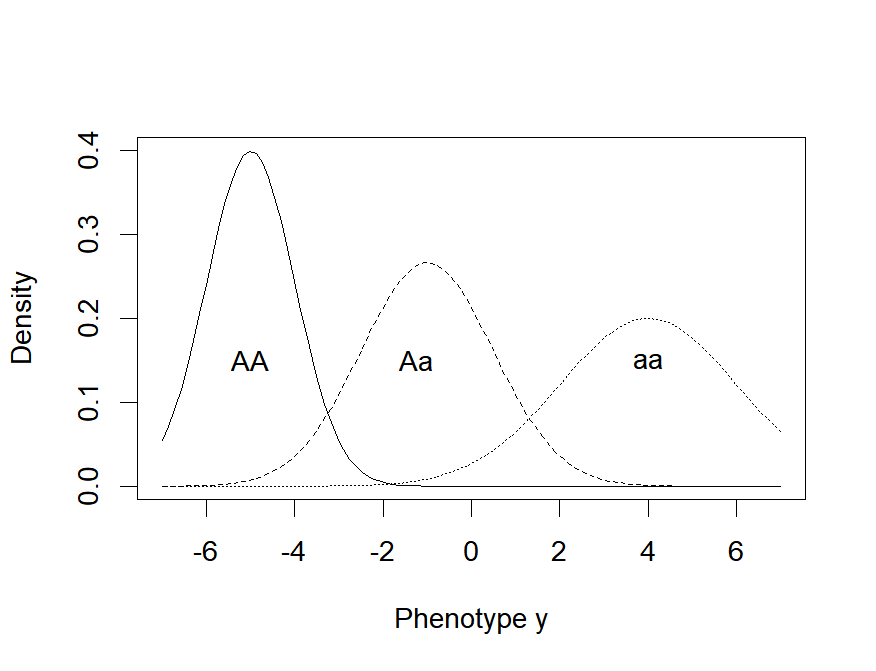</td>
<td style="text-align: center;">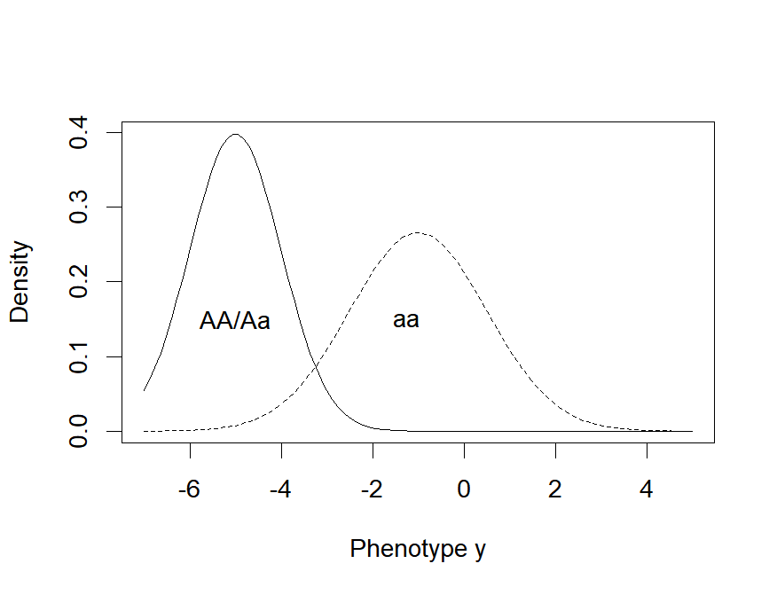</td>
</tr>
<tr class="even">
<td style="text-align: center;">(a) <span>Codominant
mixture.</span></td>
<td style="text-align: center;">(b) <span>Dominant mixture.</span></td>
</tr>
</tbody>
</table>
<figcaption>Figure 1: Examples of commingled distributions in
genetics.</figcaption>
</figure>

For a continuous phenotype $y$, the normal mixture density function
describing a commingled distribution is given by:
$$\!\begin{multlined}[t]
    f \left(y|p_{AA},\ \mu_{AA},\ \sigma_{AA}^2;\ p_{Aa},\ \mu_{Aa},\ \sigma_{Aa}^2;\ p_{aa},\ \mu_{aa},\ \sigma_{aa}^2\right) = \\
    p_{AA}\phi \left(y|\mu_{AA},\ \sigma_{AA}^2 \right) + p_{Aa}\phi \left(y|\mu_{Aa},\ \sigma_{Aa}^2 \right) + p_{aa}\phi \left(y|\mu_{aa},\ \sigma_{aa}^2 \right),
    \end{multlined} \label{Intro1}   (\#eq:Intro1)$$
where $\phi \left(y|\mu,\ \sigma^2 \right)$ is the normal density
function with mean $\mu$ and variance $\sigma^2$. Commingling analysis
may also study traits that are polygenic (result from the additive
effects of several genes) or multifactorial [polygenic traits with
environmental factors, see @Elston]. For example, mixture models explain
the heterogeneity observed in gene-mapping studies of complex human
diseases, including cancer, chronic fatigue syndrome, bipolar disorder,
coronary artery disease, and diabetes
[@Fridley; @Bahcall; @Bhatt; @Moser]. Segregation analysis extends
commingling analysis to individuals within a pedigree. Mixed models
evaluate whether a genetic locus is affecting a particular quantitative
trait and incorporate additional influential factors. Finally, linkage
analysis discovers the location of genetic loci using recombination
rates, and the regression likelihood equation may be written as a
mixture distribution [@Schork].

## Generation of continuous distributions in *SimCorrMix*

Continuous variables, including components of mixture variables, are
created using either @Fleish's third-order (`method = "Fleishman"`) or
@Head2002's fifth-order (`method =` `"Polynomial"`) PMT applied to
standard normal variables. The transformation is expressed as follows:
$$\label{System1}
Y = p \left(Z \right) = c_{0} + c_{1}Z + c_{2}Z^2 + c_{3}Z^3 + c_{4}Z^4 + c_{5}Z^5,\ Z \sim N\left(0, 1 \right),   (\#eq:System1)$$
where $c_{4} = c_{5} = 0$ for Fleishman's method. The real constants are
calculated by *SimMultiCorrData*'s `find_constants`, which solves the
system of non-linear equations given in `poly` or `fleish`. The
simulation functions `corrvar` and `corrvar2` contain checks to see if
any distributions are repeated for non-mixture or components of mixture
variables. If so, these are noted so the constants are only calculated
once, decreasing simulation time. Mixture variables are generated from
their components based on random multinomial variables described by
their mixing probabilities (using *stat*'s `rmultinom`).

The fifth-order PMT allows additional control over the fifth and sixth
moments of the generated distribution. In addition, the range of
feasible standardized kurtosis $\left(\gamma_{2}\right)$ values, given
skew $\left(\gamma_{1}\right)$ and standardized fifth
$\left(\gamma_{3}\right)$ and sixth $\left(\gamma_{4}\right)$ cumulants,
is larger than with the third-order PMT. For example, Fleishman's method
can not be used to generate a non-normal distribution with a ratio of
$\gamma_{1}^2/\gamma_{2} > 9/14$. This eliminates the ${{\chi}^{2}}$
family of distributions, which has a constant ratio of
$\gamma_{1}^2/\gamma_{2} = 2/3$ [@HeadKow]. The fifth-order method also
generates more distributions with valid PDFs. However, if the fifth and
sixth cumulants do not exist, the Fleishman approximation should be
used. This would be the case for $t$-distributions with degrees of
freedom below $7$.

For some sets of cumulants, it is either not possible to find power
method constants (indicated by a `stop` error) or the calculated
constants do not generate valid PDF's (indicated in the simulation
function results). For the fifth-order PMT, adding a value to the sixth
cumulant may provide solutions. This can be done for non-mixture
variables in `Six` or components of mixture variables in `mix_Six`, and
`find_constants` will use the smallest correction that yields a valid
PDF. Another possible reason for function failure is that the
standardized kurtosis for a distribution is below the lower boundary of
values which can be generated using the third or fifth-order PMT. This
boundary can be found with *SimMultiCorrData*'s `calc_lower_skurt` using
skew (for `method = "Fleishman"`) and standardized fifth and sixth
cumulants (for `method = "Polynomial"`).

## Expected cumulants of continuous mixture variables {#Mixstcum1}

The PMT simulates continuous variables by matching standardized
cumulants derived from central moments. Using standardized cumulants
decreases the complexity involved in calculations when a distribution
has large central moments. In view of this, let $Y$ be a real-valued
random variable with cumulative distribution function $F$. Define the
central moments, ${\mu}_{r}$, of $Y$ as:

$$\label{System2}
{\mu}_{r} = {\mu}_{r}\left(Y \right) = \mathbb{E}[y-\mu]^{r} = \int_{-\infty}^{+\infty}{\left[y-\mu \right]}^{r}dF\left(y \right).   (\#eq:System2)$$

The standardized cumulants are found by dividing the first six cumulants
${\kappa}_{1}$ - ${\kappa}_{6}$ by
$\sqrt{{{\kappa}_{2}}^{r}} = \left({\sigma}^{2}\right)^{r/2} = {\sigma}^{r}$,
where ${\sigma}^{2}$ is the variance of $Y$ and $r$ is the order of the
cumulant [@KenStu]:

$$\begin{aligned}
    0 &= \frac{{\kappa}_{1}}{\sqrt{{{\kappa}_{2}}^{1}}} = \frac{{\mu}_{1}}{{\sigma}^{1}} \label{scum1}
\end{aligned}   (\#eq:scum1)$$

$$\begin{aligned}
    1 &= \frac{{\kappa}_{2}}{\sqrt{{{\kappa}_{2}}^{2}}} = \frac{{\mu}_{2}}{{\sigma}^{2}} \label{scum2}
\end{aligned}   (\#eq:scum2)$$

$$\begin{aligned}
    {\gamma}_{1} &= \frac{{\kappa}_{3}}{\sqrt{{{\kappa}_{2}}^{3}}} = \frac{{\mu}_{3}}{{\sigma}^{3}} \label{scum3}
\end{aligned}   (\#eq:scum3)$$

$$\begin{aligned}
    {\gamma}_{2} &= \frac{{\kappa}_{4}}{\sqrt{{{\kappa}_{2}}^{4}}} = \frac{{\mu}_{4}}{{\sigma}^{4}} - 3 \label{scum4}
\end{aligned}   (\#eq:scum4)$$

$$\begin{aligned}
    {\gamma}_{3} &= \frac{{\kappa}_{5}}{\sqrt{{{\kappa}_{2}}^{5}}} = \frac{{\mu}_{5}}{{\sigma}^{5}} - 10{\gamma}_{1} \label{scum5}
\end{aligned}   (\#eq:scum5)$$

$$\begin{aligned}
    {\gamma}_{4} &= \frac{{\kappa}_{6}}{\sqrt{{{\kappa}_{2}}^{6}}} = \frac{{\mu}_{6}}{{\sigma}^{6}} - 15{\gamma}_{2} - 10{{\gamma}_{1}}^{2} - 15. \label{scum6}
\end{aligned}   (\#eq:scum6)$$

The values $\gamma_1$, $\gamma_2$, $\gamma_3$, and $\gamma_4$ correspond
to skew, standardized kurtosis (so that the normal distribution has a
value of 0, subsequently referred to as skurtosis), and standardized
fifth and sixth cumulants. The corresponding sample values for the above
can be obtained by replacing ${\mu}_{r}$ by
${m}_{r} = \sum_{j=1}^{n}{\left({x}_{j}-{m}_{1}\right)}^{r}/n$
[@Head2002].

The standardized cumulants for a continuous mixture variable can be
derived in terms of the standardized cumulants of its component
distributions. Suppose the goal is to simulate a continuous mixture
variable $Y$ with PDF $h_{Y}(y)$ that contains two component
distributions $Y_a$ and $Y_b$ with mixing parameters $\pi_a$ and
$\pi_b$:
$$h_{Y}\left(y\right) = \pi_a f_{Y_a}\left(y\right) + \pi_b g_{Y_b}\left(y\right),\ y\ \in\ \mathbf{Y},\ \pi_a\ \in\ \left(0,\ 1\right),\ \pi_b\ \in\ \left(0,\ 1\right),\ \pi_a + \pi_b = 1. \label{System3b}   
(\#eq:System3b)$$
Here,
$$\label{System4b}
Y_a = \sigma_a Z_a' + \mu_a,\ Y_a \sim f_{Y_a}\left(y\right),\ y\ \in\ \mathbf{Y_a} \ \ \textrm{and} \ \ Y_b = \sigma_b Z_b' + \mu_b,\ Y_b \sim g_{Y_b}\left(y\right),\ y\ \in\ \mathbf{Y_b}   (\#eq:System4b)$$
so that $Y_a$ and $Y_b$ have expected values $\mu_a$ and $\mu_b$ and
variances $\sigma_a^2$ and $\sigma_b^2$. Assume the variables $Z_a'$ and
$Z_b'$ are generated with zero mean and unit variance using Headrick's
fifth-order PMT given the specified values for skew
$\left(\gamma_{1_a}',\ \gamma_{1_b}'\right)$, skurtosis
$\left(\gamma_{2_a}',\ \gamma_{2_b}'\right)$, and standardized fifth
$\left(\gamma_{3_a}',\ \gamma_{3_b}'\right)$ and sixth
$\left(\gamma_{4_a}',\ \gamma_{4_b}'\right)$ cumulants:
$$\label{System5}
\begin{split}
    Z_a' &= c_{0_a} + c_{1_a}Z_a + c_{2_a}Z_a^2 + c_{3_a}Z_a^3 + c_{4_a}Z_a^4 + c_{5_a}Z_a^5,\ Z_a \sim N\left(0,\ 1\right) \\
    Z_b' &= c_{0_b} + c_{1_b}Z_b + c_{2_b}Z_b^2 + c_{3_b}Z_b^3 + c_{4_b}Z_b^4 + c_{5_b}Z_b^5,\ Z_b \sim N\left(0,\ 1\right).
\end{split}   (\#eq:System5)$$
The constants $c_{0_a},\ ...,\ c_{5_a}$ and $c_{0_b},\ ...,\ c_{5_b}$
are the solutions to the system of equations given in
*SimMultiCorrData*'s `poly` function and calculated by `find_constants`.
Similar results hold for Fleishman's third-order PMT, where the
constants $c_{0_a},\ ...,\ c_{3_a}$ and $c_{0_b},\ ...,\ c_{3_b}$ are
the solutions to the system of equations given in `fleish`
$\left(c_{4_a} = c_{5_a} = c_{4_b} = c_{5_b} = 0\right)$.

The $r^{th}$ expected value of $Y$ can be expressed as:
$$\label{System6b}
\begin{split}
    \mathbb{E}\left[Y^r\right] &= \int y^r h_{Y}\left(y\right) dy = \pi_a \int y^r f_{Y_a}\left(y\right) dy + \pi_b \int y^r g_{Y_b}\left(y\right) dy \\
    &= \pi_a \mathbb{E}\left[Y_a^r\right] + \pi_b \mathbb{E}\left[Y_b^r\right].
\end{split}   (\#eq:System6b)$$
Equation \@ref(eq:System6b) can be used to derive expressions for the
mean, variance, skew, skurtosis, and standardized fifth and sixth
cumulants of $Y$ in terms of the $r^{th}$ expected values of $Y_a$ and
$Y_b$. See [11.1](#App_Mixstcum) in the Appendix for the expressions and
proofs.

### Extension to more than two component distributions {#Mixstcum2}

If the desired mixture distribution $Y$ contains more than two component
distributions, the expected values of $Y$ are again expressed as sums of
the expected values of the component distributions, with weights equal
to the associated mixing parameters. For example, assume $Y$ contains
$k$ component distributions $Y_{1},\ ...,\ Y_{k}$ with mixing parameters
given by $\pi_{1},\ ...,\ \pi_{k}$, where $\sum_{i=1}^{k} \pi_{i} = 1$.
The component distributions are described by the following parameters:
means $\mu_{1},\ ...,\ \mu_{k}$, variances
$\sigma_{1}^2,\ ...,\ \sigma_{k}^2$, skews
$\gamma_{1_{1}}',\ ...,\ \gamma_{1_{k}}'$, skurtoses
$\gamma_{2_{1}}',\ ...,\ \gamma_{2_{k}}'$, fifth cumulants
$\gamma_{3_{1}}',\ ...,\ \gamma_{3_{k}}'$, and sixth cumulants
$\gamma_{4_{1}}',\ ...,\ \gamma_{4_{k}}'$. Then the $r^{th}$ expected
value of $Y$ can be expressed as:
$$\mathbb{E}\left[Y^r\right] = \int y^r h_{Y}\left(y\right) dy = \sum_{i=1}^{k} \pi_{i} \int y^r f_{Y_{i}}\left(y\right) dy = \sum_{i=1}^{k} \pi_{i} E_{f_{i}}\left[Y_{i}^r\right]. \label{System23b} 
(\#eq:System23b)$$
Therefore, a method similar to that above can be used to derive the
system of equations defining the mean, variance, skew, skurtosis, and
standardized fifth and sixth cumulants of $Y$. These equations are used
within the function `calc_mixmoments` to determine the values for a
mixture variable. The `summary_var` function executes `calc_mixmoments`
to provide target distributions for simulated continuous mixture
variables.

### Example with Normal and Beta mixture variables

Let $Y_1$ be a mixture of Normal(-5, 2), Normal(1, 3), and Normal(7, 4)
distributions with mixing parameters $0.36, 0.48,$ and $0.16$. This
variable could represent a continuous trait with a codominant mixture
distribution, as in Figure [1](#Figure1)a, where $p_A = 0.6$ and
$p_a = 0.4$. Let $Y_2$ be a mixture of Beta(13, 11) and Beta(13, 4)
distributions with mixing parameters $0.3$ and $0.7$. Beta-mixture
models are widely used in bioinformatics to represent correlation
coefficients. These could arise from pathway analysis of a relevant gene
to study if gene-expression levels are correlated with those of other
genes. The correlations could also describe the expression levels of the
same gene measured in different studies, as in meta-analyses of multiple
gene-expression experiments. Since expression varies greatly across
genes, the correlations may come from different probability
distributions within one mixture distribution. Each component
distribution represents groups of genes with similar behavior. @Ji
proposed a Beta-mixture model for correlation coefficients. @Laurila
extended this model to methylation microarray data in order to reduce
dimensionality and detect fluctuations in methylation status between
various samples and tissues. Other extensions include cluster analysis
[@Dai1], single nucleotide polymorphism (SNP) analysis [@Fu], pattern
recognition and image processing [@Bouguila; @Ma], and quantile
normalization to correct probe design bias [@Teschendorff]. Since these
methods assume independence among components, @Dai2 developed a compound
hierarchical correlated Beta-mixture model to permit correlations among
components, applying it to cluster mouse transcription factor DNA
binding data.

The standardized cumulants for the Normal and Beta mixtures using the
fifth-order PMT are found as follows:

``` r
  library("SimCorrMix")
  B1 <- calc_theory("Beta", c(13, 11))
  B2 <- calc_theory("Beta", c(13, 4))
  mix_pis <- list(c(0.36, 0.48, 0.16), c(0.3, 0.7))
  mix_mus <- list(c(-5, 1, 7), c(B1[1], B2[1]))
  mix_sigmas <- list(c(sqrt(2), sqrt(3), sqrt(4)), c(B1[2], B2[2]))
  mix_skews <- list(c(0, 0, 0), c(B1[3], B2[3]))
  mix_skurts <- list(c(0, 0, 0), c(B1[4], B2[4]))
  mix_fifths <- list(c(0, 0, 0), c(B1[5], B2[5]))
  mix_sixths <- list(c(0, 0, 0), c(B1[6], B2[6]))
  Nstcum <- calc_mixmoments(mix_pis[[1]], mix_mus[[1]], mix_sigmas[[1]],
    mix_skews[[1]], mix_skurts[[1]], mix_fifths[[1]], mix_sixths[[1]])
  Nstcum
  ##       mean         sd       skew   kurtosis      fifth      sixth
  ## -0.2000000  4.4810713  0.3264729 -0.6238472 -1.0244454  1.4939902
  Bstcum <- calc_mixmoments(mix_pis[[2]], mix_mus[[2]], mix_sigmas[[2]],
    mix_skews[[2]], mix_skurts[[2]], mix_fifths[[2]], mix_sixths[[2]])
  Bstcum
  ##      mean         sd       skew   kurtosis      fifth      sixth
  ## 0.6977941  0.1429099 -0.4563146 -0.5409080  1.7219898  0.5584577
```

*SimMultiCorrData*'s `calc_theory` was used first to obtain the
standardized cumulants for each of the Beta distributions.

## Calculation of intermediate correlations for continuous variables

The target correlation matrix `rho` in the simulation functions
`corrvar` and `corrvar2` is specified in terms of the correlations with
components of continuous mixture variables. This allows the user to set
the correlation between components of the same mixture variable to any
desired value. If this correlation is small (i.e., $0$--$0.2$), the
intermediate correlation matrix `Sigma` may need to be converted to the
nearest positive-definite (PD) matrix. This is done within the
simulation functions by specifying `use.nearPD = TRUE`, and @Higham's
algorithm is executed with the
[*Matrix*](https://CRAN.R-project.org/package=Matrix) package's `nearPD`
function [@Matrix]. Otherwise, negative eigenvalues are replaced with
$0$.

The function `intercorr_cont` calculates the intermediate correlations
for the standard normal variables used in Equation \@ref(eq:System1).
This is necessary because the transformation decreases the absolute
value of the final correlations. The function uses Equation 7b derived
by @HeadSaw1 [p. 28] for the third-order PMT and Equation 26 derived by
@Head2002 [p. 694] for the fifth-order PMT.

## Approximate correlations for continuous mixture variables:

Even though the correlations for the continuous mixture variables are
set at the component level, we can approximate the resulting
correlations for the mixture variables. Assume $Y_1$ and $Y_2$ are two
continuous mixture variables. Let $Y_1$ have $k_1$ components with
mixing probabilities $\alpha_1, ..., \alpha_{k_1}$ and standard
deviations $\sigma_{1_1}, ..., \sigma_{1_{k_1}}$. Let $Y_2$ have $k_2$
components with mixing probabilities $\beta_1, ..., \beta_{k_2}$ and
standard deviations $\sigma_{2_1}, ..., \sigma_{2_{k_2}}$.

### Correlation between continuous mixture variables $Y_1$ and $Y_2$

The correlation between the mixture variables $Y_1$ and $Y_2$ is given
by:
$$\rho_{Y_1 Y_2} = \frac{\mathbb{E}\left[Y_1 Y_2\right] - \mathbb{E}\left[Y_1\right]\mathbb{E}\left[Y_2\right]}{\sigma_1 \sigma_2}, \label{System24a} 
(\#eq:System24a)$$
where $\sigma_1^2$ is the variance of $Y_1$ and $\sigma_2^2$ is the
variance of $Y_2$. Equation \@ref(eq:System24a) requires the expected
value of the product of $Y_1$ and $Y_2$. Since $Y_1$ and $Y_2$ may
contain any number of components and these components may have any
continuous distribution, there is no general way to determine this
expected value. Therefore, it is approximated by expressing $Y_1$ and
$Y_2$ as sums of their component variables:
$$\rho_{Y_1 Y_2} = \frac{\mathbb{E}\left[\left(\sum_{i = 1}^{k_1} \alpha_i Y_{1_i}\right) \left(\sum_{j = 1}^{k_2} \beta_j Y_{2_j}\right)\right] - \mathbb{E}\left[\sum_{i = 1}^{k_1} \alpha_i Y_{1_i}\right]\mathbb{E}\left[\sum_{j = 1}^{k_2} \beta_j Y_{2_j}\right]}{\sigma_1 \sigma_2}, \label{System24b} 
(\#eq:System24b)$$
where
$$\label{System25}
\begin{split}
\mathbb{E}\left[\left(\sum_{i = 1}^{k_1} \alpha_i Y_{1_i}\right) \left(\sum_{j = 1}^{k_2} \beta_j Y_{2_j}\right)\right] &= \mathbb{E}\left[\alpha_1 Y_{1_1} \beta_1 Y_{2_1} + \alpha_1 Y_{1_1} \beta_2 Y_{2_2} + ... + \alpha_{k_1} Y_{1_{k_1}} \beta_{k_2} Y_{2_{k_2}}\right] \\
&= \alpha_1 \beta_1 \mathbb{E}\left[Y_{1_1} Y_{2_1}\right] + \alpha_1 \beta_2 \mathbb{E}\left[Y_{1_1} Y_{2_2}\right] + ... + \alpha_{k_1} \beta_{k_2} \mathbb{E}\left[Y_{1_{k_1}} Y_{2_{k_2}}\right].
\end{split}   (\#eq:System25)$$
Using the general correlation equation, for $1 \leq i \leq k_1$ and
$1 \leq j \leq k_2$:
$$\mathbb{E}\left[Y_{1_i} Y_{2_j}\right] = \sigma_{1_i} \sigma_{2_j} \rho_{Y_{1_i} Y_{2_j}} + \mathbb{E}\left[Y_{1_i}\right] \mathbb{E}\left[Y_{2_j}\right], \label{System25b}  
(\#eq:System25b)$$
so that we can rewrite $\rho_{Y_1 Y_2}$ as:
$$\label{System26}
\begin{split}
\rho_{Y_1 Y_2} &= \frac{\alpha_1 \beta_1 \left(\sigma_{1_1} \sigma_{2_1} \rho_{Y_{1_1} Y_{2_1}} + \mathbb{E}\left[Y_{1_1}\right] \mathbb{E}\left[Y_{2_1}\right]\right)}{\sigma_1 \sigma_2} \\
&\qquad \ \ \qquad \ \ + ... + \frac{\alpha_{k_1} \beta_{k_2} \left(\sigma_{1_{k_1}} \sigma_{2_{k_2}} \rho_{Y_{1_{k_1}} Y_{2_{k_2}}} + \mathbb{E}\left[Y_{1_{k_1}}\right] \mathbb{E}\left[Y_{2_{k_2}}\right]\right)}{\sigma_1 \sigma_2} \\
&\qquad \ \ - \frac{\alpha_1 \beta_1 \mathbb{E}\left[Y_{1_1}\right] \mathbb{E}\left[Y_{2_1}\right] + ... + \alpha_{k_1} \beta_{k_2} \mathbb{E}\left[Y_{1_{k_1}}\right] \mathbb{E}\left[Y_{2_{k_2}}\right]}{\sigma_1 \sigma_2} \\
&= \frac{\sum_{i = 1}^{k_1} \alpha_i \sigma_{1_i} \sum_{j = 1}^{k_2} \beta_j \sigma_{2_j} \rho_{Y_{1_i}, Y_{2_j}}}{\sigma_1 \sigma_2}.
\end{split}   (\#eq:System26)$$
Extending the example from [3.2.1](#Mixstcum2), assume there are now
three variables: $Y_1$ (the Normal mixture), $Y_2$ (the Beta mixture),
and $Y_3$ (a zero-inflated Poisson variable with mean 5 and probability
of a structural zero set at 0.1). Let the target correlations among the
components of $Y_1$, the components of $Y_2$, and $Y_3$ be $0.4$. The
components of $Y_1$ have a weak correlation of $0.1$ and the components
of $Y_2$ are independent. The resulting correlation between $Y_1$ and
$Y_2$ is approximated as:

``` r
  rho <- matrix(0.4, 6, 6)
  rho[1:3, 1:3] <- matrix(0.1, 3, 3)
  rho[4:5, 4:5] <- matrix(0, 2, 2)
  diag(rho) <- 1
  rho_M1M2(mix_pis, mix_mus, mix_sigmas, rho[1:3, 4:5])
  ## [1] 0.103596
```

Note that `rho` has 6 columns because $k_1 = 3$, $k_2 = 2$, and
$k_1 + k_2 + 1 = 6$.

### Correlation between continuous mixture variable $Y_1$ and other random variable $Y_3$

Here $Y_3$ can be an ordinal, a continuous non-mixture, or a regular or
zero-inflated Poisson or Negative Binomial variable. The correlation
between the mixture variable $Y_1$ and $Y_3$ is given by:
$$\rho_{Y_1 Y_3}  = \frac{\mathbb{E}\left[Y_1 Y_3\right] - \mathbb{E}\left[Y_1\right]\mathbb{E}\left[Y_3\right]}{\sigma_1 \sigma_3}, \label{System28a} 
(\#eq:System28a)$$
where $\sigma_3^2$ is the variance of $Y_3$.
Equation \@ref(eq:System28a) requires the expected value of the product
of $Y_1$ and $Y_3$, which is again approximated by expressing $Y_1$ as a
sum of its component variables:
$$\rho_{Y_1 Y_3}  = \frac{\mathbb{E}\left[\left(\sum_{i = 1}^{k_1} \alpha_i Y_{1_i}\right) Y_3\right] - \mathbb{E}\left[\sum_{i = 1}^{k_1} \alpha_i Y_{1_i}\right]\mathbb{E}\left[Y_3\right]}{\sigma_1 \sigma_3}, \label{System28b}   
(\#eq:System28b)$$
where
$$\label{System29}
\begin{split}
\mathbb{E}\left[\left(\sum_{i = 1}^{k_1} \alpha_i Y_{1_i}\right) Y_3\right] &= \mathbb{E}\left[\alpha_1 Y_{1_1} Y_3 + \alpha_2 Y_{1_2} Y_3 + ... + \alpha_{k_1} Y_{1_{k_1}} Y_3\right] \\
&= \alpha_1 \mathbb{E}\left[Y_{1_1} Y_3\right] + \alpha_2 \mathbb{E}\left[Y_{1_2} Y_3\right] + ... + \alpha_{k_1} \mathbb{E}\left[Y_{1_{k_1}} Y_3\right].
\end{split}   (\#eq:System29)$$
Using the general correlation equation, for $1 \leq i \leq k_1$:
$$\mathbb{E}\left[Y_{1_i} Y_3\right] = \sigma_{1_i} \sigma_3 \rho_{Y_{1_i} Y_3} + \mathbb{E}\left[Y_{1_i}\right] \mathbb{E}\left[Y_3\right], \label{System29b}  
(\#eq:System29b)$$
so that we can rewrite $\rho_{Y_1 Y_3}$ as:
$$\label{System30}
\begin{split}
\rho_{Y_1 Y_3} &= \frac{\alpha_1 \left(\sigma_{1_1} \sigma_3 \rho_{Y_{1_1} Y_3} + \mathbb{E}\left[Y_{1_1}\right] \mathbb{E}\left[Y_3\right]\right) + ... + \alpha_{k_1} \left(\sigma_{1_{k_1}} \sigma_3 \rho_{Y_{1_{k_1}} Y_3} + \mathbb{E}\left[Y_{1_{k_1}}\right] \mathbb{E}\left[Y_3\right]\right)}{\sigma_1 \sigma_3} \\
&\qquad \ \ - \frac{\alpha_1 \mathbb{E}\left[Y_{1_1}\right] \mathbb{E}\left[Y_3\right] + ... + \alpha_{k_1} \mathbb{E}\left[Y_{1_{k_1}}\right] \mathbb{E}\left[Y_3\right]}{\sigma_1 \sigma_3} \\
&= \frac{\sum_{i = 1}^{k_1} \alpha_i \sigma_{Y_{1_i}} \rho_{Y_{1_i} Y_3}}{\sigma_1}.
\end{split}   (\#eq:System30)$$
Continuing with the example, the correlations between $Y_1$ and $Y_3$
and between $Y_2$ and $Y_3$ are approximated as:

``` r
  rho_M1Y(mix_pis[[1]], mix_mus[[1]], mix_sigmas[[1]], rho[1:3, 6])
  ## [1] 0.1482236
  rho_M1Y(mix_pis[[2]], mix_mus[[2]], mix_sigmas[[2]], rho[4:5, 6])
  ## [1] 0.2795669
```

The accuracy of these approximations can be determined through
simulation:

``` r
  means <- c(Nstcum[1], Bstcum[1])
  vars <- c(Nstcum[2]^2, Bstcum[2]^2)
  seed <- 184
  Sim1 <- corrvar(n = 100000, k_mix = 2, k_pois = 1, method = "Polynomial",
    means = means, vars = vars, mix_pis = mix_pis, mix_mus = mix_mus,
    mix_sigmas = mix_sigmas, mix_skews = mix_skews, mix_skurts = mix_skurts,
    mix_fifths = mix_fifths, mix_sixths = mix_sixths, lam = 5, p_zip = 0.1,
    rho = rho, seed = seed, use.nearPD = FALSE)
  ## Total Simulation time: 0.065 minutes
  names(Sim1)
  ## [1] "constants"        "Y_cont"           "Y_comp"           "sixth_correction"
  ## [5] "valid.pdf"        "Y_mix"            "Y_pois"           "Sigma"
  ## [9] "Error_Time"       "Time"             "niter"
  Sum1 <- summary_var(Y_comp = Sim1$Y_comp, Y_mix = Sim1$Y_mix,
    Y_pois = Sim1$Y_pois, means = means, vars = vars, mix_pis = mix_pis,
    mix_mus = mix_mus, mix_sigmas = mix_sigmas, mix_skews = mix_skews,
    mix_skurts = mix_skurts, mix_fifths = mix_fifths, mix_sixths = mix_sixths,
    lam = 5, p_zip = 0.1, rho = rho)
  names(Sum1)
  ## [1] "cont_sum"   "target_sum" "mix_sum"    "target_mix" "rho_mix"    "pois_sum"
  ## [7] "rho_calc"   "maxerr"
  Sum1$rho_mix
  ##           [,1]      [,2]      [,3]
  ## [1,] 1.0000000 0.1012219 0.1475749
  ## [2,] 0.1012219 1.0000000 0.2776299
  ## [3,] 0.1475749 0.2776299 1.0000000
```

The results show that Equation \@ref(eq:System26) and
Equation \@ref(eq:System30) provided good approximations to the
simulated correlations. [8](#Method_Comp) also compares approximated
expected correlations for continuous mixture variables with simulated
correlations.

Figure [2](#Figure3) displays the PDF of the Normal mixture variable and
the simulated values of the zero-inflated Poisson (ZIP) variable
obtained using *SimCorrMix*'s graphing functions. These functions are
written with [*ggplot2*](https://CRAN.R-project.org/package=ggplot2)
functions and the results are `ggplot` objects that can be saved or
further modified [@Ggplot2]. As demonstrated below, the target
distribution, specified by distribution name and parameters (39
distributions currently available by name) or PDF function `fx`, can be
overlayed on the plot for continuous or count variables.

``` r
  plot_simpdf_theory(sim_y = Sim1$Y_mix[, 1], title = "", sim_size = 2,
    target_size = 2, fx = function(x) mix_pis[[1]][1] *
      dnorm(x, mix_mus[[1]][1], mix_sigmas[[1]][1]) + mix_pis[[1]][2] *
      dnorm(x, mix_mus[[1]][2], mix_sigmas[[1]][2]) + mix_pis[[1]][3] *
      dnorm(x, mix_mus[[1]][3], mix_sigmas[[1]][3]), lower = -10, upper = 10,
    legend.position = "none", axis.text.size = 30, axis.title.size = 30)
  plot_simtheory(sim_y = Sim1$Y_pois[, 1], title = "", cont_var = FALSE,
    binwidth = 0.5, Dist = "Poisson", params = c(5, 0.1),
    legend.position = "none", axis.text.size = 30, axis.title.size = 30)
```

<figure id="Figure3">
<table>
<caption> </caption>
<tbody>
<tr class="odd">
<td style="text-align: center;">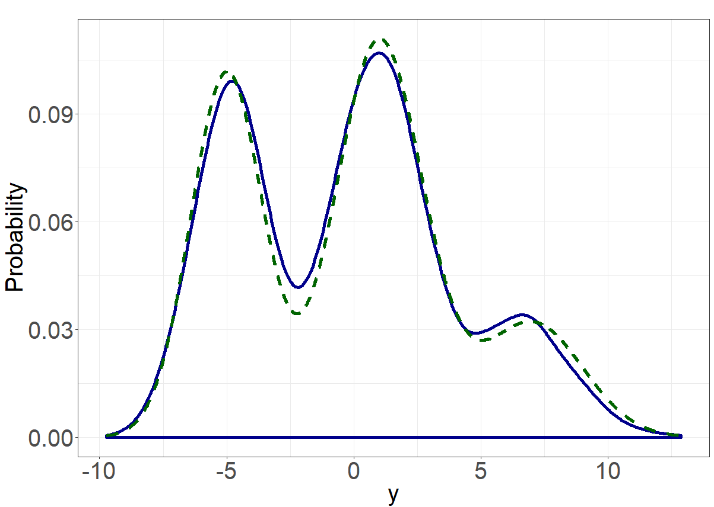</td>
<td style="text-align: center;"></td>
</tr>
<tr class="even">
<td style="text-align: center;">(a) <span>PDF of Normal mixture
variable.</span></td>
<td style="text-align: center;">(b) <span>Simulated values of ZIP
variable.</span></td>
</tr>
</tbody>
</table>
<figcaption>Figure 2: Graphs of variables (simulated = blue, target =
green).</figcaption>
</figure>

The **Continuous Mixture Distributions** vignette explains how to
compare simulated to theoretical distributions of continuous mixture
variables, as demonstrated here for the Beta mixture variable $Y_2$
[adapted from @HeadKow]:

1.  Obtain the standardized cumulants for the target mixture variable
    $Y_2^*$ and its components: these were found above using
    `calc_mixmoments` and `calc_theory`.

2.  Obtain the PMT constants for the components of $Y_2^*$: these are
    returned in the simulation result `Sim1$constants`.

3.  Determine whether these constants produce valid PDF's for the
    components of $Y_2$ (and therefore for $Y_2$): this is indicated for
    all continuous variables in the simulation result `Sim1$valid.pdf`.

    ``` r
      ## [1] "TRUE" "TRUE" "TRUE" "TRUE" "TRUE"
    ```

4.  Select a critical value from the distribution of $Y_2^*$, i.e.
    $y_2^*$ such that $\Pr\left[Y_2^* \ge y_2^*\right] = \alpha$, for
    the desired significance level $\alpha$: Let $\alpha = 0.05$. Since
    there are no quantile functions for mixture distributions, determine
    where the cumulative probability equals $1 - \alpha = 0.95$.

    ``` r
      beta_fx <- function(x) mix_pis[[2]][1] * dbeta(x, 13, 11) +
        mix_pis[[2]][2] * dbeta(x, 13, 4)
      beta_cfx <- function(x, alpha, fx = beta_fx) {
        integrate(function(x, FUN = fx) FUN(x), -Inf, x, subdivisions = 1000,
          stop.on.error = FALSE)$value - (1 - alpha)
      }
      y2_star <- uniroot(beta_cfx, c(0, 1), tol = 0.001, alpha = 0.05)$root
      y2_star
      ## [1] 0.8985136
    ```

5.  Calculate the cumulative probability for the simulated mixture
    variable $Y_2$ up to $y_2^*$ and compare to $1 - \alpha$: The
    function `sim_cdf_prob` from *SimMultiCorrData* calculates
    cumulative probabilities.

    ``` r
      sim_cdf_prob(sim_y = Sim1$Y_mix[, 2], delta = y2_star)$cumulative_prob
      ## [1] 0.9534
    ```

    This is approximately equal to the $1 - \alpha$ value of $0.95$,
    indicating that the simulation provides a good approximation to the
    theoretical distribution.

6.  Plot a graph of $Y_2^*$ and $Y_2$: Figure [3](#Figure2) shows the
    PDF and empirical CDF obtained as follows (`plot_sim_cdf` is in
    *SimMultiCorrData*):

    ``` r
      plot_simpdf_theory(sim_y = Sim1$Y_mix[, 2], title = "", sim_size = 2,
        target_size = 2, fx = beta_fx, lower = 0, upper = 1,
        legend.position = c(0.4, 0.85), legend.text.size = 30,
        axis.text.size = 30, axis.title.size = 30)
      plot_sim_cdf(sim_y = Sim1$Y_mix[, 2], title = "", calc_cprob = TRUE,
        delta = y2_star, text.size = 30, axis.text.size = 30, axis.title.size = 30)
    ```

<figure id="Figure2">
<table>
<caption> </caption>
<tbody>
<tr class="odd">
<td style="text-align: center;">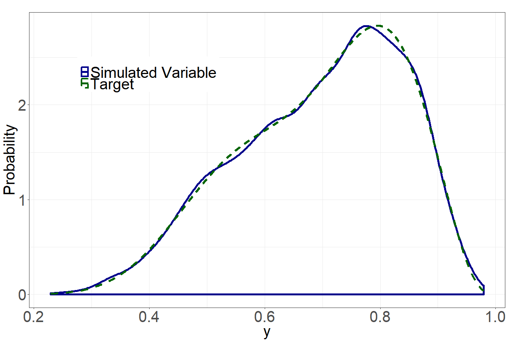</td>
<td style="text-align: center;">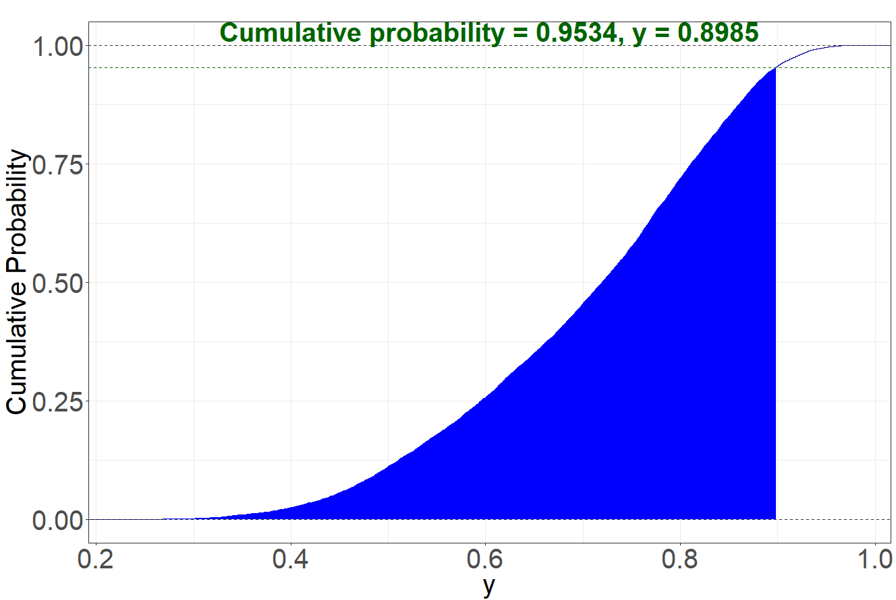</td>
</tr>
<tr class="even">
<td style="text-align: center;">(a) <span>PDF.</span></td>
<td style="text-align: center;">(b) <span>CDF.</span></td>
</tr>
</tbody>
</table>
<figcaption>Figure 3: Graphs of the Beta mixture variable.</figcaption>
</figure>

# Count mixture distributions

*SimCorrMix* extends the methods in *SimMultiCorrData* for regular
Poisson and Negative Binomial (NB) variables to zero-inflated Poisson
and NB variables. All count variables are generated using the inverse
CDF method with distribution functions imported from *VGAM*. The CDF of
a standard normal variable has a uniform distribution. The appropriate
quantile function $F_{Y}^{-1}$ is applied to this uniform variable with
the designated parameters to generate the count variable:
$Y = F_{y}^{-1}\left(\Phi\left(Z\right)\right)$. The order within all
parameters for count variables should be $1^{st}$ regular and $2^{nd}$
zero-inflated.

A zero-inflated random variable $Y_{ZI}$ is a mixture of a degenerate
distribution having the point mass at $0$ and another distribution $Y$
that contributes both zero and non-zero values. If the mixing
probability is $\phi$, then:
$$\label{System31}
\Pr\left[Y_{ZI} = 0\right] = \phi + \left(1 - \phi\right)\Pr\left[Y = 0\right],\ \ 0 < \phi < 1.    (\#eq:System31)$$
Therefore, $\phi$ is the probability of a structural zero, and setting
$\phi = 0$ reduces $Y_{ZI}$ to the variable $Y$. In *SimCorrMix*, $Y$
can have either a Poisson $\left(Y_P\right)$ or a Negative Binomial
$\left(Y_{NB}\right)$ distribution.

## Zero-inflated Poisson (ZIP) distribution

The model for
$Y_{ZIP} \sim ZIP\left(\lambda,\ \phi\right),\ \lambda>0,\ 0 < \phi < 1$
is:
$$\label{System32}
\begin{split}
\Pr\left[Y_{ZIP} = 0\right] &= \phi + \left(1 - \phi\right) \exp\left(-\lambda\right) \\
\Pr\left[Y_{ZIP} = y\right] &= \left(1 - \phi\right) \exp\left(-\lambda\right) \frac{\lambda^y}{y!},\ \ y = 1, 2, ...
\end{split}  (\#eq:System32)$$
The mean of $Y_{ZIP}$ is $\left(1 - \phi\right) \lambda$, and the
variance is $\lambda + \lambda^2 \phi/\left(1 - \phi\right)$ [@Lambert].
The parameters $\lambda$ (mean of the regular Poisson component) and
$\phi$ are specified in *SimCorrMix* through the inputs `lam` and
`p_zip`. Setting `p_zip = 0` (the default setting) generates a regular
Poisson variable.

The zero-deflated Poisson distribution is obtained by setting
$\phi \in \left(-1/\left(\exp\left(\lambda\right) - 1\right),\ 0 \right)$,
so that the probability of a zero count is less than the nominal Poisson
value. In this case, $\phi$ no longer represents a probability. When
$\phi = -1/\left(\exp\left(\lambda\right) - 1\right)$, the random
variable has a positive-Poisson distribution. The probability of a zero
response is $0$, and the other probabilities are scaled to sum to $1$.

## Zero-inflated Negative Binomial (ZINB) distribution

A major limitation of the Poisson distribution is that the mean and
variance are equal. In practice, population heterogeneity creates extra
variability (overdispersion), e.g., if $Y$ represents the number of
events which occur in a given time interval and the length of the
observation period varies across subjects. If the length of these
periods are available for each subject, an offset term may be used.
Otherwise, the length can be considered a latent variable and the mean
of the Poisson distribution for each subject is a random variable. If
these means are described by a Gamma distribution, then $Y$ has a NB
distribution, which has an extra parameter to account for
overdispersion. However, an excessive number of zeros requires using a
zero-inflated distribution. These extra (structural) zeros may arise
from a subpopulation of subjects who are not at risk for the event
during the study period. These subjects are still important to the
analysis because they may possess different characteristics from the
at-risk subjects [@He].

The model for
$Y_{ZINB} \sim ZINB\left(\eta,\ p,\ \phi\right),\ \eta>0,\ 0<p\leq1,\ \ 0 < \phi < 1$
is:
$$\label{System33}
\begin{split}
\Pr\left[Y_{ZINB} = 0\right] &= \phi + \left(1 - \phi\right) p^{\eta} \\
\Pr\left[Y_{ZINB} = y\right] &= \left(1 - \phi\right) \frac{\Gamma\left(y + \eta\right)}{\Gamma\left(\eta\right) y!} p^{\eta} \left(1 - p\right)^{\eta},\ \ y = 1, 2, ...
\end{split}   (\#eq:System33)$$
In this formulation, the Negative Binomial component $Y_{NB}$ represents
the number of failures that occur in a sequence of independent Bernoulli
trials before a target number of successes $\left(\eta\right)$ is
reached. The probability of success in each trial is $p$. $Y_{NB}$ may
also be parameterized by the mean $\mu$ (of the regular NB component)
and dispersion parameter $\eta$ so that
$p = \eta/\left(\eta + \mu\right)$ or $\mu = \eta \left(1-p\right)/p$.
The mean of $Y_{ZINB}$ is $\left(1 - \phi\right) \mu$, and the variance
is
$\left(1 - \phi\right) \mu \left(1 + \mu \left(\phi + 1/\eta\right)\right)$
[@Ismail; @Zhang]. The parameters $\eta$, $p$, $\mu$, and $\phi$ are
specified through the inputs `size`, `prob`, `mu`, and `p_zinb`. Either
`prob` or `mu` should be given for all NB and ZINB variables. Setting
`p_zinb = 0` (the default setting) generates a regular NB variable.

The zero-deflated NB distribution may be obtained by setting
$\phi \in \left(-p^{\eta}/\left(1 - p^{\eta}\right),\ 0 \right)$, so
that the probability of a zero count is less than the nominal NB value.
In this case, $\phi$ no longer represents a probability. The positive-NB
distribution results when $\phi = -p^{\eta}/\left(1 - p^{\eta}\right)$.
The probability of a zero response is $0$, and the other probabilities
are scaled to sum to $1$.

## Calculation of intermediate correlations for count variables {#CountCorr}

The two simulation pathways differ by the technique used for count
variables. The intermediate correlations used in correlation method 1
are simulation based and accuracy increases with sample size and number
of repetitions. The intermediate correlations used in correlation method
2 involve correction loops which make iterative adjustments until a
maximum error has been reached (if possible). Correlation method 1 is
described below:

1.  Count variable pairs: Based on @YahShm's method, the intermediate
    correlation between the standard normal variables $Z_1$ and $Z_2$ is
    calculated using a logarithmic transformation of the target
    correlation. First, the upper and lower Fréchet-Hoeffding bounds
    (mincor, maxcor) on ${\rho}_{{Y}_{1}{Y}_{2}}$ are simulated [see
    [6](#CorrBounds); @Frech; @Hoeff]. Then the intermediate correlation
    ${\rho}_{{Z}_{1}{Z}_{2}}$ is found as follows:
    $$ \label{System34}  {\rho}_{{Z}_{1}{Z}_{2}} = \frac{1}{b} \log \left(\frac{{\rho}_{{Y}_{1}{Y}_{2}} - c}{a} \right),    (\#eq:System34)$$
    where
    $$a = -\frac{\textrm{maxcor} * \textrm{mincor}}{\textrm{maxcor} + \textrm{mincor}},\ \ \ b = \log \left(\frac{\textrm{maxcor} + a}{a} \right),\ \ \ c = -a.$$
    The functions `intercorr_pois`, `intercorr_nb`, and
    `intercorr_pois_nb` calculate these correlations.

2.  Ordinal-count variable pairs: Extending @AmaDem's method, the
    intermediate correlations are the ratio of the target correlations
    to correction factors. The correction factor is the product of the
    upper Fréchet-Hoeffding bound on the correlation between the count
    variable and the normal variable used to generate it and a simulated
    upper bound on the correlation between an ordinal variable and the
    normal variable used to generate it. This upper bound is @DemHed's
    generate, sort, and correlate (GSC) upper bound (see
    [6](#CorrBounds)). The functions `intercorr_cat_pois` and
    `intercorr_cat_nb` calculate these correlations.

3.  Continuous-count variable pairs: Extending @AmaDem's and @DemHed's
    methods, the correlation correction factor is the product of the
    upper Fréchet-Hoeffding bound on the correlation between the count
    variable and the normal variable used to generate it and the power
    method correlation between the continuous variable and the normal
    variable used to generate it. This power method correlation is given
    by ${\rho}_{p\left(Z\right) Z} = {c}_{1} + 3{c}_{3} + 15{c}_{5},$
    where $c_3 = 0$ for Fleishman's method [@HeadKow]. The functions
    `intercorr_cont_pois` and `intercorr_cont_nb` calculate these
    correlations.

@SMCD2 showed that this method is less accurate for positive
correlations with small count variable means (i.e., less than $1$) or
high negative correlations with large count variable means.

In correlation method 2, count variables are treated as \"ordinal\"
variables, based on the methods of Barbiero and Ferrari
[@FerrBarb_Ord; @FerrBarb_Pois]. The Poisson or NB support is made
finite by removing a small user-specified value (specified by `pois_eps`
and `nb_eps`) from the total cumulative probability. This truncation
factor may differ for each count variable, but the default value is
$0.0001$ [suggested by @FerrBarb_Pois]. For example, `pois_eps = 0.0001`
means that the support values removed have a total probability of
$0.0001$ of occurring in the distribution of that variable. The effect
is to remove improbable values, which may be of concern if the user
wishes to replicate a distribution with outliers. The function
`maxcount_support` creates these new supports and associated marginal
distributions.

1.  Count variable or ordinal-count variable pairs: The intermediate
    correlations are calculated using the correction loop of `ord_norm`
    (see [5](#Ordinal)).

2.  Continuous-count variable pairs: Extending @Dem_Power's method, the
    intermediate correlations are the ratio of the target correlations
    to correction factors. The correction factor is the product of the
    power method correlation between the continuous variable and the
    normal variable used to generate it and the point-polyserial
    correlation between the ordinalized count variable and the normal
    variable used to generate it [@PolyCorr]. The functions
    `intercorr_cont_pois2` and `intercorr_cont_nb2` calculate these
    correlations.

This method performs best under the same circumstances as ordinal
variables, i.e., when there are few categories and the probability of
any given category is not very small. This occurs when the count
variable has a small mean. Therefore, method 2 performs well in
situations when method 1 has poor accuracy. In contrast, large means for
the count variables would result in longer computational times.
[8](#Method_Comp) compares the accuracy of correlation methods 1 and 2
under different scenarios.

# Simulation of ordinal variables {#Ordinal}

Ordinal variables ($r \ge 2$ categories) are generated by discretizing
standard normal variables at the quantiles determined from the
cumulative probabilities specified in `marginal`. Each element of this
list is a vector of length $r - 1$ (the $r^{th}$ value is $1$). If the
support is not provided, the default is to use
$\left\{1,\ 2,\ ...,\ r \right \}$ [@FerrBarb_Ord]. The tetrachoric
correlation is used for the intermediate correlation of binary pairs
[@EmPied; @Dem_Power]. The assumptions are that the binary variables
arise from latent normal variables and the actual trait is continuous
and not discrete. For $Y_1$ and $Y_2$, with success probabilities $p_1$
and $p_2$, the intermediate correlation $\rho_{Z_1 Z_2}$ is the solution
to the following equation:
$$ \label{System34b}  \Phi\left[z\left(p_{1}\right),\ z\left(p_{2}\right),\ \rho_{Z_1 Z_2}\right] = \rho_{Y1Y2}\sqrt{p_{1}\left(1 - p_{1}\right)p_{2}\left(1 - p_{2}\right)} + p_{1}p_{2},   
(\#eq:System34b)$$
where $z\left(p\right)$ indicates the $p^{th}$ quantile of the standard
normal distribution.

If at least one ordinal variable has more than $2$ categories,
`ord_norm` is called. Based on *SimMultiCorrData*'s `ordnorm` and
*GenOrd*'s `ordcont` and `contord`, the algorithm to simulate `k_cat`
ordinal random variables with target correlation matrix `rho0` is as
follows:

1.  Create the default `support` if necessary.

2.  Use `norm_ord` to calculate the initial correlation of the ordinal
    variables (`rhoordold`) generated by discretizing `k_cat` random
    normal variates with correlation matrix set equal to `rho0`, using
    `marginal` and the corresponding normal quantiles. These
    correlations are calculated using means and variances found from
    multivariate normal probabilities determined by
    [*mvtnorm*](https://CRAN.R-project.org/package=mvtnorm)'s `pmvnorm`
    [@Mvtnorm1; @Mvtnorm2].

3.  Let `rho` be the intermediate normal correlation updated in each
    iteration, `rhoord` be the ordinal correlation calculated in each
    iteration, `rhoold` be the intermediate correlation from the
    previous iteration (initialized at `rhoordold`), `it` be the
    iteration number, and `maxit` and `epsilon` be the user-specified
    maximum number of iterations and pairwise correlation error. For
    each variable pair, execute the following:

    1.  If `rho0 = 0`, set `rho = 0`.

    2.  While the absolute error between `rhoord` and `rho0` is greater
        than `epsilon` and `it` is less than `maxit`:

        1.  If `rho0 * (rho0/rhoord) <= -1`:\
            `rho = rhoold * (1 + 0.1 * (1 - rhoold) * -sign(rho0 - rhoord))`.

        2.  If `rho0 * (rho0/rhoord) >= 1`:\
            `rho = rhoold * (1 + 0.1 * (1 - rhoold) * sign(rho0 - rhoord))`.

        3.  Else, `rho = rhoold * (rho0/rhoord)`.

        4.  If `rho > 1`, set `rho = 1`. If `rho < -1`, set `rho = -1`.

        5.  Calculate `rhoord` using `norm_ord` and the $2 \times 2$
            correlation matrix formed by `rho`.

        6.  Set `rhoold = rho` and increase `it` by $1$.

    3.  Store the number of iterations in the matrix `niter`.

4.  Return the final intermediate correlation matrix `SigmaC = rho` for
    the random normal variables. Discretize these to produce ordinal
    variables with the desired correlation matrix.

# Calculation of correlation boundaries {#CorrBounds}

For binary variable pairs, the correlation bounds are calculated as by
@Dem_Power. The joint distribution is determined using the moments of a
multivariate normal distribution [@EmPied]. For $Y_1$ and $Y_2$, with
success probabilities $p_1$ and $p_2$, the boundaries are approximated
by:
$$\label{System35}
\left\{\max \left(-\sqrt{\frac{p_1p_2}{q_1q_2}},\ -\sqrt{\frac{q_1q_2}{p_1p_2}} \right),\ \min \left(\sqrt{\frac{p_1q_2}{q_1p_2}},\ \sqrt{\frac{q_1p_2}{p_1q_2}} \right) \right\},   (\#eq:System35)$$
where $q_1 = 1 - p_1$ and $q_2 = 1 - p_2$. If one of an ordinal variable
pair has more than $2$ categories, randomly generated variables with the
given `marginal` distributions and `support` values are used in
@DemHed's generate, sort, and correlate (GSC) algorithm. A large number
(default $100,000$) of independent random samples from the desired
distributions are generated. The lower bound is the sample correlation
of the two variables sorted in opposite directions (i.e., one increasing
and one decreasing). The upper bound is the sample correlation of the
two variables sorted in the same direction.

The GSC algorithm is also used for continuous, continuous-ordinal,
ordinal-count, and continuous-count variable pairs. Since count
variables are treated as \"ordinal\" in correlation method 2, the
correlation bounds for count variable pairs is found with the GSC
algorithm after creating finite supports with associated marginal
distributions (with `maxcount_support`). The correlation bounds for
count variable pairs in correlation method 1 are the Fréchet-Hoeffding
bounds [@Frech; @Hoeff]. For two random variables $Y_1$ and $Y_2$ with
CDF's $F_1$ and $F_2$, the correlation bounds are approximated by:
$$\label{System36}
\left\{\textrm{Cor} \left(F_1^{-1}\left(U\right), F_2^{-1}\left(1 - U\right) \right),\ \textrm{Cor} \left(F_1^{-1}\left(U\right), F_2^{-1}\left(U\right) \right) \right\},   (\#eq:System36)$$
where $U$ is a Uniform(0, 1) random variable of default length
$100,000$.

## Example with multiple variable types

Consider the Normal and Beta mixture variables from [3](#ContMix).
Additional variables are an ordinal variable with three equally-weighted
categories (e.g., drug treatment), two zero-inflated Poisson variables
with means $0.5$ and $1$ (for the regular Poisson components) and
structural zero probabilities $0.1$ and $0.2$, and two zero-inflated NB
variables with means $0.5$ and $1$ (for the regular NB components),
success probabilities $0.8$ and $0.6$, and structural zero probabilities
$0.1$ and $0.2$. The target pairwise correlation is set at $-0.5$. The
components of the Normal mixture variable again have weak correlation of
$0.1$ and those for the Beta mixture variable are uncorrelated. The
parameter inputs are first checked with `validpar`.

``` r
  marginal <- list(c(1/3, 2/3))
  support <- list(c(0, 1, 2))
  lam <- c(0.5, 1)
  p_zip <- c(0.1, 0.2)
  mu <- c(0.5, 1)
  prob <- c(0.8, 0.6)
  size <- prob * mu/(1 - prob)
  p_zinb <- c(0.1, 0.2)
  rho <- matrix(-0.5, 10, 10)
  rho[2:4, 2:4] <- matrix(0.1, 3, 3)
  rho[5:6, 5:6] <- matrix(0, 2, 2)
  diag(rho) <- 1
  validpar(k_cat = 1, k_mix = 2, k_pois = 2, k_nb = 2, method = "Polynomial",
    means = means, vars = vars, mix_pis = mix_pis, mix_mus = mix_mus,
    mix_sigmas = mix_sigmas, mix_skews = mix_skews, mix_skurts = mix_skurts,
    mix_fifths = mix_fifths, mix_sixths = mix_sixths, marginal = marginal,
    support = support, lam = lam, p_zip = p_zip, size = size, mu = mu,
    p_zinb = p_zinb, rho = rho)
  ## Default of pois_eps = 0.0001 will be used for Poisson variables
  ##               if using correlation method 2.
  ## Default of nb_eps = 0.0001 will be used for NB variables
  ##               if using correlation method 2.
  Target correlation matrix is not positive definite.
  ## [1] TRUE
  valid1 <- validcorr(10000, k_cat = 1, k_mix = 2, k_pois = 2, k_nb = 2,
    method = "Polynomial", means = means, vars = vars, mix_pis = mix_pis,
    mix_mus = mix_mus, mix_sigmas = mix_sigmas, mix_skews = mix_skews,
    mix_skurts = mix_skurts, mix_fifths = mix_fifths, mix_sixths = mix_sixths,
    marginal = marginal, lam = lam, p_zip = p_zip, size = size, mu = mu,
    p_zinb = p_zinb, rho = rho, use.nearPD = FALSE, quiet = TRUE)
  ## Range error! Corr[ 7 , 9 ] must be between -0.388605 and 0.944974
  ## Range error! Corr[ 7 , 10 ] must be between -0.432762 and 0.925402
  ## Range error! Corr[ 8 , 9 ] must be between -0.481863 and 0.877668
  ## Range error! Corr[ 9 , 10 ] must be between -0.386399 and 0.937699
  names(valid1)
  ## [1] "rho"              "L_rho"            "U_rho"            "constants"
  ## [5] "sixth_correction" "valid.pdf"        "valid.rho"
  valid2 <- validcorr2(10000, k_cat = 1, k_mix = 2, k_pois = 2, k_nb = 2,
    method = "Polynomial", means = means, vars = vars, mix_pis = mix_pis,
    mix_mus = mix_mus, mix_sigmas = mix_sigmas, mix_skews = mix_skews,
    mix_skurts = mix_skurts, mix_fifths = mix_fifths, mix_sixths = mix_sixths,
    marginal = marginal, lam = lam, p_zip = p_zip, size = size, mu = mu,
    p_zinb = p_zinb, rho = rho, use.nearPD = FALSE, quiet = TRUE)
  ## Range error! Corr[ 7 , 9 ] must be between -0.385727 and 0.947462
  ## Range error! Corr[ 7 , 10 ] must be between -0.428145 and 0.921001
  ## Range error! Corr[ 8 , 9 ] must be between -0.477963 and 0.879439
  ## Range error! Corr[ 9 , 10 ] must be between -0.384557 and 0.939524
```

The `validpar` function indicates that all parameter inputs have the
correct format and the default cumulative probability truncation value
of $0.0001$ will be used in correlation method 2 for `pois_eps` and
`nb_eps`. Since `rho` is not PD, the intermediate correlation matrix
`Sigma` will probably also be non-PD. The user has three choices: 1)
convert `rho` to the nearest PD matrix before simulation, 2) set
`use.nearPD = TRUE` (default) in the simulation functions to convert
`Sigma` to the nearest PD matrix during simulation, or 3) set
`use.nearPD = FALSE` in the simulation functions to replace negative
eigenvalues with $0$. Using `use.nearPD = TRUE` in `validcorr` or
`validcorr2` converts `rho` to the nearest PD matrix before checking if
all pairwise correlations fall within the feasible boundaries, whereas
`use.nearPD = FALSE` checks the initial matrix `rho`. Setting
`quiet = TRUE` keeps the non-PD message from being reprinted.

Range violations occur with the count variables. The lower and upper
correlation bounds are given in the list components `L_rho` and `U_rho`.
Note that these are *pairwise* correlation bounds. Although `valid.rho`
will return `TRUE` if all elements of `rho` are within these bounds,
this does not guarantee that the overall target correlation matrix `rho`
can be obtained in simulation.

# Overall workflow for generation of correlated data {#Workflow}

The vignette **Overall Workflow for Generation of Correlated Data**
provides a detailed step-by-step guideline for correlated data
simulation with examples for `corrvar` and `corrvar2`. These steps are
briefly reviewed here.

1.  Obtain the distributional parameters for the desired variables.

    1.  Continuous variables: For non-mixture and components of mixture
        variables, these are skew, skurtosis, plus standardized fifth
        and sixth cumulants (for `method = "Polynomial"`) and sixth
        cumulant corrections (if desired). The inputs are `skews`,
        `skurts`, `fifths`, `sixths`, and `Six` for non-mixture
        variables; `mix_skews`, `mix_skurts`, `mix_fifths`,
        `mix_sixths`, and `mix_Six` for components of mixture variables.
        If the goal is to simulate a theoretical distribution,
        *SimMultiCorrData*'s `calc_theory` will return these values
        given a distribution's name and parameters ($39$ distributions
        currently available by name) or PDF function `fx`. If the goal
        is to mimic a real data set, *SimMultiCorrData*'s `calc_moments`
        uses the method of moments or `calc_fisherk` uses @Fisher's
        k-statistics given a vector of data. For mixture variables, the
        mixing parameters (`mix_pis`), component means (`mix_mus`), and
        component standard deviations (`mix_sigmas`) are also required.
        The means and variances of non-mixture and mixture variables are
        specified in `means` and `vars` and these can be found using
        `calc_mixmoments` for mixture variables.

    2.  Ordinal variables: The cumulative marginal probabilities in
        `marginal` and support values in `support` as described in
        [5](#Ordinal).

    3.  Poisson variables: The mean values in `lam` and probabilities of
        structural zeros in `p_zip` (default of $0$ to yield regular
        Poisson distributions). The mean refers to the mean of the
        Poisson component of the distribution. For correlation method 2,
        also cumulative probability truncation values in `pois_eps`.

    4.  NB variables: The target number of successes in `size`,
        probabilities of structural zeros in `p_zinb` (default of $0$ to
        yield regular NB distributions), plus means in `mu` or success
        probabilities in `prob`. The mean refers to the mean of the NB
        component of the distribution. For correlation method 2, also
        cumulative probability truncation values in `nb_eps`.

2.  Check that all parameter inputs have the correct format using
    `validpar`. Incorrect parameter specification is the most likely
    cause of function failure.

3.  If continuous variables are desired, verify that the skurtoses are
    greater than the lower skurtoses bounds using *SimMultiCorrData*'s
    `calc_lower_skurt`. The function permits a skurtosis correction
    vector to aid in discovering a lower bound associated with PMT
    constants that yield a valid PDF. Since this step can take
    considerable time, the user may wish to do this at the end if any of
    the variables have invalid PDF's. The sixth cumulant value should be
    the actual sixth cumulant used in simulation, i.e., the
    distribution's sixth cumulant plus any necessary correction (if
    `method = "Polynomial"`).

4.  Check if the target correlation matrix `rho` falls within the
    feasible correlation boundaries. The variables in `rho` must be
    ordered correctly (see [1](#Intro)).

5.  Generate the variables using either `corrvar` or `corrvar2`, with or
    without the error loop.

6.  Summarize the results numerically with `summary_var` or graphically
    with `plot_simpdf_theory`, `plot_simtheory`, or any of the plotting
    functions in *SimMultiCorrData*.

# Examples comparing the two simulation pathways {#Method_Comp}

Correlation methods 1 and 2 were compared to demonstrate situations when
each has greater simulation accuracy. In scenario A, the ordinal (O1),
Normal mixture (Nmix with components N1, N2, and N3), Beta mixture (Bmix
with components B1 and B2), two zero-inflated Poisson (P1 and P2), and
two zero-inflated NB (NB1 and NB2) variables from the [6](#CorrBounds)
example were simulated. All count variables in this case had small means
(less than 1). In scenario B, the two Poisson variables were replaced
with two zero-inflated NB (NB3 and NB4) variables with means $50$ and
$100$ (for the regular NB components), success probabilities $0.4$ and
$0.2$, and structural zero probabilities $0.1$ and $0.2$. This yielded
two count variables with small means and two with large means. The
simulations were done with `n` $= 10,000$ sample size and `r` $= 1,000$
repetitions using three different positive correlations as given in
Table [1](#Table1) (chosen based on the upper correlation bounds). The
correlation among N1, N2, N3 was set at 0.1; the correlation between B1
and B2 was set at 0. The default total cumulative probability truncation
value of $0.0001$ was used for each count variable in `corrvar2`.

In scenarios A and B, the simulated correlations among the count
variables were compared to the target values using boxplots generated
with *ggplot2*'s `geom_boxplot`. In scenario A, the simulated
correlations with the continuous mixture variables were compared to the
expected correlations approximated by `rho_M1M2` and `rho_M1Y`, with O1
as the non-mixture variable. Simulation times included simulation of the
variables only with `corrvar` or `corrvar2`. Medians and interquartile
ranges (IQR) were computed for the summary tables. Variable summaries
are given for Nmix, Bmix, and NB1--NB4 in scenario B. This example was
run on R version $3.4.1$ with *SimCorrMix* version $0.1.0$ using CentOS.
The complete code is in the supplementary file for this article.

## Results

Table [1](#Table1) gives the three different correlations and total
simulation times (1,000 repetitions) for correlation method 1 using
`corrvar` (Time M$_1$) and correlation method 2 using `corrvar2` (Time
M$_2$). The strong correlation was different between NB variables with
small means (NB1, NB2) and NB variables with large means (NB3, NB4)
because the upper bounds were lower for these variable pairs.

::: {#Table1}
  -------------------------------------------------------------------------------------------------
  Scenario                                A: Poisson and NB                  B: NB     
  ------------------ -------- ---------- ------------------- ------------ ------------ ------------
  Correlation Type    $\rho$   $\rho^*$      Time M$_1$       Time M$_2$   Time M$_1$   Time M$_2$

  Strong              $0.7$     $0.6$           2.55             2.03         2.00         9.30

  Moderate            $0.5$     $0.5$           1.65             0.92         1.98         8.01

  Weak                $0.3$     $0.3$           1.39             0.90         1.95         5.78
  -------------------------------------------------------------------------------------------------

  : Table 1: Six comparisons and total simulation times for method 1
  (M$_1$) and method 2 (M$_2$) in hours. Correlation $\rho^*$ applied to
  the NB1--NB3, NB1--NB4, NB2--NB3, and NB2--NB4 variable pairs.
:::

The strong correlations required the most time for each correlation
method. Although method 2 was faster when all count variables had small
means (scenario A), it was notably slower when two of the count
variables had large means (scenario B). The reason is that method 2
treats all count variables as \"ordinal,\" which requires creating
finite supports and associated marginal distributions, as described in
[4.3](#CountCorr). When a count variable has a large mean, there are
several support values with very small probabilities, making simulation
more difficult.

### Scenario A: Ordinal, Normal and Beta mixtures, Poisson, and NB variables

Figure [4](#Figure4) contains boxplots of the simulated correlations for
the continuous mixture variables. Method 1 is in red; method 2 is in
green. The middle line is the median ($50^{th}$ percentile); the lower
and upper hinges correspond to the first and third quartiles (the
$25^{th}$ and $75^{th}$ percentiles). The upper whisker extends from the
hinge to the largest value up to 1.5 \* IQR from the hinge. The lower
whisker extends from the hinge to the smallest value at most 1.5 \* IQR
from the hinge. Data beyond the end of the whiskers are considered
\"outliers.\" The black horizontal lines show the approximate expected
values obtained with the functions `rho_M1M2` and `rho_M1Y` (also given
in Table [2](#Table2)).

::: {#Table2}
  -----------------------------------------------------------------------------------------------------------------
  Correlation Type    $\rho$   $\rho_{\textrm{Nmix,Bmix}}$   $\rho_{\textrm{Nmix,O1}}$   $\rho_{\textrm{Bmix,O1}}$
  ------------------ -------- ----------------------------- --------------------------- ---------------------------
  Strong              $0.7$             $0.1813$                     $0.2594$                    $0.4892$

  Moderate            $0.5$             $0.1295$                     $0.1853$                    $0.3495$

  Weak                $0.3$             $0.0777$                     $0.1112$                    $0.2097$
  -----------------------------------------------------------------------------------------------------------------

  : Table 2: Approximate expected correlations with the continuous
  mixture variables.
:::

Notice in Table [2](#Table2) that the expected correlations are much
smaller than the pairwise correlations, demonstrating an important
consideration when setting the correlations for mixture components. Even
though the strong correlation between the components of Nmix and the
components of Bmix was set at $0.7$, the expected correlation between
Nmix and Bmix was only $0.1813$. Combining continuous components into
one continuous mixture variable always decreases the absolute
correlation between the mixture variable and other variables.

Figure [4](#Figure4) shows that, as expected, the results with
correlation methods 1 and 2 were similar, since the methods differ
according to count variable correlations. The simulated correlations
were farthest from the approximate expected values with the strong
correlation and closest for the weak correlation. In the simulations
with strong or moderate correlations, the intermediate correlation
matrix `Sigma` was not PD due to the weak correlation (0.1) between N1,
N2, and N3 and independence (zero correlation) of B1 and B2. During
simulation, after `Sigma` is calculated with `intercorr` or
`intercorr2`, eigenvalue decomposition is done on `Sigma`. The square
roots of the eigenvalues form a diagonal matrix. The product of the
eigenvectors, diagonal matrix, and transposed standard normal variables
produces normal variables with the desired intermediate correlations. If
`Sigma` is not PD and `use.nearPD` is set to `FALSE` in the simulation
functions, negative eigenvalues are replaced with 0 before forming the
diagonal matrix of eigenvalue square roots. If `use.nearPD` is set to
`TRUE` (default), `Sigma` is replaced with the nearest PD matrix using
[@Higham]'s algorithm and *Matrix*'s `nearPD` function. Either method
increases correlation errors because the resulting intermediate
correlations are different from those found in `Sigma`. As the maximum
absolute correlation in the target matrix `rho` increases, these
differences increase. In this example, the `Sigma` matrix had two
negative eigenvalues in the strong correlation simulations and one
negative eigenvalue in the moderate correlation simulations. This is why
the correlation errors were largest for the strong correlation setting.

Figure [5](#Figure5) shows boxplots of the simulated correlations for
the count variables. The horizontal lines show the target values. These
correlations were also affected by the adjusted eigenvalues and the
errors for the strong correlations were again the largest. Correlation
method 2 performed better in each case except when generating
$\rho_{\textrm{P1,NB1}}$ in the strong correlation case.
@FerrBarb_Pois's method of treating count variables as \"ordinal\" is
expected to exhibit better accuracy than @YahShm's equation when the
count variables have small means (less than 1).
Tables [6](#table_Scorr_errorsA)--[8](#table_Wcorr_errorsA) in the
Appendix provide median (IQR) correlation errors for all variables and
each correlation type.

<figure id="Figure4">
<p>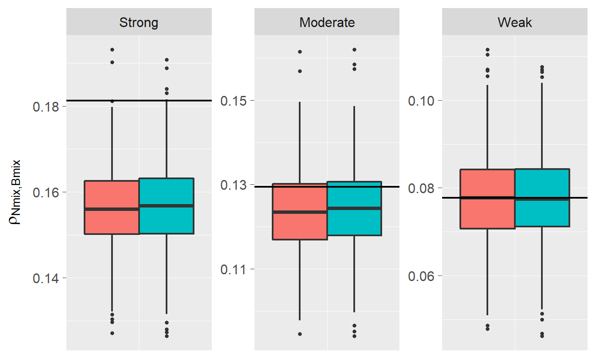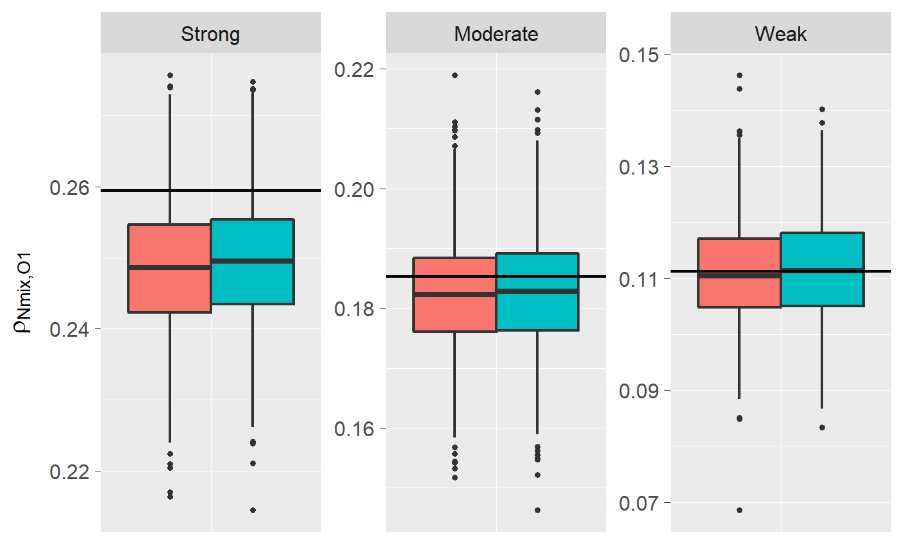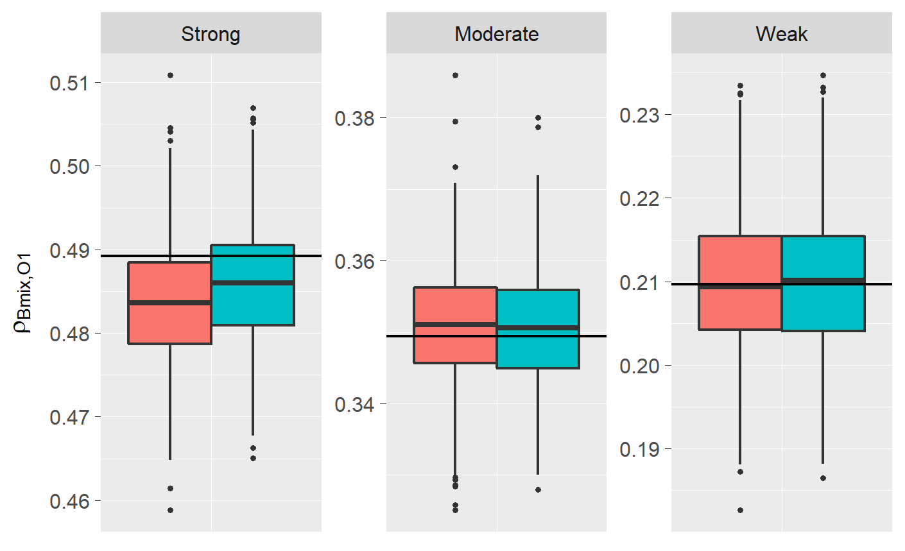</p>
<figcaption>Figure 4: Boxplots of simulated correlations for continuous
mixture variables (scenario A). Method 1 is in red; method 2 is in
green. The horizontal lines show the approximate expected
values.</figcaption>
</figure>

<figure id="Figure5">
<table>
<caption> </caption>
<tbody>
<tr class="odd">
<td style="text-align: center;">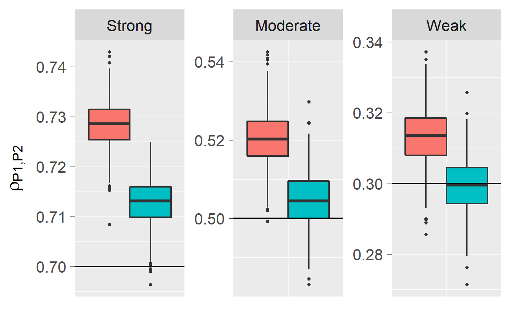</td>
<td style="text-align: center;">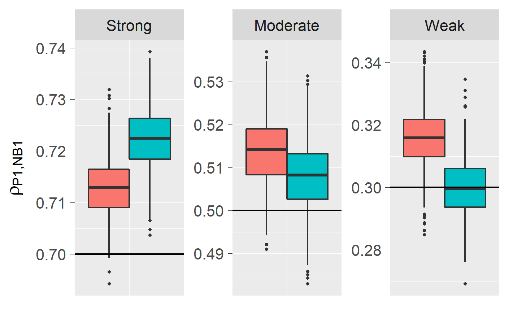</td>
</tr>
<tr class="even">
<td style="text-align: center;">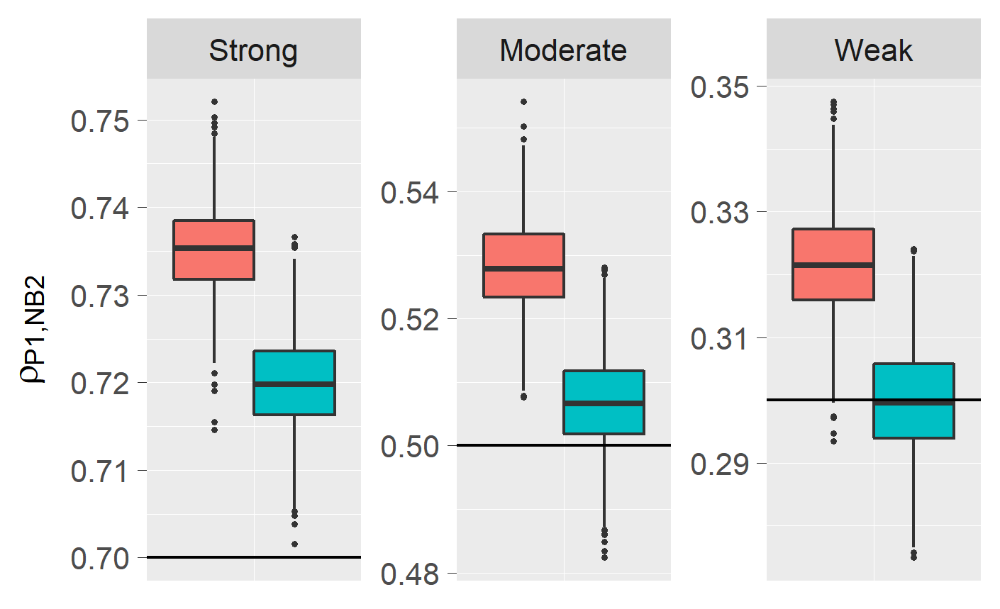</td>
<td style="text-align: center;">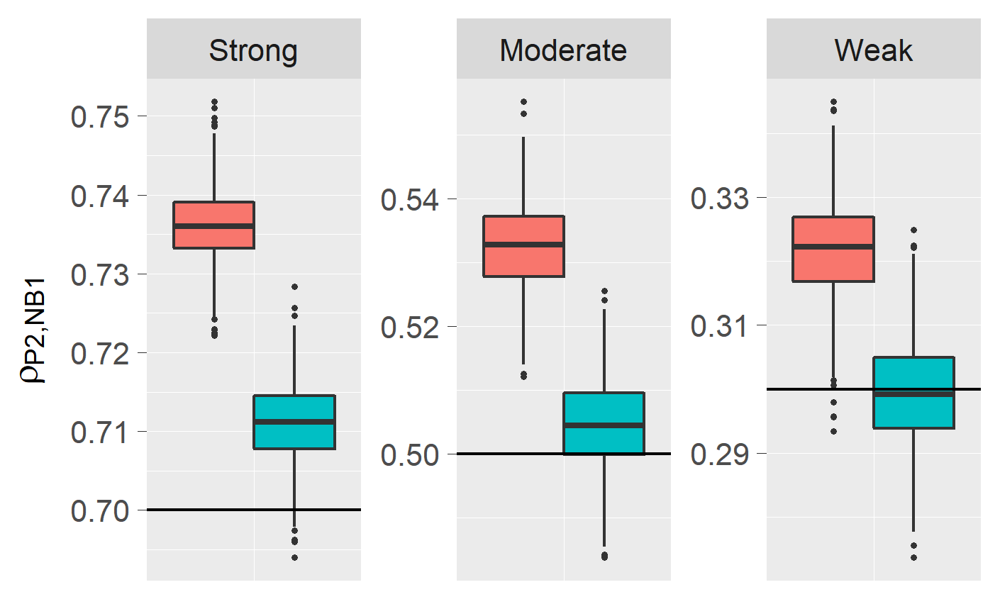</td>
</tr>
<tr class="odd">
<td style="text-align: center;">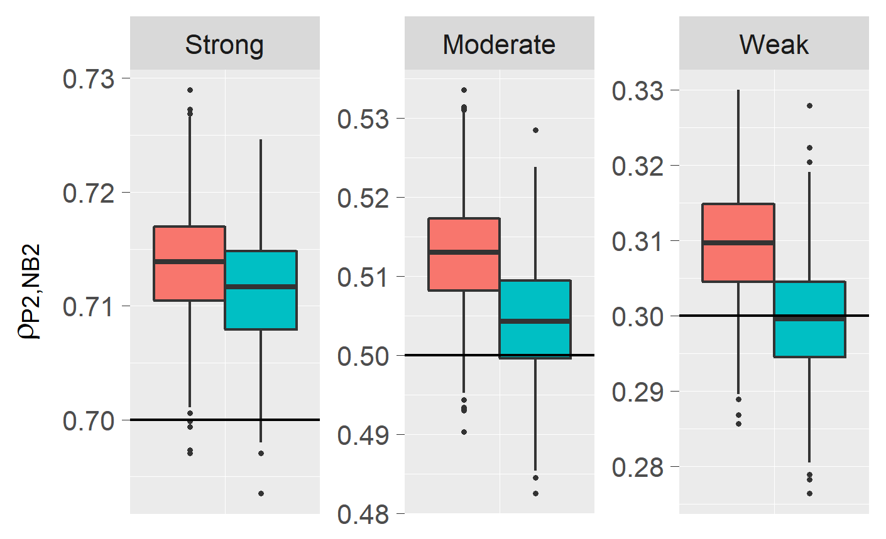</td>
<td style="text-align: center;">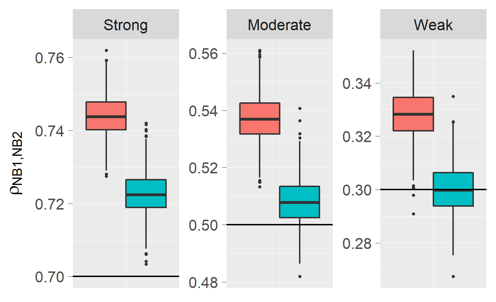</td>
</tr>
</tbody>
</table>
<figcaption>Figure 5: Boxplots of simulated correlations for P1, P2,
NB1, and NB2 (scenario A). Method 1 is in red; method 2 is in green. The
horizontal lines show the target values.</figcaption>
</figure>

### Scenario B: Ordinal, Normal and Beta mixtures, and NB variables

Tables [3](#mixsum) and [4](#nbsum) describe the target and simulated
distributions for Nmix, Bmix, and NB1--NB4 in the weak correlation case.
In all instances, the simulated distributions are close to the target
distributions.

::: {#mixsum}
  -------------------------------------------------------------------------
                 Nmix                           Bmix 
  ----------- ------- ---------------------- ------- ----------------------
  Mean          -0.20 -0.20 (-0.20, -0.20)      0.70  0.70 (0.70, 0.70)

  SD             4.48  4.48 (4.48, 4.48)        0.14  0.14 (0.14, 0.14)

  Skew           0.33  0.33 (0.32, 0.33)       -0.46 -0.46 (-0.47, -0.45)

  Skurtosis     -0.62 -0.62 (-0.64, -0.61)     -0.54 -0.54 (-0.56, -0.52)

  Fifth         -1.02 -1.03 (-1.07, -0.98)      1.72  1.73 (1.68, 1.77)

  Sixth          1.49  1.50 (1.36, 1.62)        0.56  0.54 (0.37, 0.72)
  -------------------------------------------------------------------------

  : Table 3: Target and median (IQR) simulated distributions of
  continuous mixture variables.
:::

::: {#nbsum}
  -----------------------------------------------------------------------------------------------------------------------
                  $P[Y = 0]$             $\mathbb{E}(P[Y = 0])$             Mean           $\mathbb{E}[\textrm{Mean}]$
  ----- ------------------------------- ---------------------------- ---------------------- -----------------------------
  NB1          0.68 (0.67, 0.68)                    0.68               0.45 (0.45, 0.45)                 0.45

  NB2          0.57 (0.57, 0.57)                    0.57               0.80 (0.80, 0.80)                 0.80

  NB3          0.10 (0.10, 0.10)                    0.10              45.00 (44.96, 45.03)              45.00

  NB4          0.20 (0.20, 0.20)                    0.20              80.00 (79.90, 80.10)              80.00

                      Var                $\mathbb{E}[\textrm{Var}]$          Median                      Max

  NB1          0.58 (0.58, 0.59)                     0.58                   0 (0, 0)                  7 (6, 7)

  NB2          1.49 (1.48, 1.51)                     1.49                   0 (0, 0)                 11 (10, 12)

  NB3        337.76 (335.43, 339.67)               337.50                  48 (48, 48)              101 (98, 105)

  NB4       2000.09 (1990.21, 2010.18)            2000.00                  92 (91, 92)              204 (199, 212)
  -----------------------------------------------------------------------------------------------------------------------

  : Table 4: Target and median (IQR) simulated distributions of
  zero-inflated NB variables.
:::

Figure [6](#Figure6) shows boxplots of the simulated correlations for
the count variables. The horizontal lines show the target values. Method
1 performed better for all strong correlation cases except between the
two NB variables with small means (NB1 and NB2). Although method 2 had
smaller errors overall, it did require considerably longer simulation
times. Therefore, the user should consider using correlation method 1
when the data set contains count variables with large means.
Tables [9](#table_Scorr_errorsB)--[11](#table_Wcorr_errorsB) in the
Appendix provide median (IQR) correlation errors for all variables and
each correlation type.

<figure id="Figure6">
<table>
<caption> </caption>
<tbody>
<tr class="odd">
<td style="text-align: center;">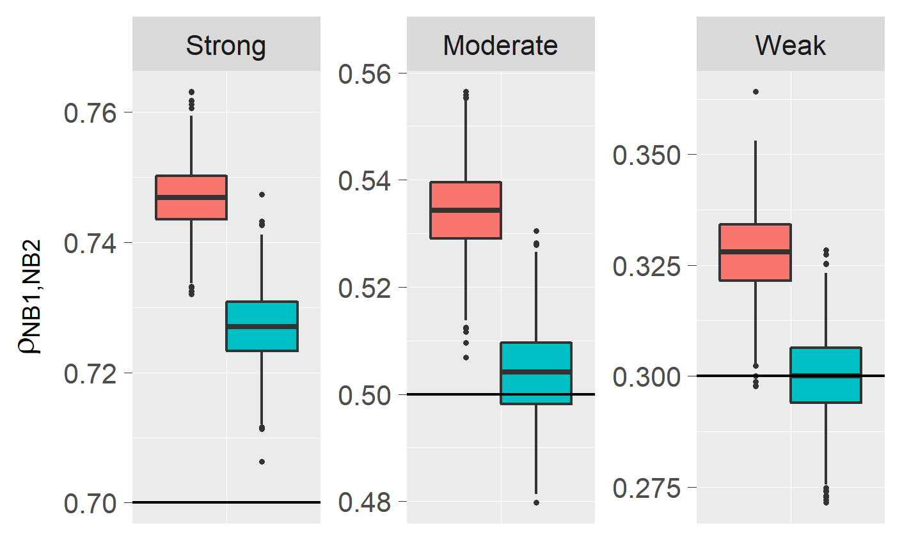</td>
<td style="text-align: center;">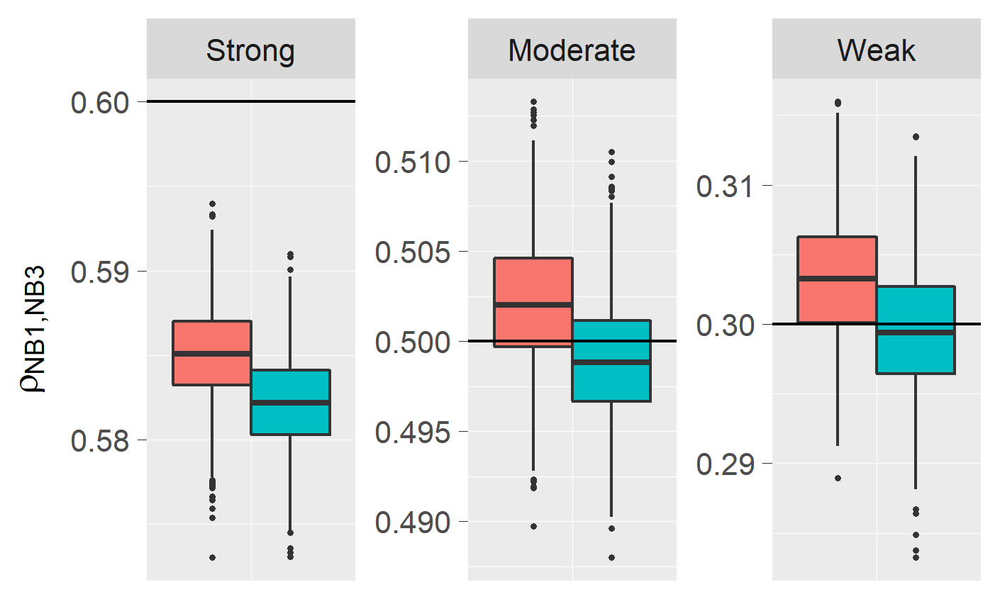</td>
</tr>
<tr class="even">
<td style="text-align: center;">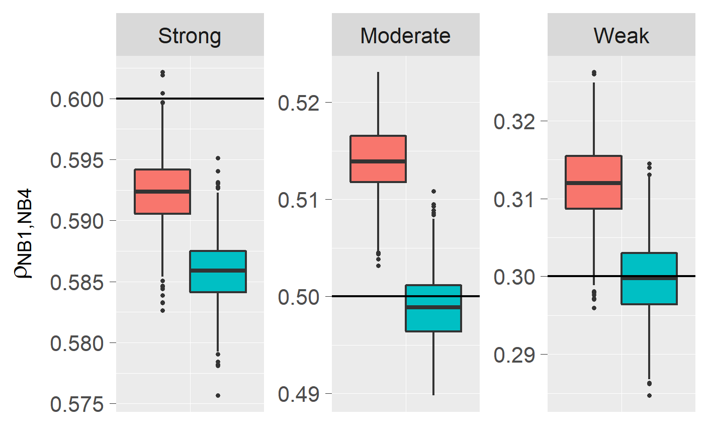</td>
<td style="text-align: center;">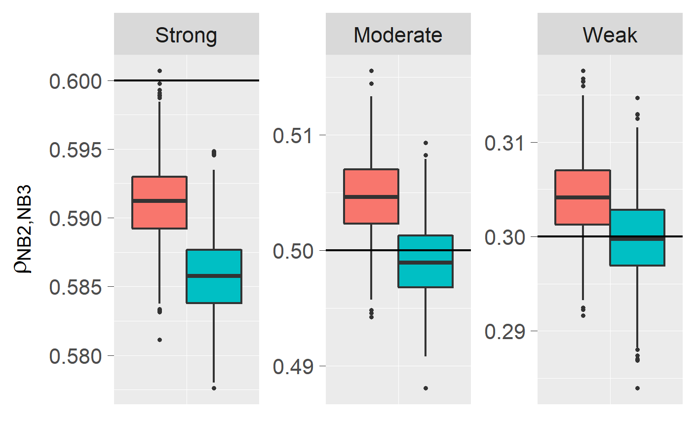</td>
</tr>
<tr class="odd">
<td style="text-align: center;">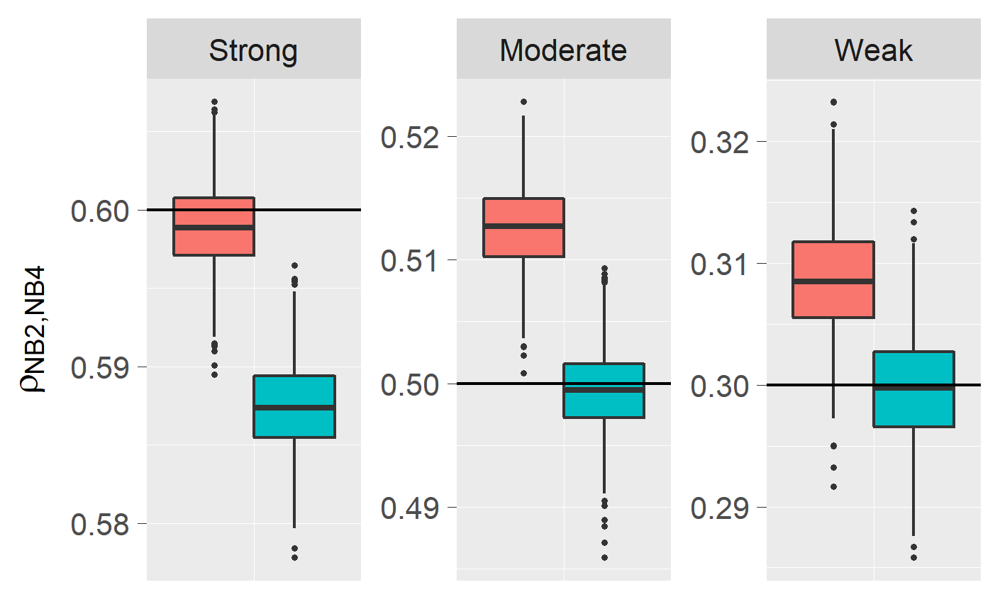</td>
<td style="text-align: center;">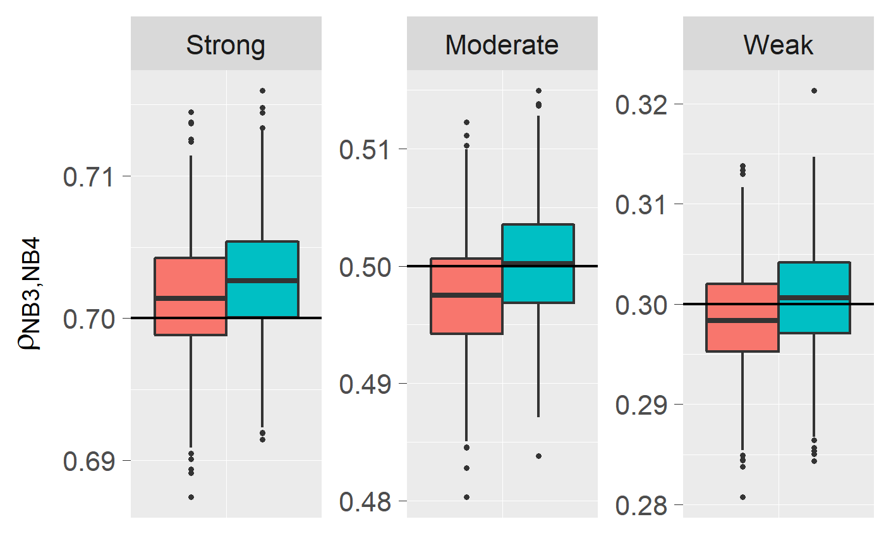</td>
</tr>
</tbody>
</table>
<figcaption>Figure 6: Boxplots of simulated correlations for NB1, NB2,
NB3, and NB4 (scenario B). Method 1 is in red; method 2 is in green. The
horizontal lines show the target values.</figcaption>
</figure>

# Summary

The package *SimCorrMix* generates correlated continuous (normal,
non-normal, and mixture), ordinal ($r \geq 2$ categories), and count
(regular or zero-inflated, Poisson or Negative Binomial) variables. It
is a significant contribution to existing R simulation packages because
it is the first to include continuous and count mixture variables in
correlated data sets. Since *SimCorrMix* simulates variables which mimic
real-world data sets and provides great flexibility, the package has a
wide range of applications in clinical trial and genetic studies. The
simulated data sets could be used to compare statistical methods,
conduct hypothesis tests, perform bootstrapping, or calculate power. The
two simulation pathways, excecuted by the functions `corrvar` and
`corrvar2`, permit the user to accurately reproduce desired correlation
matrices for different parameter ranges. Correlation method 1 should be
used when the target distributions include count variables with large
means, and correlation method 2 is preferable in opposite situations.
The package also provides helper functions to calculate standardized
cumulants of continuous mixture variables, approximate expected
correlations with continuous mixture variables, validate parameter
inputs, determine feasible correlation boundaries, and summarize
simulation results numerically and graphically. Future extensions of the
package include adding more variable types (e.g., zero-inflated
Binomial, Gaussian, and Gamma).

# Supplementary Material

The article's supplementary file contains replication code for the
examples in the paper and [8](#Method_Comp).

# Acknowledgments {#acknowledgments .unnumbered}

This research serves as part of Allison Fialkowski's dissertation, which
was made possible by grant $T32HL079888$ from the National Heart, Lung,
and Blood Institute of the National Institute of Health, USA and Dr.
Hemant K. Tiwari's William \"Student\" Sealy Gosset Professorship
Endowment. I would like to thank my dissertation mentor, Hemant K.
Tiwari, PhD; and committee members T. Mark Beasley, PhD; Charles R.
Katholi, PhD; Nita A. Limdi, PhD; M. Ryan Irvin, PhD; and Nengjun Yi,
PhD.

# Appendix

## Derivation of expected cumulants of continuous mixture variables {#App_Mixstcum}

Suppose the goal is to simulate a continuous mixture variable $Y$ with
PDF $h_{Y}(y)$ that contains two component distributions $Y_a$ and $Y_b$
with mixing parameters $\pi_a$ and $\pi_b$:
$$\label{System3}  h_{Y}\left(y\right) = \pi_a f_{Y_a}\left(y\right) + \pi_b g_{Y_b}\left(y\right),\ y\ \in\ \mathbf{Y},\ \pi_a\ \in\ \left(0,\ 1\right),\ \pi_b\ \in\ \left(0,\ 1\right),\ \pi_a + \pi_b = 1.   
(\#eq:System3)$$
Here,
$$\label{System4}
Y_a = \sigma_a Z_a' + \mu_a,\ Y_a \sim f_{Y_a}\left(y\right),\ y\ \in\ \mathbf{Y_a} \ \ \textrm{and} \ \ Y_b = \sigma_b Z_b' + \mu_b,\ Y_b \sim g_{Y_b}\left(y\right),\ y\ \in\ \mathbf{Y_b} 
(\#eq:System4)$$
so that $Y_a$ and $Y_b$ have expected values $\mu_a$ and $\mu_b$ and
variances $\sigma_a^2$ and $\sigma_b^2$. Assume the variables $Z_a'$ and
$Z_b'$ are generated with zero mean and unit variance using Headrick's
fifth-order PMT given the specified values for skew
$\left(\gamma_{1_a}',\ \gamma_{1_b}'\right)$, skurtosis
$\left(\gamma_{2_a}',\ \gamma_{2_b}'\right)$, and standardized fifth
$\left(\gamma_{3_a}',\ \gamma_{3_b}'\right)$ and sixth
$\left(\gamma_{4_a}',\ \gamma_{4_b}'\right)$ cumulants. The $r^{th}$
expected value of $Y$ can be expressed as:
$$\label{System6}
\begin{split}
    \mathbb{E}\left[Y^r\right] &= \int y^r h_{Y}\left(y\right) dy = \pi_a \int y^r f_{Y_a}\left(y\right) dy + \pi_b \int y^r g_{Y_b}\left(y\right) dy \\
    &= \pi_a \mathbb{E}\left[Y_a^r\right] + \pi_b \mathbb{E}\left[Y_b^r\right].
\end{split}   (\#eq:System6)$$
Equation \@ref(eq:System6) can be used to derive expressions for the
mean, variance, skew, skurtosis, and standardized fifth and sixth
cumulants of $Y$ in terms of the $r^{th}$ expected values of $Y_a$ and
$Y_b$.

1.  Mean: Using $r = 1$ in Equation \@ref(eq:System6) yields $\mu$:
    $$\label{System7}
    \begin{split}
        \mathbb{E}\left[Y\right] &= \pi_a \mathbb{E}\left[Y_a\right] + \pi_b \mathbb{E}\left[Y_b\right] = \pi_a \mathbb{E}\left[\sigma_a Z_a' + \mu_a\right] + \pi_b \mathbb{E}\left[\sigma_b Z_b' + \mu_b\right] \\
        &= \pi_a \left(\sigma_a \mathbb{E}\left[Z_a'\right] + \mu_a\right) + \pi_b \left(\sigma_b \mathbb{E}\left[Z_b'\right] + \mu_b\right).
    \end{split}   (\#eq:System7)$$
    Since
    $\mathbb{E}\left[Z_a'\right] = \mathbb{E}\left[Z_b'\right] = 0$,
    this becomes:
    $$ \label{System7b} \mathbb{E}\left[Y\right] = \pi_a \mu_a + \pi_b \mu_b. 
    (\#eq:System7b)$$

2.  Variance: The variance of $Y$ can be expressed by the relation
    $\textrm{Var}\left[Y\right] = \mathbb{E}\left[Y^2\right] - {\left(\mathbb{E}\left[Y\right]\right)}^2$.
    Using $r = 2$ in Equation \@ref(eq:System6) yields ${\mu}_{2}$:
    $$\label{System8}
    \begin{split}
        \mathbb{E}\left[Y^2\right] &= \pi_a \mathbb{E}\left[Y_a^2\right] + \pi_b \mathbb{E}\left[Y_b^2\right] = \pi_a \mathbb{E}\left[{\left(\sigma_a Z_a' + \mu_a\right)}^2\right] + \pi_b \mathbb{E}\left[{\left(\sigma_b Z_b' + \mu_b\right)}^2\right] \\
        &= \pi_a \mathbb{E}\left[\sigma_a^2 {Z_a'}^2 + 2\mu_a\sigma_a Z_a' + \mu_a^2\right] + \pi_b \mathbb{E}\left[\sigma_b^2 {Z_b'}^2 + 2\mu_b\sigma_bZ_b' + \mu_b^2\right] \\
        &= \!\begin{multlined}[t]
        \pi_a \left(\sigma_a^2 \mathbb{E}\left[{Z_a'}^2\right] + 2\mu_a\sigma_a\mathbb{E}\left[Z_a'\right] + \mu_a^2\right) \\
        + \pi_b \left(\sigma_b^2 \mathbb{E}\left[{Z_b'}^2\right] + 2\mu_b\sigma_b\mathbb{E}\left[Z_b'\right] + \mu_b^2\right).
        \end{multlined}
    \end{split}   (\#eq:System8)$$
    Applying the variance relation to $Z_a'$ and $Z_b'$ gives:
    $$\label{System9}
    \begin{split}
        \mathbb{E}\left[{Z_a'}^2\right] &= \textrm{Var}\left[Z_a'\right] + {\left(\mathbb{E}\left[Z_a'\right]\right)}^2 \\
        \mathbb{E}\left[{Z_b'}^2\right] &= \textrm{Var}\left[Z_b'\right] + {\left(\mathbb{E}\left[Z_b'\right]\right)}^2.
        \end{split}   (\#eq:System9)$$
    Since
    $\mathbb{E}\left[Z_a'\right] = \mathbb{E}\left[Z_b'\right] = 0$ and
    $\textrm{Var}\left[Z_a'\right] = \textrm{Var}\left[Z_b'\right] = 1$,
    $\mathbb{E}\left[{Z_a'}^2\right]$ and
    $\mathbb{E}\left[{Z_b'}^2\right]$ both equal $1$. Therefore,
    Equation \@ref(eq:System8) simplifies to:
    $$\label{System9b}   \mathbb{E}\left[Y^2\right] = \pi_a \left(\sigma_a^2 + \mu_a^2\right) + \pi_b \left(\sigma_b^2 + \mu_b^2\right),
    (\#eq:System9b)$$
    and the variance of $Y$ is given by:
    $$\label{System9c}  \textrm{Var}\left[Y\right] = \pi_a \left(\sigma_a^2 + \mu_a^2\right) + \pi_b \left(\sigma_b^2 + \mu_b^2\right) - \left[\pi_a \mu_a + \pi_b \mu_b\right]^2. 
    (\#eq:System9c)$$

3.  Skew: Using $r = 3$ in Equation \@ref(eq:System6) yields
    ${\mu}_{3}$:
    $$\label{System10}
    \begin{split}
        \mathbb{E}\left[Y^3\right] &= \pi_a \mathbb{E}\left[Y_a^3\right] + \pi_b \mathbb{E}\left[Y_b^3\right] = \pi_a \mathbb{E}\left[{\left(\sigma_a Z_a' + \mu_a\right)}^3\right] + \pi_b \mathbb{E}\left[{\left(\sigma_b Z_b' + \mu_b\right)}^3\right] \\
        &= \!\begin{multlined}[t]
        \pi_a \mathbb{E}\left[\sigma_a^3 {Z_a'}^3 + 3\sigma_a^2\mu_a{Z_a'}^2 + 3\sigma_a\mu_a^2 Z_a' + \mu_a^3\right] \\
        + \pi_b \mathbb{E}\left[\sigma_b^3 {Z_b'}^3 + 3\sigma_b^2\mu_b{Z_b'}^2 + 3\sigma_b\mu_b^2 Z_b' + \mu_b^3\right]
        \end{multlined}\\
        &= \!\begin{multlined}[t]
        \pi_a \left(\sigma_a^3 \mathbb{E}\left[{Z_a'}^3\right] + 3\sigma_a^2\mu_a\mathbb{E}\left[{Z_a'}^2\right] + 3\sigma_a\mu_a^2\mathbb{E}\left[Z_a'\right] + \mu_a^3\right)\\
        + \pi_b \left(\sigma_b^3 \mathbb{E}\left[{Z_b'}^3\right] + 3\sigma_b^2\mu_b\mathbb{E}\left[{Z_b'}^2\right] + 3\sigma_b\mu_b^2 \mathbb{E}\left[Z_b'\right] + \mu_b^3\right).
        \end{multlined}
    \end{split}   
    (\#eq:System10)$$
    Then $\mathbb{E}\left[{Z_a'}^3\right] = {\mu}_{3_a}'$ and
    $\mathbb{E}\left[{Z_b'}^3\right] = {\mu}_{3_b}'$ are given by:
    $$\label{System11}
    \begin{split}
        \mathbb{E}\left[{Z_a'}^3\right] &= {\left(\textrm{Var}\left[Z_a'\right]\right)}^{3/2} \gamma_{1_a}' = \gamma_{1_a}' \\
        \mathbb{E}\left[{Z_b'}^3\right] &= {\left(\textrm{Var}\left[Z_b'\right]\right)}^{3/2} \gamma_{1_b}' = \gamma_{1_b}'.
        \end{split}   (\#eq:System11)$$
    Combining these with
    $\mathbb{E}\left[Z_a'\right] = \mathbb{E}\left[Z_b'\right] = 0$ and
    $\mathbb{E}\left[{Z_a'}^2\right] = \mathbb{E}\left[{Z_b'}^2\right] = 1$,
    Equation \@ref(eq:System10) simplifies to:
    $$\label{System11b}  \mathbb{E}\left[Y^3\right] = \pi_a \left(\sigma_a^3 \gamma_{1_a}' + 3\sigma_a^2\mu_a + \mu_a^3\right) + \pi_b \left(\sigma_b^3 \gamma_{1_b}' + 3\sigma_b^2\mu_b + \mu_b^3\right).  
    (\#eq:System11b)$$
    From Equation \@ref(eq:scum3), the skew of $Y$ is given by:
    $$\label{System11c}  \gamma_{1} = \frac{\pi_a \left(\sigma_a^3 \gamma_{1_a}' + 3\sigma_a^2\mu_a + \mu_a^3\right) + \pi_b \left(\sigma_b^3 \gamma_{1_b}' + 3\sigma_b^2\mu_b + \mu_b^3\right)}{{\left(\pi_a \left(\sigma_a^2 + \mu_a^2\right) + \pi_b \left(\sigma_b^2 + \mu_b^2\right) - \left[\pi_a \mu_a + \pi_b \mu_b\right]^2\right)}^{3/2}}. 
    (\#eq:System11c)$$

4.  Skurtosis: Using $r = 4$ in Equation \@ref(eq:System6) yields
    ${\mu}_{4}$:
    $$\label{System12}
    \begin{split}
        \mathbb{E}\left[Y^4\right] &= \pi_a \mathbb{E}\left[Y_{a}^4\right] + \pi_b \mathbb{E}\left[Y_{b}^4\right] = \pi_a \mathbb{E}\left[{\left(\sigma_{a} Z_{a}' + \mu_{a}\right)}^4\right] + \pi_b \mathbb{E}\left[{\left(\sigma_{b} Z_{b}' + \mu_{b}\right)}^4\right] \\
        &= \!\begin{multlined}[t]
        \pi_a \mathbb{E}\left[\sigma_{a}^4 {Z_{a}'}^4 + 4\sigma_{a}^3\mu_{a}{Z_{a}'}^3 + 6\sigma_{a}^2\mu_{a}^2{Z_{a}'}^2 + 4\sigma_{a}\mu_{a}^3 Z_{a}' + \mu_{a}^4\right] \\
        + \pi_b \mathbb{E}\left[\sigma_{b}^4 {Z_{b}'}^4 + 4\sigma_{b}^3\mu_{b}{Z_{b}'}^3 + 6\sigma_{b}^2\mu_{b}^2{Z_{b}'}^2 + 4\sigma_{b}\mu_{b}^3 Z_{b}' + \mu_{b}^4\right]
        \end{multlined}\\
        &= \pi_a \Big(\sigma_{a}^4 \mathbb{E}\left[{Z_{a}'}^4\right] + 4\sigma_{a}^3\mu_{a}\mathbb{E}\left[{Z_{a}'}^3\right] + 6\sigma_{a}^2\mu_{a}^2\mathbb{E}\left[{Z_{a}'}^2\right] + 4\sigma_{a}\mu_{a}^3 \mathbb{E}\left[Z_{a}'\right] + \mu_{a}^4\Big)  \\
        &\qquad \ \ + \pi_b \Big(\sigma_{b}^4 \mathbb{E}\left[{Z_{b}'}^4\right] + 4\sigma_{b}^3\mu_{b}\mathbb{E}\left[{Z_{b}'}^3\right] + 6\sigma_{b}^2\mu_{b}^2\mathbb{E}\left[{Z_{b}'}^2\right] + 4\sigma_{b}\mu_{b}^3 \mathbb{E}\left[Z_{b}'\right] + \mu_{b}^4\Big) \\
    \end{split}   (\#eq:System12)$$
    Then $\mathbb{E}\left[{Z_{a}'}^4\right] = {\mu}_{4_{a}}'$ and
    $\mathbb{E}\left[{Z_{b}'}^4\right] = {\mu}_{4_{b}}'$ are given by:
    $$\label{System13}
    \begin{split}
        \mathbb{E}\left[{Z_{a}'}^4\right] &= {\left(\textrm{Var}\left[Z_{a}'\right]\right)}^2 \left(\gamma_{2_{a}}' + 3\right) = \gamma_{2_{a}}' + 3 \\
        \mathbb{E}\left[{Z_{b}'}^4\right] &= {\left(\textrm{Var}\left[Z_{b}'\right]\right)}^2 \left(\gamma_{2_{b}}' + 3\right) = \gamma_{2_{b}}' + 3.
        \end{split}   (\#eq:System13)$$
    Since
    $\mathbb{E}\left[Z_{a}'\right] = \mathbb{E}\left[Z_{b}'\right] = 0$
    and
    $\mathbb{E}\left[{Z_{a}'}^2\right] = \mathbb{E}\left[{Z_{b}'}^2\right] = 1$,
    Equation \@ref(eq:System12) simplifies to:
    $$\label{System14}
    \begin{split}
        \mathbb{E}\left[Y^4\right] &= \!\begin{multlined}[t]
        \pi_a \left[\sigma_{a}^4\left(\gamma_{2_{a}}' + 3\right) + 4\sigma_{a}^3\mu_{a}\gamma_{1_{a}}' + 6\sigma_{a}^2\mu_{a}^2 + \mu_{a}^4\right] \\
        + \pi_b \left[\sigma_{b}^4\left(\gamma_{2_{b}}' + 3\right) + 4\sigma_{b}^3\mu_{b}\gamma_{1_{b}}' + 6\sigma_{b}^2\mu_{b}^2 + \mu_{b}^4\right].
        \end{multlined}
    \end{split}   (\#eq:System14)$$
    From Equation \@ref(eq:scum4), the skurtosis of $Y$ is given by:
    $$\label{System15}
    \begin{split}
        \gamma_{2} &= \!\begin{multlined}[t]
        \frac{\pi_a \left[\sigma_{a}^4\left(\gamma_{2_{a}}' + 3\right) + 4\sigma_{a}^3\mu_{a}\gamma_{1_{a}}' + 6\sigma_{a}^2\mu_{a}^2 + \mu_{a}^4\right]}{{\left(\pi_a \left(\sigma_a^2 + \mu_a^2\right) + \pi_b \left(\sigma_b^2 + \mu_b^2\right) - \left[\pi_a \mu_a + \pi_b \mu_b\right]^2\right)}^2} \\
        + \frac{\pi_b \left[\sigma_{b}^4\left(\gamma_{2_{b}}' + 3\right) + 4\sigma_{b}^3\mu_{b}\gamma_{1_{b}}' + 6\sigma_{b}^2\mu_{b}^2 + \mu_{b}^4\right]}{{\left(\pi_a \left(\sigma_a^2 + \mu_a^2\right) + \pi_b \left(\sigma_b^2 + \mu_b^2\right) - \left[\pi_a \mu_a + \pi_b \mu_b\right]^2\right)}^2}.
        \end{multlined}
    \end{split}   (\#eq:System15)$$

5.  Standardized fifth cumulant: Using $r = 5$ in
    Equation \@ref(eq:System6) yields ${\mu}_{5}$:
    $$\label{System16}
    \begin{split}
        \mathbb{E}\left[Y^5\right] &= \pi_a \mathbb{E}\left[Y_{a}^5\right] + \pi_b \mathbb{E}\left[Y_{b}^5\right] = \pi_a \mathbb{E}\left[{\left(\sigma_{a} Z_{a}' + \mu_{a}\right)}^5\right] + \pi_b \mathbb{E}\left[{\left(\sigma_{b} Z_{b}' + \mu_{b}\right)}^5\right]  \\
        &= \pi_a \mathbb{E}\Big[\sigma_{a}^5 {Z_{a}'}^5 + 5\sigma_{a}^4\mu_{a}{Z_{a}'}^4 + 10\sigma_{a}^3\mu_{a}^2{Z_{a}'}^3 + 10\sigma_{a}^2\mu_{a}^3{Z_{a}'}^2 + 5\sigma_{a}\mu_{a}^4 Z_{a}' + \mu_{a}^5\Big]  \\
        &\qquad \ \ + \pi_b \mathbb{E}\Big[\sigma_{b}^5 {Z_{b}'}^5 + 5\sigma_{b}^4\mu_{b}{Z_{b}'}^4 + 10\sigma_{b}^3\mu_{b}^2{Z_{b}'}^3 + 10\sigma_{b}^2\mu_{b}^3{Z_{b}'}^2 + 5\sigma_{b}\mu_{b}^4 Z_{b}' + \mu_{b}^5\Big] \\
        &= \pi_a \Big(\sigma_{a}^5 \mathbb{E}\left[{Z_{a}'}^5\right] + 5\sigma_{a}^4\mu_{a}\mathbb{E}\left[{Z_{a}'}^4\right] + 10\sigma_{a}^3\mu_{a}^2\mathbb{E}\left[{Z_{a}'}^3\right] \\
        &\qquad \ \ \qquad \ \ + 10\sigma_{a}^2\mu_{a}^3\mathbb{E}\left[{Z_{a}'}^2\right] + 5\sigma_{a}\mu_{a}^4 \mathbb{E}\left[Z_{a}'\right] + \mu_{a}^5\Big)\\
        &\qquad \ \ + \pi_b \Big(\sigma_{b}^5 \mathbb{E}\left[{Z_{b}'}^5\right] + 5\sigma_{b}^4\mu_{b}\mathbb{E}\left[{Z_{b}'}^4\right] + 10\sigma_{b}^3\mu_{b}^2\mathbb{E}\left[{Z_{b}'}^3\right] \\
        &\qquad \ \ \qquad \ \ + 10\sigma_{b}^2\mu_{b}^3\mathbb{E}\left[{Z_{b}'}^2\right] + 5\sigma_{b}\mu_{b}^4 \mathbb{E}\left[Z_{b}'\right] + \mu_{b}^5\Big).
    \end{split}   (\#eq:System16)$$
    Then $\mathbb{E}\left[{Z_{a}'}^5\right] = {\mu}_{5_{a}}'$ and
    $\mathbb{E}\left[{Z_{b}'}^5\right] = {\mu}_{5_{b}}'$ are given by:
    $$\label{System17}
    \begin{split}
        \mathbb{E}\left[{Z_{a}'}^5\right] &= {\left(\textrm{Var}\left[Z_{a}'\right]\right)}^{5/2} \left(\gamma_{3_{a}}' + 10\gamma_{1_{a}}'\right) = \gamma_{3_{a}}' + 10\gamma_{1_{a}}' \\
        \mathbb{E}\left[{Z_{b}'}^5\right] &= {\left(\textrm{Var}\left[Z_{b}'\right]\right)}^{5/2} \left(\gamma_{3_{b}}' + 10\gamma_{1_{b}}'\right) = \gamma_{3_{b}}' + 10\gamma_{1_{b}}'.
    \end{split}   (\#eq:System17)$$
    Since
    $\mathbb{E}\left[Z_{a}'\right] = \mathbb{E}\left[Z_{b}'\right] = 0$
    and $\mathbb{E}\left[{Z_{a}'}^2\right] =$
    $\mathbb{E}\left[{Z_{b}'}^2\right] = 1$, Equation \@ref(eq:System16)
    simplifies to:
    $$\label{System18}
    \begin{split}
        \mathbb{E}\left[Y^5\right] &= \pi_a \left[\sigma_{a}^5\left(\gamma_{3_{a}}' + 10\gamma_{1_{a}}'\right) + 5\sigma_{a}^4\mu_{a}\left(\gamma_{2_{a}}' + 3\right) + 10\sigma_{a}^3\mu_{a}^2\gamma_{1_{a}}' + 10\sigma_{a}^2\mu_{a}^3 + \mu_{a}^5\right]  \\
        &\ \ \ \ + \pi_b \left[\sigma_{b}^5\left(\gamma_{3_{b}}' + 10\gamma_{1_{b}}'\right) + 5\sigma_{b}^4\mu_{b}\left(\gamma_{2_{b}}' + 3\right) + 10\sigma_{b}^3\mu_{b}^2\gamma_{1_{b}}' + 10\sigma_{b}^2\mu_{b}^3 + \mu_{b}^5\right].
    \end{split}   (\#eq:System18)$$
    From Equation \@ref(eq:scum5), the standardized fifth cumulant of
    $Y$ is given by:
    $$\label{System19}
    \begin{split}
        \gamma_{3} &= \frac{\pi_a \left[\sigma_{a}^5\left(\gamma_{3_{a}}' + 10\gamma_{1_{a}}'\right) + 5\sigma_{a}^4\mu_{a}\left(\gamma_{2_{a}}' + 3\right) + 10\sigma_{a}^3\mu_{a}^2\gamma_{1_{a}}' + 10\sigma_{a}^2\mu_{a}^3 + \mu_{a}^5\right]}{{\left(\pi_a \left(\sigma_a^2 + \mu_a^2\right) + \pi_b \left(\sigma_b^2 + \mu_b^2\right) - \left[\pi_a \mu_a + \pi_b \mu_b\right]^2\right)}^{5/2}}  \\
        &\ \ \ \ + \frac{\pi_b \left[\sigma_{b}^5\left(\gamma_{3_{b}}' + 10\gamma_{1_{b}}'\right) + 5\sigma_{b}^4\mu_{b}\left(\gamma_{2_{b}}' + 3\right) + 10\sigma_{b}^3\mu_{b}^2\gamma_{1_{b}}' + 10\sigma_{b}^2\mu_{b}^3 + \mu_{b}^5\right]}{{\left(\pi_a \left(\sigma_a^2 + \mu_a^2\right) + \pi_b \left(\sigma_b^2 + \mu_b^2\right) - \left[\pi_a \mu_a + \pi_b \mu_b\right]^2\right)}^{5/2}} - 10{\gamma}_{1}.
    \end{split}   (\#eq:System19)$$

6.  Standardized sixth cumulant: Using $r = 6$ in
    Equation \@ref(eq:System6) yields ${\mu}_{6}$:
    $$\begin{split}
        \mathbb{E}\left[Y^6\right] &= \pi_a \mathbb{E}\left[Y_{a}^6\right] + \pi_b  \mathbb{E}\left[Y_{b}^6\right] = \pi_a \mathbb{E}\left[{\left(\sigma_{a} Z_{a}' + \mu_{a}\right)}^6\right] + \pi_b  \mathbb{E}\left[{\left(\sigma_{b} Z_{b}' + \mu_{b}\right)}^6\right]  \\
        &= \pi_a \mathbb{E}\Big[\sigma_{a}^6 {Z_{a}'}^6 + 6\sigma_{a}^5\mu_{a}{Z_{a}'}^5 + 15\sigma_{a}^4\mu_{a}^2{Z_{a}'}^4 + 20\sigma_{a}^3\mu_{a}^3{Z_{a}'}^3 \\
        &\qquad \ \ \qquad \ \ + 15\sigma_{a}^2\mu_{a}^4{Z_{a}'}^2 + 6\sigma_{a}\mu_{a}^5 Z_{a}' + \mu_{a}^6\Big] \\
        &\qquad \ \ + \pi_b \mathbb{E}\Big[\sigma_{b}^6 {Z_{b}'}^6 + 6\sigma_{b}^5\mu_{b}{Z_{b}'}^5 + 15\sigma_{b}^4\mu_{b}^2{Z_{b}'}^4 + 20\sigma_{b}^3\mu_{b}^3{Z_{b}'}^3 \\
        &\qquad \ \ \qquad \ \ + 15\sigma_{b}^2\mu_{b}^4{Z_{b}'}^2 + 6\sigma_{b}\mu_{b}^5 Z_{b}' + \mu_{b}^6\Big] \\
    \end{split} \nonumber$$

    $$\label{System20}
    \begin{split}
        &= \pi_a \Big(\sigma_{a}^6 \mathbb{E}\left[{Z_{a}'}^6\right] + 6\sigma_{a}^5\mu_{a}\mathbb{E}\left[{Z_{a}'}^5\right] + 15\sigma_{a}^4\mu_{a}^2\mathbb{E}\left[{Z_{a}'}^4\right] + 20\sigma_{a}^3\mu_{a}^3\mathbb{E}\left[{Z_{a}'}^3\right] \\
        &\qquad \ \ \qquad \ \ + 15\sigma_{a}^2\mu_{a}^4\mathbb{E}\left[{Z_{a}'}^2\right] + 6\sigma_{a}\mu_{a}^5 \mathbb{E}\left[Z_{a}'\right] + \mu_{a}^6\Big) \\
        &\qquad \ \ + \pi_b \Big(\sigma_{b}^6 \mathbb{E}\left[{Z_{b}'}^6\right] + 6\sigma_{b}^5\mu_{b}\mathbb{E}\left[{Z_{b}'}^5\right] + 15\sigma_{b}^4\mu_{b}^2\mathbb{E}\left[{Z_{b}'}^4\right] + 20\sigma_{b}^3\mu_{b}^3\mathbb{E}\left[{Z_{b}'}^3\right] \\
        &\qquad \ \ \qquad \ \ + 15\sigma_{b}^2\mu_{b}^4\mathbb{E}\left[{Z_{b}'}^2\right] + 6\sigma_{b}\mu_{b}^5 \mathbb{E}\left[Z_{b}'\right] + \mu_{b}^6\Big).
    \end{split}   (\#eq:System20)$$
    Then $\mathbb{E}\left[{Z_{a}'}^6\right] = {\mu}_{6_{a}}'$ and
    $\mathbb{E}\left[{Z_{b}'}^6\right] = {\mu}_{6_{b}}'$ are given by:
    $$\label{System21}
    \begin{split}
        \mathbb{E}\left[{Z_{a}'}^6\right] &= {\left(\textrm{Var}\left[Z_{a}'\right]\right)}^3 \left(\gamma_{4_{a}}' + 15\gamma_{2_{a}}' + 10{\gamma_{1_{a}}'}^2 + 15\right) = \gamma_{4_{a}}' + 15\gamma_{2_{a}}' + 10{\gamma_{1_{a}}'}^2 + 15 \\
        \mathbb{E}\left[{Z_{b}'}^6\right] &= {\left(\textrm{Var}\left[Z_{b}'\right]\right)}^3 \left(\gamma_{4_{b}}' + 15\gamma_{2_{b}}' + 10{\gamma_{1_{b}}'}^2 + 15\right) = \gamma_{4_{b}}' + 15\gamma_{2_{b}}' + 10{\gamma_{1_{b}}'}^2 + 15.
    \end{split}   (\#eq:System21)$$
    Since
    $\mathbb{E}\left[Z_{a}'\right] = \mathbb{E}\left[Z_{b}'\right] = 0$
    and
    $\mathbb{E}\left[{Z_{a}'}^2\right] = \mathbb{E}\left[{Z_{b}'}^2\right] = 1$,
    Equation \@ref(eq:System20) simplifies to:
    $$\label{System22}
    \begin{split}
        \mathbb{E}\left[Y^6\right] &= \pi_a \Big[\sigma_{a}^6\left(\gamma_{4_{a}}' + 15\gamma_{2_{a}}' + 10{\gamma_{1_{a}}'}^2 + 15\right) + 6\sigma_{a}^5\mu_{a}\left(\gamma_{3_{a}}' + 10\gamma_{1_{a}}'\right) \\
        &\qquad \ \ \qquad \ \ + 15\sigma_{a}^4\mu_{a}^2\left(\gamma_{2_{a}}' + 3\right) + 20\sigma_{a}^3\mu_{a}^3\gamma_{1_{a}}' + 15\sigma_{a}^2\mu_{a}^4 + \mu_{a}^6\Big] \\
        &\qquad \ \ + \pi_b \Big[\sigma_{b}^6\left(\gamma_{4_{b}}' + 15\gamma_{2_{b}}' + 10{\gamma_{1_{b}}'}^2 + 15\right) + 6\sigma_{b}^5\mu_{b}\left(\gamma_{3_{b}}' + 10\gamma_{1_{b}}'\right) \\
        &\qquad \ \ \qquad \ \ + 15\sigma_{b}^4\mu_{b}^2\left(\gamma_{2_{b}}' + 3\right) + 20\sigma_{b}^3\mu_{b}^3\gamma_{1_{b}}' + 15\sigma_{b}^2\mu_{b}^4 + \mu_{b}^6\Big].
    \end{split}   (\#eq:System22)$$
    From Equation \@ref(eq:scum6), the standardized sixth cumulant of
    $Y$ is given by:
    $$\label{System23}
    \begin{split}
        \gamma_{4} &= \frac{\pi_a \Big[\sigma_{a}^6\left(\gamma_{4_{a}}' + 15\gamma_{2_{a}}' + 10{\gamma_{1_{a}}'}^2 + 15\right) + 6\sigma_{a}^5\mu_{a}\left(\gamma_{3_{a}}' + 10\gamma_{1_{a}}'\right)}{{\left(\pi_a \left(\sigma_a^2 + \mu_a^2\right) + \pi_b \left(\sigma_b^2 + \mu_b^2\right) - \left[\pi_a \mu_a + \pi_b \mu_b\right]^2\right)}^3} \\
        &\qquad \ \ \qquad \ \ \frac{+ 15\sigma_{a}^4\mu_{a}^2\left(\gamma_{2_{a}}' + 3\right) + 20\sigma_{a}^3\mu_{a}^3\gamma_{1_{a}}' + 15\sigma_{a}^2\mu_{a}^4 + \mu_{a}^6\Big]}{{\left(\pi_a \left(\sigma_a^2 + \mu_a^2\right) + \pi_b \left(\sigma_b^2 + \mu_b^2\right) - \left[\pi_a \mu_a + \pi_b \mu_b\right]^2\right)}^3} \\
        &\qquad \ \ + \frac{\pi_b \Big[\sigma_{b}^6\left(\gamma_{4_{b}}' + 15\gamma_{2_{b}}' + 10{\gamma_{1_{b}}'}^2 + 15\right) + 6\sigma_{b}^5\mu_{b}\left(\gamma_{3_{b}}' + 10\gamma_{1_{b}}'\right)}{{\left(\pi_a \left(\sigma_a^2 + \mu_a^2\right) + \pi_b \left(\sigma_b^2 + \mu_b^2\right) - \left[\pi_a \mu_a + \pi_b \mu_b\right]^2\right)}^3} \\
        &\qquad \ \ \qquad \ \ \frac{+ 15\sigma_{b}^4\mu_{b}^2\left(\gamma_{2_{b}}' + 3\right)+ 20\sigma_{b}^3\mu_{b}^3\gamma_{1_{b}}' + 15\sigma_{b}^2\mu_{b}^4 + \mu_{b}^6\Big]}{{\left(\pi_a \left(\sigma_a^2 + \mu_a^2\right) + \pi_b \left(\sigma_b^2 + \mu_b^2\right) - \left[\pi_a \mu_a + \pi_b \mu_b\right]^2\right)}^3} \\
        &\qquad \ \ - 15{\gamma}_{2} - 10{{\gamma}_{1}}^{2} - 15.
    \end{split}   (\#eq:System23)$$

## Results from examples comparing correlation methods 1 and 2

::: {#Table3}
  ---------------------------------------------------------------------------
                              Scenario           
  ------------------ --------------------------- ----------------------------
  Correlation Type        A: Poisson and NB                 B: NB

  Strong              [6](#table_Scorr_errorsA)   [9](#table_Scorr_errorsB)

  Moderate            [7](#table_Mcorr_errorsA)   [10](#table_Mcorr_errorsB)

  Weak                [8](#table_Wcorr_errorsA)   [11](#table_Wcorr_errorsB)
  ---------------------------------------------------------------------------

  : Table 5: Table numbers for matrices of correlation errors.
:::

::: {#table_Scorr_errorsA}
  ---------------------------------------------------------------------------------------------------------------------------------------
        O1                        N1                        N2                        N3                        B1
  ----- ------------------------- ------------------------- ------------------------- ------------------------- -------------------------
     O1 0                         -0.08 (-0.083, -0.078)    -0.08 (-0.082, -0.078)    -0.08 (-0.082, -0.078)    -0.036 (-0.039, -0.034)

     N1 -0.078 (-0.08, -0.076)    0                         0.153 (0.152, 0.153)      0.153 (0.152, 0.153)      -0.164 (-0.164, -0.164)

     N2 -0.078 (-0.08, -0.076)    0.153 (0.153, 0.153)      0                         0.153 (0.152, 0.153)      -0.164 (-0.164, -0.164)

     N3 -0.078 (-0.081, -0.076)   0.153 (0.153, 0.153)      0.153 (0.153, 0.153)      0                         -0.164 (-0.164, -0.164)

     B1 -0.034 (-0.036, -0.031)   -0.164 (-0.164, -0.164)   -0.164 (-0.164, -0.164)   -0.164 (-0.164, -0.164)   0

     B2 -0.035 (-0.037, -0.033)   -0.165 (-0.166, -0.165)   -0.166 (-0.166, -0.165)   -0.166 (-0.166, -0.165)   0.155 (0.154, 0.156)

     P1 -0.033 (-0.036, -0.03)    -0.157 (-0.16, -0.153)    -0.156 (-0.159, -0.153)   -0.156 (-0.159, -0.153)   -0.123 (-0.125, -0.12)

     P2 -0.018 (-0.02, -0.015)    -0.133 (-0.135, -0.13)    -0.133 (-0.135, -0.13)    -0.133 (-0.135, -0.13)    -0.097 (-0.1, -0.095)

    NB1 -0.05 (-0.053, -0.047)    -0.168 (-0.172, -0.165)   -0.168 (-0.171, -0.165)   -0.168 (-0.171, -0.165)   -0.137 (-0.14, -0.134)

    NB2 -0.028 (-0.031, -0.025)   -0.156 (-0.16, -0.153)    -0.156 (-0.159, -0.153)   -0.156 (-0.159, -0.153)   -0.125 (-0.128, -0.122)

                                                                                                                

        B2                        P1                        P2                        NB1                       NB2

     O1 -0.038 (-0.04, -0.035)    -0.023 (-0.025, -0.02)    0.003 (0, 0.005)          -0.053 (-0.056, -0.05)    -0.043 (-0.046, -0.04)

     N1 -0.166 (-0.167, -0.165)   -0.156 (-0.159, -0.153)   -0.128 (-0.131, -0.126)   -0.166 (-0.169, -0.163)   -0.153 (-0.156, -0.15)

     N2 -0.166 (-0.167, -0.165)   -0.156 (-0.158, -0.153)   -0.128 (-0.131, -0.126)   -0.166 (-0.17, -0.163)    -0.153 (-0.156, -0.15)

     N3 -0.166 (-0.167, -0.165)   -0.156 (-0.159, -0.153)   -0.128 (-0.131, -0.126)   -0.166 (-0.17, -0.163)    -0.153 (-0.156, -0.15)

     B1 0.154 (0.153, 0.155)      -0.123 (-0.126, -0.12)    -0.093 (-0.096, -0.091)   -0.135 (-0.138, -0.132)   -0.121 (-0.124, -0.118)

     B2 0                         -0.156 (-0.159, -0.154)   -0.121 (-0.123, -0.118)   -0.174 (-0.177, -0.171)   -0.157 (-0.16, -0.155)

     P1 -0.156 (-0.159, -0.153)   0                         0.029 (0.025, 0.031)      0.013 (0.009, 0.016)      0.035 (0.032, 0.038)

     P2 -0.124 (-0.126, -0.122)   0.013 (0.01, 0.016)       0                         0.036 (0.033, 0.039)      0.014 (0.01, 0.017)

    NB1 -0.175 (-0.178, -0.172)   0.022 (0.018, 0.026)      0.011 (0.008, 0.015)      0                         0.044 (0.04, 0.048)

    NB2 -0.161 (-0.164, -0.158)   0.02 (0.016, 0.024)       0.012 (0.008, 0.015)      0.022 (0.019, 0.027)      0
  ---------------------------------------------------------------------------------------------------------------------------------------

  : Table 6: Median (IQR) of correlation errors using correlation
  methods 1 (in black) and 2 (in blue) with strong correlations in
  scenario A.
:::

::: {#table_Mcorr_errorsA}
  ---------------------------------------------------------------------------------------------------------------------------------------
        O1                        N1                        N2                        N3                        B1
  ----- ------------------------- ------------------------- ------------------------- ------------------------- -------------------------
     O1 0                         -0.021 (-0.023, -0.018)   -0.021 (-0.023, -0.018)   -0.021 (-0.023, -0.018)   0 (-0.003, 0.003)

     N1 -0.019 (-0.022, -0.017)   0                         0.049 (0.049, 0.05)       0.049 (0.049, 0.05)       -0.035 (-0.035, -0.035)

     N2 -0.019 (-0.022, -0.016)   0.051 (0.051, 0.051)      0                         0.049 (0.049, 0.05)       -0.035 (-0.035, -0.035)

     N3 -0.019 (-0.022, -0.017)   0.051 (0.051, 0.051)      0.051 (0.051, 0.051)      0                         -0.035 (-0.035, -0.035)

     B1 -0.001 (-0.003, 0.002)    -0.034 (-0.034, -0.034)   -0.034 (-0.034, -0.033)   -0.034 (-0.034, -0.033)   0

     B2 -0.001 (-0.003, 0.002)    -0.034 (-0.035, -0.033)   -0.034 (-0.035, -0.033)   -0.034 (-0.035, -0.033)   0.016 (0.015, 0.017)

     P1 -0.002 (-0.005, 0.001)    -0.041 (-0.045, -0.038)   -0.041 (-0.044, -0.038)   -0.041 (-0.044, -0.038)   -0.009 (-0.012, -0.006)

     P2 -0.001 (-0.005, 0.002)    -0.034 (-0.037, -0.032)   -0.034 (-0.037, -0.032)   -0.034 (-0.037, -0.032)   -0.006 (-0.009, -0.003)

    NB1 -0.004 (-0.007, 0)        -0.044 (-0.048, -0.041)   -0.045 (-0.048, -0.041)   -0.044 (-0.048, -0.041)   -0.011 (-0.014, -0.008)

    NB2 -0.003 (-0.006, 0)        -0.041 (-0.044, -0.037)   -0.041 (-0.044, -0.037)   -0.041 (-0.044, -0.038)   -0.01 (-0.012, -0.007)

                                                                                                                

        B2                        P1                        P2                        NB1                       NB2

     O1 0.001 (-0.002, 0.003)     0 (-0.004, 0.004)         0.005 (0.001, 0.008)      -0.009 (-0.013, -0.006)   -0.007 (-0.011, -0.004)

     N1 -0.035 (-0.036, -0.034)   -0.038 (-0.041, -0.035)   -0.031 (-0.034, -0.028)   -0.04 (-0.043, -0.037)    -0.037 (-0.04, -0.034)

     N2 -0.035 (-0.036, -0.034)   -0.038 (-0.041, -0.035)   -0.031 (-0.034, -0.029)   -0.04 (-0.044, -0.037)    -0.037 (-0.04, -0.033)

     N3 -0.035 (-0.036, -0.034)   -0.038 (-0.041, -0.035)   -0.031 (-0.034, -0.028)   -0.041 (-0.044, -0.037)   -0.037 (-0.04, -0.034)

     B1 0.013 (0.012, 0.014)      -0.005 (-0.008, -0.002)   -0.003 (-0.006, 0)        -0.006 (-0.01, -0.003)    -0.005 (-0.008, -0.002)

     B2 0                         -0.027 (-0.029, -0.024)   -0.019 (-0.022, -0.017)   -0.033 (-0.035, -0.03)    -0.029 (-0.031, -0.027)

     P1 -0.03 (-0.033, -0.028)    0                         0.02 (0.016, 0.025)       0.014 (0.008, 0.019)      0.028 (0.023, 0.033)

     P2 -0.022 (-0.024, -0.019)   0.004 (0, 0.009)          0                         0.033 (0.028, 0.037)      0.013 (0.008, 0.017)

    NB1 -0.037 (-0.04, -0.034)    0.008 (0.003, 0.013)      0.004 (0, 0.01)           0                         0.037 (0.032, 0.042)

    NB2 -0.033 (-0.036, -0.03)    0.007 (0.002, 0.012)      0.004 (0, 0.009)          0.008 (0.002, 0.013)      0
  ---------------------------------------------------------------------------------------------------------------------------------------

  : Table 7: Median (IQR) of correlation errors using correlation
  methods 1 (in black) and 2 (in blue) with moderate correlations in
  scenario A.
:::

::: {#table_Wcorr_errorsA}
  --------------------------------------------------------------------------------------------------------------------------------------
        O1                        N1                        N2                        N3                        B1
  ----- ------------------------- ------------------------- ------------------------- ------------------------- ------------------------
     O1 0                         0 (-0.003, 0.003)         0 (-0.003, 0.003)         0 (-0.003, 0.003)         0 (-0.003, 0.003)

     N1 0 (-0.003, 0.003)         0                         0 (0, 0)                  0 (0, 0)                  0 (0, 0)

     N2 0 (-0.003, 0.003)         0 (0, 0)                  0                         0 (0, 0)                  0 (0, 0)

     N3 0 (-0.003, 0.003)         0 (0, 0)                  0 (0, 0)                  0                         0 (0, 0)

     B1 0 (-0.003, 0.003)         0 (0, 0)                  0 (0, 0)                  0 (0, 0)                  0

     B2 0 (-0.003, 0.004)         0 (-0.001, 0.001)         0 (-0.001, 0.001)         0 (-0.001, 0.001)         0 (-0.001, 0.001)

     P1 0 (-0.004, 0.004)         0 (-0.004, 0.004)         0 (-0.004, 0.003)         0 (-0.004, 0.004)         -0.001 (-0.004, 0.002)

     P2 0 (-0.004, 0.004)         0 (-0.003, 0.003)         0 (-0.003, 0.003)         0 (-0.003, 0.003)         0 (-0.003, 0.003)

    NB1 -0.001 (-0.005, 0.003)    0 (-0.004, 0.004)         0 (-0.004, 0.004)         0 (-0.004, 0.004)         -0.001 (-0.005, 0.002)

    NB2 -0.001 (-0.005, 0.003)    0 (-0.004, 0.003)         0 (-0.003, 0.003)         0 (-0.004, 0.003)         -0.002 (-0.005, 0.002)

                                                                                                                

        B2                        P1                        P2                        NB1                       NB2

     O1 0 (-0.003, 0.003)         0 (-0.004, 0.004)         0 (-0.004, 0.004)         -0.002 (-0.006, 0.002)    -0.002 (-0.005, 0.002)

     N1 0 (-0.001, 0.001)         0 (-0.004, 0.004)         0 (-0.003, 0.003)         0 (-0.004, 0.004)         0 (-0.004, 0.004)

     N2 0 (-0.001, 0.001)         0 (-0.003, 0.004)         0 (-0.003, 0.003)         0 (-0.004, 0.004)         0 (-0.003, 0.004)

     N3 0 (-0.001, 0.001)         0 (-0.004, 0.004)         0 (-0.003, 0.003)         0 (-0.004, 0.004)         0 (-0.004, 0.003)

     B1 0 (-0.001, 0.001)         -0.001 (-0.004, 0.003)    -0.001 (-0.004, 0.002)    -0.001 (-0.005, 0.002)    -0.001 (-0.005, 0.002)

     B2 0                         -0.009 (-0.012, -0.006)   -0.006 (-0.009, -0.003)   -0.011 (-0.014, -0.008)   -0.01 (-0.013, -0.006)

     P1 -0.009 (-0.012, -0.006)   0                         0.014 (0.008, 0.018)      0.016 (0.01, 0.022)       0.021 (0.016, 0.027)

     P2 -0.006 (-0.009, -0.004)   0 (-0.006, 0.004)         0                         0.022 (0.017, 0.027)      0.01 (0.004, 0.015)

    NB1 -0.011 (-0.014, -0.008)   0 (-0.006, 0.006)         -0.001 (-0.006, 0.005)    0                         0.028 (0.022, 0.035)

    NB2 -0.01 (-0.013, -0.006)    0 (-0.006, 0.006)         0 (-0.006, 0.005)         0 (-0.006, 0.006)         0
  --------------------------------------------------------------------------------------------------------------------------------------

  : Table 8: Median (IQR) of correlation errors using correlation
  methods 1 (in black) and 2 (in blue) with weak correlations in
  scenario A.
:::

::: {#table_Scorr_errorsB}
  ---------------------------------------------------------------------------------------------------------------------------------------
        O1                        N1                        N2                        N3                        B1
  ----- ------------------------- ------------------------- ------------------------- ------------------------- -------------------------
     O1 0                         -0.095 (-0.097, -0.092)   -0.095 (-0.097, -0.092)   -0.095 (-0.097, -0.093)   -0.049 (-0.051, -0.046)

     N1 -0.094 (-0.096, -0.092)   0                         0.141 (0.141, 0.141)      0.141 (0.141, 0.141)      -0.172 (-0.172, -0.172)

     N2 -0.094 (-0.096, -0.092)   0.141 (0.141, 0.141)      0                         0.141 (0.141, 0.141)      -0.172 (-0.172, -0.171)

     N3 -0.094 (-0.096, -0.092)   0.141 (0.141, 0.141)      0.141 (0.141, 0.141)      0                         -0.172 (-0.172, -0.172)

     B1 -0.048 (-0.05, -0.046)    -0.172 (-0.172, -0.171)   -0.172 (-0.172, -0.171)   -0.172 (-0.172, -0.171)   0

     B2 -0.049 (-0.051, -0.047)   -0.173 (-0.174, -0.172)   -0.173 (-0.174, -0.172)   -0.173 (-0.174, -0.172)   0.14 (0.139, 0.141)

    NB1 -0.056 (-0.059, -0.053)   -0.161 (-0.164, -0.158)   -0.16 (-0.164, -0.157)    -0.161 (-0.164, -0.158)   -0.129 (-0.132, -0.126)

    NB2 -0.033 (-0.036, -0.03)    -0.151 (-0.154, -0.148)   -0.151 (-0.154, -0.148)   -0.151 (-0.154, -0.148)   -0.118 (-0.121, -0.115)

    NB3 -0.001 (-0.003, 0)        -0.094 (-0.096, -0.092)   -0.094 (-0.096, -0.092)   -0.094 (-0.096, -0.092)   -0.052 (-0.054, -0.051)

    NB4 0.001 (-0.002, 0.003)     -0.099 (-0.101, -0.098)   -0.1 (-0.101, -0.097)     -0.1 (-0.102, -0.098)     -0.056 (-0.057, -0.054)

                                                                                                                

        B2                        NB1                       NB2                       NB3                       NB4

     O1 -0.05 (-0.052, -0.048)    -0.05 (-0.053, -0.047)    -0.04 (-0.043, -0.037)    -0.011 (-0.013, -0.009)   0.022 (0.02, 0.024)

     N1 -0.173 (-0.174, -0.172)   -0.158 (-0.161, -0.155)   -0.148 (-0.151, -0.145)   -0.094 (-0.096, -0.092)   -0.095 (-0.097, -0.093)

     N2 -0.173 (-0.174, -0.172)   -0.158 (-0.161, -0.155)   -0.148 (-0.151, -0.145)   -0.094 (-0.096, -0.092)   -0.095 (-0.097, -0.093)

     N3 -0.173 (-0.174, -0.172)   -0.158 (-0.162, -0.155)   -0.148 (-0.151, -0.145)   -0.094 (-0.096, -0.092)   -0.095 (-0.097, -0.093)

     B1 0.14 (0.138, 0.141)       -0.126 (-0.129, -0.124)   -0.115 (-0.118, -0.112)   -0.052 (-0.054, -0.05)    -0.051 (-0.053, -0.05)

     B2 0                         -0.166 (-0.169, -0.163)   -0.151 (-0.154, -0.149)   -0.042 (-0.044, -0.039)   -0.045 (-0.047, -0.042)

    NB1 -0.168 (-0.171, -0.165)   0                         0.047 (0.043, 0.05)       -0.015 (-0.017, -0.013)   -0.008 (-0.009, -0.006)

    NB2 -0.155 (-0.157, -0.152)   0.027 (0.023, 0.031)      0                         -0.009 (-0.011, -0.007)   -0.001 (-0.003, 0.001)

    NB3 -0.042 (-0.045, -0.04)    -0.018 (-0.02, -0.016)    -0.014 (-0.016, -0.012)   0                         0.001 (-0.001, 0.004)

    NB4 -0.049 (-0.051, -0.046)   -0.014 (-0.016, -0.012)   -0.013 (-0.015, -0.011)   0.003 (0, 0.005)          0
  ---------------------------------------------------------------------------------------------------------------------------------------

  : Table 9: Median (IQR) of correlation errors using correlation
  methods 1 (in black) and 2 (in blue) with strong correlations in
  scenario B.
:::

::: {#table_Mcorr_errorsB}
  ---------------------------------------------------------------------------------------------------------------------------------------
        O1                        N1                        N2                        N3                        B1
  ----- ------------------------- ------------------------- ------------------------- ------------------------- -------------------------
     O1 0                         -0.02 (-0.023, -0.017)    -0.02 (-0.023, -0.017)    -0.02 (-0.023, -0.017)    0.002 (-0.001, 0.004)

     N1 -0.019 (-0.022, -0.017)   0                         0.038 (0.038, 0.038)      0.038 (0.038, 0.038)      -0.043 (-0.043, -0.042)

     N2 -0.02 (-0.022, -0.017)    0.039 (0.039, 0.039)      0                         0.038 (0.038, 0.038)      -0.043 (-0.043, -0.042)

     N3 -0.019 (-0.022, -0.017)   0.039 (0.039, 0.039)      0.039 (0.039, 0.039)      0                         -0.043 (-0.043, -0.042)

     B1 0.001 (-0.001, 0.004)     -0.042 (-0.042, -0.042)   -0.042 (-0.042, -0.042)   -0.042 (-0.042, -0.042)   0

     B2 0.002 (-0.001, 0.004)     -0.042 (-0.043, -0.041)   -0.042 (-0.043, -0.041)   -0.042 (-0.043, -0.041)   0.017 (0.016, 0.018)

    NB1 0 (-0.004, 0.003)         -0.029 (-0.033, -0.025)   -0.029 (-0.033, -0.026)   -0.029 (-0.032, -0.026)   -0.001 (-0.004, 0.003)

    NB2 0 (-0.003, 0.003)         -0.028 (-0.031, -0.024)   -0.027 (-0.03, -0.024)    -0.027 (-0.03, -0.025)    -0.001 (-0.004, 0.002)

    NB3 0 (-0.003, 0.003)         -0.015 (-0.017, -0.013)   -0.015 (-0.017, -0.013)   -0.015 (-0.017, -0.013)   -0.001 (-0.003, 0.001)

    NB4 0 (-0.003, 0.003)         -0.016 (-0.018, -0.014)   -0.016 (-0.018, -0.014)   -0.016 (-0.018, -0.014)   0 (-0.002, 0.002)

                                                                                                                

        B2                        NB1                       NB2                       NB3                       NB4

     O1 0.002 (-0.001, 0.005)     -0.008 (-0.011, -0.004)   -0.006 (-0.009, -0.003)   -0.002 (-0.005, 0.001)    0.008 (0.004, 0.011)

     N1 -0.043 (-0.044, -0.042)   -0.027 (-0.031, -0.024)   -0.026 (-0.029, -0.022)   -0.015 (-0.017, -0.013)   -0.015 (-0.017, -0.012)

     N2 -0.043 (-0.044, -0.042)   -0.027 (-0.031, -0.024)   -0.025 (-0.029, -0.022)   -0.015 (-0.017, -0.013)   -0.014 (-0.017, -0.012)

     N3 -0.043 (-0.044, -0.042)   -0.027 (-0.031, -0.024)   -0.026 (-0.029, -0.023)   -0.015 (-0.017, -0.013)   -0.015 (-0.017, -0.012)

     B1 0.018 (0.017, 0.019)      0 (-0.004, 0.003)         -0.001 (-0.004, 0.002)    -0.001 (-0.003, 0.001)    -0.001 (-0.003, 0.002)

     B2 0                         -0.028 (-0.031, -0.024)   -0.025 (-0.027, -0.022)   0.005 (0.003, 0.008)      0.003 (0.001, 0.006)

    NB1 -0.027 (-0.031, -0.025)   0                         0.034 (0.029, 0.04)       0.002 (0, 0.005)          0.014 (0.012, 0.017)

    NB2 -0.025 (-0.027, -0.022)   0.004 (-0.002, 0.01)      0                         0.005 (0.002, 0.007)      0.013 (0.01, 0.015)

    NB3 0.005 (0.003, 0.008)      -0.001 (-0.003, 0.001)    -0.001 (-0.003, 0.001)    0                         -0.002 (-0.006, 0.001)

    NB4 0.005 (0.002, 0.007)      -0.001 (-0.004, 0.001)    -0.001 (-0.003, 0.002)    0 (-0.003, 0.004)         0
  ---------------------------------------------------------------------------------------------------------------------------------------

  : Table 10: Median (IQR) of correlation errors using correlation
  methods 1 (in black) and 2 (in blue) with moderate correlations in
  scenario B.
:::

::: {#table_Wcorr_errorsB}
  -----------------------------------------------------------------------------------------------------------------------------------
        O1                        N1                        N2                       N3                      B1
  ----- ------------------------- ------------------------- ------------------------ ----------------------- ------------------------
     O1 0                         0 (-0.003, 0.003)         0 (-0.003, 0.003)        0 (-0.003, 0.003)       0 (-0.003, 0.003)

     N1 0 (-0.003, 0.003)         0                         0 (0, 0)                 0 (0, 0)                0 (0, 0)

     N2 0 (-0.003, 0.003)         0 (0, 0)                  0                        0 (0, 0)                0 (0, 0)

     N3 -0.001 (-0.003, 0.003)    0 (0, 0)                  0 (0, 0)                 0                       0 (0, 0)

     B1 0 (-0.003, 0.003)         0 (0, 0)                  0 (0, 0)                 0 (0, 0)                0

     B2 0 (-0.003, 0.003)         0 (-0.001, 0.001)         0 (-0.001, 0.001)        0 (-0.001, 0.001)       0 (-0.001, 0.001)

    NB1 -0.001 (-0.005, 0.003)    0 (-0.004, 0.004)         0 (-0.004, 0.004)        0 (-0.004, 0.004)       -0.002 (-0.005, 0.002)

    NB2 -0.001 (-0.005, 0.003)    0 (-0.004, 0.003)         0 (-0.003, 0.003)        0 (-0.004, 0.003)       -0.002 (-0.005, 0.002)

    NB3 0 (-0.004, 0.003)         0 (-0.002, 0.002)         0 (-0.002, 0.002)        0 (-0.002, 0.002)       0 (-0.002, 0.003)

    NB4 0.001 (-0.003, 0.004)     0 (-0.002, 0.002)         0 (-0.002, 0.003)        0 (-0.002, 0.002)       0.001 (-0.002, 0.003)

                                                                                                             

        B2                        NB1                       NB2                      NB3                     NB4

     O1 0 (-0.003, 0.003)         -0.002 (-0.006, 0.002)    -0.002 (-0.005, 0.003)   0 (-0.004, 0.003)       0.001 (-0.002, 0.005)

     N1 0 (-0.001, 0.001)         0 (-0.003, 0.004)         0 (-0.003, 0.003)        0 (-0.002, 0.002)       0 (-0.002, 0.002)

     N2 0 (-0.001, 0.001)         0 (-0.004, 0.004)         0 (-0.004, 0.003)        0 (-0.002, 0.002)       0 (-0.002, 0.002)

     N3 0 (-0.001, 0.001)         0 (-0.004, 0.004)         0 (-0.004, 0.003)        0 (-0.002, 0.002)       0 (-0.002, 0.002)

     B1 0 (-0.001, 0.001)         -0.002 (-0.005, 0.002)    -0.002 (-0.005, 0.002)   0 (-0.002, 0.002)       0 (-0.002, 0.003)

     B2 0                         -0.011 (-0.014, -0.007)   -0.01 (-0.012, -0.007)   0.002 (0, 0.005)        0.002 (-0.001, 0.005)

    NB1 -0.011 (-0.014, -0.007)   0                         0.028 (0.021, 0.034)     0.003 (0, 0.006)        0.012 (0.009, 0.015)

    NB2 -0.01 (-0.013, -0.007)    0 (-0.006, 0.006)         0                        0.004 (0.001, 0.007)    0.008 (0.006, 0.012)

    NB3 0.003 (0, 0.005)          -0.001 (-0.004, 0.003)    0 (-0.003, 0.003)        0                       -0.002 (-0.005, 0.002)

    NB4 0.002 (-0.001, 0.005)     0 (-0.004, 0.003)         0 (-0.003, 0.003)        0.001 (-0.003, 0.004)   0
  -----------------------------------------------------------------------------------------------------------------------------------

  : Table 11: Median (IQR) of correlation errors using correlation
  methods 1 (in black) and 2 (in blue) with weak correlations in
  scenario B.
:::
