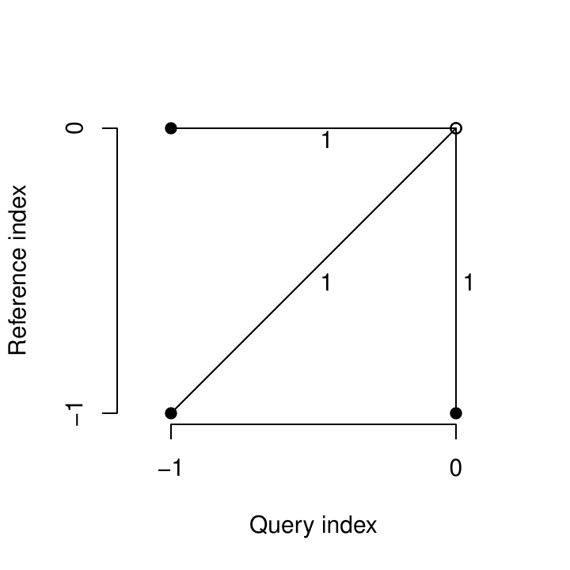
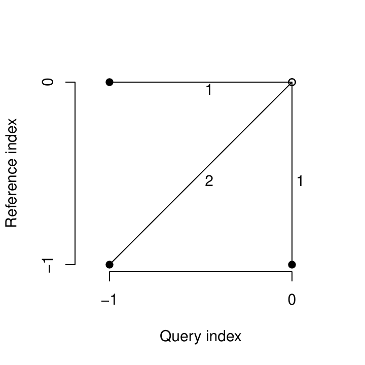
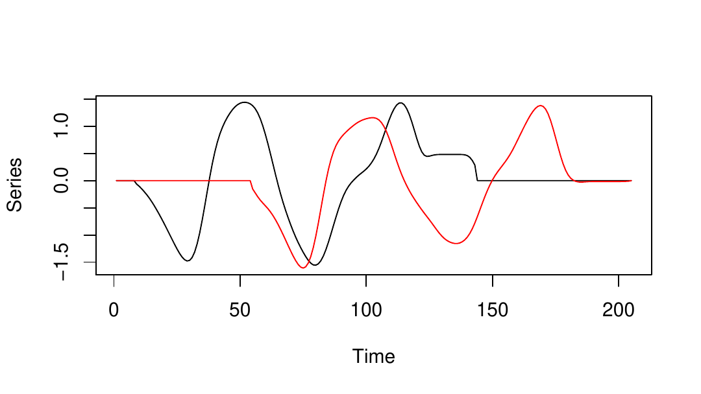
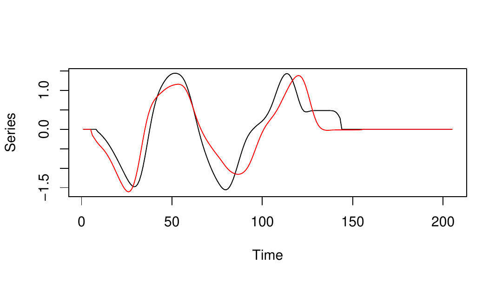

# Introduction {#sec:introduction}

Cluster analysis is a task that concerns itself with the creation of
groups of objects, where each group is called a cluster. Ideally, all
members of the same cluster are similar to each other, but are as
dissimilar as possible from objects in a different cluster. There is no
single definition of a cluster, and the characteristics of the objects
to be clustered vary. Thus, there are several algorithms to perform
clustering. Each one defines specific ways of defining what a cluster
is, how to measure similarities, how to find groups efficiently, etc.
Additionally, each application might have different goals, so a certain
clustering algorithm may be preferred depending on the type of clusters
sought [@kaufman1990].

Clustering algorithms can be organized differently depending on how they
handle the data and how the groups are created. When it comes to static
data, i.e., if the values do not change with time, clustering methods
can be divided into five major categories: partitioning (or
partitional), hierarchical, density-based, grid-based, and model-based
methods [@liao2005; @rani2012]. They may be used as the main algorithm,
as an intermediate step, or as a preprocessing step [@aghabozorgi2015].

Time-series is a common type of dynamic data that naturally arises in
many different scenarios, such as stock data, medical data, and machine
monitoring, just to name a few [@aghabozorgi2015; @aggarwal2013]. They
pose some challenging issues due to the large size and high
dimensionality commonly associated with time-series [@aghabozorgi2015].
In this context, dimensionality of a series is related to time, and it
can be understood as the length of the series. Additionally, a single
time-series object may be constituted by several values that change on
the same time scale, in which case they are identified as multivariate
time-series.

There are many techniques to modify time-series in order to reduce
dimensionality, and they mostly deal with the way time-series are
represented. Changing representation can be an important step, not only
in time-series clustering, and it constitutes a wide research area on
its own (cf. Table 2 in @aghabozorgi2015). While choice of
representation can directly affect clustering, it can be considered as a
different step, and as such it will not be discussed further here.

Time-series clustering is a type of clustering algorithm made to handle
dynamic data. The most important elements to consider are the
(dis)similarity or distance measure, the prototype extraction function
(if applicable), the clustering algorithm itself, and cluster evaluation
[@aghabozorgi2015]. In many cases, algorithms developed for time-series
clustering take static clustering algorithms and either modify the
similarity definition, or the prototype extraction function to an
appropriate one, or apply a transformation to the series so that static
features are obtained [@liao2005]. Therefore, the underlying basis for
the different clustering procedures remains approximately the same
across clustering methods. The most common approaches are hierarchical
and partitional clustering (cf. Table 4 in @aghabozorgi2015), the latter
of which includes fuzzy clustering.

@aghabozorgi2015 classify time-series clustering algorithms based on the
way they treat the data and how the underlying grouping is performed.
One classification depends on whether the whole series, a subsequence,
or individual time points are to be clustered. On the other hand, the
clustering itself may be shape-based, feature-based, or model-based.
@aggarwal2013 make an additional distinction between online and offline
approaches, where the former usually deals with grouping incoming data
streams on-the-go, while the latter deals with data that no longer
change.

In the context of shape-based time-series clustering, it is common to
utilize the Dynamic Time Warping (DTW) distance as dissimilarity measure
[@aghabozorgi2015]. The calculation of the DTW distance involves a
dynamic programming algorithm that tries to find the optimum warping
path between two series under certain constraints. However, the DTW
algorithm is computationally expensive, both in time and memory
utilization. Over the years, several variations and optimizations have
been developed in an attempt to accelerate or optimize the calculation.
Some of the most common techniques will be discussed in more detail in
[2.1](#sec:dtw).

The choice of time-series representation, preprocessing, and clustering
algorithm has a big impact on performance with respect to cluster
quality and execution time. Similarly, different programming languages
have different run-time characteristics and user interfaces, and even
though many authors make their algorithms publicly available, combining
them is far from trivial. As such, it is desirable to have a common
platform on which clustering algorithms can be tested and compared
against each other. The *dtwclust* package, developed for the R
statistical software, and part of its
[*TimeSeries*](https://CRAN.R-project.org/view=TimeSeries) view,
provides such functionality, and includes implementations of recently
developed time-series clustering algorithms and optimizations. It serves
as a bridge between classical clustering algorithms and time-series
data, additionally providing visualization and evaluation routines that
can handle time-series. All of the included algorithms are custom
implementations, except for the hierarchical clustering routines. A
great amount of effort went into implementing them as efficiently as
possible, and the functions were designed with flexibility and
extensibility in mind.

Most of the included algorithms and optimizations are tailored to the
DTW distance, hence the package's name. However, the main clustering
function is flexible so that one can test many different clustering
approaches, using either the time-series directly, or by applying
suitable transformations and then clustering in the resulting space. We
will describe the new algorithms that are available in *dtwclust*,
mentioning the most important characteristics of each, and showing how
the package can be used to evaluate them, as well as how other packages
complement it. Additionally, the variations related to DTW and other
common distances will be explored.

There are many available R packages for data clustering. The
[*flexclust*](https://CRAN.R-project.org/package=flexclust) package
[@leisch2006] implements many partitional procedures, while the
[*cluster*](https://CRAN.R-project.org/package=cluster) package
[@clustersarda] focuses more on hierarchical procedures and their
evaluation; neither of them, however, is specifically targeted at
time-series data. Packages like
[*TSdist*](https://CRAN.R-project.org/package=TSdist) [@tsdist] and
[*TSclust*](https://CRAN.R-project.org/package=TSclust) [@montero2014]
focus solely on dissimilarity measures for time-series, the latter of
which includes a single algorithm for clustering based on $p$ values.
Another example is the [*pdc*](https://CRAN.R-project.org/package=pdc)
package [@brandmaier2015], which implements a specific clustering
algorithm, namely one based on permutation distributions. The
[*dtw*](https://CRAN.R-project.org/package=dtw) package [@giorgino2009]
implements extensive functionality with respect to DTW, but does not
include the lower bound techniques that can be very useful in
time-series clustering. New clustering algorithms like *k*-Shape
[@paparrizos2015] and TADPole [@begum2015] are available to the public
upon request, but were implemented in MATLAB, making their combination
with other R packages cumbersome. Hence, the *dtwclust* package is
intended to provide a consistent and user-friendly way of interacting
with classic and new clustering algorithms, taking into consideration
the nuances of time-series data.

The rest of this manuscript presents the different logical units
required for a time-series clustering workflow, and specifies how they
are implemented in *dtwclust*. These build on top of each other and are
not entirely independent, so their coherent combination is critical. The
information relevant to the distance measures will be presented in
[2](#sec:distances). Supported algorithms for prototype extraction will
be discussed in [3](#sec:prototypes). The main clustering algorithms
will be introduced in [4](#sec:clustering). Information regarding
cluster evaluation will be provided in [5](#sec:evaluation). The
provided tools for a complete time-series clustering workflow will be
described in [6](#sec:comparison), and the final remarks will be given
in [7](#sec:conclusion). Note that code examples are intentionally
brief, and do not necessarily represent a thorough procedure to choose
or evaluate a clustering algorithm. The data used in all examples is
included in the package (saved in a list called `CharTraj`), and is a
subset of the character trajectories dataset found in @lichman2013: they
are pen tip trajectories recorded for individual characters, and the
subset contains 5 examples of the $x$ velocity for each considered
character.

# Distance measures {#sec:distances}

Distance measures provide quantification for the dissimilarity between
two time-series. Calculating distances, as well as cross-distance
matrices, between time-series objects is one of the cornerstones of any
time-series clustering algorithm. The
[*proxy*](https://CRAN.R-project.org/package=proxy) package [@proxy]
provides an extensible framework for these calculations, and is used
extensively by *dtwclust*; [2.5](#sec:distances-summary) will elaborate
in this regard.

The $l_1$ and $l_2$ vector norms, also known as Manhattan and Euclidean
distances respectively, are the most commonly used distance measures,
and are arguably the only competitive $l_p$ norms when measuring
dissimilarity [@aggarwal2001; @lemire2009]. They can be efficiently
computed, but are only defined for series of equal length and are
sensitive to noise, scale, and time shifts. Thus, many other distance
measures tailored to time-series have been developed in order to
overcome these limitations, as well as other challenges associated with
the structure of time-series, such as multiple variables, serial
correlation, etc.

In the following sections a description of the distance functions
included in *dtwclust* will be provided; these are associated with
shape-based time-series clustering, and either support DTW or provide an
alternative to it. The included distances are a basis for some of the
prototyping functions described in [3](#sec:prototypes), as well as the
clustering routines from [4](#sec:clustering), but there are many other
distance measures that can be used for time-series clustering and
classification [@montero2014; @tsdist]. It is worth noting that, even
though some of these distances are also available in other R packages,
e.g., DTW in *dtw* or Keogh's DTW lower bound in *TSdist* (see
[2.1](#sec:dtw)), the implementations in *dtwclust* are optimized for
speed, since all of them are implemented in C++ and have custom loops
for computation of cross-distance matrices, including multi-threading
support; refer to [2.6](#sec:minibench) for more information.

To facilitate notation, we define a time-series as a vector (or set of
vectors in case of multivariate series) $x$. Each vector must have the
same length for a given time-series. In general, $x^v_i$ represents the
$i$-th element of the $v$-th variable of the (possibly multivariate)
time-series $x$. We will assume that all elements are equally spaced in
time in order to avoid the time index explicitly.

## Dynamic time warping distance {#sec:dtw}

DTW is a dynamic programming algorithm that compares two series and
tries to find the optimum warping path between them under certain
constraints, such as monotonicity [@berndt1994]. It started being used
by the data mining community to overcome some of the limitations
associated with the Euclidean distance [@keogh2004].

The easiest way to get an intuition of what DTW does is graphically.
[1](#fig:dtw-intuition) shows the alignment between two sample
time-series $x$ and $y$. In this instance, the initial and final points
of the series must match, but other points may be warped in time in
order to find better matches.

{#fig:dtw-intuition
width="100%" alt="graphic without alt text"}

DTW is computationally expensive. If $x$ has length $n$ and $y$ has
length $m$, the DTW distance between them can be computed in $O(nm)$
time, which is quadratic if $m$ and $n$ are similar. Additionally, DTW
is prone to implementation bias since its calculations are not easily
vectorized and tend to be very slow in non-compiled programming
languages. A custom implementation of the DTW algorithm is included with
*dtwclust* in the `dtw_basic` function, which has only basic
functionality but still supports the most common options, and it is
faster (see [2.6](#sec:minibench)).

The DTW distance can potentially deal with series of different length
directly. This is not necessarily an advantage, as it has been shown
before that performing linear reinterpolation to obtain equal length may
be appropriate if $m$ and $n$ do not vary significantly [@keogh2004].
For a more detailed explanation of the DTW algorithm see, e.g.,
@giorgino2009. However, there are some aspects that are worth discussing
here.

The first step in DTW involves creating a local cost matrix (LCM or
$lcm$), which has $n \times m$ dimensions. Such a matrix must be created
for every pair of distances compared, meaning that memory requirements
may grow quickly as the dataset size grows. Considering $x$ and $y$ as
the input series, for each element $(i,j)$ of the LCM, the $l_p$ norm
between $x_i$ and $y_j$ must be computed. This is defined in
\@ref(eq:lcm), explicitly denoting that multivariate series are
supported as long as they have the same number of variables (note that
for univariate series, the LCM will be identical regardless of the used
norm). Thus, it makes sense to speak of a $\text{DTW}_p{}$ distance,
where $p$ corresponds to the $l_p$ norm that was used to construct the
LCM.

$$\label{eq:lcm}
lcm(i,j) = \left( \sum_v \lvert x^v_i - y^v_j \rvert ^ p \right) ^ {1/p}   (\#eq:lcm)$$

In the seconds step, the DTW algorithm finds the path that minimizes the
alignment between $x$ and $y$ by iteratively stepping through the LCM,
starting at $lcm(1,1)$ and finishing at $lcm(n,m)$, and aggregating the
cost. At each step, the algorithm finds the direction in which the cost
increases the least under the chosen constraints.

The way in which the algorithm traverses through the LCM is primarily
dictated by the chosen step pattern. It is a local constraint that
determines which directions are allowed when moving ahead in the LCM as
the cost is being aggregated, as well as the associated per-step
weights. [2](#fig:step-patterns) depicts two common step patterns and
their names in the *dtw* package. Unfortunately, very few articles from
the data mining community specify which pattern they use, although in
the author's experience, the `symmetric1` pattern seems to be standard.
By contrast, the `dtw` and `dtw_basic` functions use the `symmetric2`
pattern by default, but it is simple to modify this by providing the
appropriate value in the `step.pattern` argument. The choice of step
pattern also determines whether the corresponding DTW distance can be
normalized or not (which may be important for series with different
length). See @giorgino2009 for a complete list of step patterns and to
know which ones can be normalized.

<figure id="fig:step-patterns">
<table>
<caption> </caption>
<tbody>
<tr class="odd">
<td style="text-align: center;"></td>
<td style="text-align: center;"></td>
</tr>
<tr class="even">
<td style="text-align: center;">(a) <code>symmetric1</code> step
pattern</td>
<td style="text-align: center;">(b) <code>symmetric2</code> step
pattern</td>
</tr>
</tbody>
</table>
<figcaption>Figure 2: Two common step patterns used by DTW when
traversing the LCM. At each step, the lines denote the allowed
directions that can be taken, as well as the weight associated with each
one.</figcaption>
</figure>

It should be noted that the DTW distance does not satisfy the triangle
inequality, and it is not symmetric in general, e.g., for asymmetric
step patterns [@giorgino2009]. The patterns in [2](#fig:step-patterns)
can result in a symmetric DTW calculation, provided no constraints are
used (see the next section), or all series have the same length if a
constraint is indeed used.

### Global DTW constraints {#sec:dtw-window}

One of the possible modifications of DTW is to use global constraints,
also known as window constraints. These limit the area of the LCM that
can be reached by the algorithm. There are many types of windows (see,
e.g., @giorgino2009), but one of the most common ones is the Sakoe-Chiba
window [@sakoe1978], with which an allowed region is created along the
diagonal of the LCM (see [3](#fig:dtw-window-plot)). These constraints
can marginally speed up the DTW calculation, but they are mainly used to
avoid pathological warping. It is common to use a window whose size is
10% of the series' length, although sometimes smaller windows produce
even better results [@keogh2004].

{#fig:dtw-window-plot
width="100%" alt="graphic without alt text"}

Strictly speaking, if the series being compared have different lengths,
a constrained path may not exist, since the Sakoe-Chiba band may prevent
the end point of the LCM to be reached [@giorgino2009]. In these cases a
slanted band window may be preferred, since it stays along the diagonal
for series of different length and is equivalent to the Sakoe-Chiba
window for series of equal length. If a window constraint is used with
*dtwclust*, a slanted band is employed.

It is not possible to know a priori what window size, if any, will be
best for a specific application, although it is usually agreed that no
constraint is a poor choice. For this reason, it is better to perform
tests with the data one wants to work with, perhaps taking a subset to
avoid excessive running times.

It should be noted that, when reported, window sizes are always integers
greater than zero. If we denote this number with $w$, and for the
specific case of the slanted band window, the valid region of the LCM
will be constituted by all valid points in the range
$\left[ (i,j - w), (i, j + w) \right]$ for all $(i,j)$ along the LCM
diagonal. Thus, at each step, at most $2w + 1$ elements may fall within
the window for a given window size $w$. This is the convention followed
by *dtwclust*.

### Lower bounds for DTW {#sec:lbs}

Due to the fact that DTW itself is expensive to compute, lower bounds
(LBs) for the DTW distance have been developed. These lower bounds
guarantee being less than or equal to the corresponding DTW distance.
They have been exploited when indexing time-series databases,
classification of time-series, clustering, etc.
[@keogh2005; @begum2015]. Out of the existing DTW LBs, the two most
effective are termed `LB_Keogh` [@keogh2005] and `LB_Improved`
[@lemire2009]. The reader is referred to the respective articles for
detailed definitions and proofs of the LBs, however some important
considerations will be further discussed here.

Each LB can be computed with a specific $l_p$ norm. Therefore, it
follows that the $l_p$ norms used for DTW and LB calculations must
match, such that $\text{LB}_p \leq \text{DTW}_p{}$. Moreover,
$\text{LB\_Keogh}_p \leq \text{LB\_Improved}_p \leq \text{DTW}_p{}$,
meaning that `LB_Improved` can provide a tighter LB. It must be noted
that the LBs are only defined for series of equal length and are not
symmetric regardless of the $l_p$ norm used to compute them. Also note
that the choice of step pattern affects the value of the DTW distance,
changing the tightness of a given LB.

One crucial step when calculating the LBs is the computation of the
so-called envelopes. These envelopes require a window constraint, and
are thus dependent on both the type and size of the window. Based on
these, a running minimum and maximum are computed, and a lower and upper
envelope are generated respectively. [4](#fig:envelope-plot) depicts a
sample time-series with its corresponding envelopes for a Sakoe-Chiba
window of size 15.

{#fig:envelope-plot width="100%"
alt="graphic without alt text"}

In order for the LBs to be worth it, they must be computed in
significantly less time than it takes to calculate the DTW distance.
@lemire2009 developed a streaming algorithm to calculate the envelopes
using no more than $3n$ comparisons when using a Sakoe-Chiba window.
This algorithm has been ported to *dtwclust* using the C++ programming
language, ensuring an efficient calculation, and it is exposed in the
`compute_envelope` function.

`LB_Keogh` requires the calculation of one set of envelopes for every
pair of series compared, whereas `LB_Improved` must calculate two sets
of envelopes for every pair of series. If the LBs must be calculated
between several time-series, some envelopes can be reused when a given
series is compared against many others. This optimization is included in
the LB functions registered with *proxy* by *dtwclust*.

## Global alignment kernel distance {#sec:gak}

@cuturi2011 proposed an algorithm to assess similarity between time
series by using kernels. He began by formalizing an alignment between
two series $x$ and $y$ as $\pi$, and defined the set of all possible
alignments as $\mathcal{A}(n,m)$, which is constrained by the lengths of
$x$ and $y$. It is shown that the DTW distance can be understood as the
cost associated with the minimum alignment.

A Global Alignment (GA) kernel that considers the cost of all possible
alignments by computing their exponentiated soft-minimum is defined, and
it is argued that it quantifies similarities in a more coherent way.
However, the GA kernel has associated limitations, namely diagonal
dominance and a complexity $O(nm)$. With respect to the former,
@cuturi2011 states that diagonal dominance should not be an issue as
long as one of the series being compared is not longer than twice the
length of the other.

In order to reduce the GA kernel's complexity, @cuturi2011 proposed
using the triangular local kernel for integers shown in
\@ref(eq:int-kernel), where $T$ represents the kernel's order. By
combining it with the kernel $\kappa$ in \@ref(eq:phi-kernel) (which is
based on the Gaussian kernel $\kappa_\sigma$), the Triangular Global
Alignment Kernel (TGAK) in \@ref(eq:tga-kernel) is obtained. Such a
kernel can be computed in $O(T \min(n,m))$, and is parameterized by the
triangular constraint $T$ and the Gaussian's kernel width $\sigma$.

$$\label{eq:int-kernel}
\omega(i,j) = \left( 1 - \frac{|i - j|}{T} \right)_{+}   (\#eq:int-kernel)$$

$$\label{eq:phi-kernel}
\begin{gather}
\kappa (x,y) = e ^ {-\phi_\sigma(x,y)} \\
\phi_\sigma(x,y) = \frac{1}{2 \sigma ^ 2} \left\lVert x - y \right\rVert ^ 2 + \log \left( 2 - e ^ {-\frac{\left\lVert x - y \right\rVert ^ 2}{2 \sigma ^ 2}} \right)
\end{gather}   (\#eq:phi-kernel)$$

$$\label{eq:tga-kernel}
\text{TGAK}(x,y,\sigma,T) = \tau ^ {-1} \left( \omega \otimes \frac{1}{2} \kappa \right) (i,x;j,y) = \frac{\omega(i,j) \kappa (x,y)}{2 - \omega(i,j) \kappa (x,y)}   (\#eq:tga-kernel)$$

The triangular constraint is similar to the window constraints that can
be used in the DTW algorithm. When $T = 0$ or $T \rightarrow \infty$,
the TGAK converges to the original GA kernel. When $T = 1$, the TGAK
becomes a slightly modified Gaussian kernel that can only compare series
of equal length. If $T > 1$, then only the alignments that fulfil
$-T < \pi_1(i) - \pi_2(i) < T$ are considered.

@cuturi2011 also proposed a strategy to estimate the value of $\sigma$
based on the time-series themselves and their lengths, namely
$c \cdot \text{med}(\left\lVert x - y \right\rVert) \cdot \sqrt{\text{med}(|\text{x}|)}$,
where $\text{med}(\cdot)$ is the empirical median, $c$ is some constant,
and $x$ and $y$ are subsampled vectors from the dataset. This, however,
introduces some randomness into the algorithm when the value of $\sigma$
is not provided, so it might be better to estimate it once and re-use it
in subsequent function evaluations. In *dtwclust*, the value of $c$ is
set to 1.

The similarity returned by the TGAK can be normalized with
\@ref(eq:tgak-norm) so that its values lie in the range $[0,1]$. Hence,
a distance measure for time-series can be obtained by subtracting the
normalized value from 1. The algorithm supports multivariate series and
series of different length (with some limitations). The resulting
distance is symmetric and satisfies the triangle inequality, although it
is more expensive to compute in comparison to DTW.

$$\label{eq:tgak-norm}
\exp \left( \log\left( \text{TGAK}(x,y,\sigma,T) \right) - \frac{\log\left( \text{TGAK}(x,x,\sigma,T) \right) + \log\left( \text{TGAK}(y,y,\sigma,T) \right)}{2} \right)   (\#eq:tgak-norm)$$

A C implementation of the TGAK algorithm is available at its author's
website [^1]. An R wrapper has been implemented in *dtwclust* in the
`GAK` function, performing the aforementioned normalization and
subtraction in order to obtain a distance measure that can be used in
clustering procedures.

## Soft-DTW {#sec:sdtw}

Following with the idea of the TGAK, i.e., of regularizing DTW by
smoothing it, @cuturi2017 proposed a unified algorithm using a
parameterized soft-minimum as shown in \@ref(eq:soft-dtw) (where
$\Delta(x,y)$ represents the LCM), and called the resulting discrepancy
a soft-DTW, discussing its differentiability. Thanks to this property, a
gradient function can be obtained, and @cuturi2017 developed a more
efficient way to compute it. This can be then used to calculate
centroids with numerical optimization as discussed in
[3.3](#sec:sdtw-cent).

$$\label{eq:soft-dtw}
\begin{gather}
\text{dtw}_\gamma(x,y) = \text{min} ^ \gamma \lbrace \langle A, \Delta(x,y) \rangle, A \in \mathcal{A}(n,m) \rbrace \\
\text{min} ^ \gamma \lbrace a_1, \ldots, a_n \rbrace =
\begin{cases}
\text{min}_{i \leq n} a_i, \quad \gamma = 0 \\
-\gamma \log \sum_{i=1}^{n} e^{-a_i / \gamma}, \quad \gamma > 0
\end{cases}
\end{gather}   (\#eq:soft-dtw)$$

However, as a stand-alone distance measure, the soft-DTW distance has
some disadvantages: the distance can be negative, the distance between
$x$ and itself is *not* necessarily zero, it does not fulfill the
triangle inequality, and also has quadratic complexity with respect to
the series' lengths. On the other hand, it is a symmetric distance, it
supports multivariate series as well as different lengths, and it can
provide differently smoothed results by means of a user-defined
$\gamma$.

## Shape-based distance {#sec:sbd}

The shape-based distance (SBD) was proposed as part of the *k*-Shape
clustering algorithm [@paparrizos2015]; this algorithm will be further
discussed in [3.4](#sec:shape) and [4.0.2](#sec:kshape). SBD is
presented as a faster alternative to DTW. It is based on the
cross-correlation with coefficient normalization (NCCc) sequence between
two series, and is thus sensitive to scale, which is why @paparrizos2015
recommend *z*-normalization. The NCCc sequence is obtained by convolving
the two series, so different alignments can be considered, but no
point-wise warpings are made. The distance can be calculated with the
formula shown in \@ref(eq:sbd), where $\left\lVert \cdot \right\rVert_2$
is the $l_2$ norm of the series. Its range lies between 0 and 2, with 0
indicating perfect similarity.

$$\label{eq:sbd}
SBD(x,y) = 1 - \frac{\max \left( NCCc(x,y) \right)}{\left\lVert x \right\rVert_2 \left\lVert y \right\rVert_2}   (\#eq:sbd)$$

This distance can be efficiently computed by utilizing the Fast Fourier
Transform (FFT) to obtain the NCCc sequence, although that might make it
sensitive to numerical precision, especially in 32-bit architectures. It
can be very fast, it is symmetric, it was very competitive in the
experiments performed in @paparrizos2015 (although the run-time
comparison was slightly biased due to the slow MATLAB implementation of
DTW), and it supports (univariate) series of different length directly.
Additionally, some FFTs can be reused when computing the SBD between
several series; this optimization is also included in the SBD function
registered with *proxy* by *dtwclust*.

## Summary of distance measures {#sec:distances-summary}

The distances described in this section are the ones implemented in
*dtwclust*, which serve as basis for the algorithms presented in
[3](#sec:prototypes) and [4](#sec:clustering). [1](#tab:distances)
summarizes the salient characteristics of these distances.

::: {#tab:distances}
  -----------------------------------------------------------------------------------
  Distance      Computational   Normalized   Symmetric   Multivariate   Support for
                cost                                     support        length
                                                                        differences
  ------------- --------------- ------------ ----------- -------------- -------------
  LB_Keogh      Low             No           No          No             No

  LB_Improved   Low             No           No          No             No

  DTW           Medium          Can be\*     Can be\*    Yes            Yes

  GAK           High            Yes          Yes         Yes            Yes

  Soft-DTW      High            Yes          Yes         Yes            Yes

  SBD           Low             Yes          Yes         No             Yes
  -----------------------------------------------------------------------------------

  : Table 1: Characteristics of time-series distance measures
  implemented in *dtwclust*. Regarding the cells marked with an
  asterisk: the DTW distance can be normalized for certain step
  patterns, and can be symmetric for symmetric step patterns when either
  no window constraints are used, or all time-series have the same
  length if constraints are indeed used.
:::

Nevertheless, there are many other measures that can be used. In order
to account for this, the *proxy* package is leveraged by *dtwclust*, as
well as other packages (e.g., *TSdist*). It aggregates all its measures
in a database object called `pr_DB`, which has the advantage that all
registered functions can be used with the `proxy::dist` function. For
example, registering the autocorrelation-based distance provided by
package *TSclust* could be done in the following way.

``` r
require("TSclust")

proxy::pr_DB$set_entry(FUN = diss.ACF, names = c("ACFD"),
                       loop = TRUE, distance = TRUE,
                       description = "Autocorrelation-based distance")

proxy::dist(CharTraj[3L:8L], method = "ACFD", upper = TRUE)

A.V3      A.V4      A.V5      B.V1      B.V2      B.V3
A.V3           0.7347970 0.7269654 1.3365966 0.9022004 0.6204877
A.V4 0.7347970           0.2516642 2.0014314 1.5712718 1.2133404
A.V5 0.7269654 0.2516642           2.0178486 1.6136650 1.2901999
B.V1 1.3365966 2.0014314 2.0178486           0.5559639 0.9937621
B.V2 0.9022004 1.5712718 1.6136650 0.5559639           0.4530352
B.V3 0.6204877 1.2133404 1.2901999 0.9937621 0.4530352
```

Any distance function registered with *proxy* can be used for
time-series clustering with *dtwclust*. More details are provided in
[4.1](#sec:partitional-example).

## Practical optimizations {#sec:minibench}

As mentioned before, one of the advantages of the distances implemented
as part of *dtwclust* is that the core calculations are performed in
C++, making them faster. The other advantage is that the calculations of
cross-distance matrices leverage multi-threading. In the following, a
series of comparisons against implementations in other packages is
presented, albeit without the consideration of parallelization. Further
information is available in the vignettes included with the package
[^2].

One of DTW's lower bounds, `LB_Keogh`, is also available in *TSdist* as
a pure R implementation. We can see how it compares to the C++ version
included in *dtwclust* in [5](#fig:lbk-single-benchmark), considering
different series lengths and window sizes. The time for each point in
the graph was computed by repeating the calculation 100 times and
extracting the median time.

{#fig:lbk-single-benchmark
width="100%" alt="graphic without alt text"}

Similarly, the DTW distance is also available in the *dtw* package, and
possesses a C core. The `dtw_basic` version included with *dtwclust*
only supports a slanted window constraint (or none at all), and the
`symmetric1` and `symmetric2` step patterns, so it performs less checks,
and uses a memory-saving version where only 2 rows of the LCM are saved
at a time. As with `LB_Keogh`, a comparison of the DTW implementations'
execution times can be seen in [6](#fig:dtw-single-benchmark).

{#fig:dtw-single-benchmark
width="100%" alt="graphic without alt text"}

The time difference in single calculations is not so dramatic, but said
differences accumulate when calculating cross-distance matrices, and
become much more significant. The behavior of `LB_Keogh` can be seen in
[7](#fig:lbk-multiple-benchmark), with a fixed window size of 30 and
series of length 100. The implementation in *dtwclust* performs the
whole calculation in C++, and only calculates the necessary warping
envelopes once, although it can be appreciated that this does not have a
significant effect.

{#fig:lbk-multiple-benchmark
width="100%" alt="graphic without alt text"}

The behavior of the DTW implementations can be seen in
[8](#fig:dtw-multiple-benchmark). The *dtwclust* version is an order of
magnitude faster, even single-threaded, and it can benefit from
parallelization essentially proportionally to the number of threads
available.

{#fig:dtw-multiple-benchmark
width="100%" alt="graphic without alt text"}

# Time-series prototypes {#sec:prototypes}

A very important step of time-series clustering is the calculation of
so-called time-series prototypes. It is expected that all series within
a cluster are similar to each other, and one may be interested in trying
to define a time-series that effectively summarizes the most important
characteristics of all series in a given cluster. This series is
sometimes referred to as an average series, and prototyping is also
sometimes called time-series averaging, but we will prefer the term
"prototyping", although calling them time-series centroids is also
common.

Computing prototypes is commonly done as a sub-routine of a larger task.
In the context of clustering (see [4](#sec:clustering)), partitional
procedures rely heavily on the prototyping function, since the resulting
prototypes are used as cluster centroids. Prototyping could even be a
pre-processing step, whereby different samples from the same source can
be summarized before clustering (e.g., for the character trajectories
dataset, all trajectories from the same character can be summarized and
then groups of similar characters could be sought), thus reducing the
amount of data and execution time. Another example is time-series
classification based on nearest-neighbors, which can be optimized by
considering only group-prototypes as neighbors instead of the union of
all groups. Nevertheless, it is important to note that the distance used
in the overall task should be congruent with the chosen centroid, e.g.,
using the DTW distance for DTW-based prototypes.

The choice of prototyping function is closely related to the chosen
distance measure and, in a similar fashion, it is not simple to know
which kind of prototype will be better a priori. There are several
strategies available for time-series prototyping, although due to their
high dimensionality, what exactly constitutes an average time-series is
debatable, and some notions could worsen performance significantly. The
following sections will briefly describe some of the common approaches
when dealing with time-series.

## Partition around medoids {#sec:pam}

One approach is to use partition around medoids (PAM). A medoid is
simply a representative object from a cluster, in this case also a
time-series, whose average distance to all other objects in the same
cluster is minimal. Since the medoid object is always an element of the
original data, PAM is sometimes preferred over mean or median so that
the time-series structure is not altered.

A possible advantage of PAM is that, since the data does not change, it
is possible to precompute the whole distance matrix once and re-use it
on each iteration, and even across different number of clusters and
random repetitions. However, this is not suitable for large datasets
since the whole distance matrix has to be allocated at once.

In the implementation included in the package, the distances between all
member series are computed, and the series with minimum sum of distances
is chosen as the prototype.

## DTW barycenter averaging {#sec:dba}

The DTW distance is used very often when working with time-series, and
thus a prototyping function based on DTW has also been developed in
@petitjean2011. The procedure is called DTW barycenter averaging (DBA),
and is an iterative, global method. The latter means that the order in
which the series enter the prototyping function does not affect the
outcome.

DBA requires a series to be used as reference (centroid), and it usually
begins by randomly selecting one of the series in the data. On each
iteration, the DTW alignment between each series in the cluster $C$ and
the centroid is computed. Because of the warping performed in DTW, it
can be that several time-points from a given time-series map to a single
time-point in the centroid series, so for each time-point in the
centroid, all the corresponding values from all series in $C$ are
grouped together according to the DTW alignments, and the mean is
computed for each centroid point using the values contained in each
group. This is iteratively repeated until a certain number of iterations
are reached, or until convergence is assumed.

The *dtwclust* implementation of DBA is done in C++ and includes several
memory optimizations. Nevertheless, it is more computationally expensive
due to all the DTW calculations that must be performed. However, it is
very competitive when using the DTW distance and, thanks to DTW itself,
it can support series with different length directly, with the caveat
that the length of the resulting prototype will be the same as the
length of the reference series that was initially chosen by the
algorithm, and that the `symmetric1` or `symmetric2` step pattern should
be used.

## Soft-DTW centroid {#sec:sdtw-cent}

Thanks to the gradient that can be computed as a by-product of the
soft-DTW distance calculation (see [2.3](#sec:sdtw)), it is possible to
define an objective function (see Equation (4) in @cuturi2017) and
subsequently minimize it with numerical optimization. In addition to the
smoothing parameter of soft-DTW ($\gamma$), the optimization procedure
considers the option of using normalizing weights for the input series,
which noticeably alters the resulting centroids (see Figure 4 in
@cuturi2017). The clustering and classification experiments performed by
@cuturi2017 showed that using soft-DTW (distance and centroid) provided
quantitatively better results in many scenarios.

## Shape extraction {#sec:shape}

A recently proposed method to calculate time-series prototypes is termed
shape extraction, and is part of the *k*-Shape algorithm (see
[4.0.2](#sec:kshape)) described in @paparrizos2015. As with the
corresponding SBD (see [2.4](#sec:sbd)), the algorithm depends on NCCc,
and it first uses it to match two series optimally.
[9](#fig:sbd-alignment) depicts the alignment that is performed using
two sample series.

<figure id="fig:sbd-alignment">
<table>
<caption> </caption>
<tbody>
<tr class="odd">
<td style="text-align: center;"></td>
<td style="text-align: center;"></td>
</tr>
<tr class="even">
<td style="text-align: center;">(a) Series before alignment</td>
<td style="text-align: center;">(b) Series after alignment</td>
</tr>
</tbody>
</table>
<figcaption>Figure 9: Visualization of the NCCc-based alignment
performed on two sample series. After alignment, the second (red) series
is either truncated and/or prepended/appended with zeros so that its
length matches the first(black) series.</figcaption>
</figure>

As with DBA, a centroid series is needed, so one is usually randomly
chosen from the data. An exception is when all considered time-series
have the same length, in which case no centroid is needed beforehand.
The alignment can be done between series with different length, and
since one of the series is shifted in time, it may be necessary to
truncate and prepend or append zeros to the non-reference series, so
that the final length matches that of the reference. This is because the
final step of the algorithm builds a matrix with the matched series
(row-wise) and performs a so-called maximization of Rayleigh Quotient to
obtain the final prototype; see @paparrizos2015 for more details.

The output series of the algorithm must be *z*-normalized. Thus, the
input series as well as the reference series must also have this
normalization. Even though the alignment can be done between series with
different length, it has the same caveat as DBA, namely that the length
of the resulting prototype will depend on the length of the chosen
reference. Technically, for multivariate series, the shape extraction
algorithm could be applied for each variable $v$ of all involved series,
but this was not explored by the authors of *k*-Shape.

## Summary of prototyping functions {#sec:prototypes-summary}

[2](#tab:centroids) summarizes the time-series prototyping functions
implemented in *dtwclust*, including the distance measure they are based
upon, where applicable. It is worth mentioning that, as will be
described in [4](#sec:clustering), the choice of distance and
prototyping function is very important for time-series clustering, and
it may be ill-advised to use a distance measure that does not correspond
to the one used by the prototyping function. Using PAM is an exception,
because the medoids are not modified, so any distance can be used to
choose a medoid. It is possible to use custom prototyping functions for
time-series clustering (see [4.1](#sec:partitional-example)), but it is
important to maintain congruence with the chosen distance measure.

::: {#tab:centroids}
  --------------------------------------------------------------------------------------------------------------------
  Prototyping function   Distance used   Algorithm used
  ---------------------- --------------- -----------------------------------------------------------------------------
  PAM                    ---             Time-series with minimum sum of distances to the other series in the group.

  DBA                    DTW             Average of points grouped according to DTW alignments.

  Soft-DTW centroid      Soft-DTW        Numerical optimization using the derivative of soft-DTW.

  Shape extraction       SBD             Normalized eigenvector of a matrix created with SBD-aligned series.
  --------------------------------------------------------------------------------------------------------------------

  : Table 2: Time-series prototyping functions implemented in
  *dtwclust*, and their corresponding distance measures.
:::

# Time-series clustering {#sec:clustering}

There are several clustering algorithms, but in general, they fall
within 3 categories: hierarchical clustering, which induces a hierarchy
in the data; partitional clustering, which creates crisp partitions of
data; and fuzzy clustering, which creates fuzzy or overlapping
partitions.

Hierarchical clustering is an algorithm that tries to create a hierarchy
of groups in which, as the level in the hierarchy increases, clusters
are created by merging the clusters from the next lower level, such that
an ordered sequence of groupings is obtained; this may be deceptive, as
the algorithms impose the hierarchical structure even if such structure
is not inherent to the data [@hastie2009]. In order to decide how the
merging is performed, a (dis)similarity measure between groups should be
specified, in addition to the one that is used to calculate pairwise
similarities. However, a specific number of clusters does not need to be
specified for the hierarchy to be created, and the procedure is
deterministic, so it will always give the same result for a chosen set
of (dis)similarity measures.

Hierarchical clustering has the disadvantage that the whole distance
matrix must be calculated for a given dataset, which in most cases has a
time and memory complexity of $O(N^2)$ if $N$ is the total number of
objects in the dataset. Thus, hierarchical procedures are usually used
with relatively small datasets.

Partitional clustering is a strategy used to create partitions. In this
case, the data is explicitly assigned to one and only one cluster out of
$k$ total clusters. The number of desired clusters must be specified
beforehand, which can be a limiting factor. Some of the most popular
partitional algorithms are *k*-means and *k*-medoids [@hastie2009].
These use the Euclidean distance and, respectively, mean or PAM
centroids (see [3](#sec:prototypes)).

Partitional clustering algorithms commonly work in the following way.
First, $k$ centroids are randomly initialized, usually by choosing $k$
objects from the dataset at random; these are assigned to individual
clusters. The distance between all objects in the data and all centroids
is calculated, and each object is assigned to the cluster of its closest
centroid. A prototyping function is applied to each cluster to update
the corresponding centroid. Then, distances and centroids are updated
iteratively until a certain number of iterations have elapsed, or no
object changes clusters any more. Most of the proposed algorithms for
time-series clustering use the same basic strategy while changing the
distance and/or centroid function.

Partitional clustering procedures are stochastic due to their random
start. Thus, it is common practice to test different starting points to
evaluate several local optima and choose the best result out of all the
repetitions. It tends to produce spherical clusters, but has a lower
complexity, so it may be applied to very large datasets.

In crisp partitions, each member of the data belongs to only one
cluster, and clusters are mutually exclusive. By contrast, fuzzy
clustering creates a fuzzy or soft partition in which each member
belongs to each cluster to a certain degree. For each member of the
data, the degree of belongingness is constrained so that its sum equals
1 across all clusters. Therefore, if there are $N$ objects in the data
and $k$ clusters are desired, an $N \times k$ membership matrix $u$ can
be created, where all the rows must sum to 1 (note that some authors use
the transposed version of $u$).

Technically, fuzzy clustering can be repeated several times with
different random starts, since $u$ is initialized randomly. However,
comparing the results would be difficult, since it could be that the
values within $u$ are shuffled but the overall fuzzy grouping remains
the same, or changes very slightly, once the algorithm has converged.
Note that it is straightforward to change the fuzzy partition to a crisp
one by taking the argument of the row-wise maxima of $u$ and assigning
the respective series to the corresponding cluster only.

The main clustering function in *dtwclust* is `tsclust`, which supports
all of the aforementioned clustering algorithms. Part of this support
comes from functionality provided by other R packages. However, the
advantage of using *dtwclust* is that it can handle time-series nuances,
like series with different lengths and multivariate series. This is
particularly important for partitional clustering, where both distance
and prototyping functions must be applicable to time-series data. For
brevity, the following sections will focus on describing the new
clustering algorithms implemented in *dtwclust*, but more information
can be obtained in the functions' documentation.

### TADPole clustering {#sec:tadpole}

TADPole clustering was proposed in @begum2015, and is implemented in
*dtwclust* in the `TADPole` function. It adopts a relatively new
clustering framework and adapts it to time-series clustering with the
DTW distance. Because of the way the algorithm works, it can be
considered a kind of PAM clustering, since the centroids are always
elements of the data. However, this algorithm is deterministic depending
on the value of a cutoff distance ($d_c$).

The algorithm first uses the DTW distance's upper and lower bounds
(Euclidean distance and `LB_Keogh` respectively) to find series with
many close neighbors (in DTW space). Anything below $d_c$ is considered
a neighbor. Aided with this information, the algorithm then tries to
prune as many DTW calculations as possible in order to accelerate the
clustering procedure. The series that lie in dense areas (i.e., that
have lots of neighbors) are taken as cluster centroids. For a more
detailed explanation of each step, please refer to @begum2015.

TADPole relies on the DTW bounds, which are only defined for time-series
of equal length. Consequently, it requires a Sakoe-Chiba constraint.
Furthermore, it should be noted that the Euclidean distance is only
valid as a DTW upper bound if the `symmetric1` step pattern is used (see
[2](#fig:step-patterns)). Finally, the allocation of several distance
matrices is required, making it similar to hierarchical procedures
memory-wise, so its applicability is limited to relatively small
datasets.

### *k*-Shape clustering {#sec:kshape}

The *k*-Shape clustering algorithm was developed by @paparrizos2015. It
is a partitional clustering algorithm with a custom distance measure
(SBD; see [2.4](#sec:sbd)), as well as a custom centroid function (shape
extraction; see [3.4](#sec:shape)). It is also stochastic in nature, and
requires *z*-normalization in its default definition. In order to use
this clustering algorithm, the `tsclust` function should be called with
partitional as the clustering type, SBD as the distance measure, shape
extraction as the centroid function, and *z*-normalization as the
preprocessing step. As can be appreciated, this algorithm uses the same
strategy as *k*-means, but replaces both distance and prototying
functions with custom ones that are congruent with each other.

## Clustering examples {#sec:partitional-example}

In this example, three different partitional clustering strategies are
used: the $\text{DTW}_2$ distance and DBA centroids, *k*-Shape, and
finally TADPole. The results are evaluated using Variation of
Information (see [5](#sec:evaluation)), with lower numbers indicating
better results. Note that *z*-normalization is applied by default when
selecting shape extraction as the centroid function. For consistency,
all algorithms used the reinterpolated and normalized data, since some
algorithms require series of equal length. A subset of the data is used
for speed. The outcome should not be generalized to other data, and
normalization/reinterpolation may actually worsen some of the
algorithms' performance.

``` r
# Linear reinterpolation to same length
data <- reinterpolate(CharTraj, new.length = max(lengths(CharTraj)))
# z-normalization
data <- zscore(data[60L:100L])

pc_dtw <- tsclust(data, k = 4L, seed = 8L,
                  distance = "dtw_basic", centroid = "dba",
                  norm = "L2", window.size = 20L)

pc_ks <- tsclust(data, k = 4L, seed = 8L,
                 distance = "sbd", centroid = "shape")

pc_tp <- tsclust(data, k = 4L, type = "tadpole", seed = 8L,
                 control = tadpole_control(dc = 1.5, window.size = 20L))

sapply(list(DTW = pc_dtw, kShape = pc_ks, TADPole = pc_tp),
       cvi, b = CharTrajLabels[60L:100L], type = "VI")

   DTW.VI  kShape.VI TADPole.VI
0.5017081  0.4353306  0.4901096
```

As can be seen, using a distance registered with *proxy* can be done by
simply specifying its name in the `distance` argument of `tsclust`.
Using the prototyping functions included in *dtwclust* can be done by
passing their respective names in the `centroid` parameter, but using a
custom prototyping function is also possible. For example, a weighted
mean centroid is implemented as follows. The usefulness of such an
approach is of course questionable.

``` r
weighted_mean_cent <- function(x, cl_id, k, cent, cl_old, ..., weights) {
    x <- Map(x, weights, f = function(ts, w) { w * ts })
    x_split <- split(x, cl_id)
    new_cent <- lapply(x_split, function(xx) {
        xx <- do.call(rbind, xx)
        colMeans(xx)
    })
}

data <- reinterpolate(CharTraj, new.length = max(lengths(CharTraj)))
weights <- rep(c(0.9,1.1), each = 5L)
tsclust(data[1L:10L], type = "p", k = 2L,
        distance = "Manhattan",
        centroid = weighted_mean_cent,
        seed = 123,
        args = tsclust_args(cent = list(weights = weights)))

partitional clustering with 2 clusters
Using manhattan distance
Using weighted_mean_cent centroids

Time required for analysis:
user  system elapsed
0.024   0.000   0.023

Cluster sizes with average intra-cluster distance:

size  av_dist
1    5 15.05069
2    5 18.99145
```

# Cluster evaluation {#sec:evaluation}

Clustering is commonly considered to be an unsupervised procedure, so
evaluating its performance can be rather subjective. However, a great
amount of effort has been invested in trying to standardize cluster
evaluation metrics by using cluster validity indices (CVIs). Many
indices have been developed over the years, and they form a research
area of their own, but there are some overall details that are worth
mentioning. The discussion here is based on @arbelaitz2013 and
@wang2007, which provide a much more comprehensive overview.

In general, CVIs can be either tailored to crisp or fuzzy partitions.
For the former, CVIs can be classified as internal, external or relative
depending on how they are computed. Focusing on the first two, the
crucial difference is that internal CVIs only consider the partitioned
data and try to define a measure of cluster purity, whereas external
CVIs compare the obtained partition to the correct one. Thus, external
CVIs can only be used if the ground truth is known.

Note that even though a fuzzy partition can be changed into a crisp one,
making it compatible with many of the existing "crisp" CVIs, there are
also fuzzy CVIs tailored specifically to fuzzy clustering, and these may
be more suitable in those situations. Fuzzy partitions usually have no
ground truth associated with them, but there are exceptions depending on
the task's goal [@lei2017].

Several of the best-performing CVIs according to @wang2007,
@arbelaitz2013, and [@lei2017] are implemented in *dtwclust* in the
`cvi` function. [3](#tab:cvis) specifies which ones are available and
some of their particularities.

::: {#tab:cvis}
  --------------------------------------------------------------------------------------------------------------------------------------------------------------------------
  CVI                                  Internal or external   Crisp or fuzzy partitions   Minimized or Maximized   Considerations
  ------------------------------------ ---------------------- --------------------------- ------------------------ ---------------------------------------------------------
  Rand                                 External               Crisp                       Maximized                ---

  Adjusted rand                        External               Crisp                       Maximized                ---

  Jaccard                              External               Crisp                       Maximized                ---

  Fowlkes-Mallows                      External               Crisp                       Maximized                ---

  Variation of information             External               Crisp                       Minimized                ---

  Soft rand                            External               Fuzzy                       Maximized                ---

  Soft adjusted rand                   External               Fuzzy                       Maximized                ---

  Soft variation of information        External               Fuzzy                       Minimized                ---

  Soft normalized mutual information   External               Fuzzy                       Maximized                ---

  Silhouette                           Internal               Crisp                       Maximized                Requires the whole cross-distance matrix.

  Dunn                                 Internal               Crisp                       Maximized                Requires the whole cross-distance matrix.

  COP                                  Internal               Crisp                       Minimized                Requires the whole cross-distance matrix.

  Davies-Bouldin                       Internal               Crisp                       Minimized                Calculates distances to the computed cluster centroids.

  Modified Davies-Bouldin (DB\*)       Internal               Crisp                       Minimized                Calculates distances to the computed cluster centroids.

  Calinski-Harabasz                    Internal               Crisp                       Maximized                Calculates a global centroid.

  Score function                       Internal               Crisp                       Maximized                Calculates a global centroid.

  MPC                                  Internal               Fuzzy                       Maximized                ---

  K                                    Internal               Fuzzy                       Minimized                Calculates a global centroid.

  T                                    Internal               Fuzzy                       Minimized                ---

  SC                                   Internal               Fuzzy                       Maximized                Calculates a global centroid.

  PBMF                                 Internal               Fuzzy                       Maximized                Calculates a global centroid.
  --------------------------------------------------------------------------------------------------------------------------------------------------------------------------

  : Table 3: Cluster validity indices included in *dtwclust*. The first
  four are calculated with the `comPart` function from the *flexclust*
  package. The Silhouette index is calculated with the `silhouette`
  function in the *cluster* package. Internal fuzzy CVIs use the
  nomenclature from [@wang2007].
:::

There are some advantages and corresponding caveats with respect to the
*dtwclust* implementations. Many internal CVIs require additional
distance calculations, and some also compute so-called global centroids
(a centroid that uses the whole dataset), which were calculated with,
respectively, the Euclidean distance and a mean centroid in the original
definition. The implementations in *dtwclust* change this, making use of
whatever distance/centroid was utilized during clustering without
further intervention from the user, so it is possible to leverage the
distance and centroid functions that support time-series. Nevertheless,
many CVIs assume symmetric distance functions, so the `cvi` function
warns the user when this is not fulfilled.

Knowing which CVI will work best cannot be determined a priori, so they
should be tested for each specific application. Many CVIs can be
utilized and compared to each other, maybe using a majority vote to
decide on a final result, but there is no best CVI, and it is important
to conceptually understand what a given CVI measures in order to
appropriately interpret its results. Furthermore, it should be noted
that, due to additional distance and/or centroid calculations, computing
CVIs can be prohibitive in some cases. For example, the Silhouette index
effectively needs the whole distance matrix between the original series
to be calculated.

CVIs are not the only way to evaluate clustering results. The
[*clue*](https://CRAN.R-project.org/package=clue) package
[@hornik2005; @clue] includes its own extensible framework for
evaluation of cluster ensembles. It does not directly deal with the
clustering algorithms themselves, rather with ways of quantifying
agreement and consensus between several clustering results. As such, it
is directly compatible with the results from *dtwclust*, since it does
not care how a partition/hierarchy was created. Support for the *clue*
package framework is included.

## Cluster evaluation examples

In the following example, different numbers of clusters are computed,
and, using internal CVIs, it is possible to assess which one resulted in
a partition with more "purity". The majority of indices suggest using
$k = 4$ in this case.

``` r
# subset
data <- CharTraj[1L:20L]
pc_k <- tsclust(data, k = 3L:5L, seed = 94L,
                distance = "dtw_basic", centroid = "pam")
names(pc_k) <- paste0("k_", 3L:5L)
sapply(pc_k, cvi, type = "internal")
                k_3          k_4          k_5
Sil    6.897035e-01 7.295148e-01 6.726453e-01
SF     1.105005e-11 1.345888e-10 1.074494e-10
CH     2.375816e+01 2.873765e+01 2.207096e+01
DB     4.141004e-01 3.225955e-01 2.858009e-01
DBstar 4.799175e-01 4.998963e-01 7.029138e-01
D      1.054228e+00 7.078230e-01 4.430916e-01
COP    1.176921e-01 7.768459e-02 7.153216e-02
```

If we choose the value of $k = 4$, we could then compare results among
different random repetitions with help of the *clue* package (or with
CVIs again).

``` r
require("clue")

pc_4 <- tsclust(data, type = "p", k = 4L,
                distance = "dtw_basic", centroid = "pam",
                control = partitional_control(nrep = 5L),
                seed = 95L)

names(pc_4) <- paste0("r_", 1L:5L)
pc_4 <- cl_ensemble(list = pc_4)
cl_dissimilarity(pc_4)

Dissimilarities using minimal Euclidean membership distance:
         r_1      r_2      r_3      r_4
r_2 3.464102
r_3 0.000000 3.464102
r_4 0.000000 3.464102 0.000000
r_5 0.000000 3.464102 0.000000 0.000000

table(Medoid = cl_class_ids(cl_medoid(pc_4)),
      "True Classes" = rep(c(4L, 3L, 1L, 2L), each = 5L))
       True Classes
Medoid 1 2 3 4
     1 5 0 0 0
     2 0 5 0 0
     3 0 0 5 0
     4 0 0 0 5
```

# Comparing clustering algorithms with *dtwclust* {#sec:comparison}

As we have seen, there are several aspects that must be considered for
time-series clustering. Some examples are:

-   Pre-processing of data, possibly changing the decision space.
-   Type of clustering (partitional, hierarchical, etc.).
-   Number of desired or expected clusters.
-   Choice of distance measure, along with its parameterization.
-   Choice of centroid function and its parameterization. This may also
    depend on the chosen distance.
-   Evaluation of clustering results.
-   Computational cost, which depends not only on the size of the
    dataset, but also on the complexity of the aforementioned aspects.

In order to facilitate more laborious workflows, *dtwclust* includes the
`compare_clusterings` function which, along with its helper functions,
optimizes the way the different clustering algorithms can be executed.
Its main advantage is that it leverages parallelization. Using
parallelization is not something that is commonly explored explicitly in
the literature, but it can be extremely useful in practical
applications. In the case of time-series clustering, parallel
computation can result in a very significant reduction in execution
times.

Handling parallelization has been greatly simplified in R by different
software packages. The implementations done in *dtwclust* use the
[*foreach*](https://CRAN.R-project.org/package=foreach) package
[@foreach] for multi-processing, and
[*RcppParallel*](https://CRAN.R-project.org/package=RcppParallel) for
multi-threading [@rcppparallel]. Thanks to *foreach*, the parallelized
workflow can be executed not only in a local machine, but also in a
computing cluster. In order to avoid data copies and communication
overhead in these scenarios, `compare_clusterings` is coded in a way
that, by default, less data is returned from the parallel processes.
Nevertheless, as will be shown shortly, the results can be fully
re-created in the main process on demand.

With this infrastructure, it is possible to cover the whole clustering
workflow with *dtwclust*.

## Parallelized workflow example

This example uses the
[*doParallel*](https://CRAN.R-project.org/package=doParallel) package
[@doParallel], which is one of the options that provides a parallel
backend for *foreach*.

The configuration is specified with two helper functions:
`compare_clusterings_configs` and `pdc_configs`. It tests partitional
clustering with DTW distance and DBA centroids, exploring different
values for window size and norm. The value of the window size can have a
very significant effect on clustering quality [@dau2016] [^3], but there
is no single size that performs best on all datasets, so it is important
to assess its effect on each specific case.

Since the ground truth is known in this scenario, an external CVI is
chosen for evaluation: the adjusted Rand index. The `cvi_evaluators`
function generates functions that can be passed to `compare_clusterings`
which, internally, use the `cvi` function (see [5](#sec:evaluation)).

``` r
require("doParallel")
workers <- makeCluster(detectCores())
invisible(clusterEvalQ(workers, library(dtwclust)))
registerDoParallel(workers)

cfg <- compare_clusterings_configs(
    types = "partitional",
    k = 20L,
    controls = list(
        partitional = partitional_control(
            iter.max = 20L
        )
    ),
    distances = pdc_configs(
        "distance",
        partitional = list(
            dtw_basic = list(
                window.size = seq(from = 10L, to = 30L, by = 5L),
                norm = c("L1", "L2")
            )
        )
    ),
    centroids = pdc_configs(
        "centroid",
        share.config = c("p"),
        dba = list(
            window.size = seq(from = 10L, to = 30L, by = 5L),
            norm = c("L1", "L2")
        )
    ),
    no.expand = c(
        "window.size",
        "norm"
    )
)

evaluators <- cvi_evaluators("ARI", ground.truth = CharTrajLabels)

comparison <- compare_clusterings(CharTraj, types = "partitional",
                                  configs = cfg, seed = 8L,
                                  score.clus = evaluators$score,
                                  pick.clus = evaluators$pick)

stopCluster(workers); registerDoSEQ()

# some rows and columns from the results data frame
head(comparison$results$partitional[, c("config_id", "distance", "centroid",
                                        "window.size_distance", "norm_distance",
                                        "ARI")])
  config_id  distance centroid window.size_distance norm_distance       ARI
1   config1 dtw_basic      dba                   10            L1 0.6021905
2   config2 dtw_basic      dba                   10            L2 0.6589223
3   config3 dtw_basic      dba                   15            L1 0.5306598
4   config4 dtw_basic      dba                   15            L2 0.4733479
5   config5 dtw_basic      dba                   20            L1 0.4474698
6   config6 dtw_basic      dba                   20            L2 0.5840729
```

Based on the ARI, one of the configurations was picked as the best one,
and it is possible to obtain the clustering object by calling
`repeat_clustering`:

``` r
clusters <- repeat_clustering(CharTraj, comparison, comparison$pick$config_id)

matrix(clusters@cluster, ncol = 5L, byrow = TRUE)
      [,1] [,2] [,3] [,4] [,5]
 [1,]    5    5    5    5    5
 [2,]    7    7    7    7    7
 [3,]   18   18   18   18   18
 [4,]   15   15   15   15   15
 [5,]   17   17   17   17   17
 [6,]    4    4    4    4    9
 [7,]    2    2    2    2    2
 [8,]    3    3    3    3   11
 [9,]    6    6    6    6    6
[10,]   20   20   20   20   20
[11,]   10   10   10   10   10
[12,]   10   19   19   19   19
[13,]   20   20   20   20   12
[14,]   14    8   16    8    8
[15,]    4    4    4    4    4
[16,]    2    2    2    2    2
[17,]    1    1    1   14    1
[18,]    6    6    6    6    6
[19,]   13   13   13   13    9
[20,]   18   12   17   17   17
```

# Conclusion {#sec:conclusion}

In this manuscript a general overview of shape-based time-series
clustering was provided. This included a lot of information related to
the DTW distance and its corresponding optimizations, such as
constraints and lower bounding techniques. At the same time, the
*dtwclust* package for R was described and showcased, demonstrating how
it can be used to test and compare different procedures efficiently and
unbiasedly by providing a common infrastructure.

The package implements several different routines, most of which are
related to the DTW algorithm. Nevertheless, its modular structure
enables the user to customize and complement the included functionality
by means of custom algorithms or even other R packages, as it was the
case with *TSdist* and *clue*. These packages are more specialized,
dealing with specific tasks (respectively: distance calculations and
cluster evaluation). By contrast, *dtwclust* provides a more general
purpose clustering workflow, having enough flexibility to allow for the
most common approaches to be used.

The goal of this manuscript was not to give a comprehensive and thorough
explanation of all the discussed algorithms, but rather to provide
information related to what has been done in the literature, including
some more recent propositions, so that the reader knows where to start
looking for further information, as well as what can or cannot be done
with *dtwclust*.

Choosing a specific clustering algorithm for a given application is not
an easy task. There are many factors to take into account and it is not
possible to know a priori which one will yield the best results. The
included implementations try to use the native (and heavily optimized) R
functions as much as possible, relying on compiled code where needed, so
we hope that, if time-series clustering is required, *dtwclust* can
serve as a starting point.

Disclaimer: The software package was developed\
independently of any organization or institution\
that is or has been associated with the author.


[^1]: <http://marcocuturi.net/GA.html>, accessed on 2016-10-29

[^2]: Visible at
    <https://cran.r-project.org/web/packages/dtwclust/vignettes/>

[^3]: The strategy presented in this reference is also included in
    *dtwclust* in the `ssdtwclust` function, and it is implemented by
    leveraging `compare_clusterings`.
