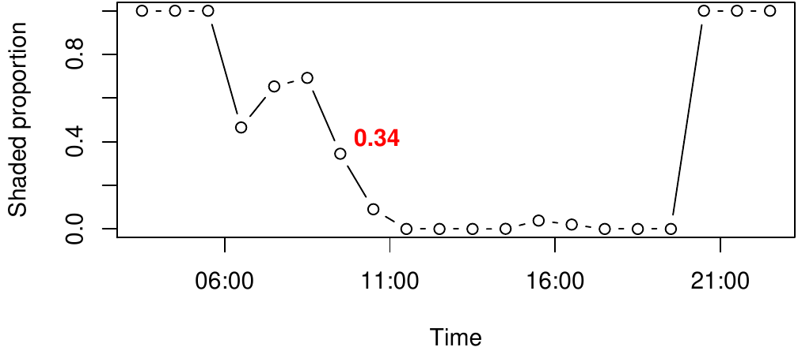

::: article
# Introduction

Spatial analysis of the urban environment ([@biljecki2015applications])
frequently requires estimating whether a given point is shaded or not,
given a representation of spatial obstacles (e.g. buildings) and a
time-stamp with its associated solar position. For example, we may be
interested in -

-   Calculating the amount of time a given roof or facade is shaded, to
    determine the utility of installing photovoltaic cells for
    **electricity production** (e.g. [@redweik2013solar]).
-   Calculating shadow footprint on vegetated areas, to determine the
    expected influence of a tall new building on the surrounding
    **microclimate** (e.g. [@bourbia2010impact]).

Such calculations are usually carried out using GIS-based models
([@freitas2015modelling]), in either **vector-based 3D** or
**raster-based 2.5D** settings. Both approaches have their advantages
and limitations, as discussed in the following paragraphs.

Shadow calculations on vector-based 3D models of the urban environment
are mostly restricted to proprietary closed-source software such as
**ArcGIS** [@esri2017arcgis] or **SketchUp** [@sketchup], though
recently some open-source models such as **SURFSUN3D** have been
developed [@liang2015open]. One of the drawbacks of using closed-source
software in this context is the difficulty of adjusting the software for
specific needs and uncommon scenarios. This problem is especially acute
in research settings, where flexibility and extensibility are essential
for exploring new computational approaches. The other difficulty with
using 3D software in urban spatial analysis concerns interoperability of
file formats. Since ordinary vector spatial data formats, such as the
*ESRI Shapefile*, cannot represent three-dimensional surfaces, 3D
software is associated with specialized file formats. The latter cannot
be readily imported to a general-purpose geocomputational environment
such as R or Python [@van2011python], thus fragmenting the analysis
workflow. Moreover, most 3D software, such as those mentioned above, are
design-oriented, thus providing advanced visualization capabilities but
limited quantitative tools (calculating areas, angles, coordinates,
etc.). Finally, true-3D databases of large urban areas are difficult to
obtain, while vector-based 2.5D databases (building outline and height,
see below) are almost universal. The advantages of true-3D software are
"wasted" when the input data are 2.5D, while the disadvantages, such as
lack of quantitative procedures and data interoperability difficulties,
still remain.

Raster-based 2.5D solutions, operating on a Digital Elevation Model
(DEM) raster, are much simpler and have thus been more widely
implemented in various software for several decades
[@kumar1997modelling; @ratti2004raster]. For example, raster-based
shadow calculations are available in open-source software such as the
**r.sun** command [@hofierka2002solar] in *GRASS GIS*
[@GRASS_GIS_software], the **UMEP** plugin [@lindberg2018urban] for
*QGIS* [@QGIS_software] and package
[*insol*](https://CRAN.R-project.org/package=insol) [@insol] in R. In
the proprietary **ArcGIS** software, raster-based shadow calculations
are provided through the **Solar Analyst** extension [@fu1999design].
Thanks to this variety of tools, raster-based shadow modelling can be
easily incorporated within a general spatial analysis workflow. However,
raster-based models are more suitable for large-scale analysis of
natural terrain, rather than fine-scale urban environments, for the
following reasons -

-   A raster representing surface elevation, known as a DEM, at
    sufficiently high resolution for the urban context, may not be
    available and is expensive to produce, e.g. using airborne Light
    Detection And Ranging (LiDAR) surveys (e.g. [@redweik2013solar]).
    Much more commonly, municipalities and other sources such as
    OpenStreetMap [@haklay2008openstreetmapdor] offer 2.5D vector-based
    data on cities, i.e. polygonal layers of building outlines
    associated with height attributes.
-   Rasters are composed of pixels, which have no natural association to
    specific urban elements, such as an individual building, thus making
    it more difficult to associate analysis results with the
    corresponding urban elements.
-   Vertical surfaces, such as building facades, are rare in natural
    terrain yet very common in urban environments. Raster-based
    representation of facades is problematic since the latter correspond
    to (vertical) discontinuities in the 2.5D digital elevation model,
    requiring unintuitive workarounds [@redweik2013solar].

It should be noted that more specialized approaches have been recently
developed to address some of the above-mentioned difficulties, but they
are usually not available as software packages
(e.g. [@redweik2013solar; @hofierka2012new]).

The [*shadow*](https://CRAN.R-project.org/package=shadow) package
[@shadow] aims at addressing these limitations by introducing a simple
2.5D vector-based algorithm for calculating shadows, Sky View Factor
(SVF) and solar radiation estimates in the urban environment. The
algorithms operate on a polygonal layer extruded to 2.5D, also known as
*Levels-of-Detail (LoD) 1* in the terminology of the CityGML standard
[@groger2012citygml]. On the one hand, the advantages of individual
urban element representation (over raster-based approach) and input data
availability (over both raster-based and full 3D approaches) are
maintained. On the other hand, the drawbacks of closed-source software
and difficult interoperability (as opposed to full 3D environment) are
avoided.

As demonstrated below, functions in the *shadow* package operate on a
vector layer of obstacle outlines (e.g. buildings) along with their
heights, passed as a `"SpatialPolygonsDataFrame"` object defined in
package [*sp*](https://CRAN.R-project.org/package=sp) [@asdar; @sp]. The
latter makes incorporating shadow calculations in
[*Spatial*](https://CRAN.R-project.org/view=Spatial) analysis workflow
in R straightforward. Functions to calculate shadow height, shadow
ground footprint, Sky View Factor (SVF) and solar radiation are
implemented in the package.

# Theory

## Shadow height

All functions currently included in package *shadow* are based on
trigonometric relations in the triangle defined by the sun's rays, the
ground - or a plane parallel to the ground - and an obstacle.

For example, **shadow height** at any given ground point can be
calculated based on (1) sun elevation, (2) the height of the building(s)
that stand in the way of sun rays and (3) the distance(s) between the
queried point and the building(s) along the sun rays projection on the
ground. Figure [1](#fig:illustration_shadow_height) depicts a scenario
where shadow is being cast by building A onto the facade of building B,
given the solar position defined by its elevation angle $\alpha_{elev}$
and azimuth angle $\alpha_{az}$. Once the intersection point is
identified (marked with [x]{style="color: red"} in Figure
[1](#fig:illustration_shadow_height)), shadow height ($h_{shadow}$) at
the queried point ($viewer$) can be calculated based on (1) sun
elevation ($\alpha_{elev}$), (2) the height of building A ($h_{build}$)
and (3) the distance ($dist_{1}$) between the $viewer$ and intersection
point [x]{style="color: red"} (Equation \@ref(eq:eq-shadow-h)).

<figure id="fig:illustration_shadow_height">

<figcaption>Figure 1: Shadow height calculation</figcaption>
</figure>

$$\label{eq:eq_shadow_h}
h_{shadow} = h_{build} - dist_{1} \cdot tan(\alpha_{elev})   (\#eq:eq-shadow-h)$$

The latter approach can be extended to the general case of shadow height
calculation at any ground location and given any configuration of
obstacles. For example, if there is more than one obstacle potentially
casting shadow on the queried location, we can calculate $h_{shadow}$
for each obstacle and then take the maximum value.

## Logical shadow flag

Once the shadow height is determined, we may evaluate whether any given
3D point is in shadow or not. This is done simply by comparing the
Z-coordinate (i.e. height) of the queried point with the calculated
shadow height at the same X-Y (i.e. ground) location.

## Shadow footprint

Instead of calculating shadow height at a pre-specified point (e.g. the
$viewer$ in Figure [1](#fig:illustration_shadow_height)), we can set
$h_{shadow}$ to zero and calculate the distance ($dist_{2}$) where the
shadow intersects ground level (Equation \@ref(eq:eq-shadow-footprint)).

$$\label{eq:eq_shadow_footprint}
dist_{2} = \frac{h_{build}}{tan(\alpha_{elev})}   (\#eq:eq-shadow-footprint)$$

Shifting the obstacle outline by the resulting distance ($dist_{2}$) in
a direction opposite to sun azimuth ($\alpha_{az}$) yields a **shadow
footprint** outline [@weisthal2014]. Shadow footprints are useful to
calculate the exact ground area that is shaded at specific time. For
example, Figure [2](#fig:illustration_shadow_footprint) shows the shadow
footprints produced by a single building at different times of a given
day.

<figure id="fig:illustration_shadow_footprint">

<figcaption>Figure 2: Shadow footprints cast by a building on a
horizontal ground surface at hourly intervals on 2004-06-24. The
building, indicated by the gray shaded area, is located at 31.97°N
34.78°E, and is 21.38 meters tall</figcaption>
</figure>

## Sky View Factor (SVF)

The **Sky View Factor**
[@beckers2013solar; @erell2012urban; @grimmond2001rapid] is the extent
of sky observed from a point as a proportion of the entire sky
hemisphere. The SVF can be calculated based on the maximal angles
($\beta$) formed in triangles defined by the queried location and the
obstacles (Figure [3](#fig:illustration_svf)), evaluated in multiple
circular cross-sections surrounding the queried location. Once the
maximal angle $\beta_{i}$ is determined for a given angular section $i$,
$SVF_{i}$ for that particular section is defined [@gal2014new] in
Equation \@ref(eq:eq-svf).

<figure id="fig:illustration_svf">

<figcaption>Figure 3: Sky View factor calculation</figcaption>
</figure>

$$\label{eq:eq_svf}
SVF_{i} = 1 - sin^2(\beta_{i})   (\#eq:eq-svf)$$

For example, in case ($\beta_{i}=45^\circ$), as depicted in Figure
[3](#fig:illustration_svf), $SVF_{i}$ is equal to -

$$SVF_{i} = 1 - sin^2(45^\circ) = 0.5$$

Averaging $SVF_{i}$ values for all $i=1,2,...,n$ circular cross-sections
gives the final $SVF$ estimate for the queried location (Equation
\@ref(eq:eq-svf-final)).

$$\label{eq:eq_svf_final}
SVF = \frac{\sum_{i=1}^{n}SVF_{i}}{n}   (\#eq:eq-svf-final)$$

The number of evaluated cross sections depends on the chosen angular
resolution. For example, an angular resolution of $5^\circ$ means the
number of cross sections is $n=360^\circ/5^\circ=72$ (Figure
[4](#fig:svfrays)).

<figure id="fig:svfrays">

<figcaption>Figure 4: Angular cross sections for calculating the Sky
View Factor (SVF)</figcaption>
</figure>

## Solar radiation

### *Components*

Frequently, evaluating whether a given location is shaded, and when, is
just a first step towards evaluating the amount of solar radiation for a
given period of time. The annual insolation at a given point is
naturally affected by the degree of shading throughout the year, but
shading is not the only factor.

The three components of the solar radiation are the **direct**,
**diffuse** and **reflected** radiation -

-   **Direct** radiation refers to solar radiation traveling on a
    straight line from the sun to the surface of the earth. Direct
    radiation can be estimated by taking into account: (1) shading, (2)
    surface orientation relatively to the sun, and (3) meteorological
    measurements of direct radiation on a horizontal plane or on a plane
    normal to the beam of sunlight.
-   **Diffuse** radiation refers to solar radiation reaching the Earth's
    surface after having been scattered from the direct solar beam by
    molecules or particulates in the atmosphere. Diffuse radiation can
    be estimated by taking into account: (1) SVF, and (2) meteorological
    measurements of diffuse radiation at an exposed location.
-   **Reflected** radiation refers to the sunlight that has been
    reflected off non-atmospheric obstacles such as ground surface cover
    or buildings. Most urban surfaces have a low albedo: asphalt
    reflects only 5-10 percent of incident solar radiation, brick and
    masonry 20-30 percent, and vegetation about 20 percent. Because a
    dense urban neighborhood will typically experience multiple
    reflections, an iterative process is required for a complete
    analysis. Calculating reflected radiation requires taking into
    account reflective properties of the various surfaces, their
    geometrical arrangement [@givoni1998climate] and their view factors
    from the receiving surface, which is beyond the scope of the
    *shadow* package.

The diffuse radiation component is the dominant one on overcast days,
when most radiation is scattered, while the direct radiation component
is dominant under clear sky conditions when direct radiation reaches the
earth's surface.

### *Direct Normal Irradiance*

Equation \@ref(eq:coef) specifies the Coefficient of Direct Normal
Irradiance for a vertical **facade** surface, as function of solar
position given by the difference between facade azimuth and sun azimuth
angles, and sun elevation angle, at time $t$.

$$\label{eq:coef}
{\theta_{facade,t}} = cos({\alpha_{az,t}} - {\alpha'_{az}}) \cdot cos({\alpha_{elev,t}})   (\#eq:coef)$$

In Equation \@ref(eq:coef), $\theta_{facade,t}$ is the Coefficient of
Direct Normal Irradiance on a facade at time $t$, $\alpha_{az,t}$ is the
sun azimuth angle at time $t$ (see Figure
[1](#fig:illustration_shadow_height)), $\alpha'_{az}$ is the facade
azimuth angle, i.e. the direction where the facade is facing, and
$\alpha_{elev,t}$ is sun elevation angle at time $t$ (see Figure
[1](#fig:illustration_shadow_height)). Note that all of latter
variables, with the exception of facade azimuth angle $\alpha'_{az}$,
are specific for the time interval $t$ due to the variation in solar
position.

Horizontal **roof** surfaces, unlike facades, are not tilted towards any
particular azimuth[^1]. Equation \@ref(eq:coef) thus simplifies to
Equation \@ref(eq:coef-roof) when referring to a roof, rather than a
facade, surface.

$$\label{eq:coef_roof}
{\theta_{roof,t}} = cos(90^\circ - {\alpha_{elev,t}})   (\#eq:coef-roof)$$

Figure [5](#fig:coefplot) demonstrates the relation given in Equations
\@ref(eq:coef) and \@ref(eq:coef-roof) for the entire relevant range of
solar positions relative to facade or roof orientation. Again, note that
for roof surfaces, the ${\theta_{roof,t}}$ coefficient is only dependent
on sun elevation angle ${\alpha_{elev,t}}$ (Equation
\@ref(eq:coef-roof)) as illustrated on the **right** panel of Figure
[5](#fig:coefplot). (The code for producing Figure [5](#fig:coefplot)
can be found in the help page of function `coefDirect` from *shadow*).

For example, the left panel in Figure [5](#fig:coefplot) shows that
maximal proportion of incoming solar radiation
(i.e. $\theta_{facade,t} = 1$) on a facade surface is attained when
facade azimuth is equal to sun azimuth and sun elevation is 0
(${\alpha_{elev,t}}=0^\circ$, i.e. facade directly facing the sun).
Similarly, the right panel shows that maximal proportion of solar
radiation on a roof surface (i.e. $\theta_{roof,t} = 1$) is attained
when the sun is at the zenith (${\alpha_{elev,t}}=90^\circ$, i.e. sun
directly above the roof).

{#fig:coefplot
width="100%" alt="graphic without alt text"}

Once the Coefficient of Direct Normal Irradiance $\theta_{facade,t}$ or
$\theta_{roof,t}$ is determined, the Direct Normal Irradiance
meteorological measurement ${rad_{direct,t}}$ referring to the same time
interval $t$, usually on an hourly time step, is multiplied by the
coefficient at a point on the building surface to give the local
irradiation at that point (Equation \@ref(eq:rad-direct)). The result
${rad'_{direct,t}}$ is the corrected Direct Irradiance the surface
receives given its orientation relative to the solar position.

$$\label{eq:rad_direct}
{rad'_{direct,t}} = \theta_t \cdot {rad_{direct,t}}   (\#eq:rad-direct)$$

Both ${rad_{direct,t}}$ and ${rad'_{direct,t}}$, as well as
${rad_{diffuse,t}}$, ${rad'_{diffuse,t}}$ (Equation
\@ref(eq:rad-diffuse)) and $rad'_{total}$ (Equation
\@ref(eq:eq-rad-sum)) (see below), are given for each time interval $t$
in units of power per unit area, such as $kWh / m^2$.

### *Diffuse Horizontal Irradiance*

Moving on to discussing the second component in the radiation balance,
the diffuse irradiance. Diffuse irradiance is given by the
meteorological measurement of Diffuse Horizontal Irradiance
${rad_{diffuse,t}}$, which needs to be corrected for the specific
proportion of viewed sky given surrounding obstacles expressed by $SVF$.
Assuming isotropic contribution [@freitas2015modelling],
${rad'_{diffuse,t}}$ is the corrected diffuse irradiance the surface
receives (Equation \@ref(eq:rad-diffuse)). Note that $SVF$ is unrelated
to solar position; it is a function of the given configuration of the
queried location and surrounding obstacles, and is thus invariable for
all time intervals $t$.

$$\label{eq:rad_diffuse}
{rad'_{diffuse,t}} = SVF \cdot {rad_{diffuse,t}}   (\#eq:rad-diffuse)$$

### *Total irradiance*

Finally, the direct and diffuse radiation estimates are summed for all
time intervals $t$ to obtain the total (e.g. annual) insolation for the
given surface $rad'_{total}$ (Equation \@ref(eq:eq-rad-sum)). The sum
refers to $n$ intervals $t=1,2,...,n$, commonly $n=24\times365=8,760$
when referring to an annual radiation estimate using an hourly time
step.

$$\label{eq:eq_rad_sum}
rad'_{total} = \sum_{t=1}^{n}{rad'_{direct,t}} + \sum_{t=1}^{n}{rad'_{diffuse,t}}   (\#eq:eq-rad-sum)$$

# Package structure

The *shadow* package contains four "low-level" functions, one
"high-level" function, and several "helper functions".

The "low-level" functions calculate distinct aspects of shading, and the
SVF -

-   `shadowHeight` - Calculates shadow height
-   `inShadow` - Determines a logical shadow flag (in shadow or not)
-   `shadowFootprint` - Calculates shadow footprint
-   `SVF` - Calculates the SVF

Table [1](#table:input_output) gives a summary of the (main) input and
output object types for each of the "low-level" functions. The following
list clarifies the exact object classes referenced in the table -

-   The queried locations **points** (e.g. the $viewer$ point in Figure
    [1](#fig:illustration_shadow_height)) can be specified in several
    ways. Points (`"SpatialPoints*"`) can be either 2D, specifying
    ground locations, or 3D[^2] - specifying any location on the ground
    or above ground. Alternatively, a **raster** (`"Raster*"`) can be
    used to specify a regular grid of ground locations. Note that the
    shadow height calculation only makes sense for ground locations, as
    height above ground is what the function calculates, so it is not
    applicable for 3D points
-   The obstacle **polygons** are specified as a
    `"SpatialPolygonsDataFrame"` object having a **height** attribute
    (\"extrusion\" height) given in the same units as the layer
    Coordinate Reference System (CRS), usually meters. Geographic
    coordinates (long/lat) are not allowed because these units are
    meaningless for specifying height
-   Solar position **matrix** is given as a `"matrix"` object, where the
    first column specifies **sun azimuth** angle and the second column
    specifies **sun elevation** angle. Both angles should be given in
    decimal degrees, where -
    -   **sun azimuth** (e.g. $\alpha_{az}$ in Figure
        [1](#fig:illustration_shadow_height)) is measured clockwise
        relative to North, i.e North = $0^\circ$, East = $90^\circ$,
        South = $180^\circ$, West = $270^\circ$
    -   **sun elevation** (e.g. $\alpha_{elev}$ in Figure
        [1](#fig:illustration_shadow_height)) is measured relatively to
        a horizontal surface, i.e. sun on the horizon = $0^\circ$, sun
        at its zenith = $90^\circ$
-   The **output** of `shadowHeight` and `inShadow` is a numeric or
    logical `"matrix"`, respectively, where rows represent locations and
    columns represent solar positions. The output of `shadowFootprint`
    is a polygonal layer of footprints. The output of `SVF` is a numeric
    vector where values correspond to locations. All functions that can
    accept a raster of ground locations return a corresponding raster of
    computed values

::: {#table:input_output}
  -------------------------------------------------------------------------------------------------------------------------------------------------------------------------
  **Function**         [**Location**]{style="color: blue"}   [**Obstacles**]{style="color: blue"}   [**Sun Pos.**]{style="color: blue"}   [**Output**]{style="color: red"}
  ------------------- ------------------------------------- -------------------------------------- ------------------------------------- ----------------------------------
  `shadowHeight`              Points (2D) / Raster                         Polygons                               Matrix                      Numeric matrix / Raster

  `inShadow`                 Points (2D/3D) / Raster                       Polygons                               Matrix                      Logical matrix / Raster

  `shadowFootprint`                    \-                                  Polygons                               Matrix                              Polygons

  `SVF`                      Points (2D/3D) / Raster                       Polygons                                 \-                        Numeric vector / Raster
  -------------------------------------------------------------------------------------------------------------------------------------------------------------------------

  : Table 1: Inputs and outputs for main functions in package `shadow`
:::

The "high-level" function `radiation` is a wrapper around `inShadow` and
`SVF` for calculating direct and diffuse solar radiation on the obstacle
surface area (i.e. building roofs and facades). In addition to the
geometric layers and solar positions, this function also requires
meteorological measurements of direct and diffuse radiation at an
unobstructed weather station. The *shadow* package provides a sample
Typical Meteorological Year (TMY) dataset `tmy` to illustrate the usage
of the `radiation` function (see below). Similar TMY datasets were
generated for many areas (e.g. [@pusat2015generation]) and are generally
available from meteorological agencies, or from databases for building
energy simulation such as EnergyPlus [@energyplus].

Finally, the *shadow* package provides several "helper functions" which
are used internally by "low-level" and "high-level" functions, but can
also be used independently -

-   `classifyAz` - Determines the azimuth where the perpendicular of a
    line segment is facing; used internally to classify facade azimuth
-   `coefDirect` - Calculates the Coefficient of Direct Normal
    Irradiance reduction (Equations \@ref(eq:coef) and
    \@ref(eq:coef-roof))
-   `plotGrid` - Makes an interactive plot of 3D spatial points. This is
    a wrapper around `scatterplot3js` from package
    [*threejs*](https://CRAN.R-project.org/package=threejs) [@threejs]
-   `ray` - Creates a spatial line between two given points
-   `shiftAz` - Shifts spatial features by azimuth and distance
-   `surfaceGrid` - Creates a 3D point layer with a grid which covers
    the facades and roofs of obstacles
-   `toSeg` - Splits polygons or lines to segments

The following section provides a manual for using these functions
through a simple example with four buildings.

# Examples

In this section we demonstrate the main functionality of *shadow*,
namely calculating -

-   Shadow height (function `shadowHeight`)
-   Logical shadow flag (function `inShadow`)
-   Shadow footprint (function `shadowFootprint`)
-   Sky View Factor (function `SVF`)
-   Solar radiation (function `radiation`)

Before going into the examples, we load the *shadow* package. Package
*sp* is loaded automatically along with *shadow*. Packages
[*raster*](https://CRAN.R-project.org/package=raster) [@raster] and
[*rgeos*](https://CRAN.R-project.org/package=rgeos) [@rgeos] are used
throughout the following code examples for preparing the inputs and
presenting the results, so they are loaded as well.

``` r
> library(shadow)
> library(raster)
> library(rgeos)
```

In the examples, we will use a small real-life dataset representing four
buildings in Rishon-Le-Zion, Israel (Figure [6](#fig:studyarea)),
provided with package *shadow* and named `build`.

The following code section also creates a hypothetical circular green
park located 20 meters to the north and 8 meters to the west from the
buildings layer centroid (hereby named `park`).

``` r
> location = gCentroid(build)
> park_location = shift(location, y = 20, x = -8)
> park = gBuffer(park_location, width = 12)
```

The following expressions visualize the `build` and `park` layers as
shown in Figure [6](#fig:studyarea). Note that the `build` layer has an
attribute named `BLDG_HT` specifying the height of each building (in
meters), as shown using text labels on top of each building outline.

``` r
> plot(build, col = "lightgrey")
> text(gCentroid(build, byid = TRUE), build$BLDG_HT)
> plot(park, col = "lightgreen", add = TRUE)
```

<figure id="fig:studyarea">

<figcaption>Figure 6: Sample data: a buildings layer and a green park
layer. Text labels express building height in meters.</figcaption>
</figure>

## Shadow height

The `shadowHeight` function calculates shadow height(s) at the specified
point location(s), given a layer of obstacles and solar position(s). The
`shadowHeight` function, as well as other functions that require a solar
position argument such as `inShadow`, `shadowFootprint` and `radiation`
(see below), alternatively accept a time argument instead of the solar
position. In case a time (`time`) argument is passed instead of solar
position (`solar_pos`), the function internally calculates solar
position using the lon/lat of the `location` layer centroid and the
specified time, using function `solarpos` from package
[*maptools*](https://CRAN.R-project.org/package=maptools) [@maptools].

In the following example, we would like to calculate shadow height at
the centroid of the buildings layer (`build`) on 2004-12-24 at 13:30:00.
First we create the queried points layer (`location`), in this case
consisting of a single point: the `build` layer centroid. This is our
layer of locations where we would like to calculate shadow height.

``` r
> location = gCentroid(build)
```

Next we need to specify the solar position, i.e. sun elevation and
azimuth, at the particular time and location (31.967°N 34.777°E), or let
the function calculate it automatically based on the time. Using the
former option, we can figure out solar position using function
`solarpos` from package
[*maptools*](https://CRAN.R-project.org/package=maptools). To do that,
we first define a `"POSIXct"` object specifying the time we are
interested in -

``` r
> time = as.POSIXct(
+   x = "2004-12-24 13:30:00",
+   tz = "Asia/Jerusalem"
+ )
```

Second, we find the longitude and latitude of the point by reprojecting
it to a geographic CRS[^3].

``` r
> location_geo = spTransform(
+   x = location,
+   CRSobj = "+proj=longlat +datum=WGS84"
+ )
```

Finally, we use the `solarpos` function to find solar position, given
longitude, latitude and time -

``` r
> library(maptools)
> solar_pos = solarpos(
+   crds = location_geo,
+   dateTime = time
+ )
```

We now know the sun azimuth (208.7°) and elevation (28.8°) -

``` r
> solar_pos
```

``` r
#>          [,1]     [,2]
#> [1,] 208.7333 28.79944
```

Given the solar position along with the layer of obstacles `build`,
shadow height in `location` can be calculated using the `shadowHeight`
function, as follows -

``` r
> h = shadowHeight(
+   location = location,
+   obstacles = build,
+   obstacles_height_field = "BLDG_HT",
+   solar_pos = solar_pos
+ )
```

The resulting object contains the shadow height value of 19.86 meters -

``` r
> h
```

``` r
#>          [,1]
#> [1,] 19.86451
```

The second (shorter) approach is letting the function calculate solar
position for us, in which case we can pass just the spatial layers and
the `time`, without needing to calculate solar position ourselves -

``` r
> shadowHeight(
+   location = location,
+   obstacles = build,
+   obstacles_height_field = "BLDG_HT",
+   time = time
+ )
```

``` r
#>          [,1]
#> [1,] 19.86451
```

The results of both approaches are identical. The first approach, where
solar position is manually defined, takes more work and thus may appear
unnecessary. However, it is useful for situations when we want to use
specific solar positions from an external data source, or to evaluate
arbitrary solar positions that cannot be observed in the queried
location in real life.

Either way, the resulting object `h` is a `"matrix"`, though in this
case it only has a single row and a single column. The `shadowHeight`
function accepts location layers with more than one point, in which case
the resulting `"matrix"` will have additional rows. It also accepts more
than one solar position or time value (see below), in which case the
resulting `"matrix"` will have additional columns. It is thus possible
to obtain a matrix of shadow height values for a set of locations in a
set of times.

Figure [7](#fig:ray) illustrates how the shadow height calculation was
carried out. First, a line of sight is drawn between the point of
interest and the sun direction based on sun azimuth (shown as a yellow
line). Next, potential intersections are detected (marked with
[+]{style="color: red"} symbols). Finally, shadow height induced by each
intersection is calculated based on the distance towards intersection,
sun elevation and intersected building height (see Figure
[1](#fig:illustration_shadow_height)). The final result is the maximum
of the per-intersection heights.

<figure id="fig:ray">

<figcaption>Figure 7: Shadow height (<span
class="math inline"><em>m</em></span>) at a single point (indicated by
black <span class="math inline">+</span> symbol)</figcaption>
</figure>

The procedure can be readily expanded to calculate a continuous surface
of shadow heights, as the `shadowHeight` function also accepts
`"Raster*"` objects (package *raster*). The raster serves as a template,
defining the grid where shadow height values will be calculated. For
example, in the following code section we create such a template raster
covering the examined area plus a 50-meter buffer on all sides, with a
spatial resolution of 2 meters -

``` r
> ext = as(extent(build) + 50, "SpatialPolygons")
> r = raster(ext, res = 2)
> proj4string(r) = proj4string(build)
```

Now we can calculate a shadow height raster by simply replacing the
`location` argument with the raster `r` -

``` r
> height_surface = shadowHeight(
+   location = r,
+   obstacles = build,
+   obstacles_height_field = "BLDG_HT",
+   solar_pos = solar_pos,
+   parallel = 5
+ )
```

The result (`height_surface`), in this case, is not a matrix - it is a
shadow height surface (a `"RasterLayer"` object) of the same spatial
dimensions as the input template `r`. Note that unshaded pixels get an
`NA` shadow height value, thus plotted in white (Figure
[8](#fig:heightresult)). Also note the partial shadow on the roof of the
north-eastern building (top-right) caused by the neighboring building to
the south-west.

The additional `parallel=5` argument splits the calculation of raster
cells among 5 processor cores, thus making it faster. A different number
can be specified, depending the number of available cores. Behind the
scenes, parallel processing relies on the
[*parallel*](https://CRAN.R-project.org/package=parallel) package
[@rcoreteam].

<figure id="fig:heightresult">

<figcaption>Figure 8: Shadow height (<span
class="math inline"><em>m</em></span>) surface, and an individual shadow
height value (indicated by black <span class="math inline">+</span>
symbol at the center of the image)</figcaption>
</figure>

## Shadow (logical)

Function `shadowHeight`, introduced in the previous section, calculates
*shadow height* for a given ground location. In practice, the metric of
interest is very often *whether* a given 3D location is in shade or not.
Such a logical flag can be determined by comparing the Z-coordinate
(i.e. the height) of the queried point with the calculated shadow height
at the same X-Y location. The `inShadow` function is a wrapper around
`shadowHeight` for doing that.

The `inShadow` function gives the logical shadow/non-shadow
classification for a set of 3D points. The function basically calculates
shadow height for a given unique ground location (X-Y), then compares it
with the elevation (Z) of all points in that location. The points which
are positioned "above" the shadow are considered non-shaded (receiving
the value of `FALSE`), while the points which are positioned "below" the
shadow are considered shaded (receiving the value of `TRUE`).

The 3D points we are interested in when doing urban analysis are usually
located on the surface of elements such as buildings. The `surfaceGrid`
helper function can be used to automatically generate a **grid** of such
surface points. The inputs for this function include the obstacle layer
for which to generate a surface grid and the required grid resolution.
The returned object is a 3D point layer.

For example, the following expression calculates a 3D point layer named
`grid` covering the `build` surface at a resolution of 2 meters -

``` r
> grid = surfaceGrid(
+   obstacles = build,
+   obstacles_height_field = "BLDG_HT",
+   res = 2
+ )
```

The resulting grid points are associated with all attributes of the
original obstacles each surface point corresponds to, as well as six new
attributes -

-   `obs_id` - Unique consecutive ID for each feature in `obstacles`
-   `type` - Either `"facade"` or `"roof"`
-   `seg_id` - Unique consecutive ID for each facade segment (only for
    "facade" points)
-   `xy_id` - Unique consecutive ID for each ground location (only for
    "facade" points)
-   `facade_az` - The azimuth of the corresponding facade, in decimal
    degrees (only for "facade" points)

In this case, the resulting 3D point grid has 2,693 features, starting
with `"roof"` points -

``` r
> head(grid)
```

``` r
#>   build_id BLDG_HT obs_id type seg_id xy_id facade_az
#> 1      722   22.49      3 roof     NA    NA        NA
#> 2      722   22.49      3 roof     NA    NA        NA
#> 3      722   22.49      3 roof     NA    NA        NA
#> 4      722   22.49      3 roof     NA    NA        NA
#> 5      722   22.49      3 roof     NA    NA        NA
#> 6      722   22.49      3 roof     NA    NA        NA
```

Then going through the `"facade"` points -

``` r
> tail(grid)
```

``` r
#>       build_id BLDG_HT obs_id   type seg_id xy_id facade_az
#> 19610      831   19.07      4 facade     74    44  100.2650
#> 19710      831   19.07      4 facade     75    45  123.6695
#> 19810      831   19.07      4 facade     75    46  123.6695
#> 19910      831   19.07      4 facade     75    47  123.6695
#> 20010      831   19.07      4 facade     75    48  123.6695
#> 20110      831   19.07      4 facade     75    49  123.6695
```

Printing the coordinates confirms that, indeed, `grid` is a 3D point
layer having three-dimensional coordinates where the third dimension `h`
represents height above ground -

``` r
> head(coordinates(grid))
```

``` r
#>         x1      x2    h
#> 1 667882.9 3538086 22.5
#> 2 667884.9 3538086 22.5
#> 3 667886.9 3538086 22.5
#> 4 667888.9 3538086 22.5
#> 5 667890.9 3538086 22.5
#> 6 667892.9 3538086 22.5
```

Once the 3D grid is available, we can evaluate whether each point is in
shadow or not, at the specified solar position(s), using the `inShadow`
wrapper function -

``` r
> s = inShadow(
+   location = grid,
+   obstacles = build,
+   obstacles_height_field = "BLDG_HT",
+   solar_pos = solar_pos
+ )
```

The resulting object `s` is a `"logical"` matrix with rows corresponding
to the grid features and columns corresponding to the solar positions.
In this particular case a single solar position was evaluated, thus the
matrix has just one column -

``` r
> dim(s)
```

``` r
#> [1] 2693    1
```

The `scatter3D` function from package
[*plot3D*](https://CRAN.R-project.org/package=plot3D) [@plot3d] is
useful for visualizing the result. In the following code section, we use
two separate `scatter3D` function calls to plot the grid with both
variably colored filled circles (yellow or grey) and constantly colored
(black) outlines.

``` r
> library(plot3D)
> scatter3D(
+   x = coordinates(grid)[, 1],
+   y = coordinates(grid)[, 2],
+   z = coordinates(grid)[, 3],
+   theta = 55,
+   colvar = s[, 1],
+   col = c("yellow", "grey"),
+   pch = 16,
+   scale = FALSE,
+   colkey = FALSE,
+   cex = 1.1
+ )
> scatter3D(
+   x = coordinates(grid)[, 1],
+   y = coordinates(grid)[, 2],
+   z = coordinates(grid)[, 3],
+   theta = 55,
+   col = "black",
+   pch = 1,
+   lwd = 0.1,
+   scale = FALSE,
+   colkey = FALSE,
+   cex = 1.1,
+   add = TRUE
+ )
```

<figure id="fig:shadowlogical">

<figcaption>Figure 9: Buildings surface points in shadow (grey) and in
direct sunlight (yellow) on 2004-12-24 13:30:00</figcaption>
</figure>

The output is shown in Figure [9](#fig:shadowlogical). It shows the 3D
`grid` points, along with the `inShadow` classification encoded as point
color: grey for shaded surfaces, yellow for sun-exposed surfaces.

## Shadow footprint

The `shadowFootprint` function calculates the geometry of shadow
projection on the ground. The resulting footprint layer can be used for
various applications. For example, a shadow footprint layer can be used
to calculate the proportion of shaded surface in a defined area, or to
examine which obstacles are responsible for shading a given urban
element.

In the following example, the `shadowFootprint` function is used to
determine the extent of shading on the hypothetical green park (Figure
[6](#fig:studyarea)) at different times of day. First, let us consider a
single time instance of 2004-06-24 09:30:00. At this particular time and
geographical location, the solar position is at an azimuth of 88.8° and
at an elevation of 46.7° -

``` r
> time2 = as.POSIXct(
+   x = "2004-06-24 09:30:00",
+   tz = "Asia/Jerusalem"
+ )
> solar_pos2 = solarpos(
+   crds = location_geo,
+   dateTime = time2
+ )
> solar_pos2
```

``` r
#>          [,1]   [,2]
#> [1,] 88.83113 46.724
```

The following expression calculates the shadow footprint for this
particular solar position.

``` r
> footprint = shadowFootprint(
+   obstacles = build,
+   obstacles_height_field = "BLDG_HT",
+   solar_pos = solar_pos2
+ )
```

The resulting object `footprint` is a polygonal layer
(`"SpatialPolygonsDataFrame"` object) which can be readily used in other
spatial calculations. For example, the footprint and park polygons can
be *intersected* to calculate the proportion of shaded park area within
total park area, as follows.

``` r
> park_shadow = gIntersection(park, footprint)
> shade_prop = gArea(park_shadow) / gArea(park)
> shade_prop
```

``` r
#> [1] 0.3447709
```

The numeric result `shade_prop` gives the proportion of shaded park
area, 0.34 in this case (Figure [10](#fig:footprint)).

<figure id="fig:footprint">

<figcaption>Figure 10: Shaded park proportion on 2004-06-24
09:30:00</figcaption>
</figure>

The shadow footprint calculation can also be repeated for a sequence of
times, rather than a single one, to monitor the daily (monthly, annual,
etc.) course of shaded park area proportion. To do that, we first need
to prepare the set of solar positions in the evaluated dates/times.
Again, this can be done using function `solarpos`. For example, the
following code creates a matrix named `solar_pos_seq` containing solar
positions over the 2004-06-24 at hourly intervals -

``` r
> time_seq = seq(
+   from = as.POSIXct("2004-06-24 03:30:00", tz = "Asia/Jerusalem"),
+   to = as.POSIXct("2004-06-24 22:30:00", tz = "Asia/Jerusalem"),
+   by = "1 hour"
+ )
> solar_pos_seq = solarpos(
+   crds = location_geo,
+   dateTime = time_seq
+ )
```

Note that the choice of an *hourly* interval is arbitrary. Shorter
intervals (e.g. 30 mins) can be used for increased accuracy.

To calculate the shaded park proportion at each time step we can loop
over the `solar_pos_seq` matrix, each time -

-   Calculating shadow footprint
-   Intersecting the shadow footprint with the park outline
-   Calculating the ratio of intersection and total park area

The code of such a `for` loop is given below.

``` r
> shadow_props = rep(NA, nrow(solar_pos_seq))
> for(i in 1:nrow(solar_pos_seq)) {
+   if(solar_pos_seq[i, 2] < 0) shadow_props[i] = 1 else {
+       footprint =
+         shadowFootprint(
+           obstacles = build,
+           obstacles_height_field = "BLDG_HT",
+           solar_pos = solar_pos_seq[i, , drop = FALSE]
+           )
+     park_shadow = gIntersection(park, footprint)
+     if(is.null(park_shadow))
+       shadow_props[i] = 0
+     else
+       shadow_props[i] = gArea(park_shadow) / gArea(park)
+     }
+ }
```

The loop creates a numeric vector named `shadow_props`. This vector
contains shaded proportions for the park in agreement with the times we
specified in `time_seq`. Note that two conditional statements are being
used to deal with special cases -

-   Shadow proportion is set to 1 (i.e. maximal) when sun is below the
    horizon
-   Shadow proportion is set to 0 (i.e. minimal) when no intersections
    are detected between the park and the shadow footprint

Plotting `shadow_props` as function of `time_seq` (Figure
[11](#fig:timeseries)) summarizes the daily course of shaded park
proportion on the 2004-06-24. The individual value of 0.34 which we have
calculated for 09:30 in the previous example (Figure
[10](#fig:footprint)) is highlighted in red.

<figure id="fig:timeseries">

<figcaption>Figure 11: Shaded park proportion at each hourly time step
on 2004-06-24</figcaption>
</figure>

## Sky View Factor

The `SVF` function can be used to estimate the SVF at any 3D point
location. For example, the following expression calculates the SVF on
the ground[^4] at the centroid of the `build` layer (Figure
[4](#fig:svfrays)).

``` r
> s = SVF(
+   location = location,
+   obstacles = build,
+   obstacles_height_field = "BLDG_HT"
+ )
```

The resulting SVF is 0.396, meaning that about 39.6% of the sky area are
visible (Figure [12](#fig:svfsurface2)) from this particular location.

``` r
> s
```

``` r
#> [1] 0.3959721
```

Note that the `SVF` function has a tuning parameter named `res_angle`
which can be used to modify angular resolution (default is $5^\circ$, as
shown in Figure [4](#fig:svfrays)). A smaller `res_angle` value will
give more accurate SVF but slower calculation.

Given a "template" grid, the latter calculation can be repeated to
generate a continuous surface of SVF estimates for a grid of ground
locations. In the following code section we calculate an SVF surface
using the same raster template with a resolution of 2 meters from the
shadow height example (see above).

``` r
> svf_surface = SVF(
+   location = r,
+   obstacles = build,
+   obstacles_height_field = "BLDG_HT",
+   parallel = 5
+ )
```

Note that the `parallel=5` option is used once again to make the
calculation run simultaneously on 5 cores. The resulting SVF surface is
shown in Figure [12](#fig:svfsurface2). As could be expected, SVF values
are lowest in the vicinity of buildings due to their obstruction of the
sky.

<figure id="fig:svfsurface2">

<figcaption>Figure 12: Sky View Factor (SVF) surface, with SVF value for
an individual point (indicated by black <span
class="math inline">+</span> symbol at the center of the
image)</figcaption>
</figure>

## Solar radiation

Shadow height, shadow footprint and SVF can be considered as low-level
geometric calculations. Frequently, the ultimate aim of an analysis is
the estimation of insolation, which is dependent on shadow and SVF but
also on surface orientation and meteorological solar radiation
conditions. Thus, the low-level geometric calculations are frequently
combined and wrapped with meteorological solar radiation estimates to
take the geometry into account when evaluating insolation over a given
time interval. The *shadow* package provides this kind of wrapper
function named `radiation`.

The `radiation` function needs several parameters to run -

-   **3D points grid** representing surfaces where the solar radiation
    is evaluated. It is important to specify whether each grid point is
    on a \"roof\" or on a \"facade\", and the azimuth it is facing (only
    for \"facade\"). A grid with those attributes can be automatically
    produced using the `surfaceGrid` function (see above)
-   **Obstacles layer** defined with `obstacles`, having an
    `obstacles_height_field` attribute (see above)
-   **Solar positions** defined with `solar_pos` (see above)
-   **Meteorological estimates** defined with `solar_normal` and
    `solar_diffuse`, corresponding to the same time intervals given by
    `solar_pos`

Given this set of inputs, the `radiation` function:

-   calculates whether each `grid` surface point is in shadow or not,
    for each solar position `solar_pos`, using the `inShadow` function
    (Equation \@ref(eq:eq-shadow-h)),
-   calculates the Coefficient of Direct Normal Irradiance reduction,
    for each `grid` surface point at each solar position `solar_pos`,
    using the `coefDirect` function (Equations \@ref(eq:coef) and
    \@ref(eq:coef-roof)),
-   combines shadow, the coefficient and the meteorological estimate
    `solar_normal` to calculate the **direct** radiation (Equation
    \@ref(eq:rad-direct)),
-   calculates the SVF for each `grid` surface point, using the `SVF`
    function (Equations \@ref(eq:eq-svf) and \@ref(eq:eq-svf-final)),
-   combines the SVF and the meteorological estimate `solar_diffuse` to
    calculate the **diffuse** radiation (Equation \@ref(eq:rad-diffuse))
-   and calculates the sums of the **direct**, **diffuse** and **total**
    (i.e. direct+diffuse) solar radiation per `grid` surface point for
    the entire period (Equation \@ref(eq:eq-rad-sum)).

To demonstrate the `radiation` function, we need one more component not
used in the previous examples: the reference solar radiation data. The
`shadow` package comes with a sample Typical Meteorological Year (TMY)
dataset named `tmy` that can be used for this purpose. This dataset was
compiled for the same geographical area where the buildings are located,
and therefore can be realistically used in our example.

The `tmy` object is a `data.frame` with 8,760 rows, where each row
corresponds to an hourly interval over an entire year
($24\times365=8,760$). The attributes given for each hourly interval
include solar position (`sun_az`, `sun_elev`) and solar radiation
measurements (`solar_normal`, `solar_diffuse`). Both solar radiation
measurements are given in $W/m^2$ units.

``` r
> head(tmy, 10)
```

``` r
#>                   time sun_az sun_elev solar_normal solar_diffuse  dbt  ws
#> 1  1999-01-01 01:00:00  66.73   -70.94            0             0  6.6 1.0
#> 2  1999-01-01 02:00:00  82.02   -58.68            0             0  5.9 1.0
#> 3  1999-01-01 03:00:00  91.00   -45.99            0             0  5.4 1.0
#> 4  1999-01-01 04:00:00  98.13   -33.32            0             0  4.9 1.0
#> 5  1999-01-01 05:00:00 104.81   -20.86            0             0  4.4 1.0
#> 6  1999-01-01 06:00:00 111.73    -8.76            0             6  4.8 1.0
#> 7  1999-01-01 07:00:00 119.41     2.91          118            24  7.3 1.0
#> 8  1999-01-01 08:00:00 128.39    13.30          572            45 11.2 1.0
#> 9  1999-01-01 09:00:00 139.20    22.46          767            57 16.0 1.0
#> 10 1999-01-01 10:00:00 152.33    29.63          809            66 16.3 2.1
```

The Direct Normal Irradiance (`solar_normal`) is the amount of solar
radiation received per unit area by a surface that is always held normal
to the incoming rays from the sun's current position in the sky. This is
an estimate of maximal **direct radiation**, obtained on an optimally
tilted surface. The Diffuse Horizontal Irradiance (`solar_diffuse`) is
the amount of radiation received per unit area at a surface that has not
arrived on a direct path from the sun, but has been scattered by
molecules and particles in the atmosphere. This is an estimate of
**diffuse radiation**.

To use the solar positions from the `tmy` dataset, we create a separate
matrix with just the `sun_az` and `sun_elev` columns -

``` r
> solar_pos = as.matrix(tmy[, c("sun_az", "sun_elev")])
```

The first few rows of this matrix are -

``` r
> head(solar_pos)
```

``` r
#>   sun_az sun_elev
#> 2  66.73   -70.94
#> 3  82.02   -58.68
#> 4  91.00   -45.99
#> 5  98.13   -33.32
#> 6 104.81   -20.86
#> 7 111.73    -8.76
```

Now we have everything needed to run the `radiation` function. We are
hereby using the same `grid` layer with 3D points covering the roofs and
facades of the four buildings created above using the `surfaceGrid`
function (Figure [9](#fig:shadowlogical)), the layer of `obstacles`, and
the solar position and measured solar radiation at a reference weather
station from the `tmy` table.

``` r
> rad = radiation(
+   grid = grid,
+   obstacles = build,
+   obstacles_height_field = "BLDG_HT",
+   solar_pos = solar_pos,
+   solar_normal = tmy$solar_normal,
+   solar_diffuse = tmy$solar_diffuse,
+   parallel = 5
+ )
```

The returned object `rad` is a `data.frame` with the summed direct,
diffuse and total (i.e. direct+diffuse) solar radiation estimates, as
well as the SVF, for each specific surface location in `grid`. Summation
takes place over the entire period given by `solar_pos`, `solar_normal`
and `solar_diffuse`. In the present case it is an **annual** insolation.
The units of measurement are therefore $Wh/m^2$ summed over an entire
year.

For example, the following printout -

``` r
> head(rad)
```

``` r
#>         svf  direct  diffuse   total
#> 1 0.9999875 1242100 473334.1 1715434
#> 2 0.9999830 1242100 473332.0 1715432
#> 3 0.9999778 1242100 473329.5 1715429
#> 4 0.9999685 1242100 473325.1 1715425
#> 5 0.9999538 1242099 473318.2 1715417
#> 6 0.9999396 1242099 473311.4 1715411
```

refers to the first six surface points which are part of the same roof,
thus sharing similar annual solar radiation estimates. Overall, however,
the differences in insolation are very substantial among different
locations on the buildings surfaces, as shown in Figure
[13](#fig:radiationresult). For example, the roofs receive about twice
as much direct radiation as the south-facing facades. The code for
producing Figure [13](#fig:radiationresult), using function `scatter3D`
(see Figure [9](#fig:shadowlogical)), can be found on the help page of
the `radiation` function and is thus omitted here to save space. Note
that the figure shows radiation estimates in $kWh/m^2$ units, i.e. the
values from the `rad` table (above) divided by 1000.

<figure id="fig:radiationresult">

<figcaption>Figure 13: Annual direct, diffuse and total radiation
estimates per grid point (<span
class="math inline"><em>k</em><em>W</em><em>h</em>/<em>m</em><sup>2</sup></span>).
Note that the Y-axis points to the north. Also note that the color scale
range is different in each panel.</figcaption>
</figure>

# Discussion

The *shadow* package introduces a simple geometric model for
shadow-related calculations in an urban environment. Specifically, the
package provides functions for calculating shadow height, shadow
footprint and SVF. The latter can be combined with TMY data to estimate
insolation on built surfaces. It is, to the best of our knowledge, the
only R package aimed at shadow calculations in a *vector-based*
representation of the urban environment. It should be noted that the
*insol* package provides similar functionality for a *raster-based*
environment, but the latter is more suitable for modelling large-scale
natural environments rather than detailed urban landscapes.

The unique aspect of our approach is that calculations are based on a
vector layer of polygons extruded to a given height, known as 2.5D, such
as building footprints with a height attribute. The vector-based 2.5D
approach has several advantages over the two commonly used alternative
ones: vector-based 3D and raster-based models. Firstly, the availability
of 2.5D input data is much greater compared to both specialized 3D
models and high-resolution raster surfaces. Building layers for entire
cities are generally available from various sources, ranging from local
municipality GIS systems to global crowd-sourced datasets
(e.g. OpenStreetMap) [@haklay2008openstreetmapdor]. Secondly, processing
does not require closed-source software, or interoperability with
complex specialized software, as opposed to working with 3D models.
Thirdly, results are easily associated back to the respective urban
elements such as buildings, parks, roofs facades, etc., as well as their
attributes, via a spatial join operation (e.g. using function `over` in
R package *sp*). For example, we can easily determine which building is
responsible for shading the green park in the above shadow footprint
example (Figure [10](#fig:footprint)). This is unlike a raster-based
approach, where the input is a continuous surface with no attributes,
thus having no natural association to individual urban elements or
objects.

However, it should be noted that the 2.5D vector-based approach requires
several assumptions and has some limitations. When the assumptions do
not hold, results may be less accurate compared to the above-mentioned
alternative approaches. For example, it is impossible to represent
geometric shapes that are not a simple extrusion in 2.5D (though, as
mentioned above, urban surveys providing such detailed data are not
typically available). An ellipsoid tree, a bridge with empty space
underneath, a balcony extruding outwards from a building facade, etc.,
can only be represented with a polyhedral surface in a full vector-based
3D environment ([@groger2012citygml; @biljecki2016improved]). Recently,
classes for representing true-3D urban elements, such as the Simple
Feature type `POLYHEDRALSURFACE`, have been implemented in R package
[*sf*](https://CRAN.R-project.org/package=sf) [@sf]. However, functions
for working with those classes, such as calculating 3D-intersection, are
still lacking. Implementing such functions in R could bring new urban
analysis capabilities to the R environment in the future, in which solar
analysis of 3D city models probably comprises a major use case
[@biljecki2015applications].

It should also be noted that a vector-based calculation may be generally
slower than a raster based calculation. This becomes important when the
study area is very large. Though the present algorithms can be optimized
to some extent, they probably cannot compete with raster-based
calculations where sun ray intersections can be computed using fast
ray-tracing algorithms based on matrix input [@amanatides1987fast], as
opposed to computationally intensive search for intersections between a
line and a polygonal layer in a vector-based environment. For example,
calculating the SVF surface shown in Figure [12](#fig:svfsurface2)
requires processing 72 angular sections × 3,780 raster cells = 272,160
SVF calculations, which takes about 7.3 minutes using five cores on an
ordinary desktop computer (Intel® Core™ i7-6700 CPU @ 3.40GHz × 8). The
annual radiation estimate shown in Figure [13](#fig:radiationresult)
however takes about 3.9 hours to calculate, as it requires SVF
calculation for 2,693 grid points, as well as 727 ground locations ×
8,760 hours = 6,368,520 shadow height calculations.

To summarize, the *shadow* package can be used to calculate shadow, SVF
and solar radiation in an urban environment using widely available
polygonal building data, inside the R environment (e.g. [@vulkan2018]).
Potential use cases include urban environment applications such as
evaluation of micro-climatic influence for urban planning, studying
urban well-being (e.g. climatic comfort) and estimating photovoltaic
energy production potential.

# Acknowledgements

The *shadow* package was developed as part of a study funded by the
Israel Ministry of National Infrastructures, Energy and Water Resources
under research grant \# 021-11-215.

The authors would like thank the Editor and an anonymous reviewer for
the review of this article and for the thoughtful comments.
:::

[^1]: It should be noted that roof surfaces may be pitched rather than
    horizontal; however 2.5D models, which *shadow* supports, can only
    represent horizontal roofs

[^2]: The third dimension of 3D points has to be specified using
    three-dimensional *coordinates*, rather than a \"height\" attribute
    in a 2D point layer (see Examples section)

[^3]: Note that calculating solar position is the only example where
    lon/lat coordinates are needed when working with *shadow*. All other
    spatial inputs are required to be passed in a projected CRS, due to
    the fact that obstacles height is meaningless to specify in lon/lat
    degree units

[^4]: Recall (Table [1](#table:input_output)) that the `inShadow` and
    `SVF` functions accept either 2D or 3D points, whereas 2D points are
    treated as ground locations
