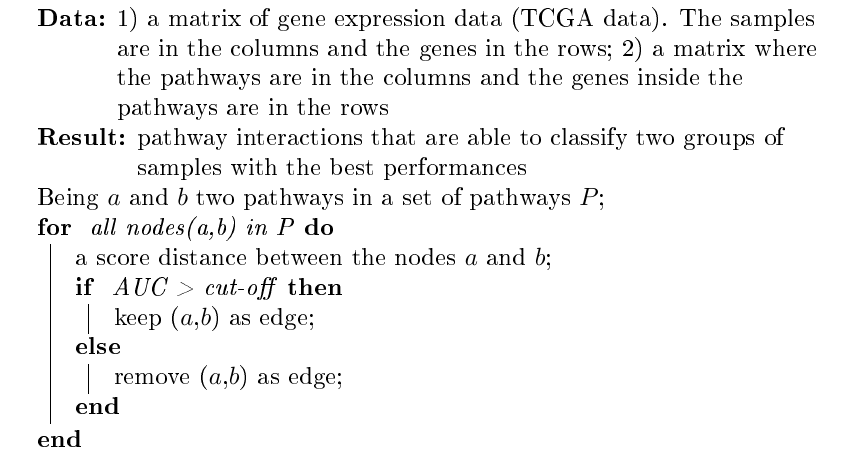

::: article
# Introduction

In recent years new genomic technologies have made possible to define
new marker gene signatures
[@desmedt2009gene; @parker2009supervised; @Cava2014]. However, gene
expression-based signatures present some constraints because they do not
consider metabolic role of the genes and are affected by genetic
heterogeneity across patient cohorts [@CavaBSB; @donato2013analysis].

Pathway analysis can help the researchers in the identification of the
biological roles of candidate genes exceeding these limitions
[@folger2011predicting]. Indeed, considering the activity of entire
biological pathways rather than the expression levels of individual
genes can charactherize the whole tissue. In particular, there are
several methods in computations and data used to perform the pathway
analyses. They can be characterized in two different levels: gene-sets
and pathway topology [@garcia2015pathway]. Indeed, the existing tools
integrating pathway data can be grouped into these groups based on the
pathway definition.

In the first group we can include the tools that are based on gene sets
definition as simple lists of biological molecules, in which the listed
components share a common biological role. In this group, for example,
we can include CoRegNet and Gene Set Enrichment Analysis (GSEA).
CoRegNet reconstructs a co-regulatory network from gene expression
profiles integrating, also, regulatory interactions, such as
transcription factor binding site and ChIP data, presenting some
analyses to identify master regulators of a given set of genes
[@nicolle2015coregnet]. One of the first and most popular methods is
GSEA [@subramanian2005gene] that uses a list of ranked genes based on
their differential gene expression between two labels. It then evaluates
their distribution on a priori defined set of genes, thus generating an
enrichment score (ES) for each set of genes.

In contrast, tools based on pathway topology do not only contain the
components of a pathway but also describe the interactions between them.
However, these methods still analyze the pathways as independent from
each other and not considering the influence that a pathway can exert
over another. In this second group we can include analysis methods that
take into account the topological structure of a pathway, such as
[*NetPathMiner*](https://www.bioconductor.org/packages/release/bioc/html/NetPathMiner.html),
[*ToPASeq*](https://www.bioconductor.org/packages/release/bioc/html/ToPASeq.html),
and [*XGR*](https://CRAN.R-project.org/package=XGR). *NetPathMiner*
[@mohamed2014netpathminer] implements methods for the construction of
various types of genome scale networks for network path mining. It
generates a network representation from a pathway file supporting
metabolic networks. Since the network is generated, the network edges
can be weighted using gene expression data (e.g., Pearson correlation).
Using machine learning methods and Markov mixture models, the pathways
can be classified or clustered based on their association with a
response label. The *ToPASeq* package implements seven different methods
covering broad aspects for topology-based pathway analysis of RNA-seq
data [@ihnatova2015topaseq]. With respect to other tools, *XGR*
[@fang2016xgr] is designed for enhanced interpretation of genomic data
generating also SNP-modulated gene networks and pathways. However,
compared to our tool, the others are not focused on the pathway
cross-talk analyses.

In line with this scenario given the few methods focused on the pathway
cross-talk network, the development of new methodologies to measure
pathway activity and cross-talk among pathways integrating also the
information of networks and gene expression data (e.g., TCGA data) could
lead to a deeper knowledge of the pathology.

Furthermore, functional pathway representation attributes the same
functional significance to each gene without considering the impact of
gene interactions in performing that function. What kinds of
interactions are there among genes in functional pathways? Specifically,
biological system interactions are composed of multiple layers of
dynamic interaction networks [@cantini2015detection]. These dynamic
networks can be decomposed, for example, into: co-expression, physical,
co-localization, genetic, pathway, and shared protein domains.

We developed a series of algorithms (see
[@Cava2018; @Cava2015; @Cava2016]), implemented in
[*StarBioTrek*](https://www.bioconductor.org/packages/release/bioc/html/StarBioTrek.html)
package able to work on all levels of the pathway analysis.

Starting from the gene expression data of two groups of samples (e.g.,
normal vs. disease), such algorithms aim at building a pathway
cross-talk model by attributing a score for each pairwise pathway.
Several scores are implemented in the tool using the gene expression
levels inside the pathways. The interacting pathways are filtered
considering pathways that are able to classify better the two groups of
samples. In addition, the genes inside the pathways can be weighted
defining key network drivers in the pathways as those gene drivers that
are highly connected in biological networks.

In summary, *StarBioTrek* package proposes an approach that integrates
knowledge on the functional pathways and multiple gene-gene
(protein-protein) interactions into gene selection algorithms. The
challenge is to identify more stable biomarker signatures, which are
also more easily interpretable from a biological perspective. The
integration of biological networks and pathways can also give further
hypotheses of the mechanisms of driver genes.

# Package organization

*StarBioTrek* makes accessible data of biological pathways and networks
in order to perform analyses without having to navigate and access
different web-based databases, without the need to download data, and by
integrating and locally processing the full data sets in a short time.
Specifically, it allows the users to: i) query and download biological
pathways and networks from several repositories such as KEGG, Reactome
and GeneMANIA[@Genemania; @cava2017spidermir; @franz2018genemania]
importing several functions from graphite [@sales2012g], and harmonize
annotations for genes and proteins (query/ download/ annotation
harmonization); (ii) integrate pathways and biological networks with a
series of implemented algorithms.

# Get data

## Pathway and network data {#pathway-and-network-data .unnumbered}

The functions of *StarBioTrek* import a large amount of data (e.g.,
biological pathways and networks).

Specifically, the function `pathwayDatabases` can easily query some
features of interest of the user such as species or specific pathway
database from graphite [@sales2012g]. Then, the function `GetData`
imports the selected data.

``` r
> library(graphite)
> pathwayDatabases()
  species database
1      athaliana     kegg
2      athaliana pathbank
3      athaliana reactome
4        btaurus     kegg
5        btaurus reactome
6       celegans     kegg
7       celegans reactome
8    cfamiliaris     kegg
9    cfamiliaris reactome
10 dmelanogaster     kegg
11 dmelanogaster reactome
12        drerio     kegg
13        drerio reactome
14         ecoli     kegg
15         ecoli pathbank
16       ggallus     kegg
17       ggallus reactome
18      hsapiens biocarta
19      hsapiens humancyc
20      hsapiens     kegg
21      hsapiens      nci
22      hsapiens  panther
23      hsapiens pathbank
24      hsapiens pharmgkb
25      hsapiens reactome
26      hsapiens    smpdb
27     mmusculus     kegg
28     mmusculus pathbank
29     mmusculus reactome
30   rnorvegicus     kegg
31   rnorvegicus pathbank
32   rnorvegicus reactome
33   scerevisiae     kegg
34   scerevisiae pathbank
35   scerevisiae reactome
36       sscrofa     kegg
37       sscrofa reactome
38       xlaevis     kegg
> path <- GetData(species="hsapiens", pathwaydb="kegg")
```

Since the user selected the data of interest, the function `GetPathData`
allows us to obtain a list of genes grouped by functional role:

``` r
> pathwayALLGENE <- GetPathData(path_ALL=path[1:3])
[1] "Downloading.............  Glycolysis / Gluconeogenesis   1 of 3 pathways"
[1] "Downloading.............  Citrate cycle (TCA cycle)   2 of 3 pathways"
[1] "Downloading.............  Pentose phosphate pathway   3 of 3 pathways"
```

The function `ConvertedIDgenes` will converter the gene nomenclature
(e.g., ENTREZ ID) to Gene Symbol.

``` r
> pathway <- ConvertedIDgenes(path_ALL=path[1:10])
```

The function `getNETdata` of *StarBioTrek* imports biological networks
from GeneMANIA. The biological networks can be selected among physical
interactions, co-localization, genetic interactions, pathways, and
shared protein domain networks. Furthermore, it supports 9 species (
Arabidopsis thaliana, Caenorhabditis elegans, Danio rerio, Drosophila
melanogaster, Escherichia coli, Homo sapiens, Mus musculus, Rattus
norvegicus, and Saccharomyces cerevisiae); for default it considers Homo
sapiens. Specifically, the function call

``` r
> netw <- getNETdata(network="SHpd")
[1]"genemania.org/data/current/Homo_sapiens/Shared_protein_domains.INTERPRO.txt n.1 of 2"
[1]"genemania.org/data/current/Homo_sapiens/Shared_protein_domains.PFAM.txt n.2 of 2"
[1]"Preprocessing of the network n. 1 of 2"
[1]"Preprocessing of the network n. 2 of 2"
```

imports biological networks (i.e., shared protein domains interactions
from INTERPRO and PFAM databases) for *Homo sapiens*. Otherwise, the
user can select one of the 9 species or using the following parameters
the user can select different network types: `PHint` for Physical
interactions, `COloc` for Co-localization, `GENint` for Genetic
interactions, `PATH` for Pathway, and `SHpd` for Shared protein domains.
Finally, *StarBioTrek* provides the functions for the harmonization of
gene nomenclature in the pathways and biological networks. Biological
data are processed for downstream analyses mapping Ensembl Gene ID to
gene symbols. Figure [1](#figure:Networkoverview) shows an overview of
network types supported by *StarBioTrek* with the function `getNETdata`.

{#figure:Networkoverview
width="100%" alt="graphic without alt text"}

# Analysing pathways

Starting from a gene expression matrix (DataMatrix), *StarBioTrek*
groups the gene expression levels according to their biological roles in
pathways for each sample.

``` r
> listpathgene <- GE_matrix(DataMatrix=tumo[,1:2], genes.by.pathway=pathway[1:10])
> str(listpathgene)
List of 2
 $ Cell_cycle           :'data.frame':	114 obs. of  2 variables:
  ..$ TCGA-E9-A1RC-01A: num [1:114] 4218 695 4231 7029 1211 ...
  ..$ TCGA-BH-A0B1-01A: num [1:114] 3273 692 6733 6468 1290 ...
 $ p53_signaling pathway:'data.frame':	64 obs. of  2 variables:
  ..$ TCGA-E9-A1RC-01A: num [1:64] 989 1614 1592 3456 900 ...
  ..$ TCGA-BH-A0B1-01A: num [1:64] 816 1274 1770 3190 405 ...
```

This function allows the user to have in a short time the gene
expression levels grouped by pathways.

## Pathway summary indexes {#pathway-summary-indexes .unnumbered}

As described in [@cava2014pathway] there are different measures to
summarize the expression levels of each pathway, such as the mean:

``` r
> score_mean <- average(pathwayexpsubset=listpathgene)
```

or standard deviation:

``` r
> score_stdev <- stdv(gslist=listpathgene)
```

## Dissimilarity distances: Pathway cross-talk indexes {#dissimilarity-distances-pathway-cross-talk-indexes .unnumbered}

Dissimilarity distances have been proved useful in many application
fields. Recent studies [@cava2013copy; @cava2014combined] used with
success dissimilarity representation among patients, considering the
expression levels of individual genes. To our knowledge, dissimilarity
representation is not used in pathway-based expression profiles. Our
goal is to give a dissimilarity representation, which can express,
through a function D(x,y), the dissimilarity between two pathways x and
y, such as Euclidean distance between pairs of pathways:

``` r
> scoreeucdistat <- eucdistcrtlk(dataFilt=Data_CANCER_normUQ_fil,
                                 pathway_exp=pathway[1:10])
```

or discriminating score [@Cava2015]:

``` r
> crosstalkstdv <- dsscorecrtlk(dataFilt=Data_CANCER_normUQ_fil,
                                pathway_exp=pathway[1:10])
```

# Integration data

## Integration between pathways and networks from GeneMANIA {#integration-between-pathways-and-networks-from-genemania .unnumbered}

Biological pathways can involve a large number of genes that are not
equivocally relevant for a functional role in the cell. Therefore, the
integration of network and pathway-based methods can boost the power to
identify the key genes in the pathways.

The function takes as arguments: a list of pathways as obtained by the
function `ConvertedIDgenes` and the networks as obtained by the function
`getNETdata`.

``` r
> listanetwork <- pathnet(genes.by.pathway=pathway[1:10], data=netw)
```

It creates a network of interacting genes for each pathway. The output
of the function is a selection of interacting genes according to the
network $N$ in a pathway $P$, namely a list with two columns where on
the same row there are the two interacting genes.

The function `listpathnet` takes as inputs the output obtained by the
function `pathnet` and the pathways as obtained by the function
`ConvertedIDgenes`:

``` r
> listpath <- listpathnet(lista_net=listanetwork, pathway=pathway[1:10])
```

creating a list of vectors for each pathway containing only genes that
have at least one interaction with other genes belonging to the pathway.

## Integration between pathways and networks from protein-protein interaction {#integration-between-pathways-and-networks-from-protein-protein-interaction .unnumbered}

The function `GetPathNet` allows us to obtain a list of interacting
genes (protein-protein interactions from
[*graphite*](https://www.bioconductor.org/packages/release/bioc/html/graphite.html)
package) for each pathway:

``` r
> pathwaynet <- GetPathNet(path_ALL=path[1:3])
```

using as its argument the output obtained by `GetData`.

# Analyzing networks and pathways: implemented algorithms

## Pathway cross-talk network {#pathway-cross-talk-network .unnumbered}

The first algorithm implemented in *StarBioTrek* explores a pathway
cross-talk network from gene expression data to better understand the
underlying pathological mechanism. The algorithm generates a network of
pathways that shows a different behavior between two groups of samples
(i.e., normal vs. disease).

Specifically,

``` r
# get pathways from KEGG database
path <- GetData(species="hsapiens", pathwaydb="kegg")
pathway <- ConvertedIDgenes(path_ALL=path)

# create a measure of pathway cross-talk (i.e., Euclidean distance) between pairwise
# of pathways starting from gene expression data (i.e.TCGA) with in the columns the
# samples and in the rows the genes
scoreeucdistat <- eucdistcrtlk(dataFilt=Data_CANCER_normUQ_fil, pathway=pathway)


# split samples' TCGA ID into normal and tumor groups
tumo <- SelectedSample(Dataset=Data_CANCER_normUQ_fil, typesample="tumour")
norm <- SelectedSample(Dataset=Data_CANCER_normUQ_fil, typesample="normal")

# divide the dataset in 60/100 for training and 40/100 for testing
nf <- 60

# a support vector machine is applied
res_class <- svm_classification(TCGA_matrix=scoreeucdistat[1:10,], nfs=nf,
                                normal=colnames(norm), tumour=colnames(tumo))
```

Since the AUC values are obtained for each pair of pathways, they can be
ranked in order to obtain the pathway cross-talk interactions able to
classify the two classes (i.e. normal vs. tumor samples) with the best
performance. Such selection can be done considering AUC values:

``` r
cutoff=0.80
er <- res_class[res_class[,1]>cutoff, ]
```

The outputs are the only pathway interactions that are obtained with AUC
values $>0.80$. The implemented algorithm was used in [@Cava2015] and
[@Cava2016] to screen pathway cross-talk associated to breast cancer.

The pseudocode of the implemented algorithm is summarized below.

<figure id="alg:1">


<figcaption>Algorithm 1: Algorithm implemented in <span class="citation"
data-cites="Cava2015">(Colaprico et al. 2015)</span> and <span
class="citation" data-cites="Cava2016">(Cava et al.
2016)</span></figcaption>
</figure>

## Driver genes for each pathway {#driver-genes-for-each-pathway .unnumbered}

Here, we propose an algorithm for the integrative analysis of networks
and pathways. Our method is inspired on a well-validated method (the
GANPA/LEGO) [@fang2012network; @dong2016lego], based on the hypothesis
that if one gene is functionally connected in the pathway with more
genes than those expected (according to the functional networks), has a
key role in that pathway. The algorithm, an extension of the GANPA/LEGO
method, defines driver genes in a pathway if they are highly connected
in a biological network.

The function

``` r
IPPI(patha=pathway_matrix[,1:10], netwa=netw_IPPI)
```

is used to identify driver genes for each pathway. The inputs of the
function are pathways and network data. It calculates the degree
centrality values of genes inside the network and the degree centrality
of genes inside pathways.\
The pseudocode of the implemented algorithm is summarized below.

<figure id="alg:2">


<figcaption>Algorithm 2: Algorithm implemented in <span class="citation"
data-cites="Cava2018">(Cava et al. 2018)</span></figcaption>
</figure>

In the first step, given the gene $i$ within the network $N$ with $m$
genes, the function computes the degree centrality $d$~$iN$~ as the
number of neighbor genes belonging to $N$ to which the gene $i$ is
directly connected.

In the second step, given gene $i$ within the pathway $P$ with $k$
genes, the function then computes the degree centrality $d$~$iP$~
considering only the relations among gene $i$ and the other genes in the
networks belonging to pathway $P$. Overall, by combining the information
of the network $N$ within the pathway $P$, is obtained a selection of
interacting genes according to the network $N$.

Then, the function computes the degree centrality expected $d$~$iE$~ by
supposing equal probability for the existence of edges between nodes
($d$~$iN$~$/m = d$~$iE$~/$k$). Thus, $d$~$iE$~ = $d$~$iN$~ $x k/m$.

The function characterizes a gene as a 'network driver' in the pathway
$P$, when $d$~$iP$~ of involving gene, normalized to the size of the
pathway ($k$), is higher than $d$~$iE$~, $d$~$iP$~/$k > d$~$iE$~.

The speculation is that if one gene is functionally linked (according to
the functional network) with more genes in the pathway than expected,
its function is central in that pathway.

The function `IPPI` was used in [@Cava2018] to find driver genes in the
pathways that are also de-regulated in a pan-cancer analysis.

# Visualization

*StarBioTrek* presents several functions for the preparation to the
visualization of gene-gene interactions and pathway cross-talk using the
[*qgraph*](https://CRAN.R-project.org/package=qgraph) package
[@epskamp2012qgraph]. The function `plotcrosstalk` prepares the data:

``` r
> formatplot <- plotcrosstalk(pathway_plot=pathway[1:6],gs_expre=tumo)
```

It computes a Pearson correlation between the genes (according to a gene
expression matrix, such as tumor) in which each gene is grouped in a
gene set given by the user (e.g., pathway). Each gene is presented in a
gene set if it is involved univocally in that gene set.

The functions of *qgraph*

``` r
> library(qgraph)
> qgraph(formatplot[[1]], minimum = 0.25, cut = 0.6, vsize = 5, groups = formatplot[[2]],
         legend = TRUE, borders = FALSE, layoutScale=c(0.8,0.8))
```

and

``` r
> qgraph(formatplot[[1]], groups=formatplot[[2]], layout="spring", diag = FALSE,
  cut = 0.6, legend.cex = 0.5, vsize = 6, layoutScale=c(0.8,0.8))
```

show the network with different layouts. The graphical output of the
functions are presented in the Figure [2](#figure:plot) and
Figure [3](#figure:plot2). The color of interactions indicates the type
of correlation: green edges are positive correlations and red edges are
negative correlations. The thickness of the edge is proportional to the
strength of correlation.

{#figure:plot width="100%"
alt="graphic without alt text"}

{#figure:plot2 width="100%"
alt="graphic without alt text"}

The outputs of the functions that compute the pairwise distance metrics
can be easily used with heatmap plotting libraries such as heatmap or
pheatmap as reported in the Figure [4](#figure:heatmap).

{#figure:heatmap width="100%"
alt="graphic without alt text"}

Furthermore, the function `circleplot` of *StarBioTrek* implemented
using the functions of
[*GOplot*](https://CRAN.R-project.org/package=GOplot)
[@walter2015goplot] provides a visualization of driver genes (with a
score indicating the role of genes in that pathway), as reported in
Figure [5](#figure:circleplot).

``` r
> formatplot <- plotcrosstalk(pathway_plot=pathway[1:6], gs_expre=tumo)
> score <- runif(length(formatplot[[2]]), min=-10, max=+10)
> circleplot(preplot=formatplot, scoregene=score)
```

{#figure:circleplot width="100%"
alt="graphic without alt text"}

# Case studies

In this section we will present two case studies for the usage of the
*StarBioTrek* package. In particular, the first case study uses the
first implemented algorithm reported above to identify pathway
cross-talk network. The second case study uses the second implemented
algorithm to identify gene drivers for each pathway.

## Pathway cross-talk network in breast cancer {#pathway-cross-talk-network-in-breast-cancer .unnumbered}

Starting from gene expression data of breast cancer samples and normal
samples we grouped 15243 genes in pathways according to their functional
role in the cell. Pathway data were derived from the function call:

``` r
path <- GetData(species="hsapiens", pathwaydb="kegg")
pathway <- ConvertedIDgenes(path_ALL=path)
```

For each pair of pathways we calculated a discriminating score as a
measure of cross-talk. This measure can be used considering e.g. the
pathways enriched with differentially expressed genes.

``` r
crosstalkscore <- dsscorecrtlk(dataFilt=Data_CANCER_normUQ_fil,
                               pathway_exp=pathway[1:10])
```

Discriminating score is given by |M1-M2|/S1+S2 where M1 and M2 are means
and S1 and S2 standard deviations of expression levels of genes in a
pathway 1 and in a pathway 2. In order to identify the best pathways for
breast cancer classification (breast cancer vs. normal) we implemented a
Support Vector Machine. We divided the original dataset in training data
set (60/100) and the rest of original data in the testing set (40/100).
In order to validate the classifier, we used a $k$-fold cross-validation
($k = 10$) obtaining Area Under the Curve (AUC).

``` r
tumo <- SelectedSample(Dataset=Data_CANCER_normUQ_fil, typesample="tumour")
norm <- SelectedSample(Dataset=Data_CANCER_normUQ_fil, typesample="normal")
nf <- 60
res_class <- svm_classification(TCGA_matrix=crosstalkscore, nfs=nf,
                                normal=colnames(norm), tumour=colnames(tumo))
```

Ranking AUC values obtained we selected the pathway cross-talk network
with the best AUC. The approach of the algorithm is shown in
Figure [6](#figure:sec).

{#figure:sec width="100%"
alt="graphic without alt text"}

## Gene network drivers in pathways {#gene-network-drivers-in-pathways .unnumbered}

In the second case study, we downloaded KEGG pathways

``` r
path <- GetData(species="hsapiens",pathwaydb="kegg")
pathway <- ConvertedIDgenes(path_ALL=path)
```

and network data for different network types from GeneMANIA

``` r
# for Physical interactions
netw <- getNETdata(network="PHint")

# for Co-localization
netw <- getNETdata(network="COloc")

# for Genetic interactions
netw <- getNETdata(network="GENint")

# for Pathway interactions
netw <- getNETdata(network="PATH")

# for Shared_protein_domains
netw <- <getNETdata(network="SHpd")
```

We processed the data obtained by the function `getNETdata` in order to
obtain a data format supported by the function `IPPI`. The function
`IPPI` was applied for each of the 5 network types.

We obtained that genes with genetic interaction found the lowest number
of potential gene network drivers. On the other hand, the network that
includes proteins with shared protein domains found the highest number
of potential driver genes. Finally, we defined a gene as a "network
driver" in the pathway, when in at least two networks one gene is
functionally connected in the pathway with more genes than those
expected (according to the two networks).

The approach is shown in Figure [7](#figure:ippioverview).

![Figure 7: The computational approach. The first step involves a
network $N$ (e.g. physical interaction) of size $m$ and for each gene,
$i$ in $N$ the algorithm calculates its degree centrality, DC
($d$~$iN$~). The second step involves a set of functional pathways (e.g.
pathway $P$) and for each gene $i$, the DC ($d$~$iP$~) is calculated
using the information on interacting genes from $N$. For the speculation
of equal probability for existing edges between nodes, the algorithm
computes the expected DC of gene $i$ in the pathway $P$. If the DC
observed for the gene $i$ ($d$~$iP$~) is higher than expected ($d$~$iP$~
expected), $i$ could be a potential driver in the pathway
$P$](ippi.png){#figure:ippioverview width="100%"
alt="graphic without alt text"}

# Conclusions

We have described *StarBioTrek*, an R package for the integrative
analysis of biological networks and pathways. The package supports the
user during the import and data analysis of data. *StarBioTrek*
implements two algorithms: i) the identification of gene network drivers
in the pathways; ii) the building of pathway cross talk network.
:::
