::: article
# Introduction {#Intro}

There are several approaches for quantifying the potential association
between two evenly spaced climate time series, e.g. Pearson's and
Spearman's correlation or the cross-correlation function (CCF). However,
these methods should not be directly applied when the time series are
unevenly spaced ("irregular"), particularly when two time series under
analysis are not sampled at identical points in time, as is usually the
case in climate research, especially in paleoclimate studies
[@emilie-geay_2016; @mudelsee_2014; @weedon_2003]. The most common way
of tackling this problem is to interpolate the original unevenly spaced
climate time series in the time domain so as to obtain equidistance and
the same times. The series can then be analysed using existing
conventional correlation analysis techniques. However, experience shows
that interpolation has its drawbacks: depending on the features of the
method applied, the interpolated time series may show deviations in
terms of variability or noise properties, and additional serial
dependence may be introduced
[@horowitz_1974; @mudelsee_2014; @olafsdottir_mudelsee_2014]. Thus,
interpolation should be avoided as far as possible.

Fortunately, there are some algorithms and software available to carry
out this task, at least for unevenly spaced climate time series sampled
at identical points in time
[@mudelsee_2003; @olafsdottir_mudelsee_2014]. However, there are few
statistical techniques for estimating the correlation between two time
series not sampled at identical points in time and their corresponding
computational implementations. One exception is the
Gaussian-Kernel-based cross-correlation (gXCF) method and its associated
software named NESTOOLBOX
[@rehfeld_et_al_2011; @rehfeld_et_al_2014; @NESTOOLBOX] and the extended
version [@roberts_et_al_2017] that includes a confidence interval
obtained by a bootstrapping resampling approach; another exception is
binned correlation as proposed by [@mudelsee_2010; @mudelsee_2014].
However, the software for this method is not freely available on the
Internet.

Binned correlation is a statistical technique developed to estimate the
correlation between two unevenly spaced time series sampled at different
points in time. It is also applicable to two evenly spaced time series
that are not on the same time grid [@mudelsee_2014]. It is performed by
resampling the time series into time bins on a regular grid, and then
assigning the mean values of the variable under scrutiny within those
bins. [@mudelsee_2010] proposes a novel approach adapting the binned
correlation technique (used mainly with astronomical data) to analyse
climate time series taking into account their memory (or persistence),
which is a genuine property of climate time series. Autocorrelation,
persistence, memory or serial dependence is characteristic of weather
and climate fluctuations, and is recorded in climate time series
[@wilks_2011; @mudelsee_2002]. A simple persistence model used to
"represent" climate time series is a first-order autoregressive (AR1)
process where a fluctuation depends only on its own immediate past plus
a random component [@gilman_1963; @mann_lees_1996; @mudelsee_2002].
However, paleoclimate time series are usually unevenly spaced in time,
and it is necessary to use an AR1 version for the case of uneven
spacing, such as the method proposed by [@robinson_1977]. The technique
of [@mudelsee_2010] requires the concept of nonzero persistence times,
enabling the mixing information (i.e. covariance) to be recovered, even
when the two timescales differ. The
[*BINCOR*](https://CRAN.R-project.org/package=BINCOR) package presented
in this paper is based on a method that is not applicable when one or
both of the time series under examination have zero persistence.
Similarly, this method is not applicable when the time series are
sampled with significantly longer spacing than the persistence time, so
that the effectively sampled persistence time is zero. A fundamental
condition for using this method is that the time spacing should not be
much larger than the persistence times. Enough common data points then
fall within a time bin, and knowledge can be acquired on the covariance
[@mudelsee_2010; @mudelsee_2014].

In this paper we present a computational package named *BINCOR* (BINned
CORrelation), which is based on the approach proposed by
[@mudelsee_2010; @mudelsee_2014]. The *BINCOR* package contains (i) a
main function named `bin_cor`, which is used to convert the irregular
time series to a binned time series; (ii) two complementary functions
(`cor_ts` and `ccf_ts`) for computing the correlation between the two
binned climate time series obtained with the `bin_cor` function; and
(iii) an additional function (`plot_ts`) for plotting the "primary" vs.
the binned time series. This package is programmed in `R` language and
is available at the CRAN repository
(<https://CRAN.R-project.org/package=BINCOR>).

This paper is divided into four sections. The first outlines the method
and the computational program. The second presents a Monte Carlo
experiment to study the effect of binning size selection. In the
Examples section we apply *BINCOR* to a couple of unevenly spaced
real-world climate data sets: instrumental and paleoclimate. Finally,
the Summary section presents our main conclusions.

# The BINCOR package {#pack}

## The method {#Met}

In this section we outline the main mathematical ideas behind the binned
correlation technique for unevenly spaced sampled at different points in
time, following the methodology introduced by
[@mudelsee_2010; @mudelsee_2014]. The procedure is described as follows:

1.  Input: two unevenly spaced climate time series
    $\{X(i), T_X\}_{i=1}^{N_X}$ and $\{Y(i), T_Y\}_{i=1}^{N_Y}$, where
    $T_X$, $T_Y$ and $N_Y$, $N_Y$ are the time domains and the sample
    sizes of each series, respectively.\

2.  Compute the average spacing between samples

    -   $\bar{d}_X    = [T_X(N_X) - T_X(1)]/(N_X - 1)$
    -   $\bar{d}_Y    = [T_Y(N_X) - T_Y(1)]/(N_Y - 1)$
    -   $\bar{d}_{XY} = [\bar{T}_\mathrm{max} - \bar{T}_\mathrm{min}]/(N_X + N_Y - 1)$

    where $\bar{T}_\mathrm{max} = \max[T_X(N_X), T_Y(N_Y)]$ and
    $\bar{T}_\mathrm{min} = \min[T_X(1), T_Y(1)]$.\

3.  Estimate the bin-width ($\bar{\tau}$) taking into account the
    persistence (memory) estimated for each unevenly spaced climate time
    series, $X$ and $Y$ denoted as $\hat{\tau}_X$ and $\hat{\tau}_Y$,
    respectively. To estimate the persistence, an AR1 model
    [@robinson_1977] is fitted to each unevenly spaced time series
    [@mudelsee_2002]. *BINCOR* includes three rules for estimating the
    bin-width (the options are shown in Table [1](#taus)), but we prefer
    to use rule number 3 as the default value (FLAGTAU=3) because in
    terms of the RMSE (Section Monte Carlo experiments) of this rule
    Monte Carlo simulations are superior to the other rules for
    estimating the bin-width [@mudelsee_2014].

    -   Estimate the bias-corrected equivalent autocorrelation
        coefficients
        -   $\hat{\bar{a}}'_X = \exp (-\bar{d}_X/\hat{\tau}'_X)$, [
            $\hat{\bar{a}}'_Y = \exp (-\bar{d}_Y/\hat{\tau}'_Y)$
            ]{style="color: black"}, and
            $\hat{\bar{a}}'_{XY} = \sqrt{ \hat{\bar{a}}'_X \cdot \hat{\bar{a}}'_Y }$
    -   Estimate the bin-width as
        $\bar{\tau}  =  -\bar{d}_{XY} / \ln (\hat{\bar{a}}'_{XY})$ (Eq.
        7.48 in [@mudelsee_2002]), the default option (FLAGTAU=3) in the
        BINCOR package, other options are:

        ::: {#taus}
          ------------------------------------------------------------------------------------------------
                                      $\bar{\tau}$ rule  FLAGTAU option                       Reference 
          --------------------------------------------- ---------------- ------------------------------ --
                                      $\tau_x + \tau_y$        1           Eq. 7.44 in [@mudelsee_2014] 

                         $\mathrm{max}(\tau_x, \tau_y)$        2           Eq. 7.45 in [@mudelsee_2014] 

            $-\bar{d}_{XY} / \ln (\hat{\bar{a}}'_{XY})$        3           Eq. 7.48 in [@mudelsee_2014] 
          ------------------------------------------------------------------------------------------------

          : Table 1: The FLAGTAU options and its corresponding methods
          (rules) to estimate the bin-width.
        :::

4.  Determine the number of bins:
    $N_b =  (\bar{T}_\mathrm{max} - \bar{T}_\mathrm{min}) / \bar{\tau}$

5.  Set: $\lim_\mathrm{inf}(n=1) = \bar{T}_\mathrm{min}$. Then, for
    $n=1, 2, \dots, N_b$, define (Figure [1](#fig7p3_MM)):

    1.  $\lim_\mathrm{sup}(n) =  \bar{T}_\mathrm{min} + n \cdot \bar{\tau}$

    2.  id$T_X$ = WHICH $[T_X \geq \lim_\mathrm{inf}(n)$ AND
        $T_X \leq \lim_\mathrm{sup}(n)]$

    3.  id$T_Y$ = WHICH $[T_Y \geq \lim_\mathrm{inf}(n)$ AND
        $T_Y \leq \lim_{sup}(n)]$

    4.  L$T_X$ = LENGTH(id$T_X$)

    5.  L$T_Y$ = LENGTH(id$T_Y$)

        if (L$T_X$ $>$ 0 AND L$T_Y$ $>$ 0)

        1.  $F(n)$ = mean of $X$(id$T_X$)

        2.  $G(n)$ = mean of $Y$(id$T_Y$)

        3.  $T(n)$ = \[$\lim_\mathrm{inf}(n)$ + $\lim_\mathrm{sup}(n)$\]
            / 2

    6.  $\lim_\mathrm{inf}(n) = \lim_\mathrm{sup}(n)$

6.  Output: two binned climate time series $\{T_n,\, F(n)\}_{n=1}^{N_b}$
    and $\{T_n, G(n)\}_{n=1}^{N_b}$, where $N_b$ is the number of bins.

7.  Estimate the correlation between the two binned time series. This
    can be done through the native `R` functions `cor` and `ccf` or by
    means of the *BINCOR* functions `cor_ts` and `ccf_ts`.

![Figure 1: Graphical representation for the binned correlation
procedure presented in Step 5. Modified from
[@mudelsee_2010; @mudelsee_2014].](brxy.png){#fig7p3_MM width="100%"
alt="graphic without alt text"}

# Monte Carlo experiments

We conducted Monte Carlo experiments to study how the specific rules
(Table [1](#taus)) chosen for calculating the bin-width based on
persistence reduce the error compared to arbitrarily choosing a
bin-width. The parameter configuration for the Monte Carlo experiments
is presented in Figure [2](#MCsims). To carry out the Monte Carlo
simulations, we used the bivariate Gaussian AR1 process for uneven time
spacings [@mudelsee_2014], which is given by

$$\begin{aligned}
~\label{biAR1-1}
  X(1) = \mu_{N(0,1)}^{X}(1), \nonumber \\
  Y(1) = \mu_{N(0,1)}^{Y}(1), \nonumber \\
  X(t) = a_X X(t-1) + \mu_{N(0,1-a_X^2)}^{X}(t), \;\; t= 2,...,N,\nonumber \\ 
  Y(t) = a_Y Y(t-1) + \mu_{N(0,1-a_Y^2)}^{Y}(t), \;\; t= 2,...,N, 
\end{aligned}   (\#eq:biAR1-1)$$

where $a_X$ and $a_Y$, the autoregressive parameters for $X(t)$ and
$Y(t)$, are defined as [@mudelsee_2014]:
$a_X = exp\{-[T_X(t) - T_X(t-1)]/\tau_X\}$ and
$a_Y = exp\{-[T_Y(t) - T_Y(t-1)]/\tau_Y\}$. The correlation (by
construction) between $X(t)$ and $Y(t)$ is $\rho_{XY}$ [see
@mudelsee_2014 pp. 307 for more details about the statistical properties
of the bivariate AR1 process for unevenly spaced time series]. To
generate the uneven timescales for $X(i)$ and $Y(j)$, we follow the
methodology proposed by [see @mudelsee_2014 pp. 299], which consists of
producing a number (10 $N$) of data pairs on an evenly spaced grid of
1.0, discarding 90% of points and retaining 10% of $X$ and $Y$
($N_x=N_y=N$) points. The time points for $X(i)$ and $Y(j)$ are subject
to the following conditions:

1.  Control case (equal timescales):

    -   Condition 1: $N_X=N_Y$
    -   Condition 2: $\{T_X(i)\}_{i=1}^{N_X}=\{T_Y(j)\}_{j=1}^{N_Y}$

2.  "Well" mixed unequal timescales:

    -   Condition 1: $T_X(i) \neq T_Y(j) \; for all \; i \; and \; j$
    -   Condition 2:
        $T_X(1) < T_Y(1) < T_X(2) < T_Y(2) < T_X(3) < ... < T_X(N_X) < T_Y(N_Y)$

3.  "Wildly" mixed unequal timescales:

    -   There are not conditions for this case.

<figure id="MCsims">
<table>
<caption> </caption>
<tbody>
<tr class="odd">
<td style="text-align: left;">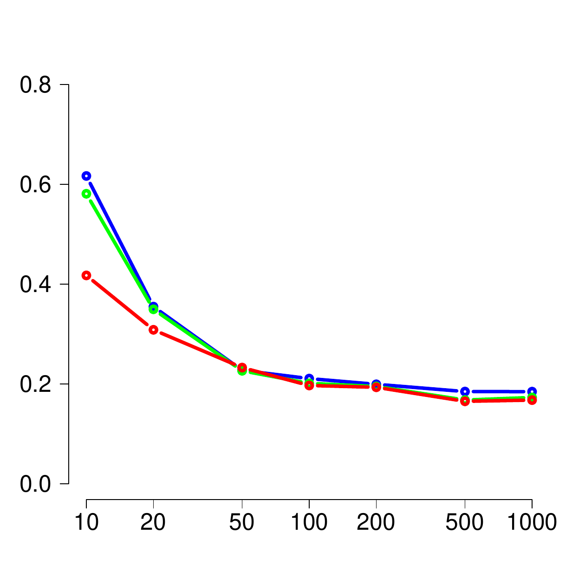</td>
<td style="text-align: center;">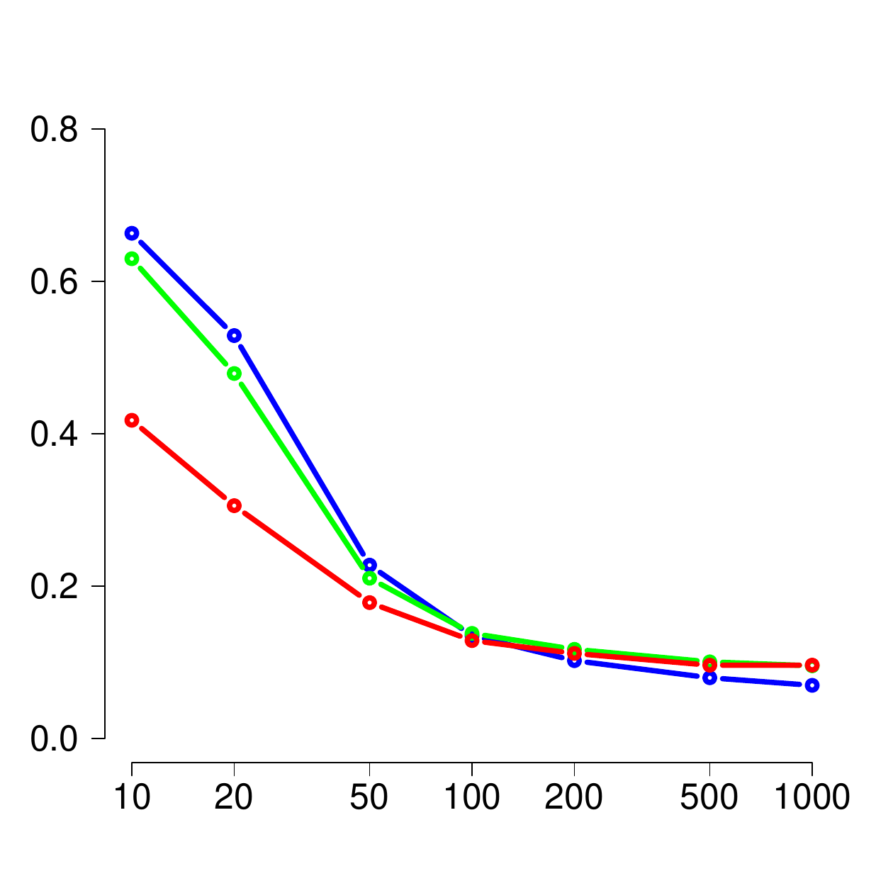</td>
<td style="text-align: right;">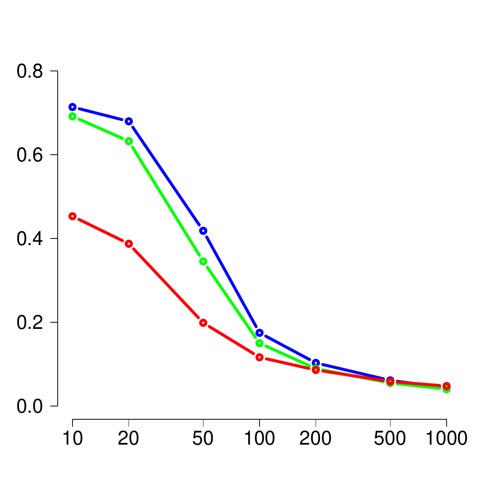</td>
</tr>
<tr class="even">
<td style="text-align: left;">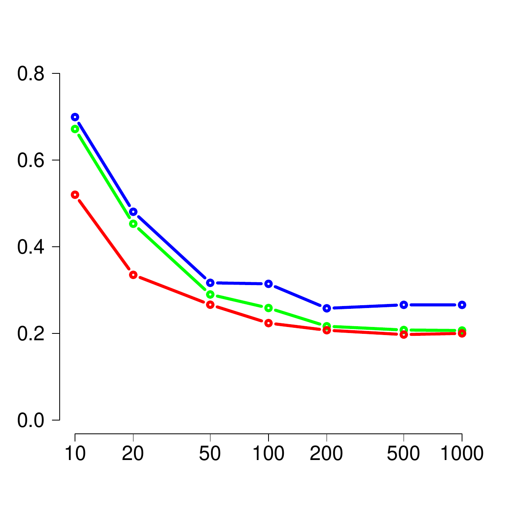</td>
<td style="text-align: center;">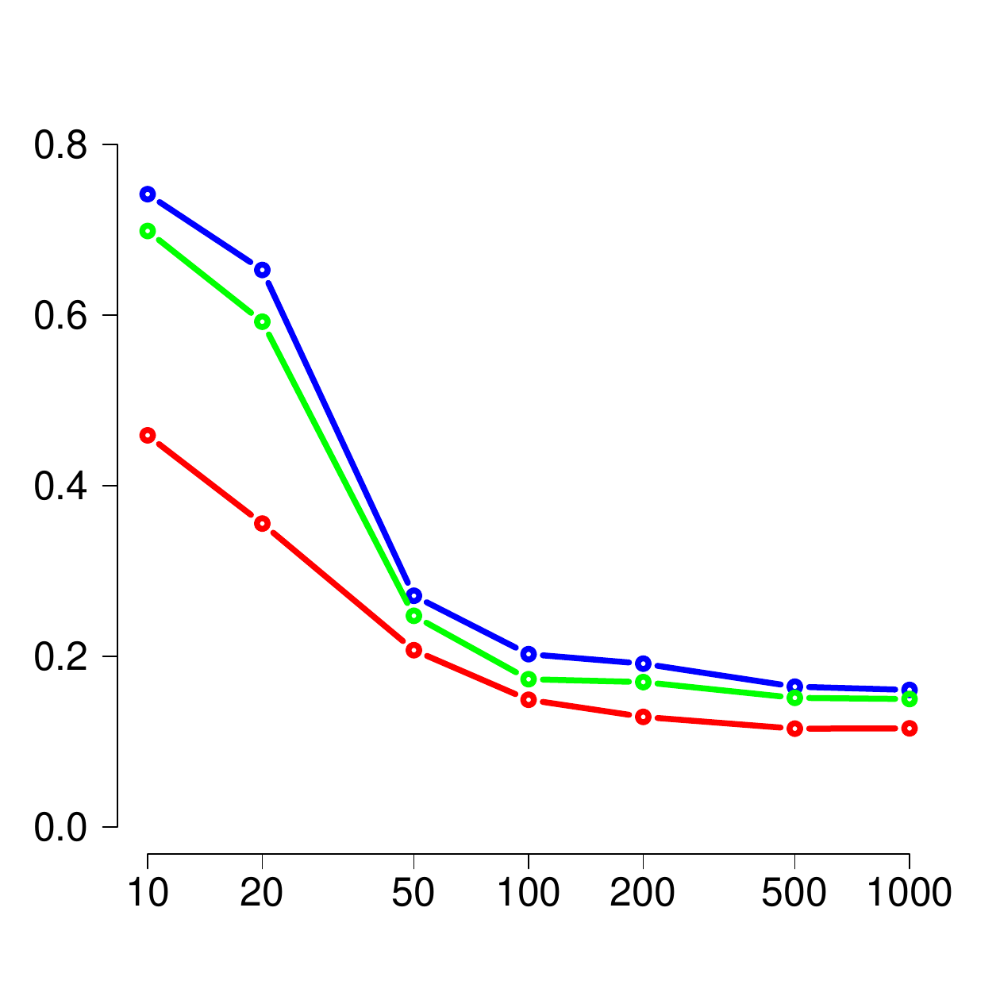</td>
<td style="text-align: right;">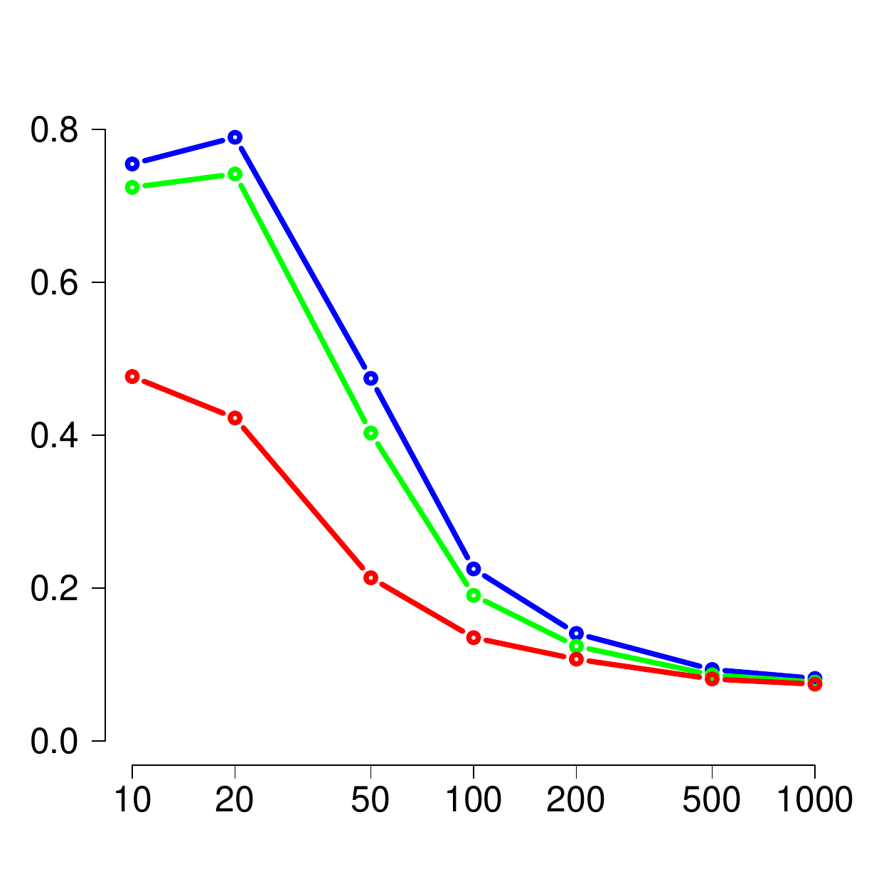</td>
</tr>
</tbody>
</table>
<figcaption>Figure 2: Monte Carlo experiments to test the impact of the
rules (Table ) used to calculate the bin-width and their role in the
estimation of the binned correlation. The persistence figures for <span
class="math inline"><em>X</em></span> and <span
class="math inline"><em>Y</em></span> are 10 (column 1), 20 (column 2)
and 50 (column 3), respectively. The constraints for the resampling
timescales are for well mixed (first row) and wildly mixed (second row)
cases. The horizontal axis indicates the sample sizes (in log10 scale)
and the vertical axis shows the RMSE that is determined via averaging
<span
class="math inline">(<em>ρ̂</em><sub><em>X</em><em>Y</em></sub>−<em>ρ</em><sub><em>X</em><em>Y</em></sub>)<sup>2</sup></span>
over 5,000 simulations. The blue, green and red curves indicate rules 1
(sum), 2 (max) and 3 (the default rule option in
<em>BINCOR</em>).</figcaption>
</figure>

The outcome of the Monte Carlo experiments is as follows: 1) For equal
timescales (figures not shown), all three rules behave similarly (as
expected) in terms of RMSE, although the RMSE increases slightly as the
persistence increases. 2) The well mixed case shows that for RMSE the
rules take two different "patterns" with the first two rules (sum and
max) on one hand and the third rule (the default rule option) on the
other. This difference is most noticeable in the first values of the
samples (from 10 to 100) and is most pronounced with high persistence
values ($\tau_x$ and $\tau_y$). The rule that shows the smallest RMSE is
rule 3 (the default option), though it is important to point out that
for $\tau_x = \tau_y$ = 50 the RMSE figures are practically
indistinguishable for sample sizes from 200 to 1000. 3) Finally, RMSE in
the wildly mixed case behaves more or less similarly to the well mixed
case, though rule 3 yields the smallest RMSE for all three persistence
values. Bearing in mind that the wildly mixed case does not impose
conditions on generating timescales, and in practice the unevenly spaced
climate time series could contain some degree of randomness in the
sampling times, the best rule in terms of RMSE for estimating bin-width
($\bar{\tau}$) and binned correlation can be said to be number 3, i.e.
the default rule used in *BINCOR* to estimate the bin-width.

## The computer program {#Prog}

The *BINCOR* package developed in `R` version 3.1.2 to be run from the
command line runs on all major operating systems and is available from
the CRAN repository (<http://CRAN.R-project.org/package=BINCOR>). The
*BINCOR* package contains four functions: 1) `bin_cor` (the main
function for building the binned time series); 2) `plot_ts` (for
plotting and comparing the "primary" and binned time series); 3)
`cor_ts` (for estimating the correlation between the binned time
series); and 4) `ccf_ts` (for estimating the cross-correlation between
the binned time series). The graphical outputs can be displayed on the
screen or saved as PNG, JPG, or PDF graphics files. *BINCOR* depends on
the [*dplR*](https://CRAN.R-project.org/package=dplR) [@dplr] and
[*pracma*](https://CRAN.R-project.org/package=pracma) [@pracma]
packages. The [*dplR*](https://CRAN.R-project.org/package=dplR) package
is used by the function `bin_cor` to calculate the persistence for the
climate time series under study, whereas the
[*pracma*](https://CRAN.R-project.org/package=pracma) package is used by
the functions `cor_ts` and `ccf_ts` to remove the linear trend before
estimating the correlation.

The first (and main) function, `bin_cor`, estimates the binned time
series taking into account the memory or persistence of the unevenly
spaced climate time series to be analysed [@mudelsee_2002]. It has the
following syntax:

``` r
  R> bin_cor(ts1, ts2, FLAGTAU=3, ofilename), 
```

where

-   `ts1` and `ts2` are unevenly spaced time series.
-   `FLAGTAU` defines the method used to estimate the bin-width
    ($\bar{\tau}$). There are three methods included in *BINCOR* for
    estimating bin-width (Table [1](#taus)), but we prefer to use
    (`FLAGTAU = 3`) as the default rule because Monte Carlo simulations
    perform better in terms of RMSE than the other rules in estimating
    the bin-width and the binned correlations [@mudelsee_2014].
-   `ofilename` is the name of the output file (in ASCII format) which
    contains the binned time series.

`bin_cor` returns a list object containing the following outputs:

``` r
 "Binned_time_series", "Auto._cor._coef._ts1", "Persistence_ts1", "Auto._cor._coef._ts2",  
 "Persistence_ts2", "bin width", "Number_of_bins",  "Average spacing", "VAR. ts1", 
 "VAR. bin ts1", "VAR. ts2", "VAR. bin ts2", "VAR. ts1 - VAR bints1", 
 "VAR. ts2 - VAR bints2", "% of VAR. lost ts1", "% of VAR. lost ts2".
```

The names of the outputs are self-explanatory, but we wish to highlight
that `Average spacing` is the mean value of the times for the binned
time series; `VAR. ts1`, `VAR. bin ts1`, `VAR. ts2` and `VAR. bin ts2`
are the variances for `ts1` and `ts2` for their respective binned time
series; the next two outputs are the differences between the variances
of `ts1` and `ts2` and their corresponding binned time series; and the
last two outputs are the percentages of variance lost for `ts1` and
`ts2` as a result of the binned process.

The second function, called `plot_ts`, plots the "primary" (unevenly
spaced) time series and the binned time series. The `plot_ts` function
contains the following elements:

``` r
 R> plot_ts(ts1, ts2, bints1, bints2, varnamets1="", varnamets2="", 
    colts1=1, colts2=1, colbints1=2, colbints2=2, ltyts1=1, 
    ltyts2=1, ltybints1=2, ltybints2=2, device="screen", ofilename),
```

where the input arguments `ts1` and `ts2` are the unevenly spaced time
series, `bints1` and `bints2` are the binned time series, `varnamets1`
and `varnamets2` are the names of the variables under study, `colts1`,
`colts2` (by default both curves are in black) and `colbints1`,
`colbints2` (by default both curves are in red) are the colours for the
"primary" and binned times series; `ltyts1`, `ltyts2`, `ltybints1` and
`ltybints2` are the types of line to be plotted for the "primary" and
binned times series, respectively (1 = solid, 2 = dashed, 3 = dotted, 4
= dot-dashed, 5 = long-dashed, 6 = double-dashed); `device` is the type
of output device ("screen" by default, the other options being "jpg,"
"png," and "pdf"); `resfig` is the image resolution in "ppi" (by default
`R` does not record a resolution in the image file, except for BMP; 150
ppi could be a suitable value); `ofilename` is the output filename; and
finally, `Hfig`, `WFig` and `Hpdf`, `Wpdf` are the height and width of
the output for the JPG/PNG and PDF formats, respectively.

The third function, `cor_ts`, calculates three types of correlation
coefficient: Pearson's correlation, Spearman's and Kendall's rank
correlations. These correlation coefficients are estimated through the
native `R` function `cor.test` from the `R` package `Stats`. The
`cor_ts` function has an option to remove the linear trend of the time
series under analysis -- other pre-processing methods could be used
before the `cor_ts` function is applied. This function has the following
syntax:

``` r
 R> cor_ts(bints1, bints2, varnamets1="", varnamets2="", 
    KoCM, rmltrd="N", device="screen", Hfig, Wfig, Hpdf, Wpdf, 
    resfig, ofilename)
```

where `KoCM` indicates the correlation estimator: `pearson` for Pearson
(the option by default), `spearman` for Spearman and `kendall` for
Kendall; `rmltrd` is the option to remove the linear trend in the time
series under study (by default the linear trend is not removed, but the
function can be enabled via the option "Y" or "y"). The other parameters
are described some lines above. `cor_ts` has as its output a list object
containing the main information for the estimated correlation
coefficient (e.g. a 95% confidence interval for Pearson and a `p-value`
for Spearman and Kendall). The `cor_ts` function also provides a
scatterplot for the binned time series, which can be plotted on the
screen (by default) or saved in JPG, PNG or PDF formats (the parameter
`ofilename` is available to assign a name to this output).

Finally, the fourth function, `ccf_ts`, estimates and plots the
cross-correlation between two evenly spaced paleoclimate time series. We
use the native `R` function `ccf` (`R` `Stats` package) to estimate the
cross-correlation in our `ccf_ts` function. The `ccf_ts` function has
the following syntax:

``` r
  R> ccf_acf <- ccf_ts(bints1, bints2, lagmax=NULL, ylima=-1, ylimb=1, 
            rmltrd="N", RedL=T, device="screen", Hfig, Wfig, 
            Hpdf, Wpdf, resfig, ofilename)
```

All these elements are already defined above except the parameters
`lagmax=NULL`, `ylima=-1`, `ylimb=1` and `RedL`. The first parameter
indicates the maximum lag for which the cross-correlation is calculated
(its value depends on the length of the data set), the next two
parameters indicate the extremes of the range in which the CCF will be
plotted and the last parameter (the default option is TRUE) plots a
straight red line to highlight the correlation coefficient at lag 0. The
`ccf_ts` function generates as its output the `acf` (auto-correlation
function; ACF) `R` object, which is a list with the following
parameters: `lag` is a three dimensional array containing the lags at
which the ACF is estimated; `acf` is an array with the same dimensions
as `lag` containing the estimated ACF; `type` is the type of correlation
(`correlation` (the default), `covariance` and `partial`); `n.used` is
the number of observations in the time series; and `snames` provides the
names of the time series (`bints1` and `bints2`).

# Examples {#Ex}

## Assessing the link between El Niño-Southern Oscillation and Northern Hemisphere sea surface temperature

We first examine two evenly-spaced annually-resolved instrumental
climate records that cover the time interval from 1850 to 2006
($N = 157$ points). To test our *BINCOR* package we created irregular
time series by randomly removing 20% of the data from the evenly spaced
time series. We note that the new "sampling" times are not necessarily
the same for both irregular series. The new irregular time series
("primary" hereafter) consist of 125 data points and have an average
temporal spacing $\bar{d}$ of 1.24 years. Specifically the two time
series used were a record of Northern Hemisphere (NH) sea surface
temperature (SST) anomalies (HadCRUT3, [@brohan_et_al_2006]) and a
record of equatorial Pacific SST anomalies from the El Niño 3 region
(2.5$^\circ$S to 2.5$^\circ$N, 92.5 to 147.5$^\circ$W)
[@mann_et_al_2009], which is a indicator of El Niño-Southern Oscillation
(ENSO). Both time series, especially the NH-SST data, show strong
autocorrelation (plots not shown) and long-term trends (inspected by
Mann-Kendall test; ENSO, `z`=6.52 and `p-value` $<$ 0.001 and NH-SST,
`z` = 10.214 and `p-value` $<$ 0.001). To generate the sample data, we
fit a linear model to each evenly spaced time series and, after removing
the model fitted to the evenly spaced data, we use the residuals (i.e.
the difference between the observed data and the model fitted) to build
the irregular time series and then create the binned time series.

<figure id="figure:SST_ENSOres">
<table>
<caption> </caption>
<tbody>
<tr class="odd">
<td style="text-align: left;">A)</td>
<td style="text-align: left;">C)</td>
</tr>
<tr class="even">
<td style="text-align: left;">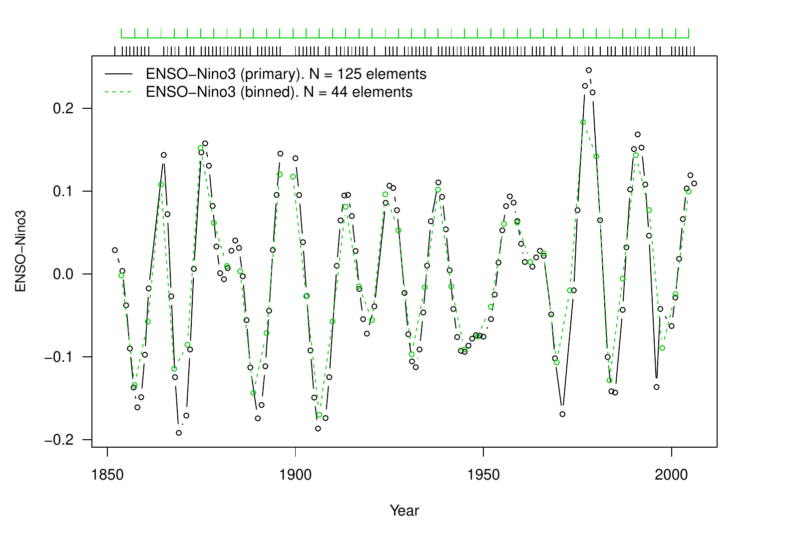</td>
<td style="text-align: left;">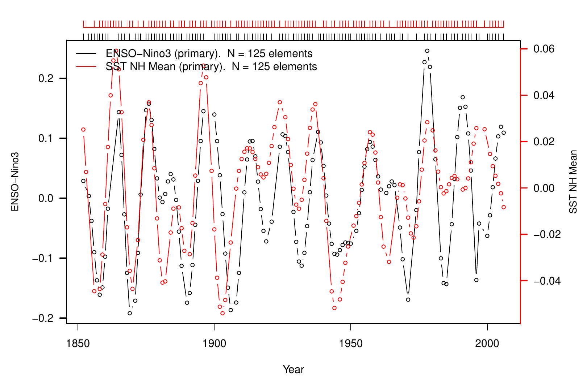</td>
</tr>
<tr class="odd">
<td style="text-align: left;">B)</td>
<td style="text-align: left;">D)</td>
</tr>
<tr class="even">
<td style="text-align: left;">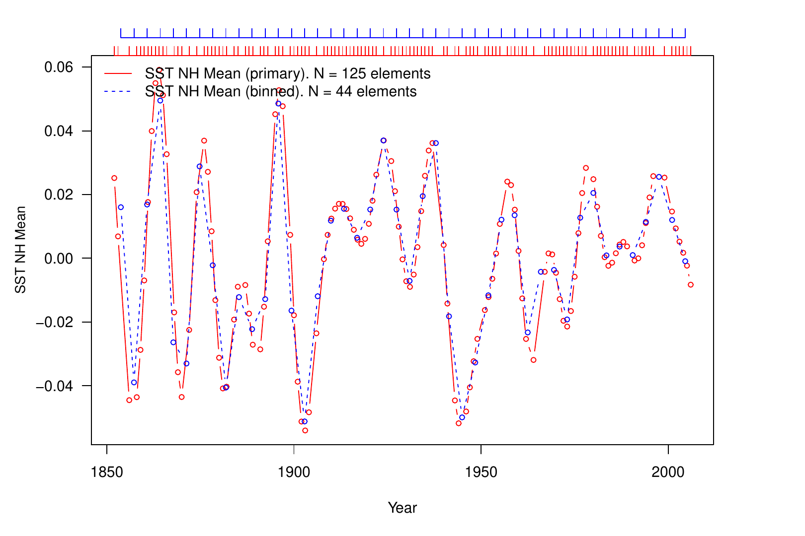</td>
<td style="text-align: left;">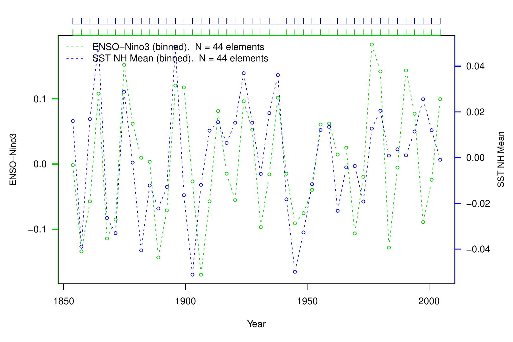</td>
</tr>
</tbody>
</table>
<figcaption>Figure 3: “Primary” (unevenly spaced) and binned ENSO-Niño3
<span class="citation" data-cites="mann_et_al_2009">(Mann et al.
2009)</span> and NH-SST <span class="citation"
data-cites="brohan_et_al_2006">(Brohan et al. 2006)</span>. The
autocorrelation and persistence values for ENSO are <span
class="math inline">$\hat{\bar{a}}' = 0.82$</span> and <span
class="math inline"><em>τ̂</em> = 6.25</span> years, and for NH-SST are
<span class="math inline">$\hat{\bar{a}}' = 0.86$</span> and <span
class="math inline"><em>τ̄</em> = 8.05</span> years. The horizontal top
axes indicate the sampling times for the plotted time series.
</figcaption>
</figure>

The code used to generate Figure [3](#figure:SST_ENSOres) is shown
below.

``` r
 # Load the package
 library(BINCOR) 

 # Load the time series under analysis: Example 1 and Figure 1 (ENSO vs. NHSST) 
 data(ENSO)
 data(NHSST)

 # Compute the binned time series though our bin_cor function
 bincor.tmp <- bin_cor(ENSO.dat, NHSST.dat, FLAGTAU=3, "output_ENSO_NHSST.tmp")
 binnedts   <- bincor.tmp$Binned_time_series 

 # Applying our plot_ts function 
 # "Screen" 
 plot_ts(ENSO.dat, NHSST.dat, binnedts[,1:2], binnedts[,c(1,3)], "ENSO-Nino3",
 "SST NH Mean", colts1=1, colts2=2, colbints1=3, colbints2=4, device="screen") 
```

Figures [3](#figure:SST_ENSOres) A and [3](#figure:SST_ENSOres) B show
the binned time series (ENSO in green and NH-SST in red) obtained with
our `bin_cor` function. Although we use residuals, they show a relative
high autocorrelation ($\hat{\bar{a}}'_{\mathrm{ENSO}} = 0.82$ and
$\hat{\bar{a}}'_{\mathrm{SST}} = 0.86$) and their corresponding
estimated bias-corrected persistence values are
$\hat{\tau}_{\mathrm{ENSO}} = 6.25$ years and
$\bar{\tau}_{\mathrm{SST}} = 8.05$ years. The number of bins and, thus,
the number of elements for each binned time series is 44 and the
distance between elements is 3.5 years. We also plot the "primary"
climate time series (in black) to compare them with the binned series.
Visually, the binned time series are roughly similar to the "primary"
series. This observation is also supported by the statistical similarity
method [@frentzos_et_al_2007] as implemented in the `R` package
[*TSdist*](https://CRAN.R-project.org/package=TSdist)
[@mori_et_al_2015; @mori_et_al_2016]. The dissimilarity metric (DISSIM)
has the following interpretation: a value of zero indicates a perfect
relationship such that the closer DISSIM is to zero, the more similar
are the time series. The DISSIM between the binned and "primary" ENSO
time series and the binned and "primary" NH-SST series are 3.70 and
0.84, respectively. This corroborates the similarity between the
"primary" and binned time series observed visually. Figure
[3](#figure:SST_ENSOres) also shows a comparison between the "primary"
climate time series (Figure [3](#figure:SST_ENSOres) C) and the binned
series (Figure [3](#figure:SST_ENSOres) D). Note that this plot shows
that the number of elements ($N = 125$) is the same for both "primary"
series, but this is not strictly necessary: our `bin_cor` function is
able to tackle time series with different numbers of elements.

The second result obtained from our *BINCOR* package, and more
specifically from the `cor_ts` function, is shown in Figure
[4](#figure:scatter), which shows the scatterplot between the ENSO
(x-axis) and NH-SST (y-axis) binned time series. This scatterplot shows
a moderate increasing trend from left to right, suggesting a potentially
positive relationship between the two binned time series. This pattern
can be confirmed statistically by means of the `cor_ts` function output,
which also provides the correlation coefficient between two time series
under analysis. For this case, the Pearson's correlation (with 95%
confidence interval) obtained is $\bar{r}_{XY} = 0.53$ \[0.28; 0.71\]
(other estimators can also be used in `cor_ts`). This value is close to
the Pearson's correlation estimated for the evenly spaced climate time
series, which is $\bar{r}_{XY} = 0.58$ \[0.46; 0.67\]. The relatively
high correlation obtained between these two climate records is expected;
ENSO-related climate variability is observed in many regions outside the
equatorial Pacific, particularly in the tropical North Atlantic
[@enfield_mayer_1997; @garcia_et_al_2017].

![Figure 4: Scatterplot for the ENSO-Niño3 [@mann_et_al_2009] and NH-SST
[@brohan_et_al_2006] binned time series. The Pearson's correlation
coefficient (with 95% confidence interval) is $\bar{r}_{XY} = 0.53$
\[0.28; 0.71\].](./scaterplot_scatterplot_ENSO_SST.png){#figure:scatter
width="100%" alt="graphic without alt text"}

The code used to generate Figure 2 is shown below.

``` r
 # Load packages
 library(BINCOR) 
 library(pracma)

 # Load the time series under analysis: Example 1 and Figure 2 (ENSO vs. NHSST) 
 data(ENSO)
 data(NHSST)

 # Compute the binned time series though our bin_cor function
 bincor.tmp <- bin_cor(ENSO.dat, NHSST.dat, FLAGTAU=3, "output_ENSO_NHSST.tmp")
 binnedts   <- bincor.tmp$Binned_time_series 

 # Compute the scatterplot by means of our function cor_ts 
 # PDF format (scatterplot) and Pearson  
 cor_ts(binnedts[,1:2], binnedts[,c(1,3)], "ENSO-Nino3", "SST NH Mean",
 KoCM="pearson", rmltrd="y", device="pdf", Hpdf=6, Wpdf=9, resfig=300,
 ofilename="scatterplot_ENSO_SST")
```

## Abrupt climate changes during the last glacial

We report an analysis of two temporally unevenly-spaced pollen records
from two marine sediment cores (MD04 and MD95) collected on the
south-western European margin (Figure [5](#figure:mapa)). The aim of
this case study is to show the use of *BINCOR* to estimate the
correlation between two unevenly spaced paleoclimate time series by
means of the cross-correlation function. The pollen time series analysed
in this example span the interval between 73,000 and 15,000 years before
present (BP), thus covering the last glacial period (LGP). The climate
during the LGP was characterised by millennial variability with "abrupt"
transitions between cold stadials and warm interstadials known as
Dansgaard-Oeschger (D-O) cycles
[@dansgard_et_al_1993; @wolff_et_al_2012]. The D-O cycles are
characterised by rather fast atmospheric warming events over Greenland
of up to 16 ${}^\circ$C that occur within a period of approximately 40
years, followed by gradual cooling leading to the cold stadials
[@sanchez_harrison_2010; @wolff_et_al_2012].

![Figure 5: Geographical locations for the pollen time series under
analysis [@sanchez-goni_et_al_2017]. The labels indicate the names of
the sites where the pollen data were
obtained.](./just2sites_polen_sites_europe_ACER_BINCOR_paper.png){#figure:mapa
width="100%" alt="graphic without alt text"}

Figure [6](#figure:plots_pre_aus) illustrates the variations in the
pollen percentages of the temperate forest, a type of vegetation typical
of moderate, warm, wet climates. Figure [6](#figure:plots_pre_aus) A
shows the primary and binned pollen records from site MD04-2845
[@MF_et_al_2008; @sanchez-goni_et_al_2017]. Figure
[6](#figure:plots_pre_aus) B shows the primary and binned pollen records
from site MD95-2039 [@roucoux_et_al_2005; @sanchez-goni_et_al_2017]. We
use the pollen time series with a harmonised, consistent chronology
[@sanchez-goni_et_al_2017] to carry out a fair comparison. We apply our
`bin_cor` and `plot_ts` functions and obtain the binned time series,
which have 27 elements, and a temporal distance between elements of 1220
years. The binned time series show a relatively high level of
autocorrelation, $\hat{\bar{a}}'_{\mathrm{MD04-2845}} = 0.85$ and
$\hat{\bar{a}}'_{\mathrm{MD95-2039}} = 0.80$, and an estimated
bias-corrected persistence values of
$\hat{\tau}_{\mathrm{MD04-2845}} = 3400$ years and
$\bar{\tau}_{\mathrm{MD95-2039}} = 1300$ years. It can be observed from
Figures [6](#figure:plots_pre_aus) A and [6](#figure:plots_pre_aus) B
that the binned time series are roughly similar to the "primary" time
series, although binning causes some information loss. This is due to
the high degree of irregularity in the sampling of the "primary" time
series, which makes it difficult to resample when the binned time series
are built. In addition, information is lost because the length of the
bin is dependent on the persistence and autocorrelation of the "primary"
time series. Finally, Figures [6](#figure:plots_pre_aus) C and
[6](#figure:plots_pre_aus) D show that the two pollen time series,
presented as the primary and binned data, may be significantly
correlated. This is discussed below.

<figure id="figure:plots_pre_aus">
<table>
<caption> </caption>
<tbody>
<tr class="odd">
<td style="text-align: left;">A)</td>
<td style="text-align: left;">C)</td>
</tr>
<tr class="even">
<td style="text-align: left;">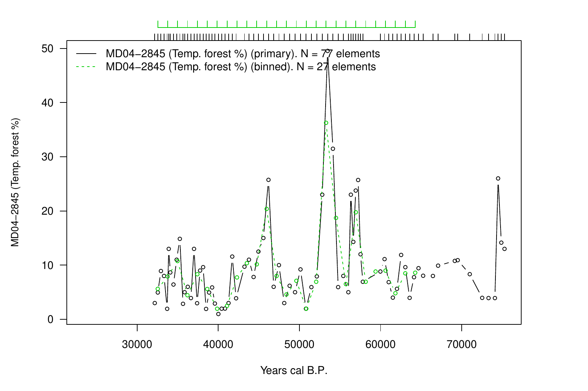</td>
<td style="text-align: left;">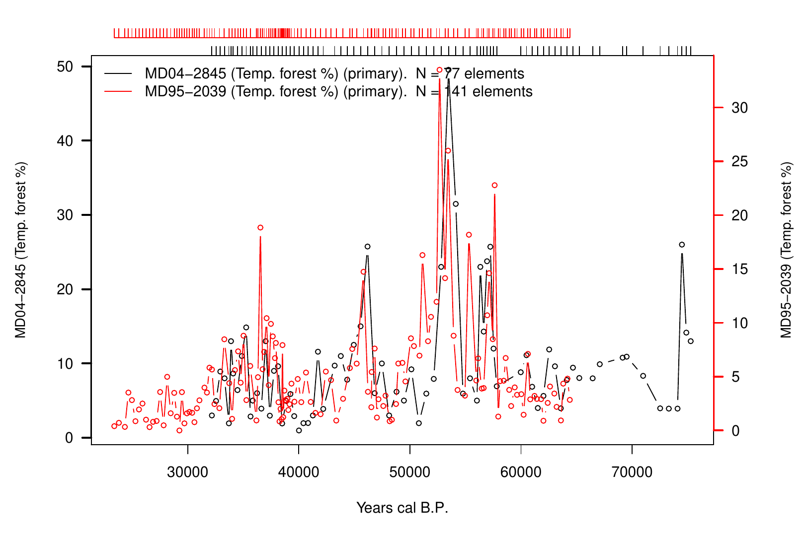</td>
</tr>
<tr class="odd">
<td style="text-align: left;">B)</td>
<td style="text-align: left;">D)</td>
</tr>
<tr class="even">
<td style="text-align: left;">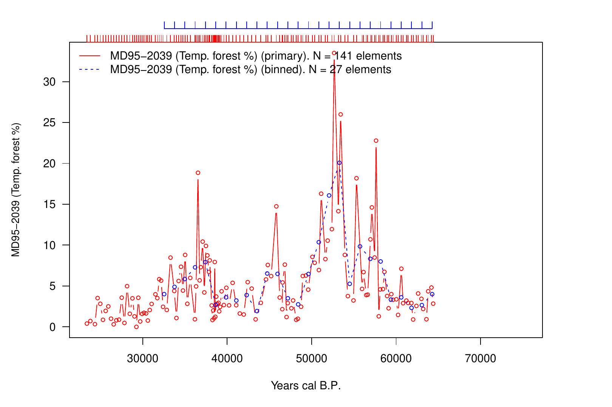</td>
<td style="text-align: left;">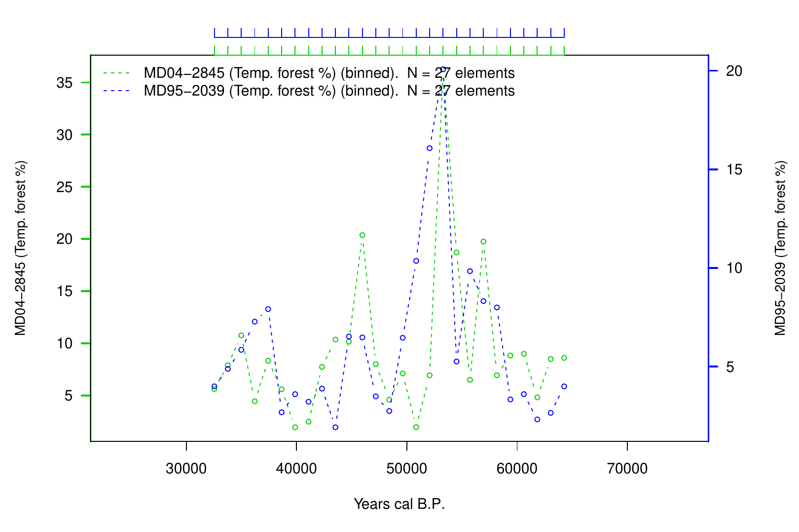</td>
</tr>
</tbody>
</table>
<figcaption>Figure 6: “Primary” (unevenly spaced) and binned pollen time
series under analysis <span class="citation"
data-cites="sanchez-goni_et_al_2017">(<strong>sanchez-goni_et_al_2017</strong>)</span>.
The numbers of elements for both time series are provided in the legend.
The autocorrelation and persistence values for the time series from site
MD04 are <span class="math inline">$\hat{\bar{a}}' = 0.85$</span> and
<span class="math inline"><em>τ̂</em> = 3400</span> years, and those from
site MD95 are <span class="math inline">$\hat{\bar{a}}' = 0.80$</span>
and <span class="math inline"><em>τ</em> = 1300</span> years. The
horizontal top axes indicate the sampling times for the plotted time
series. </figcaption>
</figure>

The code used to generate Figure [6](#figure:plots_pre_aus) is as
follows.

``` r
 # Load the package
 library(BINCOR) 
 library(pracma) 

 # Load the time series under analysis: Example 2 and Figure 6
 data(MD04_2845_siteID31)
 data(MD95_2039_siteID32) 

 # Compute the binned time series though our bin_cor function
 bincor.tmp <- bin_cor(ID31.dat, ID32.dat, FLAGTAU=3, "salida_ACER_ABRUPT.tmp")
 binnedts   <- bincor.tmp$Binned_time_series

 # To avoid NA values
 bin_ts1 <- na.omit(bincor.tmp$Binned_time_series[,1:2])
 bin_ts2 <- na.omit(bincor.tmp$Binned_time_series[,c(1,3)]) 
 
 # Applying our plot_ts function 
 # PDF format
 plot_ts(ID31.dat, ID32.dat, bin_ts1, bin_ts2, "MD04-2845 (Temp. forest)",
 "MD95-2039 (Temp. forest )", colts1=1, colts2=2, colbints1=3, colbints2=4,
 device="pdf", Hpdf=6, Wpdf=9, resfig=300, ofilename="ts_ACER_ABRUPT")
```

The cross-correlation (CCF) analysis obtained with our `ccf_ts` function
is shown in Figure [7](#figure:ccf_acer). Before applying the `ccf_ts`
function, a linear trend was removed from the binned time series by
enabling the `rmltrd` option in `ccf_ts`, and then the residuals were
used. The CCF reveals a high correlation ($r_{xy}$ = 0.53) between the
binned time series at lag 0. The high correlation between the pollen
records from sites MD04-2845 and MD95-2039 reflects similar responses by
vegetation to regional climate variability, particularly to changes in
precipitation and temperature. However, the most noticeable result in
our CCF analysis is that the maximum correlation (r$_{xy}$ = 0.63) is
obtained at lag 1. At face value, this result suggests that pollen
variability at site MD04 leads that observed at site MD95-2039 by 1220
years. Nevertheless, these sites are located relatively close to each
other and are in the same climate domain today, so it is difficult to
envisage such a time difference in the response of vegetation (pollen)
to rapid climatic changes in the past. The most plausible explanation
for this out-of-phase relationship probably lies in the chronological
uncertainties of the age models applied to these records. Despite
best-efforts to harmonise the different time series in the ACER database
using radiometric dating [@sanchez-goni_et_al_2017], the lack of
$^{14}$C dates for site MD95-2039 forced us to build the age model for
this site by tuning the planktic foraminifera and GRIP ice core oxygen
isotopic records [@roucoux_et_al_2005]. This tuning could affect the
time series from site MD95-2039 and introduce unacknowledged
chronological uncertainties [@blaauw_2012; @hu_et_al_2017]. To
summarise, with the present state of data quality we cannot rule out the
idea that timescale uncertainties --rather than climate impact
adaptation -- caused the lag observed.

![Figure 7: Cross-correlation for the residuals of the binned pollen
time series from sites MD04 and MD95 [@sanchez-goni_et_al_2017]. The CCF
correlation coefficients at lag 0 and 1 are 0.53 and 0.63, respectively.
The red line indicates the correlation coefficient for lag 0. Each lag
is equivalent to 1220
years.](./ccf_ID31_ID32_residuals.png){#figure:ccf_acer width="100%"
alt="graphic without alt text"}

The code used to generate Figure [7](#figure:ccf_acer) is the following.

``` r
 # Load packages
 library(BINCOR) 
 library(pracma)

 # Load the time series under analysis: Example 2 and Figure 7 (ID31 vs. ID32) 
 data(MD04_2845_siteID31)
 data(MD95_2039_siteID32)
 
 # Compute the binned time series though our bin_cor function
 bincor.tmp <- bin_cor(ID31.dat, ID32.dat, FLAGTAU=3, "salida_ACER_ABRUPT.tmp")
 binnedts   <- bincor.tmp$Binned_time_series

 # To avoid NA values
 bin_ts1 <- na.omit(bincor.tmp$Binned_time_series[,1:2])
 bin_ts2 <- na.omit(bincor.tmp$Binned_time_series[,c(1,3)]) 

 # Applying our ccf_ts function 
 # PDF format
 ccf_acf <- ccf_ts(bin_ts1, bin_ts2, RedL=TRUE, rmltrd="y", device="pdf", Hpdf=6,
 Wpdf=9, resfig=300, ofilename="ccf_ID31_ID32_res") 
```

# Summary {#Conclu}

We present a computational package named *BINCOR* (BINned CORrelation)
that can be used to estimate the correlation between two unevenly spaced
climate time series which are not necessarily sampled at identical
points in time, and between two evenly spaced time series which are not
on the same time grid. *BINCOR* is based on a novel estimation approach
proposed by [@mudelsee_2010]. This statistical technique requires the
concept of nonzero persistence times, thus enabling mixing information
to be recovered, even when the two timescales examined differ
[@mudelsee_2014]. The package contains four functions (`bin_cor`,
`cor_ts`, `ccf_ts` and `plot_ts`) with a number of parameters to obtain
a high degree of flexibility in the analysis. *BINCOR* is programmed in
`R` language and is available from the CRAN repository. The results when
*BINCOR* s applied to real climate data sets suggest that the `R`
package *BINCOR* performs and works properly in detecting relationships
between instrumental and paleoclimate records.

# Acknowledgements {#acknowledgements .unnumbered}

[JMPM was funded by a Basque Government post-doctoral fellowship. MM's
work was supported by the European Commission via Marie Curie Initial
Training Network LINC (project number 289447) under the Seventh
Framework Programme. [Thanks to Charo Sánchez for help to use the
i2BASQUE HPC facilities, to the two anonymous reviewers and Editor
(Olivia Lau) for their input and comments that have improved the quality
of the manuscript. The authors thank the support of the computing
infrastructure of the i2BASQUE (Basque Government) academic network. The
persistence time estimation software is freely available via
<http://www.climate-risk-analysis.com/software/>.]{style="color: black"}]{style="color: black"}
:::
