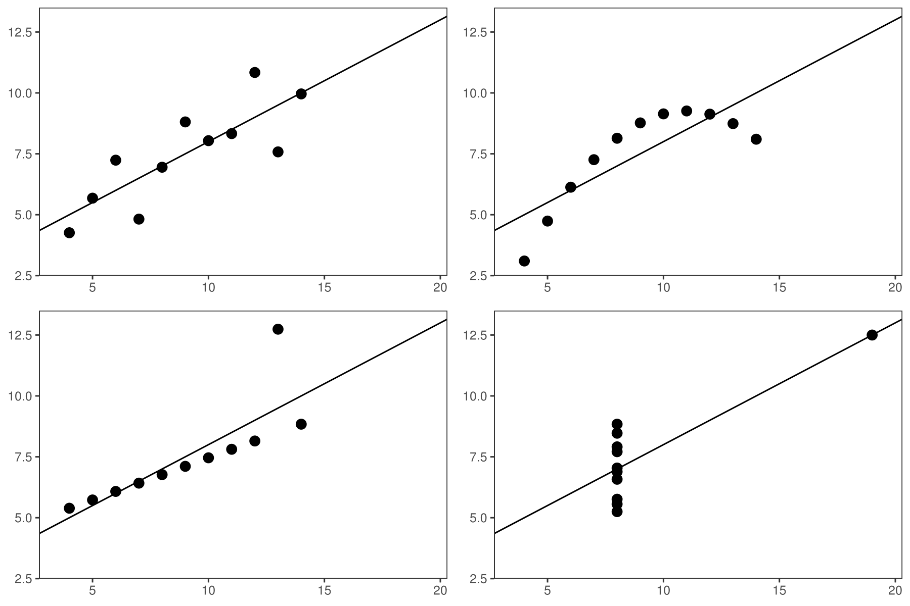
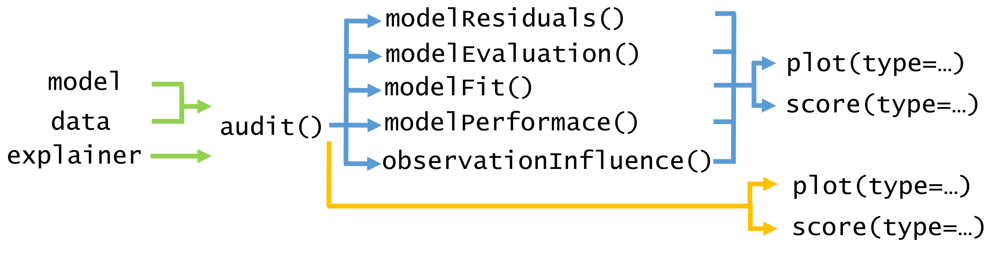
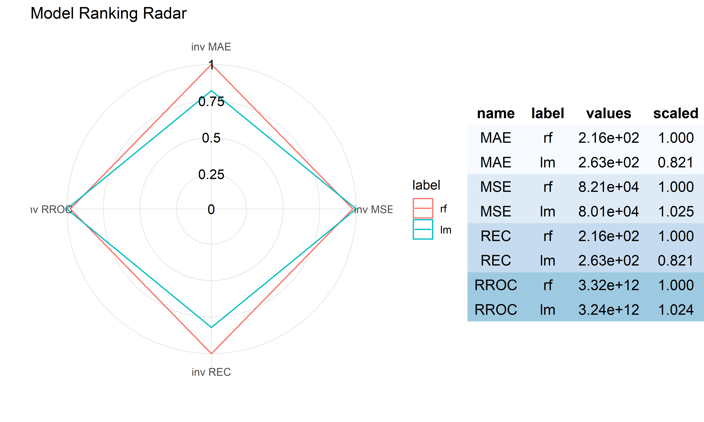
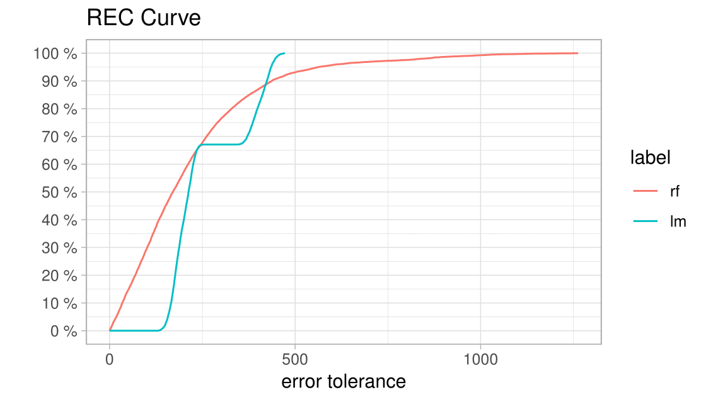
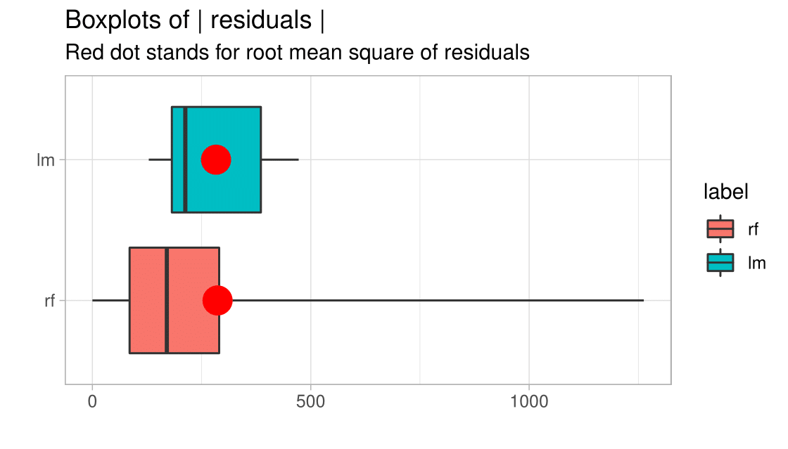
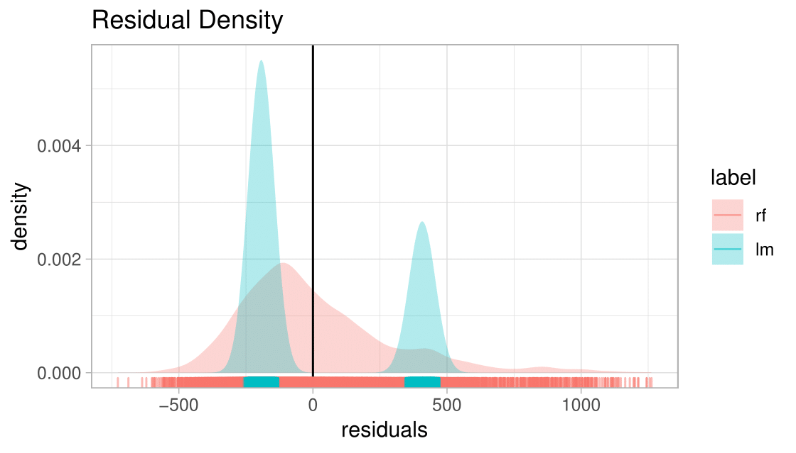
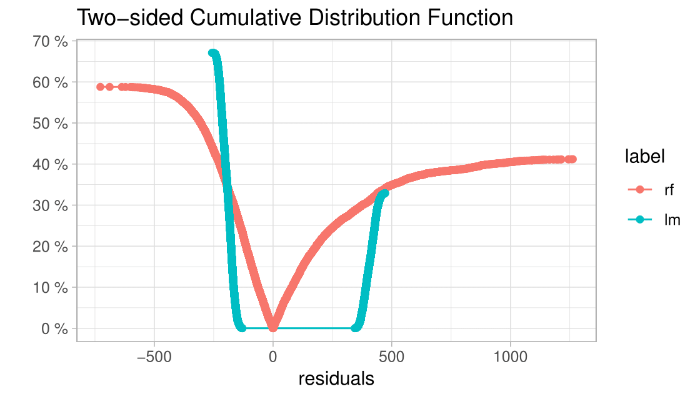

::: article
# Introduction {#introduction-2018-143}

Predictive modeling is a process using mathematical and computational
methods to forecast outcomes. Many algorithms in this area have been
developed and novel ones are continuously being proposed. Therefore,
there are countless possible models to choose from and a lot of ways to
train a new new complex model. A poorly- or over-fitted model usually
will be of no use when confronted with future data. Its predictions will
be misleading [@sheather2009modern-2018-143] or harmful
[@{O'Neil:2016:WMD:3002861-2018-143}]. That is why methods that support
model diagnostics are important.

Diagnostics are often carried out only by checking model assumptions.
However, they are often neglected for complex machine learning models
and they may be used as if they were assumption-free. Still, there is a
need to verify their quality. We strongly believe that a genuine
diagnosis or an audit incorporates a broad approach to model
exploration. The audit includes three objectives.

-   **Objective 1:** Enrichment of information about model performance.
-   **Objective 2:** Identification of outliers, influential and
    abnormal observations.
-   **Objective 3:** Examination of other problems relating to a model
    by analyzing distributions of residuals, in particular, problems
    with bias, heteroscedasticity of variance and autocorrelation of
    residuals.

In this paper, we introduce the
[*auditor*](https://CRAN.R-project.org/package=auditor) package for R,
which is a tool for diagnostics and visual verification. As it focuses
on residuals[^1] and does not require any additional model assumptions,
most of the presented methods are model-agnostic. A consistent grammar
across various tools reduces the amount of effort needed to create
informative plots and makes the validation more
convenient and available.

<figure id="figure:anscombe-2018-143">

<figcaption>Figure 1: Anscombe Quartet data sets are identical when
examined with he use of simple summary statistics. The difference is
noticeable after plotting the data.</figcaption>
</figure>

Diagnostic methods have been a subject of much research
[@atkinson1985plots-2018-143]. @atkinson2012robust-2018-143 focus on
graphical methods of diagnostics regression analysis.
@LIU201748-2018-143 present an overview of interactive visual model
validation. One of the most popular tools for verification are measures
of the differences between the values predicted by a model and the
observed values [@doi:10.1029/JC090iC05p08995-2018-143]. These tools
include Root Mean Square Error (RMSE) and Mean Absolute Error (MAE)
[@hastie01statisticallearning-2018-143]. Such measures are used for
well-researched and easily interpretable linear model as well as for
complex models such as random forests
[@Ho:1995:RDF:844379.844681-2018-143], gradient-boosted trees
[@DBLP:journals/corr/ChenG16-2018-143], or neural networks
[@MASS-2018-143].

However, no matter which measure of model performance we use, it does
not reflect all aspects of the model. For example, @breiman2001-2018-143
points out that a linear regression model validated only on the basis of
$R^2$ may lead to many false conclusions. The best known example of this
issue is the Anscombe Quartet [@AnscombeQuartet-2018-143]. It contains
four different data sets constructed to have nearly identical simple
statistical properties such as mean, variance, correlation, etc. These
measures directly correspond to the coefficients of the linear models.
Therefore, by fitting a linear regression to the Anscombe Quartet we
obtain four almost identical models (see
Figure [1](#figure:anscombe-2018-143)). However, residuals of these
models are very different. The Anscombe Quartet is used to highlight
that the numerical measures should be supplemented by graphical data
visualizations.

The analysis of diagnostics is well-researched for linear and
generalized linear models. The said analysis is typically done by
extracting raw, studentized, deviance, or Pearson residuals and
examining residual plots. Common problems with model fit and basic
diagnostics methods are presented in @faraway2002practical-2018-143 and
@Harrell:2006:RMS:1196963-2018-143

Model validation may involve both checking the overall trend in
residuals and looking at residual values of individual observations
[@littell2007sas-2018-143]. @galecki2013linear-2018-143 discussed
methods based on residuals for individual observation and
groups of observations.

Diagnostics methods are commonly used for linear regression
[@faraway2004linear-2018-143]. Complex models are treated as if they
were assumption-free, which is why their diagnostics is often ignored.
Considering the above, there is a need for more extensive methods and
software dedicated for model auditing. Many of diagnostic tools, such as
plots and statistics developed for linear models, are still useful for
exploring machine learning models. Applying the same tools to all models
facilitates their comparison.

The paper is organized as follows. Section [2](#relatedwork-2018-143)
summarizes related work and state of the art.
Section [3](#architecture-2018-143) contains an architecture of the
*auditor* package. Section [4](#notation-2018-143) provides the
notation. Selected tools that help to validate models are presented in
Section [5](#audit-2018-143) and conclusions can be found in
Section [6](#conclusions-2018-143).

# Related work {#relatedwork-2018-143}

In this chapter, we overview common methods and tools for auditing and
examining the validity of the models. There are several attempts to
validate. They include diagnostics for predictor variables before and
after model fit, methods dedicated to specific models, and
model-agnostic approaches.

## Data diagnostics before model fitting

The problem of data diagnostics is related to the Objective 2 presented
in the [1](#introduction-2018-143), that is, the identification of
problems with observations. There are several tools that address this
issue. We review the most popular of them.

-   One of the tools that supports the identification of errors in data
    is the [*dataMaid*](https://CRAN.R-project.org/package=dataMaid)
    package [@dataMaid-2018-143]. It creates a report that contains
    summaries and error checks for each variable in data. Package
    [*lumberjack*](https://CRAN.R-project.org/package=lumberjack)
    [@lumberjack-2018-143] provides row-wise analysis. It allows for
    monitoring changes in data as they get processed.
    The [*validatetools*](https://CRAN.R-project.org/package=validatetools)
    [@validatetools-2018-143] is a package for managing validation
    rules.
-   The `datadist` function from
    [*rms*](https://CRAN.R-project.org/package=rms) package
    [@rms-2018-143] computes distributional summaries for predictor
    variables. They include the overall range and certain quantiles for
    continuous variables, as well as distinct values for discrete
    variables. It automates the process of fitting and validating
    several models due to storing model summaries by `datadist`
    function.
-   While above packages use pipeline approaches, there are also tools
    that focus on specific step of data diagnostic. The package
    [*corrgram*](https://CRAN.R-project.org/package=corrgram)
    [@corrgram-2018-143] calculates a correlation of variables and
    displays corrgrams. Corrgrams [@friendly:2002:EDCM-2018-143] are
    visualizations of correlation matrices, that help to identify the
    relationship between variables.

## Diagnostics methods for linear models

As linear models have a very simple structure and do not require high
computational power, they have been and still are used very frequently.
Therefore, there are many tools that validate different aspects of
linear models. Below, we overview the most widely known tools
implemented in R  packages.

-   The [*stats*](https://CRAN.R-project.org/package=stats) package
    provides basic diagnostic plots for linear models. Function `plot`
    generates six types of charts for `"lm"` and `"glm"` objects, such
    as a plot of residuals against fitted values, a scale-location plot
    of $\sqrt{|residuals|}$ against fitted values and a normal
    quantile-quantile plot. These visual validation tools may be
    addressed to the Objective 3 of diagnostic, related to the
    examination of model by analyzing the distribution of residuals. The
    other three plots, that include: a plot of Cook's distances, a plot
    of residuals against leverages, and a plot of Cook's distances
    against $\frac{leverage}{1-leverage}$ may be addressed to
    the identification of influential observations (Objective 1).
-   Package [*car*](https://CRAN.R-project.org/package=car)
    [@car-2018-143] extends the capabilities of *stats* by including
    more types of residuals, such as Pearson and deviance residuals. It
    is possible to plot against values of selected variables and to
    group residuals by levels of factor variables. What is more, *car*
    provides more diagnostic plots such as, among others, partial
    residual plot (`crPlot`), index plots of influence (`infIndexPlot`)
    and bubble plot of studentized residuals versus hat values
    (`influencePlot`). These plots allow for checking both the effect of
    observation and the distribution of residuals, what address to the
    Objective 2 and the Objective 3 respectively.
-   A linear regression model is still one of the most popular tools for
    data analysis due to its simple structure. Therefore, there is a
    rich variety of methods for checking its assumptions, for example,
    the normality of residual distribution and the homoscedasticity of
    the variance.
    The package [*nortest*](https://CRAN.R-project.org/package=nortest)
    [@nortest-2018-143] provides five tests for normality: the
    Anderson-Darling [@anderson1952-2018-143], the Cramer-von Mises
    [@cramer1928composition-2018-143; @von1928wahrscheinlichkeit-2018-143],
    the Kolmogorov-Smirnov [@10.2307/2286009-2018-143], the Pearson
    chi-square [@PearsonTest-2018-143], and the Shapiro-Francia
    [@ShapiroFrancia-2018-143] tests. The
    [*lmtest*](https://CRAN.R-project.org/package=lmtest) package
    [@lmtest-2018-143] also contains a collection of diagnostic tests:
    the Breusch-Pagan [@10.2307/1911963-2018-143], the Goldfield-Quandt
    [@doi:10.1080/01621459.1965.10480811-2018-143] and the
    Harrison-McCabe [@10.2307/2286361-2018-143] tests for
    heteroscedasticity and the Harvey-Collier [@HARVEY1977103-2018-143],
    the Rainbow [@Rainbow-2018-143], and the RESET
    [@10.2307/2984219-2018-143] tests for nonlinearity and misspecified
    functional form. A unified approach for examining, monitoring and
    dating structural changes in linear regression models is provided in
    [*strucchange*](https://CRAN.R-project.org/package=strucchange)
    package [@JSSv007i02-2018-143]. It includes methods to fit, plot and
    test fluctuation processes and F-statistics. The
    [*gvlma*](https://CRAN.R-project.org/package=gvlma) implements the
    global procedure for testing the assumptions of the linear model
    (find more details in @gvlma-2018-143).

    The Box-Cox power transformation introduced by
    @Box64ananalysis-2018-143 is a way to transform the data to follow a
    normal distribution. For simple linear regression, it is often used
    to satisfy the assumptions of the model. Package
    [*MASS*](https://CRAN.R-project.org/package=MASS) [@MASS-2018-143]
    contains functions that compute and plot profile log-likelihoods for
    the parameter of the Box-Cox power transformation.
-   The [*broom*](https://CRAN.R-project.org/package=broom) package
    [@broom-2018-143] provides summaries for about 30 classes of models.
    It produces results, such as coefficients and p-values for each
    variable, $R^2$, adjusted $R^2$, and residual standard error.

## Other model-specific approaches

There are also several tools to generate validation plots for time
series, principal component analysis, clustering, and others.

-   @RJ-2016-060-2018-143 introduced the
    [*ggfortify*](https://CRAN.R-project.org/package=ggfortify)
    interface for visualizing many popular statistical results. Plots
    are generated with
    [*ggplot2*](https://CRAN.R-project.org/package=ggplot2)
    [@ggplot2-2018-143], what makes them easy to modify. With one
    function `autoplot` it is possible to generate validation plots for
    a wide range of models. It works for, among others, `lm`, `glm`,
    `ts`, `glmnet`, and `survfit` objects.
    The [*autoplotly*](https://CRAN.R-project.org/package=autoplotly)
    [@2018arXiv180308424T-2018-143] package is an extension of
    *ggfortify* and it provides functionalities that produce plots
    generated by [*plotly*](https://CRAN.R-project.org/package=plotly)
    [@plotly-2018-143]. This allows for both modification and
    interaction with plots.

    However, *ggorftify* and *autoplotly* do not support some popular
    types of models, for instance, random forests from
    [*randomForest*](https://CRAN.R-project.org/package=randomForest)
    [@randomForest-2018-143] and
    [*ranger*](https://CRAN.R-project.org/package=ranger)
    [@ranger-2018-143] packages.
-   The [*hnp*](https://CRAN.R-project.org/package=hnp) package
    [@JSSv081i10-2018-143] provides half-normal plots with simulated
    envelopes. These charts evaluate the goodness of fit of any
    generalized linear model and its extensions. It is a graphical
    method for comparing two probability distributions by plotting their
    quantiles against each other. The package offers a possibility to
    extend the `hnp` for new model classes. However, this package
    provides only one tool for model diagnostic. In addition, plots are
    not based on *ggplot2*, what makes it difficult to modify them.

## Model-agnostic approach

The tools presented above target specific model classes. The
model-agnostic approach allows us to compare different models.

-   The [*DALEX*](https://CRAN.R-project.org/package=DALEX) (Descriptive
    mAchine Learning EXplanations) [@2018arXiv180608915B-2018-143] is a
    methodology for exploration of black-box models. Main
    functionalities focus on understanding or proving how the input
    variables impact on final predictions. There are also two simple
    diagnostics: reversed empirical cumulative distribution function for
    absolute values of residuals and box plot of absolute values of
    residuals. As methods in the *DALEX* are model-agnostic, they allow
    for comparison of two or more models.
-   The package [*iml*](https://CRAN.R-project.org/package=iml)
    [@iml-2018-143] also contains methods for structure-agnostic
    exploration of model. For example, a measure of a feature's
    importance by calculating the change of the model performance after
    permuting values of a variable.

## Model-agnostic audit

In this paper, we present the *auditor* package for R, which fills out
the part of model-agnostic validation. As it expands methods used for
linear regression, it may be used to verify any predictive model.

# Package Architecture {#architecture-2018-143}

The *auditor* package works for any predictive model which returns a
numeric value. It offers a consistent grammar of model validation, what
is an efficient and convenient way to generate plots and diagnostic
scores. A diagnostic score is a number that evaluates one of the
properties of a model. That might be, for example, an accuracy of model,
an independence of residuals or an influence of observation.

Figure [2](#figure:architecture-2018-143) presents the architecture of
the package. The *auditor* provides 2 pipelines for model validation.
First of them consists of two steps. Function `audit` wraps up the model
with meta-data, then the result is passed to the `plot` or `score`
function. Second pipeline includes an additional step, which consists of
calling one of the functions that generate computations for plots and
scores. These functions are: `modelResiduals`, `modelEvaluation`,
`modelFit`, `modelPerformance`, and `observationInfluence`. Further, we
call them computational functions. Results of these functions are tidy
data frames [@tidy-data-2018-143].

<figure id="figure:architecture-2018-143">

<figcaption>Figure 2: Architecture of the <em>auditor</em>. The blue
color indicates the first pipeline, while orange indicates the second.
Function <code>audit</code> takes model and data or
<code>"explainer"</code> object created with the <em>DALEX</em>
package.</figcaption>
</figure>

Both pipelines for model audit are compared below.

1.  **model %\>% audit() %\>% computational function %\>%
    plot(type=...)**\
    We recommend this pipeline. Function `audit` wraps up a model with
    meta-data used for modeling and creates a `"modelAudit"` object. One
    of the computational functions takes `"modelAudit"` object and
    computes the results of validation. Then, outputs may be printed or
    passed to functions `score` and `plot` with defined type. We
    describe types of plots in Chapter [5](#audit-2018-143). This
    approach requires one additional function within the pipeline.
    However, once created output of the computational function contains
    all necessary calculations for related plots. Therefore, generating
    multiple plots is fast.

2.  **model %\>% audit() %\>% plot(type=...)**\
    This pipeline is shorter than the previous one. The only difference
    is that it does not include computational function. Calculations are
    carried out every time a generic `plot` function is called. Omitting
    one step might be convenient for ad-hoc model analyses.

Implemented types of plots are presented in
Table [1](#table:functions-2018-143). Scores are presented in
Table [2](#table:scores-2018-143). All plots are generated with
*ggplot2*, what provides a convenient way to modify and combine plots.

::: {#table:functions-2018-143}
  ------------------------------------------------------------------------------------------
  Plot                       Function                 plot(type = \...)       Reg.   Class.
  -------------------------- ------------------------ ---------------------- ------ --------
  Autocorrelation Function   `modelResiduals`         `"ACF"`                  \+      \+

  Autocorrelation            `modelResiduals`         `"Autocorrelation"`      \+      \+

  Cooks's Distances          `observationInfluence`   `"CooksDistance"`        \+      \+

  Half-Normal                `modelFit`               `"HalfNormal"`           \+      \+

  LIFT Chart                 `modelEvaluation`        `"LIFT"`                         \+

  Model Correlation          `modelResiduals`         `"ModelCorrelation"`     \+      \+

  Model PCA                  `modelResiduals`         `"ModelPCA"`             \+      \+

  Model Ranking              `modelPerformance`       `"ModelRanking"`         \+      \+

  Predicted Response         `modelPerformance`       `"ModelPerformance"`     \+      \+

  REC Curve                  `modelResiduals`         `"REC"`                  \+      \+

  Residuals                  `modelResiduals`         `"Residual"`             \+      \+

  Residual Boxplot           `modelResiduals`         `"ResidualBoxplot"`      \+      \+

  Residual Density           `modelResiduals`         `"ResidualDensity"`      \+      \+

  ROC Curve                  `modelEvaluation`        `"ROC"`                          \+

  RROC Curve                 `modelResiduals`         `"RROC"`                 \+      \+

  Scale-Location             `modelResiduals`         `"ScaleLocation"`        \+      \+

  Two-sided ECDF             `modelResiduals`         `"TwoSidedECDF"`         \+      \+
  ------------------------------------------------------------------------------------------

  : Table 1: Columns contain respectively: name of the plot, name of the
  computational function, value for `type` parameter of the function
  `plot`, indications whether the plot can be applied to regression and
  classification tasks.
:::

::: {#table:scores-2018-143}
  ---------------------------------------------------------------------------------------
  Score                     Function                 score(type = \...)    Reg.   Class.
  ------------------------- ------------------------ -------------------- ------ --------
  Cook's Distance           `observationInfluence`   `"CooksDistance"`      \+      \+

  Durbin-Watson             `modelResiduals`         `"DW"`                 \+      \+

  Half-Normal               `modelFit`               `"HalfNormal"`         \+      \+

  Mean Absolute Error       `modelResiduals`         `"MAE"`                \+      \+

  Mean Squared Error        `modelResiduals`         `"MSE"`                \+      \+

  Area Over the REC         `modelResiduals`         `"REC"`                \+      \+

  Root Mean Squared Error   `modelResiduals`         `"RMSE"`               \+      \+

  Area Under the ROC        `modelEvaluation`        `"ROC"`                        \+

  Area Over the RROC        `modelResiduals`         `"RROC"`               \+      \+

  Runs                      `modelResiduals`         `"Runs"`               \+      \+

  Peak                      `modelResiduals`         `"Peak"`               \+      \+
  ---------------------------------------------------------------------------------------

  : Table 2: Columns contain respectively: name of a score, name of a
  computational function, value for `type` parameter of function the
  `score`, indications whether the score can be applied to regression
  and classification tasks.
:::

# Notation {#notation-2018-143}

Let us use the following notation:
$x_i = (x_i^{(1)}, x_i^{(2)}, ..., x_i^{(p)}) \in \mathcal{X} \subset \mathcal{R}^{p}$
is a vector in space $\mathcal{X}$, $y_i \in \mathcal{R}$ is an observed
response associated with $x_i$. A single observation we denote as a pair
$(y_i, x_i)$ and $n$ is the number of observations.

Let us denote a model as a function $f: \mathcal{X} \to \mathcal{R}$.
Predictions of the model $f$ for particular observation we shall denote
as
$$f(x_i) = \hat{y_i}.$$
The row residual, or simply the residual, is the difference between the
observed value $y_i$ and the predicted value $\hat{y_i}$. We shall
denote residual of particular observation as
$$r_i = y_i - \hat{y_i}.$$

# Illustrations {#audit-2018-143}

Diagnostics allows for evaluation of different properties of a model.
They may be related to the following questions: Which model has better
performance? Does the model fit data? Which observations are abnormal?
These questions are directly related to the diagnostics objectives
described in the [1](#introduction-2018-143). First of them refers to
the evaluation of a model performance, which was proposed as the
Objective 1. The second question concerns the examination of residuals
distribution (Objective 3). The last one refers to outliers and
influential observations (Objective 2).

In this Section we illustrate chosen validation tools that allow for
exploration of the above issues. To demonstrate applications of the
*auditor*, we use the data set `apartments` available in the *DALEX*
package. First, we fit two models: simple linear regression and random
forest.

``` r
  library("auditor")
  library("DALEX")
  library("randomForest")

  lm_model <- lm(m2.price ~ ., data = apartments)
  set.seed(59)
  rf_model <- randomForest(m2.price ~ ., data = apartments)
```

The next step creates `"modelAudit"` objects related to these two
models.

``` r
  lm_audit <- audit(lm_model, label = "lm", 
                data = apartmentsTest, y = apartmentsTest$m2.price)
  rf_audit <- audit(rf_model, label = "rf", 
                data = apartmentsTest, y = apartmentsTest$m2.price)
```

Below, we create objects of class `"modelResidual"`, which are needed to
generate plots. Parameter `variable` determines the order of residuals
in the plot. When the `variable` argument is set to `"Fitted values"`
residuals are sorted by values of predicted responses. Entering a name
of a variable `"m2.price"` implies that residuals will be in order of
this variable.

``` r
  lm_res_fitted <- modelResiduals(lm_audit, variable = "Fitted values")
  rf_res_fitted <- modelResiduals(rf_audit, variable = "Fitted values")
  
  lm_res_observed <- modelResiduals(lm_audit, variable = "m2.price")
  rf_res_observed <- modelResiduals(rf_audit, variable = "m2.price")
```

## Model Ranking Plot

In this subsection, we propose a Model Ranking plot which compares
models performance across multiple measures (see
Figure [3](#figure:plotModelRanking-2018-143)). The implemented measures
are listed in Table [2](#table:scores-2018-143) in
Chapter [3](#architecture-2018-143). The descriptions of all scores are
in [@2018arXiv180907763G-2018-143].

Model Ranking Radar plot consists of two parts. On the left side there
is a radar plot. Colors correspond to models, edges to values of scores.
Score values are inverted and rescaled to $[0,1]$.

Let us use the following notation: $m_i \in \mathcal{M}$ is a model in a
finite set of models $\mathcal{M}$, where $|\mathcal{M}| = k$,
$score: \mathcal{M} \to \mathbb{R}$ is a loss function for the model
under consideration. Higher values mean worse model performance. The
$score(m_i)$ is a performance of model $m_i$.

::: definition
**Definition 1**. We define the inverted score of model $m_i$ as
$$\label{invscore-2018-143}
    invscore(m_i) = \frac{1}{score(m_i)} \min_{j=1...k}{score(m_j)}.   (\#eq:invscore-2018-143)$$
:::

Models with the larger $invscore$ are closer to the centre. Therefore,
the best model is located the farthest from the center of the plot. On
the right side of the plot is a table with results of scoring. The third
column contains scores scaled to one of the models.

Let $m_l \in \mathcal{M}$ where $l \in \{ 1,2, ..., k \}$ be a model to
which we scale.

::: definition
**Definition 2**. We define the scaled score of model $m_i$ to model
$m_l$ as
$$scaled_l(m_i) = \frac{score(m_l)}{score(m_i)}.$$
:::

As values of $scaled_l(m_l)$ are always between $0$ and $1$, comparison
of models is easy, regardless of the ranges of scores.

The plot below is generated by `plot` function with parameter
`type = "ModelRanking"` or by function `plotModelRanking`. The scores
included in the plot may be specified by `scores` parameter.

``` r
  rf_mp <- modelPerformance(rf_audit)
  lm_mp <- modelPerformance(lm_audit)
  plot(rf_mp, lm_mp, type = "ModelRanking")
```

<figure id="figure:plotModelRanking-2018-143">

<figcaption>Figure 3: Model Ranking Plot. Random forest (red) has better
performance in aspect of MAE and REC scores, while linear model (blue)
is better in aspect of MSE and RROC scores.</figcaption>
</figure>

## REC Curve Plot {#subsection:REC-2018-143}

Regression Error Characteristic (REC) curve (see
Figure [4](#figure:plotREC-2018-143)) is a generalization of Receiver
Operating Characteristic (ROC) curve for binary classification
[@Swets1285-2018-143].

REC curve estimates the Cumulative Distribution Function of the error.
On the x axis of the plot there is an error tolerance. On the y axis
there is an accuracy at the given tolerance level.
@Bi2003RegressionEC-2018-143 define the accuracy at tolerance $\epsilon$
as a percentage of observations predicted within the tolerance
$\epsilon$. In other words, residuals larger than $\epsilon$ are
considered as errors.

Let us consider pairs $(y_i, x_i)$ introduced in the beginning of
Chapter [5](#audit-2018-143). @Bi2003RegressionEC-2018-143 define
an accuracy as follows.

::: {#def:REC-2018-143 .definition}
**Definition 3**. An accuracy at tolerance level $\epsilon$ is given by
$$acc(\epsilon) = \frac{|\{ (x,y): loss(f(x_i),y_i) \leq \epsilon, i = 1,...,n \}|}{n}.$$
:::

REC Curves implemented in the *auditor* are plotted for a special case
of Definition [3](#def:REC-2018-143) where the loss is defined as
$$loss(f(x_i),y_i) = |f(x_i) - y_i| = |r_i|.$$
The shape of the curve illustrates the behavior of errors. The quality
of the model can be evaluated and compared for different tolerance
levels. The stable growth of the accuracy does not indicate any problems
with the model. A small increase of accuracy near $0$ and the areas
where the growth is fast signalize bias of the model predictions.

The plot below is generated by `plot` function with parameter
`type = "REC"` or by `plotREC` function.

``` r
  plot(rf_res_fitted, lm_res_fitted, type = "REC")
```

<figure id="figure:plotREC-2018-143">

<figcaption>Figure 4: REC curve. Curve for linear model (blue) suggests
that the model is biased. It displays poor accuracy when the tolerance
<span class="math inline"><em>ϵ</em></span> is small. However, once
<span class="math inline"><em>ϵ</em></span> exceeds the error tolerance
<span class="math inline">130</span>, accuracy rapidly increases. The
random forest (red) has a stable increase of accuracy when compared to
the linear model. However, there is s fraction of large
residuals.</figcaption>
</figure>

As often it is difficult to compare models on the plot, there is an REC
score implemented in the *auditor*. This score is the Area Over the REC
Curve (AOC), which is a biased estimate of the expected error for
a regression model. As @Bi2003RegressionEC-2018-143 proved, AOC provides
a measure of the overall performance of regression model.

Scores may be obtained by `score` function with `type = "REC"` or
`scoreREC` function.

``` r
  scoreREC(lm_res_fitted)
  scoreREC(rf_res_fitted)
```

## Residual Boxplot Plot

Residual boxplot shows the distribution of the absolute values of
residuals $r_i$. They may be used for analysis and comparison of
residuals. Example plots are presented in
Figure [5](#figure:plotResiualBoxplot-2018-143). Boxplots
[@tukey1977exploratory-2018-143] usually consist of five components. The
box itself corresponds to the first quartile, median, and third
quartile. The whiskers extend to the smallest and largest values, no
further than 1.5 of Interquartile Range (IQR) from the first and third
quartile respectively. Residual boxplots consists of a sixth component,
namely a red dot which stands for Root Mean Square Error (RMSE). In case
of an appropriate model, most of the residuals should lay near zero. A
large spread of values indicates problems with a model.

The plot presented below is generated by `plotResidualBoxplot` or by
`plot` function with parameter `type = ’ResidualBoxplot’` function.

``` r
  plot(lm_res_fitted, rf_res_fitted, type = "ResidualBoxplot")
```

<figure id="figure:plotResiualBoxplot-2018-143">

<figcaption>Figure 5: Boxplots of absolute values of residuals. Dots are
in similar places, hence RMSE for both models is almost identical.
However, the distribution of residuals of these two models is different.
For the linear model (blue), most of the residuals are around the
average. For the random forest (red), most residuals are small.
Nevertheless, there is also a fraction of large residuals.</figcaption>
</figure>

## Residual Density Plot

Residual Density plot detects the incorrect behavior of residuals. An
example is presented in
Figure [6](#figure:plotResidualDensity-2018-143). On the plot, there are
estimated densities of residuals. For some models, the expected shape of
density derives from the model assumptions. For example, simple linear
model residuals should be normally distributed. However, even if
the model does not have an assumption about the distribution of
residuals, such a plot may be informative. If most of the residuals are
not concentrated around zero, it is likely that the model
predictions are biased. Values of errors are displayed as marks along
the x axis. That makes it possible to ascertain whether there are
individual observations or groups of observations with residuals
significantly larger than others.

The plot below is generated by `plotResidualDensity` function or by
`plot` function with parameter `type = "ResidualDensity"`.

``` r
  plot(rf_res_observed, lm_res_observed, type = "ResidualDensity")
```

<figure id="figure:plotResidualDensity-2018-143">

<figcaption>Figure 6: Residual Density Plot. The density of residuals
for the linear model (blue) forms two peaks. There are no residuals with
values around zero. Residuals do not follow the normal distribution,
what is one of the assumptions of the simple linear regression. There is
an asymmetry of residuals generated by random forest (red).</figcaption>
</figure>

## Two-sided ECDF Plot

Two-sided ECDF plot (see Figure [7](#figure:plotTwoSidedECDF-2018-143))
shows an Empirical Cumulative Distribution Functions (ECDF) for positive
and negative values of residuals separately.

Let $x_1, ..., x_n$ be a random sample from a cumulative distribution
function $F(t)$. The following definition comes from
@van2000asymptotic-2018-143.

::: definition
**Definition 4**. The empirical cumulative distribution function is
given by
$$F_n(t) = \frac{1}{n} \sum_{i=1}^n \mathbb{1} \{ x_i \leq t\}.$$
Empirical cumulative distribution function presents a fraction of
observations that are less than or equal to $t$. It is an estimator for
the cumulative distribution function $F(t)$.
:::

On the positive side of the x-axis, there is the ECDF of positive values
of residuals. On the negative side, there is a transformation of ECDF:
$$F_{rev}(t) = 1 - F(t).$$
Let $n_N$ and $n_P$ be numbers of negative and positive values of
residuals respectively. Negative part of the plot is normalized by
multiplying it by the ratio of the $n_N$ over $n_N + n_P$. Similarly,
positive part is normalized by multiplying it by the ratio of the $n_P$
over $n_N + n_P$. Due to the applied scale, the ends of the curves add
up to $100\%$ in total. The plot shows the distribution of residuals
divided into groups with positive and negative values. It helps to
identify the asymmetry of the residuals. Points represent individual
error values, what makes it possible to identify 'outliers'.

The plot below is generated by `plotTwoSidedECDF` function or by `plot`
function with parameter `type = "TwoSidedECDF"`.

``` r
  plot(rf_res_fitted, lm_res_fitted, type = "TwoSidedECDF")
```

<figure id="figure:plotTwoSidedECDF-2018-143">

<figcaption>Figure 7: Two-sided ECDF plot. The plot shows that majority
of residuals for the random forest (red) is smaller than residuals for
the linear model (blue). However, random forest has also fractions of
large residuals.</figcaption>
</figure>

# Conclusion and future work {#conclusions-2018-143}

In this article, we presented the *auditor* package and selected
diagnostic scores and plots. We discussed the existing methods of model
validation and proposed new visual approaches. We also specified three
objectives of model audit (see Section [1](#introduction-2018-143)),
proposed relevant verification tools, and demonstrated their usage.
Model Ranking Plot and REC Curve enrich the information about model
performance (Objective 1). Residual Boxplot, Residual Density, and
Two-Sided ECDF Plots expand the knowledge about the distribution of
residuals (Objective 3). What is more, the latter two tools allow for
identification of outliers (Objective 2). Finally, we proposed two new
plots, the Model Ranking Plot and the Two-Sided ECDF Plot.

We implemented all the presented scores and plots in the *auditor*
package for R. The included functions are based on a uniform grammar
introduced in Figure [3](#architecture-2018-143). Documentation and
examples are available at <https://mi2datalab.github.io/auditor/>. The
stable version of the package is on CRAN, the development version is on
GitHub (<https://github.com/MI2DataLab/auditor>). A more detailed
description of methodology is available in the extended version of this
paper on arXiv: <https://arxiv.org/abs/1809.07763>
[@2018arXiv180907763G-2018-143].

There are many potential areas for future work that we would like to
explore, including more extensions of model-specific diagnostics to
model-agnostic methods and residual-based methods for investigating
interactions. Another potential aim would be to develop methods for
local audit based on the diagnostics of a model around a single
observation or a group of observations.

# Acknowledgements

We would like to acknowledge and thank Aleksandra Grudziąż and Mateusz
Staniak for valuable discussions. Also, we wish to thank Dr. Rafael De
Andrade Moral for his assistance and help related to the *hnp* package.

The work was supported by NCN Opus grant 2016/21/B/ST6/02176.
:::

[^1]: Residual of an observation is the difference between the observed
    value and the value predicted by a model.
