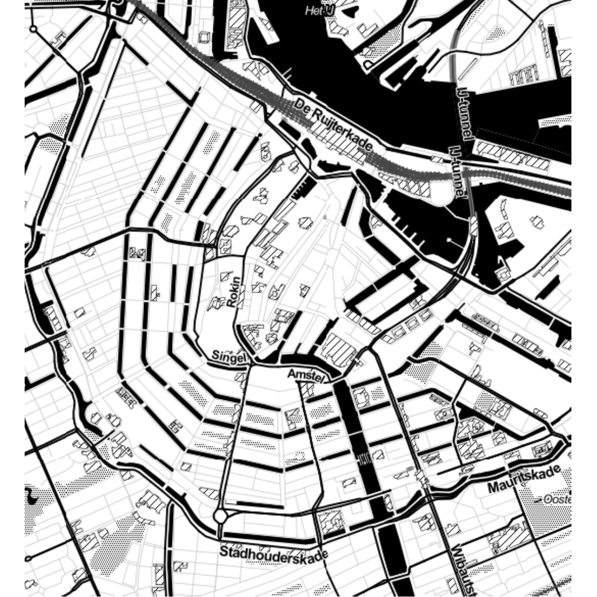
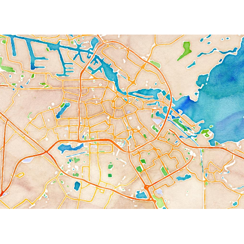
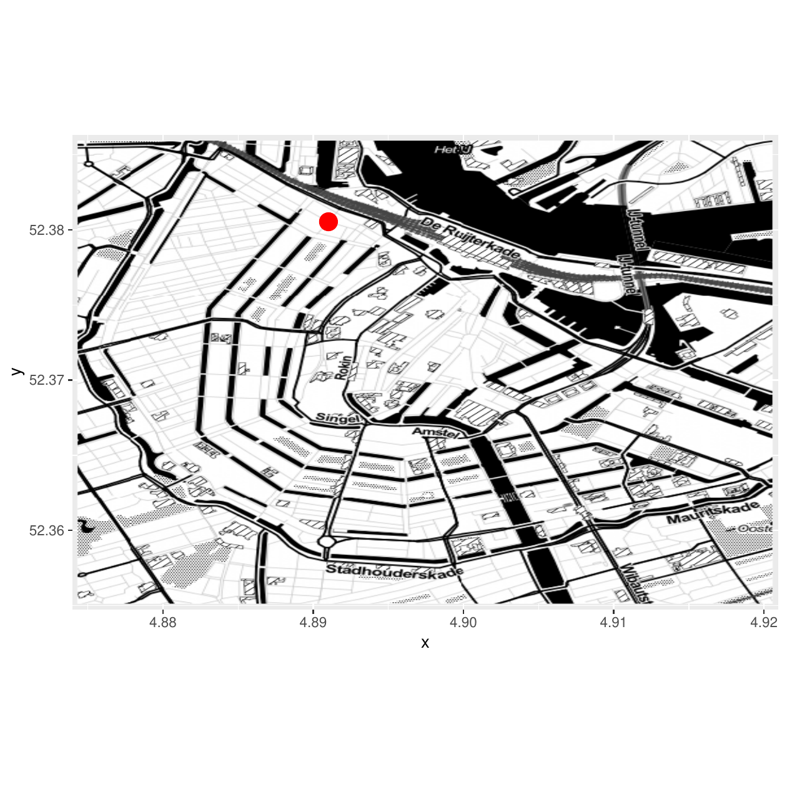
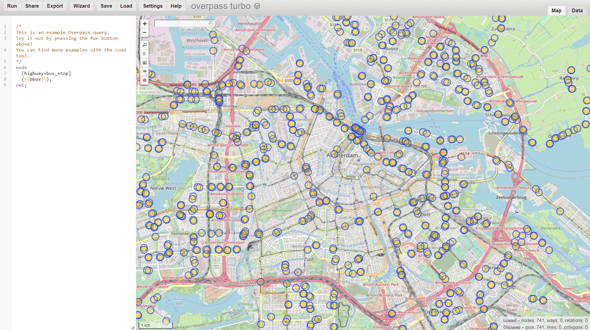

::: article
# Introduction and outline

This paper introduces some interesting web services for downloading,
processing and visualizing geodata. The focus especially in the second
half of the paper is on OpenStreetMap-data, because it is released under
the Open Database License (ODbL) 1.0. That allows multiple uses of the
data [@schmidt2013extraction]. The study of [@barrington2017world] shows
for example, that the data quality available at OSM is already
sufficient in many countries to use it for scientific and analytic
purposes. However, [@barron2014comprehensive] state that the quality of
the OSM-data depends on the individual use case. And
[@grippa2018mapping] mention that it is essential to consider the
variations at regional or national scales. One example of a scientific
analysis based on OSM-data is the Simulation of Urban MObility (SUMO)
project (@behrisch2011sumo). [@meijer2018global] for example use
OSM-data to analyze global patterns of road infrastructure.
[@gervasoni2018convolutional] use OSM-data to generate urban features
that help to estimate population density at a higher resolution.
[@arsanjani2015introduction] give an overview of typical and recent
examples of studies done with OSM-data. Much more research, carried out
in various countries, is listed at [@wiki:research].

The focus is on the most important APIs to download geodata. The
significant advantage of using these specific APIs is that we can obtain
data free of charge. Short examples are used to describe how the data
can be imported into R and processed. Some examples show the easiest and
fastest way to get the information needed. In other examples I look a
bit further behind the scenes. Static maps can be used as background
information for geographic visualization and may be used to highlight
positions of so-called points of interest (poi). A prerequisite to
visualise these points is the availability of their exact spatial
location. With the Overpass API
(<http://wiki.openstreetmap.org/wiki/Overpass_API>) for example, we can
get the positions for many points of interest. This application
programming interface (API) is perfect to download data on very
particular topics. For example, if you are looking for special map
features.

The used API's are listed in the individual sections below. I discuss an
example where I am interested in public transportation in Amsterdam. In
the next section (Background Maps - Download via Map Tile Servers),
hints on the download of static maps from so-called map tile servers are
presented. In the third section (Geocoding with Application Programming
Interfaces (APIs) the functionality of APIs like the Google Maps and OSM
Nominatim API is used to realize geocoding. It is shown, how the
Nominatim API can be used to search OSM-data by name and address
(@el:Nominatim). In the fourth section (Downloading and Importing
OSM-data) I show various possibilities to download more general
OSM-data. The usage of the main OSM-API is presented as well as some
functions of the [*osmdata*](https://CRAN.R-project.org/package=osmdata)
package, which also uses the Overpass API, are described in this
section. Possibilities to process OSM-data with R are presented in the
fifth section (Processing OSM-data). A summary follows at the end.

# Background maps - download via Map Tile Servers

If a background map is needed, it is possible to use a tile server to
download them. Map tiles are quadratic bitmap graphics which are
arranged in a grid to show a map. The vector tile is a newer format
developed recently which is for example used by Mapbox
(<https://www.mapbox.com/>). Vector tiles have a vector representation
(@wiki:vectortiles [p. 1]). The tiles contain vector data instead of the
rendered image and provide readable, descriptive, and extensible content
(@li2018bringing). Vector tiles can be rendered dynamically and allow
for an efficient extraction of the relevant data (@gaffuri2012toward [p.
94]).

So-called map tile servers offer to download static maps of various
types. It is, for example, possible to get maps on such diverse issues
as biking, public transportation, or land shading.[^1] Map Tiles are
very suitable for the use as background image. Various R-packages can be
used to access map tile servers. One way to get static maps is the
package
[*OpenStreetMap*](https://CRAN.R-project.org/package=OpenStreetMap). It
is a package to access high-resolution raster maps using the OSM
protocol [@ma:fellows2]. A high number of satellite, topographic and
road map servers can be accessed directly using the JMapViewer Java
component [@el:JMapViewer]. The used map servers are for example
CloudMade, Mapnik, Bing, Stamen, and MapQuest. The function `openmap`
can be used to retrieve a map. It is necessary to provide values for the
upper left latitude and longitude value as well as for the lower right
values. In the example below, this is done for some coordinates in
Amsterdam. Also, we have to specify the type of source. That may be the
tile server from which to get the map or the uniform resource locator
(URL) pattern. However, OSM servers have limited capacity, and heavy use
adversely affects the purpose of use. With the package
[*OpenStreetMap*](https://CRAN.R-project.org/package=OpenStreetMap), it
is also possible to access other web services. Bing Maps, the web
mapping service provided by Microsoft is one example. In the following
code example, the function `openmap` is used to get a map based on
latitude and longitude coordinates.

We need a geocode to get a map of Amsterdam. In the next section,
geocodes will be explained in more detail. We specify the tile server
with the argument `type`. In this example, OSM is chosen, but a Bing map
would also be possible. The result of this call is visible in
Figure [1](#figure:citycenterAmsterdam).

``` r
library("OpenStreetMap")
map <- openmap(c(52.278174, 4.729242),
               c(52.431064, 5.079162),
               type = "osm")
plot(map)
```

{#figure:citycenterAmsterdam width="100%"
alt="graphic without alt text"}

Stamen is an alternative source. Stamen Design publishes maps under a
Creative Commons license CC BY-3.0 (Attribution). The maps are based on
OSM-data (@lamigueiro2014displaying [p. 95]). We get a Stamen map when
we add further arguments to the `openmap` call. In the following the
source is stamen. The type was specified as toner and watercolor. The
resulting Stamen maps are depicted in
Figure [2](#figure:citycenterAmsterdam2). The downloaded maps are very
suitable as background for info graphics. It is possible to add further
layers using, for example, the
[*ggplot2*](https://CRAN.R-project.org/package=ggplot2) framework
(@ggplot2:wickham). That will be shown later.

``` r
map_stt <- OpenStreetMap::openmap(c(52.385914, 4.874383), c(52.35514, 4.92054),
              type = "stamen-toner")
map_st <- OpenStreetMap::openmap(c(52.278174, 4.729242), c(52.431064, 5.079162),
              type = "stamen-watercolor")
plot(map_st)
plot(map_stt)
```

<figure id="figure:citycenterAmsterdam2">
<p></p>
<figcaption>Figure 2: Static stamen maps of Amsterdam</figcaption>
</figure>

Another package to get static maps is
[*ggmap*](https://CRAN.R-project.org/package=ggmap) (@at:Kahle). This
package provides a collection of functions to visualize spatial data and
models on top of static maps from various online sources, like Google
Maps, OSM, Stamen Maps and CloudMade Map [@at:Kahle]. Only a few lines
of code are necessary to get a map for a freely selectable location. The
default source of [*ggmap*](https://CRAN.R-project.org/package=ggmap) is
the Google Static Maps API, and with the download of these images, you
agree to the terms of usage
(<https://developers.google.com/maps/terms> - @dorman2014learning).
Recently, the Google Maps API terms of use have changed. Now you need an
account to use the API for downloading a static map. The development
version on Github (<https://github.com/dkahle/ggmap>) already has the
function `register_google` where you can define your key. Previously you
have to register your project at
<https://cloud.google.com/maps-platform/>. The function `qmap` is a
wrapper for `ggmap` and `get_map`. It is necessary to specify the place
for which the map should be downloaded and a zoom factor, whereas the
zoom parameter takes values between three and 21. A whole continent is
visible on the map for a zoom factor of three whereas only one building
is on the map for a zoom factor of 21. The default value is ten. In this
case, a city is visible on the map.

The [*RgoogleMaps*](https://CRAN.R-project.org/package=RgoogleMaps)
package can be used for querying OSM servers for static maps in the form
of portable network graphics (PNGs) [@at:Loecher]. Map tiles can be
downloaded using, for example, the command `GetMap.bbox`. In this case,
the center and a zoom level have to be provided. The center is
determined using so-called geocodes. Geocodes are used to specify a
precise location on the map. More information about these codes will be
given in the next section.

Also, it is possible to create interactive maps with online mapping
services. This can be done for example with the R-package
[*leaflet*](https://CRAN.R-project.org/package=leaflet) created by
[@ma:leaflet]. The package can be used to create interactive maps for
websites. These kinds of maps are also known as slippy maps where it is
possible to zoom and pan (@wiki:slippy). That means that the map slips
around when you drag the mouse. Slippy maps in OSM are based on the AJAX
library OpenLayers which is written in JavaScript. Here, the default OSM
tiles can be added to the interactive map visualization. It is also
possible to use Stamen maps or CartoDB as background for slippy maps
(@abernathy2016using [p. 311]). A good starting point for the work with
this package is <https://rstudio.github.io/leaflet/>. In the following
example, the pipe-forward operator of package
[*magrittr*](https://CRAN.R-project.org/package=magrittr) is used which
enables chain operations. The first operation in this chain is the
creation of a leaflet map widget (function `leaflet`). The second
operation is to add a layer (function `addTiles`), and in the last
operation a marker is added (function `addMarkers`). Here we have to
specify the position of the marker and the text that pops up.

``` r
library(leaflet)
leaflet() %>%
  addTiles() %>%  
  addMarkers(lng=4.891013, lat=52.38054, popup = "Amsterdam")
```

Map Tiles are a good possibility for geographic data visualization. They
can be valuable to get a first impression, but these visualizations may
also occlude relevant geodata. Therefore it is useful to know, how to
add further information to the map. In the next section, it is shown how
to append more information to either the static map or the interactive
map. Interactive maps can for example be produced very easily with
[*tmap*](https://CRAN.R-project.org/package=tmap) and
[*mapview*](https://CRAN.R-project.org/package=mapview) (@ma:appelhans)
and many other packages. The functionalities for interactive maps in
both mentioned packages are built on top of the R-package
[*leaflet*](https://CRAN.R-project.org/package=leaflet). The interface
to Javascript allows a very vital exchange. The R-package
[*mapdeck*](https://CRAN.R-project.org/package=mapdeck) is for example a
very suitable tool, for a browser based visualization of geodata. Like
most of the interactive graphics in R this package is also based on a
Javascript library. In this case Mapbox GL JS is used (@Cooley:mapdeck).
Like for package *deckard* (see @{ma::deckard}), the package also
provides access to the Deck.gl framework of Uber
(@lovelacegeocomputation). A registration is necessary to use the
framework. The package [*lawn*](https://CRAN.R-project.org/package=lawn)
provides a client for the geospatial analysis with the javascript
library `Turfjs` (@ma:chamberlain:lawn). That allows us to use for
example Javascript libraries like `geojson-random` and `geojsonhint`,
which can be used to randomly create GeoJSON objects and to color them.
For example the `gr_polygon` function can be used to create an example
object. Then you can plot the object with the generic function `view`.

We have seen in the examples above, that we need a set of coordinates to
locate a point of interest or pop-up. For a study on the transport
system, it is for example good to know which public transport stops
(train or bus stops, etc. ) are located in the surrounding of the area
under research. The geocoding for an address list of these stops can be
done with the Nominatim API of the OSM project. In the next section it
is shown how this geocoding process is done in R.

# Geocoding with Aplication Programming Interfaces (APIs)

Geocoding is the derivation of a structured spatial representation from
textual information like postal codes [@aitchison2009beginning p. 157].
Many possibilities are available to realize geocoding with R. The most
popular is perhaps the usage of interfaces like the Google Maps API. The
API is described in [@svennerberg2010beginning]. It can be accessed
directly from R using the R-package
[*ggmap*](https://CRAN.R-project.org/package=ggmap) [@at:Kahle p. 156].
The [*ggmap*](https://CRAN.R-project.org/package=ggmap)-package was one
of the first R packages to provide an interface for data exchange
between R and the Google Maps API. The process can be implemented using
the `geocode` function. Then we just need an adress to get the
corresponding coordinates. For the example \"Waterlooplein 1, Amsterdam,
Zentrum\" we get the latitude and longitude coordinates visible in
 Table [1](#geoc::tab) as a result of this call.

::: {#geoc::tab}
  -------------------------
      lat        lon
  --- ---------- ----------
    1 4.901323   52.36896

  -------------------------

  : Table 1: Latitude and longitude coordinates of the address
  "Amsterdam, Waterlooplein 1"
:::

The Mercator-projection is used in Google Maps (@moore2008geospatial [p.
206]). The European Petroleum Survey Group Geodesy (EPSG) published a
system of globally unique key numbers of geodetic data records (EPSG
codes). The used coordinate reference system and the projection are
determined using this EPSG codes (<http://epsg.org/>). The EPSG code
used in this example is 3857 (@harris2016quantitative). One of the
issues when using the Google Maps API is that only 2,500 requests per
day can be performed free of charge, which might cause problems with
large data sets. The terms of usage of the API can be seen at
<https://developers.google.com/maps/terms>. It is clear that nobody
should use such an online service to geocode privacy sensitive data. The
[*googleway*](https://CRAN.R-project.org/package=googleway) package also
connects to Google (@{ma::googleway}). To use the package, the
registration and an API key is necessary to use most of the
functionalities. When we have done this, it is for example possible to
query the distance, the elevation or the timezone. Additional
information on the visinity of a point is accessible using for example
the packages *geonames* (<https://github.com/ropensci/geonames>) or
[*RDSTK*](https://CRAN.R-project.org/package=RDSTK).

A less known alternative described here in more detail is the usage of
the [Nominatim API](http://wiki.openstreetmap.org/wiki/Nominatim) of the
OSM project [@warden2011data p. 25]. This tool is an open source system
designed on top of OSM-data to search by name and address
[@clemens2015geocoding]. Nominatim (@el:Nominatim) is the main geocoder
maintained by OSM [@abernathy2016using]. Detailed information on this
geocoder is available at <http://wiki.openstreetmap.org/wiki/Nominatim>.
Similar to the geocoding with the Google Maps API, the service Nominatim
can be used to query the name of the reference object to obtain
corresponding GPS coordinates. When using the Nominatim API, it is
possible to choose between different output formats. We can choose
between HTML, XML, JSON and JSONV2. The
[*RJSONIO*](https://CRAN.R-project.org/package=RJSONIO) and
[*jsonlite*](https://CRAN.R-project.org/package=jsonlite) packages can
be used to import JSON files to R (@ma:templelang and @at:jsonlite). The
core from the following example is the command `fromJSON` of package
[*RJSONIO*](https://CRAN.R-project.org/package=RJSONIO). It converts
JSON content to R objects. The code chunk is designated to get the
corresponding coordinates for the address "Rozengracht 1" in Amsterdam.
With the function `url` we specify a path to be opened. In this case it
is the adress of the Nominatim API <http://nominatim.openstreetmap.org/>
plus some additional information (format and adress details).

``` r
library("RJSONIO")
con <- url("http://nominatim.openstreetmap.org/search?format=json&
addressdetails=1&extratags=1&q=Amsterdam+Niederlande+Rozengracht+1")
geoc <- fromJSON(paste0(readLines(con, warn=F)))
close(con)
```

The result is an object that contains a lot of information. We can get
an overview when we query the names of the first object in `geoc`.

``` r
names(geoc[[1]])
```

``` r
 [1] "place_id"     "licence"      "osm_type"     "osm_id"       "boundingbox" 
 [6] "lat"          "lon"          "display_name" "class"        "type"        
[11] "importance"   "address"      "extratags"   
```

This object contains for example information on the license which is
ODbL 1.0 (<http://www.openstreetmap.org/copyright>). We get the latitude
and longitude coordinates:

``` r
geoloc <- c(geoc[[1]][which(names(geoc[[1]]) == "lat")],
            geoc[[1]][which(names(geoc[[1]]) == "lon")])
```

  ----------------------------
      lat          lon
  --- ------------ -----------
    1 52.3737223   4.8826404

  ----------------------------

  : 

We also get the combination of OSM id and the OSM type, which can be
useful information, when downloading and processing specific OSM-data.
And then we have some key-value pairs, which will be explained below.
The package [*jsonlite*](https://CRAN.R-project.org/package=jsonlite)
can also be used for importing json data:

``` r
link <- url("http://nominatim.openstreetmap.org/search?format=json&
           addressdetails=1&extratags=1&q=Amsterdam+Niederlande+Rozengracht+1")
geoc2 <- jsonlite::fromJSON(link)
geoc2df <- with(geoc2, data.frame(osm_id, lat,lon))
geoc2df$house_number <-  geoc2$address$house_number
```

The dataframe `geoc2df` contains several addresses in the
\"Rozengracht\" street that all start with a one. Parts of the adresses
are visible in the following table.

::: {#ref:tabrozen}
  ---------------------------------------------------------
       osm_id       lat          lon         house_number
  ---- ------------ ------------ ----------- --------------
     1 2721815875   52.3737223   4.8826404   1

     2 2743624072   52.3719482   4.8755534   237-1

     3 2721830930   52.3736673   4.8823914   7-1

     4 2721827922   52.3734021   4.8813371   53-1

     5 2721824637   52.372232    4.8767542   231-1

     6 2721823434   52.3724786   4.8776618   187-1

     7 2721820122   52.3727335   4.8786657   137-1

     8 2721816644   52.3729874   4.8797588   105E-1

     9 2720971311   52.3727658   4.8775263   194-1

    10 2720971056   52.3728019   4.8775994   184-1
  ---------------------------------------------------------

  : Table 2: Adresses for house number with one - \"Rozengracht\"
:::

The package [*tmaptools*](https://CRAN.R-project.org/package=tmaptools)
offers tool functions to supply the workflow to create thematic maps. It
provides the function `geocode_OSM` which is a wrapper for geocoding
using the OSM Nominatim API (@{at::Tennekes2018}). A bounding box can be
created with the `tmap::bb` command. The functions `tmaptools::bb_poly`,
and `osmdata::getbb` are also worth mentioning here, in particular with
regard to extracting bounding polygons rather than mere boxes. In the
following example for function `geocode_OSM` of package
[*tmaptools*](https://CRAN.R-project.org/package=tmaptools) we get only
the coordinates as output because the default value of the argument
`details` is `FALSE`.

``` r
library("tmaptools")
gc_tma <- geocode_OSM("Amsterdam, Buiten Brouwersstraat")
```

::: {#ref:tab1}
  --------------------------------------
          Info   Nominatim   Google Maps
  ------------ ----------- -------------
           CRS   EPSG:4326     EPSG:3857

    Projection    Mercator      Mercator

     Longitude    4.891013      4.900478

      Latitude   52.380541      52.36859
  --------------------------------------

  : Table 3: Result of the geocoding request for a poi in Amsterdam
:::

The result of the request for a postal address in Amsterdam is visible
in Table [3](#ref:tab1) in the second column. A big difference becomes
apparent when we compare the result for Nominatim and the result for
Google Maps API (third column). The projection and the coordinate
reference system (CRS) may be of great importance [@brownmaps]. The
projection is used to display the three-dimensional earth. Typically,
this is a projection onto a two-dimensional map display. Google Maps
uses, for example, the Mercator projection, which is good for zoomed-in
viewing, but causes distortions when zoomed out
(@turner2006introduction). For the Nominatim-query we get EPSG:4326
(@maier2014openstreetmap).

The projection of the data is often necessary for the work with geodata
from different sources, and this is true if we want to combine the
gained information with other geodata, for example, static maps or
satellite pictures. In the following example a transformation is shown.
In a first step we create a `data.frame` which is called `poi`. In a
second step we use the function `coordinates` to set spatial coordinates
and to create a spatial object. Then we set the projection attributes
with the command `proj4string`. In this case we use the epsg projection
4326. Afterwards it is possible to transform the spatial points using
the function `spTransform`.

``` r
library(sp)
poi <- data.frame(lat = gc_tma$coords["x"],
                  lon = gc_tma$coords["y"])
sp::coordinates(poi) <- c("lat", "lon")
sp::proj4string(poi) <- sp::CRS("+init=epsg:4326")
res <- spTransform(poi, CRS("+init=epsg:3035"))
```

We get the following numbers for the coordinates:

``` r
res@coords
      lat     lon
  3973434 3264547
```

A clearer alternative to realize the coordinate reference system
transformation is included in package
[*sf*](https://CRAN.R-project.org/package=sf):

``` r
library(sf)
poi2 <- st_sfc (st_point(gc_tma$coords), crs = 4326)
res2 <- st_transform (poi2, crs = 3035)
```

Further functions are available to switch between reference systems. The
[*OpenStreeetMap*](https://CRAN.R-project.org/package=OpenStreeetMap)
package has the `openproj` function to translate from Mercator to
another coordinate reference system and can be used to create
[*ggplot2*](https://CRAN.R-project.org/package=ggplot2) and base
graphics. [@lovelace2014introduction] present a possibility to transform
the reference system. A whole section in the book of
[@pebesmaSpatialDataScience] is dedicated to this topic. [@brownmaps]
also explains how to work with map projections and coordinate reference
systems in R. More information is available in [@plant2012spatial].
Further, the [*mapmisc*](https://CRAN.R-project.org/package=mapmisc)
package provides projection capabilities and utilities for producing
maps (@brownmaps). The function `projection` supplies information on the
coordinate reference system.

The accessed geocodes might be combined with a static map in the next
step. As already shown, the `openmap` function from package
*OpenStreetMap* can be utilized to download a background map. We have to
re-project the original OSM map, for example with the function
`openproj` from package
[*OpenStreetMap*](https://CRAN.R-project.org/package=OpenStreetMap). The
static map can then be combined with the extracted geocode. The result
is visible in Figure [3](#figure:Waterlooplein).

``` r
poi <- data.frame(lon = gc_tma$coords["x"],
                  lat = gc_tma$coords["y"])
adm_map <- openproj(map_stt,
                    projection = "+proj=longlat +ellps=WGS84 +datum=WGS84 +no_defs")
library(ggmap)
autoplot(adm_map) + geom_point(aes(x = lon, y = lat), data = poi,size=5, col="red") 
```

<figure id="figure:Waterlooplein">
<div class="center">

</div>
<figcaption>Figure 3: Amsterdam, Buiten Brouwersstraat</figcaption>
</figure>

Only the coordinates are available for the download in the Waterlooplein
example. In the following example, the package
[*opencage*](https://CRAN.R-project.org/package=opencage) is used for
geocoding. The Opencage service (<https://opencagedata.com/>) combines
the quality of multiple geocoders in one API. An access token is
necessary to use this geocoder. With the free token, up to 2,500 calls
per day are possible. The command `opencage_forward` can be used for
geocoding. A small part of the information in the resulting object (for
argument `placename = "Amsterdam, Van Woustraat"`), the address
information, is visible in Table [4](#tab:addressinfo). We also get the
suburb, the city district, the city, the state district, the state and
the postcode area in which the object is located.

::: {#tab:addressinfo}
  -------------------------------
                  Value
  --------------- ---------------
             road Van Woustraat

    neighbourhood de Pijp

           suburb Zuid

             city Amsterdam

            state Noord-Holland

         postcode 1017

          country Nederland

     country_code nl
  -------------------------------

  : Table 4: Address information for an object in Amsterdam, Van
  Woustraat.
:::

Reverse geocoding is the counterpart to geocoding. It is the target to
retain additional information from the geocodes. The procedure described
above is reversed. Thus, the starting point is the geocode and the task
is to extract textual information, such as an address or a name, from
these geographic coordinates (@kounadi2013accuracy). The Nominatim API
can be used for this. The function `rev_geocode_OSM` of package
[*tmaptools*](https://CRAN.R-project.org/package=tmaptools) can be used
to realize this. The Nominatim service runs on donated servers. It is
necessary to be careful with the usage. No heavy use is accepted. The
absolute maximum is one request per second. For details on the usage see
<https://operations.osmfoundation.org/policies/nominatim/>. If bulk
geocoding of larger amounts of OSM-data is intended, it is necessary to
look for alternatives. One possibility are third-party providers like
MapQuest
(<https://developer.mapquest.com/documentation/open/nominatim-search/>).
Another possibility is the offline geocoding. The source code of the
Nominatim API is available in the OSM svn repository. The readme is very
detailed and can be used as a step by step guide to set up an offline
geocoder.

As seen above, it is possible to geocode a list of addresses. E.g. with
the Nominatim API. If we want to know in general which objects are
present in a certain map section, we can use the main OSM Api. This is
introduced in the following section.

# Downloading general OSM-data {#sec:overpass}

The 'tagging' scheme is crucial for the work with OSM-data. Its basic
data structures (nodes, ways, and relations) are tagged with a key value
pair [@ramm2011openstreetmap]. Examples of this scheme are given in
Table [4](#tab:addressinfo). A topic, category, or type of feature is
named in the key. The value is used to describe the particular form. For
example, there are numerous OSM objects with key=highway. It can be a
footpath (value=pathway) or a highway (value=motorway). This tagging
scheme is a core part of the OSM project [@haklay2008openstreetmap]. A
list of the available OSM map features is available at
<http://wiki.openstreetmap.org/wiki/Map_Features>.

Three different object types exist in OSM. There are simple nodes or
points. This can be, for example, a public transport stop (`key=highway`
and `value=bus_stop`) or a station where you get potable water for
consumption (key=amenity and `value=drinking_water`). The second object
type is ways. This is a sequence of points that describe, for example,
the course of roads or rivers. The third object type is relations, a
grouping of objects that are logically related (@pruvost2017exploring).

There are several ways to get the OSM data. The Humanitarian Open
Streetmap Team (<https://export.hotosm.org>) offers customized extracts
of up-to-date OSM data. Basically the raw data are offered in
protocolbuffer binary format (PBF) or in extensible markup language
(XML) format. An alternative to download large OSM sections is the
Geofabrik page (<http://download.geofabrik.de/>). Here you can download
current excerpts as well as shapefiles. The shapefile format is a
popular format of spatial vector data for geographic information systems
(GIS). This file type is a geodata format originally developed for
ESRI's ArcView software.

A special feature of the OSM project is that you can not only get
geolocations, but also download individual objects or collections of
objects from OSM. The OSM API version 0.6
(<http://api.openstreetmap.org/api/0.6/>) is optimized for editing. That
means, it is used for fetching and saving raw geodata. It is a REST
(representational state transfer) API. Thus, it is possible to make HTTP
GET calls to the OSM API [@mooney2011accessing]. For more information on
REST APIs and RESTful web service interfaces see for example
[@masse2011rest]. For this paper, it is important that an extract for a
pre-defined area can be retrieved from the OSM database using REST.

It is instructive to see how to parse the information to R. In the
following use case, information for Amsterdam is downloaded to R. We can
get the OSM id using the search function at
<https://www.openstreetmap.org/>. This id is essential for the work with
OSM-data. With the object id it is possible to uniquely identify an
object. In the case below we download information for the relation
Amsterdam, which has the OSM id 47811. The first step is to specify the
correct url. This url is a combination of a fixed part, the address of
the API (<https://www.openstreetmap.org/api/0.6/>) and a variable part
based on the object to be downloaded
([relation/4290854847](relation/4290854847){.uri}). Thus, we need to
know if the object is a node, a way, or a relation. In addtion we need
the object id. In a second part, the file is downloaded from the
Internet using the `download.file` command and saved.

``` r
url2 <-"https://www.openstreetmap.org/api/0.6/node/4290854847"
download.file(url2, "4290854847.xml")
```

It is also possible to save the object as a `.osm` file, a format that
uses the data tree structure of XML (@wiki:osmformat). This format is
human readable due to a clear structure, and it is machine independent
because of exact definitions. But a `.osm` file might be very huge, when
it is decompressed. In the following case information for a node is
downloaded.

``` r
ghURL2<-"https://www.openstreetmap.org/api/0.6/relation/47811"
download.file(ghURL2, "amsterdam.osm")
```

If the interest is in information in the vicinity of a point, we can
download information for a small section. The following example shows
the download for a section around the main train station in Amsterdam. I
used the export function of <https://www.openstreetmap.org/> to download
the section visible in  Figure [4](#figure:amsterdamcentraal) as `.osm`.
The same section can be downloaded using the command `curl_download`
from package [*curl*](https://CRAN.R-project.org/package=curl)
(@{curl::rpackage}). The download of these small map sections are
subject to the OSM API usage policy (@wiki:download and
@wiki:apiusagepolicy).

``` r
library(curl)
uac<-"https://api.openstreetmap.org/api/0.6/map?bbox=4.89359,52.37640,4.90589,52.38172"
curl_download(uac, "amsterdamcentraal.osm")
```

{#figure:amsterdamcentraal
width="100%" alt="graphic without alt text"}

Thus, it is possible to use the OSM API to download all objects in a map
section. The Overpass API can be used to download all elements of a
specific type. The Overpass API written by Roland Olbricht allows
developers to download small extractions of user-generated content from
OSM according to given criteria (@wiki:overpass). Overpass is a
read-only API that provides custom selected parts of the OSM-data. It
can be understood as a database over the web, it uses the fact that OSM
is enriched with additional information ranging from city names to
e.g. locations of street lamps or energy generators
[@schmidt2013extraction]. If it is the target, to get all bus stops in
Amsterdam, then it is possible to download the information from Overpass
Turbo (<https://overpass-turbo.eu/>), using the key highway and the
value bus_stop. An example is depicted in Figure [5](#figure:busstop).
Overpass turbo is a web-based data collection tool for OSM. It runs with
any overpass API query and displays the results on an interactive map
(@wiki:overpassTurbo).

<figure id="figure:busstop">
<div class="center">

</div>
<figcaption>Figure 5: Bus stops in Amsterdam</figcaption>
</figure>

With a query by the client to the API you get the corresponding data.
The API is streamlined for data consumers that need a few elements
within a short time, selected by search criteria like for example type
of objects, location, proximity, tag properties, or combinations of them
[@mongiello2015temporal]. The usage of the Overpass API is especially
advisable if only points of interest for a particular topic and a bigger
section are relevant. It is possible to download the data in GeoJSON,
GPX and KML format. The Keyhole Markup Language (KML) is a language used
to describe geodata. It was used in Google Earth. KML also follows the
XML-syntax. In addition also the raw data can be downloaded form
Overpass Turbo. The package
[*XML*](https://CRAN.R-project.org/package=XML) can be used to access
the API directly from R (@ma:lang).

# Processing OSM-data

In this section the processing of the downloaded OSM-data is presented.
The online book of [@lovelacegeocomputation] gives a very good overview
on tasks like this. In the previous section we have seen how to download
data from the main OSM API. Now we parse the string containing XML
content and generate an R-structure using the function `xmlParse` from
package [*XML*](https://CRAN.R-project.org/package=XML).

``` r
library(XML)
AM <- xmlParse("amsterdam.osm")
```

This XML-file contains information about nodes, ways, and relations. In
a next step, the information has to be extracted. For some OSM objects
there is a lot of tagged information available. But some key-value pairs
are very seldom, whereas the geocode is available for every object. With
the XML Path syntax, it is possible to find XML nodes that match a
particular criterion. You can get the right search criterion by looking
closer at the downloaded XML file. In the following example the typical
OSM key-value pair structure is used to get information about the
downloaded node.

``` r
xpathApply(AM,"//tag[@k = 'population']")
```

In the result we get the population of Amsterdam:

``` r
[[1]]
<tag k="population" v="844952"/> 

attr(,"class")
[1] "XMLNodeSet"
```

The `.osm` files can also be imported using the package
[*sf*](https://CRAN.R-project.org/package=sf). With the function
`st_layers` we can check which layers are available.

``` r
library(sf)
st_layers("amsterdam.osm")
```

``` r
Driver: OSM 
Available layers:
        layer_name       geometry_type features fields
1           points               Point       NA     10
2            lines         Line String       NA      9
3 multilinestrings   Multi Line String       NA      4
4    multipolygons       Multi Polygon       NA     25
5  other_relations Geometry Collection       NA      4
```

In a seond step, the `multipolygons` layer can be imported with the
function `st_read`.

``` r
points_am <- st_read("amsterdam.osm", "points")
```

Sf is the abbreviation for simple features. With the integration of
simple features in R, the international standard ISO 19125-1:2004 was
implemented. This standard describes how geographical information is
handled (@vignette:sf). A feature might be a tree or a building. A
feature may consist of several other features. The same as abouth also
works for an `.xml` file. The outcome is the  Table [5](#layertab) with
the layer names, the geometry type and the number of fields.

``` r
library("sf")
st_layers("4290854847.xml")
```

::: {#layertab}
  -----------------------------------------------------
      name               geomtype                fields
  --- ------------------ --------------------- --------
    1 points             Point                       10

    2 lines              Line String                  9

    3 multilinestrings   Multi Line String            4

    4 multipolygons      Multi Polygon               25

    5 other_relations    Geometry Collection          4
  -----------------------------------------------------

  : Table 5: Available layers in object 4290854847.xml (Driver: osm)
:::

We can also import `.xml` files with the command`st_read`.

``` r
centraal <- st_read("4290854847.xml", "points")
```

The result is information of the the node or point. The function
`st_read` can also be used to import for example the GeoJSON format. The
information in the object `centraal` can be accessed relatively
conveniently with the dollar sign. For example, the coordinates result
from the following command:

``` r
centraal$geometry
```

For a query on the first level of the object `centraal` the first lines
the geometry type, the dimension, the bounding box and the epsg code
results. If we work with simple features we can use the function
`st_transform` from package
[*sf*](https://CRAN.R-project.org/package=sf).

``` r
Geometry set for 1 feature 
geometry type:  POINT
dimension:      XY
bbox:           xmin: 4.90058 ymin: 52.3789 xmax: 4.90058 ymax: 52.3789
epsg (SRID):    4326
proj4string:    +proj=longlat +datum=WGS84 +no_defs
POINT (4.900581 52.3789)
```

If very large excerpts or the entire planet file are downloaded from
OSM, the XML files can become very large. Here the protocolbuffer binary
format (PBF) offers an efficient alternative, which will spread further
in the future (@wiki:pbfformat). It is for example planned to implement
this file format in the
[*osmdata*](https://CRAN.R-project.org/package=osmdata) package. The XML
structure of OSM objects is unfortunately not very intuitive at first
glance. Despite these disadvantages, the XML format still has its
justification, since the use of XML formats is widespread (see for
example @nolan2014xml). In the following I use the command `st_layers`
from [*sf*](https://CRAN.R-project.org/package=sf) to see which layers
are available in the downloaded data.

The [*osmdata*](https://CRAN.R-project.org/package=osmdata) package
provides functionality to download OSM-data using the Overpass API. The
data can be imported as simple features and spatial objects
(@at:osmdata). With this package, it is possible to download information
for one object (node, way or relation) or a collection of objects.

``` r
library(osmdata)
dat_rw <- opq(bbox = 'Amsterdam') %>%
    add_osm_feature(key = 'railway', 
                    value = 'tram_stop') %>%
osmdata_sf()
```

It is obvious and simple to combine the information obtained with
[*osmdata*](https://CRAN.R-project.org/package=osmdata) with further
information to a map. We can e.g. also extract information for other
types of highways. In the following that is done with the package
[*osmplotr*](https://CRAN.R-project.org/package=osmplotr). In a first
step a bounding box is generated with the command `getbb` from
[*osmdata*](https://CRAN.R-project.org/package=osmdata). The functions
`add_osm_feature` and `osmdata_sf` can be used to get the raw XML data
from Overpass API.

``` r
library(osmplotr)
bbox <- getbb("Amsterdam")
dat_pa <- extract_osm_objects(key = 'highway', 
                              value = "primary",
                              bbox = bbox)
dat_sa <- extract_osm_objects(key = 'highway', 
                              value = "secondary",
                              bbox = bbox)
```

The function `osm_basemap` from package
[*osmplotr*](https://CRAN.R-project.org/package=osmplotr) creates a base
OSM plot (@{pkg::osmplotr}).

``` r
map <- osm_basemap(bbox = bbox, bg = c("#F5F5DC"))
map <- add_osm_objects(map, dat_pa, col = c("#00008B"))
map <- add_osm_objects(map, dat_sa, col = "green")
# further objects can be added
print_osm_map(map)
```

In the following figure [6](#figure:tramstopam), the highways with value
cycleway, footway, pedestrian, primary, secondary, tertiary and
residential are used to depict the colored lines.

{#figure:tramstopam
width="100%" alt="graphic without alt text"}

``` r
library(tmap)
qtm(dat_pa$geometry, fill = "#8B1A1A")
```

In the following code chunk I use this object to create an interactive
map with the aforementioned R-package
[*mapview*](https://CRAN.R-project.org/package=mapview).

``` r
library(mapview)
mapview(centraal)
```

In the previous section I downloaded an object and named it
`amsterdamcentraal.osm`. The `.osm`-file (e.g. for the section visible
in Figure [4](#figure:amsterdamcentraal)) can parsed to R with the
function `st_read` from package
[*sf*](https://CRAN.R-project.org/package=sf). With the
[*sf*](https://CRAN.R-project.org/package=sf) package it is possible to
import all available layers of the `.osm` file. We can check which
layers are available with the function `st_layers`. In this case we also
get information on ways and relations:

``` r
library(sf)
st_layers("amsterdamcentraal.osm")
am_cen <- st_read("amsterdamcentraal.osm", "multipolygons")
```

An outcome is an simple feature collection. We can access the
information relatively conveniently with the dollar sign. The first part
of the object contains general information about the geometry type,
bounding box, and EPSG code:

``` r
Simple feature collection with 53 features and 25 fields
geometry type:  MULTIPOLYGON
dimension:      XY
bbox:           xmin: 11.48829 ymin: 48.13825 xmax: 11.5604 ymax: 48.14688
epsg (SRID):    4326
proj4string:    +proj=longlat +datum=WGS84 +no_defs
```

The second part then lists specific information about the individual
features. For example the OSM id and in the last column the geometry we
need for visualization. In Table [6](#tab:tagsamsterdam) we can see the
first rows and some selected columns of the feature table.

::: {#tab:tagsamsterdam}
  -----------------------------------------------------------------------
    osm_id           type building   geometry                          
  -------- -------------- ---------- --------------------------------- --
     56955   multipolygon yes        MULTIPOLYGON (((11.54238 48\...   

    \<NA\>         \<NA\> yes        MULTIPOLYGON (((11.54157 48\...   

    \<NA\>         \<NA\> yes        MULTIPOLYGON (((11.54245 48\...   

    \<NA\>         \<NA\> yes        MULTIPOLYGON (((11.54201 48\...   

    \<NA\>         \<NA\> yes        MULTIPOLYGON (((11.54041 48\...   

    \<NA\>         \<NA\> yes        MULTIPOLYGON (((11.54134 48\...   

    \<NA\>         \<NA\> yes        MULTIPOLYGON (((11.54058 48\...   

    \<NA\>         \<NA\> yes        MULTIPOLYGON (((11.54254 48\...   

    \<NA\>         \<NA\> \<NA\>     MULTIPOLYGON (((11.54276 48\...   

    \<NA\>         \<NA\> yes        MULTIPOLYGON (((11.54038 48\...   
  -----------------------------------------------------------------------

  : Table 6: Table of tags for the imported osm section
:::

A comparison between Table [2](#ref:tabrozen) and
[6](#tab:tagsamsterdam) shows that the level of information varies.
[*sf*](https://CRAN.R-project.org/package=sf) simply calls GDAL, which
only imports the osm_id value of the containing object but discards
values of all members of a MULTIPOLYGON for example. The different
degree of information can therefore be traced back to the definition of
simple features standard. The
[*osmdata*](https://CRAN.R-project.org/package=osmdata) package will
provide an equivalent version of Table [6](#tab:tagsamsterdam) in which
all osm_id values will have been retained.

The number of nodes is bounded at 50,000 as well as the size of the area
[@roick2011volunteered p. 4]. Subsequently, it is possible to work with
the data in the standard R-manner. The data can be converted into
available infrastructure provided by existing R-packages,
e.g. [*sp*](https://CRAN.R-project.org/package=sp) and
[*igraph*](https://CRAN.R-project.org/package=igraph) objects
(@Bivand:sp and @at:csardi).

``` r
houses <- am_cen[!is.na(am_cen$building),]
other_tags <- am_cen[!is.na(am_cen$other_tags),]
```

Based on this information maps can be plotted using either base
graphics, or the plot functions in package
[*sp*](https://CRAN.R-project.org/package=sp). The package
[*tmap*](https://CRAN.R-project.org/package=tmap) by
[@{at::Tennekes2018}] also offers an intuitive and fast way to visualize
this information (see @kolb2016visualizing for a description). With this
package it is possible to create thematic maps with flexibility. In the
following, we use the `tm_shape` command from the
[*tmap*](https://CRAN.R-project.org/package=tmap)-package. So far we
extracted mainly nodes and lines within the specified bounding box. It
is also possible to obtain polygones. In this case, we can use for
instance building as key. Than we subselect the related objects and we
plot them. The result is visible on the right-hand side of
figure [7](#figure:osmarcentraal).

``` r
library(tmap)
tm_shape(houses) + tm_fill("royalblue") + tm_shape(other_tags) + tm_borders("gray")
```

{#figure:osmarcentraal
width="100%" alt="graphic without alt text"}

# Summary

The OSM project offers a great variety of possibilities to access
interesting geo-information. We can combine this data with static maps
(e.g. satellite maps) from the Google Maps API. Thus, it is for example
possible to create valuable visualizations quite fast with the APIs. And
they offer much more possibilities. Very early, there were packages
available in R that could be used to process and display geographic
information. Especially lately, the number of these packages is
increasing.

The map tile servers of the OSM project provide possibilities to work
with static maps in R. They also provide the necessary information to
create interactive maps using the package
[*leaflet*](https://CRAN.R-project.org/package=leaflet). Lately many
packages have been developped based on Javascript libraries like
e.g. [*mapdeck*](https://CRAN.R-project.org/package=mapdeck) and
*deckard*, are a good example of how quickly interactive maps evolve.
With these packages it is possible to create many different interactive
graphics. These kind of visualizations are developing very fast. Already
now there are various fascinating possibilities available, and it is to
be expected that soon many more possibilities will be added.

There are packages available in R to realize geocoding using the
Nominatim API or the Google Maps API. With the Overpass API, it is
possible to obtain useful information for particular points of interest
like restaurants, fuel stations, bakeries and so on. The
[*ggmap*](https://CRAN.R-project.org/package=ggmap) package can be used
to combine and visualize this information. The combination of the OSM
API's with packages like
[*osmdata*](https://CRAN.R-project.org/package=osmdata) allows
downloading collections of objects. The Overpass API is about
downloading information on a specified key-value combination. In
contrast, with the main OSM API you can get all the information
available for a section.

There are already massive amounts of data available free of charge. And
thanks to numerous volunteers, the database is getting better and more
comprehensive. So it is very crucial to handle this treasure of
information with care. If it is the target to work with big data from
OSM, it is highly recommended to install OSM locally and therefore, to
download the whole planet file, or an excerpt. Geofabrik
(<http://www.geofabrik.de/>) may be used for this (@wiki:geofabrik). It
has to be mentioned that the data quality of the information may be
heterogeneous and that the completeness may vary, depending on the
region (see @kounadi2009assessing and @goodchild2012assuring).
:::

[^1]: An overview on the map tile servers is available at
    <http://wiki.openstreetmap.org/wiki/Tileserver>
