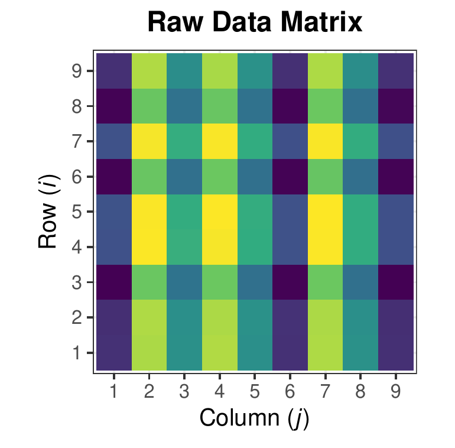
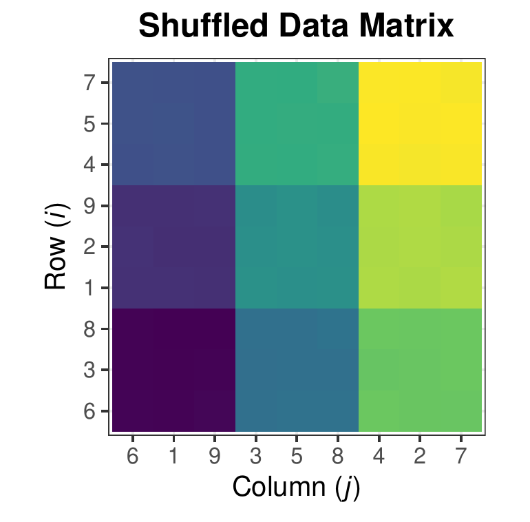

::: article
# Introduction

Traditional (one-way) clustering (such as with complete-link
hierarchical clustering or $k$-means) aims to partition only rows (or
columns) of a data matrix into homogeneous subsets. Rows or columns are
clustered simply based upon their relational similarity to other
observations. Biclustering simultaneously groups rows and columns to
identify homogeneous "cells". Biclustering is known to be NP-hard; as
such, every existing algorithm approaches this problem heuristically.
This methodology was first investigated by [@Hartigan1972] but was not
given much attention until applied to gene expression data [@Cheng2000].
Today, biclustering is applied across many areas such as biomedicine,
text mining, and marketing [@Busygin2008].

For our purposes, we consider rearranging a data matrix to obtain a
checkerboard-like structure where each cell is as homogeneous as
possible. In this regard, our algorithm has the same goal as spectral
biclustering [@Kluger2003], but approaches the problem in a different
way. In contrast to clustering with the end goal being a
checkerboard-like structure, other techniques have been proposed based
on the singular value decomposition [@Lazzeroni2002; @Bergmann2003] and
others are based on a graph-theoretic approach [@Tan2014]. Although each
technique is different, each has the goal of finding substructure within
the data matrix. In Figure [1](#checkerboard) we provide a visual
suggestion of our biclustering goal. The color scheme represents similar
numeric values and our goal is to rearrange the data matrix so that
these values form homogeneous cells.

<figure id="checkerboard">
<p><span><span
class="math inline">→</span> <span></span></p>
<figcaption>Figure 1: Biclustering with <em>checkerboard-like</em>
structure</figcaption>
</figure>

A publicly available R package for biclustering is
[*biclust*](https://CRAN.R-project.org/package=biclust) by
[@Kaiser2008]. This appears to be a commonly used package developed with
the intent of allowing users to choose from a variety of algorithms and
renderable visualizations. Other biclustering packages include
[*superbiclust*](https://CRAN.R-project.org/package=superbiclust),
[*iBBiG*](https://www.bioconductor.org/packages/release/bioc/html/iBBiG.html)
[*QUBIC*](https://www.bioconductor.org/packages/release/bioc/html/QUBIC.html),
[*s4vd*](https://CRAN.R-project.org/package=s4vd),
[*BiBitR*](https://CRAN.R-project.org/package=BiBitR) which each provide
unique algorithms and implementations
[@superbiclust; @iBBiG; @QUBIC; @s4vd; @BiBitR]. However, from an
implementation and algorithmic standpoint, the methods implemented in
these packages fail when given a data matrix with missing values. This
is clearly a limitation since there exist many rectangular datasets with
missing values. For handling missing data, many imputation methods exist
in the literature. While this does produce a complete two-way data
table, which can subsequently be fully analyzed using existing
biclustering algorithms, it has inherent limitations. When large
percentages of data are missing, such as is, for example, common in
plant breeding and movie rating applications to be discussed later, it
is difficult and impossible to reasonably infer missing values. Even if
a small number of values are missing values those are potentially
missing not-at-random due to non-random and unknown devices. For
example, in plant breeding, observation may be missing because it is
unreasonable to plant a crop in a particular environment or simply
because a plant breeder decides to not plant in certain environments. In
these cases, imputing missing values would imply that one can
confidently estimate the performance of (say) crop yield in an
environment where it was never observed growing. There is a large body
of literature on the difficult nature of this problem. With this as
motivation, our goal was to produce a biclustering algorithm which can
successfully deal with data with missing values without applying
imputation or making any assumptions about why data are missing.

# Biclustering with missing data

The package described in this paper,
[*biclustermd*](https://CRAN.R-project.org/package=biclustermd),
implements the biclustering algorithm of [@Li2018] and their paper gives
a thorough explanation of the proposed biclustering algorithm as well as
its applicability. For completeness we give an overview of their
algorithm here.

## Notation

-   $X$ is a data matrix with $I$ rows and $J$ columns. $X_{ij}$ is a
    response measure of row $i$ in column $j$ for
    $i \in \{1, 2, \dots, I\}$ and $j \in \{1, 2, \dots, J\}$.
-   Row index set $\mathcal{I} = \{1, 2, \dots, I\}$ is partitioned into
    $r$ mutually exclusive and exhaustive sets $T_1, T_2, \dots, T_{r}$.
    $\mathcal{Q} \equiv$ partition of the row index set.
-   Column index set $\mathcal{J} = \{1, 2, \dots, J\}$ is partitioned
    into $c$ mutually exclusive and exhaustive sets
    $S_1, S_2, \dots, S_{c}$. $\mathcal{P} \equiv$ partition of the
    column index set.

Our goal for biclustering is to generate a rearranged data matrix with a
checkerboard structure such that each "cell" of the matrix defined by
$\mathcal{Q}$ and $\mathcal{P}$ is as homogeneous as possible. Depending
on specifics of a real problem, "homogeneous" can have different subject
matter meanings, and hence optimization of different objective functions
can be appropriate. We present our algorithm here with the goal of
optimizing a total within-cluster sum of squares given both the row
groups in $\mathcal{Q}$ and column groups in $\mathcal{P}$. This can be
interpreted as the total sum of squared errors between cell means and
data values within cells. Hence we refer to this as SSE. Using the above
notations we have $r$ row groups (or row clusters) and $c$ column groups
(or column clusters). Let $A$ denote an $r \times c$ "cell-average
matrix" with entries
$$\label{cell_matrix}
A_{mn} \equiv \dfrac{1}{\lvert \{X_{i j} : i \in T_m; \; j \in S_n;\; X_{i j } \neq NA\} \rvert} 
\sum\limits_{\{X_{ij} : i \in T_m; \; j \in S_n;\; X_{i j } \neq NA\}} X_{i j}   (\#eq:cell-matrix)$$
for $m \in 1, 2, \dots, r$ and $n \in 1, 2, \dots, c$. Here,
$\lvert \cdot\rvert$ is the set cardinality function and *NA* denotes a
missing value. Then, the within-cluster sum of squares function to be
minimized is
$$\label{SSE}
\text{SSE} \equiv 
\sum\limits_{m,n}\,\,\,
\sum\limits_{\substack{X_{i j} \neq NA\\ i \in T_m \\ j \in S_n}} \left(X_{i j} - A_{mn}\right)^2.   (\#eq:SSE)$$

## Biclustering with missing data algorithm

1.  Randomly generate initial partitions
    $\mathcal{Q}^{\left(  0\right)  }$ and
    $\mathcal{P}^{\left(  0\right)  }$ with respectively $r$ row groups
    and $c$ column groups.

2.  Create a matrix $A^{\left(  0\right)  }$ using Equation
    \@ref(eq:cell-matrix) and the initial partitions. In the event that
    a "cell" $\left(  m,n\right)$ defined by
    $\left\{  \left(  i,j\right)  |i\in T_{m}\text{ and }j\in S_{n}\right\}$
    is empty, $A_{mn}$ can be set to some pre-specified constant or some
    function of the numerical values corresponding to the non-empty
    cells created by the partition. (For example, the mean of the values
    coming from non-empty cells in row $m$ or in column $n$ can be
    used.) This algorithmic step should not be seen as imputation of
    responses for the cell under consideration, but rather only a device
    to keep the algorithm running.

3.  At iteration $s$ of the algorithm, with partitions
    $\mathcal{P}^{\left(
    		s-1\right)  }$ and $\mathcal{Q}^{\left(  s-1\right)  }$ and
    corresponding matrix $A^{\left(  s-1\right)  }$ in hand, for
    $i=1,2,\ldots,I$ let
    $$M_{in}^{R}=\frac{1}{\left\vert \left\{  j\in S_{n}|X_{ij}\neq NA\right\}
    		\right\vert }\sum_{\substack{j\in S_{n}\\\text{s.t. }X_{ij}\neq NA}}X_{ij}%$$
    for each $n=1,2,\ldots,c$ and compute for $m=1,2,\ldots,r$
    $$d_{im}^{R}=\sum_{n=1}^{c}\left(  A_{mn}-M_{in}^{R}\right)  ^{2}\cdot\left\vert
    	\left\{  j\in S_{n}|X_{ij}\neq NA\right\}  \right\vert.$$
    Then create $\mathcal{Q}^{\left(  s\right)  \ast}$ by assigning each
    row $i$ to $T_{m}$ with minimum $d_{im}^{R}$.

4.  If for $\mathcal{Q}^{\left(  s\right)  \ast}$ every $T_{m}$ is
    non-empty, proceed to Step 5. If at least one $T_{m}=\emptyset$ do
    the following:

    1.  Randomly choose a row group $T_{m^{\prime}}$ with $\left\vert
        		T_{m^{\prime}}\right\vert >k_{\text{min}}^{R}$ (a user-specified
        positive integer parameter) and choose
        $k_{\text{move}}^{R}<k_{\text{min}}^{R}$ row indices to move to
        one empty $T_{m}$.  Choose those indices $i$ from
        $T_{m^{\prime}}$ with the largest $k_{\text{move}}^{R}$
        corresponding values of the sum of squares
        $$\sum_{n=1}^{c}\sum_{\substack{j\in S_{n}\\\text{s.t. }X_{ij}\neq NA}}\left(
        		X_{ij}-M_{in}^{R}\right)  ^{2}.$$

    2.  If after the move in (a) no empty row group remains, proceed to
        Step 5. Otherwise return to (a).

5.  Replace $\mathcal{Q}^{\left(  s-1\right)  }$ in Step 3 with the
    updated version of $\mathcal{Q}^{\left(  s\right)  \ast}$ and cycle
    through Steps 3 and 4 $\alpha$ times, where $\alpha$ is a
    user-specified integer parameter. **If `row_shuffles` $> 1$, replace
    $\mathcal{Q}^{(s-1)}$ in 3. with the updated version of
    $\mathcal{Q}^{(s)\ast}$ and cycle through steps 3. and 4.
    `row_shuffles`$- 1$ times.**

6.  Set $\mathcal{Q}^{\left(  s\right)  }=\mathcal{Q}^{\left(  s\right)
    		\ast}$. Then update $A^{\left(  s-1\right)  }$ to
    $A^{\left(  s\right)  \ast
    	}$ using the partitions $\mathcal{Q}^{\left(  s\right)  }$ and
    $\mathcal{P}%
    	^{\left(  s-1\right)  }$ in Equation \@ref(eq:cell-matrix).

7.  For $j=1,2,\ldots,J$ let
    $$M_{jm}^{C}=\frac{1}{\left\vert \left\{  i\in T_{m}|X_{ij}\neq NA\right\}
    		\right\vert }\sum_{\substack{i\in T_{m} \\ \text{s.t.} X_{ij} \neq NA}}X_{ij}$$
    for each $m=1,2,\ldots,r$ and compute for $n=1,2,\ldots,c$
    $$d_{jn}^{C}=\sum_{m=1}^{r}\left(  A_{mn}-M_{jm}^{C}\right)  ^{2}\cdot\left\vert
    	\left\{  i\in T_{m}|X_{ij}\neq NA\right\}  \right\vert.$$
    Then create $\mathcal{P}^{\left(  s\right)  \ast}$ by assigning each
    column $j$ to $S_{n}$ with minimum $d_{jn}^{C}$.

8.  If for $\mathcal{P}^{\left(  s\right)  \ast}$ every $S_{n}$ is
    non-empty, proceed to Step 9. If at least one $S_{n}=\emptyset$ do
    the following:

    1.  Randomly choose a column group $S_{n^{\prime}}$ with $\left\vert
        		S_{n^{\prime}}\right\vert >k_{\text{min}}^{C}$ (a user-specified
        positive integer parameter) and choose
        $k_{\text{move}}^{C}<k_{\text{min}}^{C}$ column indices to move
        to one empty $S_{n}$.  Choose those indices $j$ from
        $S_{n^{\prime}}$ with the largest $k_{\text{move}}^{C}$
        corresponding values of the sum of squares
        $$\sum_{m=1}^{r}\sum_{\substack{i\in T_{m}\\\text{s.t. }X_{ij}\neq NA}}\left(
        		X_{ij}-M_{jm}^{C}\right)  ^{2}.$$

    2.  If after the move in (a) no empty column group remains, proceed
        to Step 9. Otherwise return to (a).

9.  Replace $\mathcal{P}^{\left(  s-1\right)  }$ in Step 3 with the
    updated version of $\mathcal{P}^{\left(  s\right)  \ast}$ and cycle
    through Steps 7 and 8 $\beta$ times, where $\beta$ is a
    user-specified integer parameter. If `col_shuffles` $> 1$, replace
    $\mathcal{P}^{(s-1)}$ in 3. with the updated version of
    $\mathcal{P}^{(s)\ast}$ and cycle through steps 7. and 8.
    `col_shuffles`$- 1$ times.

10. Set $\mathcal{P}^{\left( s \right)} = \mathcal{P}^{\left( s \right)
    		\ast}$ and we have new partitions $\mathcal{Q}^{(s)}$ and
    $\mathcal{P}^{(s)}$. Then update $A^{\left( s \right)  \ast}$ to
    $A^{\left( s \right)  }$ using the partitions
    $\mathcal{Q}^{\left( s \right)}$ and $\mathcal{P}%
    	^{\left( s \right)  }$ in Equation \@ref(eq:cell-matrix).

11. Steps 3--10 are executed $N$ times or until the algorithm converges,
    which is when the Rand Indices for successive row and column
    partitions are both 1. (See the description of the Rand Index
    below.)

Intuitively, our proposed algorithm is nothing more than a rearrangement
of rows and columns with the objective to minimize the objectives given
in Steps 3 and 7. We consider Step 1 (the random generation of initial
cluster assignments) to be of high importance to avoid any bias in the
original structure of the data. As a quantitative way to measure the
effectiveness of our biclustering, we consider the sum of squared errors
(SSE) as the measure of within cell homogeneity. Paired with the SSE, we
allow for three different convergence criteria, the Rand Index
[@Rand1971], the Adjusted Rand Index [@Hubert1985], and the Jaccard
Index [@CIS-3920]. These indices provide measures for the similarity
between two clusterings.

# Overview of *biclustermd*

The *biclustermd* package consists of six main functions with the most
important being `bicluster()`. This function is where the algorithmic
process is embedded and contains numerous tunable parameters.

-   **data**: dataset to bicluster. Must be a data matrix/table with
    only numbers and missing values in the dataset. It should have row
    names and column names.
-   **row_clusters**: The number of clusters to partition the rows into.
    Default is $\left \lfloor{\sqrt{I}}\right \rfloor$
-   **col_clusters**: The number of clusters to partition the columns
    into. Default is $\left \lfloor{\sqrt{J}}\right \rfloor$
-   **missing_val**: Value or function used to represent empty cells of
    the data matrix. If a value, a random normal variable centered at
    itself with standard deviation `miss_val_sd` is used each iteration.
    Note that this is not data imputation but a temporary value used by
    the algorithm.
-   **missing_val_sd**: Standard deviation of the normal distribution
    `miss_val` follows if `miss_val` is a number. By default this equals
    1.
-   **similarity**: The metric used to compare two successive
    clusterings. Can be \"Rand\" (default), \"HA\" for the Hubert and
    Arabie adjusted Rand index or \"Jaccard\". See
    [*clues*](https://CRAN.R-project.org/package=clues) for details.
-   **row_min_num**: Minimum row cluster size in order to be eligible to
    be chosen when filling an empty row cluster. Default is
    $\left \lfloor{I/r}\right \rfloor$.
-   **col_min_num**: Minimum column cluster size in order to be eligible
    to be chosen when filling an empty column cluster. Default is
    $\left \lfloor{J/c}\right \rfloor$.
-   **row_num_to_move**: Number of rows to remove from the sampled
    cluster to put in an empty row cluster. Default is 1.
-   **col_num_to_move**: Number of columns to remove from the sampled
    cluster to put in an empty column cluster. Default is 1.
-   **row_shuffles**: Number of times to shuffle rows in each iteration.
    Default is 1.
-   **col_shuffles**: Number of times to shuffle columns in each
    iteration. Default is 1.
-   **max.iter**: Maximum number of iterations to let the algorithm run.
-   **verbose**: Logical. If TRUE, will report iteration progress.

In the following sections, we provide an overview of the functionality
of *biclustermd*. For the first dataset, we display the array of
visualizations available, in the second example we demonstrate the
impact of numerous tunable parameters, our final example demonstrates
the computational times of our algorithm.

# Example with NYCflights13

For a first example, we will utilize the flights dataset from Wickham's
package
[*nycflights13*](https://CRAN.R-project.org/package=nycflights13)
[@nycflights]. Per the package documentation, `flights` contains data on
all flights in 2013 that departed NYC via JFK, LaGuardia, or Newark. The
variables of interest are `month`, `dest`, and `arr_delay` these are the
rows, columns and response value, respectively. In a dataset such as
this, an application of biclustering would be to determine if there
exist subsets of months and airports with similar numbers of delays.
From a pragmatic perspective, this discovery may allow for air officials
to investigate the connection between these airports and months and why
delays are occurring.

Using functions from
[*tidyverse*](https://CRAN.R-project.org/package=tidyverse)
[@Wickham2016], we generate a two-way data table such that rows
represent months, columns represent destination airports, and the
numeric response values are the average arrival delays in minutes. This
data matrix contains 12 rows (months), 105 columns (destination
airports), and approximately 11.7% missing observations. Below is a
snippet of our data matrix.

``` r
> flights[1:5,1:5]
               ABQ      ACK      ALB ANC       ATL
January         NA       NA 35.17460  NA  4.152047
February        NA       NA 17.38889  NA  5.174092
March           NA       NA 17.16667  NA  7.029286
April    12.222222       NA 18.00000  NA 11.724280
May      -6.516129 3.904762 10.19643  NA  8.187036
```

The first step is to determine the number of clusters for months and the
number of clusters for destination airports. Since we are clustering
months, in this analysis, choosing $r = 4$ row clusters seems reasonable
(create a group for each season/quarter of the year). Although this is
arbitrary, we choose $c = 6$ column clusters. Since this algorithm
incorporates purposeful randomness (by row and column cluster
initialization), `biclustermd()` should be run multiple times keeping
the result with the lowest sum of squared errors (SSE) since it may be
expected that for different initialization one can obtain a different
local minimum [@Li2018].

``` r
> bc <- biclustermd(data = flights, col_clusters = 6, row_clusters = 4,
+                 miss_val = mean(flights, na.rm = TRUE), miss_val_sd = 1,
+                 col_min_num = 5, row_min_num = 3,
+                 col_num_to_move = 1, row_num_to_move = 1,
+                 col_shuffles = 1, row_shuffles = 1,
+                 max.iter = 100)
> bc

Data has 1260 values, 11.75% of which are missing
10 Iterations
Initial SSE = 186445; Final SSE = 82490
Rand similarity used; Indices: Columns (P) = 1, Rows (Q) = 1
```

The output of `biclustermd()` is a list of class "biclustermd" and
"list" containing the following:

-   The two-way table of data provided to the function.
-   The final column and row partition matrices.
-   SSE generated from the initial partitioning.
-   SSE of each iteration, as an "biclustermd_sse" object.
-   Similarity measures for rows and columns for each iteration, as an
    "biclustermd_sim" object.
-   The number of iterations to convergence.
-   A table of resulting cell means.

## Analyzing the NYCflights13 biclustering

The list output of `biclustermd()` is used for rendering plots and to
obtain cell information. One such visual aid is a plot of the
convergence indices versus iteration, given in Figure [2](#figure:ri).
From this graphic, we can determine the rate at which convergence occurs
for both row and column clusters. Moreover, this provides confirmation
that our algorithm can indeed achieve good clusterings along both
dimensions. Plotting of the similarity measures and SSE is done with
`autoplot.biclustermd_sim()` and `autoplot.biclustermd_sse()`, methods
added to `autoplot()` of
[*ggplot2*](https://CRAN.R-project.org/package=ggplot2) [@Wickham2009].

``` r
> autoplot(bc$Similarities, ncol = 3) + 
+   theme_bw() +
+   theme(aspect.ratio = 1) + 
+   scale_x_continuous(breaks = 0:9)
```

{#figure:ri width="100%"
alt="graphic without alt text"}

In addition to the similarity plots, one can utilize the SSE graphic as
an indication of convergence to a (local) minimum biclustering. This can
be seen in Figure [3](#figure:sse). From this we can observe the rate of
decrease of the SSE as well as the relative difference between the first
and final iteration. Observing closely each of the three convergence
criteria suddenly decrease in value along the columns, namely from
iteration three to four. The algorithm is simply (attempting to) obtain
a lower SSE which may result in column shuffles which differ from
iteration to iteration.

``` r
> autoplot(bc$SSE) + 
+   theme_bw() +
+   theme(aspect.ratio = 1) + 
+   scale_y_continuous(labels = comma) + 
+   scale_x_continuous(breaks = 0:9)
```

{#figure:sse width="100%"
alt="graphic without alt text"}

Traditionally visualizations of biclustering plots are in a heat map
fashion. `autoplot.biclustermd()` makes visual analysis of biclustering
results easy by rendering a heat map of the biclustered data and allows
for additional customization. Each of Figure
[4](#figure:bc1)--[7](#figure:bc4) provide an example of the flexibility
of this function. Recall that the algorithm uses purposeful randomness,
so a replicated result may look different.

In Figure [4](#figure:bc1), we provide the default visualization without
additional parameters. The white space represent cells without any
observations which is directly useful for our interpretation, and the
color scale is represented on the same spread as the numerical response.

``` r
> autoplot(bc) +
+   scale_fill_viridis_c(na.value = 'white') +
+   labs(x = "Destination Airport",
+        y = "Month",
+        fill = "Average Delay")
```

{#figure:bc1 width="100%"
alt="graphic without alt text"}

Often it may aid in interpretation to run the data through an $S$-shaped
function before plotting. Two parameter arguments in `autoplot()` are
`transform_colors = TRUE` and `c` where `c` is the constant to scale the
data by before running it through a standard normal cumulative
distribution function. See Figure [5](#figure:bc2) for an illustration.
Applying this transformation, one can immediately notice the distinct
dissimilarity between cells that were not clearly present in Figure
[4](#figure:bc1).

``` r
> autoplot(bc, transform_colors = TRUE, c = 1/15) +
+   scale_fill_viridis_c(na.value = 'white') +
+   labs(x = "Destination Airport",
+        y = "Month",
+        fill = "Average Delay")
```

{#figure:bc2 width="100%"
alt="graphic without alt text"}

To further aid interpretations, we make use of `reorder_biclust` in
Figure [6](#figure:bc3). This command reorders row and column clusters
from increasing to decreasing mean. In our fights dataset, this may be
particularly useful to determine if there is a slow shift in airport
locations moving from a high to low number of delays.

``` r
> autoplot(bc, reorder = TRUE, transform_colors = TRUE, c = 1/15) +
+   scale_fill_viridis_c(na.value = 'white') +
+   labs(x = "Destination Airport",
+        y = "Month",
+        fill = "Average Delay")
```

{#figure:bc3 width="100%"
alt="graphic without alt text"}

Lastly, with large heat maps the authors have found it useful to zoom
into selected row and column clusters. In Figure [7](#figure:bc4), row
clusters three and four and column clusters one and four are shown,
using the `row_clusts` and `col_clusts` arguments of `autoplot()`.
Colors are not transformed.

``` r
> autoplot(bc, col_clusts = c(3, 4), row_clusts = c(1, 4)) +
+   scale_fill_viridis_c(na.value = 'white') +
+   labs(x = "Destination Airport",
+        y = "Month",
+        fill = "Average Delay")
```

{#figure:bc4 width="100%"
alt="graphic without alt text"}

There are two additional visualizations that provide insight into the
quality of each cell: `mse_heatmap()` and `cell_heatmap()`.
`mse_heatmap()` gives the mean squared error (MSE) of each cell. Here,
MSE is defined as the mean squared difference between data values and
the mean in each cell. Whereas `cell_heatmap()` provides a heatmap with
the total number of observations in the given cell. Combined, these
tools provide valuable insight into the homogeneity of each cell.

``` r
> mse_heatmap(bc) +
+   theme_bw() +
+   scale_fill_viridis_c() +
+   labs(fill = "Cell MSE") +
+   scale_x_continuous(breaks = 1:6)
```

{#figure:mse_hm_NYC width="100%"
alt="graphic without alt text"}

``` r
> cell_heatmap(bc) +
+   theme_bw() +
+   scale_fill_viridis_c()
```

{#figure:cell_hm_NYC width="100%"
alt="graphic without alt text"}

Finally, for interpretation purposes, retrieving row or column names and
their corresponding clusters is easily done using the `biclustermd`
method of `row.names()` (for rows) and use of a new generic
`col.names()` and its method `col.names.biclustermd()` (for columns).
Two final examples are given below showing the output of each function,
which have class `data.frame`.

``` r
> row.names(bc) %>% head()
  row_cluster     name
1           1  January
2           1    April
3           2 February
4           2    March
5           2   August
6           3      May
```

``` r
> col.names(bc) %>% head()
  col_cluster name
1           1  ABQ
2           1  ACK
3           1  AUS
4           1  AVL
5           1  BGR
6           1  BQN
```

## Further capabilities

As previously mentioned, due to the purposeful randomness of initial row
and column clusterings, multiple runs of the algorithm can produce
different results. Hence it is recommended to perform several trials
(with various parameters) and store the result which obtains the lowest
SSE. These multiple runs can easily be done in parallel using the
`tune_biclustermd()` function with the parameters as listed below. To
utilize this, first a tuning grid must be defined as an input for
`tune_biclustermd()`. Below we provide an illustration of the process.

-   **data**: Dataset to bicluster. Must to be a data matrix with only
    numbers and missing values in the data set. It should have row names
    and column names.
-   **nrep**: dataset to bicluster. The number of times to repeat the
    biclustering for each set of parameters. Default 10.
-   **parallel** : Logical indicating if the user would like to utilize
    the `foreach` parallel backend. Default is FALSE.
-   **ncores**: The number of cores to use if parallel computing.
    Default 2.
-   **tune_grid**: A data frame of parameters to tune over. The column
    names of this must match the arguments passed to `biclustermd()`.

``` r
> flights_grid <- expand.grid(
+   row_clusters = 4,
+   col_clusters = c(6, 9, 12),
+   miss_val = fivenum(flights),
+   similarity = c("Rand", "Jaccard")
+ )
```

``` r
> flights_tune <- tune_biclustermd(
+   flights,
+   nrep = 10,
+   parallel = TRUE,
+   tune_grid = flights_grid
+ )
```

The output of `tune_biclustermd()` is a list of class "biclustermd" and
"list" containing the following:

-   **best_combn**: The best combination of parameters
-   **best_bc**: The minimum SSE biclustering using the parameters in
    `best_combn`
-   **grid**: `tune_grid` with columns giving the minimum, mean, and
    standard deviation of the final SSE for each parameter combination
-   **runtime**: CPU runtime & elapsed time.

Users can easily identify which set of tuning parameters gives the best
results and corresponding performance with the below code. The minimum
SSE is obtained when 12 column clusters are used, the missing value used
is $-34$, and the Rand similarity is used. A minimum SSE of 70,698 was
obtained in the 10 repeats with that combination, which is a 16%
reduction in SSE from our original parameter guesses above. Due to the
unsupervised nature of biclustering, ultimately, it is the user's
responsibility to choose reasonable number of row and column clusters
for interpretations. Each domain and application of biclustering may
lead to a different number of desired row or column clusters for a given
array size. We simply utilize the SSE and convergence criteria as
quantitative measures in determining the quality of the biclustering
result.

``` r
 > flights_tune$grid[trimws(flights_tune$grid$best_combn) == '*',]
    row_clusters col_clusters miss_val similarity  min_sse mean_sse  sd_sse best_combn
  3            4           12      -34       Rand 70697.95 76581.85 4934.83 *         
```

Any of the previously discussed exploratory functions can be used on the
biclustering fit with the best tuning parameters by accessing the
`best_bc` element of `flights_tune` since it is a biclustermd object:

``` r
 > flights_tune$best_bc
 Data has 1260 values, 11.75% of which are missing
 8 Iterations
 Initial SSE = 184165; Final SSE = 69586
 Rand similarity used; Indices: Columns (P) = 1, Rows (Q) = 1
```

Finally, *biclustermd* also possesses a method for `gather()`
[@Wickham2019] which provides the name of the row and column a data
point comes from as well as its corresponding row and column group
association. This is particularly useful since we can easily determine
the cell membership of each row and column to do further analysis.
Namely, given these associations one can further analyze the quality of
each cell and paired with domain knowledge of their data make informed
judgments about the value of the biclustering. The following output was
created from `flights_tune$best_bc`.

``` r
> gather(flights_tune$best_bc) %>% head()
    row_name col_name row_cluster col_cluster bicluster_no    value
  1  January      ABQ           1           1            1       NA
  2    March      ABQ           1           1            1       NA
  3    April      ABQ           1           1            1 12.22222
  4  January      ACK           1           1            1       NA
  5    March      ACK           1           1            1       NA
  6    April      ACK           1           1            1       NA
```

# Example with soybean yield data

For our next example, we perform biclustering on a dataset which has a
larger fraction of missing data to further show the practicability of
our algorithm. Using data from a commercial soybean breeding program, we
consider 132 soybean varieties as rows, 73 locations as columns, and
yield in bushels per acre as the response. The locations span across the
Midwestern United States and includes parts of Illinois, Iowa,
Minnesota, Nebraska, and South Dakota, and each of the 132 soybean
varieties represent a different genetic make-up. As one can imagine, not
every soybean is grown in each location, as such we obtain a dataset
with approximately 72.9% missing values. One application of a dataset
such as this would be to determine if there are some subset of soybeans
that perform consistently better (or worse) in some locations than
others. From a plant breeding perspective, it is of vital importance to
understand the relationship between the genetics and environments of
crops, and identifying cells non-overlapping homogeneous cells from
biclustering can provide insights into this matter [@Malosetti2013].

The main purpose of this dataset is to demonstrate our algorithm on a
dataset with a large amount of missing values as well as show the
usefulness of the tuning parameters. Below is our first trial on the
soybean yield data where we partition into 10 column clusters, 11 row
clusters, and use the Jaccard similarity measure.

``` r
> yield_bc <- biclustermd(
+   yield, 
+   col_clusters = 10, 
+   row_clusters = 11, 
+   similarity = "Jaccard",
+   miss_val_sd = sd(yield, na.rm = TRUE),
+   col_min_num = 3, 
+   row_min_num = 3
+ )
> yield_bc

Data has 9636 values, 72.9% of which are missing
13 Iterations
Initial SSE = 239166; Final SSE = 51813, a 78.3% reduction
Jaccard similarity used; Indices: Columns (P) = 1, Rows (Q) = 1
```

In observing Figure [10](#figure:ggRI_Yield_Trial_1), we notice that
perfect convergence through the Rand Index, adjusted Rand Index, and
Jaccard similarity; however, the similarities suggest that the columns
converge more quickly than the rows. This may be attributed to the high
percentage of missing values in the rows of the data table. That is, for
each location there is more data available than there is for each
soybean variety. Again we notice decreases in the values for each of the
three indices, but observing Figure [11](#figure:ggSSE_Yield_Trial_1),
we are assured that the algorithm is only making a column/row swap
because a lower SSE is obtainable.

``` r
> autoplot(yield_bc$Similarities, facet = TRUE, ncol = 3, size = 0) + 
+   theme_bw() +
+   theme(aspect.ratio =  1)
```

{#figure:ggRI_Yield_Trial_1 width="100%"
alt="graphic without alt text"}

``` r
> autoplot(yield_bc$SSE, size = 1) + 
+   theme_bw() +
+   theme(aspect.ratio =  1) + 
+   scale_y_continuous(labels = comma)
```

{#figure:ggSSE_Yield_Trial_1
width="100%" alt="graphic without alt text"}

For the initial trial we observe that the Jaccard index converges in 13
iterations to an SSE value of 51,813. To see if it is possible to
decrease this SSE even further, we test the impact of `col_shuffles` and
`row_shuffles`. Recall that these parameters determine how many row and
column rearrangements the algorithm makes before completing *one*
iteration. Below we use `tune_biclustermd()` to test combinations of
`col_shuffles` and `row_shuffles` as well as its corresponding SSE. We
define the tune grid to mimic that of the `yield_bc` creation above, but
let `col_shuffles` and `row_shuffles` take on values in $\{1, 3, 6\}$
independent of each other. We repeat the biclustering ten times for each
parameter, specified by `nrep = 10`. Note that `parallel = TRUE` allows
us to tune over the grid in parallel.

``` r
> yield_tbc <- tune_biclustermd(
+   yield, 
+   nrep = 10,
+   tune_grid = expand.grid(
+     col_clusters = 10,
+     row_clusters = 11,
+     similarity = "Jaccard",
+     miss_val_sd = sd(yield, na.rm = TRUE),
+     col_min_num = 3, 
+     row_min_num = 3,
+     row_shuffles = c(1, 3, 6), 
+     col_shuffles = c(1, 3, 6)
+   ),
+   parallel = TRUE,
+   ncores = 2
+ )
> yield_tbc$grid[, c('row_shuffles', 'col_shuffles', 'min_sse', 'sd_sse', 'best_combn')]
    row_shuffles col_shuffles  min_sse   sd_sse best_combn
  1            1            1 51202.74 2640.662           
  2            3            1 54073.92 2766.218           
  3            6            1 52203.23 3198.391           
  4            1            3 51296.99 1883.676           
  5            3            3 52869.85 2118.745           
  6            6            3 50530.38 2107.578 *         
  7            1            6 51442.19 1895.268           
  8            3            6 52111.31 2015.416           
  9            6            6 52870.18 2652.400                  
```

# Algorithm time study with movie ratings data

For our last example, we focus our attention on a movie ratings dataset
obtained from MovieLens [@Harper2015]. If we consider movie raters as
defining rows, movies as defining columns, and a rating from 1--5 (with
5 being the most favorable) as a response, then biclustering can be used
to determine subsets of raters who have similar preferences towards some
subset of movies.

The main topic of this section will be to perform time studies to test
the scalability of our proposed algorithm. In some applications, it is
not uncommon to have a two-way data table with 10,000+ rows or columns.
Intuitively as the dimensions of the two-way data table increases so
will the computational time. In it is not uncommon for other
biclustering algorithms to run for 24+ hours [@Oghanbian2014]. We ran
the biclustering over a grid of 80 combinations of $I$ rows, $J$
columns, $r$ row clusters, and $c$ column clusters with 30 replications
for each combination. In addition to the four grid parameters, we
consider the following metrics which are byproducts of the four
parameters: the size of the dataset $N = I \times J$, average row
cluster size $I / r$, and average column cluster size $J / c$. Table
[1](#table:moviegrid) summarizes the grid parameters, their byproducts
and the defined lower and upper limits on each.

::: {#table:moviegrid}
  --------------------------------------------------------------------------------
                  $N = I \times J$     $I$     $J$   $r$   $c$   $I / r$   $J / c$
  ------------- ------------------ ------- ------- ----- ----- --------- ---------
  Lower Limit                2,500      50      50     4     4         5         5

  Min                       18,146      86      98     4     4         5         5

  Mean                     665,842     784     839    42    45        49        47

  Max                    1,929,708   1,495   1,457   239   258       293       346

  Upper Limit            2,225,000   1,500   1,500   300   300       375       375
  --------------------------------------------------------------------------------

  : Table 1: Summary of the movie data runtime grid with defined lower
  and upper limits
:::

Table [2](#table:runtimes) gives a five number summary and the mean
runtime in seconds paired with the parameters which produced run times
closest to each statistic. In all, we see that the algorithm can take
less than a second to run, while in the other extreme the algorithm
requires 39 minutes to converge. It is particularly interesting that for
the two parameter combinations closest to the median run time, one
dataset is nearly twice the size of the other. Furthermore, note than
the mean run time is more than twice that of the median, but the size of
the dataset is just 38% of that at the median. However, at the mean,
$3744 = 72 \cdot 52$ biclusters are computed, while at the medians, only
$80 = 20 \cdot 4$ and $481 = 13 \cdot 37$ biclusters are computed. For a
visual summary of the results, we point the reader to Figure
[12](#figure:time_pairs).

::: {#table:runtimes}
  ---------------------------------------------------------------------
             Seconds     $I$     $J$         $N$   $r$   $c$   Sparsity
  -------- --------- ------- ------- ----------- ----- ----- ----------
  Min            0.4     210      98      20,580    10     9      96.2%

  Q1            24.7     820     184     150,880    53    12      98.2%

  Median        63.6     988   1,240   1,225,120    20     4      98.5%

  Median        63.5     501   1,302     652,302    13    37      98.0%

  Mean         137.5   1,084     427     462,868    72    52      98.4%

  Q3           141.0     485     875     424,375    36   126      98.0%

  Max        2,369.0   1,495   1,233   1,843,335   147   204      98.5%
  ---------------------------------------------------------------------

  : Table 2: Five number summary and mean runtime in seconds along with
  parameters achieved at
:::

Figure [12](#figure:time_pairs) plots run times versus the five
parameters controlled for in the study as well as average row cluster
size, average column cluster size, and sparsity. We encourage the reader
to personally explore the results; the run time data is the `runtimes`
dataset in the package. Moreover, [@Li2018], provides further insights
into the effect of sparsity on runtimes.

{#figure:time_pairs width="100%"
alt="graphic without alt text"}

Finally, we address the trade-off between interpretability and
computation time. Figure [13](#figure:time_clust_sizes) plots elapsed
time versus average cluster size on a doubly $\log10$ scales for row
clusters (left) and column clusters (right). Clearly, computation time
can be decreased by increasing the average cluster size, but doing so
potentially reduces the interpretability of results; biclusters may be
too large for certain use cases. Keeping in mind that the $y$-axis is on
a $\log10$ scale, increasing average cluster size will have diminishing
returns. Reviewing the plot on the right-hand side of the second row and
the left-hand side of row three in Figure [12](#figure:time_pairs) sheds
more light into this notion.

{#figure:time_clust_sizes width="100%"
alt="graphic without alt text"}

# Summary

Based on the work of [@Li2018] we provide a user-friendly R
implementation of their proposed biclustering algorithm for missing data
as well as a variety of visual aids that are helpful for biclustering in
general and biclustering with missing data specifically. The unique
benefit *biclustermd* provides is in its ability to operate with missing
values. Compared to other packages which do not allow incomplete data or
make use of some sort of imputation, we approach this problem with a
novel framework that does not alter the structure of an inputted data
matrix. Moreover, given the tunability of our biclustering algorithm,
users are able to run trials on numerous combinations in an attempt to
best bicluster their data.

# Acknowledgments

This research was supported in part by Syngenta Seeds and by a Kingland
Data Analytics Faculty Fellowship at Iowa State University.
:::
