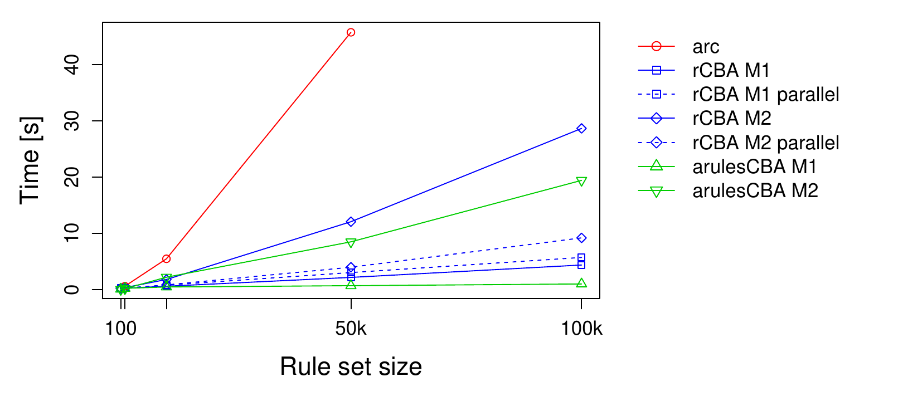
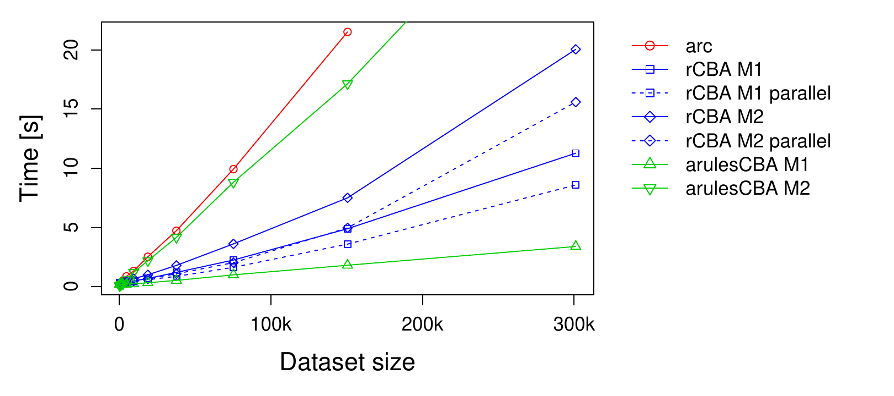

# Introduction {#sec:introduction}

Association rule learning [@arules:Agrawal+Imielinski+Swami:1993] was
initially designed for data exploration to discover interesting patterns
in very large and sparse datasets. Several years after its inception,
association rule learning was also adapted to create rule-based
classification models. The first algorithm called CBA (Classification
Based on Associations) was introduced by
@Liu98integratingclassification. While there were multiple follow-up
algorithms providing some improvements in classification performance
(e.g., CPAR [@Yin03cpar:classification] and FARC-HD-OVO [@farchd2]),
these performance gains are offset by a deterioration of
comprehensibility of the produced set of rules. For some practical
applications, CBA still provides a very good balance between accuracy,
speed, and model comprehensibility. Unlike many more recent approaches,
CBA classifiers are easy to interpret and apply: the resulting ruleset
is relatively small, rules are crisp (i.e., not fuzzy rules), and rules
are sorted according to predictive strength. CBA uses a simple
first-match strategy for classification, where the first matching rule
determines the predicted class.

With the exception of fuzzy approaches such as FARC-HD, associative
classification approaches require a dataset in the form of transactions,
i.e., all attributes need to be binary indicators and thus numeric
attributes in the input data need to be discretized. This puts
additional demands on the user and may deteriorate model fit on datasets
with numerical attributes. Another disadvantage relating to CBA and most
other associative classification approaches is that these algorithms
require the user to specify a minimum support and a minimum confidence
threshold for association rule mining. The performance (accuracy and
speed) is typically very sensitive to a proper selection of these
threshold values. Setting these thresholds too high can result in the
classifier underfitting the dataset or even an empty rule list. Too low
values can lead to a combinatorial explosion with an excessive number of
rules generated, leading to speed and memory issues. Another limitation
that applies specifically to CBA is that even when the user specifies
reasonable thresholds, CBA typically produces more rules than other
related approaches [@alcala2011fuzzy]. These limitations may be the
reason why CBA implementations have not been available in many
computational environments for machine learning and statistics. However,
in the last several years, three packages with CBA implementations
appeared on CRAN (listed by date of the first release):
[*rCBA*](https://CRAN.R-project.org/package=rCBA) [@Kuchar:2018],
[*arc*](https://CRAN.R-project.org/package=arc) [@Kriegr:2018] and
[*arulesCBA*](https://CRAN.R-project.org/package=arulesCBA) [@arulesCBA].
Each of these packages offers some enhancements over the original CBA
algorithm to address some shortcomings of association rule-based
classification.

The goal of this paper is to introduce prospective users to the concepts
used in associative classification and the CBA algorithm in particular.
We provide detailed information on the three available R packages and
the enhancements they provide, followed by hands-on examples.

The paper is organized as follows. We first introduce association rule
mining, followed by a discussion of the CBA algorithm. We present
existing CBA implementations and focus on the features and the use of
the three new R implementations. We conclude with a short comparison of
the features and a run-time comparison on a typical dataset.

# Background: Association rule mining

Associative classifiers like CBA are based on association rules. Mining
association rules was first introduced
by [@arules:Agrawal+Imielinski+Swami:1993] and, following the notation
used by [@arules:Agrawal+Imielinski+Swami:1993], [@arulesbetter] and
[@Tan:2005], can formally be defined as:

Let $\mathbf{D} = \{t_1, t_2, \ldots, t_m\}$ be a set of transactions
called the *database*, and let $I = \{i_1, i_2,\ldots,i_n\}$ be the set
of all *items* considered in the database. Each transaction
in $\mathbf{D}$ has a unique transaction ID and contains a subset of the
items in $I$. To illustrate the concepts, we use a small example from
the supermarket domain introduced by [@arulesbetter]. The set of items
is $I= \{\mathrm{milk, bread, butter, beer}\}$ and a small database
containing five transactions with these items is shown in
Figure [1](#table:supermarket). An example rule for the supermarket
could be $\{\mathrm{milk, bread}\} \Rightarrow \{\mathrm{butter}\}$
meaning that if milk and bread is bought, customers also may buy butter.

<figure id="table:supermarket">
<table>
<caption> </caption>
<thead>
<tr class="header">
<th
style="text-align: center;"><span><strong>transaction</strong></span>
ID</th>
<th style="text-align: left;"><span><strong>items</strong></span></th>
</tr>
</thead>
<tbody>
<tr class="odd">
<td style="text-align: center;">1</td>
<td style="text-align: left;">milk, bread</td>
</tr>
<tr class="even">
<td style="text-align: center;">2</td>
<td style="text-align: left;">bread, butter</td>
</tr>
<tr class="odd">
<td style="text-align: center;">3</td>
<td style="text-align: left;">beer</td>
</tr>
<tr class="even">
<td style="text-align: center;">4</td>
<td style="text-align: left;">milk, bread, butter</td>
</tr>
<tr class="odd">
<td style="text-align: center;">5</td>
<td style="text-align: left;">bread, butter</td>
</tr>
</tbody>
</table>
<figcaption>Figure 1: An example supermarket database with five
transactions.</figcaption>
</figure>

A *rule* is defined as an expression $X \Rightarrow Y$ where $X, Y
\subseteq I$ and $X \cap Y = \emptyset$. The sets of items (for short
*itemsets*) $X$ and $Y$ are called *antecedent* (left-hand-side or LHS)
and *consequent* (right-hand-side or RHS) of the rule. Often rules are
restricted to only a single item in the consequent. *Association rules*
are rules which meet user-specified minimum support and minimum
confidence thresholds. The *support*, $\mathrm{supp}(X)$, of an
itemset $X$ is a measure of importance defined as the proportion of
transactions in the dataset which contain the itemset. The *confidence*
of a rule is defined as
$\mathrm{conf}(X\Rightarrow Y) = \mathrm{supp}(X \cup Y) / \mathrm{supp}(X)$,
measuring how likely it is to see $Y$ in a transaction containing $X$.

An association rule $X\Rightarrow Y$ needs to satisfy
$$\mathrm{supp}(X\cup Y) \ge \sigma \quad \text{and} \quad \mathrm{conf}(X\Rightarrow Y) \ge \delta,$$
where $\sigma$ and $\delta$ are the minimum support and minimum
confidence thresholds, respectively. For example, the rule
$\{\mathrm{milk, bread}\} \Rightarrow \{\mathrm{butter}\}$ has a support
of $1/5 = 0.2$ and a confidence of $0.2/0.4=0.5$ in the database in
Figure [1](#table:supermarket), which means that for 50% of the
transactions containing milk and bread, the rule is correct. Confidence
can be interpreted as an estimate of the probability $P(Y \mid X)$, the
probability of finding the RHS of the rule in transactions under the
condition that these transactions also contain the LHS [see, e.g.,
@arules:Hipp+Guentzer+Nakhaeizadeh:2000].

Another popular measure for the importance of a rule is
*lift* [@arules:Brin+Motwani+Ullman+Tsur:1997]. The lift of a rule is
defined as $\mathrm{lift}(X \Rightarrow Y) = \mathrm{supp}(X
\cup Y) / (\mathrm{supp}(X)\, \mathrm{supp}(Y))$, and can be interpreted
as the deviation of the support of the whole rule from the support
expected under independence given the supports of the LHS and the RHS.
Lift values greater than one indicate positive associations between the
rule's LHS and RHS.

Because associative classification is based on association rules,
transaction data is required as the input. Here each object (or
instance) needs to be converted into a transaction containing only
binary items. Discrete variables can be converted into items using a set
of 0-1 dummy variables, one for each possible value. Continuous
variables need to be first discretized and then converted. Typically,
discretization for associative classifiers is performed using a
class-based (also called supervised) discretization strategy, which
identifies ranges for several intervals using information from the class
variable [@Yin03cpar:classification]. The most popular method for
class-based discretization is Minimum Description Length Principle
(MDLP) discretization [@MDLP], which uses a greedy procedure to find cut
points based on the entropy of the induced partition of the data with
respect to the class variable. MDLP was also used in the initial paper
on CBA [@Liu98integratingclassification]. One of the advantages of MDLP
is that there are no external parameters to be set; the optimal number
of cut points is determined automatically using a stopping rule.

# The CBA algorithm {#sec:cba}

[@Liu98integratingclassification] proposed the first approach to
associative classification called CBA. In CBA, a special type of
association rules called *Class Association Rules (CARs)* are used for
classification. A CAR is an association rule that conforms to the
additional constraint that the consequent (RHS) of the rule is a single
item that is associated with a class label for the classification
problem. CBA proposed the following steps to perform associative
classification [@arcReview]:

1.  Mine a set of class association rules (CARs),

2.  prune and sort the rules,

3.  classify new objects using the RHS of the first matching rule.

Within the original paper, the first step is handled by a modification
of the popular APRIORI algorithm [@agrawal94fast] for mining CARs. The
modification includes an optional pruning step based on the rule's
pessimistic error rate with the goal to reduce the size of the set of
considered CARs. According to results reported in
[@Liu98integratingclassification], the absence of pessimistic pruning
does not affect classifier accuracy and a regular implementation of
APRIORI can be used. The output of association rule learning algorithms
is determined by two parameters, the minimum confidence and the support
thresholds. In light of classification, confidence gives the proportion
of objects correctly classified by the rule in the training set.
Therefore it can be seen as an optimistic estimate of the accuracy of
the rule.

The main obstacles for straightforward use of the discovered CARs as a
classifier are the excessive number of rules discovered even on small
datasets, the fact that contradicting rules are generated, and the
absence of a default rule. To address these issues, CBA employs rule
sorting and a *data coverage pruning* procedure to reduce the number of
rules. Two variants were proposed in the original paper
[@Liu98integratingclassification]: the direct M1 version, and the M2
version which reduces data access. Accessing data fewer times is
especially useful if the data is too large to be stored in main memory.
The amount of available main memory has increased substantially since
the original paper was published making the improvements of M2 less
relevant. For pruning, the rules are first ranked in the order of their
strength:

1.  Rule $A$ is ranked higher if confidence of rule $A$ is greater than
    that of rule $B$.

2.  For rules tied for 1, rule $A$ is ranked higher if support of rule
    $A$ is greater than that of rule $B$.

3.  For rules tied for 1 and 2, rule $A$ is ranked higher if rule $A$ is
    produced before rule $B$ in the mining process. Since APRIORI
    applies breath-first search, rule $A$ is ranked higher if rule $A$
    has fewer conditions (i.e., a smaller antecedent set) than rule $B$.

Rules are processed in ranking order. After each rule is processed, the
matching (covered) transactions are removed. If a rule does not
correctly cover at least one instance, it is deleted (pruned). In CBA,
data coverage pruning is combined with *default rule pruning*. A default
rule is a rule added to the end of the rule set with the majority class
in the uncovered transactions in the RHS and an empty LHS. This rule
ensures that a query instance is always classified even if it is not
matched by any other rule in the classifier. The algorithm prunes all
rules below the current rule if a default rule inserted at that place
reduces the total number of errors on the training set.

#### Other algorithms.

Since CBA was introduced, several competing associative classification
approaches have been proposed to improve accuracy, training time, and
ruleset size. Two popular extensions of CBA are CMAR [@CMAR] and
CPAR [@Yin03cpar:classification]. A multiclass-focused approach called
Multiclass Associative Classification (MAC) [@abdelhamid2012mac] has
been proposed for expanding CBA with the goal of more accurately
addressing classification problems with many different class labels. An
approach related to associative classification is used by rule-induction
classifiers which generate a large rulesets and then use greedy pruning
strategies to reduce the size while maintaining classification accuracy.
Common examples of this technique are RIPPER [@ripper] and
SLIPPER [@slipper].

Recently, instead of relying on heuristics, several optimization
approaches have been proposed for selecting the rules used by the
classifier. Scalable Bayesian Rule Lists Model [@yang2017scalable] tries
to identify a small subset of mined CARs by optimizing the posterior of
a Bayesian hierarchical model over rule lists. The method is implemented
in the R package
[*sbrl*](https://CRAN.R-project.org/package=sbrl) [@Yang:2016].
[@Azmi:2019] propose to learn optimal rule weights for associative
classifiers that use the sum of the class weight of all matching rules
instead of the first rule for classification. The authors use logistic
regression with L1 regularization to learn rule weights while enforcing
a small rule set. This approach is available in
[*arulesCBA*](https://CRAN.R-project.org/package=arulesCBA) as function
`RCAR()`.

While several alternative approaches have been introduced, CBA still
acts as a strong contender in associative classification and is
typically used as the benchmark against which new methods are
assessed [@alcala2011fuzzy]. A comparison between CBA and selected
successors is performed in @kliegr2017quantitative.

# Implementations

::: {#tab:implementations}
  ----------------------------------------------------------------------------------------------------------------------------------------------------------------------------------------------------------------------------------------------------
  Software                                                      1st release   License      Language      Notes
  ------------------------------------------------------------- ------------- ------------ ------------- ---------------------------------------------------------------------------------------------------------------------------------------------
  DM-II                                                         2001          commercial   unknown       Original implementation by [@Liu98integratingclassification]. See <http://www.comp.nus.edu.sg/~dm2/>

  LUCS-KDD                                                      2004          not stated   Java          Endorsed by Bing Liu, the main CBA author. See <http://cgi.csc.liv.ac.uk/~frans/KDD/Software/CBA/cba.html>

  KEEL                                                          2010          GPL-3        Java          At the writing of this paper not available via [*RKEEL*](https://CRAN.R-project.org/package=RKEEL). See <http://sci2s.ugr.es/keel/>

  [*rCBA*](https://CRAN.R-project.org/package=rCBA)             2015          Apache 2.0   R             See <https://CRAN.R-project.org/package=rCBA>

  [*arc*](https://CRAN.R-project.org/package=arc)               2016          AGPL-3       R with Java   See <https://CRAN.R-project.org/package=arc>

  [*arulesCBA*](https://CRAN.R-project.org/package=arulesCBA)   2016          GPL-3        R with C      From the authors of the [*arules*](https://CRAN.R-project.org/package=arules) R package. See <https://CRAN.R-project.org/package=arulesCBA>
  ----------------------------------------------------------------------------------------------------------------------------------------------------------------------------------------------------------------------------------------------------

  : Table 1: Review of existing CBA implementations
:::

[]{#tab:implementations label="tab:implementations"}

There are only a few implementations of CBA available.
Table [1](#tab:implementations) shows them ordered by the first release
date and summarizes the used licenses and programming languages.

In the following, we discuss the three currently available
implementations of CBA in R. We will first present each package
individually and then compare the packages by providing code for the
same classification problem implemented with each of the packages. We
will use as the example dataset the well-known iris
dataset [@fisher1936] and split it into 80% for training and 20% for
testing.

``` r
data("iris")
iris <- iris[sample(seq(nrow(iris))), ]
iris_train <- iris[1:(nrow(iris)*.8), ]
iris_test <- iris[-(1:(nrow(iris)*.8)), ]
```

The data contains 150 flowers described by four quantitative variables
representing different measurements and a categorical variable
indicating one of three different species.

``` r
head(iris_train)
```

``` r
    Sepal.Length Sepal.Width Petal.Length Petal.Width    Species
18           5.1         3.5          1.4         0.3     setosa
93           5.8         2.6          4.0         1.2 versicolor
91           5.5         2.6          4.4         1.2 versicolor
92           6.1         3.0          4.6         1.4 versicolor
126          7.2         3.2          6.0         1.8  virginica
149          6.2         3.4          5.4         2.3  virginica
```

The classification problem we use for the examples is to predict a
flower's species using the four measurements.

All three packages integrate with the infrastructure for association
rule mining in R implemented in package
[*arules*](https://CRAN.R-project.org/package=arules) [@arulesbetter]
and the ecosystem of related packages [@hahsler2011arules]. While the
presented packages can perform discretization, the conversion of a
dataset with continuous variable to a set of transactions with binary
items, and mining class association rules (CARs) internally and
transparent to the user, we will give here a short example of how the
packages [*arules*](https://CRAN.R-project.org/package=arules) and
[*arulesCBA*](https://CRAN.R-project.org/package=arulesCBA) can be used
to perform these tasks. First, we discretize the data using supervised
discretization based on the minimum description length principle (MDLP)
offered by packages like
[*discretization*](https://CRAN.R-project.org/package=discretization) [@Kim:2012].
Here we use the `discretizeDF.supervised` function provided in
[*arulesCBA*](https://CRAN.R-project.org/package=arulesCBA).

``` r
library("arules")
library("arulesCBA")

iris_train_disc <- discretizeDF.supervised(Species ~ ., data = iris_train, 
  method = "mdlp")
head(iris_train_disc)

    Sepal.Length Sepal.Width Petal.Length Petal.Width    Species
18   [-Inf,5.55) [3.35, Inf]   [-Inf,2.6) [-Inf,0.75)     setosa
93   [5.55, Inf] [-Inf,2.95)   [2.6,4.75) [0.75,1.75) versicolor
91   [-Inf,5.55) [-Inf,2.95)   [2.6,4.75) [0.75,1.75) versicolor
92   [5.55, Inf] [2.95,3.35)   [2.6,4.75) [0.75,1.75) versicolor
126  [5.55, Inf] [2.95,3.35)  [5.05, Inf] [1.75, Inf]  virginica
149  [5.55, Inf] [3.35, Inf]  [5.05, Inf] [1.75, Inf]  virginica
```

Now we can convert the discretized data into transactions which
automatically converts factors into binary items with labels composed of
variable name and factor labels.

``` r
trans_train <- as(iris_train_disc, "transactions")
inspect(head(trans_train, n = 3))

    items                      transactionID
[1] {Sepal.Length=[-Inf,5.55),              
     Sepal.Width=[3.35, Inf],               
     Petal.Length=[-Inf,2.6),               
     Petal.Width=[-Inf,0.75),               
     Species=setosa}                     18 
[2] {Sepal.Length=[5.55, Inf],              
     Sepal.Width=[-Inf,2.95),               
     Petal.Length=[2.6,4.75),               
     Petal.Width=[0.75,1.75),               
     Species=versicolor}                 93 
[3] {Sepal.Length=[-Inf,5.55),              
     Sepal.Width=[-Inf,2.95),               
     Petal.Length=[2.6,4.75),               
     Petal.Width=[0.75,1.75),               
     Species=versicolor}                 91 
```

Note that the class variable is translated into several items, all
starting with `Species=`. From these transactions, CARs can be mined by
restricting the items which can appear in the right-hand-side of the
rules. This can be done with the APRIORI implementation available in
[*arules*](https://CRAN.R-project.org/package=arules) by specifying
appearance restrictions.

``` r
rules <- apriori(trans_train, parameter = list(support = 0.01, confidence = 0.8),
  appearance = list(rhs = grep("Species=",  itemLabels(trans_train), value = TRUE), 
    default = "lhs"))
```

[*arulesCBA*](https://CRAN.R-project.org/package=arulesCBA) contains a
convenience function called `mineCARs` to make setting the appropriate
appearance easier using the standard formula interface.

``` r
rules <- mineCARs(Species ~ ., data = trans_train, support = 0.01, confidence = 0.8)
rules

set of 78 rules 

inspect(head(rules, n = 3))

    lhs                           rhs                  support confidence lift count
[1] {Sepal.Width=[3.35, Inf]}  => {Species=setosa}     0.19    0.85       2.6  23   
[2] {Petal.Length=[5.05, Inf]} => {Species=virginica}  0.27    1.00       3.0  32   
[3] {Petal.Length=[2.6,4.75)}  => {Species=versicolor} 0.29    0.97       2.9  35   
```

Test data can be discretized consistently with the training data using
`discretizeDF`, which applies the discretization used in the second
argument to the data in the first argument. Followed by a conversion to
transactions.

``` r
iris_test_disc <- discretizeDF(iris_test, iris_train_disc)
trans_test <- as(iris_test_disc, "transactions")
```

While these steps are performed in most cases by the discussed packages
internally, it is still helpful to understand the process. One of the
advantages of associative classifiers is that the rule base can be
inspected and, therefore, it is important to understand the
transformations used to create items. Next, we will discuss the packages
in alphabetical order.

## Package [*arc*](https://CRAN.R-project.org/package=arc) {#sec:arc}

The R package
[*arc*](https://CRAN.R-project.org/package=arc) [@Kriegr:2018] provides
a pure R implementation of the rule pruning step of CBA. The association
rule learning step is handled by the implementation of APRIORI in
package [*arules*](https://CRAN.R-project.org/package=arules).
[*arc*](https://CRAN.R-project.org/package=arc) implements the M1
version of the CBA pruning step [@Liu98integratingclassification] and
offers, in addition, automatic discretization and threshold tuning. A
CBA model can be learned for the `iris` dataset as follows.

``` r
library("arc")
classifier <- arc::cba(iris_train, "Species")
```

The function `cba()` will create an instance of the S4 class
`CBARuleModel` for the iris dataset using *Species* as the class
variable. Note that discretization is performed and that the support and
confidence thresholds are automatically found.

The resulting object holds a list of rules, a list of cut points (if
discretization was automatically performed), the name of the class
attribute, and a list of attribute types. The slot `rules` of the
`CBARuleModel` object contains the rule base, which can be inspected by:

``` r
inspect(classifier@rules)

    lhs                           rhs                  support confidence lift count
[1] {Petal.Length=[-Inf;2.45],                                                      
     Petal.Width=[-Inf;0.75]}  => {Species=setosa}       0.333       1.00  3.0    40
[2] {Sepal.Length=(5.75; Inf],                                                      
     Petal.Length=(4.95; Inf],                                                      
     Petal.Width=(1.75; Inf]}  => {Species=virginica}    0.258       1.00  3.2    31
[3] {Sepal.Length=(5.75; Inf],                                                      
     Sepal.Width=[-Inf;3.15],                                                       
     Petal.Width=(1.75; Inf]}  => {Species=virginica}    0.200       1.00  3.2    24
[4] {Sepal.Length=(5.75; Inf],                                                      
     Petal.Length=(2.45;4.95],                                                      
     Petal.Width=(0.75;1.75]}  => {Species=versicolor}   0.200       1.00  2.8    24
[5] {Sepal.Length=(5.45;5.75],                                                      
     Sepal.Width=[-Inf;3.15],                                                       
     Petal.Length=(2.45;4.95],                                                      
     Petal.Width=(0.75;1.75]}  => {Species=versicolor}   0.092       1.00  2.8    11
[6] {Sepal.Length=(5.75; Inf],                                                      
     Sepal.Width=(3.15; Inf],                                                       
     Petal.Length=(2.45;4.95]} => {Species=versicolor}   0.042       1.00  2.8     5
[7] {Petal.Length=(2.45;4.95],                                                      
     Petal.Width=(0.75;1.75]}  => {Species=versicolor}   0.333       0.98  2.7    40
[8] {}                         => {Species=virginica}    0.308       0.31  1.0     0
```

Predictions for new data can be obtained using `predict()`. The new data
is discretized automatically to match the rules.

``` r
predict(classifier, head(iris_test))

[1] virginica  setosa     versicolor virginica  setosa     versicolor
Levels: setosa versicolor virginica
```

Next, we discuss the new features of automatic discretization and
threshold tuning.

#### Automatic discretization.

Since association rule classification is a supervised task, the
discretization can take advantage of using the class label. In the
[*arc*](https://CRAN.R-project.org/package=arc) package, automatic
discretization with MDLP is enabled by default. All numeric explanatory
attributes with three or more distinct values are by default subject to
discretization. The package relies on the
[*discretization*](https://CRAN.R-project.org/package=discretization)
package [@Kim:2012]. The [*arc*](https://CRAN.R-project.org/package=arc)
package provides several convenience functions that allow to perform
discretization of all attributes at once, addressing some of the
shortcomings of the `mdlp` function from the
[*discretization*](https://CRAN.R-project.org/package=discretization)
package, such as the inability to handle missing values, or skip
non-numeric attributes. Only attributes containing at least a preset
number of distinct values are discretized. The package is also capable
of discretizing the target attribute if necessary. For this purpose,
unsupervised discretization (clustering) is used.

#### Automatic threshold tuning.

Association rule learning is notorious for how difficult it is to set
the minimum support and minimum confidence thresholds. The necessity to
set these thresholds also applies to CBA. The
[*arc*](https://CRAN.R-project.org/package=arc) package contains an
optional procedure for automatic setting of these thresholds detailed
in [@kliegr2019tuning] . The package contains a wrapper for the
`apriori` function from the
[*arules*](https://CRAN.R-project.org/package=arules) package that
iterative changes mining parameters (maximum antecedent length, minimum
support threshold and minimum confidence threshold) until a desired
number of rules is obtained, all options are exhausted or a preset time
limit is reached. The desired number of rules can be specified by the
`target_rule_count` parameter.

The [*arc*](https://CRAN.R-project.org/package=arc) package also
supports manual specification of thresholds:

``` r
classifier <- arc::cba(iris_train, "Species",
  rulelearning_options = list(minsupp = 0.05, minconf = 0.9,
    minlen = 1, maxlen = 5, maxtime = 1000, target_rule_count = 50000, 
    trim=TRUE, find_conf_supp_thresholds = FALSE))

classifier@rules

set of 3 rules
```

Unlike other implementations of CBA, which also implement the M2 version
of CBA described by @Liu98integratingclassification, the
[*arc*](https://CRAN.R-project.org/package=arc) package relies solely on
the M1 version. However, the implementation does not follow the
originally proposed way relying on iteratively processing of rules in
the sort order. Instead, the pruning steps in M1 are implemented using a
more efficient multiplication of sparse matrices exposed by the
[*arules*](https://CRAN.R-project.org/package=arules) package, which
relies on the optimized C code from the
[*Matrix*](https://CRAN.R-project.org/package=Matrix)
package [@matrixPackage].

## Package [*arulesCBA*](https://CRAN.R-project.org/package=arulesCBA) {#sec:arulesCBA}

The [*arulesCBA*](https://CRAN.R-project.org/package=arulesCBA)
package [@arulesCBA] is an extension of the
[*arules*](https://CRAN.R-project.org/package=arules) package and
strives to integrate seamlessly with its association rule mining
infrastructure. The packages allows the user to set a time limit for
rule mining, exposed by the
[*arules*](https://CRAN.R-project.org/package=arules) package. The core
operations of
[*arulesCBA*](https://CRAN.R-project.org/package=arulesCBA) are
implemented in a mixture of R and C to speed up processing.
[*arulesCBA*](https://CRAN.R-project.org/package=arulesCBA) implements
both versions of the pruning step, M1 and the optimized M2 version. The
code for the pruning algorithm is heavily optimized by using
rule-indexed sparse matrix representation, sparse matrix operations via
package
[*Matrix*](https://CRAN.R-project.org/package=Matrix) [@matrixPackage]
and prefix trees.

#### The arulesCBA interface.

In [*arulesCBA*](https://CRAN.R-project.org/package=arulesCBA),
classifiers are created using the `CBA()` function. An advantage of this
package for R users is that it consistently uses the well-known formula
interface for building classifier models and for supervised
discretization. Users can provide a number of options to the function to
tune discretization, rule mining, and model building. The following is
the list of available parameters to the CBA function.

-   `formula`:
    A symbolic description of the model to be fitted using a standard
    `formula` object of the from:

    $$\text{class} \sim \text{explanatory variables}$$

    The class is the variable name (part of the item label before `=`).
    Explanatory variables are separated using $+$ and the special dot
    symbol $.$ for all variables is also allowed.
-   `data`: A `data.frame` containing the training data. If necessary,
    discretization is automatically applied. Alternatively, also a
    transaction set can be supplied.
-   `support, confidence`: Minimum support and confidence thresholds for
    mining CARs with APRIORI.
-   `parameter, control`: Parameter and control lists passed on to the
    `apriori()` function from the
    [*arules*](https://CRAN.R-project.org/package=arules) package.
-   `disc.method`: Discretization method for factorizing numeric input
    (default: \"mdlp\"). One of ('mdlp', 'caim', 'chi2', 'caac',
    'ameva', 'chimerge', 'extendedchi2', 'modchi2').

A classifier for the iris dataset can be learned as follows.

``` r
library("arulesCBA")
classifier <- arulesCBA::CBA(Species ~ ., data = iris_train,
   supp = 0.05, confidence = 0.9)

classifier

CBA Classifier Object
Class: Species (labels: setosa, versicolor, virginica )
Default Class: Species=setosa
Number of rules: 2
Classification method: first 
Description: CBA algorithm by Liu, et al. 1998 with support=0.05 and
     confidence=0.9
```

`CBA()` returns an object of class `CBA` which contains all needed
information for classification. A print method shows the settings used
for the classifier. Prediction follows the usual approach in R.

``` r
predict(classifier, head(iris_test))

[1] virginica  setosa     versicolor virginica  setosa     setosa    
Levels: setosa versicolor virginica
```

The rule base is stored as a rules object from
[*arules*](https://CRAN.R-project.org/package=arules) and can be
extracted for inspection using the `rules()` function.

``` r
inspect(rules(classifier))

    lhs                           rhs                  support confidence lift count
[1] {Petal.Width=(1.75, Inf]}  => {Species=virginica}     0.29       1.00  3.1    35
[2] {Sepal.Length=(5.55, Inf],                                                      
     Petal.Width=(0.8,1.75]}   => {Species=versicolor}    0.26       0.91  2.7    31
```

Note that only two rules are shown, while
[*arc*](https://CRAN.R-project.org/package=arc) above produced three
rules. The reason is that
[*arulesCBA*](https://CRAN.R-project.org/package=arulesCBA) stores the
default class `Species=setosa` separate from the rule base while
[*arc*](https://CRAN.R-project.org/package=arc) includes it.

#### Advanced use of [*arulesCBA*](https://CRAN.R-project.org/package=arulesCBA).

[*arulesCBA*](https://CRAN.R-project.org/package=arulesCBA) is
implemented with flexibility and future extensions in mind. For example,
to have optimal control over the discretization process, the user can
discretize the data manually before learning the classifier. The
discretization functions in
[*arules*](https://CRAN.R-project.org/package=arules) and
[*arulesCBA*](https://CRAN.R-project.org/package=arulesCBA) retain
enough information so that `predict()` can later automatically
discretize the new data.

Another extension implemented in `CBA_ruleset()` allows the user to
create an associative classifier by providing a custom rule base in the
form of a *rules* object. For example, we can easily create a classifier
from a set of CARs using, for example, majority voting instead of CBA's
first-match strategy for classification.

``` r
rules <- mineCARs(Species ~ ., trans_train,
  parameter = list(support = 0.01, confidence = 0.8))

classifier <- arulesCBA::CBA_ruleset(Species ~ ., rules, method = "majority")
classifier

CBA Classifier Object
Class: Species (labels: setosa, versicolor, virginica )
Default Class: Species=versicolor
Number of rules: 78
Classification method: majority 
Description: Custom rule set
```

This gives the user the flexibility to experiment with different pruning
methods and classification strategies.

## Package [*rCBA*](https://CRAN.R-project.org/package=rCBA) {#sec:rCBA}

The [*rCBA*](https://CRAN.R-project.org/package=rCBA)
package [@Kuchar:2018] was the first available implementation of the CBA
algorithm on CRAN. The main algorithms are implemented in Java and it is
the only R implementation that supports the use of multiple CPU cores
during pruning. The package provides wrapper functions for pruning,
prediction, and the FPGrowth association rule mining
algorithm [@Han:2004:MFP:954514.954525].
[*rCBA*](https://CRAN.R-project.org/package=rCBA) includes both, the M1
and the M2 version of the CBA algorithm. It also includes data coverage
pruning and automatic threshold tuning.

Model building with automatic tuning of parameters and APRIORI is done
as follows.

``` r
library("rCBA")
classifier <- rCBA::build(iris_train)

inspect(classifier$model)

1       {Petal.Width=0.2} => {Species=setosa}   0.183       1.00  2.9
2   {Petal.Width=1.3} => {Species=versicolor}   0.108       1.00  3.0
3      {Petal.Length=1.4} => {Species=setosa}   0.100       1.00  2.9
4      {Petal.Length=1.5} => {Species=setosa}   0.092       1.00  2.9
5    {Petal.Width=1.8} => {Species=virginica}   0.083       1.00  3.1
6    {Petal.Width=2.3} => {Species=virginica}   0.058       1.00  3.1
7       {Petal.Width=0.4} => {Species=setosa}   0.058       1.00  2.9
8   {Petal.Width=1.4} => {Species=versicolor}   0.058       1.00  3.0
9       {Sepal.Width=3.5} => {Species=setosa}   0.050       1.00  2.9
10      {Petal.Width=0.3} => {Species=setosa}   0.050       1.00  2.9
11   {Petal.Width=2.1} => {Species=virginica}   0.050       1.00  3.1
12   {Petal.Length=4} => {Species=versicolor}   0.042       1.00  3.0
13 {Petal.Length=4.7} => {Species=versicolor}   0.033       1.00  3.0
14  {Sepal.Length=7.7} => {Species=virginica}   0.033       1.00  3.1
15  {Petal.Width=1.2} => {Species=versicolor}   0.033       1.00  3.0
16      {Petal.Width=0.1} => {Species=setosa}   0.033       1.00  2.9
17   {Petal.Width=1.9} => {Species=virginica}   0.033       1.00  3.1
18    {Petal.Width=1} => {Species=versicolor}   0.033       1.00  3.0
19     {Sepal.Length=5.1} => {Species=setosa}   0.058       0.88  2.6
20 {Petal.Length=4.5} => {Species=versicolor}   0.050       0.86  2.6
21  {Petal.Length=5.1} => {Species=virginica}   0.042       0.83  2.6
22  {Petal.Width=1.5} => {Species=versicolor}   0.058       0.78  2.3
23 {Sepal.Length=5.5} => {Species=versicolor}   0.033       0.67  2.0
24                  {} => {Species=virginica}   0.325       0.33  1.0

rCBA::classification(head(iris_test), classifier$model)

[1] versicolor versicolor versicolor versicolor setosa     versicolor
Levels: setosa versicolor
```

#### Pruning methods.

[*rCBA*](https://CRAN.R-project.org/package=rCBA) implements both
version of the proposed pruning algorithms
[@Liu98integratingclassification]: the direct M1 version, and the
optimized M2 version. It also offers the option to only use data
coverage pruning, called *data coverage for business rule (dcbr)*
[@DBLP:conf/ruleml/KliegrKSV14].

#### Selection of algorithms for rule learning.

The CBA algorithm can generally rely on any rule learning algorithm
[@Liu98integratingclassification]. By default, it uses the APRIORI
implementation in [*arules*](https://CRAN.R-project.org/package=arules),
but it can also use [*rCBA*](https://CRAN.R-project.org/package=rCBA)'s
own implementation of the FP-Growth algorithm
[@Han:2004:MFP:954514.954525] for the association learning step.

``` r
rulebase <- rCBA::fpgrowth(iris_train, support = 0.05, confidence = 0.9, 
  consequent = "Species")
rulebase <- rCBA::pruning(iris_train, rulebase, method = "m2cba")

rCBA::classification(head(iris_test), rulebase)

[1] versicolor versicolor versicolor versicolor setosa     versicolor
Levels: setosa versicolor
```

#### Automatic threshold tuning.

Since pure random or grid search do not use any background knowledge of
the algorithm, these approaches are unsuitable for optimizing the
parameters of association rule learning. The implementation for the
parameter optimization in
[*rCBA*](https://CRAN.R-project.org/package=rCBA) is based on the
simulated annealing (SA) algorithm, which addresses these problems. The
objective criterion, which is optimized against, is the accuracy of the
model. A detailed description of the approach can be found
in [@kliegr2019tuning].

## Comparison of R implementations

::: {#table:comparison}
  ------------------------------------------------------------------------------------------------------------------------------------------------------------------------------------------------
  Feature                      [*arc*](https://CRAN.R-project.org/package=arc)   [*arulesCBA*](https://CRAN.R-project.org/package=arulesCBA)   [*rCBA*](https://CRAN.R-project.org/package=rCBA)
  ---------------------------- ------------------------------------------------- ------------------------------------------------------------- ---------------------------------------------------
  CBA pruning                  M1                                                M1/M2                                                         M1/M2

  Language                     R                                                 R + C                                                         R + Java

  Built-in discretization      MDLP                                              MDLP and others                                               No

  Automatic threshold tuning   Unsupervised                                      No                                                            Supervised

  Recommended problem size     Small number of rules and instances               Many rules, many instances                                    Medium number of rules and instances
  ------------------------------------------------------------------------------------------------------------------------------------------------------------------------------------------------

  : Table 2: Comparison of features in CBA implementations in R
:::

[]{#table:comparison label="table:comparison"}

In order to help the user to decide which package addresses best the
particular use case, Table [2](#table:comparison) presents a comparison
of the features and limitations of the packages. Since all three
packages implement the same algorithm, we did not compare classification
accuracy between the implementations, but performed a small run-time
comparison instead.

::: {#tab:data_ds}
  -------------------------------------------------------------------------------------------
  Dataset          Transactions   Items   Support   Confidence    CARs   Rule base   Accuracy
  -------------- -------------- ------- --------- ------------ ------- ----------- ----------
  Zoo                       101      26      0.01         0.50    3607           8       0.97

  Lymph                     147      63      0.10         0.50   16087          40       0.90

  Iris                      150      15      0.01         0.50     119           8       0.96

  Ionosphere                351     147      0.40         0.50   16321          10       0.89

  BreastCancer              699      91      0.01         0.50    5541          64       0.99

  Pima                      768      19      0.01         0.50    3536          76       0.80

  Vehicle                   846      77      0.08         0.50   13987         143       0.60

  Adult                   48842     115      0.10         0.50     932           6       0.77
  -------------------------------------------------------------------------------------------

  : Table 3: Dataset characteristics. The dataset size ranges from 101
  to more than 45,000 transactions and the datasets produce a wide
  variety in terms of the number of CARs and rule base size.
:::

::: {#tab:runtime_ds}
+:------+------:+------:+------:+------:+------:+------:+------:+
|       | arc   | rCBA  |       |       |       | arul  |       |
|       |       |       |       |       |       | esCBA |       |
+-------+-------+-------+-------+-------+-------+-------+-------+
|       |       | M1    | M1    | M2    | M2    | M1    | M2    |
|       |       |       | par   |       | par   |       |       |
| Da    |       |       | allel |       | allel |       |       |
| taset |       |       |       |       |       |       |       |
+-------+-------+-------+-------+-------+-------+-------+-------+
| Zoo   | 4     | 3     | 3     | 3     | 3     | 2     | 1     |
|       | 47.49 | 44.39 | 66.09 | 44.99 | 45.57 | 50.40 | 30.19 |
+-------+-------+-------+-------+-------+-------+-------+-------+
| Lymph | 31    | 9     | 10    | 13    | 9     | 4     | 15    |
|       | 53.19 | 03.75 | 70.12 | 75.30 | 66.58 | 52.91 | 39.03 |
+-------+-------+-------+-------+-------+-------+-------+-------+
| Iris  | 1     | 2     | 3     | 2     | 2     | 1     | 1     |
|       | 17.98 | 82.57 | 32.43 | 73.37 | 83.54 | 47.33 | 02.74 |
+-------+-------+-------+-------+-------+-------+-------+-------+
| Ionos | 203   | 138   | 141   | 146   | 151   | 47    | 67    |
| phere | 50.29 | 88.05 | 80.38 | 22.77 | 85.99 | 86.10 | 66.72 |
+-------+-------+-------+-------+-------+-------+-------+-------+
| Br    | 18    | 4     | 6     | 12    | 6     | 6     | 7     |
| eastC | 95.51 | 88.06 | 20.62 | 39.72 | 46.96 | 07.53 | 75.93 |
| ancer |       |       |       |       |       |       |       |
+-------+-------+-------+-------+-------+-------+-------+-------+
| Pima  | 25    | 8     | 8     | 8     | 8     | 7     | 9     |
|       | 08.53 | 37.69 | 54.77 | 47.39 | 37.06 | 07.97 | 82.45 |
+-------+-------+-------+-------+-------+-------+-------+-------+
| Ve    | 501   | 27    | 29    | 29    | 30    | 39    | 126   |
| hicle | 86.80 | 41.48 | 61.82 | 35.02 | 51.59 | 66.96 | 62.39 |
+-------+-------+-------+-------+-------+-------+-------+-------+
| Adult | N/A\* | 105   | 33    | 97    | 30    | 11    | 117   |
|       |       | 49.87 | 95.19 | 25.68 | 91.15 | 92.03 | 37.05 |
+-------+-------+-------+-------+-------+-------+-------+-------+
| Av    | 11237 | 37    | 29    | 39    | 30    | 15    | 43    |
| erage | .00\* | 54.48 | 72.68 | 20.53 | 51.05 | 13.90 | 37.06 |
+-------+-------+-------+-------+-------+-------+-------+-------+

: Table 4: Comparison of the run time of the algorihtms for different
datasets in milliseconds.
[*arc*](https://CRAN.R-project.org/package=arc) ran out of memory (see
\*) and [*arulesCBA*](https://CRAN.R-project.org/package=arulesCBA)'s M1
implementation is on average the fastest.
:::

We compare the different implementations on some standard classification
problems. The used datasets are available in the
packages [*mlbench*](https://CRAN.R-project.org/package=mlbench),
[*datasets*](https://CRAN.R-project.org/package=datasets),
[*arules*](https://CRAN.R-project.org/package=arules), and the
Lymphography dataset (Lymph) [@Mickalski:1986] was obtained from the UCI
repository[^1]. The most important dataset characteristics are
summarized in Table [3](#tab:data_ds). The number of transactions ranges
from 101 to 48842 and the number of items (after discretization) from 15
to 147. We used for the comparison a minimum confidence threshold of
0.5, a maximal rule length of 10 and set the minimum support so a
reasonable number of classification association rules (CARs) was
produced. CBA pruned the CARs to between 6 and 143 rules and achieves an
accuracy (in sample testing) of typically around 90%. Only difficult
datasets like Pima, Vehicle and Adult have worse results.

To compare run time, we conducted experiments on a standard laptop with
an Intel Core i5-8250U CPU @ 1.60GHz with 4 cores and 8GB of RAM running
R version 3.6.1 on Ubuntu 19.10. The package versions used for the
comparison are: [*arc*](https://CRAN.R-project.org/package=arc): 1.2,
[*rCBA*](https://CRAN.R-project.org/package=rCBA): 0.4.3,
[*arulesCBA*](https://CRAN.R-project.org/package=arulesCBA): 1.1.5. We
disabled automatic threshold tuning. To remove the effect of random
system load, we executed each algorithm ten times on each dataset and
report the average execution time. The results are summarized in
Table [4](#tab:runtime_ds).
[*arc*](https://CRAN.R-project.org/package=arc) produces the longest run
times due to its pure R implementation. For Adult, the largest dataset
[*arc*](https://CRAN.R-project.org/package=arc) ran out of memory.
[*rCBA*](https://CRAN.R-project.org/package=rCBA) executes faster than
[*arc*](https://CRAN.R-project.org/package=arc). Both M2 and parallel
execution using multi-core support in Java only improve the run time for
the largest dataset. However, there the improvement is quite
significant, reducing the run time to a third.
[*arulesCBA*](https://CRAN.R-project.org/package=arulesCBA)'s M1
implementation is on average the fastest while the M2 implementation's
performance deteriorates on larger datasets.

<figure id="fig:bench">
<table>
<caption> </caption>
<tbody>
<tr class="odd">
<td style="text-align: center;"></td>
</tr>
<tr class="even">
<td style="text-align: center;">(a) Sensitivity to ruleset size.</td>
</tr>
<tr class="odd">
<td style="text-align: center;"><p> </p>
</td>
</tr>
<tr class="even">
<td style="text-align: center;">(b) Sensitivity to dataset size.</td>
</tr>
</tbody>
</table>
<figcaption>Figure 2: Comparison of the run time of different
implementations on an oversampled Lymphography dataset</figcaption>
</figure>

Since many datasets of interest are typically larger then the standard
datasets, we perform additional experiments to assess run time
sensitivity for the number of input rules and the dataset size. For the
experiments, we use the Lymph dataset. For assessing sensitivity to
ruleset size, we oversample the dataset to 500 transactions and mine
CARs with a minimum support of 0.05, a minimum confidence of 0.5 and a
maximal rule length of 10. This results in more than 100000 rules. We
then evaluate run time for building classifiers from the first 100,
1000, 10000, and 100000 mined rules. The results are shown in
Figure [2](#fig:bench)(a). We see that M2 is generally slower than the
corresponding M1 implementations. This might be due to the fact that the
tested implementations hold all data in main memory, while M2 was
designed for situations where the data does not reside in main memory.
However, parallel execution helps
[*rCBA*](https://CRAN.R-project.org/package=rCBA)'s M2 implementation.
[*arulesCBA*](https://CRAN.R-project.org/package=arulesCBA)'s M1
implementation is the fastest.

To assess the sensitivity to dataset size, we fixed the ruleset size to
500 and increased the dataset size by oversampling every round by a
factor of 2. In Figure [2](#fig:bench)(b), we see a similar result to
the sensitivity to the number of rules. Parallel execution in
[*rCBA*](https://CRAN.R-project.org/package=rCBA) helps both algorithms
and [*arulesCBA*](https://CRAN.R-project.org/package=arulesCBA)'s M1
implementation is the fastest. All packages are integrated with the
[*arules*](https://CRAN.R-project.org/package=arules) infrastructure,
where [*arulesCBA*](https://CRAN.R-project.org/package=arulesCBA) has
the most consistent integration.
[*arc*](https://CRAN.R-project.org/package=arc) and
[*rCBA*](https://CRAN.R-project.org/package=rCBA) offer automatic
threshold tuning, which will help users with applying associative
classification for practical applications.

# Conclusion

In this paper, we reviewed associative classifiers based on the CBA
algorithm. While the algorithm is cited in many papers about classifiers
based on association rule mining, there are only very few
implementations available. This paper discussed three recent
implementations in R packages. Due to the differences in implementation
language (R, C, and Java) and additional implemented features, each of
the packages has its strengths. We hope that this review and the
provided examples help users to experiment with associative classifiers
and that the packages will be used by the research community to develop
new methods.

# Acknowledgments

Tomas Kliegr was supported by long term institutional support of
research activities and grant IGA 12/2019 by Faculty of Informatics and
Statistics, University of Economics, Prague.

Ian Johnson was supported by the Goldwater Foundation and the
President's Scholars program at Southern Methodist University, Dallas,
TX, USA.


[^1]: <https://archive.ics.uci.edu/ml/datasets.html>
