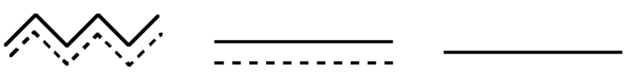
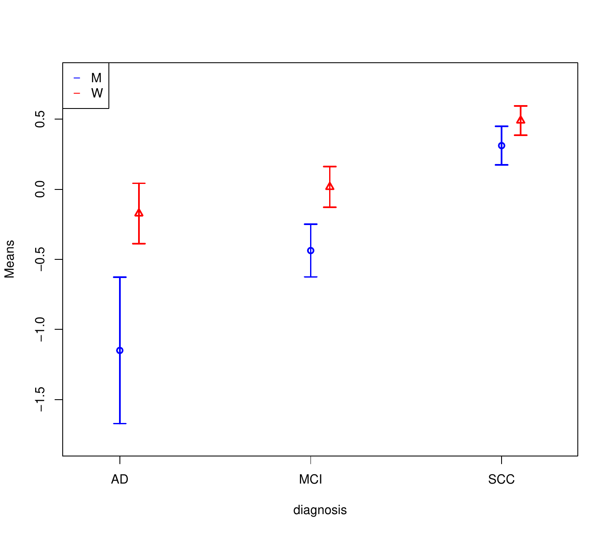
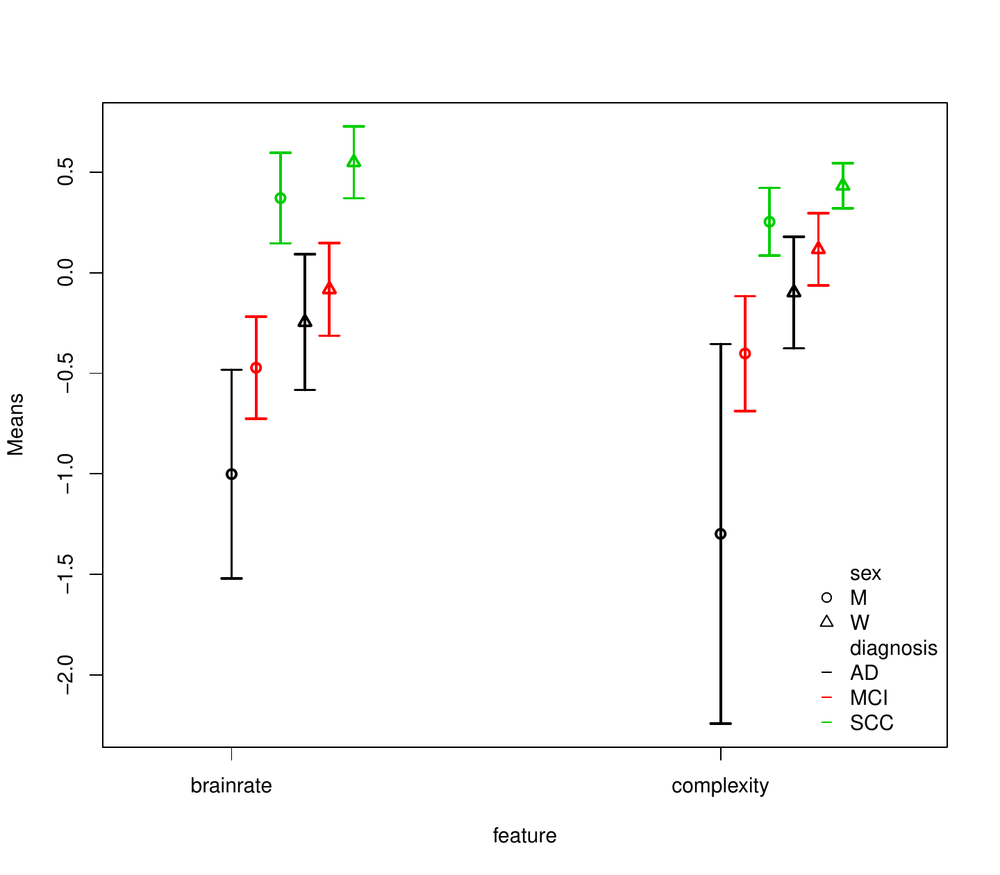
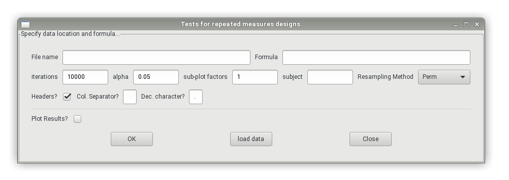
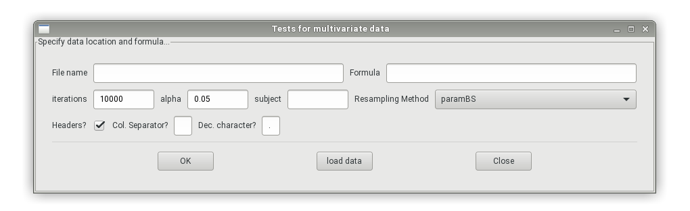
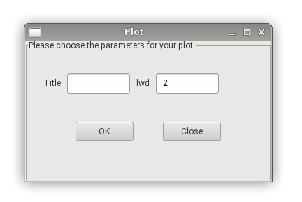
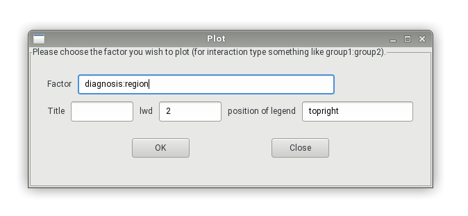

::: article
# Introduction

Nowadays, a large amount of measurements are taken per experimental unit
or subject in many experimental studiesrequiring inferential methods
from multivariate analysis in a unified way. Here we distinguish between
*two cases*:

1.  If the same quantity is measured under different treatment
    conditions or at different time points, a repeated measures (RM)
    design is present. Therein, observations are measured on the same
    scale and are *combinable*. This is also the case if the measuring
    instrument produces multiple responses, e.g., microarrays in
    bioinformatics.

2.  If different quantities are measured on the same unit or subject, a
    multivariate analysis of variance (MANOVA) design is apparent. In
    such a situation, data is measured on different scales and not
    combinable (e.g., height and weight).

These two different definitions do not only lead to different questions
of interest but also require different inference procedures as outlined
below. In particular, the main difference between the two approaches is
that in repeated measures designs comparisons between the response
variables are meaningful. This means that also hypotheses regarding
sub-plot or within subject factors (e.g., time) are of interest. On the
other hand, MANOVA settings are usually designed to detect effects of
the observed factors (and interactions thereof) on the multivariate
outcome vectors, thus allowing in contrast to multiple univariate ANOVA
analysesto evaluate the *combined* changes of the outcome variables with
respect to the factor levels.

Despite their differences, MANOVA- and RM-type techniques share the same
advantages over classical univariate endpoint-wiseANOVA-typeanalyses:

-   They provide joint inference and take the dependency across the
    endpoints into account, thus leading to possibly larger power to
    detect underlying effects.
-   They allow for testing of additional factorial structures and
-   can easily be equipped with a closed testing procedure for
    subsequently detecting local effects in specific components, i.e. to
    perform post-hoc analyses.

Focusing on metric data and mean-based procedures, MANOVA and RM models
are typically inferred by means of "classical" procedures such as Wilks'
Lambda, Lawley-Hotelling, Roy's largest root
[@Davis; @johnson; @anderson2001new] or (generalized) linear mixed
models with generalized estimating equations. For the classical one-way
layout, these methods are implemented in R within the `manova` function
in the [*stats*](https://CRAN.R-project.org/package=stats) package,
where one can choose between the options `Pillai`, `Wilks`,
`Hotelling-Lawley` and `Roy`. Nonparametric rank-based methods for null
hypotheses formulated in distribution functions are implemented within
the packages [*npmv*](https://CRAN.R-project.org/package=npmv) for one-
and two-way MANOVA [@npmv] and
[*nparLD*](https://CRAN.R-project.org/package=nparLD) for several
repeated measures designs [@nparLD]. In case of fixed block effects, the
[*GFD*](https://CRAN.R-project.org/package=GFD) package [@friedrichGFD],
which implements a permutation Wald-type test in the univariate setting,
can also be used.

(Generalized) linear mixed models are implemented in the `lm` and the
`glm` function (package *stats*) for univariate data as well as in the
[*SCGLR*](https://CRAN.R-project.org/package=SCGLR) package for
Generalized Linear Model estimation in the context of multivariate data
[@SCGLR]. The `Anova` and `Manova` function in the
[*car*](https://CRAN.R-project.org/package=car) package [@Fox] calculate
type-II and type-III analysis-of-variance tables for objects produced
by, e.g., `lm`, `glm` or `manova` in the univariate and multivariate
context, respectively. In the MANOVA context, repeated measures designs
can be included as well.

Furthermore, the packages
[*flip*](https://CRAN.R-project.org/package=flip) [@flip] and
[*ffmanova*](https://CRAN.R-project.org/package=ffmanova) [@ffmanova]
contain interesting permutation and rotation tests, which, however,
require certain invariances resulting in model restrictions [see, e.g.,
the discussion in @Huang; @Chung:2013] .

Most of these procedures, however, rely on specific distributional
assumptions (such as multivariate normality) and/or specific covariance
or correlation structures (e.g., homogeneity between groups or, for RM,
compound symmetry; possibly implying equal correlation between
measurements) which may often not be justifiable in real data. In
particular, with decreasing sample sizes and increasing dimensions, such
presumptions are almost impossible to verify in practice and may lead to
inflated type-I-errors, cf.
[@vallejo2001effects; @lix2004multivariate; @vallejo2007comparative; @livacic2010analysis].
To this end, several alternative procedures have been developed that
tackle the above problems and have been compared in extensive simulation
studies, see amongst others @brunner:2001
[@lix2007comparison; @gupta2008manova; @zhang2011two; @harrar2012modified; @Kon:2015; @xiao2016modified; @bathke2016using; @mcfarquhar2016multivariate; @friedrich2017permuting; @livacic2017power; @friedrichMATS]
and the references cited therein. Here, we focus on nonparametric
statistical methods that are valid in the multivariate Behrens-Fisher
situationequal covariance matrices across the groups are not assumedand
provide accurate inferential results in terms of $p$ value estimates and
confidence intervals for the parameters of interest. In particular, we
implemented bootstrap- and permutation-based approaches to approximate
the distribution of the test statistics in a robust way. Simulation
studies comparing these approaches to the traditional methods mentioned
above can, e. g. be found in the main papers and the supplements of
[@friedrich2017permuting] and [@bathke2016using].

More precisely, we focus on nonparametric methods for testing main and
interaction effects of *fixed* factors in repeated measures designs and
multivariate data. In particular, general Wald-type test statistics (for
MANOVA and RM), ANOVA-type statistics (for RM) and modified ANOVA-type
tests (for MANOVA) are implemented in
[*MANOVA.RM*](https://CRAN.R-project.org/package=MANOVA.RM) [@MANOVA.RM]
because

-   they can be used to test hypotheses in various factorial designs in
    a flexible way,
-   their sampling distribution can be approximated by resampling
    techniques, even allowing their application for small sample sizes,
-   and they are appropriate methods in the Behrens-Fisher situation.

To make the methods freely accessible we have provided the R package
*MANOVA.RM* for routine statistical analyses. It is available from the R
Archive at <https://CRAN.R-project.org/package=MANOVA.RM>

The main functions `RM` (for RM designs) and `MANOVA` (for MANOVA
designs) are developed in style of the well known ANOVA functions `lm`
or `aov`. Its user-friendly application not only provides the $p$ values
and test statistics of interest but also a descriptive overview together
with component-wise two-sided confidence intervals. Moreover, the
`MANOVA` function even allows for an easy calculation and confidence
ellipsoid plots for specified multivariate contrasts as described in
@friedrichMATS.

Specifically, for testing multivariate main- and interaction effects in
one-, two- and higher-way MANOVA models, the `MANOVA` function provides

-   the Wald-type statistic (WTS) proposed by @Kon:2015 using a
    parametric bootstrap, a wild bootstrap or its asymptotic
    $\chi^2$-distribution for $p$ value computations, and
-   the modified ANOVA-type statistic (MATS) proposed by @friedrichMATS
    using a parametric or wild bootstrap procedure for $p$ value
    computations.

In addition to multivariate group-wise effects, the `RM` function also
allows to test hypotheses formulated across within subject factors. The
implemented test statistics are

-   the ANOVA-type statistic (ATS) using an $F$-approximation as
    considered in @brunner:2001 as well as a parametric and a wild
    bootstrap approach and
-   the Wald-type statistic (WTS) using the asymptotic
    $\chi^2$-distribution [@brunner:2001], the permutation technique
    proposed in @friedrich2017permuting as well as a parametric
    [@bathke2016using] and a wild bootstrap approach for $p$ value
    estimation.

The paper is organized as follows: In Section [2](#Model) the
multivariate statistical model as well as the implemented inference
procedures are described. The application of the R package *MANOVA.RM*
is exemplified on several Repeated Measures and MANOVA Examples in
Section [3](#Examples). Finally, the paper closes with a discussion in
Section [4](#Conclusion).

Throughout the paper we use the subsequent notation from multivariate
linear models: For $a\in {\mathbb{N}}$ we denote by
$\boldsymbol{P}_a = \boldsymbol{I}_a - \frac{1}{a} \boldsymbol{J}_a$ the
$a$-dimensional centering matrix, by $\boldsymbol{I}_a$ the
$a$-dimensional identity matrix and by $\boldsymbol{J}_a$ the
$a \times a$ matrix of 1's, i.e.,
$\boldsymbol{J}_a = {\bf 1}_a {\bf 1}_a'$, where
${\bf 1}_a=(1, \dots, 1)'$ is the $a$-dimensional column vector of 1's.

# Statistical model and inference methods {#Model}

For both the RM and the MANOVA design equipped with an arbitrary number
of fixed factors, we consider the general linear model given by
$d$-variate random vectors
$$\begin{aligned}
\label{model}
\boldsymbol{X}_{ik} \ = \ (X_{ijk})_{j=1}^{d} &= \boldsymbol{\mu}_i + \boldsymbol{\epsilon}_{ik}.
\end{aligned}   (\#eq:model)$$
Here, $k=1, \dots,n_i$ denotes the experimental unit or subject in group
$i=1, \dots, a$. Note, that a higher-way factorial structure on the
groups/between subject or within subject factors can be achieved by
sub-indexing the indices $i$ (group/between subject factors) or $j$
(within subject factors) into $i_1,\dots,i_p$ or $j_1,\dots,j_q$. In
this model $\boldsymbol{\mu}_i = (\mu_{i1}, \dots, \mu_{id})' \in R^d$
is the mean vector in group $i=1, \dots, a$ and for each fixed $i$ it is
assumed that the error terms
$\boldsymbol{\epsilon}_{ik}, k=1,\dots,n_i,$ are independent and
identically distributed $d$-variate random vectors with mean
$E(\boldsymbol{\epsilon}_{i1}) = 0$ and existing variances
$0 < \sigma_{ij}^2 = var(X_{ijk}) < \infty , ~ j=1, \dots, d$. For the
WTS-type procedures we additionally assume positive definite covariance
matrices $cov(\boldsymbol{\epsilon}_{i1})=\boldsymbol{V}_i > 0$ and
existing finite fourth moments
$E(||\boldsymbol{\epsilon}_{i1}||^4) < \infty.$\
Within this framework, hypotheses for RM or MANOVA can be formulated by
means of an adequate contrast hypothesis matrix $\boldsymbol{H}$ by
$$H_0: \boldsymbol{H}\boldsymbol{\mu}= {\bf 0},$$
where
$\boldsymbol{\mu}= (\boldsymbol{\mu}_1, \dots, \boldsymbol{\mu}_a)'$.

Let
$\boldsymbol{\overline{X}}_{\bullet} = (\boldsymbol{\overline{X}}_{1\cdot}', \dots, \boldsymbol{\overline{X}}_{a\cdot}')'$
denote the vector of pooled group means
$\boldsymbol{\overline{X}}_{i\cdot} = \frac{1}{n_i}\sum_{k=1}^{n_i}\boldsymbol{X}_{ik}, i=1, \dots, a$
and
$\widehat{\boldsymbol{\Sigma}}_N = { N \cdot \mathop{\mathrm{diag}}\{ \widehat{\boldsymbol{V}}_1/n_1, \dots,\widehat{\boldsymbol{V}}_a/n_a\}}$
the estimated covariance of
$\sqrt{N} \boldsymbol{\overline{X}}_{\bullet}$. Here, $N=\sum_i n_i$ and
$\widehat{\boldsymbol{V}}_i = \frac{1}{n_i-1}\sum_{k=1}^{n_i}(\boldsymbol{X}_{ik} - \boldsymbol{\overline{X}}_{i \cdot})(\boldsymbol{X}_{ik} - \boldsymbol{\overline{X}}_{i \cdot})'$.
In this set-up @Kon:2015 propose a statistic of Wald-type (WTS)
$$\begin{aligned}
\label{WTS}
T_N = T_N(\boldsymbol{X}) =   N \boldsymbol{\overline{X}}_{\bullet}' \boldsymbol{T}(\boldsymbol{T} \widehat{\boldsymbol{\Sigma}}_N \boldsymbol{T})^+\boldsymbol{T}\boldsymbol{\overline{X}}_{\bullet},
\end{aligned}   (\#eq:WTS)$$
for testing $H_0$, where
$\boldsymbol{T}= \boldsymbol{H}'(\boldsymbol{H}\boldsymbol{H}')^+\boldsymbol{H}$,
$\boldsymbol{X}=\{\boldsymbol{X}_{11},\dots,\boldsymbol{X}_{an_a}\}$,
and $\boldsymbol{A}^+$ denotes the Moore-Penrose inverse of the matrix
$\boldsymbol{A}$. Since its asymptotic $\chi_{rank(\boldsymbol{T})}^2$
null distribution provides a poor finite sample approximation, they
propose the following asymptotic model-based bootstrap approach: Given
the data $\boldsymbol{X}$ let
$\boldsymbol{X}_{ik}^\star \sim N({\bf 0}, \widehat{\boldsymbol{V}}_i), i=1,\dots, a, k=1,\dots,n_i,$
be independent random vectors that are used for recalculating the test
statistic as $T_N^\star = T_N(\boldsymbol{X}^\star)$, where
$\boldsymbol{X}^\star=\{\boldsymbol{X}_{11}^\star,\dots,\boldsymbol{X}_{an_a}^\star\}$.
Denoting by $c^\star$ the corresponding $(1-\alpha)$-quantile of the
(conditional) distribution of $T_N^\star$ the test rejects $H_0$ if
$T_N > c^\star$. The validity of this procedure (also named parametric
bootstrap WTS) is proven in @Kon:2015.

This procedure is not only applicable for MANOVA but also for RM designs
[@bathke2016using]. However, @friedrich2017permuting proposed a more
favourable technique for Repeated Measurements. It is based on an at
first blush chaotic resampling method: Wild permutation of all pooled
components without taking group membership or possible dependencies into
account. Denoting the resulting permuted data set as
$\boldsymbol{X}^\pi$ their permutation test for RM models rejects $H_0$
if $T_N > c^\pi$. Here $c^\pi$ denotes the $(1-\alpha)$-quantile of the
(conditional) distribution of the permutation version of the test
statistic $T_N^\pi = T_N(\boldsymbol{X}^\pi)$. As shown in extensive
simulations in @friedrich2017permuting and the corresponding supporting
information this 'wild' permutation WTS method controls the type-I error
rate very well. Note that this procedure is only applicable for RM due
to the commensurate nature of their components. In MANOVA set-ups the
permutation would stir different scalings making comparisons
meaningless.

In addition to these WTS procedures two other statistics are considered
as well. For RM the well-established ANOVA-type statistic (ATS)
$$\begin{aligned}
\label{ATS}
Q_N = N \boldsymbol{\overline{X}}_{\bullet}' \boldsymbol{T}\boldsymbol{\overline{X}}_{\bullet}
\end{aligned}   (\#eq:ATS)$$
by @brunner:2001 is implemented together with the enhanced
$F$-approximation of the statistic proposed in @BrDeMu:1997
[@BrunnerDomhofLanger2002] and implemented in the SAS `PROC Mixed`
procedure. Although known to be rather conservative it has the advantage
(over the WTS) of being applicable in case of eventually singular
covariance matrices $\boldsymbol{V}_i$ or $\boldsymbol{\widehat{V}}_i$
since it waives the Moore-Penrose inverse involved in
Equation \@ref(eq:WTS).

Similar to the permuted WTS the ATS given in Equation \@ref(eq:ATS) is
only applicable for RM since it is not invariant under scale
transformations (e.g., change of units) of the univariate components. To
nevertheless provide a robust method for MANOVA settings which is also
applicable in case of singular $\boldsymbol{V}_i$ or
$\boldsymbol{\widehat{V}}_i$, @friedrichMATS have recently proposed the
novel MATS (modified ATS)
$$\begin{aligned}
M_N = M_N(\boldsymbol{X}) = N \boldsymbol{\overline{X}}_{\bullet}' \boldsymbol{T}(\boldsymbol{T}\boldsymbol{\widehat{D}}_N \boldsymbol{T})^+\boldsymbol{T}\boldsymbol{\overline{X}}_{\bullet}.
\end{aligned}$$
Here, the involved diagonal matrix
$\boldsymbol{\widehat{D}}_N = \oplus_{1\leq i\leq a, 1\leq s\leq d}{N}{\widehat \sigma}_{is}^2/n_i$
of the empirical variances ${\widehat \sigma}_{is}^2$ of component $s$
in group $i$, deduces an invariance under component-wise scale
transformations of the MATS for null hypotheses as described in
Section [2.1](#sec:designs), i.e., of the form
$\boldsymbol{T}= \boldsymbol{M}\otimes\boldsymbol{I}_d$, see
[@friedrichMATS] for details. To obtain an accurate finite sample
performance, it is also equipped with an asymptotic model based
bootstrap approach. That is, MATS rejects $H_0$ if
$M_N > \tilde{c}^\star$, where $\tilde{c}^\star$ is the
$(1-\alpha)$-quantile of the (conditional) distribution of the
bootstrapped statistic $M_N^\star = M_N(\boldsymbol{X}^\star)$. In
addition, we implemented a wild bootstrap approach, which is based on
multiplying the centered data vectors
$(\boldsymbol{X}_{ik} - \boldsymbol{X}_{i \cdot})$ with random weights
$W_{ik}$ fulfilling $E(W_{ik})=0, var(W_{ik})=1$ and
$\sup_{i, k}E(W_{ik}^4)<\infty$. In the package, we implemented
Rademacher distributed weights, i.e., random signs. Extensive
simulations in @friedrichMATS not only confirm its applicability in case
of singular covariance matrices but also disclose a very robust
behaviour that even seems to be advantageous over the parametrically
bootstrapped WTS of @Kon:2015. However, both procedures, as well as the
'usual' asymptotic WTS are displayed within the MANOVA functions.

All of the aforementioned procedures are applicable in various factorial
designs in a unified way, i.e., when more than one factor may impact the
response. The specific models and the hypotheses being tested will be
discussed in the next section.

## Special designs and hypotheses {#sec:designs}

In order to provide a general overview of different statistical designs
and layouts that can be analyzed with *MANOVA.RM* we exemplify few
designs that occur frequently in practical applications and discuss the
model, hypotheses and limitations. All of the methods implemented in
*MANOVA.RM* are even applicable in higher-way layouts than being
presented here; and the list should not be seen as the limited
application of the package. The models are derived by sub-indexing the
index $i$ in Equation \@ref(eq:model) in the following ways:

-    **One-Way ($\boldsymbol{A}$):** Writing
    $\boldsymbol{\mu}_i = \boldsymbol{\nu}+\boldsymbol{\alpha}_{i}$ we
    have
    $\boldsymbol{X}_{ik}=\boldsymbol{\nu}+\boldsymbol{\alpha}_{i}+\boldsymbol{\epsilon}_{ik}$
    with $\sum_{i=1}^a \boldsymbol{\alpha}_i={\bf 0}$ and obtain the
    null hypothesis of 'no group' or 'factor $\boldsymbol{A}$' effect as
    $$\begin{aligned}
    		H_0(\boldsymbol{A}):\{(\boldsymbol{P}_a\otimes \boldsymbol{I}_d) \boldsymbol{\mu}= {\bf 0}\} &=& \{\boldsymbol{\mu}_1=\dots=\boldsymbol{\mu}_a\}\\ &=& \{\boldsymbol{\alpha}_1=\dots=\boldsymbol{\alpha}_a={\bf 0}\}.
    \end{aligned}$$
    In case of $a=2$ this includes the famous *multivariate
    Behrens-Fisher problem* as, e.g., analyzed in @yao1965approximate
    [@nel1986solution; @christensen1997comparison; @krishnamoorthy2004modified]
    or @yanagihara2005three.
-   **Crossed Two-Way ($\boldsymbol{A}\times \boldsymbol{B}$):**
    Splitting the index into two and writing
    $\boldsymbol{\mu}_{ij} = \boldsymbol{\nu}+\boldsymbol{\alpha}_i+\boldsymbol{\beta}_j+\boldsymbol{\gamma}_{ij}$
    we obtain the model
    $\boldsymbol{X}_{ijk}= \boldsymbol{\nu}+\boldsymbol{\alpha}_i+\boldsymbol{\beta}_j+\boldsymbol{\gamma}_{ij}+\boldsymbol{\epsilon}_{ijk}, \,  1\leq i\leq a,~1\leq j\leq b,~ 1\leq k\leq n_{ij}$
    with
    $\sum_i{\boldsymbol{\alpha}_i}=\sum_j{\boldsymbol{\beta}_j}=\sum_i{\boldsymbol{\gamma}_{ij}}=\sum_j{\boldsymbol{\gamma}_{ij}}=\boldsymbol{0}.$
    The corresponding null hypotheses of no main effects in
    $\boldsymbol{A}$ or $\boldsymbol{B}$ and no interaction effect
    between $\boldsymbol{A}$ and $\boldsymbol{B}$ can be written as:
    $$\begin{aligned}
    		H_0(\boldsymbol{A}) :\{(\boldsymbol{P}_a\otimes{b}^{-1}~\boldsymbol{J}_b\otimes\boldsymbol{I}_d)~\boldsymbol{\mu}= {\bf 0}\}  &=& \{\boldsymbol{\alpha}_1=\dots=\boldsymbol{\alpha}_a={\bf 0}\},\\
    		H_0(\boldsymbol{B}) :\{(a^{-1}~\boldsymbol{J}_a\otimes\boldsymbol{P}_b\otimes\boldsymbol{I}_d)~\boldsymbol{\mu}= {\bf 0}\}  &=& \{\boldsymbol{\beta}_1=\dots=\boldsymbol{\beta}_b={\bf 0}\},\\
    		H_0(\boldsymbol{A}\boldsymbol{B}):\{(\boldsymbol{P}_a\otimes\boldsymbol{P}_b\otimes\boldsymbol{I}_d)~\boldsymbol{\mu}={\bf 0}\}\;\;\;\;\;\;\,&=& \{\boldsymbol{\gamma}_{11}=\dots=\boldsymbol{\gamma}_{ab}={\bf 0}\}.
    \end{aligned}$$
    Note that the interpretation of main effects is complicated by the
    presence of significant interaction effects and further analyses are
    necessary to determine the direction of the effects.
-   **Hierarchically nested Two-Way
    ($\boldsymbol{B}(\boldsymbol{A})$):** A fixed subcategory $B$ within
    factor $A$ can be introduced via the model
    $\boldsymbol{X}_{ijk}= {\boldsymbol{\nu}+\boldsymbol{\alpha}_i+\boldsymbol{\beta}_{j(i)}} +  \boldsymbol{\epsilon}_{ijk}, 1\leq i\leq a,~1\leq j\leq b_i~,1\leq k\leq n_{ij}$
    with
    $\sum_i{\boldsymbol{\alpha}_i}=\sum_j{\boldsymbol{\beta}_{j(i)}}=\boldsymbol{0}.$
    Here, the hypotheses of no main effect $A$ or no sub-category main
    effect $B$ can be written as
    $$\begin{aligned}
    		H_0(A) :\{(\boldsymbol{P}_a\tilde{\boldsymbol{J}}_b\otimes\boldsymbol{I}_d)~\boldsymbol{\mu}= {\bf 0}\}  &=& \{\boldsymbol{\alpha}_1=\dots=\boldsymbol{\alpha}_a={\bf 0}\},\\
    		H_0(B(A)) :\{ (\boldsymbol{\widetilde{P}}_b\otimes \boldsymbol{I}_d)~\boldsymbol{\mu}=  {\bf 0}\}  &=& \{\boldsymbol{\beta}_{j(i)} = 0 \forall\ 1\leq i\leq a, 1\leq j\leq b_i\}
    \end{aligned}$$
    with
    $\boldsymbol{\widetilde{P}}_b=\bigoplus_{j=1}^a\boldsymbol{P}_{b_j},~\boldsymbol{\widetilde{J}}_b=\bigoplus_{j=1}^a b_j^{-1}{\bf 1}_{b_j}'$
    and
    $\boldsymbol{\mu}:=(\boldsymbol{\mu}_{11}',...,\boldsymbol{\mu}_{1b_1}',\boldsymbol{\mu}_{21}',...,\boldsymbol{\mu}_{2b_2}',...,\boldsymbol{\mu}_{ab_a}')'$.
    We only implemented balanced designs, i.e., $b_i=b$ for all
    $i=1, \dots, a$. Hierarchically nested three-way designs or
    arbitrary crossed higher-way layouts can be introduced similarly and
    are implemented as well.
-   **Repeated Measures and Split Plot Designs** are covered by setting
    $d=t$, where even hypotheses about within subject factors can be
    formulated. We exemplify this for profile analyses in the special
    case of a one-sample RM design with $a=1$
    $$\begin{aligned}
    		H_0(\text{Time}): \{\boldsymbol{P}_t~\boldsymbol{\mu}=\boldsymbol{0}\} &=& \{\mu_{11}=\dots=\mu_{1t}\},
    		
    \end{aligned}$$
    as well as for a two-sample RM design with $a=2$:
    $$\begin{aligned}
    		H_0(\text{Parallel}): \{\boldsymbol{T}_P~\boldsymbol{\mu}=\boldsymbol{0}\} &=&\{\boldsymbol{\mu}_1-\boldsymbol{\mu}_2=\gamma~{\bf 1}_t ~~\text{for some}~~\gamma \in \mathbb{R}\}\\
    		H_0(\text{Flat}): \{\boldsymbol{T}_F~\boldsymbol{\mu}=\boldsymbol{0}\}&=& \{\boldsymbol{\mu}_{1s}+\boldsymbol{\mu}_{2s}=\bar{\boldsymbol{\mu}}_{1\cdot}+\bar{\boldsymbol{\mu}}_{2\cdot} ~~\text{for all}~~s\} \\
    		H_0(\text{Identical}): \{\boldsymbol{T}_I~\boldsymbol{\mu}=\boldsymbol{0}\} &=& \{\boldsymbol{\mu}_1=\boldsymbol{\mu}_2\}
    		
    \end{aligned}$$
    \
    with
    $\boldsymbol{T}_F=\boldsymbol{P}_t~(\boldsymbol{I}_t\quad \boldsymbol{I}_t)$,
    $\boldsymbol{T}_P=({\bf 1}_{t-1}\quad-\boldsymbol{I}_{t-1})~\boldsymbol{T}_I$
    and $\boldsymbol{T}_I = (\boldsymbol{I}_t\quad-\boldsymbol{I}_t)$.\

    
    {width="100%"
    alt="graphic without alt text"}
    `parallel                  flat                   identical`\
    Note, that we could also employ more complex factorial structures on
    the repeated measurements (i.e., more within subject factors) by
    splitting up the index $j$.

# Examples {#Examples}

To demonstrate the use of the `RM` and the `MANOVA` function, we provide
several examples for both repeated measures designs and multivariate
data in the following. Furthermore, the *MANOVA.RM* package is equipped
with an optional GUI (graphical user interface), based on
[*RGtk2*](https://CRAN.R-project.org/package=RGtk2) [@RGtk2], which will
be explained in detail in Section [3.3](#sec:GUI) below.

Both functions are structured similarly: The main input parameters are
the `formula` specifying the outcome on the left hand side and the
factor variables of interest on the right, the `data` and the
`resampling` approach. The latter varies according to the design: the
user can choose between a parametric and a wild bootstrap and in the RM
design, additionally a permutation approach for the WTS is implemented.

## Repeated Measures Designs

The function `RM` is built as follows:

``` r
R> RM(formula, data, subject, no.subf = 1, iter = 10000, alpha = 0.05,
+     resampling = "Perm", CPU, seed, CI.method = "t-quantile", dec = 3)
```

Data need to be provided in long format, i.e., one row per measurement.
Here, `subject` specifies the column name of the subjects variable in
the data frame, while `no.subf` denotes the number of within subject
factors considered. Note that in a setting with more than one between
subjects factor, the subject ids in the different groups need to be
different. Otherwise the program will erroneously assume that these
measurements belong to the same subject. The number of cores used for
parallel computing as well as a random seed can optionally be specified
using `CPU` and `seed`, respectively. For calculating the confidence
intervals, the user can choose between $t$-quantiles (the default) and
the quantiles based on the resampled WTS. The results are rounded to
`dec` digits.

The function `RM` returns an object of class `"RM"` from which the user
may obtain plots and summaries of the results using `plot()`, `print()`
and `summary()`, respectively. Here, `print()` returns a short summary
of the results, i.e., the values of the test statistics along with
degrees of freedom and corresponding $p$ values whereas `summary()` also
displays some descriptive statistics such as the means, sample sizes and
confidence intervals for the different factor level combinations.
Plotting is based on
[*plotrix*](https://CRAN.R-project.org/package=plotrix) [@plotrix]. For
two- and higher-way layouts, the factors for plotting can be
additionally specified in the `plot` call, see the examples below.

### Example 1: One between subject and two within subject factors

For illustration purposes, we consider the data set `o2cons`, which is
included in *MANOVA.RM*. This data set contains measurements of the
oxygen consumption of leukocytes in the presence and absence of
inactivated staphylococci at three consecutive time points. Due to the
study design, both time and staphylococci are within subject factors
while the treatment (Verum vs. Placebo) is a between subject factor [see
@friedrich2017permuting for more details].

``` r
R> data("o2cons")
R> model1 <- RM(O2 ~ Group * Staphylococci * Time, data = o2cons, 
+               subject = "Subject",  no.subf = 2, iter = 1000, 
+               resampling = "Perm", seed = 1234)
R> summary(model1)
```

``` r
Call: 
O2 ~ Group * Staphylococci * Time
A repeated measures analysis with  2 within-subject and  1 between-subject factors. 

Descriptive:
   Group Staphylococci Time  n Means Lower 95 % CI Upper 95 % CI
1      P             0    6 12 1.322         1.150         1.493
5      P             0   12 12 2.430         2.196         2.664
9      P             0   18 12 3.425         3.123         3.727
3      P             1    6 12 1.618         1.479         1.758
7      P             1   12 12 2.434         2.164         2.704
11     P             1   18 12 3.527         3.273         3.781
2      V             0    6 12 1.394         1.201         1.588
6      V             0   12 12 2.570         2.355         2.785
10     V             0   18 12 3.677         3.374         3.979
4      V             1    6 12 1.656         1.471         1.840
8      V             1   12 12 2.799         2.500         3.098
12     V             1   18 12 4.029         3.802         4.257

Wald-Type Statistic (WTS):
                   Test statistic       df    p-value 
Group                    "11.167"       "1" "0.001" 
Staphylococci            "20.401"       "1" "<0.001"
Group:Staphylococci      "2.554"        "1" "0.11"  
Time                     "4113.057"     "2" "<0.001"
Group:Time               "24.105"       "2" "<0.001"
Staphylococci:Time       "4.334"        "2" "0.115" 
Group:Staphylococci:Time "4.303"        "2" "0.116" 

ANOVA-Type Statistic (ATS):
                    Test statistic     df1      df2       p-value 
Group                    "11.167"       "1"     "316.278" "0.001" 
Staphylococci            "20.401"       "1"     "Inf"     "<0.001"
Group:Staphylococci      "2.554"        "1"     "Inf"     "0.11"  
Time                     "960.208"      "1.524" "Inf"     "<0.001"
Group:Time               "5.393"        "1.524" "Inf"     "0.009" 
Staphylococci:Time       "2.366"        "1.983" "Inf"     "0.094" 
Group:Staphylococci:Time "2.147"        "1.983" "Inf"     "0.117" 

p-values resampling:
                      Perm (WTS)
Group                    "0.005"   
Staphylococci            "0.001"   
Group:Staphylococci      "0.145"   
Time                     "<0.001"  
Group:Time               "<0.001"  
Staphylococci:Time       "0.144"   
Group:Staphylococci:Time "0.139"   
```

The output consists of four parts: `model1$Descriptive` gives an
overview of the descriptive statistics: The number of observations, mean
and confidence intervals are displayed for each factor level
combination. Second, `model1$WTS` contains the results for the Wald-type
test: The test statistic, degree of freedom and $p$ values based on the
asymptotic $\chi^2$-distribution are displayed. Note that the
$\chi^2$-approximation is highly anti-conservative for small sample
sizes, cf. @Kon:2015 [@friedrich2017permuting]. The corresponding
results based on the ATS are contained within `model1$ATS`. This test
statistic tends to rather conservative decisions in case of small sample
sizes and is even asymptotically only an approximation, thus not
providing an asymptotic level $\alpha$ test, see @brunner:2001
[@friedrich2017permuting]. Finally, `model1$resampling` contains the $p$
values based on the chosen resampling approach. For the ATS, the
permutation approach is not feasible since it would result in an
incorrect covariance structure, and is therefore not implemented. Due to
the above mentioned issues for small sample sizes, the respective
resampling procedure is recommended for such situations.

In this example, we find significant effects of all factors as well as a
significant interaction between group and time.

### Example 2: Two within subject and two between subject factors

We consider the data set `EEG` from the *MANOVA.RM* package: At the
Department of Neurology, University Clinic of Salzburg, 160 patients
were diagnosed with either Alzheimer's Disease (AD), mild cognitive
impairment (MCI), or subjective cognitive complaints without clinically
significant deficits (SCC), based on neuropsychological diagnostics
[@bathke2016using]. This data set contains $z$-scores for brain rate and
Hjorth complexity, each measured at frontal, temporal and central
electrode positions and averaged across hemispheres. In addition to
standardization, complexity values were multiplied by $-1$ in order to
make them more easily comparable to brain rate values: For brain rate we
know that the values decrease with age and pathology, while Hjorth
complexity values are known to increase with age and pathology. The
three between subject factors considered were sex (men vs. women),
diagnosis (AD vs. MCI vs. SCC), and age ($<70$ vs. $\geq70$ years).
Additionally, the within subject factors region (frontal, temporal,
central) and feature (brain rate, complexity) structure the response
vector.

Note that due to the small number of subjects in some groups (e.g., only
2 male patients aged $<$ 70 were diagnosed with AD) we restrict our
analyses to two between subject factors at a time. However, more complex
factorial designs can also be analyzed with *MANOVA.RM* as outlined
above.

``` r
R> data("EEG")
R> EEG_model <- RM(resp ~ sex * diagnosis * feature * region, data = EEG,
+		subject = "id", no.subf = 2, resampling = "WildBS", 
+		iter = 1000, alpha = 0.01, CPU = 4, seed = 123)
R> summary(EEG_model)
```

``` r
Call: 
resp ~ sex * diagnosis * feature * region
A repeated measures analysis with  2 within-subject and  2 between-subject factors. 

Descriptive:
 sex diagnosis    feature   region   n  Means    Lower 99 % CI  Upper 99 % CI
1    M        AD  brainrate  central 12 -1.010        -4.881         2.861
13   M        AD  brainrate  frontal 12 -1.007        -4.991         2.977
25   M        AD  brainrate temporal 12 -0.987        -4.493         2.519
7    M        AD complexity  central 12 -1.488       -10.053         7.077
19   M        AD complexity  frontal 12 -1.086        -6.906         4.735
31   M        AD complexity temporal 12 -1.320        -7.203         4.562
3    M       MCI  brainrate  central 27 -0.447        -1.591         0.696
15   M       MCI  brainrate  frontal 27 -0.464        -1.646         0.719
27   M       MCI  brainrate temporal 27 -0.506        -1.584         0.572
9    M       MCI complexity  central 27 -0.257        -1.139         0.625
21   M       MCI complexity  frontal 27 -0.459        -1.997         1.079
33   M       MCI complexity temporal 27 -0.490        -1.796         0.816
5    M       SCC  brainrate  central 20  0.459        -0.414         1.332
17   M       SCC  brainrate  frontal 20  0.243        -0.670         1.156
29   M       SCC  brainrate temporal 20  0.409        -1.210         2.028
11   M       SCC complexity  central 20  0.349        -0.070         0.767
23   M       SCC complexity  frontal 20  0.095        -1.037         1.227
35   M       SCC complexity temporal 20  0.314        -0.598         1.226
2    W        AD  brainrate  central 24 -0.294        -1.978         1.391
14   W        AD  brainrate  frontal 24 -0.159        -1.813         1.495
26   W        AD  brainrate temporal 24 -0.285        -1.776         1.206
8    W        AD complexity  central 24 -0.128        -1.372         1.116
20   W        AD complexity  frontal 24  0.026        -1.212         1.264
32   W        AD complexity temporal 24 -0.194        -1.670         1.283
4    W       MCI  brainrate  central 30 -0.106        -1.076         0.863
16   W       MCI  brainrate  frontal 30 -0.074        -1.032         0.885
28   W       MCI  brainrate temporal 30 -0.069        -1.064         0.925
10   W       MCI complexity  central 30  0.094        -0.464         0.652
22   W       MCI complexity  frontal 30  0.131        -0.768         1.031
34   W       MCI complexity temporal 30  0.121        -0.652         0.895
6    W       SCC  brainrate  central 47  0.537        -0.049         1.124
18   W       SCC  brainrate  frontal 47  0.548        -0.062         1.159
30   W       SCC  brainrate temporal 47  0.559        -0.015         1.133
12   W       SCC complexity  central 47  0.384         0.110         0.659
24   W       SCC complexity  frontal 47  0.403        -0.038         0.845
36   W       SCC complexity temporal 47  0.506         0.132         0.880

Wald-Type Statistic (WTS):
                       Test statistic     df  p-value 
sex                          "9.973"        "1" "0.002" 
diagnosis                    "42.383"       "2" "<0.001"
sex:diagnosis                "3.777"        "2" "0.151" 
feature                      "0.086"        "1" "0.769" 
sex:feature                  "2.167"        "1" "0.141" 
diagnosis:feature            "5.317"        "2" "0.07"  
sex:diagnosis:feature        "1.735"        "2" "0.42"  
region                       "0.07"         "2" "0.966" 
sex:region                   "0.876"        "2" "0.645" 
diagnosis:region             "6.121"        "4" "0.19"  
sex:diagnosis:region         "1.532"        "4" "0.821" 
feature:region               "0.652"        "2" "0.722" 
sex:feature:region           "0.423"        "2" "0.81"  
diagnosis:feature:region     "7.142"        "4" "0.129" 
sex:diagnosis:feature:region "2.274"        "4" "0.686" 

ANOVA-Type Statistic (ATS):
                     Test statistic       df1     df2       p-value 
sex                          "9.973"        "1"     "657.416" "0.002" 
diagnosis                    "13.124"       "1.343" "657.416" "<0.001"
sex:diagnosis                "1.904"        "1.343" "657.416" "0.164" 
feature                      "0.086"        "1"     "Inf"     "0.769" 
sex:feature                  "2.167"        "1"     "Inf"     "0.141" 
diagnosis:feature            "1.437"        "1.562" "Inf"     "0.238" 
sex:diagnosis:feature        "1.031"        "1.562" "Inf"     "0.342" 
region                       "0.018"        "1.611" "Inf"     "0.965" 
sex:region                   "0.371"        "1.611" "Inf"     "0.644" 
diagnosis:region             "1.091"        "2.046" "Inf"     "0.337" 
sex:diagnosis:region         "0.376"        "2.046" "Inf"     "0.691" 
feature:region               "0.126"        "1.421" "Inf"     "0.81"  
sex:feature:region           "0.077"        "1.421" "Inf"     "0.864" 
diagnosis:feature:region     "0.829"        "1.624" "Inf"     "0.415" 
sex:diagnosis:feature:region "0.611"        "1.624" "Inf"     "0.51"  

p-values resampling:
                       WildBS (WTS)   WildBS (ATS)
sex                          "<0.001"     "<0.001"    
diagnosis                    "<0.001"     "<0.001"    
sex:diagnosis                "0.119"      "0.124"     
feature                      "0.798"      "0.798"     
sex:feature                  "0.152"      "0.152"     
diagnosis:feature            "0.067"      "0.249"     
sex:diagnosis:feature        "0.445"      "0.362"     
region                       "0.967"      "0.98"      
sex:region                   "0.691"      "0.728"     
diagnosis:region             "0.182"      "0.338"     
sex:diagnosis:region         "0.863"      "0.814"     
feature:region               "0.814"      "0.926"     
sex:feature:region           "0.881"      "0.951"     
diagnosis:feature:region     "0.098"      "0.519"     
sex:diagnosis:feature:region "0.764"      "0.683"    
```

We find significant effects at level $\alpha=0.01$ of the between
subject factors sex and diagnosis, while none of the within subject
factors or interactions become significant.

### Plotting

The `RM()` function is equipped with a plotting option, displaying the
calculated means along with $(1-\alpha)$ confidence intervals based on
$t$-quantiles. The plot function takes an `RM` object as argument. In
addition, the factor of interest may be specified. If this argument is
omitted in a two- or higher-way layout, the user is asked to specify the
factor for plotting. Furthermore, additional graphical parameters can be
used to customize the plots. The optional argument `legendpos` specifies
the position of the legend in higher-way layouts, whereas `gap` (default
0.1) is the distance introduced between error bars in a higher-way
layout. Additionally, the parameter `CI.info` can be set to `TRUE` in
order to output the means and confidence intervals for the desired
interaction.

``` r
R> plot(EEG_model, factor = "sex", main = "Effect of sex on EEG values")
R> plot(EEG_model, factor = "sex:diagnosis", legendpos = "topleft", 
+       col = c(4, 2),  ylim = c(-1.8, 0.8), CI.info = TRUE)

$mean
     AD         MCI       SCC
M -1.1496245 -0.43724352 0.3114978
W -0.1723434  0.01624054 0.4897902

$lower
     AD        MCI       SCC
M -1.6714757 -0.6251940 0.1732354
W -0.3874841 -0.1290226 0.3848516

$upper
      AD        MCI       SCC
M -0.62777339 -0.2492930 0.4497601
W  0.04279732  0.1615037 0.5947288	

R> plot(EEG_model, factor = "sex:diagnosis:feature", 
+       legendpos = "bottomright", gap = 0.05)
```

The resulting plots are displayed in Figure [1](#Fig:plotting) and
Figure [2](#Fig:interactions), respectively.

{#Fig:plotting width="100%"
alt="graphic without alt text"}

<figure id="Fig:interactions">


<figcaption>Figure 2: Plot for the interaction between "sex" and
"diagnosis" (upper panel) as well as additionally taking "feature" into
account (lower panel) in the RM model of the EEG data
example.</figcaption>
</figure>

## MANOVA Design

For the analysis of multivariate data, the functions `MANOVA` and
`MANOVA.wide` are implemented. The difference between the two functions
is that the response must be stored in long and wide format for using
`MANOVA` or `MANOVA.wide`, respectively. The structure of both functions
is very similar. They both calculate the WTS for multivariate data in a
design with crossed or nested factors. Additionally, the modified
ANOVA-type statistic (MATS) is calculated which has the additional
advantage of being applicable to designs involving singular covariance
matrices and is invariant under scale transformations of the data
[@friedrichMATS]. The resampling methods provided are a parametric
bootstrap approach and a wild bootstrap using Rademacher weights. Note
that only balanced nested designs (i.e., the same number of factor
levels $b$ for each level of the factor $A$) with up to three factors
are implemented. Designs involving both crossed and nested factors are
not implemented. Note that in nested designs, the levels of the nested
factor usually have the same labels for all levels of the main factor,
i.e., for each level $i=1,\ldots,a$ of the main factor $A$ the nested
factor levels are labeled as $j=1,\ldots,b_i$. If the levels of the
nested factor are named uniquely, this has to be specified by setting
the parameter `nested.levels.unique` to `TRUE`.

``` r
R> MANOVA(formula, data, subject, iter = 10000, alpha = 0.05, 
+         resampling = "paramBS", CPU, seed,
+         nested.levels.unique = FALSE, dec = 3)
R> MANOVA.wide(formula, data, iter = 10000, alpha = 0.05, 
+              resampling = "paramBS", CPU, seed,
+              nested.levels.unique = FALSE, dec = 3)
```

The only difference between `MANOVA` and `MANOVA.wide` in the function
call except from the different shape of the formula (see examples below)
is the `subject` variable, which needs to be specified for `MANOVA`
only.

### Data Example MANOVA: Two crossed factors

We again consider the data set `EEG` from the *MANOVA.RM* package, but
now we ignore the within subject factor structure. Therefore, we are now
in a multivariate setting with 6 measurements per patient and three
crossed factors sex, age and diagnosis. Due to the small number of
subjects in some groups we restrict our analyses to two factors at a
time. The analysis of this example is shown below.

``` r
R> data("EEG")
R> EEG_MANOVA <- MANOVA(resp ~ sex * diagnosis, data = EEG, subject = "id",
+                       resampling = "paramBS", iter = 1000,  alpha = 0.01,
+                       CPU = 1, seed = 987)
R> summary(EEG_MANOVA)
```

``` r
Call: 
resp ~ sex * diagnosis

Descriptive:
   sex diagnosis n   Mean 1 Mean 2 Mean 3 Mean 4 Mean 5 Mean 6
1   M        AD 12 -0.987 -1.007 -1.010 -1.320 -1.086 -1.488
3   M       MCI 27 -0.506 -0.464 -0.447 -0.490 -0.459 -0.257
5   M       SCC 20  0.409  0.243  0.459  0.314  0.095  0.349
2   W        AD 24 -0.285 -0.159 -0.294 -0.194  0.026 -0.128
4   W       MCI 30 -0.069 -0.074 -0.106  0.121  0.131  0.094
6   W       SCC 47  0.559  0.548  0.537  0.506  0.403  0.384

Wald-Type Statistic (WTS):
             Test statistic   df   p-value 
sex           "12.604"       "6"  "0.05"  
diagnosis     "55.158"       "12" "<0.001"
sex:diagnosis "9.79"         "12" "0.634" 

modified ANOVA-Type Statistic (MATS):
                Test statistic
sex                   45.263
diagnosis            194.165
sex:diagnosis         18.401

p-values resampling:
        paramBS (WTS)  paramBS (MATS)
sex           "0.124"       "0.003"       
diagnosis     "<0.001"      "<0.001"      
sex:diagnosis "0.748"       "0.223"  
```

The output consists of several parts: First, some descriptive statistics
of the data set are displayed, namely the sample size and mean for each
factor level combination and each dimension (dimensions occur in the
same order as in the original data set). In this example, Mean 1 to Mean
3 correspond to the brainrate (temporal, frontal, central) while Mean
4--6 correspond to complexity. Second, the results based on the WTS are
displayed. For each factor, the test statistic, degree of freedom and
$p$ value is given. For the MATS, only the value of the test statistic
is given, since here inference is only based on resampling. The
resampling-based $p$ values are finally displayed for both test
statistics.

To demonstrate the use of the `MANOVA.wide()` function, we consider the
same data set in wide format, which is also included in the package. In
the formula argument, the user now needs to specify the variables of
interest bound together via `cbind`. A subject variable is no longer
necessary, as every row of the data set belongs to one patient in wide
format data. The output is almost identically to the one obtained from
`MANOVA` with the difference that the mean values are now labeled
according to the variable names supplied in the `formula` argument.

``` r
R> data("EEGwide")
R> EEG_wide <- MANOVA.wide(cbind(brainrate_temporal, brainrate_frontal,
+		brainrate_central, complexity_temporal, 
+		complexity_frontal, complexity_central) ~ sex * diagnosis,
+		 data = EEGwide, resampling = "paramBS",  iter = 1000, 
+ 		 alpha = 0.01, CPU = 1, seed = 987)
R> summary(EEG_wide)
```

``` r
Call: 
cbind(brainrate_temporal, brainrate_frontal, brainrate_central, 
complexity_temporal, complexity_frontal, complexity_central) ~ 
sex * diagnosis

Descriptive:
sex diagnosis  n brainrate_temporal  brainrate_frontal  brainrate_central  
1   M        AD 12             -0.987             -1.007             -1.010               
2   W        AD 27             -0.506             -0.464             -0.447          
3   M       MCI 20              0.409              0.243              0.459             
4   W       MCI 24             -0.285             -0.159             -0.294             
5   M       SCC 30             -0.069             -0.074             -0.106              
6   W       SCC 47              0.559              0.548              0.537               
complexity_temporal  complexity_frontal  complexity_central
1      -1.320            -1.086              -1.488
2      -0.490            -0.459              -0.257
3       0.314             0.095               0.349
4      -0.194             0.026              -0.128
5       0.121             0.131               0.094
6       0.506             0.403               0.384

Wald-Type Statistic (WTS):
         Test statistic    df   p-value 
sex           "12.604"       "6"  "0.05"  
diagnosis     "55.158"       "12" "<0.001"
sex:diagnosis "9.79"         "12" "0.634" 

modified ANOVA-Type Statistic (MATS):
               Test statistic
sex                   45.263
diagnosis            194.165
sex:diagnosis         18.401

p-values resampling:
        paramBS (WTS)  paramBS (MATS)
sex           "0.122"       "0.005"       
diagnosis     "<0.001"      "<0.001"      
sex:diagnosis "0.742"       "0.21"      
```

In this example, MATS detects a significant effect of sex, a finding
that is not shared by the $p$ value based on the parametric bootstrap
WTS.

### Confidence Regions

The `MANOVA` functions are equipped with a function for calculating and
plotting of confidence regions. Details on the methods can be found in
@friedrichMATS. We would like to point out, however, that the MATS-based
confidence regions have to be interpreted differently from the more
usual WTS-based ones. For the latter, the WTS is compared to a fixed
critical value (in the asymptotic choice from a $\chi^2$-distribution)
and we thus obtain geometric ellipsoids as the WTS is more or less a
Mahalanobis distance in the inverse covariance matrix. The MATS
statistic only involves the variances of the covariance matrix and we
thus obtain a different geometric shape of the corresponding confidence
region. However, here the correlation is implicitly involved in the
critical value which now (different to the WTS) depends on the
covariance matrix. More precisely, a confidence region for the vector of
contrasts $\boldsymbol{H}\boldsymbol{\mu}$ based on the MATS is
determined by the set of all $\boldsymbol{H}\boldsymbol{\mu}$ such that
$$\begin{aligned}
	N (\boldsymbol{H}\boldsymbol{\overline{X}}_{\cdot}- \boldsymbol{H}\boldsymbol{\mu})^\top (\boldsymbol{H}\boldsymbol{\widehat{D}}_N\boldsymbol{H}^\top)^+(\boldsymbol{H}\boldsymbol{\overline{X}}_{\cdot} - \boldsymbol{H}\boldsymbol{\mu}) \leq c_{1-\alpha}^*,
\end{aligned}$$
where $c_{1-\alpha}^*$ denotes the quantile of the respective resampling
distribution. A confidence ellipsoid is now obtained based on the
eigenvalues $\widehat{\lambda}_s$ and eigenvectors
$\boldsymbol{\widehat{e}}_s$ of
$\boldsymbol{H}\boldsymbol{\widehat{D}}_N \boldsymbol{H}^\top$. The
classical WTS-based confidence ellipsoids, in contrast, are based on
eigenvectors and eigenvalues of
$\boldsymbol{H}\boldsymbol{\widehat{\Sigma}}_N \boldsymbol{H}^\top$
instead. Confidence regions can be calculated using the `conf.reg`
function. Note that confidence regions can only be plotted in designs
with 2 dimensions.

``` r
R> conf.reg(object, nullhypo)
```

`Object` must be an object of class `"MANOVA"`, i.e., created using
either `MANOVA` or `MANOVA.wide`, whereas `nullhypo` specifies the
desired null hypothesis, i.e., the contrast of interest in designs
involving more than one factor. As an example, we consider the data set
water from the [*HSAUR*](https://CRAN.R-project.org/package=HSAUR)
package [@HSAUR]. The data set contains measurements of mortality and
drinking water hardness for 61 cities in England and Wales. Suppose we
want to analyse whether these measurements differ between northern and
southern towns. Since the data set is in wide format, we need to use the
`MANOVA.wide` function.

``` r
R> library("HSAUR")
R> data("water")
R> test <- MANOVA.wide(cbind(mortality, hardness) ~ location, data = water,
+		iter = 1000, resampling = "paramBS", CPU = 1, seed = 123)
R> summary(test)
R> cr <- conf.reg(test)
R> cr
R> plot(cr, xlab = "Difference in mortality", 
+       ylab ="Difference in water hardness")
```

``` r
Call: 
cbind(mortality, hardness) ~ location

Descriptive:
  location  n mortality  hardness
1    North 35  1633.600    30.400
2    South 26  1376.808    69.769

Wald-Type Statistic (WTS):
     Test statistic    df    p-value 
location "51.584"       "2" "<0.001"

modified ANOVA-Type Statistic (MATS):
     	Test statistic
location         69.882

p-values resampling:
	paramBS (WTS) paramBS (MATS)
location "<0.001"      "<0.001" 
```

We find significant differences in mortality and water hardness between
northern and southern towns.

The confidence region is returned as an ellipsoid specified by its
center as well as its axes, which extend `Scale` units into the
direction of the respective eigenvector. For two-dimensional outcomes as
in this example, the confidence ellipsoid can also be plotted using the
[*ellipse*](https://CRAN.R-project.org/package=ellipse) package
[@ellipse], see Figure [3](#plot:confreg).

``` r
Center: 
[,1]
[1,] 256.792
[2,] -39.369

Scale:
[1] 10.852716  2.736354

Eigenvectors:
[,1] [,2]
[1,]   -1    0
[2,]    0   -1
```

{#plot:confreg width="100%"
alt="graphic without alt text"}

### Nested design

To create a data example for a nested design, we use the `curdies` data
set from the *GFD* package and extend it by introducing an artificial
second outcome variable. In this data set, the levels of the nested
factor (site) are named uniquely, i.e., levels 1-3 of factor site belong
to \"WINTER\", whereas levels 4-6 belong to \"SUMMER\". Therefore,
`nested.levels.unique` must be set to `TRUE`. The code for the analysis
using both wide and long format is presented below.

``` r
R> library("GFD")
R> data("curdies")
R> set.seed(123)
R> curdies$dug2 <- curdies$dugesia + rnorm(36)
	
R> # first possibility: MANOVA.wide
R> fit1 <- MANOVA.wide(cbind(dugesia, dug2) ~ season + season:site,
+		data = curdies, iter = 1000, 
+		nested.levels.unique = TRUE, seed = 123, CPU = 1)
	
R> # second possibility: MANOVA (long format)
R> dug <- c(curdies$dugesia, curdies$dug2)
R> season <- rep(curdies$season, 2)
R> site <- rep(curdies$site, 2)
R> curd <- data.frame(dug, season, site, subject = rep(1:36, 2))
R> fit2 <- MANOVA(dug ~ season + season:site, data = curd, 
+		subject = "subject", nested.levels.unique = TRUE, 
+                seed = 123, iter = 1000, CPU = 1)

R> # comparison of results
R> summary(fit1)
R> summary(fit2)
```

``` r
Call: 
cbind(dugesia, dug2) ~ season + season:site


Descriptive:
season         site n  dugesia  dug2
1 SUMMER          4 6   0.419 -0.050
2 SUMMER          5 6   0.229  0.028
3 SUMMER          6 6   0.194  0.763
4 WINTER          1 6   2.049  2.497
5 WINTER          2 6   4.182  4.123
6 WINTER          3 6   0.678  0.724

Wald-Type Statistic (WTS):
            Test statistic df p-value
season               6.999  2   0.030
season:site         16.621  8   0.034

modified ANOVA-Type Statistic (MATS):
             Test statistic
season              12.296
season:site         15.064

p-values resampling:
              paramBS (WTS) paramBS (MATS)
season               0.064          0.032
season:site          0.275          0.216

Call: 
dug ~ season + season:site

Descriptive:
season         site n  Mean 1 Mean 2
1 SUMMER          4 6  0.419 -0.050
2 SUMMER          5 6  0.229  0.028
3 SUMMER          6 6  0.194  0.763
4 WINTER          1 6  2.049  2.497
5 WINTER          2 6  4.182  4.123
6 WINTER          3 6  0.678  0.724

Wald-Type Statistic (WTS):
            Test statistic df p-value
season               6.999  2   0.030
season:site         16.621  8   0.034

modified ANOVA-Type Statistic (MATS):
              Test statistic
season              12.296
season:site         15.064

p-values resampling:
              paramBS (WTS) paramBS (MATS)
season               0.064          0.032
season:site          0.275          0.216
```

### Post-hoc comparisons

In addition to global testing, the package *MANOVA.RM* allows for
post-hoc comparisons. In particular, the following comparisons are
implemented:

1.  calculation of simultaneous multivariate $p$ values for contrasts of
    the mean vector,

2.  calculation of simultaneous confidence intervals based on summary
    effects (i. e. averaged across all dimensions) and

3.  univariate comparisons for separate endpoints.

Calculation of simultaneous confidence intervals and $p$ values for
contrasts of the mean vector is based on the sum statistic, see
[@friedrichMATS] for details. Confidence intervals are calculated based
on summary effects, i.e., averaging over all dimensions, whereas the
returned p-values are multivariate. Note that the confidence intervals
and $p$ values returned are simultaneous, i. e., they maintain the given
alpha-level. Such contrasts include, e. g., Tukey's all-pairwise
comparisons or Dunnett's many-to-one comparisons, see e. g. [@Hothorn]
for more examples. Confidence intervals for contrasts of the mean vector
can be calculated using the function `simCI`, which is build on
`contrMat` from the
[*multcomp*](https://CRAN.R-project.org/package=multcomp) package
[@multcomp]:

``` r
simCI(object, contrast, contmat, type, base)
```

Here, `object` is an object of class `"MANOVA"`. The user can choose
between pairwise or user-defined contrasts. For user-defined constrast
(`contrast = "user-defined"`), the contrast matrix of interest must be
specified in `contmat`. Pairwise comparisons (`contrast = "pairwise"`)
are calculated using the `contrMat` function of *multcomp* and
accordingly, `type` and `base` specify the type of the pairwise
comparison and the baseline group for Dunnett contrasts, see [@multcomp]
for details on these parameters. To exemplify its application we
reconsider the EEG example from above:

``` r
R> # pairwise comparison using Tukey contrasts
R> simCI(EEG_MANOVA, contrast = "pairwise", type = "Tukey")

#------ Call -----# 

- Contrast:  Tukey 
- Confidence level: 99 % 

#------Multivariate post-hoc comparisons: p-values -----# 

      contrast   p.value
1   M MCI - M AD   0.961
2   M SCC - M AD   0.548
3    W AD - M AD   0.899
4   W MCI - M AD   0.775
5   W SCC - M AD   0.417
6  M SCC - M MCI   0.368
7   W AD - M MCI   0.995
8  W MCI - M MCI   0.843
9  W SCC - M MCI   0.111
10  W AD - M SCC   0.845
11 W MCI - M SCC   0.938
12 W SCC - M SCC   0.989
13  W MCI - W AD   1.000
14  W SCC - W AD   0.526
15 W SCC - W MCI   0.563

#-----------Confidence intervals for summary effects-------------# 

              Estimate    Lower     Upper
M MCI - M AD     4.275 -16.181707 24.731707
M SCC - M AD     8.767 -11.126510 28.660510
W AD - M AD      5.864 -14.947797 26.675797
W MCI - M AD     6.995 -12.978374 26.968374
W SCC - M AD     9.835  -9.799574 29.469574
M SCC - M MCI    4.492  -4.040216 13.024216
W AD - M MCI     1.589  -8.907565 12.085565
W MCI - M MCI    2.720  -5.996803 11.436803
W SCC - M MCI    5.560  -2.349709 13.469709
W AD - M SCC    -2.903 -12.254617  6.448617
W MCI - M SCC   -1.772  -9.069776  5.525776
W SCC - M SCC    1.068  -5.243764  7.379764
W MCI - W AD     1.131  -8.389330 10.651330
W SCC - W AD     3.971  -4.816350 12.758350
W SCC - W MCI    2.840  -3.719140  9.399140
```

The output is two-fold: First, the multivariate $p$ values for the
desired contrasts are returned. The second part of the output provides
simultaneous confidence intervals for summary effects by averaging over
all dimensions.

As another example using a user-defined contrast matrix, we consider the
following one-way layout of the EEG data:

``` r
R> oneway <- MANOVA.wide(cbind(brainrate_temporal, brainrate_central)
+                        ~ diagnosis, data = EEGwide, iter = 1000,
+                       CPU = 1)
R> # a user-defined contrast matrix
R> H <- as.matrix(cbind(rep(1, 5), -1*Matrix::Diagonal(5)))
R> simCI(oneway, contrast = "user-defined", contmat = H)

#------ Call -----# 

- Contrast:  user-defined 
- Confidence level: 95 % 

#------Multivariate post-hoc comparisons: p-values -----# 

[1] 1.000 0.673 0.655 0.008 0.008

#-----------Confidence intervals for summary effects-------------# 

  Estimate     Lower      Upper
1    0.013 -1.003489  1.0294895
2   -0.243 -1.050099  0.5640992
3   -0.251 -1.058376  0.5563761
4   -1.033 -1.812577 -0.2534227
5   -1.033 -1.791749 -0.2742508
```

Note that interpretation of the results depends on the user-defined
contrast matrix.

If the global null hypothesis, e. g.
$$\begin{aligned}
H_0(\boldsymbol{A}):\{(\boldsymbol{P}_a\otimes \boldsymbol{I}_d) \boldsymbol{\mu}= {\bf 0}\} &=& \{\boldsymbol{\mu}_1=\dots=\boldsymbol{\mu}_a\}
\end{aligned}$$
has been rejected, it is usually of interest to further investigate
which univariate endpoints caused the rejection. A straight-forward way
to do this is to calculate the univariate $p$ values and adjust them for
multiple testing, e. g., using Bonferroni correction. Consider the
one-way layout above: Since the global null hypothesis can be rejected,
we now wish to analyze which of the two univariate endpoints caused this
rejection.

``` r
R> EEG1 <- MANOVA.wide(brainrate_temporal ~ diagnosis, data = EEGwide, 
+                      iter = 1000, seed = 987, CPU = 1)
R> EEG2 <- MANOVA.wide(brainrate_central ~ diagnosis, data = EEGwide,
+                       iter = 1000, seed = 987, CPU = 1)
R> p.adjust(c(EEG1$resampling[, 2], EEG2$resampling[, 2]),
+            method = "bonferroni")
[1] 0 0
```

Thus, in this example both endpoints showed significant effects.\
Note that it is often possible to conduct post-hoc comparisons according
to the closure principle, thus avoiding the need to correct for multiple
comparisons. Implementation of these methods for both MANOVA and RM
designs is part of future research.

## Graphical user interface {#sec:GUI}

The GUI is started in R with the command `GUI.RM()`, `GUI.MANOVA()` and
`GUI.MANOVAwide()` for repeated measures designs and multivariate data
in long or wide format, respectively. Note that the GUI depends on
*RGtk2* and will only work if *RGtk2* is installed. The user can specify
the data location (either directly or via the \"load data\" button) and
the formula as well as the number of iterations, the significance level
$\alpha$, the number of within subject factors (for repeated measures
designs) and the name of the subject variable, see Figure [4](#fig:GUI).
Furthermore, the user has the choice between the three resampling
approaches \"Perm\" (only for RM designs), \"paramBS\" and \"WildBS\"
denoting the permutation procedure, the parametric bootstrap and the
wild bootstrap, respectively. Additionally, one can specify whether or
not headers are included in the data file, and which separator and
character symbols are used for decimals in the data file. The GUI for
repeated measures also provides a plotting option, which generates a new
window for specifying the factors to be plotted (in higher-way layouts)
along with a few plotting parameters, see Figure [5](#fig:GUIplot).

``` r
R> library("MANOVA.RM")
R> GUI.RM()
```

<figure id="fig:GUI">


<figcaption>Figure 4: The GUI for tests in repeated measures designs
(upper panel) and multivariate data (lower panel): The user can specify
the data location and the formula as well as the resampling
approach.</figcaption>
</figure>

<figure id="fig:GUIplot">
<p> </p>
<figcaption>Figure 5: Graphical user interfaces for plotting: The left
GUI is for the one-way layout (no choice of factors possible), the right
one is for a two-way layout with an example for plotting
interactions.</figcaption>
</figure>

# Discussion and Outlook {#Conclusion}

We have explicitly described the usage of the R package *MANOVA.RM* for
analyzing various nonparametric multivariate MANOVA and RM designs
making use of novel bootstrap- and permutation-approaches. Moreover, the
corresponding models and inference procedures that have been derived and
theoretically analyzed in previous papers are explained as well. In
particular, three different test statistics of Wald-, ANOVA- and
modified ANOVA-type are implemented together with appropriate critical
values derived from asymptotic considerations, approximations or novel
resampling approaches. Here, the latter is recommended in case of small
to moderate sample sizes. All methods can be applied *without* assuming
usual presumptions such as multivariate normality or specific covariance
structures. Moreover, all procedures are particularly constructed to
tackle covariance matrix heterogeneity across groups or even covariance
singularity (in case of the MATS). In this way *MANOVA.RM* provides a
flexible tool box for inferring hypotheses about (i) main and
interaction effects in general factorial MANOVA and (ii) between and
within subject effects in RM designs with possibly complex factorial
structures on both, between and within subject factors.

In addition, we have placed a graphical user interface (GUI) at the
users disposal to allow for a simple and intuitive use. It is planned to
update the package on a regular basis; respecting the development of new
procedures for general RM and MANOVA designs. For example, our working
group is currently investigating the implementation of covariates in the
above model in theoretical research and the resulting procedure may be
incorporated in the future. Other topics include the possible
implementation/improvement of subsequent multiple comparisons by the
closure principle, as in [@npmv], for both MANOVA and RM designs.

# Acknowledgments {#acknowledgments .unnumbered}

The work of Sarah Friedrich and Markus Pauly was supported by the German
Research Foundation project DFG-PA 2409/3-1.
:::
