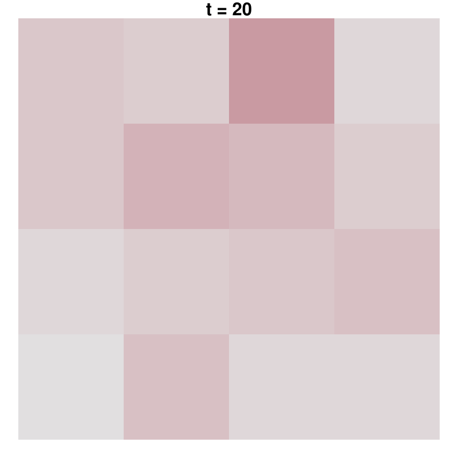

::: article
# Introduction {#sec:intro}

Whereas autoregressive conditional heteroscedasticity (ARCH) models are
applied widely in time series analysis, especially in financial
econometrics, spatial conditional heteroscedasticity has not been seen
as critical issue in spatial econometrics up to now. Although it is
well-known that classical least squares estimators are biased for
spatially correlated data as well as for spatial data with an
inhomogeneous variance across space, there are just a few papers
proposing statistical models accounting for spatial conditional
heteroscedasticity in terms of the ARCH and GARCH models of [@Engle82]
and [@Bollerslev86]. The first extensions to spatial models attempted
were time series models incorporating spatial effects in temporal lags
(see @Borovkova12 and @Caporin06, for instance). Instantaneous spatial
autoregressive dependence in the conditional second moments, i.e., the
conditional variance in each spatial location is influenced by the
variance nearby, has been introduced by [@Otto16_arxiv]. Further details
and derivations can also be found in
[@Otto18_spARCH; @Otto19_statpapers]. Their models allow for these
instantaneous effects but require certain regularity conditions. In this
paper, we propose an alternative specification of spatial autoregressive
conditional heteroscedasticity based on an exponential definition of the
conditional variance. This new model can be seen as the spatial
equivalent of the log-GARCH model by [@Pantula86; @Geweke86; @Milhoj87].
Other recent papers propose a mixture of these two approaches (see
@Sato17 [@Sato18b]). Moreover, all these models can be used in
spatiotemporal settings (see @Otto18_spARCH [@Sato18a]).

In addition to the novel spatial logarithmic ARCH model, this paper
demonstrates the use of the R-package
[*spGARCH*](https://CRAN.R-project.org/package=spGARCH). From this
practical point of view, the simulation of several spatial ARCH-type
models as well as the estimation of a variety of spatial models with
conditional heteroscedasticity are shown. There are several packages
implementing geostatistical models, kriging approaches, and other
spatial models (cf. @Cressie93 [@Cressie11]). One of the most powerful
packages used to deal with models of spatial dependence is
[*spdep*](https://CRAN.R-project.org/package=spdep), written by
[@spdep]. It implements most spatial models in a user-friendly way, such
as spatial autoregressive models, spatial lag models, and so forth (see,
also, @Elhorst10 for an overview). These models are typically called
spatial econometrics models, although they are not tied to applications
in economics. In contrast, the package
[*gstat*](https://CRAN.R-project.org/package=gstat) provides functions
for geostatistical models, variogram estimation, and various kriging
approaches (see @gstat for details). For dealing with big geospatial
data, the [*Stem*](https://CRAN.R-project.org/package=Stem) package uses
an expectation-maximization (EM) algorithm for fitting hierarchical
spatiotemporal models (see @Stem for details). For a distributed
computing environment, the MATLAB software D-STEM from [@Finazzi14] also
provides powerful tools for dealing with heterogeneous spatial supports,
large multivariate data sets, and heterogeneous spatial sampling
networks. Additionally, these fitted models are suitable for spatial
imputation. Contrary to these EM approaches, Bayesian methods for
modeling spatial data are implemented in the R-*INLA* package (see @inla
for technical details of the integrated nested Laplace approximations
and @inla2 for recently implemented features). Along with this package,
the R-*INLA* project provides several functions for diverse spatial
models incorporating integrated nested Laplace approximations.

In contrast to the above mentioned software for spatial models, the
prevalent R-package for time series GARCH-type models is
[*rugarch*](https://CRAN.R-project.org/package=rugarch) from [@rugarch].
Since [*spGARCH*](https://CRAN.R-project.org/package=spGARCH) has been
developed mainly to deal with spatial data, we aim to provide a package
which is user-friendly for researchers and data scientists working in
applied spatial science. Thus, the package is coordinated with the
objects and ideas of R packages for spatial data rather than packages
for dealing with time series.

We structure the paper as follows. In the next Section [2](#sec:models),
we discuss all covered spatial and spatiotemporal ARCH-type models. In
addition, we introduce a novel logarithmic spatial ARCH model, which has
weaker regularity conditions than the other spatial ARCH models. In the
subsequent section, parameter estimation based on the maximum-likelihood
principle is discussed for both the previously proposed spatial ARCH
models as well as the new logarithmic spatial ARCH model. Furthermore,
spatial GARCH models are briefly discussed. However, the focus of this
paper should be on ARCH-type models. After these theoretical sections,
we demonstrate the use of the R-package
[*spGARCH*](https://CRAN.R-project.org/package=spGARCH) in Section
[5](#sec:spGARCH_package). Further, we fit a spatial autoregressive
model with exogenous regressors and spatial ARCH residuals for a
real-world data set. In particular, we analyze prostate cancer incidence
rates in southeastern U.S. states. Section [7](#sec:summary) concludes
the paper.

# Spatial ARCH-type models {#sec:models}

Let
$\left\{Y(\boldsymbol{s}) \in \mathbb{R}: \boldsymbol{s} \in D \right\}$
be a univariate stochastic process having a spatial autoregressive
structure in the conditional variance. The process is defined in a
multidimensional space $D$, which is typically a subset of the
$q$-dimensional real numbers $\mathbb{R}^q$, as space is usually finite.
For dealing with spatial lattice data, $D$ is subset of the
$q$-dimensional integers $\mathbb{Z}^q$. For both cases, it is important
that the subset contains a $q$-dimensional rectangle of positive volume
(cf. @Cressie11). Moreover, this definition is suitable for modeling
spatiotemporal data, as one might assume that $D$ is the product set
$\mathbb{R}^{k} \times \mathbb{Z}^{l}$ with $k + l = d$.

To define spatial models, in particular areal spatial models such as the
simultaneous autoregressive (SAR) models, it is convenient to consider a
vector of observations
$\boldsymbol{Y} = (Y(\boldsymbol{s}_1), \ldots, Y(\boldsymbol{s}_n))^\prime$
at all locations $\boldsymbol{s}_1, \ldots, \boldsymbol{s}_n$. For
spatial ARCH models, we specify this vector as
$$\label{eq:spARCHy}
\boldsymbol{Y} = \mathrm{diag}(\boldsymbol{h})^{1/2}\boldsymbol{\varepsilon} \, ,   (\#eq:spARCHy)$$
an analogue to the well-known time series ARCH models (cf. @Engle82
[@Bollerslev86]). However, note that the vector $\boldsymbol{h}$ does
not necessarily coincide with the conditional variance
$$Var(Y(\boldsymbol{s}_i) | Y(\boldsymbol{s}_1), \ldots, Y(\boldsymbol{s}_{i-1})) \, ,$$
as the variance in any location $\boldsymbol{s}_j$ also depends on
$Y(\boldsymbol{s}_i)$ for $j \neq i$ (see @Otto18_spARCH for details).
We now distinguish between several spatial ARCH-type models via the
definition of $\boldsymbol{h}$.

## Spatial ARCH model {#sec:spARCH}

First, we define this vector $\boldsymbol{h}$ in such a way as to be
analogous to the definition in [@Otto18_spARCH]. For this model, the
vector $\boldsymbol{h}_O$ is given by
$$\label{eq:h_spARCH}
\boldsymbol{h}_O = \alpha\boldsymbol{1} + \rho\mathbf{W} \mathrm{diag}(\boldsymbol{Y}) \boldsymbol{Y} \, ,   (\#eq:h-spARCH)$$
where $\mathrm{diag}(\boldsymbol{a})$ is a diagonal matrix with the
entries of $\boldsymbol{a}$ on the diagonal. In order to be consistent
with the implementation in the R-package
[*spGARCH*](https://CRAN.R-project.org/package=spGARCH), we focus on the
special case with two parameters $\alpha$ and $\rho$, whereas
[@Otto18_spARCH] proposed a more general model with a vector
$\boldsymbol{\alpha} = (\alpha_1, \ldots, \alpha_n)'$ and the
first-order spatial lag
$\mathbf{W}\mathrm{diag}(\boldsymbol{Y}) \boldsymbol{Y}$.

For this definition, there is a one-to-one relation between
$\boldsymbol{Y}$ and $\boldsymbol{\varepsilon}$ via the squared
observations
$\boldsymbol{Y}^{(2)} = (Y(\boldsymbol{s}_1)^2, \ldots, Y(\boldsymbol{s}_n)^2)^\prime$
and squared errors
$\boldsymbol{\varepsilon}^{(2)} = (\varepsilon(\boldsymbol{s}_1)^2, \ldots, \varepsilon(\boldsymbol{s}_n)^2)^\prime$
with
$$\label{eq:Y2}
\boldsymbol{Y}^{(2)} = \alpha \, \left(\mathbf{I} - \mathbf{A} \right)^{-1} \boldsymbol{\varepsilon}^{(2)}\, ,   (\#eq:Y2)$$
where $\mathbf{W}$ is a predefined spatial weighting matrix and
$$\label{eq:A}
\mathbf{A} = \rho \, \mathrm{diag}\left(\varepsilon(\boldsymbol{s}_1)^2, \ldots, \varepsilon(\boldsymbol{s}_n)^2\right) \mathbf{W} \, .   (\#eq:A)$$
Thus,
$$\boldsymbol{h}_O = \alpha\boldsymbol{1} + \rho \alpha \mathbf{W} \left(\mathbf{I} - \mathbf{A} \right)^{-1} \boldsymbol{\varepsilon}^{(2)} \, .$$

It is important to assume that the spatial weighting matrix is a
non-stochastic, positive matrix with zeros on the main diagonal to
ensure that a location is not influenced by itself (cf. @Elhorst10
[@Cressie11]). The vector of random errors is denoted by
$\boldsymbol{\varepsilon}$. Due to the complex dependence implied by the
weighting matrix $\mathbf{W}$, $\boldsymbol{h}_O$ is not necessarily
positive; thus, $\mathrm{diag}(\boldsymbol{h})^{1/2}$ does not
necessarily have a solution in the real numbers such that the process in
\@ref(eq:spARCHy) is well-defined. This is only the case if the
condition of the following lemma is fulfilled.

::: {#th:spARCH .lemma}
**Lemma 1** (@Otto18_spARCH). *Suppose that $\alpha \geq 0$,
$\rho \geq 0$ and that $\det(\mathbf{I} - \mathbf{A}^2) \neq 0$. If all
elements of the matrix
$$\label{eq:inverse_I-A}
(\mathbf{I} - \mathbf{A}^2)^{-1}%%%   (\#eq:inverse-I-A)$$
are nonnegative, then all components of $\boldsymbol{Y}^{(2)}$ are
nonnegative, i.e., $Y(\boldsymbol{s}_i)^2 \ge 0$ for $i=1,\ldots,n$.
Moreover, $h_O(\boldsymbol{s}_i) \ge 0$ for $i=1,\ldots,n$.*
:::

It is important to note that $\mathbf{A}$ depends on both the weighting
matrix and the realizations of the errors. In order to ensure that this
condition is fulfilled, [@Otto18_spARCH] propose to truncate the support
of the error distribution on the interval $(-a, a)$ with
$$a = \left\{
  \begin{array}{cc}
  \infty                                       &  \exists k > 0 : \rho\mathbf{W}^k = \mathbf{0} \\ % \rho = 0 \;  \vee   \;
  {1}/{\sqrt[4]{ \rho^2||\mathbf{W}^2 ||_1}}     &  \rho^2 || \mathbf{W}^2 ||_1 > 0
  \end{array} \right. \, ,$$
where $|| \cdot ||_1$ denotes the matrix norm based on the Manhattan
norm.

There are two cases in which the support of the errors does not need to
be constrained. If $\rho = 0$, the process coincides with a spatial
white noise process such that $a$ equals $\infty$. Moreover, all entries
of $\boldsymbol{h}$ are non-negative if $\mathbf{W}$ is similar to a
strictly triangular matrix. Then, $\mathbf{W}$ is nilpotent. This case
covers the classical time-series ARCH($p$) models introduced by
[@Engle82] as well as the so-called oriented spARCH processes. For these
processes, the spatial dependence has a certain direction, e.g.,
observations are only influenced by observations in a southward
direction or by observations which are closer to an arbitrarily chosen
center. The setting also covers recent time-series GARCH models
incorporating spatial information (e.g., @Borovkova12 [@Caporin06]).

Of course, the truncated support of the errors has an impact on the
extent of the spatial dependence on the conditional variances.
Obviously, the support need not be constrained regarding $\rho = 0$.
However, this support decreases with increasing values of $\rho$. For
instance, if $\rho = 1$, then the parameter $a$ is equal to $0.968$ for
Rook's contiguity matrices on a two-dimensional lattice. As a measure of
the spatial dependence of the variance, one might consider Moran's $I$
for the squared observations (see @Moran50). Moreover, we observe that
the growth rate of $I$ decreases with increasing spatial weights. This
trend can be explained by the compact support of the errors. Since there
cannot be large variations $\varepsilon(\boldsymbol{s}_i)$ in absolute
terms, there also cannot be large spatial clusters of high or low
variance. To illustrate this behavior, Figure [1](#fig:MoransI) depicts
Moran's $I$ for simulated observations $\boldsymbol{Y}$ and their
squares for $\rho \in \{0,0.05, \ldots, 2\}$. For the Monte Carlo
simulation study, we simulate $n = 400$ observation on a two-dimensional
lattice
$D = \{\boldsymbol{s} = (s_1, s_2)' \in \mathbb{Z}^2: 0 \leq s_1, s_2 \leq 20\}$.
The weighting matrix is a common Rook's contiguity matrix, and the
simulation is done for $10^5$ replications. Although the exact
distribution of Moran's statistic is bounded, the standardized statistic
is asymptotically normally distributed for the "majority of spatial
structures" (@Tiefelsdorf95, see also @Cliff81). Thus, the asymptotic
95% confidence intervals are plotted in Figure [1](#fig:MoransI), as
well.

{#fig:MoransI width="100%"
alt="graphic without alt text"}

## Spatial Log-ARCH model {#sec:EspARCH}

Next, we consider an logarithmic spatial ARCH process (log-spARCH). In
this setting, we define the natural logarithm of
$\boldsymbol{h}_E = (h_{E}(\boldsymbol{s}_1), \ldots, h_{E}(\boldsymbol{s}_n))'$
as
$$\label{eq:EspARCHh}
\ln \boldsymbol{h}_E = \alpha\boldsymbol{1} + \rho\mathbf{W} g_b(\boldsymbol{\varepsilon}) \, ,   (\#eq:EspARCHh)$$
with a function $g_b: \mathbb{R}^n \rightarrow \mathbb{R}^n$. Like
[@Nelson91], we assume that
$$g_b(\boldsymbol{\varepsilon}) = (\ln |\varepsilon(\boldsymbol{s}_1)|^b, \ldots, \ln |\varepsilon(\boldsymbol{s}_n)|^b)'$$
for positive values of $b$. For this definition, there is a one-to-one
relation between $\boldsymbol{Y}$ and $\boldsymbol{\varepsilon}$, as we
show in the following theorem.

::: {#th:EspARCH .theorem}
**Theorem 1**. *Suppose that $\alpha > 0$, $\rho \geq 0$, and
$w_{ij} \geq 0$ for all $i,j = 1, \ldots, n$ and
$g_b(\boldsymbol{\varepsilon}) = (\ln |\varepsilon(\boldsymbol{s}_1)|^b, \ldots, \ln |\varepsilon(\boldsymbol{s}_n)|^b)'$.
Then there exists one and only one
$Y(\boldsymbol{s}_1), \ldots, Y(\boldsymbol{s}_n)$ that corresponds to
each
$\varepsilon(\boldsymbol{s}_1), \ldots, \varepsilon(\boldsymbol{s}_n)$
for $b > 0$.*
:::

At location $\boldsymbol{s}_i$, the value of $h_{E}(\boldsymbol{s}_i)$
is then given by
$$\ln h_{E}(\boldsymbol{s}_i) = \alpha + \sum_{v=1}^{n} \rho b w_{iv} \ln |\varepsilon(\boldsymbol{s}_v)| \; \text{for} \; i = 1, \ldots, n\, .$$
For this definition of $g_b$, one could rewrite $\ln \boldsymbol{h}$ as
$$\label{eq:h_EspARCH}
\ln \boldsymbol{h}_E = \mathbf{S} \left(\alpha\boldsymbol{1} + \rho b \mathbf{W} \ln|\boldsymbol{Y}|\right)   (\#eq:h-EspARCH)$$
with
$$\mathbf{S} = (s_{ij})_{i,j = 1, \ldots, n} = \left(\mathbf{I} + \frac{1}{2} \rho b \mathbf{W}\right)^{-1} \, .$$
In contrast to the spARCH process described in Section
[2.1](#sec:spARCH), Corollary [1](#cor:EspARCH) shows that the entries
of $\boldsymbol{h}_E$ are positive for all $\rho \geq 0$ and
$\alpha > 0$. Hence, the process is well-defined and there are no
further restrictions needed, as in the case for the spARCH model.

::: {#cor:EspARCH .corollary}
**Corollary 1**. *Assume that the assumptions of Theorem
[1](#th:EspARCH) are fulfilled, then
$\boldsymbol{h}_{E}(\boldsymbol{s}_i) \geq 0$ for all
$i = 1, \ldots, n$.*
:::

For all proofs, we refer to the Appendix.

## Complex Spatial ARCH model {#sec:complexspARCH}

Now, we propose a complex-valued spARCH process. In order to obtain a
solution of $\mathrm{diag}(\boldsymbol{h})^{1/2}$ in the $n$-dimensional
space of real numbers for the model defined in \@ref(eq:h-spARCH), all
elements of the matrix $(\mathbf{I} - \mathbf{A}^2)^{-1}$ must be
nonnegative (see @Otto18_spARCH). For the complex spARCH process, we
relax the assumption that there should be a solution to
$\mathrm{diag}(\boldsymbol{h})^{1/2}$ in the real numbers and also
consider complex solutions. Thus, the definition of $\boldsymbol{h}$
coincides with $\boldsymbol{h}_O$ of the original model, i.e.,
$$\label{eq:complexspARCH}
h_{C}(\boldsymbol{s}_i) = \alpha + \sum_{v=1}^{n} \rho w_{iv} Y(\boldsymbol{s}_v)^2 \, .   (\#eq:complexspARCH)$$

## Spatiotemporal ARCH model {#sec:spatiotemporal}

Finally, we show that spatiotemporal processes are covered directly by
these approaches. For spatiotemporal data, the vector $\boldsymbol{s}$
simply includes both the spatial location $\boldsymbol{s}_s$ and the
point in time $t$, i.e., $\boldsymbol{s} = (\boldsymbol{s}_s, t)'$. In
addition, it is important to assume that future observations do not
influence past observations, i.e., the weights $w_{ij}$ must be zero if
$t_j \geq t_i$. However, the dimension of the weighting matrix
$\mathbf{W}$ might become very large for this representation. More
precisely, the matrix has dimension $NT \times NT$, where $N$ is the
total number of spatial locations and $T$ stands for the total number of
time points. From a computational perspective, this is not necessarily a
drawback since $\mathbf{W}$ is usually sparse and could also have a
block diagonal structure. Moreover, it is often reasonable to assume
that $h(\boldsymbol{s}_i)$ is only influenced by the neighbors of
$\boldsymbol{s}_{s, i}$ at the same point of time and by past
observations at the same location. Then the weighting matrix would have
the following structure
$$\mathbf{W} = \left(\begin{array}{cccc}
\mathbf{W}_1    & \mathbf{0}      & \cdots & \mathbf{0} \\
\mathbf{I}      & \mathbf{W}_2    & \cdots & \mathbf{0} \\
\vdots        & \vdots        & \ddots & \vdots        \\
\mathbf{0}      & \mathbf{0}      & \cdots & \mathbf{W}_T    \\
\end{array}\right) \, .$$
Indeed, it is plausible to weight the spatial and temporal lags
differently by replacing $\rho \mathbf{W}$ by a sum
$$\rho \left(\begin{array}{cccc}
\mathbf{W}_1    & \mathbf{0}      & \cdots & \mathbf{0} \\
\mathbf{0}      & \mathbf{W}_2    & \cdots & \mathbf{0} \\
\vdots        & \vdots        & \ddots & \vdots        \\
\mathbf{0}      & \mathbf{0}      & \cdots & \mathbf{W}_T    \\
\end{array}\right)
+
\phi_1 \left(\begin{array}{cccc}
\mathbf{0}      & \mathbf{0}      & \cdots & \mathbf{0} \\
\mathbf{I}      & \mathbf{0}      & \cdots & \mathbf{0} \\
\vdots        & \vdots        & \ddots & \vdots        \\
\mathbf{0}      & \mathbf{0}      & \cdots & \mathbf{0}      \\
\end{array}\right)
+ \ldots
\,$$
with positive weights $\phi_k$ for all temporal lags $1 \leq k \leq p$.

::: {#table:ARCHmodels}
  -----------------------------------------------------------------------------------------------------------------------------------------------------------------------------------------------------------------------------------------------------------------------------------------------------------------------------------------------------------------------------
  Process type        Definition of $\boldsymbol{h}$                                                                                                                  Comments
  ------------------- ----------------------------------------------------------------------------------------------------------------------------------------------- ---------------------------------------------------------------------------------------------------------------------------------------------------------------------------------------------------------
  spARCH              $\boldsymbol{h}_O = \alpha\boldsymbol{1} + \rho\mathbf{W} \left(\mathbf{I} - \mathbf{A} \right)^{-1} (\alpha \boldsymbol{\varepsilon}^{(2)})$   $\boldsymbol{\varepsilon}$ is simulated from multivariate normal distribution (MN) truncated on the interval $\left[-1/\sqrt[4]{||\rho^2\mathbf{W}^2||_1}, 1/\sqrt[4]{||\rho^2\mathbf{W}^2||_1}\right]$

  spARCH (oriented)   $\boldsymbol{h}_O = \alpha\boldsymbol{1} + \rho\mathbf{W} \left(\mathbf{I} - \mathbf{A} \right)^{-1} (\alpha \boldsymbol{\varepsilon}^{(2)})$   $\boldsymbol{\varepsilon} \sim \text{MN}(\boldsymbol{0}, \mathbf{I})$, $\mathbf{W}$ must be a strictly triangular weighting matrix

  spatial log-ARCH    $\ln \boldsymbol{h}_E = \mathbf{S} \left(\alpha\boldsymbol{1} + \rho b \mathbf{W} \ln|\boldsymbol{Y}|\right)$                                   $\boldsymbol{\varepsilon} \sim \text{MN}(\boldsymbol{0}, \mathbf{I})$, but moments of $\boldsymbol{Y}$ differ from the moments of classical spARCH process (cf. @Otto18_spARCH)

  spARCH (complex)    $\boldsymbol{h}_C = \alpha\boldsymbol{1} + \rho\mathbf{W} \left(\mathbf{I} - \mathbf{A} \right)^{-1}(\alpha \boldsymbol{\varepsilon}^{(2)})$    $\boldsymbol{\varepsilon} \sim \text{MN}(\boldsymbol{0}, \mathbf{I})$, but complex-valued $\boldsymbol{Y}$
  -----------------------------------------------------------------------------------------------------------------------------------------------------------------------------------------------------------------------------------------------------------------------------------------------------------------------------------------------------------------------------

  : Table 1: Overview of all types of spARCH models implemented in the
  [*spGARCH*](https://CRAN.R-project.org/package=spGARCH) package.
:::

## Spatial ARCH Disturbances {#sec:SARspARCH}

Since all conditional and unconditional odd moments of spatial ARCH
processes are equal to zero, these ARCH-type models can easily be added
to any kind of (spatial) regression model without influencing the mean
equation as well as the spatial dependence in the first conditional and
unconditional moments. This makes the spatial ARCH models flexible tools
for dealing with conditional spatial heteroscedasticity in the residuals
of spatial models. For instance, one can consider spatial autoregressive
models for $\boldsymbol{Y}$, i.e.,
$$\begin{aligned}
\label{eq:SARspARCH1}
\boldsymbol{Y} = \lambda \mathbf{B} \boldsymbol{Y} +  \mathbf{X} \boldsymbol{\beta} + \boldsymbol{u} 
\end{aligned}   (\#eq:SARspARCH1)$$
with $\boldsymbol{u}$ following either a spatial ARCH model with the
original definition $\boldsymbol{h}_O$ or the logarithmic model with
$\boldsymbol{h}_E$. Thus,
$$\begin{aligned}
\label{eq:SARspARCH2}
\boldsymbol{u} = \mathrm{diag}(\boldsymbol{h})^{1/2}\boldsymbol{\varepsilon} \, . 
\end{aligned}   (\#eq:SARspARCH2)$$
Further, we call this model the SARspARCH model. For $\lambda = 0$, the
model collapses to a simple linear regression model; if, additionally,
$\boldsymbol{\beta} = \boldsymbol{0}$, the model coincides with the
previously discussed ARCH models. Thus, these coefficients can be used
for testing against nested models.

In contrast to other models for heteroscedastic errors, such as the
SARAR or SARMA models, which assume spatial autoregressive or spatial
moving average error terms (cf. @Kelejian10
[@Fingleton08b; @Haining78]), the SARspARCH model does not affect the
spatial autocorrelation of the process, just the spatial
heteroscedasticity, because all conditional and unconditional odd
moments are equal to zero. Thus, $\lambda \mathbf{B}$ can be interpreted
directly as the spatial dependence of the process, while
$\rho \mathbf{W}$ describes the spatial dependence in the second
conditional moments. Moreover, these two parts can be interpreted
separately, as we will demonstrate in the last section via an empirical
example.

# Generalized Spatial ARCH Models {#sec:spGARCH}

Additionally, one may include spatially lagged observations of
$\boldsymbol{h}$ to construct spatial GARCH-type models. For instance, a
spatial GARCH model is given by
$$\begin{aligned}
\label{eq:h_spGARCH}
\boldsymbol{h}_G & = & \alpha\boldsymbol{1} + \rho\mathbf{W} \mathrm{diag}(\boldsymbol{Y}) \boldsymbol{Y} + \lambda \breve{\mathbf{W}} \boldsymbol{h}_G \\
           & = & (\mathbf{I} - \lambda \breve{\mathbf{W}})^{-1} \left(\alpha\boldsymbol{1} + \rho\mathbf{W} \mathrm{diag}(\boldsymbol{Y}) \boldsymbol{Y} \right) \, ,
\end{aligned}   (\#eq:h-spGARCH)$$
where $\breve{\mathbf{W}}$ is a second spatial weighting matrix and
$\lambda$ is the corresponding spatial GARCH parameter. Obviously, the
spatial GARCH-type models requires that
$(\mathbf{I} - \lambda \breve{\mathbf{W}})$ is non-singular. In a
similar manner, $\boldsymbol{h}_{LG}$ can be specified as
$$\label{eq:h_EspGARCH}
\ln \boldsymbol{h}_{LG} = \alpha\boldsymbol{1} + \rho\mathbf{W} g_b(\boldsymbol{\varepsilon}) + \lambda \breve{\mathbf{W}} \boldsymbol{h}_{LG}  \, ,   (\#eq:h-EspGARCH)$$
to define a spatial log-GARCH model. For theoretical details of spatial
GARCH-type models, we refer to [@Otto19_unified_arxiv] introducing a
unified spatial GARCH model covering various spatial ARCH and GARCH
models. Moreover, [@Otto19_unified_arxiv] introduce an exponential
spatial GARCH model allowing for asymmetry via an alternative definition
of $g$ in \@ref(eq:EspARCHh). To be precise, $g$ is given by
$$g(\boldsymbol{\varepsilon}) = (\Theta \varepsilon_1 + \zeta (|\varepsilon_1| - E(|\varepsilon_1|) ), \ldots, \Theta \varepsilon_n + \zeta (|\varepsilon_n| - E(|\varepsilon_n|) )'$$
for the exponential spatial GARCH model.

# Parameter Estimation {#sec:estimation}

The parameters of a spatial ARCH process can be estimated by the
maximum-likelihood approach. To obtain the joint density for
$\boldsymbol{Y} = k(\boldsymbol{\varepsilon})$, the Jacobian matrix of
$k^{-1}$ at the observed values $\boldsymbol{y}$ must be computed (e.g.,
@Bickel15). If $f_{\boldsymbol{\varepsilon}}$ is the distribution of the
error process, then the joint density $f_{\boldsymbol{Y}}$ of
$\boldsymbol{Y}$ is given by
$$\begin{aligned}
\label{eq:transformation}
f_{\boldsymbol{Y}}(\boldsymbol{y}) & =  & f_{(Y(\boldsymbol{s}_1), \ldots, Y(\boldsymbol{s}_n))}(y_1, \ldots, y_n) \nonumber \\
& = & f_{\boldsymbol{\varepsilon}}\left(\frac{y_1}{\sqrt{h}_1}, \ldots, \frac{y_n}{\sqrt{h}_n}\right) | \det\left( \left( \frac{\partial y_j/\sqrt{h_j}}{\partial y_i} \right)_{i,j=1,\ldots,n}\right) | \, . 
\end{aligned}   (\#eq:transformation)$$
If the residuals are additionally independent and identically
distributed, the parameter estimates can be obtained from the
maximization of the log-likelihood as follows
$$\begin{aligned}
(\hat{\alpha}, \hat{\rho}) = \underset{\alpha > 0, \rho \geq 0}{\arg\max} \; \ln | \det\left( \left( \frac{\partial y_j/\sqrt{h_j}}{\partial y_i} \right)_{i,j=1,\ldots,n}\right) | +  \sum_{i = 1}^{n} \ln f_{\varepsilon}(y_i) \, .
\end{aligned}$$

The Jacobian matrix, of course, depends on the definition of
$\boldsymbol{h}$. For the spARCH process, this Jacobian matrix can be
specified as
$$\frac{\partial y_j/\sqrt{h_j}}{\partial y_i} = \left\{
\begin{array}{ccc}
1\, /\, \sqrt{h}_j & for & i=j \\
- \frac{y_i y_j}{h_j^{3/2}} \rho w_{ji} & for & i \neq j
\end{array} \right. \, .$$
In contrast, the Jacobian matrix for the log-spARCH process is slightly
different, namely
$$\frac{\partial y_j/\sqrt{h_j}}{\partial y_i} = \left\{
\begin{array}{ccc}
1\, /\, \sqrt{h_j} & for & i = j \\
- \frac{b y_j}{2 y_i h_j^{3/2}} \rho s_{ji} w_{ji} & for & i \neq j
\end{array} \right. \,$$
with
$$h_j = \mathrm{exp}\left(\sum_{v = 1}^{n} s_{jv}\left(\alpha +\rho w_{jv} \ln |y_v| \right) \right) \, .$$

From a computational perspective, the computation of the log determinant
of this matrix is feasible for large data sets. To be precise, the
log-determinant is equal to
$$\ln | \det\left( \text{diag}\left(\frac{h_1}{y_1^2},\ldots, \frac{h_n}{y_n^2}\right) - \rho \mathbf{W}^\prime \right) | + \sum_{i=1}^n \ln \frac{y_i^2}{h_i^{3/2}}$$
for the spARCH process. Similarly, it is given by
$$\ln | \det\left( \mathrm{diag}\left(\frac{2 h_1}{b},\ldots, \frac{2 h_n}{b}\right) - \rho \mathbf{S}^\prime \circ \mathbf{W}^\prime \right) | +  \sum_{i=1}^n \ln \frac{b}{2 h_i^{3/2}} \, .$$
for the log-spARCH process, where $\circ$ stands for the Hadamard
product.

In the [*spGARCH*](https://CRAN.R-project.org/package=spGARCH) package,
we implemented the iterative maximization algorithm with inequality
constraints proposed by [@Ye88], which is implemented in the R-package
[*Rsolnp*](https://CRAN.R-project.org/package=Rsolnp) (see @RSolnp). It
is important to note that the log determinant of the Jacobian also
depends on the parameters in such a way that it needs to be computed in
each iteration (see, also, Theorem 13.7.3 of [@Harville97] for the
computation of a determinant for the sum of a diagonal matrix and an
arbitrary matrix), but $\mathbf{W}$, and therefore
$\mathbf{S} \circ \mathbf{W}$, are usually sparse. Thus, the required
time for the estimation of the parameters depends mainly on the
dimension and sparsity of $\mathbf{W}$.

Certainly, the choice of the weighting matrices are an important design
choice of the models, which has to be prespecified. However, the true
structure of $\mathbf{W}$ is rarely known in practice. Moreover, all
estimated parameters depend on the selection of this matrix. Hence,
inference on these parameters and the coefficients itself must be
interpreted based on the choice of $\mathbf{W}$. For empirical
applications, one might gain insights on the structure of $\mathbf{W}$
by looking at spatial autocorrelation functions or variograms. It is
worth noting that the observations are uncorrelated for spatial ARCH
models, so one should also look at squared observations. Then, the
weighting scheme is typically chosen from a set of candidate schemes by
maximizing certain goodness-of-fit criteria, like information criteria
or out-of-sample prediction errors. For instance, $\mathbf{W}$ could be
chosen as contiguity matrix, i.e., two locations are connected having
positive weights, if they share a common border or if their distance is
less than a certain threshold. For instance, in studies in spatial
econometrics or epidemiology, the spatial domain is often a set of
municipalities or counties (e.g., @Amin14a [@Buettner03]). In this case,
contiguity matrices are straightforward and if these binary matrices are
additionally row-standardized,
$\mathbf{W} \mathrm{diag}(\boldsymbol{Y}) \boldsymbol{Y}$ can be
interpreted as average of the squared neighboring observations.
Alternatively, $\mathbf{W}$ can be specified as $k$-nearest-neighbor
matrix, i.e., only the $k$ nearest locations get positive weights, or as
inverse-distance matrix, i.e., the weight between two locations is based
on the distance between these locations. Further choices of $\mathbf{W}$
are discussed by [@Otto18_spARCH]. Finally, it is worthy to mention that
the weights could also depend on exogenous variables or other factors.
For instance, they could incorporate economic disparities, e.g.,
differences in the gross domestic products, poverty rates, household
incomes etc., or other covariates, like the wind direction and speed
when modeling spatial dependence of air pollutants (cf. @Merk19). For
spatiotemporal autoregressive processes, there are also some approaches
to estimate the entire spatial dependence structure using machine
learning methods (e.g., @Lam16 [@Otto18_lasso]).

# Overview of the R-Package *spGARCH* {#sec:spGARCH_package}

The R-package [*spGARCH*](https://CRAN.R-project.org/package=spGARCH)
provides several basic functions for the analysis of spatial data
showing spatial conditional heteroscedasticity. In particular, the
process can be simulated for arbitrarily chosen weighting matrices
according to the definitions in Section [2](#sec:models). Moreover, we
implement a function for the computation of the maximum-likelihood
estimators. To generate a user-friendly output, the object generated by
the estimation function can easily be summarized by the generic
`summary()` function. We also provide all common generic methods, such
as `plot()`, `print()`, `logLik()`, and so forth. To maximize the
computational efficiency, the actual version of the package contains
compiled C++ code (using the packages
[*Rcpp*](https://CRAN.R-project.org/package=Rcpp) and
[*RcppEigen*](https://CRAN.R-project.org/package=RcppEigen), cf. @Rcpp
[@RcppEigen]). A brief overview of the package and its main functions is
given in Table [2](#table:functions). Further, we focus on the two main
aspects of the package, i.e., the simulation (described in detail in
Section [5.1](#sec:comp_simulation)) and estimation (Section
[5.2](#sec:comp_estimation)) aspects of the spARCH, log-spARCH, and
SARspARCH processes.

::: {#table:functions}
  -----------------------------------------------------------------------------------------------------------------------
  Function                    Description
  --------------------------- -------------------------------------------------------------------------------------------
  *Main functions*            

  $\quad$ `sim.spARCH()`      Simulation of spARCH and log-spARCH processes

  $\quad$ `sim.spGARCH()`     Simulation of spGARCH, E-spGARCH, and log-spGARCH processes

  $\quad$ `qml.spARCH()`      Quasi-maximum-likelihood estimation for spARCH models

  $\quad$ `qml.SARspARCH()`   Quasi-maximum-likelihood estimation for SAR models with spARCH residuals

  *Generic methods*           

  $\quad$ `summary()`         Summary of an object of '`spARCH`' class generated by `qml.spARCH()` or `qml.SARspARCH()`

  $\quad$ `print()`           Printing method for '`spARCH`' class or `summary.spARCH` class

  $\quad$ `fitted()`          Extracts the fitted values of an object of '`spARCH`' class

  $\quad$ `residuals()`       Extracts the residuals of an object of '`spARCH`' class

  $\quad$ `logLik()`          Extracts the log-likelihood of an object of '`spARCH`' class

  $\quad$ `extractAIC()`      Extracts the AIC of an object of '`spARCH`' class

  $\quad$ `plot()`            Provides several descriptive plots of the residuals of an object of '`spARCH`' class
  -----------------------------------------------------------------------------------------------------------------------

  : Table 2: Summary of the main functions of the
  [*spGARCH*](https://CRAN.R-project.org/package=spGARCH) package.
:::

## Simulation of ARCH-type stochastic processes {#sec:comp_simulation}

The simulations of all spatial ARCH-type models are implemented in one
function, namely, the `sim.spARCH()` function. The different definitions
of the model are specified via the argument `type`. The use of
`sim.spARCH()` is very similar to how a basic random number generator is
used, meaning that the first argument `n` is the number of generated
values and all further arguments specify the parameters of the spARCH
process. For instance, one might simulate an oriented spARCH process
(meaning $\mathbf{W}$ is triangular) on a $d \times d$ spatial lattice
with $\rho = 0.7$ and $\alpha = 1$ using the following lines.

``` r
R> require("spdep")
R> rho              <- 0.7
R> alpha            <- 1
R> d                <- 50
R> n                <- d^2
R> nblist           <- cell2nb(d, d, type = "queen")
R> W                <- nb2mat(nblist)
R> W[upper.tri(W)]  <- 0
R> Y                <- sim.spARCH(n = n, rho = rho, alpha = alpha, W = W,
+                               type = "spARCH", control = list(seed = 5515))
```

To build the spatial weighting matrix, we used `cell2nb()` from the
[*spdep*](https://CRAN.R-project.org/package=spdep) package, returning
an `nb` object of a $d \times d$ lattice (see @Cressie93 [@spdep]).
Further, we converted the `nb` object into a contiguity matrix, as
`sim.spARCH()` requires either a matrix (class `matrix`) or a sparse
matrix (class `dgCMatrix`) as an argument. Usually, spatial weighting
matrices are sparse by construction. Thus, $\mathbf{W}$ is always
converted internally to a `dgCMatrix` matrix or rather to a
`SparseMatrix` object defined in the eigen library in C++. Via the
`control` parameter, a random seed might be passed to the simulation
function. If not, a random seed is assigned randomly from a uniform
distribution and printed in console in order that one might reproduce
the result even without having a random seed specified in advance. We
prefer to print a single number in the console rather than returning to
the random number generator (RNG) state as an attribute of the returned
vector. Thus, a random seed might either be passed as an optional
argument to `sim.spARCH()` or set before calling `sim.spARCH()` by
`set.seed()`.

There are several types of spatial ARCH processes which can be simulated
by `sim.spARCH()`. They are all specified by the argument `type`. If

-   `type = "spARCH"`, then the original spARCH process according to the
    definition in [@Otto18_spARCH] is simulated.
    -   If there exists a permutation such that $\mathbf{W}$ is a
        strictly triangular matrix, then the function simulates
        automatically an oriented spARCH process with independent and
        identically gaussian distributed errors.
    -   If there is no such permutation, then the errors are simulated
        from a truncated normal distribution with
        $a = 1 / \sqrt[4]{\rho^2 ||\mathbf{W}||_1}$.
-   `type = "log-spARCH"`, an log-spARCH process is simulated with an
    user-specified value of $b$ (default 2) and standard normal random
    errors.
-   `type = "complex-spARCH"`, complex solutions of
    $\mathrm{diag}(\boldsymbol{h})^{1/2}$ are considered in order to
    simulate the spARCH process.

Figure [2](#fig:simulations) illustrates the behavior of different types
of spatial ARCH processes. All of them are simulated with the same
parameters and random seeds in such a manner that the vector
$\boldsymbol{\varepsilon}$ is identical for all types of processes,
except for the spARCH process with the truncated normal errors. In the
first row, the spatial weighting is achieved via a strictly triangular
Queen's contiguity matrix, which means that the spatial dependence has
its origin in the upper left corner. To the contrary, $\mathbf{W}$
presents a classical Queen's contiguity matrix in the second row. We
additionally plot a spatial white noise process for comparison, as we
used a rather unconventional two-color scheme. Using this kind of color
scheme, one might distinguish between positive and negative
observations, such that it is easier to see the spatial volatility
clusters. Areas of smaller volatility are characterized by rather evenly
gray pixels, whereas clusters of high volatility have rather intense
colors. Moreover, the colors fluctuate irregularly between blue and red.

<figure id="fig:simulations">
<p><br />
<br />
Above left: spatial white noise for comparison; center: oriented spARCH
(<code>type = “gaussian”</code>); right: spatial E-ARCH
(<code>type = “exp”</code>).<br />
Below left: spARCH with truncated normal errors
(<code>type = “gaussian”</code>); center: spatial E-ARCH
(<code>type = “exp”</code>), right: complex spARCH
(<code>type = “complex”</code>).</p>
<figcaption>Figure 2: Simulations on a two-dimensional lattice for
triangular matrices (above) and non-triangular matrices (below). For all
simulations, we set <span class="math inline"><em>ρ</em> = 0.7</span>
and <span class="math inline"><em>α</em> = 1</span>, and <span
class="math inline"><strong>W</strong></span> is chosen to be the
Queen’s contiguity matrix.</figcaption>
</figure>

As pointed out in Section [2](#sec:models), spatiotemporal ARCH models
are directly covered if time is considered as one dimension of the
$q$-dimensional space $D$. Thus, a two-dimensional spatiotemporal
process
$\{Y_{t}(\boldsymbol{s}) : t = 1, \ldots, T; \boldsymbol{s} \in D_{\boldsymbol{s}}\}$
with $D_{\boldsymbol{s}}$ being a $d \times d$ unit grid and $T = 20$
points of time could be simulated as follows.

``` r
R> d      <- 4
R> T      <- 20
R> D_s    <- 1:(d^2)
R> D_t    <- 1:T
R> n      <- length(D_s) * length(D_t)
R> nblist <- cell2nb(d, d, type = "queen")
R> W_list <- nb2listw(nblist)
R> W_s    <- Matrix(listw2mat(W_list))
R> W      <- W_s
R> for(t in D_t[-1]){
R>   W    <- bdiag(W, W_s)
R> }
R> diag(W[-c(1:length(D_s)), -c((n - length(D_s)+1):n)]) <- 0.2
R> set.seed(1)
R> Y      <- sim.spARCH(n = n, rho = 0.8, alpha = 1, W = W, type = "log-spARCH")
```

The spatial weighting scheme has been chosen as block diagonal matrix
like proposed above, i.e., constant matrices
$\mathbf{W}_1 = \mathbf{W}_2 = \ldots = \mathbf{W}_T = \mathbf{W}_s$
along the diagonal define the instantaneous spatial interactions, while
constant weights of $0.2$ below the diagonal define the extend of the
temporal dependence. For instance, a central location would be weighted
equally by all eight spatial neighbors with a weight of $0.125$ and by
the observation of the same location at the previous time point by
$0.2$. Thus, $\mathbf{W}$ describes the structure and the extend of the
dependence in space and time. Eventually, $\rho$ has been chosen as
$0.8$ and we simulated the process as logarithmic spatial ARCH process.

The resulting simulation is depicted in Figures
[3](#fig:spatiotemporal1) and [4](#fig:spatiotemporal2). Whereas the
simulated values are shown as time series plots placed at their correct
spatial locations in Figure [3](#fig:spatiotemporal1),
[4](#fig:spatiotemporal2) depicts the observations as consecutive
spatial random fields. Note that the same color coding has been chosen
for both representations. On the one hand side, one can observe spatial
volatility clusters (e.g. in the pre-last plot in Figure
[4](#fig:spatiotemporal2), $t = 19$, in which the conditional variance
is low in the upper left corner, whereas the conditional variance of the
remaining locations is high). On the other hand, temporal volatility
cluster can be observed as well. For example, at location 16, the
variance is high at the first and last five time points, while it is
lower between $t = 6$ and $t = 14$.

<figure id="fig:spatiotemporal1">
<p><br />
<br />
<br />
</p>
<p>Note that the true spatial orientation is preserved in this
representation (<span class="math inline">4 × 4</span> grid), i.e.,
plots appearing close to each other are also located close to each other
in space and they are, therefore, more related than more distant
locations. An alternative representation as consecutive spatial random
fields is shown in Figure .</p>
<figcaption>Figure 3: Simulated spatiotemporal log-ARCH process depicted
as individual time series. The process has been simulated on a <span
class="math inline">4 × 4</span> spatial unit grid and for 20 points in
time. The spatial ARCH parameter <span
class="math inline"><em>ρ</em></span> equals 0.9 and <span
class="math inline"><em>α</em> = 1</span>.</figcaption>
</figure>

<figure id="fig:spatiotemporal2">
<p>...</p>
<p>The first five and the last two time points are plotted as spatial
random fields, i.e., the simulations are shown in their natural temporal
ordering. An alternative representation as time series in their true
spatial ordering is shown in Figure .</p>
<figcaption>Figure 4: Simulated spatiotemporal log-ARCH process depicted
as consecutive spatial random fields. The process has been simulated on
a <span class="math inline">4 × 4</span> spatial unit grid and for 20
points in time. The spatial ARCH parameter <span
class="math inline"><em>ρ</em></span> equals 0.9 and <span
class="math inline"><em>α</em> = 1</span>.</figcaption>
</figure>

For sake of completeness, we briefly demonstrate the simulation of
spatial GARCH-type models using the `sim.spGARCH()` function. Like for
`sim.spARCH()`, the type of the spatial GARCH model can be chosen by the
argument `type`. More precisely, there are the following options

-   `type = "spGARCH"` for simulation of spatial GARCH models according
    to the definition in \@ref(eq:h-spGARCH),
-   `type = "e-spGARCH"` for simulation of exponential spatial GARCH
    models according to the definition in \@ref(eq:h-EspGARCH) with $g$,
-   `type = "log-spGARCH"` for simulation of logarithmic spatial GARCH
    models according to the definition in \@ref(eq:h-EspGARCH) with
    $g_b$, and
-   `type = "complex-spGARCH"` for simulation of a complex-valued
    spatial GARCH model.

To simulate a spatial GARCH process, two spatial weights matrices need
to be specified via the arguments `W1` and `W2`. Moreover, two
parameters $\rho$ and $\lambda$ are passed to the simulation function by
the arguments `rho` and `lambda`. For instance, a spatial GARCH model
can be simulated on a $d \times d$ spatial unit grid as follows

``` r
R> require("spdep")
R> rho    <- 0.5
R> lambda <- 0.3
R> alpha  <- 1
R> d      <- 20
R> nblist <- cell2nb(d, d, type = "rook") # Rook's contiguity matrix
R> W_1    <- nb2mat(nblist)
R> W_2    <- W_1
R> Y      <- sim.spGARCH(rho = rho, lambda = lambda, alpha = alpha,
+                        W1 = W_1, W2 = W_2, type = "spGARCH")
```

Similarly, spatial log-GARCH processes and exponential spatial GARCH
processes can be simulated by changing the argument `type`. In this
case, the parameters $b$ must be provided for the log-GARCH or $\Theta$
and $\zeta$ for the e-spGARCH, respectively. These parameters can easily
passed to `sim.spGARCH()` by the arguments `b`, `theta`, and `zeta`.

## Maximum-likelihood estimation {#sec:comp_estimation}

Other important functions of the package are the `qml.spARCH()` and
`qml.SARspARCH()` functions, which implement a quasi-maximum-likelihood
estimation algorithm (QML). As for the `sim.spARCH()` function, many
spARCH models are covered in the `qml.spARCH()` and `qml.SARspARCH()`
function. Thus, the user needs to specify which particular spARCH model
is to be fitted via the argument `type`. Moreover, the model for the
mean equation is a user-specified `formula`, making the use of the
estimation functions similar to the use of the common `lm()` or `glm()`
functions.

In general, the estimators exhibited good performances for a variety of
error distributions in simulation studies, although the likelihood
function was derived under the normality assumption. This is not
surprising, as the maximum-likelihood estimators have good properties
under mild assumptions for the error processes of a variety of similar
spatial econometrics models (cf. @Lee04 [@Lee12; @Lee10d; @Lee10b]).
Thus, we refer to the approach as the QML approach, and the name of the
estimation functions start with `qml` instead of `ml`. In the following
paragraphs, we start the simulation of one specific sample, which is
then used further to illustrate the log-likelihood functions as well as
to demonstrate parameter estimation.

Compared to the log-spARCH processes, the likelihood functions of spARCH
models are rather flat around the global maximum. This behavior is
illustrated for simulated processes in Figure [5](#fig:LL). The
observations for the log-spARCH process have been simulated as follows.

``` r
R> nblist          <- cell2nb(20, 20, type = "queen")
R> W               <- nb2mat(nblist)
R> y               <- sim.spARCH(n = 20^2, rho = 0.5, alpha = 1, W = W,
+                              type = "log-spARCH", control = list(seed = 5515))
```

To simulate an oriented process, the entries of $\mathbf{W}$ above the
diagonal must be set to zero and the argument `type` must be changed to
`"spARCH"`, i.e.,

``` r
R> W[upper.tri(W)] <- 0
R> y2              <- sim.spARCH(n = 20^2, rho = 0.5, alpha = 1, W = W,
+                                 type = "spARCH",
+                                 control = list(seed = 5515))
```

<figure id="fig:LL">
<p><strong>spARCH process</strong><br />
<br />
<strong>log-spARCH process</strong><br />
</p>
<figcaption>Figure 5: Logarithmic likelihood function.</figcaption>
</figure>

To estimate the parameters of an intercept-free log-spARCH model without
any regressors, the formula passed to the function `qml.spARCH()` should
be specified as `y   0`. In addition, a `data.frame` can be passed via
the `data` argument to the `qml` functions. Although the likelihood
function of a spARCH process is flat, good estimates can be obtained
through iterative maximization. [@Otto18_spARCH] analyze the performance
of the estimators in detail. The algorithm implemented in the packages
is based on the [*Rsolnp*](https://CRAN.R-project.org/package=Rsolnp)
package, allowing for both equality and inequality parameter constraints
(cf. @RSolnp).

The results of the estimation procedure are returned via an object of
the class '`spARCH`', for which we provide additionally several generic
functions. First, there is a `summary()` function for the '`spARCH`'
object. The summary shows all important estimation results, i.e., the
parameter estimates, standard errors, test statistics, and asymptotic
p-values, including significance stars. The estimation of the above
simulated log-spARCH process would return the following results.

``` r
R> spARCH_object   <- qml.spARCH(y ~ 0, W = W, type = "log-spARCH")
R> summary(spARCH_object)
 Call:
qml.spARCH(formula = y ~ 0, W = W, type = "log-spARCH")

 Residuals:
      Min.    1st Qu.     Median       Mean    3rd Qu.       Max.
-2.6867629 -0.6197315 -0.0053580 -0.0002615  0.5708346  2.8576621

 Coefficients:
      Estimate Std. Error t value  Pr(>|t|)
alpha 0.919324   0.128544  7.1518 8.564e-13 ***
rho   0.402998   0.056519  7.1304 1.001e-12 ***
---
Signif. codes:  0 *** 0.001 ** 0.01 * 0.05 . 0.1   1

 AIC: 543.01, BIC: 539.01 (Log-Likelihood: -269.51)

 Moran's I (residuals): -0.028568, p-value: 0.31795

 Moran's I (squared residuals): 0.035239, p-value: 0.14479
```

The standard errors are estimated as Cramer-Rao bounds from the Hessian
matrix of the log-likelihood function. For triangular weighting
matrices, the estimators are asymptotically normally distributed
(@Otto18_spARCH). In addition to the Akaike and Bayesian Schwarz
information criteria, the results of Moran's test on the residuals and
squared residuals are reported for the spatial autocorrelation of the
residuals. However, it is possible to use functions like `AIC()` or
`BIC()`, since there is a `logLik()` method for the objects from class
'`spARCH`'. Additionally, the fitted values and residuals can be
extracted by `fitted()` and `residuals()`, respectively.

To analyze the residuals, we provide additionally several descriptive
plots via the generic `plot()` function. The first two plots are
produced by `moran.plot()` imported from the package
[*spdep*](https://CRAN.R-project.org/package=spdep). They inspect the
spatial autocorrelation of the residuals and the squared residuals. In
addition, the error distribution is depicted in the third graphic by a
normal Q-Q-plot. The output obtained for the above numerical example is
given below and in Figure [6](#fig:plot_out).

``` r
%\begin{CodeInput}
%R> AIC(spARCH_object)
%R> BIC(spARCH_object)
%R> par(mfcol = c(1,3))
%R> plot(spARCH_object)
%\end{CodeInput}
R> AIC(spARCH_object)
[1] 543.0126
R> BIC(spARCH_object)
[1] 550.9956
R> par(mfcol = c(1,3))
R> plot(spARCH_object)
Reproduce the results as follows:
	 eps <- residuals(x)
	 W <- as.matrix(x$W)
	 moran.plot(eps, mat2listw(W), zero.policy = TRUE,
     xlab = "Residuals", ylab = "Spatially Lagged Residuals")
Reproduce the results as follows:
	 eps <- residuals(x)
	 W <- as.matrix(x$W)
	 moran.plot(eps, mat2listw(W), zero.policy = TRUE,
     xlab = "Residuals", ylab = "Spatially Lagged Residuals")
Reproduce the results as follows:
	 eps <- residuals(x)
	 std_eps <- (eps - mean(eps))/sd(eps)
	 qqnorm(eps, ylab = "Standardized Residuals")
	 qqline(eps)
```

{#fig:plot_out width="100%"
alt="graphic without alt text"}

The mean equation can be specified as `formula` for all models, i.e.,
the spARCH, log-spARCH, and SARspARCH models. Thus, there is a huge
variety of possible spatial ARCH models as well as regression models
with spARCH residuals which can be fitted by the estimation functions.
In addition to linear models of the form `y   a + b`, more sophisticated
models can also be fitted, e.g., models with interactions `y   a + b:c`,
factor models `y   factor`, polynomial models `y   poly(a, 3)`,
seasonally or regularly varying models of the form `y   sin(t) + cos(t)`
or `y   sin(long) + cos(long) + sin(lat) + cos(lat)`, and so forth. We
also implement an `extractAIC()` method for '`spARCH`' objects, such
that one might also use `step()` for stepwise model selection. Table
[3](#table:fittable_models) provides an overview of possible
combinations of the arguments `formula` and `type` and shows the
resulting models, which can be fitted by the functions `qml.spARCH()`
and `qml.SARspARCH()`, respectively.

::: {#table:fittable_models}
  ------------------------------------------------------------------------------------------------------------------------------------------------------------------------
  Function            `formula`       `type`           Resulting model
  ------------------- --------------- ---------------- -------------------------------------------------------------------------------------------------------------------
  `qml.spARCH()`      `y   0`         `"spARCH"`       spARCH model (see \@ref(eq:spARCHy) and \@ref(eq:h-spARCH))

  `qml.spARCH()`      `y   1`         `"spARCH"`       spARCH model with an additional intercept for the mean equation

  `qml.spARCH()`      `y   a + b`     `"spARCH"`       Linear Regression with regressors `a` and `b` and spARCH residuals

  `qml.spARCH()`      `y   a + b:c`   `"spARCH"`       Linear Regression with more complex expressions and spARCH residuals

  `qml.spARCH()`      `y   0`         `"log-spARCH"`   log-spARCH model (see \@ref(eq:spARCHy) and \@ref(eq:EspARCHh))

  `qml.spARCH()`      `y   1`         `"log-spARCH"`   log-spARCH model with an additional intercept for the mean equation

  `qml.spARCH()`      `y   a + b`     `"log-spARCH"`   Linear Regression with regressors `a` and `b` and log-spARCH residuals

  `qml.spARCH()`      `y   a + b:c`   `"log-spARCH"`   Linear Regression with more complex expressions and log-spARCH residuals

  `qml.SARspARCH()`   `y   0`         `"spARCH"`       SAR model without an intercept, but with spARCH residuals (see \@ref(eq:SARspARCH1) and \@ref(eq:SARspARCH2))

  `qml.SARspARCH()`   `y   1`         `"spARCH"`       SAR model with an intercept and spARCH residuals

  `qml.SARspARCH()`   `y   a + b`     `"spARCH"`       SAR model with an intercept and the regressors `a` and `b` and spARCH residuals

  `qml.SARspARCH()`   `y   a + b:c`   `"spARCH"`       SAR model with more complex expressions and spARCH residuals

  `qml.SARspARCH()`   `y   0`         `"log-spARCH"`   SAR model without an intercept, but with log-spARCH residuals (see \@ref(eq:SARspARCH1) and \@ref(eq:SARspARCH2))

  `qml.SARspARCH()`   `y   1`         `"log-spARCH"`   SAR model with an intercept and log-spARCH residuals

  `qml.SARspARCH()`   `y   a + b`     `"log-spARCH"`   SAR model with an intercept and the regressors `a` and `b` plus log-spARCH residuals

  `qml.SARspARCH()`   `y   a + b:c`   `"log-spARCH"`   SAR model with more complex expressions and log-spARCH residuals
  ------------------------------------------------------------------------------------------------------------------------------------------------------------------------

  : Table 3: Overview of spatial models, which can be fitted by
  `qml.spARCH()` and `qml.SARspARCH()`.
:::

# Real-data example: prostate cancer incidence rates {#sec:application}

Below, the focus is on the incidence rates (2008--2012) for prostate
cancer provided by the Centers for Disease Control and Prevention
(@CDC_data). In particular, we analyze the incidence rates in all
counties of several southeastern U.S. states, namely Arkansas,
Louisiana, Mississippi, Tennessee, North and South Carolina, Georgia,
Alabama, and Florida. This area also covers the counties along the
Mississippi River collectively known as "cancer alley" (see @Nitzkin92
[@Brent10; @Berry03]). All rates are age-adjusted to the 2000 U.S.
standard population (cf. @CDC_data). To reproduce the example, the
logarithmic incidence rates as well as several covariates are included
in the package.

As explanatory variables, we included a large set of environmental,
climate, behavioral, and health covariates, which might have an
influence on incidence rates for prostate cancer. For instance, we
consider air pollution, such as $PM_{2.5}$, $PM_{10}$, $SO_2$, $NO_2$,
$CO$, $O_3$, and $CH2O$, as potential environmental hazard factors.
Moreover, we account for smoking, drinking, sport activities, and
further healthcare-related variables as potential influences on the
cancer incidence rates. In total, we account for 34 explanatory
variables, which were obtained by inverse-distance-kriging from spatial
points processes. Most of the variables are correlated, so we performed
a factor analysis on 5 subgroups to identify 10 common factors. The
factor loadings are summarized in Table [4](#table:factor_loadings).
Note that the factor scores are directly included in the dataset
`prostate_cancer`. Eventually, the final explanatory factors were chosen
by minimizing the Bayesian information criterion using the generic
function `step()` as follows.

``` r
R> data(prostate_cancer)
R> out <- step(qml.SARspARCH(formula, B = B, W = W, type = "spARCH",
+                            data = prostate_cancer), k = log(length(Y)))
```

The `formula` object simply defines a linear model between the
logarithmic incidence rates and all factors. Further, matrix
$\mathbf{B}$ describes the predefined spatial dependence structure in
the mean equation. For this analysis, $\mathbf{B}$ has been chosen as a
row-standardized contiguity matrix of the direct neighbors. For the
spatial dependence in the spatial ARCH term of the residuals, we also
included all neighbors up to order 4. Hence, $\mathbf{W}$ is the
row-standardized matrix of the sum of the first-, second-, third-, and
fourth-lag neighbors.

By minimizing the BIC criterion, the $2^{\text{nd}}$ and
$10^{\text{th}}$ factor has been selected. Whereas the $2^{\text{nd}}$
factor has positive loadings mainly for fine particulate matters,
$PM_{2.5}$ and $PM_{10}$, the $10^{\text{th}}$ describes the tendency
for high blood pressure and cholesterol in the county's population.
However, note that this analysis is based on aggregated data rather than
individual patients; hence, the selected factors cannot be interpreted
as carcinogenic factors.

Using the generic `summary()` for the '`spARCH`' class, the estimated
model can be summarized as follows.

``` r

 Call:
qml.SARspARCH(formula = formula, B = B, W = W, type = "spARCH",
    data = prostate_cancer)

 Residuals:
      Min.    1st Qu.     Median       Mean    3rd Qu.       Max.
-0.7492270 -0.1079639 -0.0001509 -0.0005261  0.1121190  0.6404564

 Coefficients:
                 Estimate Std. Error t value  Pr(>|t|)
alpha (spARCH)  0.0203839  0.0042674  4.7766 1.783e-06 ***
rho (spARCH)    0.3782104  0.1309656  2.8879  0.003879 **
lambda (SAR)    0.6768133  0.0356765 18.9708 < 2.2e-16 ***
(Intercept)     1.5388985  0.1702222  9.0405 < 2.2e-16 ***
F_2             0.0192857  0.0069917  2.7584  0.005809 **
F_10           -0.0205693  0.0064450 -3.1915  0.001415 **
---
Signif. codes:  0 ‘***’ 0.001 ‘**’ 0.01 ‘*’ 0.05 ‘.’ 0.1 ‘ ’ 1

 AIC: -1734.2, BIC: -1746.2 (Log-Likelihood: 873.11)

 Moran's I (residuals): -0.022899, p-value: 0.32023

 Moran's I (squared residuals): 0.021409, p-value: 0.00050052
```

First, we see that the model has a significant spatial autocorrelation
in the mean equation since $\hat{\lambda}$ (`lambda (SAR)`) differs
significantly from zero. This implies that there are clusters of higher
prostate cancer incidence rates and, vice versa, lower incidence rates.
Second, the error process shows conditional, autoregressive
heteroscedasticity in space, which is captured by the spARCH component
of the model, i.e., $\hat{\rho} = 0.378$ and $\hat{\alpha} = 0.020$.
This can be interpreted as differences in the local uncertainty of the
model. Hence, there are regions where the model predicts the true
incidence rates more accurately, and there are regions with a worse fit.
This can also be interpreted as local risks coming from unobserved,
hidden factors. Note additionally that it is important to account for
spatial conditional heteroscedasticity, as the estimates of spatial
autoregressive models are biased if the error variance is not
homogeneous across space. Inspecting the residuals, one can see that the
spatial autocorrelation has been fully captured by the model, as Moran's
$I$ of the residuals is close to zero. In contrast, there is a weak
spatial dependence in the squared residuals. To inspect the reason for
this dependence graphically, the function `plot()` can be used to
produce the plots shown in Figure [7](#fig:output_emp_model).

After fitting the model, one also may include further regressors or
estimate an intercept-only model via `update()`. For illustration, we
added the percentage of positive results for a prostate-specific antigen
(PSA) test in each county as an additional explanatory variable by

``` r
R> out2 <- update(out, . ~ . + PSA_test)
```

The PSA test is used for prostate cancer screening, meaning that there
should definitely be a positive dependence between the PSA test and the
incidence rates. In fact, the estimated parameter is positive, and the
AIC is lower compared to the previous model. To be precise, the updated
parameters are

``` r
                        Estimate Std. Error t value  Pr(>|t|)
alpha (spARCH)         0.0199281  0.0043105  4.6231  3.78e-06 ***
rho (spARCH)           0.3902185  0.1280266  3.0479 0.0023041 **
lambda (SAR)           0.6643605  0.0366748 18.1149 < 2.2e-16 ***
(Intercept)            1.1349551  0.2301554  4.9313  8.17e-07 ***
F_2                    0.0198504  0.0069903  2.8397 0.0045159 **
F_10                  -0.0224035  0.0065828 -3.4034 0.0006656 ***
PSA_test               0.0095962  0.0042728  2.2459 0.0247125 *
```

{#fig:output_emp_model width="100%"
alt="graphic without alt text"}

::: {#table:factor_loadings}
  ---------------------------------------------------------------------------------------------------------------
                                     F. 1    F. 2    F. 3    F. 4    F. 5    F. 6    F. 7    F. 8    F. 9   F. 10
  ------------------------------- ------- ------- ------- ------- ------- ------- ------- ------- ------- -------
  $PM_{2.5}$ concentration           0.69    0.72                                                         

  $SO_2$ concentration               0.33   -0.03                                                         

  $NO_2$ concentration               0.13   -0.12                                                         

  $CO$ concentration                 0.31    0.05                                                         

  $PM_{10}$ concentration            0.07    0.44                                                         

  $O_3$ concentration                1.00   -0.02                                                         

  Solar radiation                                    0.60    0.44                                         

  Precipitation                                     -0.08   -0.26                                         

  Outdoor temperature                                1.00   -0.05                                         

  Temperature differences                            0.32    0.94                                         

  Ambient maximal temperature                        0.08   -0.39                                         

  $CH_2O$                           -0.23    0.32                                                         

  Percentage of current smokers                                      0.47   -0.85                         

  Percentage of former smokers                                       0.92    0.37                         

  Smoke some days                                                   -0.07   -0.62                         

  Never smoked                                                      -0.96    0.25                         

  Aerobic activity                                                                  -0.05    0.58         

  Exercises                                                                          0.41    0.33         

  Physical activity index                                                           -0.09    0.99         

  Alcohol consumption                                                0.04    0.62                         

  Binge drinking                                                     0.07    0.44                         

  Heavy drinking                                                     0.43    0.02                         

  High cholesterol                                                                                   0.00    1.00

  Cholesterol checked                                                                                0.55    0.00

  Overweight (BMI 25.0-29.9)                                                                         0.99    0.09

  Obese (BMI 30.0 - 99.8)                                                                           -0.75    0.01

  Blood stool test                                                                                   0.56   -0.23

  Sigmoidoscopy                                                                                      0.14   -0.16

  High blood pressure                                                                                0.03    0.79

  Flu shot                                                                           0.81   -0.13         

  Pneumonia vaccination                                                              0.51   -0.26         

  Health care coverage                                                               0.58    0.18         

  Seatbelt use                                                                      -0.58    0.10         
  ---------------------------------------------------------------------------------------------------------------

  : Table 4: Overview of all included regressors and factor loading for
  the 10 common factors. The regressors were divided into 5 subgroups to
  allow for distinctions between the factors.
:::

# Summary and discussion {#sec:summary}

This paper examines spatial models for autoregressive conditional
heteroscedasticity. In contrast to previously proposed spatial GARCH
models, these models allow for instantaneous autoregressive dependence
in the second conditional moments. Previous approaches only allowed for
spatial dependence in the first temporal lag. However, these models are
also captured by the spatial ARCH approach, since temporal dependence
can be included by appropriate choices of the weighting matrix. In
addition to discussing previously proposed models, we introduced a novel
spatial logarithmic ARCH model, for which the probability density has
been derived and maximum-likelihood estimators discussed.

In addition to this theoretical model, we focus on the computational
implementation of all considered spatial ARCH models in the R-package
[*spGARCH*](https://CRAN.R-project.org/package=spGARCH). In particular,
the simulation and estimation has been demonstrated. Regarding
maximum-likelihood estimation, a broad range of spatial models are
implemented in the package. Furthermore, the spatial weights matrices,
as well as the mean model, can easily be specified by the user,
providing a flexible and easy-to-use tool for spatial ARCH models. All
estimation functions return an object for class '`spARCH`', for which
several generic functions are provided, such as `summary()`, `plot()`,
and `AIC()`. This setup also allows the use of the R-base functions,
such as `step()` for stepwise model selection or `update()` for updating
the results of different mean models. Eventually, the use of these
functions are demonstrated by an empirical example, namely county-level
incidence rates of prostate cancer.

In the future, the package should be extended for further spatial
ARCH-type models. Along this vein, a class for model specifications
should be added alongside the actual implementations via arguments for
the fitting functions. In that way, the package can be aligned to common
time series ARCH packages, such as the
[*rugarch*](https://CRAN.R-project.org/package=rugarch) package.
Furthermore, the package could benefit from robust estimation methods,
another focus for future research.

# Appendix

::: proof
*Proof of Theorem [1](#th:EspARCH).* For this definition of $g_b$, one
could rewrite $\ln \boldsymbol{h}$ as
$$\label{eq:EspARCHh2}
\ln \boldsymbol{h}_E = \mathbf{S} \left(\alpha\boldsymbol{1} + \rho b \mathbf{W} \ln|\boldsymbol{Y}|\right)   (\#eq:EspARCHh2)$$
with
$$\mathbf{S} = (s_{ij})_{i,j = 1, \ldots, n} = \left(\mathbf{I} + \frac{1}{2} \rho b \mathbf{W}\right)^{-1} \, .$$
Since $w_{ij} \geq 0$ for all $i,j = 1, \ldots, n$, $\mathbf{W}$ is
positive definite and it holds that
$$\det \left(\mathbf{I} + \frac{1}{2} \rho b \mathbf{W}\right) \geq 1 + \frac{1}{2} \rho b \det(\mathbf{W}) > 0 \, .$$
Thus, the relation between
$Y(\boldsymbol{s}_1), \ldots, Y(\boldsymbol{s}_n)$ and
$\varepsilon(\boldsymbol{s}_1), \ldots, \varepsilon(\boldsymbol{s}_n)$
is given by \@ref(eq:spARCHy) and \@ref(eq:EspARCHh2). ◻
:::

::: proof
*Proof of Corollary [1](#cor:EspARCH).* For $\rho \geq 0$, $b \geq 0$,
and $w_{ij} \geq 0$ for all $i,j$, the inverse
$$\mathbf{S} = (s_{ij})_{i,j = 1, \ldots, n} = \left(\mathbf{I} + \frac{1}{2} \rho b \mathbf{W}\right)^{-1} \, .$$
is a non-negative matrix. Thus,
$$\ln \boldsymbol{h}_E = \mathbf{S} \left(\alpha\boldsymbol{1} + \rho b \mathbf{W} \ln|\boldsymbol{Y}|\right)$$
is positive for $\alpha > 0$. ◻
:::
:::
